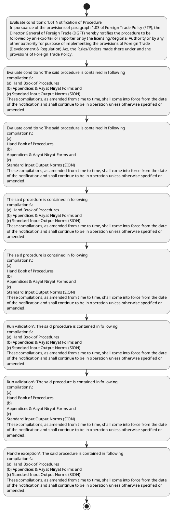

# Chapter 1 / Section 1.01: Notification of Procedure

**Chapter Title:** Legal Framework and Trade Facilitation

**Pages:** 2

**Purpose:** 1.01 Notification of Procedure
In pursuance of the provisions of paragraph 1.03 of Foreign Trade Policy (FTP), the
Director General of Foreign Trade (DGFT) hereby notifies the procedure to be
followed by an exporter or importer or by the licensing/Regional Authority or by any
other authority for purpose of implementing the provisions of Foreign Trade
(Development & Regulation) Act, the Rules/Orders made there under and the
provisions of Foreign Trade Policy.

**Purpose Thanglish:** Indha Notification of Procedure section-la, 1.01 Notification of Procedure
In pursuance of the provisions of paragraph 1.03 of Foreign Trade Policy (FTP), the
Director General of Foreign Trade (DGFT) hereby notifies the procedure to be
followed by an exporter or importer or by the licensing/Regional authority or by any
other authority for purpose of implementing the provisions of Foreign Trade
(Development & Regulation) Act, the Rules/Orders made there under and the
provisions of Foreign Trade Policy.

**Summary:** 1.01 Notification of Procedure
In pursuance of the provisions of paragraph 1.03 of Foreign Trade Policy (FTP), the
Director General of Foreign Trade (DGFT) hereby notifies the procedure to be
followed by an exporter or importer or by the licensing/Regional Authority or by any
other authority for purpose of implementing the provisions of Foreign Trade
(Development & Regulation) Act, the Rules/Orders made there under and the
provisions of Foreign Trade Policy. The said procedure is contained in following
compilations:
(a) Hand Book of Procedures
(b) Appendices & Aayat Niryat Forms and
(c) Standard Input Output Norms (SION)
These compilations, as amended from time to time, shall come into force from the date
of the notification and shall continue to be in operation unless otherwise specified or
amended. 1.01 Notification of Procedure
In pursuance of the provisions of paragraph 1.03 of Foreign Trade Policy (FTP), the
Director General of Foreign Trade (DGFT) hereby notifies the procedure to be
followed by an exporter or importer or by the licensing/Regional Authority or by any
other authority for purpose of implementing the provisions of Foreign Trade
(Development & Regulation) Act, the Rules/Orders made there under and the
provisions of Foreign Trade Policy.

**Business Meaning:** Notification of Procedure governs how DGFT business controls should be applied, validated, and enforced.

**Business Explanation:** Notification of Procedure explains the operating rule set that DEKAI should enforce. Key control points include The said procedure is contained in following
compilations:
(a) Hand Book of Procedures
(b) Appendices & Aayat Niryat Forms and
(c) Standard Input Output Norms (SION)
These compilations, as amended from time to time, shall come into force from the date
of the notification and shall continue to be in operation unless otherwise specified or
amended. The section also drives actions such as The said procedure is contained in following
compilations:
(a) Hand Book of Procedures
(b) Appendices & Aayat Niryat Forms and
(c) Standard Input Output Norms (SION)
These compilations, as amended from time to time, shall come into force from the date
of the notification and shall continue to be in operation unless otherwise specified or
amended..

**Business Explanation Thanglish:** Indha Notification of Procedure section-la, Notification of Procedure explains the operating rule set that DEKAI should enforce. Key control points include The said procedure is contained in following
compilations:
(a) Hand Book of Procedures
(b) Appendices & Aayat Niryat Forms and
(c) Standard Input Output Norms (SION)
These compilations, as amended from time to time, kandippa come into force from the date
of the notification and kandippa continue to be in operation unless otherwise specified or
amended. The section also drives actions such as The said procedure is contained in following
compilations:
(a) Hand Book of Procedures
(b) Appendices & Aayat Niryat Forms and
(c) Standard Input Output Norms (SION)
These compilations, as amended from time to time, kandippa come into force from the date
of the notification and kandippa continue to be in operation unless otherwise specified or
amended..

## Business Logic
- The said procedure is contained in following
compilations:
(a) Hand Book of Procedures
(b) Appendices & Aayat Niryat Forms and
(c) Standard Input Output Norms (SION)
These compilations, as amended from time to time, shall come into force from the date
of the notification and shall continue to be in operation unless otherwise specified or
amended.
- The said procedure is contained in following
compilations:
(a)
Hand Book of Procedures
(b)
Appendices & Aayat Niryat Forms and
(c)
Standard Input Output Norms (SION)
These compilations, as amended from time to time, shall come into force from the date
of the notification and shall continue to be in operation unless otherwise specified or
amended.

## Business Rules
- rule_id=CH1-SEC1_01-R001, rule_description=The said procedure is contained in following
compilations:
(a) Hand Book of Procedures
(b) Appendices & Aayat Niryat Forms and
(c) Standard Input Output Norms (SION)
These compilations, as amended from time to time, shall come into force from the date
of the notification and shall continue to be in operation unless otherwise specified or
amended., trigger=Notification of Procedure, condition=1.01 Notification of Procedure
In pursuance of the provisions of paragraph 1.03 of Foreign Trade Policy (FTP), the
Director General of Foreign Trade (DGFT) hereby notifies the procedure to be
followed by an exporter or importer or by the licensing/Regional Authority or by any
other authority for purpose of implementing the provisions of Foreign Trade
(Development & Regulation) Act, the Rules/Orders made there under and the
provisions of Foreign Trade Policy., validation=The said procedure is contained in following
compilations:
(a) Hand Book of Procedures
(b) Appendices & Aayat Niryat Forms and
(c) Standard Input Output Norms (SION)
These compilations, as amended from time to time, shall come into force from the date
of the notification and shall continue to be in operation unless otherwise specified or
amended., action=The said procedure is contained in following
compilations:
(a) Hand Book of Procedures
(b) Appendices & Aayat Niryat Forms and
(c) Standard Input Output Norms (SION)
These compilations, as amended from time to time, shall come into force from the date
of the notification and shall continue to be in operation unless otherwise specified or
amended., exception=The said procedure is contained in following
compilations:
(a) Hand Book of Procedures
(b) Appendices & Aayat Niryat Forms and
(c) Standard Input Output Norms (SION)
These compilations, as amended from time to time, shall come into force from the date
of the notification and shall continue to be in operation unless otherwise specified or
amended., output=DEKAI should produce a compliance decision for 1.01 - Notification of Procedure.
- rule_id=CH1-SEC1_01-R002, rule_description=The said procedure is contained in following
compilations:
(a)
Hand Book of Procedures
(b)
Appendices & Aayat Niryat Forms and
(c)
Standard Input Output Norms (SION)
These compilations, as amended from time to time, shall come into force from the date
of the notification and shall continue to be in operation unless otherwise specified or
amended., trigger=Notification of Procedure, condition=The said procedure is contained in following
compilations:
(a) Hand Book of Procedures
(b) Appendices & Aayat Niryat Forms and
(c) Standard Input Output Norms (SION)
These compilations, as amended from time to time, shall come into force from the date
of the notification and shall continue to be in operation unless otherwise specified or
amended., validation=The said procedure is contained in following
compilations:
(a)
Hand Book of Procedures
(b)
Appendices & Aayat Niryat Forms and
(c)
Standard Input Output Norms (SION)
These compilations, as amended from time to time, shall come into force from the date
of the notification and shall continue to be in operation unless otherwise specified or
amended., action=The said procedure is contained in following
compilations:
(a)
Hand Book of Procedures
(b)
Appendices & Aayat Niryat Forms and
(c)
Standard Input Output Norms (SION)
These compilations, as amended from time to time, shall come into force from the date
of the notification and shall continue to be in operation unless otherwise specified or
amended., exception=The said procedure is contained in following
compilations:
(a)
Hand Book of Procedures
(b)
Appendices & Aayat Niryat Forms and
(c)
Standard Input Output Norms (SION)
These compilations, as amended from time to time, shall come into force from the date
of the notification and shall continue to be in operation unless otherwise specified or
amended., output=DEKAI should produce a compliance decision for 1.01 - Notification of Procedure.

## Conditions
- 1.01 Notification of Procedure
In pursuance of the provisions of paragraph 1.03 of Foreign Trade Policy (FTP), the
Director General of Foreign Trade (DGFT) hereby notifies the procedure to be
followed by an exporter or importer or by the licensing/Regional Authority or by any
other authority for purpose of implementing the provisions of Foreign Trade
(Development & Regulation) Act, the Rules/Orders made there under and the
provisions of Foreign Trade Policy.
- The said procedure is contained in following
compilations:
(a) Hand Book of Procedures
(b) Appendices & Aayat Niryat Forms and
(c) Standard Input Output Norms (SION)
These compilations, as amended from time to time, shall come into force from the date
of the notification and shall continue to be in operation unless otherwise specified or
amended.
- The said procedure is contained in following
compilations:
(a)
Hand Book of Procedures
(b)
Appendices & Aayat Niryat Forms and
(c)
Standard Input Output Norms (SION)
These compilations, as amended from time to time, shall come into force from the date
of the notification and shall continue to be in operation unless otherwise specified or
amended.

## Condition Logic
- id=1.1.01.1, if=1.01 Notification of Procedure
In pursuance of the provisions of paragraph 1.03 of Foreign Trade Policy (FTP), the
Director General of Foreign Trade (DGFT) hereby notifies the procedure to be
followed by an exporter or importer or by the licensing/Regional Authority or by any
other authority for purpose of implementing the provisions of Foreign Trade
(Development & Regulation) Act, the Rules/Orders made there under and the
provisions of Foreign Trade Policy., then=The said procedure is contained in following
compilations:
(a) Hand Book of Procedures
(b) Appendices & Aayat Niryat Forms and
(c) Standard Input Output Norms (SION)
These compilations, as amended from time to time, shall come into force from the date
of the notification and shall continue to be in operation unless otherwise specified or
amended., source=1.01 Notification of Procedure
In pursuance of the provisions of paragraph 1.03 of Foreign Trade Policy (FTP), the
Director General of Foreign Trade (DGFT) hereby notifies the procedure to be
followed by an exporter or importer or by the licensing/Regional Authority or by any
other authority for purpose of implementing the provisions of Foreign Trade
(Development & Regulation) Act, the Rules/Orders made there under and the
provisions of Foreign Trade Policy.
- id=1.1.01.2, if=The said procedure is contained in following
compilations:
(a) Hand Book of Procedures
(b) Appendices & Aayat Niryat Forms and
(c) Standard Input Output Norms (SION)
These compilations, as amended from time to time, shall come into force from the date
of the notification and shall continue to be in operation unless otherwise specified or
amended., then=The said procedure is contained in following
compilations:
(a) Hand Book of Procedures
(b) Appendices & Aayat Niryat Forms and
(c) Standard Input Output Norms (SION)
These compilations, as amended from time to time, shall come into force from the date
of the notification and shall continue to be in operation unless otherwise specified or
amended., source=The said procedure is contained in following
compilations:
(a) Hand Book of Procedures
(b) Appendices & Aayat Niryat Forms and
(c) Standard Input Output Norms (SION)
These compilations, as amended from time to time, shall come into force from the date
of the notification and shall continue to be in operation unless otherwise specified or
amended.
- id=1.1.01.3, if=The said procedure is contained in following
compilations:
(a)
Hand Book of Procedures
(b)
Appendices & Aayat Niryat Forms and
(c)
Standard Input Output Norms (SION)
These compilations, as amended from time to time, shall come into force from the date
of the notification and shall continue to be in operation unless otherwise specified or
amended., then=The said procedure is contained in following
compilations:
(a) Hand Book of Procedures
(b) Appendices & Aayat Niryat Forms and
(c) Standard Input Output Norms (SION)
These compilations, as amended from time to time, shall come into force from the date
of the notification and shall continue to be in operation unless otherwise specified or
amended., source=The said procedure is contained in following
compilations:
(a)
Hand Book of Procedures
(b)
Appendices & Aayat Niryat Forms and
(c)
Standard Input Output Norms (SION)
These compilations, as amended from time to time, shall come into force from the date
of the notification and shall continue to be in operation unless otherwise specified or
amended.

## Validations
- The said procedure is contained in following
compilations:
(a) Hand Book of Procedures
(b) Appendices & Aayat Niryat Forms and
(c) Standard Input Output Norms (SION)
These compilations, as amended from time to time, shall come into force from the date
of the notification and shall continue to be in operation unless otherwise specified or
amended.
- The said procedure is contained in following
compilations:
(a)
Hand Book of Procedures
(b)
Appendices & Aayat Niryat Forms and
(c)
Standard Input Output Norms (SION)
These compilations, as amended from time to time, shall come into force from the date
of the notification and shall continue to be in operation unless otherwise specified or
amended.

## Exceptions
- The said procedure is contained in following
compilations:
(a) Hand Book of Procedures
(b) Appendices & Aayat Niryat Forms and
(c) Standard Input Output Norms (SION)
These compilations, as amended from time to time, shall come into force from the date
of the notification and shall continue to be in operation unless otherwise specified or
amended.
- The said procedure is contained in following
compilations:
(a)
Hand Book of Procedures
(b)
Appendices & Aayat Niryat Forms and
(c)
Standard Input Output Norms (SION)
These compilations, as amended from time to time, shall come into force from the date
of the notification and shall continue to be in operation unless otherwise specified or
amended.

## Dependencies
- 1.03

## Authorities
- DGFT
- Regional Authority
- Director General of Foreign Trade (DGFT

## Required Documents
- None identified

## Timelines
- None identified

## Actions
- The said procedure is contained in following
compilations:
(a) Hand Book of Procedures
(b) Appendices & Aayat Niryat Forms and
(c) Standard Input Output Norms (SION)
These compilations, as amended from time to time, shall come into force from the date
of the notification and shall continue to be in operation unless otherwise specified or
amended.
- The said procedure is contained in following
compilations:
(a)
Hand Book of Procedures
(b)
Appendices & Aayat Niryat Forms and
(c)
Standard Input Output Norms (SION)
These compilations, as amended from time to time, shall come into force from the date
of the notification and shall continue to be in operation unless otherwise specified or
amended.

## Workflow
- Evaluate condition: 1.01 Notification of Procedure
In pursuance of the provisions of paragraph 1.03 of Foreign Trade Policy (FTP), the
Director General of Foreign Trade (DGFT) hereby notifies the procedure to be
followed by an exporter or importer or by the licensing/Regional Authority or by any
other authority for purpose of implementing the provisions of Foreign Trade
(Development & Regulation) Act, the Rules/Orders made there under and the
provisions of Foreign Trade Policy.
- Evaluate condition: The said procedure is contained in following
compilations:
(a) Hand Book of Procedures
(b) Appendices & Aayat Niryat Forms and
(c) Standard Input Output Norms (SION)
These compilations, as amended from time to time, shall come into force from the date
of the notification and shall continue to be in operation unless otherwise specified or
amended.
- Evaluate condition: The said procedure is contained in following
compilations:
(a)
Hand Book of Procedures
(b)
Appendices & Aayat Niryat Forms and
(c)
Standard Input Output Norms (SION)
These compilations, as amended from time to time, shall come into force from the date
of the notification and shall continue to be in operation unless otherwise specified or
amended.
- The said procedure is contained in following
compilations:
(a) Hand Book of Procedures
(b) Appendices & Aayat Niryat Forms and
(c) Standard Input Output Norms (SION)
These compilations, as amended from time to time, shall come into force from the date
of the notification and shall continue to be in operation unless otherwise specified or
amended.
- The said procedure is contained in following
compilations:
(a)
Hand Book of Procedures
(b)
Appendices & Aayat Niryat Forms and
(c)
Standard Input Output Norms (SION)
These compilations, as amended from time to time, shall come into force from the date
of the notification and shall continue to be in operation unless otherwise specified or
amended.
- Run validation: The said procedure is contained in following
compilations:
(a) Hand Book of Procedures
(b) Appendices & Aayat Niryat Forms and
(c) Standard Input Output Norms (SION)
These compilations, as amended from time to time, shall come into force from the date
of the notification and shall continue to be in operation unless otherwise specified or
amended.
- Run validation: The said procedure is contained in following
compilations:
(a)
Hand Book of Procedures
(b)
Appendices & Aayat Niryat Forms and
(c)
Standard Input Output Norms (SION)
These compilations, as amended from time to time, shall come into force from the date
of the notification and shall continue to be in operation unless otherwise specified or
amended.
- Handle exception: The said procedure is contained in following
compilations:
(a) Hand Book of Procedures
(b) Appendices & Aayat Niryat Forms and
(c) Standard Input Output Norms (SION)
These compilations, as amended from time to time, shall come into force from the date
of the notification and shall continue to be in operation unless otherwise specified or
amended.

## Workflow ASCII
```text
Notification of Procedure
Evaluate condition: 1.01 Notification of Procedure
In pursuance of the provisions of paragraph 1.03 of Foreign Trade Policy (FTP), the
Director General of Foreign Trade (DGFT) hereby notifies the procedure to be
followed by an exporter or importer or by the licensing/Regional Authority or by any
other authority for purpose of implementing the provisions of Foreign Trade
(Development & Regulation) Act, the Rules/Orders made there under and the
provisions of Foreign Trade Policy.
   |
   v
Evaluate condition: The said procedure is contained in following
compilations:
(a) Hand Book of Procedures
(b) Appendices & Aayat Niryat Forms and
(c) Standard Input Output Norms (SION)
These compilations, as amended from time to time, shall come into force from the date
of the notification and shall continue to be in operation unless otherwise specified or
amended.
   |
   v
Evaluate condition: The said procedure is contained in following
compilations:
(a)
Hand Book of Procedures
(b)
Appendices & Aayat Niryat Forms and
(c)
Standard Input Output Norms (SION)
These compilations, as amended from time to time, shall come into force from the date
of the notification and shall continue to be in operation unless otherwise specified or
amended.
   |
   v
The said procedure is contained in following
compilations:
(a) Hand Book of Procedures
(b) Appendices & Aayat Niryat Forms and
(c) Standard Input Output Norms (SION)
These compilations, as amended from time to time, shall come into force from the date
of the notification and shall continue to be in operation unless otherwise specified or
amended.
   |
   v
The said procedure is contained in following
compilations:
(a)
Hand Book of Procedures
(b)
Appendices & Aayat Niryat Forms and
(c)
Standard Input Output Norms (SION)
These compilations, as amended from time to time, shall come into force from the date
of the notification and shall continue to be in operation unless otherwise specified or
amended.
   |
   v
Run validation: The said procedure is contained in following
compilations:
(a) Hand Book of Procedures
(b) Appendices & Aayat Niryat Forms and
(c) Standard Input Output Norms (SION)
These compilations, as amended from time to time, shall come into force from the date
of the notification and shall continue to be in operation unless otherwise specified or
amended.
   |
   v
Run validation: The said procedure is contained in following
compilations:
(a)
Hand Book of Procedures
(b)
Appendices & Aayat Niryat Forms and
(c)
Standard Input Output Norms (SION)
These compilations, as amended from time to time, shall come into force from the date
of the notification and shall continue to be in operation unless otherwise specified or
amended.
   |
   v
Handle exception: The said procedure is contained in following
compilations:
(a) Hand Book of Procedures
(b) Appendices & Aayat Niryat Forms and
(c) Standard Input Output Norms (SION)
These compilations, as amended from time to time, shall come into force from the date
of the notification and shall continue to be in operation unless otherwise specified or
amended.
```

## Decision Tree
- IF 1.01 Notification of Procedure
In pursuance of the provisions of paragraph 1.03 of Foreign Trade Policy (FTP), the
Director General of Foreign Trade (DGFT) hereby notifies the procedure to be
followed by an exporter or importer or by the licensing/Regional Authority or by any
other authority for purpose of implementing the provisions of Foreign Trade
(Development & Regulation) Act, the Rules/Orders made there under and the
provisions of Foreign Trade Policy. THEN The said procedure is contained in following
compilations:
(a) Hand Book of Procedures
(b) Appendices & Aayat Niryat Forms and
(c) Standard Input Output Norms (SION)
These compilations, as amended from time to time, shall come into force from the date
of the notification and shall continue to be in operation unless otherwise specified or
amended.
- IF The said procedure is contained in following
compilations:
(a) Hand Book of Procedures
(b) Appendices & Aayat Niryat Forms and
(c) Standard Input Output Norms (SION)
These compilations, as amended from time to time, shall come into force from the date
of the notification and shall continue to be in operation unless otherwise specified or
amended. THEN The said procedure is contained in following
compilations:
(a) Hand Book of Procedures
(b) Appendices & Aayat Niryat Forms and
(c) Standard Input Output Norms (SION)
These compilations, as amended from time to time, shall come into force from the date
of the notification and shall continue to be in operation unless otherwise specified or
amended.
- IF The said procedure is contained in following
compilations:
(a)
Hand Book of Procedures
(b)
Appendices & Aayat Niryat Forms and
(c)
Standard Input Output Norms (SION)
These compilations, as amended from time to time, shall come into force from the date
of the notification and shall continue to be in operation unless otherwise specified or
amended. THEN The said procedure is contained in following
compilations:
(a) Hand Book of Procedures
(b) Appendices & Aayat Niryat Forms and
(c) Standard Input Output Norms (SION)
These compilations, as amended from time to time, shall come into force from the date
of the notification and shall continue to be in operation unless otherwise specified or
amended.
- IF exception applies (The said procedure is contained in following
compilations:
(a) Hand Book of Procedures
(b) Appendices & Aayat Niryat Forms and
(c) Standard Input Output Norms (SION)
These compilations, as amended from time to time, shall come into force from the date
of the notification and shall continue to be in operation unless otherwise specified or
amended.) THEN route to manual review
- IF exception applies (The said procedure is contained in following
compilations:
(a)
Hand Book of Procedures
(b)
Appendices & Aayat Niryat Forms and
(c)
Standard Input Output Norms (SION)
These compilations, as amended from time to time, shall come into force from the date
of the notification and shall continue to be in operation unless otherwise specified or
amended.) THEN route to manual review

## Decision Tree ASCII
```text
Notification of Procedure Decision
IF 1.01 Notification of Procedure
In pursuance of the provisions of paragraph 1.03 of Foreign Trade Policy (FTP), the
Director General of Foreign Trade (DGFT) hereby notifies the procedure to be
followed by an exporter or importer or by the licensing/Regional Authority or by any
other authority for purpose of implementing the provisions of Foreign Trade
(Development & Regulation) Act, the Rules/Orders made there under and the
provisions of Foreign Trade Policy. THEN The said procedure is contained in following
compilations:
(a) Hand Book of Procedures
(b) Appendices & Aayat Niryat Forms and
(c) Standard Input Output Norms (SION)
These compilations, as amended from time to time, shall come into force from the date
of the notification and shall continue to be in operation unless otherwise specified or
amended.
   |
   v
IF The said procedure is contained in following
compilations:
(a) Hand Book of Procedures
(b) Appendices & Aayat Niryat Forms and
(c) Standard Input Output Norms (SION)
These compilations, as amended from time to time, shall come into force from the date
of the notification and shall continue to be in operation unless otherwise specified or
amended. THEN The said procedure is contained in following
compilations:
(a) Hand Book of Procedures
(b) Appendices & Aayat Niryat Forms and
(c) Standard Input Output Norms (SION)
These compilations, as amended from time to time, shall come into force from the date
of the notification and shall continue to be in operation unless otherwise specified or
amended.
   |
   v
IF The said procedure is contained in following
compilations:
(a)
Hand Book of Procedures
(b)
Appendices & Aayat Niryat Forms and
(c)
Standard Input Output Norms (SION)
These compilations, as amended from time to time, shall come into force from the date
of the notification and shall continue to be in operation unless otherwise specified or
amended. THEN The said procedure is contained in following
compilations:
(a) Hand Book of Procedures
(b) Appendices & Aayat Niryat Forms and
(c) Standard Input Output Norms (SION)
These compilations, as amended from time to time, shall come into force from the date
of the notification and shall continue to be in operation unless otherwise specified or
amended.
   |
   v
IF exception applies (The said procedure is contained in following
compilations:
(a) Hand Book of Procedures
(b) Appendices & Aayat Niryat Forms and
(c) Standard Input Output Norms (SION)
These compilations, as amended from time to time, shall come into force from the date
of the notification and shall continue to be in operation unless otherwise specified or
amended.) THEN route to manual review
   |
   v
IF exception applies (The said procedure is contained in following
compilations:
(a)
Hand Book of Procedures
(b)
Appendices & Aayat Niryat Forms and
(c)
Standard Input Output Norms (SION)
These compilations, as amended from time to time, shall come into force from the date
of the notification and shall continue to be in operation unless otherwise specified or
amended.) THEN route to manual review
```

## Examples
- User asks to process Notification of Procedure; the platform checks conditions, validations, and documents before action.

**Real-world Example:** Example: an importer or exporter invokes Notification of Procedure, submits the prescribed DGFT records, and DEKAI uses the extracted rules to the said procedure is contained in following
compilations:
(a) hand book of procedures
(b) appendices & aayat niryat forms and
(c) standard input output norms (sion)
these compilations, as amended from time to time, shall come into force from the date
of the notification and shall continue to be in operation unless otherwise specified or
amended..

**Real-world Example Thanglish:** Indha Notification of Procedure section-la, Example: an importer or exporter invokes Notification of Procedure, submits the prescribed DGFT records, and DEKAI uses the extracted rules to the said procedure is contained in following
compilations:
(a) hand book of procedures
(b) appendices & aayat niryat forms and
(c) standard input output norms (sion)
these compilations, as amended from time to time, kandippa come into force from the date
of the notification and kandippa continue to be in operation unless otherwise specified or
amended..

## AI Rules
- IF detected context matches section rule THEN enforce: The said procedure is contained in following
compilations:
(a) Hand Book of Procedures
(b) Appendices & Aayat Niryat Forms and
(c) Standard Input Output Norms (SION)
These compilations, as amended from time to time, shall come into force from the date
of the notification and shall continue to be in operation unless otherwise specified or
amended.
- IF detected context matches section rule THEN enforce: The said procedure is contained in following
compilations:
(a)
Hand Book of Procedures
(b)
Appendices & Aayat Niryat Forms and
(c)
Standard Input Output Norms (SION)
These compilations, as amended from time to time, shall come into force from the date
of the notification and shall continue to be in operation unless otherwise specified or
amended.
- IF validations pass THEN recommend action: The said procedure is contained in following
compilations:
(a) Hand Book of Procedures
(b) Appendices & Aayat Niryat Forms and
(c) Standard Input Output Norms (SION)
These compilations, as amended from time to time, shall come into force from the date
of the notification and shall continue to be in operation unless otherwise specified or
amended.

## Database Fields
- name=section_code, type=string, required=True, source=parsed_section_heading
- name=section_title, type=string, required=True, source=parsed_section_heading
- name=the_flag, type=boolean, required=False, source=keyword:the
- name=ftp_flag, type=boolean, required=False, source=keyword:FTP
- name=any_flag, type=boolean, required=False, source=keyword:any
- name=for_flag, type=boolean, required=False, source=keyword:for
- name=act_flag, type=boolean, required=False, source=keyword:Act
- name=and_flag, type=boolean, required=False, source=keyword:and
- name=dgft_flag, type=boolean, required=False, source=keyword:DGFT
- name=made_flag, type=boolean, required=False, source=keyword:made

## API Requirements
- method=GET, path=/api/dgft/sections/1.01, purpose=Retrieve knowledge payload for section 1.01, query_params=['include=workflow,decision_tree,validations'], response_fields=['section', 'title', 'summary', 'conditions', 'validations', 'exceptions', 'workflow', 'decision_tree']
- method=POST, path=/api/dgft/Notification-of-Procedure/validate, purpose=Validate inputs and documents for Notification of Procedure, request_fields=['section_code', 'section_title'], response_fields=['status', 'errors', 'warnings', 'next_actions']
- method=POST, path=/api/dgft/Notification-of-Procedure/execute, purpose=Trigger business action for The said procedure is contained in following
compilations:
(a) Hand Book of Procedures
(b) Appendices & Aayat Niryat Forms and
(c) Standard Input Output Norms (SION)
These compilations, as amended from time to time, shall come into force from the date
of the notification and shall continue to be in operation unless otherwise specified or
amended., request_fields=['section_code', 'section_title'], response_fields=['reference_id', 'status', 'authority', 'timeline']

## UI Screens
- screen_id=Notification_of_Procedure_overview, name=Notification of Procedure Overview, purpose=Show section summary, authority, timeline, and eligibility cues., widgets=['summary_card', 'conditions_table', 'authority_badges', 'timeline_panel']
- screen_id=Notification_of_Procedure_submission, name=Notification of Procedure Submission, purpose=Capture applicant data and supporting documents., widgets=['dynamic_form', 'document_uploader', 'validation_panel', 'next_action_footer'], fields=['section_code', 'section_title', 'the_flag', 'ftp_flag', 'any_flag', 'for_flag', 'act_flag', 'and_flag']
- screen_id=Notification_of_Procedure_exceptions, name=Notification of Procedure Exception Review, purpose=Explain exception handling and manual review triggers., widgets=['exception_banner', 'decision_tree', 'case_notes']

## Error Messages
- Validation failed because the section requirements were not fully met.

## FAQ
- question_en=What is the purpose of section 1.01?, answer_en=Notification of Procedure explains the operating rule set that DEKAI should enforce. Key control points include The said procedure is contained in following
compilations:
(a) Hand Book of Procedures
(b) Appendices & Aayat Niryat Forms and
(c) Standard Input Output Norms (SION)
These compilations, as amended from time to time, shall come into force from the date
of the notification and shall continue to be in operation unless otherwise specified or
amended. The section also drives actions such as The said procedure is contained in following
compilations:
(a) Hand Book of Procedures
(b) Appendices & Aayat Niryat Forms and
(c) Standard Input Output Norms (SION)
These compilations, as amended from time to time, shall come into force from the date
of the notification and shall continue to be in operation unless otherwise specified or
amended.., question_thanglish=Indha Notification of Procedure section-la, What is the purpose of section 1.01?, answer_thanglish=Indha Notification of Procedure section-la, Notification of Procedure explains the operating rule set that DEKAI should enforce. Key control points include The said procedure is contained in following
compilations:
(a) Hand Book of Procedures
(b) Appendices & Aayat Niryat Forms and
(c) Standard Input Output Norms (SION)
These compilations, as amended from time to time, kandippa come into force from the date
of the notification and kandippa continue to be in operation unless otherwise specified or
amended. The section also drives actions such as The said procedure is contained in following
compilations:
(a) Hand Book of Procedures
(b) Appendices & Aayat Niryat Forms and
(c) Standard Input Output Norms (SION)
These compilations, as amended from time to time, kandippa come into force from the date
of the notification and kandippa continue to be in operation unless otherwise specified or
amended..
- question_en=What documents are required under Notification of Procedure?, answer_en=Not explicitly covered in uploaded documents., question_thanglish=Indha Notification of Procedure section-la, What documents are required under Notification of Procedure?, answer_thanglish=Indha Notification of Procedure section-la, Not explicitly covered in uploaded documents.
- question_en=Which authority handles Notification of Procedure?, answer_en=DGFT, Regional Authority, Director General of Foreign Trade (DGFT, question_thanglish=Indha Notification of Procedure section-la, Which authority handles Notification of Procedure?, answer_thanglish=Indha Notification of Procedure section-la, DGFT, Regional authority, Director General of Foreign Trade (DGFT

## Questions Users May Ask
- What does Notification of Procedure require?
- Which documents are needed for Notification of Procedure?
- How does DEKAI validate Notification of Procedure requests?
- What action should be taken for Notification of Procedure?

## Expected AI Answers
- Notification of Procedure requires the platform to interpret the section text, apply the extracted business rules, and present the correct next action.
- Required documents are inferred from the section text: no explicit documents were detected.
- DEKAI validates Notification of Procedure by checking conditions, required documents, authority references, and exception clauses before recommending an outcome.
- The primary extracted action is: The said procedure is contained in following
compilations:
(a) Hand Book of Procedures
(b) Appendices & Aayat Niryat Forms and
(c) Standard Input Output Norms (SION)
These compilations, as amended from time to time, shall come into force from the date
of the notification and shall continue to be in operation unless otherwise specified or
amended.

## AI Q&A Examples
- question_en=User asks: How do I comply with Notification of Procedure?, answer_en=AI answers: DEKAI should evaluate section 1.01, apply the extracted rules, and guide the user through Evaluate condition: 1.01 Notification of Procedure
In pursuance of the provisions of paragraph 1.03 of Foreign Trade Policy (FTP), the
Director General of Foreign Trade (DGFT) hereby notifies the procedure to be
followed by an exporter or importer or by the licensing/Regional Authority or by any
other authority for purpose of implementing the provisions of Foreign Trade
(Development & Regulation) Act, the Rules/Orders made there under and the
provisions of Foreign Trade Policy.., question_thanglish=Indha Notification of Procedure section-la, User asks: How do I comply with Notification of Procedure?, answer_thanglish=Indha Notification of Procedure section-la, AI answers: DEKAI should evaluate section 1.01, apply the extracted rules, and guide the user through Evaluate condition: 1.01 Notification of Procedure
In pursuance of the provisions of paragraph 1.03 of Foreign Trade Policy (FTP), the
Director General of Foreign Trade (DGFT) hereby notifies the procedure to be
followed by an exporter or importer or by the licensing/Regional authority or by any
other authority for purpose of implementing the provisions of Foreign Trade
(Development & Regulation) Act, the Rules/Orders made there under and the
provisions of Foreign Trade Policy..
- question_en=User asks: Which validations apply to Notification of Procedure?, answer_en=AI answers: Applicable validations are The said procedure is contained in following
compilations:
(a) Hand Book of Procedures
(b) Appendices & Aayat Niryat Forms and
(c) Standard Input Output Norms (SION)
These compilations, as amended from time to time, shall come into force from the date
of the notification and shall continue to be in operation unless otherwise specified or
amended., The said procedure is contained in following
compilations:
(a)
Hand Book of Procedures
(b)
Appendices & Aayat Niryat Forms and
(c)
Standard Input Output Norms (SION)
These compilations, as amended from time to time, shall come into force from the date
of the notification and shall continue to be in operation unless otherwise specified or
amended., question_thanglish=Indha Notification of Procedure section-la, User asks: Which validations apply to Notification of Procedure?, answer_thanglish=Indha Notification of Procedure section-la, AI answers: Applicable validations are The said procedure is contained in following
compilations:
(a) Hand Book of Procedures
(b) Appendices & Aayat Niryat Forms and
(c) Standard Input Output Norms (SION)
These compilations, as amended from time to time, kandippa come into force from the date
of the notification and kandippa continue to be in operation unless otherwise specified or
amended., The said procedure is contained in following
compilations:
(a)
Hand Book of Procedures
(b)
Appendices & Aayat Niryat Forms and
(c)
Standard Input Output Norms (SION)
These compilations, as amended from time to time, kandippa come into force from the date
of the notification and kandippa continue to be in operation unless otherwise specified or
amended.

## DEKAI AI Implementation Notes
- Capture chapter 1, section 1.01, title, and page references as immutable knowledge metadata.
- Bind validations for Notification of Procedure into a rule engine keyed by the rule IDs extracted for this section.
- Route escalations or approvals to: DGFT, Regional Authority, Director General of Foreign Trade (DGFT.
- Trigger manual review when exception clauses are detected.
- Show contextual links to related sections: 1.03.

## DEKAI AI Implementation Notes Thanglish
- Indha Notification of Procedure section-la, Capture chapter 1, section 1.01, title, and page references as immutable knowledge metadata.
- Indha Notification of Procedure section-la, Bind validations for Notification of Procedure into a rule engine keyed by the rule IDs extracted for this section.
- Indha Notification of Procedure section-la, Route escalations or approvals to: DGFT, Regional authority, Director General of Foreign Trade (DGFT.
- Indha Notification of Procedure section-la, Trigger manual review when exception clauses are detected.
- Indha Notification of Procedure section-la, Show contextual links to related sections: 1.03.

## AI Metadata
- Keywords: the, FTP, any, for, Act, and, DGFT, made, said, Hand, Book, SION, from, time, come, into, date, Trade, other, there
- Search Keywords: the, FTP, any, for, Act, and, DGFT, made, said, Hand, Book, SION, from, time, come, into, date, Trade, other, there
- Intent: Support Notification of Procedure processing and compliance validation.
- Tags: 1.01, Notification of Procedure, business-rule, dgft
- Related Sections: 1.03
- Related Chapters: 
- Related Rules: The said procedure is contained in following
compilations:
(a) Hand Book of Procedures
(b) Appendices & Aayat Niryat Forms and
(c) Standard Input Output Norms (SION)
These compilations, as amended from time to time, shall come into force from the date
of the notification and shall continue to be in operation unless otherwise specified or
amended., The said procedure is contained in following
compilations:
(a)
Hand Book of Procedures
(b)
Appendices & Aayat Niryat Forms and
(c)
Standard Input Output Norms (SION)
These compilations, as amended from time to time, shall come into force from the date
of the notification and shall continue to be in operation unless otherwise specified or
amended.

## Mermaid

```mermaid
flowchart TD
    S1["Evaluate condition: 1.01 Notification of Procedure
In pursuance of the provisions of paragraph 1.03 of Foreign Trade Policy (FTP), the
Director General of Foreign Trade (DGFT) hereby notifies the procedure to be
followed by an exporter or importer or by the licensing/Regional Authority or by any
other authority for purpose of implementing the provisions of Foreign Trade
(Development & Regulation) Act, the Rules/Orders made there under and the
provisions of Foreign Trade Policy."]
    S2["Evaluate condition: The said procedure is contained in following
compilations:
(a) Hand Book of Procedures
(b) Appendices & Aayat Niryat Forms and
(c) Standard Input Output Norms (SION)
These compilations, as amended from time to time, shall come into force from the date
of the notification and shall continue to be in operation unless otherwise specified or
amended."]
    S1 --> S2
    S3["Evaluate condition: The said procedure is contained in following
compilations:
(a)
Hand Book of Procedures
(b)
Appendices & Aayat Niryat Forms and
(c)
Standard Input Output Norms (SION)
These compilations, as amended from time to time, shall come into force from the date
of the notification and shall continue to be in operation unless otherwise specified or
amended."]
    S2 --> S3
    S4["The said procedure is contained in following
compilations:
(a) Hand Book of Procedures
(b) Appendices & Aayat Niryat Forms and
(c) Standard Input Output Norms (SION)
These compilations, as amended from time to time, shall come into force from the date
of the notification and shall continue to be in operation unless otherwise specified or
amended."]
    S3 --> S4
    S5["The said procedure is contained in following
compilations:
(a)
Hand Book of Procedures
(b)
Appendices & Aayat Niryat Forms and
(c)
Standard Input Output Norms (SION)
These compilations, as amended from time to time, shall come into force from the date
of the notification and shall continue to be in operation unless otherwise specified or
amended."]
    S4 --> S5
    S6["Run validation: The said procedure is contained in following
compilations:
(a) Hand Book of Procedures
(b) Appendices & Aayat Niryat Forms and
(c) Standard Input Output Norms (SION)
These compilations, as amended from time to time, shall come into force from the date
of the notification and shall continue to be in operation unless otherwise specified or
amended."]
    S5 --> S6
    S7["Run validation: The said procedure is contained in following
compilations:
(a)
Hand Book of Procedures
(b)
Appendices & Aayat Niryat Forms and
(c)
Standard Input Output Norms (SION)
These compilations, as amended from time to time, shall come into force from the date
of the notification and shall continue to be in operation unless otherwise specified or
amended."]
    S6 --> S7
    S8["Handle exception: The said procedure is contained in following
compilations:
(a) Hand Book of Procedures
(b) Appendices & Aayat Niryat Forms and
(c) Standard Input Output Norms (SION)
These compilations, as amended from time to time, shall come into force from the date
of the notification and shall continue to be in operation unless otherwise specified or
amended."]
    S7 --> S8
```


## PlantUML

