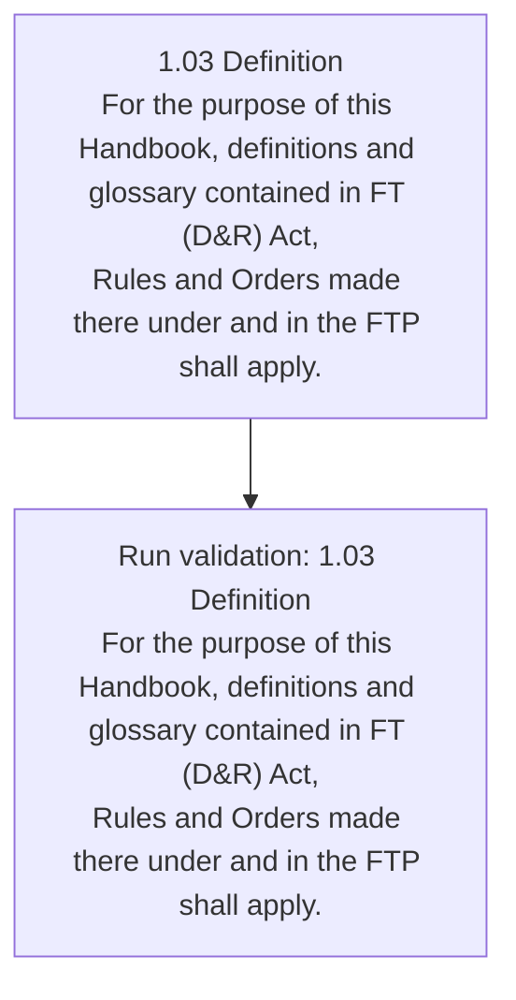
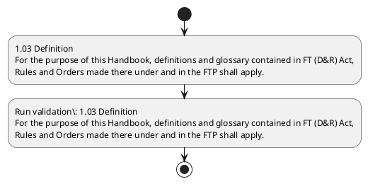

# Chapter 1 / Section 1.03: Definition

**Chapter Title:** Legal Framework and Trade Facilitation

**Pages:** 2

**Purpose:** 1.03 Definition
For the purpose of this Handbook, definitions and glossary contained in FT (D&R) Act,
Rules and Orders made there under and in the FTP shall apply.

**Purpose Thanglish:** Indha Definition section-la, 1.03 Definition
For the purpose of this Handbook, definitions and glossary contained in FT (D&R) Act,
Rules and Orders made there under and in the FTP kandippa apply.

**Summary:** 1.03 Definition
For the purpose of this Handbook, definitions and glossary contained in FT (D&R) Act,
Rules and Orders made there under and in the FTP shall apply.

**Business Meaning:** Definition governs how DGFT business controls should be applied, validated, and enforced.

**Business Explanation:** Definition explains the operating rule set that DEKAI should enforce. Key control points include 1.03 Definition
For the purpose of this Handbook, definitions and glossary contained in FT (D&R) Act,
Rules and Orders made there under and in the FTP shall apply. The section also drives actions such as 1.03 Definition
For the purpose of this Handbook, definitions and glossary contained in FT (D&R) Act,
Rules and Orders made there under and in the FTP shall apply..

**Business Explanation Thanglish:** Indha Definition section-la, Definition explains the operating rule set that DEKAI should enforce. Key control points include 1.03 Definition
For the purpose of this Handbook, definitions and glossary contained in FT (D&R) Act,
Rules and Orders made there under and in the FTP kandippa apply. The section also drives actions such as 1.03 Definition
For the purpose of this Handbook, definitions and glossary contained in FT (D&R) Act,
Rules and Orders made there under and in the FTP kandippa apply..

## Business Logic
- 1.03 Definition
For the purpose of this Handbook, definitions and glossary contained in FT (D&R) Act,
Rules and Orders made there under and in the FTP shall apply.

## Business Rules
- rule_id=CH1-SEC1_03-R001, rule_description=1.03 Definition
For the purpose of this Handbook, definitions and glossary contained in FT (D&R) Act,
Rules and Orders made there under and in the FTP shall apply., trigger=Definition, condition=Section 1.03 is applicable, validation=1.03 Definition
For the purpose of this Handbook, definitions and glossary contained in FT (D&R) Act,
Rules and Orders made there under and in the FTP shall apply., action=1.03 Definition
For the purpose of this Handbook, definitions and glossary contained in FT (D&R) Act,
Rules and Orders made there under and in the FTP shall apply., exception=No explicit exception found in uploaded documents., output=DEKAI should produce a compliance decision for 1.03 - Definition.

## Conditions
- None identified

## Condition Logic
- id=1.1.03.1, if=Section 1.03 is applicable, then=1.03 Definition
For the purpose of this Handbook, definitions and glossary contained in FT (D&R) Act,
Rules and Orders made there under and in the FTP shall apply., source=Derived from uploaded documents

## Validations
- 1.03 Definition
For the purpose of this Handbook, definitions and glossary contained in FT (D&R) Act,
Rules and Orders made there under and in the FTP shall apply.

## Exceptions
- None identified

## Dependencies
- None identified

## Authorities
- None identified

## Required Documents
- None identified

## Timelines
- None identified

## Actions
- 1.03 Definition
For the purpose of this Handbook, definitions and glossary contained in FT (D&R) Act,
Rules and Orders made there under and in the FTP shall apply.

## Workflow
- 1.03 Definition
For the purpose of this Handbook, definitions and glossary contained in FT (D&R) Act,
Rules and Orders made there under and in the FTP shall apply.
- Run validation: 1.03 Definition
For the purpose of this Handbook, definitions and glossary contained in FT (D&R) Act,
Rules and Orders made there under and in the FTP shall apply.

## Workflow ASCII
```text
Definition
1.03 Definition
For the purpose of this Handbook, definitions and glossary contained in FT (D&R) Act,
Rules and Orders made there under and in the FTP shall apply.
   |
   v
Run validation: 1.03 Definition
For the purpose of this Handbook, definitions and glossary contained in FT (D&R) Act,
Rules and Orders made there under and in the FTP shall apply.
```

## Decision Tree
- IF section 1.03 applies THEN 1.03 Definition
For the purpose of this Handbook, definitions and glossary contained in FT (D&R) Act,
Rules and Orders made there under and in the FTP shall apply.

## Decision Tree ASCII
```text
Definition Decision
IF section 1.03 applies THEN 1.03 Definition
For the purpose of this Handbook, definitions and glossary contained in FT (D&R) Act,
Rules and Orders made there under and in the FTP shall apply.
```

## Examples
- User asks to process Definition; the platform checks conditions, validations, and documents before action.

**Real-world Example:** Example: an importer or exporter invokes Definition, submits the prescribed DGFT records, and DEKAI uses the extracted rules to 1.03 definition
for the purpose of this handbook, definitions and glossary contained in ft (d&r) act,
rules and orders made there under and in the ftp shall apply..

**Real-world Example Thanglish:** Indha Definition section-la, Example: an importer or exporter invokes Definition, submits the prescribed DGFT records, and DEKAI uses the extracted rules to 1.03 definition
for the purpose of this handbook, definitions and glossary contained in ft (d&r) act,
rules and orders made there under and in the ftp kandippa apply..

## AI Rules
- IF detected context matches section rule THEN enforce: 1.03 Definition
For the purpose of this Handbook, definitions and glossary contained in FT (D&R) Act,
Rules and Orders made there under and in the FTP shall apply.
- IF validations pass THEN recommend action: 1.03 Definition
For the purpose of this Handbook, definitions and glossary contained in FT (D&R) Act,
Rules and Orders made there under and in the FTP shall apply.

## Database Fields
- name=section_code, type=string, required=True, source=parsed_section_heading
- name=section_title, type=string, required=True, source=parsed_section_heading
- name=for_flag, type=boolean, required=False, source=keyword:For
- name=the_flag, type=boolean, required=False, source=keyword:the
- name=and_flag, type=boolean, required=False, source=keyword:and
- name=d&r_flag, type=boolean, required=False, source=keyword:D&R
- name=act_flag, type=boolean, required=False, source=keyword:Act
- name=ftp_flag, type=boolean, required=False, source=keyword:FTP
- name=this_flag, type=boolean, required=False, source=keyword:this
- name=made_flag, type=boolean, required=False, source=keyword:made

## API Requirements
- method=GET, path=/api/dgft/sections/1.03, purpose=Retrieve knowledge payload for section 1.03, query_params=['include=workflow,decision_tree,validations'], response_fields=['section', 'title', 'summary', 'conditions', 'validations', 'exceptions', 'workflow', 'decision_tree']
- method=POST, path=/api/dgft/Definition/validate, purpose=Validate inputs and documents for Definition, request_fields=['section_code', 'section_title'], response_fields=['status', 'errors', 'warnings', 'next_actions']
- method=POST, path=/api/dgft/Definition/execute, purpose=Trigger business action for 1.03 Definition
For the purpose of this Handbook, definitions and glossary contained in FT (D&R) Act,
Rules and Orders made there under and in the FTP shall apply., request_fields=['section_code', 'section_title'], response_fields=['reference_id', 'status', 'authority', 'timeline']

## UI Screens
- screen_id=Definition_overview, name=Definition Overview, purpose=Show section summary, authority, timeline, and eligibility cues., widgets=['summary_card', 'conditions_table', 'authority_badges', 'timeline_panel']
- screen_id=Definition_submission, name=Definition Submission, purpose=Capture applicant data and supporting documents., widgets=['dynamic_form', 'document_uploader', 'validation_panel', 'next_action_footer'], fields=['section_code', 'section_title', 'for_flag', 'the_flag', 'and_flag', 'd&r_flag', 'act_flag', 'ftp_flag']

## Error Messages
- Validation failed because the section requirements were not fully met.

## FAQ
- question_en=What is the purpose of section 1.03?, answer_en=Definition explains the operating rule set that DEKAI should enforce. Key control points include 1.03 Definition
For the purpose of this Handbook, definitions and glossary contained in FT (D&R) Act,
Rules and Orders made there under and in the FTP shall apply. The section also drives actions such as 1.03 Definition
For the purpose of this Handbook, definitions and glossary contained in FT (D&R) Act,
Rules and Orders made there under and in the FTP shall apply.., question_thanglish=Indha Definition section-la, What is the purpose of section 1.03?, answer_thanglish=Indha Definition section-la, Definition explains the operating rule set that DEKAI should enforce. Key control points include 1.03 Definition
For the purpose of this Handbook, definitions and glossary contained in FT (D&R) Act,
Rules and Orders made there under and in the FTP kandippa apply. The section also drives actions such as 1.03 Definition
For the purpose of this Handbook, definitions and glossary contained in FT (D&R) Act,
Rules and Orders made there under and in the FTP kandippa apply..
- question_en=What documents are required under Definition?, answer_en=Not explicitly covered in uploaded documents., question_thanglish=Indha Definition section-la, What documents are required under Definition?, answer_thanglish=Indha Definition section-la, Not explicitly covered in uploaded documents.
- question_en=Which authority handles Definition?, answer_en=Not explicitly covered in uploaded documents., question_thanglish=Indha Definition section-la, Which authority handles Definition?, answer_thanglish=Indha Definition section-la, Not explicitly covered in uploaded documents.

## Questions Users May Ask
- What does Definition require?
- Which documents are needed for Definition?
- How does DEKAI validate Definition requests?
- What action should be taken for Definition?

## Expected AI Answers
- Definition requires the platform to interpret the section text, apply the extracted business rules, and present the correct next action.
- Required documents are inferred from the section text: no explicit documents were detected.
- DEKAI validates Definition by checking conditions, required documents, authority references, and exception clauses before recommending an outcome.
- The primary extracted action is: 1.03 Definition
For the purpose of this Handbook, definitions and glossary contained in FT (D&R) Act,
Rules and Orders made there under and in the FTP shall apply.

## AI Q&A Examples
- question_en=User asks: How do I comply with Definition?, answer_en=AI answers: DEKAI should evaluate section 1.03, apply the extracted rules, and guide the user through 1.03 Definition
For the purpose of this Handbook, definitions and glossary contained in FT (D&R) Act,
Rules and Orders made there under and in the FTP shall apply.., question_thanglish=Indha Definition section-la, User asks: How do I comply with Definition?, answer_thanglish=Indha Definition section-la, AI answers: DEKAI should evaluate section 1.03, apply the extracted rules, and guide the user through 1.03 Definition
For the purpose of this Handbook, definitions and glossary contained in FT (D&R) Act,
Rules and Orders made there under and in the FTP kandippa apply..
- question_en=User asks: Which validations apply to Definition?, answer_en=AI answers: Applicable validations are 1.03 Definition
For the purpose of this Handbook, definitions and glossary contained in FT (D&R) Act,
Rules and Orders made there under and in the FTP shall apply., question_thanglish=Indha Definition section-la, User asks: Which validations apply to Definition?, answer_thanglish=Indha Definition section-la, AI answers: Applicable validations are 1.03 Definition
For the purpose of this Handbook, definitions and glossary contained in FT (D&R) Act,
Rules and Orders made there under and in the FTP kandippa apply.

## DEKAI AI Implementation Notes
- Capture chapter 1, section 1.03, title, and page references as immutable knowledge metadata.
- Bind validations for Definition into a rule engine keyed by the rule IDs extracted for this section.

## DEKAI AI Implementation Notes Thanglish
- Indha Definition section-la, Capture chapter 1, section 1.03, title, and page references as immutable knowledge metadata.
- Indha Definition section-la, Bind validations for Definition into a rule engine keyed by the rule IDs extracted for this section.

## AI Metadata
- Keywords: For, the, and, D&R, Act, FTP, this, made, Rules, there, under, shall, apply, Orders, purpose, Handbook, glossary, contained, Definition, definitions
- Search Keywords: For, the, and, D&R, Act, FTP, this, made, Rules, there, under, shall, apply, Orders, purpose, Handbook, glossary, contained, Definition, definitions
- Intent: Support Definition processing and compliance validation.
- Tags: 1.03, Definition, business-rule, dgft
- Related Sections: 
- Related Chapters: 
- Related Rules: 1.03 Definition
For the purpose of this Handbook, definitions and glossary contained in FT (D&R) Act,
Rules and Orders made there under and in the FTP shall apply.

## Mermaid


## PlantUML

