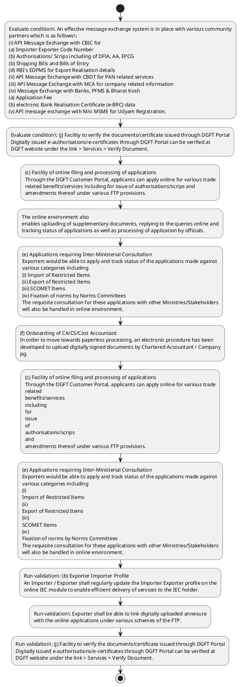

# Chapter 1 / Section 1.04: E-governance of Foreign Trade in DGFT

**Chapter Title:** Legal Framework and Trade Facilitation

**Pages:** 2, 3, 4, 5

**Purpose:** 4
Chapter-1
Legal Framework and Trade
Facilitation
1.04 E-governance of Foreign Trade in DGFT
IT initiatives taken by DGFT are as under:
(a) DGFT Online Customer Portal
A customised online dashboard is made available to the exporter which provides a
360-degree view of Export related applications at https://dgft.gov.in/CP.

**Purpose Thanglish:** Indha E-governance of Foreign Trade in DGFT section-la, 4
Chapter-1
Legal Framework and Trade
Facilitation
1.04 E-governance of Foreign Trade in DGFT
IT initiatives taken by DGFT are as under:
(a) DGFT Online Customer Portal
A customised online dashboard is made available to the exporter which provides a
360-degree view of export related applications at https://dgft.gov.in/CP.

**Summary:** 1.04 E-governance of Foreign Trade in DGFT
IT initiatives taken by DGFT are as under:
pg. 4
pg. 4
Chapter-1
Legal Framework and Trade
Facilitation
1.04 E-governance of Foreign Trade in DGFT
IT initiatives taken by DGFT are as under:
(a) DGFT Online Customer Portal
A customised online dashboard is made available to the exporter which provides a
360-degree view of Export related applications at https://dgft.gov.in/CP.

**Business Meaning:** E-governance of Foreign Trade in DGFT governs how DGFT business controls should be applied, validated, and enforced.

**Business Explanation:** E-governance of Foreign Trade in DGFT explains the operating rule set that DEKAI should enforce. Key control points include (b) Exporter Importer Profile
An Importer / Exporter shall regularly update the Importer Exporter profile on the
online IEC module to enable efficient delivery of services to the IEC holder. The section also drives actions such as (c) Facility of online filing and processing of applications
Through the DGFT Customer Portal, applicants can apply online for various trade
related benefits/services including for issue of authorisations/scrips and
amendments thereof under various FTP provisions..

**Business Explanation Thanglish:** Indha E-governance of Foreign Trade in DGFT section-la, E-governance of Foreign Trade in DGFT explains the operating rule set that DEKAI should enforce. Key control points include (b) Exporter Importer Profile
An Importer / Exporter kandippa regularly update the Importer Exporter profile on the
online IEC module to enable efficient delivery of services to the IEC holder. The section also drives actions such as (c) Facility of online filing and processing of applications
Through the DGFT Customer Portal, applicants can apply online for various trade
related benefits/services including for issue of authorisations/scrips and
amendments thereof under various FTP provisions..

## Business Logic
- (b) Exporter Importer Profile
An Importer / Exporter shall regularly update the Importer Exporter profile on the
online IEC module to enable efficient delivery of services to the IEC holder.
- Exporter shall be able to link digitally uploaded annexure
with the online applications under various schemes of the FTP.

## Business Rules
- rule_id=CH1-SEC1_04-R001, rule_description=(b) Exporter Importer Profile
An Importer / Exporter shall regularly update the Importer Exporter profile on the
online IEC module to enable efficient delivery of services to the IEC holder., trigger=E-governance of Foreign Trade in DGFT, condition=An effective message exchange system is in place with various community
partners which is as follows:
(i) API Message Exchange with CBIC for
(a) Importer Exporter Code Number
(b) Authorisations/ Scrips including of DFIA, AA, EPCG
(b) Shipping Bills and Bills of Entry
(d) RBI's EDPMS for Export Realisation details
(ii) API Message Exchange with CBDT for PAN related services
(iii) API Message Exchange with MCA for company related information
(iv) Message Exchange with Banks, PFMS & Bharat Kosh
(a) Application Fee
(b) electronic Bank Realisation Certificate (e-BRC) data
(v) API message exchange with M/o MSME for Udyam Registration., validation=(b) Exporter Importer Profile
An Importer / Exporter shall regularly update the Importer Exporter profile on the
online IEC module to enable efficient delivery of services to the IEC holder., action=(c) Facility of online filing and processing of applications
Through the DGFT Customer Portal, applicants can apply online for various trade
related benefits/services including for issue of authorisations/scrips and
amendments thereof under various FTP provisions., exception=No explicit exception found in uploaded documents., output=DEKAI should produce a compliance decision for 1.04 - E-governance of Foreign Trade in DGFT.
- rule_id=CH1-SEC1_04-R002, rule_description=Exporter shall be able to link digitally uploaded annexure
with the online applications under various schemes of the FTP., trigger=E-governance of Foreign Trade in DGFT, condition=(j) Facility to verify the documents/certificate issued through DGFT Portal
Digitally issued e-authorisations/e-certificates through DGFT Portal can be verified at
DGFT website under the link > Services > Verify Document., validation=Exporter shall be able to link digitally uploaded annexure
with the online applications under various schemes of the FTP., action=The online environment also
enables uploading of supplementary documents, replying to the queries online and
tracking status of applications as well as processing of application by officials., exception=No explicit exception found in uploaded documents., output=DEKAI should produce a compliance decision for 1.04 - E-governance of Foreign Trade in DGFT.

## Conditions
- An effective message exchange system is in place with various community
partners which is as follows:
(i) API Message Exchange with CBIC for
(a) Importer Exporter Code Number
(b) Authorisations/ Scrips including of DFIA, AA, EPCG
(b) Shipping Bills and Bills of Entry
(d) RBI's EDPMS for Export Realisation details
(ii) API Message Exchange with CBDT for PAN related services
(iii) API Message Exchange with MCA for company related information
(iv) Message Exchange with Banks, PFMS & Bharat Kosh
(a) Application Fee
(b) electronic Bank Realisation Certificate (e-BRC) data
(v) API message exchange with M/o MSME for Udyam Registration.
- (j) Facility to verify the documents/certificate issued through DGFT Portal
Digitally issued e-authorisations/e-certificates through DGFT Portal can be verified at
DGFT website under the link > Services > Verify Document.

## Condition Logic
- id=1.1.04.1, if=An effective message exchange system is in place with various community
partners which is as follows:
(i) API Message Exchange with CBIC for
(a) Importer Exporter Code Number
(b) Authorisations/ Scrips including of DFIA, AA, EPCG
(b) Shipping Bills and Bills of Entry
(d) RBI's EDPMS for Export Realisation details
(ii) API Message Exchange with CBDT for PAN related services
(iii) API Message Exchange with MCA for company related information
(iv) Message Exchange with Banks, PFMS & Bharat Kosh
(a) Application Fee
(b) electronic Bank Realisation Certificate (e-BRC) data
(v) API message exchange with M/o MSME for Udyam Registration., then=(c) Facility of online filing and processing of applications
Through the DGFT Customer Portal, applicants can apply online for various trade
related benefits/services including for issue of authorisations/scrips and
amendments thereof under various FTP provisions., source=An effective message exchange system is in place with various community
partners which is as follows:
(i) API Message Exchange with CBIC for
(a) Importer Exporter Code Number
(b) Authorisations/ Scrips including of DFIA, AA, EPCG
(b) Shipping Bills and Bills of Entry
(d) RBI's EDPMS for Export Realisation details
(ii) API Message Exchange with CBDT for PAN related services
(iii) API Message Exchange with MCA for company related information
(iv) Message Exchange with Banks, PFMS & Bharat Kosh
(a) Application Fee
(b) electronic Bank Realisation Certificate (e-BRC) data
(v) API message exchange with M/o MSME for Udyam Registration.
- id=1.1.04.2, if=(j) Facility to verify the documents/certificate issued through DGFT Portal
Digitally issued e-authorisations/e-certificates through DGFT Portal can be verified at
DGFT website under the link > Services > Verify Document., then=(c) Facility of online filing and processing of applications
Through the DGFT Customer Portal, applicants can apply online for various trade
related benefits/services including for issue of authorisations/scrips and
amendments thereof under various FTP provisions., source=(j) Facility to verify the documents/certificate issued through DGFT Portal
Digitally issued e-authorisations/e-certificates through DGFT Portal can be verified at
DGFT website under the link > Services > Verify Document.

## Validations
- (b) Exporter Importer Profile
An Importer / Exporter shall regularly update the Importer Exporter profile on the
online IEC module to enable efficient delivery of services to the IEC holder.
- Exporter shall be able to link digitally uploaded annexure
with the online applications under various schemes of the FTP.
- (j) Facility to verify the documents/certificate issued through DGFT Portal
Digitally issued e-authorisations/e-certificates through DGFT Portal can be verified at
DGFT website under the link > Services > Verify Document.

## Exceptions
- None identified

## Dependencies
- None identified

## Authorities
- DGFT
- E-governance of Foreign Trade in DGFT
- IT initiatives taken by DGFT
- Through the DGFT
- CBIC
- Raise a service request ticket on DGFT
- Call the DGFT
- MCA and Banks are major community partners of DGFT
- Facility to verify the documents/certificate issued through DGFT
- Digitally issued e-authorisations/e-certificates through DGFT

## Required Documents
- 4
Chapter-1
Legal Framework and Trade
Facilitation
1.04 E-governance of Foreign Trade in DGFT
IT initiatives taken by DGFT are as under:
(a) DGFT Online Customer Portal
A customised online dashboard is made available to the exporter which provides a
360-degree view of Export related applications at https://dgft.gov.in/CP.
- The
documents & details available in the IEC Profile and online Repository will facilitate
paperless processing in DGFT.
- (c) Facility of online filing and processing of applications
Through the DGFT Customer Portal, applicants can apply online for various trade
related benefits/services including for issue of authorisations/scrips and
amendments thereof under various FTP provisions.
- The online environment also
enables uploading of supplementary documents, replying to the queries online and
tracking status of applications as well as processing of application by officials.
- (d) Automated processing in online environment
Rule-based, system-driven workflow is being implemented in a phased manner for
automated processing of various applications with a risk based management
approach.
- (e) Applications requiring Inter-Ministerial Consultation
Exporters would be able to apply and track status of the applications made against
various categories including
(i) Import of Restricted Items
(ii) Export of Restricted Items
(iii) SCOMET Items
(iv) Fixation of norms by Norms Committees
The requisite consultation for these applications with other Ministries/Stakeholders
will also be handled in online environment.
- (f) Onboarding of CA/CS/Cost Accountant
In order to move towards paperless processing, an electronic procedure has been
developed to upload digitally signed documents by Chartered Accountant / Company
pg.
- 5
(a) DGFT Online Customer Portal
A customised online dashboard is made available to the exporter which provides a
360-degree view of Export related applications at https://dgft.gov.in/CP.
- (c) Facility of online filing and processing of applications
Through the DGFT Customer Portal, applicants can apply online for various trade
related
benefits/services
including
for
issue
of
authorisations/scrips
and
amendments thereof under various FTP provisions.
- (e) Applications requiring Inter-Ministerial Consultation
Exporters would be able to apply and track status of the applications made against
various categories including
(i)
Import of Restricted Items
(ii)
Export of Restricted Items
(iii)
SCOMET Items
(iv)
Fixation of norms by Norms Committees
The requisite consultation for these applications with other Ministries/Stakeholders
will also be handled in online environment.
- (f) Onboarding of CA/CS/Cost Accountant
In order to move towards paperless processing, an electronic procedure has been
developed to upload digitally signed documents by Chartered Accountant / Company
Secretary / Cost Accountant.
- Exporter shall be able to link digitally uploaded annexure
with the online applications under various schemes of the FTP.
- (g) 24 X 7 Helpdesk Facility to guide applicants and monitor grievances
A dedicated 24 X 7 Helpdesk facility has been put in place to assist the exporters in
filing online applications on the DGFT portal and other matters pertaining to Foreign
Trade Policy.
- A Help manual & FAQs for filing various applications under the FTP are also available
on DGFT website under the link https://dgft.gov.in> Learn > Application Help & FAQs.
- Bank Realisation Certificate
- (i) DGFT Trade facilitation Mobile application
A DGFT Trade Facilitation Mobile App is available for information on Trade Statistics,
FTP Schemes and status of applications submitted for both Android and i OS.
- Verify Document

## Timelines
- None identified

## Actions
- (c) Facility of online filing and processing of applications
Through the DGFT Customer Portal, applicants can apply online for various trade
related benefits/services including for issue of authorisations/scrips and
amendments thereof under various FTP provisions.
- The online environment also
enables uploading of supplementary documents, replying to the queries online and
tracking status of applications as well as processing of application by officials.
- (e) Applications requiring Inter-Ministerial Consultation
Exporters would be able to apply and track status of the applications made against
various categories including
(i) Import of Restricted Items
(ii) Export of Restricted Items
(iii) SCOMET Items
(iv) Fixation of norms by Norms Committees
The requisite consultation for these applications with other Ministries/Stakeholders
will also be handled in online environment.
- (f) Onboarding of CA/CS/Cost Accountant
In order to move towards paperless processing, an electronic procedure has been
developed to upload digitally signed documents by Chartered Accountant / Company
pg.
- (c) Facility of online filing and processing of applications
Through the DGFT Customer Portal, applicants can apply online for various trade
related
benefits/services
including
for
issue
of
authorisations/scrips
and
amendments thereof under various FTP provisions.
- (e) Applications requiring Inter-Ministerial Consultation
Exporters would be able to apply and track status of the applications made against
various categories including
(i)
Import of Restricted Items
(ii)
Export of Restricted Items
(iii)
SCOMET Items
(iv)
Fixation of norms by Norms Committees
The requisite consultation for these applications with other Ministries/Stakeholders
will also be handled in online environment.
- (f) Onboarding of CA/CS/Cost Accountant
In order to move towards paperless processing, an electronic procedure has been
developed to upload digitally signed documents by Chartered Accountant / Company
Secretary / Cost Accountant.
- Exporter shall be able to link digitally uploaded annexure
with the online applications under various schemes of the FTP.
- (i) DGFT Trade facilitation Mobile application
A DGFT Trade Facilitation Mobile App is available for information on Trade Statistics,
FTP Schemes and status of applications submitted for both Android and i OS.
- (j) Facility to verify the documents/certificate issued through DGFT Portal
Digitally issued e-authorisations/e-certificates through DGFT Portal can be verified at
DGFT website under the link > Services > Verify Document.

## Workflow
- Evaluate condition: An effective message exchange system is in place with various community
partners which is as follows:
(i) API Message Exchange with CBIC for
(a) Importer Exporter Code Number
(b) Authorisations/ Scrips including of DFIA, AA, EPCG
(b) Shipping Bills and Bills of Entry
(d) RBI's EDPMS for Export Realisation details
(ii) API Message Exchange with CBDT for PAN related services
(iii) API Message Exchange with MCA for company related information
(iv) Message Exchange with Banks, PFMS & Bharat Kosh
(a) Application Fee
(b) electronic Bank Realisation Certificate (e-BRC) data
(v) API message exchange with M/o MSME for Udyam Registration.
- Evaluate condition: (j) Facility to verify the documents/certificate issued through DGFT Portal
Digitally issued e-authorisations/e-certificates through DGFT Portal can be verified at
DGFT website under the link > Services > Verify Document.
- (c) Facility of online filing and processing of applications
Through the DGFT Customer Portal, applicants can apply online for various trade
related benefits/services including for issue of authorisations/scrips and
amendments thereof under various FTP provisions.
- The online environment also
enables uploading of supplementary documents, replying to the queries online and
tracking status of applications as well as processing of application by officials.
- (e) Applications requiring Inter-Ministerial Consultation
Exporters would be able to apply and track status of the applications made against
various categories including
(i) Import of Restricted Items
(ii) Export of Restricted Items
(iii) SCOMET Items
(iv) Fixation of norms by Norms Committees
The requisite consultation for these applications with other Ministries/Stakeholders
will also be handled in online environment.
- (f) Onboarding of CA/CS/Cost Accountant
In order to move towards paperless processing, an electronic procedure has been
developed to upload digitally signed documents by Chartered Accountant / Company
pg.
- (c) Facility of online filing and processing of applications
Through the DGFT Customer Portal, applicants can apply online for various trade
related
benefits/services
including
for
issue
of
authorisations/scrips
and
amendments thereof under various FTP provisions.
- (e) Applications requiring Inter-Ministerial Consultation
Exporters would be able to apply and track status of the applications made against
various categories including
(i)
Import of Restricted Items
(ii)
Export of Restricted Items
(iii)
SCOMET Items
(iv)
Fixation of norms by Norms Committees
The requisite consultation for these applications with other Ministries/Stakeholders
will also be handled in online environment.
- Run validation: (b) Exporter Importer Profile
An Importer / Exporter shall regularly update the Importer Exporter profile on the
online IEC module to enable efficient delivery of services to the IEC holder.
- Run validation: Exporter shall be able to link digitally uploaded annexure
with the online applications under various schemes of the FTP.
- Run validation: (j) Facility to verify the documents/certificate issued through DGFT Portal
Digitally issued e-authorisations/e-certificates through DGFT Portal can be verified at
DGFT website under the link > Services > Verify Document.

## Workflow ASCII
```text
E-governance of Foreign Trade in DGFT
Evaluate condition: An effective message exchange system is in place with various community
partners which is as follows:
(i) API Message Exchange with CBIC for
(a) Importer Exporter Code Number
(b) Authorisations/ Scrips including of DFIA, AA, EPCG
(b) Shipping Bills and Bills of Entry
(d) RBI's EDPMS for Export Realisation details
(ii) API Message Exchange with CBDT for PAN related services
(iii) API Message Exchange with MCA for company related information
(iv) Message Exchange with Banks, PFMS & Bharat Kosh
(a) Application Fee
(b) electronic Bank Realisation Certificate (e-BRC) data
(v) API message exchange with M/o MSME for Udyam Registration.
   |
   v
Evaluate condition: (j) Facility to verify the documents/certificate issued through DGFT Portal
Digitally issued e-authorisations/e-certificates through DGFT Portal can be verified at
DGFT website under the link > Services > Verify Document.
   |
   v
(c) Facility of online filing and processing of applications
Through the DGFT Customer Portal, applicants can apply online for various trade
related benefits/services including for issue of authorisations/scrips and
amendments thereof under various FTP provisions.
   |
   v
The online environment also
enables uploading of supplementary documents, replying to the queries online and
tracking status of applications as well as processing of application by officials.
   |
   v
(e) Applications requiring Inter-Ministerial Consultation
Exporters would be able to apply and track status of the applications made against
various categories including
(i) Import of Restricted Items
(ii) Export of Restricted Items
(iii) SCOMET Items
(iv) Fixation of norms by Norms Committees
The requisite consultation for these applications with other Ministries/Stakeholders
will also be handled in online environment.
   |
   v
(f) Onboarding of CA/CS/Cost Accountant
In order to move towards paperless processing, an electronic procedure has been
developed to upload digitally signed documents by Chartered Accountant / Company
pg.
   |
   v
(c) Facility of online filing and processing of applications
Through the DGFT Customer Portal, applicants can apply online for various trade
related
benefits/services
including
for
issue
of
authorisations/scrips
and
amendments thereof under various FTP provisions.
   |
   v
(e) Applications requiring Inter-Ministerial Consultation
Exporters would be able to apply and track status of the applications made against
various categories including
(i)
Import of Restricted Items
(ii)
Export of Restricted Items
(iii)
SCOMET Items
(iv)
Fixation of norms by Norms Committees
The requisite consultation for these applications with other Ministries/Stakeholders
will also be handled in online environment.
   |
   v
Run validation: (b) Exporter Importer Profile
An Importer / Exporter shall regularly update the Importer Exporter profile on the
online IEC module to enable efficient delivery of services to the IEC holder.
   |
   v
Run validation: Exporter shall be able to link digitally uploaded annexure
with the online applications under various schemes of the FTP.
   |
   v
Run validation: (j) Facility to verify the documents/certificate issued through DGFT Portal
Digitally issued e-authorisations/e-certificates through DGFT Portal can be verified at
DGFT website under the link > Services > Verify Document.
```

## Decision Tree
- IF An effective message exchange system is in place with various community
partners which is as follows:
(i) API Message Exchange with CBIC for
(a) Importer Exporter Code Number
(b) Authorisations/ Scrips including of DFIA, AA, EPCG
(b) Shipping Bills and Bills of Entry
(d) RBI's EDPMS for Export Realisation details
(ii) API Message Exchange with CBDT for PAN related services
(iii) API Message Exchange with MCA for company related information
(iv) Message Exchange with Banks, PFMS & Bharat Kosh
(a) Application Fee
(b) electronic Bank Realisation Certificate (e-BRC) data
(v) API message exchange with M/o MSME for Udyam Registration. THEN (c) Facility of online filing and processing of applications
Through the DGFT Customer Portal, applicants can apply online for various trade
related benefits/services including for issue of authorisations/scrips and
amendments thereof under various FTP provisions.
- IF (j) Facility to verify the documents/certificate issued through DGFT Portal
Digitally issued e-authorisations/e-certificates through DGFT Portal can be verified at
DGFT website under the link > Services > Verify Document. THEN (c) Facility of online filing and processing of applications
Through the DGFT Customer Portal, applicants can apply online for various trade
related benefits/services including for issue of authorisations/scrips and
amendments thereof under various FTP provisions.

## Decision Tree ASCII
```text
E-governance of Foreign Trade in DGFT Decision
IF An effective message exchange system is in place with various community
partners which is as follows:
(i) API Message Exchange with CBIC for
(a) Importer Exporter Code Number
(b) Authorisations/ Scrips including of DFIA, AA, EPCG
(b) Shipping Bills and Bills of Entry
(d) RBI's EDPMS for Export Realisation details
(ii) API Message Exchange with CBDT for PAN related services
(iii) API Message Exchange with MCA for company related information
(iv) Message Exchange with Banks, PFMS & Bharat Kosh
(a) Application Fee
(b) electronic Bank Realisation Certificate (e-BRC) data
(v) API message exchange with M/o MSME for Udyam Registration. THEN (c) Facility of online filing and processing of applications
Through the DGFT Customer Portal, applicants can apply online for various trade
related benefits/services including for issue of authorisations/scrips and
amendments thereof under various FTP provisions.
   |
   v
IF (j) Facility to verify the documents/certificate issued through DGFT Portal
Digitally issued e-authorisations/e-certificates through DGFT Portal can be verified at
DGFT website under the link > Services > Verify Document. THEN (c) Facility of online filing and processing of applications
Through the DGFT Customer Portal, applicants can apply online for various trade
related benefits/services including for issue of authorisations/scrips and
amendments thereof under various FTP provisions.
```

## Examples
- User asks to process E-governance of Foreign Trade in DGFT; the platform checks conditions, validations, and documents before action.

**Real-world Example:** Example: an importer or exporter invokes E-governance of Foreign Trade in DGFT, submits 4
Chapter-1
Legal Framework and Trade
Facilitation
1.04 E-governance of Foreign Trade in DGFT
IT initiatives taken by DGFT are as under:
(a) DGFT Online Customer Portal
A customised online dashboard is made available to the exporter which provides a
360-degree view of Export related applications at https://dgft.gov.in/CP., The
documents & details available in the IEC Profile and online Repository will facilitate
paperless processing in DGFT., (c) Facility of online filing and processing of applications
Through the DGFT Customer Portal, applicants can apply online for various trade
related benefits/services including for issue of authorisations/scrips and
amendments thereof under various FTP provisions., and DEKAI uses the extracted rules to (c) facility of online filing and processing of applications
through the dgft customer portal, applicants can apply online for various trade
related benefits/services including for issue of authorisations/scrips and
amendments thereof under various ftp provisions..

**Real-world Example Thanglish:** Indha E-governance of Foreign Trade in DGFT section-la, Example: an importer or exporter invokes E-governance of Foreign Trade in DGFT, submits 4
Chapter-1
Legal Framework and Trade
Facilitation
1.04 E-governance of Foreign Trade in DGFT
IT initiatives taken by DGFT are as under:
(a) DGFT Online Customer Portal
A customised online dashboard is made available to the exporter which provides a
360-degree view of export related applications at https://dgft.gov.in/CP., The
documents & details available in the IEC Profile and online Repository will facilitate
paperless processing in DGFT., (c) Facility of online filing and processing of applications
Through the DGFT Customer Portal, applicants can apply online for various trade
related benefits/services including for issue of authorisations/scrips and
amendments thereof under various FTP provisions., and DEKAI uses the extracted rules to (c) facility of online filing and processing of applications
through the dgft customer portal, applicants can apply online for various trade
related benefits/services including for issue of authorisations/scrips and
amendments thereof under various ftp provisions..

## AI Rules
- IF detected context matches section rule THEN enforce: (b) Exporter Importer Profile
An Importer / Exporter shall regularly update the Importer Exporter profile on the
online IEC module to enable efficient delivery of services to the IEC holder.
- IF detected context matches section rule THEN enforce: Exporter shall be able to link digitally uploaded annexure
with the online applications under various schemes of the FTP.
- IF validations pass THEN recommend action: (c) Facility of online filing and processing of applications
Through the DGFT Customer Portal, applicants can apply online for various trade
related benefits/services including for issue of authorisations/scrips and
amendments thereof under various FTP provisions.

## Database Fields
- name=section_code, type=string, required=True, source=parsed_section_heading
- name=section_title, type=string, required=True, source=parsed_section_heading
- name=are_flag, type=boolean, required=False, source=keyword:are
- name=and_flag, type=boolean, required=False, source=keyword:and
- name=the_flag, type=boolean, required=False, source=keyword:the
- name=gov_flag, type=boolean, required=False, source=keyword:gov
- name=iec_flag, type=boolean, required=False, source=keyword:IEC
- name=can_flag, type=boolean, required=False, source=keyword:can
- name=for_flag, type=boolean, required=False, source=keyword:for
- name=ftp_flag, type=boolean, required=False, source=keyword:FTP
- name=document_1_submitted, type=boolean, required=True, source=4
Chapter-1
Legal Framework and Trade
Facilitation
1.04 E-governance of Foreign Trade in DGFT
IT initiatives taken by DGFT are as under:
(a) DGFT Online Customer Portal
A customised online dashboard is made available to the exporter which provides a
360-degree view of Export related applications at https://dgft.gov.in/CP.
- name=document_2_submitted, type=boolean, required=True, source=The
documents & details available in the IEC Profile and online Repository will facilitate
paperless processing in DGFT.
- name=document_3_submitted, type=boolean, required=True, source=(c) Facility of online filing and processing of applications
Through the DGFT Customer Portal, applicants can apply online for various trade
related benefits/services including for issue of authorisations/scrips and
amendments thereof under various FTP provisions.
- name=document_4_submitted, type=boolean, required=True, source=The online environment also
enables uploading of supplementary documents, replying to the queries online and
tracking status of applications as well as processing of application by officials.
- name=document_5_submitted, type=boolean, required=True, source=(d) Automated processing in online environment
Rule-based, system-driven workflow is being implemented in a phased manner for
automated processing of various applications with a risk based management
approach.
- name=document_6_submitted, type=boolean, required=True, source=(e) Applications requiring Inter-Ministerial Consultation
Exporters would be able to apply and track status of the applications made against
various categories including
(i) Import of Restricted Items
(ii) Export of Restricted Items
(iii) SCOMET Items
(iv) Fixation of norms by Norms Committees
The requisite consultation for these applications with other Ministries/Stakeholders
will also be handled in online environment.

## API Requirements
- method=GET, path=/api/dgft/sections/1.04, purpose=Retrieve knowledge payload for section 1.04, query_params=['include=workflow,decision_tree,validations'], response_fields=['section', 'title', 'summary', 'conditions', 'validations', 'exceptions', 'workflow', 'decision_tree']
- method=POST, path=/api/dgft/E-governance-of-Foreign-Trade-in-DGFT/validate, purpose=Validate inputs and documents for E-governance of Foreign Trade in DGFT, request_fields=['section_code', 'section_title', 'document_1_submitted', 'document_2_submitted', 'document_3_submitted', 'document_4_submitted', 'document_5_submitted', 'document_6_submitted'], response_fields=['status', 'errors', 'warnings', 'next_actions']
- method=POST, path=/api/dgft/E-governance-of-Foreign-Trade-in-DGFT/execute, purpose=Trigger business action for (c) Facility of online filing and processing of applications
Through the DGFT Customer Portal, applicants can apply online for various trade
related benefits/services including for issue of authorisations/scrips and
amendments thereof under various FTP provisions., request_fields=['section_code', 'section_title', 'document_1_submitted', 'document_2_submitted', 'document_3_submitted', 'document_4_submitted', 'document_5_submitted', 'document_6_submitted'], response_fields=['reference_id', 'status', 'authority', 'timeline']

## UI Screens
- screen_id=E_governance_of_Foreign_Trade_in_DGFT_overview, name=E-governance of Foreign Trade in DGFT Overview, purpose=Show section summary, authority, timeline, and eligibility cues., widgets=['summary_card', 'conditions_table', 'authority_badges', 'timeline_panel']
- screen_id=E_governance_of_Foreign_Trade_in_DGFT_submission, name=E-governance of Foreign Trade in DGFT Submission, purpose=Capture applicant data and supporting documents., widgets=['dynamic_form', 'document_uploader', 'validation_panel', 'next_action_footer'], fields=['section_code', 'section_title', 'are_flag', 'and_flag', 'the_flag', 'gov_flag', 'iec_flag', 'can_flag']

## Error Messages
- Validation failed because the section requirements were not fully met.

## FAQ
- question_en=What is the purpose of section 1.04?, answer_en=E-governance of Foreign Trade in DGFT explains the operating rule set that DEKAI should enforce. Key control points include (b) Exporter Importer Profile
An Importer / Exporter shall regularly update the Importer Exporter profile on the
online IEC module to enable efficient delivery of services to the IEC holder. The section also drives actions such as (c) Facility of online filing and processing of applications
Through the DGFT Customer Portal, applicants can apply online for various trade
related benefits/services including for issue of authorisations/scrips and
amendments thereof under various FTP provisions.., question_thanglish=Indha E-governance of Foreign Trade in DGFT section-la, What is the purpose of section 1.04?, answer_thanglish=Indha E-governance of Foreign Trade in DGFT section-la, E-governance of Foreign Trade in DGFT explains the operating rule set that DEKAI should enforce. Key control points include (b) Exporter Importer Profile
An Importer / Exporter kandippa regularly update the Importer Exporter profile on the
online IEC module to enable efficient delivery of services to the IEC holder. The section also drives actions such as (c) Facility of online filing and processing of applications
Through the DGFT Customer Portal, applicants can apply online for various trade
related benefits/services including for issue of authorisations/scrips and
amendments thereof under various FTP provisions..
- question_en=What documents are required under E-governance of Foreign Trade in DGFT?, answer_en=4
Chapter-1
Legal Framework and Trade
Facilitation
1.04 E-governance of Foreign Trade in DGFT
IT initiatives taken by DGFT are as under:
(a) DGFT Online Customer Portal
A customised online dashboard is made available to the exporter which provides a
360-degree view of Export related applications at https://dgft.gov.in/CP., The
documents & details available in the IEC Profile and online Repository will facilitate
paperless processing in DGFT., (c) Facility of online filing and processing of applications
Through the DGFT Customer Portal, applicants can apply online for various trade
related benefits/services including for issue of authorisations/scrips and
amendments thereof under various FTP provisions., The online environment also
enables uploading of supplementary documents, replying to the queries online and
tracking status of applications as well as processing of application by officials., (d) Automated processing in online environment
Rule-based, system-driven workflow is being implemented in a phased manner for
automated processing of various applications with a risk based management
approach., (e) Applications requiring Inter-Ministerial Consultation
Exporters would be able to apply and track status of the applications made against
various categories including
(i) Import of Restricted Items
(ii) Export of Restricted Items
(iii) SCOMET Items
(iv) Fixation of norms by Norms Committees
The requisite consultation for these applications with other Ministries/Stakeholders
will also be handled in online environment., (f) Onboarding of CA/CS/Cost Accountant
In order to move towards paperless processing, an electronic procedure has been
developed to upload digitally signed documents by Chartered Accountant / Company
pg., 5
(a) DGFT Online Customer Portal
A customised online dashboard is made available to the exporter which provides a
360-degree view of Export related applications at https://dgft.gov.in/CP., (c) Facility of online filing and processing of applications
Through the DGFT Customer Portal, applicants can apply online for various trade
related
benefits/services
including
for
issue
of
authorisations/scrips
and
amendments thereof under various FTP provisions., (e) Applications requiring Inter-Ministerial Consultation
Exporters would be able to apply and track status of the applications made against
various categories including
(i)
Import of Restricted Items
(ii)
Export of Restricted Items
(iii)
SCOMET Items
(iv)
Fixation of norms by Norms Committees
The requisite consultation for these applications with other Ministries/Stakeholders
will also be handled in online environment., (f) Onboarding of CA/CS/Cost Accountant
In order to move towards paperless processing, an electronic procedure has been
developed to upload digitally signed documents by Chartered Accountant / Company
Secretary / Cost Accountant., Exporter shall be able to link digitally uploaded annexure
with the online applications under various schemes of the FTP., (g) 24 X 7 Helpdesk Facility to guide applicants and monitor grievances
A dedicated 24 X 7 Helpdesk facility has been put in place to assist the exporters in
filing online applications on the DGFT portal and other matters pertaining to Foreign
Trade Policy., A Help manual & FAQs for filing various applications under the FTP are also available
on DGFT website under the link https://dgft.gov.in> Learn > Application Help & FAQs., Bank Realisation Certificate, (i) DGFT Trade facilitation Mobile application
A DGFT Trade Facilitation Mobile App is available for information on Trade Statistics,
FTP Schemes and status of applications submitted for both Android and i OS., Verify Document, question_thanglish=Indha E-governance of Foreign Trade in DGFT section-la, What documents are required under E-governance of Foreign Trade in DGFT?, answer_thanglish=Indha E-governance of Foreign Trade in DGFT section-la, 4
Chapter-1
Legal Framework and Trade
Facilitation
1.04 E-governance of Foreign Trade in DGFT
IT initiatives taken by DGFT are as under:
(a) DGFT Online Customer Portal
A customised online dashboard is made available to the exporter which provides a
360-degree view of export related applications at https://dgft.gov.in/CP., The
documents & details available in the IEC Profile and online Repository will facilitate
paperless processing in DGFT., (c) Facility of online filing and processing of applications
Through the DGFT Customer Portal, applicants can apply online for various trade
related benefits/services including for issue of authorisations/scrips and
amendments thereof under various FTP provisions., The online environment also
enables uploading of supplementary documents, replying to the queries online and
tracking status of applications as well as processing of application by officials., (d) Automated processing in online environment
Rule-based, system-driven workflow is being implemented in a phased manner for
automated processing of various applications with a risk based management
approach., (e) Applications requiring Inter-Ministerial Consultation
Exporters would be able to apply and track status of the applications made against
various categories including
(i) import of Restricted Items
(ii) export of Restricted Items
(iii) SCOMET Items
(iv) Fixation of norms by Norms Committees
The requisite consultation for these applications with other Ministries/Stakeholders
will also be handled in online environment., (f) Onboarding of CA/CS/Cost Accountant
In order to move towards paperless processing, an electronic procedure has been
developed to upload digitally signed documents by Chartered Accountant / Company
pg., 5
(a) DGFT Online Customer Portal
A customised online dashboard is made available to the exporter which provides a
360-degree view of export related applications at https://dgft.gov.in/CP., (c) Facility of online filing and processing of applications
Through the DGFT Customer Portal, applicants can apply online for various trade
related
benefits/services
including
for
issue
of
authorisations/scrips
and
amendments thereof under various FTP provisions., (e) Applications requiring Inter-Ministerial Consultation
Exporters would be able to apply and track status of the applications made against
various categories including
(i)
import of Restricted Items
(ii)
export of Restricted Items
(iii)
SCOMET Items
(iv)
Fixation of norms by Norms Committees
The requisite consultation for these applications with other Ministries/Stakeholders
will also be handled in online environment., (f) Onboarding of CA/CS/Cost Accountant
In order to move towards paperless processing, an electronic procedure has been
developed to upload digitally signed documents by Chartered Accountant / Company
Secretary / Cost Accountant., Exporter kandippa be able to link digitally uploaded annexure
with the online applications under various schemes of the FTP., (g) 24 X 7 Helpdesk Facility to guide applicants and monitor grievances
A dedicated 24 X 7 Helpdesk facility has been put in place to assist the exporters in
filing online applications on the DGFT portal and other matters pertaining to Foreign
Trade Policy., A Help manual & FAQs for filing various applications under the FTP are also available
on DGFT website under the link https://dgft.gov.in> Learn > application Help & FAQs., Bank Realisation Certificate, (i) DGFT Trade facilitation Mobile application
A DGFT Trade Facilitation Mobile App is available for information on Trade Statistics,
FTP Schemes and status of applications submitted for both Android and i OS., Verify Document
- question_en=Which authority handles E-governance of Foreign Trade in DGFT?, answer_en=DGFT, E-governance of Foreign Trade in DGFT, IT initiatives taken by DGFT, Through the DGFT, CBIC, Raise a service request ticket on DGFT, Call the DGFT, MCA and Banks are major community partners of DGFT, Facility to verify the documents/certificate issued through DGFT, Digitally issued e-authorisations/e-certificates through DGFT, question_thanglish=Indha E-governance of Foreign Trade in DGFT section-la, Which authority handles E-governance of Foreign Trade in DGFT?, answer_thanglish=Indha E-governance of Foreign Trade in DGFT section-la, DGFT, E-governance of Foreign Trade in DGFT, IT initiatives taken by DGFT, Through the DGFT, CBIC, Raise a service request ticket on DGFT, Call the DGFT, MCA and Banks are major community partners of DGFT, Facility to verify the documents/certificate issued through DGFT, Digitally issued e-authorisations/e-certificates through DGFT

## Questions Users May Ask
- What does E-governance of Foreign Trade in DGFT require?
- Which documents are needed for E-governance of Foreign Trade in DGFT?
- How does DEKAI validate E-governance of Foreign Trade in DGFT requests?
- What action should be taken for E-governance of Foreign Trade in DGFT?

## Expected AI Answers
- E-governance of Foreign Trade in DGFT requires the platform to interpret the section text, apply the extracted business rules, and present the correct next action.
- Required documents are inferred from the section text: 4
Chapter-1
Legal Framework and Trade
Facilitation
1.04 E-governance of Foreign Trade in DGFT
IT initiatives taken by DGFT are as under:
(a) DGFT Online Customer Portal
A customised online dashboard is made available to the exporter which provides a
360-degree view of Export related applications at https://dgft.gov.in/CP., The
documents & details available in the IEC Profile and online Repository will facilitate
paperless processing in DGFT., (c) Facility of online filing and processing of applications
Through the DGFT Customer Portal, applicants can apply online for various trade
related benefits/services including for issue of authorisations/scrips and
amendments thereof under various FTP provisions., The online environment also
enables uploading of supplementary documents, replying to the queries online and
tracking status of applications as well as processing of application by officials., (d) Automated processing in online environment
Rule-based, system-driven workflow is being implemented in a phased manner for
automated processing of various applications with a risk based management
approach.
- DEKAI validates E-governance of Foreign Trade in DGFT by checking conditions, required documents, authority references, and exception clauses before recommending an outcome.
- The primary extracted action is: (c) Facility of online filing and processing of applications
Through the DGFT Customer Portal, applicants can apply online for various trade
related benefits/services including for issue of authorisations/scrips and
amendments thereof under various FTP provisions.

## AI Q&A Examples
- question_en=User asks: How do I comply with E-governance of Foreign Trade in DGFT?, answer_en=AI answers: DEKAI should evaluate section 1.04, apply the extracted rules, and guide the user through Evaluate condition: An effective message exchange system is in place with various community
partners which is as follows:
(i) API Message Exchange with CBIC for
(a) Importer Exporter Code Number
(b) Authorisations/ Scrips including of DFIA, AA, EPCG
(b) Shipping Bills and Bills of Entry
(d) RBI's EDPMS for Export Realisation details
(ii) API Message Exchange with CBDT for PAN related services
(iii) API Message Exchange with MCA for company related information
(iv) Message Exchange with Banks, PFMS & Bharat Kosh
(a) Application Fee
(b) electronic Bank Realisation Certificate (e-BRC) data
(v) API message exchange with M/o MSME for Udyam Registration.., question_thanglish=Indha E-governance of Foreign Trade in DGFT section-la, User asks: How do I comply with E-governance of Foreign Trade in DGFT?, answer_thanglish=Indha E-governance of Foreign Trade in DGFT section-la, AI answers: DEKAI should evaluate section 1.04, apply the extracted rules, and guide the user through Evaluate condition: An effective message exchange system is in place with various community
partners which is as follows:
(i) API Message Exchange with CBIC for
(a) Importer Exporter Code Number
(b) Authorisations/ Scrips including of DFIA, AA, EPCG
(b) Shipping Bills and Bills of Entry
(d) RBI's EDPMS for export Realisation details
(ii) API Message Exchange with CBDT for PAN related services
(iii) API Message Exchange with MCA for company related information
(iv) Message Exchange with Banks, PFMS & Bharat Kosh
(a) application Fee
(b) electronic Bank Realisation Certificate (e-BRC) data
(v) API message exchange with M/o MSME for Udyam Registration..
- question_en=User asks: Which validations apply to E-governance of Foreign Trade in DGFT?, answer_en=AI answers: Applicable validations are (b) Exporter Importer Profile
An Importer / Exporter shall regularly update the Importer Exporter profile on the
online IEC module to enable efficient delivery of services to the IEC holder., Exporter shall be able to link digitally uploaded annexure
with the online applications under various schemes of the FTP., (j) Facility to verify the documents/certificate issued through DGFT Portal
Digitally issued e-authorisations/e-certificates through DGFT Portal can be verified at
DGFT website under the link > Services > Verify Document., question_thanglish=Indha E-governance of Foreign Trade in DGFT section-la, User asks: Which validations apply to E-governance of Foreign Trade in DGFT?, answer_thanglish=Indha E-governance of Foreign Trade in DGFT section-la, AI answers: Applicable validations are (b) Exporter Importer Profile
An Importer / Exporter kandippa regularly update the Importer Exporter profile on the
online IEC module to enable efficient delivery of services to the IEC holder., Exporter kandippa be able to link digitally uploaded annexure
with the online applications under various schemes of the FTP., (j) Facility to verify the documents/certificate issued through DGFT Portal
Digitally issued e-authorisations/e-certificates through DGFT Portal can be verified at
DGFT website under the link > Services > Verify Document.

## DEKAI AI Implementation Notes
- Capture chapter 1, section 1.04, title, and page references as immutable knowledge metadata.
- Bind validations for E-governance of Foreign Trade in DGFT into a rule engine keyed by the rule IDs extracted for this section.
- Expose document upload controls for: 4
Chapter-1
Legal Framework and Trade
Facilitation
1.04 E-governance of Foreign Trade in DGFT
IT initiatives taken by DGFT are as under:
(a) DGFT Online Customer Portal
A customised online dashboard is made available to the exporter which provides a
360-degree view of Export related applications at https://dgft.gov.in/CP., The
documents & details available in the IEC Profile and online Repository will facilitate
paperless processing in DGFT., (c) Facility of online filing and processing of applications
Through the DGFT Customer Portal, applicants can apply online for various trade
related benefits/services including for issue of authorisations/scrips and
amendments thereof under various FTP provisions., The online environment also
enables uploading of supplementary documents, replying to the queries online and
tracking status of applications as well as processing of application by officials., (d) Automated processing in online environment
Rule-based, system-driven workflow is being implemented in a phased manner for
automated processing of various applications with a risk based management
approach., (e) Applications requiring Inter-Ministerial Consultation
Exporters would be able to apply and track status of the applications made against
various categories including
(i) Import of Restricted Items
(ii) Export of Restricted Items
(iii) SCOMET Items
(iv) Fixation of norms by Norms Committees
The requisite consultation for these applications with other Ministries/Stakeholders
will also be handled in online environment..
- Route escalations or approvals to: DGFT, E-governance of Foreign Trade in DGFT, IT initiatives taken by DGFT, Through the DGFT.

## DEKAI AI Implementation Notes Thanglish
- Indha E-governance of Foreign Trade in DGFT section-la, Capture chapter 1, section 1.04, title, and page references as immutable knowledge metadata.
- Indha E-governance of Foreign Trade in DGFT section-la, Bind validations for E-governance of Foreign Trade in DGFT into a rule engine keyed by the rule IDs extracted for this section.
- Indha E-governance of Foreign Trade in DGFT section-la, Expose document upload controls for: 4
Chapter-1
Legal Framework and Trade
Facilitation
1.04 E-governance of Foreign Trade in DGFT
IT initiatives taken by DGFT are as under:
(a) DGFT Online Customer Portal
A customised online dashboard is made available to the exporter which provides a
360-degree view of export related applications at https://dgft.gov.in/CP., The
documents & details available in the IEC Profile and online Repository will facilitate
paperless processing in DGFT., (c) Facility of online filing and processing of applications
Through the DGFT Customer Portal, applicants can apply online for various trade
related benefits/services including for issue of authorisations/scrips and
amendments thereof under various FTP provisions., The online environment also
enables uploading of supplementary documents, replying to the queries online and
tracking status of applications as well as processing of application by officials., (d) Automated processing in online environment
Rule-based, system-driven workflow is being implemented in a phased manner for
automated processing of various applications with a risk based management
approach., (e) Applications requiring Inter-Ministerial Consultation
Exporters would be able to apply and track status of the applications made against
various categories including
(i) import of Restricted Items
(ii) export of Restricted Items
(iii) SCOMET Items
(iv) Fixation of norms by Norms Committees
The requisite consultation for these applications with other Ministries/Stakeholders
will also be handled in online environment..
- Indha E-governance of Foreign Trade in DGFT section-la, Route escalations or approvals to: DGFT, E-governance of Foreign Trade in DGFT, IT initiatives taken by DGFT, Through the DGFT.

## AI Metadata
- Keywords: are, and, the, gov, IEC, can, for, FTP, iii, has, put, any, may, nic, MCA, API, RBI, PAN, Fee, M/o
- Search Keywords: are, and, the, gov, IEC, can, for, FTP, iii, has, put, any, may, nic, MCA, API, RBI, PAN, Fee, M/o
- Intent: Support E-governance of Foreign Trade in DGFT processing and compliance validation.
- Tags: 1.04, E-governance of Foreign Trade in DGFT, business-rule, document-driven, dgft
- Related Sections: 
- Related Chapters: 
- Related Rules: (b) Exporter Importer Profile
An Importer / Exporter shall regularly update the Importer Exporter profile on the
online IEC module to enable efficient delivery of services to the IEC holder., Exporter shall be able to link digitally uploaded annexure
with the online applications under various schemes of the FTP.

## Mermaid

```mermaid
flowchart TD
    S1["Evaluate condition: An effective message exchange system is in place with various community
partners which is as follows:
(i) API Message Exchange with CBIC for
(a) Importer Exporter Code Number
(b) Authorisations/ Scrips including of DFIA, AA, EPCG
(b) Shipping Bills and Bills of Entry
(d) RBI's EDPMS for Export Realisation details
(ii) API Message Exchange with CBDT for PAN related services
(iii) API Message Exchange with MCA for company related information
(iv) Message Exchange with Banks, PFMS & Bharat Kosh
(a) Application Fee
(b) electronic Bank Realisation Certificate (e-BRC) data
(v) API message exchange with M/o MSME for Udyam Registration."]
    S2["Evaluate condition: (j) Facility to verify the documents/certificate issued through DGFT Portal
Digitally issued e-authorisations/e-certificates through DGFT Portal can be verified at
DGFT website under the link > Services > Verify Document."]
    S1 --> S2
    S3["(c) Facility of online filing and processing of applications
Through the DGFT Customer Portal, applicants can apply online for various trade
related benefits/services including for issue of authorisations/scrips and
amendments thereof under various FTP provisions."]
    S2 --> S3
    S4["The online environment also
enables uploading of supplementary documents, replying to the queries online and
tracking status of applications as well as processing of application by officials."]
    S3 --> S4
    S5["(e) Applications requiring Inter-Ministerial Consultation
Exporters would be able to apply and track status of the applications made against
various categories including
(i) Import of Restricted Items
(ii) Export of Restricted Items
(iii) SCOMET Items
(iv) Fixation of norms by Norms Committees
The requisite consultation for these applications with other Ministries/Stakeholders
will also be handled in online environment."]
    S4 --> S5
    S6["(f) Onboarding of CA/CS/Cost Accountant
In order to move towards paperless processing, an electronic procedure has been
developed to upload digitally signed documents by Chartered Accountant / Company
pg."]
    S5 --> S6
    S7["(c) Facility of online filing and processing of applications
Through the DGFT Customer Portal, applicants can apply online for various trade
related
benefits/services
including
for
issue
of
authorisations/scrips
and
amendments thereof under various FTP provisions."]
    S6 --> S7
    S8["(e) Applications requiring Inter-Ministerial Consultation
Exporters would be able to apply and track status of the applications made against
various categories including
(i)
Import of Restricted Items
(ii)
Export of Restricted Items
(iii)
SCOMET Items
(iv)
Fixation of norms by Norms Committees
The requisite consultation for these applications with other Ministries/Stakeholders
will also be handled in online environment."]
    S7 --> S8
    S9["Run validation: (b) Exporter Importer Profile
An Importer / Exporter shall regularly update the Importer Exporter profile on the
online IEC module to enable efficient delivery of services to the IEC holder."]
    S8 --> S9
    S10["Run validation: Exporter shall be able to link digitally uploaded annexure
with the online applications under various schemes of the FTP."]
    S9 --> S10
    S11["Run validation: (j) Facility to verify the documents/certificate issued through DGFT Portal
Digitally issued e-authorisations/e-certificates through DGFT Portal can be verified at
DGFT website under the link > Services > Verify Document."]
    S10 --> S11
```


## PlantUML

