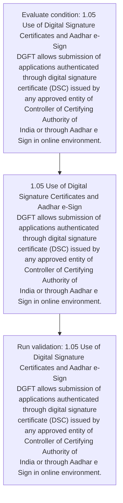
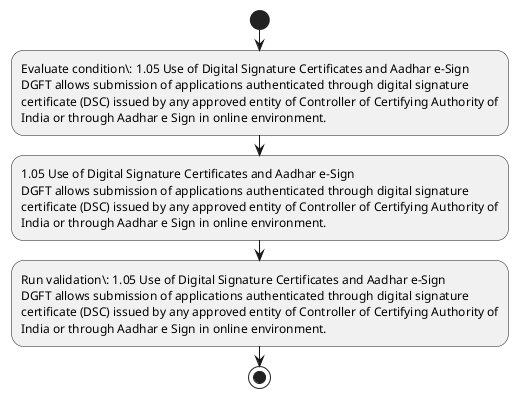

# Chapter 1 / Section 1.05: Use of Digital Signature Certificates and Aadhar e-Sign

**Chapter Title:** Legal Framework and Trade Facilitation

**Pages:** 5

**Purpose:** Defines the operational requirements for Use of Digital Signature Certificates and Aadhar e-Sign.

**Purpose Thanglish:** Indha Use of Digital Signature Certificates and Aadhar e-Sign section-la, Defines the operational requirements for Use of Digital Signature Certificates and Aadhar e-Sign.

**Summary:** 1.05 Use of Digital Signature Certificates and Aadhar e-Sign
DGFT allows submission of applications authenticated through digital signature
certificate (DSC) issued by any approved entity of Controller of Certifying Authority of
India or through Aadhar e Sign in online environment.

**Business Meaning:** 1.05 Use of Digital Signature Certificates and Aadhar e-Sign
DGFT allows submission of applications authenticated through digital signature
certificate (DSC) issued by any approved entity of Controller of Certifying Authority of
India or through Aadhar e Sign in online environment.

**Business Explanation:** 1.05 Use of Digital Signature Certificates and Aadhar e-Sign
DGFT allows submission of applications authenticated through digital signature
certificate (DSC) issued by any approved entity of Controller of Certifying Authority of
India or through Aadhar e Sign in online environment.

**Business Explanation Thanglish:** Indha Use of Digital Signature Certificates and Aadhar e-Sign section-la, 1.05 Use of Digital Signature Certificates and Aadhar e-Sign
DGFT allows submission of applications authenticated through digital signature
certificate (DSC) issued by any approved entity of Controller of Certifying authority of
India or through Aadhar e Sign in online environment.

## Business Logic
- None identified

## Business Rules
- rule_id=CH1-SEC1_05-R001, rule_description=IF validations pass THEN recommend action: 1.05 Use of Digital Signature Certificates and Aadhar e-Sign
DGFT allows submission of applications authenticated through digital signature
certificate (DSC) issued by any approved entity of Controller of Certifying Authority of
India or through Aadhar e Sign in online environment., trigger=Use of Digital Signature Certificates and Aadhar e-Sign, condition=1.05 Use of Digital Signature Certificates and Aadhar e-Sign
DGFT allows submission of applications authenticated through digital signature
certificate (DSC) issued by any approved entity of Controller of Certifying Authority of
India or through Aadhar e Sign in online environment., validation=1.05 Use of Digital Signature Certificates and Aadhar e-Sign
DGFT allows submission of applications authenticated through digital signature
certificate (DSC) issued by any approved entity of Controller of Certifying Authority of
India or through Aadhar e Sign in online environment., action=1.05 Use of Digital Signature Certificates and Aadhar e-Sign
DGFT allows submission of applications authenticated through digital signature
certificate (DSC) issued by any approved entity of Controller of Certifying Authority of
India or through Aadhar e Sign in online environment., exception=No explicit exception found in uploaded documents., output=DEKAI should produce a compliance decision for 1.05 - Use of Digital Signature Certificates and Aadhar e-Sign.

## Conditions
- 1.05 Use of Digital Signature Certificates and Aadhar e-Sign
DGFT allows submission of applications authenticated through digital signature
certificate (DSC) issued by any approved entity of Controller of Certifying Authority of
India or through Aadhar e Sign in online environment.

## Condition Logic
- id=1.1.05.1, if=1.05 Use of Digital Signature Certificates and Aadhar e-Sign
DGFT allows submission of applications authenticated through digital signature
certificate (DSC) issued by any approved entity of Controller of Certifying Authority of
India or through Aadhar e Sign in online environment., then=1.05 Use of Digital Signature Certificates and Aadhar e-Sign
DGFT allows submission of applications authenticated through digital signature
certificate (DSC) issued by any approved entity of Controller of Certifying Authority of
India or through Aadhar e Sign in online environment., source=1.05 Use of Digital Signature Certificates and Aadhar e-Sign
DGFT allows submission of applications authenticated through digital signature
certificate (DSC) issued by any approved entity of Controller of Certifying Authority of
India or through Aadhar e Sign in online environment.

## Validations
- 1.05 Use of Digital Signature Certificates and Aadhar e-Sign
DGFT allows submission of applications authenticated through digital signature
certificate (DSC) issued by any approved entity of Controller of Certifying Authority of
India or through Aadhar e Sign in online environment.

## Exceptions
- None identified

## Dependencies
- None identified

## Authorities
- DGFT
- DSC) issued by any approved entity of Controller of Certifying Authority

## Required Documents
- 1.05 Use of Digital Signature Certificates and Aadhar e-Sign
DGFT allows submission of applications authenticated through digital signature
certificate (DSC) issued by any approved entity of Controller of Certifying Authority of
India or through Aadhar e Sign in online environment.

## Timelines
- None identified

## Actions
- 1.05 Use of Digital Signature Certificates and Aadhar e-Sign
DGFT allows submission of applications authenticated through digital signature
certificate (DSC) issued by any approved entity of Controller of Certifying Authority of
India or through Aadhar e Sign in online environment.

## Workflow
- Evaluate condition: 1.05 Use of Digital Signature Certificates and Aadhar e-Sign
DGFT allows submission of applications authenticated through digital signature
certificate (DSC) issued by any approved entity of Controller of Certifying Authority of
India or through Aadhar e Sign in online environment.
- 1.05 Use of Digital Signature Certificates and Aadhar e-Sign
DGFT allows submission of applications authenticated through digital signature
certificate (DSC) issued by any approved entity of Controller of Certifying Authority of
India or through Aadhar e Sign in online environment.
- Run validation: 1.05 Use of Digital Signature Certificates and Aadhar e-Sign
DGFT allows submission of applications authenticated through digital signature
certificate (DSC) issued by any approved entity of Controller of Certifying Authority of
India or through Aadhar e Sign in online environment.

## Workflow ASCII
```text
Use of Digital Signature Certificates and Aadhar e-Sign
Evaluate condition: 1.05 Use of Digital Signature Certificates and Aadhar e-Sign
DGFT allows submission of applications authenticated through digital signature
certificate (DSC) issued by any approved entity of Controller of Certifying Authority of
India or through Aadhar e Sign in online environment.
   |
   v
1.05 Use of Digital Signature Certificates and Aadhar e-Sign
DGFT allows submission of applications authenticated through digital signature
certificate (DSC) issued by any approved entity of Controller of Certifying Authority of
India or through Aadhar e Sign in online environment.
   |
   v
Run validation: 1.05 Use of Digital Signature Certificates and Aadhar e-Sign
DGFT allows submission of applications authenticated through digital signature
certificate (DSC) issued by any approved entity of Controller of Certifying Authority of
India or through Aadhar e Sign in online environment.
```

## Decision Tree
- IF 1.05 Use of Digital Signature Certificates and Aadhar e-Sign
DGFT allows submission of applications authenticated through digital signature
certificate (DSC) issued by any approved entity of Controller of Certifying Authority of
India or through Aadhar e Sign in online environment. THEN 1.05 Use of Digital Signature Certificates and Aadhar e-Sign
DGFT allows submission of applications authenticated through digital signature
certificate (DSC) issued by any approved entity of Controller of Certifying Authority of
India or through Aadhar e Sign in online environment.

## Decision Tree ASCII
```text
Use of Digital Signature Certificates and Aadhar e-Sign Decision
IF 1.05 Use of Digital Signature Certificates and Aadhar e-Sign
DGFT allows submission of applications authenticated through digital signature
certificate (DSC) issued by any approved entity of Controller of Certifying Authority of
India or through Aadhar e Sign in online environment. THEN 1.05 Use of Digital Signature Certificates and Aadhar e-Sign
DGFT allows submission of applications authenticated through digital signature
certificate (DSC) issued by any approved entity of Controller of Certifying Authority of
India or through Aadhar e Sign in online environment.
```

## Examples
- User asks to process Use of Digital Signature Certificates and Aadhar e-Sign; the platform checks conditions, validations, and documents before action.

**Real-world Example:** Example: an importer or exporter invokes Use of Digital Signature Certificates and Aadhar e-Sign, submits 1.05 Use of Digital Signature Certificates and Aadhar e-Sign
DGFT allows submission of applications authenticated through digital signature
certificate (DSC) issued by any approved entity of Controller of Certifying Authority of
India or through Aadhar e Sign in online environment., and DEKAI uses the extracted rules to 1.05 use of digital signature certificates and aadhar e-sign
dgft allows submission of applications authenticated through digital signature
certificate (dsc) issued by any approved entity of controller of certifying authority of
india or through aadhar e sign in online environment..

**Real-world Example Thanglish:** Indha Use of Digital Signature Certificates and Aadhar e-Sign section-la, Example: an importer or exporter invokes Use of Digital Signature Certificates and Aadhar e-Sign, submits 1.05 Use of Digital Signature Certificates and Aadhar e-Sign
DGFT allows submission of applications authenticated through digital signature
certificate (DSC) issued by any approved entity of Controller of Certifying authority of
India or through Aadhar e Sign in online environment., and DEKAI uses the extracted rules to 1.05 use of digital signature certificates and aadhar e-sign
dgft allows submission of applications authenticated through digital signature
certificate (dsc) issued by any approved entity of controller of certifying authority of
india or through aadhar e sign in online environment..

## AI Rules
- IF validations pass THEN recommend action: 1.05 Use of Digital Signature Certificates and Aadhar e-Sign
DGFT allows submission of applications authenticated through digital signature
certificate (DSC) issued by any approved entity of Controller of Certifying Authority of
India or through Aadhar e Sign in online environment.

## Database Fields
- name=section_code, type=string, required=True, source=parsed_section_heading
- name=section_title, type=string, required=True, source=parsed_section_heading
- name=use_flag, type=boolean, required=False, source=keyword:Use
- name=and_flag, type=boolean, required=False, source=keyword:and
- name=dsc_flag, type=boolean, required=False, source=keyword:DSC
- name=any_flag, type=boolean, required=False, source=keyword:any
- name=dgft_flag, type=boolean, required=False, source=keyword:DGFT
- name=sign_flag, type=boolean, required=False, source=keyword:Sign
- name=india_flag, type=boolean, required=False, source=keyword:India
- name=aadhar_flag, type=boolean, required=False, source=keyword:Aadhar
- name=document_1_submitted, type=boolean, required=True, source=1.05 Use of Digital Signature Certificates and Aadhar e-Sign
DGFT allows submission of applications authenticated through digital signature
certificate (DSC) issued by any approved entity of Controller of Certifying Authority of
India or through Aadhar e Sign in online environment.

## API Requirements
- method=GET, path=/api/dgft/sections/1.05, purpose=Retrieve knowledge payload for section 1.05, query_params=['include=workflow,decision_tree,validations'], response_fields=['section', 'title', 'summary', 'conditions', 'validations', 'exceptions', 'workflow', 'decision_tree']
- method=POST, path=/api/dgft/Use-of-Digital-Signature-Certificates-and-Aadhar-e-Sign/validate, purpose=Validate inputs and documents for Use of Digital Signature Certificates and Aadhar e-Sign, request_fields=['section_code', 'section_title', 'document_1_submitted'], response_fields=['status', 'errors', 'warnings', 'next_actions']
- method=POST, path=/api/dgft/Use-of-Digital-Signature-Certificates-and-Aadhar-e-Sign/execute, purpose=Trigger business action for 1.05 Use of Digital Signature Certificates and Aadhar e-Sign
DGFT allows submission of applications authenticated through digital signature
certificate (DSC) issued by any approved entity of Controller of Certifying Authority of
India or through Aadhar e Sign in online environment., request_fields=['section_code', 'section_title', 'document_1_submitted'], response_fields=['reference_id', 'status', 'authority', 'timeline']

## UI Screens
- screen_id=Use_of_Digital_Signature_Certificates_and_Aadhar_e_Sign_overview, name=Use of Digital Signature Certificates and Aadhar e-Sign Overview, purpose=Show section summary, authority, timeline, and eligibility cues., widgets=['summary_card', 'conditions_table', 'authority_badges', 'timeline_panel']
- screen_id=Use_of_Digital_Signature_Certificates_and_Aadhar_e_Sign_submission, name=Use of Digital Signature Certificates and Aadhar e-Sign Submission, purpose=Capture applicant data and supporting documents., widgets=['dynamic_form', 'document_uploader', 'validation_panel', 'next_action_footer'], fields=['section_code', 'section_title', 'use_flag', 'and_flag', 'dsc_flag', 'any_flag', 'dgft_flag', 'sign_flag']

## Error Messages
- Validation failed because the section requirements were not fully met.

## FAQ
- question_en=What is the purpose of section 1.05?, answer_en=1.05 Use of Digital Signature Certificates and Aadhar e-Sign
DGFT allows submission of applications authenticated through digital signature
certificate (DSC) issued by any approved entity of Controller of Certifying Authority of
India or through Aadhar e Sign in online environment., question_thanglish=Indha Use of Digital Signature Certificates and Aadhar e-Sign section-la, What is the purpose of section 1.05?, answer_thanglish=Indha Use of Digital Signature Certificates and Aadhar e-Sign section-la, 1.05 Use of Digital Signature Certificates and Aadhar e-Sign
DGFT allows submission of applications authenticated through digital signature
certificate (DSC) issued by any approved entity of Controller of Certifying authority of
India or through Aadhar e Sign in online environment.
- question_en=What documents are required under Use of Digital Signature Certificates and Aadhar e-Sign?, answer_en=1.05 Use of Digital Signature Certificates and Aadhar e-Sign
DGFT allows submission of applications authenticated through digital signature
certificate (DSC) issued by any approved entity of Controller of Certifying Authority of
India or through Aadhar e Sign in online environment., question_thanglish=Indha Use of Digital Signature Certificates and Aadhar e-Sign section-la, What documents are required under Use of Digital Signature Certificates and Aadhar e-Sign?, answer_thanglish=Indha Use of Digital Signature Certificates and Aadhar e-Sign section-la, 1.05 Use of Digital Signature Certificates and Aadhar e-Sign
DGFT allows submission of applications authenticated through digital signature
certificate (DSC) issued by any approved entity of Controller of Certifying authority of
India or through Aadhar e Sign in online environment.
- question_en=Which authority handles Use of Digital Signature Certificates and Aadhar e-Sign?, answer_en=DGFT, DSC) issued by any approved entity of Controller of Certifying Authority, question_thanglish=Indha Use of Digital Signature Certificates and Aadhar e-Sign section-la, Which authority handles Use of Digital Signature Certificates and Aadhar e-Sign?, answer_thanglish=Indha Use of Digital Signature Certificates and Aadhar e-Sign section-la, DGFT, DSC) issued by any approved entity of Controller of Certifying authority

## Questions Users May Ask
- What does Use of Digital Signature Certificates and Aadhar e-Sign require?
- Which documents are needed for Use of Digital Signature Certificates and Aadhar e-Sign?
- How does DEKAI validate Use of Digital Signature Certificates and Aadhar e-Sign requests?
- What action should be taken for Use of Digital Signature Certificates and Aadhar e-Sign?

## Expected AI Answers
- Use of Digital Signature Certificates and Aadhar e-Sign requires the platform to interpret the section text, apply the extracted business rules, and present the correct next action.
- Required documents are inferred from the section text: 1.05 Use of Digital Signature Certificates and Aadhar e-Sign
DGFT allows submission of applications authenticated through digital signature
certificate (DSC) issued by any approved entity of Controller of Certifying Authority of
India or through Aadhar e Sign in online environment.
- DEKAI validates Use of Digital Signature Certificates and Aadhar e-Sign by checking conditions, required documents, authority references, and exception clauses before recommending an outcome.
- The primary extracted action is: 1.05 Use of Digital Signature Certificates and Aadhar e-Sign
DGFT allows submission of applications authenticated through digital signature
certificate (DSC) issued by any approved entity of Controller of Certifying Authority of
India or through Aadhar e Sign in online environment.

## AI Q&A Examples
- question_en=User asks: How do I comply with Use of Digital Signature Certificates and Aadhar e-Sign?, answer_en=AI answers: DEKAI should evaluate section 1.05, apply the extracted rules, and guide the user through Evaluate condition: 1.05 Use of Digital Signature Certificates and Aadhar e-Sign
DGFT allows submission of applications authenticated through digital signature
certificate (DSC) issued by any approved entity of Controller of Certifying Authority of
India or through Aadhar e Sign in online environment.., question_thanglish=Indha Use of Digital Signature Certificates and Aadhar e-Sign section-la, User asks: How do I comply with Use of Digital Signature Certificates and Aadhar e-Sign?, answer_thanglish=Indha Use of Digital Signature Certificates and Aadhar e-Sign section-la, AI answers: DEKAI should evaluate section 1.05, apply the extracted rules, and guide the user through Evaluate condition: 1.05 Use of Digital Signature Certificates and Aadhar e-Sign
DGFT allows submission of applications authenticated through digital signature
certificate (DSC) issued by any approved entity of Controller of Certifying authority of
India or through Aadhar e Sign in online environment..
- question_en=User asks: Which validations apply to Use of Digital Signature Certificates and Aadhar e-Sign?, answer_en=AI answers: Applicable validations are 1.05 Use of Digital Signature Certificates and Aadhar e-Sign
DGFT allows submission of applications authenticated through digital signature
certificate (DSC) issued by any approved entity of Controller of Certifying Authority of
India or through Aadhar e Sign in online environment., question_thanglish=Indha Use of Digital Signature Certificates and Aadhar e-Sign section-la, User asks: Which validations apply to Use of Digital Signature Certificates and Aadhar e-Sign?, answer_thanglish=Indha Use of Digital Signature Certificates and Aadhar e-Sign section-la, AI answers: Applicable validations are 1.05 Use of Digital Signature Certificates and Aadhar e-Sign
DGFT allows submission of applications authenticated through digital signature
certificate (DSC) issued by any approved entity of Controller of Certifying authority of
India or through Aadhar e Sign in online environment.

## DEKAI AI Implementation Notes
- Capture chapter 1, section 1.05, title, and page references as immutable knowledge metadata.
- Bind validations for Use of Digital Signature Certificates and Aadhar e-Sign into a rule engine keyed by the rule IDs extracted for this section.
- Expose document upload controls for: 1.05 Use of Digital Signature Certificates and Aadhar e-Sign
DGFT allows submission of applications authenticated through digital signature
certificate (DSC) issued by any approved entity of Controller of Certifying Authority of
India or through Aadhar e Sign in online environment..
- Route escalations or approvals to: DGFT, DSC) issued by any approved entity of Controller of Certifying Authority.

## DEKAI AI Implementation Notes Thanglish
- Indha Use of Digital Signature Certificates and Aadhar e-Sign section-la, Capture chapter 1, section 1.05, title, and page references as immutable knowledge metadata.
- Indha Use of Digital Signature Certificates and Aadhar e-Sign section-la, Bind validations for Use of Digital Signature Certificates and Aadhar e-Sign into a rule engine keyed by the rule IDs extracted for this section.
- Indha Use of Digital Signature Certificates and Aadhar e-Sign section-la, Expose document upload controls for: 1.05 Use of Digital Signature Certificates and Aadhar e-Sign
DGFT allows submission of applications authenticated through digital signature
certificate (DSC) issued by any approved entity of Controller of Certifying authority of
India or through Aadhar e Sign in online environment..
- Indha Use of Digital Signature Certificates and Aadhar e-Sign section-la, Route escalations or approvals to: DGFT, DSC) issued by any approved entity of Controller of Certifying authority.

## AI Metadata
- Keywords: Use, and, DSC, any, DGFT, Sign, India, Aadhar, e-Sign, allows, issued, entity, online, Digital, through, approved, Signature, Authority, submission, Controller
- Search Keywords: Use, and, DSC, any, DGFT, Sign, India, Aadhar, e-Sign, allows, issued, entity, online, Digital, through, approved, Signature, Authority, submission, Controller
- Intent: Support Use of Digital Signature Certificates and Aadhar e-Sign processing and compliance validation.
- Tags: 1.05, Use of Digital Signature Certificates and Aadhar e-Sign, document-driven, dgft
- Related Sections: 
- Related Chapters: 
- Related Rules: 

## Mermaid


## PlantUML

