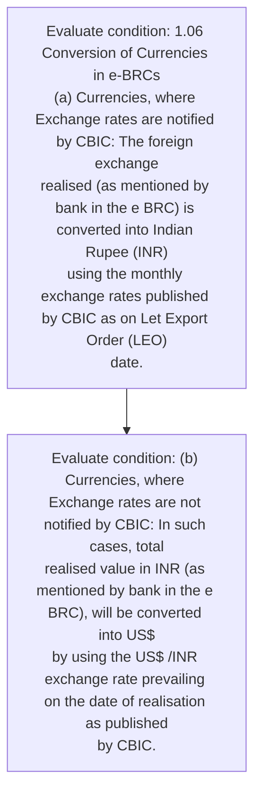
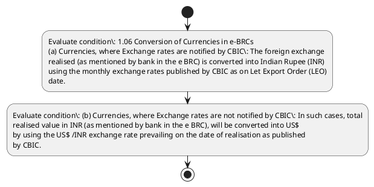

# Chapter 1 / Section 1.06: Conversion of Currencies in e-BRCs

**Chapter Title:** Legal Framework and Trade Facilitation

**Pages:** 5

**Purpose:** Defines the operational requirements for Conversion of Currencies in e-BRCs.

**Purpose Thanglish:** Indha Conversion of Currencies in e-BRCs section-la, Defines the operational requirements for Conversion of Currencies in e-BRCs.

**Summary:** 1.06 Conversion of Currencies in e-BRCs
(a) Currencies, where Exchange rates are notified by CBIC: The foreign exchange
realised (as mentioned by bank in the e BRC) is converted into Indian Rupee (INR)
using the monthly exchange rates published by CBIC as on Let Export Order (LEO)
date. (b) Currencies, where Exchange rates are not notified by CBIC: In such cases, total
realised value in INR (as mentioned by bank in the e BRC), will be converted into US$
by using the US$ /INR exchange rate prevailing on the date of realisation as published
by CBIC.

**Business Meaning:** 1.06 Conversion of Currencies in e-BRCs
(a) Currencies, where Exchange rates are notified by CBIC: The foreign exchange
realised (as mentioned by bank in the e BRC) is converted into Indian Rupee (INR)
using the monthly exchange rates published by CBIC as on Let Export Order (LEO)
date.

**Business Explanation:** 1.06 Conversion of Currencies in e-BRCs
(a) Currencies, where Exchange rates are notified by CBIC: The foreign exchange
realised (as mentioned by bank in the e BRC) is converted into Indian Rupee (INR)
using the monthly exchange rates published by CBIC as on Let Export Order (LEO)
date. (b) Currencies, where Exchange rates are not notified by CBIC: In such cases, total
realised value in INR (as mentioned by bank in the e BRC), will be converted into US$
by using the US$ /INR exchange rate prevailing on the date of realisation as published
by CBIC.

**Business Explanation Thanglish:** Indha Conversion of Currencies in e-BRCs section-la, 1.06 Conversion of Currencies in e-BRCs
(a) Currencies, where Exchange rates are notified by CBIC: The foreign exchange
realised (as mentioned by bank in the e BRC) is converted into Indian Rupee (INR)
using the monthly exchange rates published by CBIC as on Let export Order (LEO)
date. (b) Currencies, where Exchange rates are not notified by CBIC: In such cases, total
realised value in INR (as mentioned by bank in the e BRC), will be converted into US$
by using the US$ /INR exchange rate prevailing on the date of realisation as published
by CBIC.

## Business Logic
- None identified

## Business Rules
- rule_id=CH1-SEC1_06-R001, rule_description=1.06 Conversion of Currencies in e-BRCs
(a) Currencies, where Exchange rates are notified by CBIC: The foreign exchange
realised (as mentioned by bank in the e BRC) is converted into Indian Rupee (INR)
using the monthly exchange rates published by CBIC as on Let Export Order (LEO)
date. (b) Currencies, where Exchange rates are not notified by CBIC: In such cases, total
realised value in INR (as mentioned by bank in the e BRC), will be converted into US$
by using the US$ /INR exchange rate prevailing on the date of realisation as published
by CBIC., trigger=Conversion of Currencies in e-BRCs, condition=1.06 Conversion of Currencies in e-BRCs
(a) Currencies, where Exchange rates are notified by CBIC: The foreign exchange
realised (as mentioned by bank in the e BRC) is converted into Indian Rupee (INR)
using the monthly exchange rates published by CBIC as on Let Export Order (LEO)
date., validation=Not explicitly covered in uploaded documents., action=Manual review required., exception=No explicit exception found in uploaded documents., output=DEKAI should produce a compliance decision for 1.06 - Conversion of Currencies in e-BRCs.

## Conditions
- 1.06 Conversion of Currencies in e-BRCs
(a) Currencies, where Exchange rates are notified by CBIC: The foreign exchange
realised (as mentioned by bank in the e BRC) is converted into Indian Rupee (INR)
using the monthly exchange rates published by CBIC as on Let Export Order (LEO)
date.
- (b) Currencies, where Exchange rates are not notified by CBIC: In such cases, total
realised value in INR (as mentioned by bank in the e BRC), will be converted into US$
by using the US$ /INR exchange rate prevailing on the date of realisation as published
by CBIC.

## Condition Logic
- id=1.1.06.1, if=1.06 Conversion of Currencies in e-BRCs
(a) Currencies, where Exchange rates are notified by CBIC: The foreign exchange
realised (as mentioned by bank in the e BRC) is converted into Indian Rupee (INR)
using the monthly exchange rates published by CBIC as on Let Export Order (LEO)
date., then=Route for review, source=1.06 Conversion of Currencies in e-BRCs
(a) Currencies, where Exchange rates are notified by CBIC: The foreign exchange
realised (as mentioned by bank in the e BRC) is converted into Indian Rupee (INR)
using the monthly exchange rates published by CBIC as on Let Export Order (LEO)
date.
- id=1.1.06.2, if=(b) Currencies, where Exchange rates are not notified by CBIC: In such cases, total
realised value in INR (as mentioned by bank in the e BRC), will be converted into US$
by using the US$ /INR exchange rate prevailing on the date of realisation as published
by CBIC., then=Route for review, source=(b) Currencies, where Exchange rates are not notified by CBIC: In such cases, total
realised value in INR (as mentioned by bank in the e BRC), will be converted into US$
by using the US$ /INR exchange rate prevailing on the date of realisation as published
by CBIC.

## Validations
- None identified

## Exceptions
- None identified

## Dependencies
- None identified

## Authorities
- CBIC

## Required Documents
- None identified

## Timelines
- None identified

## Actions
- None identified

## Workflow
- Evaluate condition: 1.06 Conversion of Currencies in e-BRCs
(a) Currencies, where Exchange rates are notified by CBIC: The foreign exchange
realised (as mentioned by bank in the e BRC) is converted into Indian Rupee (INR)
using the monthly exchange rates published by CBIC as on Let Export Order (LEO)
date.
- Evaluate condition: (b) Currencies, where Exchange rates are not notified by CBIC: In such cases, total
realised value in INR (as mentioned by bank in the e BRC), will be converted into US$
by using the US$ /INR exchange rate prevailing on the date of realisation as published
by CBIC.

## Workflow ASCII
```text
Conversion of Currencies in e-BRCs
Evaluate condition: 1.06 Conversion of Currencies in e-BRCs
(a) Currencies, where Exchange rates are notified by CBIC: The foreign exchange
realised (as mentioned by bank in the e BRC) is converted into Indian Rupee (INR)
using the monthly exchange rates published by CBIC as on Let Export Order (LEO)
date.
   |
   v
Evaluate condition: (b) Currencies, where Exchange rates are not notified by CBIC: In such cases, total
realised value in INR (as mentioned by bank in the e BRC), will be converted into US$
by using the US$ /INR exchange rate prevailing on the date of realisation as published
by CBIC.
```

## Decision Tree
- IF section 1.06 applies THEN proceed with standard DGFT workflow

## Decision Tree ASCII
```text
Conversion of Currencies in e-BRCs Decision
IF section 1.06 applies THEN proceed with standard DGFT workflow
```

## Examples
- User asks to process Conversion of Currencies in e-BRCs; the platform checks conditions, validations, and documents before action.

**Real-world Example:** Example: an importer or exporter invokes Conversion of Currencies in e-BRCs, submits the prescribed DGFT records, and DEKAI uses the extracted rules to follow the conversion of currencies in e-brcs process.

**Real-world Example Thanglish:** Indha Conversion of Currencies in e-BRCs section-la, Example: an importer or exporter invokes Conversion of Currencies in e-BRCs, submits the prescribed DGFT records, and DEKAI uses the extracted rules to follow the conversion of currencies in e-brcs process.

## AI Rules
- None identified

## Database Fields
- name=section_code, type=string, required=True, source=parsed_section_heading
- name=section_title, type=string, required=True, source=parsed_section_heading
- name=are_flag, type=boolean, required=False, source=keyword:are
- name=the_flag, type=boolean, required=False, source=keyword:The
- name=brc_flag, type=boolean, required=False, source=keyword:BRC
- name=inr_flag, type=boolean, required=False, source=keyword:INR
- name=let_flag, type=boolean, required=False, source=keyword:Let
- name=leo_flag, type=boolean, required=False, source=keyword:LEO
- name=not_flag, type=boolean, required=False, source=keyword:not
- name=cbic_flag, type=boolean, required=False, source=keyword:CBIC

## API Requirements
- method=GET, path=/api/dgft/sections/1.06, purpose=Retrieve knowledge payload for section 1.06, query_params=['include=workflow,decision_tree,validations'], response_fields=['section', 'title', 'summary', 'conditions', 'validations', 'exceptions', 'workflow', 'decision_tree']
- method=POST, path=/api/dgft/Conversion-of-Currencies-in-e-BRCs/validate, purpose=Validate inputs and documents for Conversion of Currencies in e-BRCs, request_fields=['section_code', 'section_title'], response_fields=['status', 'errors', 'warnings', 'next_actions']

## UI Screens
- screen_id=Conversion_of_Currencies_in_e_BRCs_overview, name=Conversion of Currencies in e-BRCs Overview, purpose=Show section summary, authority, timeline, and eligibility cues., widgets=['summary_card', 'conditions_table', 'authority_badges', 'timeline_panel']
- screen_id=Conversion_of_Currencies_in_e_BRCs_submission, name=Conversion of Currencies in e-BRCs Submission, purpose=Capture applicant data and supporting documents., widgets=['dynamic_form', 'document_uploader', 'validation_panel', 'next_action_footer'], fields=['section_code', 'section_title', 'are_flag', 'the_flag', 'brc_flag', 'inr_flag', 'let_flag', 'leo_flag']

## Error Messages
- Validation failed because the section requirements were not fully met.

## FAQ
- question_en=What is the purpose of section 1.06?, answer_en=1.06 Conversion of Currencies in e-BRCs
(a) Currencies, where Exchange rates are notified by CBIC: The foreign exchange
realised (as mentioned by bank in the e BRC) is converted into Indian Rupee (INR)
using the monthly exchange rates published by CBIC as on Let Export Order (LEO)
date. (b) Currencies, where Exchange rates are not notified by CBIC: In such cases, total
realised value in INR (as mentioned by bank in the e BRC), will be converted into US$
by using the US$ /INR exchange rate prevailing on the date of realisation as published
by CBIC., question_thanglish=Indha Conversion of Currencies in e-BRCs section-la, What is the purpose of section 1.06?, answer_thanglish=Indha Conversion of Currencies in e-BRCs section-la, 1.06 Conversion of Currencies in e-BRCs
(a) Currencies, where Exchange rates are notified by CBIC: The foreign exchange
realised (as mentioned by bank in the e BRC) is converted into Indian Rupee (INR)
using the monthly exchange rates published by CBIC as on Let export Order (LEO)
date. (b) Currencies, where Exchange rates are not notified by CBIC: In such cases, total
realised value in INR (as mentioned by bank in the e BRC), will be converted into US$
by using the US$ /INR exchange rate prevailing on the date of realisation as published
by CBIC.
- question_en=What documents are required under Conversion of Currencies in e-BRCs?, answer_en=Not explicitly covered in uploaded documents., question_thanglish=Indha Conversion of Currencies in e-BRCs section-la, What documents are required under Conversion of Currencies in e-BRCs?, answer_thanglish=Indha Conversion of Currencies in e-BRCs section-la, Not explicitly covered in uploaded documents.
- question_en=Which authority handles Conversion of Currencies in e-BRCs?, answer_en=CBIC, question_thanglish=Indha Conversion of Currencies in e-BRCs section-la, Which authority handles Conversion of Currencies in e-BRCs?, answer_thanglish=Indha Conversion of Currencies in e-BRCs section-la, CBIC

## Questions Users May Ask
- What does Conversion of Currencies in e-BRCs require?
- Which documents are needed for Conversion of Currencies in e-BRCs?
- How does DEKAI validate Conversion of Currencies in e-BRCs requests?

## Expected AI Answers
- Conversion of Currencies in e-BRCs requires the platform to interpret the section text, apply the extracted business rules, and present the correct next action.
- Required documents are inferred from the section text: no explicit documents were detected.
- DEKAI validates Conversion of Currencies in e-BRCs by checking conditions, required documents, authority references, and exception clauses before recommending an outcome.

## AI Q&A Examples
- question_en=User asks: How do I comply with Conversion of Currencies in e-BRCs?, answer_en=AI answers: DEKAI should evaluate section 1.06, apply the extracted rules, and guide the user through Evaluate condition: 1.06 Conversion of Currencies in e-BRCs
(a) Currencies, where Exchange rates are notified by CBIC: The foreign exchange
realised (as mentioned by bank in the e BRC) is converted into Indian Rupee (INR)
using the monthly exchange rates published by CBIC as on Let Export Order (LEO)
date.., question_thanglish=Indha Conversion of Currencies in e-BRCs section-la, User asks: How do I comply with Conversion of Currencies in e-BRCs?, answer_thanglish=Indha Conversion of Currencies in e-BRCs section-la, AI answers: DEKAI should evaluate section 1.06, apply the extracted rules, and guide the user through Evaluate condition: 1.06 Conversion of Currencies in e-BRCs
(a) Currencies, where Exchange rates are notified by CBIC: The foreign exchange
realised (as mentioned by bank in the e BRC) is converted into Indian Rupee (INR)
using the monthly exchange rates published by CBIC as on Let export Order (LEO)
date..
- question_en=User asks: Which validations apply to Conversion of Currencies in e-BRCs?, answer_en=AI answers: Applicable validations are not explicitly covered in the uploaded documents., question_thanglish=Indha Conversion of Currencies in e-BRCs section-la, User asks: Which validations apply to Conversion of Currencies in e-BRCs?, answer_thanglish=Indha Conversion of Currencies in e-BRCs section-la, AI answers: Applicable validations are not explicitly covered in the uploaded documents.

## DEKAI AI Implementation Notes
- Capture chapter 1, section 1.06, title, and page references as immutable knowledge metadata.
- Bind validations for Conversion of Currencies in e-BRCs into a rule engine keyed by the rule IDs extracted for this section.
- Route escalations or approvals to: CBIC.

## DEKAI AI Implementation Notes Thanglish
- Indha Conversion of Currencies in e-BRCs section-la, Capture chapter 1, section 1.06, title, and page references as immutable knowledge metadata.
- Indha Conversion of Currencies in e-BRCs section-la, Bind validations for Conversion of Currencies in e-BRCs into a rule engine keyed by the rule IDs extracted for this section.
- Indha Conversion of Currencies in e-BRCs section-la, Route escalations or approvals to: CBIC.

## AI Metadata
- Keywords: are, The, BRC, INR, Let, LEO, not, CBIC, bank, into, date, such, will, rate, where, rates, Rupee, using, Order, cases
- Search Keywords: are, The, BRC, INR, Let, LEO, not, CBIC, bank, into, date, such, will, rate, where, rates, Rupee, using, Order, cases
- Intent: Provide knowledge guidance for Conversion of Currencies in e-BRCs.
- Tags: 1.06, Conversion of Currencies in e-BRCs, dgft
- Related Sections: 
- Related Chapters: 
- Related Rules: 

## Mermaid


## PlantUML

