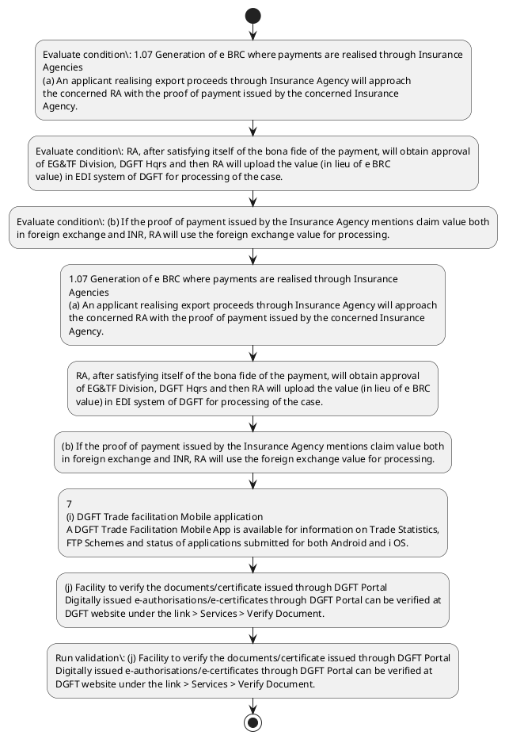

# Chapter 1 / Section 1.07: Generation of e BRC where payments are realised through Insurance

**Chapter Title:** Legal Framework and Trade Facilitation

**Pages:** 5, 6

**Purpose:** RA, after satisfying itself of the bona fide of the payment, will obtain approval
of EG&TF Division, DGFT Hqrs and then RA will upload the value (in lieu of e BRC
value) in EDI system of DGFT for processing of the case.

**Purpose Thanglish:** Indha Generation of e BRC where payments are realised through Insurance section-la, RA, after satisfying itself of the bona fide of the payment, will obtain approval
of EG&TF Division, DGFT Hqrs and then RA will upload the value (in lieu of e BRC
value) in EDI system of DGFT for processing of the case.

**Summary:** 1.07 Generation of e BRC where payments are realised through Insurance
Agencies
(a) An applicant realising export proceeds through Insurance Agency will approach
the concerned RA with the proof of payment issued by the concerned Insurance
Agency. RA, after satisfying itself of the bona fide of the payment, will obtain approval
of EG&TF Division, DGFT Hqrs and then RA will upload the value (in lieu of e BRC
value) in EDI system of DGFT for processing of the case. (b) If the proof of payment issued by the Insurance Agency mentions claim value both
in foreign exchange and INR, RA will use the foreign exchange value for processing.

**Business Meaning:** 1.07 Generation of e BRC where payments are realised through Insurance
Agencies
(a) An applicant realising export proceeds through Insurance Agency will approach
the concerned RA with the proof of payment issued by the concerned Insurance
Agency.

**Business Explanation:** 1.07 Generation of e BRC where payments are realised through Insurance
Agencies
(a) An applicant realising export proceeds through Insurance Agency will approach
the concerned RA with the proof of payment issued by the concerned Insurance
Agency. RA, after satisfying itself of the bona fide of the payment, will obtain approval
of EG&TF Division, DGFT Hqrs and then RA will upload the value (in lieu of e BRC
value) in EDI system of DGFT for processing of the case. (b) If the proof of payment issued by the Insurance Agency mentions claim value both
in foreign exchange and INR, RA will use the foreign exchange value for processing.

**Business Explanation Thanglish:** Indha Generation of e BRC where payments are realised through Insurance section-la, 1.07 Generation of e BRC where payments are realised through Insurance
Agencies
(a) An applicant realising export proceeds through Insurance Agency will approach
the concerned RA with the proof of payment issued by the concerned Insurance
Agency. RA, after satisfying itself of the bona fide of the payment, will obtain approval
of EG&TF Division, DGFT Hqrs and then RA will upload the value (in lieu of e BRC
value) in EDI system of DGFT for processing of the case. (b) If the proof of payment issued by the Insurance Agency mentions claim value both
in foreign exchange and INR, RA will use the foreign exchange value for processing.

## Business Logic
- None identified

## Business Rules
- rule_id=CH1-SEC1_07-R001, rule_description=IF validations pass THEN recommend action: 1.07 Generation of e BRC where payments are realised through Insurance
Agencies
(a) An applicant realising export proceeds through Insurance Agency will approach
the concerned RA with the proof of payment issued by the concerned Insurance
Agency., trigger=Generation of e BRC where payments are realised through Insurance, condition=1.07 Generation of e BRC where payments are realised through Insurance
Agencies
(a) An applicant realising export proceeds through Insurance Agency will approach
the concerned RA with the proof of payment issued by the concerned Insurance
Agency., validation=(j) Facility to verify the documents/certificate issued through DGFT Portal
Digitally issued e-authorisations/e-certificates through DGFT Portal can be verified at
DGFT website under the link > Services > Verify Document., action=1.07 Generation of e BRC where payments are realised through Insurance
Agencies
(a) An applicant realising export proceeds through Insurance Agency will approach
the concerned RA with the proof of payment issued by the concerned Insurance
Agency., exception=No explicit exception found in uploaded documents., output=DEKAI should produce a compliance decision for 1.07 - Generation of e BRC where payments are realised through Insurance.

## Conditions
- 1.07 Generation of e BRC where payments are realised through Insurance
Agencies
(a) An applicant realising export proceeds through Insurance Agency will approach
the concerned RA with the proof of payment issued by the concerned Insurance
Agency.
- RA, after satisfying itself of the bona fide of the payment, will obtain approval
of EG&TF Division, DGFT Hqrs and then RA will upload the value (in lieu of e BRC
value) in EDI system of DGFT for processing of the case.
- (b) If the proof of payment issued by the Insurance Agency mentions claim value both
in foreign exchange and INR, RA will use the foreign exchange value for processing.
- If
the claim value is mentioned only in equivalent INR, RA will convert this INR value in
equivalent US$ using the exchange rate (published by CBIC) applicable on the date of
settlement of insurance claim.
- (j) Facility to verify the documents/certificate issued through DGFT Portal
Digitally issued e-authorisations/e-certificates through DGFT Portal can be verified at
DGFT website under the link > Services > Verify Document.
- STATUS HOLDER CERTIFICATION

## Condition Logic
- id=1.1.07.1, if=1.07 Generation of e BRC where payments are realised through Insurance
Agencies
(a) An applicant realising export proceeds through Insurance Agency will approach
the concerned RA with the proof of payment issued by the concerned Insurance
Agency., then=1.07 Generation of e BRC where payments are realised through Insurance
Agencies
(a) An applicant realising export proceeds through Insurance Agency will approach
the concerned RA with the proof of payment issued by the concerned Insurance
Agency., source=1.07 Generation of e BRC where payments are realised through Insurance
Agencies
(a) An applicant realising export proceeds through Insurance Agency will approach
the concerned RA with the proof of payment issued by the concerned Insurance
Agency.
- id=1.1.07.2, if=RA, after satisfying itself of the bona fide of the payment, will obtain approval
of EG&TF Division, DGFT Hqrs and then RA will upload the value (in lieu of e BRC
value) in EDI system of DGFT for processing of the case., then=1.07 Generation of e BRC where payments are realised through Insurance
Agencies
(a) An applicant realising export proceeds through Insurance Agency will approach
the concerned RA with the proof of payment issued by the concerned Insurance
Agency., source=RA, after satisfying itself of the bona fide of the payment, will obtain approval
of EG&TF Division, DGFT Hqrs and then RA will upload the value (in lieu of e BRC
value) in EDI system of DGFT for processing of the case.
- id=1.1.07.3, if=(b) If the proof of payment issued by the Insurance Agency mentions claim value both
in foreign exchange and INR, RA will use the foreign exchange value for processing., then=1.07 Generation of e BRC where payments are realised through Insurance
Agencies
(a) An applicant realising export proceeds through Insurance Agency will approach
the concerned RA with the proof of payment issued by the concerned Insurance
Agency., source=(b) If the proof of payment issued by the Insurance Agency mentions claim value both
in foreign exchange and INR, RA will use the foreign exchange value for processing.
- id=1.1.07.4, if=the claim value is mentioned only in equivalent INR, then=1.07 Generation of e BRC where payments are realised through Insurance
Agencies
(a) An applicant realising export proceeds through Insurance Agency will approach
the concerned RA with the proof of payment issued by the concerned Insurance
Agency., source=If
the claim value is mentioned only in equivalent INR, RA will convert this INR value in
equivalent US$ using the exchange rate (published by CBIC) applicable on the date of
settlement of insurance claim.
- id=1.1.07.5, if=(j) Facility to verify the documents/certificate issued through DGFT Portal
Digitally issued e-authorisations/e-certificates through DGFT Portal can be verified at
DGFT website under the link > Services > Verify Document., then=1.07 Generation of e BRC where payments are realised through Insurance
Agencies
(a) An applicant realising export proceeds through Insurance Agency will approach
the concerned RA with the proof of payment issued by the concerned Insurance
Agency., source=(j) Facility to verify the documents/certificate issued through DGFT Portal
Digitally issued e-authorisations/e-certificates through DGFT Portal can be verified at
DGFT website under the link > Services > Verify Document.
- id=1.1.07.6, if=STATUS HOLDER CERTIFICATION, then=1.07 Generation of e BRC where payments are realised through Insurance
Agencies
(a) An applicant realising export proceeds through Insurance Agency will approach
the concerned RA with the proof of payment issued by the concerned Insurance
Agency., source=STATUS HOLDER CERTIFICATION

## Validations
- (j) Facility to verify the documents/certificate issued through DGFT Portal
Digitally issued e-authorisations/e-certificates through DGFT Portal can be verified at
DGFT website under the link > Services > Verify Document.

## Exceptions
- None identified

## Dependencies
- None identified

## Authorities
- RA
- DGFT
- DGFT Hqrs and then RA
- EDI system of DGFT
- CBIC
- Facility to verify the documents/certificate issued through DGFT
- Digitally issued e-authorisations/e-certificates through DGFT

## Required Documents
- 1.07 Generation of e BRC where payments are realised through Insurance
Agencies
(a) An applicant realising export proceeds through Insurance Agency will approach
the concerned RA with the proof of payment issued by the concerned Insurance
Agency.
- (b) If the proof of payment issued by the Insurance Agency mentions claim value both
in foreign exchange and INR, RA will use the foreign exchange value for processing.
- 7
(i) DGFT Trade facilitation Mobile application
A DGFT Trade Facilitation Mobile App is available for information on Trade Statistics,
FTP Schemes and status of applications submitted for both Android and i OS.
- Verify Document

## Timelines
- RA, after satisfying itself of the bona fide of the payment, will obtain approval
of EG&TF Division, DGFT Hqrs and then RA will upload the value (in lieu of e BRC
value) in EDI system of DGFT for processing of the case.

## Actions
- 1.07 Generation of e BRC where payments are realised through Insurance
Agencies
(a) An applicant realising export proceeds through Insurance Agency will approach
the concerned RA with the proof of payment issued by the concerned Insurance
Agency.
- RA, after satisfying itself of the bona fide of the payment, will obtain approval
of EG&TF Division, DGFT Hqrs and then RA will upload the value (in lieu of e BRC
value) in EDI system of DGFT for processing of the case.
- (b) If the proof of payment issued by the Insurance Agency mentions claim value both
in foreign exchange and INR, RA will use the foreign exchange value for processing.
- 7
(i) DGFT Trade facilitation Mobile application
A DGFT Trade Facilitation Mobile App is available for information on Trade Statistics,
FTP Schemes and status of applications submitted for both Android and i OS.
- (j) Facility to verify the documents/certificate issued through DGFT Portal
Digitally issued e-authorisations/e-certificates through DGFT Portal can be verified at
DGFT website under the link > Services > Verify Document.

## Workflow
- Evaluate condition: 1.07 Generation of e BRC where payments are realised through Insurance
Agencies
(a) An applicant realising export proceeds through Insurance Agency will approach
the concerned RA with the proof of payment issued by the concerned Insurance
Agency.
- Evaluate condition: RA, after satisfying itself of the bona fide of the payment, will obtain approval
of EG&TF Division, DGFT Hqrs and then RA will upload the value (in lieu of e BRC
value) in EDI system of DGFT for processing of the case.
- Evaluate condition: (b) If the proof of payment issued by the Insurance Agency mentions claim value both
in foreign exchange and INR, RA will use the foreign exchange value for processing.
- 1.07 Generation of e BRC where payments are realised through Insurance
Agencies
(a) An applicant realising export proceeds through Insurance Agency will approach
the concerned RA with the proof of payment issued by the concerned Insurance
Agency.
- RA, after satisfying itself of the bona fide of the payment, will obtain approval
of EG&TF Division, DGFT Hqrs and then RA will upload the value (in lieu of e BRC
value) in EDI system of DGFT for processing of the case.
- (b) If the proof of payment issued by the Insurance Agency mentions claim value both
in foreign exchange and INR, RA will use the foreign exchange value for processing.
- 7
(i) DGFT Trade facilitation Mobile application
A DGFT Trade Facilitation Mobile App is available for information on Trade Statistics,
FTP Schemes and status of applications submitted for both Android and i OS.
- (j) Facility to verify the documents/certificate issued through DGFT Portal
Digitally issued e-authorisations/e-certificates through DGFT Portal can be verified at
DGFT website under the link > Services > Verify Document.
- Run validation: (j) Facility to verify the documents/certificate issued through DGFT Portal
Digitally issued e-authorisations/e-certificates through DGFT Portal can be verified at
DGFT website under the link > Services > Verify Document.

## Workflow ASCII
```text
Generation of e BRC where payments are realised through Insurance
Evaluate condition: 1.07 Generation of e BRC where payments are realised through Insurance
Agencies
(a) An applicant realising export proceeds through Insurance Agency will approach
the concerned RA with the proof of payment issued by the concerned Insurance
Agency.
   |
   v
Evaluate condition: RA, after satisfying itself of the bona fide of the payment, will obtain approval
of EG&TF Division, DGFT Hqrs and then RA will upload the value (in lieu of e BRC
value) in EDI system of DGFT for processing of the case.
   |
   v
Evaluate condition: (b) If the proof of payment issued by the Insurance Agency mentions claim value both
in foreign exchange and INR, RA will use the foreign exchange value for processing.
   |
   v
1.07 Generation of e BRC where payments are realised through Insurance
Agencies
(a) An applicant realising export proceeds through Insurance Agency will approach
the concerned RA with the proof of payment issued by the concerned Insurance
Agency.
   |
   v
RA, after satisfying itself of the bona fide of the payment, will obtain approval
of EG&TF Division, DGFT Hqrs and then RA will upload the value (in lieu of e BRC
value) in EDI system of DGFT for processing of the case.
   |
   v
(b) If the proof of payment issued by the Insurance Agency mentions claim value both
in foreign exchange and INR, RA will use the foreign exchange value for processing.
   |
   v
7
(i) DGFT Trade facilitation Mobile application
A DGFT Trade Facilitation Mobile App is available for information on Trade Statistics,
FTP Schemes and status of applications submitted for both Android and i OS.
   |
   v
(j) Facility to verify the documents/certificate issued through DGFT Portal
Digitally issued e-authorisations/e-certificates through DGFT Portal can be verified at
DGFT website under the link > Services > Verify Document.
   |
   v
Run validation: (j) Facility to verify the documents/certificate issued through DGFT Portal
Digitally issued e-authorisations/e-certificates through DGFT Portal can be verified at
DGFT website under the link > Services > Verify Document.
```

## Decision Tree
- IF 1.07 Generation of e BRC where payments are realised through Insurance
Agencies
(a) An applicant realising export proceeds through Insurance Agency will approach
the concerned RA with the proof of payment issued by the concerned Insurance
Agency. THEN 1.07 Generation of e BRC where payments are realised through Insurance
Agencies
(a) An applicant realising export proceeds through Insurance Agency will approach
the concerned RA with the proof of payment issued by the concerned Insurance
Agency.
- IF RA, after satisfying itself of the bona fide of the payment, will obtain approval
of EG&TF Division, DGFT Hqrs and then RA will upload the value (in lieu of e BRC
value) in EDI system of DGFT for processing of the case. THEN 1.07 Generation of e BRC where payments are realised through Insurance
Agencies
(a) An applicant realising export proceeds through Insurance Agency will approach
the concerned RA with the proof of payment issued by the concerned Insurance
Agency.
- IF (b) If the proof of payment issued by the Insurance Agency mentions claim value both
in foreign exchange and INR, RA will use the foreign exchange value for processing. THEN 1.07 Generation of e BRC where payments are realised through Insurance
Agencies
(a) An applicant realising export proceeds through Insurance Agency will approach
the concerned RA with the proof of payment issued by the concerned Insurance
Agency.
- IF If
the claim value is mentioned only in equivalent INR, RA will convert this INR value in
equivalent US$ using the exchange rate (published by CBIC) applicable on the date of
settlement of insurance claim. THEN 1.07 Generation of e BRC where payments are realised through Insurance
Agencies
(a) An applicant realising export proceeds through Insurance Agency will approach
the concerned RA with the proof of payment issued by the concerned Insurance
Agency.
- IF (j) Facility to verify the documents/certificate issued through DGFT Portal
Digitally issued e-authorisations/e-certificates through DGFT Portal can be verified at
DGFT website under the link > Services > Verify Document. THEN 1.07 Generation of e BRC where payments are realised through Insurance
Agencies
(a) An applicant realising export proceeds through Insurance Agency will approach
the concerned RA with the proof of payment issued by the concerned Insurance
Agency.

## Decision Tree ASCII
```text
Generation of e BRC where payments are realised through Insurance Decision
IF 1.07 Generation of e BRC where payments are realised through Insurance
Agencies
(a) An applicant realising export proceeds through Insurance Agency will approach
the concerned RA with the proof of payment issued by the concerned Insurance
Agency. THEN 1.07 Generation of e BRC where payments are realised through Insurance
Agencies
(a) An applicant realising export proceeds through Insurance Agency will approach
the concerned RA with the proof of payment issued by the concerned Insurance
Agency.
   |
   v
IF RA, after satisfying itself of the bona fide of the payment, will obtain approval
of EG&TF Division, DGFT Hqrs and then RA will upload the value (in lieu of e BRC
value) in EDI system of DGFT for processing of the case. THEN 1.07 Generation of e BRC where payments are realised through Insurance
Agencies
(a) An applicant realising export proceeds through Insurance Agency will approach
the concerned RA with the proof of payment issued by the concerned Insurance
Agency.
   |
   v
IF (b) If the proof of payment issued by the Insurance Agency mentions claim value both
in foreign exchange and INR, RA will use the foreign exchange value for processing. THEN 1.07 Generation of e BRC where payments are realised through Insurance
Agencies
(a) An applicant realising export proceeds through Insurance Agency will approach
the concerned RA with the proof of payment issued by the concerned Insurance
Agency.
   |
   v
IF If
the claim value is mentioned only in equivalent INR, RA will convert this INR value in
equivalent US$ using the exchange rate (published by CBIC) applicable on the date of
settlement of insurance claim. THEN 1.07 Generation of e BRC where payments are realised through Insurance
Agencies
(a) An applicant realising export proceeds through Insurance Agency will approach
the concerned RA with the proof of payment issued by the concerned Insurance
Agency.
   |
   v
IF (j) Facility to verify the documents/certificate issued through DGFT Portal
Digitally issued e-authorisations/e-certificates through DGFT Portal can be verified at
DGFT website under the link > Services > Verify Document. THEN 1.07 Generation of e BRC where payments are realised through Insurance
Agencies
(a) An applicant realising export proceeds through Insurance Agency will approach
the concerned RA with the proof of payment issued by the concerned Insurance
Agency.
```

## Examples
- User asks to process Generation of e BRC where payments are realised through Insurance; the platform checks conditions, validations, and documents before action.

**Real-world Example:** Example: an importer or exporter invokes Generation of e BRC where payments are realised through Insurance, submits 1.07 Generation of e BRC where payments are realised through Insurance
Agencies
(a) An applicant realising export proceeds through Insurance Agency will approach
the concerned RA with the proof of payment issued by the concerned Insurance
Agency., (b) If the proof of payment issued by the Insurance Agency mentions claim value both
in foreign exchange and INR, RA will use the foreign exchange value for processing., 7
(i) DGFT Trade facilitation Mobile application
A DGFT Trade Facilitation Mobile App is available for information on Trade Statistics,
FTP Schemes and status of applications submitted for both Android and i OS., and DEKAI uses the extracted rules to 1.07 generation of e brc where payments are realised through insurance
agencies
(a) an applicant realising export proceeds through insurance agency will approach
the concerned ra with the proof of payment issued by the concerned insurance
agency..

**Real-world Example Thanglish:** Indha Generation of e BRC where payments are realised through Insurance section-la, Example: an importer or exporter invokes Generation of e BRC where payments are realised through Insurance, submits 1.07 Generation of e BRC where payments are realised through Insurance
Agencies
(a) An applicant realising export proceeds through Insurance Agency will approach
the concerned RA with the proof of payment issued by the concerned Insurance
Agency., (b) If the proof of payment issued by the Insurance Agency mentions claim value both
in foreign exchange and INR, RA will use the foreign exchange value for processing., 7
(i) DGFT Trade facilitation Mobile application
A DGFT Trade Facilitation Mobile App is available for information on Trade Statistics,
FTP Schemes and status of applications submitted for both Android and i OS., and DEKAI uses the extracted rules to 1.07 generation of e brc where payments are realised through insurance
agencies
(a) an applicant realising export proceeds through insurance agency will approach
the concerned ra with the proof of payment issued by the concerned insurance
agency..

## AI Rules
- IF validations pass THEN recommend action: 1.07 Generation of e BRC where payments are realised through Insurance
Agencies
(a) An applicant realising export proceeds through Insurance Agency will approach
the concerned RA with the proof of payment issued by the concerned Insurance
Agency.

## Database Fields
- name=section_code, type=string, required=True, source=parsed_section_heading
- name=section_title, type=string, required=True, source=parsed_section_heading
- name=brc_flag, type=boolean, required=False, source=keyword:BRC
- name=are_flag, type=boolean, required=False, source=keyword:are
- name=the_flag, type=boolean, required=False, source=keyword:the
- name=and_flag, type=boolean, required=False, source=keyword:and
- name=edi_flag, type=boolean, required=False, source=keyword:EDI
- name=for_flag, type=boolean, required=False, source=keyword:for
- name=inr_flag, type=boolean, required=False, source=keyword:INR
- name=use_flag, type=boolean, required=False, source=keyword:use
- name=document_1_submitted, type=boolean, required=True, source=1.07 Generation of e BRC where payments are realised through Insurance
Agencies
(a) An applicant realising export proceeds through Insurance Agency will approach
the concerned RA with the proof of payment issued by the concerned Insurance
Agency.
- name=document_2_submitted, type=boolean, required=True, source=(b) If the proof of payment issued by the Insurance Agency mentions claim value both
in foreign exchange and INR, RA will use the foreign exchange value for processing.
- name=document_3_submitted, type=boolean, required=True, source=7
(i) DGFT Trade facilitation Mobile application
A DGFT Trade Facilitation Mobile App is available for information on Trade Statistics,
FTP Schemes and status of applications submitted for both Android and i OS.
- name=document_4_submitted, type=boolean, required=True, source=Verify Document

## API Requirements
- method=GET, path=/api/dgft/sections/1.07, purpose=Retrieve knowledge payload for section 1.07, query_params=['include=workflow,decision_tree,validations'], response_fields=['section', 'title', 'summary', 'conditions', 'validations', 'exceptions', 'workflow', 'decision_tree']
- method=POST, path=/api/dgft/Generation-of-e-BRC-where-payments-are-realised-through-Insurance/validate, purpose=Validate inputs and documents for Generation of e BRC where payments are realised through Insurance, request_fields=['section_code', 'section_title', 'document_1_submitted', 'document_2_submitted', 'document_3_submitted', 'document_4_submitted'], response_fields=['status', 'errors', 'warnings', 'next_actions']
- method=POST, path=/api/dgft/Generation-of-e-BRC-where-payments-are-realised-through-Insurance/execute, purpose=Trigger business action for 1.07 Generation of e BRC where payments are realised through Insurance
Agencies
(a) An applicant realising export proceeds through Insurance Agency will approach
the concerned RA with the proof of payment issued by the concerned Insurance
Agency., request_fields=['section_code', 'section_title', 'document_1_submitted', 'document_2_submitted', 'document_3_submitted', 'document_4_submitted'], response_fields=['reference_id', 'status', 'authority', 'timeline']

## UI Screens
- screen_id=Generation_of_e_BRC_where_payments_are_realised_through_Insurance_overview, name=Generation of e BRC where payments are realised through Insurance Overview, purpose=Show section summary, authority, timeline, and eligibility cues., widgets=['summary_card', 'conditions_table', 'authority_badges', 'timeline_panel']
- screen_id=Generation_of_e_BRC_where_payments_are_realised_through_Insurance_submission, name=Generation of e BRC where payments are realised through Insurance Submission, purpose=Capture applicant data and supporting documents., widgets=['dynamic_form', 'document_uploader', 'validation_panel', 'next_action_footer'], fields=['section_code', 'section_title', 'brc_flag', 'are_flag', 'the_flag', 'and_flag', 'edi_flag', 'for_flag']

## Error Messages
- Validation failed because the section requirements were not fully met.

## FAQ
- question_en=What is the purpose of section 1.07?, answer_en=1.07 Generation of e BRC where payments are realised through Insurance
Agencies
(a) An applicant realising export proceeds through Insurance Agency will approach
the concerned RA with the proof of payment issued by the concerned Insurance
Agency. RA, after satisfying itself of the bona fide of the payment, will obtain approval
of EG&TF Division, DGFT Hqrs and then RA will upload the value (in lieu of e BRC
value) in EDI system of DGFT for processing of the case. (b) If the proof of payment issued by the Insurance Agency mentions claim value both
in foreign exchange and INR, RA will use the foreign exchange value for processing., question_thanglish=Indha Generation of e BRC where payments are realised through Insurance section-la, What is the purpose of section 1.07?, answer_thanglish=Indha Generation of e BRC where payments are realised through Insurance section-la, 1.07 Generation of e BRC where payments are realised through Insurance
Agencies
(a) An applicant realising export proceeds through Insurance Agency will approach
the concerned RA with the proof of payment issued by the concerned Insurance
Agency. RA, after satisfying itself of the bona fide of the payment, will obtain approval
of EG&TF Division, DGFT Hqrs and then RA will upload the value (in lieu of e BRC
value) in EDI system of DGFT for processing of the case. (b) If the proof of payment issued by the Insurance Agency mentions claim value both
in foreign exchange and INR, RA will use the foreign exchange value for processing.
- question_en=What documents are required under Generation of e BRC where payments are realised through Insurance?, answer_en=1.07 Generation of e BRC where payments are realised through Insurance
Agencies
(a) An applicant realising export proceeds through Insurance Agency will approach
the concerned RA with the proof of payment issued by the concerned Insurance
Agency., (b) If the proof of payment issued by the Insurance Agency mentions claim value both
in foreign exchange and INR, RA will use the foreign exchange value for processing., 7
(i) DGFT Trade facilitation Mobile application
A DGFT Trade Facilitation Mobile App is available for information on Trade Statistics,
FTP Schemes and status of applications submitted for both Android and i OS., Verify Document, question_thanglish=Indha Generation of e BRC where payments are realised through Insurance section-la, What documents are required under Generation of e BRC where payments are realised through Insurance?, answer_thanglish=Indha Generation of e BRC where payments are realised through Insurance section-la, 1.07 Generation of e BRC where payments are realised through Insurance
Agencies
(a) An applicant realising export proceeds through Insurance Agency will approach
the concerned RA with the proof of payment issued by the concerned Insurance
Agency., (b) If the proof of payment issued by the Insurance Agency mentions claim value both
in foreign exchange and INR, RA will use the foreign exchange value for processing., 7
(i) DGFT Trade facilitation Mobile application
A DGFT Trade Facilitation Mobile App is available for information on Trade Statistics,
FTP Schemes and status of applications submitted for both Android and i OS., Verify Document
- question_en=Which authority handles Generation of e BRC where payments are realised through Insurance?, answer_en=RA, DGFT, DGFT Hqrs and then RA, EDI system of DGFT, CBIC, Facility to verify the documents/certificate issued through DGFT, Digitally issued e-authorisations/e-certificates through DGFT, question_thanglish=Indha Generation of e BRC where payments are realised through Insurance section-la, Which authority handles Generation of e BRC where payments are realised through Insurance?, answer_thanglish=Indha Generation of e BRC where payments are realised through Insurance section-la, RA, DGFT, DGFT Hqrs and then RA, EDI system of DGFT, CBIC, Facility to verify the documents/certificate issued through DGFT, Digitally issued e-authorisations/e-certificates through DGFT

## Questions Users May Ask
- What does Generation of e BRC where payments are realised through Insurance require?
- Which documents are needed for Generation of e BRC where payments are realised through Insurance?
- How does DEKAI validate Generation of e BRC where payments are realised through Insurance requests?
- What action should be taken for Generation of e BRC where payments are realised through Insurance?

## Expected AI Answers
- Generation of e BRC where payments are realised through Insurance requires the platform to interpret the section text, apply the extracted business rules, and present the correct next action.
- Required documents are inferred from the section text: 1.07 Generation of e BRC where payments are realised through Insurance
Agencies
(a) An applicant realising export proceeds through Insurance Agency will approach
the concerned RA with the proof of payment issued by the concerned Insurance
Agency., (b) If the proof of payment issued by the Insurance Agency mentions claim value both
in foreign exchange and INR, RA will use the foreign exchange value for processing., 7
(i) DGFT Trade facilitation Mobile application
A DGFT Trade Facilitation Mobile App is available for information on Trade Statistics,
FTP Schemes and status of applications submitted for both Android and i OS., Verify Document
- DEKAI validates Generation of e BRC where payments are realised through Insurance by checking conditions, required documents, authority references, and exception clauses before recommending an outcome.
- The primary extracted action is: 1.07 Generation of e BRC where payments are realised through Insurance
Agencies
(a) An applicant realising export proceeds through Insurance Agency will approach
the concerned RA with the proof of payment issued by the concerned Insurance
Agency.

## AI Q&A Examples
- question_en=User asks: How do I comply with Generation of e BRC where payments are realised through Insurance?, answer_en=AI answers: DEKAI should evaluate section 1.07, apply the extracted rules, and guide the user through Evaluate condition: 1.07 Generation of e BRC where payments are realised through Insurance
Agencies
(a) An applicant realising export proceeds through Insurance Agency will approach
the concerned RA with the proof of payment issued by the concerned Insurance
Agency.., question_thanglish=Indha Generation of e BRC where payments are realised through Insurance section-la, User asks: How do I comply with Generation of e BRC where payments are realised through Insurance?, answer_thanglish=Indha Generation of e BRC where payments are realised through Insurance section-la, AI answers: DEKAI should evaluate section 1.07, apply the extracted rules, and guide the user through Evaluate condition: 1.07 Generation of e BRC where payments are realised through Insurance
Agencies
(a) An applicant realising export proceeds through Insurance Agency will approach
the concerned RA with the proof of payment issued by the concerned Insurance
Agency..
- question_en=User asks: Which validations apply to Generation of e BRC where payments are realised through Insurance?, answer_en=AI answers: Applicable validations are (j) Facility to verify the documents/certificate issued through DGFT Portal
Digitally issued e-authorisations/e-certificates through DGFT Portal can be verified at
DGFT website under the link > Services > Verify Document., question_thanglish=Indha Generation of e BRC where payments are realised through Insurance section-la, User asks: Which validations apply to Generation of e BRC where payments are realised through Insurance?, answer_thanglish=Indha Generation of e BRC where payments are realised through Insurance section-la, AI answers: Applicable validations are (j) Facility to verify the documents/certificate issued through DGFT Portal
Digitally issued e-authorisations/e-certificates through DGFT Portal can be verified at
DGFT website under the link > Services > Verify Document.

## DEKAI AI Implementation Notes
- Capture chapter 1, section 1.07, title, and page references as immutable knowledge metadata.
- Bind validations for Generation of e BRC where payments are realised through Insurance into a rule engine keyed by the rule IDs extracted for this section.
- Expose document upload controls for: 1.07 Generation of e BRC where payments are realised through Insurance
Agencies
(a) An applicant realising export proceeds through Insurance Agency will approach
the concerned RA with the proof of payment issued by the concerned Insurance
Agency., (b) If the proof of payment issued by the Insurance Agency mentions claim value both
in foreign exchange and INR, RA will use the foreign exchange value for processing., 7
(i) DGFT Trade facilitation Mobile application
A DGFT Trade Facilitation Mobile App is available for information on Trade Statistics,
FTP Schemes and status of applications submitted for both Android and i OS., Verify Document.
- Route escalations or approvals to: RA, DGFT, DGFT Hqrs and then RA, EDI system of DGFT.

## DEKAI AI Implementation Notes Thanglish
- Indha Generation of e BRC where payments are realised through Insurance section-la, Capture chapter 1, section 1.07, title, and page references as immutable knowledge metadata.
- Indha Generation of e BRC where payments are realised through Insurance section-la, Bind validations for Generation of e BRC where payments are realised through Insurance into a rule engine keyed by the rule IDs extracted for this section.
- Indha Generation of e BRC where payments are realised through Insurance section-la, Expose document upload controls for: 1.07 Generation of e BRC where payments are realised through Insurance
Agencies
(a) An applicant realising export proceeds through Insurance Agency will approach
the concerned RA with the proof of payment issued by the concerned Insurance
Agency., (b) If the proof of payment issued by the Insurance Agency mentions claim value both
in foreign exchange and INR, RA will use the foreign exchange value for processing., 7
(i) DGFT Trade facilitation Mobile application
A DGFT Trade Facilitation Mobile App is available for information on Trade Statistics,
FTP Schemes and status of applications submitted for both Android and i OS., Verify Document.
- Indha Generation of e BRC where payments are realised through Insurance section-la, Route escalations or approvals to: RA, DGFT, DGFT Hqrs and then RA, EDI system of DGFT.

## AI Metadata
- Keywords: BRC, are, the, and, EDI, for, INR, use, App, FTP, can, will, with, bona, fide, DGFT, Hqrs, then, lieu, case
- Search Keywords: BRC, are, the, and, EDI, for, INR, use, App, FTP, can, will, with, bona, fide, DGFT, Hqrs, then, lieu, case
- Intent: Support Generation of e BRC where payments are realised through Insurance processing and compliance validation.
- Tags: 1.07, Generation of e BRC where payments are realised through Insurance, document-driven, dgft
- Related Sections: 
- Related Chapters: 
- Related Rules: 

## Mermaid

```mermaid
flowchart TD
    S1["Evaluate condition: 1.07 Generation of e BRC where payments are realised through Insurance
Agencies
(a) An applicant realising export proceeds through Insurance Agency will approach
the concerned RA with the proof of payment issued by the concerned Insurance
Agency."]
    S2["Evaluate condition: RA, after satisfying itself of the bona fide of the payment, will obtain approval
of EG&TF Division, DGFT Hqrs and then RA will upload the value (in lieu of e BRC
value) in EDI system of DGFT for processing of the case."]
    S1 --> S2
    S3["Evaluate condition: (b) If the proof of payment issued by the Insurance Agency mentions claim value both
in foreign exchange and INR, RA will use the foreign exchange value for processing."]
    S2 --> S3
    S4["1.07 Generation of e BRC where payments are realised through Insurance
Agencies
(a) An applicant realising export proceeds through Insurance Agency will approach
the concerned RA with the proof of payment issued by the concerned Insurance
Agency."]
    S3 --> S4
    S5["RA, after satisfying itself of the bona fide of the payment, will obtain approval
of EG&TF Division, DGFT Hqrs and then RA will upload the value (in lieu of e BRC
value) in EDI system of DGFT for processing of the case."]
    S4 --> S5
    S6["(b) If the proof of payment issued by the Insurance Agency mentions claim value both
in foreign exchange and INR, RA will use the foreign exchange value for processing."]
    S5 --> S6
    S7["7
(i) DGFT Trade facilitation Mobile application
A DGFT Trade Facilitation Mobile App is available for information on Trade Statistics,
FTP Schemes and status of applications submitted for both Android and i OS."]
    S6 --> S7
    S8["(j) Facility to verify the documents/certificate issued through DGFT Portal
Digitally issued e-authorisations/e-certificates through DGFT Portal can be verified at
DGFT website under the link > Services > Verify Document."]
    S7 --> S8
    S9["Run validation: (j) Facility to verify the documents/certificate issued through DGFT Portal
Digitally issued e-authorisations/e-certificates through DGFT Portal can be verified at
DGFT website under the link > Services > Verify Document."]
    S8 --> S9
```


## PlantUML

