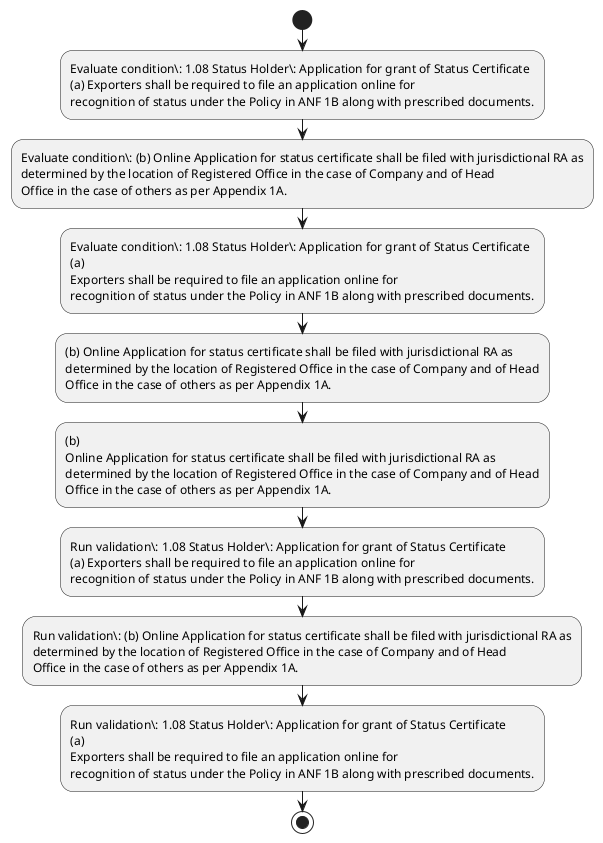

# Chapter 1 / Section 1.08: Status Holder: Application for grant of Status Certificate

**Chapter Title:** Legal Framework and Trade Facilitation

**Pages:** 6

**Purpose:** 1.08 Status Holder: Application for grant of Status Certificate
(a) Exporters shall be required to file an application online for
recognition of status under the Policy in ANF 1B along with prescribed documents.

**Purpose Thanglish:** Indha Status Holder: Application for grant of Status Certificate section-la, 1.08 Status Holder: application for grant of Status Certificate
(a) Exporters kandippa be required to file an application online for
recognition of status under the Policy in ANF 1B along with prescribed documents.

**Summary:** 1.08 Status Holder: Application for grant of Status Certificate
(a) Exporters shall be required to file an application online for
recognition of status under the Policy in ANF 1B along with prescribed documents. (b) Online Application for status certificate shall be filed with jurisdictional RA as
determined by the location of Registered Office in the case of Company and of Head
Office in the case of others as per Appendix 1A. 1.08 Status Holder: Application for grant of Status Certificate
(a)
Exporters shall be required to file an application online for
recognition of status under the Policy in ANF 1B along with prescribed documents.

**Business Meaning:** Status Holder: Application for grant of Status Certificate governs how DGFT business controls should be applied, validated, and enforced.

**Business Explanation:** Status Holder: Application for grant of Status Certificate explains the operating rule set that DEKAI should enforce. Key control points include 1.08 Status Holder: Application for grant of Status Certificate
(a) Exporters shall be required to file an application online for
recognition of status under the Policy in ANF 1B along with prescribed documents. The section also drives actions such as (b) Online Application for status certificate shall be filed with jurisdictional RA as
determined by the location of Registered Office in the case of Company and of Head
Office in the case of others as per Appendix 1A..

**Business Explanation Thanglish:** Indha Status Holder: Application for grant of Status Certificate section-la, Status Holder: application for grant of Status Certificate explains the operating rule set that DEKAI should enforce. Key control points include 1.08 Status Holder: application for grant of Status Certificate
(a) Exporters kandippa be required to file an application online for
recognition of status under the Policy in ANF 1B along with prescribed documents. The section also drives actions such as (b) Online application for status certificate kandippa be filed with jurisdictional RA as
determined by the location of Registered Office in the case of Company and of Head
Office in the case of others as per Appendix 1A..

## Business Logic
- 1.08 Status Holder: Application for grant of Status Certificate
(a) Exporters shall be required to file an application online for
recognition of status under the Policy in ANF 1B along with prescribed documents.
- (b) Online Application for status certificate shall be filed with jurisdictional RA as
determined by the location of Registered Office in the case of Company and of Head
Office in the case of others as per Appendix 1A.
- 1.08 Status Holder: Application for grant of Status Certificate
(a)
Exporters shall be required to file an application online for
recognition of status under the Policy in ANF 1B along with prescribed documents.
- (b)
Online Application for status certificate shall be filed with jurisdictional RA as
determined by the location of Registered Office in the case of Company and of Head
Office in the case of others as per Appendix 1A.

## Business Rules
- rule_id=CH1-SEC1_08-R001, rule_description=1.08 Status Holder: Application for grant of Status Certificate
(a) Exporters shall be required to file an application online for
recognition of status under the Policy in ANF 1B along with prescribed documents., trigger=Status Holder: Application for grant of Status Certificate, condition=1.08 Status Holder: Application for grant of Status Certificate
(a) Exporters shall be required to file an application online for
recognition of status under the Policy in ANF 1B along with prescribed documents., validation=1.08 Status Holder: Application for grant of Status Certificate
(a) Exporters shall be required to file an application online for
recognition of status under the Policy in ANF 1B along with prescribed documents., action=(b) Online Application for status certificate shall be filed with jurisdictional RA as
determined by the location of Registered Office in the case of Company and of Head
Office in the case of others as per Appendix 1A., exception=No explicit exception found in uploaded documents., output=DEKAI should produce a compliance decision for 1.08 - Status Holder: Application for grant of Status Certificate.
- rule_id=CH1-SEC1_08-R002, rule_description=(b) Online Application for status certificate shall be filed with jurisdictional RA as
determined by the location of Registered Office in the case of Company and of Head
Office in the case of others as per Appendix 1A., trigger=Status Holder: Application for grant of Status Certificate, condition=(b) Online Application for status certificate shall be filed with jurisdictional RA as
determined by the location of Registered Office in the case of Company and of Head
Office in the case of others as per Appendix 1A., validation=(b) Online Application for status certificate shall be filed with jurisdictional RA as
determined by the location of Registered Office in the case of Company and of Head
Office in the case of others as per Appendix 1A., action=(b)
Online Application for status certificate shall be filed with jurisdictional RA as
determined by the location of Registered Office in the case of Company and of Head
Office in the case of others as per Appendix 1A., exception=No explicit exception found in uploaded documents., output=DEKAI should produce a compliance decision for 1.08 - Status Holder: Application for grant of Status Certificate.
- rule_id=CH1-SEC1_08-R003, rule_description=1.08 Status Holder: Application for grant of Status Certificate
(a)
Exporters shall be required to file an application online for
recognition of status under the Policy in ANF 1B along with prescribed documents., trigger=Status Holder: Application for grant of Status Certificate, condition=1.08 Status Holder: Application for grant of Status Certificate
(a)
Exporters shall be required to file an application online for
recognition of status under the Policy in ANF 1B along with prescribed documents., validation=1.08 Status Holder: Application for grant of Status Certificate
(a)
Exporters shall be required to file an application online for
recognition of status under the Policy in ANF 1B along with prescribed documents., action=(b)
Online Application for status certificate shall be filed with jurisdictional RA as
determined by the location of Registered Office in the case of Company and of Head
Office in the case of others as per Appendix 1A., exception=No explicit exception found in uploaded documents., output=DEKAI should produce a compliance decision for 1.08 - Status Holder: Application for grant of Status Certificate.
- rule_id=CH1-SEC1_08-R004, rule_description=(b)
Online Application for status certificate shall be filed with jurisdictional RA as
determined by the location of Registered Office in the case of Company and of Head
Office in the case of others as per Appendix 1A., trigger=Status Holder: Application for grant of Status Certificate, condition=(b)
Online Application for status certificate shall be filed with jurisdictional RA as
determined by the location of Registered Office in the case of Company and of Head
Office in the case of others as per Appendix 1A., validation=(b)
Online Application for status certificate shall be filed with jurisdictional RA as
determined by the location of Registered Office in the case of Company and of Head
Office in the case of others as per Appendix 1A., action=(b)
Online Application for status certificate shall be filed with jurisdictional RA as
determined by the location of Registered Office in the case of Company and of Head
Office in the case of others as per Appendix 1A., exception=No explicit exception found in uploaded documents., output=DEKAI should produce a compliance decision for 1.08 - Status Holder: Application for grant of Status Certificate.

## Conditions
- 1.08 Status Holder: Application for grant of Status Certificate
(a) Exporters shall be required to file an application online for
recognition of status under the Policy in ANF 1B along with prescribed documents.
- (b) Online Application for status certificate shall be filed with jurisdictional RA as
determined by the location of Registered Office in the case of Company and of Head
Office in the case of others as per Appendix 1A.
- 1.08 Status Holder: Application for grant of Status Certificate
(a)
Exporters shall be required to file an application online for
recognition of status under the Policy in ANF 1B along with prescribed documents.
- (b)
Online Application for status certificate shall be filed with jurisdictional RA as
determined by the location of Registered Office in the case of Company and of Head
Office in the case of others as per Appendix 1A.

## Condition Logic
- id=1.1.08.1, if=1.08 Status Holder: Application for grant of Status Certificate
(a) Exporters shall be required to file an application online for
recognition of status under the Policy in ANF 1B along with prescribed documents., then=(b) Online Application for status certificate shall be filed with jurisdictional RA as
determined by the location of Registered Office in the case of Company and of Head
Office in the case of others as per Appendix 1A., source=1.08 Status Holder: Application for grant of Status Certificate
(a) Exporters shall be required to file an application online for
recognition of status under the Policy in ANF 1B along with prescribed documents.
- id=1.1.08.2, if=(b) Online Application for status certificate shall be filed with jurisdictional RA as
determined by the location of Registered Office in the case of Company and of Head
Office in the case of others as per Appendix 1A., then=(b) Online Application for status certificate shall be filed with jurisdictional RA as
determined by the location of Registered Office in the case of Company and of Head
Office in the case of others as per Appendix 1A., source=(b) Online Application for status certificate shall be filed with jurisdictional RA as
determined by the location of Registered Office in the case of Company and of Head
Office in the case of others as per Appendix 1A.
- id=1.1.08.3, if=1.08 Status Holder: Application for grant of Status Certificate
(a)
Exporters shall be required to file an application online for
recognition of status under the Policy in ANF 1B along with prescribed documents., then=(b) Online Application for status certificate shall be filed with jurisdictional RA as
determined by the location of Registered Office in the case of Company and of Head
Office in the case of others as per Appendix 1A., source=1.08 Status Holder: Application for grant of Status Certificate
(a)
Exporters shall be required to file an application online for
recognition of status under the Policy in ANF 1B along with prescribed documents.
- id=1.1.08.4, if=(b)
Online Application for status certificate shall be filed with jurisdictional RA as
determined by the location of Registered Office in the case of Company and of Head
Office in the case of others as per Appendix 1A., then=(b) Online Application for status certificate shall be filed with jurisdictional RA as
determined by the location of Registered Office in the case of Company and of Head
Office in the case of others as per Appendix 1A., source=(b)
Online Application for status certificate shall be filed with jurisdictional RA as
determined by the location of Registered Office in the case of Company and of Head
Office in the case of others as per Appendix 1A.

## Validations
- 1.08 Status Holder: Application for grant of Status Certificate
(a) Exporters shall be required to file an application online for
recognition of status under the Policy in ANF 1B along with prescribed documents.
- (b) Online Application for status certificate shall be filed with jurisdictional RA as
determined by the location of Registered Office in the case of Company and of Head
Office in the case of others as per Appendix 1A.
- 1.08 Status Holder: Application for grant of Status Certificate
(a)
Exporters shall be required to file an application online for
recognition of status under the Policy in ANF 1B along with prescribed documents.
- (b)
Online Application for status certificate shall be filed with jurisdictional RA as
determined by the location of Registered Office in the case of Company and of Head
Office in the case of others as per Appendix 1A.

## Exceptions
- None identified

## Dependencies
- None identified

## Authorities
- RA
- jurisdictional RA
- Online Application for status certificate shall be filed with jurisdictional RA

## Required Documents
- Application for grant of Status Certificate
- Online Application

## Timelines
- None identified

## Actions
- (b) Online Application for status certificate shall be filed with jurisdictional RA as
determined by the location of Registered Office in the case of Company and of Head
Office in the case of others as per Appendix 1A.
- (b)
Online Application for status certificate shall be filed with jurisdictional RA as
determined by the location of Registered Office in the case of Company and of Head
Office in the case of others as per Appendix 1A.

## Workflow
- Evaluate condition: 1.08 Status Holder: Application for grant of Status Certificate
(a) Exporters shall be required to file an application online for
recognition of status under the Policy in ANF 1B along with prescribed documents.
- Evaluate condition: (b) Online Application for status certificate shall be filed with jurisdictional RA as
determined by the location of Registered Office in the case of Company and of Head
Office in the case of others as per Appendix 1A.
- Evaluate condition: 1.08 Status Holder: Application for grant of Status Certificate
(a)
Exporters shall be required to file an application online for
recognition of status under the Policy in ANF 1B along with prescribed documents.
- (b) Online Application for status certificate shall be filed with jurisdictional RA as
determined by the location of Registered Office in the case of Company and of Head
Office in the case of others as per Appendix 1A.
- (b)
Online Application for status certificate shall be filed with jurisdictional RA as
determined by the location of Registered Office in the case of Company and of Head
Office in the case of others as per Appendix 1A.
- Run validation: 1.08 Status Holder: Application for grant of Status Certificate
(a) Exporters shall be required to file an application online for
recognition of status under the Policy in ANF 1B along with prescribed documents.
- Run validation: (b) Online Application for status certificate shall be filed with jurisdictional RA as
determined by the location of Registered Office in the case of Company and of Head
Office in the case of others as per Appendix 1A.
- Run validation: 1.08 Status Holder: Application for grant of Status Certificate
(a)
Exporters shall be required to file an application online for
recognition of status under the Policy in ANF 1B along with prescribed documents.

## Workflow ASCII
```text
Status Holder: Application for grant of Status Certificate
Evaluate condition: 1.08 Status Holder: Application for grant of Status Certificate
(a) Exporters shall be required to file an application online for
recognition of status under the Policy in ANF 1B along with prescribed documents.
   |
   v
Evaluate condition: (b) Online Application for status certificate shall be filed with jurisdictional RA as
determined by the location of Registered Office in the case of Company and of Head
Office in the case of others as per Appendix 1A.
   |
   v
Evaluate condition: 1.08 Status Holder: Application for grant of Status Certificate
(a)
Exporters shall be required to file an application online for
recognition of status under the Policy in ANF 1B along with prescribed documents.
   |
   v
(b) Online Application for status certificate shall be filed with jurisdictional RA as
determined by the location of Registered Office in the case of Company and of Head
Office in the case of others as per Appendix 1A.
   |
   v
(b)
Online Application for status certificate shall be filed with jurisdictional RA as
determined by the location of Registered Office in the case of Company and of Head
Office in the case of others as per Appendix 1A.
   |
   v
Run validation: 1.08 Status Holder: Application for grant of Status Certificate
(a) Exporters shall be required to file an application online for
recognition of status under the Policy in ANF 1B along with prescribed documents.
   |
   v
Run validation: (b) Online Application for status certificate shall be filed with jurisdictional RA as
determined by the location of Registered Office in the case of Company and of Head
Office in the case of others as per Appendix 1A.
   |
   v
Run validation: 1.08 Status Holder: Application for grant of Status Certificate
(a)
Exporters shall be required to file an application online for
recognition of status under the Policy in ANF 1B along with prescribed documents.
```

## Decision Tree
- IF 1.08 Status Holder: Application for grant of Status Certificate
(a) Exporters shall be required to file an application online for
recognition of status under the Policy in ANF 1B along with prescribed documents. THEN (b) Online Application for status certificate shall be filed with jurisdictional RA as
determined by the location of Registered Office in the case of Company and of Head
Office in the case of others as per Appendix 1A.
- IF (b) Online Application for status certificate shall be filed with jurisdictional RA as
determined by the location of Registered Office in the case of Company and of Head
Office in the case of others as per Appendix 1A. THEN (b) Online Application for status certificate shall be filed with jurisdictional RA as
determined by the location of Registered Office in the case of Company and of Head
Office in the case of others as per Appendix 1A.
- IF 1.08 Status Holder: Application for grant of Status Certificate
(a)
Exporters shall be required to file an application online for
recognition of status under the Policy in ANF 1B along with prescribed documents. THEN (b) Online Application for status certificate shall be filed with jurisdictional RA as
determined by the location of Registered Office in the case of Company and of Head
Office in the case of others as per Appendix 1A.
- IF (b)
Online Application for status certificate shall be filed with jurisdictional RA as
determined by the location of Registered Office in the case of Company and of Head
Office in the case of others as per Appendix 1A. THEN (b) Online Application for status certificate shall be filed with jurisdictional RA as
determined by the location of Registered Office in the case of Company and of Head
Office in the case of others as per Appendix 1A.

## Decision Tree ASCII
```text
Status Holder: Application for grant of Status Certificate Decision
IF 1.08 Status Holder: Application for grant of Status Certificate
(a) Exporters shall be required to file an application online for
recognition of status under the Policy in ANF 1B along with prescribed documents. THEN (b) Online Application for status certificate shall be filed with jurisdictional RA as
determined by the location of Registered Office in the case of Company and of Head
Office in the case of others as per Appendix 1A.
   |
   v
IF (b) Online Application for status certificate shall be filed with jurisdictional RA as
determined by the location of Registered Office in the case of Company and of Head
Office in the case of others as per Appendix 1A. THEN (b) Online Application for status certificate shall be filed with jurisdictional RA as
determined by the location of Registered Office in the case of Company and of Head
Office in the case of others as per Appendix 1A.
   |
   v
IF 1.08 Status Holder: Application for grant of Status Certificate
(a)
Exporters shall be required to file an application online for
recognition of status under the Policy in ANF 1B along with prescribed documents. THEN (b) Online Application for status certificate shall be filed with jurisdictional RA as
determined by the location of Registered Office in the case of Company and of Head
Office in the case of others as per Appendix 1A.
   |
   v
IF (b)
Online Application for status certificate shall be filed with jurisdictional RA as
determined by the location of Registered Office in the case of Company and of Head
Office in the case of others as per Appendix 1A. THEN (b) Online Application for status certificate shall be filed with jurisdictional RA as
determined by the location of Registered Office in the case of Company and of Head
Office in the case of others as per Appendix 1A.
```

## Examples
- User asks to process Status Holder: Application for grant of Status Certificate; the platform checks conditions, validations, and documents before action.

**Real-world Example:** Example: an importer or exporter invokes Status Holder: Application for grant of Status Certificate, submits Application for grant of Status Certificate, Online Application, and DEKAI uses the extracted rules to (b) online application for status certificate shall be filed with jurisdictional ra as
determined by the location of registered office in the case of company and of head
office in the case of others as per appendix 1a..

**Real-world Example Thanglish:** Indha Status Holder: Application for grant of Status Certificate section-la, Example: an importer or exporter invokes Status Holder: application for grant of Status Certificate, submits application for grant of Status Certificate, Online application, and DEKAI uses the extracted rules to (b) online application for status certificate kandippa be filed with jurisdictional ra as
determined by the location of registered office in the case of company and of head
office in the case of others as per appendix 1a..

## AI Rules
- IF detected context matches section rule THEN enforce: 1.08 Status Holder: Application for grant of Status Certificate
(a) Exporters shall be required to file an application online for
recognition of status under the Policy in ANF 1B along with prescribed documents.
- IF detected context matches section rule THEN enforce: (b) Online Application for status certificate shall be filed with jurisdictional RA as
determined by the location of Registered Office in the case of Company and of Head
Office in the case of others as per Appendix 1A.
- IF detected context matches section rule THEN enforce: 1.08 Status Holder: Application for grant of Status Certificate
(a)
Exporters shall be required to file an application online for
recognition of status under the Policy in ANF 1B along with prescribed documents.
- IF detected context matches section rule THEN enforce: (b)
Online Application for status certificate shall be filed with jurisdictional RA as
determined by the location of Registered Office in the case of Company and of Head
Office in the case of others as per Appendix 1A.
- IF validations pass THEN recommend action: (b) Online Application for status certificate shall be filed with jurisdictional RA as
determined by the location of Registered Office in the case of Company and of Head
Office in the case of others as per Appendix 1A.

## Database Fields
- name=section_code, type=string, required=True, source=parsed_section_heading
- name=section_title, type=string, required=True, source=parsed_section_heading
- name=for_flag, type=boolean, required=False, source=keyword:for
- name=the_flag, type=boolean, required=False, source=keyword:the
- name=anf_flag, type=boolean, required=False, source=keyword:ANF
- name=and_flag, type=boolean, required=False, source=keyword:and
- name=per_flag, type=boolean, required=False, source=keyword:per
- name=file_flag, type=boolean, required=False, source=keyword:file
- name=with_flag, type=boolean, required=False, source=keyword:with
- name=case_flag, type=boolean, required=False, source=keyword:case
- name=document_1_submitted, type=boolean, required=True, source=Application for grant of Status Certificate
- name=document_2_submitted, type=boolean, required=True, source=Online Application

## API Requirements
- method=GET, path=/api/dgft/sections/1.08, purpose=Retrieve knowledge payload for section 1.08, query_params=['include=workflow,decision_tree,validations'], response_fields=['section', 'title', 'summary', 'conditions', 'validations', 'exceptions', 'workflow', 'decision_tree']
- method=POST, path=/api/dgft/Status-Holder-Application-for-grant-of-Status-Certificate/validate, purpose=Validate inputs and documents for Status Holder: Application for grant of Status Certificate, request_fields=['section_code', 'section_title', 'document_1_submitted', 'document_2_submitted'], response_fields=['status', 'errors', 'warnings', 'next_actions']
- method=POST, path=/api/dgft/Status-Holder-Application-for-grant-of-Status-Certificate/execute, purpose=Trigger business action for (b) Online Application for status certificate shall be filed with jurisdictional RA as
determined by the location of Registered Office in the case of Company and of Head
Office in the case of others as per Appendix 1A., request_fields=['section_code', 'section_title', 'document_1_submitted', 'document_2_submitted'], response_fields=['reference_id', 'status', 'authority', 'timeline']

## UI Screens
- screen_id=Status_Holder_Application_for_grant_of_Status_Certificate_overview, name=Status Holder: Application for grant of Status Certificate Overview, purpose=Show section summary, authority, timeline, and eligibility cues., widgets=['summary_card', 'conditions_table', 'authority_badges', 'timeline_panel']
- screen_id=Status_Holder_Application_for_grant_of_Status_Certificate_submission, name=Status Holder: Application for grant of Status Certificate Submission, purpose=Capture applicant data and supporting documents., widgets=['dynamic_form', 'document_uploader', 'validation_panel', 'next_action_footer'], fields=['section_code', 'section_title', 'for_flag', 'the_flag', 'anf_flag', 'and_flag', 'per_flag', 'file_flag']

## Error Messages
- Validation failed because the section requirements were not fully met.

## FAQ
- question_en=What is the purpose of section 1.08?, answer_en=Status Holder: Application for grant of Status Certificate explains the operating rule set that DEKAI should enforce. Key control points include 1.08 Status Holder: Application for grant of Status Certificate
(a) Exporters shall be required to file an application online for
recognition of status under the Policy in ANF 1B along with prescribed documents. The section also drives actions such as (b) Online Application for status certificate shall be filed with jurisdictional RA as
determined by the location of Registered Office in the case of Company and of Head
Office in the case of others as per Appendix 1A.., question_thanglish=Indha Status Holder: Application for grant of Status Certificate section-la, What is the purpose of section 1.08?, answer_thanglish=Indha Status Holder: Application for grant of Status Certificate section-la, Status Holder: application for grant of Status Certificate explains the operating rule set that DEKAI should enforce. Key control points include 1.08 Status Holder: application for grant of Status Certificate
(a) Exporters kandippa be required to file an application online for
recognition of status under the Policy in ANF 1B along with prescribed documents. The section also drives actions such as (b) Online application for status certificate kandippa be filed with jurisdictional RA as
determined by the location of Registered Office in the case of Company and of Head
Office in the case of others as per Appendix 1A..
- question_en=What documents are required under Status Holder: Application for grant of Status Certificate?, answer_en=Application for grant of Status Certificate, Online Application, question_thanglish=Indha Status Holder: Application for grant of Status Certificate section-la, What documents are required under Status Holder: application for grant of Status Certificate?, answer_thanglish=Indha Status Holder: Application for grant of Status Certificate section-la, application for grant of Status Certificate, Online application
- question_en=Which authority handles Status Holder: Application for grant of Status Certificate?, answer_en=RA, jurisdictional RA, Online Application for status certificate shall be filed with jurisdictional RA, question_thanglish=Indha Status Holder: Application for grant of Status Certificate section-la, Which authority handles Status Holder: application for grant of Status Certificate?, answer_thanglish=Indha Status Holder: Application for grant of Status Certificate section-la, RA, jurisdictional RA, Online application for status certificate kandippa be filed with jurisdictional RA

## Questions Users May Ask
- What does Status Holder: Application for grant of Status Certificate require?
- Which documents are needed for Status Holder: Application for grant of Status Certificate?
- How does DEKAI validate Status Holder: Application for grant of Status Certificate requests?
- What action should be taken for Status Holder: Application for grant of Status Certificate?

## Expected AI Answers
- Status Holder: Application for grant of Status Certificate requires the platform to interpret the section text, apply the extracted business rules, and present the correct next action.
- Required documents are inferred from the section text: Application for grant of Status Certificate, Online Application
- DEKAI validates Status Holder: Application for grant of Status Certificate by checking conditions, required documents, authority references, and exception clauses before recommending an outcome.
- The primary extracted action is: (b) Online Application for status certificate shall be filed with jurisdictional RA as
determined by the location of Registered Office in the case of Company and of Head
Office in the case of others as per Appendix 1A.

## AI Q&A Examples
- question_en=User asks: How do I comply with Status Holder: Application for grant of Status Certificate?, answer_en=AI answers: DEKAI should evaluate section 1.08, apply the extracted rules, and guide the user through Evaluate condition: 1.08 Status Holder: Application for grant of Status Certificate
(a) Exporters shall be required to file an application online for
recognition of status under the Policy in ANF 1B along with prescribed documents.., question_thanglish=Indha Status Holder: Application for grant of Status Certificate section-la, User asks: How do I comply with Status Holder: application for grant of Status Certificate?, answer_thanglish=Indha Status Holder: Application for grant of Status Certificate section-la, AI answers: DEKAI should evaluate section 1.08, apply the extracted rules, and guide the user through Evaluate condition: 1.08 Status Holder: application for grant of Status Certificate
(a) Exporters kandippa be required to file an application online for
recognition of status under the Policy in ANF 1B along with prescribed documents..
- question_en=User asks: Which validations apply to Status Holder: Application for grant of Status Certificate?, answer_en=AI answers: Applicable validations are 1.08 Status Holder: Application for grant of Status Certificate
(a) Exporters shall be required to file an application online for
recognition of status under the Policy in ANF 1B along with prescribed documents., (b) Online Application for status certificate shall be filed with jurisdictional RA as
determined by the location of Registered Office in the case of Company and of Head
Office in the case of others as per Appendix 1A., 1.08 Status Holder: Application for grant of Status Certificate
(a)
Exporters shall be required to file an application online for
recognition of status under the Policy in ANF 1B along with prescribed documents., question_thanglish=Indha Status Holder: Application for grant of Status Certificate section-la, User asks: Which validations apply to Status Holder: application for grant of Status Certificate?, answer_thanglish=Indha Status Holder: Application for grant of Status Certificate section-la, AI answers: Applicable validations are 1.08 Status Holder: application for grant of Status Certificate
(a) Exporters kandippa be required to file an application online for
recognition of status under the Policy in ANF 1B along with prescribed documents., (b) Online application for status certificate kandippa be filed with jurisdictional RA as
determined by the location of Registered Office in the case of Company and of Head
Office in the case of others as per Appendix 1A., 1.08 Status Holder: application for grant of Status Certificate
(a)
Exporters kandippa be required to file an application online for
recognition of status under the Policy in ANF 1B along with prescribed documents.

## DEKAI AI Implementation Notes
- Capture chapter 1, section 1.08, title, and page references as immutable knowledge metadata.
- Bind validations for Status Holder: Application for grant of Status Certificate into a rule engine keyed by the rule IDs extracted for this section.
- Expose document upload controls for: Application for grant of Status Certificate, Online Application.
- Route escalations or approvals to: RA, jurisdictional RA, Online Application for status certificate shall be filed with jurisdictional RA.

## DEKAI AI Implementation Notes Thanglish
- Indha Status Holder: Application for grant of Status Certificate section-la, Capture chapter 1, section 1.08, title, and page references as immutable knowledge metadata.
- Indha Status Holder: Application for grant of Status Certificate section-la, Bind validations for Status Holder: application for grant of Status Certificate into a rule engine keyed by the rule IDs extracted for this section.
- Indha Status Holder: Application for grant of Status Certificate section-la, Expose document upload controls for: application for grant of Status Certificate, Online application.
- Indha Status Holder: Application for grant of Status Certificate section-la, Route escalations or approvals to: RA, jurisdictional RA, Online application for status certificate kandippa be filed with jurisdictional RA.

## AI Metadata
- Keywords: for, the, ANF, and, per, file, with, case, Head, grant, shall, under, along, filed, Status, Holder, online, Policy, Office, others
- Search Keywords: for, the, ANF, and, per, file, with, case, Head, grant, shall, under, along, filed, Status, Holder, online, Policy, Office, others
- Intent: Support Status Holder: Application for grant of Status Certificate processing and compliance validation.
- Tags: 1.08, Status Holder: Application for grant of Status Certificate, business-rule, document-driven, dgft
- Related Sections: 
- Related Chapters: 
- Related Rules: 1.08 Status Holder: Application for grant of Status Certificate
(a) Exporters shall be required to file an application online for
recognition of status under the Policy in ANF 1B along with prescribed documents., (b) Online Application for status certificate shall be filed with jurisdictional RA as
determined by the location of Registered Office in the case of Company and of Head
Office in the case of others as per Appendix 1A., 1.08 Status Holder: Application for grant of Status Certificate
(a)
Exporters shall be required to file an application online for
recognition of status under the Policy in ANF 1B along with prescribed documents., (b)
Online Application for status certificate shall be filed with jurisdictional RA as
determined by the location of Registered Office in the case of Company and of Head
Office in the case of others as per Appendix 1A.

## Mermaid

```mermaid
flowchart TD
    S1["Evaluate condition: 1.08 Status Holder: Application for grant of Status Certificate
(a) Exporters shall be required to file an application online for
recognition of status under the Policy in ANF 1B along with prescribed documents."]
    S2["Evaluate condition: (b) Online Application for status certificate shall be filed with jurisdictional RA as
determined by the location of Registered Office in the case of Company and of Head
Office in the case of others as per Appendix 1A."]
    S1 --> S2
    S3["Evaluate condition: 1.08 Status Holder: Application for grant of Status Certificate
(a)
Exporters shall be required to file an application online for
recognition of status under the Policy in ANF 1B along with prescribed documents."]
    S2 --> S3
    S4["(b) Online Application for status certificate shall be filed with jurisdictional RA as
determined by the location of Registered Office in the case of Company and of Head
Office in the case of others as per Appendix 1A."]
    S3 --> S4
    S5["(b)
Online Application for status certificate shall be filed with jurisdictional RA as
determined by the location of Registered Office in the case of Company and of Head
Office in the case of others as per Appendix 1A."]
    S4 --> S5
    S6["Run validation: 1.08 Status Holder: Application for grant of Status Certificate
(a) Exporters shall be required to file an application online for
recognition of status under the Policy in ANF 1B along with prescribed documents."]
    S5 --> S6
    S7["Run validation: (b) Online Application for status certificate shall be filed with jurisdictional RA as
determined by the location of Registered Office in the case of Company and of Head
Office in the case of others as per Appendix 1A."]
    S6 --> S7
    S8["Run validation: 1.08 Status Holder: Application for grant of Status Certificate
(a)
Exporters shall be required to file an application online for
recognition of status under the Policy in ANF 1B along with prescribed documents."]
    S7 --> S8
```


## PlantUML

