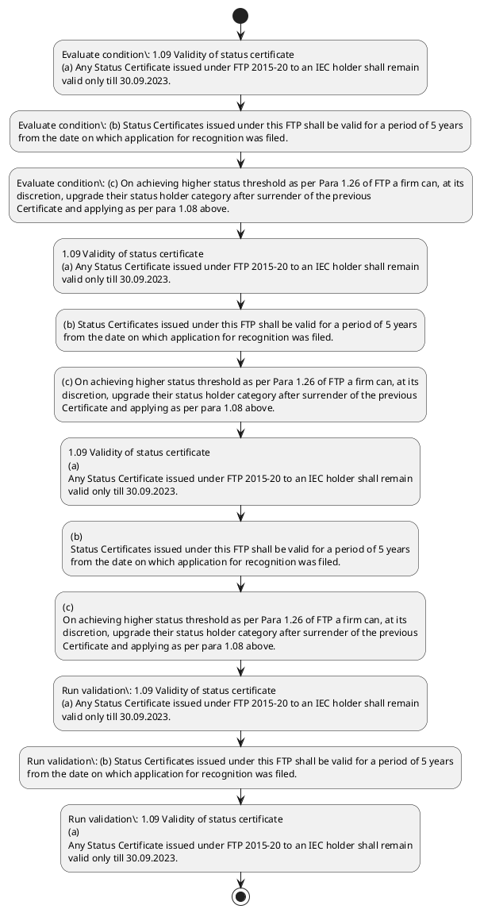

# Chapter 1 / Section 1.09: Validity of status certificate

**Chapter Title:** Legal Framework and Trade Facilitation

**Pages:** 6

**Purpose:** 1.09 Validity of status certificate
(a) Any Status Certificate issued under FTP 2015-20 to an IEC holder shall remain
valid only till 30.09.2023.

**Purpose Thanglish:** Indha Validity of status certificate section-la, 1.09 Validity of status certificate
(a) Any Status Certificate issued under FTP 2015-20 to an IEC holder kandippa remain
valid only till 30.09.2023.

**Summary:** 1.09 Validity of status certificate
(a) Any Status Certificate issued under FTP 2015-20 to an IEC holder shall remain
valid only till 30.09.2023. (b) Status Certificates issued under this FTP shall be valid for a period of 5 years
from the date on which application for recognition was filed. (c) On achieving higher status threshold as per Para 1.26 of FTP a firm can, at its
discretion, upgrade their status holder category after surrender of the previous
Certificate and applying as per para 1.08 above.

**Business Meaning:** Validity of status certificate governs how DGFT business controls should be applied, validated, and enforced.

**Business Explanation:** Validity of status certificate explains the operating rule set that DEKAI should enforce. Key control points include 1.09 Validity of status certificate
(a) Any Status Certificate issued under FTP 2015-20 to an IEC holder shall remain
valid only till 30.09.2023. The section also drives actions such as 1.09 Validity of status certificate
(a) Any Status Certificate issued under FTP 2015-20 to an IEC holder shall remain
valid only till 30.09.2023..

**Business Explanation Thanglish:** Indha Validity of status certificate section-la, Validity of status certificate explains the operating rule set that DEKAI should enforce. Key control points include 1.09 Validity of status certificate
(a) Any Status Certificate issued under FTP 2015-20 to an IEC holder kandippa remain
valid only till 30.09.2023. The section also drives actions such as 1.09 Validity of status certificate
(a) Any Status Certificate issued under FTP 2015-20 to an IEC holder kandippa remain
valid only till 30.09.2023..

## Business Logic
- 1.09 Validity of status certificate
(a) Any Status Certificate issued under FTP 2015-20 to an IEC holder shall remain
valid only till 30.09.2023.
- (b) Status Certificates issued under this FTP shall be valid for a period of 5 years
from the date on which application for recognition was filed.
- 1.09 Validity of status certificate
(a)
Any Status Certificate issued under FTP 2015-20 to an IEC holder shall remain
valid only till 30.09.2023.
- (b)
Status Certificates issued under this FTP shall be valid for a period of 5 years
from the date on which application for recognition was filed.

## Business Rules
- rule_id=CH1-SEC1_09-R001, rule_description=1.09 Validity of status certificate
(a) Any Status Certificate issued under FTP 2015-20 to an IEC holder shall remain
valid only till 30.09.2023., trigger=Validity of status certificate, condition=1.09 Validity of status certificate
(a) Any Status Certificate issued under FTP 2015-20 to an IEC holder shall remain
valid only till 30.09.2023., validation=1.09 Validity of status certificate
(a) Any Status Certificate issued under FTP 2015-20 to an IEC holder shall remain
valid only till 30.09.2023., action=1.09 Validity of status certificate
(a) Any Status Certificate issued under FTP 2015-20 to an IEC holder shall remain
valid only till 30.09.2023., exception=No explicit exception found in uploaded documents., output=DEKAI should produce a compliance decision for 1.09 - Validity of status certificate.
- rule_id=CH1-SEC1_09-R002, rule_description=(b) Status Certificates issued under this FTP shall be valid for a period of 5 years
from the date on which application for recognition was filed., trigger=Validity of status certificate, condition=(b) Status Certificates issued under this FTP shall be valid for a period of 5 years
from the date on which application for recognition was filed., validation=(b) Status Certificates issued under this FTP shall be valid for a period of 5 years
from the date on which application for recognition was filed., action=(b) Status Certificates issued under this FTP shall be valid for a period of 5 years
from the date on which application for recognition was filed., exception=No explicit exception found in uploaded documents., output=DEKAI should produce a compliance decision for 1.09 - Validity of status certificate.
- rule_id=CH1-SEC1_09-R003, rule_description=1.09 Validity of status certificate
(a)
Any Status Certificate issued under FTP 2015-20 to an IEC holder shall remain
valid only till 30.09.2023., trigger=Validity of status certificate, condition=(c) On achieving higher status threshold as per Para 1.26 of FTP a firm can, at its
discretion, upgrade their status holder category after surrender of the previous
Certificate and applying as per para 1.08 above., validation=1.09 Validity of status certificate
(a)
Any Status Certificate issued under FTP 2015-20 to an IEC holder shall remain
valid only till 30.09.2023., action=(c) On achieving higher status threshold as per Para 1.26 of FTP a firm can, at its
discretion, upgrade their status holder category after surrender of the previous
Certificate and applying as per para 1.08 above., exception=No explicit exception found in uploaded documents., output=DEKAI should produce a compliance decision for 1.09 - Validity of status certificate.
- rule_id=CH1-SEC1_09-R004, rule_description=(b)
Status Certificates issued under this FTP shall be valid for a period of 5 years
from the date on which application for recognition was filed., trigger=Validity of status certificate, condition=1.09 Validity of status certificate
(a)
Any Status Certificate issued under FTP 2015-20 to an IEC holder shall remain
valid only till 30.09.2023., validation=(b)
Status Certificates issued under this FTP shall be valid for a period of 5 years
from the date on which application for recognition was filed., action=1.09 Validity of status certificate
(a)
Any Status Certificate issued under FTP 2015-20 to an IEC holder shall remain
valid only till 30.09.2023., exception=No explicit exception found in uploaded documents., output=DEKAI should produce a compliance decision for 1.09 - Validity of status certificate.

## Conditions
- 1.09 Validity of status certificate
(a) Any Status Certificate issued under FTP 2015-20 to an IEC holder shall remain
valid only till 30.09.2023.
- (b) Status Certificates issued under this FTP shall be valid for a period of 5 years
from the date on which application for recognition was filed.
- (c) On achieving higher status threshold as per Para 1.26 of FTP a firm can, at its
discretion, upgrade their status holder category after surrender of the previous
Certificate and applying as per para 1.08 above.
- 1.09 Validity of status certificate
(a)
Any Status Certificate issued under FTP 2015-20 to an IEC holder shall remain
valid only till 30.09.2023.
- (b)
Status Certificates issued under this FTP shall be valid for a period of 5 years
from the date on which application for recognition was filed.
- (c)
On achieving higher status threshold as per Para 1.26 of FTP a firm can, at its
discretion, upgrade their status holder category after surrender of the previous
Certificate and applying as per para 1.08 above.

## Condition Logic
- id=1.1.09.1, if=1.09 Validity of status certificate
(a) Any Status Certificate issued under FTP 2015-20 to an IEC holder shall remain
valid only till 30.09.2023., then=1.09 Validity of status certificate
(a) Any Status Certificate issued under FTP 2015-20 to an IEC holder shall remain
valid only till 30.09.2023., source=1.09 Validity of status certificate
(a) Any Status Certificate issued under FTP 2015-20 to an IEC holder shall remain
valid only till 30.09.2023.
- id=1.1.09.2, if=(b) Status Certificates issued under this FTP shall be valid for a period of 5 years
from the date on which application for recognition was filed., then=1.09 Validity of status certificate
(a) Any Status Certificate issued under FTP 2015-20 to an IEC holder shall remain
valid only till 30.09.2023., source=(b) Status Certificates issued under this FTP shall be valid for a period of 5 years
from the date on which application for recognition was filed.
- id=1.1.09.3, if=(c) On achieving higher status threshold as per Para 1.26 of FTP a firm can, at its
discretion, upgrade their status holder category after surrender of the previous
Certificate and applying as per para 1.08 above., then=1.09 Validity of status certificate
(a) Any Status Certificate issued under FTP 2015-20 to an IEC holder shall remain
valid only till 30.09.2023., source=(c) On achieving higher status threshold as per Para 1.26 of FTP a firm can, at its
discretion, upgrade their status holder category after surrender of the previous
Certificate and applying as per para 1.08 above.
- id=1.1.09.4, if=1.09 Validity of status certificate
(a)
Any Status Certificate issued under FTP 2015-20 to an IEC holder shall remain
valid only till 30.09.2023., then=1.09 Validity of status certificate
(a) Any Status Certificate issued under FTP 2015-20 to an IEC holder shall remain
valid only till 30.09.2023., source=1.09 Validity of status certificate
(a)
Any Status Certificate issued under FTP 2015-20 to an IEC holder shall remain
valid only till 30.09.2023.
- id=1.1.09.5, if=(b)
Status Certificates issued under this FTP shall be valid for a period of 5 years
from the date on which application for recognition was filed., then=1.09 Validity of status certificate
(a) Any Status Certificate issued under FTP 2015-20 to an IEC holder shall remain
valid only till 30.09.2023., source=(b)
Status Certificates issued under this FTP shall be valid for a period of 5 years
from the date on which application for recognition was filed.
- id=1.1.09.6, if=(c)
On achieving higher status threshold as per Para 1.26 of FTP a firm can, at its
discretion, upgrade their status holder category after surrender of the previous
Certificate and applying as per para 1.08 above., then=1.09 Validity of status certificate
(a) Any Status Certificate issued under FTP 2015-20 to an IEC holder shall remain
valid only till 30.09.2023., source=(c)
On achieving higher status threshold as per Para 1.26 of FTP a firm can, at its
discretion, upgrade their status holder category after surrender of the previous
Certificate and applying as per para 1.08 above.

## Validations
- 1.09 Validity of status certificate
(a) Any Status Certificate issued under FTP 2015-20 to an IEC holder shall remain
valid only till 30.09.2023.
- (b) Status Certificates issued under this FTP shall be valid for a period of 5 years
from the date on which application for recognition was filed.
- 1.09 Validity of status certificate
(a)
Any Status Certificate issued under FTP 2015-20 to an IEC holder shall remain
valid only till 30.09.2023.
- (b)
Status Certificates issued under this FTP shall be valid for a period of 5 years
from the date on which application for recognition was filed.

## Exceptions
- None identified

## Dependencies
- 1.26
- 1.08

## Authorities
- None identified

## Required Documents
- Any Status Certificate
- (b) Status Certificates issued under this FTP shall be valid for a period of 5 years
from the date on which application for recognition was filed.
- (c) On achieving higher status threshold as per Para 1.26 of FTP a firm can, at its
discretion, upgrade their status holder category after surrender of the previous
Certificate and applying as per para 1.08 above.
- (b)
Status Certificates issued under this FTP shall be valid for a period of 5 years
from the date on which application for recognition was filed.
- (c)
On achieving higher status threshold as per Para 1.26 of FTP a firm can, at its
discretion, upgrade their status holder category after surrender of the previous
Certificate and applying as per para 1.08 above.

## Timelines
- (b) Status Certificates issued under this FTP shall be valid for a period of 5 years
from the date on which application for recognition was filed.
- (c) On achieving higher status threshold as per Para 1.26 of FTP a firm can, at its
discretion, upgrade their status holder category after surrender of the previous
Certificate and applying as per para 1.08 above.
- (b)
Status Certificates issued under this FTP shall be valid for a period of 5 years
from the date on which application for recognition was filed.
- (c)
On achieving higher status threshold as per Para 1.26 of FTP a firm can, at its
discretion, upgrade their status holder category after surrender of the previous
Certificate and applying as per para 1.08 above.

## Actions
- 1.09 Validity of status certificate
(a) Any Status Certificate issued under FTP 2015-20 to an IEC holder shall remain
valid only till 30.09.2023.
- (b) Status Certificates issued under this FTP shall be valid for a period of 5 years
from the date on which application for recognition was filed.
- (c) On achieving higher status threshold as per Para 1.26 of FTP a firm can, at its
discretion, upgrade their status holder category after surrender of the previous
Certificate and applying as per para 1.08 above.
- 1.09 Validity of status certificate
(a)
Any Status Certificate issued under FTP 2015-20 to an IEC holder shall remain
valid only till 30.09.2023.
- (b)
Status Certificates issued under this FTP shall be valid for a period of 5 years
from the date on which application for recognition was filed.
- (c)
On achieving higher status threshold as per Para 1.26 of FTP a firm can, at its
discretion, upgrade their status holder category after surrender of the previous
Certificate and applying as per para 1.08 above.

## Workflow
- Evaluate condition: 1.09 Validity of status certificate
(a) Any Status Certificate issued under FTP 2015-20 to an IEC holder shall remain
valid only till 30.09.2023.
- Evaluate condition: (b) Status Certificates issued under this FTP shall be valid for a period of 5 years
from the date on which application for recognition was filed.
- Evaluate condition: (c) On achieving higher status threshold as per Para 1.26 of FTP a firm can, at its
discretion, upgrade their status holder category after surrender of the previous
Certificate and applying as per para 1.08 above.
- 1.09 Validity of status certificate
(a) Any Status Certificate issued under FTP 2015-20 to an IEC holder shall remain
valid only till 30.09.2023.
- (b) Status Certificates issued under this FTP shall be valid for a period of 5 years
from the date on which application for recognition was filed.
- (c) On achieving higher status threshold as per Para 1.26 of FTP a firm can, at its
discretion, upgrade their status holder category after surrender of the previous
Certificate and applying as per para 1.08 above.
- 1.09 Validity of status certificate
(a)
Any Status Certificate issued under FTP 2015-20 to an IEC holder shall remain
valid only till 30.09.2023.
- (b)
Status Certificates issued under this FTP shall be valid for a period of 5 years
from the date on which application for recognition was filed.
- (c)
On achieving higher status threshold as per Para 1.26 of FTP a firm can, at its
discretion, upgrade their status holder category after surrender of the previous
Certificate and applying as per para 1.08 above.
- Run validation: 1.09 Validity of status certificate
(a) Any Status Certificate issued under FTP 2015-20 to an IEC holder shall remain
valid only till 30.09.2023.
- Run validation: (b) Status Certificates issued under this FTP shall be valid for a period of 5 years
from the date on which application for recognition was filed.
- Run validation: 1.09 Validity of status certificate
(a)
Any Status Certificate issued under FTP 2015-20 to an IEC holder shall remain
valid only till 30.09.2023.

## Workflow ASCII
```text
Validity of status certificate
Evaluate condition: 1.09 Validity of status certificate
(a) Any Status Certificate issued under FTP 2015-20 to an IEC holder shall remain
valid only till 30.09.2023.
   |
   v
Evaluate condition: (b) Status Certificates issued under this FTP shall be valid for a period of 5 years
from the date on which application for recognition was filed.
   |
   v
Evaluate condition: (c) On achieving higher status threshold as per Para 1.26 of FTP a firm can, at its
discretion, upgrade their status holder category after surrender of the previous
Certificate and applying as per para 1.08 above.
   |
   v
1.09 Validity of status certificate
(a) Any Status Certificate issued under FTP 2015-20 to an IEC holder shall remain
valid only till 30.09.2023.
   |
   v
(b) Status Certificates issued under this FTP shall be valid for a period of 5 years
from the date on which application for recognition was filed.
   |
   v
(c) On achieving higher status threshold as per Para 1.26 of FTP a firm can, at its
discretion, upgrade their status holder category after surrender of the previous
Certificate and applying as per para 1.08 above.
   |
   v
1.09 Validity of status certificate
(a)
Any Status Certificate issued under FTP 2015-20 to an IEC holder shall remain
valid only till 30.09.2023.
   |
   v
(b)
Status Certificates issued under this FTP shall be valid for a period of 5 years
from the date on which application for recognition was filed.
   |
   v
(c)
On achieving higher status threshold as per Para 1.26 of FTP a firm can, at its
discretion, upgrade their status holder category after surrender of the previous
Certificate and applying as per para 1.08 above.
   |
   v
Run validation: 1.09 Validity of status certificate
(a) Any Status Certificate issued under FTP 2015-20 to an IEC holder shall remain
valid only till 30.09.2023.
   |
   v
Run validation: (b) Status Certificates issued under this FTP shall be valid for a period of 5 years
from the date on which application for recognition was filed.
   |
   v
Run validation: 1.09 Validity of status certificate
(a)
Any Status Certificate issued under FTP 2015-20 to an IEC holder shall remain
valid only till 30.09.2023.
```

## Decision Tree
- IF 1.09 Validity of status certificate
(a) Any Status Certificate issued under FTP 2015-20 to an IEC holder shall remain
valid only till 30.09.2023. THEN 1.09 Validity of status certificate
(a) Any Status Certificate issued under FTP 2015-20 to an IEC holder shall remain
valid only till 30.09.2023.
- IF (b) Status Certificates issued under this FTP shall be valid for a period of 5 years
from the date on which application for recognition was filed. THEN 1.09 Validity of status certificate
(a) Any Status Certificate issued under FTP 2015-20 to an IEC holder shall remain
valid only till 30.09.2023.
- IF (c) On achieving higher status threshold as per Para 1.26 of FTP a firm can, at its
discretion, upgrade their status holder category after surrender of the previous
Certificate and applying as per para 1.08 above. THEN 1.09 Validity of status certificate
(a) Any Status Certificate issued under FTP 2015-20 to an IEC holder shall remain
valid only till 30.09.2023.
- IF 1.09 Validity of status certificate
(a)
Any Status Certificate issued under FTP 2015-20 to an IEC holder shall remain
valid only till 30.09.2023. THEN 1.09 Validity of status certificate
(a) Any Status Certificate issued under FTP 2015-20 to an IEC holder shall remain
valid only till 30.09.2023.
- IF (b)
Status Certificates issued under this FTP shall be valid for a period of 5 years
from the date on which application for recognition was filed. THEN 1.09 Validity of status certificate
(a) Any Status Certificate issued under FTP 2015-20 to an IEC holder shall remain
valid only till 30.09.2023.

## Decision Tree ASCII
```text
Validity of status certificate Decision
IF 1.09 Validity of status certificate
(a) Any Status Certificate issued under FTP 2015-20 to an IEC holder shall remain
valid only till 30.09.2023. THEN 1.09 Validity of status certificate
(a) Any Status Certificate issued under FTP 2015-20 to an IEC holder shall remain
valid only till 30.09.2023.
   |
   v
IF (b) Status Certificates issued under this FTP shall be valid for a period of 5 years
from the date on which application for recognition was filed. THEN 1.09 Validity of status certificate
(a) Any Status Certificate issued under FTP 2015-20 to an IEC holder shall remain
valid only till 30.09.2023.
   |
   v
IF (c) On achieving higher status threshold as per Para 1.26 of FTP a firm can, at its
discretion, upgrade their status holder category after surrender of the previous
Certificate and applying as per para 1.08 above. THEN 1.09 Validity of status certificate
(a) Any Status Certificate issued under FTP 2015-20 to an IEC holder shall remain
valid only till 30.09.2023.
   |
   v
IF 1.09 Validity of status certificate
(a)
Any Status Certificate issued under FTP 2015-20 to an IEC holder shall remain
valid only till 30.09.2023. THEN 1.09 Validity of status certificate
(a) Any Status Certificate issued under FTP 2015-20 to an IEC holder shall remain
valid only till 30.09.2023.
   |
   v
IF (b)
Status Certificates issued under this FTP shall be valid for a period of 5 years
from the date on which application for recognition was filed. THEN 1.09 Validity of status certificate
(a) Any Status Certificate issued under FTP 2015-20 to an IEC holder shall remain
valid only till 30.09.2023.
```

## Examples
- User asks to process Validity of status certificate; the platform checks conditions, validations, and documents before action.

**Real-world Example:** Example: an importer or exporter invokes Validity of status certificate, submits Any Status Certificate, (b) Status Certificates issued under this FTP shall be valid for a period of 5 years
from the date on which application for recognition was filed., (c) On achieving higher status threshold as per Para 1.26 of FTP a firm can, at its
discretion, upgrade their status holder category after surrender of the previous
Certificate and applying as per para 1.08 above., and DEKAI uses the extracted rules to 1.09 validity of status certificate
(a) any status certificate issued under ftp 2015-20 to an iec holder shall remain
valid only till 30.09.2023..

**Real-world Example Thanglish:** Indha Validity of status certificate section-la, Example: an importer or exporter invokes Validity of status certificate, submits Any Status Certificate, (b) Status Certificates issued under this FTP kandippa be valid for a period of 5 years
from the date on which application for recognition was filed., (c) On achieving higher status threshold as per Para 1.26 of FTP a firm can, at its
discretion, upgrade their status holder category after surrender of the previous
Certificate and applying as per para 1.08 above., and DEKAI uses the extracted rules to 1.09 validity of status certificate
(a) any status certificate issued under ftp 2015-20 to an iec holder kandippa remain
valid only till 30.09.2023..

## AI Rules
- IF detected context matches section rule THEN enforce: 1.09 Validity of status certificate
(a) Any Status Certificate issued under FTP 2015-20 to an IEC holder shall remain
valid only till 30.09.2023.
- IF detected context matches section rule THEN enforce: (b) Status Certificates issued under this FTP shall be valid for a period of 5 years
from the date on which application for recognition was filed.
- IF detected context matches section rule THEN enforce: 1.09 Validity of status certificate
(a)
Any Status Certificate issued under FTP 2015-20 to an IEC holder shall remain
valid only till 30.09.2023.
- IF detected context matches section rule THEN enforce: (b)
Status Certificates issued under this FTP shall be valid for a period of 5 years
from the date on which application for recognition was filed.
- IF validations pass THEN recommend action: 1.09 Validity of status certificate
(a) Any Status Certificate issued under FTP 2015-20 to an IEC holder shall remain
valid only till 30.09.2023.

## Database Fields
- name=section_code, type=string, required=True, source=parsed_section_heading
- name=section_title, type=string, required=True, source=parsed_section_heading
- name=any_flag, type=boolean, required=False, source=keyword:Any
- name=ftp_flag, type=boolean, required=False, source=keyword:FTP
- name=iec_flag, type=boolean, required=False, source=keyword:IEC
- name=for_flag, type=boolean, required=False, source=keyword:for
- name=the_flag, type=boolean, required=False, source=keyword:the
- name=was_flag, type=boolean, required=False, source=keyword:was
- name=per_flag, type=boolean, required=False, source=keyword:per
- name=can_flag, type=boolean, required=False, source=keyword:can
- name=document_1_submitted, type=boolean, required=True, source=Any Status Certificate
- name=document_2_submitted, type=boolean, required=True, source=(b) Status Certificates issued under this FTP shall be valid for a period of 5 years
from the date on which application for recognition was filed.
- name=document_3_submitted, type=boolean, required=True, source=(c) On achieving higher status threshold as per Para 1.26 of FTP a firm can, at its
discretion, upgrade their status holder category after surrender of the previous
Certificate and applying as per para 1.08 above.
- name=document_4_submitted, type=boolean, required=True, source=(b)
Status Certificates issued under this FTP shall be valid for a period of 5 years
from the date on which application for recognition was filed.
- name=document_5_submitted, type=boolean, required=True, source=(c)
On achieving higher status threshold as per Para 1.26 of FTP a firm can, at its
discretion, upgrade their status holder category after surrender of the previous
Certificate and applying as per para 1.08 above.

## API Requirements
- method=GET, path=/api/dgft/sections/1.09, purpose=Retrieve knowledge payload for section 1.09, query_params=['include=workflow,decision_tree,validations'], response_fields=['section', 'title', 'summary', 'conditions', 'validations', 'exceptions', 'workflow', 'decision_tree']
- method=POST, path=/api/dgft/Validity-of-status-certificate/validate, purpose=Validate inputs and documents for Validity of status certificate, request_fields=['section_code', 'section_title', 'document_1_submitted', 'document_2_submitted', 'document_3_submitted', 'document_4_submitted', 'document_5_submitted'], response_fields=['status', 'errors', 'warnings', 'next_actions']
- method=POST, path=/api/dgft/Validity-of-status-certificate/execute, purpose=Trigger business action for 1.09 Validity of status certificate
(a) Any Status Certificate issued under FTP 2015-20 to an IEC holder shall remain
valid only till 30.09.2023., request_fields=['section_code', 'section_title', 'document_1_submitted', 'document_2_submitted', 'document_3_submitted', 'document_4_submitted', 'document_5_submitted'], response_fields=['reference_id', 'status', 'authority', 'timeline']

## UI Screens
- screen_id=Validity_of_status_certificate_overview, name=Validity of status certificate Overview, purpose=Show section summary, authority, timeline, and eligibility cues., widgets=['summary_card', 'conditions_table', 'authority_badges', 'timeline_panel']
- screen_id=Validity_of_status_certificate_submission, name=Validity of status certificate Submission, purpose=Capture applicant data and supporting documents., widgets=['dynamic_form', 'document_uploader', 'validation_panel', 'next_action_footer'], fields=['section_code', 'section_title', 'any_flag', 'ftp_flag', 'iec_flag', 'for_flag', 'the_flag', 'was_flag']

## Error Messages
- Validation failed because the section requirements were not fully met.

## FAQ
- question_en=What is the purpose of section 1.09?, answer_en=Validity of status certificate explains the operating rule set that DEKAI should enforce. Key control points include 1.09 Validity of status certificate
(a) Any Status Certificate issued under FTP 2015-20 to an IEC holder shall remain
valid only till 30.09.2023. The section also drives actions such as 1.09 Validity of status certificate
(a) Any Status Certificate issued under FTP 2015-20 to an IEC holder shall remain
valid only till 30.09.2023.., question_thanglish=Indha Validity of status certificate section-la, What is the purpose of section 1.09?, answer_thanglish=Indha Validity of status certificate section-la, Validity of status certificate explains the operating rule set that DEKAI should enforce. Key control points include 1.09 Validity of status certificate
(a) Any Status Certificate issued under FTP 2015-20 to an IEC holder kandippa remain
valid only till 30.09.2023. The section also drives actions such as 1.09 Validity of status certificate
(a) Any Status Certificate issued under FTP 2015-20 to an IEC holder kandippa remain
valid only till 30.09.2023..
- question_en=What documents are required under Validity of status certificate?, answer_en=Any Status Certificate, (b) Status Certificates issued under this FTP shall be valid for a period of 5 years
from the date on which application for recognition was filed., (c) On achieving higher status threshold as per Para 1.26 of FTP a firm can, at its
discretion, upgrade their status holder category after surrender of the previous
Certificate and applying as per para 1.08 above., (b)
Status Certificates issued under this FTP shall be valid for a period of 5 years
from the date on which application for recognition was filed., (c)
On achieving higher status threshold as per Para 1.26 of FTP a firm can, at its
discretion, upgrade their status holder category after surrender of the previous
Certificate and applying as per para 1.08 above., question_thanglish=Indha Validity of status certificate section-la, What documents are required under Validity of status certificate?, answer_thanglish=Indha Validity of status certificate section-la, Any Status Certificate, (b) Status Certificates issued under this FTP kandippa be valid for a period of 5 years
from the date on which application for recognition was filed., (c) On achieving higher status threshold as per Para 1.26 of FTP a firm can, at its
discretion, upgrade their status holder category after surrender of the previous
Certificate and applying as per para 1.08 above., (b)
Status Certificates issued under this FTP kandippa be valid for a period of 5 years
from the date on which application for recognition was filed., (c)
On achieving higher status threshold as per Para 1.26 of FTP a firm can, at its
discretion, upgrade their status holder category after surrender of the previous
Certificate and applying as per para 1.08 above.
- question_en=Which authority handles Validity of status certificate?, answer_en=Not explicitly covered in uploaded documents., question_thanglish=Indha Validity of status certificate section-la, Which authority handles Validity of status certificate?, answer_thanglish=Indha Validity of status certificate section-la, Not explicitly covered in uploaded documents.

## Questions Users May Ask
- What does Validity of status certificate require?
- Which documents are needed for Validity of status certificate?
- How does DEKAI validate Validity of status certificate requests?
- What action should be taken for Validity of status certificate?

## Expected AI Answers
- Validity of status certificate requires the platform to interpret the section text, apply the extracted business rules, and present the correct next action.
- Required documents are inferred from the section text: Any Status Certificate, (b) Status Certificates issued under this FTP shall be valid for a period of 5 years
from the date on which application for recognition was filed., (c) On achieving higher status threshold as per Para 1.26 of FTP a firm can, at its
discretion, upgrade their status holder category after surrender of the previous
Certificate and applying as per para 1.08 above., (b)
Status Certificates issued under this FTP shall be valid for a period of 5 years
from the date on which application for recognition was filed., (c)
On achieving higher status threshold as per Para 1.26 of FTP a firm can, at its
discretion, upgrade their status holder category after surrender of the previous
Certificate and applying as per para 1.08 above.
- DEKAI validates Validity of status certificate by checking conditions, required documents, authority references, and exception clauses before recommending an outcome.
- The primary extracted action is: 1.09 Validity of status certificate
(a) Any Status Certificate issued under FTP 2015-20 to an IEC holder shall remain
valid only till 30.09.2023.

## AI Q&A Examples
- question_en=User asks: How do I comply with Validity of status certificate?, answer_en=AI answers: DEKAI should evaluate section 1.09, apply the extracted rules, and guide the user through Evaluate condition: 1.09 Validity of status certificate
(a) Any Status Certificate issued under FTP 2015-20 to an IEC holder shall remain
valid only till 30.09.2023.., question_thanglish=Indha Validity of status certificate section-la, User asks: How do I comply with Validity of status certificate?, answer_thanglish=Indha Validity of status certificate section-la, AI answers: DEKAI should evaluate section 1.09, apply the extracted rules, and guide the user through Evaluate condition: 1.09 Validity of status certificate
(a) Any Status Certificate issued under FTP 2015-20 to an IEC holder kandippa remain
valid only till 30.09.2023..
- question_en=User asks: Which validations apply to Validity of status certificate?, answer_en=AI answers: Applicable validations are 1.09 Validity of status certificate
(a) Any Status Certificate issued under FTP 2015-20 to an IEC holder shall remain
valid only till 30.09.2023., (b) Status Certificates issued under this FTP shall be valid for a period of 5 years
from the date on which application for recognition was filed., 1.09 Validity of status certificate
(a)
Any Status Certificate issued under FTP 2015-20 to an IEC holder shall remain
valid only till 30.09.2023., question_thanglish=Indha Validity of status certificate section-la, User asks: Which validations apply to Validity of status certificate?, answer_thanglish=Indha Validity of status certificate section-la, AI answers: Applicable validations are 1.09 Validity of status certificate
(a) Any Status Certificate issued under FTP 2015-20 to an IEC holder kandippa remain
valid only till 30.09.2023., (b) Status Certificates issued under this FTP kandippa be valid for a period of 5 years
from the date on which application for recognition was filed., 1.09 Validity of status certificate
(a)
Any Status Certificate issued under FTP 2015-20 to an IEC holder kandippa remain
valid only till 30.09.2023.

## DEKAI AI Implementation Notes
- Capture chapter 1, section 1.09, title, and page references as immutable knowledge metadata.
- Bind validations for Validity of status certificate into a rule engine keyed by the rule IDs extracted for this section.
- Expose document upload controls for: Any Status Certificate, (b) Status Certificates issued under this FTP shall be valid for a period of 5 years
from the date on which application for recognition was filed., (c) On achieving higher status threshold as per Para 1.26 of FTP a firm can, at its
discretion, upgrade their status holder category after surrender of the previous
Certificate and applying as per para 1.08 above., (b)
Status Certificates issued under this FTP shall be valid for a period of 5 years
from the date on which application for recognition was filed., (c)
On achieving higher status threshold as per Para 1.26 of FTP a firm can, at its
discretion, upgrade their status holder category after surrender of the previous
Certificate and applying as per para 1.08 above..
- Show contextual links to related sections: 1.08.

## DEKAI AI Implementation Notes Thanglish
- Indha Validity of status certificate section-la, Capture chapter 1, section 1.09, title, and page references as immutable knowledge metadata.
- Indha Validity of status certificate section-la, Bind validations for Validity of status certificate into a rule engine keyed by the rule IDs extracted for this section.
- Indha Validity of status certificate section-la, Expose document upload controls for: Any Status Certificate, (b) Status Certificates issued under this FTP kandippa be valid for a period of 5 years
from the date on which application for recognition was filed., (c) On achieving higher status threshold as per Para 1.26 of FTP a firm can, at its
discretion, upgrade their status holder category after surrender of the previous
Certificate and applying as per para 1.08 above., (b)
Status Certificates issued under this FTP kandippa be valid for a period of 5 years
from the date on which application for recognition was filed., (c)
On achieving higher status threshold as per Para 1.26 of FTP a firm can, at its
discretion, upgrade their status holder category after surrender of the previous
Certificate and applying as per para 1.08 above..
- Indha Validity of status certificate section-la, Show contextual links to related sections: 1.08.

## AI Metadata
- Keywords: Any, FTP, IEC, for, the, was, per, can, its, and, only, till, this, from, date, Para, firm, under, shall, valid
- Search Keywords: Any, FTP, IEC, for, the, was, per, can, its, and, only, till, this, from, date, Para, firm, under, shall, valid
- Intent: Support Validity of status certificate processing and compliance validation.
- Tags: 1.09, Validity of status certificate, business-rule, document-driven, dgft
- Related Sections: 1.08
- Related Chapters: 
- Related Rules: 1.09 Validity of status certificate
(a) Any Status Certificate issued under FTP 2015-20 to an IEC holder shall remain
valid only till 30.09.2023., (b) Status Certificates issued under this FTP shall be valid for a period of 5 years
from the date on which application for recognition was filed., 1.09 Validity of status certificate
(a)
Any Status Certificate issued under FTP 2015-20 to an IEC holder shall remain
valid only till 30.09.2023., (b)
Status Certificates issued under this FTP shall be valid for a period of 5 years
from the date on which application for recognition was filed.

## Mermaid

```mermaid
flowchart TD
    S1["Evaluate condition: 1.09 Validity of status certificate
(a) Any Status Certificate issued under FTP 2015-20 to an IEC holder shall remain
valid only till 30.09.2023."]
    S2["Evaluate condition: (b) Status Certificates issued under this FTP shall be valid for a period of 5 years
from the date on which application for recognition was filed."]
    S1 --> S2
    S3["Evaluate condition: (c) On achieving higher status threshold as per Para 1.26 of FTP a firm can, at its
discretion, upgrade their status holder category after surrender of the previous
Certificate and applying as per para 1.08 above."]
    S2 --> S3
    S4["1.09 Validity of status certificate
(a) Any Status Certificate issued under FTP 2015-20 to an IEC holder shall remain
valid only till 30.09.2023."]
    S3 --> S4
    S5["(b) Status Certificates issued under this FTP shall be valid for a period of 5 years
from the date on which application for recognition was filed."]
    S4 --> S5
    S6["(c) On achieving higher status threshold as per Para 1.26 of FTP a firm can, at its
discretion, upgrade their status holder category after surrender of the previous
Certificate and applying as per para 1.08 above."]
    S5 --> S6
    S7["1.09 Validity of status certificate
(a)
Any Status Certificate issued under FTP 2015-20 to an IEC holder shall remain
valid only till 30.09.2023."]
    S6 --> S7
    S8["(b)
Status Certificates issued under this FTP shall be valid for a period of 5 years
from the date on which application for recognition was filed."]
    S7 --> S8
    S9["(c)
On achieving higher status threshold as per Para 1.26 of FTP a firm can, at its
discretion, upgrade their status holder category after surrender of the previous
Certificate and applying as per para 1.08 above."]
    S8 --> S9
    S10["Run validation: 1.09 Validity of status certificate
(a) Any Status Certificate issued under FTP 2015-20 to an IEC holder shall remain
valid only till 30.09.2023."]
    S9 --> S10
    S11["Run validation: (b) Status Certificates issued under this FTP shall be valid for a period of 5 years
from the date on which application for recognition was filed."]
    S10 --> S11
    S12["Run validation: 1.09 Validity of status certificate
(a)
Any Status Certificate issued under FTP 2015-20 to an IEC holder shall remain
valid only till 30.09.2023."]
    S11 --> S12
```


## PlantUML

