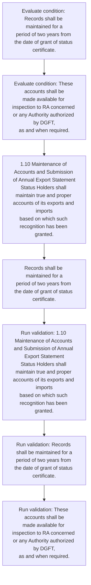
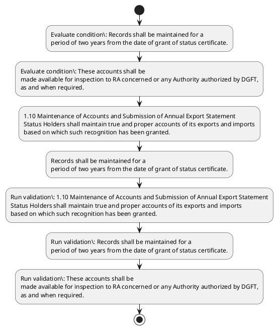

# Chapter 1 / Section 1.10: Maintenance of Accounts and Submission of Annual Export Statement

**Chapter Title:** Legal Framework and Trade Facilitation

**Pages:** 6

**Purpose:** 1.10 Maintenance of Accounts and Submission of Annual Export Statement
Status Holders shall maintain true and proper accounts of its exports and imports
based on which such recognition has been granted.

**Purpose Thanglish:** Indha Maintenance of Accounts and Submission of Annual Export Statement section-la, 1.10 Maintenance of Accounts and Submission of Annual export Statement
Status Holders kandippa maintain true and proper accounts of its exports and imports
based on which such recognition has been granted.

**Summary:** 1.10 Maintenance of Accounts and Submission of Annual Export Statement
Status Holders shall maintain true and proper accounts of its exports and imports
based on which such recognition has been granted. Records shall be maintained for a
period of two years from the date of grant of status certificate. These accounts shall be
made available for inspection to RA concerned or any Authority authorized by DGFT,
as and when required.

**Business Meaning:** Maintenance of Accounts and Submission of Annual Export Statement governs how DGFT business controls should be applied, validated, and enforced.

**Business Explanation:** Maintenance of Accounts and Submission of Annual Export Statement explains the operating rule set that DEKAI should enforce. Key control points include 1.10 Maintenance of Accounts and Submission of Annual Export Statement
Status Holders shall maintain true and proper accounts of its exports and imports
based on which such recognition has been granted. The section also drives actions such as 1.10 Maintenance of Accounts and Submission of Annual Export Statement
Status Holders shall maintain true and proper accounts of its exports and imports
based on which such recognition has been granted..

**Business Explanation Thanglish:** Indha Maintenance of Accounts and Submission of Annual Export Statement section-la, Maintenance of Accounts and Submission of Annual export Statement explains the operating rule set that DEKAI should enforce. Key control points include 1.10 Maintenance of Accounts and Submission of Annual export Statement
Status Holders kandippa maintain true and proper accounts of its exports and imports
based on which such recognition has been granted. The section also drives actions such as 1.10 Maintenance of Accounts and Submission of Annual export Statement
Status Holders kandippa maintain true and proper accounts of its exports and imports
based on which such recognition has been granted..

## Business Logic
- 1.10 Maintenance of Accounts and Submission of Annual Export Statement
Status Holders shall maintain true and proper accounts of its exports and imports
based on which such recognition has been granted.
- Records shall be maintained for a
period of two years from the date of grant of status certificate.
- These accounts shall be
made available for inspection to RA concerned or any Authority authorized by DGFT,
as and when required.

## Business Rules
- rule_id=CH1-SEC1_10-R001, rule_description=1.10 Maintenance of Accounts and Submission of Annual Export Statement
Status Holders shall maintain true and proper accounts of its exports and imports
based on which such recognition has been granted., trigger=Maintenance of Accounts and Submission of Annual Export Statement, condition=Records shall be maintained for a
period of two years from the date of grant of status certificate., validation=1.10 Maintenance of Accounts and Submission of Annual Export Statement
Status Holders shall maintain true and proper accounts of its exports and imports
based on which such recognition has been granted., action=1.10 Maintenance of Accounts and Submission of Annual Export Statement
Status Holders shall maintain true and proper accounts of its exports and imports
based on which such recognition has been granted., exception=No explicit exception found in uploaded documents., output=DEKAI should produce a compliance decision for 1.10 - Maintenance of Accounts and Submission of Annual Export Statement.
- rule_id=CH1-SEC1_10-R002, rule_description=Records shall be maintained for a
period of two years from the date of grant of status certificate., trigger=Maintenance of Accounts and Submission of Annual Export Statement, condition=These accounts shall be
made available for inspection to RA concerned or any Authority authorized by DGFT,
as and when required., validation=Records shall be maintained for a
period of two years from the date of grant of status certificate., action=Records shall be maintained for a
period of two years from the date of grant of status certificate., exception=No explicit exception found in uploaded documents., output=DEKAI should produce a compliance decision for 1.10 - Maintenance of Accounts and Submission of Annual Export Statement.
- rule_id=CH1-SEC1_10-R003, rule_description=These accounts shall be
made available for inspection to RA concerned or any Authority authorized by DGFT,
as and when required., trigger=Maintenance of Accounts and Submission of Annual Export Statement, condition=These accounts shall be
made available for inspection to RA concerned or any Authority authorized by DGFT,
as and when required., validation=These accounts shall be
made available for inspection to RA concerned or any Authority authorized by DGFT,
as and when required., action=Records shall be maintained for a
period of two years from the date of grant of status certificate., exception=No explicit exception found in uploaded documents., output=DEKAI should produce a compliance decision for 1.10 - Maintenance of Accounts and Submission of Annual Export Statement.

## Conditions
- Records shall be maintained for a
period of two years from the date of grant of status certificate.
- These accounts shall be
made available for inspection to RA concerned or any Authority authorized by DGFT,
as and when required.

## Condition Logic
- id=1.1.10.1, if=Records shall be maintained for a
period of two years from the date of grant of status certificate., then=1.10 Maintenance of Accounts and Submission of Annual Export Statement
Status Holders shall maintain true and proper accounts of its exports and imports
based on which such recognition has been granted., source=Records shall be maintained for a
period of two years from the date of grant of status certificate.
- id=1.1.10.2, if=These accounts shall be
made available for inspection to RA concerned or any Authority authorized by DGFT,
as and when required., then=1.10 Maintenance of Accounts and Submission of Annual Export Statement
Status Holders shall maintain true and proper accounts of its exports and imports
based on which such recognition has been granted., source=These accounts shall be
made available for inspection to RA concerned or any Authority authorized by DGFT,
as and when required.

## Validations
- 1.10 Maintenance of Accounts and Submission of Annual Export Statement
Status Holders shall maintain true and proper accounts of its exports and imports
based on which such recognition has been granted.
- Records shall be maintained for a
period of two years from the date of grant of status certificate.
- These accounts shall be
made available for inspection to RA concerned or any Authority authorized by DGFT,
as and when required.

## Exceptions
- None identified

## Dependencies
- None identified

## Authorities
- DGFT
- RA
- RA concerned or any Authority authorized by DGFT

## Required Documents
- Maintenance of Accounts and Submission of Annual Export Statement
- Records shall be maintained for a
period of two years from the date of grant of status certificate.

## Timelines
- Records shall be maintained for a
period of two years from the date of grant of status certificate.

## Actions
- 1.10 Maintenance of Accounts and Submission of Annual Export Statement
Status Holders shall maintain true and proper accounts of its exports and imports
based on which such recognition has been granted.
- Records shall be maintained for a
period of two years from the date of grant of status certificate.

## Workflow
- Evaluate condition: Records shall be maintained for a
period of two years from the date of grant of status certificate.
- Evaluate condition: These accounts shall be
made available for inspection to RA concerned or any Authority authorized by DGFT,
as and when required.
- 1.10 Maintenance of Accounts and Submission of Annual Export Statement
Status Holders shall maintain true and proper accounts of its exports and imports
based on which such recognition has been granted.
- Records shall be maintained for a
period of two years from the date of grant of status certificate.
- Run validation: 1.10 Maintenance of Accounts and Submission of Annual Export Statement
Status Holders shall maintain true and proper accounts of its exports and imports
based on which such recognition has been granted.
- Run validation: Records shall be maintained for a
period of two years from the date of grant of status certificate.
- Run validation: These accounts shall be
made available for inspection to RA concerned or any Authority authorized by DGFT,
as and when required.

## Workflow ASCII
```text
Maintenance of Accounts and Submission of Annual Export Statement
Evaluate condition: Records shall be maintained for a
period of two years from the date of grant of status certificate.
   |
   v
Evaluate condition: These accounts shall be
made available for inspection to RA concerned or any Authority authorized by DGFT,
as and when required.
   |
   v
1.10 Maintenance of Accounts and Submission of Annual Export Statement
Status Holders shall maintain true and proper accounts of its exports and imports
based on which such recognition has been granted.
   |
   v
Records shall be maintained for a
period of two years from the date of grant of status certificate.
   |
   v
Run validation: 1.10 Maintenance of Accounts and Submission of Annual Export Statement
Status Holders shall maintain true and proper accounts of its exports and imports
based on which such recognition has been granted.
   |
   v
Run validation: Records shall be maintained for a
period of two years from the date of grant of status certificate.
   |
   v
Run validation: These accounts shall be
made available for inspection to RA concerned or any Authority authorized by DGFT,
as and when required.
```

## Decision Tree
- IF Records shall be maintained for a
period of two years from the date of grant of status certificate. THEN 1.10 Maintenance of Accounts and Submission of Annual Export Statement
Status Holders shall maintain true and proper accounts of its exports and imports
based on which such recognition has been granted.
- IF These accounts shall be
made available for inspection to RA concerned or any Authority authorized by DGFT,
as and when required. THEN 1.10 Maintenance of Accounts and Submission of Annual Export Statement
Status Holders shall maintain true and proper accounts of its exports and imports
based on which such recognition has been granted.

## Decision Tree ASCII
```text
Maintenance of Accounts and Submission of Annual Export Statement Decision
IF Records shall be maintained for a
period of two years from the date of grant of status certificate. THEN 1.10 Maintenance of Accounts and Submission of Annual Export Statement
Status Holders shall maintain true and proper accounts of its exports and imports
based on which such recognition has been granted.
   |
   v
IF These accounts shall be
made available for inspection to RA concerned or any Authority authorized by DGFT,
as and when required. THEN 1.10 Maintenance of Accounts and Submission of Annual Export Statement
Status Holders shall maintain true and proper accounts of its exports and imports
based on which such recognition has been granted.
```

## Examples
- User asks to process Maintenance of Accounts and Submission of Annual Export Statement; the platform checks conditions, validations, and documents before action.

**Real-world Example:** Example: an importer or exporter invokes Maintenance of Accounts and Submission of Annual Export Statement, submits Maintenance of Accounts and Submission of Annual Export Statement, Records shall be maintained for a
period of two years from the date of grant of status certificate., and DEKAI uses the extracted rules to 1.10 maintenance of accounts and submission of annual export statement
status holders shall maintain true and proper accounts of its exports and imports
based on which such recognition has been granted..

**Real-world Example Thanglish:** Indha Maintenance of Accounts and Submission of Annual Export Statement section-la, Example: an importer or exporter invokes Maintenance of Accounts and Submission of Annual export Statement, submits Maintenance of Accounts and Submission of Annual export Statement, Records kandippa be maintained for a
period of two years from the date of grant of status certificate., and DEKAI uses the extracted rules to 1.10 maintenance of accounts and submission of annual export statement
status holders kandippa maintain true and proper accounts of its exports and imports
based on which such recognition has been granted..

## AI Rules
- IF detected context matches section rule THEN enforce: 1.10 Maintenance of Accounts and Submission of Annual Export Statement
Status Holders shall maintain true and proper accounts of its exports and imports
based on which such recognition has been granted.
- IF detected context matches section rule THEN enforce: Records shall be maintained for a
period of two years from the date of grant of status certificate.
- IF detected context matches section rule THEN enforce: These accounts shall be
made available for inspection to RA concerned or any Authority authorized by DGFT,
as and when required.
- IF validations pass THEN recommend action: 1.10 Maintenance of Accounts and Submission of Annual Export Statement
Status Holders shall maintain true and proper accounts of its exports and imports
based on which such recognition has been granted.

## Database Fields
- name=section_code, type=string, required=True, source=parsed_section_heading
- name=section_title, type=string, required=True, source=parsed_section_heading
- name=and_flag, type=boolean, required=False, source=keyword:and
- name=its_flag, type=boolean, required=False, source=keyword:its
- name=has_flag, type=boolean, required=False, source=keyword:has
- name=for_flag, type=boolean, required=False, source=keyword:for
- name=two_flag, type=boolean, required=False, source=keyword:two
- name=the_flag, type=boolean, required=False, source=keyword:the
- name=any_flag, type=boolean, required=False, source=keyword:any
- name=true_flag, type=boolean, required=False, source=keyword:true
- name=document_1_submitted, type=boolean, required=True, source=Maintenance of Accounts and Submission of Annual Export Statement
- name=document_2_submitted, type=boolean, required=True, source=Records shall be maintained for a
period of two years from the date of grant of status certificate.

## API Requirements
- method=GET, path=/api/dgft/sections/1.10, purpose=Retrieve knowledge payload for section 1.10, query_params=['include=workflow,decision_tree,validations'], response_fields=['section', 'title', 'summary', 'conditions', 'validations', 'exceptions', 'workflow', 'decision_tree']
- method=POST, path=/api/dgft/Maintenance-of-Accounts-and-Submission-of-Annual-Export-Statement/validate, purpose=Validate inputs and documents for Maintenance of Accounts and Submission of Annual Export Statement, request_fields=['section_code', 'section_title', 'document_1_submitted', 'document_2_submitted'], response_fields=['status', 'errors', 'warnings', 'next_actions']
- method=POST, path=/api/dgft/Maintenance-of-Accounts-and-Submission-of-Annual-Export-Statement/execute, purpose=Trigger business action for 1.10 Maintenance of Accounts and Submission of Annual Export Statement
Status Holders shall maintain true and proper accounts of its exports and imports
based on which such recognition has been granted., request_fields=['section_code', 'section_title', 'document_1_submitted', 'document_2_submitted'], response_fields=['reference_id', 'status', 'authority', 'timeline']

## UI Screens
- screen_id=Maintenance_of_Accounts_and_Submission_of_Annual_Export_Statement_overview, name=Maintenance of Accounts and Submission of Annual Export Statement Overview, purpose=Show section summary, authority, timeline, and eligibility cues., widgets=['summary_card', 'conditions_table', 'authority_badges', 'timeline_panel']
- screen_id=Maintenance_of_Accounts_and_Submission_of_Annual_Export_Statement_submission, name=Maintenance of Accounts and Submission of Annual Export Statement Submission, purpose=Capture applicant data and supporting documents., widgets=['dynamic_form', 'document_uploader', 'validation_panel', 'next_action_footer'], fields=['section_code', 'section_title', 'and_flag', 'its_flag', 'has_flag', 'for_flag', 'two_flag', 'the_flag']

## Error Messages
- Validation failed because the section requirements were not fully met.

## FAQ
- question_en=What is the purpose of section 1.10?, answer_en=Maintenance of Accounts and Submission of Annual Export Statement explains the operating rule set that DEKAI should enforce. Key control points include 1.10 Maintenance of Accounts and Submission of Annual Export Statement
Status Holders shall maintain true and proper accounts of its exports and imports
based on which such recognition has been granted. The section also drives actions such as 1.10 Maintenance of Accounts and Submission of Annual Export Statement
Status Holders shall maintain true and proper accounts of its exports and imports
based on which such recognition has been granted.., question_thanglish=Indha Maintenance of Accounts and Submission of Annual Export Statement section-la, What is the purpose of section 1.10?, answer_thanglish=Indha Maintenance of Accounts and Submission of Annual Export Statement section-la, Maintenance of Accounts and Submission of Annual export Statement explains the operating rule set that DEKAI should enforce. Key control points include 1.10 Maintenance of Accounts and Submission of Annual export Statement
Status Holders kandippa maintain true and proper accounts of its exports and imports
based on which such recognition has been granted. The section also drives actions such as 1.10 Maintenance of Accounts and Submission of Annual export Statement
Status Holders kandippa maintain true and proper accounts of its exports and imports
based on which such recognition has been granted..
- question_en=What documents are required under Maintenance of Accounts and Submission of Annual Export Statement?, answer_en=Maintenance of Accounts and Submission of Annual Export Statement, Records shall be maintained for a
period of two years from the date of grant of status certificate., question_thanglish=Indha Maintenance of Accounts and Submission of Annual Export Statement section-la, What documents are required under Maintenance of Accounts and Submission of Annual export Statement?, answer_thanglish=Indha Maintenance of Accounts and Submission of Annual Export Statement section-la, Maintenance of Accounts and Submission of Annual export Statement, Records kandippa be maintained for a
period of two years from the date of grant of status certificate.
- question_en=Which authority handles Maintenance of Accounts and Submission of Annual Export Statement?, answer_en=DGFT, RA, RA concerned or any Authority authorized by DGFT, question_thanglish=Indha Maintenance of Accounts and Submission of Annual Export Statement section-la, Which authority handles Maintenance of Accounts and Submission of Annual export Statement?, answer_thanglish=Indha Maintenance of Accounts and Submission of Annual Export Statement section-la, DGFT, RA, RA concerned or any authority authorized by DGFT

## Questions Users May Ask
- What does Maintenance of Accounts and Submission of Annual Export Statement require?
- Which documents are needed for Maintenance of Accounts and Submission of Annual Export Statement?
- How does DEKAI validate Maintenance of Accounts and Submission of Annual Export Statement requests?
- What action should be taken for Maintenance of Accounts and Submission of Annual Export Statement?

## Expected AI Answers
- Maintenance of Accounts and Submission of Annual Export Statement requires the platform to interpret the section text, apply the extracted business rules, and present the correct next action.
- Required documents are inferred from the section text: Maintenance of Accounts and Submission of Annual Export Statement, Records shall be maintained for a
period of two years from the date of grant of status certificate.
- DEKAI validates Maintenance of Accounts and Submission of Annual Export Statement by checking conditions, required documents, authority references, and exception clauses before recommending an outcome.
- The primary extracted action is: 1.10 Maintenance of Accounts and Submission of Annual Export Statement
Status Holders shall maintain true and proper accounts of its exports and imports
based on which such recognition has been granted.

## AI Q&A Examples
- question_en=User asks: How do I comply with Maintenance of Accounts and Submission of Annual Export Statement?, answer_en=AI answers: DEKAI should evaluate section 1.10, apply the extracted rules, and guide the user through Evaluate condition: Records shall be maintained for a
period of two years from the date of grant of status certificate.., question_thanglish=Indha Maintenance of Accounts and Submission of Annual Export Statement section-la, User asks: How do I comply with Maintenance of Accounts and Submission of Annual export Statement?, answer_thanglish=Indha Maintenance of Accounts and Submission of Annual Export Statement section-la, AI answers: DEKAI should evaluate section 1.10, apply the extracted rules, and guide the user through Evaluate condition: Records kandippa be maintained for a
period of two years from the date of grant of status certificate..
- question_en=User asks: Which validations apply to Maintenance of Accounts and Submission of Annual Export Statement?, answer_en=AI answers: Applicable validations are 1.10 Maintenance of Accounts and Submission of Annual Export Statement
Status Holders shall maintain true and proper accounts of its exports and imports
based on which such recognition has been granted., Records shall be maintained for a
period of two years from the date of grant of status certificate., These accounts shall be
made available for inspection to RA concerned or any Authority authorized by DGFT,
as and when required., question_thanglish=Indha Maintenance of Accounts and Submission of Annual Export Statement section-la, User asks: Which validations apply to Maintenance of Accounts and Submission of Annual export Statement?, answer_thanglish=Indha Maintenance of Accounts and Submission of Annual Export Statement section-la, AI answers: Applicable validations are 1.10 Maintenance of Accounts and Submission of Annual export Statement
Status Holders kandippa maintain true and proper accounts of its exports and imports
based on which such recognition has been granted., Records kandippa be maintained for a
period of two years from the date of grant of status certificate., These accounts kandippa be
made available for inspection to RA concerned or any authority authorized by DGFT,
as and when required.

## DEKAI AI Implementation Notes
- Capture chapter 1, section 1.10, title, and page references as immutable knowledge metadata.
- Bind validations for Maintenance of Accounts and Submission of Annual Export Statement into a rule engine keyed by the rule IDs extracted for this section.
- Expose document upload controls for: Maintenance of Accounts and Submission of Annual Export Statement, Records shall be maintained for a
period of two years from the date of grant of status certificate..
- Route escalations or approvals to: DGFT, RA, RA concerned or any Authority authorized by DGFT.

## DEKAI AI Implementation Notes Thanglish
- Indha Maintenance of Accounts and Submission of Annual Export Statement section-la, Capture chapter 1, section 1.10, title, and page references as immutable knowledge metadata.
- Indha Maintenance of Accounts and Submission of Annual Export Statement section-la, Bind validations for Maintenance of Accounts and Submission of Annual export Statement into a rule engine keyed by the rule IDs extracted for this section.
- Indha Maintenance of Accounts and Submission of Annual Export Statement section-la, Expose document upload controls for: Maintenance of Accounts and Submission of Annual export Statement, Records kandippa be maintained for a
period of two years from the date of grant of status certificate..
- Indha Maintenance of Accounts and Submission of Annual Export Statement section-la, Route escalations or approvals to: DGFT, RA, RA concerned or any authority authorized by DGFT.

## AI Metadata
- Keywords: and, its, has, for, two, the, any, true, such, been, from, date, made, DGFT, when, shall, based, which, years, grant
- Search Keywords: and, its, has, for, two, the, any, true, such, been, from, date, made, DGFT, when, shall, based, which, years, grant
- Intent: Support Maintenance of Accounts and Submission of Annual Export Statement processing and compliance validation.
- Tags: 1.10, Maintenance of Accounts and Submission of Annual Export Statement, business-rule, document-driven, dgft
- Related Sections: 
- Related Chapters: 
- Related Rules: 1.10 Maintenance of Accounts and Submission of Annual Export Statement
Status Holders shall maintain true and proper accounts of its exports and imports
based on which such recognition has been granted., Records shall be maintained for a
period of two years from the date of grant of status certificate., These accounts shall be
made available for inspection to RA concerned or any Authority authorized by DGFT,
as and when required.

## Mermaid


## PlantUML

