# Chapter 1 / Section 1.11: Refusal /Suspension /Cancellation of Certificate

**Chapter Title:** Legal Framework and Trade Facilitation

**Pages:** 6, 7

**Purpose:** 1.11 Refusal /Suspension /Cancellation of Certificate
Status Certificate may be refused / suspended/ cancelled by RA concerned, if status
holder or authorized representative acting on his behalf:
(a) Fails to discharge export obligation imposed;
(b) Tampers with Authorisations;
(c) Misrepresents or has been a party to any corrupt or fraudulent practice in
obtaining any Authorisation;
(d) Commits a breach of FT (D& R) Act, or Rules, Orders made there under and FTP,
The Customs Act 1962, The Central Excise Act 1944, FEMA Act 1999, COFEPOSA Act
1974 and Central / State GST Acts;
(e) Fails to furnish information required by this Directorate.

**Purpose Thanglish:** Indha Refusal /Suspension /Cancellation of Certificate section-la, 1.11 Refusal /Suspension /Cancellation of Certificate
Status Certificate may be refused / suspended/ cancelled by RA concerned, if status
holder or authorized representative acting on his behalf:
(a) Fails to discharge export obligation imposed;
(b) Tampers with Authorisations;
(c) Misrepresents or has been a party to any corrupt or fraudulent practice in
obtaining any Authorisation;
(d) Commits a breach of FT (D& R) Act, or Rules, Orders made there under and FTP,
The Customs Act 1962, The Central Excise Act 1944, FEMA Act 1999, COFEPOSA Act
1974 and Central / State GST Acts;
(e) Fails to furnish information required by this Directorate.

**Summary:** 1.11 Refusal /Suspension /Cancellation of Certificate
Status Certificate may be refused / suspended/ cancelled by RA concerned, if status
holder or authorized representative acting on his behalf:
(a) Fails to discharge export obligation imposed;
(b) Tampers with Authorisations;
(c) Misrepresents or has been a party to any corrupt or fraudulent practice in
obtaining any Authorisation;
(d) Commits a breach of FT (D& R) Act, or Rules, Orders made there under and FTP,
The Customs Act 1962, The Central Excise Act 1944, FEMA Act 1999, COFEPOSA Act
1974 and Central / State GST Acts;
(e) Fails to furnish information required by this Directorate. pg. 8
pg.

**Business Meaning:** Refusal /Suspension /Cancellation of Certificate governs how DGFT business controls should be applied, validated, and enforced.

**Business Explanation:** Refusal /Suspension /Cancellation of Certificate explains the operating rule set that DEKAI should enforce. Key control points include A reasonable opportunity shall be given to Status Holder before taking any action
under this paragraph. The section also drives actions such as 1.11 Refusal /Suspension /Cancellation of Certificate
Status Certificate may be refused / suspended/ cancelled by RA concerned, if status
holder or authorized representative acting on his behalf:
(a) Fails to discharge export obligation imposed;
(b) Tampers with Authorisations;
(c) Misrepresents or has been a party to any corrupt or fraudulent practice in
obtaining any Authorisation;
(d) Commits a breach of FT (D& R) Act, or Rules, Orders made there under and FTP,
The Customs Act 1962, The Central Excise Act 1944, FEMA Act 1999, COFEPOSA Act
1974 and Central / State GST Acts;
(e) Fails to furnish information required by this Directorate..

**Business Explanation Thanglish:** Indha Refusal /Suspension /Cancellation of Certificate section-la, Refusal /Suspension /Cancellation of Certificate explains the operating rule set that DEKAI should enforce. Key control points include A reasonable opportunity kandippa be given to Status Holder before taking any action
under this paragraph. The section also drives actions such as 1.11 Refusal /Suspension /Cancellation of Certificate
Status Certificate may be refused / suspended/ cancelled by RA concerned, if status
holder or authorized representative acting on his behalf:
(a) Fails to discharge export obligation imposed;
(b) Tampers with Authorisations;
(c) Misrepresents or has been a party to any corrupt or fraudulent practice in
obtaining any Authorisation;
(d) Commits a breach of FT (D& R) Act, or Rules, Orders made there under and FTP,
The Customs Act 1962, The Central Excise Act 1944, FEMA Act 1999, COFEPOSA Act
1974 and Central / State GST Acts;
(e) Fails to furnish information required by this Directorate..

## Business Logic
- A reasonable opportunity shall be given to Status Holder before taking any action
under this paragraph.

## Business Rules
- rule_id=CH1-SEC1_11-R001, rule_description=A reasonable opportunity shall be given to Status Holder before taking any action
under this paragraph., trigger=Refusal /Suspension /Cancellation of Certificate, condition=1.11 Refusal /Suspension /Cancellation of Certificate
Status Certificate may be refused / suspended/ cancelled by RA concerned, if status
holder or authorized representative acting on his behalf:
(a) Fails to discharge export obligation imposed;
(b) Tampers with Authorisations;
(c) Misrepresents or has been a party to any corrupt or fraudulent practice in
obtaining any Authorisation;
(d) Commits a breach of FT (D& R) Act, or Rules, Orders made there under and FTP,
The Customs Act 1962, The Central Excise Act 1944, FEMA Act 1999, COFEPOSA Act
1974 and Central / State GST Acts;
(e) Fails to furnish information required by this Directorate., validation=1.11 Refusal /Suspension /Cancellation of Certificate
Status Certificate may be refused / suspended/ cancelled by RA concerned, if status
holder or authorized representative acting on his behalf:
(a) Fails to discharge export obligation imposed;
(b) Tampers with Authorisations;
(c) Misrepresents or has been a party to any corrupt or fraudulent practice in
obtaining any Authorisation;
(d) Commits a breach of FT (D& R) Act, or Rules, Orders made there under and FTP,
The Customs Act 1962, The Central Excise Act 1944, FEMA Act 1999, COFEPOSA Act
1974 and Central / State GST Acts;
(e) Fails to furnish information required by this Directorate., action=1.11 Refusal /Suspension /Cancellation of Certificate
Status Certificate may be refused / suspended/ cancelled by RA concerned, if status
holder or authorized representative acting on his behalf:
(a) Fails to discharge export obligation imposed;
(b) Tampers with Authorisations;
(c) Misrepresents or has been a party to any corrupt or fraudulent practice in
obtaining any Authorisation;
(d) Commits a breach of FT (D& R) Act, or Rules, Orders made there under and FTP,
The Customs Act 1962, The Central Excise Act 1944, FEMA Act 1999, COFEPOSA Act
1974 and Central / State GST Acts;
(e) Fails to furnish information required by this Directorate., exception=No explicit exception found in uploaded documents., output=DEKAI should produce a compliance decision for 1.11 - Refusal /Suspension /Cancellation of Certificate.

## Conditions
- 1.11 Refusal /Suspension /Cancellation of Certificate
Status Certificate may be refused / suspended/ cancelled by RA concerned, if status
holder or authorized representative acting on his behalf:
(a) Fails to discharge export obligation imposed;
(b) Tampers with Authorisations;
(c) Misrepresents or has been a party to any corrupt or fraudulent practice in
obtaining any Authorisation;
(d) Commits a breach of FT (D& R) Act, or Rules, Orders made there under and FTP,
The Customs Act 1962, The Central Excise Act 1944, FEMA Act 1999, COFEPOSA Act
1974 and Central / State GST Acts;
(e) Fails to furnish information required by this Directorate.
- 8
STATUS HOLDER CERTIFICATION
1.11 Refusal /Suspension /Cancellation of Certificate
Status Certificate may be refused / suspended/ cancelled by RA concerned, if status
holder or authorized representative acting on his behalf:
(a)
Fails to discharge export obligation imposed;
(b)
Tampers with Authorisations;
(c)
Misrepresents or has been a party to any corrupt or fraudulent practice in
obtaining any Authorisation;
(d)
Commits a breach of FT (D& R) Act, or Rules, Orders made there under and FTP,
The Customs Act 1962, The Central Excise Act 1944, FEMA Act 1999, COFEPOSA Act
1974 and Central / State GST Acts;
(e)
Fails to furnish information required by this Directorate.
- A reasonable opportunity shall be given to Status Holder before taking any action
under this paragraph.

## Condition Logic
- id=1.1.11.1, if=1.11 Refusal /Suspension /Cancellation of Certificate
Status Certificate may be refused / suspended/ cancelled by RA concerned, if status
holder or authorized representative acting on his behalf:
(a) Fails to discharge export obligation imposed;
(b) Tampers with Authorisations;
(c) Misrepresents or has been a party to any corrupt or fraudulent practice in
obtaining any Authorisation;
(d) Commits a breach of FT (D& R) Act, or Rules, Orders made there under and FTP,
The Customs Act 1962, The Central Excise Act 1944, FEMA Act 1999, COFEPOSA Act
1974 and Central / State GST Acts;
(e) Fails to furnish information required by this Directorate., then=1.11 Refusal /Suspension /Cancellation of Certificate
Status Certificate may be refused / suspended/ cancelled by RA concerned, if status
holder or authorized representative acting on his behalf:
(a) Fails to discharge export obligation imposed;
(b) Tampers with Authorisations;
(c) Misrepresents or has been a party to any corrupt or fraudulent practice in
obtaining any Authorisation;
(d) Commits a breach of FT (D& R) Act, or Rules, Orders made there under and FTP,
The Customs Act 1962, The Central Excise Act 1944, FEMA Act 1999, COFEPOSA Act
1974 and Central / State GST Acts;
(e) Fails to furnish information required by this Directorate., source=1.11 Refusal /Suspension /Cancellation of Certificate
Status Certificate may be refused / suspended/ cancelled by RA concerned, if status
holder or authorized representative acting on his behalf:
(a) Fails to discharge export obligation imposed;
(b) Tampers with Authorisations;
(c) Misrepresents or has been a party to any corrupt or fraudulent practice in
obtaining any Authorisation;
(d) Commits a breach of FT (D& R) Act, or Rules, Orders made there under and FTP,
The Customs Act 1962, The Central Excise Act 1944, FEMA Act 1999, COFEPOSA Act
1974 and Central / State GST Acts;
(e) Fails to furnish information required by this Directorate.
- id=1.1.11.2, if=8
STATUS HOLDER CERTIFICATION
1.11 Refusal /Suspension /Cancellation of Certificate
Status Certificate may be refused / suspended/ cancelled by RA concerned, if status
holder or authorized representative acting on his behalf:
(a)
Fails to discharge export obligation imposed;
(b)
Tampers with Authorisations;
(c)
Misrepresents or has been a party to any corrupt or fraudulent practice in
obtaining any Authorisation;
(d)
Commits a breach of FT (D& R) Act, or Rules, Orders made there under and FTP,
The Customs Act 1962, The Central Excise Act 1944, FEMA Act 1999, COFEPOSA Act
1974 and Central / State GST Acts;
(e)
Fails to furnish information required by this Directorate., then=1.11 Refusal /Suspension /Cancellation of Certificate
Status Certificate may be refused / suspended/ cancelled by RA concerned, if status
holder or authorized representative acting on his behalf:
(a) Fails to discharge export obligation imposed;
(b) Tampers with Authorisations;
(c) Misrepresents or has been a party to any corrupt or fraudulent practice in
obtaining any Authorisation;
(d) Commits a breach of FT (D& R) Act, or Rules, Orders made there under and FTP,
The Customs Act 1962, The Central Excise Act 1944, FEMA Act 1999, COFEPOSA Act
1974 and Central / State GST Acts;
(e) Fails to furnish information required by this Directorate., source=8
STATUS HOLDER CERTIFICATION
1.11 Refusal /Suspension /Cancellation of Certificate
Status Certificate may be refused / suspended/ cancelled by RA concerned, if status
holder or authorized representative acting on his behalf:
(a)
Fails to discharge export obligation imposed;
(b)
Tampers with Authorisations;
(c)
Misrepresents or has been a party to any corrupt or fraudulent practice in
obtaining any Authorisation;
(d)
Commits a breach of FT (D& R) Act, or Rules, Orders made there under and FTP,
The Customs Act 1962, The Central Excise Act 1944, FEMA Act 1999, COFEPOSA Act
1974 and Central / State GST Acts;
(e)
Fails to furnish information required by this Directorate.
- id=1.1.11.3, if=A reasonable opportunity shall be given to Status Holder before taking any action
under this paragraph., then=1.11 Refusal /Suspension /Cancellation of Certificate
Status Certificate may be refused / suspended/ cancelled by RA concerned, if status
holder or authorized representative acting on his behalf:
(a) Fails to discharge export obligation imposed;
(b) Tampers with Authorisations;
(c) Misrepresents or has been a party to any corrupt or fraudulent practice in
obtaining any Authorisation;
(d) Commits a breach of FT (D& R) Act, or Rules, Orders made there under and FTP,
The Customs Act 1962, The Central Excise Act 1944, FEMA Act 1999, COFEPOSA Act
1974 and Central / State GST Acts;
(e) Fails to furnish information required by this Directorate., source=A reasonable opportunity shall be given to Status Holder before taking any action
under this paragraph.

## Validations
- 1.11 Refusal /Suspension /Cancellation of Certificate
Status Certificate may be refused / suspended/ cancelled by RA concerned, if status
holder or authorized representative acting on his behalf:
(a) Fails to discharge export obligation imposed;
(b) Tampers with Authorisations;
(c) Misrepresents or has been a party to any corrupt or fraudulent practice in
obtaining any Authorisation;
(d) Commits a breach of FT (D& R) Act, or Rules, Orders made there under and FTP,
The Customs Act 1962, The Central Excise Act 1944, FEMA Act 1999, COFEPOSA Act
1974 and Central / State GST Acts;
(e) Fails to furnish information required by this Directorate.
- 8
STATUS HOLDER CERTIFICATION
1.11 Refusal /Suspension /Cancellation of Certificate
Status Certificate may be refused / suspended/ cancelled by RA concerned, if status
holder or authorized representative acting on his behalf:
(a)
Fails to discharge export obligation imposed;
(b)
Tampers with Authorisations;
(c)
Misrepresents or has been a party to any corrupt or fraudulent practice in
obtaining any Authorisation;
(d)
Commits a breach of FT (D& R) Act, or Rules, Orders made there under and FTP,
The Customs Act 1962, The Central Excise Act 1944, FEMA Act 1999, COFEPOSA Act
1974 and Central / State GST Acts;
(e)
Fails to furnish information required by this Directorate.
- A reasonable opportunity shall be given to Status Holder before taking any action
under this paragraph.

## Exceptions
- None identified

## Dependencies
- None identified

## Authorities
- RA
- Customs
- Status Certificate may be refused / suspended/ cancelled by RA
- The Customs

## Required Documents
- Refusal /Suspension /Cancellation of Certificate
- Status Certificate

## Timelines
- A reasonable opportunity shall be given to Status Holder before taking any action
under this paragraph.

## Actions
- 1.11 Refusal /Suspension /Cancellation of Certificate
Status Certificate may be refused / suspended/ cancelled by RA concerned, if status
holder or authorized representative acting on his behalf:
(a) Fails to discharge export obligation imposed;
(b) Tampers with Authorisations;
(c) Misrepresents or has been a party to any corrupt or fraudulent practice in
obtaining any Authorisation;
(d) Commits a breach of FT (D& R) Act, or Rules, Orders made there under and FTP,
The Customs Act 1962, The Central Excise Act 1944, FEMA Act 1999, COFEPOSA Act
1974 and Central / State GST Acts;
(e) Fails to furnish information required by this Directorate.
- 8
STATUS HOLDER CERTIFICATION
1.11 Refusal /Suspension /Cancellation of Certificate
Status Certificate may be refused / suspended/ cancelled by RA concerned, if status
holder or authorized representative acting on his behalf:
(a)
Fails to discharge export obligation imposed;
(b)
Tampers with Authorisations;
(c)
Misrepresents or has been a party to any corrupt or fraudulent practice in
obtaining any Authorisation;
(d)
Commits a breach of FT (D& R) Act, or Rules, Orders made there under and FTP,
The Customs Act 1962, The Central Excise Act 1944, FEMA Act 1999, COFEPOSA Act
1974 and Central / State GST Acts;
(e)
Fails to furnish information required by this Directorate.

## Workflow
- Evaluate condition: 1.11 Refusal /Suspension /Cancellation of Certificate
Status Certificate may be refused / suspended/ cancelled by RA concerned, if status
holder or authorized representative acting on his behalf:
(a) Fails to discharge export obligation imposed;
(b) Tampers with Authorisations;
(c) Misrepresents or has been a party to any corrupt or fraudulent practice in
obtaining any Authorisation;
(d) Commits a breach of FT (D& R) Act, or Rules, Orders made there under and FTP,
The Customs Act 1962, The Central Excise Act 1944, FEMA Act 1999, COFEPOSA Act
1974 and Central / State GST Acts;
(e) Fails to furnish information required by this Directorate.
- Evaluate condition: 8
STATUS HOLDER CERTIFICATION
1.11 Refusal /Suspension /Cancellation of Certificate
Status Certificate may be refused / suspended/ cancelled by RA concerned, if status
holder or authorized representative acting on his behalf:
(a)
Fails to discharge export obligation imposed;
(b)
Tampers with Authorisations;
(c)
Misrepresents or has been a party to any corrupt or fraudulent practice in
obtaining any Authorisation;
(d)
Commits a breach of FT (D& R) Act, or Rules, Orders made there under and FTP,
The Customs Act 1962, The Central Excise Act 1944, FEMA Act 1999, COFEPOSA Act
1974 and Central / State GST Acts;
(e)
Fails to furnish information required by this Directorate.
- Evaluate condition: A reasonable opportunity shall be given to Status Holder before taking any action
under this paragraph.
- 1.11 Refusal /Suspension /Cancellation of Certificate
Status Certificate may be refused / suspended/ cancelled by RA concerned, if status
holder or authorized representative acting on his behalf:
(a) Fails to discharge export obligation imposed;
(b) Tampers with Authorisations;
(c) Misrepresents or has been a party to any corrupt or fraudulent practice in
obtaining any Authorisation;
(d) Commits a breach of FT (D& R) Act, or Rules, Orders made there under and FTP,
The Customs Act 1962, The Central Excise Act 1944, FEMA Act 1999, COFEPOSA Act
1974 and Central / State GST Acts;
(e) Fails to furnish information required by this Directorate.
- 8
STATUS HOLDER CERTIFICATION
1.11 Refusal /Suspension /Cancellation of Certificate
Status Certificate may be refused / suspended/ cancelled by RA concerned, if status
holder or authorized representative acting on his behalf:
(a)
Fails to discharge export obligation imposed;
(b)
Tampers with Authorisations;
(c)
Misrepresents or has been a party to any corrupt or fraudulent practice in
obtaining any Authorisation;
(d)
Commits a breach of FT (D& R) Act, or Rules, Orders made there under and FTP,
The Customs Act 1962, The Central Excise Act 1944, FEMA Act 1999, COFEPOSA Act
1974 and Central / State GST Acts;
(e)
Fails to furnish information required by this Directorate.
- Run validation: 1.11 Refusal /Suspension /Cancellation of Certificate
Status Certificate may be refused / suspended/ cancelled by RA concerned, if status
holder or authorized representative acting on his behalf:
(a) Fails to discharge export obligation imposed;
(b) Tampers with Authorisations;
(c) Misrepresents or has been a party to any corrupt or fraudulent practice in
obtaining any Authorisation;
(d) Commits a breach of FT (D& R) Act, or Rules, Orders made there under and FTP,
The Customs Act 1962, The Central Excise Act 1944, FEMA Act 1999, COFEPOSA Act
1974 and Central / State GST Acts;
(e) Fails to furnish information required by this Directorate.
- Run validation: 8
STATUS HOLDER CERTIFICATION
1.11 Refusal /Suspension /Cancellation of Certificate
Status Certificate may be refused / suspended/ cancelled by RA concerned, if status
holder or authorized representative acting on his behalf:
(a)
Fails to discharge export obligation imposed;
(b)
Tampers with Authorisations;
(c)
Misrepresents or has been a party to any corrupt or fraudulent practice in
obtaining any Authorisation;
(d)
Commits a breach of FT (D& R) Act, or Rules, Orders made there under and FTP,
The Customs Act 1962, The Central Excise Act 1944, FEMA Act 1999, COFEPOSA Act
1974 and Central / State GST Acts;
(e)
Fails to furnish information required by this Directorate.
- Run validation: A reasonable opportunity shall be given to Status Holder before taking any action
under this paragraph.

## Workflow ASCII
```text
Refusal /Suspension /Cancellation of Certificate
Evaluate condition: 1.11 Refusal /Suspension /Cancellation of Certificate
Status Certificate may be refused / suspended/ cancelled by RA concerned, if status
holder or authorized representative acting on his behalf:
(a) Fails to discharge export obligation imposed;
(b) Tampers with Authorisations;
(c) Misrepresents or has been a party to any corrupt or fraudulent practice in
obtaining any Authorisation;
(d) Commits a breach of FT (D& R) Act, or Rules, Orders made there under and FTP,
The Customs Act 1962, The Central Excise Act 1944, FEMA Act 1999, COFEPOSA Act
1974 and Central / State GST Acts;
(e) Fails to furnish information required by this Directorate.
   |
   v
Evaluate condition: 8
STATUS HOLDER CERTIFICATION
1.11 Refusal /Suspension /Cancellation of Certificate
Status Certificate may be refused / suspended/ cancelled by RA concerned, if status
holder or authorized representative acting on his behalf:
(a)
Fails to discharge export obligation imposed;
(b)
Tampers with Authorisations;
(c)
Misrepresents or has been a party to any corrupt or fraudulent practice in
obtaining any Authorisation;
(d)
Commits a breach of FT (D& R) Act, or Rules, Orders made there under and FTP,
The Customs Act 1962, The Central Excise Act 1944, FEMA Act 1999, COFEPOSA Act
1974 and Central / State GST Acts;
(e)
Fails to furnish information required by this Directorate.
   |
   v
Evaluate condition: A reasonable opportunity shall be given to Status Holder before taking any action
under this paragraph.
   |
   v
1.11 Refusal /Suspension /Cancellation of Certificate
Status Certificate may be refused / suspended/ cancelled by RA concerned, if status
holder or authorized representative acting on his behalf:
(a) Fails to discharge export obligation imposed;
(b) Tampers with Authorisations;
(c) Misrepresents or has been a party to any corrupt or fraudulent practice in
obtaining any Authorisation;
(d) Commits a breach of FT (D& R) Act, or Rules, Orders made there under and FTP,
The Customs Act 1962, The Central Excise Act 1944, FEMA Act 1999, COFEPOSA Act
1974 and Central / State GST Acts;
(e) Fails to furnish information required by this Directorate.
   |
   v
8
STATUS HOLDER CERTIFICATION
1.11 Refusal /Suspension /Cancellation of Certificate
Status Certificate may be refused / suspended/ cancelled by RA concerned, if status
holder or authorized representative acting on his behalf:
(a)
Fails to discharge export obligation imposed;
(b)
Tampers with Authorisations;
(c)
Misrepresents or has been a party to any corrupt or fraudulent practice in
obtaining any Authorisation;
(d)
Commits a breach of FT (D& R) Act, or Rules, Orders made there under and FTP,
The Customs Act 1962, The Central Excise Act 1944, FEMA Act 1999, COFEPOSA Act
1974 and Central / State GST Acts;
(e)
Fails to furnish information required by this Directorate.
   |
   v
Run validation: 1.11 Refusal /Suspension /Cancellation of Certificate
Status Certificate may be refused / suspended/ cancelled by RA concerned, if status
holder or authorized representative acting on his behalf:
(a) Fails to discharge export obligation imposed;
(b) Tampers with Authorisations;
(c) Misrepresents or has been a party to any corrupt or fraudulent practice in
obtaining any Authorisation;
(d) Commits a breach of FT (D& R) Act, or Rules, Orders made there under and FTP,
The Customs Act 1962, The Central Excise Act 1944, FEMA Act 1999, COFEPOSA Act
1974 and Central / State GST Acts;
(e) Fails to furnish information required by this Directorate.
   |
   v
Run validation: 8
STATUS HOLDER CERTIFICATION
1.11 Refusal /Suspension /Cancellation of Certificate
Status Certificate may be refused / suspended/ cancelled by RA concerned, if status
holder or authorized representative acting on his behalf:
(a)
Fails to discharge export obligation imposed;
(b)
Tampers with Authorisations;
(c)
Misrepresents or has been a party to any corrupt or fraudulent practice in
obtaining any Authorisation;
(d)
Commits a breach of FT (D& R) Act, or Rules, Orders made there under and FTP,
The Customs Act 1962, The Central Excise Act 1944, FEMA Act 1999, COFEPOSA Act
1974 and Central / State GST Acts;
(e)
Fails to furnish information required by this Directorate.
   |
   v
Run validation: A reasonable opportunity shall be given to Status Holder before taking any action
under this paragraph.
```

## Decision Tree
- IF 1.11 Refusal /Suspension /Cancellation of Certificate
Status Certificate may be refused / suspended/ cancelled by RA concerned, if status
holder or authorized representative acting on his behalf:
(a) Fails to discharge export obligation imposed;
(b) Tampers with Authorisations;
(c) Misrepresents or has been a party to any corrupt or fraudulent practice in
obtaining any Authorisation;
(d) Commits a breach of FT (D& R) Act, or Rules, Orders made there under and FTP,
The Customs Act 1962, The Central Excise Act 1944, FEMA Act 1999, COFEPOSA Act
1974 and Central / State GST Acts;
(e) Fails to furnish information required by this Directorate. THEN 1.11 Refusal /Suspension /Cancellation of Certificate
Status Certificate may be refused / suspended/ cancelled by RA concerned, if status
holder or authorized representative acting on his behalf:
(a) Fails to discharge export obligation imposed;
(b) Tampers with Authorisations;
(c) Misrepresents or has been a party to any corrupt or fraudulent practice in
obtaining any Authorisation;
(d) Commits a breach of FT (D& R) Act, or Rules, Orders made there under and FTP,
The Customs Act 1962, The Central Excise Act 1944, FEMA Act 1999, COFEPOSA Act
1974 and Central / State GST Acts;
(e) Fails to furnish information required by this Directorate.
- IF 8
STATUS HOLDER CERTIFICATION
1.11 Refusal /Suspension /Cancellation of Certificate
Status Certificate may be refused / suspended/ cancelled by RA concerned, if status
holder or authorized representative acting on his behalf:
(a)
Fails to discharge export obligation imposed;
(b)
Tampers with Authorisations;
(c)
Misrepresents or has been a party to any corrupt or fraudulent practice in
obtaining any Authorisation;
(d)
Commits a breach of FT (D& R) Act, or Rules, Orders made there under and FTP,
The Customs Act 1962, The Central Excise Act 1944, FEMA Act 1999, COFEPOSA Act
1974 and Central / State GST Acts;
(e)
Fails to furnish information required by this Directorate. THEN 1.11 Refusal /Suspension /Cancellation of Certificate
Status Certificate may be refused / suspended/ cancelled by RA concerned, if status
holder or authorized representative acting on his behalf:
(a) Fails to discharge export obligation imposed;
(b) Tampers with Authorisations;
(c) Misrepresents or has been a party to any corrupt or fraudulent practice in
obtaining any Authorisation;
(d) Commits a breach of FT (D& R) Act, or Rules, Orders made there under and FTP,
The Customs Act 1962, The Central Excise Act 1944, FEMA Act 1999, COFEPOSA Act
1974 and Central / State GST Acts;
(e) Fails to furnish information required by this Directorate.
- IF A reasonable opportunity shall be given to Status Holder before taking any action
under this paragraph. THEN 1.11 Refusal /Suspension /Cancellation of Certificate
Status Certificate may be refused / suspended/ cancelled by RA concerned, if status
holder or authorized representative acting on his behalf:
(a) Fails to discharge export obligation imposed;
(b) Tampers with Authorisations;
(c) Misrepresents or has been a party to any corrupt or fraudulent practice in
obtaining any Authorisation;
(d) Commits a breach of FT (D& R) Act, or Rules, Orders made there under and FTP,
The Customs Act 1962, The Central Excise Act 1944, FEMA Act 1999, COFEPOSA Act
1974 and Central / State GST Acts;
(e) Fails to furnish information required by this Directorate.

## Decision Tree ASCII
```text
Refusal /Suspension /Cancellation of Certificate Decision
IF 1.11 Refusal /Suspension /Cancellation of Certificate
Status Certificate may be refused / suspended/ cancelled by RA concerned, if status
holder or authorized representative acting on his behalf:
(a) Fails to discharge export obligation imposed;
(b) Tampers with Authorisations;
(c) Misrepresents or has been a party to any corrupt or fraudulent practice in
obtaining any Authorisation;
(d) Commits a breach of FT (D& R) Act, or Rules, Orders made there under and FTP,
The Customs Act 1962, The Central Excise Act 1944, FEMA Act 1999, COFEPOSA Act
1974 and Central / State GST Acts;
(e) Fails to furnish information required by this Directorate. THEN 1.11 Refusal /Suspension /Cancellation of Certificate
Status Certificate may be refused / suspended/ cancelled by RA concerned, if status
holder or authorized representative acting on his behalf:
(a) Fails to discharge export obligation imposed;
(b) Tampers with Authorisations;
(c) Misrepresents or has been a party to any corrupt or fraudulent practice in
obtaining any Authorisation;
(d) Commits a breach of FT (D& R) Act, or Rules, Orders made there under and FTP,
The Customs Act 1962, The Central Excise Act 1944, FEMA Act 1999, COFEPOSA Act
1974 and Central / State GST Acts;
(e) Fails to furnish information required by this Directorate.
   |
   v
IF 8
STATUS HOLDER CERTIFICATION
1.11 Refusal /Suspension /Cancellation of Certificate
Status Certificate may be refused / suspended/ cancelled by RA concerned, if status
holder or authorized representative acting on his behalf:
(a)
Fails to discharge export obligation imposed;
(b)
Tampers with Authorisations;
(c)
Misrepresents or has been a party to any corrupt or fraudulent practice in
obtaining any Authorisation;
(d)
Commits a breach of FT (D& R) Act, or Rules, Orders made there under and FTP,
The Customs Act 1962, The Central Excise Act 1944, FEMA Act 1999, COFEPOSA Act
1974 and Central / State GST Acts;
(e)
Fails to furnish information required by this Directorate. THEN 1.11 Refusal /Suspension /Cancellation of Certificate
Status Certificate may be refused / suspended/ cancelled by RA concerned, if status
holder or authorized representative acting on his behalf:
(a) Fails to discharge export obligation imposed;
(b) Tampers with Authorisations;
(c) Misrepresents or has been a party to any corrupt or fraudulent practice in
obtaining any Authorisation;
(d) Commits a breach of FT (D& R) Act, or Rules, Orders made there under and FTP,
The Customs Act 1962, The Central Excise Act 1944, FEMA Act 1999, COFEPOSA Act
1974 and Central / State GST Acts;
(e) Fails to furnish information required by this Directorate.
   |
   v
IF A reasonable opportunity shall be given to Status Holder before taking any action
under this paragraph. THEN 1.11 Refusal /Suspension /Cancellation of Certificate
Status Certificate may be refused / suspended/ cancelled by RA concerned, if status
holder or authorized representative acting on his behalf:
(a) Fails to discharge export obligation imposed;
(b) Tampers with Authorisations;
(c) Misrepresents or has been a party to any corrupt or fraudulent practice in
obtaining any Authorisation;
(d) Commits a breach of FT (D& R) Act, or Rules, Orders made there under and FTP,
The Customs Act 1962, The Central Excise Act 1944, FEMA Act 1999, COFEPOSA Act
1974 and Central / State GST Acts;
(e) Fails to furnish information required by this Directorate.
```

## Examples
- User asks to process Refusal /Suspension /Cancellation of Certificate; the platform checks conditions, validations, and documents before action.

**Real-world Example:** Example: an importer or exporter invokes Refusal /Suspension /Cancellation of Certificate, submits Refusal /Suspension /Cancellation of Certificate, Status Certificate, and DEKAI uses the extracted rules to 1.11 refusal /suspension /cancellation of certificate
status certificate may be refused / suspended/ cancelled by ra concerned, if status
holder or authorized representative acting on his behalf:
(a) fails to discharge export obligation imposed;
(b) tampers with authorisations;
(c) misrepresents or has been a party to any corrupt or fraudulent practice in
obtaining any authorisation;
(d) commits a breach of ft (d& r) act, or rules, orders made there under and ftp,
the customs act 1962, the central excise act 1944, fema act 1999, cofeposa act
1974 and central / state gst acts;
(e) fails to furnish information required by this directorate..

**Real-world Example Thanglish:** Indha Refusal /Suspension /Cancellation of Certificate section-la, Example: an importer or exporter invokes Refusal /Suspension /Cancellation of Certificate, submits Refusal /Suspension /Cancellation of Certificate, Status Certificate, and DEKAI uses the extracted rules to 1.11 refusal /suspension /cancellation of certificate
status certificate may be refused / suspended/ cancelled by ra concerned, if status
holder or authorized representative acting on his behalf:
(a) fails to discharge export obligation imposed;
(b) tampers with authorisations;
(c) misrepresents or has been a party to any corrupt or fraudulent practice in
obtaining any authorisation;
(d) commits a breach of ft (d& r) act, or rules, orders made there under and ftp,
the customs act 1962, the central excise act 1944, fema act 1999, cofeposa act
1974 and central / state gst acts;
(e) fails to furnish information required by this directorate..

## AI Rules
- IF detected context matches section rule THEN enforce: A reasonable opportunity shall be given to Status Holder before taking any action
under this paragraph.
- IF validations pass THEN recommend action: 1.11 Refusal /Suspension /Cancellation of Certificate
Status Certificate may be refused / suspended/ cancelled by RA concerned, if status
holder or authorized representative acting on his behalf:
(a) Fails to discharge export obligation imposed;
(b) Tampers with Authorisations;
(c) Misrepresents or has been a party to any corrupt or fraudulent practice in
obtaining any Authorisation;
(d) Commits a breach of FT (D& R) Act, or Rules, Orders made there under and FTP,
The Customs Act 1962, The Central Excise Act 1944, FEMA Act 1999, COFEPOSA Act
1974 and Central / State GST Acts;
(e) Fails to furnish information required by this Directorate.

## Database Fields
- name=section_code, type=string, required=True, source=parsed_section_heading
- name=section_title, type=string, required=True, source=parsed_section_heading
- name=may_flag, type=boolean, required=False, source=keyword:may
- name=his_flag, type=boolean, required=False, source=keyword:his
- name=has_flag, type=boolean, required=False, source=keyword:has
- name=any_flag, type=boolean, required=False, source=keyword:any
- name=act_flag, type=boolean, required=False, source=keyword:Act
- name=and_flag, type=boolean, required=False, source=keyword:and
- name=ftp_flag, type=boolean, required=False, source=keyword:FTP
- name=the_flag, type=boolean, required=False, source=keyword:The
- name=document_1_submitted, type=boolean, required=True, source=Refusal /Suspension /Cancellation of Certificate
- name=document_2_submitted, type=boolean, required=True, source=Status Certificate

## API Requirements
- method=GET, path=/api/dgft/sections/1.11, purpose=Retrieve knowledge payload for section 1.11, query_params=['include=workflow,decision_tree,validations'], response_fields=['section', 'title', 'summary', 'conditions', 'validations', 'exceptions', 'workflow', 'decision_tree']
- method=POST, path=/api/dgft/Refusal-Suspension-Cancellation-of-Certificate/validate, purpose=Validate inputs and documents for Refusal /Suspension /Cancellation of Certificate, request_fields=['section_code', 'section_title', 'document_1_submitted', 'document_2_submitted'], response_fields=['status', 'errors', 'warnings', 'next_actions']
- method=POST, path=/api/dgft/Refusal-Suspension-Cancellation-of-Certificate/execute, purpose=Trigger business action for 1.11 Refusal /Suspension /Cancellation of Certificate
Status Certificate may be refused / suspended/ cancelled by RA concerned, if status
holder or authorized representative acting on his behalf:
(a) Fails to discharge export obligation imposed;
(b) Tampers with Authorisations;
(c) Misrepresents or has been a party to any corrupt or fraudulent practice in
obtaining any Authorisation;
(d) Commits a breach of FT (D& R) Act, or Rules, Orders made there under and FTP,
The Customs Act 1962, The Central Excise Act 1944, FEMA Act 1999, COFEPOSA Act
1974 and Central / State GST Acts;
(e) Fails to furnish information required by this Directorate., request_fields=['section_code', 'section_title', 'document_1_submitted', 'document_2_submitted'], response_fields=['reference_id', 'status', 'authority', 'timeline']

## UI Screens
- screen_id=Refusal_Suspension_Cancellation_of_Certificate_overview, name=Refusal /Suspension /Cancellation of Certificate Overview, purpose=Show section summary, authority, timeline, and eligibility cues., widgets=['summary_card', 'conditions_table', 'authority_badges', 'timeline_panel']
- screen_id=Refusal_Suspension_Cancellation_of_Certificate_submission, name=Refusal /Suspension /Cancellation of Certificate Submission, purpose=Capture applicant data and supporting documents., widgets=['dynamic_form', 'document_uploader', 'validation_panel', 'next_action_footer'], fields=['section_code', 'section_title', 'may_flag', 'his_flag', 'has_flag', 'any_flag', 'act_flag', 'and_flag']

## Error Messages
- Validation failed because the section requirements were not fully met.

## FAQ
- question_en=What is the purpose of section 1.11?, answer_en=Refusal /Suspension /Cancellation of Certificate explains the operating rule set that DEKAI should enforce. Key control points include A reasonable opportunity shall be given to Status Holder before taking any action
under this paragraph. The section also drives actions such as 1.11 Refusal /Suspension /Cancellation of Certificate
Status Certificate may be refused / suspended/ cancelled by RA concerned, if status
holder or authorized representative acting on his behalf:
(a) Fails to discharge export obligation imposed;
(b) Tampers with Authorisations;
(c) Misrepresents or has been a party to any corrupt or fraudulent practice in
obtaining any Authorisation;
(d) Commits a breach of FT (D& R) Act, or Rules, Orders made there under and FTP,
The Customs Act 1962, The Central Excise Act 1944, FEMA Act 1999, COFEPOSA Act
1974 and Central / State GST Acts;
(e) Fails to furnish information required by this Directorate.., question_thanglish=Indha Refusal /Suspension /Cancellation of Certificate section-la, What is the purpose of section 1.11?, answer_thanglish=Indha Refusal /Suspension /Cancellation of Certificate section-la, Refusal /Suspension /Cancellation of Certificate explains the operating rule set that DEKAI should enforce. Key control points include A reasonable opportunity kandippa be given to Status Holder before taking any action
under this paragraph. The section also drives actions such as 1.11 Refusal /Suspension /Cancellation of Certificate
Status Certificate may be refused / suspended/ cancelled by RA concerned, if status
holder or authorized representative acting on his behalf:
(a) Fails to discharge export obligation imposed;
(b) Tampers with Authorisations;
(c) Misrepresents or has been a party to any corrupt or fraudulent practice in
obtaining any Authorisation;
(d) Commits a breach of FT (D& R) Act, or Rules, Orders made there under and FTP,
The Customs Act 1962, The Central Excise Act 1944, FEMA Act 1999, COFEPOSA Act
1974 and Central / State GST Acts;
(e) Fails to furnish information required by this Directorate..
- question_en=What documents are required under Refusal /Suspension /Cancellation of Certificate?, answer_en=Refusal /Suspension /Cancellation of Certificate, Status Certificate, question_thanglish=Indha Refusal /Suspension /Cancellation of Certificate section-la, What documents are required under Refusal /Suspension /Cancellation of Certificate?, answer_thanglish=Indha Refusal /Suspension /Cancellation of Certificate section-la, Refusal /Suspension /Cancellation of Certificate, Status Certificate
- question_en=Which authority handles Refusal /Suspension /Cancellation of Certificate?, answer_en=RA, Customs, Status Certificate may be refused / suspended/ cancelled by RA, The Customs, question_thanglish=Indha Refusal /Suspension /Cancellation of Certificate section-la, Which authority handles Refusal /Suspension /Cancellation of Certificate?, answer_thanglish=Indha Refusal /Suspension /Cancellation of Certificate section-la, RA, Customs, Status Certificate may be refused / suspended/ cancelled by RA, The Customs

## Questions Users May Ask
- What does Refusal /Suspension /Cancellation of Certificate require?
- Which documents are needed for Refusal /Suspension /Cancellation of Certificate?
- How does DEKAI validate Refusal /Suspension /Cancellation of Certificate requests?
- What action should be taken for Refusal /Suspension /Cancellation of Certificate?

## Expected AI Answers
- Refusal /Suspension /Cancellation of Certificate requires the platform to interpret the section text, apply the extracted business rules, and present the correct next action.
- Required documents are inferred from the section text: Refusal /Suspension /Cancellation of Certificate, Status Certificate
- DEKAI validates Refusal /Suspension /Cancellation of Certificate by checking conditions, required documents, authority references, and exception clauses before recommending an outcome.
- The primary extracted action is: 1.11 Refusal /Suspension /Cancellation of Certificate
Status Certificate may be refused / suspended/ cancelled by RA concerned, if status
holder or authorized representative acting on his behalf:
(a) Fails to discharge export obligation imposed;
(b) Tampers with Authorisations;
(c) Misrepresents or has been a party to any corrupt or fraudulent practice in
obtaining any Authorisation;
(d) Commits a breach of FT (D& R) Act, or Rules, Orders made there under and FTP,
The Customs Act 1962, The Central Excise Act 1944, FEMA Act 1999, COFEPOSA Act
1974 and Central / State GST Acts;
(e) Fails to furnish information required by this Directorate.

## AI Q&A Examples
- question_en=User asks: How do I comply with Refusal /Suspension /Cancellation of Certificate?, answer_en=AI answers: DEKAI should evaluate section 1.11, apply the extracted rules, and guide the user through Evaluate condition: 1.11 Refusal /Suspension /Cancellation of Certificate
Status Certificate may be refused / suspended/ cancelled by RA concerned, if status
holder or authorized representative acting on his behalf:
(a) Fails to discharge export obligation imposed;
(b) Tampers with Authorisations;
(c) Misrepresents or has been a party to any corrupt or fraudulent practice in
obtaining any Authorisation;
(d) Commits a breach of FT (D& R) Act, or Rules, Orders made there under and FTP,
The Customs Act 1962, The Central Excise Act 1944, FEMA Act 1999, COFEPOSA Act
1974 and Central / State GST Acts;
(e) Fails to furnish information required by this Directorate.., question_thanglish=Indha Refusal /Suspension /Cancellation of Certificate section-la, User asks: How do I comply with Refusal /Suspension /Cancellation of Certificate?, answer_thanglish=Indha Refusal /Suspension /Cancellation of Certificate section-la, AI answers: DEKAI should evaluate section 1.11, apply the extracted rules, and guide the user through Evaluate condition: 1.11 Refusal /Suspension /Cancellation of Certificate
Status Certificate may be refused / suspended/ cancelled by RA concerned, if status
holder or authorized representative acting on his behalf:
(a) Fails to discharge export obligation imposed;
(b) Tampers with Authorisations;
(c) Misrepresents or has been a party to any corrupt or fraudulent practice in
obtaining any Authorisation;
(d) Commits a breach of FT (D& R) Act, or Rules, Orders made there under and FTP,
The Customs Act 1962, The Central Excise Act 1944, FEMA Act 1999, COFEPOSA Act
1974 and Central / State GST Acts;
(e) Fails to furnish information required by this Directorate..
- question_en=User asks: Which validations apply to Refusal /Suspension /Cancellation of Certificate?, answer_en=AI answers: Applicable validations are 1.11 Refusal /Suspension /Cancellation of Certificate
Status Certificate may be refused / suspended/ cancelled by RA concerned, if status
holder or authorized representative acting on his behalf:
(a) Fails to discharge export obligation imposed;
(b) Tampers with Authorisations;
(c) Misrepresents or has been a party to any corrupt or fraudulent practice in
obtaining any Authorisation;
(d) Commits a breach of FT (D& R) Act, or Rules, Orders made there under and FTP,
The Customs Act 1962, The Central Excise Act 1944, FEMA Act 1999, COFEPOSA Act
1974 and Central / State GST Acts;
(e) Fails to furnish information required by this Directorate., 8
STATUS HOLDER CERTIFICATION
1.11 Refusal /Suspension /Cancellation of Certificate
Status Certificate may be refused / suspended/ cancelled by RA concerned, if status
holder or authorized representative acting on his behalf:
(a)
Fails to discharge export obligation imposed;
(b)
Tampers with Authorisations;
(c)
Misrepresents or has been a party to any corrupt or fraudulent practice in
obtaining any Authorisation;
(d)
Commits a breach of FT (D& R) Act, or Rules, Orders made there under and FTP,
The Customs Act 1962, The Central Excise Act 1944, FEMA Act 1999, COFEPOSA Act
1974 and Central / State GST Acts;
(e)
Fails to furnish information required by this Directorate., A reasonable opportunity shall be given to Status Holder before taking any action
under this paragraph., question_thanglish=Indha Refusal /Suspension /Cancellation of Certificate section-la, User asks: Which validations apply to Refusal /Suspension /Cancellation of Certificate?, answer_thanglish=Indha Refusal /Suspension /Cancellation of Certificate section-la, AI answers: Applicable validations are 1.11 Refusal /Suspension /Cancellation of Certificate
Status Certificate may be refused / suspended/ cancelled by RA concerned, if status
holder or authorized representative acting on his behalf:
(a) Fails to discharge export obligation imposed;
(b) Tampers with Authorisations;
(c) Misrepresents or has been a party to any corrupt or fraudulent practice in
obtaining any Authorisation;
(d) Commits a breach of FT (D& R) Act, or Rules, Orders made there under and FTP,
The Customs Act 1962, The Central Excise Act 1944, FEMA Act 1999, COFEPOSA Act
1974 and Central / State GST Acts;
(e) Fails to furnish information required by this Directorate., 8
STATUS HOLDER CERTIFICATION
1.11 Refusal /Suspension /Cancellation of Certificate
Status Certificate may be refused / suspended/ cancelled by RA concerned, if status
holder or authorized representative acting on his behalf:
(a)
Fails to discharge export obligation imposed;
(b)
Tampers with Authorisations;
(c)
Misrepresents or has been a party to any corrupt or fraudulent practice in
obtaining any Authorisation;
(d)
Commits a breach of FT (D& R) Act, or Rules, Orders made there under and FTP,
The Customs Act 1962, The Central Excise Act 1944, FEMA Act 1999, COFEPOSA Act
1974 and Central / State GST Acts;
(e)
Fails to furnish information required by this Directorate., A reasonable opportunity kandippa be given to Status Holder before taking any action
under this paragraph.

## DEKAI AI Implementation Notes
- Capture chapter 1, section 1.11, title, and page references as immutable knowledge metadata.
- Bind validations for Refusal /Suspension /Cancellation of Certificate into a rule engine keyed by the rule IDs extracted for this section.
- Expose document upload controls for: Refusal /Suspension /Cancellation of Certificate, Status Certificate.
- Route escalations or approvals to: RA, Customs, Status Certificate may be refused / suspended/ cancelled by RA, The Customs.

## DEKAI AI Implementation Notes Thanglish
- Indha Refusal /Suspension /Cancellation of Certificate section-la, Capture chapter 1, section 1.11, title, and page references as immutable knowledge metadata.
- Indha Refusal /Suspension /Cancellation of Certificate section-la, Bind validations for Refusal /Suspension /Cancellation of Certificate into a rule engine keyed by the rule IDs extracted for this section.
- Indha Refusal /Suspension /Cancellation of Certificate section-la, Expose document upload controls for: Refusal /Suspension /Cancellation of Certificate, Status Certificate.
- Indha Refusal /Suspension /Cancellation of Certificate section-la, Route escalations or approvals to: RA, Customs, Status Certificate may be refused / suspended/ cancelled by RA, The Customs.

## AI Metadata
- Keywords: may, his, has, any, Act, and, FTP, The, GST, with, been, made, FEMA, Acts, this, Fails, party, Rules, there, under
- Search Keywords: may, his, has, any, Act, and, FTP, The, GST, with, been, made, FEMA, Acts, this, Fails, party, Rules, there, under
- Intent: Support Refusal /Suspension /Cancellation of Certificate processing and compliance validation.
- Tags: 1.11, Refusal /Suspension /Cancellation of Certificate, business-rule, document-driven, dgft
- Related Sections: 
- Related Chapters: 
- Related Rules: A reasonable opportunity shall be given to Status Holder before taking any action
under this paragraph.

## Mermaid

```mermaid
flowchart TD
    S1["Evaluate condition: 1.11 Refusal /Suspension /Cancellation of Certificate
Status Certificate may be refused / suspended/ cancelled by RA concerned, if status
holder or authorized representative acting on his behalf:
(a) Fails to discharge export obligation imposed;
(b) Tampers with Authorisations;
(c) Misrepresents or has been a party to any corrupt or fraudulent practice in
obtaining any Authorisation;
(d) Commits a breach of FT (D& R) Act, or Rules, Orders made there under and FTP,
The Customs Act 1962, The Central Excise Act 1944, FEMA Act 1999, COFEPOSA Act
1974 and Central / State GST Acts;
(e) Fails to furnish information required by this Directorate."]
    S2["Evaluate condition: 8
STATUS HOLDER CERTIFICATION
1.11 Refusal /Suspension /Cancellation of Certificate
Status Certificate may be refused / suspended/ cancelled by RA concerned, if status
holder or authorized representative acting on his behalf:
(a)
Fails to discharge export obligation imposed;
(b)
Tampers with Authorisations;
(c)
Misrepresents or has been a party to any corrupt or fraudulent practice in
obtaining any Authorisation;
(d)
Commits a breach of FT (D& R) Act, or Rules, Orders made there under and FTP,
The Customs Act 1962, The Central Excise Act 1944, FEMA Act 1999, COFEPOSA Act
1974 and Central / State GST Acts;
(e)
Fails to furnish information required by this Directorate."]
    S1 --> S2
    S3["Evaluate condition: A reasonable opportunity shall be given to Status Holder before taking any action
under this paragraph."]
    S2 --> S3
    S4["1.11 Refusal /Suspension /Cancellation of Certificate
Status Certificate may be refused / suspended/ cancelled by RA concerned, if status
holder or authorized representative acting on his behalf:
(a) Fails to discharge export obligation imposed;
(b) Tampers with Authorisations;
(c) Misrepresents or has been a party to any corrupt or fraudulent practice in
obtaining any Authorisation;
(d) Commits a breach of FT (D& R) Act, or Rules, Orders made there under and FTP,
The Customs Act 1962, The Central Excise Act 1944, FEMA Act 1999, COFEPOSA Act
1974 and Central / State GST Acts;
(e) Fails to furnish information required by this Directorate."]
    S3 --> S4
    S5["8
STATUS HOLDER CERTIFICATION
1.11 Refusal /Suspension /Cancellation of Certificate
Status Certificate may be refused / suspended/ cancelled by RA concerned, if status
holder or authorized representative acting on his behalf:
(a)
Fails to discharge export obligation imposed;
(b)
Tampers with Authorisations;
(c)
Misrepresents or has been a party to any corrupt or fraudulent practice in
obtaining any Authorisation;
(d)
Commits a breach of FT (D& R) Act, or Rules, Orders made there under and FTP,
The Customs Act 1962, The Central Excise Act 1944, FEMA Act 1999, COFEPOSA Act
1974 and Central / State GST Acts;
(e)
Fails to furnish information required by this Directorate."]
    S4 --> S5
    S6["Run validation: 1.11 Refusal /Suspension /Cancellation of Certificate
Status Certificate may be refused / suspended/ cancelled by RA concerned, if status
holder or authorized representative acting on his behalf:
(a) Fails to discharge export obligation imposed;
(b) Tampers with Authorisations;
(c) Misrepresents or has been a party to any corrupt or fraudulent practice in
obtaining any Authorisation;
(d) Commits a breach of FT (D& R) Act, or Rules, Orders made there under and FTP,
The Customs Act 1962, The Central Excise Act 1944, FEMA Act 1999, COFEPOSA Act
1974 and Central / State GST Acts;
(e) Fails to furnish information required by this Directorate."]
    S5 --> S6
    S7["Run validation: 8
STATUS HOLDER CERTIFICATION
1.11 Refusal /Suspension /Cancellation of Certificate
Status Certificate may be refused / suspended/ cancelled by RA concerned, if status
holder or authorized representative acting on his behalf:
(a)
Fails to discharge export obligation imposed;
(b)
Tampers with Authorisations;
(c)
Misrepresents or has been a party to any corrupt or fraudulent practice in
obtaining any Authorisation;
(d)
Commits a breach of FT (D& R) Act, or Rules, Orders made there under and FTP,
The Customs Act 1962, The Central Excise Act 1944, FEMA Act 1999, COFEPOSA Act
1974 and Central / State GST Acts;
(e)
Fails to furnish information required by this Directorate."]
    S6 --> S7
    S8["Run validation: A reasonable opportunity shall be given to Status Holder before taking any action
under this paragraph."]
    S7 --> S8
```


## PlantUML
```plantuml
@startuml
start
:Evaluate condition\: 1.11 Refusal /Suspension /Cancellation of Certificate
Status Certificate may be refused / suspended/ cancelled by RA concerned, if status
holder or authorized representative acting on his behalf\:
(a) Fails to discharge export obligation imposed;
(b) Tampers with Authorisations;
(c) Misrepresents or has been a party to any corrupt or fraudulent practice in
obtaining any Authorisation;
(d) Commits a breach of FT (D& R) Act, or Rules, Orders made there under and FTP,
The Customs Act 1962, The Central Excise Act 1944, FEMA Act 1999, COFEPOSA Act
1974 and Central / State GST Acts;
(e) Fails to furnish information required by this Directorate.;
:Evaluate condition\: 8
STATUS HOLDER CERTIFICATION
1.11 Refusal /Suspension /Cancellation of Certificate
Status Certificate may be refused / suspended/ cancelled by RA concerned, if status
holder or authorized representative acting on his behalf\:
(a)
Fails to discharge export obligation imposed;
(b)
Tampers with Authorisations;
(c)
Misrepresents or has been a party to any corrupt or fraudulent practice in
obtaining any Authorisation;
(d)
Commits a breach of FT (D& R) Act, or Rules, Orders made there under and FTP,
The Customs Act 1962, The Central Excise Act 1944, FEMA Act 1999, COFEPOSA Act
1974 and Central / State GST Acts;
(e)
Fails to furnish information required by this Directorate.;
:Evaluate condition\: A reasonable opportunity shall be given to Status Holder before taking any action
under this paragraph.;
:1.11 Refusal /Suspension /Cancellation of Certificate
Status Certificate may be refused / suspended/ cancelled by RA concerned, if status
holder or authorized representative acting on his behalf\:
(a) Fails to discharge export obligation imposed;
(b) Tampers with Authorisations;
(c) Misrepresents or has been a party to any corrupt or fraudulent practice in
obtaining any Authorisation;
(d) Commits a breach of FT (D& R) Act, or Rules, Orders made there under and FTP,
The Customs Act 1962, The Central Excise Act 1944, FEMA Act 1999, COFEPOSA Act
1974 and Central / State GST Acts;
(e) Fails to furnish information required by this Directorate.;
:8
STATUS HOLDER CERTIFICATION
1.11 Refusal /Suspension /Cancellation of Certificate
Status Certificate may be refused / suspended/ cancelled by RA concerned, if status
holder or authorized representative acting on his behalf\:
(a)
Fails to discharge export obligation imposed;
(b)
Tampers with Authorisations;
(c)
Misrepresents or has been a party to any corrupt or fraudulent practice in
obtaining any Authorisation;
(d)
Commits a breach of FT (D& R) Act, or Rules, Orders made there under and FTP,
The Customs Act 1962, The Central Excise Act 1944, FEMA Act 1999, COFEPOSA Act
1974 and Central / State GST Acts;
(e)
Fails to furnish information required by this Directorate.;
:Run validation\: 1.11 Refusal /Suspension /Cancellation of Certificate
Status Certificate may be refused / suspended/ cancelled by RA concerned, if status
holder or authorized representative acting on his behalf\:
(a) Fails to discharge export obligation imposed;
(b) Tampers with Authorisations;
(c) Misrepresents or has been a party to any corrupt or fraudulent practice in
obtaining any Authorisation;
(d) Commits a breach of FT (D& R) Act, or Rules, Orders made there under and FTP,
The Customs Act 1962, The Central Excise Act 1944, FEMA Act 1999, COFEPOSA Act
1974 and Central / State GST Acts;
(e) Fails to furnish information required by this Directorate.;
:Run validation\: 8
STATUS HOLDER CERTIFICATION
1.11 Refusal /Suspension /Cancellation of Certificate
Status Certificate may be refused / suspended/ cancelled by RA concerned, if status
holder or authorized representative acting on his behalf\:
(a)
Fails to discharge export obligation imposed;
(b)
Tampers with Authorisations;
(c)
Misrepresents or has been a party to any corrupt or fraudulent practice in
obtaining any Authorisation;
(d)
Commits a breach of FT (D& R) Act, or Rules, Orders made there under and FTP,
The Customs Act 1962, The Central Excise Act 1944, FEMA Act 1999, COFEPOSA Act
1974 and Central / State GST Acts;
(e)
Fails to furnish information required by this Directorate.;
:Run validation\: A reasonable opportunity shall be given to Status Holder before taking any action
under this paragraph.;
stop
@enduml
```
