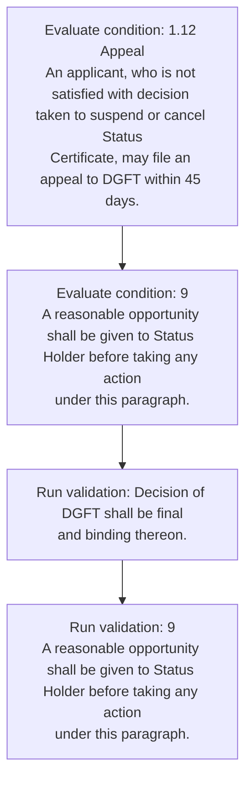
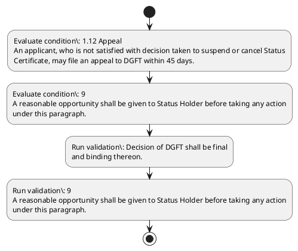

# Chapter 1 / Section 1.12: Appeal

**Chapter Title:** Legal Framework and Trade Facilitation

**Pages:** 7

**Purpose:** 1.12 Appeal
An applicant, who is not satisfied with decision taken to suspend or cancel Status
Certificate, may file an appeal to DGFT within 45 days.

**Purpose Thanglish:** Indha Appeal section-la, 1.12 Appeal
An applicant, who is not satisfied with decision taken to suspend or cancel Status
Certificate, may file an appeal to DGFT within 45 days.

**Summary:** 1.12 Appeal
An applicant, who is not satisfied with decision taken to suspend or cancel Status
Certificate, may file an appeal to DGFT within 45 days. Decision of DGFT shall be final
and binding thereon. pg.

**Business Meaning:** Appeal governs how DGFT business controls should be applied, validated, and enforced.

**Business Explanation:** Appeal explains the operating rule set that DEKAI should enforce. Key control points include Decision of DGFT shall be final
and binding thereon.

**Business Explanation Thanglish:** Indha Appeal section-la, Appeal explains the operating rule set that DEKAI should enforce. Key control points include Decision of DGFT kandippa be final
and binding thereon.

## Business Logic
- Decision of DGFT shall be final
and binding thereon.
- 9
A reasonable opportunity shall be given to Status Holder before taking any action
under this paragraph.

## Business Rules
- rule_id=CH1-SEC1_12-R001, rule_description=Decision of DGFT shall be final
and binding thereon., trigger=Appeal, condition=1.12 Appeal
An applicant, who is not satisfied with decision taken to suspend or cancel Status
Certificate, may file an appeal to DGFT within 45 days., validation=Decision of DGFT shall be final
and binding thereon., action=Manual review required., exception=No explicit exception found in uploaded documents., output=DEKAI should produce a compliance decision for 1.12 - Appeal.
- rule_id=CH1-SEC1_12-R002, rule_description=9
A reasonable opportunity shall be given to Status Holder before taking any action
under this paragraph., trigger=Appeal, condition=9
A reasonable opportunity shall be given to Status Holder before taking any action
under this paragraph., validation=9
A reasonable opportunity shall be given to Status Holder before taking any action
under this paragraph., action=Manual review required., exception=No explicit exception found in uploaded documents., output=DEKAI should produce a compliance decision for 1.12 - Appeal.

## Conditions
- 1.12 Appeal
An applicant, who is not satisfied with decision taken to suspend or cancel Status
Certificate, may file an appeal to DGFT within 45 days.
- 9
A reasonable opportunity shall be given to Status Holder before taking any action
under this paragraph.

## Condition Logic
- id=1.1.12.1, if=1.12 Appeal
An applicant, who is not satisfied with decision taken to suspend or cancel Status
Certificate, may file an appeal to DGFT within 45 days., then=Route for review, source=1.12 Appeal
An applicant, who is not satisfied with decision taken to suspend or cancel Status
Certificate, may file an appeal to DGFT within 45 days.
- id=1.1.12.2, if=9
A reasonable opportunity shall be given to Status Holder before taking any action
under this paragraph., then=Route for review, source=9
A reasonable opportunity shall be given to Status Holder before taking any action
under this paragraph.

## Validations
- Decision of DGFT shall be final
and binding thereon.
- 9
A reasonable opportunity shall be given to Status Holder before taking any action
under this paragraph.

## Exceptions
- None identified

## Dependencies
- None identified

## Authorities
- DGFT
- Decision of DGFT

## Required Documents
- 1.12 Appeal
An applicant, who is not satisfied with decision taken to suspend or cancel Status
Certificate, may file an appeal to DGFT within 45 days.

## Timelines
- 1.12 Appeal
An applicant, who is not satisfied with decision taken to suspend or cancel Status
Certificate, may file an appeal to DGFT within 45 days.
- 9
A reasonable opportunity shall be given to Status Holder before taking any action
under this paragraph.

## Actions
- None identified

## Workflow
- Evaluate condition: 1.12 Appeal
An applicant, who is not satisfied with decision taken to suspend or cancel Status
Certificate, may file an appeal to DGFT within 45 days.
- Evaluate condition: 9
A reasonable opportunity shall be given to Status Holder before taking any action
under this paragraph.
- Run validation: Decision of DGFT shall be final
and binding thereon.
- Run validation: 9
A reasonable opportunity shall be given to Status Holder before taking any action
under this paragraph.

## Workflow ASCII
```text
Appeal
Evaluate condition: 1.12 Appeal
An applicant, who is not satisfied with decision taken to suspend or cancel Status
Certificate, may file an appeal to DGFT within 45 days.
   |
   v
Evaluate condition: 9
A reasonable opportunity shall be given to Status Holder before taking any action
under this paragraph.
   |
   v
Run validation: Decision of DGFT shall be final
and binding thereon.
   |
   v
Run validation: 9
A reasonable opportunity shall be given to Status Holder before taking any action
under this paragraph.
```

## Decision Tree
- IF section 1.12 applies THEN proceed with standard DGFT workflow

## Decision Tree ASCII
```text
Appeal Decision
IF section 1.12 applies THEN proceed with standard DGFT workflow
```

## Examples
- User asks to process Appeal; the platform checks conditions, validations, and documents before action.

**Real-world Example:** Example: an importer or exporter invokes Appeal, submits 1.12 Appeal
An applicant, who is not satisfied with decision taken to suspend or cancel Status
Certificate, may file an appeal to DGFT within 45 days., and DEKAI uses the extracted rules to follow the appeal process.

**Real-world Example Thanglish:** Indha Appeal section-la, Example: an importer or exporter invokes Appeal, submits 1.12 Appeal
An applicant, who is not satisfied with decision taken to suspend or cancel Status
Certificate, may file an appeal to DGFT within 45 days., and DEKAI uses the extracted rules to follow the appeal process.

## AI Rules
- IF detected context matches section rule THEN enforce: Decision of DGFT shall be final
and binding thereon.
- IF detected context matches section rule THEN enforce: 9
A reasonable opportunity shall be given to Status Holder before taking any action
under this paragraph.

## Database Fields
- name=section_code, type=string, required=True, source=parsed_section_heading
- name=section_title, type=string, required=True, source=parsed_section_heading
- name=who_flag, type=boolean, required=False, source=keyword:who
- name=not_flag, type=boolean, required=False, source=keyword:not
- name=may_flag, type=boolean, required=False, source=keyword:may
- name=and_flag, type=boolean, required=False, source=keyword:and
- name=any_flag, type=boolean, required=False, source=keyword:any
- name=with_flag, type=boolean, required=False, source=keyword:with
- name=file_flag, type=boolean, required=False, source=keyword:file
- name=dgft_flag, type=boolean, required=False, source=keyword:DGFT
- name=document_1_submitted, type=boolean, required=True, source=1.12 Appeal
An applicant, who is not satisfied with decision taken to suspend or cancel Status
Certificate, may file an appeal to DGFT within 45 days.

## API Requirements
- method=GET, path=/api/dgft/sections/1.12, purpose=Retrieve knowledge payload for section 1.12, query_params=['include=workflow,decision_tree,validations'], response_fields=['section', 'title', 'summary', 'conditions', 'validations', 'exceptions', 'workflow', 'decision_tree']
- method=POST, path=/api/dgft/Appeal/validate, purpose=Validate inputs and documents for Appeal, request_fields=['section_code', 'section_title', 'document_1_submitted'], response_fields=['status', 'errors', 'warnings', 'next_actions']

## UI Screens
- screen_id=Appeal_overview, name=Appeal Overview, purpose=Show section summary, authority, timeline, and eligibility cues., widgets=['summary_card', 'conditions_table', 'authority_badges', 'timeline_panel']
- screen_id=Appeal_submission, name=Appeal Submission, purpose=Capture applicant data and supporting documents., widgets=['dynamic_form', 'document_uploader', 'validation_panel', 'next_action_footer'], fields=['section_code', 'section_title', 'who_flag', 'not_flag', 'may_flag', 'and_flag', 'any_flag', 'with_flag']

## Error Messages
- Validation failed because the section requirements were not fully met.

## FAQ
- question_en=What is the purpose of section 1.12?, answer_en=Appeal explains the operating rule set that DEKAI should enforce. Key control points include Decision of DGFT shall be final
and binding thereon., question_thanglish=Indha Appeal section-la, What is the purpose of section 1.12?, answer_thanglish=Indha Appeal section-la, Appeal explains the operating rule set that DEKAI should enforce. Key control points include Decision of DGFT kandippa be final
and binding thereon.
- question_en=What documents are required under Appeal?, answer_en=1.12 Appeal
An applicant, who is not satisfied with decision taken to suspend or cancel Status
Certificate, may file an appeal to DGFT within 45 days., question_thanglish=Indha Appeal section-la, What documents are required under Appeal?, answer_thanglish=Indha Appeal section-la, 1.12 Appeal
An applicant, who is not satisfied with decision taken to suspend or cancel Status
Certificate, may file an appeal to DGFT within 45 days.
- question_en=Which authority handles Appeal?, answer_en=DGFT, Decision of DGFT, question_thanglish=Indha Appeal section-la, Which authority handles Appeal?, answer_thanglish=Indha Appeal section-la, DGFT, Decision of DGFT

## Questions Users May Ask
- What does Appeal require?
- Which documents are needed for Appeal?
- How does DEKAI validate Appeal requests?

## Expected AI Answers
- Appeal requires the platform to interpret the section text, apply the extracted business rules, and present the correct next action.
- Required documents are inferred from the section text: 1.12 Appeal
An applicant, who is not satisfied with decision taken to suspend or cancel Status
Certificate, may file an appeal to DGFT within 45 days.
- DEKAI validates Appeal by checking conditions, required documents, authority references, and exception clauses before recommending an outcome.

## AI Q&A Examples
- question_en=User asks: How do I comply with Appeal?, answer_en=AI answers: DEKAI should evaluate section 1.12, apply the extracted rules, and guide the user through Evaluate condition: 1.12 Appeal
An applicant, who is not satisfied with decision taken to suspend or cancel Status
Certificate, may file an appeal to DGFT within 45 days.., question_thanglish=Indha Appeal section-la, User asks: How do I comply with Appeal?, answer_thanglish=Indha Appeal section-la, AI answers: DEKAI should evaluate section 1.12, apply the extracted rules, and guide the user through Evaluate condition: 1.12 Appeal
An applicant, who is not satisfied with decision taken to suspend or cancel Status
Certificate, may file an appeal to DGFT within 45 days..
- question_en=User asks: Which validations apply to Appeal?, answer_en=AI answers: Applicable validations are Decision of DGFT shall be final
and binding thereon., 9
A reasonable opportunity shall be given to Status Holder before taking any action
under this paragraph., question_thanglish=Indha Appeal section-la, User asks: Which validations apply to Appeal?, answer_thanglish=Indha Appeal section-la, AI answers: Applicable validations are Decision of DGFT kandippa be final
and binding thereon., 9
A reasonable opportunity kandippa be given to Status Holder before taking any action
under this paragraph.

## DEKAI AI Implementation Notes
- Capture chapter 1, section 1.12, title, and page references as immutable knowledge metadata.
- Bind validations for Appeal into a rule engine keyed by the rule IDs extracted for this section.
- Expose document upload controls for: 1.12 Appeal
An applicant, who is not satisfied with decision taken to suspend or cancel Status
Certificate, may file an appeal to DGFT within 45 days..
- Route escalations or approvals to: DGFT, Decision of DGFT.

## DEKAI AI Implementation Notes Thanglish
- Indha Appeal section-la, Capture chapter 1, section 1.12, title, and page references as immutable knowledge metadata.
- Indha Appeal section-la, Bind validations for Appeal into a rule engine keyed by the rule IDs extracted for this section.
- Indha Appeal section-la, Expose document upload controls for: 1.12 Appeal
An applicant, who is not satisfied with decision taken to suspend or cancel Status
Certificate, may file an appeal to DGFT within 45 days..
- Indha Appeal section-la, Route escalations or approvals to: DGFT, Decision of DGFT.

## AI Metadata
- Keywords: who, not, may, and, any, with, file, DGFT, days, this, taken, shall, final, given, under, Appeal, cancel, Status, within, Holder
- Search Keywords: who, not, may, and, any, with, file, DGFT, days, this, taken, shall, final, given, under, Appeal, cancel, Status, within, Holder
- Intent: Provide knowledge guidance for Appeal.
- Tags: 1.12, Appeal, business-rule, document-driven, dgft
- Related Sections: 
- Related Chapters: 
- Related Rules: Decision of DGFT shall be final
and binding thereon., 9
A reasonable opportunity shall be given to Status Holder before taking any action
under this paragraph.

## Mermaid


## PlantUML

