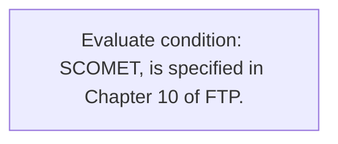
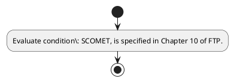

# Chapter 10 / Section 10.00: Policy

**Chapter Title:** SCOMET: Special Chemicals, Organisms, Materials, Equipment and Technologies

**Pages:** 2

**Purpose:** 10.00 Policy
Policy relating to general provisions governing the export of dual use items,
munitions and nuclear related items, including software and technology, viz.

**Purpose Thanglish:** Indha Policy section-la, 10.00 Policy
Policy relating to general provisions governing the export of dual use items,
munitions and nuclear related items, including software and technology, viz.

**Summary:** 10.00 Policy
Policy relating to general provisions governing the export of dual use items,
munitions and nuclear related items, including software and technology, viz. SCOMET, is specified in Chapter 10 of FTP.

**Business Meaning:** 10.00 Policy
Policy relating to general provisions governing the export of dual use items,
munitions and nuclear related items, including software and technology, viz.

**Business Explanation:** 10.00 Policy
Policy relating to general provisions governing the export of dual use items,
munitions and nuclear related items, including software and technology, viz. SCOMET, is specified in Chapter 10 of FTP.

**Business Explanation Thanglish:** Indha Policy section-la, 10.00 Policy
Policy relating to general provisions governing the export of dual use items,
munitions and nuclear related items, including software and technology, viz. SCOMET, is specified in Chapter 10 of FTP.

## Business Logic
- None identified

## Business Rules
- rule_id=CH10-SEC10_00-R001, rule_description=10.00 Policy
Policy relating to general provisions governing the export of dual use items,
munitions and nuclear related items, including software and technology, viz. SCOMET, is specified in Chapter 10 of FTP., trigger=Policy, condition=SCOMET, is specified in Chapter 10 of FTP., validation=Not explicitly covered in uploaded documents., action=Manual review required., exception=No explicit exception found in uploaded documents., output=DEKAI should produce a compliance decision for 10.00 - Policy.

## Conditions
- SCOMET, is specified in Chapter 10 of FTP.

## Condition Logic
- id=10.10.00.1, if=SCOMET, is specified in Chapter 10 of FTP., then=Route for review, source=SCOMET, is specified in Chapter 10 of FTP.

## Validations
- None identified

## Exceptions
- None identified

## Dependencies
- 10

## Authorities
- None identified

## Required Documents
- None identified

## Timelines
- None identified

## Actions
- None identified

## Workflow
- Evaluate condition: SCOMET, is specified in Chapter 10 of FTP.

## Workflow ASCII
```text
Policy
Evaluate condition: SCOMET, is specified in Chapter 10 of FTP.
```

## Decision Tree
- IF section 10.00 applies THEN proceed with standard DGFT workflow

## Decision Tree ASCII
```text
Policy Decision
IF section 10.00 applies THEN proceed with standard DGFT workflow
```

## Examples
- User asks to process Policy; the platform checks conditions, validations, and documents before action.

**Real-world Example:** Example: an importer or exporter invokes Policy, submits the prescribed DGFT records, and DEKAI uses the extracted rules to follow the policy process.

**Real-world Example Thanglish:** Indha Policy section-la, Example: an importer or exporter invokes Policy, submits the prescribed DGFT records, and DEKAI uses the extracted rules to follow the policy process.

## AI Rules
- None identified

## Database Fields
- name=section_code, type=string, required=True, source=parsed_section_heading
- name=section_title, type=string, required=True, source=parsed_section_heading
- name=the_flag, type=boolean, required=False, source=keyword:the
- name=use_flag, type=boolean, required=False, source=keyword:use
- name=and_flag, type=boolean, required=False, source=keyword:and
- name=viz_flag, type=boolean, required=False, source=keyword:viz
- name=ftp_flag, type=boolean, required=False, source=keyword:FTP
- name=dual_flag, type=boolean, required=False, source=keyword:dual
- name=items_flag, type=boolean, required=False, source=keyword:items
- name=policy_flag, type=boolean, required=False, source=keyword:Policy

## API Requirements
- method=GET, path=/api/dgft/sections/10.00, purpose=Retrieve knowledge payload for section 10.00, query_params=['include=workflow,decision_tree,validations'], response_fields=['section', 'title', 'summary', 'conditions', 'validations', 'exceptions', 'workflow', 'decision_tree']
- method=POST, path=/api/dgft/Policy/validate, purpose=Validate inputs and documents for Policy, request_fields=['section_code', 'section_title'], response_fields=['status', 'errors', 'warnings', 'next_actions']

## UI Screens
- screen_id=Policy_overview, name=Policy Overview, purpose=Show section summary, authority, timeline, and eligibility cues., widgets=['summary_card', 'conditions_table', 'authority_badges', 'timeline_panel']
- screen_id=Policy_submission, name=Policy Submission, purpose=Capture applicant data and supporting documents., widgets=['dynamic_form', 'document_uploader', 'validation_panel', 'next_action_footer'], fields=['section_code', 'section_title', 'the_flag', 'use_flag', 'and_flag', 'viz_flag', 'ftp_flag', 'dual_flag']

## Error Messages
- Validation failed because the section requirements were not fully met.

## FAQ
- question_en=What is the purpose of section 10.00?, answer_en=10.00 Policy
Policy relating to general provisions governing the export of dual use items,
munitions and nuclear related items, including software and technology, viz. SCOMET, is specified in Chapter 10 of FTP., question_thanglish=Indha Policy section-la, What is the purpose of section 10.00?, answer_thanglish=Indha Policy section-la, 10.00 Policy
Policy relating to general provisions governing the export of dual use items,
munitions and nuclear related items, including software and technology, viz. SCOMET, is specified in Chapter 10 of FTP.
- question_en=What documents are required under Policy?, answer_en=Not explicitly covered in uploaded documents., question_thanglish=Indha Policy section-la, What documents are required under Policy?, answer_thanglish=Indha Policy section-la, Not explicitly covered in uploaded documents.
- question_en=Which authority handles Policy?, answer_en=Not explicitly covered in uploaded documents., question_thanglish=Indha Policy section-la, Which authority handles Policy?, answer_thanglish=Indha Policy section-la, Not explicitly covered in uploaded documents.

## Questions Users May Ask
- What does Policy require?
- Which documents are needed for Policy?
- How does DEKAI validate Policy requests?

## Expected AI Answers
- Policy requires the platform to interpret the section text, apply the extracted business rules, and present the correct next action.
- Required documents are inferred from the section text: no explicit documents were detected.
- DEKAI validates Policy by checking conditions, required documents, authority references, and exception clauses before recommending an outcome.

## AI Q&A Examples
- question_en=User asks: How do I comply with Policy?, answer_en=AI answers: DEKAI should evaluate section 10.00, apply the extracted rules, and guide the user through Evaluate condition: SCOMET, is specified in Chapter 10 of FTP.., question_thanglish=Indha Policy section-la, User asks: How do I comply with Policy?, answer_thanglish=Indha Policy section-la, AI answers: DEKAI should evaluate section 10.00, apply the extracted rules, and guide the user through Evaluate condition: SCOMET, is specified in Chapter 10 of FTP..
- question_en=User asks: Which validations apply to Policy?, answer_en=AI answers: Applicable validations are not explicitly covered in the uploaded documents., question_thanglish=Indha Policy section-la, User asks: Which validations apply to Policy?, answer_thanglish=Indha Policy section-la, AI answers: Applicable validations are not explicitly covered in the uploaded documents.

## DEKAI AI Implementation Notes
- Capture chapter 10, section 10.00, title, and page references as immutable knowledge metadata.
- Bind validations for Policy into a rule engine keyed by the rule IDs extracted for this section.

## DEKAI AI Implementation Notes Thanglish
- Indha Policy section-la, Capture chapter 10, section 10.00, title, and page references as immutable knowledge metadata.
- Indha Policy section-la, Bind validations for Policy into a rule engine keyed by the rule IDs extracted for this section.

## AI Metadata
- Keywords: the, use, and, viz, FTP, dual, items, Policy, export, SCOMET, general, nuclear, related, Chapter, relating, software, governing, munitions, including, specified
- Search Keywords: the, use, and, viz, FTP, dual, items, Policy, export, SCOMET, general, nuclear, related, Chapter, relating, software, governing, munitions, including, specified
- Intent: Provide knowledge guidance for Policy.
- Tags: 10.00, Policy, dgft
- Related Sections: 
- Related Chapters: 
- Related Rules: 

## Mermaid


## PlantUML

