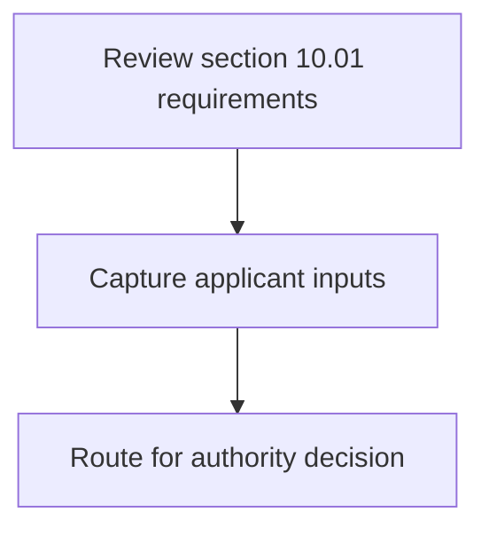
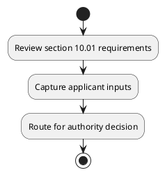

# Chapter 10 / Section 10.01: Coverage

**Chapter Title:** SCOMET: Special Chemicals, Organisms, Materials, Equipment and Technologies

**Pages:** 2

**Purpose:** 10.01 Coverage
This chapter covers the procedure for various applications relating to export of
dual use items under SCOMET.

**Purpose Thanglish:** Indha Coverage section-la, 10.01 Coverage
This chapter covers the procedure for various applications relating to export of
dual use items under SCOMET.

**Summary:** 10.01 Coverage
This chapter covers the procedure for various applications relating to export of
dual use items under SCOMET.

**Business Meaning:** 10.01 Coverage
This chapter covers the procedure for various applications relating to export of
dual use items under SCOMET.

**Business Explanation:** 10.01 Coverage
This chapter covers the procedure for various applications relating to export of
dual use items under SCOMET.

**Business Explanation Thanglish:** Indha Coverage section-la, 10.01 Coverage
This chapter covers the procedure for various applications relating to export of
dual use items under SCOMET.

## Business Logic
- None identified

## Business Rules
- rule_id=CH10-SEC10_01-R001, rule_description=10.01 Coverage
This chapter covers the procedure for various applications relating to export of
dual use items under SCOMET., trigger=Coverage, condition=Not explicitly covered in uploaded documents., validation=Not explicitly covered in uploaded documents., action=Manual review required., exception=No explicit exception found in uploaded documents., output=DEKAI should produce a compliance decision for 10.01 - Coverage.

## Conditions
- None identified

## Condition Logic
- None identified

## Validations
- None identified

## Exceptions
- None identified

## Dependencies
- None identified

## Authorities
- None identified

## Required Documents
- 10.01 Coverage
This chapter covers the procedure for various applications relating to export of
dual use items under SCOMET.

## Timelines
- None identified

## Actions
- None identified

## Workflow
- Review section 10.01 requirements
- Capture applicant inputs
- Route for authority decision

## Workflow ASCII
```text
Coverage
Review section 10.01 requirements
   |
   v
Capture applicant inputs
   |
   v
Route for authority decision
```

## Decision Tree
- IF section 10.01 applies THEN proceed with standard DGFT workflow

## Decision Tree ASCII
```text
Coverage Decision
IF section 10.01 applies THEN proceed with standard DGFT workflow
```

## Examples
- User asks to process Coverage; the platform checks conditions, validations, and documents before action.

**Real-world Example:** Example: an importer or exporter invokes Coverage, submits 10.01 Coverage
This chapter covers the procedure for various applications relating to export of
dual use items under SCOMET., and DEKAI uses the extracted rules to follow the coverage process.

**Real-world Example Thanglish:** Indha Coverage section-la, Example: an importer or exporter invokes Coverage, submits 10.01 Coverage
This chapter covers the procedure for various applications relating to export of
dual use items under SCOMET., and DEKAI uses the extracted rules to follow the coverage process.

## AI Rules
- None identified

## Database Fields
- name=section_code, type=string, required=True, source=parsed_section_heading
- name=section_title, type=string, required=True, source=parsed_section_heading
- name=the_flag, type=boolean, required=False, source=keyword:the
- name=for_flag, type=boolean, required=False, source=keyword:for
- name=use_flag, type=boolean, required=False, source=keyword:use
- name=this_flag, type=boolean, required=False, source=keyword:This
- name=dual_flag, type=boolean, required=False, source=keyword:dual
- name=items_flag, type=boolean, required=False, source=keyword:items
- name=under_flag, type=boolean, required=False, source=keyword:under
- name=covers_flag, type=boolean, required=False, source=keyword:covers
- name=document_1_submitted, type=boolean, required=True, source=10.01 Coverage
This chapter covers the procedure for various applications relating to export of
dual use items under SCOMET.

## API Requirements
- method=GET, path=/api/dgft/sections/10.01, purpose=Retrieve knowledge payload for section 10.01, query_params=['include=workflow,decision_tree,validations'], response_fields=['section', 'title', 'summary', 'conditions', 'validations', 'exceptions', 'workflow', 'decision_tree']
- method=POST, path=/api/dgft/Coverage/validate, purpose=Validate inputs and documents for Coverage, request_fields=['section_code', 'section_title', 'document_1_submitted'], response_fields=['status', 'errors', 'warnings', 'next_actions']

## UI Screens
- screen_id=Coverage_overview, name=Coverage Overview, purpose=Show section summary, authority, timeline, and eligibility cues., widgets=['summary_card', 'conditions_table', 'authority_badges', 'timeline_panel']
- screen_id=Coverage_submission, name=Coverage Submission, purpose=Capture applicant data and supporting documents., widgets=['dynamic_form', 'document_uploader', 'validation_panel', 'next_action_footer'], fields=['section_code', 'section_title', 'the_flag', 'for_flag', 'use_flag', 'this_flag', 'dual_flag', 'items_flag']

## Error Messages
- Validation failed because the section requirements were not fully met.

## FAQ
- question_en=What is the purpose of section 10.01?, answer_en=10.01 Coverage
This chapter covers the procedure for various applications relating to export of
dual use items under SCOMET., question_thanglish=Indha Coverage section-la, What is the purpose of section 10.01?, answer_thanglish=Indha Coverage section-la, 10.01 Coverage
This chapter covers the procedure for various applications relating to export of
dual use items under SCOMET.
- question_en=What documents are required under Coverage?, answer_en=10.01 Coverage
This chapter covers the procedure for various applications relating to export of
dual use items under SCOMET., question_thanglish=Indha Coverage section-la, What documents are required under Coverage?, answer_thanglish=Indha Coverage section-la, 10.01 Coverage
This chapter covers the procedure for various applications relating to export of
dual use items under SCOMET.
- question_en=Which authority handles Coverage?, answer_en=Not explicitly covered in uploaded documents., question_thanglish=Indha Coverage section-la, Which authority handles Coverage?, answer_thanglish=Indha Coverage section-la, Not explicitly covered in uploaded documents.

## Questions Users May Ask
- What does Coverage require?
- Which documents are needed for Coverage?
- How does DEKAI validate Coverage requests?

## Expected AI Answers
- Coverage requires the platform to interpret the section text, apply the extracted business rules, and present the correct next action.
- Required documents are inferred from the section text: 10.01 Coverage
This chapter covers the procedure for various applications relating to export of
dual use items under SCOMET.
- DEKAI validates Coverage by checking conditions, required documents, authority references, and exception clauses before recommending an outcome.

## AI Q&A Examples
- question_en=User asks: How do I comply with Coverage?, answer_en=AI answers: DEKAI should evaluate section 10.01, apply the extracted rules, and guide the user through Review section 10.01 requirements., question_thanglish=Indha Coverage section-la, User asks: How do I comply with Coverage?, answer_thanglish=Indha Coverage section-la, AI answers: DEKAI should evaluate section 10.01, apply the extracted rules, and guide the user through Review section 10.01 requirements.
- question_en=User asks: Which validations apply to Coverage?, answer_en=AI answers: Applicable validations are not explicitly covered in the uploaded documents., question_thanglish=Indha Coverage section-la, User asks: Which validations apply to Coverage?, answer_thanglish=Indha Coverage section-la, AI answers: Applicable validations are not explicitly covered in the uploaded documents.

## DEKAI AI Implementation Notes
- Capture chapter 10, section 10.01, title, and page references as immutable knowledge metadata.
- Bind validations for Coverage into a rule engine keyed by the rule IDs extracted for this section.
- Expose document upload controls for: 10.01 Coverage
This chapter covers the procedure for various applications relating to export of
dual use items under SCOMET..

## DEKAI AI Implementation Notes Thanglish
- Indha Coverage section-la, Capture chapter 10, section 10.01, title, and page references as immutable knowledge metadata.
- Indha Coverage section-la, Bind validations for Coverage into a rule engine keyed by the rule IDs extracted for this section.
- Indha Coverage section-la, Expose document upload controls for: 10.01 Coverage
This chapter covers the procedure for various applications relating to export of
dual use items under SCOMET..

## AI Metadata
- Keywords: the, for, use, This, dual, items, under, covers, export, SCOMET, chapter, various, Coverage, relating, procedure, applications
- Search Keywords: the, for, use, This, dual, items, under, covers, export, SCOMET, chapter, various, Coverage, relating, procedure, applications
- Intent: Provide knowledge guidance for Coverage.
- Tags: 10.01, Coverage, document-driven, dgft
- Related Sections: 
- Related Chapters: 
- Related Rules: 

## Mermaid


## PlantUML

