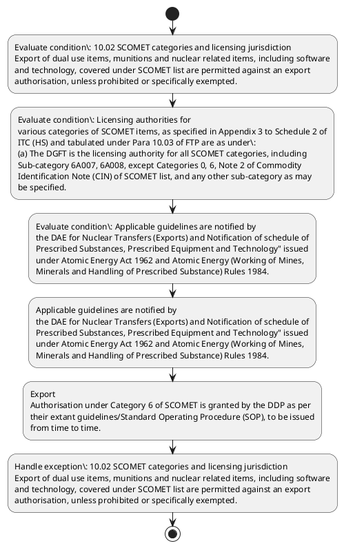

# Chapter 10 / Section 10.02: SCOMET categories and licensing jurisdiction

**Chapter Title:** SCOMET: Special Chemicals, Organisms, Materials, Equipment and Technologies

**Pages:** 2, 3

**Purpose:** Licensing authorities for
various categories of SCOMET items, as specified in Appendix 3 to Schedule 2 of
ITC (HS) and tabulated under Para 10.03 of FTP are as under:
(a) The DGFT is the licensing authority for all SCOMET categories, including
Sub-category 6A007, 6A008, except Categories 0, 6, Note 2 of Commodity
Identification Note (CIN) of SCOMET list, and any other sub-category as may
be specified.

**Purpose Thanglish:** Indha SCOMET categories and licensing jurisdiction section-la, Licensing authorities for
various categories of SCOMET items, as specified in Appendix 3 to Schedule 2 of
ITC (HS) and tabulated under Para 10.03 of FTP are as under:
(a) The DGFT is the licensing authority for all SCOMET categories, including
Sub-category 6A007, 6A008, except Categories 0, 6, Note 2 of Commodity
Identification Note (CIN) of SCOMET list, and any other sub-category as may
be specified.

**Summary:** 10.02 SCOMET categories and licensing jurisdiction
Export of dual use items, munitions and nuclear related items, including software
and technology, covered under SCOMET list are permitted against an export
authorisation, unless prohibited or specifically exempted. Licensing authorities for
various categories of SCOMET items, as specified in Appendix 3 to Schedule 2 of
ITC (HS) and tabulated under Para 10.03 of FTP are as under:
(a) The DGFT is the licensing authority for all SCOMET categories, including
Sub-category 6A007, 6A008, except Categories 0, 6, Note 2 of Commodity
Identification Note (CIN) of SCOMET list, and any other sub-category as may
be specified. (b) The Department of Atomic Energy (DAE) is the licensing authority for items
in Category 0 and Note 2 of the 'CIN’.

**Business Meaning:** 10.02 SCOMET categories and licensing jurisdiction
Export of dual use items, munitions and nuclear related items, including software
and technology, covered under SCOMET list are permitted against an export
authorisation, unless prohibited or specifically exempted.

**Business Explanation:** 10.02 SCOMET categories and licensing jurisdiction
Export of dual use items, munitions and nuclear related items, including software
and technology, covered under SCOMET list are permitted against an export
authorisation, unless prohibited or specifically exempted. Licensing authorities for
various categories of SCOMET items, as specified in Appendix 3 to Schedule 2 of
ITC (HS) and tabulated under Para 10.03 of FTP are as under:
(a) The DGFT is the licensing authority for all SCOMET categories, including
Sub-category 6A007, 6A008, except Categories 0, 6, Note 2 of Commodity
Identification Note (CIN) of SCOMET list, and any other sub-category as may
be specified. (b) The Department of Atomic Energy (DAE) is the licensing authority for items
in Category 0 and Note 2 of the 'CIN’.

**Business Explanation Thanglish:** Indha SCOMET categories and licensing jurisdiction section-la, 10.02 SCOMET categories and licensing jurisdiction
export of dual use items, munitions and nuclear related items, including software
and technology, covered under SCOMET list are permitted against an export
authorisation, unless prohibited or specifically exempted. Licensing authorities for
various categories of SCOMET items, as specified in Appendix 3 to Schedule 2 of
ITC (HS) and tabulated under Para 10.03 of FTP are as under:
(a) The DGFT is the licensing authority for all SCOMET categories, including
Sub-category 6A007, 6A008, except Categories 0, 6, Note 2 of Commodity
Identification Note (CIN) of SCOMET list, and any other sub-category as may
be specified. (b) The Department of Atomic Energy (DAE) is the licensing authority for items
in Category 0 and Note 2 of the 'CIN’.

## Business Logic
- None identified

## Business Rules
- rule_id=CH10-SEC10_02-R001, rule_description=IF validations pass THEN recommend action: Applicable guidelines are notified by
the DAE for Nuclear Transfers (Exports) and Notification of schedule of
Prescribed Substances, Prescribed Equipment and Technology" issued
under Atomic Energy Act 1962 and Atomic Energy (Working of Mines,
Minerals and Handling of Prescribed Substance) Rules 1984., trigger=SCOMET categories and licensing jurisdiction, condition=10.02 SCOMET categories and licensing jurisdiction
Export of dual use items, munitions and nuclear related items, including software
and technology, covered under SCOMET list are permitted against an export
authorisation, unless prohibited or specifically exempted., validation=Not explicitly covered in uploaded documents., action=Applicable guidelines are notified by
the DAE for Nuclear Transfers (Exports) and Notification of schedule of
Prescribed Substances, Prescribed Equipment and Technology" issued
under Atomic Energy Act 1962 and Atomic Energy (Working of Mines,
Minerals and Handling of Prescribed Substance) Rules 1984., exception=10.02 SCOMET categories and licensing jurisdiction
Export of dual use items, munitions and nuclear related items, including software
and technology, covered under SCOMET list are permitted against an export
authorisation, unless prohibited or specifically exempted., output=DEKAI should produce a compliance decision for 10.02 - SCOMET categories and licensing jurisdiction.

## Conditions
- 10.02 SCOMET categories and licensing jurisdiction
Export of dual use items, munitions and nuclear related items, including software
and technology, covered under SCOMET list are permitted against an export
authorisation, unless prohibited or specifically exempted.
- Licensing authorities for
various categories of SCOMET items, as specified in Appendix 3 to Schedule 2 of
ITC (HS) and tabulated under Para 10.03 of FTP are as under:
(a) The DGFT is the licensing authority for all SCOMET categories, including
Sub-category 6A007, 6A008, except Categories 0, 6, Note 2 of Commodity
Identification Note (CIN) of SCOMET list, and any other sub-category as may
be specified.
- Applicable guidelines are notified by
the DAE for Nuclear Transfers (Exports) and Notification of schedule of
Prescribed Substances, Prescribed Equipment and Technology" issued
under Atomic Energy Act 1962 and Atomic Energy (Working of Mines,
Minerals and Handling of Prescribed Substance) Rules 1984.
- Authorisations for export of certain
items in Category 0 will not be granted unless transfer is under adequate
physical protection and is covered by appropriate International Atomic
Energy Agency (IAEA) safeguards, or any other mutually agreed controls on
transferred items.
- SCOMET, is specified in Chapter 10 of FTP.
- 10.02
SCOMET categories and licensing jurisdiction
Export of dual use items, munitions and nuclear related items, including software
and technology, covered under SCOMET list are permitted against an export
authorisation, unless prohibited or specifically exempted.
- Licensing authorities for
various categories of SCOMET items, as specified in Appendix 3 to Schedule 2 of
ITC (HS) and tabulated under Para 10.03 of FTP are as under:
(a)
The DGFT is the licensing authority for all SCOMET categories, including
Sub-category 6A007, 6A008, except Categories 0, 6, Note 2 of Commodity
Identification Note (CIN) of SCOMET list, and any other sub-category as may
be specified.

## Condition Logic
- id=10.10.02.1, if=10.02 SCOMET categories and licensing jurisdiction
Export of dual use items, munitions and nuclear related items, including software
and technology, covered under SCOMET list are permitted against an export
authorisation, unless prohibited or specifically exempted., then=Applicable guidelines are notified by
the DAE for Nuclear Transfers (Exports) and Notification of schedule of
Prescribed Substances, Prescribed Equipment and Technology" issued
under Atomic Energy Act 1962 and Atomic Energy (Working of Mines,
Minerals and Handling of Prescribed Substance) Rules 1984., source=10.02 SCOMET categories and licensing jurisdiction
Export of dual use items, munitions and nuclear related items, including software
and technology, covered under SCOMET list are permitted against an export
authorisation, unless prohibited or specifically exempted.
- id=10.10.02.2, if=Licensing authorities for
various categories of SCOMET items, as specified in Appendix 3 to Schedule 2 of
ITC (HS) and tabulated under Para 10.03 of FTP are as under:
(a) The DGFT is the licensing authority for all SCOMET categories, including
Sub-category 6A007, 6A008, except Categories 0, 6, Note 2 of Commodity
Identification Note (CIN) of SCOMET list, and any other sub-category as may
be specified., then=Applicable guidelines are notified by
the DAE for Nuclear Transfers (Exports) and Notification of schedule of
Prescribed Substances, Prescribed Equipment and Technology" issued
under Atomic Energy Act 1962 and Atomic Energy (Working of Mines,
Minerals and Handling of Prescribed Substance) Rules 1984., source=Licensing authorities for
various categories of SCOMET items, as specified in Appendix 3 to Schedule 2 of
ITC (HS) and tabulated under Para 10.03 of FTP are as under:
(a) The DGFT is the licensing authority for all SCOMET categories, including
Sub-category 6A007, 6A008, except Categories 0, 6, Note 2 of Commodity
Identification Note (CIN) of SCOMET list, and any other sub-category as may
be specified.
- id=10.10.02.3, if=Applicable guidelines are notified by
the DAE for Nuclear Transfers (Exports) and Notification of schedule of
Prescribed Substances, Prescribed Equipment and Technology" issued
under Atomic Energy Act 1962 and Atomic Energy (Working of Mines,
Minerals and Handling of Prescribed Substance) Rules 1984., then=Applicable guidelines are notified by
the DAE for Nuclear Transfers (Exports) and Notification of schedule of
Prescribed Substances, Prescribed Equipment and Technology" issued
under Atomic Energy Act 1962 and Atomic Energy (Working of Mines,
Minerals and Handling of Prescribed Substance) Rules 1984., source=Applicable guidelines are notified by
the DAE for Nuclear Transfers (Exports) and Notification of schedule of
Prescribed Substances, Prescribed Equipment and Technology" issued
under Atomic Energy Act 1962 and Atomic Energy (Working of Mines,
Minerals and Handling of Prescribed Substance) Rules 1984.
- id=10.10.02.4, if=Authorisations for export of certain
items in Category 0 will not be granted unless transfer is under adequate
physical protection and is covered by appropriate International Atomic
Energy Agency (IAEA) safeguards, or any other mutually agreed controls on
transferred items., then=Applicable guidelines are notified by
the DAE for Nuclear Transfers (Exports) and Notification of schedule of
Prescribed Substances, Prescribed Equipment and Technology" issued
under Atomic Energy Act 1962 and Atomic Energy (Working of Mines,
Minerals and Handling of Prescribed Substance) Rules 1984., source=Authorisations for export of certain
items in Category 0 will not be granted unless transfer is under adequate
physical protection and is covered by appropriate International Atomic
Energy Agency (IAEA) safeguards, or any other mutually agreed controls on
transferred items.
- id=10.10.02.5, if=SCOMET, is specified in Chapter 10 of FTP., then=Applicable guidelines are notified by
the DAE for Nuclear Transfers (Exports) and Notification of schedule of
Prescribed Substances, Prescribed Equipment and Technology" issued
under Atomic Energy Act 1962 and Atomic Energy (Working of Mines,
Minerals and Handling of Prescribed Substance) Rules 1984., source=SCOMET, is specified in Chapter 10 of FTP.
- id=10.10.02.6, if=10.02
SCOMET categories and licensing jurisdiction
Export of dual use items, munitions and nuclear related items, including software
and technology, covered under SCOMET list are permitted against an export
authorisation, unless prohibited or specifically exempted., then=Applicable guidelines are notified by
the DAE for Nuclear Transfers (Exports) and Notification of schedule of
Prescribed Substances, Prescribed Equipment and Technology" issued
under Atomic Energy Act 1962 and Atomic Energy (Working of Mines,
Minerals and Handling of Prescribed Substance) Rules 1984., source=10.02
SCOMET categories and licensing jurisdiction
Export of dual use items, munitions and nuclear related items, including software
and technology, covered under SCOMET list are permitted against an export
authorisation, unless prohibited or specifically exempted.
- id=10.10.02.7, if=Licensing authorities for
various categories of SCOMET items, as specified in Appendix 3 to Schedule 2 of
ITC (HS) and tabulated under Para 10.03 of FTP are as under:
(a)
The DGFT is the licensing authority for all SCOMET categories, including
Sub-category 6A007, 6A008, except Categories 0, 6, Note 2 of Commodity
Identification Note (CIN) of SCOMET list, and any other sub-category as may
be specified., then=Applicable guidelines are notified by
the DAE for Nuclear Transfers (Exports) and Notification of schedule of
Prescribed Substances, Prescribed Equipment and Technology" issued
under Atomic Energy Act 1962 and Atomic Energy (Working of Mines,
Minerals and Handling of Prescribed Substance) Rules 1984., source=Licensing authorities for
various categories of SCOMET items, as specified in Appendix 3 to Schedule 2 of
ITC (HS) and tabulated under Para 10.03 of FTP are as under:
(a)
The DGFT is the licensing authority for all SCOMET categories, including
Sub-category 6A007, 6A008, except Categories 0, 6, Note 2 of Commodity
Identification Note (CIN) of SCOMET list, and any other sub-category as may
be specified.

## Validations
- None identified

## Exceptions
- 10.02 SCOMET categories and licensing jurisdiction
Export of dual use items, munitions and nuclear related items, including software
and technology, covered under SCOMET list are permitted against an export
authorisation, unless prohibited or specifically exempted.
- Licensing authorities for
various categories of SCOMET items, as specified in Appendix 3 to Schedule 2 of
ITC (HS) and tabulated under Para 10.03 of FTP are as under:
(a) The DGFT is the licensing authority for all SCOMET categories, including
Sub-category 6A007, 6A008, except Categories 0, 6, Note 2 of Commodity
Identification Note (CIN) of SCOMET list, and any other sub-category as may
be specified.
- Authorisations for export of certain
items in Category 0 will not be granted unless transfer is under adequate
physical protection and is covered by appropriate International Atomic
Energy Agency (IAEA) safeguards, or any other mutually agreed controls on
transferred items.
- (c) The Department of Defence Production (DDP) in the Ministry of Defence is
the licensing authority for items in Category 6 of SCOMET known as
‘Munitions List’ [except those covered under Note 2 of CIN to SCOMET and
pg.
- 10.02
SCOMET categories and licensing jurisdiction
Export of dual use items, munitions and nuclear related items, including software
and technology, covered under SCOMET list are permitted against an export
authorisation, unless prohibited or specifically exempted.
- Licensing authorities for
various categories of SCOMET items, as specified in Appendix 3 to Schedule 2 of
ITC (HS) and tabulated under Para 10.03 of FTP are as under:
(a)
The DGFT is the licensing authority for all SCOMET categories, including
Sub-category 6A007, 6A008, except Categories 0, 6, Note 2 of Commodity
Identification Note (CIN) of SCOMET list, and any other sub-category as may
be specified.
- (c)
The Department of Defence Production (DDP) in the Ministry of Defence is
the licensing authority for items in Category 6 of SCOMET known as
‘Munitions List’ [except those covered under Note 2 of CIN to SCOMET and
Note 3 of Munitions List (i.e.

## Dependencies
- 10.03
- 10
- 10.00
- 10.01

## Authorities
- DGFT
- licensing authority
- The DGFT
- The Department of Defence Production (DDP) in the Ministry

## Required Documents
- 10.01
Coverage
This chapter covers the procedure for various applications relating to export of
dual use items under SCOMET.

## Timelines
- None identified

## Actions
- Applicable guidelines are notified by
the DAE for Nuclear Transfers (Exports) and Notification of schedule of
Prescribed Substances, Prescribed Equipment and Technology" issued
under Atomic Energy Act 1962 and Atomic Energy (Working of Mines,
Minerals and Handling of Prescribed Substance) Rules 1984.
- Export
Authorisation under Category 6 of SCOMET is granted by the DDP as per
their extant guidelines/Standard Operating Procedure (SOP), to be issued
from time to time.

## Workflow
- Evaluate condition: 10.02 SCOMET categories and licensing jurisdiction
Export of dual use items, munitions and nuclear related items, including software
and technology, covered under SCOMET list are permitted against an export
authorisation, unless prohibited or specifically exempted.
- Evaluate condition: Licensing authorities for
various categories of SCOMET items, as specified in Appendix 3 to Schedule 2 of
ITC (HS) and tabulated under Para 10.03 of FTP are as under:
(a) The DGFT is the licensing authority for all SCOMET categories, including
Sub-category 6A007, 6A008, except Categories 0, 6, Note 2 of Commodity
Identification Note (CIN) of SCOMET list, and any other sub-category as may
be specified.
- Evaluate condition: Applicable guidelines are notified by
the DAE for Nuclear Transfers (Exports) and Notification of schedule of
Prescribed Substances, Prescribed Equipment and Technology" issued
under Atomic Energy Act 1962 and Atomic Energy (Working of Mines,
Minerals and Handling of Prescribed Substance) Rules 1984.
- Applicable guidelines are notified by
the DAE for Nuclear Transfers (Exports) and Notification of schedule of
Prescribed Substances, Prescribed Equipment and Technology" issued
under Atomic Energy Act 1962 and Atomic Energy (Working of Mines,
Minerals and Handling of Prescribed Substance) Rules 1984.
- Export
Authorisation under Category 6 of SCOMET is granted by the DDP as per
their extant guidelines/Standard Operating Procedure (SOP), to be issued
from time to time.
- Handle exception: 10.02 SCOMET categories and licensing jurisdiction
Export of dual use items, munitions and nuclear related items, including software
and technology, covered under SCOMET list are permitted against an export
authorisation, unless prohibited or specifically exempted.

## Workflow ASCII
```text
SCOMET categories and licensing jurisdiction
Evaluate condition: 10.02 SCOMET categories and licensing jurisdiction
Export of dual use items, munitions and nuclear related items, including software
and technology, covered under SCOMET list are permitted against an export
authorisation, unless prohibited or specifically exempted.
   |
   v
Evaluate condition: Licensing authorities for
various categories of SCOMET items, as specified in Appendix 3 to Schedule 2 of
ITC (HS) and tabulated under Para 10.03 of FTP are as under:
(a) The DGFT is the licensing authority for all SCOMET categories, including
Sub-category 6A007, 6A008, except Categories 0, 6, Note 2 of Commodity
Identification Note (CIN) of SCOMET list, and any other sub-category as may
be specified.
   |
   v
Evaluate condition: Applicable guidelines are notified by
the DAE for Nuclear Transfers (Exports) and Notification of schedule of
Prescribed Substances, Prescribed Equipment and Technology" issued
under Atomic Energy Act 1962 and Atomic Energy (Working of Mines,
Minerals and Handling of Prescribed Substance) Rules 1984.
   |
   v
Applicable guidelines are notified by
the DAE for Nuclear Transfers (Exports) and Notification of schedule of
Prescribed Substances, Prescribed Equipment and Technology" issued
under Atomic Energy Act 1962 and Atomic Energy (Working of Mines,
Minerals and Handling of Prescribed Substance) Rules 1984.
   |
   v
Export
Authorisation under Category 6 of SCOMET is granted by the DDP as per
their extant guidelines/Standard Operating Procedure (SOP), to be issued
from time to time.
   |
   v
Handle exception: 10.02 SCOMET categories and licensing jurisdiction
Export of dual use items, munitions and nuclear related items, including software
and technology, covered under SCOMET list are permitted against an export
authorisation, unless prohibited or specifically exempted.
```

## Decision Tree
- IF 10.02 SCOMET categories and licensing jurisdiction
Export of dual use items, munitions and nuclear related items, including software
and technology, covered under SCOMET list are permitted against an export
authorisation, unless prohibited or specifically exempted. THEN Applicable guidelines are notified by
the DAE for Nuclear Transfers (Exports) and Notification of schedule of
Prescribed Substances, Prescribed Equipment and Technology" issued
under Atomic Energy Act 1962 and Atomic Energy (Working of Mines,
Minerals and Handling of Prescribed Substance) Rules 1984.
- IF Licensing authorities for
various categories of SCOMET items, as specified in Appendix 3 to Schedule 2 of
ITC (HS) and tabulated under Para 10.03 of FTP are as under:
(a) The DGFT is the licensing authority for all SCOMET categories, including
Sub-category 6A007, 6A008, except Categories 0, 6, Note 2 of Commodity
Identification Note (CIN) of SCOMET list, and any other sub-category as may
be specified. THEN Applicable guidelines are notified by
the DAE for Nuclear Transfers (Exports) and Notification of schedule of
Prescribed Substances, Prescribed Equipment and Technology" issued
under Atomic Energy Act 1962 and Atomic Energy (Working of Mines,
Minerals and Handling of Prescribed Substance) Rules 1984.
- IF Applicable guidelines are notified by
the DAE for Nuclear Transfers (Exports) and Notification of schedule of
Prescribed Substances, Prescribed Equipment and Technology" issued
under Atomic Energy Act 1962 and Atomic Energy (Working of Mines,
Minerals and Handling of Prescribed Substance) Rules 1984. THEN Applicable guidelines are notified by
the DAE for Nuclear Transfers (Exports) and Notification of schedule of
Prescribed Substances, Prescribed Equipment and Technology" issued
under Atomic Energy Act 1962 and Atomic Energy (Working of Mines,
Minerals and Handling of Prescribed Substance) Rules 1984.
- IF Authorisations for export of certain
items in Category 0 will not be granted unless transfer is under adequate
physical protection and is covered by appropriate International Atomic
Energy Agency (IAEA) safeguards, or any other mutually agreed controls on
transferred items. THEN Applicable guidelines are notified by
the DAE for Nuclear Transfers (Exports) and Notification of schedule of
Prescribed Substances, Prescribed Equipment and Technology" issued
under Atomic Energy Act 1962 and Atomic Energy (Working of Mines,
Minerals and Handling of Prescribed Substance) Rules 1984.
- IF SCOMET, is specified in Chapter 10 of FTP. THEN Applicable guidelines are notified by
the DAE for Nuclear Transfers (Exports) and Notification of schedule of
Prescribed Substances, Prescribed Equipment and Technology" issued
under Atomic Energy Act 1962 and Atomic Energy (Working of Mines,
Minerals and Handling of Prescribed Substance) Rules 1984.
- IF exception applies (10.02 SCOMET categories and licensing jurisdiction
Export of dual use items, munitions and nuclear related items, including software
and technology, covered under SCOMET list are permitted against an export
authorisation, unless prohibited or specifically exempted.) THEN route to manual review
- IF exception applies (Licensing authorities for
various categories of SCOMET items, as specified in Appendix 3 to Schedule 2 of
ITC (HS) and tabulated under Para 10.03 of FTP are as under:
(a) The DGFT is the licensing authority for all SCOMET categories, including
Sub-category 6A007, 6A008, except Categories 0, 6, Note 2 of Commodity
Identification Note (CIN) of SCOMET list, and any other sub-category as may
be specified.) THEN route to manual review
- IF exception applies (Authorisations for export of certain
items in Category 0 will not be granted unless transfer is under adequate
physical protection and is covered by appropriate International Atomic
Energy Agency (IAEA) safeguards, or any other mutually agreed controls on
transferred items.) THEN route to manual review

## Decision Tree ASCII
```text
SCOMET categories and licensing jurisdiction Decision
IF 10.02 SCOMET categories and licensing jurisdiction
Export of dual use items, munitions and nuclear related items, including software
and technology, covered under SCOMET list are permitted against an export
authorisation, unless prohibited or specifically exempted. THEN Applicable guidelines are notified by
the DAE for Nuclear Transfers (Exports) and Notification of schedule of
Prescribed Substances, Prescribed Equipment and Technology" issued
under Atomic Energy Act 1962 and Atomic Energy (Working of Mines,
Minerals and Handling of Prescribed Substance) Rules 1984.
   |
   v
IF Licensing authorities for
various categories of SCOMET items, as specified in Appendix 3 to Schedule 2 of
ITC (HS) and tabulated under Para 10.03 of FTP are as under:
(a) The DGFT is the licensing authority for all SCOMET categories, including
Sub-category 6A007, 6A008, except Categories 0, 6, Note 2 of Commodity
Identification Note (CIN) of SCOMET list, and any other sub-category as may
be specified. THEN Applicable guidelines are notified by
the DAE for Nuclear Transfers (Exports) and Notification of schedule of
Prescribed Substances, Prescribed Equipment and Technology" issued
under Atomic Energy Act 1962 and Atomic Energy (Working of Mines,
Minerals and Handling of Prescribed Substance) Rules 1984.
   |
   v
IF Applicable guidelines are notified by
the DAE for Nuclear Transfers (Exports) and Notification of schedule of
Prescribed Substances, Prescribed Equipment and Technology" issued
under Atomic Energy Act 1962 and Atomic Energy (Working of Mines,
Minerals and Handling of Prescribed Substance) Rules 1984. THEN Applicable guidelines are notified by
the DAE for Nuclear Transfers (Exports) and Notification of schedule of
Prescribed Substances, Prescribed Equipment and Technology" issued
under Atomic Energy Act 1962 and Atomic Energy (Working of Mines,
Minerals and Handling of Prescribed Substance) Rules 1984.
   |
   v
IF Authorisations for export of certain
items in Category 0 will not be granted unless transfer is under adequate
physical protection and is covered by appropriate International Atomic
Energy Agency (IAEA) safeguards, or any other mutually agreed controls on
transferred items. THEN Applicable guidelines are notified by
the DAE for Nuclear Transfers (Exports) and Notification of schedule of
Prescribed Substances, Prescribed Equipment and Technology" issued
under Atomic Energy Act 1962 and Atomic Energy (Working of Mines,
Minerals and Handling of Prescribed Substance) Rules 1984.
   |
   v
IF SCOMET, is specified in Chapter 10 of FTP. THEN Applicable guidelines are notified by
the DAE for Nuclear Transfers (Exports) and Notification of schedule of
Prescribed Substances, Prescribed Equipment and Technology" issued
under Atomic Energy Act 1962 and Atomic Energy (Working of Mines,
Minerals and Handling of Prescribed Substance) Rules 1984.
   |
   v
IF exception applies (10.02 SCOMET categories and licensing jurisdiction
Export of dual use items, munitions and nuclear related items, including software
and technology, covered under SCOMET list are permitted against an export
authorisation, unless prohibited or specifically exempted.) THEN route to manual review
   |
   v
IF exception applies (Licensing authorities for
various categories of SCOMET items, as specified in Appendix 3 to Schedule 2 of
ITC (HS) and tabulated under Para 10.03 of FTP are as under:
(a) The DGFT is the licensing authority for all SCOMET categories, including
Sub-category 6A007, 6A008, except Categories 0, 6, Note 2 of Commodity
Identification Note (CIN) of SCOMET list, and any other sub-category as may
be specified.) THEN route to manual review
   |
   v
IF exception applies (Authorisations for export of certain
items in Category 0 will not be granted unless transfer is under adequate
physical protection and is covered by appropriate International Atomic
Energy Agency (IAEA) safeguards, or any other mutually agreed controls on
transferred items.) THEN route to manual review
```

## Examples
- User asks to process SCOMET categories and licensing jurisdiction; the platform checks conditions, validations, and documents before action.

**Real-world Example:** Example: an importer or exporter invokes SCOMET categories and licensing jurisdiction, submits 10.01
Coverage
This chapter covers the procedure for various applications relating to export of
dual use items under SCOMET., and DEKAI uses the extracted rules to applicable guidelines are notified by
the dae for nuclear transfers (exports) and notification of schedule of
prescribed substances, prescribed equipment and technology" issued
under atomic energy act 1962 and atomic energy (working of mines,
minerals and handling of prescribed substance) rules 1984..

**Real-world Example Thanglish:** Indha SCOMET categories and licensing jurisdiction section-la, Example: an importer or exporter invokes SCOMET categories and licensing jurisdiction, submits 10.01
Coverage
This chapter covers the procedure for various applications relating to export of
dual use items under SCOMET., and DEKAI uses the extracted rules to applicable guidelines are notified by
the dae for nuclear transfers (exports) and notification of schedule of
prescribed substances, prescribed equipment and technology" issued
under atomic energy act 1962 and atomic energy (working of mines,
minerals and handling of prescribed substance) rules 1984..

## AI Rules
- IF validations pass THEN recommend action: Applicable guidelines are notified by
the DAE for Nuclear Transfers (Exports) and Notification of schedule of
Prescribed Substances, Prescribed Equipment and Technology" issued
under Atomic Energy Act 1962 and Atomic Energy (Working of Mines,
Minerals and Handling of Prescribed Substance) Rules 1984.

## Database Fields
- name=section_code, type=string, required=True, source=parsed_section_heading
- name=section_title, type=string, required=True, source=parsed_section_heading
- name=and_flag, type=boolean, required=False, source=keyword:and
- name=use_flag, type=boolean, required=False, source=keyword:use
- name=are_flag, type=boolean, required=False, source=keyword:are
- name=for_flag, type=boolean, required=False, source=keyword:for
- name=itc_flag, type=boolean, required=False, source=keyword:ITC
- name=ftp_flag, type=boolean, required=False, source=keyword:FTP
- name=the_flag, type=boolean, required=False, source=keyword:The
- name=all_flag, type=boolean, required=False, source=keyword:all
- name=document_1_submitted, type=boolean, required=True, source=10.01
Coverage
This chapter covers the procedure for various applications relating to export of
dual use items under SCOMET.

## API Requirements
- method=GET, path=/api/dgft/sections/10.02, purpose=Retrieve knowledge payload for section 10.02, query_params=['include=workflow,decision_tree,validations'], response_fields=['section', 'title', 'summary', 'conditions', 'validations', 'exceptions', 'workflow', 'decision_tree']
- method=POST, path=/api/dgft/SCOMET-categories-and-licensing-jurisdiction/validate, purpose=Validate inputs and documents for SCOMET categories and licensing jurisdiction, request_fields=['section_code', 'section_title', 'document_1_submitted'], response_fields=['status', 'errors', 'warnings', 'next_actions']
- method=POST, path=/api/dgft/SCOMET-categories-and-licensing-jurisdiction/execute, purpose=Trigger business action for Applicable guidelines are notified by
the DAE for Nuclear Transfers (Exports) and Notification of schedule of
Prescribed Substances, Prescribed Equipment and Technology" issued
under Atomic Energy Act 1962 and Atomic Energy (Working of Mines,
Minerals and Handling of Prescribed Substance) Rules 1984., request_fields=['section_code', 'section_title', 'document_1_submitted'], response_fields=['reference_id', 'status', 'authority', 'timeline']

## UI Screens
- screen_id=SCOMET_categories_and_licensing_jurisdiction_overview, name=SCOMET categories and licensing jurisdiction Overview, purpose=Show section summary, authority, timeline, and eligibility cues., widgets=['summary_card', 'conditions_table', 'authority_badges', 'timeline_panel']
- screen_id=SCOMET_categories_and_licensing_jurisdiction_submission, name=SCOMET categories and licensing jurisdiction Submission, purpose=Capture applicant data and supporting documents., widgets=['dynamic_form', 'document_uploader', 'validation_panel', 'next_action_footer'], fields=['section_code', 'section_title', 'and_flag', 'use_flag', 'are_flag', 'for_flag', 'itc_flag', 'ftp_flag']
- screen_id=SCOMET_categories_and_licensing_jurisdiction_exceptions, name=SCOMET categories and licensing jurisdiction Exception Review, purpose=Explain exception handling and manual review triggers., widgets=['exception_banner', 'decision_tree', 'case_notes']

## Error Messages
- Validation failed because the section requirements were not fully met.

## FAQ
- question_en=What is the purpose of section 10.02?, answer_en=10.02 SCOMET categories and licensing jurisdiction
Export of dual use items, munitions and nuclear related items, including software
and technology, covered under SCOMET list are permitted against an export
authorisation, unless prohibited or specifically exempted. Licensing authorities for
various categories of SCOMET items, as specified in Appendix 3 to Schedule 2 of
ITC (HS) and tabulated under Para 10.03 of FTP are as under:
(a) The DGFT is the licensing authority for all SCOMET categories, including
Sub-category 6A007, 6A008, except Categories 0, 6, Note 2 of Commodity
Identification Note (CIN) of SCOMET list, and any other sub-category as may
be specified. (b) The Department of Atomic Energy (DAE) is the licensing authority for items
in Category 0 and Note 2 of the 'CIN’., question_thanglish=Indha SCOMET categories and licensing jurisdiction section-la, What is the purpose of section 10.02?, answer_thanglish=Indha SCOMET categories and licensing jurisdiction section-la, 10.02 SCOMET categories and licensing jurisdiction
export of dual use items, munitions and nuclear related items, including software
and technology, covered under SCOMET list are permitted against an export
authorisation, unless prohibited or specifically exempted. Licensing authorities for
various categories of SCOMET items, as specified in Appendix 3 to Schedule 2 of
ITC (HS) and tabulated under Para 10.03 of FTP are as under:
(a) The DGFT is the licensing authority for all SCOMET categories, including
Sub-category 6A007, 6A008, except Categories 0, 6, Note 2 of Commodity
Identification Note (CIN) of SCOMET list, and any other sub-category as may
be specified. (b) The Department of Atomic Energy (DAE) is the licensing authority for items
in Category 0 and Note 2 of the 'CIN’.
- question_en=What documents are required under SCOMET categories and licensing jurisdiction?, answer_en=10.01
Coverage
This chapter covers the procedure for various applications relating to export of
dual use items under SCOMET., question_thanglish=Indha SCOMET categories and licensing jurisdiction section-la, What documents are required under SCOMET categories and licensing jurisdiction?, answer_thanglish=Indha SCOMET categories and licensing jurisdiction section-la, 10.01
Coverage
This chapter covers the procedure for various applications relating to export of
dual use items under SCOMET.
- question_en=Which authority handles SCOMET categories and licensing jurisdiction?, answer_en=DGFT, licensing authority, The DGFT, The Department of Defence Production (DDP) in the Ministry, question_thanglish=Indha SCOMET categories and licensing jurisdiction section-la, Which authority handles SCOMET categories and licensing jurisdiction?, answer_thanglish=Indha SCOMET categories and licensing jurisdiction section-la, DGFT, licensing authority, The DGFT, The Department of Defence Production (DDP) in the Ministry

## Questions Users May Ask
- What does SCOMET categories and licensing jurisdiction require?
- Which documents are needed for SCOMET categories and licensing jurisdiction?
- How does DEKAI validate SCOMET categories and licensing jurisdiction requests?
- What action should be taken for SCOMET categories and licensing jurisdiction?

## Expected AI Answers
- SCOMET categories and licensing jurisdiction requires the platform to interpret the section text, apply the extracted business rules, and present the correct next action.
- Required documents are inferred from the section text: 10.01
Coverage
This chapter covers the procedure for various applications relating to export of
dual use items under SCOMET.
- DEKAI validates SCOMET categories and licensing jurisdiction by checking conditions, required documents, authority references, and exception clauses before recommending an outcome.
- The primary extracted action is: Applicable guidelines are notified by
the DAE for Nuclear Transfers (Exports) and Notification of schedule of
Prescribed Substances, Prescribed Equipment and Technology" issued
under Atomic Energy Act 1962 and Atomic Energy (Working of Mines,
Minerals and Handling of Prescribed Substance) Rules 1984.

## AI Q&A Examples
- question_en=User asks: How do I comply with SCOMET categories and licensing jurisdiction?, answer_en=AI answers: DEKAI should evaluate section 10.02, apply the extracted rules, and guide the user through Evaluate condition: 10.02 SCOMET categories and licensing jurisdiction
Export of dual use items, munitions and nuclear related items, including software
and technology, covered under SCOMET list are permitted against an export
authorisation, unless prohibited or specifically exempted.., question_thanglish=Indha SCOMET categories and licensing jurisdiction section-la, User asks: How do I comply with SCOMET categories and licensing jurisdiction?, answer_thanglish=Indha SCOMET categories and licensing jurisdiction section-la, AI answers: DEKAI should evaluate section 10.02, apply the extracted rules, and guide the user through Evaluate condition: 10.02 SCOMET categories and licensing jurisdiction
export of dual use items, munitions and nuclear related items, including software
and technology, covered under SCOMET list are permitted against an export
authorisation, unless prohibited or specifically exempted..
- question_en=User asks: Which validations apply to SCOMET categories and licensing jurisdiction?, answer_en=AI answers: Applicable validations are not explicitly covered in the uploaded documents., question_thanglish=Indha SCOMET categories and licensing jurisdiction section-la, User asks: Which validations apply to SCOMET categories and licensing jurisdiction?, answer_thanglish=Indha SCOMET categories and licensing jurisdiction section-la, AI answers: Applicable validations are not explicitly covered in the uploaded documents.

## DEKAI AI Implementation Notes
- Capture chapter 10, section 10.02, title, and page references as immutable knowledge metadata.
- Bind validations for SCOMET categories and licensing jurisdiction into a rule engine keyed by the rule IDs extracted for this section.
- Expose document upload controls for: 10.01
Coverage
This chapter covers the procedure for various applications relating to export of
dual use items under SCOMET..
- Route escalations or approvals to: DGFT, licensing authority, The DGFT, The Department of Defence Production (DDP) in the Ministry.
- Trigger manual review when exception clauses are detected.
- Show contextual links to related sections: 10.00, 10.01, 10.03.

## DEKAI AI Implementation Notes Thanglish
- Indha SCOMET categories and licensing jurisdiction section-la, Capture chapter 10, section 10.02, title, and page references as immutable knowledge metadata.
- Indha SCOMET categories and licensing jurisdiction section-la, Bind validations for SCOMET categories and licensing jurisdiction into a rule engine keyed by the rule IDs extracted for this section.
- Indha SCOMET categories and licensing jurisdiction section-la, Expose document upload controls for: 10.01
Coverage
This chapter covers the procedure for various applications relating to export of
dual use items under SCOMET..
- Indha SCOMET categories and licensing jurisdiction section-la, Route escalations or approvals to: DGFT, licensing authority, The DGFT, The Department of Defence Production (DDP) in the Ministry.
- Indha SCOMET categories and licensing jurisdiction section-la, Trigger manual review when exception clauses are detected.
- Indha SCOMET categories and licensing jurisdiction section-la, Show contextual links to related sections: 10.00, 10.01, 10.03.

## AI Metadata
- Keywords: and, use, are, for, ITC, FTP, The, all, CIN, any, may, DAE, Act, not, DDP, viz, end, per, SOP, dual
- Search Keywords: and, use, are, for, ITC, FTP, The, all, CIN, any, may, DAE, Act, not, DDP, viz, end, per, SOP, dual
- Intent: Support SCOMET categories and licensing jurisdiction processing and compliance validation.
- Tags: 10.02, SCOMET categories and licensing jurisdiction, document-driven, dgft
- Related Sections: 10.00, 10.01, 10.03
- Related Chapters: 
- Related Rules: 

## Mermaid

```mermaid
flowchart TD
    S1["Evaluate condition: 10.02 SCOMET categories and licensing jurisdiction
Export of dual use items, munitions and nuclear related items, including software
and technology, covered under SCOMET list are permitted against an export
authorisation, unless prohibited or specifically exempted."]
    S2["Evaluate condition: Licensing authorities for
various categories of SCOMET items, as specified in Appendix 3 to Schedule 2 of
ITC (HS) and tabulated under Para 10.03 of FTP are as under:
(a) The DGFT is the licensing authority for all SCOMET categories, including
Sub-category 6A007, 6A008, except Categories 0, 6, Note 2 of Commodity
Identification Note (CIN) of SCOMET list, and any other sub-category as may
be specified."]
    S1 --> S2
    S3["Evaluate condition: Applicable guidelines are notified by
the DAE for Nuclear Transfers (Exports) and Notification of schedule of
Prescribed Substances, Prescribed Equipment and Technology' issued
under Atomic Energy Act 1962 and Atomic Energy (Working of Mines,
Minerals and Handling of Prescribed Substance) Rules 1984."]
    S2 --> S3
    S4["Applicable guidelines are notified by
the DAE for Nuclear Transfers (Exports) and Notification of schedule of
Prescribed Substances, Prescribed Equipment and Technology' issued
under Atomic Energy Act 1962 and Atomic Energy (Working of Mines,
Minerals and Handling of Prescribed Substance) Rules 1984."]
    S3 --> S4
    S5["Export
Authorisation under Category 6 of SCOMET is granted by the DDP as per
their extant guidelines/Standard Operating Procedure (SOP), to be issued
from time to time."]
    S4 --> S5
    S6["Handle exception: 10.02 SCOMET categories and licensing jurisdiction
Export of dual use items, munitions and nuclear related items, including software
and technology, covered under SCOMET list are permitted against an export
authorisation, unless prohibited or specifically exempted."]
    S5 --> S6
```


## PlantUML

