# Chapter 10 / Section 10.03: Supply of SCOMET Items from DTA to SEZ/Eo U and outside

**Chapter Title:** SCOMET: Special Chemicals, Organisms, Materials, Equipment and Technologies

**Pages:** 3

**Purpose:** 10.03 Supply of SCOMET Items from DTA to SEZ/Eo U and outside
the country
No export authorisation is required for supply of SCOMET items from DTA to
SEZ/EOU.

**Purpose Thanglish:** Indha Supply of SCOMET Items from DTA to SEZ/Eo U and outside section-la, 10.03 Supply of SCOMET Items from DTA to SEZ/Eo U and outside
the country
No export authorisation is required for supply of SCOMET items from DTA to
SEZ/EOU.

**Summary:** 10.03 Supply of SCOMET Items from DTA to SEZ/Eo U and outside
the country
No export authorisation is required for supply of SCOMET items from DTA to
SEZ/EOU. Export Authorisation is, however, required if the SCOMET items are to
be physically exported outside the country from SEZ/EOU, i.e. to another country
(Refer Rule 26 of the SEZ Rules, 2006).

**Business Meaning:** Supply of SCOMET Items from DTA to SEZ/Eo U and outside governs how DGFT business controls should be applied, validated, and enforced.

**Business Explanation:** Supply of SCOMET Items from DTA to SEZ/Eo U and outside explains the operating rule set that DEKAI should enforce. Key control points include An annual report of such supplies
from DTA to SEZ/EOU shall be reported to DGFT (Hqrs), by the DC of SEZ/EOU in
the prescribed proforma [Annexure 2 to Appendix-3] by 15th May of every financial
year, in respect of supplies from DTA to SEZ/EOU during the preceding financial
year. The section also drives actions such as All supplies of SCOMET items from DTA to
SEZ/EOU will be reported to the Development Commissioner (DC) of the
respective SEZ/Eo U by the supplier in the prescribed proforma [Annexure 1 to
Appendix-3 to Schedule 2 of ITC (HS) Classifications of Export and Import Items]
within one week of the supplies getting effected..

**Business Explanation Thanglish:** Indha Supply of SCOMET Items from DTA to SEZ/Eo U and outside section-la, Supply of SCOMET Items from DTA to SEZ/Eo U and outside explains the operating rule set that DEKAI should enforce. Key control points include An annual report of such supplies
from DTA to SEZ/EOU kandippa be reported to DGFT (Hqrs), by the DC of SEZ/EOU in
the prescribed proforma [Annexure 2 to Appendix-3] by 15th May of every financial
year, in respect of supplies from DTA to SEZ/EOU during the preceding financial
year. The section also drives actions such as All supplies of SCOMET items from DTA to
SEZ/EOU will be reported to the Development Commissioner (DC) of the
respective SEZ/Eo U by the supplier in the prescribed proforma [Annexure 1 to
Appendix-3 to Schedule 2 of ITC (HS) Classifications of export and import Items]
within one week of the supplies getting effected..

## Business Logic
- An annual report of such supplies
from DTA to SEZ/EOU shall be reported to DGFT (Hqrs), by the DC of SEZ/EOU in
the prescribed proforma [Annexure 2 to Appendix-3] by 15th May of every financial
year, in respect of supplies from DTA to SEZ/EOU during the preceding financial
year.

## Business Rules
- rule_id=CH10-SEC10_03-R001, rule_description=An annual report of such supplies
from DTA to SEZ/EOU shall be reported to DGFT (Hqrs), by the DC of SEZ/EOU in
the prescribed proforma [Annexure 2 to Appendix-3] by 15th May of every financial
year, in respect of supplies from DTA to SEZ/EOU during the preceding financial
year., trigger=Supply of SCOMET Items from DTA to SEZ/Eo U and outside, condition=Export Authorisation is, however, required if the SCOMET items are to
be physically exported outside the country from SEZ/EOU, i.e., validation=10.03 Supply of SCOMET Items from DTA to SEZ/Eo U and outside
the country
No export authorisation is required for supply of SCOMET items from DTA to
SEZ/EOU., action=All supplies of SCOMET items from DTA to
SEZ/EOU will be reported to the Development Commissioner (DC) of the
respective SEZ/Eo U by the supplier in the prescribed proforma [Annexure 1 to
Appendix-3 to Schedule 2 of ITC (HS) Classifications of Export and Import Items]
within one week of the supplies getting effected., exception=Export Authorisation is, however, required if the SCOMET items are to
be physically exported outside the country from SEZ/EOU, i.e., output=DEKAI should produce a compliance decision for 10.03 - Supply of SCOMET Items from DTA to SEZ/Eo U and outside.

## Conditions
- Export Authorisation is, however, required if the SCOMET items are to
be physically exported outside the country from SEZ/EOU, i.e.
- All supplies of SCOMET items from DTA to
SEZ/EOU will be reported to the Development Commissioner (DC) of the
respective SEZ/Eo U by the supplier in the prescribed proforma [Annexure 1 to
Appendix-3 to Schedule 2 of ITC (HS) Classifications of Export and Import Items]
within one week of the supplies getting effected.

## Condition Logic
- id=10.10.03.1, if=Export Authorisation is, however, required if the SCOMET items are to
be physically exported outside the country from SEZ/EOU, i.e., then=All supplies of SCOMET items from DTA to
SEZ/EOU will be reported to the Development Commissioner (DC) of the
respective SEZ/Eo U by the supplier in the prescribed proforma [Annexure 1 to
Appendix-3 to Schedule 2 of ITC (HS) Classifications of Export and Import Items]
within one week of the supplies getting effected., source=Export Authorisation is, however, required if the SCOMET items are to
be physically exported outside the country from SEZ/EOU, i.e.
- id=10.10.03.2, if=All supplies of SCOMET items from DTA to
SEZ/EOU will be reported to the Development Commissioner (DC) of the
respective SEZ/Eo U by the supplier in the prescribed proforma [Annexure 1 to
Appendix-3 to Schedule 2 of ITC (HS) Classifications of Export and Import Items]
within one week of the supplies getting effected., then=All supplies of SCOMET items from DTA to
SEZ/EOU will be reported to the Development Commissioner (DC) of the
respective SEZ/Eo U by the supplier in the prescribed proforma [Annexure 1 to
Appendix-3 to Schedule 2 of ITC (HS) Classifications of Export and Import Items]
within one week of the supplies getting effected., source=All supplies of SCOMET items from DTA to
SEZ/EOU will be reported to the Development Commissioner (DC) of the
respective SEZ/Eo U by the supplier in the prescribed proforma [Annexure 1 to
Appendix-3 to Schedule 2 of ITC (HS) Classifications of Export and Import Items]
within one week of the supplies getting effected.

## Validations
- 10.03 Supply of SCOMET Items from DTA to SEZ/Eo U and outside
the country
No export authorisation is required for supply of SCOMET items from DTA to
SEZ/EOU.
- Export Authorisation is, however, required if the SCOMET items are to
be physically exported outside the country from SEZ/EOU, i.e.
- An annual report of such supplies
from DTA to SEZ/EOU shall be reported to DGFT (Hqrs), by the DC of SEZ/EOU in
the prescribed proforma [Annexure 2 to Appendix-3] by 15th May of every financial
year, in respect of supplies from DTA to SEZ/EOU during the preceding financial
year.

## Exceptions
- Export Authorisation is, however, required if the SCOMET items are to
be physically exported outside the country from SEZ/EOU, i.e.

## Dependencies
- 1
- 2
- 3
- 5
- 6

## Authorities
- Development Commissioner
- SEZ/EOU will be reported to the Development Commissioner
- DGFT
- DTA to SEZ/EOU shall be reported to DGFT

## Required Documents
- All supplies of SCOMET items from DTA to
SEZ/EOU will be reported to the Development Commissioner (DC) of the
respective SEZ/Eo U by the supplier in the prescribed proforma [Annexure 1 to
Appendix-3 to Schedule 2 of ITC (HS) Classifications of Export and Import Items]
within one week of the supplies getting effected.
- An annual report of such supplies
from DTA to SEZ/EOU shall be reported to DGFT (Hqrs), by the DC of SEZ/EOU in
the prescribed proforma [Annexure 2 to Appendix-3] by 15th May of every financial
year, in respect of supplies from DTA to SEZ/EOU during the preceding financial
year.

## Timelines
- All supplies of SCOMET items from DTA to
SEZ/EOU will be reported to the Development Commissioner (DC) of the
respective SEZ/Eo U by the supplier in the prescribed proforma [Annexure 1 to
Appendix-3 to Schedule 2 of ITC (HS) Classifications of Export and Import Items]
within one week of the supplies getting effected.

## Actions
- All supplies of SCOMET items from DTA to
SEZ/EOU will be reported to the Development Commissioner (DC) of the
respective SEZ/Eo U by the supplier in the prescribed proforma [Annexure 1 to
Appendix-3 to Schedule 2 of ITC (HS) Classifications of Export and Import Items]
within one week of the supplies getting effected.
- An annual report of such supplies
from DTA to SEZ/EOU shall be reported to DGFT (Hqrs), by the DC of SEZ/EOU in
the prescribed proforma [Annexure 2 to Appendix-3] by 15th May of every financial
year, in respect of supplies from DTA to SEZ/EOU during the preceding financial
year.

## Workflow
- Evaluate condition: Export Authorisation is, however, required if the SCOMET items are to
be physically exported outside the country from SEZ/EOU, i.e.
- Evaluate condition: All supplies of SCOMET items from DTA to
SEZ/EOU will be reported to the Development Commissioner (DC) of the
respective SEZ/Eo U by the supplier in the prescribed proforma [Annexure 1 to
Appendix-3 to Schedule 2 of ITC (HS) Classifications of Export and Import Items]
within one week of the supplies getting effected.
- All supplies of SCOMET items from DTA to
SEZ/EOU will be reported to the Development Commissioner (DC) of the
respective SEZ/Eo U by the supplier in the prescribed proforma [Annexure 1 to
Appendix-3 to Schedule 2 of ITC (HS) Classifications of Export and Import Items]
within one week of the supplies getting effected.
- An annual report of such supplies
from DTA to SEZ/EOU shall be reported to DGFT (Hqrs), by the DC of SEZ/EOU in
the prescribed proforma [Annexure 2 to Appendix-3] by 15th May of every financial
year, in respect of supplies from DTA to SEZ/EOU during the preceding financial
year.
- Run validation: 10.03 Supply of SCOMET Items from DTA to SEZ/Eo U and outside
the country
No export authorisation is required for supply of SCOMET items from DTA to
SEZ/EOU.
- Run validation: Export Authorisation is, however, required if the SCOMET items are to
be physically exported outside the country from SEZ/EOU, i.e.
- Run validation: An annual report of such supplies
from DTA to SEZ/EOU shall be reported to DGFT (Hqrs), by the DC of SEZ/EOU in
the prescribed proforma [Annexure 2 to Appendix-3] by 15th May of every financial
year, in respect of supplies from DTA to SEZ/EOU during the preceding financial
year.
- Handle exception: Export Authorisation is, however, required if the SCOMET items are to
be physically exported outside the country from SEZ/EOU, i.e.

## Workflow ASCII
```text
Supply of SCOMET Items from DTA to SEZ/Eo U and outside
Evaluate condition: Export Authorisation is, however, required if the SCOMET items are to
be physically exported outside the country from SEZ/EOU, i.e.
   |
   v
Evaluate condition: All supplies of SCOMET items from DTA to
SEZ/EOU will be reported to the Development Commissioner (DC) of the
respective SEZ/Eo U by the supplier in the prescribed proforma [Annexure 1 to
Appendix-3 to Schedule 2 of ITC (HS) Classifications of Export and Import Items]
within one week of the supplies getting effected.
   |
   v
All supplies of SCOMET items from DTA to
SEZ/EOU will be reported to the Development Commissioner (DC) of the
respective SEZ/Eo U by the supplier in the prescribed proforma [Annexure 1 to
Appendix-3 to Schedule 2 of ITC (HS) Classifications of Export and Import Items]
within one week of the supplies getting effected.
   |
   v
An annual report of such supplies
from DTA to SEZ/EOU shall be reported to DGFT (Hqrs), by the DC of SEZ/EOU in
the prescribed proforma [Annexure 2 to Appendix-3] by 15th May of every financial
year, in respect of supplies from DTA to SEZ/EOU during the preceding financial
year.
   |
   v
Run validation: 10.03 Supply of SCOMET Items from DTA to SEZ/Eo U and outside
the country
No export authorisation is required for supply of SCOMET items from DTA to
SEZ/EOU.
   |
   v
Run validation: Export Authorisation is, however, required if the SCOMET items are to
be physically exported outside the country from SEZ/EOU, i.e.
   |
   v
Run validation: An annual report of such supplies
from DTA to SEZ/EOU shall be reported to DGFT (Hqrs), by the DC of SEZ/EOU in
the prescribed proforma [Annexure 2 to Appendix-3] by 15th May of every financial
year, in respect of supplies from DTA to SEZ/EOU during the preceding financial
year.
   |
   v
Handle exception: Export Authorisation is, however, required if the SCOMET items are to
be physically exported outside the country from SEZ/EOU, i.e.
```

## Decision Tree
- IF Export Authorisation is, however, required if the SCOMET items are to
be physically exported outside the country from SEZ/EOU, i.e. THEN All supplies of SCOMET items from DTA to
SEZ/EOU will be reported to the Development Commissioner (DC) of the
respective SEZ/Eo U by the supplier in the prescribed proforma [Annexure 1 to
Appendix-3 to Schedule 2 of ITC (HS) Classifications of Export and Import Items]
within one week of the supplies getting effected.
- IF All supplies of SCOMET items from DTA to
SEZ/EOU will be reported to the Development Commissioner (DC) of the
respective SEZ/Eo U by the supplier in the prescribed proforma [Annexure 1 to
Appendix-3 to Schedule 2 of ITC (HS) Classifications of Export and Import Items]
within one week of the supplies getting effected. THEN All supplies of SCOMET items from DTA to
SEZ/EOU will be reported to the Development Commissioner (DC) of the
respective SEZ/Eo U by the supplier in the prescribed proforma [Annexure 1 to
Appendix-3 to Schedule 2 of ITC (HS) Classifications of Export and Import Items]
within one week of the supplies getting effected.
- IF exception applies (Export Authorisation is, however, required if the SCOMET items are to
be physically exported outside the country from SEZ/EOU, i.e.) THEN route to manual review

## Decision Tree ASCII
```text
Supply of SCOMET Items from DTA to SEZ/Eo U and outside Decision
IF Export Authorisation is, however, required if the SCOMET items are to
be physically exported outside the country from SEZ/EOU, i.e. THEN All supplies of SCOMET items from DTA to
SEZ/EOU will be reported to the Development Commissioner (DC) of the
respective SEZ/Eo U by the supplier in the prescribed proforma [Annexure 1 to
Appendix-3 to Schedule 2 of ITC (HS) Classifications of Export and Import Items]
within one week of the supplies getting effected.
   |
   v
IF All supplies of SCOMET items from DTA to
SEZ/EOU will be reported to the Development Commissioner (DC) of the
respective SEZ/Eo U by the supplier in the prescribed proforma [Annexure 1 to
Appendix-3 to Schedule 2 of ITC (HS) Classifications of Export and Import Items]
within one week of the supplies getting effected. THEN All supplies of SCOMET items from DTA to
SEZ/EOU will be reported to the Development Commissioner (DC) of the
respective SEZ/Eo U by the supplier in the prescribed proforma [Annexure 1 to
Appendix-3 to Schedule 2 of ITC (HS) Classifications of Export and Import Items]
within one week of the supplies getting effected.
   |
   v
IF exception applies (Export Authorisation is, however, required if the SCOMET items are to
be physically exported outside the country from SEZ/EOU, i.e.) THEN route to manual review
```

## Examples
- User asks to process Supply of SCOMET Items from DTA to SEZ/Eo U and outside; the platform checks conditions, validations, and documents before action.

**Real-world Example:** Example: an importer or exporter invokes Supply of SCOMET Items from DTA to SEZ/Eo U and outside, submits All supplies of SCOMET items from DTA to
SEZ/EOU will be reported to the Development Commissioner (DC) of the
respective SEZ/Eo U by the supplier in the prescribed proforma [Annexure 1 to
Appendix-3 to Schedule 2 of ITC (HS) Classifications of Export and Import Items]
within one week of the supplies getting effected., An annual report of such supplies
from DTA to SEZ/EOU shall be reported to DGFT (Hqrs), by the DC of SEZ/EOU in
the prescribed proforma [Annexure 2 to Appendix-3] by 15th May of every financial
year, in respect of supplies from DTA to SEZ/EOU during the preceding financial
year., and DEKAI uses the extracted rules to all supplies of scomet items from dta to
sez/eou will be reported to the development commissioner (dc) of the
respective sez/eo u by the supplier in the prescribed proforma [annexure 1 to
appendix-3 to schedule 2 of itc (hs) classifications of export and import items]
within one week of the supplies getting effected..

**Real-world Example Thanglish:** Indha Supply of SCOMET Items from DTA to SEZ/Eo U and outside section-la, Example: an importer or exporter invokes Supply of SCOMET Items from DTA to SEZ/Eo U and outside, submits All supplies of SCOMET items from DTA to
SEZ/EOU will be reported to the Development Commissioner (DC) of the
respective SEZ/Eo U by the supplier in the prescribed proforma [Annexure 1 to
Appendix-3 to Schedule 2 of ITC (HS) Classifications of export and import Items]
within one week of the supplies getting effected., An annual report of such supplies
from DTA to SEZ/EOU kandippa be reported to DGFT (Hqrs), by the DC of SEZ/EOU in
the prescribed proforma [Annexure 2 to Appendix-3] by 15th May of every financial
year, in respect of supplies from DTA to SEZ/EOU during the preceding financial
year., and DEKAI uses the extracted rules to all supplies of scomet items from dta to
sez/eou will be reported to the development commissioner (dc) of the
respective sez/eo u by the supplier in the prescribed proforma [annexure 1 to
appendix-3 to schedule 2 of itc (hs) classifications of export and import items]
within one week of the supplies getting effected..

## AI Rules
- IF detected context matches section rule THEN enforce: An annual report of such supplies
from DTA to SEZ/EOU shall be reported to DGFT (Hqrs), by the DC of SEZ/EOU in
the prescribed proforma [Annexure 2 to Appendix-3] by 15th May of every financial
year, in respect of supplies from DTA to SEZ/EOU during the preceding financial
year.
- IF validations pass THEN recommend action: All supplies of SCOMET items from DTA to
SEZ/EOU will be reported to the Development Commissioner (DC) of the
respective SEZ/Eo U by the supplier in the prescribed proforma [Annexure 1 to
Appendix-3 to Schedule 2 of ITC (HS) Classifications of Export and Import Items]
within one week of the supplies getting effected.

## Database Fields
- name=section_code, type=string, required=True, source=parsed_section_heading
- name=section_title, type=string, required=True, source=parsed_section_heading
- name=dta_flag, type=boolean, required=False, source=keyword:DTA
- name=and_flag, type=boolean, required=False, source=keyword:and
- name=the_flag, type=boolean, required=False, source=keyword:the
- name=for_flag, type=boolean, required=False, source=keyword:for
- name=are_flag, type=boolean, required=False, source=keyword:are
- name=sez_flag, type=boolean, required=False, source=keyword:SEZ
- name=all_flag, type=boolean, required=False, source=keyword:All
- name=itc_flag, type=boolean, required=False, source=keyword:ITC
- name=document_1_submitted, type=boolean, required=True, source=All supplies of SCOMET items from DTA to
SEZ/EOU will be reported to the Development Commissioner (DC) of the
respective SEZ/Eo U by the supplier in the prescribed proforma [Annexure 1 to
Appendix-3 to Schedule 2 of ITC (HS) Classifications of Export and Import Items]
within one week of the supplies getting effected.
- name=document_2_submitted, type=boolean, required=True, source=An annual report of such supplies
from DTA to SEZ/EOU shall be reported to DGFT (Hqrs), by the DC of SEZ/EOU in
the prescribed proforma [Annexure 2 to Appendix-3] by 15th May of every financial
year, in respect of supplies from DTA to SEZ/EOU during the preceding financial
year.

## API Requirements
- method=GET, path=/api/dgft/sections/10.03, purpose=Retrieve knowledge payload for section 10.03, query_params=['include=workflow,decision_tree,validations'], response_fields=['section', 'title', 'summary', 'conditions', 'validations', 'exceptions', 'workflow', 'decision_tree']
- method=POST, path=/api/dgft/Supply-of-SCOMET-Items-from-DTA-to-SEZ-Eo-U-and-outside/validate, purpose=Validate inputs and documents for Supply of SCOMET Items from DTA to SEZ/Eo U and outside, request_fields=['section_code', 'section_title', 'document_1_submitted', 'document_2_submitted'], response_fields=['status', 'errors', 'warnings', 'next_actions']
- method=POST, path=/api/dgft/Supply-of-SCOMET-Items-from-DTA-to-SEZ-Eo-U-and-outside/execute, purpose=Trigger business action for All supplies of SCOMET items from DTA to
SEZ/EOU will be reported to the Development Commissioner (DC) of the
respective SEZ/Eo U by the supplier in the prescribed proforma [Annexure 1 to
Appendix-3 to Schedule 2 of ITC (HS) Classifications of Export and Import Items]
within one week of the supplies getting effected., request_fields=['section_code', 'section_title', 'document_1_submitted', 'document_2_submitted'], response_fields=['reference_id', 'status', 'authority', 'timeline']

## UI Screens
- screen_id=Supply_of_SCOMET_Items_from_DTA_to_SEZ_Eo_U_and_outside_overview, name=Supply of SCOMET Items from DTA to SEZ/Eo U and outside Overview, purpose=Show section summary, authority, timeline, and eligibility cues., widgets=['summary_card', 'conditions_table', 'authority_badges', 'timeline_panel']
- screen_id=Supply_of_SCOMET_Items_from_DTA_to_SEZ_Eo_U_and_outside_submission, name=Supply of SCOMET Items from DTA to SEZ/Eo U and outside Submission, purpose=Capture applicant data and supporting documents., widgets=['dynamic_form', 'document_uploader', 'validation_panel', 'next_action_footer'], fields=['section_code', 'section_title', 'dta_flag', 'and_flag', 'the_flag', 'for_flag', 'are_flag', 'sez_flag']
- screen_id=Supply_of_SCOMET_Items_from_DTA_to_SEZ_Eo_U_and_outside_exceptions, name=Supply of SCOMET Items from DTA to SEZ/Eo U and outside Exception Review, purpose=Explain exception handling and manual review triggers., widgets=['exception_banner', 'decision_tree', 'case_notes']

## Error Messages
- Validation failed because the section requirements were not fully met.

## FAQ
- question_en=What is the purpose of section 10.03?, answer_en=Supply of SCOMET Items from DTA to SEZ/Eo U and outside explains the operating rule set that DEKAI should enforce. Key control points include An annual report of such supplies
from DTA to SEZ/EOU shall be reported to DGFT (Hqrs), by the DC of SEZ/EOU in
the prescribed proforma [Annexure 2 to Appendix-3] by 15th May of every financial
year, in respect of supplies from DTA to SEZ/EOU during the preceding financial
year. The section also drives actions such as All supplies of SCOMET items from DTA to
SEZ/EOU will be reported to the Development Commissioner (DC) of the
respective SEZ/Eo U by the supplier in the prescribed proforma [Annexure 1 to
Appendix-3 to Schedule 2 of ITC (HS) Classifications of Export and Import Items]
within one week of the supplies getting effected.., question_thanglish=Indha Supply of SCOMET Items from DTA to SEZ/Eo U and outside section-la, What is the purpose of section 10.03?, answer_thanglish=Indha Supply of SCOMET Items from DTA to SEZ/Eo U and outside section-la, Supply of SCOMET Items from DTA to SEZ/Eo U and outside explains the operating rule set that DEKAI should enforce. Key control points include An annual report of such supplies
from DTA to SEZ/EOU kandippa be reported to DGFT (Hqrs), by the DC of SEZ/EOU in
the prescribed proforma [Annexure 2 to Appendix-3] by 15th May of every financial
year, in respect of supplies from DTA to SEZ/EOU during the preceding financial
year. The section also drives actions such as All supplies of SCOMET items from DTA to
SEZ/EOU will be reported to the Development Commissioner (DC) of the
respective SEZ/Eo U by the supplier in the prescribed proforma [Annexure 1 to
Appendix-3 to Schedule 2 of ITC (HS) Classifications of export and import Items]
within one week of the supplies getting effected..
- question_en=What documents are required under Supply of SCOMET Items from DTA to SEZ/Eo U and outside?, answer_en=All supplies of SCOMET items from DTA to
SEZ/EOU will be reported to the Development Commissioner (DC) of the
respective SEZ/Eo U by the supplier in the prescribed proforma [Annexure 1 to
Appendix-3 to Schedule 2 of ITC (HS) Classifications of Export and Import Items]
within one week of the supplies getting effected., An annual report of such supplies
from DTA to SEZ/EOU shall be reported to DGFT (Hqrs), by the DC of SEZ/EOU in
the prescribed proforma [Annexure 2 to Appendix-3] by 15th May of every financial
year, in respect of supplies from DTA to SEZ/EOU during the preceding financial
year., question_thanglish=Indha Supply of SCOMET Items from DTA to SEZ/Eo U and outside section-la, What documents are required under Supply of SCOMET Items from DTA to SEZ/Eo U and outside?, answer_thanglish=Indha Supply of SCOMET Items from DTA to SEZ/Eo U and outside section-la, All supplies of SCOMET items from DTA to
SEZ/EOU will be reported to the Development Commissioner (DC) of the
respective SEZ/Eo U by the supplier in the prescribed proforma [Annexure 1 to
Appendix-3 to Schedule 2 of ITC (HS) Classifications of export and import Items]
within one week of the supplies getting effected., An annual report of such supplies
from DTA to SEZ/EOU kandippa be reported to DGFT (Hqrs), by the DC of SEZ/EOU in
the prescribed proforma [Annexure 2 to Appendix-3] by 15th May of every financial
year, in respect of supplies from DTA to SEZ/EOU during the preceding financial
year.
- question_en=Which authority handles Supply of SCOMET Items from DTA to SEZ/Eo U and outside?, answer_en=Development Commissioner, SEZ/EOU will be reported to the Development Commissioner, DGFT, DTA to SEZ/EOU shall be reported to DGFT, question_thanglish=Indha Supply of SCOMET Items from DTA to SEZ/Eo U and outside section-la, Which authority handles Supply of SCOMET Items from DTA to SEZ/Eo U and outside?, answer_thanglish=Indha Supply of SCOMET Items from DTA to SEZ/Eo U and outside section-la, Development Commissioner, SEZ/EOU will be reported to the Development Commissioner, DGFT, DTA to SEZ/EOU kandippa be reported to DGFT

## Questions Users May Ask
- What does Supply of SCOMET Items from DTA to SEZ/Eo U and outside require?
- Which documents are needed for Supply of SCOMET Items from DTA to SEZ/Eo U and outside?
- How does DEKAI validate Supply of SCOMET Items from DTA to SEZ/Eo U and outside requests?
- What action should be taken for Supply of SCOMET Items from DTA to SEZ/Eo U and outside?

## Expected AI Answers
- Supply of SCOMET Items from DTA to SEZ/Eo U and outside requires the platform to interpret the section text, apply the extracted business rules, and present the correct next action.
- Required documents are inferred from the section text: All supplies of SCOMET items from DTA to
SEZ/EOU will be reported to the Development Commissioner (DC) of the
respective SEZ/Eo U by the supplier in the prescribed proforma [Annexure 1 to
Appendix-3 to Schedule 2 of ITC (HS) Classifications of Export and Import Items]
within one week of the supplies getting effected., An annual report of such supplies
from DTA to SEZ/EOU shall be reported to DGFT (Hqrs), by the DC of SEZ/EOU in
the prescribed proforma [Annexure 2 to Appendix-3] by 15th May of every financial
year, in respect of supplies from DTA to SEZ/EOU during the preceding financial
year.
- DEKAI validates Supply of SCOMET Items from DTA to SEZ/Eo U and outside by checking conditions, required documents, authority references, and exception clauses before recommending an outcome.
- The primary extracted action is: All supplies of SCOMET items from DTA to
SEZ/EOU will be reported to the Development Commissioner (DC) of the
respective SEZ/Eo U by the supplier in the prescribed proforma [Annexure 1 to
Appendix-3 to Schedule 2 of ITC (HS) Classifications of Export and Import Items]
within one week of the supplies getting effected.

## AI Q&A Examples
- question_en=User asks: How do I comply with Supply of SCOMET Items from DTA to SEZ/Eo U and outside?, answer_en=AI answers: DEKAI should evaluate section 10.03, apply the extracted rules, and guide the user through Evaluate condition: Export Authorisation is, however, required if the SCOMET items are to
be physically exported outside the country from SEZ/EOU, i.e.., question_thanglish=Indha Supply of SCOMET Items from DTA to SEZ/Eo U and outside section-la, User asks: How do I comply with Supply of SCOMET Items from DTA to SEZ/Eo U and outside?, answer_thanglish=Indha Supply of SCOMET Items from DTA to SEZ/Eo U and outside section-la, AI answers: DEKAI should evaluate section 10.03, apply the extracted rules, and guide the user through Evaluate condition: export Authorisation is, however, required if the SCOMET items are to
be physically exported outside the country from SEZ/EOU, i.e..
- question_en=User asks: Which validations apply to Supply of SCOMET Items from DTA to SEZ/Eo U and outside?, answer_en=AI answers: Applicable validations are 10.03 Supply of SCOMET Items from DTA to SEZ/Eo U and outside
the country
No export authorisation is required for supply of SCOMET items from DTA to
SEZ/EOU., Export Authorisation is, however, required if the SCOMET items are to
be physically exported outside the country from SEZ/EOU, i.e., An annual report of such supplies
from DTA to SEZ/EOU shall be reported to DGFT (Hqrs), by the DC of SEZ/EOU in
the prescribed proforma [Annexure 2 to Appendix-3] by 15th May of every financial
year, in respect of supplies from DTA to SEZ/EOU during the preceding financial
year., question_thanglish=Indha Supply of SCOMET Items from DTA to SEZ/Eo U and outside section-la, User asks: Which validations apply to Supply of SCOMET Items from DTA to SEZ/Eo U and outside?, answer_thanglish=Indha Supply of SCOMET Items from DTA to SEZ/Eo U and outside section-la, AI answers: Applicable validations are 10.03 Supply of SCOMET Items from DTA to SEZ/Eo U and outside
the country
No export authorisation is required for supply of SCOMET items from DTA to
SEZ/EOU., export Authorisation is, however, required if the SCOMET items are to
be physically exported outside the country from SEZ/EOU, i.e., An annual report of such supplies
from DTA to SEZ/EOU kandippa be reported to DGFT (Hqrs), by the DC of SEZ/EOU in
the prescribed proforma [Annexure 2 to Appendix-3] by 15th May of every financial
year, in respect of supplies from DTA to SEZ/EOU during the preceding financial
year.

## DEKAI AI Implementation Notes
- Capture chapter 10, section 10.03, title, and page references as immutable knowledge metadata.
- Bind validations for Supply of SCOMET Items from DTA to SEZ/Eo U and outside into a rule engine keyed by the rule IDs extracted for this section.
- Expose document upload controls for: All supplies of SCOMET items from DTA to
SEZ/EOU will be reported to the Development Commissioner (DC) of the
respective SEZ/Eo U by the supplier in the prescribed proforma [Annexure 1 to
Appendix-3 to Schedule 2 of ITC (HS) Classifications of Export and Import Items]
within one week of the supplies getting effected., An annual report of such supplies
from DTA to SEZ/EOU shall be reported to DGFT (Hqrs), by the DC of SEZ/EOU in
the prescribed proforma [Annexure 2 to Appendix-3] by 15th May of every financial
year, in respect of supplies from DTA to SEZ/EOU during the preceding financial
year..
- Route escalations or approvals to: Development Commissioner, SEZ/EOU will be reported to the Development Commissioner, DGFT, DTA to SEZ/EOU shall be reported to DGFT.
- Trigger manual review when exception clauses are detected.
- Show contextual links to related sections: 1, 2, 3, 5, 6.

## DEKAI AI Implementation Notes Thanglish
- Indha Supply of SCOMET Items from DTA to SEZ/Eo U and outside section-la, Capture chapter 10, section 10.03, title, and page references as immutable knowledge metadata.
- Indha Supply of SCOMET Items from DTA to SEZ/Eo U and outside section-la, Bind validations for Supply of SCOMET Items from DTA to SEZ/Eo U and outside into a rule engine keyed by the rule IDs extracted for this section.
- Indha Supply of SCOMET Items from DTA to SEZ/Eo U and outside section-la, Expose document upload controls for: All supplies of SCOMET items from DTA to
SEZ/EOU will be reported to the Development Commissioner (DC) of the
respective SEZ/Eo U by the supplier in the prescribed proforma [Annexure 1 to
Appendix-3 to Schedule 2 of ITC (HS) Classifications of export and import Items]
within one week of the supplies getting effected., An annual report of such supplies
from DTA to SEZ/EOU kandippa be reported to DGFT (Hqrs), by the DC of SEZ/EOU in
the prescribed proforma [Annexure 2 to Appendix-3] by 15th May of every financial
year, in respect of supplies from DTA to SEZ/EOU during the preceding financial
year..
- Indha Supply of SCOMET Items from DTA to SEZ/Eo U and outside section-la, Route escalations or approvals to: Development Commissioner, SEZ/EOU will be reported to the Development Commissioner, DGFT, DTA to SEZ/EOU kandippa be reported to DGFT.
- Indha Supply of SCOMET Items from DTA to SEZ/Eo U and outside section-la, Trigger manual review when exception clauses are detected.
- Indha Supply of SCOMET Items from DTA to SEZ/Eo U and outside section-la, Show contextual links to related sections: 1, 2, 3, 5, 6.

## AI Metadata
- Keywords: DTA, and, the, for, are, SEZ, All, ITC, one, May, from, Rule, will, week, such, DGFT, Hqrs, year, Items, Refer
- Search Keywords: DTA, and, the, for, are, SEZ, All, ITC, one, May, from, Rule, will, week, such, DGFT, Hqrs, year, Items, Refer
- Intent: Support Supply of SCOMET Items from DTA to SEZ/Eo U and outside processing and compliance validation.
- Tags: 10.03, Supply of SCOMET Items from DTA to SEZ/Eo U and outside, business-rule, document-driven, dgft
- Related Sections: 1, 2, 3, 5, 6
- Related Chapters: 
- Related Rules: An annual report of such supplies
from DTA to SEZ/EOU shall be reported to DGFT (Hqrs), by the DC of SEZ/EOU in
the prescribed proforma [Annexure 2 to Appendix-3] by 15th May of every financial
year, in respect of supplies from DTA to SEZ/EOU during the preceding financial
year.

## Mermaid

```mermaid
flowchart TD
    S1["Evaluate condition: Export Authorisation is, however, required if the SCOMET items are to
be physically exported outside the country from SEZ/EOU, i.e."]
    S2["Evaluate condition: All supplies of SCOMET items from DTA to
SEZ/EOU will be reported to the Development Commissioner (DC) of the
respective SEZ/Eo U by the supplier in the prescribed proforma [Annexure 1 to
Appendix-3 to Schedule 2 of ITC (HS) Classifications of Export and Import Items]
within one week of the supplies getting effected."]
    S1 --> S2
    S3["All supplies of SCOMET items from DTA to
SEZ/EOU will be reported to the Development Commissioner (DC) of the
respective SEZ/Eo U by the supplier in the prescribed proforma [Annexure 1 to
Appendix-3 to Schedule 2 of ITC (HS) Classifications of Export and Import Items]
within one week of the supplies getting effected."]
    S2 --> S3
    S4["An annual report of such supplies
from DTA to SEZ/EOU shall be reported to DGFT (Hqrs), by the DC of SEZ/EOU in
the prescribed proforma [Annexure 2 to Appendix-3] by 15th May of every financial
year, in respect of supplies from DTA to SEZ/EOU during the preceding financial
year."]
    S3 --> S4
    S5["Run validation: 10.03 Supply of SCOMET Items from DTA to SEZ/Eo U and outside
the country
No export authorisation is required for supply of SCOMET items from DTA to
SEZ/EOU."]
    S4 --> S5
    S6["Run validation: Export Authorisation is, however, required if the SCOMET items are to
be physically exported outside the country from SEZ/EOU, i.e."]
    S5 --> S6
    S7["Run validation: An annual report of such supplies
from DTA to SEZ/EOU shall be reported to DGFT (Hqrs), by the DC of SEZ/EOU in
the prescribed proforma [Annexure 2 to Appendix-3] by 15th May of every financial
year, in respect of supplies from DTA to SEZ/EOU during the preceding financial
year."]
    S6 --> S7
    S8["Handle exception: Export Authorisation is, however, required if the SCOMET items are to
be physically exported outside the country from SEZ/EOU, i.e."]
    S7 --> S8
```


## PlantUML
```plantuml
@startuml
start
:Evaluate condition\: Export Authorisation is, however, required if the SCOMET items are to
be physically exported outside the country from SEZ/EOU, i.e.;
:Evaluate condition\: All supplies of SCOMET items from DTA to
SEZ/EOU will be reported to the Development Commissioner (DC) of the
respective SEZ/Eo U by the supplier in the prescribed proforma [Annexure 1 to
Appendix-3 to Schedule 2 of ITC (HS) Classifications of Export and Import Items]
within one week of the supplies getting effected.;
:All supplies of SCOMET items from DTA to
SEZ/EOU will be reported to the Development Commissioner (DC) of the
respective SEZ/Eo U by the supplier in the prescribed proforma [Annexure 1 to
Appendix-3 to Schedule 2 of ITC (HS) Classifications of Export and Import Items]
within one week of the supplies getting effected.;
:An annual report of such supplies
from DTA to SEZ/EOU shall be reported to DGFT (Hqrs), by the DC of SEZ/EOU in
the prescribed proforma [Annexure 2 to Appendix-3] by 15th May of every financial
year, in respect of supplies from DTA to SEZ/EOU during the preceding financial
year.;
:Run validation\: 10.03 Supply of SCOMET Items from DTA to SEZ/Eo U and outside
the country
No export authorisation is required for supply of SCOMET items from DTA to
SEZ/EOU.;
:Run validation\: Export Authorisation is, however, required if the SCOMET items are to
be physically exported outside the country from SEZ/EOU, i.e.;
:Run validation\: An annual report of such supplies
from DTA to SEZ/EOU shall be reported to DGFT (Hqrs), by the DC of SEZ/EOU in
the prescribed proforma [Annexure 2 to Appendix-3] by 15th May of every financial
year, in respect of supplies from DTA to SEZ/EOU during the preceding financial
year.;
:Handle exception\: Export Authorisation is, however, required if the SCOMET items are to
be physically exported outside the country from SEZ/EOU, i.e.;
stop
@enduml
```
