# Chapter 10 / Section 10.04: Application and Documentation for SCOMET Authorisation

**Chapter Title:** SCOMET: Special Chemicals, Organisms, Materials, Equipment and Technologies

**Pages:** 3, 4

**Purpose:** 10.04 Application and Documentation for SCOMET Authorisation
(a) An application for grant of Export Authorisation in respect of SCOMET items,
including software and technologies mentioned in Appendix 3 to Schedule
2 of ITC (HS) Classifications of Export and Import Items may be made in
prescribed proforma [ANF 10A, ANF-10B, ANF-10C, ANF-10D, ANF-10E,
ANF-10F] as may be applicable, to the DGFT (Hqrs) along with documents
as prescribed in relevant Appendices.

**Purpose Thanglish:** Indha Application and Documentation for SCOMET Authorisation section-la, 10.04 application and Documentation for SCOMET Authorisation
(a) An application for grant of export Authorisation in respect of SCOMET items,
including software and technologies mentioned in Appendix 3 to Schedule
2 of ITC (HS) Classifications of export and import Items may be made in
prescribed proforma [ANF 10A, ANF-10B, ANF-10C, ANF-10D, ANF-10E,
ANF-10F] as may be applicable, to the DGFT (Hqrs) along with documents
as prescribed in relevant Appendices.

**Summary:** 10.04 Application and Documentation for SCOMET Authorisation
(a) An application for grant of Export Authorisation in respect of SCOMET items,
including software and technologies mentioned in Appendix 3 to Schedule
2 of ITC (HS) Classifications of Export and Import Items may be made in
prescribed proforma [ANF 10A, ANF-10B, ANF-10C, ANF-10D, ANF-10E,
ANF-10F] as may be applicable, to the DGFT (Hqrs) along with documents
as prescribed in relevant Appendices. (b) However, such applications are mandatorily to be filed through online
system under the icon Services –> Export Management System –> SCOMET
on the website of DGFT. (c) While submitting the online application, all the required documents as
applicable and specified in relevant Appendices are to be uploaded as PDF
files.

**Business Meaning:** Application and Documentation for SCOMET Authorisation governs how DGFT business controls should be applied, validated, and enforced.

**Business Explanation:** Application and Documentation for SCOMET Authorisation explains the operating rule set that DEKAI should enforce. Key control points include An annual report of such supplies
from DTA to SEZ/EOU shall be reported to DGFT (Hqrs), by the DC of SEZ/EOU in
the prescribed proforma [Annexure 2 to Appendix-3] by 15th May of every financial
year, in respect of supplies from DTA to SEZ/EOU during the preceding financial
year. The section also drives actions such as (c) While submitting the online application, all the required documents as
applicable and specified in relevant Appendices are to be uploaded as PDF
files..

**Business Explanation Thanglish:** Indha Application and Documentation for SCOMET Authorisation section-la, application and Documentation for SCOMET Authorisation explains the operating rule set that DEKAI should enforce. Key control points include An annual report of such supplies
from DTA to SEZ/EOU kandippa be reported to DGFT (Hqrs), by the DC of SEZ/EOU in
the prescribed proforma [Annexure 2 to Appendix-3] by 15th May of every financial
year, in respect of supplies from DTA to SEZ/EOU during the preceding financial
year. The section also drives actions such as (c) While submitting the online application, all the required documents as
applicable and specified in relevant Appendices are to be uploaded as PDF
files..

## Business Logic
- An annual report of such supplies
from DTA to SEZ/EOU shall be reported to DGFT (Hqrs), by the DC of SEZ/EOU in
the prescribed proforma [Annexure 2 to Appendix-3] by 15th May of every financial
year, in respect of supplies from DTA to SEZ/EOU during the preceding financial
year.
- (d) Application shall be accompanied by an EUC as per the applicable format
(relevant Appendix), certifying that:
 The item will be used only for stated purpose and that such use will
not be changed, nor items modified or replicated without consent of
Government of India;
 Neither the items nor replicas nor derivatives thereof will be re-
transferred without consent of Government of India;
 End-user shall facilitate such verifications as are required by
Government of India.

## Business Rules
- rule_id=CH10-SEC10_04-R001, rule_description=An annual report of such supplies
from DTA to SEZ/EOU shall be reported to DGFT (Hqrs), by the DC of SEZ/EOU in
the prescribed proforma [Annexure 2 to Appendix-3] by 15th May of every financial
year, in respect of supplies from DTA to SEZ/EOU during the preceding financial
year., trigger=Application and Documentation for SCOMET Authorisation, condition=10.04 Application and Documentation for SCOMET Authorisation
(a) An application for grant of Export Authorisation in respect of SCOMET items,
including software and technologies mentioned in Appendix 3 to Schedule
2 of ITC (HS) Classifications of Export and Import Items may be made in
prescribed proforma [ANF 10A, ANF-10B, ANF-10C, ANF-10D, ANF-10E,
ANF-10F] as may be applicable, to the DGFT (Hqrs) along with documents
as prescribed in relevant Appendices., validation=(c) While submitting the online application, all the required documents as
applicable and specified in relevant Appendices are to be uploaded as PDF
files., action=(c) While submitting the online application, all the required documents as
applicable and specified in relevant Appendices are to be uploaded as PDF
files., exception=(b) However, such applications are mandatorily to be filed through online
system under the icon Services –> Export Management System –> SCOMET
on the website of DGFT., output=DEKAI should produce a compliance decision for 10.04 - Application and Documentation for SCOMET Authorisation.
- rule_id=CH10-SEC10_04-R002, rule_description=(d) Application shall be accompanied by an EUC as per the applicable format
(relevant Appendix), certifying that:
 The item will be used only for stated purpose and that such use will
not be changed, nor items modified or replicated without consent of
Government of India;
 Neither the items nor replicas nor derivatives thereof will be re-
transferred without consent of Government of India;
 End-user shall facilitate such verifications as are required by
Government of India., trigger=Application and Documentation for SCOMET Authorisation, condition=(c) While submitting the online application, all the required documents as
applicable and specified in relevant Appendices are to be uploaded as PDF
files., validation=10.03
Supply of SCOMET Items from DTA to SEZ/Eo U and outside
the country
No export authorisation is required for supply of SCOMET items from DTA to
SEZ/EOU., action=However, original End User Certificate(s) as per the applicable format
(specified in relevant Appendix) or Legal Undertaking for temporary
exports is/are to be submitted in hard copy along with covering letter
clearly indicating file number of application on subject line to SCOMET Cell
of DGFT (HQ), Vanijya Bhawan, New Delhi, besides electronic submission., exception=However, original End User Certificate(s) as per the applicable format
(specified in relevant Appendix) or Legal Undertaking for temporary
exports is/are to be submitted in hard copy along with covering letter
clearly indicating file number of application on subject line to SCOMET Cell
of DGFT (HQ), Vanijya Bhawan, New Delhi, besides electronic submission., output=DEKAI should produce a compliance decision for 10.04 - Application and Documentation for SCOMET Authorisation.

## Conditions
- 10.04 Application and Documentation for SCOMET Authorisation
(a) An application for grant of Export Authorisation in respect of SCOMET items,
including software and technologies mentioned in Appendix 3 to Schedule
2 of ITC (HS) Classifications of Export and Import Items may be made in
prescribed proforma [ANF 10A, ANF-10B, ANF-10C, ANF-10D, ANF-10E,
ANF-10F] as may be applicable, to the DGFT (Hqrs) along with documents
as prescribed in relevant Appendices.
- (c) While submitting the online application, all the required documents as
applicable and specified in relevant Appendices are to be uploaded as PDF
files.
- However, original End User Certificate(s) as per the applicable format
(specified in relevant Appendix) or Legal Undertaking for temporary
exports is/are to be submitted in hard copy along with covering letter
clearly indicating file number of application on subject line to SCOMET Cell
of DGFT (HQ), Vanijya Bhawan, New Delhi, besides electronic submission.
- Export Authorisation is, however, required if the SCOMET items are to
be physically exported outside the country from SEZ/EOU, i.e.
- All supplies of SCOMET items from DTA to
SEZ/EOU will be reported to the Development Commissioner (DC) of the
respective SEZ/Eo U by the supplier in the prescribed proforma [Annexure 1 to
Appendix-3 to Schedule 2 of ITC (HS) Classifications of Export and Import Items]
within one week of the supplies getting effected.
- 10.04
Application and Documentation for SCOMET Authorisation
(a)
An application for grant of Export Authorisation in respect of SCOMET items,
including software and technologies mentioned in Appendix 3 to Schedule
2 of ITC (HS) Classifications of Export and Import Items may be made in
prescribed proforma [ANF 10A, ANF-10B, ANF-10C, ANF-10D, ANF-10E,
ANF-10F] as may be applicable, to the DGFT (Hqrs) along with documents
as prescribed in relevant Appendices.
- (c)
While submitting the online application, all the required documents as
applicable and specified in relevant Appendices are to be uploaded as PDF
files.
- (d) Application shall be accompanied by an EUC as per the applicable format
(relevant Appendix), certifying that:
 The item will be used only for stated purpose and that such use will
not be changed, nor items modified or replicated without consent of
Government of India;
 Neither the items nor replicas nor derivatives thereof will be re-
transferred without consent of Government of India;
 End-user shall facilitate such verifications as are required by
Government of India.
- (e) The end-user certificate will indicate the name of the item to be exported,
the name of the importer and all the entities in the supply chain, the specific
end-use of the subject goods, details of Purchase Order/Contract, etc.
- Additional end-use conditions may be stipulated in Authorisations for export of
items, including software and technology, based on an assessment of proliferation
concerns and other factors.

## Condition Logic
- id=10.10.04.1, if=10.04 Application and Documentation for SCOMET Authorisation
(a) An application for grant of Export Authorisation in respect of SCOMET items,
including software and technologies mentioned in Appendix 3 to Schedule
2 of ITC (HS) Classifications of Export and Import Items may be made in
prescribed proforma [ANF 10A, ANF-10B, ANF-10C, ANF-10D, ANF-10E,
ANF-10F] as may be applicable, to the DGFT (Hqrs) along with documents
as prescribed in relevant Appendices., then=(c) While submitting the online application, all the required documents as
applicable and specified in relevant Appendices are to be uploaded as PDF
files., source=10.04 Application and Documentation for SCOMET Authorisation
(a) An application for grant of Export Authorisation in respect of SCOMET items,
including software and technologies mentioned in Appendix 3 to Schedule
2 of ITC (HS) Classifications of Export and Import Items may be made in
prescribed proforma [ANF 10A, ANF-10B, ANF-10C, ANF-10D, ANF-10E,
ANF-10F] as may be applicable, to the DGFT (Hqrs) along with documents
as prescribed in relevant Appendices.
- id=10.10.04.2, if=(c) While submitting the online application, all the required documents as
applicable and specified in relevant Appendices are to be uploaded as PDF
files., then=(c) While submitting the online application, all the required documents as
applicable and specified in relevant Appendices are to be uploaded as PDF
files., source=(c) While submitting the online application, all the required documents as
applicable and specified in relevant Appendices are to be uploaded as PDF
files.
- id=10.10.04.3, if=However, original End User Certificate(s) as per the applicable format
(specified in relevant Appendix) or Legal Undertaking for temporary
exports is/are to be submitted in hard copy along with covering letter
clearly indicating file number of application on subject line to SCOMET Cell
of DGFT (HQ), Vanijya Bhawan, New Delhi, besides electronic submission., then=(c) While submitting the online application, all the required documents as
applicable and specified in relevant Appendices are to be uploaded as PDF
files., source=However, original End User Certificate(s) as per the applicable format
(specified in relevant Appendix) or Legal Undertaking for temporary
exports is/are to be submitted in hard copy along with covering letter
clearly indicating file number of application on subject line to SCOMET Cell
of DGFT (HQ), Vanijya Bhawan, New Delhi, besides electronic submission.
- id=10.10.04.4, if=Export Authorisation is, however, required if the SCOMET items are to
be physically exported outside the country from SEZ/EOU, i.e., then=(c) While submitting the online application, all the required documents as
applicable and specified in relevant Appendices are to be uploaded as PDF
files., source=Export Authorisation is, however, required if the SCOMET items are to
be physically exported outside the country from SEZ/EOU, i.e.
- id=10.10.04.5, if=All supplies of SCOMET items from DTA to
SEZ/EOU will be reported to the Development Commissioner (DC) of the
respective SEZ/Eo U by the supplier in the prescribed proforma [Annexure 1 to
Appendix-3 to Schedule 2 of ITC (HS) Classifications of Export and Import Items]
within one week of the supplies getting effected., then=(c) While submitting the online application, all the required documents as
applicable and specified in relevant Appendices are to be uploaded as PDF
files., source=All supplies of SCOMET items from DTA to
SEZ/EOU will be reported to the Development Commissioner (DC) of the
respective SEZ/Eo U by the supplier in the prescribed proforma [Annexure 1 to
Appendix-3 to Schedule 2 of ITC (HS) Classifications of Export and Import Items]
within one week of the supplies getting effected.
- id=10.10.04.6, if=10.04
Application and Documentation for SCOMET Authorisation
(a)
An application for grant of Export Authorisation in respect of SCOMET items,
including software and technologies mentioned in Appendix 3 to Schedule
2 of ITC (HS) Classifications of Export and Import Items may be made in
prescribed proforma [ANF 10A, ANF-10B, ANF-10C, ANF-10D, ANF-10E,
ANF-10F] as may be applicable, to the DGFT (Hqrs) along with documents
as prescribed in relevant Appendices., then=(c) While submitting the online application, all the required documents as
applicable and specified in relevant Appendices are to be uploaded as PDF
files., source=10.04
Application and Documentation for SCOMET Authorisation
(a)
An application for grant of Export Authorisation in respect of SCOMET items,
including software and technologies mentioned in Appendix 3 to Schedule
2 of ITC (HS) Classifications of Export and Import Items may be made in
prescribed proforma [ANF 10A, ANF-10B, ANF-10C, ANF-10D, ANF-10E,
ANF-10F] as may be applicable, to the DGFT (Hqrs) along with documents
as prescribed in relevant Appendices.
- id=10.10.04.7, if=(c)
While submitting the online application, all the required documents as
applicable and specified in relevant Appendices are to be uploaded as PDF
files., then=(c) While submitting the online application, all the required documents as
applicable and specified in relevant Appendices are to be uploaded as PDF
files., source=(c)
While submitting the online application, all the required documents as
applicable and specified in relevant Appendices are to be uploaded as PDF
files.
- id=10.10.04.8, if=(d) Application shall be accompanied by an EUC as per the applicable format
(relevant Appendix), certifying that:
 The item will be used only for stated purpose and that such use will
not be changed, nor items modified or replicated without consent of
Government of India;
 Neither the items nor replicas nor derivatives thereof will be re-
transferred without consent of Government of India;
 End-user shall facilitate such verifications as are required by
Government of India., then=(c) While submitting the online application, all the required documents as
applicable and specified in relevant Appendices are to be uploaded as PDF
files., source=(d) Application shall be accompanied by an EUC as per the applicable format
(relevant Appendix), certifying that:
 The item will be used only for stated purpose and that such use will
not be changed, nor items modified or replicated without consent of
Government of India;
 Neither the items nor replicas nor derivatives thereof will be re-
transferred without consent of Government of India;
 End-user shall facilitate such verifications as are required by
Government of India.
- id=10.10.04.9, if=(e) The end-user certificate will indicate the name of the item to be exported,
the name of the importer and all the entities in the supply chain, the specific
end-use of the subject goods, details of Purchase Order/Contract, etc., then=(c) While submitting the online application, all the required documents as
applicable and specified in relevant Appendices are to be uploaded as PDF
files., source=(e) The end-user certificate will indicate the name of the item to be exported,
the name of the importer and all the entities in the supply chain, the specific
end-use of the subject goods, details of Purchase Order/Contract, etc.
- id=10.10.04.10, if=Additional end-use conditions may be stipulated in Authorisations for export of
items, including software and technology, based on an assessment of proliferation
concerns and other factors., then=(c) While submitting the online application, all the required documents as
applicable and specified in relevant Appendices are to be uploaded as PDF
files., source=Additional end-use conditions may be stipulated in Authorisations for export of
items, including software and technology, based on an assessment of proliferation
concerns and other factors.

## Validations
- (c) While submitting the online application, all the required documents as
applicable and specified in relevant Appendices are to be uploaded as PDF
files.
- 10.03
Supply of SCOMET Items from DTA to SEZ/Eo U and outside
the country
No export authorisation is required for supply of SCOMET items from DTA to
SEZ/EOU.
- Export Authorisation is, however, required if the SCOMET items are to
be physically exported outside the country from SEZ/EOU, i.e.
- An annual report of such supplies
from DTA to SEZ/EOU shall be reported to DGFT (Hqrs), by the DC of SEZ/EOU in
the prescribed proforma [Annexure 2 to Appendix-3] by 15th May of every financial
year, in respect of supplies from DTA to SEZ/EOU during the preceding financial
year.
- (c)
While submitting the online application, all the required documents as
applicable and specified in relevant Appendices are to be uploaded as PDF
files.
- (d) Application shall be accompanied by an EUC as per the applicable format
(relevant Appendix), certifying that:
 The item will be used only for stated purpose and that such use will
not be changed, nor items modified or replicated without consent of
Government of India;
 Neither the items nor replicas nor derivatives thereof will be re-
transferred without consent of Government of India;
 End-user shall facilitate such verifications as are required by
Government of India.

## Exceptions
- (b) However, such applications are mandatorily to be filed through online
system under the icon Services –> Export Management System –> SCOMET
on the website of DGFT.
- However, original End User Certificate(s) as per the applicable format
(specified in relevant Appendix) or Legal Undertaking for temporary
exports is/are to be submitted in hard copy along with covering letter
clearly indicating file number of application on subject line to SCOMET Cell
of DGFT (HQ), Vanijya Bhawan, New Delhi, besides electronic submission.
- Export Authorisation is, however, required if the SCOMET items are to
be physically exported outside the country from SEZ/EOU, i.e.
- (b)
However, such applications are mandatorily to be filed through online
system under the icon Services –> Export Management System –> SCOMET
on the website of DGFT.

## Dependencies
- 10.03

## Authorities
- DGFT
- Manual submission of application with DGFT
- Development Commissioner
- SEZ/EOU will be reported to the Development Commissioner
- DTA to SEZ/EOU shall be reported to DGFT

## Required Documents
- 10.04 Application and Documentation for SCOMET Authorisation
(a) An application for grant of Export Authorisation in respect of SCOMET items,
including software and technologies mentioned in Appendix 3 to Schedule
2 of ITC (HS) Classifications of Export and Import Items may be made in
prescribed proforma [ANF 10A, ANF-10B, ANF-10C, ANF-10D, ANF-10E,
ANF-10F] as may be applicable, to the DGFT (Hqrs) along with documents
as prescribed in relevant Appendices.
- (b) However, such applications are mandatorily to be filed through online
system under the icon Services –> Export Management System –> SCOMET
on the website of DGFT.
- (c) While submitting the online application, all the required documents as
applicable and specified in relevant Appendices are to be uploaded as PDF
files.
- Manual submission of application with DGFT (HQ) is dispensed.
- End User Certificate
- All supplies of SCOMET items from DTA to
SEZ/EOU will be reported to the Development Commissioner (DC) of the
respective SEZ/Eo U by the supplier in the prescribed proforma [Annexure 1 to
Appendix-3 to Schedule 2 of ITC (HS) Classifications of Export and Import Items]
within one week of the supplies getting effected.
- An annual report of such supplies
from DTA to SEZ/EOU shall be reported to DGFT (Hqrs), by the DC of SEZ/EOU in
the prescribed proforma [Annexure 2 to Appendix-3] by 15th May of every financial
year, in respect of supplies from DTA to SEZ/EOU during the preceding financial
year.
- 10.04
Application and Documentation for SCOMET Authorisation
(a)
An application for grant of Export Authorisation in respect of SCOMET items,
including software and technologies mentioned in Appendix 3 to Schedule
2 of ITC (HS) Classifications of Export and Import Items may be made in
prescribed proforma [ANF 10A, ANF-10B, ANF-10C, ANF-10D, ANF-10E,
ANF-10F] as may be applicable, to the DGFT (Hqrs) along with documents
as prescribed in relevant Appendices.
- (b)
However, such applications are mandatorily to be filed through online
system under the icon Services –> Export Management System –> SCOMET
on the website of DGFT.
- (c)
While submitting the online application, all the required documents as
applicable and specified in relevant Appendices are to be uploaded as PDF
files.
- (d) Application shall be accompanied by an EUC as per the applicable format
(relevant Appendix), certifying that:
 The item will be used only for stated purpose and that such use will
not be changed, nor items modified or replicated without consent of
Government of India;
 Neither the items nor replicas nor derivatives thereof will be re-
transferred without consent of Government of India;
 End-user shall facilitate such verifications as are required by
Government of India.
- (e) The end-user certificate will indicate the name of the item to be exported,
the name of the importer and all the entities in the supply chain, the specific
end-use of the subject goods, details of Purchase Order/Contract, etc.

## Timelines
- All supplies of SCOMET items from DTA to
SEZ/EOU will be reported to the Development Commissioner (DC) of the
respective SEZ/Eo U by the supplier in the prescribed proforma [Annexure 1 to
Appendix-3 to Schedule 2 of ITC (HS) Classifications of Export and Import Items]
within one week of the supplies getting effected.

## Actions
- (c) While submitting the online application, all the required documents as
applicable and specified in relevant Appendices are to be uploaded as PDF
files.
- However, original End User Certificate(s) as per the applicable format
(specified in relevant Appendix) or Legal Undertaking for temporary
exports is/are to be submitted in hard copy along with covering letter
clearly indicating file number of application on subject line to SCOMET Cell
of DGFT (HQ), Vanijya Bhawan, New Delhi, besides electronic submission.
- Export
Authorisation under Category 6 of SCOMET is granted by the DDP as per
their extant guidelines/Standard Operating Procedure (SOP), to be issued
from time to time.
- All supplies of SCOMET items from DTA to
SEZ/EOU will be reported to the Development Commissioner (DC) of the
respective SEZ/Eo U by the supplier in the prescribed proforma [Annexure 1 to
Appendix-3 to Schedule 2 of ITC (HS) Classifications of Export and Import Items]
within one week of the supplies getting effected.
- An annual report of such supplies
from DTA to SEZ/EOU shall be reported to DGFT (Hqrs), by the DC of SEZ/EOU in
the prescribed proforma [Annexure 2 to Appendix-3] by 15th May of every financial
year, in respect of supplies from DTA to SEZ/EOU during the preceding financial
year.
- (c)
While submitting the online application, all the required documents as
applicable and specified in relevant Appendices are to be uploaded as PDF
files.

## Workflow
- Evaluate condition: 10.04 Application and Documentation for SCOMET Authorisation
(a) An application for grant of Export Authorisation in respect of SCOMET items,
including software and technologies mentioned in Appendix 3 to Schedule
2 of ITC (HS) Classifications of Export and Import Items may be made in
prescribed proforma [ANF 10A, ANF-10B, ANF-10C, ANF-10D, ANF-10E,
ANF-10F] as may be applicable, to the DGFT (Hqrs) along with documents
as prescribed in relevant Appendices.
- Evaluate condition: (c) While submitting the online application, all the required documents as
applicable and specified in relevant Appendices are to be uploaded as PDF
files.
- Evaluate condition: However, original End User Certificate(s) as per the applicable format
(specified in relevant Appendix) or Legal Undertaking for temporary
exports is/are to be submitted in hard copy along with covering letter
clearly indicating file number of application on subject line to SCOMET Cell
of DGFT (HQ), Vanijya Bhawan, New Delhi, besides electronic submission.
- (c) While submitting the online application, all the required documents as
applicable and specified in relevant Appendices are to be uploaded as PDF
files.
- However, original End User Certificate(s) as per the applicable format
(specified in relevant Appendix) or Legal Undertaking for temporary
exports is/are to be submitted in hard copy along with covering letter
clearly indicating file number of application on subject line to SCOMET Cell
of DGFT (HQ), Vanijya Bhawan, New Delhi, besides electronic submission.
- Export
Authorisation under Category 6 of SCOMET is granted by the DDP as per
their extant guidelines/Standard Operating Procedure (SOP), to be issued
from time to time.
- All supplies of SCOMET items from DTA to
SEZ/EOU will be reported to the Development Commissioner (DC) of the
respective SEZ/Eo U by the supplier in the prescribed proforma [Annexure 1 to
Appendix-3 to Schedule 2 of ITC (HS) Classifications of Export and Import Items]
within one week of the supplies getting effected.
- An annual report of such supplies
from DTA to SEZ/EOU shall be reported to DGFT (Hqrs), by the DC of SEZ/EOU in
the prescribed proforma [Annexure 2 to Appendix-3] by 15th May of every financial
year, in respect of supplies from DTA to SEZ/EOU during the preceding financial
year.
- (c)
While submitting the online application, all the required documents as
applicable and specified in relevant Appendices are to be uploaded as PDF
files.
- Run validation: (c) While submitting the online application, all the required documents as
applicable and specified in relevant Appendices are to be uploaded as PDF
files.
- Run validation: 10.03
Supply of SCOMET Items from DTA to SEZ/Eo U and outside
the country
No export authorisation is required for supply of SCOMET items from DTA to
SEZ/EOU.
- Run validation: Export Authorisation is, however, required if the SCOMET items are to
be physically exported outside the country from SEZ/EOU, i.e.
- Handle exception: (b) However, such applications are mandatorily to be filed through online
system under the icon Services –> Export Management System –> SCOMET
on the website of DGFT.

## Workflow ASCII
```text
Application and Documentation for SCOMET Authorisation
Evaluate condition: 10.04 Application and Documentation for SCOMET Authorisation
(a) An application for grant of Export Authorisation in respect of SCOMET items,
including software and technologies mentioned in Appendix 3 to Schedule
2 of ITC (HS) Classifications of Export and Import Items may be made in
prescribed proforma [ANF 10A, ANF-10B, ANF-10C, ANF-10D, ANF-10E,
ANF-10F] as may be applicable, to the DGFT (Hqrs) along with documents
as prescribed in relevant Appendices.
   |
   v
Evaluate condition: (c) While submitting the online application, all the required documents as
applicable and specified in relevant Appendices are to be uploaded as PDF
files.
   |
   v
Evaluate condition: However, original End User Certificate(s) as per the applicable format
(specified in relevant Appendix) or Legal Undertaking for temporary
exports is/are to be submitted in hard copy along with covering letter
clearly indicating file number of application on subject line to SCOMET Cell
of DGFT (HQ), Vanijya Bhawan, New Delhi, besides electronic submission.
   |
   v
(c) While submitting the online application, all the required documents as
applicable and specified in relevant Appendices are to be uploaded as PDF
files.
   |
   v
However, original End User Certificate(s) as per the applicable format
(specified in relevant Appendix) or Legal Undertaking for temporary
exports is/are to be submitted in hard copy along with covering letter
clearly indicating file number of application on subject line to SCOMET Cell
of DGFT (HQ), Vanijya Bhawan, New Delhi, besides electronic submission.
   |
   v
Export
Authorisation under Category 6 of SCOMET is granted by the DDP as per
their extant guidelines/Standard Operating Procedure (SOP), to be issued
from time to time.
   |
   v
All supplies of SCOMET items from DTA to
SEZ/EOU will be reported to the Development Commissioner (DC) of the
respective SEZ/Eo U by the supplier in the prescribed proforma [Annexure 1 to
Appendix-3 to Schedule 2 of ITC (HS) Classifications of Export and Import Items]
within one week of the supplies getting effected.
   |
   v
An annual report of such supplies
from DTA to SEZ/EOU shall be reported to DGFT (Hqrs), by the DC of SEZ/EOU in
the prescribed proforma [Annexure 2 to Appendix-3] by 15th May of every financial
year, in respect of supplies from DTA to SEZ/EOU during the preceding financial
year.
   |
   v
(c)
While submitting the online application, all the required documents as
applicable and specified in relevant Appendices are to be uploaded as PDF
files.
   |
   v
Run validation: (c) While submitting the online application, all the required documents as
applicable and specified in relevant Appendices are to be uploaded as PDF
files.
   |
   v
Run validation: 10.03
Supply of SCOMET Items from DTA to SEZ/Eo U and outside
the country
No export authorisation is required for supply of SCOMET items from DTA to
SEZ/EOU.
   |
   v
Run validation: Export Authorisation is, however, required if the SCOMET items are to
be physically exported outside the country from SEZ/EOU, i.e.
   |
   v
Handle exception: (b) However, such applications are mandatorily to be filed through online
system under the icon Services –> Export Management System –> SCOMET
on the website of DGFT.
```

## Decision Tree
- IF 10.04 Application and Documentation for SCOMET Authorisation
(a) An application for grant of Export Authorisation in respect of SCOMET items,
including software and technologies mentioned in Appendix 3 to Schedule
2 of ITC (HS) Classifications of Export and Import Items may be made in
prescribed proforma [ANF 10A, ANF-10B, ANF-10C, ANF-10D, ANF-10E,
ANF-10F] as may be applicable, to the DGFT (Hqrs) along with documents
as prescribed in relevant Appendices. THEN (c) While submitting the online application, all the required documents as
applicable and specified in relevant Appendices are to be uploaded as PDF
files.
- IF (c) While submitting the online application, all the required documents as
applicable and specified in relevant Appendices are to be uploaded as PDF
files. THEN (c) While submitting the online application, all the required documents as
applicable and specified in relevant Appendices are to be uploaded as PDF
files.
- IF However, original End User Certificate(s) as per the applicable format
(specified in relevant Appendix) or Legal Undertaking for temporary
exports is/are to be submitted in hard copy along with covering letter
clearly indicating file number of application on subject line to SCOMET Cell
of DGFT (HQ), Vanijya Bhawan, New Delhi, besides electronic submission. THEN (c) While submitting the online application, all the required documents as
applicable and specified in relevant Appendices are to be uploaded as PDF
files.
- IF Export Authorisation is, however, required if the SCOMET items are to
be physically exported outside the country from SEZ/EOU, i.e. THEN (c) While submitting the online application, all the required documents as
applicable and specified in relevant Appendices are to be uploaded as PDF
files.
- IF All supplies of SCOMET items from DTA to
SEZ/EOU will be reported to the Development Commissioner (DC) of the
respective SEZ/Eo U by the supplier in the prescribed proforma [Annexure 1 to
Appendix-3 to Schedule 2 of ITC (HS) Classifications of Export and Import Items]
within one week of the supplies getting effected. THEN (c) While submitting the online application, all the required documents as
applicable and specified in relevant Appendices are to be uploaded as PDF
files.
- IF exception applies ((b) However, such applications are mandatorily to be filed through online
system under the icon Services –> Export Management System –> SCOMET
on the website of DGFT.) THEN route to manual review
- IF exception applies (However, original End User Certificate(s) as per the applicable format
(specified in relevant Appendix) or Legal Undertaking for temporary
exports is/are to be submitted in hard copy along with covering letter
clearly indicating file number of application on subject line to SCOMET Cell
of DGFT (HQ), Vanijya Bhawan, New Delhi, besides electronic submission.) THEN route to manual review
- IF exception applies (Export Authorisation is, however, required if the SCOMET items are to
be physically exported outside the country from SEZ/EOU, i.e.) THEN route to manual review

## Decision Tree ASCII
```text
Application and Documentation for SCOMET Authorisation Decision
IF 10.04 Application and Documentation for SCOMET Authorisation
(a) An application for grant of Export Authorisation in respect of SCOMET items,
including software and technologies mentioned in Appendix 3 to Schedule
2 of ITC (HS) Classifications of Export and Import Items may be made in
prescribed proforma [ANF 10A, ANF-10B, ANF-10C, ANF-10D, ANF-10E,
ANF-10F] as may be applicable, to the DGFT (Hqrs) along with documents
as prescribed in relevant Appendices. THEN (c) While submitting the online application, all the required documents as
applicable and specified in relevant Appendices are to be uploaded as PDF
files.
   |
   v
IF (c) While submitting the online application, all the required documents as
applicable and specified in relevant Appendices are to be uploaded as PDF
files. THEN (c) While submitting the online application, all the required documents as
applicable and specified in relevant Appendices are to be uploaded as PDF
files.
   |
   v
IF However, original End User Certificate(s) as per the applicable format
(specified in relevant Appendix) or Legal Undertaking for temporary
exports is/are to be submitted in hard copy along with covering letter
clearly indicating file number of application on subject line to SCOMET Cell
of DGFT (HQ), Vanijya Bhawan, New Delhi, besides electronic submission. THEN (c) While submitting the online application, all the required documents as
applicable and specified in relevant Appendices are to be uploaded as PDF
files.
   |
   v
IF Export Authorisation is, however, required if the SCOMET items are to
be physically exported outside the country from SEZ/EOU, i.e. THEN (c) While submitting the online application, all the required documents as
applicable and specified in relevant Appendices are to be uploaded as PDF
files.
   |
   v
IF All supplies of SCOMET items from DTA to
SEZ/EOU will be reported to the Development Commissioner (DC) of the
respective SEZ/Eo U by the supplier in the prescribed proforma [Annexure 1 to
Appendix-3 to Schedule 2 of ITC (HS) Classifications of Export and Import Items]
within one week of the supplies getting effected. THEN (c) While submitting the online application, all the required documents as
applicable and specified in relevant Appendices are to be uploaded as PDF
files.
   |
   v
IF exception applies ((b) However, such applications are mandatorily to be filed through online
system under the icon Services –> Export Management System –> SCOMET
on the website of DGFT.) THEN route to manual review
   |
   v
IF exception applies (However, original End User Certificate(s) as per the applicable format
(specified in relevant Appendix) or Legal Undertaking for temporary
exports is/are to be submitted in hard copy along with covering letter
clearly indicating file number of application on subject line to SCOMET Cell
of DGFT (HQ), Vanijya Bhawan, New Delhi, besides electronic submission.) THEN route to manual review
   |
   v
IF exception applies (Export Authorisation is, however, required if the SCOMET items are to
be physically exported outside the country from SEZ/EOU, i.e.) THEN route to manual review
```

## Examples
- User asks to process Application and Documentation for SCOMET Authorisation; the platform checks conditions, validations, and documents before action.

**Real-world Example:** Example: an importer or exporter invokes Application and Documentation for SCOMET Authorisation, submits 10.04 Application and Documentation for SCOMET Authorisation
(a) An application for grant of Export Authorisation in respect of SCOMET items,
including software and technologies mentioned in Appendix 3 to Schedule
2 of ITC (HS) Classifications of Export and Import Items may be made in
prescribed proforma [ANF 10A, ANF-10B, ANF-10C, ANF-10D, ANF-10E,
ANF-10F] as may be applicable, to the DGFT (Hqrs) along with documents
as prescribed in relevant Appendices., (b) However, such applications are mandatorily to be filed through online
system under the icon Services –> Export Management System –> SCOMET
on the website of DGFT., (c) While submitting the online application, all the required documents as
applicable and specified in relevant Appendices are to be uploaded as PDF
files., and DEKAI uses the extracted rules to (c) while submitting the online application, all the required documents as
applicable and specified in relevant appendices are to be uploaded as pdf
files..

**Real-world Example Thanglish:** Indha Application and Documentation for SCOMET Authorisation section-la, Example: an importer or exporter invokes application and Documentation for SCOMET Authorisation, submits 10.04 application and Documentation for SCOMET Authorisation
(a) An application for grant of export Authorisation in respect of SCOMET items,
including software and technologies mentioned in Appendix 3 to Schedule
2 of ITC (HS) Classifications of export and import Items may be made in
prescribed proforma [ANF 10A, ANF-10B, ANF-10C, ANF-10D, ANF-10E,
ANF-10F] as may be applicable, to the DGFT (Hqrs) along with documents
as prescribed in relevant Appendices., (b) However, such applications are mandatorily to be filed through online
system under the icon Services –> export Management System –> SCOMET
on the website of DGFT., (c) While submitting the online application, all the required documents as
applicable and specified in relevant Appendices are to be uploaded as PDF
files., and DEKAI uses the extracted rules to (c) while submitting the online application, all the required documents as
applicable and specified in relevant appendices are to be uploaded as pdf
files..

## AI Rules
- IF detected context matches section rule THEN enforce: An annual report of such supplies
from DTA to SEZ/EOU shall be reported to DGFT (Hqrs), by the DC of SEZ/EOU in
the prescribed proforma [Annexure 2 to Appendix-3] by 15th May of every financial
year, in respect of supplies from DTA to SEZ/EOU during the preceding financial
year.
- IF detected context matches section rule THEN enforce: (d) Application shall be accompanied by an EUC as per the applicable format
(relevant Appendix), certifying that:
 The item will be used only for stated purpose and that such use will
not be changed, nor items modified or replicated without consent of
Government of India;
 Neither the items nor replicas nor derivatives thereof will be re-
transferred without consent of Government of India;
 End-user shall facilitate such verifications as are required by
Government of India.
- IF validations pass THEN recommend action: (c) While submitting the online application, all the required documents as
applicable and specified in relevant Appendices are to be uploaded as PDF
files.

## Database Fields
- name=section_code, type=string, required=True, source=parsed_section_heading
- name=section_title, type=string, required=True, source=parsed_section_heading
- name=and_flag, type=boolean, required=False, source=keyword:and
- name=for_flag, type=boolean, required=False, source=keyword:for
- name=itc_flag, type=boolean, required=False, source=keyword:ITC
- name=may_flag, type=boolean, required=False, source=keyword:may
- name=anf_flag, type=boolean, required=False, source=keyword:ANF
- name=the_flag, type=boolean, required=False, source=keyword:the
- name=are_flag, type=boolean, required=False, source=keyword:are
- name=all_flag, type=boolean, required=False, source=keyword:all
- name=document_1_submitted, type=boolean, required=True, source=10.04 Application and Documentation for SCOMET Authorisation
(a) An application for grant of Export Authorisation in respect of SCOMET items,
including software and technologies mentioned in Appendix 3 to Schedule
2 of ITC (HS) Classifications of Export and Import Items may be made in
prescribed proforma [ANF 10A, ANF-10B, ANF-10C, ANF-10D, ANF-10E,
ANF-10F] as may be applicable, to the DGFT (Hqrs) along with documents
as prescribed in relevant Appendices.
- name=document_2_submitted, type=boolean, required=True, source=(b) However, such applications are mandatorily to be filed through online
system under the icon Services –> Export Management System –> SCOMET
on the website of DGFT.
- name=document_3_submitted, type=boolean, required=True, source=(c) While submitting the online application, all the required documents as
applicable and specified in relevant Appendices are to be uploaded as PDF
files.
- name=document_4_submitted, type=boolean, required=True, source=Manual submission of application with DGFT (HQ) is dispensed.
- name=document_5_submitted, type=boolean, required=True, source=End User Certificate
- name=document_6_submitted, type=boolean, required=True, source=All supplies of SCOMET items from DTA to
SEZ/EOU will be reported to the Development Commissioner (DC) of the
respective SEZ/Eo U by the supplier in the prescribed proforma [Annexure 1 to
Appendix-3 to Schedule 2 of ITC (HS) Classifications of Export and Import Items]
within one week of the supplies getting effected.

## API Requirements
- method=GET, path=/api/dgft/sections/10.04, purpose=Retrieve knowledge payload for section 10.04, query_params=['include=workflow,decision_tree,validations'], response_fields=['section', 'title', 'summary', 'conditions', 'validations', 'exceptions', 'workflow', 'decision_tree']
- method=POST, path=/api/dgft/Application-and-Documentation-for-SCOMET-Authorisation/validate, purpose=Validate inputs and documents for Application and Documentation for SCOMET Authorisation, request_fields=['section_code', 'section_title', 'document_1_submitted', 'document_2_submitted', 'document_3_submitted', 'document_4_submitted', 'document_5_submitted', 'document_6_submitted'], response_fields=['status', 'errors', 'warnings', 'next_actions']
- method=POST, path=/api/dgft/Application-and-Documentation-for-SCOMET-Authorisation/execute, purpose=Trigger business action for (c) While submitting the online application, all the required documents as
applicable and specified in relevant Appendices are to be uploaded as PDF
files., request_fields=['section_code', 'section_title', 'document_1_submitted', 'document_2_submitted', 'document_3_submitted', 'document_4_submitted', 'document_5_submitted', 'document_6_submitted'], response_fields=['reference_id', 'status', 'authority', 'timeline']

## UI Screens
- screen_id=Application_and_Documentation_for_SCOMET_Authorisation_overview, name=Application and Documentation for SCOMET Authorisation Overview, purpose=Show section summary, authority, timeline, and eligibility cues., widgets=['summary_card', 'conditions_table', 'authority_badges', 'timeline_panel']
- screen_id=Application_and_Documentation_for_SCOMET_Authorisation_submission, name=Application and Documentation for SCOMET Authorisation Submission, purpose=Capture applicant data and supporting documents., widgets=['dynamic_form', 'document_uploader', 'validation_panel', 'next_action_footer'], fields=['section_code', 'section_title', 'and_flag', 'for_flag', 'itc_flag', 'may_flag', 'anf_flag', 'the_flag']
- screen_id=Application_and_Documentation_for_SCOMET_Authorisation_exceptions, name=Application and Documentation for SCOMET Authorisation Exception Review, purpose=Explain exception handling and manual review triggers., widgets=['exception_banner', 'decision_tree', 'case_notes']

## Error Messages
- Validation failed because the section requirements were not fully met.

## FAQ
- question_en=What is the purpose of section 10.04?, answer_en=Application and Documentation for SCOMET Authorisation explains the operating rule set that DEKAI should enforce. Key control points include An annual report of such supplies
from DTA to SEZ/EOU shall be reported to DGFT (Hqrs), by the DC of SEZ/EOU in
the prescribed proforma [Annexure 2 to Appendix-3] by 15th May of every financial
year, in respect of supplies from DTA to SEZ/EOU during the preceding financial
year. The section also drives actions such as (c) While submitting the online application, all the required documents as
applicable and specified in relevant Appendices are to be uploaded as PDF
files.., question_thanglish=Indha Application and Documentation for SCOMET Authorisation section-la, What is the purpose of section 10.04?, answer_thanglish=Indha Application and Documentation for SCOMET Authorisation section-la, application and Documentation for SCOMET Authorisation explains the operating rule set that DEKAI should enforce. Key control points include An annual report of such supplies
from DTA to SEZ/EOU kandippa be reported to DGFT (Hqrs), by the DC of SEZ/EOU in
the prescribed proforma [Annexure 2 to Appendix-3] by 15th May of every financial
year, in respect of supplies from DTA to SEZ/EOU during the preceding financial
year. The section also drives actions such as (c) While submitting the online application, all the required documents as
applicable and specified in relevant Appendices are to be uploaded as PDF
files..
- question_en=What documents are required under Application and Documentation for SCOMET Authorisation?, answer_en=10.04 Application and Documentation for SCOMET Authorisation
(a) An application for grant of Export Authorisation in respect of SCOMET items,
including software and technologies mentioned in Appendix 3 to Schedule
2 of ITC (HS) Classifications of Export and Import Items may be made in
prescribed proforma [ANF 10A, ANF-10B, ANF-10C, ANF-10D, ANF-10E,
ANF-10F] as may be applicable, to the DGFT (Hqrs) along with documents
as prescribed in relevant Appendices., (b) However, such applications are mandatorily to be filed through online
system under the icon Services –> Export Management System –> SCOMET
on the website of DGFT., (c) While submitting the online application, all the required documents as
applicable and specified in relevant Appendices are to be uploaded as PDF
files., Manual submission of application with DGFT (HQ) is dispensed., End User Certificate, All supplies of SCOMET items from DTA to
SEZ/EOU will be reported to the Development Commissioner (DC) of the
respective SEZ/Eo U by the supplier in the prescribed proforma [Annexure 1 to
Appendix-3 to Schedule 2 of ITC (HS) Classifications of Export and Import Items]
within one week of the supplies getting effected., An annual report of such supplies
from DTA to SEZ/EOU shall be reported to DGFT (Hqrs), by the DC of SEZ/EOU in
the prescribed proforma [Annexure 2 to Appendix-3] by 15th May of every financial
year, in respect of supplies from DTA to SEZ/EOU during the preceding financial
year., 10.04
Application and Documentation for SCOMET Authorisation
(a)
An application for grant of Export Authorisation in respect of SCOMET items,
including software and technologies mentioned in Appendix 3 to Schedule
2 of ITC (HS) Classifications of Export and Import Items may be made in
prescribed proforma [ANF 10A, ANF-10B, ANF-10C, ANF-10D, ANF-10E,
ANF-10F] as may be applicable, to the DGFT (Hqrs) along with documents
as prescribed in relevant Appendices., (b)
However, such applications are mandatorily to be filed through online
system under the icon Services –> Export Management System –> SCOMET
on the website of DGFT., (c)
While submitting the online application, all the required documents as
applicable and specified in relevant Appendices are to be uploaded as PDF
files., (d) Application shall be accompanied by an EUC as per the applicable format
(relevant Appendix), certifying that:
 The item will be used only for stated purpose and that such use will
not be changed, nor items modified or replicated without consent of
Government of India;
 Neither the items nor replicas nor derivatives thereof will be re-
transferred without consent of Government of India;
 End-user shall facilitate such verifications as are required by
Government of India., (e) The end-user certificate will indicate the name of the item to be exported,
the name of the importer and all the entities in the supply chain, the specific
end-use of the subject goods, details of Purchase Order/Contract, etc., question_thanglish=Indha Application and Documentation for SCOMET Authorisation section-la, What documents are required under application and Documentation for SCOMET Authorisation?, answer_thanglish=Indha Application and Documentation for SCOMET Authorisation section-la, 10.04 application and Documentation for SCOMET Authorisation
(a) An application for grant of export Authorisation in respect of SCOMET items,
including software and technologies mentioned in Appendix 3 to Schedule
2 of ITC (HS) Classifications of export and import Items may be made in
prescribed proforma [ANF 10A, ANF-10B, ANF-10C, ANF-10D, ANF-10E,
ANF-10F] as may be applicable, to the DGFT (Hqrs) along with documents
as prescribed in relevant Appendices., (b) However, such applications are mandatorily to be filed through online
system under the icon Services –> export Management System –> SCOMET
on the website of DGFT., (c) While submitting the online application, all the required documents as
applicable and specified in relevant Appendices are to be uploaded as PDF
files., Manual submission of application with DGFT (HQ) is dispensed., End User Certificate, All supplies of SCOMET items from DTA to
SEZ/EOU will be reported to the Development Commissioner (DC) of the
respective SEZ/Eo U by the supplier in the prescribed proforma [Annexure 1 to
Appendix-3 to Schedule 2 of ITC (HS) Classifications of export and import Items]
within one week of the supplies getting effected., An annual report of such supplies
from DTA to SEZ/EOU kandippa be reported to DGFT (Hqrs), by the DC of SEZ/EOU in
the prescribed proforma [Annexure 2 to Appendix-3] by 15th May of every financial
year, in respect of supplies from DTA to SEZ/EOU during the preceding financial
year., 10.04
application and Documentation for SCOMET Authorisation
(a)
An application for grant of export Authorisation in respect of SCOMET items,
including software and technologies mentioned in Appendix 3 to Schedule
2 of ITC (HS) Classifications of export and import Items may be made in
prescribed proforma [ANF 10A, ANF-10B, ANF-10C, ANF-10D, ANF-10E,
ANF-10F] as may be applicable, to the DGFT (Hqrs) along with documents
as prescribed in relevant Appendices., (b)
However, such applications are mandatorily to be filed through online
system under the icon Services –> export Management System –> SCOMET
on the website of DGFT., (c)
While submitting the online application, all the required documents as
applicable and specified in relevant Appendices are to be uploaded as PDF
files., (d) application kandippa be accompanied by an EUC as per the applicable format
(relevant Appendix), certifying that:
 The item will be used only for stated purpose and that such use will
not be changed, nor items modified or replicated without consent of
Government of India;
 Neither the items nor replicas nor derivatives thereof will be re-
transferred without consent of Government of India;
 End-user kandippa facilitate such verifications as are required by
Government of India., (e) The end-user certificate will indicate the name of the item to be exported,
the name of the importer and all the entities in the supply chain, the specific
end-use of the subject goods, details of Purchase Order/Contract, etc.
- question_en=Which authority handles Application and Documentation for SCOMET Authorisation?, answer_en=DGFT, Manual submission of application with DGFT, Development Commissioner, SEZ/EOU will be reported to the Development Commissioner, DTA to SEZ/EOU shall be reported to DGFT, question_thanglish=Indha Application and Documentation for SCOMET Authorisation section-la, Which authority handles application and Documentation for SCOMET Authorisation?, answer_thanglish=Indha Application and Documentation for SCOMET Authorisation section-la, DGFT, Manual submission of application with DGFT, Development Commissioner, SEZ/EOU will be reported to the Development Commissioner, DTA to SEZ/EOU kandippa be reported to DGFT

## Questions Users May Ask
- What does Application and Documentation for SCOMET Authorisation require?
- Which documents are needed for Application and Documentation for SCOMET Authorisation?
- How does DEKAI validate Application and Documentation for SCOMET Authorisation requests?
- What action should be taken for Application and Documentation for SCOMET Authorisation?

## Expected AI Answers
- Application and Documentation for SCOMET Authorisation requires the platform to interpret the section text, apply the extracted business rules, and present the correct next action.
- Required documents are inferred from the section text: 10.04 Application and Documentation for SCOMET Authorisation
(a) An application for grant of Export Authorisation in respect of SCOMET items,
including software and technologies mentioned in Appendix 3 to Schedule
2 of ITC (HS) Classifications of Export and Import Items may be made in
prescribed proforma [ANF 10A, ANF-10B, ANF-10C, ANF-10D, ANF-10E,
ANF-10F] as may be applicable, to the DGFT (Hqrs) along with documents
as prescribed in relevant Appendices., (b) However, such applications are mandatorily to be filed through online
system under the icon Services –> Export Management System –> SCOMET
on the website of DGFT., (c) While submitting the online application, all the required documents as
applicable and specified in relevant Appendices are to be uploaded as PDF
files., Manual submission of application with DGFT (HQ) is dispensed., End User Certificate
- DEKAI validates Application and Documentation for SCOMET Authorisation by checking conditions, required documents, authority references, and exception clauses before recommending an outcome.
- The primary extracted action is: (c) While submitting the online application, all the required documents as
applicable and specified in relevant Appendices are to be uploaded as PDF
files.

## AI Q&A Examples
- question_en=User asks: How do I comply with Application and Documentation for SCOMET Authorisation?, answer_en=AI answers: DEKAI should evaluate section 10.04, apply the extracted rules, and guide the user through Evaluate condition: 10.04 Application and Documentation for SCOMET Authorisation
(a) An application for grant of Export Authorisation in respect of SCOMET items,
including software and technologies mentioned in Appendix 3 to Schedule
2 of ITC (HS) Classifications of Export and Import Items may be made in
prescribed proforma [ANF 10A, ANF-10B, ANF-10C, ANF-10D, ANF-10E,
ANF-10F] as may be applicable, to the DGFT (Hqrs) along with documents
as prescribed in relevant Appendices.., question_thanglish=Indha Application and Documentation for SCOMET Authorisation section-la, User asks: How do I comply with application and Documentation for SCOMET Authorisation?, answer_thanglish=Indha Application and Documentation for SCOMET Authorisation section-la, AI answers: DEKAI should evaluate section 10.04, apply the extracted rules, and guide the user through Evaluate condition: 10.04 application and Documentation for SCOMET Authorisation
(a) An application for grant of export Authorisation in respect of SCOMET items,
including software and technologies mentioned in Appendix 3 to Schedule
2 of ITC (HS) Classifications of export and import Items may be made in
prescribed proforma [ANF 10A, ANF-10B, ANF-10C, ANF-10D, ANF-10E,
ANF-10F] as may be applicable, to the DGFT (Hqrs) along with documents
as prescribed in relevant Appendices..
- question_en=User asks: Which validations apply to Application and Documentation for SCOMET Authorisation?, answer_en=AI answers: Applicable validations are (c) While submitting the online application, all the required documents as
applicable and specified in relevant Appendices are to be uploaded as PDF
files., 10.03
Supply of SCOMET Items from DTA to SEZ/Eo U and outside
the country
No export authorisation is required for supply of SCOMET items from DTA to
SEZ/EOU., Export Authorisation is, however, required if the SCOMET items are to
be physically exported outside the country from SEZ/EOU, i.e., question_thanglish=Indha Application and Documentation for SCOMET Authorisation section-la, User asks: Which validations apply to application and Documentation for SCOMET Authorisation?, answer_thanglish=Indha Application and Documentation for SCOMET Authorisation section-la, AI answers: Applicable validations are (c) While submitting the online application, all the required documents as
applicable and specified in relevant Appendices are to be uploaded as PDF
files., 10.03
Supply of SCOMET Items from DTA to SEZ/Eo U and outside
the country
No export authorisation is required for supply of SCOMET items from DTA to
SEZ/EOU., export Authorisation is, however, required if the SCOMET items are to
be physically exported outside the country from SEZ/EOU, i.e.

## DEKAI AI Implementation Notes
- Capture chapter 10, section 10.04, title, and page references as immutable knowledge metadata.
- Bind validations for Application and Documentation for SCOMET Authorisation into a rule engine keyed by the rule IDs extracted for this section.
- Expose document upload controls for: 10.04 Application and Documentation for SCOMET Authorisation
(a) An application for grant of Export Authorisation in respect of SCOMET items,
including software and technologies mentioned in Appendix 3 to Schedule
2 of ITC (HS) Classifications of Export and Import Items may be made in
prescribed proforma [ANF 10A, ANF-10B, ANF-10C, ANF-10D, ANF-10E,
ANF-10F] as may be applicable, to the DGFT (Hqrs) along with documents
as prescribed in relevant Appendices., (b) However, such applications are mandatorily to be filed through online
system under the icon Services –> Export Management System –> SCOMET
on the website of DGFT., (c) While submitting the online application, all the required documents as
applicable and specified in relevant Appendices are to be uploaded as PDF
files., Manual submission of application with DGFT (HQ) is dispensed., End User Certificate, All supplies of SCOMET items from DTA to
SEZ/EOU will be reported to the Development Commissioner (DC) of the
respective SEZ/Eo U by the supplier in the prescribed proforma [Annexure 1 to
Appendix-3 to Schedule 2 of ITC (HS) Classifications of Export and Import Items]
within one week of the supplies getting effected..
- Route escalations or approvals to: DGFT, Manual submission of application with DGFT, Development Commissioner, SEZ/EOU will be reported to the Development Commissioner.
- Trigger manual review when exception clauses are detected.
- Show contextual links to related sections: 10.03.

## DEKAI AI Implementation Notes Thanglish
- Indha Application and Documentation for SCOMET Authorisation section-la, Capture chapter 10, section 10.04, title, and page references as immutable knowledge metadata.
- Indha Application and Documentation for SCOMET Authorisation section-la, Bind validations for application and Documentation for SCOMET Authorisation into a rule engine keyed by the rule IDs extracted for this section.
- Indha Application and Documentation for SCOMET Authorisation section-la, Expose document upload controls for: 10.04 application and Documentation for SCOMET Authorisation
(a) An application for grant of export Authorisation in respect of SCOMET items,
including software and technologies mentioned in Appendix 3 to Schedule
2 of ITC (HS) Classifications of export and import Items may be made in
prescribed proforma [ANF 10A, ANF-10B, ANF-10C, ANF-10D, ANF-10E,
ANF-10F] as may be applicable, to the DGFT (Hqrs) along with documents
as prescribed in relevant Appendices., (b) However, such applications are mandatorily to be filed through online
system under the icon Services –> export Management System –> SCOMET
on the website of DGFT., (c) While submitting the online application, all the required documents as
applicable and specified in relevant Appendices are to be uploaded as PDF
files., Manual submission of application with DGFT (HQ) is dispensed., End User Certificate, All supplies of SCOMET items from DTA to
SEZ/EOU will be reported to the Development Commissioner (DC) of the
respective SEZ/Eo U by the supplier in the prescribed proforma [Annexure 1 to
Appendix-3 to Schedule 2 of ITC (HS) Classifications of export and import Items]
within one week of the supplies getting effected..
- Indha Application and Documentation for SCOMET Authorisation section-la, Route escalations or approvals to: DGFT, Manual submission of application with DGFT, Development Commissioner, SEZ/EOU will be reported to the Development Commissioner.
- Indha Application and Documentation for SCOMET Authorisation section-la, Trigger manual review when exception clauses are detected.
- Indha Application and Documentation for SCOMET Authorisation section-la, Show contextual links to related sections: 10.03.

## AI Metadata
- Keywords: and, for, ITC, may, ANF, the, are, all, PDF, End, per, New, use, DDP, SOP, DTA, SEZ, one, EUC, not
- Search Keywords: and, for, ITC, may, ANF, the, are, all, PDF, End, per, New, use, DDP, SOP, DTA, SEZ, one, EUC, not
- Intent: Support Application and Documentation for SCOMET Authorisation processing and compliance validation.
- Tags: 10.04, Application and Documentation for SCOMET Authorisation, business-rule, document-driven, dgft
- Related Sections: 10.03
- Related Chapters: 
- Related Rules: An annual report of such supplies
from DTA to SEZ/EOU shall be reported to DGFT (Hqrs), by the DC of SEZ/EOU in
the prescribed proforma [Annexure 2 to Appendix-3] by 15th May of every financial
year, in respect of supplies from DTA to SEZ/EOU during the preceding financial
year., (d) Application shall be accompanied by an EUC as per the applicable format
(relevant Appendix), certifying that:
 The item will be used only for stated purpose and that such use will
not be changed, nor items modified or replicated without consent of
Government of India;
 Neither the items nor replicas nor derivatives thereof will be re-
transferred without consent of Government of India;
 End-user shall facilitate such verifications as are required by
Government of India.

## Mermaid

```mermaid
flowchart TD
    S1["Evaluate condition: 10.04 Application and Documentation for SCOMET Authorisation
(a) An application for grant of Export Authorisation in respect of SCOMET items,
including software and technologies mentioned in Appendix 3 to Schedule
2 of ITC (HS) Classifications of Export and Import Items may be made in
prescribed proforma [ANF 10A, ANF-10B, ANF-10C, ANF-10D, ANF-10E,
ANF-10F] as may be applicable, to the DGFT (Hqrs) along with documents
as prescribed in relevant Appendices."]
    S2["Evaluate condition: (c) While submitting the online application, all the required documents as
applicable and specified in relevant Appendices are to be uploaded as PDF
files."]
    S1 --> S2
    S3["Evaluate condition: However, original End User Certificate(s) as per the applicable format
(specified in relevant Appendix) or Legal Undertaking for temporary
exports is/are to be submitted in hard copy along with covering letter
clearly indicating file number of application on subject line to SCOMET Cell
of DGFT (HQ), Vanijya Bhawan, New Delhi, besides electronic submission."]
    S2 --> S3
    S4["(c) While submitting the online application, all the required documents as
applicable and specified in relevant Appendices are to be uploaded as PDF
files."]
    S3 --> S4
    S5["However, original End User Certificate(s) as per the applicable format
(specified in relevant Appendix) or Legal Undertaking for temporary
exports is/are to be submitted in hard copy along with covering letter
clearly indicating file number of application on subject line to SCOMET Cell
of DGFT (HQ), Vanijya Bhawan, New Delhi, besides electronic submission."]
    S4 --> S5
    S6["Export
Authorisation under Category 6 of SCOMET is granted by the DDP as per
their extant guidelines/Standard Operating Procedure (SOP), to be issued
from time to time."]
    S5 --> S6
    S7["All supplies of SCOMET items from DTA to
SEZ/EOU will be reported to the Development Commissioner (DC) of the
respective SEZ/Eo U by the supplier in the prescribed proforma [Annexure 1 to
Appendix-3 to Schedule 2 of ITC (HS) Classifications of Export and Import Items]
within one week of the supplies getting effected."]
    S6 --> S7
    S8["An annual report of such supplies
from DTA to SEZ/EOU shall be reported to DGFT (Hqrs), by the DC of SEZ/EOU in
the prescribed proforma [Annexure 2 to Appendix-3] by 15th May of every financial
year, in respect of supplies from DTA to SEZ/EOU during the preceding financial
year."]
    S7 --> S8
    S9["(c)
While submitting the online application, all the required documents as
applicable and specified in relevant Appendices are to be uploaded as PDF
files."]
    S8 --> S9
    S10["Run validation: (c) While submitting the online application, all the required documents as
applicable and specified in relevant Appendices are to be uploaded as PDF
files."]
    S9 --> S10
    S11["Run validation: 10.03
Supply of SCOMET Items from DTA to SEZ/Eo U and outside
the country
No export authorisation is required for supply of SCOMET items from DTA to
SEZ/EOU."]
    S10 --> S11
    S12["Run validation: Export Authorisation is, however, required if the SCOMET items are to
be physically exported outside the country from SEZ/EOU, i.e."]
    S11 --> S12
    S13["Handle exception: (b) However, such applications are mandatorily to be filed through online
system under the icon Services –> Export Management System –> SCOMET
on the website of DGFT."]
    S12 --> S13
```


## PlantUML
```plantuml
@startuml
start
:Evaluate condition\: 10.04 Application and Documentation for SCOMET Authorisation
(a) An application for grant of Export Authorisation in respect of SCOMET items,
including software and technologies mentioned in Appendix 3 to Schedule
2 of ITC (HS) Classifications of Export and Import Items may be made in
prescribed proforma [ANF 10A, ANF-10B, ANF-10C, ANF-10D, ANF-10E,
ANF-10F] as may be applicable, to the DGFT (Hqrs) along with documents
as prescribed in relevant Appendices.;
:Evaluate condition\: (c) While submitting the online application, all the required documents as
applicable and specified in relevant Appendices are to be uploaded as PDF
files.;
:Evaluate condition\: However, original End User Certificate(s) as per the applicable format
(specified in relevant Appendix) or Legal Undertaking for temporary
exports is/are to be submitted in hard copy along with covering letter
clearly indicating file number of application on subject line to SCOMET Cell
of DGFT (HQ), Vanijya Bhawan, New Delhi, besides electronic submission.;
:(c) While submitting the online application, all the required documents as
applicable and specified in relevant Appendices are to be uploaded as PDF
files.;
:However, original End User Certificate(s) as per the applicable format
(specified in relevant Appendix) or Legal Undertaking for temporary
exports is/are to be submitted in hard copy along with covering letter
clearly indicating file number of application on subject line to SCOMET Cell
of DGFT (HQ), Vanijya Bhawan, New Delhi, besides electronic submission.;
:Export
Authorisation under Category 6 of SCOMET is granted by the DDP as per
their extant guidelines/Standard Operating Procedure (SOP), to be issued
from time to time.;
:All supplies of SCOMET items from DTA to
SEZ/EOU will be reported to the Development Commissioner (DC) of the
respective SEZ/Eo U by the supplier in the prescribed proforma [Annexure 1 to
Appendix-3 to Schedule 2 of ITC (HS) Classifications of Export and Import Items]
within one week of the supplies getting effected.;
:An annual report of such supplies
from DTA to SEZ/EOU shall be reported to DGFT (Hqrs), by the DC of SEZ/EOU in
the prescribed proforma [Annexure 2 to Appendix-3] by 15th May of every financial
year, in respect of supplies from DTA to SEZ/EOU during the preceding financial
year.;
:(c)
While submitting the online application, all the required documents as
applicable and specified in relevant Appendices are to be uploaded as PDF
files.;
:Run validation\: (c) While submitting the online application, all the required documents as
applicable and specified in relevant Appendices are to be uploaded as PDF
files.;
:Run validation\: 10.03
Supply of SCOMET Items from DTA to SEZ/Eo U and outside
the country
No export authorisation is required for supply of SCOMET items from DTA to
SEZ/EOU.;
:Run validation\: Export Authorisation is, however, required if the SCOMET items are to
be physically exported outside the country from SEZ/EOU, i.e.;
:Handle exception\: (b) However, such applications are mandatorily to be filed through online
system under the icon Services –> Export Management System –> SCOMET
on the website of DGFT.;
stop
@enduml
```
