# Chapter 10 / Section 10.05: Additional controls on Non-SCOMET items for dual use

**Chapter Title:** SCOMET: Special Chemicals, Organisms, Materials, Equipment and Technologies

**Pages:** 4

**Purpose:** 10.05 Additional controls on Non-SCOMET items for dual use
(Catch-all controls)
If the exporter has been notified in writing by DGFT or he knows or has reason to
believe that an item not covered in the SCOMET list has a potential risk of use in or
diversion to Weapons of Mass Destruction (WMD) or in missile system or military
use (including by terrorists and non-state actors), he shall apply for a SCOMET
authorisation.

**Purpose Thanglish:** Indha Additional controls on Non-SCOMET items for dual use section-la, 10.05 Additional controls on Non-SCOMET items for dual use
(Catch-all controls)
If the exporter has been notified in writing by DGFT or he knows or has reason to
believe that an item not covered in the SCOMET list has a potential risk of use in or
diversion to Weapons of Mass Destruction (WMD) or in missile system or military
use (including by terrorists and non-state actors), he kandippa apply for a SCOMET
authorisation.

**Summary:** 10.05 Additional controls on Non-SCOMET items for dual use
(Catch-all controls)
If the exporter has been notified in writing by DGFT or he knows or has reason to
believe that an item not covered in the SCOMET list has a potential risk of use in or
diversion to Weapons of Mass Destruction (WMD) or in missile system or military
use (including by terrorists and non-state actors), he shall apply for a SCOMET
authorisation. The export of such an item may be denied or permitted as per the
procedure provided for SCOMET items in Paragraph 10.06 of HBP. Note: “Military use” shall mean incorporation into items listed under SCOMET
Category 6 or for the use, development, or production of military items listed in
this category.

**Business Meaning:** Additional controls on Non-SCOMET items for dual use governs how DGFT business controls should be applied, validated, and enforced.

**Business Explanation:** Additional controls on Non-SCOMET items for dual use explains the operating rule set that DEKAI should enforce. Key control points include 10.05 Additional controls on Non-SCOMET items for dual use
(Catch-all controls)
If the exporter has been notified in writing by DGFT or he knows or has reason to
believe that an item not covered in the SCOMET list has a potential risk of use in or
diversion to Weapons of Mass Destruction (WMD) or in missile system or military
use (including by terrorists and non-state actors), he shall apply for a SCOMET
authorisation. The section also drives actions such as 10.05 Additional controls on Non-SCOMET items for dual use
(Catch-all controls)
If the exporter has been notified in writing by DGFT or he knows or has reason to
believe that an item not covered in the SCOMET list has a potential risk of use in or
diversion to Weapons of Mass Destruction (WMD) or in missile system or military
use (including by terrorists and non-state actors), he shall apply for a SCOMET
authorisation..

**Business Explanation Thanglish:** Indha Additional controls on Non-SCOMET items for dual use section-la, Additional controls on Non-SCOMET items for dual use explains the operating rule set that DEKAI should enforce. Key control points include 10.05 Additional controls on Non-SCOMET items for dual use
(Catch-all controls)
If the exporter has been notified in writing by DGFT or he knows or has reason to
believe that an item not covered in the SCOMET list has a potential risk of use in or
diversion to Weapons of Mass Destruction (WMD) or in missile system or military
use (including by terrorists and non-state actors), he kandippa apply for a SCOMET
authorisation. The section also drives actions such as 10.05 Additional controls on Non-SCOMET items for dual use
(Catch-all controls)
If the exporter has been notified in writing by DGFT or he knows or has reason to
believe that an item not covered in the SCOMET list has a potential risk of use in or
diversion to Weapons of Mass Destruction (WMD) or in missile system or military
use (including by terrorists and non-state actors), he kandippa apply for a SCOMET
authorisation..

## Business Logic
- 10.05 Additional controls on Non-SCOMET items for dual use
(Catch-all controls)
If the exporter has been notified in writing by DGFT or he knows or has reason to
believe that an item not covered in the SCOMET list has a potential risk of use in or
diversion to Weapons of Mass Destruction (WMD) or in missile system or military
use (including by terrorists and non-state actors), he shall apply for a SCOMET
authorisation.
- Note: “Military use” shall mean incorporation into items listed under SCOMET
Category 6 or for the use, development, or production of military items listed in
this category.
- Exporter who is going to export/transfer such items regulated under Catch-all
Controls is required to obtain a SCOMET license from DGFT.
- 172
(d)
Application shall be accompanied by an EUC as per the applicable format
(relevant Appendix), certifying that:

The item will be used only for stated purpose and that such use will
not be changed, nor items modified or replicated without consent of
Government of India;

Neither the items nor replicas nor derivatives thereof will be re-
transferred without consent of Government of India;

End-user shall facilitate such verifications as are required by
Government of India.
- 10.05
Additional controls on Non-SCOMET items for dual use
(Catch-all controls)
If the exporter has been notified in writing by DGFT or he knows or has reason to
believe that an item not covered in the SCOMET list has a potential risk of use in or
diversion to Weapons of Mass Destruction (WMD) or in missile system or military
use (including by terrorists and non-state actors), he shall apply for a SCOMET
authorisation.

## Business Rules
- rule_id=CH10-SEC10_05-R001, rule_description=10.05 Additional controls on Non-SCOMET items for dual use
(Catch-all controls)
If the exporter has been notified in writing by DGFT or he knows or has reason to
believe that an item not covered in the SCOMET list has a potential risk of use in or
diversion to Weapons of Mass Destruction (WMD) or in missile system or military
use (including by terrorists and non-state actors), he shall apply for a SCOMET
authorisation., trigger=Additional controls on Non-SCOMET items for dual use, condition=10.05 Additional controls on Non-SCOMET items for dual use
(Catch-all controls)
If the exporter has been notified in writing by DGFT or he knows or has reason to
believe that an item not covered in the SCOMET list has a potential risk of use in or
diversion to Weapons of Mass Destruction (WMD) or in missile system or military
use (including by terrorists and non-state actors), he shall apply for a SCOMET
authorisation., validation=10.05 Additional controls on Non-SCOMET items for dual use
(Catch-all controls)
If the exporter has been notified in writing by DGFT or he knows or has reason to
believe that an item not covered in the SCOMET list has a potential risk of use in or
diversion to Weapons of Mass Destruction (WMD) or in missile system or military
use (including by terrorists and non-state actors), he shall apply for a SCOMET
authorisation., action=10.05 Additional controls on Non-SCOMET items for dual use
(Catch-all controls)
If the exporter has been notified in writing by DGFT or he knows or has reason to
believe that an item not covered in the SCOMET list has a potential risk of use in or
diversion to Weapons of Mass Destruction (WMD) or in missile system or military
use (including by terrorists and non-state actors), he shall apply for a SCOMET
authorisation., exception=No explicit exception found in uploaded documents., output=DEKAI should produce a compliance decision for 10.05 - Additional controls on Non-SCOMET items for dual use.
- rule_id=CH10-SEC10_05-R002, rule_description=Note: “Military use” shall mean incorporation into items listed under SCOMET
Category 6 or for the use, development, or production of military items listed in
this category., trigger=Additional controls on Non-SCOMET items for dual use, condition=172
(d)
Application shall be accompanied by an EUC as per the applicable format
(relevant Appendix), certifying that:

The item will be used only for stated purpose and that such use will
not be changed, nor items modified or replicated without consent of
Government of India;

Neither the items nor replicas nor derivatives thereof will be re-
transferred without consent of Government of India;

End-user shall facilitate such verifications as are required by
Government of India., validation=Note: “Military use” shall mean incorporation into items listed under SCOMET
Category 6 or for the use, development, or production of military items listed in
this category., action=Exporter who is going to export/transfer such items regulated under Catch-all
Controls is required to obtain a SCOMET license from DGFT., exception=No explicit exception found in uploaded documents., output=DEKAI should produce a compliance decision for 10.05 - Additional controls on Non-SCOMET items for dual use.
- rule_id=CH10-SEC10_05-R003, rule_description=Exporter who is going to export/transfer such items regulated under Catch-all
Controls is required to obtain a SCOMET license from DGFT., trigger=Additional controls on Non-SCOMET items for dual use, condition=(e)
The end-user certificate will indicate the name of the item to be exported,
the name of the importer and all the entities in the supply chain, the specific
end-use of the subject goods, details of Purchase Order/Contract, etc., validation=Exporter who is going to export/transfer such items regulated under Catch-all
Controls is required to obtain a SCOMET license from DGFT., action=10.05
Additional controls on Non-SCOMET items for dual use
(Catch-all controls)
If the exporter has been notified in writing by DGFT or he knows or has reason to
believe that an item not covered in the SCOMET list has a potential risk of use in or
diversion to Weapons of Mass Destruction (WMD) or in missile system or military
use (including by terrorists and non-state actors), he shall apply for a SCOMET
authorisation., exception=No explicit exception found in uploaded documents., output=DEKAI should produce a compliance decision for 10.05 - Additional controls on Non-SCOMET items for dual use.
- rule_id=CH10-SEC10_05-R004, rule_description=172
(d)
Application shall be accompanied by an EUC as per the applicable format
(relevant Appendix), certifying that:

The item will be used only for stated purpose and that such use will
not be changed, nor items modified or replicated without consent of
Government of India;

Neither the items nor replicas nor derivatives thereof will be re-
transferred without consent of Government of India;

End-user shall facilitate such verifications as are required by
Government of India., trigger=Additional controls on Non-SCOMET items for dual use, condition=Additional end-use conditions may be stipulated in Authorisations for export of
items, including software and technology, based on an assessment of proliferation
concerns and other factors., validation=172
(d)
Application shall be accompanied by an EUC as per the applicable format
(relevant Appendix), certifying that:

The item will be used only for stated purpose and that such use will
not be changed, nor items modified or replicated without consent of
Government of India;

Neither the items nor replicas nor derivatives thereof will be re-
transferred without consent of Government of India;

End-user shall facilitate such verifications as are required by
Government of India., action=10.05
Additional controls on Non-SCOMET items for dual use
(Catch-all controls)
If the exporter has been notified in writing by DGFT or he knows or has reason to
believe that an item not covered in the SCOMET list has a potential risk of use in or
diversion to Weapons of Mass Destruction (WMD) or in missile system or military
use (including by terrorists and non-state actors), he shall apply for a SCOMET
authorisation., exception=No explicit exception found in uploaded documents., output=DEKAI should produce a compliance decision for 10.05 - Additional controls on Non-SCOMET items for dual use.
- rule_id=CH10-SEC10_05-R005, rule_description=10.05
Additional controls on Non-SCOMET items for dual use
(Catch-all controls)
If the exporter has been notified in writing by DGFT or he knows or has reason to
believe that an item not covered in the SCOMET list has a potential risk of use in or
diversion to Weapons of Mass Destruction (WMD) or in missile system or military
use (including by terrorists and non-state actors), he shall apply for a SCOMET
authorisation., trigger=Additional controls on Non-SCOMET items for dual use, condition=10.05
Additional controls on Non-SCOMET items for dual use
(Catch-all controls)
If the exporter has been notified in writing by DGFT or he knows or has reason to
believe that an item not covered in the SCOMET list has a potential risk of use in or
diversion to Weapons of Mass Destruction (WMD) or in missile system or military
use (including by terrorists and non-state actors), he shall apply for a SCOMET
authorisation., validation=10.05
Additional controls on Non-SCOMET items for dual use
(Catch-all controls)
If the exporter has been notified in writing by DGFT or he knows or has reason to
believe that an item not covered in the SCOMET list has a potential risk of use in or
diversion to Weapons of Mass Destruction (WMD) or in missile system or military
use (including by terrorists and non-state actors), he shall apply for a SCOMET
authorisation., action=10.05
Additional controls on Non-SCOMET items for dual use
(Catch-all controls)
If the exporter has been notified in writing by DGFT or he knows or has reason to
believe that an item not covered in the SCOMET list has a potential risk of use in or
diversion to Weapons of Mass Destruction (WMD) or in missile system or military
use (including by terrorists and non-state actors), he shall apply for a SCOMET
authorisation., exception=No explicit exception found in uploaded documents., output=DEKAI should produce a compliance decision for 10.05 - Additional controls on Non-SCOMET items for dual use.

## Conditions
- 10.05 Additional controls on Non-SCOMET items for dual use
(Catch-all controls)
If the exporter has been notified in writing by DGFT or he knows or has reason to
believe that an item not covered in the SCOMET list has a potential risk of use in or
diversion to Weapons of Mass Destruction (WMD) or in missile system or military
use (including by terrorists and non-state actors), he shall apply for a SCOMET
authorisation.
- 172
(d)
Application shall be accompanied by an EUC as per the applicable format
(relevant Appendix), certifying that:

The item will be used only for stated purpose and that such use will
not be changed, nor items modified or replicated without consent of
Government of India;

Neither the items nor replicas nor derivatives thereof will be re-
transferred without consent of Government of India;

End-user shall facilitate such verifications as are required by
Government of India.
- (e)
The end-user certificate will indicate the name of the item to be exported,
the name of the importer and all the entities in the supply chain, the specific
end-use of the subject goods, details of Purchase Order/Contract, etc.
- Additional end-use conditions may be stipulated in Authorisations for export of
items, including software and technology, based on an assessment of proliferation
concerns and other factors.
- 10.05
Additional controls on Non-SCOMET items for dual use
(Catch-all controls)
If the exporter has been notified in writing by DGFT or he knows or has reason to
believe that an item not covered in the SCOMET list has a potential risk of use in or
diversion to Weapons of Mass Destruction (WMD) or in missile system or military
use (including by terrorists and non-state actors), he shall apply for a SCOMET
authorisation.

## Condition Logic
- id=10.10.05.1, if=10.05 Additional controls on Non-SCOMET items for dual use
(Catch-all controls)
If the exporter has been notified in writing by DGFT or he knows or has reason to
believe that an item not covered in the SCOMET list has a potential risk of use in or
diversion to Weapons of Mass Destruction (WMD) or in missile system or military
use (including by terrorists and non-state actors), he shall apply for a SCOMET
authorisation., then=10.05 Additional controls on Non-SCOMET items for dual use
(Catch-all controls)
If the exporter has been notified in writing by DGFT or he knows or has reason to
believe that an item not covered in the SCOMET list has a potential risk of use in or
diversion to Weapons of Mass Destruction (WMD) or in missile system or military
use (including by terrorists and non-state actors), he shall apply for a SCOMET
authorisation., source=10.05 Additional controls on Non-SCOMET items for dual use
(Catch-all controls)
If the exporter has been notified in writing by DGFT or he knows or has reason to
believe that an item not covered in the SCOMET list has a potential risk of use in or
diversion to Weapons of Mass Destruction (WMD) or in missile system or military
use (including by terrorists and non-state actors), he shall apply for a SCOMET
authorisation.
- id=10.10.05.2, if=172
(d)
Application shall be accompanied by an EUC as per the applicable format
(relevant Appendix), certifying that:

The item will be used only for stated purpose and that such use will
not be changed, nor items modified or replicated without consent of
Government of India;

Neither the items nor replicas nor derivatives thereof will be re-
transferred without consent of Government of India;

End-user shall facilitate such verifications as are required by
Government of India., then=10.05 Additional controls on Non-SCOMET items for dual use
(Catch-all controls)
If the exporter has been notified in writing by DGFT or he knows or has reason to
believe that an item not covered in the SCOMET list has a potential risk of use in or
diversion to Weapons of Mass Destruction (WMD) or in missile system or military
use (including by terrorists and non-state actors), he shall apply for a SCOMET
authorisation., source=172
(d)
Application shall be accompanied by an EUC as per the applicable format
(relevant Appendix), certifying that:

The item will be used only for stated purpose and that such use will
not be changed, nor items modified or replicated without consent of
Government of India;

Neither the items nor replicas nor derivatives thereof will be re-
transferred without consent of Government of India;

End-user shall facilitate such verifications as are required by
Government of India.
- id=10.10.05.3, if=(e)
The end-user certificate will indicate the name of the item to be exported,
the name of the importer and all the entities in the supply chain, the specific
end-use of the subject goods, details of Purchase Order/Contract, etc., then=10.05 Additional controls on Non-SCOMET items for dual use
(Catch-all controls)
If the exporter has been notified in writing by DGFT or he knows or has reason to
believe that an item not covered in the SCOMET list has a potential risk of use in or
diversion to Weapons of Mass Destruction (WMD) or in missile system or military
use (including by terrorists and non-state actors), he shall apply for a SCOMET
authorisation., source=(e)
The end-user certificate will indicate the name of the item to be exported,
the name of the importer and all the entities in the supply chain, the specific
end-use of the subject goods, details of Purchase Order/Contract, etc.
- id=10.10.05.4, if=Additional end-use conditions may be stipulated in Authorisations for export of
items, including software and technology, based on an assessment of proliferation
concerns and other factors., then=10.05 Additional controls on Non-SCOMET items for dual use
(Catch-all controls)
If the exporter has been notified in writing by DGFT or he knows or has reason to
believe that an item not covered in the SCOMET list has a potential risk of use in or
diversion to Weapons of Mass Destruction (WMD) or in missile system or military
use (including by terrorists and non-state actors), he shall apply for a SCOMET
authorisation., source=Additional end-use conditions may be stipulated in Authorisations for export of
items, including software and technology, based on an assessment of proliferation
concerns and other factors.
- id=10.10.05.5, if=10.05
Additional controls on Non-SCOMET items for dual use
(Catch-all controls)
If the exporter has been notified in writing by DGFT or he knows or has reason to
believe that an item not covered in the SCOMET list has a potential risk of use in or
diversion to Weapons of Mass Destruction (WMD) or in missile system or military
use (including by terrorists and non-state actors), he shall apply for a SCOMET
authorisation., then=10.05 Additional controls on Non-SCOMET items for dual use
(Catch-all controls)
If the exporter has been notified in writing by DGFT or he knows or has reason to
believe that an item not covered in the SCOMET list has a potential risk of use in or
diversion to Weapons of Mass Destruction (WMD) or in missile system or military
use (including by terrorists and non-state actors), he shall apply for a SCOMET
authorisation., source=10.05
Additional controls on Non-SCOMET items for dual use
(Catch-all controls)
If the exporter has been notified in writing by DGFT or he knows or has reason to
believe that an item not covered in the SCOMET list has a potential risk of use in or
diversion to Weapons of Mass Destruction (WMD) or in missile system or military
use (including by terrorists and non-state actors), he shall apply for a SCOMET
authorisation.

## Validations
- 10.05 Additional controls on Non-SCOMET items for dual use
(Catch-all controls)
If the exporter has been notified in writing by DGFT or he knows or has reason to
believe that an item not covered in the SCOMET list has a potential risk of use in or
diversion to Weapons of Mass Destruction (WMD) or in missile system or military
use (including by terrorists and non-state actors), he shall apply for a SCOMET
authorisation.
- Note: “Military use” shall mean incorporation into items listed under SCOMET
Category 6 or for the use, development, or production of military items listed in
this category.
- Exporter who is going to export/transfer such items regulated under Catch-all
Controls is required to obtain a SCOMET license from DGFT.
- 172
(d)
Application shall be accompanied by an EUC as per the applicable format
(relevant Appendix), certifying that:

The item will be used only for stated purpose and that such use will
not be changed, nor items modified or replicated without consent of
Government of India;

Neither the items nor replicas nor derivatives thereof will be re-
transferred without consent of Government of India;

End-user shall facilitate such verifications as are required by
Government of India.
- 10.05
Additional controls on Non-SCOMET items for dual use
(Catch-all controls)
If the exporter has been notified in writing by DGFT or he knows or has reason to
believe that an item not covered in the SCOMET list has a potential risk of use in or
diversion to Weapons of Mass Destruction (WMD) or in missile system or military
use (including by terrorists and non-state actors), he shall apply for a SCOMET
authorisation.

## Exceptions
- None identified

## Dependencies
- 10.06
- 1
- 2
- 5
- 6
- 7

## Authorities
- DGFT
- If the exporter has been notified in writing by DGFT
- Controls is required to obtain a SCOMET license from DGFT

## Required Documents
- Exporter who is going to export/transfer such items regulated under Catch-all
Controls is required to obtain a SCOMET license from DGFT.
- IMWG examines such
applications filed in prescribed proforma [ANF 10A] alongwith relevant
documents in terms of Para 10.06 of HBP.
- 172
(d)
Application shall be accompanied by an EUC as per the applicable format
(relevant Appendix), certifying that:

The item will be used only for stated purpose and that such use will
not be changed, nor items modified or replicated without consent of
Government of India;

Neither the items nor replicas nor derivatives thereof will be re-
transferred without consent of Government of India;

End-user shall facilitate such verifications as are required by
Government of India.
- (e)
The end-user certificate will indicate the name of the item to be exported,
the name of the importer and all the entities in the supply chain, the specific
end-use of the subject goods, details of Purchase Order/Contract, etc.

## Timelines
- None identified

## Actions
- 10.05 Additional controls on Non-SCOMET items for dual use
(Catch-all controls)
If the exporter has been notified in writing by DGFT or he knows or has reason to
believe that an item not covered in the SCOMET list has a potential risk of use in or
diversion to Weapons of Mass Destruction (WMD) or in missile system or military
use (including by terrorists and non-state actors), he shall apply for a SCOMET
authorisation.
- Exporter who is going to export/transfer such items regulated under Catch-all
Controls is required to obtain a SCOMET license from DGFT.
- 10.05
Additional controls on Non-SCOMET items for dual use
(Catch-all controls)
If the exporter has been notified in writing by DGFT or he knows or has reason to
believe that an item not covered in the SCOMET list has a potential risk of use in or
diversion to Weapons of Mass Destruction (WMD) or in missile system or military
use (including by terrorists and non-state actors), he shall apply for a SCOMET
authorisation.

## Workflow
- Evaluate condition: 10.05 Additional controls on Non-SCOMET items for dual use
(Catch-all controls)
If the exporter has been notified in writing by DGFT or he knows or has reason to
believe that an item not covered in the SCOMET list has a potential risk of use in or
diversion to Weapons of Mass Destruction (WMD) or in missile system or military
use (including by terrorists and non-state actors), he shall apply for a SCOMET
authorisation.
- Evaluate condition: 172
(d)
Application shall be accompanied by an EUC as per the applicable format
(relevant Appendix), certifying that:

The item will be used only for stated purpose and that such use will
not be changed, nor items modified or replicated without consent of
Government of India;

Neither the items nor replicas nor derivatives thereof will be re-
transferred without consent of Government of India;

End-user shall facilitate such verifications as are required by
Government of India.
- Evaluate condition: (e)
The end-user certificate will indicate the name of the item to be exported,
the name of the importer and all the entities in the supply chain, the specific
end-use of the subject goods, details of Purchase Order/Contract, etc.
- 10.05 Additional controls on Non-SCOMET items for dual use
(Catch-all controls)
If the exporter has been notified in writing by DGFT or he knows or has reason to
believe that an item not covered in the SCOMET list has a potential risk of use in or
diversion to Weapons of Mass Destruction (WMD) or in missile system or military
use (including by terrorists and non-state actors), he shall apply for a SCOMET
authorisation.
- Exporter who is going to export/transfer such items regulated under Catch-all
Controls is required to obtain a SCOMET license from DGFT.
- 10.05
Additional controls on Non-SCOMET items for dual use
(Catch-all controls)
If the exporter has been notified in writing by DGFT or he knows or has reason to
believe that an item not covered in the SCOMET list has a potential risk of use in or
diversion to Weapons of Mass Destruction (WMD) or in missile system or military
use (including by terrorists and non-state actors), he shall apply for a SCOMET
authorisation.
- Run validation: 10.05 Additional controls on Non-SCOMET items for dual use
(Catch-all controls)
If the exporter has been notified in writing by DGFT or he knows or has reason to
believe that an item not covered in the SCOMET list has a potential risk of use in or
diversion to Weapons of Mass Destruction (WMD) or in missile system or military
use (including by terrorists and non-state actors), he shall apply for a SCOMET
authorisation.
- Run validation: Note: “Military use” shall mean incorporation into items listed under SCOMET
Category 6 or for the use, development, or production of military items listed in
this category.
- Run validation: Exporter who is going to export/transfer such items regulated under Catch-all
Controls is required to obtain a SCOMET license from DGFT.

## Workflow ASCII
```text
Additional controls on Non-SCOMET items for dual use
Evaluate condition: 10.05 Additional controls on Non-SCOMET items for dual use
(Catch-all controls)
If the exporter has been notified in writing by DGFT or he knows or has reason to
believe that an item not covered in the SCOMET list has a potential risk of use in or
diversion to Weapons of Mass Destruction (WMD) or in missile system or military
use (including by terrorists and non-state actors), he shall apply for a SCOMET
authorisation.
   |
   v
Evaluate condition: 172
(d)
Application shall be accompanied by an EUC as per the applicable format
(relevant Appendix), certifying that:

The item will be used only for stated purpose and that such use will
not be changed, nor items modified or replicated without consent of
Government of India;

Neither the items nor replicas nor derivatives thereof will be re-
transferred without consent of Government of India;

End-user shall facilitate such verifications as are required by
Government of India.
   |
   v
Evaluate condition: (e)
The end-user certificate will indicate the name of the item to be exported,
the name of the importer and all the entities in the supply chain, the specific
end-use of the subject goods, details of Purchase Order/Contract, etc.
   |
   v
10.05 Additional controls on Non-SCOMET items for dual use
(Catch-all controls)
If the exporter has been notified in writing by DGFT or he knows or has reason to
believe that an item not covered in the SCOMET list has a potential risk of use in or
diversion to Weapons of Mass Destruction (WMD) or in missile system or military
use (including by terrorists and non-state actors), he shall apply for a SCOMET
authorisation.
   |
   v
Exporter who is going to export/transfer such items regulated under Catch-all
Controls is required to obtain a SCOMET license from DGFT.
   |
   v
10.05
Additional controls on Non-SCOMET items for dual use
(Catch-all controls)
If the exporter has been notified in writing by DGFT or he knows or has reason to
believe that an item not covered in the SCOMET list has a potential risk of use in or
diversion to Weapons of Mass Destruction (WMD) or in missile system or military
use (including by terrorists and non-state actors), he shall apply for a SCOMET
authorisation.
   |
   v
Run validation: 10.05 Additional controls on Non-SCOMET items for dual use
(Catch-all controls)
If the exporter has been notified in writing by DGFT or he knows or has reason to
believe that an item not covered in the SCOMET list has a potential risk of use in or
diversion to Weapons of Mass Destruction (WMD) or in missile system or military
use (including by terrorists and non-state actors), he shall apply for a SCOMET
authorisation.
   |
   v
Run validation: Note: “Military use” shall mean incorporation into items listed under SCOMET
Category 6 or for the use, development, or production of military items listed in
this category.
   |
   v
Run validation: Exporter who is going to export/transfer such items regulated under Catch-all
Controls is required to obtain a SCOMET license from DGFT.
```

## Decision Tree
- IF 10.05 Additional controls on Non-SCOMET items for dual use
(Catch-all controls)
If the exporter has been notified in writing by DGFT or he knows or has reason to
believe that an item not covered in the SCOMET list has a potential risk of use in or
diversion to Weapons of Mass Destruction (WMD) or in missile system or military
use (including by terrorists and non-state actors), he shall apply for a SCOMET
authorisation. THEN 10.05 Additional controls on Non-SCOMET items for dual use
(Catch-all controls)
If the exporter has been notified in writing by DGFT or he knows or has reason to
believe that an item not covered in the SCOMET list has a potential risk of use in or
diversion to Weapons of Mass Destruction (WMD) or in missile system or military
use (including by terrorists and non-state actors), he shall apply for a SCOMET
authorisation.
- IF 172
(d)
Application shall be accompanied by an EUC as per the applicable format
(relevant Appendix), certifying that:

The item will be used only for stated purpose and that such use will
not be changed, nor items modified or replicated without consent of
Government of India;

Neither the items nor replicas nor derivatives thereof will be re-
transferred without consent of Government of India;

End-user shall facilitate such verifications as are required by
Government of India. THEN 10.05 Additional controls on Non-SCOMET items for dual use
(Catch-all controls)
If the exporter has been notified in writing by DGFT or he knows or has reason to
believe that an item not covered in the SCOMET list has a potential risk of use in or
diversion to Weapons of Mass Destruction (WMD) or in missile system or military
use (including by terrorists and non-state actors), he shall apply for a SCOMET
authorisation.
- IF (e)
The end-user certificate will indicate the name of the item to be exported,
the name of the importer and all the entities in the supply chain, the specific
end-use of the subject goods, details of Purchase Order/Contract, etc. THEN 10.05 Additional controls on Non-SCOMET items for dual use
(Catch-all controls)
If the exporter has been notified in writing by DGFT or he knows or has reason to
believe that an item not covered in the SCOMET list has a potential risk of use in or
diversion to Weapons of Mass Destruction (WMD) or in missile system or military
use (including by terrorists and non-state actors), he shall apply for a SCOMET
authorisation.
- IF Additional end-use conditions may be stipulated in Authorisations for export of
items, including software and technology, based on an assessment of proliferation
concerns and other factors. THEN 10.05 Additional controls on Non-SCOMET items for dual use
(Catch-all controls)
If the exporter has been notified in writing by DGFT or he knows or has reason to
believe that an item not covered in the SCOMET list has a potential risk of use in or
diversion to Weapons of Mass Destruction (WMD) or in missile system or military
use (including by terrorists and non-state actors), he shall apply for a SCOMET
authorisation.
- IF 10.05
Additional controls on Non-SCOMET items for dual use
(Catch-all controls)
If the exporter has been notified in writing by DGFT or he knows or has reason to
believe that an item not covered in the SCOMET list has a potential risk of use in or
diversion to Weapons of Mass Destruction (WMD) or in missile system or military
use (including by terrorists and non-state actors), he shall apply for a SCOMET
authorisation. THEN 10.05 Additional controls on Non-SCOMET items for dual use
(Catch-all controls)
If the exporter has been notified in writing by DGFT or he knows or has reason to
believe that an item not covered in the SCOMET list has a potential risk of use in or
diversion to Weapons of Mass Destruction (WMD) or in missile system or military
use (including by terrorists and non-state actors), he shall apply for a SCOMET
authorisation.

## Decision Tree ASCII
```text
Additional controls on Non-SCOMET items for dual use Decision
IF 10.05 Additional controls on Non-SCOMET items for dual use
(Catch-all controls)
If the exporter has been notified in writing by DGFT or he knows or has reason to
believe that an item not covered in the SCOMET list has a potential risk of use in or
diversion to Weapons of Mass Destruction (WMD) or in missile system or military
use (including by terrorists and non-state actors), he shall apply for a SCOMET
authorisation. THEN 10.05 Additional controls on Non-SCOMET items for dual use
(Catch-all controls)
If the exporter has been notified in writing by DGFT or he knows or has reason to
believe that an item not covered in the SCOMET list has a potential risk of use in or
diversion to Weapons of Mass Destruction (WMD) or in missile system or military
use (including by terrorists and non-state actors), he shall apply for a SCOMET
authorisation.
   |
   v
IF 172
(d)
Application shall be accompanied by an EUC as per the applicable format
(relevant Appendix), certifying that:

The item will be used only for stated purpose and that such use will
not be changed, nor items modified or replicated without consent of
Government of India;

Neither the items nor replicas nor derivatives thereof will be re-
transferred without consent of Government of India;

End-user shall facilitate such verifications as are required by
Government of India. THEN 10.05 Additional controls on Non-SCOMET items for dual use
(Catch-all controls)
If the exporter has been notified in writing by DGFT or he knows or has reason to
believe that an item not covered in the SCOMET list has a potential risk of use in or
diversion to Weapons of Mass Destruction (WMD) or in missile system or military
use (including by terrorists and non-state actors), he shall apply for a SCOMET
authorisation.
   |
   v
IF (e)
The end-user certificate will indicate the name of the item to be exported,
the name of the importer and all the entities in the supply chain, the specific
end-use of the subject goods, details of Purchase Order/Contract, etc. THEN 10.05 Additional controls on Non-SCOMET items for dual use
(Catch-all controls)
If the exporter has been notified in writing by DGFT or he knows or has reason to
believe that an item not covered in the SCOMET list has a potential risk of use in or
diversion to Weapons of Mass Destruction (WMD) or in missile system or military
use (including by terrorists and non-state actors), he shall apply for a SCOMET
authorisation.
   |
   v
IF Additional end-use conditions may be stipulated in Authorisations for export of
items, including software and technology, based on an assessment of proliferation
concerns and other factors. THEN 10.05 Additional controls on Non-SCOMET items for dual use
(Catch-all controls)
If the exporter has been notified in writing by DGFT or he knows or has reason to
believe that an item not covered in the SCOMET list has a potential risk of use in or
diversion to Weapons of Mass Destruction (WMD) or in missile system or military
use (including by terrorists and non-state actors), he shall apply for a SCOMET
authorisation.
   |
   v
IF 10.05
Additional controls on Non-SCOMET items for dual use
(Catch-all controls)
If the exporter has been notified in writing by DGFT or he knows or has reason to
believe that an item not covered in the SCOMET list has a potential risk of use in or
diversion to Weapons of Mass Destruction (WMD) or in missile system or military
use (including by terrorists and non-state actors), he shall apply for a SCOMET
authorisation. THEN 10.05 Additional controls on Non-SCOMET items for dual use
(Catch-all controls)
If the exporter has been notified in writing by DGFT or he knows or has reason to
believe that an item not covered in the SCOMET list has a potential risk of use in or
diversion to Weapons of Mass Destruction (WMD) or in missile system or military
use (including by terrorists and non-state actors), he shall apply for a SCOMET
authorisation.
```

## Examples
- User asks to process Additional controls on Non-SCOMET items for dual use; the platform checks conditions, validations, and documents before action.

**Real-world Example:** Example: an importer or exporter invokes Additional controls on Non-SCOMET items for dual use, submits Exporter who is going to export/transfer such items regulated under Catch-all
Controls is required to obtain a SCOMET license from DGFT., IMWG examines such
applications filed in prescribed proforma [ANF 10A] alongwith relevant
documents in terms of Para 10.06 of HBP., 172
(d)
Application shall be accompanied by an EUC as per the applicable format
(relevant Appendix), certifying that:

The item will be used only for stated purpose and that such use will
not be changed, nor items modified or replicated without consent of
Government of India;

Neither the items nor replicas nor derivatives thereof will be re-
transferred without consent of Government of India;

End-user shall facilitate such verifications as are required by
Government of India., and DEKAI uses the extracted rules to 10.05 additional controls on non-scomet items for dual use
(catch-all controls)
if the exporter has been notified in writing by dgft or he knows or has reason to
believe that an item not covered in the scomet list has a potential risk of use in or
diversion to weapons of mass destruction (wmd) or in missile system or military
use (including by terrorists and non-state actors), he shall apply for a scomet
authorisation..

**Real-world Example Thanglish:** Indha Additional controls on Non-SCOMET items for dual use section-la, Example: an importer or exporter invokes Additional controls on Non-SCOMET items for dual use, submits Exporter who is going to export/transfer such items regulated under Catch-all
Controls is required to obtain a SCOMET license from DGFT., IMWG examines such
applications filed in prescribed proforma [ANF 10A] alongwith relevant
documents in terms of Para 10.06 of HBP., 172
(d)
application kandippa be accompanied by an EUC as per the applicable format
(relevant Appendix), certifying that:

The item will be used only for stated purpose and that such use will
not be changed, nor items modified or replicated without consent of
Government of India;

Neither the items nor replicas nor derivatives thereof will be re-
transferred without consent of Government of India;

End-user kandippa facilitate such verifications as are required by
Government of India., and DEKAI uses the extracted rules to 10.05 additional controls on non-scomet items for dual use
(catch-all controls)
if the exporter has been notified in writing by dgft or he knows or has reason to
believe that an item not covered in the scomet list has a potential risk of use in or
diversion to weapons of mass destruction (wmd) or in missile system or military
use (including by terrorists and non-state actors), he kandippa apply for a scomet
authorisation..

## AI Rules
- IF detected context matches section rule THEN enforce: 10.05 Additional controls on Non-SCOMET items for dual use
(Catch-all controls)
If the exporter has been notified in writing by DGFT or he knows or has reason to
believe that an item not covered in the SCOMET list has a potential risk of use in or
diversion to Weapons of Mass Destruction (WMD) or in missile system or military
use (including by terrorists and non-state actors), he shall apply for a SCOMET
authorisation.
- IF detected context matches section rule THEN enforce: Note: “Military use” shall mean incorporation into items listed under SCOMET
Category 6 or for the use, development, or production of military items listed in
this category.
- IF detected context matches section rule THEN enforce: Exporter who is going to export/transfer such items regulated under Catch-all
Controls is required to obtain a SCOMET license from DGFT.
- IF detected context matches section rule THEN enforce: 172
(d)
Application shall be accompanied by an EUC as per the applicable format
(relevant Appendix), certifying that:

The item will be used only for stated purpose and that such use will
not be changed, nor items modified or replicated without consent of
Government of India;

Neither the items nor replicas nor derivatives thereof will be re-
transferred without consent of Government of India;

End-user shall facilitate such verifications as are required by
Government of India.
- IF detected context matches section rule THEN enforce: 10.05
Additional controls on Non-SCOMET items for dual use
(Catch-all controls)
If the exporter has been notified in writing by DGFT or he knows or has reason to
believe that an item not covered in the SCOMET list has a potential risk of use in or
diversion to Weapons of Mass Destruction (WMD) or in missile system or military
use (including by terrorists and non-state actors), he shall apply for a SCOMET
authorisation.
- IF validations pass THEN recommend action: 10.05 Additional controls on Non-SCOMET items for dual use
(Catch-all controls)
If the exporter has been notified in writing by DGFT or he knows or has reason to
believe that an item not covered in the SCOMET list has a potential risk of use in or
diversion to Weapons of Mass Destruction (WMD) or in missile system or military
use (including by terrorists and non-state actors), he shall apply for a SCOMET
authorisation.

## Database Fields
- name=section_code, type=string, required=True, source=parsed_section_heading
- name=section_title, type=string, required=True, source=parsed_section_heading
- name=for_flag, type=boolean, required=False, source=keyword:for
- name=use_flag, type=boolean, required=False, source=keyword:use
- name=the_flag, type=boolean, required=False, source=keyword:the
- name=has_flag, type=boolean, required=False, source=keyword:has
- name=not_flag, type=boolean, required=False, source=keyword:not
- name=wmd_flag, type=boolean, required=False, source=keyword:WMD
- name=and_flag, type=boolean, required=False, source=keyword:and
- name=may_flag, type=boolean, required=False, source=keyword:may
- name=document_1_submitted, type=boolean, required=True, source=Exporter who is going to export/transfer such items regulated under Catch-all
Controls is required to obtain a SCOMET license from DGFT.
- name=document_2_submitted, type=boolean, required=True, source=IMWG examines such
applications filed in prescribed proforma [ANF 10A] alongwith relevant
documents in terms of Para 10.06 of HBP.
- name=document_3_submitted, type=boolean, required=True, source=172
(d)
Application shall be accompanied by an EUC as per the applicable format
(relevant Appendix), certifying that:

The item will be used only for stated purpose and that such use will
not be changed, nor items modified or replicated without consent of
Government of India;

Neither the items nor replicas nor derivatives thereof will be re-
transferred without consent of Government of India;

End-user shall facilitate such verifications as are required by
Government of India.
- name=document_4_submitted, type=boolean, required=True, source=(e)
The end-user certificate will indicate the name of the item to be exported,
the name of the importer and all the entities in the supply chain, the specific
end-use of the subject goods, details of Purchase Order/Contract, etc.

## API Requirements
- method=GET, path=/api/dgft/sections/10.05, purpose=Retrieve knowledge payload for section 10.05, query_params=['include=workflow,decision_tree,validations'], response_fields=['section', 'title', 'summary', 'conditions', 'validations', 'exceptions', 'workflow', 'decision_tree']
- method=POST, path=/api/dgft/Additional-controls-on-Non-SCOMET-items-for-dual-use/validate, purpose=Validate inputs and documents for Additional controls on Non-SCOMET items for dual use, request_fields=['section_code', 'section_title', 'document_1_submitted', 'document_2_submitted', 'document_3_submitted', 'document_4_submitted'], response_fields=['status', 'errors', 'warnings', 'next_actions']
- method=POST, path=/api/dgft/Additional-controls-on-Non-SCOMET-items-for-dual-use/execute, purpose=Trigger business action for 10.05 Additional controls on Non-SCOMET items for dual use
(Catch-all controls)
If the exporter has been notified in writing by DGFT or he knows or has reason to
believe that an item not covered in the SCOMET list has a potential risk of use in or
diversion to Weapons of Mass Destruction (WMD) or in missile system or military
use (including by terrorists and non-state actors), he shall apply for a SCOMET
authorisation., request_fields=['section_code', 'section_title', 'document_1_submitted', 'document_2_submitted', 'document_3_submitted', 'document_4_submitted'], response_fields=['reference_id', 'status', 'authority', 'timeline']

## UI Screens
- screen_id=Additional_controls_on_Non_SCOMET_items_for_dual_use_overview, name=Additional controls on Non-SCOMET items for dual use Overview, purpose=Show section summary, authority, timeline, and eligibility cues., widgets=['summary_card', 'conditions_table', 'authority_badges', 'timeline_panel']
- screen_id=Additional_controls_on_Non_SCOMET_items_for_dual_use_submission, name=Additional controls on Non-SCOMET items for dual use Submission, purpose=Capture applicant data and supporting documents., widgets=['dynamic_form', 'document_uploader', 'validation_panel', 'next_action_footer'], fields=['section_code', 'section_title', 'for_flag', 'use_flag', 'the_flag', 'has_flag', 'not_flag', 'wmd_flag']

## Error Messages
- Validation failed because the section requirements were not fully met.

## FAQ
- question_en=What is the purpose of section 10.05?, answer_en=Additional controls on Non-SCOMET items for dual use explains the operating rule set that DEKAI should enforce. Key control points include 10.05 Additional controls on Non-SCOMET items for dual use
(Catch-all controls)
If the exporter has been notified in writing by DGFT or he knows or has reason to
believe that an item not covered in the SCOMET list has a potential risk of use in or
diversion to Weapons of Mass Destruction (WMD) or in missile system or military
use (including by terrorists and non-state actors), he shall apply for a SCOMET
authorisation. The section also drives actions such as 10.05 Additional controls on Non-SCOMET items for dual use
(Catch-all controls)
If the exporter has been notified in writing by DGFT or he knows or has reason to
believe that an item not covered in the SCOMET list has a potential risk of use in or
diversion to Weapons of Mass Destruction (WMD) or in missile system or military
use (including by terrorists and non-state actors), he shall apply for a SCOMET
authorisation.., question_thanglish=Indha Additional controls on Non-SCOMET items for dual use section-la, What is the purpose of section 10.05?, answer_thanglish=Indha Additional controls on Non-SCOMET items for dual use section-la, Additional controls on Non-SCOMET items for dual use explains the operating rule set that DEKAI should enforce. Key control points include 10.05 Additional controls on Non-SCOMET items for dual use
(Catch-all controls)
If the exporter has been notified in writing by DGFT or he knows or has reason to
believe that an item not covered in the SCOMET list has a potential risk of use in or
diversion to Weapons of Mass Destruction (WMD) or in missile system or military
use (including by terrorists and non-state actors), he kandippa apply for a SCOMET
authorisation. The section also drives actions such as 10.05 Additional controls on Non-SCOMET items for dual use
(Catch-all controls)
If the exporter has been notified in writing by DGFT or he knows or has reason to
believe that an item not covered in the SCOMET list has a potential risk of use in or
diversion to Weapons of Mass Destruction (WMD) or in missile system or military
use (including by terrorists and non-state actors), he kandippa apply for a SCOMET
authorisation..
- question_en=What documents are required under Additional controls on Non-SCOMET items for dual use?, answer_en=Exporter who is going to export/transfer such items regulated under Catch-all
Controls is required to obtain a SCOMET license from DGFT., IMWG examines such
applications filed in prescribed proforma [ANF 10A] alongwith relevant
documents in terms of Para 10.06 of HBP., 172
(d)
Application shall be accompanied by an EUC as per the applicable format
(relevant Appendix), certifying that:

The item will be used only for stated purpose and that such use will
not be changed, nor items modified or replicated without consent of
Government of India;

Neither the items nor replicas nor derivatives thereof will be re-
transferred without consent of Government of India;

End-user shall facilitate such verifications as are required by
Government of India., (e)
The end-user certificate will indicate the name of the item to be exported,
the name of the importer and all the entities in the supply chain, the specific
end-use of the subject goods, details of Purchase Order/Contract, etc., question_thanglish=Indha Additional controls on Non-SCOMET items for dual use section-la, What documents are required under Additional controls on Non-SCOMET items for dual use?, answer_thanglish=Indha Additional controls on Non-SCOMET items for dual use section-la, Exporter who is going to export/transfer such items regulated under Catch-all
Controls is required to obtain a SCOMET license from DGFT., IMWG examines such
applications filed in prescribed proforma [ANF 10A] alongwith relevant
documents in terms of Para 10.06 of HBP., 172
(d)
application kandippa be accompanied by an EUC as per the applicable format
(relevant Appendix), certifying that:

The item will be used only for stated purpose and that such use will
not be changed, nor items modified or replicated without consent of
Government of India;

Neither the items nor replicas nor derivatives thereof will be re-
transferred without consent of Government of India;

End-user kandippa facilitate such verifications as are required by
Government of India., (e)
The end-user certificate will indicate the name of the item to be exported,
the name of the importer and all the entities in the supply chain, the specific
end-use of the subject goods, details of Purchase Order/Contract, etc.
- question_en=Which authority handles Additional controls on Non-SCOMET items for dual use?, answer_en=DGFT, If the exporter has been notified in writing by DGFT, Controls is required to obtain a SCOMET license from DGFT, question_thanglish=Indha Additional controls on Non-SCOMET items for dual use section-la, Which authority handles Additional controls on Non-SCOMET items for dual use?, answer_thanglish=Indha Additional controls on Non-SCOMET items for dual use section-la, DGFT, If the exporter has been notified in writing by DGFT, Controls is required to obtain a SCOMET license from DGFT

## Questions Users May Ask
- What does Additional controls on Non-SCOMET items for dual use require?
- Which documents are needed for Additional controls on Non-SCOMET items for dual use?
- How does DEKAI validate Additional controls on Non-SCOMET items for dual use requests?
- What action should be taken for Additional controls on Non-SCOMET items for dual use?

## Expected AI Answers
- Additional controls on Non-SCOMET items for dual use requires the platform to interpret the section text, apply the extracted business rules, and present the correct next action.
- Required documents are inferred from the section text: Exporter who is going to export/transfer such items regulated under Catch-all
Controls is required to obtain a SCOMET license from DGFT., IMWG examines such
applications filed in prescribed proforma [ANF 10A] alongwith relevant
documents in terms of Para 10.06 of HBP., 172
(d)
Application shall be accompanied by an EUC as per the applicable format
(relevant Appendix), certifying that:

The item will be used only for stated purpose and that such use will
not be changed, nor items modified or replicated without consent of
Government of India;

Neither the items nor replicas nor derivatives thereof will be re-
transferred without consent of Government of India;

End-user shall facilitate such verifications as are required by
Government of India., (e)
The end-user certificate will indicate the name of the item to be exported,
the name of the importer and all the entities in the supply chain, the specific
end-use of the subject goods, details of Purchase Order/Contract, etc.
- DEKAI validates Additional controls on Non-SCOMET items for dual use by checking conditions, required documents, authority references, and exception clauses before recommending an outcome.
- The primary extracted action is: 10.05 Additional controls on Non-SCOMET items for dual use
(Catch-all controls)
If the exporter has been notified in writing by DGFT or he knows or has reason to
believe that an item not covered in the SCOMET list has a potential risk of use in or
diversion to Weapons of Mass Destruction (WMD) or in missile system or military
use (including by terrorists and non-state actors), he shall apply for a SCOMET
authorisation.

## AI Q&A Examples
- question_en=User asks: How do I comply with Additional controls on Non-SCOMET items for dual use?, answer_en=AI answers: DEKAI should evaluate section 10.05, apply the extracted rules, and guide the user through Evaluate condition: 10.05 Additional controls on Non-SCOMET items for dual use
(Catch-all controls)
If the exporter has been notified in writing by DGFT or he knows or has reason to
believe that an item not covered in the SCOMET list has a potential risk of use in or
diversion to Weapons of Mass Destruction (WMD) or in missile system or military
use (including by terrorists and non-state actors), he shall apply for a SCOMET
authorisation.., question_thanglish=Indha Additional controls on Non-SCOMET items for dual use section-la, User asks: How do I comply with Additional controls on Non-SCOMET items for dual use?, answer_thanglish=Indha Additional controls on Non-SCOMET items for dual use section-la, AI answers: DEKAI should evaluate section 10.05, apply the extracted rules, and guide the user through Evaluate condition: 10.05 Additional controls on Non-SCOMET items for dual use
(Catch-all controls)
If the exporter has been notified in writing by DGFT or he knows or has reason to
believe that an item not covered in the SCOMET list has a potential risk of use in or
diversion to Weapons of Mass Destruction (WMD) or in missile system or military
use (including by terrorists and non-state actors), he kandippa apply for a SCOMET
authorisation..
- question_en=User asks: Which validations apply to Additional controls on Non-SCOMET items for dual use?, answer_en=AI answers: Applicable validations are 10.05 Additional controls on Non-SCOMET items for dual use
(Catch-all controls)
If the exporter has been notified in writing by DGFT or he knows or has reason to
believe that an item not covered in the SCOMET list has a potential risk of use in or
diversion to Weapons of Mass Destruction (WMD) or in missile system or military
use (including by terrorists and non-state actors), he shall apply for a SCOMET
authorisation., Note: “Military use” shall mean incorporation into items listed under SCOMET
Category 6 or for the use, development, or production of military items listed in
this category., Exporter who is going to export/transfer such items regulated under Catch-all
Controls is required to obtain a SCOMET license from DGFT., question_thanglish=Indha Additional controls on Non-SCOMET items for dual use section-la, User asks: Which validations apply to Additional controls on Non-SCOMET items for dual use?, answer_thanglish=Indha Additional controls on Non-SCOMET items for dual use section-la, AI answers: Applicable validations are 10.05 Additional controls on Non-SCOMET items for dual use
(Catch-all controls)
If the exporter has been notified in writing by DGFT or he knows or has reason to
believe that an item not covered in the SCOMET list has a potential risk of use in or
diversion to Weapons of Mass Destruction (WMD) or in missile system or military
use (including by terrorists and non-state actors), he kandippa apply for a SCOMET
authorisation., Note: “Military use” kandippa mean incorporation into items listed under SCOMET
Category 6 or for the use, development, or production of military items listed in
this category., Exporter who is going to export/transfer such items regulated under Catch-all
Controls is required to obtain a SCOMET license from DGFT.

## DEKAI AI Implementation Notes
- Capture chapter 10, section 10.05, title, and page references as immutable knowledge metadata.
- Bind validations for Additional controls on Non-SCOMET items for dual use into a rule engine keyed by the rule IDs extracted for this section.
- Expose document upload controls for: Exporter who is going to export/transfer such items regulated under Catch-all
Controls is required to obtain a SCOMET license from DGFT., IMWG examines such
applications filed in prescribed proforma [ANF 10A] alongwith relevant
documents in terms of Para 10.06 of HBP., 172
(d)
Application shall be accompanied by an EUC as per the applicable format
(relevant Appendix), certifying that:

The item will be used only for stated purpose and that such use will
not be changed, nor items modified or replicated without consent of
Government of India;

Neither the items nor replicas nor derivatives thereof will be re-
transferred without consent of Government of India;

End-user shall facilitate such verifications as are required by
Government of India., (e)
The end-user certificate will indicate the name of the item to be exported,
the name of the importer and all the entities in the supply chain, the specific
end-use of the subject goods, details of Purchase Order/Contract, etc..
- Route escalations or approvals to: DGFT, If the exporter has been notified in writing by DGFT, Controls is required to obtain a SCOMET license from DGFT.
- Show contextual links to related sections: 10.06, 1, 2, 5, 6, 7.

## DEKAI AI Implementation Notes Thanglish
- Indha Additional controls on Non-SCOMET items for dual use section-la, Capture chapter 10, section 10.05, title, and page references as immutable knowledge metadata.
- Indha Additional controls on Non-SCOMET items for dual use section-la, Bind validations for Additional controls on Non-SCOMET items for dual use into a rule engine keyed by the rule IDs extracted for this section.
- Indha Additional controls on Non-SCOMET items for dual use section-la, Expose document upload controls for: Exporter who is going to export/transfer such items regulated under Catch-all
Controls is required to obtain a SCOMET license from DGFT., IMWG examines such
applications filed in prescribed proforma [ANF 10A] alongwith relevant
documents in terms of Para 10.06 of HBP., 172
(d)
application kandippa be accompanied by an EUC as per the applicable format
(relevant Appendix), certifying that:

The item will be used only for stated purpose and that such use will
not be changed, nor items modified or replicated without consent of
Government of India;

Neither the items nor replicas nor derivatives thereof will be re-
transferred without consent of Government of India;

End-user kandippa facilitate such verifications as are required by
Government of India., (e)
The end-user certificate will indicate the name of the item to be exported,
the name of the importer and all the entities in the supply chain, the specific
end-use of the subject goods, details of Purchase Order/Contract, etc..
- Indha Additional controls on Non-SCOMET items for dual use section-la, Route escalations or approvals to: DGFT, If the exporter has been notified in writing by DGFT, Controls is required to obtain a SCOMET license from DGFT.
- Indha Additional controls on Non-SCOMET items for dual use section-la, Show contextual links to related sections: 10.06, 1, 2, 5, 6, 7.

## AI Metadata
- Keywords: for, use, the, has, not, WMD, and, may, per, HBP, who, ANF, EUC, nor, are, all, etc, dual, been, DGFT
- Search Keywords: for, use, the, has, not, WMD, and, may, per, HBP, who, ANF, EUC, nor, are, all, etc, dual, been, DGFT
- Intent: Support Additional controls on Non-SCOMET items for dual use processing and compliance validation.
- Tags: 10.05, Additional controls on Non-SCOMET items for dual use, business-rule, document-driven, dgft
- Related Sections: 10.06, 1, 2, 5, 6, 7
- Related Chapters: 
- Related Rules: 10.05 Additional controls on Non-SCOMET items for dual use
(Catch-all controls)
If the exporter has been notified in writing by DGFT or he knows or has reason to
believe that an item not covered in the SCOMET list has a potential risk of use in or
diversion to Weapons of Mass Destruction (WMD) or in missile system or military
use (including by terrorists and non-state actors), he shall apply for a SCOMET
authorisation., Note: “Military use” shall mean incorporation into items listed under SCOMET
Category 6 or for the use, development, or production of military items listed in
this category., Exporter who is going to export/transfer such items regulated under Catch-all
Controls is required to obtain a SCOMET license from DGFT., 172
(d)
Application shall be accompanied by an EUC as per the applicable format
(relevant Appendix), certifying that:

The item will be used only for stated purpose and that such use will
not be changed, nor items modified or replicated without consent of
Government of India;

Neither the items nor replicas nor derivatives thereof will be re-
transferred without consent of Government of India;

End-user shall facilitate such verifications as are required by
Government of India., 10.05
Additional controls on Non-SCOMET items for dual use
(Catch-all controls)
If the exporter has been notified in writing by DGFT or he knows or has reason to
believe that an item not covered in the SCOMET list has a potential risk of use in or
diversion to Weapons of Mass Destruction (WMD) or in missile system or military
use (including by terrorists and non-state actors), he shall apply for a SCOMET
authorisation.

## Mermaid

```mermaid
flowchart TD
    S1["Evaluate condition: 10.05 Additional controls on Non-SCOMET items for dual use
(Catch-all controls)
If the exporter has been notified in writing by DGFT or he knows or has reason to
believe that an item not covered in the SCOMET list has a potential risk of use in or
diversion to Weapons of Mass Destruction (WMD) or in missile system or military
use (including by terrorists and non-state actors), he shall apply for a SCOMET
authorisation."]
    S2["Evaluate condition: 172
(d)
Application shall be accompanied by an EUC as per the applicable format
(relevant Appendix), certifying that:

The item will be used only for stated purpose and that such use will
not be changed, nor items modified or replicated without consent of
Government of India;

Neither the items nor replicas nor derivatives thereof will be re-
transferred without consent of Government of India;

End-user shall facilitate such verifications as are required by
Government of India."]
    S1 --> S2
    S3["Evaluate condition: (e)
The end-user certificate will indicate the name of the item to be exported,
the name of the importer and all the entities in the supply chain, the specific
end-use of the subject goods, details of Purchase Order/Contract, etc."]
    S2 --> S3
    S4["10.05 Additional controls on Non-SCOMET items for dual use
(Catch-all controls)
If the exporter has been notified in writing by DGFT or he knows or has reason to
believe that an item not covered in the SCOMET list has a potential risk of use in or
diversion to Weapons of Mass Destruction (WMD) or in missile system or military
use (including by terrorists and non-state actors), he shall apply for a SCOMET
authorisation."]
    S3 --> S4
    S5["Exporter who is going to export/transfer such items regulated under Catch-all
Controls is required to obtain a SCOMET license from DGFT."]
    S4 --> S5
    S6["10.05
Additional controls on Non-SCOMET items for dual use
(Catch-all controls)
If the exporter has been notified in writing by DGFT or he knows or has reason to
believe that an item not covered in the SCOMET list has a potential risk of use in or
diversion to Weapons of Mass Destruction (WMD) or in missile system or military
use (including by terrorists and non-state actors), he shall apply for a SCOMET
authorisation."]
    S5 --> S6
    S7["Run validation: 10.05 Additional controls on Non-SCOMET items for dual use
(Catch-all controls)
If the exporter has been notified in writing by DGFT or he knows or has reason to
believe that an item not covered in the SCOMET list has a potential risk of use in or
diversion to Weapons of Mass Destruction (WMD) or in missile system or military
use (including by terrorists and non-state actors), he shall apply for a SCOMET
authorisation."]
    S6 --> S7
    S8["Run validation: Note: “Military use” shall mean incorporation into items listed under SCOMET
Category 6 or for the use, development, or production of military items listed in
this category."]
    S7 --> S8
    S9["Run validation: Exporter who is going to export/transfer such items regulated under Catch-all
Controls is required to obtain a SCOMET license from DGFT."]
    S8 --> S9
```


## PlantUML
```plantuml
@startuml
start
:Evaluate condition\: 10.05 Additional controls on Non-SCOMET items for dual use
(Catch-all controls)
If the exporter has been notified in writing by DGFT or he knows or has reason to
believe that an item not covered in the SCOMET list has a potential risk of use in or
diversion to Weapons of Mass Destruction (WMD) or in missile system or military
use (including by terrorists and non-state actors), he shall apply for a SCOMET
authorisation.;
:Evaluate condition\: 172
(d)
Application shall be accompanied by an EUC as per the applicable format
(relevant Appendix), certifying that\:

The item will be used only for stated purpose and that such use will
not be changed, nor items modified or replicated without consent of
Government of India;

Neither the items nor replicas nor derivatives thereof will be re-
transferred without consent of Government of India;

End-user shall facilitate such verifications as are required by
Government of India.;
:Evaluate condition\: (e)
The end-user certificate will indicate the name of the item to be exported,
the name of the importer and all the entities in the supply chain, the specific
end-use of the subject goods, details of Purchase Order/Contract, etc.;
:10.05 Additional controls on Non-SCOMET items for dual use
(Catch-all controls)
If the exporter has been notified in writing by DGFT or he knows or has reason to
believe that an item not covered in the SCOMET list has a potential risk of use in or
diversion to Weapons of Mass Destruction (WMD) or in missile system or military
use (including by terrorists and non-state actors), he shall apply for a SCOMET
authorisation.;
:Exporter who is going to export/transfer such items regulated under Catch-all
Controls is required to obtain a SCOMET license from DGFT.;
:10.05
Additional controls on Non-SCOMET items for dual use
(Catch-all controls)
If the exporter has been notified in writing by DGFT or he knows or has reason to
believe that an item not covered in the SCOMET list has a potential risk of use in or
diversion to Weapons of Mass Destruction (WMD) or in missile system or military
use (including by terrorists and non-state actors), he shall apply for a SCOMET
authorisation.;
:Run validation\: 10.05 Additional controls on Non-SCOMET items for dual use
(Catch-all controls)
If the exporter has been notified in writing by DGFT or he knows or has reason to
believe that an item not covered in the SCOMET list has a potential risk of use in or
diversion to Weapons of Mass Destruction (WMD) or in missile system or military
use (including by terrorists and non-state actors), he shall apply for a SCOMET
authorisation.;
:Run validation\: Note\: “Military use” shall mean incorporation into items listed under SCOMET
Category 6 or for the use, development, or production of military items listed in
this category.;
:Run validation\: Exporter who is going to export/transfer such items regulated under Catch-all
Controls is required to obtain a SCOMET license from DGFT.;
stop
@enduml
```
