# Chapter 10 / Section 10.06: Inter Ministerial Working Group (IMWG)

**Chapter Title:** SCOMET: Special Chemicals, Organisms, Materials, Equipment and Technologies

**Pages:** 5, 6

**Purpose:** 10.06 Inter Ministerial Working Group (IMWG)
An Inter-Ministerial Working Group (IMWG) in DGFT (Hqrs.) comprising
representatives of other Ministries / Departments / Organisations of the
Government of India, as considered appropriate, shall consider applications for
export of SCOMET items as specified in Appendix-3 to Schedule 2 of ITC (HS)
Classifications of Export and Import Items based on the following guidelines /
factors:
I.

**Purpose Thanglish:** Indha Inter Ministerial Working Group (IMWG) section-la, 10.06 Inter Ministerial Working Group (IMWG)
An Inter-Ministerial Working Group (IMWG) in DGFT (Hqrs.) comprising
representatives of other Ministries / Departments / Organisations of the
Government of India, as considered appropriate, kandippa consider applications for
export of SCOMET items as specified in Appendix-3 to Schedule 2 of ITC (HS)
Classifications of export and import Items based on the following guidelines /
factors:
I.

**Summary:** 10.06 Inter Ministerial Working Group (IMWG)
An Inter-Ministerial Working Group (IMWG) in DGFT (Hqrs.) comprising
representatives of other Ministries / Departments / Organisations of the
Government of India, as considered appropriate, shall consider applications for
export of SCOMET items as specified in Appendix-3 to Schedule 2 of ITC (HS)
Classifications of Export and Import Items based on the following guidelines /
factors:
I. Applications for Authorisation to export items or technology or software on
SCOMET List are considered on the basis of following general criteria:
(a) Credential of end-user, credibility of declaration of end-use of the item or
technology, integrity of chain of transmission of item from supplier to
end-user, and on potential of the item or technology, including timing of
its export, to contribute to end-uses that are not in conformity with
India’s national security or foreign policy goals and objectives, goals and
objectives of global non-proliferation, or India’s obligations under
International Treaties/Agreements/Conventions to which it is a State
party. (b) Assessed risk that exported items will fall into hands of terrorists,
terrorist groups, and non-State actors;
(c) Export control measures instituted by the recipient State;
(d) Capabilities and objectives of programmes of the recipient State relating
to weapons and their delivery;
(e) Assessment of end-use(s) of item(s);
(f) Applicability of provisions of relevant bilateral or multilateral
Agreements and Arrangements, to which India is a party, or adherent.

**Business Meaning:** Inter Ministerial Working Group (IMWG) governs how DGFT business controls should be applied, validated, and enforced.

**Business Explanation:** Inter Ministerial Working Group (IMWG) explains the operating rule set that DEKAI should enforce. Key control points include 10.06 Inter Ministerial Working Group (IMWG)
An Inter-Ministerial Working Group (IMWG) in DGFT (Hqrs.) comprising
representatives of other Ministries / Departments / Organisations of the
Government of India, as considered appropriate, shall consider applications for
export of SCOMET items as specified in Appendix-3 to Schedule 2 of ITC (HS)
Classifications of Export and Import Items based on the following guidelines /
factors:
I. The section also drives actions such as This is including but not limited to the control lists of the Nuclear
Suppliers Group, Missile Technology Control Regime, Australia Group
(and its Warning List or Awareness Raising Guidelines) and Wassenaar
Arrangement (and its Sensitive List and Very Sensitive List) as amended
from time to time;
II..

**Business Explanation Thanglish:** Indha Inter Ministerial Working Group (IMWG) section-la, Inter Ministerial Working Group (IMWG) explains the operating rule set that DEKAI should enforce. Key control points include 10.06 Inter Ministerial Working Group (IMWG)
An Inter-Ministerial Working Group (IMWG) in DGFT (Hqrs.) comprising
representatives of other Ministries / Departments / Organisations of the
Government of India, as considered appropriate, kandippa consider applications for
export of SCOMET items as specified in Appendix-3 to Schedule 2 of ITC (HS)
Classifications of export and import Items based on the following guidelines /
factors:
I. The section also drives actions such as This is including but not limited to the control lists of the Nuclear
Suppliers Group, Missile Technology Control Regime, Australia Group
(and its Warning List or Awareness Raising Guidelines) and Wassenaar
Arrangement (and its Sensitive List and Very Sensitive List) as amended
from time to time;
II..

## Business Logic
- 10.06 Inter Ministerial Working Group (IMWG)
An Inter-Ministerial Working Group (IMWG) in DGFT (Hqrs.) comprising
representatives of other Ministries / Departments / Organisations of the
Government of India, as considered appropriate, shall consider applications for
export of SCOMET items as specified in Appendix-3 to Schedule 2 of ITC (HS)
Classifications of Export and Import Items based on the following guidelines /
factors:
I.
- The IMWG shall normally meet once every month.
- Where a case has been
deferred in the IMWG meeting and subsequently comments/views/NOC(s)
are received from all concerned agencies with no divergence in views,
authorisation shall be issued with the approval of Chairman, IMWG or any
officer nominated by Chairman/DGFT (not below the rank of Deputy Director
General of Foreign Trade/Under Secretary) and such cases shall be brought
before IMWG in its subsequent meeting for approval on ex-post facto
basis.
- 173
10.06
Inter Ministerial Working Group (IMWG)
An Inter-Ministerial Working Group (IMWG) in DGFT (Hqrs.) comprising
representatives of other Ministries / Departments / Organisations of the
Government of India, as considered appropriate, shall consider applications for
export of SCOMET items as specified in Appendix-3 to Schedule 2 of ITC (HS)
Classifications of Export and Import Items based on the following guidelines /
factors:
I.
- Case(s) where a decision could not be arrived at in IMWG shall be placed
before Director General of Foreign Trade for appropriate decision on grant of
authorisation.
- After the approval of SCOMET application by the IMWG or Chairman, IMWG, as the
case may be, export authorisation shall be issued by the SCOMET Cell in DGFT
(Hqrs).

## Business Rules
- rule_id=CH10-SEC10_06-R001, rule_description=10.06 Inter Ministerial Working Group (IMWG)
An Inter-Ministerial Working Group (IMWG) in DGFT (Hqrs.) comprising
representatives of other Ministries / Departments / Organisations of the
Government of India, as considered appropriate, shall consider applications for
export of SCOMET items as specified in Appendix-3 to Schedule 2 of ITC (HS)
Classifications of Export and Import Items based on the following guidelines /
factors:
I., trigger=Inter Ministerial Working Group (IMWG), condition=10.06 Inter Ministerial Working Group (IMWG)
An Inter-Ministerial Working Group (IMWG) in DGFT (Hqrs.) comprising
representatives of other Ministries / Departments / Organisations of the
Government of India, as considered appropriate, shall consider applications for
export of SCOMET items as specified in Appendix-3 to Schedule 2 of ITC (HS)
Classifications of Export and Import Items based on the following guidelines /
factors:
I., validation=10.06 Inter Ministerial Working Group (IMWG)
An Inter-Ministerial Working Group (IMWG) in DGFT (Hqrs.) comprising
representatives of other Ministries / Departments / Organisations of the
Government of India, as considered appropriate, shall consider applications for
export of SCOMET items as specified in Appendix-3 to Schedule 2 of ITC (HS)
Classifications of Export and Import Items based on the following guidelines /
factors:
I., action=This is including but not limited to the control lists of the Nuclear
Suppliers Group, Missile Technology Control Regime, Australia Group
(and its Warning List or Awareness Raising Guidelines) and Wassenaar
Arrangement (and its Sensitive List and Very Sensitive List) as amended
from time to time;
II., exception=Applications for Authorisation to export items or technology or software on
SCOMET List are considered on the basis of following general criteria:
(a) Credential of end-user, credibility of declaration of end-use of the item or
technology, integrity of chain of transmission of item from supplier to
end-user, and on potential of the item or technology, including timing of
its export, to contribute to end-uses that are not in conformity with
India’s national security or foreign policy goals and objectives, goals and
objectives of global non-proliferation, or India’s obligations under
International Treaties/Agreements/Conventions to which it is a State
party., output=DEKAI should produce a compliance decision for 10.06 - Inter Ministerial Working Group (IMWG).
- rule_id=CH10-SEC10_06-R002, rule_description=The IMWG shall normally meet once every month., trigger=Inter Ministerial Working Group (IMWG), condition=Applications for Authorisation to export items or technology or software on
SCOMET List are considered on the basis of following general criteria:
(a) Credential of end-user, credibility of declaration of end-use of the item or
technology, integrity of chain of transmission of item from supplier to
end-user, and on potential of the item or technology, including timing of
its export, to contribute to end-uses that are not in conformity with
India’s national security or foreign policy goals and objectives, goals and
objectives of global non-proliferation, or India’s obligations under
International Treaties/Agreements/Conventions to which it is a State
party., validation=The IMWG shall normally meet once every month., action=Timeline for comments/NOC by IMWG members: The members of IMWG will
endeavour to furnish their written comments/views/no objection to DGFT
within 30 days from the date of forwarding of online application by DGFT
(Hqrs.)., exception=This is including but not limited to the control lists of the Nuclear
Suppliers Group, Missile Technology Control Regime, Australia Group
(and its Warning List or Awareness Raising Guidelines) and Wassenaar
Arrangement (and its Sensitive List and Very Sensitive List) as amended
from time to time;
II., output=DEKAI should produce a compliance decision for 10.06 - Inter Ministerial Working Group (IMWG).
- rule_id=CH10-SEC10_06-R003, rule_description=Where a case has been
deferred in the IMWG meeting and subsequently comments/views/NOC(s)
are received from all concerned agencies with no divergence in views,
authorisation shall be issued with the approval of Chairman, IMWG or any
officer nominated by Chairman/DGFT (not below the rank of Deputy Director
General of Foreign Trade/Under Secretary) and such cases shall be brought
before IMWG in its subsequent meeting for approval on ex-post facto
basis., trigger=Inter Ministerial Working Group (IMWG), condition=If no comments/views/no objection is received within the stipulated
period, the cases will be placed before IMWG for taking a decision as deemed
appropriate., validation=Where a case has been
deferred in the IMWG meeting and subsequently comments/views/NOC(s)
are received from all concerned agencies with no divergence in views,
authorisation shall be issued with the approval of Chairman, IMWG or any
officer nominated by Chairman/DGFT (not below the rank of Deputy Director
General of Foreign Trade/Under Secretary) and such cases shall be brought
before IMWG in its subsequent meeting for approval on ex-post facto
basis., action=Where a case has been
deferred in the IMWG meeting and subsequently comments/views/NOC(s)
are received from all concerned agencies with no divergence in views,
authorisation shall be issued with the approval of Chairman, IMWG or any
officer nominated by Chairman/DGFT (not below the rank of Deputy Director
General of Foreign Trade/Under Secretary) and such cases shall be brought
before IMWG in its subsequent meeting for approval on ex-post facto
basis., exception=This is including but not limited to the control lists of the Nuclear
Suppliers Group, Missile Technology Control Regime, Australia Group
(and its Warning List or Awareness Raising Guidelines) and Wassenaar
Arrangement (and its Sensitive List and Very Sensitive List) as amended
from time to time;
II., output=DEKAI should produce a compliance decision for 10.06 - Inter Ministerial Working Group (IMWG).
- rule_id=CH10-SEC10_06-R004, rule_description=173
10.06
Inter Ministerial Working Group (IMWG)
An Inter-Ministerial Working Group (IMWG) in DGFT (Hqrs.) comprising
representatives of other Ministries / Departments / Organisations of the
Government of India, as considered appropriate, shall consider applications for
export of SCOMET items as specified in Appendix-3 to Schedule 2 of ITC (HS)
Classifications of Export and Import Items based on the following guidelines /
factors:
I., trigger=Inter Ministerial Working Group (IMWG), condition=Where a case has been
deferred in the IMWG meeting and subsequently comments/views/NOC(s)
are received from all concerned agencies with no divergence in views,
authorisation shall be issued with the approval of Chairman, IMWG or any
officer nominated by Chairman/DGFT (not below the rank of Deputy Director
General of Foreign Trade/Under Secretary) and such cases shall be brought
before IMWG in its subsequent meeting for approval on ex-post facto
basis., validation=173
10.06
Inter Ministerial Working Group (IMWG)
An Inter-Ministerial Working Group (IMWG) in DGFT (Hqrs.) comprising
representatives of other Ministries / Departments / Organisations of the
Government of India, as considered appropriate, shall consider applications for
export of SCOMET items as specified in Appendix-3 to Schedule 2 of ITC (HS)
Classifications of Export and Import Items based on the following guidelines /
factors:
I., action=After the approval of SCOMET application by the IMWG or Chairman, IMWG, as the
case may be, export authorisation shall be issued by the SCOMET Cell in DGFT
(Hqrs)., exception=This is including but not limited to the control lists of the Nuclear
Suppliers Group, Missile Technology Control Regime, Australia Group
(and its Warning List or Awareness Raising Guidelines) and Wassenaar
Arrangement (and its Sensitive List and Very Sensitive List) as amended
from time to time;
II., output=DEKAI should produce a compliance decision for 10.06 - Inter Ministerial Working Group (IMWG).
- rule_id=CH10-SEC10_06-R005, rule_description=Case(s) where a decision could not be arrived at in IMWG shall be placed
before Director General of Foreign Trade for appropriate decision on grant of
authorisation., trigger=Inter Ministerial Working Group (IMWG), condition=173
10.06
Inter Ministerial Working Group (IMWG)
An Inter-Ministerial Working Group (IMWG) in DGFT (Hqrs.) comprising
representatives of other Ministries / Departments / Organisations of the
Government of India, as considered appropriate, shall consider applications for
export of SCOMET items as specified in Appendix-3 to Schedule 2 of ITC (HS)
Classifications of Export and Import Items based on the following guidelines /
factors:
I., validation=Case(s) where a decision could not be arrived at in IMWG shall be placed
before Director General of Foreign Trade for appropriate decision on grant of
authorisation., action=After the approval of SCOMET application by the IMWG or Chairman, IMWG, as the
case may be, export authorisation shall be issued by the SCOMET Cell in DGFT
(Hqrs)., exception=This is including but not limited to the control lists of the Nuclear
Suppliers Group, Missile Technology Control Regime, Australia Group
(and its Warning List or Awareness Raising Guidelines) and Wassenaar
Arrangement (and its Sensitive List and Very Sensitive List) as amended
from time to time;
II., output=DEKAI should produce a compliance decision for 10.06 - Inter Ministerial Working Group (IMWG).
- rule_id=CH10-SEC10_06-R006, rule_description=After the approval of SCOMET application by the IMWG or Chairman, IMWG, as the
case may be, export authorisation shall be issued by the SCOMET Cell in DGFT
(Hqrs)., trigger=Inter Ministerial Working Group (IMWG), condition=Case(s) where a decision could not be arrived at in IMWG shall be placed
before Director General of Foreign Trade for appropriate decision on grant of
authorisation., validation=After the approval of SCOMET application by the IMWG or Chairman, IMWG, as the
case may be, export authorisation shall be issued by the SCOMET Cell in DGFT
(Hqrs)., action=After the approval of SCOMET application by the IMWG or Chairman, IMWG, as the
case may be, export authorisation shall be issued by the SCOMET Cell in DGFT
(Hqrs)., exception=This is including but not limited to the control lists of the Nuclear
Suppliers Group, Missile Technology Control Regime, Australia Group
(and its Warning List or Awareness Raising Guidelines) and Wassenaar
Arrangement (and its Sensitive List and Very Sensitive List) as amended
from time to time;
II., output=DEKAI should produce a compliance decision for 10.06 - Inter Ministerial Working Group (IMWG).

## Conditions
- 10.06 Inter Ministerial Working Group (IMWG)
An Inter-Ministerial Working Group (IMWG) in DGFT (Hqrs.) comprising
representatives of other Ministries / Departments / Organisations of the
Government of India, as considered appropriate, shall consider applications for
export of SCOMET items as specified in Appendix-3 to Schedule 2 of ITC (HS)
Classifications of Export and Import Items based on the following guidelines /
factors:
I.
- Applications for Authorisation to export items or technology or software on
SCOMET List are considered on the basis of following general criteria:
(a) Credential of end-user, credibility of declaration of end-use of the item or
technology, integrity of chain of transmission of item from supplier to
end-user, and on potential of the item or technology, including timing of
its export, to contribute to end-uses that are not in conformity with
India’s national security or foreign policy goals and objectives, goals and
objectives of global non-proliferation, or India’s obligations under
International Treaties/Agreements/Conventions to which it is a State
party.
- If no comments/views/no objection is received within the stipulated
period, the cases will be placed before IMWG for taking a decision as deemed
appropriate.
- Where a case has been
deferred in the IMWG meeting and subsequently comments/views/NOC(s)
are received from all concerned agencies with no divergence in views,
authorisation shall be issued with the approval of Chairman, IMWG or any
officer nominated by Chairman/DGFT (not below the rank of Deputy Director
General of Foreign Trade/Under Secretary) and such cases shall be brought
before IMWG in its subsequent meeting for approval on ex-post facto
basis.
- 173
10.06
Inter Ministerial Working Group (IMWG)
An Inter-Ministerial Working Group (IMWG) in DGFT (Hqrs.) comprising
representatives of other Ministries / Departments / Organisations of the
Government of India, as considered appropriate, shall consider applications for
export of SCOMET items as specified in Appendix-3 to Schedule 2 of ITC (HS)
Classifications of Export and Import Items based on the following guidelines /
factors:
I.
- Case(s) where a decision could not be arrived at in IMWG shall be placed
before Director General of Foreign Trade for appropriate decision on grant of
authorisation.
- After the approval of SCOMET application by the IMWG or Chairman, IMWG, as the
case may be, export authorisation shall be issued by the SCOMET Cell in DGFT
(Hqrs).

## Condition Logic
- id=10.10.06.1, if=10.06 Inter Ministerial Working Group (IMWG)
An Inter-Ministerial Working Group (IMWG) in DGFT (Hqrs.) comprising
representatives of other Ministries / Departments / Organisations of the
Government of India, as considered appropriate, shall consider applications for
export of SCOMET items as specified in Appendix-3 to Schedule 2 of ITC (HS)
Classifications of Export and Import Items based on the following guidelines /
factors:
I., then=This is including but not limited to the control lists of the Nuclear
Suppliers Group, Missile Technology Control Regime, Australia Group
(and its Warning List or Awareness Raising Guidelines) and Wassenaar
Arrangement (and its Sensitive List and Very Sensitive List) as amended
from time to time;
II., source=10.06 Inter Ministerial Working Group (IMWG)
An Inter-Ministerial Working Group (IMWG) in DGFT (Hqrs.) comprising
representatives of other Ministries / Departments / Organisations of the
Government of India, as considered appropriate, shall consider applications for
export of SCOMET items as specified in Appendix-3 to Schedule 2 of ITC (HS)
Classifications of Export and Import Items based on the following guidelines /
factors:
I.
- id=10.10.06.2, if=Applications for Authorisation to export items or technology or software on
SCOMET List are considered on the basis of following general criteria:
(a) Credential of end-user, credibility of declaration of end-use of the item or
technology, integrity of chain of transmission of item from supplier to
end-user, and on potential of the item or technology, including timing of
its export, to contribute to end-uses that are not in conformity with
India’s national security or foreign policy goals and objectives, goals and
objectives of global non-proliferation, or India’s obligations under
International Treaties/Agreements/Conventions to which it is a State
party., then=This is including but not limited to the control lists of the Nuclear
Suppliers Group, Missile Technology Control Regime, Australia Group
(and its Warning List or Awareness Raising Guidelines) and Wassenaar
Arrangement (and its Sensitive List and Very Sensitive List) as amended
from time to time;
II., source=Applications for Authorisation to export items or technology or software on
SCOMET List are considered on the basis of following general criteria:
(a) Credential of end-user, credibility of declaration of end-use of the item or
technology, integrity of chain of transmission of item from supplier to
end-user, and on potential of the item or technology, including timing of
its export, to contribute to end-uses that are not in conformity with
India’s national security or foreign policy goals and objectives, goals and
objectives of global non-proliferation, or India’s obligations under
International Treaties/Agreements/Conventions to which it is a State
party.
- id=10.10.06.3, if=If no comments/views/no objection is received within the stipulated
period, the cases will be placed before IMWG for taking a decision as deemed
appropriate., then=This is including but not limited to the control lists of the Nuclear
Suppliers Group, Missile Technology Control Regime, Australia Group
(and its Warning List or Awareness Raising Guidelines) and Wassenaar
Arrangement (and its Sensitive List and Very Sensitive List) as amended
from time to time;
II., source=If no comments/views/no objection is received within the stipulated
period, the cases will be placed before IMWG for taking a decision as deemed
appropriate.
- id=10.10.06.4, if=Where a case has been
deferred in the IMWG meeting and subsequently comments/views/NOC(s)
are received from all concerned agencies with no divergence in views,
authorisation shall be issued with the approval of Chairman, IMWG or any
officer nominated by Chairman/DGFT (not below the rank of Deputy Director
General of Foreign Trade/Under Secretary) and such cases shall be brought
before IMWG in its subsequent meeting for approval on ex-post facto
basis., then=This is including but not limited to the control lists of the Nuclear
Suppliers Group, Missile Technology Control Regime, Australia Group
(and its Warning List or Awareness Raising Guidelines) and Wassenaar
Arrangement (and its Sensitive List and Very Sensitive List) as amended
from time to time;
II., source=Where a case has been
deferred in the IMWG meeting and subsequently comments/views/NOC(s)
are received from all concerned agencies with no divergence in views,
authorisation shall be issued with the approval of Chairman, IMWG or any
officer nominated by Chairman/DGFT (not below the rank of Deputy Director
General of Foreign Trade/Under Secretary) and such cases shall be brought
before IMWG in its subsequent meeting for approval on ex-post facto
basis.
- id=10.10.06.5, if=173
10.06
Inter Ministerial Working Group (IMWG)
An Inter-Ministerial Working Group (IMWG) in DGFT (Hqrs.) comprising
representatives of other Ministries / Departments / Organisations of the
Government of India, as considered appropriate, shall consider applications for
export of SCOMET items as specified in Appendix-3 to Schedule 2 of ITC (HS)
Classifications of Export and Import Items based on the following guidelines /
factors:
I., then=This is including but not limited to the control lists of the Nuclear
Suppliers Group, Missile Technology Control Regime, Australia Group
(and its Warning List or Awareness Raising Guidelines) and Wassenaar
Arrangement (and its Sensitive List and Very Sensitive List) as amended
from time to time;
II., source=173
10.06
Inter Ministerial Working Group (IMWG)
An Inter-Ministerial Working Group (IMWG) in DGFT (Hqrs.) comprising
representatives of other Ministries / Departments / Organisations of the
Government of India, as considered appropriate, shall consider applications for
export of SCOMET items as specified in Appendix-3 to Schedule 2 of ITC (HS)
Classifications of Export and Import Items based on the following guidelines /
factors:
I.
- id=10.10.06.6, if=Case(s) where a decision could not be arrived at in IMWG shall be placed
before Director General of Foreign Trade for appropriate decision on grant of
authorisation., then=This is including but not limited to the control lists of the Nuclear
Suppliers Group, Missile Technology Control Regime, Australia Group
(and its Warning List or Awareness Raising Guidelines) and Wassenaar
Arrangement (and its Sensitive List and Very Sensitive List) as amended
from time to time;
II., source=Case(s) where a decision could not be arrived at in IMWG shall be placed
before Director General of Foreign Trade for appropriate decision on grant of
authorisation.
- id=10.10.06.7, if=After the approval of SCOMET application by the IMWG or Chairman, IMWG, as the
case may be, export authorisation shall be issued by the SCOMET Cell in DGFT
(Hqrs)., then=This is including but not limited to the control lists of the Nuclear
Suppliers Group, Missile Technology Control Regime, Australia Group
(and its Warning List or Awareness Raising Guidelines) and Wassenaar
Arrangement (and its Sensitive List and Very Sensitive List) as amended
from time to time;
II., source=After the approval of SCOMET application by the IMWG or Chairman, IMWG, as the
case may be, export authorisation shall be issued by the SCOMET Cell in DGFT
(Hqrs).

## Validations
- 10.06 Inter Ministerial Working Group (IMWG)
An Inter-Ministerial Working Group (IMWG) in DGFT (Hqrs.) comprising
representatives of other Ministries / Departments / Organisations of the
Government of India, as considered appropriate, shall consider applications for
export of SCOMET items as specified in Appendix-3 to Schedule 2 of ITC (HS)
Classifications of Export and Import Items based on the following guidelines /
factors:
I.
- The IMWG shall normally meet once every month.
- Where a case has been
deferred in the IMWG meeting and subsequently comments/views/NOC(s)
are received from all concerned agencies with no divergence in views,
authorisation shall be issued with the approval of Chairman, IMWG or any
officer nominated by Chairman/DGFT (not below the rank of Deputy Director
General of Foreign Trade/Under Secretary) and such cases shall be brought
before IMWG in its subsequent meeting for approval on ex-post facto
basis.
- 173
10.06
Inter Ministerial Working Group (IMWG)
An Inter-Ministerial Working Group (IMWG) in DGFT (Hqrs.) comprising
representatives of other Ministries / Departments / Organisations of the
Government of India, as considered appropriate, shall consider applications for
export of SCOMET items as specified in Appendix-3 to Schedule 2 of ITC (HS)
Classifications of Export and Import Items based on the following guidelines /
factors:
I.
- Case(s) where a decision could not be arrived at in IMWG shall be placed
before Director General of Foreign Trade for appropriate decision on grant of
authorisation.
- After the approval of SCOMET application by the IMWG or Chairman, IMWG, as the
case may be, export authorisation shall be issued by the SCOMET Cell in DGFT
(Hqrs).

## Exceptions
- Applications for Authorisation to export items or technology or software on
SCOMET List are considered on the basis of following general criteria:
(a) Credential of end-user, credibility of declaration of end-use of the item or
technology, integrity of chain of transmission of item from supplier to
end-user, and on potential of the item or technology, including timing of
its export, to contribute to end-uses that are not in conformity with
India’s national security or foreign policy goals and objectives, goals and
objectives of global non-proliferation, or India’s obligations under
International Treaties/Agreements/Conventions to which it is a State
party.
- This is including but not limited to the control lists of the Nuclear
Suppliers Group, Missile Technology Control Regime, Australia Group
(and its Warning List or Awareness Raising Guidelines) and Wassenaar
Arrangement (and its Sensitive List and Very Sensitive List) as amended
from time to time;
II.

## Dependencies
- 1
- 2
- 3
- 6
- 7

## Authorities
- DGFT
- Inter Ministerial Working Group
- An Inter-Ministerial Working Group (IMWG) in DGFT
- Chairman/DGFT
- SCOMET Cell in DGFT

## Required Documents
- 10.06 Inter Ministerial Working Group (IMWG)
An Inter-Ministerial Working Group (IMWG) in DGFT (Hqrs.) comprising
representatives of other Ministries / Departments / Organisations of the
Government of India, as considered appropriate, shall consider applications for
export of SCOMET items as specified in Appendix-3 to Schedule 2 of ITC (HS)
Classifications of Export and Import Items based on the following guidelines /
factors:
I.
- Applications for Authorisation to export items or technology or software on
SCOMET List are considered on the basis of following general criteria:
(a) Credential of end-user, credibility of declaration of end-use of the item or
technology, integrity of chain of transmission of item from supplier to
end-user, and on potential of the item or technology, including timing of
its export, to contribute to end-uses that are not in conformity with
India’s national security or foreign policy goals and objectives, goals and
objectives of global non-proliferation, or India’s obligations under
International Treaties/Agreements/Conventions to which it is a State
party.
- Timeline for comments/NOC by IMWG members: The members of IMWG will
endeavour to furnish their written comments/views/no objection to DGFT
within 30 days from the date of forwarding of online application by DGFT
(Hqrs.).
- 173
10.06
Inter Ministerial Working Group (IMWG)
An Inter-Ministerial Working Group (IMWG) in DGFT (Hqrs.) comprising
representatives of other Ministries / Departments / Organisations of the
Government of India, as considered appropriate, shall consider applications for
export of SCOMET items as specified in Appendix-3 to Schedule 2 of ITC (HS)
Classifications of Export and Import Items based on the following guidelines /
factors:
I.
- After the approval of SCOMET application by the IMWG or Chairman, IMWG, as the
case may be, export authorisation shall be issued by the SCOMET Cell in DGFT
(Hqrs).

## Timelines
- Timeline for comments/NOC by IMWG members: The members of IMWG will
endeavour to furnish their written comments/views/no objection to DGFT
within 30 days from the date of forwarding of online application by DGFT
(Hqrs.).
- If no comments/views/no objection is received within the stipulated
period, the cases will be placed before IMWG for taking a decision as deemed
appropriate.
- Where a case has been
deferred in the IMWG meeting and subsequently comments/views/NOC(s)
are received from all concerned agencies with no divergence in views,
authorisation shall be issued with the approval of Chairman, IMWG or any
officer nominated by Chairman/DGFT (not below the rank of Deputy Director
General of Foreign Trade/Under Secretary) and such cases shall be brought
before IMWG in its subsequent meeting for approval on ex-post facto
basis.
- Case(s) where a decision could not be arrived at in IMWG shall be placed
before Director General of Foreign Trade for appropriate decision on grant of
authorisation.
- After the approval of SCOMET application by the IMWG or Chairman, IMWG, as the
case may be, export authorisation shall be issued by the SCOMET Cell in DGFT
(Hqrs).

## Actions
- This is including but not limited to the control lists of the Nuclear
Suppliers Group, Missile Technology Control Regime, Australia Group
(and its Warning List or Awareness Raising Guidelines) and Wassenaar
Arrangement (and its Sensitive List and Very Sensitive List) as amended
from time to time;
II.
- Timeline for comments/NOC by IMWG members: The members of IMWG will
endeavour to furnish their written comments/views/no objection to DGFT
within 30 days from the date of forwarding of online application by DGFT
(Hqrs.).
- Where a case has been
deferred in the IMWG meeting and subsequently comments/views/NOC(s)
are received from all concerned agencies with no divergence in views,
authorisation shall be issued with the approval of Chairman, IMWG or any
officer nominated by Chairman/DGFT (not below the rank of Deputy Director
General of Foreign Trade/Under Secretary) and such cases shall be brought
before IMWG in its subsequent meeting for approval on ex-post facto
basis.
- After the approval of SCOMET application by the IMWG or Chairman, IMWG, as the
case may be, export authorisation shall be issued by the SCOMET Cell in DGFT
(Hqrs).

## Workflow
- Evaluate condition: 10.06 Inter Ministerial Working Group (IMWG)
An Inter-Ministerial Working Group (IMWG) in DGFT (Hqrs.) comprising
representatives of other Ministries / Departments / Organisations of the
Government of India, as considered appropriate, shall consider applications for
export of SCOMET items as specified in Appendix-3 to Schedule 2 of ITC (HS)
Classifications of Export and Import Items based on the following guidelines /
factors:
I.
- Evaluate condition: Applications for Authorisation to export items or technology or software on
SCOMET List are considered on the basis of following general criteria:
(a) Credential of end-user, credibility of declaration of end-use of the item or
technology, integrity of chain of transmission of item from supplier to
end-user, and on potential of the item or technology, including timing of
its export, to contribute to end-uses that are not in conformity with
India’s national security or foreign policy goals and objectives, goals and
objectives of global non-proliferation, or India’s obligations under
International Treaties/Agreements/Conventions to which it is a State
party.
- Evaluate condition: If no comments/views/no objection is received within the stipulated
period, the cases will be placed before IMWG for taking a decision as deemed
appropriate.
- This is including but not limited to the control lists of the Nuclear
Suppliers Group, Missile Technology Control Regime, Australia Group
(and its Warning List or Awareness Raising Guidelines) and Wassenaar
Arrangement (and its Sensitive List and Very Sensitive List) as amended
from time to time;
II.
- Timeline for comments/NOC by IMWG members: The members of IMWG will
endeavour to furnish their written comments/views/no objection to DGFT
within 30 days from the date of forwarding of online application by DGFT
(Hqrs.).
- Where a case has been
deferred in the IMWG meeting and subsequently comments/views/NOC(s)
are received from all concerned agencies with no divergence in views,
authorisation shall be issued with the approval of Chairman, IMWG or any
officer nominated by Chairman/DGFT (not below the rank of Deputy Director
General of Foreign Trade/Under Secretary) and such cases shall be brought
before IMWG in its subsequent meeting for approval on ex-post facto
basis.
- After the approval of SCOMET application by the IMWG or Chairman, IMWG, as the
case may be, export authorisation shall be issued by the SCOMET Cell in DGFT
(Hqrs).
- Run validation: 10.06 Inter Ministerial Working Group (IMWG)
An Inter-Ministerial Working Group (IMWG) in DGFT (Hqrs.) comprising
representatives of other Ministries / Departments / Organisations of the
Government of India, as considered appropriate, shall consider applications for
export of SCOMET items as specified in Appendix-3 to Schedule 2 of ITC (HS)
Classifications of Export and Import Items based on the following guidelines /
factors:
I.
- Run validation: The IMWG shall normally meet once every month.
- Run validation: Where a case has been
deferred in the IMWG meeting and subsequently comments/views/NOC(s)
are received from all concerned agencies with no divergence in views,
authorisation shall be issued with the approval of Chairman, IMWG or any
officer nominated by Chairman/DGFT (not below the rank of Deputy Director
General of Foreign Trade/Under Secretary) and such cases shall be brought
before IMWG in its subsequent meeting for approval on ex-post facto
basis.
- Handle exception: Applications for Authorisation to export items or technology or software on
SCOMET List are considered on the basis of following general criteria:
(a) Credential of end-user, credibility of declaration of end-use of the item or
technology, integrity of chain of transmission of item from supplier to
end-user, and on potential of the item or technology, including timing of
its export, to contribute to end-uses that are not in conformity with
India’s national security or foreign policy goals and objectives, goals and
objectives of global non-proliferation, or India’s obligations under
International Treaties/Agreements/Conventions to which it is a State
party.

## Workflow ASCII
```text
Inter Ministerial Working Group (IMWG)
Evaluate condition: 10.06 Inter Ministerial Working Group (IMWG)
An Inter-Ministerial Working Group (IMWG) in DGFT (Hqrs.) comprising
representatives of other Ministries / Departments / Organisations of the
Government of India, as considered appropriate, shall consider applications for
export of SCOMET items as specified in Appendix-3 to Schedule 2 of ITC (HS)
Classifications of Export and Import Items based on the following guidelines /
factors:
I.
   |
   v
Evaluate condition: Applications for Authorisation to export items or technology or software on
SCOMET List are considered on the basis of following general criteria:
(a) Credential of end-user, credibility of declaration of end-use of the item or
technology, integrity of chain of transmission of item from supplier to
end-user, and on potential of the item or technology, including timing of
its export, to contribute to end-uses that are not in conformity with
India’s national security or foreign policy goals and objectives, goals and
objectives of global non-proliferation, or India’s obligations under
International Treaties/Agreements/Conventions to which it is a State
party.
   |
   v
Evaluate condition: If no comments/views/no objection is received within the stipulated
period, the cases will be placed before IMWG for taking a decision as deemed
appropriate.
   |
   v
This is including but not limited to the control lists of the Nuclear
Suppliers Group, Missile Technology Control Regime, Australia Group
(and its Warning List or Awareness Raising Guidelines) and Wassenaar
Arrangement (and its Sensitive List and Very Sensitive List) as amended
from time to time;
II.
   |
   v
Timeline for comments/NOC by IMWG members: The members of IMWG will
endeavour to furnish their written comments/views/no objection to DGFT
within 30 days from the date of forwarding of online application by DGFT
(Hqrs.).
   |
   v
Where a case has been
deferred in the IMWG meeting and subsequently comments/views/NOC(s)
are received from all concerned agencies with no divergence in views,
authorisation shall be issued with the approval of Chairman, IMWG or any
officer nominated by Chairman/DGFT (not below the rank of Deputy Director
General of Foreign Trade/Under Secretary) and such cases shall be brought
before IMWG in its subsequent meeting for approval on ex-post facto
basis.
   |
   v
After the approval of SCOMET application by the IMWG or Chairman, IMWG, as the
case may be, export authorisation shall be issued by the SCOMET Cell in DGFT
(Hqrs).
   |
   v
Run validation: 10.06 Inter Ministerial Working Group (IMWG)
An Inter-Ministerial Working Group (IMWG) in DGFT (Hqrs.) comprising
representatives of other Ministries / Departments / Organisations of the
Government of India, as considered appropriate, shall consider applications for
export of SCOMET items as specified in Appendix-3 to Schedule 2 of ITC (HS)
Classifications of Export and Import Items based on the following guidelines /
factors:
I.
   |
   v
Run validation: The IMWG shall normally meet once every month.
   |
   v
Run validation: Where a case has been
deferred in the IMWG meeting and subsequently comments/views/NOC(s)
are received from all concerned agencies with no divergence in views,
authorisation shall be issued with the approval of Chairman, IMWG or any
officer nominated by Chairman/DGFT (not below the rank of Deputy Director
General of Foreign Trade/Under Secretary) and such cases shall be brought
before IMWG in its subsequent meeting for approval on ex-post facto
basis.
   |
   v
Handle exception: Applications for Authorisation to export items or technology or software on
SCOMET List are considered on the basis of following general criteria:
(a) Credential of end-user, credibility of declaration of end-use of the item or
technology, integrity of chain of transmission of item from supplier to
end-user, and on potential of the item or technology, including timing of
its export, to contribute to end-uses that are not in conformity with
India’s national security or foreign policy goals and objectives, goals and
objectives of global non-proliferation, or India’s obligations under
International Treaties/Agreements/Conventions to which it is a State
party.
```

## Decision Tree
- IF 10.06 Inter Ministerial Working Group (IMWG)
An Inter-Ministerial Working Group (IMWG) in DGFT (Hqrs.) comprising
representatives of other Ministries / Departments / Organisations of the
Government of India, as considered appropriate, shall consider applications for
export of SCOMET items as specified in Appendix-3 to Schedule 2 of ITC (HS)
Classifications of Export and Import Items based on the following guidelines /
factors:
I. THEN This is including but not limited to the control lists of the Nuclear
Suppliers Group, Missile Technology Control Regime, Australia Group
(and its Warning List or Awareness Raising Guidelines) and Wassenaar
Arrangement (and its Sensitive List and Very Sensitive List) as amended
from time to time;
II.
- IF Applications for Authorisation to export items or technology or software on
SCOMET List are considered on the basis of following general criteria:
(a) Credential of end-user, credibility of declaration of end-use of the item or
technology, integrity of chain of transmission of item from supplier to
end-user, and on potential of the item or technology, including timing of
its export, to contribute to end-uses that are not in conformity with
India’s national security or foreign policy goals and objectives, goals and
objectives of global non-proliferation, or India’s obligations under
International Treaties/Agreements/Conventions to which it is a State
party. THEN This is including but not limited to the control lists of the Nuclear
Suppliers Group, Missile Technology Control Regime, Australia Group
(and its Warning List or Awareness Raising Guidelines) and Wassenaar
Arrangement (and its Sensitive List and Very Sensitive List) as amended
from time to time;
II.
- IF If no comments/views/no objection is received within the stipulated
period, the cases will be placed before IMWG for taking a decision as deemed
appropriate. THEN This is including but not limited to the control lists of the Nuclear
Suppliers Group, Missile Technology Control Regime, Australia Group
(and its Warning List or Awareness Raising Guidelines) and Wassenaar
Arrangement (and its Sensitive List and Very Sensitive List) as amended
from time to time;
II.
- IF Where a case has been
deferred in the IMWG meeting and subsequently comments/views/NOC(s)
are received from all concerned agencies with no divergence in views,
authorisation shall be issued with the approval of Chairman, IMWG or any
officer nominated by Chairman/DGFT (not below the rank of Deputy Director
General of Foreign Trade/Under Secretary) and such cases shall be brought
before IMWG in its subsequent meeting for approval on ex-post facto
basis. THEN This is including but not limited to the control lists of the Nuclear
Suppliers Group, Missile Technology Control Regime, Australia Group
(and its Warning List or Awareness Raising Guidelines) and Wassenaar
Arrangement (and its Sensitive List and Very Sensitive List) as amended
from time to time;
II.
- IF 173
10.06
Inter Ministerial Working Group (IMWG)
An Inter-Ministerial Working Group (IMWG) in DGFT (Hqrs.) comprising
representatives of other Ministries / Departments / Organisations of the
Government of India, as considered appropriate, shall consider applications for
export of SCOMET items as specified in Appendix-3 to Schedule 2 of ITC (HS)
Classifications of Export and Import Items based on the following guidelines /
factors:
I. THEN This is including but not limited to the control lists of the Nuclear
Suppliers Group, Missile Technology Control Regime, Australia Group
(and its Warning List or Awareness Raising Guidelines) and Wassenaar
Arrangement (and its Sensitive List and Very Sensitive List) as amended
from time to time;
II.
- IF exception applies (Applications for Authorisation to export items or technology or software on
SCOMET List are considered on the basis of following general criteria:
(a) Credential of end-user, credibility of declaration of end-use of the item or
technology, integrity of chain of transmission of item from supplier to
end-user, and on potential of the item or technology, including timing of
its export, to contribute to end-uses that are not in conformity with
India’s national security or foreign policy goals and objectives, goals and
objectives of global non-proliferation, or India’s obligations under
International Treaties/Agreements/Conventions to which it is a State
party.) THEN route to manual review
- IF exception applies (This is including but not limited to the control lists of the Nuclear
Suppliers Group, Missile Technology Control Regime, Australia Group
(and its Warning List or Awareness Raising Guidelines) and Wassenaar
Arrangement (and its Sensitive List and Very Sensitive List) as amended
from time to time;
II.) THEN route to manual review

## Decision Tree ASCII
```text
Inter Ministerial Working Group (IMWG) Decision
IF 10.06 Inter Ministerial Working Group (IMWG)
An Inter-Ministerial Working Group (IMWG) in DGFT (Hqrs.) comprising
representatives of other Ministries / Departments / Organisations of the
Government of India, as considered appropriate, shall consider applications for
export of SCOMET items as specified in Appendix-3 to Schedule 2 of ITC (HS)
Classifications of Export and Import Items based on the following guidelines /
factors:
I. THEN This is including but not limited to the control lists of the Nuclear
Suppliers Group, Missile Technology Control Regime, Australia Group
(and its Warning List or Awareness Raising Guidelines) and Wassenaar
Arrangement (and its Sensitive List and Very Sensitive List) as amended
from time to time;
II.
   |
   v
IF Applications for Authorisation to export items or technology or software on
SCOMET List are considered on the basis of following general criteria:
(a) Credential of end-user, credibility of declaration of end-use of the item or
technology, integrity of chain of transmission of item from supplier to
end-user, and on potential of the item or technology, including timing of
its export, to contribute to end-uses that are not in conformity with
India’s national security or foreign policy goals and objectives, goals and
objectives of global non-proliferation, or India’s obligations under
International Treaties/Agreements/Conventions to which it is a State
party. THEN This is including but not limited to the control lists of the Nuclear
Suppliers Group, Missile Technology Control Regime, Australia Group
(and its Warning List or Awareness Raising Guidelines) and Wassenaar
Arrangement (and its Sensitive List and Very Sensitive List) as amended
from time to time;
II.
   |
   v
IF If no comments/views/no objection is received within the stipulated
period, the cases will be placed before IMWG for taking a decision as deemed
appropriate. THEN This is including but not limited to the control lists of the Nuclear
Suppliers Group, Missile Technology Control Regime, Australia Group
(and its Warning List or Awareness Raising Guidelines) and Wassenaar
Arrangement (and its Sensitive List and Very Sensitive List) as amended
from time to time;
II.
   |
   v
IF Where a case has been
deferred in the IMWG meeting and subsequently comments/views/NOC(s)
are received from all concerned agencies with no divergence in views,
authorisation shall be issued with the approval of Chairman, IMWG or any
officer nominated by Chairman/DGFT (not below the rank of Deputy Director
General of Foreign Trade/Under Secretary) and such cases shall be brought
before IMWG in its subsequent meeting for approval on ex-post facto
basis. THEN This is including but not limited to the control lists of the Nuclear
Suppliers Group, Missile Technology Control Regime, Australia Group
(and its Warning List or Awareness Raising Guidelines) and Wassenaar
Arrangement (and its Sensitive List and Very Sensitive List) as amended
from time to time;
II.
   |
   v
IF 173
10.06
Inter Ministerial Working Group (IMWG)
An Inter-Ministerial Working Group (IMWG) in DGFT (Hqrs.) comprising
representatives of other Ministries / Departments / Organisations of the
Government of India, as considered appropriate, shall consider applications for
export of SCOMET items as specified in Appendix-3 to Schedule 2 of ITC (HS)
Classifications of Export and Import Items based on the following guidelines /
factors:
I. THEN This is including but not limited to the control lists of the Nuclear
Suppliers Group, Missile Technology Control Regime, Australia Group
(and its Warning List or Awareness Raising Guidelines) and Wassenaar
Arrangement (and its Sensitive List and Very Sensitive List) as amended
from time to time;
II.
   |
   v
IF exception applies (Applications for Authorisation to export items or technology or software on
SCOMET List are considered on the basis of following general criteria:
(a) Credential of end-user, credibility of declaration of end-use of the item or
technology, integrity of chain of transmission of item from supplier to
end-user, and on potential of the item or technology, including timing of
its export, to contribute to end-uses that are not in conformity with
India’s national security or foreign policy goals and objectives, goals and
objectives of global non-proliferation, or India’s obligations under
International Treaties/Agreements/Conventions to which it is a State
party.) THEN route to manual review
   |
   v
IF exception applies (This is including but not limited to the control lists of the Nuclear
Suppliers Group, Missile Technology Control Regime, Australia Group
(and its Warning List or Awareness Raising Guidelines) and Wassenaar
Arrangement (and its Sensitive List and Very Sensitive List) as amended
from time to time;
II.) THEN route to manual review
```

## Examples
- User asks to process Inter Ministerial Working Group (IMWG); the platform checks conditions, validations, and documents before action.

**Real-world Example:** Example: an importer or exporter invokes Inter Ministerial Working Group (IMWG), submits 10.06 Inter Ministerial Working Group (IMWG)
An Inter-Ministerial Working Group (IMWG) in DGFT (Hqrs.) comprising
representatives of other Ministries / Departments / Organisations of the
Government of India, as considered appropriate, shall consider applications for
export of SCOMET items as specified in Appendix-3 to Schedule 2 of ITC (HS)
Classifications of Export and Import Items based on the following guidelines /
factors:
I., Applications for Authorisation to export items or technology or software on
SCOMET List are considered on the basis of following general criteria:
(a) Credential of end-user, credibility of declaration of end-use of the item or
technology, integrity of chain of transmission of item from supplier to
end-user, and on potential of the item or technology, including timing of
its export, to contribute to end-uses that are not in conformity with
India’s national security or foreign policy goals and objectives, goals and
objectives of global non-proliferation, or India’s obligations under
International Treaties/Agreements/Conventions to which it is a State
party., Timeline for comments/NOC by IMWG members: The members of IMWG will
endeavour to furnish their written comments/views/no objection to DGFT
within 30 days from the date of forwarding of online application by DGFT
(Hqrs.)., and DEKAI uses the extracted rules to this is including but not limited to the control lists of the nuclear
suppliers group, missile technology control regime, australia group
(and its warning list or awareness raising guidelines) and wassenaar
arrangement (and its sensitive list and very sensitive list) as amended
from time to time;
ii..

**Real-world Example Thanglish:** Indha Inter Ministerial Working Group (IMWG) section-la, Example: an importer or exporter invokes Inter Ministerial Working Group (IMWG), submits 10.06 Inter Ministerial Working Group (IMWG)
An Inter-Ministerial Working Group (IMWG) in DGFT (Hqrs.) comprising
representatives of other Ministries / Departments / Organisations of the
Government of India, as considered appropriate, kandippa consider applications for
export of SCOMET items as specified in Appendix-3 to Schedule 2 of ITC (HS)
Classifications of export and import Items based on the following guidelines /
factors:
I., Applications for Authorisation to export items or technology or software on
SCOMET List are considered on the basis of following general criteria:
(a) Credential of end-user, credibility of declaration of end-use of the item or
technology, integrity of chain of transmission of item from supplier to
end-user, and on potential of the item or technology, including timing of
its export, to contribute to end-uses that are not in conformity with
India’s national security or foreign policy goals and objectives, goals and
objectives of global non-proliferation, or India’s obligations under
International Treaties/Agreements/Conventions to which it is a State
party., Timeline for comments/NOC by IMWG members: The members of IMWG will
endeavour to furnish their written comments/views/no objection to DGFT
within 30 days from the date of forwarding of online application by DGFT
(Hqrs.)., and DEKAI uses the extracted rules to this is including but not limited to the control lists of the nuclear
suppliers group, missile technology control regime, australia group
(and its warning list or awareness raising guidelines) and wassenaar
arrangement (and its sensitive list and very sensitive list) as amended
from time to time;
ii..

## AI Rules
- IF detected context matches section rule THEN enforce: 10.06 Inter Ministerial Working Group (IMWG)
An Inter-Ministerial Working Group (IMWG) in DGFT (Hqrs.) comprising
representatives of other Ministries / Departments / Organisations of the
Government of India, as considered appropriate, shall consider applications for
export of SCOMET items as specified in Appendix-3 to Schedule 2 of ITC (HS)
Classifications of Export and Import Items based on the following guidelines /
factors:
I.
- IF detected context matches section rule THEN enforce: The IMWG shall normally meet once every month.
- IF detected context matches section rule THEN enforce: Where a case has been
deferred in the IMWG meeting and subsequently comments/views/NOC(s)
are received from all concerned agencies with no divergence in views,
authorisation shall be issued with the approval of Chairman, IMWG or any
officer nominated by Chairman/DGFT (not below the rank of Deputy Director
General of Foreign Trade/Under Secretary) and such cases shall be brought
before IMWG in its subsequent meeting for approval on ex-post facto
basis.
- IF detected context matches section rule THEN enforce: 173
10.06
Inter Ministerial Working Group (IMWG)
An Inter-Ministerial Working Group (IMWG) in DGFT (Hqrs.) comprising
representatives of other Ministries / Departments / Organisations of the
Government of India, as considered appropriate, shall consider applications for
export of SCOMET items as specified in Appendix-3 to Schedule 2 of ITC (HS)
Classifications of Export and Import Items based on the following guidelines /
factors:
I.
- IF detected context matches section rule THEN enforce: Case(s) where a decision could not be arrived at in IMWG shall be placed
before Director General of Foreign Trade for appropriate decision on grant of
authorisation.
- IF detected context matches section rule THEN enforce: After the approval of SCOMET application by the IMWG or Chairman, IMWG, as the
case may be, export authorisation shall be issued by the SCOMET Cell in DGFT
(Hqrs).
- IF validations pass THEN recommend action: This is including but not limited to the control lists of the Nuclear
Suppliers Group, Missile Technology Control Regime, Australia Group
(and its Warning List or Awareness Raising Guidelines) and Wassenaar
Arrangement (and its Sensitive List and Very Sensitive List) as amended
from time to time;
II.

## Database Fields
- name=section_code, type=string, required=True, source=parsed_section_heading
- name=section_title, type=string, required=True, source=parsed_section_heading
- name=the_flag, type=boolean, required=False, source=keyword:the
- name=for_flag, type=boolean, required=False, source=keyword:for
- name=itc_flag, type=boolean, required=False, source=keyword:ITC
- name=and_flag, type=boolean, required=False, source=keyword:and
- name=are_flag, type=boolean, required=False, source=keyword:are
- name=its_flag, type=boolean, required=False, source=keyword:its
- name=not_flag, type=boolean, required=False, source=keyword:not
- name=but_flag, type=boolean, required=False, source=keyword:but
- name=document_1_submitted, type=boolean, required=True, source=10.06 Inter Ministerial Working Group (IMWG)
An Inter-Ministerial Working Group (IMWG) in DGFT (Hqrs.) comprising
representatives of other Ministries / Departments / Organisations of the
Government of India, as considered appropriate, shall consider applications for
export of SCOMET items as specified in Appendix-3 to Schedule 2 of ITC (HS)
Classifications of Export and Import Items based on the following guidelines /
factors:
I.
- name=document_2_submitted, type=boolean, required=True, source=Applications for Authorisation to export items or technology or software on
SCOMET List are considered on the basis of following general criteria:
(a) Credential of end-user, credibility of declaration of end-use of the item or
technology, integrity of chain of transmission of item from supplier to
end-user, and on potential of the item or technology, including timing of
its export, to contribute to end-uses that are not in conformity with
India’s national security or foreign policy goals and objectives, goals and
objectives of global non-proliferation, or India’s obligations under
International Treaties/Agreements/Conventions to which it is a State
party.
- name=document_3_submitted, type=boolean, required=True, source=Timeline for comments/NOC by IMWG members: The members of IMWG will
endeavour to furnish their written comments/views/no objection to DGFT
within 30 days from the date of forwarding of online application by DGFT
(Hqrs.).
- name=document_4_submitted, type=boolean, required=True, source=173
10.06
Inter Ministerial Working Group (IMWG)
An Inter-Ministerial Working Group (IMWG) in DGFT (Hqrs.) comprising
representatives of other Ministries / Departments / Organisations of the
Government of India, as considered appropriate, shall consider applications for
export of SCOMET items as specified in Appendix-3 to Schedule 2 of ITC (HS)
Classifications of Export and Import Items based on the following guidelines /
factors:
I.
- name=document_5_submitted, type=boolean, required=True, source=After the approval of SCOMET application by the IMWG or Chairman, IMWG, as the
case may be, export authorisation shall be issued by the SCOMET Cell in DGFT
(Hqrs).

## API Requirements
- method=GET, path=/api/dgft/sections/10.06, purpose=Retrieve knowledge payload for section 10.06, query_params=['include=workflow,decision_tree,validations'], response_fields=['section', 'title', 'summary', 'conditions', 'validations', 'exceptions', 'workflow', 'decision_tree']
- method=POST, path=/api/dgft/Inter-Ministerial-Working-Group-IMWG/validate, purpose=Validate inputs and documents for Inter Ministerial Working Group (IMWG), request_fields=['section_code', 'section_title', 'document_1_submitted', 'document_2_submitted', 'document_3_submitted', 'document_4_submitted', 'document_5_submitted'], response_fields=['status', 'errors', 'warnings', 'next_actions']
- method=POST, path=/api/dgft/Inter-Ministerial-Working-Group-IMWG/execute, purpose=Trigger business action for This is including but not limited to the control lists of the Nuclear
Suppliers Group, Missile Technology Control Regime, Australia Group
(and its Warning List or Awareness Raising Guidelines) and Wassenaar
Arrangement (and its Sensitive List and Very Sensitive List) as amended
from time to time;
II., request_fields=['section_code', 'section_title', 'document_1_submitted', 'document_2_submitted', 'document_3_submitted', 'document_4_submitted', 'document_5_submitted'], response_fields=['reference_id', 'status', 'authority', 'timeline']

## UI Screens
- screen_id=Inter_Ministerial_Working_Group_IMWG_overview, name=Inter Ministerial Working Group (IMWG) Overview, purpose=Show section summary, authority, timeline, and eligibility cues., widgets=['summary_card', 'conditions_table', 'authority_badges', 'timeline_panel']
- screen_id=Inter_Ministerial_Working_Group_IMWG_submission, name=Inter Ministerial Working Group (IMWG) Submission, purpose=Capture applicant data and supporting documents., widgets=['dynamic_form', 'document_uploader', 'validation_panel', 'next_action_footer'], fields=['section_code', 'section_title', 'the_flag', 'for_flag', 'itc_flag', 'and_flag', 'are_flag', 'its_flag']
- screen_id=Inter_Ministerial_Working_Group_IMWG_exceptions, name=Inter Ministerial Working Group (IMWG) Exception Review, purpose=Explain exception handling and manual review triggers., widgets=['exception_banner', 'decision_tree', 'case_notes']

## Error Messages
- Validation failed because the section requirements were not fully met.

## FAQ
- question_en=What is the purpose of section 10.06?, answer_en=Inter Ministerial Working Group (IMWG) explains the operating rule set that DEKAI should enforce. Key control points include 10.06 Inter Ministerial Working Group (IMWG)
An Inter-Ministerial Working Group (IMWG) in DGFT (Hqrs.) comprising
representatives of other Ministries / Departments / Organisations of the
Government of India, as considered appropriate, shall consider applications for
export of SCOMET items as specified in Appendix-3 to Schedule 2 of ITC (HS)
Classifications of Export and Import Items based on the following guidelines /
factors:
I. The section also drives actions such as This is including but not limited to the control lists of the Nuclear
Suppliers Group, Missile Technology Control Regime, Australia Group
(and its Warning List or Awareness Raising Guidelines) and Wassenaar
Arrangement (and its Sensitive List and Very Sensitive List) as amended
from time to time;
II.., question_thanglish=Indha Inter Ministerial Working Group (IMWG) section-la, What is the purpose of section 10.06?, answer_thanglish=Indha Inter Ministerial Working Group (IMWG) section-la, Inter Ministerial Working Group (IMWG) explains the operating rule set that DEKAI should enforce. Key control points include 10.06 Inter Ministerial Working Group (IMWG)
An Inter-Ministerial Working Group (IMWG) in DGFT (Hqrs.) comprising
representatives of other Ministries / Departments / Organisations of the
Government of India, as considered appropriate, kandippa consider applications for
export of SCOMET items as specified in Appendix-3 to Schedule 2 of ITC (HS)
Classifications of export and import Items based on the following guidelines /
factors:
I. The section also drives actions such as This is including but not limited to the control lists of the Nuclear
Suppliers Group, Missile Technology Control Regime, Australia Group
(and its Warning List or Awareness Raising Guidelines) and Wassenaar
Arrangement (and its Sensitive List and Very Sensitive List) as amended
from time to time;
II..
- question_en=What documents are required under Inter Ministerial Working Group (IMWG)?, answer_en=10.06 Inter Ministerial Working Group (IMWG)
An Inter-Ministerial Working Group (IMWG) in DGFT (Hqrs.) comprising
representatives of other Ministries / Departments / Organisations of the
Government of India, as considered appropriate, shall consider applications for
export of SCOMET items as specified in Appendix-3 to Schedule 2 of ITC (HS)
Classifications of Export and Import Items based on the following guidelines /
factors:
I., Applications for Authorisation to export items or technology or software on
SCOMET List are considered on the basis of following general criteria:
(a) Credential of end-user, credibility of declaration of end-use of the item or
technology, integrity of chain of transmission of item from supplier to
end-user, and on potential of the item or technology, including timing of
its export, to contribute to end-uses that are not in conformity with
India’s national security or foreign policy goals and objectives, goals and
objectives of global non-proliferation, or India’s obligations under
International Treaties/Agreements/Conventions to which it is a State
party., Timeline for comments/NOC by IMWG members: The members of IMWG will
endeavour to furnish their written comments/views/no objection to DGFT
within 30 days from the date of forwarding of online application by DGFT
(Hqrs.)., 173
10.06
Inter Ministerial Working Group (IMWG)
An Inter-Ministerial Working Group (IMWG) in DGFT (Hqrs.) comprising
representatives of other Ministries / Departments / Organisations of the
Government of India, as considered appropriate, shall consider applications for
export of SCOMET items as specified in Appendix-3 to Schedule 2 of ITC (HS)
Classifications of Export and Import Items based on the following guidelines /
factors:
I., After the approval of SCOMET application by the IMWG or Chairman, IMWG, as the
case may be, export authorisation shall be issued by the SCOMET Cell in DGFT
(Hqrs)., question_thanglish=Indha Inter Ministerial Working Group (IMWG) section-la, What documents are required under Inter Ministerial Working Group (IMWG)?, answer_thanglish=Indha Inter Ministerial Working Group (IMWG) section-la, 10.06 Inter Ministerial Working Group (IMWG)
An Inter-Ministerial Working Group (IMWG) in DGFT (Hqrs.) comprising
representatives of other Ministries / Departments / Organisations of the
Government of India, as considered appropriate, kandippa consider applications for
export of SCOMET items as specified in Appendix-3 to Schedule 2 of ITC (HS)
Classifications of export and import Items based on the following guidelines /
factors:
I., Applications for Authorisation to export items or technology or software on
SCOMET List are considered on the basis of following general criteria:
(a) Credential of end-user, credibility of declaration of end-use of the item or
technology, integrity of chain of transmission of item from supplier to
end-user, and on potential of the item or technology, including timing of
its export, to contribute to end-uses that are not in conformity with
India’s national security or foreign policy goals and objectives, goals and
objectives of global non-proliferation, or India’s obligations under
International Treaties/Agreements/Conventions to which it is a State
party., Timeline for comments/NOC by IMWG members: The members of IMWG will
endeavour to furnish their written comments/views/no objection to DGFT
within 30 days from the date of forwarding of online application by DGFT
(Hqrs.)., 173
10.06
Inter Ministerial Working Group (IMWG)
An Inter-Ministerial Working Group (IMWG) in DGFT (Hqrs.) comprising
representatives of other Ministries / Departments / Organisations of the
Government of India, as considered appropriate, kandippa consider applications for
export of SCOMET items as specified in Appendix-3 to Schedule 2 of ITC (HS)
Classifications of export and import Items based on the following guidelines /
factors:
I., After the approval of SCOMET application by the IMWG or Chairman, IMWG, as the
case may be, export authorisation kandippa be issued by the SCOMET Cell in DGFT
(Hqrs).
- question_en=Which authority handles Inter Ministerial Working Group (IMWG)?, answer_en=DGFT, Inter Ministerial Working Group, An Inter-Ministerial Working Group (IMWG) in DGFT, Chairman/DGFT, SCOMET Cell in DGFT, question_thanglish=Indha Inter Ministerial Working Group (IMWG) section-la, Which authority handles Inter Ministerial Working Group (IMWG)?, answer_thanglish=Indha Inter Ministerial Working Group (IMWG) section-la, DGFT, Inter Ministerial Working Group, An Inter-Ministerial Working Group (IMWG) in DGFT, Chairman/DGFT, SCOMET Cell in DGFT

## Questions Users May Ask
- What does Inter Ministerial Working Group (IMWG) require?
- Which documents are needed for Inter Ministerial Working Group (IMWG)?
- How does DEKAI validate Inter Ministerial Working Group (IMWG) requests?
- What action should be taken for Inter Ministerial Working Group (IMWG)?

## Expected AI Answers
- Inter Ministerial Working Group (IMWG) requires the platform to interpret the section text, apply the extracted business rules, and present the correct next action.
- Required documents are inferred from the section text: 10.06 Inter Ministerial Working Group (IMWG)
An Inter-Ministerial Working Group (IMWG) in DGFT (Hqrs.) comprising
representatives of other Ministries / Departments / Organisations of the
Government of India, as considered appropriate, shall consider applications for
export of SCOMET items as specified in Appendix-3 to Schedule 2 of ITC (HS)
Classifications of Export and Import Items based on the following guidelines /
factors:
I., Applications for Authorisation to export items or technology or software on
SCOMET List are considered on the basis of following general criteria:
(a) Credential of end-user, credibility of declaration of end-use of the item or
technology, integrity of chain of transmission of item from supplier to
end-user, and on potential of the item or technology, including timing of
its export, to contribute to end-uses that are not in conformity with
India’s national security or foreign policy goals and objectives, goals and
objectives of global non-proliferation, or India’s obligations under
International Treaties/Agreements/Conventions to which it is a State
party., Timeline for comments/NOC by IMWG members: The members of IMWG will
endeavour to furnish their written comments/views/no objection to DGFT
within 30 days from the date of forwarding of online application by DGFT
(Hqrs.)., 173
10.06
Inter Ministerial Working Group (IMWG)
An Inter-Ministerial Working Group (IMWG) in DGFT (Hqrs.) comprising
representatives of other Ministries / Departments / Organisations of the
Government of India, as considered appropriate, shall consider applications for
export of SCOMET items as specified in Appendix-3 to Schedule 2 of ITC (HS)
Classifications of Export and Import Items based on the following guidelines /
factors:
I., After the approval of SCOMET application by the IMWG or Chairman, IMWG, as the
case may be, export authorisation shall be issued by the SCOMET Cell in DGFT
(Hqrs).
- DEKAI validates Inter Ministerial Working Group (IMWG) by checking conditions, required documents, authority references, and exception clauses before recommending an outcome.
- The primary extracted action is: This is including but not limited to the control lists of the Nuclear
Suppliers Group, Missile Technology Control Regime, Australia Group
(and its Warning List or Awareness Raising Guidelines) and Wassenaar
Arrangement (and its Sensitive List and Very Sensitive List) as amended
from time to time;
II.

## AI Q&A Examples
- question_en=User asks: How do I comply with Inter Ministerial Working Group (IMWG)?, answer_en=AI answers: DEKAI should evaluate section 10.06, apply the extracted rules, and guide the user through Evaluate condition: 10.06 Inter Ministerial Working Group (IMWG)
An Inter-Ministerial Working Group (IMWG) in DGFT (Hqrs.) comprising
representatives of other Ministries / Departments / Organisations of the
Government of India, as considered appropriate, shall consider applications for
export of SCOMET items as specified in Appendix-3 to Schedule 2 of ITC (HS)
Classifications of Export and Import Items based on the following guidelines /
factors:
I.., question_thanglish=Indha Inter Ministerial Working Group (IMWG) section-la, User asks: How do I comply with Inter Ministerial Working Group (IMWG)?, answer_thanglish=Indha Inter Ministerial Working Group (IMWG) section-la, AI answers: DEKAI should evaluate section 10.06, apply the extracted rules, and guide the user through Evaluate condition: 10.06 Inter Ministerial Working Group (IMWG)
An Inter-Ministerial Working Group (IMWG) in DGFT (Hqrs.) comprising
representatives of other Ministries / Departments / Organisations of the
Government of India, as considered appropriate, kandippa consider applications for
export of SCOMET items as specified in Appendix-3 to Schedule 2 of ITC (HS)
Classifications of export and import Items based on the following guidelines /
factors:
I..
- question_en=User asks: Which validations apply to Inter Ministerial Working Group (IMWG)?, answer_en=AI answers: Applicable validations are 10.06 Inter Ministerial Working Group (IMWG)
An Inter-Ministerial Working Group (IMWG) in DGFT (Hqrs.) comprising
representatives of other Ministries / Departments / Organisations of the
Government of India, as considered appropriate, shall consider applications for
export of SCOMET items as specified in Appendix-3 to Schedule 2 of ITC (HS)
Classifications of Export and Import Items based on the following guidelines /
factors:
I., The IMWG shall normally meet once every month., Where a case has been
deferred in the IMWG meeting and subsequently comments/views/NOC(s)
are received from all concerned agencies with no divergence in views,
authorisation shall be issued with the approval of Chairman, IMWG or any
officer nominated by Chairman/DGFT (not below the rank of Deputy Director
General of Foreign Trade/Under Secretary) and such cases shall be brought
before IMWG in its subsequent meeting for approval on ex-post facto
basis., question_thanglish=Indha Inter Ministerial Working Group (IMWG) section-la, User asks: Which validations apply to Inter Ministerial Working Group (IMWG)?, answer_thanglish=Indha Inter Ministerial Working Group (IMWG) section-la, AI answers: Applicable validations are 10.06 Inter Ministerial Working Group (IMWG)
An Inter-Ministerial Working Group (IMWG) in DGFT (Hqrs.) comprising
representatives of other Ministries / Departments / Organisations of the
Government of India, as considered appropriate, kandippa consider applications for
export of SCOMET items as specified in Appendix-3 to Schedule 2 of ITC (HS)
Classifications of export and import Items based on the following guidelines /
factors:
I., The IMWG kandippa normally meet once every month., Where a case has been
deferred in the IMWG meeting and subsequently comments/views/NOC(s)
are received from all concerned agencies with no divergence in views,
authorisation kandippa be issued with the approval of Chairman, IMWG or any
officer nominated by Chairman/DGFT (not below the rank of Deputy Director
General of Foreign Trade/Under Secretary) and such cases kandippa be brought
before IMWG in its subsequent meeting for approval on ex-post facto
basis.

## DEKAI AI Implementation Notes
- Capture chapter 10, section 10.06, title, and page references as immutable knowledge metadata.
- Bind validations for Inter Ministerial Working Group (IMWG) into a rule engine keyed by the rule IDs extracted for this section.
- Expose document upload controls for: 10.06 Inter Ministerial Working Group (IMWG)
An Inter-Ministerial Working Group (IMWG) in DGFT (Hqrs.) comprising
representatives of other Ministries / Departments / Organisations of the
Government of India, as considered appropriate, shall consider applications for
export of SCOMET items as specified in Appendix-3 to Schedule 2 of ITC (HS)
Classifications of Export and Import Items based on the following guidelines /
factors:
I., Applications for Authorisation to export items or technology or software on
SCOMET List are considered on the basis of following general criteria:
(a) Credential of end-user, credibility of declaration of end-use of the item or
technology, integrity of chain of transmission of item from supplier to
end-user, and on potential of the item or technology, including timing of
its export, to contribute to end-uses that are not in conformity with
India’s national security or foreign policy goals and objectives, goals and
objectives of global non-proliferation, or India’s obligations under
International Treaties/Agreements/Conventions to which it is a State
party., Timeline for comments/NOC by IMWG members: The members of IMWG will
endeavour to furnish their written comments/views/no objection to DGFT
within 30 days from the date of forwarding of online application by DGFT
(Hqrs.)., 173
10.06
Inter Ministerial Working Group (IMWG)
An Inter-Ministerial Working Group (IMWG) in DGFT (Hqrs.) comprising
representatives of other Ministries / Departments / Organisations of the
Government of India, as considered appropriate, shall consider applications for
export of SCOMET items as specified in Appendix-3 to Schedule 2 of ITC (HS)
Classifications of Export and Import Items based on the following guidelines /
factors:
I., After the approval of SCOMET application by the IMWG or Chairman, IMWG, as the
case may be, export authorisation shall be issued by the SCOMET Cell in DGFT
(Hqrs)..
- Route escalations or approvals to: DGFT, Inter Ministerial Working Group, An Inter-Ministerial Working Group (IMWG) in DGFT, Chairman/DGFT.
- Trigger manual review when exception clauses are detected.
- Show contextual links to related sections: 1, 2, 3, 6, 7.

## DEKAI AI Implementation Notes Thanglish
- Indha Inter Ministerial Working Group (IMWG) section-la, Capture chapter 10, section 10.06, title, and page references as immutable knowledge metadata.
- Indha Inter Ministerial Working Group (IMWG) section-la, Bind validations for Inter Ministerial Working Group (IMWG) into a rule engine keyed by the rule IDs extracted for this section.
- Indha Inter Ministerial Working Group (IMWG) section-la, Expose document upload controls for: 10.06 Inter Ministerial Working Group (IMWG)
An Inter-Ministerial Working Group (IMWG) in DGFT (Hqrs.) comprising
representatives of other Ministries / Departments / Organisations of the
Government of India, as considered appropriate, kandippa consider applications for
export of SCOMET items as specified in Appendix-3 to Schedule 2 of ITC (HS)
Classifications of export and import Items based on the following guidelines /
factors:
I., Applications for Authorisation to export items or technology or software on
SCOMET List are considered on the basis of following general criteria:
(a) Credential of end-user, credibility of declaration of end-use of the item or
technology, integrity of chain of transmission of item from supplier to
end-user, and on potential of the item or technology, including timing of
its export, to contribute to end-uses that are not in conformity with
India’s national security or foreign policy goals and objectives, goals and
objectives of global non-proliferation, or India’s obligations under
International Treaties/Agreements/Conventions to which it is a State
party., Timeline for comments/NOC by IMWG members: The members of IMWG will
endeavour to furnish their written comments/views/no objection to DGFT
within 30 days from the date of forwarding of online application by DGFT
(Hqrs.)., 173
10.06
Inter Ministerial Working Group (IMWG)
An Inter-Ministerial Working Group (IMWG) in DGFT (Hqrs.) comprising
representatives of other Ministries / Departments / Organisations of the
Government of India, as considered appropriate, kandippa consider applications for
export of SCOMET items as specified in Appendix-3 to Schedule 2 of ITC (HS)
Classifications of export and import Items based on the following guidelines /
factors:
I., After the approval of SCOMET application by the IMWG or Chairman, IMWG, as the
case may be, export authorisation kandippa be issued by the SCOMET Cell in DGFT
(Hqrs)..
- Indha Inter Ministerial Working Group (IMWG) section-la, Route escalations or approvals to: DGFT, Inter Ministerial Working Group, An Inter-Ministerial Working Group (IMWG) in DGFT, Chairman/DGFT.
- Indha Inter Ministerial Working Group (IMWG) section-la, Trigger manual review when exception clauses are detected.
- Indha Inter Ministerial Working Group (IMWG) section-la, Show contextual links to related sections: 1, 2, 3, 6, 7.

## AI Metadata
- Keywords: the, for, ITC, and, are, its, not, but, III, has, all, any, may, IMWG, DGFT, Hqrs, List, item, from, that
- Search Keywords: the, for, ITC, and, are, its, not, but, III, has, all, any, may, IMWG, DGFT, Hqrs, List, item, from, that
- Intent: Support Inter Ministerial Working Group (IMWG) processing and compliance validation.
- Tags: 10.06, Inter Ministerial Working Group (IMWG), business-rule, document-driven, dgft
- Related Sections: 1, 2, 3, 6, 7
- Related Chapters: 
- Related Rules: 10.06 Inter Ministerial Working Group (IMWG)
An Inter-Ministerial Working Group (IMWG) in DGFT (Hqrs.) comprising
representatives of other Ministries / Departments / Organisations of the
Government of India, as considered appropriate, shall consider applications for
export of SCOMET items as specified in Appendix-3 to Schedule 2 of ITC (HS)
Classifications of Export and Import Items based on the following guidelines /
factors:
I., The IMWG shall normally meet once every month., Where a case has been
deferred in the IMWG meeting and subsequently comments/views/NOC(s)
are received from all concerned agencies with no divergence in views,
authorisation shall be issued with the approval of Chairman, IMWG or any
officer nominated by Chairman/DGFT (not below the rank of Deputy Director
General of Foreign Trade/Under Secretary) and such cases shall be brought
before IMWG in its subsequent meeting for approval on ex-post facto
basis., 173
10.06
Inter Ministerial Working Group (IMWG)
An Inter-Ministerial Working Group (IMWG) in DGFT (Hqrs.) comprising
representatives of other Ministries / Departments / Organisations of the
Government of India, as considered appropriate, shall consider applications for
export of SCOMET items as specified in Appendix-3 to Schedule 2 of ITC (HS)
Classifications of Export and Import Items based on the following guidelines /
factors:
I., Case(s) where a decision could not be arrived at in IMWG shall be placed
before Director General of Foreign Trade for appropriate decision on grant of
authorisation.

## Mermaid

```mermaid
flowchart TD
    S1["Evaluate condition: 10.06 Inter Ministerial Working Group (IMWG)
An Inter-Ministerial Working Group (IMWG) in DGFT (Hqrs.) comprising
representatives of other Ministries / Departments / Organisations of the
Government of India, as considered appropriate, shall consider applications for
export of SCOMET items as specified in Appendix-3 to Schedule 2 of ITC (HS)
Classifications of Export and Import Items based on the following guidelines /
factors:
I."]
    S2["Evaluate condition: Applications for Authorisation to export items or technology or software on
SCOMET List are considered on the basis of following general criteria:
(a) Credential of end-user, credibility of declaration of end-use of the item or
technology, integrity of chain of transmission of item from supplier to
end-user, and on potential of the item or technology, including timing of
its export, to contribute to end-uses that are not in conformity with
India’s national security or foreign policy goals and objectives, goals and
objectives of global non-proliferation, or India’s obligations under
International Treaties/Agreements/Conventions to which it is a State
party."]
    S1 --> S2
    S3["Evaluate condition: If no comments/views/no objection is received within the stipulated
period, the cases will be placed before IMWG for taking a decision as deemed
appropriate."]
    S2 --> S3
    S4["This is including but not limited to the control lists of the Nuclear
Suppliers Group, Missile Technology Control Regime, Australia Group
(and its Warning List or Awareness Raising Guidelines) and Wassenaar
Arrangement (and its Sensitive List and Very Sensitive List) as amended
from time to time;
II."]
    S3 --> S4
    S5["Timeline for comments/NOC by IMWG members: The members of IMWG will
endeavour to furnish their written comments/views/no objection to DGFT
within 30 days from the date of forwarding of online application by DGFT
(Hqrs.)."]
    S4 --> S5
    S6["Where a case has been
deferred in the IMWG meeting and subsequently comments/views/NOC(s)
are received from all concerned agencies with no divergence in views,
authorisation shall be issued with the approval of Chairman, IMWG or any
officer nominated by Chairman/DGFT (not below the rank of Deputy Director
General of Foreign Trade/Under Secretary) and such cases shall be brought
before IMWG in its subsequent meeting for approval on ex-post facto
basis."]
    S5 --> S6
    S7["After the approval of SCOMET application by the IMWG or Chairman, IMWG, as the
case may be, export authorisation shall be issued by the SCOMET Cell in DGFT
(Hqrs)."]
    S6 --> S7
    S8["Run validation: 10.06 Inter Ministerial Working Group (IMWG)
An Inter-Ministerial Working Group (IMWG) in DGFT (Hqrs.) comprising
representatives of other Ministries / Departments / Organisations of the
Government of India, as considered appropriate, shall consider applications for
export of SCOMET items as specified in Appendix-3 to Schedule 2 of ITC (HS)
Classifications of Export and Import Items based on the following guidelines /
factors:
I."]
    S7 --> S8
    S9["Run validation: The IMWG shall normally meet once every month."]
    S8 --> S9
    S10["Run validation: Where a case has been
deferred in the IMWG meeting and subsequently comments/views/NOC(s)
are received from all concerned agencies with no divergence in views,
authorisation shall be issued with the approval of Chairman, IMWG or any
officer nominated by Chairman/DGFT (not below the rank of Deputy Director
General of Foreign Trade/Under Secretary) and such cases shall be brought
before IMWG in its subsequent meeting for approval on ex-post facto
basis."]
    S9 --> S10
    S11["Handle exception: Applications for Authorisation to export items or technology or software on
SCOMET List are considered on the basis of following general criteria:
(a) Credential of end-user, credibility of declaration of end-use of the item or
technology, integrity of chain of transmission of item from supplier to
end-user, and on potential of the item or technology, including timing of
its export, to contribute to end-uses that are not in conformity with
India’s national security or foreign policy goals and objectives, goals and
objectives of global non-proliferation, or India’s obligations under
International Treaties/Agreements/Conventions to which it is a State
party."]
    S10 --> S11
```


## PlantUML
```plantuml
@startuml
start
:Evaluate condition\: 10.06 Inter Ministerial Working Group (IMWG)
An Inter-Ministerial Working Group (IMWG) in DGFT (Hqrs.) comprising
representatives of other Ministries / Departments / Organisations of the
Government of India, as considered appropriate, shall consider applications for
export of SCOMET items as specified in Appendix-3 to Schedule 2 of ITC (HS)
Classifications of Export and Import Items based on the following guidelines /
factors\:
I.;
:Evaluate condition\: Applications for Authorisation to export items or technology or software on
SCOMET List are considered on the basis of following general criteria\:
(a) Credential of end-user, credibility of declaration of end-use of the item or
technology, integrity of chain of transmission of item from supplier to
end-user, and on potential of the item or technology, including timing of
its export, to contribute to end-uses that are not in conformity with
India’s national security or foreign policy goals and objectives, goals and
objectives of global non-proliferation, or India’s obligations under
International Treaties/Agreements/Conventions to which it is a State
party.;
:Evaluate condition\: If no comments/views/no objection is received within the stipulated
period, the cases will be placed before IMWG for taking a decision as deemed
appropriate.;
:This is including but not limited to the control lists of the Nuclear
Suppliers Group, Missile Technology Control Regime, Australia Group
(and its Warning List or Awareness Raising Guidelines) and Wassenaar
Arrangement (and its Sensitive List and Very Sensitive List) as amended
from time to time;
II.;
:Timeline for comments/NOC by IMWG members\: The members of IMWG will
endeavour to furnish their written comments/views/no objection to DGFT
within 30 days from the date of forwarding of online application by DGFT
(Hqrs.).;
:Where a case has been
deferred in the IMWG meeting and subsequently comments/views/NOC(s)
are received from all concerned agencies with no divergence in views,
authorisation shall be issued with the approval of Chairman, IMWG or any
officer nominated by Chairman/DGFT (not below the rank of Deputy Director
General of Foreign Trade/Under Secretary) and such cases shall be brought
before IMWG in its subsequent meeting for approval on ex-post facto
basis.;
:After the approval of SCOMET application by the IMWG or Chairman, IMWG, as the
case may be, export authorisation shall be issued by the SCOMET Cell in DGFT
(Hqrs).;
:Run validation\: 10.06 Inter Ministerial Working Group (IMWG)
An Inter-Ministerial Working Group (IMWG) in DGFT (Hqrs.) comprising
representatives of other Ministries / Departments / Organisations of the
Government of India, as considered appropriate, shall consider applications for
export of SCOMET items as specified in Appendix-3 to Schedule 2 of ITC (HS)
Classifications of Export and Import Items based on the following guidelines /
factors\:
I.;
:Run validation\: The IMWG shall normally meet once every month.;
:Run validation\: Where a case has been
deferred in the IMWG meeting and subsequently comments/views/NOC(s)
are received from all concerned agencies with no divergence in views,
authorisation shall be issued with the approval of Chairman, IMWG or any
officer nominated by Chairman/DGFT (not below the rank of Deputy Director
General of Foreign Trade/Under Secretary) and such cases shall be brought
before IMWG in its subsequent meeting for approval on ex-post facto
basis.;
:Handle exception\: Applications for Authorisation to export items or technology or software on
SCOMET List are considered on the basis of following general criteria\:
(a) Credential of end-user, credibility of declaration of end-use of the item or
technology, integrity of chain of transmission of item from supplier to
end-user, and on potential of the item or technology, including timing of
its export, to contribute to end-uses that are not in conformity with
India’s national security or foreign policy goals and objectives, goals and
objectives of global non-proliferation, or India’s obligations under
International Treaties/Agreements/Conventions to which it is a State
party.;
stop
@enduml
```
