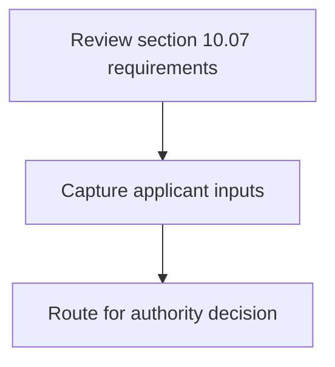
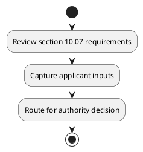

# Chapter 10 / Section 10.07: Applicability of Weapon of Mass Development Act (WMD Act)

**Chapter Title:** SCOMET: Special Chemicals, Organisms, Materials, Equipment and Technologies

**Pages:** 6

**Purpose:** Defines the operational requirements for Applicability of Weapon of Mass Development Act (WMD Act).

**Purpose Thanglish:** Indha Applicability of Weapon of Mass Development Act (WMD Act) section-la, Defines the operational requirements for Applicability of Weapon of Mass Development Act (WMD Act).

**Summary:** 10.07 Applicability of Weapon of Mass Development Act (WMD Act)
Export of items not on SCOMET List may also be regulated under provisions of
the Weapons of Mass Destruction and their Delivery Systems (Prohibition of
Unlawful Activities) Act, 2005.

**Business Meaning:** 10.07 Applicability of Weapon of Mass Development Act (WMD Act)
Export of items not on SCOMET List may also be regulated under provisions of
the Weapons of Mass Destruction and their Delivery Systems (Prohibition of
Unlawful Activities) Act, 2005.

**Business Explanation:** 10.07 Applicability of Weapon of Mass Development Act (WMD Act)
Export of items not on SCOMET List may also be regulated under provisions of
the Weapons of Mass Destruction and their Delivery Systems (Prohibition of
Unlawful Activities) Act, 2005.

**Business Explanation Thanglish:** Indha Applicability of Weapon of Mass Development Act (WMD Act) section-la, 10.07 Applicability of Weapon of Mass Development Act (WMD Act)
export of items not on SCOMET List may also be regulated under provisions of
the Weapons of Mass Destruction and their Delivery Systems (Prohibition of
Unlawful Activities) Act, 2005.

## Business Logic
- None identified

## Business Rules
- rule_id=CH10-SEC10_07-R001, rule_description=10.07 Applicability of Weapon of Mass Development Act (WMD Act)
Export of items not on SCOMET List may also be regulated under provisions of
the Weapons of Mass Destruction and their Delivery Systems (Prohibition of
Unlawful Activities) Act, 2005., trigger=Applicability of Weapon of Mass Development Act (WMD Act), condition=Not explicitly covered in uploaded documents., validation=Not explicitly covered in uploaded documents., action=Manual review required., exception=No explicit exception found in uploaded documents., output=DEKAI should produce a compliance decision for 10.07 - Applicability of Weapon of Mass Development Act (WMD Act).

## Conditions
- None identified

## Condition Logic
- None identified

## Validations
- None identified

## Exceptions
- None identified

## Dependencies
- None identified

## Authorities
- None identified

## Required Documents
- None identified

## Timelines
- None identified

## Actions
- None identified

## Workflow
- Review section 10.07 requirements
- Capture applicant inputs
- Route for authority decision

## Workflow ASCII
```text
Applicability of Weapon of Mass Development Act (WMD Act)
Review section 10.07 requirements
   |
   v
Capture applicant inputs
   |
   v
Route for authority decision
```

## Decision Tree
- IF section 10.07 applies THEN proceed with standard DGFT workflow

## Decision Tree ASCII
```text
Applicability of Weapon of Mass Development Act (WMD Act) Decision
IF section 10.07 applies THEN proceed with standard DGFT workflow
```

## Examples
- User asks to process Applicability of Weapon of Mass Development Act (WMD Act); the platform checks conditions, validations, and documents before action.

**Real-world Example:** Example: an importer or exporter invokes Applicability of Weapon of Mass Development Act (WMD Act), submits the prescribed DGFT records, and DEKAI uses the extracted rules to follow the applicability of weapon of mass development act (wmd act) process.

**Real-world Example Thanglish:** Indha Applicability of Weapon of Mass Development Act (WMD Act) section-la, Example: an importer or exporter invokes Applicability of Weapon of Mass Development Act (WMD Act), submits the prescribed DGFT records, and DEKAI uses the extracted rules to follow the applicability of weapon of mass development act (wmd act) process.

## AI Rules
- None identified

## Database Fields
- name=section_code, type=string, required=True, source=parsed_section_heading
- name=section_title, type=string, required=True, source=parsed_section_heading
- name=act_flag, type=boolean, required=False, source=keyword:Act
- name=wmd_flag, type=boolean, required=False, source=keyword:WMD
- name=not_flag, type=boolean, required=False, source=keyword:not
- name=may_flag, type=boolean, required=False, source=keyword:may
- name=the_flag, type=boolean, required=False, source=keyword:the
- name=and_flag, type=boolean, required=False, source=keyword:and
- name=mass_flag, type=boolean, required=False, source=keyword:Mass
- name=list_flag, type=boolean, required=False, source=keyword:List

## API Requirements
- method=GET, path=/api/dgft/sections/10.07, purpose=Retrieve knowledge payload for section 10.07, query_params=['include=workflow,decision_tree,validations'], response_fields=['section', 'title', 'summary', 'conditions', 'validations', 'exceptions', 'workflow', 'decision_tree']
- method=POST, path=/api/dgft/Applicability-of-Weapon-of-Mass-Development-Act-WMD-Act/validate, purpose=Validate inputs and documents for Applicability of Weapon of Mass Development Act (WMD Act), request_fields=['section_code', 'section_title'], response_fields=['status', 'errors', 'warnings', 'next_actions']

## UI Screens
- screen_id=Applicability_of_Weapon_of_Mass_Development_Act_WMD_Act_overview, name=Applicability of Weapon of Mass Development Act (WMD Act) Overview, purpose=Show section summary, authority, timeline, and eligibility cues., widgets=['summary_card', 'conditions_table', 'authority_badges', 'timeline_panel']
- screen_id=Applicability_of_Weapon_of_Mass_Development_Act_WMD_Act_submission, name=Applicability of Weapon of Mass Development Act (WMD Act) Submission, purpose=Capture applicant data and supporting documents., widgets=['dynamic_form', 'document_uploader', 'validation_panel', 'next_action_footer'], fields=['section_code', 'section_title', 'act_flag', 'wmd_flag', 'not_flag', 'may_flag', 'the_flag', 'and_flag']

## Error Messages
- Validation failed because the section requirements were not fully met.

## FAQ
- question_en=What is the purpose of section 10.07?, answer_en=10.07 Applicability of Weapon of Mass Development Act (WMD Act)
Export of items not on SCOMET List may also be regulated under provisions of
the Weapons of Mass Destruction and their Delivery Systems (Prohibition of
Unlawful Activities) Act, 2005., question_thanglish=Indha Applicability of Weapon of Mass Development Act (WMD Act) section-la, What is the purpose of section 10.07?, answer_thanglish=Indha Applicability of Weapon of Mass Development Act (WMD Act) section-la, 10.07 Applicability of Weapon of Mass Development Act (WMD Act)
export of items not on SCOMET List may also be regulated under provisions of
the Weapons of Mass Destruction and their Delivery Systems (Prohibition of
Unlawful Activities) Act, 2005.
- question_en=What documents are required under Applicability of Weapon of Mass Development Act (WMD Act)?, answer_en=Not explicitly covered in uploaded documents., question_thanglish=Indha Applicability of Weapon of Mass Development Act (WMD Act) section-la, What documents are required under Applicability of Weapon of Mass Development Act (WMD Act)?, answer_thanglish=Indha Applicability of Weapon of Mass Development Act (WMD Act) section-la, Not explicitly covered in uploaded documents.
- question_en=Which authority handles Applicability of Weapon of Mass Development Act (WMD Act)?, answer_en=Not explicitly covered in uploaded documents., question_thanglish=Indha Applicability of Weapon of Mass Development Act (WMD Act) section-la, Which authority handles Applicability of Weapon of Mass Development Act (WMD Act)?, answer_thanglish=Indha Applicability of Weapon of Mass Development Act (WMD Act) section-la, Not explicitly covered in uploaded documents.

## Questions Users May Ask
- What does Applicability of Weapon of Mass Development Act (WMD Act) require?
- Which documents are needed for Applicability of Weapon of Mass Development Act (WMD Act)?
- How does DEKAI validate Applicability of Weapon of Mass Development Act (WMD Act) requests?

## Expected AI Answers
- Applicability of Weapon of Mass Development Act (WMD Act) requires the platform to interpret the section text, apply the extracted business rules, and present the correct next action.
- Required documents are inferred from the section text: no explicit documents were detected.
- DEKAI validates Applicability of Weapon of Mass Development Act (WMD Act) by checking conditions, required documents, authority references, and exception clauses before recommending an outcome.

## AI Q&A Examples
- question_en=User asks: How do I comply with Applicability of Weapon of Mass Development Act (WMD Act)?, answer_en=AI answers: DEKAI should evaluate section 10.07, apply the extracted rules, and guide the user through Review section 10.07 requirements., question_thanglish=Indha Applicability of Weapon of Mass Development Act (WMD Act) section-la, User asks: How do I comply with Applicability of Weapon of Mass Development Act (WMD Act)?, answer_thanglish=Indha Applicability of Weapon of Mass Development Act (WMD Act) section-la, AI answers: DEKAI should evaluate section 10.07, apply the extracted rules, and guide the user through Review section 10.07 requirements.
- question_en=User asks: Which validations apply to Applicability of Weapon of Mass Development Act (WMD Act)?, answer_en=AI answers: Applicable validations are not explicitly covered in the uploaded documents., question_thanglish=Indha Applicability of Weapon of Mass Development Act (WMD Act) section-la, User asks: Which validations apply to Applicability of Weapon of Mass Development Act (WMD Act)?, answer_thanglish=Indha Applicability of Weapon of Mass Development Act (WMD Act) section-la, AI answers: Applicable validations are not explicitly covered in the uploaded documents.

## DEKAI AI Implementation Notes
- Capture chapter 10, section 10.07, title, and page references as immutable knowledge metadata.
- Bind validations for Applicability of Weapon of Mass Development Act (WMD Act) into a rule engine keyed by the rule IDs extracted for this section.

## DEKAI AI Implementation Notes Thanglish
- Indha Applicability of Weapon of Mass Development Act (WMD Act) section-la, Capture chapter 10, section 10.07, title, and page references as immutable knowledge metadata.
- Indha Applicability of Weapon of Mass Development Act (WMD Act) section-la, Bind validations for Applicability of Weapon of Mass Development Act (WMD Act) into a rule engine keyed by the rule IDs extracted for this section.

## AI Metadata
- Keywords: Act, WMD, not, may, the, and, Mass, List, also, items, under, their, Weapon, Export, SCOMET, Weapons, Systems, Delivery, Unlawful, regulated
- Search Keywords: Act, WMD, not, may, the, and, Mass, List, also, items, under, their, Weapon, Export, SCOMET, Weapons, Systems, Delivery, Unlawful, regulated
- Intent: Provide knowledge guidance for Applicability of Weapon of Mass Development Act (WMD Act).
- Tags: 10.07, Applicability of Weapon of Mass Development Act (WMD Act), dgft
- Related Sections: 
- Related Chapters: 
- Related Rules: 

## Mermaid


## PlantUML

