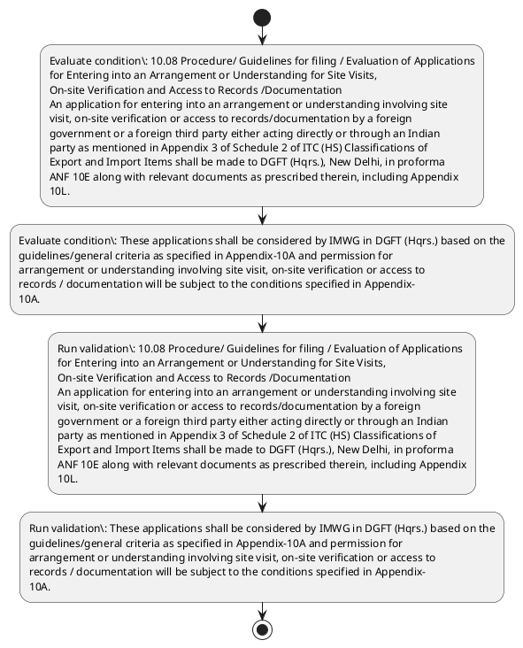

# Chapter 10 / Section 10.08: Procedure/ Guidelines for filing / Evaluation of Applications

**Chapter Title:** SCOMET: Special Chemicals, Organisms, Materials, Equipment and Technologies

**Pages:** 6

**Purpose:** 10.08 Procedure/ Guidelines for filing / Evaluation of Applications
for Entering into an Arrangement or Understanding for Site Visits,
On-site Verification and Access to Records /Documentation
An application for entering into an arrangement or understanding involving site
visit, on-site verification or access to records/documentation by a foreign
government or a foreign third party either acting directly or through an Indian
party as mentioned in Appendix 3 of Schedule 2 of ITC (HS) Classifications of
Export and Import Items shall be made to DGFT (Hqrs.), New Delhi, in proforma
ANF 10E along with relevant documents as prescribed therein, including Appendix
10L.

**Purpose Thanglish:** Indha Procedure/ Guidelines for filing / Evaluation of Applications section-la, 10.08 Procedure/ Guidelines for filing / Evaluation of Applications
for Entering into an Arrangement or Understanding for Site Visits,
On-site Verification and Access to Records /Documentation
An application for entering into an arrangement or understanding involving site
visit, on-site verification or access to records/documentation by a foreign
government or a foreign third party either acting directly or through an Indian
party as mentioned in Appendix 3 of Schedule 2 of ITC (HS) Classifications of
export and import Items kandippa be made to DGFT (Hqrs.), New Delhi, in proforma
ANF 10E along with relevant documents as prescribed therein, including Appendix
10L.

**Summary:** 10.08 Procedure/ Guidelines for filing / Evaluation of Applications
for Entering into an Arrangement or Understanding for Site Visits,
On-site Verification and Access to Records /Documentation
An application for entering into an arrangement or understanding involving site
visit, on-site verification or access to records/documentation by a foreign
government or a foreign third party either acting directly or through an Indian
party as mentioned in Appendix 3 of Schedule 2 of ITC (HS) Classifications of
Export and Import Items shall be made to DGFT (Hqrs.), New Delhi, in proforma
ANF 10E along with relevant documents as prescribed therein, including Appendix
10L. These applications shall be considered by IMWG in DGFT (Hqrs.) based on the
guidelines/general criteria as specified in Appendix-10A and permission for
arrangement or understanding involving site visit, on-site verification or access to
records / documentation will be subject to the conditions specified in Appendix-
10A.

**Business Meaning:** Procedure/ Guidelines for filing / Evaluation of Applications governs how DGFT business controls should be applied, validated, and enforced.

**Business Explanation:** Procedure/ Guidelines for filing / Evaluation of Applications explains the operating rule set that DEKAI should enforce. Key control points include 10.08 Procedure/ Guidelines for filing / Evaluation of Applications
for Entering into an Arrangement or Understanding for Site Visits,
On-site Verification and Access to Records /Documentation
An application for entering into an arrangement or understanding involving site
visit, on-site verification or access to records/documentation by a foreign
government or a foreign third party either acting directly or through an Indian
party as mentioned in Appendix 3 of Schedule 2 of ITC (HS) Classifications of
Export and Import Items shall be made to DGFT (Hqrs.), New Delhi, in proforma
ANF 10E along with relevant documents as prescribed therein, including Appendix
10L.

**Business Explanation Thanglish:** Indha Procedure/ Guidelines for filing / Evaluation of Applications section-la, Procedure/ Guidelines for filing / Evaluation of Applications explains the operating rule set that DEKAI should enforce. Key control points include 10.08 Procedure/ Guidelines for filing / Evaluation of Applications
for Entering into an Arrangement or Understanding for Site Visits,
On-site Verification and Access to Records /Documentation
An application for entering into an arrangement or understanding involving site
visit, on-site verification or access to records/documentation by a foreign
government or a foreign third party either acting directly or through an Indian
party as mentioned in Appendix 3 of Schedule 2 of ITC (HS) Classifications of
export and import Items kandippa be made to DGFT (Hqrs.), New Delhi, in proforma
ANF 10E along with relevant documents as prescribed therein, including Appendix
10L.

## Business Logic
- 10.08 Procedure/ Guidelines for filing / Evaluation of Applications
for Entering into an Arrangement or Understanding for Site Visits,
On-site Verification and Access to Records /Documentation
An application for entering into an arrangement or understanding involving site
visit, on-site verification or access to records/documentation by a foreign
government or a foreign third party either acting directly or through an Indian
party as mentioned in Appendix 3 of Schedule 2 of ITC (HS) Classifications of
Export and Import Items shall be made to DGFT (Hqrs.), New Delhi, in proforma
ANF 10E along with relevant documents as prescribed therein, including Appendix
10L.
- These applications shall be considered by IMWG in DGFT (Hqrs.) based on the
guidelines/general criteria as specified in Appendix-10A and permission for
arrangement or understanding involving site visit, on-site verification or access to
records / documentation will be subject to the conditions specified in Appendix-
10A.

## Business Rules
- rule_id=CH10-SEC10_08-R001, rule_description=10.08 Procedure/ Guidelines for filing / Evaluation of Applications
for Entering into an Arrangement or Understanding for Site Visits,
On-site Verification and Access to Records /Documentation
An application for entering into an arrangement or understanding involving site
visit, on-site verification or access to records/documentation by a foreign
government or a foreign third party either acting directly or through an Indian
party as mentioned in Appendix 3 of Schedule 2 of ITC (HS) Classifications of
Export and Import Items shall be made to DGFT (Hqrs.), New Delhi, in proforma
ANF 10E along with relevant documents as prescribed therein, including Appendix
10L., trigger=Procedure/ Guidelines for filing / Evaluation of Applications, condition=10.08 Procedure/ Guidelines for filing / Evaluation of Applications
for Entering into an Arrangement or Understanding for Site Visits,
On-site Verification and Access to Records /Documentation
An application for entering into an arrangement or understanding involving site
visit, on-site verification or access to records/documentation by a foreign
government or a foreign third party either acting directly or through an Indian
party as mentioned in Appendix 3 of Schedule 2 of ITC (HS) Classifications of
Export and Import Items shall be made to DGFT (Hqrs.), New Delhi, in proforma
ANF 10E along with relevant documents as prescribed therein, including Appendix
10L., validation=10.08 Procedure/ Guidelines for filing / Evaluation of Applications
for Entering into an Arrangement or Understanding for Site Visits,
On-site Verification and Access to Records /Documentation
An application for entering into an arrangement or understanding involving site
visit, on-site verification or access to records/documentation by a foreign
government or a foreign third party either acting directly or through an Indian
party as mentioned in Appendix 3 of Schedule 2 of ITC (HS) Classifications of
Export and Import Items shall be made to DGFT (Hqrs.), New Delhi, in proforma
ANF 10E along with relevant documents as prescribed therein, including Appendix
10L., action=Manual review required., exception=No explicit exception found in uploaded documents., output=DEKAI should produce a compliance decision for 10.08 - Procedure/ Guidelines for filing / Evaluation of Applications.
- rule_id=CH10-SEC10_08-R002, rule_description=These applications shall be considered by IMWG in DGFT (Hqrs.) based on the
guidelines/general criteria as specified in Appendix-10A and permission for
arrangement or understanding involving site visit, on-site verification or access to
records / documentation will be subject to the conditions specified in Appendix-
10A., trigger=Procedure/ Guidelines for filing / Evaluation of Applications, condition=These applications shall be considered by IMWG in DGFT (Hqrs.) based on the
guidelines/general criteria as specified in Appendix-10A and permission for
arrangement or understanding involving site visit, on-site verification or access to
records / documentation will be subject to the conditions specified in Appendix-
10A., validation=These applications shall be considered by IMWG in DGFT (Hqrs.) based on the
guidelines/general criteria as specified in Appendix-10A and permission for
arrangement or understanding involving site visit, on-site verification or access to
records / documentation will be subject to the conditions specified in Appendix-
10A., action=Manual review required., exception=No explicit exception found in uploaded documents., output=DEKAI should produce a compliance decision for 10.08 - Procedure/ Guidelines for filing / Evaluation of Applications.

## Conditions
- 10.08 Procedure/ Guidelines for filing / Evaluation of Applications
for Entering into an Arrangement or Understanding for Site Visits,
On-site Verification and Access to Records /Documentation
An application for entering into an arrangement or understanding involving site
visit, on-site verification or access to records/documentation by a foreign
government or a foreign third party either acting directly or through an Indian
party as mentioned in Appendix 3 of Schedule 2 of ITC (HS) Classifications of
Export and Import Items shall be made to DGFT (Hqrs.), New Delhi, in proforma
ANF 10E along with relevant documents as prescribed therein, including Appendix
10L.
- These applications shall be considered by IMWG in DGFT (Hqrs.) based on the
guidelines/general criteria as specified in Appendix-10A and permission for
arrangement or understanding involving site visit, on-site verification or access to
records / documentation will be subject to the conditions specified in Appendix-
10A.

## Condition Logic
- id=10.10.08.1, if=10.08 Procedure/ Guidelines for filing / Evaluation of Applications
for Entering into an Arrangement or Understanding for Site Visits,
On-site Verification and Access to Records /Documentation
An application for entering into an arrangement or understanding involving site
visit, on-site verification or access to records/documentation by a foreign
government or a foreign third party either acting directly or through an Indian
party as mentioned in Appendix 3 of Schedule 2 of ITC (HS) Classifications of
Export and Import Items shall be made to DGFT (Hqrs.), New Delhi, in proforma
ANF 10E along with relevant documents as prescribed therein, including Appendix
10L., then=Route for review, source=10.08 Procedure/ Guidelines for filing / Evaluation of Applications
for Entering into an Arrangement or Understanding for Site Visits,
On-site Verification and Access to Records /Documentation
An application for entering into an arrangement or understanding involving site
visit, on-site verification or access to records/documentation by a foreign
government or a foreign third party either acting directly or through an Indian
party as mentioned in Appendix 3 of Schedule 2 of ITC (HS) Classifications of
Export and Import Items shall be made to DGFT (Hqrs.), New Delhi, in proforma
ANF 10E along with relevant documents as prescribed therein, including Appendix
10L.
- id=10.10.08.2, if=These applications shall be considered by IMWG in DGFT (Hqrs.) based on the
guidelines/general criteria as specified in Appendix-10A and permission for
arrangement or understanding involving site visit, on-site verification or access to
records / documentation will be subject to the conditions specified in Appendix-
10A., then=Route for review, source=These applications shall be considered by IMWG in DGFT (Hqrs.) based on the
guidelines/general criteria as specified in Appendix-10A and permission for
arrangement or understanding involving site visit, on-site verification or access to
records / documentation will be subject to the conditions specified in Appendix-
10A.

## Validations
- 10.08 Procedure/ Guidelines for filing / Evaluation of Applications
for Entering into an Arrangement or Understanding for Site Visits,
On-site Verification and Access to Records /Documentation
An application for entering into an arrangement or understanding involving site
visit, on-site verification or access to records/documentation by a foreign
government or a foreign third party either acting directly or through an Indian
party as mentioned in Appendix 3 of Schedule 2 of ITC (HS) Classifications of
Export and Import Items shall be made to DGFT (Hqrs.), New Delhi, in proforma
ANF 10E along with relevant documents as prescribed therein, including Appendix
10L.
- These applications shall be considered by IMWG in DGFT (Hqrs.) based on the
guidelines/general criteria as specified in Appendix-10A and permission for
arrangement or understanding involving site visit, on-site verification or access to
records / documentation will be subject to the conditions specified in Appendix-
10A.

## Exceptions
- None identified

## Dependencies
- 1
- 2
- 3

## Authorities
- DGFT
- Export and Import Items shall be made to DGFT
- These applications shall be considered by IMWG in DGFT

## Required Documents
- 10.08 Procedure/ Guidelines for filing / Evaluation of Applications
for Entering into an Arrangement or Understanding for Site Visits,
On-site Verification and Access to Records /Documentation
An application for entering into an arrangement or understanding involving site
visit, on-site verification or access to records/documentation by a foreign
government or a foreign third party either acting directly or through an Indian
party as mentioned in Appendix 3 of Schedule 2 of ITC (HS) Classifications of
Export and Import Items shall be made to DGFT (Hqrs.), New Delhi, in proforma
ANF 10E along with relevant documents as prescribed therein, including Appendix
10L.
- These applications shall be considered by IMWG in DGFT (Hqrs.) based on the
guidelines/general criteria as specified in Appendix-10A and permission for
arrangement or understanding involving site visit, on-site verification or access to
records / documentation will be subject to the conditions specified in Appendix-
10A.

## Timelines
- None identified

## Actions
- None identified

## Workflow
- Evaluate condition: 10.08 Procedure/ Guidelines for filing / Evaluation of Applications
for Entering into an Arrangement or Understanding for Site Visits,
On-site Verification and Access to Records /Documentation
An application for entering into an arrangement or understanding involving site
visit, on-site verification or access to records/documentation by a foreign
government or a foreign third party either acting directly or through an Indian
party as mentioned in Appendix 3 of Schedule 2 of ITC (HS) Classifications of
Export and Import Items shall be made to DGFT (Hqrs.), New Delhi, in proforma
ANF 10E along with relevant documents as prescribed therein, including Appendix
10L.
- Evaluate condition: These applications shall be considered by IMWG in DGFT (Hqrs.) based on the
guidelines/general criteria as specified in Appendix-10A and permission for
arrangement or understanding involving site visit, on-site verification or access to
records / documentation will be subject to the conditions specified in Appendix-
10A.
- Run validation: 10.08 Procedure/ Guidelines for filing / Evaluation of Applications
for Entering into an Arrangement or Understanding for Site Visits,
On-site Verification and Access to Records /Documentation
An application for entering into an arrangement or understanding involving site
visit, on-site verification or access to records/documentation by a foreign
government or a foreign third party either acting directly or through an Indian
party as mentioned in Appendix 3 of Schedule 2 of ITC (HS) Classifications of
Export and Import Items shall be made to DGFT (Hqrs.), New Delhi, in proforma
ANF 10E along with relevant documents as prescribed therein, including Appendix
10L.
- Run validation: These applications shall be considered by IMWG in DGFT (Hqrs.) based on the
guidelines/general criteria as specified in Appendix-10A and permission for
arrangement or understanding involving site visit, on-site verification or access to
records / documentation will be subject to the conditions specified in Appendix-
10A.

## Workflow ASCII
```text
Procedure/ Guidelines for filing / Evaluation of Applications
Evaluate condition: 10.08 Procedure/ Guidelines for filing / Evaluation of Applications
for Entering into an Arrangement or Understanding for Site Visits,
On-site Verification and Access to Records /Documentation
An application for entering into an arrangement or understanding involving site
visit, on-site verification or access to records/documentation by a foreign
government or a foreign third party either acting directly or through an Indian
party as mentioned in Appendix 3 of Schedule 2 of ITC (HS) Classifications of
Export and Import Items shall be made to DGFT (Hqrs.), New Delhi, in proforma
ANF 10E along with relevant documents as prescribed therein, including Appendix
10L.
   |
   v
Evaluate condition: These applications shall be considered by IMWG in DGFT (Hqrs.) based on the
guidelines/general criteria as specified in Appendix-10A and permission for
arrangement or understanding involving site visit, on-site verification or access to
records / documentation will be subject to the conditions specified in Appendix-
10A.
   |
   v
Run validation: 10.08 Procedure/ Guidelines for filing / Evaluation of Applications
for Entering into an Arrangement or Understanding for Site Visits,
On-site Verification and Access to Records /Documentation
An application for entering into an arrangement or understanding involving site
visit, on-site verification or access to records/documentation by a foreign
government or a foreign third party either acting directly or through an Indian
party as mentioned in Appendix 3 of Schedule 2 of ITC (HS) Classifications of
Export and Import Items shall be made to DGFT (Hqrs.), New Delhi, in proforma
ANF 10E along with relevant documents as prescribed therein, including Appendix
10L.
   |
   v
Run validation: These applications shall be considered by IMWG in DGFT (Hqrs.) based on the
guidelines/general criteria as specified in Appendix-10A and permission for
arrangement or understanding involving site visit, on-site verification or access to
records / documentation will be subject to the conditions specified in Appendix-
10A.
```

## Decision Tree
- IF section 10.08 applies THEN proceed with standard DGFT workflow

## Decision Tree ASCII
```text
Procedure/ Guidelines for filing / Evaluation of Applications Decision
IF section 10.08 applies THEN proceed with standard DGFT workflow
```

## Examples
- User asks to process Procedure/ Guidelines for filing / Evaluation of Applications; the platform checks conditions, validations, and documents before action.

**Real-world Example:** Example: an importer or exporter invokes Procedure/ Guidelines for filing / Evaluation of Applications, submits 10.08 Procedure/ Guidelines for filing / Evaluation of Applications
for Entering into an Arrangement or Understanding for Site Visits,
On-site Verification and Access to Records /Documentation
An application for entering into an arrangement or understanding involving site
visit, on-site verification or access to records/documentation by a foreign
government or a foreign third party either acting directly or through an Indian
party as mentioned in Appendix 3 of Schedule 2 of ITC (HS) Classifications of
Export and Import Items shall be made to DGFT (Hqrs.), New Delhi, in proforma
ANF 10E along with relevant documents as prescribed therein, including Appendix
10L., These applications shall be considered by IMWG in DGFT (Hqrs.) based on the
guidelines/general criteria as specified in Appendix-10A and permission for
arrangement or understanding involving site visit, on-site verification or access to
records / documentation will be subject to the conditions specified in Appendix-
10A., and DEKAI uses the extracted rules to follow the procedure/ guidelines for filing / evaluation of applications process.

**Real-world Example Thanglish:** Indha Procedure/ Guidelines for filing / Evaluation of Applications section-la, Example: an importer or exporter invokes Procedure/ Guidelines for filing / Evaluation of Applications, submits 10.08 Procedure/ Guidelines for filing / Evaluation of Applications
for Entering into an Arrangement or Understanding for Site Visits,
On-site Verification and Access to Records /Documentation
An application for entering into an arrangement or understanding involving site
visit, on-site verification or access to records/documentation by a foreign
government or a foreign third party either acting directly or through an Indian
party as mentioned in Appendix 3 of Schedule 2 of ITC (HS) Classifications of
export and import Items kandippa be made to DGFT (Hqrs.), New Delhi, in proforma
ANF 10E along with relevant documents as prescribed therein, including Appendix
10L., These applications kandippa be considered by IMWG in DGFT (Hqrs.) based on the
guidelines/general criteria as specified in Appendix-10A and permission for
arrangement or understanding involving site visit, on-site verification or access to
records / documentation will be subject to the conditions specified in Appendix-
10A., and DEKAI uses the extracted rules to follow the procedure/ guidelines for filing / evaluation of applications process.

## AI Rules
- IF detected context matches section rule THEN enforce: 10.08 Procedure/ Guidelines for filing / Evaluation of Applications
for Entering into an Arrangement or Understanding for Site Visits,
On-site Verification and Access to Records /Documentation
An application for entering into an arrangement or understanding involving site
visit, on-site verification or access to records/documentation by a foreign
government or a foreign third party either acting directly or through an Indian
party as mentioned in Appendix 3 of Schedule 2 of ITC (HS) Classifications of
Export and Import Items shall be made to DGFT (Hqrs.), New Delhi, in proforma
ANF 10E along with relevant documents as prescribed therein, including Appendix
10L.
- IF detected context matches section rule THEN enforce: These applications shall be considered by IMWG in DGFT (Hqrs.) based on the
guidelines/general criteria as specified in Appendix-10A and permission for
arrangement or understanding involving site visit, on-site verification or access to
records / documentation will be subject to the conditions specified in Appendix-
10A.

## Database Fields
- name=section_code, type=string, required=True, source=parsed_section_heading
- name=section_title, type=string, required=True, source=parsed_section_heading
- name=for_flag, type=boolean, required=False, source=keyword:for
- name=and_flag, type=boolean, required=False, source=keyword:and
- name=itc_flag, type=boolean, required=False, source=keyword:ITC
- name=new_flag, type=boolean, required=False, source=keyword:New
- name=anf_flag, type=boolean, required=False, source=keyword:ANF
- name=the_flag, type=boolean, required=False, source=keyword:the
- name=into_flag, type=boolean, required=False, source=keyword:into
- name=site_flag, type=boolean, required=False, source=keyword:Site
- name=document_1_submitted, type=boolean, required=True, source=10.08 Procedure/ Guidelines for filing / Evaluation of Applications
for Entering into an Arrangement or Understanding for Site Visits,
On-site Verification and Access to Records /Documentation
An application for entering into an arrangement or understanding involving site
visit, on-site verification or access to records/documentation by a foreign
government or a foreign third party either acting directly or through an Indian
party as mentioned in Appendix 3 of Schedule 2 of ITC (HS) Classifications of
Export and Import Items shall be made to DGFT (Hqrs.), New Delhi, in proforma
ANF 10E along with relevant documents as prescribed therein, including Appendix
10L.
- name=document_2_submitted, type=boolean, required=True, source=These applications shall be considered by IMWG in DGFT (Hqrs.) based on the
guidelines/general criteria as specified in Appendix-10A and permission for
arrangement or understanding involving site visit, on-site verification or access to
records / documentation will be subject to the conditions specified in Appendix-
10A.

## API Requirements
- method=GET, path=/api/dgft/sections/10.08, purpose=Retrieve knowledge payload for section 10.08, query_params=['include=workflow,decision_tree,validations'], response_fields=['section', 'title', 'summary', 'conditions', 'validations', 'exceptions', 'workflow', 'decision_tree']
- method=POST, path=/api/dgft/Procedure-Guidelines-for-filing-Evaluation-of-Applications/validate, purpose=Validate inputs and documents for Procedure/ Guidelines for filing / Evaluation of Applications, request_fields=['section_code', 'section_title', 'document_1_submitted', 'document_2_submitted'], response_fields=['status', 'errors', 'warnings', 'next_actions']

## UI Screens
- screen_id=Procedure_Guidelines_for_filing_Evaluation_of_Applications_overview, name=Procedure/ Guidelines for filing / Evaluation of Applications Overview, purpose=Show section summary, authority, timeline, and eligibility cues., widgets=['summary_card', 'conditions_table', 'authority_badges', 'timeline_panel']
- screen_id=Procedure_Guidelines_for_filing_Evaluation_of_Applications_submission, name=Procedure/ Guidelines for filing / Evaluation of Applications Submission, purpose=Capture applicant data and supporting documents., widgets=['dynamic_form', 'document_uploader', 'validation_panel', 'next_action_footer'], fields=['section_code', 'section_title', 'for_flag', 'and_flag', 'itc_flag', 'new_flag', 'anf_flag', 'the_flag']

## Error Messages
- Validation failed because the section requirements were not fully met.

## FAQ
- question_en=What is the purpose of section 10.08?, answer_en=Procedure/ Guidelines for filing / Evaluation of Applications explains the operating rule set that DEKAI should enforce. Key control points include 10.08 Procedure/ Guidelines for filing / Evaluation of Applications
for Entering into an Arrangement or Understanding for Site Visits,
On-site Verification and Access to Records /Documentation
An application for entering into an arrangement or understanding involving site
visit, on-site verification or access to records/documentation by a foreign
government or a foreign third party either acting directly or through an Indian
party as mentioned in Appendix 3 of Schedule 2 of ITC (HS) Classifications of
Export and Import Items shall be made to DGFT (Hqrs.), New Delhi, in proforma
ANF 10E along with relevant documents as prescribed therein, including Appendix
10L., question_thanglish=Indha Procedure/ Guidelines for filing / Evaluation of Applications section-la, What is the purpose of section 10.08?, answer_thanglish=Indha Procedure/ Guidelines for filing / Evaluation of Applications section-la, Procedure/ Guidelines for filing / Evaluation of Applications explains the operating rule set that DEKAI should enforce. Key control points include 10.08 Procedure/ Guidelines for filing / Evaluation of Applications
for Entering into an Arrangement or Understanding for Site Visits,
On-site Verification and Access to Records /Documentation
An application for entering into an arrangement or understanding involving site
visit, on-site verification or access to records/documentation by a foreign
government or a foreign third party either acting directly or through an Indian
party as mentioned in Appendix 3 of Schedule 2 of ITC (HS) Classifications of
export and import Items kandippa be made to DGFT (Hqrs.), New Delhi, in proforma
ANF 10E along with relevant documents as prescribed therein, including Appendix
10L.
- question_en=What documents are required under Procedure/ Guidelines for filing / Evaluation of Applications?, answer_en=10.08 Procedure/ Guidelines for filing / Evaluation of Applications
for Entering into an Arrangement or Understanding for Site Visits,
On-site Verification and Access to Records /Documentation
An application for entering into an arrangement or understanding involving site
visit, on-site verification or access to records/documentation by a foreign
government or a foreign third party either acting directly or through an Indian
party as mentioned in Appendix 3 of Schedule 2 of ITC (HS) Classifications of
Export and Import Items shall be made to DGFT (Hqrs.), New Delhi, in proforma
ANF 10E along with relevant documents as prescribed therein, including Appendix
10L., These applications shall be considered by IMWG in DGFT (Hqrs.) based on the
guidelines/general criteria as specified in Appendix-10A and permission for
arrangement or understanding involving site visit, on-site verification or access to
records / documentation will be subject to the conditions specified in Appendix-
10A., question_thanglish=Indha Procedure/ Guidelines for filing / Evaluation of Applications section-la, What documents are required under Procedure/ Guidelines for filing / Evaluation of Applications?, answer_thanglish=Indha Procedure/ Guidelines for filing / Evaluation of Applications section-la, 10.08 Procedure/ Guidelines for filing / Evaluation of Applications
for Entering into an Arrangement or Understanding for Site Visits,
On-site Verification and Access to Records /Documentation
An application for entering into an arrangement or understanding involving site
visit, on-site verification or access to records/documentation by a foreign
government or a foreign third party either acting directly or through an Indian
party as mentioned in Appendix 3 of Schedule 2 of ITC (HS) Classifications of
export and import Items kandippa be made to DGFT (Hqrs.), New Delhi, in proforma
ANF 10E along with relevant documents as prescribed therein, including Appendix
10L., These applications kandippa be considered by IMWG in DGFT (Hqrs.) based on the
guidelines/general criteria as specified in Appendix-10A and permission for
arrangement or understanding involving site visit, on-site verification or access to
records / documentation will be subject to the conditions specified in Appendix-
10A.
- question_en=Which authority handles Procedure/ Guidelines for filing / Evaluation of Applications?, answer_en=DGFT, Export and Import Items shall be made to DGFT, These applications shall be considered by IMWG in DGFT, question_thanglish=Indha Procedure/ Guidelines for filing / Evaluation of Applications section-la, Which authority handles Procedure/ Guidelines for filing / Evaluation of Applications?, answer_thanglish=Indha Procedure/ Guidelines for filing / Evaluation of Applications section-la, DGFT, export and import Items kandippa be made to DGFT, These applications kandippa be considered by IMWG in DGFT

## Questions Users May Ask
- What does Procedure/ Guidelines for filing / Evaluation of Applications require?
- Which documents are needed for Procedure/ Guidelines for filing / Evaluation of Applications?
- How does DEKAI validate Procedure/ Guidelines for filing / Evaluation of Applications requests?

## Expected AI Answers
- Procedure/ Guidelines for filing / Evaluation of Applications requires the platform to interpret the section text, apply the extracted business rules, and present the correct next action.
- Required documents are inferred from the section text: 10.08 Procedure/ Guidelines for filing / Evaluation of Applications
for Entering into an Arrangement or Understanding for Site Visits,
On-site Verification and Access to Records /Documentation
An application for entering into an arrangement or understanding involving site
visit, on-site verification or access to records/documentation by a foreign
government or a foreign third party either acting directly or through an Indian
party as mentioned in Appendix 3 of Schedule 2 of ITC (HS) Classifications of
Export and Import Items shall be made to DGFT (Hqrs.), New Delhi, in proforma
ANF 10E along with relevant documents as prescribed therein, including Appendix
10L., These applications shall be considered by IMWG in DGFT (Hqrs.) based on the
guidelines/general criteria as specified in Appendix-10A and permission for
arrangement or understanding involving site visit, on-site verification or access to
records / documentation will be subject to the conditions specified in Appendix-
10A.
- DEKAI validates Procedure/ Guidelines for filing / Evaluation of Applications by checking conditions, required documents, authority references, and exception clauses before recommending an outcome.

## AI Q&A Examples
- question_en=User asks: How do I comply with Procedure/ Guidelines for filing / Evaluation of Applications?, answer_en=AI answers: DEKAI should evaluate section 10.08, apply the extracted rules, and guide the user through Evaluate condition: 10.08 Procedure/ Guidelines for filing / Evaluation of Applications
for Entering into an Arrangement or Understanding for Site Visits,
On-site Verification and Access to Records /Documentation
An application for entering into an arrangement or understanding involving site
visit, on-site verification or access to records/documentation by a foreign
government or a foreign third party either acting directly or through an Indian
party as mentioned in Appendix 3 of Schedule 2 of ITC (HS) Classifications of
Export and Import Items shall be made to DGFT (Hqrs.), New Delhi, in proforma
ANF 10E along with relevant documents as prescribed therein, including Appendix
10L.., question_thanglish=Indha Procedure/ Guidelines for filing / Evaluation of Applications section-la, User asks: How do I comply with Procedure/ Guidelines for filing / Evaluation of Applications?, answer_thanglish=Indha Procedure/ Guidelines for filing / Evaluation of Applications section-la, AI answers: DEKAI should evaluate section 10.08, apply the extracted rules, and guide the user through Evaluate condition: 10.08 Procedure/ Guidelines for filing / Evaluation of Applications
for Entering into an Arrangement or Understanding for Site Visits,
On-site Verification and Access to Records /Documentation
An application for entering into an arrangement or understanding involving site
visit, on-site verification or access to records/documentation by a foreign
government or a foreign third party either acting directly or through an Indian
party as mentioned in Appendix 3 of Schedule 2 of ITC (HS) Classifications of
export and import Items kandippa be made to DGFT (Hqrs.), New Delhi, in proforma
ANF 10E along with relevant documents as prescribed therein, including Appendix
10L..
- question_en=User asks: Which validations apply to Procedure/ Guidelines for filing / Evaluation of Applications?, answer_en=AI answers: Applicable validations are 10.08 Procedure/ Guidelines for filing / Evaluation of Applications
for Entering into an Arrangement or Understanding for Site Visits,
On-site Verification and Access to Records /Documentation
An application for entering into an arrangement or understanding involving site
visit, on-site verification or access to records/documentation by a foreign
government or a foreign third party either acting directly or through an Indian
party as mentioned in Appendix 3 of Schedule 2 of ITC (HS) Classifications of
Export and Import Items shall be made to DGFT (Hqrs.), New Delhi, in proforma
ANF 10E along with relevant documents as prescribed therein, including Appendix
10L., These applications shall be considered by IMWG in DGFT (Hqrs.) based on the
guidelines/general criteria as specified in Appendix-10A and permission for
arrangement or understanding involving site visit, on-site verification or access to
records / documentation will be subject to the conditions specified in Appendix-
10A., question_thanglish=Indha Procedure/ Guidelines for filing / Evaluation of Applications section-la, User asks: Which validations apply to Procedure/ Guidelines for filing / Evaluation of Applications?, answer_thanglish=Indha Procedure/ Guidelines for filing / Evaluation of Applications section-la, AI answers: Applicable validations are 10.08 Procedure/ Guidelines for filing / Evaluation of Applications
for Entering into an Arrangement or Understanding for Site Visits,
On-site Verification and Access to Records /Documentation
An application for entering into an arrangement or understanding involving site
visit, on-site verification or access to records/documentation by a foreign
government or a foreign third party either acting directly or through an Indian
party as mentioned in Appendix 3 of Schedule 2 of ITC (HS) Classifications of
export and import Items kandippa be made to DGFT (Hqrs.), New Delhi, in proforma
ANF 10E along with relevant documents as prescribed therein, including Appendix
10L., These applications kandippa be considered by IMWG in DGFT (Hqrs.) based on the
guidelines/general criteria as specified in Appendix-10A and permission for
arrangement or understanding involving site visit, on-site verification or access to
records / documentation will be subject to the conditions specified in Appendix-
10A.

## DEKAI AI Implementation Notes
- Capture chapter 10, section 10.08, title, and page references as immutable knowledge metadata.
- Bind validations for Procedure/ Guidelines for filing / Evaluation of Applications into a rule engine keyed by the rule IDs extracted for this section.
- Expose document upload controls for: 10.08 Procedure/ Guidelines for filing / Evaluation of Applications
for Entering into an Arrangement or Understanding for Site Visits,
On-site Verification and Access to Records /Documentation
An application for entering into an arrangement or understanding involving site
visit, on-site verification or access to records/documentation by a foreign
government or a foreign third party either acting directly or through an Indian
party as mentioned in Appendix 3 of Schedule 2 of ITC (HS) Classifications of
Export and Import Items shall be made to DGFT (Hqrs.), New Delhi, in proforma
ANF 10E along with relevant documents as prescribed therein, including Appendix
10L., These applications shall be considered by IMWG in DGFT (Hqrs.) based on the
guidelines/general criteria as specified in Appendix-10A and permission for
arrangement or understanding involving site visit, on-site verification or access to
records / documentation will be subject to the conditions specified in Appendix-
10A..
- Route escalations or approvals to: DGFT, Export and Import Items shall be made to DGFT, These applications shall be considered by IMWG in DGFT.
- Show contextual links to related sections: 1, 2, 3.

## DEKAI AI Implementation Notes Thanglish
- Indha Procedure/ Guidelines for filing / Evaluation of Applications section-la, Capture chapter 10, section 10.08, title, and page references as immutable knowledge metadata.
- Indha Procedure/ Guidelines for filing / Evaluation of Applications section-la, Bind validations for Procedure/ Guidelines for filing / Evaluation of Applications into a rule engine keyed by the rule IDs extracted for this section.
- Indha Procedure/ Guidelines for filing / Evaluation of Applications section-la, Expose document upload controls for: 10.08 Procedure/ Guidelines for filing / Evaluation of Applications
for Entering into an Arrangement or Understanding for Site Visits,
On-site Verification and Access to Records /Documentation
An application for entering into an arrangement or understanding involving site
visit, on-site verification or access to records/documentation by a foreign
government or a foreign third party either acting directly or through an Indian
party as mentioned in Appendix 3 of Schedule 2 of ITC (HS) Classifications of
export and import Items kandippa be made to DGFT (Hqrs.), New Delhi, in proforma
ANF 10E along with relevant documents as prescribed therein, including Appendix
10L., These applications kandippa be considered by IMWG in DGFT (Hqrs.) based on the
guidelines/general criteria as specified in Appendix-10A and permission for
arrangement or understanding involving site visit, on-site verification or access to
records / documentation will be subject to the conditions specified in Appendix-
10A..
- Indha Procedure/ Guidelines for filing / Evaluation of Applications section-la, Route escalations or approvals to: DGFT, export and import Items kandippa be made to DGFT, These applications kandippa be considered by IMWG in DGFT.
- Indha Procedure/ Guidelines for filing / Evaluation of Applications section-la, Show contextual links to related sections: 1, 2, 3.

## AI Metadata
- Keywords: for, and, ITC, New, ANF, the, into, Site, made, DGFT, Hqrs, with, IMWG, will, visit, third, party, Items, shall, Delhi
- Search Keywords: for, and, ITC, New, ANF, the, into, Site, made, DGFT, Hqrs, with, IMWG, will, visit, third, party, Items, shall, Delhi
- Intent: Provide knowledge guidance for Procedure/ Guidelines for filing / Evaluation of Applications.
- Tags: 10.08, Procedure/ Guidelines for filing / Evaluation of Applications, business-rule, document-driven, dgft
- Related Sections: 1, 2, 3
- Related Chapters: 
- Related Rules: 10.08 Procedure/ Guidelines for filing / Evaluation of Applications
for Entering into an Arrangement or Understanding for Site Visits,
On-site Verification and Access to Records /Documentation
An application for entering into an arrangement or understanding involving site
visit, on-site verification or access to records/documentation by a foreign
government or a foreign third party either acting directly or through an Indian
party as mentioned in Appendix 3 of Schedule 2 of ITC (HS) Classifications of
Export and Import Items shall be made to DGFT (Hqrs.), New Delhi, in proforma
ANF 10E along with relevant documents as prescribed therein, including Appendix
10L., These applications shall be considered by IMWG in DGFT (Hqrs.) based on the
guidelines/general criteria as specified in Appendix-10A and permission for
arrangement or understanding involving site visit, on-site verification or access to
records / documentation will be subject to the conditions specified in Appendix-
10A.

## Mermaid

```mermaid
flowchart TD
    S1["Evaluate condition: 10.08 Procedure/ Guidelines for filing / Evaluation of Applications
for Entering into an Arrangement or Understanding for Site Visits,
On-site Verification and Access to Records /Documentation
An application for entering into an arrangement or understanding involving site
visit, on-site verification or access to records/documentation by a foreign
government or a foreign third party either acting directly or through an Indian
party as mentioned in Appendix 3 of Schedule 2 of ITC (HS) Classifications of
Export and Import Items shall be made to DGFT (Hqrs.), New Delhi, in proforma
ANF 10E along with relevant documents as prescribed therein, including Appendix
10L."]
    S2["Evaluate condition: These applications shall be considered by IMWG in DGFT (Hqrs.) based on the
guidelines/general criteria as specified in Appendix-10A and permission for
arrangement or understanding involving site visit, on-site verification or access to
records / documentation will be subject to the conditions specified in Appendix-
10A."]
    S1 --> S2
    S3["Run validation: 10.08 Procedure/ Guidelines for filing / Evaluation of Applications
for Entering into an Arrangement or Understanding for Site Visits,
On-site Verification and Access to Records /Documentation
An application for entering into an arrangement or understanding involving site
visit, on-site verification or access to records/documentation by a foreign
government or a foreign third party either acting directly or through an Indian
party as mentioned in Appendix 3 of Schedule 2 of ITC (HS) Classifications of
Export and Import Items shall be made to DGFT (Hqrs.), New Delhi, in proforma
ANF 10E along with relevant documents as prescribed therein, including Appendix
10L."]
    S2 --> S3
    S4["Run validation: These applications shall be considered by IMWG in DGFT (Hqrs.) based on the
guidelines/general criteria as specified in Appendix-10A and permission for
arrangement or understanding involving site visit, on-site verification or access to
records / documentation will be subject to the conditions specified in Appendix-
10A."]
    S3 --> S4
```


## PlantUML

