# Chapter 10 / Section 10.09: Issue of authorisation for Repeat Orders of SCOMET item(s)

**Chapter Title:** SCOMET: Special Chemicals, Organisms, Materials, Equipment and Technologies

**Pages:** 6, 7, 8, 9, 10

**Purpose:** 10.09 Issue of authorisation for Repeat Orders of SCOMET item(s)
An application for grant of an Authorisation for repeat orders (excluding Category
3A401 and software and technology under any category) for export of same
SCOMET items to the same country/entities shall be made in prescribed proforma
[ANF 10A] through online SCOMET portal along with other supporting documents,
as prescribed in Appendix 10B(i) and Appendix 10B(ii).

**Purpose Thanglish:** Indha Issue of authorisation for Repeat Orders of SCOMET item(s) section-la, 10.09 Issue of authorisation for Repeat Orders of SCOMET item(s)
An application for grant of an Authorisation for repeat orders (excluding Category
3A401 and software and technology under any category) for export of same
SCOMET items to the same country/entities kandippa be made in prescribed proforma
[ANF 10A] through online SCOMET portal along with other supporting documents,
as prescribed in Appendix 10B(i) and Appendix 10B(ii).

**Summary:** 10.09 Issue of authorisation for Repeat Orders of SCOMET item(s)
An application for grant of an Authorisation for repeat orders (excluding Category
3A401 and software and technology under any category) for export of same
SCOMET items to the same country/entities shall be made in prescribed proforma
[ANF 10A] through online SCOMET portal along with other supporting documents,
as prescribed in Appendix 10B(i) and Appendix 10B(ii). The application shall be
considered by Chairman IMWG, without consultation with IMWG members. However, in cases of repeat orders for export of same SCOMET item to different
country/entities approval will be granted by Chairman IMWG after verification of
credentials of foreign buyer/consignee/end-user only.

**Business Meaning:** Issue of authorisation for Repeat Orders of SCOMET item(s) governs how DGFT business controls should be applied, validated, and enforced.

**Business Explanation:** Issue of authorisation for Repeat Orders of SCOMET item(s) explains the operating rule set that DEKAI should enforce. Key control points include 10.09 Issue of authorisation for Repeat Orders of SCOMET item(s)
An application for grant of an Authorisation for repeat orders (excluding Category
3A401 and software and technology under any category) for export of same
SCOMET items to the same country/entities shall be made in prescribed proforma
[ANF 10A] through online SCOMET portal along with other supporting documents,
as prescribed in Appendix 10B(i) and Appendix 10B(ii). The section also drives actions such as 10.09 Issue of authorisation for Repeat Orders of SCOMET item(s)
An application for grant of an Authorisation for repeat orders (excluding Category
3A401 and software and technology under any category) for export of same
SCOMET items to the same country/entities shall be made in prescribed proforma
[ANF 10A] through online SCOMET portal along with other supporting documents,
as prescribed in Appendix 10B(i) and Appendix 10B(ii)..

**Business Explanation Thanglish:** Indha Issue of authorisation for Repeat Orders of SCOMET item(s) section-la, Issue of authorisation for Repeat Orders of SCOMET item(s) explains the operating rule set that DEKAI should enforce. Key control points include 10.09 Issue of authorisation for Repeat Orders of SCOMET item(s)
An application for grant of an Authorisation for repeat orders (excluding Category
3A401 and software and technology under any category) for export of same
SCOMET items to the same country/entities kandippa be made in prescribed proforma
[ANF 10A] through online SCOMET portal along with other supporting documents,
as prescribed in Appendix 10B(i) and Appendix 10B(ii). The section also drives actions such as 10.09 Issue of authorisation for Repeat Orders of SCOMET item(s)
An application for grant of an Authorisation for repeat orders (excluding Category
3A401 and software and technology under any category) for export of same
SCOMET items to the same country/entities kandippa be made in prescribed proforma
[ANF 10A] through online SCOMET portal along with other supporting documents,
as prescribed in Appendix 10B(i) and Appendix 10B(ii)..

## Business Logic
- 10.09 Issue of authorisation for Repeat Orders of SCOMET item(s)
An application for grant of an Authorisation for repeat orders (excluding Category
3A401 and software and technology under any category) for export of same
SCOMET items to the same country/entities shall be made in prescribed proforma
[ANF 10A] through online SCOMET portal along with other supporting documents,
as prescribed in Appendix 10B(i) and Appendix 10B(ii).
- The application shall be
considered by Chairman IMWG, without consultation with IMWG members.
- Case(s) where a decision could not be arrived at in IMWG shall be placed
before Director General of Foreign Trade for appropriate decision on grant of
authorisation.
- After the approval of SCOMET application by the IMWG or Chairman, IMWG, as the
case may be, export authorisation shall be issued by the SCOMET Cell in DGFT
(Hqrs).
- The approval will be subject to the fulfilment of the following criteria:
(i) Same SCOMET items would imply that the products, along with the technical
specifications, are exactly the same for which export authorisation has been
issued to the applicant exporter earlier after due consultation/verification;
(ii) Same country/entities would imply that (a) the foreign buyer (b) the
consignee or the intermediaries, if any (c) the end user and (d) the end use
are exactly the same for which export authorisation has been issued to the
applicant exporter earlier after due consultation/verification;
(iii) Only the applications submitted within three years from the date of Issue of
original SCOMET authorisation, after due verification/consultation process,
will be eligible for repeat authorisation;
(iv) The cumulative quantity permitted against repeat export authorisations
shall be commensurate with the operational capacity of the end user in
respect of the relevant product, as certified by the end user.
- A certificate to
this effect from the end user on prescribed proforma [Appendix 10B(i)]shall
be submitted by the exporter along with the application for a repeat
authorisation;
(v) A declaration by the authorized signatory of the exporter firm on the
qualifying conditions as per (i) to (iv) above shall be submitted on
prescribed proforma [Appendix 10B(ii)] along with the application for
consideration under the repeat order route;
(vi) The authorisations(s) for repeat orders shall be liable for recall/termination
by the DGFT on receipt of an adverse report in respect of any of the export
consignments;
(vii) All authorisations for repeat orders shall be brought before IMWG in its
subsequent meeting for confirmation of approval, on ex-post facto basis, and
the IMWG would reserve its right to refuse further repeat authorisations
based on its assessment of proliferation concerns;
10.10 Issue of export authorisation for "Stock and Sale" of SCOMET
items
Application for grant of authorisation for bulk export of SCOMET items (excluding
Category 0, Category 3A4001, Category 6 and transfer of technology under any
category) from an Indian exporter to an entity abroad (hereinafter referred to as
‘stockist’) for subsequent transfer to the ultimate end users shall be considered
by IMWG, on the following conditions:
Applicability and scope of policy
a.
- The stockist entity should be a subsidiary/principal
(parent) company abroad of the Indian exporter.
- 175
The approval will be subject to the fulfilment of the following criteria:
(i)
Same SCOMET items would imply that the products, along with the technical
specifications, are exactly the same for which export authorisation has been
issued to the applicant exporter earlier after due consultation/verification;
(ii)
Same country/entities would imply that (a) the foreign buyer (b) the
consignee or the intermediaries, if any (c) the end user and (d) the end use
are exactly the same for which export authorisation has been issued to the
applicant exporter earlier after due consultation/verification;
(iii)
Only the applications submitted within three years from the date of Issue of
original SCOMET authorisation, after due verification/consultation process,
will be eligible for repeat authorisation;
(iv)
The cumulative quantity permitted against repeat export authorisations
shall be commensurate with the operational capacity of the end user in
respect of the relevant product, as certified by the end user.
- A certificate to
this effect from the end user on prescribed proforma [Appendix 10B(i)]shall
be submitted by the exporter along with the application for a repeat
authorisation;
(v)
A declaration by the authorized signatory of the exporter firm on the
qualifying conditions as per (i) to (iv) above shall be submitted on
prescribed proforma [Appendix 10B(ii)] along with the application for
consideration under the repeat order route;
(vi)
The authorisations(s) for repeat orders shall be liable for recall/termination
by the DGFT on receipt of an adverse report in respect of any of the export
consignments;
(vii)
All authorisations for repeat orders shall be brought before IMWG in its
subsequent meeting for confirmation of approval, on ex-post facto basis, and
the IMWG would reserve its right to refuse further repeat authorisations
based on its assessment of proliferation concerns;
10.10 Issue of export authorisation for "Stock and Sale" of SCOMET
items
Application for grant of authorisation for bulk export of SCOMET items (excluding
Category 0, Category 3A4001, Category 6 and transfer of technology under any
category) from an Indian exporter to an entity abroad (hereinafter referred to as
‘stockist’) for subsequent transfer to the ultimate end users shall be considered
by IMWG, on the following conditions:
Applicability and scope of policy
a.
- Export shall be permitted from the Indian company (applicant exporter) to
‘Stockist’ on the basis of an End Use declaration from the Stockist, through the
specified End User Certificate (EUC) for 'Stock & Sale' purposes;
Note: IMWG may relax the provisions of a.
- The exporter shall submit application in prescribed proforma (ANF-10B) along
with the following documents from the stockist:
i.
- Undertaking on the letterhead of the firm duly signed and stamped by the
authorized signatory stating that, “The applicant exporter declares that
subsequent to the issuance of export authorization, if the licensee has been
notified in writing by DGFT or if they know or has reason to believe that an
item may be intended for military end use or has a potential risk of use in
or diversion to weapons of mass destruction (WMD) or in delivery of their
missile system, the exporter would not be eligible for Stock & Sale policy for
export of that/those item(s) and would apply separately to DGFT for a fresh
authorization in terms of regular policy”.
- Action shall be taken against the
exporter under the FT (D & R) Act, 1992, for any mis-declaration.
- Re-export to such approved countries would be subject to the export control
regulations of the country of the stockist;
d.
- In case of sale/transfer by the stockist within the same country and for re-
export/re-transfer to the end users in countries, for which, in-principle
approval has been granted, the Indian exporter/licensee shall submit details of
all such transfers to SCOMET Division of DGFT (Hqrs) in ANF-10B, including
EUCs[Appendix-10J(i), 10J(ii)as applicable] from all ultimate end users and Bill
of Entry into the ultimate destination countries(for export outside the country
of stockist), within 3 months of every such transfer;
pg.
- 177
item may be intended for military end use or has a potential risk of use in
or diversion to weapons of mass destruction (WMD) or in delivery of their
missile system, the exporter would not be eligible for Stock & Sale policy for
export of that/those item(s) and would apply separately to DGFT for a fresh
authorization in terms of regular policy”.
- In case of sale/transfer by the stockist within the same country and for re-
export/re-transfer to the end users in countries, for which, in-principle
approval has been granted, the Indian exporter/licensee shall submit details of
all such transfers to SCOMET Division of DGFT (Hqrs) in ANF-10B, including
EUCs[Appendix-10J(i), 10J(ii)as applicable] from all ultimate end users and Bill
of Entry into the ultimate destination countries(for export outside the country
of stockist), within 3 months of every such transfer;
Application for re-export to other countries (other than pre-approved)
f.
- In respect of re-export/re-transfer of items from the stockist entity to the end
users outside the country of the stockist, for which, in-principle approval has
not been granted at the initial stage, the Indian exporter (stock and sale
authorisation holder) shall submit application for re-export/re-transfer to
SCOMET Division in DGFT (Hqrs), in ANF 10B, through email (scomet-
dgft@nic.in), after obtaining following documents from the stockist entity:
(i) End-use/End-user Certificate from each link in the supply chain as per
Appendix-10J(i), 10J(ii), as applicable;
(ii) Purchase Order(s)/Invoice(s) or a document in lieu thereof;
(iii) Technical specifications of the product to be transferred (only if there is any value
addition in the product by the stockist)
g.
- IMWG shall consider export authorisations for allowing such re-export/re-
transfer based on end use/end user verification;
Repeat Order cases
h.
- repeat orders, shall
be considered by Chairman IMWG, without any consultation with IMWG
members;
Annual reporting on inventory of the stockist and transfers/re-exports
i.
- The Indian exporter (Stock & Sale Authorisation holder) shall submit a
statement of exports made from India to the stockist, transfers made by the
stockist to the final end-users and inventory with the stockist, as on 31st
December of each calendar year, by 31st January of the following year.
- The items exported to the stockist entity under the stock and sale authorisation
should be transferred to the final end-user(s) within the validity period of the
authorisation as in paragraph 10.17 of HBP;
k.

## Business Rules
- rule_id=CH10-SEC10_09-R001, rule_description=10.09 Issue of authorisation for Repeat Orders of SCOMET item(s)
An application for grant of an Authorisation for repeat orders (excluding Category
3A401 and software and technology under any category) for export of same
SCOMET items to the same country/entities shall be made in prescribed proforma
[ANF 10A] through online SCOMET portal along with other supporting documents,
as prescribed in Appendix 10B(i) and Appendix 10B(ii)., trigger=Issue of authorisation for Repeat Orders of SCOMET item(s), condition=However, in cases of repeat orders for export of same SCOMET item to different
country/entities approval will be granted by Chairman IMWG after verification of
credentials of foreign buyer/consignee/end-user only., validation=10.09 Issue of authorisation for Repeat Orders of SCOMET item(s)
An application for grant of an Authorisation for repeat orders (excluding Category
3A401 and software and technology under any category) for export of same
SCOMET items to the same country/entities shall be made in prescribed proforma
[ANF 10A] through online SCOMET portal along with other supporting documents,
as prescribed in Appendix 10B(i) and Appendix 10B(ii)., action=10.09 Issue of authorisation for Repeat Orders of SCOMET item(s)
An application for grant of an Authorisation for repeat orders (excluding Category
3A401 and software and technology under any category) for export of same
SCOMET items to the same country/entities shall be made in prescribed proforma
[ANF 10A] through online SCOMET portal along with other supporting documents,
as prescribed in Appendix 10B(i) and Appendix 10B(ii)., exception=However, in cases of repeat orders for export of same SCOMET item to different
country/entities approval will be granted by Chairman IMWG after verification of
credentials of foreign buyer/consignee/end-user only., output=DEKAI should produce a compliance decision for 10.09 - Issue of authorisation for Repeat Orders of SCOMET item(s).
- rule_id=CH10-SEC10_09-R002, rule_description=The application shall be
considered by Chairman IMWG, without consultation with IMWG members., trigger=Issue of authorisation for Repeat Orders of SCOMET item(s), condition=Subsequent to issue of
export authorisation, the IMWG through relevant agency(ies) may verify exports
made under repeat orders, based on an assessment of various factors., validation=The application shall be
considered by Chairman IMWG, without consultation with IMWG members., action=Subsequent to issue of
export authorisation, the IMWG through relevant agency(ies) may verify exports
made under repeat orders, based on an assessment of various factors., exception=However, in cases of repeat orders for export of same SCOMET item to different
country/entities approval will be granted by Chairman IMWG after verification of
credentials of foreign buyer/consignee/end-user only., output=DEKAI should produce a compliance decision for 10.09 - Issue of authorisation for Repeat Orders of SCOMET item(s).
- rule_id=CH10-SEC10_09-R003, rule_description=Case(s) where a decision could not be arrived at in IMWG shall be placed
before Director General of Foreign Trade for appropriate decision on grant of
authorisation., trigger=Issue of authorisation for Repeat Orders of SCOMET item(s), condition=Case(s) where a decision could not be arrived at in IMWG shall be placed
before Director General of Foreign Trade for appropriate decision on grant of
authorisation., validation=Subsequent to issue of
export authorisation, the IMWG through relevant agency(ies) may verify exports
made under repeat orders, based on an assessment of various factors., action=After the approval of SCOMET application by the IMWG or Chairman, IMWG, as the
case may be, export authorisation shall be issued by the SCOMET Cell in DGFT
(Hqrs)., exception=However, in cases of repeat orders for export of same SCOMET item to different
country/entities approval will be granted by Chairman IMWG after verification of
credentials of foreign buyer/consignee/end-user only., output=DEKAI should produce a compliance decision for 10.09 - Issue of authorisation for Repeat Orders of SCOMET item(s).
- rule_id=CH10-SEC10_09-R004, rule_description=After the approval of SCOMET application by the IMWG or Chairman, IMWG, as the
case may be, export authorisation shall be issued by the SCOMET Cell in DGFT
(Hqrs)., trigger=Issue of authorisation for Repeat Orders of SCOMET item(s), condition=After the approval of SCOMET application by the IMWG or Chairman, IMWG, as the
case may be, export authorisation shall be issued by the SCOMET Cell in DGFT
(Hqrs)., validation=Case(s) where a decision could not be arrived at in IMWG shall be placed
before Director General of Foreign Trade for appropriate decision on grant of
authorisation., action=The approval will be subject to the fulfilment of the following criteria:
(i) Same SCOMET items would imply that the products, along with the technical
specifications, are exactly the same for which export authorisation has been
issued to the applicant exporter earlier after due consultation/verification;
(ii) Same country/entities would imply that (a) the foreign buyer (b) the
consignee or the intermediaries, if any (c) the end user and (d) the end use
are exactly the same for which export authorisation has been issued to the
applicant exporter earlier after due consultation/verification;
(iii) Only the applications submitted within three years from the date of Issue of
original SCOMET authorisation, after due verification/consultation process,
will be eligible for repeat authorisation;
(iv) The cumulative quantity permitted against repeat export authorisations
shall be commensurate with the operational capacity of the end user in
respect of the relevant product, as certified by the end user., exception=However, in cases of repeat orders for export of same SCOMET item to different
country/entities approval will be granted by Chairman IMWG after verification of
credentials of foreign buyer/consignee/end-user only., output=DEKAI should produce a compliance decision for 10.09 - Issue of authorisation for Repeat Orders of SCOMET item(s).
- rule_id=CH10-SEC10_09-R005, rule_description=The approval will be subject to the fulfilment of the following criteria:
(i) Same SCOMET items would imply that the products, along with the technical
specifications, are exactly the same for which export authorisation has been
issued to the applicant exporter earlier after due consultation/verification;
(ii) Same country/entities would imply that (a) the foreign buyer (b) the
consignee or the intermediaries, if any (c) the end user and (d) the end use
are exactly the same for which export authorisation has been issued to the
applicant exporter earlier after due consultation/verification;
(iii) Only the applications submitted within three years from the date of Issue of
original SCOMET authorisation, after due verification/consultation process,
will be eligible for repeat authorisation;
(iv) The cumulative quantity permitted against repeat export authorisations
shall be commensurate with the operational capacity of the end user in
respect of the relevant product, as certified by the end user., trigger=Issue of authorisation for Repeat Orders of SCOMET item(s), condition=The approval will be subject to the fulfilment of the following criteria:
(i) Same SCOMET items would imply that the products, along with the technical
specifications, are exactly the same for which export authorisation has been
issued to the applicant exporter earlier after due consultation/verification;
(ii) Same country/entities would imply that (a) the foreign buyer (b) the
consignee or the intermediaries, if any (c) the end user and (d) the end use
are exactly the same for which export authorisation has been issued to the
applicant exporter earlier after due consultation/verification;
(iii) Only the applications submitted within three years from the date of Issue of
original SCOMET authorisation, after due verification/consultation process,
will be eligible for repeat authorisation;
(iv) The cumulative quantity permitted against repeat export authorisations
shall be commensurate with the operational capacity of the end user in
respect of the relevant product, as certified by the end user., validation=After the approval of SCOMET application by the IMWG or Chairman, IMWG, as the
case may be, export authorisation shall be issued by the SCOMET Cell in DGFT
(Hqrs)., action=A certificate to
this effect from the end user on prescribed proforma [Appendix 10B(i)]shall
be submitted by the exporter along with the application for a repeat
authorisation;
(v) A declaration by the authorized signatory of the exporter firm on the
qualifying conditions as per (i) to (iv) above shall be submitted on
prescribed proforma [Appendix 10B(ii)] along with the application for
consideration under the repeat order route;
(vi) The authorisations(s) for repeat orders shall be liable for recall/termination
by the DGFT on receipt of an adverse report in respect of any of the export
consignments;
(vii) All authorisations for repeat orders shall be brought before IMWG in its
subsequent meeting for confirmation of approval, on ex-post facto basis, and
the IMWG would reserve its right to refuse further repeat authorisations
based on its assessment of proliferation concerns;
10.10 Issue of export authorisation for "Stock and Sale" of SCOMET
items
Application for grant of authorisation for bulk export of SCOMET items (excluding
Category 0, Category 3A4001, Category 6 and transfer of technology under any
category) from an Indian exporter to an entity abroad (hereinafter referred to as
‘stockist’) for subsequent transfer to the ultimate end users shall be considered
by IMWG, on the following conditions:
Applicability and scope of policy
a., exception=However, in cases of repeat orders for export of same SCOMET item to different
country/entities approval will be granted by Chairman IMWG after verification of
credentials of foreign buyer/consignee/end-user only., output=DEKAI should produce a compliance decision for 10.09 - Issue of authorisation for Repeat Orders of SCOMET item(s).
- rule_id=CH10-SEC10_09-R006, rule_description=A certificate to
this effect from the end user on prescribed proforma [Appendix 10B(i)]shall
be submitted by the exporter along with the application for a repeat
authorisation;
(v) A declaration by the authorized signatory of the exporter firm on the
qualifying conditions as per (i) to (iv) above shall be submitted on
prescribed proforma [Appendix 10B(ii)] along with the application for
consideration under the repeat order route;
(vi) The authorisations(s) for repeat orders shall be liable for recall/termination
by the DGFT on receipt of an adverse report in respect of any of the export
consignments;
(vii) All authorisations for repeat orders shall be brought before IMWG in its
subsequent meeting for confirmation of approval, on ex-post facto basis, and
the IMWG would reserve its right to refuse further repeat authorisations
based on its assessment of proliferation concerns;
10.10 Issue of export authorisation for "Stock and Sale" of SCOMET
items
Application for grant of authorisation for bulk export of SCOMET items (excluding
Category 0, Category 3A4001, Category 6 and transfer of technology under any
category) from an Indian exporter to an entity abroad (hereinafter referred to as
‘stockist’) for subsequent transfer to the ultimate end users shall be considered
by IMWG, on the following conditions:
Applicability and scope of policy
a., trigger=Issue of authorisation for Repeat Orders of SCOMET item(s), condition=A certificate to
this effect from the end user on prescribed proforma [Appendix 10B(i)]shall
be submitted by the exporter along with the application for a repeat
authorisation;
(v) A declaration by the authorized signatory of the exporter firm on the
qualifying conditions as per (i) to (iv) above shall be submitted on
prescribed proforma [Appendix 10B(ii)] along with the application for
consideration under the repeat order route;
(vi) The authorisations(s) for repeat orders shall be liable for recall/termination
by the DGFT on receipt of an adverse report in respect of any of the export
consignments;
(vii) All authorisations for repeat orders shall be brought before IMWG in its
subsequent meeting for confirmation of approval, on ex-post facto basis, and
the IMWG would reserve its right to refuse further repeat authorisations
based on its assessment of proliferation concerns;
10.10 Issue of export authorisation for "Stock and Sale" of SCOMET
items
Application for grant of authorisation for bulk export of SCOMET items (excluding
Category 0, Category 3A4001, Category 6 and transfer of technology under any
category) from an Indian exporter to an entity abroad (hereinafter referred to as
‘stockist’) for subsequent transfer to the ultimate end users shall be considered
by IMWG, on the following conditions:
Applicability and scope of policy
a., validation=The approval will be subject to the fulfilment of the following criteria:
(i) Same SCOMET items would imply that the products, along with the technical
specifications, are exactly the same for which export authorisation has been
issued to the applicant exporter earlier after due consultation/verification;
(ii) Same country/entities would imply that (a) the foreign buyer (b) the
consignee or the intermediaries, if any (c) the end user and (d) the end use
are exactly the same for which export authorisation has been issued to the
applicant exporter earlier after due consultation/verification;
(iii) Only the applications submitted within three years from the date of Issue of
original SCOMET authorisation, after due verification/consultation process,
will be eligible for repeat authorisation;
(iv) The cumulative quantity permitted against repeat export authorisations
shall be commensurate with the operational capacity of the end user in
respect of the relevant product, as certified by the end user., action=175
The approval will be subject to the fulfilment of the following criteria:
(i)
Same SCOMET items would imply that the products, along with the technical
specifications, are exactly the same for which export authorisation has been
issued to the applicant exporter earlier after due consultation/verification;
(ii)
Same country/entities would imply that (a) the foreign buyer (b) the
consignee or the intermediaries, if any (c) the end user and (d) the end use
are exactly the same for which export authorisation has been issued to the
applicant exporter earlier after due consultation/verification;
(iii)
Only the applications submitted within three years from the date of Issue of
original SCOMET authorisation, after due verification/consultation process,
will be eligible for repeat authorisation;
(iv)
The cumulative quantity permitted against repeat export authorisations
shall be commensurate with the operational capacity of the end user in
respect of the relevant product, as certified by the end user., exception=However, in cases of repeat orders for export of same SCOMET item to different
country/entities approval will be granted by Chairman IMWG after verification of
credentials of foreign buyer/consignee/end-user only., output=DEKAI should produce a compliance decision for 10.09 - Issue of authorisation for Repeat Orders of SCOMET item(s).
- rule_id=CH10-SEC10_09-R007, rule_description=The stockist entity should be a subsidiary/principal
(parent) company abroad of the Indian exporter., trigger=Issue of authorisation for Repeat Orders of SCOMET item(s), condition=175
The approval will be subject to the fulfilment of the following criteria:
(i)
Same SCOMET items would imply that the products, along with the technical
specifications, are exactly the same for which export authorisation has been
issued to the applicant exporter earlier after due consultation/verification;
(ii)
Same country/entities would imply that (a) the foreign buyer (b) the
consignee or the intermediaries, if any (c) the end user and (d) the end use
are exactly the same for which export authorisation has been issued to the
applicant exporter earlier after due consultation/verification;
(iii)
Only the applications submitted within three years from the date of Issue of
original SCOMET authorisation, after due verification/consultation process,
will be eligible for repeat authorisation;
(iv)
The cumulative quantity permitted against repeat export authorisations
shall be commensurate with the operational capacity of the end user in
respect of the relevant product, as certified by the end user., validation=A certificate to
this effect from the end user on prescribed proforma [Appendix 10B(i)]shall
be submitted by the exporter along with the application for a repeat
authorisation;
(v) A declaration by the authorized signatory of the exporter firm on the
qualifying conditions as per (i) to (iv) above shall be submitted on
prescribed proforma [Appendix 10B(ii)] along with the application for
consideration under the repeat order route;
(vi) The authorisations(s) for repeat orders shall be liable for recall/termination
by the DGFT on receipt of an adverse report in respect of any of the export
consignments;
(vii) All authorisations for repeat orders shall be brought before IMWG in its
subsequent meeting for confirmation of approval, on ex-post facto basis, and
the IMWG would reserve its right to refuse further repeat authorisations
based on its assessment of proliferation concerns;
10.10 Issue of export authorisation for "Stock and Sale" of SCOMET
items
Application for grant of authorisation for bulk export of SCOMET items (excluding
Category 0, Category 3A4001, Category 6 and transfer of technology under any
category) from an Indian exporter to an entity abroad (hereinafter referred to as
‘stockist’) for subsequent transfer to the ultimate end users shall be considered
by IMWG, on the following conditions:
Applicability and scope of policy
a., action=A certificate to
this effect from the end user on prescribed proforma [Appendix 10B(i)]shall
be submitted by the exporter along with the application for a repeat
authorisation;
(v)
A declaration by the authorized signatory of the exporter firm on the
qualifying conditions as per (i) to (iv) above shall be submitted on
prescribed proforma [Appendix 10B(ii)] along with the application for
consideration under the repeat order route;
(vi)
The authorisations(s) for repeat orders shall be liable for recall/termination
by the DGFT on receipt of an adverse report in respect of any of the export
consignments;
(vii)
All authorisations for repeat orders shall be brought before IMWG in its
subsequent meeting for confirmation of approval, on ex-post facto basis, and
the IMWG would reserve its right to refuse further repeat authorisations
based on its assessment of proliferation concerns;
10.10 Issue of export authorisation for "Stock and Sale" of SCOMET
items
Application for grant of authorisation for bulk export of SCOMET items (excluding
Category 0, Category 3A4001, Category 6 and transfer of technology under any
category) from an Indian exporter to an entity abroad (hereinafter referred to as
‘stockist’) for subsequent transfer to the ultimate end users shall be considered
by IMWG, on the following conditions:
Applicability and scope of policy
a., exception=However, in cases of repeat orders for export of same SCOMET item to different
country/entities approval will be granted by Chairman IMWG after verification of
credentials of foreign buyer/consignee/end-user only., output=DEKAI should produce a compliance decision for 10.09 - Issue of authorisation for Repeat Orders of SCOMET item(s).
- rule_id=CH10-SEC10_09-R008, rule_description=175
The approval will be subject to the fulfilment of the following criteria:
(i)
Same SCOMET items would imply that the products, along with the technical
specifications, are exactly the same for which export authorisation has been
issued to the applicant exporter earlier after due consultation/verification;
(ii)
Same country/entities would imply that (a) the foreign buyer (b) the
consignee or the intermediaries, if any (c) the end user and (d) the end use
are exactly the same for which export authorisation has been issued to the
applicant exporter earlier after due consultation/verification;
(iii)
Only the applications submitted within three years from the date of Issue of
original SCOMET authorisation, after due verification/consultation process,
will be eligible for repeat authorisation;
(iv)
The cumulative quantity permitted against repeat export authorisations
shall be commensurate with the operational capacity of the end user in
respect of the relevant product, as certified by the end user., trigger=Issue of authorisation for Repeat Orders of SCOMET item(s), condition=A certificate to
this effect from the end user on prescribed proforma [Appendix 10B(i)]shall
be submitted by the exporter along with the application for a repeat
authorisation;
(v)
A declaration by the authorized signatory of the exporter firm on the
qualifying conditions as per (i) to (iv) above shall be submitted on
prescribed proforma [Appendix 10B(ii)] along with the application for
consideration under the repeat order route;
(vi)
The authorisations(s) for repeat orders shall be liable for recall/termination
by the DGFT on receipt of an adverse report in respect of any of the export
consignments;
(vii)
All authorisations for repeat orders shall be brought before IMWG in its
subsequent meeting for confirmation of approval, on ex-post facto basis, and
the IMWG would reserve its right to refuse further repeat authorisations
based on its assessment of proliferation concerns;
10.10 Issue of export authorisation for "Stock and Sale" of SCOMET
items
Application for grant of authorisation for bulk export of SCOMET items (excluding
Category 0, Category 3A4001, Category 6 and transfer of technology under any
category) from an Indian exporter to an entity abroad (hereinafter referred to as
‘stockist’) for subsequent transfer to the ultimate end users shall be considered
by IMWG, on the following conditions:
Applicability and scope of policy
a., validation=175
The approval will be subject to the fulfilment of the following criteria:
(i)
Same SCOMET items would imply that the products, along with the technical
specifications, are exactly the same for which export authorisation has been
issued to the applicant exporter earlier after due consultation/verification;
(ii)
Same country/entities would imply that (a) the foreign buyer (b) the
consignee or the intermediaries, if any (c) the end user and (d) the end use
are exactly the same for which export authorisation has been issued to the
applicant exporter earlier after due consultation/verification;
(iii)
Only the applications submitted within three years from the date of Issue of
original SCOMET authorisation, after due verification/consultation process,
will be eligible for repeat authorisation;
(iv)
The cumulative quantity permitted against repeat export authorisations
shall be commensurate with the operational capacity of the end user in
respect of the relevant product, as certified by the end user., action=These providers are responsible
for assembling electronic components and devices based on the customer’s
specifications, and the services are often provided at a cost-effective price compared
to setting up internal manufacturing facilities.”
2 This could be considered based on additional documents submitted by the Indian
company, such as AEO certification, contract/agreement between the Indian
company and its Original Equipment Manufacturer, etc., exception=However, in cases of repeat orders for export of same SCOMET item to different
country/entities approval will be granted by Chairman IMWG after verification of
credentials of foreign buyer/consignee/end-user only., output=DEKAI should produce a compliance decision for 10.09 - Issue of authorisation for Repeat Orders of SCOMET item(s).
- rule_id=CH10-SEC10_09-R009, rule_description=A certificate to
this effect from the end user on prescribed proforma [Appendix 10B(i)]shall
be submitted by the exporter along with the application for a repeat
authorisation;
(v)
A declaration by the authorized signatory of the exporter firm on the
qualifying conditions as per (i) to (iv) above shall be submitted on
prescribed proforma [Appendix 10B(ii)] along with the application for
consideration under the repeat order route;
(vi)
The authorisations(s) for repeat orders shall be liable for recall/termination
by the DGFT on receipt of an adverse report in respect of any of the export
consignments;
(vii)
All authorisations for repeat orders shall be brought before IMWG in its
subsequent meeting for confirmation of approval, on ex-post facto basis, and
the IMWG would reserve its right to refuse further repeat authorisations
based on its assessment of proliferation concerns;
10.10 Issue of export authorisation for "Stock and Sale" of SCOMET
items
Application for grant of authorisation for bulk export of SCOMET items (excluding
Category 0, Category 3A4001, Category 6 and transfer of technology under any
category) from an Indian exporter to an entity abroad (hereinafter referred to as
‘stockist’) for subsequent transfer to the ultimate end users shall be considered
by IMWG, on the following conditions:
Applicability and scope of policy
a., trigger=Issue of authorisation for Repeat Orders of SCOMET item(s), condition=These providers are responsible
for assembling electronic components and devices based on the customer’s
specifications, and the services are often provided at a cost-effective price compared
to setting up internal manufacturing facilities.”
2 This could be considered based on additional documents submitted by the Indian
company, such as AEO certification, contract/agreement between the Indian
company and its Original Equipment Manufacturer, etc., validation=A certificate to
this effect from the end user on prescribed proforma [Appendix 10B(i)]shall
be submitted by the exporter along with the application for a repeat
authorisation;
(v)
A declaration by the authorized signatory of the exporter firm on the
qualifying conditions as per (i) to (iv) above shall be submitted on
prescribed proforma [Appendix 10B(ii)] along with the application for
consideration under the repeat order route;
(vi)
The authorisations(s) for repeat orders shall be liable for recall/termination
by the DGFT on receipt of an adverse report in respect of any of the export
consignments;
(vii)
All authorisations for repeat orders shall be brought before IMWG in its
subsequent meeting for confirmation of approval, on ex-post facto basis, and
the IMWG would reserve its right to refuse further repeat authorisations
based on its assessment of proliferation concerns;
10.10 Issue of export authorisation for "Stock and Sale" of SCOMET
items
Application for grant of authorisation for bulk export of SCOMET items (excluding
Category 0, Category 3A4001, Category 6 and transfer of technology under any
category) from an Indian exporter to an entity abroad (hereinafter referred to as
‘stockist’) for subsequent transfer to the ultimate end users shall be considered
by IMWG, on the following conditions:
Applicability and scope of policy
a., action=The exporter shall submit application in prescribed proforma (ANF-10B) along
with the following documents from the stockist:
i., exception=However, in cases of repeat orders for export of same SCOMET item to different
country/entities approval will be granted by Chairman IMWG after verification of
credentials of foreign buyer/consignee/end-user only., output=DEKAI should produce a compliance decision for 10.09 - Issue of authorisation for Repeat Orders of SCOMET item(s).
- rule_id=CH10-SEC10_09-R010, rule_description=Export shall be permitted from the Indian company (applicant exporter) to
‘Stockist’ on the basis of an End Use declaration from the Stockist, through the
specified End User Certificate (EUC) for 'Stock & Sale' purposes;
Note: IMWG may relax the provisions of a., trigger=Issue of authorisation for Repeat Orders of SCOMET item(s), condition=Export shall be permitted from the Indian company (applicant exporter) to
‘Stockist’ on the basis of an End Use declaration from the Stockist, through the
specified End User Certificate (EUC) for 'Stock & Sale' purposes;
Note: IMWG may relax the provisions of a., validation=Export shall be permitted from the Indian company (applicant exporter) to
‘Stockist’ on the basis of an End Use declaration from the Stockist, through the
specified End User Certificate (EUC) for 'Stock & Sale' purposes;
Note: IMWG may relax the provisions of a., action=Undertaking on the letterhead of the firm duly signed and stamped by the
authorized signatory stating that, “The applicant exporter declares that
subsequent to the issuance of export authorization, if the licensee has been
notified in writing by DGFT or if they know or has reason to believe that an
item may be intended for military end use or has a potential risk of use in
or diversion to weapons of mass destruction (WMD) or in delivery of their
missile system, the exporter would not be eligible for Stock & Sale policy for
export of that/those item(s) and would apply separately to DGFT for a fresh
authorization in terms of regular policy”., exception=However, in cases of repeat orders for export of same SCOMET item to different
country/entities approval will be granted by Chairman IMWG after verification of
credentials of foreign buyer/consignee/end-user only., output=DEKAI should produce a compliance decision for 10.09 - Issue of authorisation for Repeat Orders of SCOMET item(s).
- rule_id=CH10-SEC10_09-R011, rule_description=The exporter shall submit application in prescribed proforma (ANF-10B) along
with the following documents from the stockist:
i., trigger=Issue of authorisation for Repeat Orders of SCOMET item(s), condition=above in certain cases,
considering the description/end use/end user of the item., validation=The exporter shall submit application in prescribed proforma (ANF-10B) along
with the following documents from the stockist:
i., action=The application would be assessed for grant of authorisation for export to the
stockist, and, for grant of in-principle approval for re-export to specified
countries of ultimate end use approved by the IMWG;
b., exception=However, in cases of repeat orders for export of same SCOMET item to different
country/entities approval will be granted by Chairman IMWG after verification of
credentials of foreign buyer/consignee/end-user only., output=DEKAI should produce a compliance decision for 10.09 - Issue of authorisation for Repeat Orders of SCOMET item(s).
- rule_id=CH10-SEC10_09-R012, rule_description=Undertaking on the letterhead of the firm duly signed and stamped by the
authorized signatory stating that, “The applicant exporter declares that
subsequent to the issuance of export authorization, if the licensee has been
notified in writing by DGFT or if they know or has reason to believe that an
item may be intended for military end use or has a potential risk of use in
or diversion to weapons of mass destruction (WMD) or in delivery of their
missile system, the exporter would not be eligible for Stock & Sale policy for
export of that/those item(s) and would apply separately to DGFT for a fresh
authorization in terms of regular policy”., trigger=Issue of authorisation for Repeat Orders of SCOMET item(s), condition=Application for export to stockists abroad and transfer to end users in
specific countries
c., validation=Undertaking on the letterhead of the firm duly signed and stamped by the
authorized signatory stating that, “The applicant exporter declares that
subsequent to the issuance of export authorization, if the licensee has been
notified in writing by DGFT or if they know or has reason to believe that an
item may be intended for military end use or has a potential risk of use in
or diversion to weapons of mass destruction (WMD) or in delivery of their
missile system, the exporter would not be eligible for Stock & Sale policy for
export of that/those item(s) and would apply separately to DGFT for a fresh
authorization in terms of regular policy”., action=No authorisation would be required for transfer from the stockist to the
ultimate end user(s) within the country of the stockist and for re-export to end
users in such approved countries;
c., exception=However, in cases of repeat orders for export of same SCOMET item to different
country/entities approval will be granted by Chairman IMWG after verification of
credentials of foreign buyer/consignee/end-user only., output=DEKAI should produce a compliance decision for 10.09 - Issue of authorisation for Repeat Orders of SCOMET item(s).
- rule_id=CH10-SEC10_09-R013, rule_description=Action shall be taken against the
exporter under the FT (D & R) Act, 1992, for any mis-declaration., trigger=Issue of authorisation for Repeat Orders of SCOMET item(s), condition=End-use/End-user Certificate from stockist entity abroad in Appendix-10j (iii);
iii., validation=Action shall be taken against the
exporter under the FT (D & R) Act, 1992, for any mis-declaration., action=Re-export to such approved countries would be subject to the export control
regulations of the country of the stockist;
d., exception=However, in cases of repeat orders for export of same SCOMET item to different
country/entities approval will be granted by Chairman IMWG after verification of
credentials of foreign buyer/consignee/end-user only., output=DEKAI should produce a compliance decision for 10.09 - Issue of authorisation for Repeat Orders of SCOMET item(s).
- rule_id=CH10-SEC10_09-R014, rule_description=Re-export to such approved countries would be subject to the export control
regulations of the country of the stockist;
d., trigger=Issue of authorisation for Repeat Orders of SCOMET item(s), condition=Technical specifications of the product(s);
vi., validation=The application would be assessed for grant of authorisation for export to the
stockist, and, for grant of in-principle approval for re-export to specified
countries of ultimate end use approved by the IMWG;
b., action=Hence, transfers within an economic
union or a customs union would not qualify as “same country transfers”;
Post-reporting for same country transfer and re-export to pre-approved
countries by the stockist
e., exception=However, in cases of repeat orders for export of same SCOMET item to different
country/entities approval will be granted by Chairman IMWG after verification of
credentials of foreign buyer/consignee/end-user only., output=DEKAI should produce a compliance decision for 10.09 - Issue of authorisation for Repeat Orders of SCOMET item(s).
- rule_id=CH10-SEC10_09-R015, rule_description=In case of sale/transfer by the stockist within the same country and for re-
export/re-transfer to the end users in countries, for which, in-principle
approval has been granted, the Indian exporter/licensee shall submit details of
all such transfers to SCOMET Division of DGFT (Hqrs) in ANF-10B, including
EUCs[Appendix-10J(i), 10J(ii)as applicable] from all ultimate end users and Bill
of Entry into the ultimate destination countries(for export outside the country
of stockist), within 3 months of every such transfer;
pg., trigger=Issue of authorisation for Repeat Orders of SCOMET item(s), condition=Copy of Internal Compliance Program (if applicant exporter/ stockist entity has
one)
vii., validation=No authorisation would be required for transfer from the stockist to the
ultimate end user(s) within the country of the stockist and for re-export to end
users in such approved countries;
c., action=In case of sale/transfer by the stockist within the same country and for re-
export/re-transfer to the end users in countries, for which, in-principle
approval has been granted, the Indian exporter/licensee shall submit details of
all such transfers to SCOMET Division of DGFT (Hqrs) in ANF-10B, including
EUCs[Appendix-10J(i), 10J(ii)as applicable] from all ultimate end users and Bill
of Entry into the ultimate destination countries(for export outside the country
of stockist), within 3 months of every such transfer;
pg., exception=However, in cases of repeat orders for export of same SCOMET item to different
country/entities approval will be granted by Chairman IMWG after verification of
credentials of foreign buyer/consignee/end-user only., output=DEKAI should produce a compliance decision for 10.09 - Issue of authorisation for Repeat Orders of SCOMET item(s).
- rule_id=CH10-SEC10_09-R016, rule_description=177
item may be intended for military end use or has a potential risk of use in
or diversion to weapons of mass destruction (WMD) or in delivery of their
missile system, the exporter would not be eligible for Stock & Sale policy for
export of that/those item(s) and would apply separately to DGFT for a fresh
authorization in terms of regular policy”., trigger=Issue of authorisation for Repeat Orders of SCOMET item(s), condition=Copy of AEO certificate (in case of OEM/CMS/CM)., validation=Re-export to such approved countries would be subject to the export control
regulations of the country of the stockist;
d., action=177
item may be intended for military end use or has a potential risk of use in
or diversion to weapons of mass destruction (WMD) or in delivery of their
missile system, the exporter would not be eligible for Stock & Sale policy for
export of that/those item(s) and would apply separately to DGFT for a fresh
authorization in terms of regular policy”., exception=However, in cases of repeat orders for export of same SCOMET item to different
country/entities approval will be granted by Chairman IMWG after verification of
credentials of foreign buyer/consignee/end-user only., output=DEKAI should produce a compliance decision for 10.09 - Issue of authorisation for Repeat Orders of SCOMET item(s).
- rule_id=CH10-SEC10_09-R017, rule_description=In case of sale/transfer by the stockist within the same country and for re-
export/re-transfer to the end users in countries, for which, in-principle
approval has been granted, the Indian exporter/licensee shall submit details of
all such transfers to SCOMET Division of DGFT (Hqrs) in ANF-10B, including
EUCs[Appendix-10J(i), 10J(ii)as applicable] from all ultimate end users and Bill
of Entry into the ultimate destination countries(for export outside the country
of stockist), within 3 months of every such transfer;
Application for re-export to other countries (other than pre-approved)
f., trigger=Issue of authorisation for Repeat Orders of SCOMET item(s), condition=Undertaking on the letterhead of the firm duly signed and stamped by the
authorized signatory stating that, “The applicant exporter declares that
subsequent to the issuance of export authorization, if the licensee has been
notified in writing by DGFT or if they know or has reason to believe that an
pg., validation=Hence, transfers within an economic
union or a customs union would not qualify as “same country transfers”;
Post-reporting for same country transfer and re-export to pre-approved
countries by the stockist
e., action=In case of sale/transfer by the stockist within the same country and for re-
export/re-transfer to the end users in countries, for which, in-principle
approval has been granted, the Indian exporter/licensee shall submit details of
all such transfers to SCOMET Division of DGFT (Hqrs) in ANF-10B, including
EUCs[Appendix-10J(i), 10J(ii)as applicable] from all ultimate end users and Bill
of Entry into the ultimate destination countries(for export outside the country
of stockist), within 3 months of every such transfer;
Application for re-export to other countries (other than pre-approved)
f., exception=However, in cases of repeat orders for export of same SCOMET item to different
country/entities approval will be granted by Chairman IMWG after verification of
credentials of foreign buyer/consignee/end-user only., output=DEKAI should produce a compliance decision for 10.09 - Issue of authorisation for Repeat Orders of SCOMET item(s).
- rule_id=CH10-SEC10_09-R018, rule_description=In respect of re-export/re-transfer of items from the stockist entity to the end
users outside the country of the stockist, for which, in-principle approval has
not been granted at the initial stage, the Indian exporter (stock and sale
authorisation holder) shall submit application for re-export/re-transfer to
SCOMET Division in DGFT (Hqrs), in ANF 10B, through email (scomet-
dgft@nic.in), after obtaining following documents from the stockist entity:
(i) End-use/End-user Certificate from each link in the supply chain as per
Appendix-10J(i), 10J(ii), as applicable;
(ii) Purchase Order(s)/Invoice(s) or a document in lieu thereof;
(iii) Technical specifications of the product to be transferred (only if there is any value
addition in the product by the stockist)
g., trigger=Issue of authorisation for Repeat Orders of SCOMET item(s), condition=Undertaking on the letterhead of the firm duly signed and stamped by the
authorized signatory stating that, “The applicant exporter declares that
subsequent to the issuance of export authorization, if the licensee has been
notified in writing by DGFT or if they know or has reason to believe that an
item may be intended for military end use or has a potential risk of use in
or diversion to weapons of mass destruction (WMD) or in delivery of their
missile system, the exporter would not be eligible for Stock & Sale policy for
export of that/those item(s) and would apply separately to DGFT for a fresh
authorization in terms of regular policy”., validation=In case of sale/transfer by the stockist within the same country and for re-
export/re-transfer to the end users in countries, for which, in-principle
approval has been granted, the Indian exporter/licensee shall submit details of
all such transfers to SCOMET Division of DGFT (Hqrs) in ANF-10B, including
EUCs[Appendix-10J(i), 10J(ii)as applicable] from all ultimate end users and Bill
of Entry into the ultimate destination countries(for export outside the country
of stockist), within 3 months of every such transfer;
pg., action=In respect of re-export/re-transfer of items from the stockist entity to the end
users outside the country of the stockist, for which, in-principle approval has
not been granted at the initial stage, the Indian exporter (stock and sale
authorisation holder) shall submit application for re-export/re-transfer to
SCOMET Division in DGFT (Hqrs), in ANF 10B, through email (scomet-
dgft@nic.in), after obtaining following documents from the stockist entity:
(i) End-use/End-user Certificate from each link in the supply chain as per
Appendix-10J(i), 10J(ii), as applicable;
(ii) Purchase Order(s)/Invoice(s) or a document in lieu thereof;
(iii) Technical specifications of the product to be transferred (only if there is any value
addition in the product by the stockist)
g., exception=However, in cases of repeat orders for export of same SCOMET item to different
country/entities approval will be granted by Chairman IMWG after verification of
credentials of foreign buyer/consignee/end-user only., output=DEKAI should produce a compliance decision for 10.09 - Issue of authorisation for Repeat Orders of SCOMET item(s).
- rule_id=CH10-SEC10_09-R019, rule_description=IMWG shall consider export authorisations for allowing such re-export/re-
transfer based on end use/end user verification;
Repeat Order cases
h., trigger=Issue of authorisation for Repeat Orders of SCOMET item(s), condition=Copy of corporate registration/business registration or certificate of
incorporation of stockist entities in the destination countries., validation=177
item may be intended for military end use or has a potential risk of use in
or diversion to weapons of mass destruction (WMD) or in delivery of their
missile system, the exporter would not be eligible for Stock & Sale policy for
export of that/those item(s) and would apply separately to DGFT for a fresh
authorization in terms of regular policy”., action=repeat orders, shall
be considered by Chairman IMWG, without any consultation with IMWG
members;
Annual reporting on inventory of the stockist and transfers/re-exports
i., exception=However, in cases of repeat orders for export of same SCOMET item to different
country/entities approval will be granted by Chairman IMWG after verification of
credentials of foreign buyer/consignee/end-user only., output=DEKAI should produce a compliance decision for 10.09 - Issue of authorisation for Repeat Orders of SCOMET item(s).
- rule_id=CH10-SEC10_09-R020, rule_description=repeat orders, shall
be considered by Chairman IMWG, without any consultation with IMWG
members;
Annual reporting on inventory of the stockist and transfers/re-exports
i., trigger=Issue of authorisation for Repeat Orders of SCOMET item(s), condition=The application would be assessed for grant of authorisation for export to the
stockist, and, for grant of in-principle approval for re-export to specified
countries of ultimate end use approved by the IMWG;
b., validation=In case of sale/transfer by the stockist within the same country and for re-
export/re-transfer to the end users in countries, for which, in-principle
approval has been granted, the Indian exporter/licensee shall submit details of
all such transfers to SCOMET Division of DGFT (Hqrs) in ANF-10B, including
EUCs[Appendix-10J(i), 10J(ii)as applicable] from all ultimate end users and Bill
of Entry into the ultimate destination countries(for export outside the country
of stockist), within 3 months of every such transfer;
Application for re-export to other countries (other than pre-approved)
f., action=The Indian exporter (Stock & Sale Authorisation holder) shall submit a
statement of exports made from India to the stockist, transfers made by the
stockist to the final end-users and inventory with the stockist, as on 31st
December of each calendar year, by 31st January of the following year., exception=However, in cases of repeat orders for export of same SCOMET item to different
country/entities approval will be granted by Chairman IMWG after verification of
credentials of foreign buyer/consignee/end-user only., output=DEKAI should produce a compliance decision for 10.09 - Issue of authorisation for Repeat Orders of SCOMET item(s).
- rule_id=CH10-SEC10_09-R021, rule_description=The Indian exporter (Stock & Sale Authorisation holder) shall submit a
statement of exports made from India to the stockist, transfers made by the
stockist to the final end-users and inventory with the stockist, as on 31st
December of each calendar year, by 31st January of the following year., trigger=Issue of authorisation for Repeat Orders of SCOMET item(s), condition=Re-export to such approved countries would be subject to the export control
regulations of the country of the stockist;
d., validation=In respect of re-export/re-transfer of items from the stockist entity to the end
users outside the country of the stockist, for which, in-principle approval has
not been granted at the initial stage, the Indian exporter (stock and sale
authorisation holder) shall submit application for re-export/re-transfer to
SCOMET Division in DGFT (Hqrs), in ANF 10B, through email (scomet-
dgft@nic.in), after obtaining following documents from the stockist entity:
(i) End-use/End-user Certificate from each link in the supply chain as per
Appendix-10J(i), 10J(ii), as applicable;
(ii) Purchase Order(s)/Invoice(s) or a document in lieu thereof;
(iii) Technical specifications of the product to be transferred (only if there is any value
addition in the product by the stockist)
g., action=178
Application for re-export to other countries (other than pre-approved)
f., exception=However, in cases of repeat orders for export of same SCOMET item to different
country/entities approval will be granted by Chairman IMWG after verification of
credentials of foreign buyer/consignee/end-user only., output=DEKAI should produce a compliance decision for 10.09 - Issue of authorisation for Repeat Orders of SCOMET item(s).
- rule_id=CH10-SEC10_09-R022, rule_description=The items exported to the stockist entity under the stock and sale authorisation
should be transferred to the final end-user(s) within the validity period of the
authorisation as in paragraph 10.17 of HBP;
k., trigger=Issue of authorisation for Repeat Orders of SCOMET item(s), condition=Hence, transfers within an economic
union or a customs union would not qualify as “same country transfers”;
Post-reporting for same country transfer and re-export to pre-approved
countries by the stockist
e., validation=IMWG shall consider export authorisations for allowing such re-export/re-
transfer based on end use/end user verification;
Repeat Order cases
h., action=178
Application for re-export to other countries (other than pre-approved)
f., exception=However, in cases of repeat orders for export of same SCOMET item to different
country/entities approval will be granted by Chairman IMWG after verification of
credentials of foreign buyer/consignee/end-user only., output=DEKAI should produce a compliance decision for 10.09 - Issue of authorisation for Repeat Orders of SCOMET item(s).

## Conditions
- However, in cases of repeat orders for export of same SCOMET item to different
country/entities approval will be granted by Chairman IMWG after verification of
credentials of foreign buyer/consignee/end-user only.
- Subsequent to issue of
export authorisation, the IMWG through relevant agency(ies) may verify exports
made under repeat orders, based on an assessment of various factors.
- Case(s) where a decision could not be arrived at in IMWG shall be placed
before Director General of Foreign Trade for appropriate decision on grant of
authorisation.
- After the approval of SCOMET application by the IMWG or Chairman, IMWG, as the
case may be, export authorisation shall be issued by the SCOMET Cell in DGFT
(Hqrs).
- The approval will be subject to the fulfilment of the following criteria:
(i) Same SCOMET items would imply that the products, along with the technical
specifications, are exactly the same for which export authorisation has been
issued to the applicant exporter earlier after due consultation/verification;
(ii) Same country/entities would imply that (a) the foreign buyer (b) the
consignee or the intermediaries, if any (c) the end user and (d) the end use
are exactly the same for which export authorisation has been issued to the
applicant exporter earlier after due consultation/verification;
(iii) Only the applications submitted within three years from the date of Issue of
original SCOMET authorisation, after due verification/consultation process,
will be eligible for repeat authorisation;
(iv) The cumulative quantity permitted against repeat export authorisations
shall be commensurate with the operational capacity of the end user in
respect of the relevant product, as certified by the end user.
- A certificate to
this effect from the end user on prescribed proforma [Appendix 10B(i)]shall
be submitted by the exporter along with the application for a repeat
authorisation;
(v) A declaration by the authorized signatory of the exporter firm on the
qualifying conditions as per (i) to (iv) above shall be submitted on
prescribed proforma [Appendix 10B(ii)] along with the application for
consideration under the repeat order route;
(vi) The authorisations(s) for repeat orders shall be liable for recall/termination
by the DGFT on receipt of an adverse report in respect of any of the export
consignments;
(vii) All authorisations for repeat orders shall be brought before IMWG in its
subsequent meeting for confirmation of approval, on ex-post facto basis, and
the IMWG would reserve its right to refuse further repeat authorisations
based on its assessment of proliferation concerns;
10.10 Issue of export authorisation for "Stock and Sale" of SCOMET
items
Application for grant of authorisation for bulk export of SCOMET items (excluding
Category 0, Category 3A4001, Category 6 and transfer of technology under any
category) from an Indian exporter to an entity abroad (hereinafter referred to as
‘stockist’) for subsequent transfer to the ultimate end users shall be considered
by IMWG, on the following conditions:
Applicability and scope of policy
a.
- 175
The approval will be subject to the fulfilment of the following criteria:
(i)
Same SCOMET items would imply that the products, along with the technical
specifications, are exactly the same for which export authorisation has been
issued to the applicant exporter earlier after due consultation/verification;
(ii)
Same country/entities would imply that (a) the foreign buyer (b) the
consignee or the intermediaries, if any (c) the end user and (d) the end use
are exactly the same for which export authorisation has been issued to the
applicant exporter earlier after due consultation/verification;
(iii)
Only the applications submitted within three years from the date of Issue of
original SCOMET authorisation, after due verification/consultation process,
will be eligible for repeat authorisation;
(iv)
The cumulative quantity permitted against repeat export authorisations
shall be commensurate with the operational capacity of the end user in
respect of the relevant product, as certified by the end user.
- A certificate to
this effect from the end user on prescribed proforma [Appendix 10B(i)]shall
be submitted by the exporter along with the application for a repeat
authorisation;
(v)
A declaration by the authorized signatory of the exporter firm on the
qualifying conditions as per (i) to (iv) above shall be submitted on
prescribed proforma [Appendix 10B(ii)] along with the application for
consideration under the repeat order route;
(vi)
The authorisations(s) for repeat orders shall be liable for recall/termination
by the DGFT on receipt of an adverse report in respect of any of the export
consignments;
(vii)
All authorisations for repeat orders shall be brought before IMWG in its
subsequent meeting for confirmation of approval, on ex-post facto basis, and
the IMWG would reserve its right to refuse further repeat authorisations
based on its assessment of proliferation concerns;
10.10 Issue of export authorisation for "Stock and Sale" of SCOMET
items
Application for grant of authorisation for bulk export of SCOMET items (excluding
Category 0, Category 3A4001, Category 6 and transfer of technology under any
category) from an Indian exporter to an entity abroad (hereinafter referred to as
‘stockist’) for subsequent transfer to the ultimate end users shall be considered
by IMWG, on the following conditions:
Applicability and scope of policy
a.
- These providers are responsible
for assembling electronic components and devices based on the customer’s
specifications, and the services are often provided at a cost-effective price compared
to setting up internal manufacturing facilities.”
2 This could be considered based on additional documents submitted by the Indian
company, such as AEO certification, contract/agreement between the Indian
company and its Original Equipment Manufacturer, etc.
- Export shall be permitted from the Indian company (applicant exporter) to
‘Stockist’ on the basis of an End Use declaration from the Stockist, through the
specified End User Certificate (EUC) for 'Stock & Sale' purposes;
Note: IMWG may relax the provisions of a.
- above in certain cases,
considering the description/end use/end user of the item.
- Application for export to stockists abroad and transfer to end users in
specific countries
c.
- End-use/End-user Certificate from stockist entity abroad in Appendix-10j (iii);
iii.
- Technical specifications of the product(s);
vi.
- Copy of Internal Compliance Program (if applicant exporter/ stockist entity has
one)
vii.
- Copy of AEO certificate (in case of OEM/CMS/CM).
- Undertaking on the letterhead of the firm duly signed and stamped by the
authorized signatory stating that, “The applicant exporter declares that
subsequent to the issuance of export authorization, if the licensee has been
notified in writing by DGFT or if they know or has reason to believe that an
pg.
- Undertaking on the letterhead of the firm duly signed and stamped by the
authorized signatory stating that, “The applicant exporter declares that
subsequent to the issuance of export authorization, if the licensee has been
notified in writing by DGFT or if they know or has reason to believe that an
item may be intended for military end use or has a potential risk of use in
or diversion to weapons of mass destruction (WMD) or in delivery of their
missile system, the exporter would not be eligible for Stock & Sale policy for
export of that/those item(s) and would apply separately to DGFT for a fresh
authorization in terms of regular policy”.
- Copy of corporate registration/business registration or certificate of
incorporation of stockist entities in the destination countries.
- The application would be assessed for grant of authorisation for export to the
stockist, and, for grant of in-principle approval for re-export to specified
countries of ultimate end use approved by the IMWG;
b.
- Re-export to such approved countries would be subject to the export control
regulations of the country of the stockist;
d.
- Hence, transfers within an economic
union or a customs union would not qualify as “same country transfers”;
Post-reporting for same country transfer and re-export to pre-approved
countries by the stockist
e.
- In case of sale/transfer by the stockist within the same country and for re-
export/re-transfer to the end users in countries, for which, in-principle
approval has been granted, the Indian exporter/licensee shall submit details of
all such transfers to SCOMET Division of DGFT (Hqrs) in ANF-10B, including
EUCs[Appendix-10J(i), 10J(ii)as applicable] from all ultimate end users and Bill
of Entry into the ultimate destination countries(for export outside the country
of stockist), within 3 months of every such transfer;
pg.
- In case of sale/transfer by the stockist within the same country and for re-
export/re-transfer to the end users in countries, for which, in-principle
approval has been granted, the Indian exporter/licensee shall submit details of
all such transfers to SCOMET Division of DGFT (Hqrs) in ANF-10B, including
EUCs[Appendix-10J(i), 10J(ii)as applicable] from all ultimate end users and Bill
of Entry into the ultimate destination countries(for export outside the country
of stockist), within 3 months of every such transfer;
Application for re-export to other countries (other than pre-approved)
f.
- In respect of re-export/re-transfer of items from the stockist entity to the end
users outside the country of the stockist, for which, in-principle approval has
not been granted at the initial stage, the Indian exporter (stock and sale
authorisation holder) shall submit application for re-export/re-transfer to
SCOMET Division in DGFT (Hqrs), in ANF 10B, through email (scomet-
dgft@nic.in), after obtaining following documents from the stockist entity:
(i) End-use/End-user Certificate from each link in the supply chain as per
Appendix-10J(i), 10J(ii), as applicable;
(ii) Purchase Order(s)/Invoice(s) or a document in lieu thereof;
(iii) Technical specifications of the product to be transferred (only if there is any value
addition in the product by the stockist)
g.
- IMWG shall consider export authorisations for allowing such re-export/re-
transfer based on end use/end user verification;
Repeat Order cases
h.
- Applications for export of same SCOMET items to same stockist entity, and re-
export/re-transfer of same SCOMET items from the stockist entity to the end-
users (within the country of stockist entity and only the countries of ultimate
end use where in-principle approval has been granted), i.e.

## Condition Logic
- id=10.10.09.1, if=However, in cases of repeat orders for export of same SCOMET item to different
country/entities approval will be granted by Chairman IMWG after verification of
credentials of foreign buyer/consignee/end-user only., then=10.09 Issue of authorisation for Repeat Orders of SCOMET item(s)
An application for grant of an Authorisation for repeat orders (excluding Category
3A401 and software and technology under any category) for export of same
SCOMET items to the same country/entities shall be made in prescribed proforma
[ANF 10A] through online SCOMET portal along with other supporting documents,
as prescribed in Appendix 10B(i) and Appendix 10B(ii)., source=However, in cases of repeat orders for export of same SCOMET item to different
country/entities approval will be granted by Chairman IMWG after verification of
credentials of foreign buyer/consignee/end-user only.
- id=10.10.09.2, if=Subsequent to issue of
export authorisation, the IMWG through relevant agency(ies) may verify exports
made under repeat orders, based on an assessment of various factors., then=10.09 Issue of authorisation for Repeat Orders of SCOMET item(s)
An application for grant of an Authorisation for repeat orders (excluding Category
3A401 and software and technology under any category) for export of same
SCOMET items to the same country/entities shall be made in prescribed proforma
[ANF 10A] through online SCOMET portal along with other supporting documents,
as prescribed in Appendix 10B(i) and Appendix 10B(ii)., source=Subsequent to issue of
export authorisation, the IMWG through relevant agency(ies) may verify exports
made under repeat orders, based on an assessment of various factors.
- id=10.10.09.3, if=Case(s) where a decision could not be arrived at in IMWG shall be placed
before Director General of Foreign Trade for appropriate decision on grant of
authorisation., then=10.09 Issue of authorisation for Repeat Orders of SCOMET item(s)
An application for grant of an Authorisation for repeat orders (excluding Category
3A401 and software and technology under any category) for export of same
SCOMET items to the same country/entities shall be made in prescribed proforma
[ANF 10A] through online SCOMET portal along with other supporting documents,
as prescribed in Appendix 10B(i) and Appendix 10B(ii)., source=Case(s) where a decision could not be arrived at in IMWG shall be placed
before Director General of Foreign Trade for appropriate decision on grant of
authorisation.
- id=10.10.09.4, if=After the approval of SCOMET application by the IMWG or Chairman, IMWG, as the
case may be, export authorisation shall be issued by the SCOMET Cell in DGFT
(Hqrs)., then=10.09 Issue of authorisation for Repeat Orders of SCOMET item(s)
An application for grant of an Authorisation for repeat orders (excluding Category
3A401 and software and technology under any category) for export of same
SCOMET items to the same country/entities shall be made in prescribed proforma
[ANF 10A] through online SCOMET portal along with other supporting documents,
as prescribed in Appendix 10B(i) and Appendix 10B(ii)., source=After the approval of SCOMET application by the IMWG or Chairman, IMWG, as the
case may be, export authorisation shall be issued by the SCOMET Cell in DGFT
(Hqrs).
- id=10.10.09.5, if=The approval will be subject to the fulfilment of the following criteria:
(i) Same SCOMET items would imply that the products, along with the technical
specifications, are exactly the same for which export authorisation has been
issued to the applicant exporter earlier after due consultation/verification;
(ii) Same country/entities would imply that (a) the foreign buyer (b) the
consignee or the intermediaries, if any (c) the end user and (d) the end use
are exactly the same for which export authorisation has been issued to the
applicant exporter earlier after due consultation/verification;
(iii) Only the applications submitted within three years from the date of Issue of
original SCOMET authorisation, after due verification/consultation process,
will be eligible for repeat authorisation;
(iv) The cumulative quantity permitted against repeat export authorisations
shall be commensurate with the operational capacity of the end user in
respect of the relevant product, as certified by the end user., then=10.09 Issue of authorisation for Repeat Orders of SCOMET item(s)
An application for grant of an Authorisation for repeat orders (excluding Category
3A401 and software and technology under any category) for export of same
SCOMET items to the same country/entities shall be made in prescribed proforma
[ANF 10A] through online SCOMET portal along with other supporting documents,
as prescribed in Appendix 10B(i) and Appendix 10B(ii)., source=The approval will be subject to the fulfilment of the following criteria:
(i) Same SCOMET items would imply that the products, along with the technical
specifications, are exactly the same for which export authorisation has been
issued to the applicant exporter earlier after due consultation/verification;
(ii) Same country/entities would imply that (a) the foreign buyer (b) the
consignee or the intermediaries, if any (c) the end user and (d) the end use
are exactly the same for which export authorisation has been issued to the
applicant exporter earlier after due consultation/verification;
(iii) Only the applications submitted within three years from the date of Issue of
original SCOMET authorisation, after due verification/consultation process,
will be eligible for repeat authorisation;
(iv) The cumulative quantity permitted against repeat export authorisations
shall be commensurate with the operational capacity of the end user in
respect of the relevant product, as certified by the end user.
- id=10.10.09.6, if=A certificate to
this effect from the end user on prescribed proforma [Appendix 10B(i)]shall
be submitted by the exporter along with the application for a repeat
authorisation;
(v) A declaration by the authorized signatory of the exporter firm on the
qualifying conditions as per (i) to (iv) above shall be submitted on
prescribed proforma [Appendix 10B(ii)] along with the application for
consideration under the repeat order route;
(vi) The authorisations(s) for repeat orders shall be liable for recall/termination
by the DGFT on receipt of an adverse report in respect of any of the export
consignments;
(vii) All authorisations for repeat orders shall be brought before IMWG in its
subsequent meeting for confirmation of approval, on ex-post facto basis, and
the IMWG would reserve its right to refuse further repeat authorisations
based on its assessment of proliferation concerns;
10.10 Issue of export authorisation for "Stock and Sale" of SCOMET
items
Application for grant of authorisation for bulk export of SCOMET items (excluding
Category 0, Category 3A4001, Category 6 and transfer of technology under any
category) from an Indian exporter to an entity abroad (hereinafter referred to as
‘stockist’) for subsequent transfer to the ultimate end users shall be considered
by IMWG, on the following conditions:
Applicability and scope of policy
a., then=10.09 Issue of authorisation for Repeat Orders of SCOMET item(s)
An application for grant of an Authorisation for repeat orders (excluding Category
3A401 and software and technology under any category) for export of same
SCOMET items to the same country/entities shall be made in prescribed proforma
[ANF 10A] through online SCOMET portal along with other supporting documents,
as prescribed in Appendix 10B(i) and Appendix 10B(ii)., source=A certificate to
this effect from the end user on prescribed proforma [Appendix 10B(i)]shall
be submitted by the exporter along with the application for a repeat
authorisation;
(v) A declaration by the authorized signatory of the exporter firm on the
qualifying conditions as per (i) to (iv) above shall be submitted on
prescribed proforma [Appendix 10B(ii)] along with the application for
consideration under the repeat order route;
(vi) The authorisations(s) for repeat orders shall be liable for recall/termination
by the DGFT on receipt of an adverse report in respect of any of the export
consignments;
(vii) All authorisations for repeat orders shall be brought before IMWG in its
subsequent meeting for confirmation of approval, on ex-post facto basis, and
the IMWG would reserve its right to refuse further repeat authorisations
based on its assessment of proliferation concerns;
10.10 Issue of export authorisation for "Stock and Sale" of SCOMET
items
Application for grant of authorisation for bulk export of SCOMET items (excluding
Category 0, Category 3A4001, Category 6 and transfer of technology under any
category) from an Indian exporter to an entity abroad (hereinafter referred to as
‘stockist’) for subsequent transfer to the ultimate end users shall be considered
by IMWG, on the following conditions:
Applicability and scope of policy
a.
- id=10.10.09.7, if=175
The approval will be subject to the fulfilment of the following criteria:
(i)
Same SCOMET items would imply that the products, along with the technical
specifications, are exactly the same for which export authorisation has been
issued to the applicant exporter earlier after due consultation/verification;
(ii)
Same country/entities would imply that (a) the foreign buyer (b) the
consignee or the intermediaries, if any (c) the end user and (d) the end use
are exactly the same for which export authorisation has been issued to the
applicant exporter earlier after due consultation/verification;
(iii)
Only the applications submitted within three years from the date of Issue of
original SCOMET authorisation, after due verification/consultation process,
will be eligible for repeat authorisation;
(iv)
The cumulative quantity permitted against repeat export authorisations
shall be commensurate with the operational capacity of the end user in
respect of the relevant product, as certified by the end user., then=10.09 Issue of authorisation for Repeat Orders of SCOMET item(s)
An application for grant of an Authorisation for repeat orders (excluding Category
3A401 and software and technology under any category) for export of same
SCOMET items to the same country/entities shall be made in prescribed proforma
[ANF 10A] through online SCOMET portal along with other supporting documents,
as prescribed in Appendix 10B(i) and Appendix 10B(ii)., source=175
The approval will be subject to the fulfilment of the following criteria:
(i)
Same SCOMET items would imply that the products, along with the technical
specifications, are exactly the same for which export authorisation has been
issued to the applicant exporter earlier after due consultation/verification;
(ii)
Same country/entities would imply that (a) the foreign buyer (b) the
consignee or the intermediaries, if any (c) the end user and (d) the end use
are exactly the same for which export authorisation has been issued to the
applicant exporter earlier after due consultation/verification;
(iii)
Only the applications submitted within three years from the date of Issue of
original SCOMET authorisation, after due verification/consultation process,
will be eligible for repeat authorisation;
(iv)
The cumulative quantity permitted against repeat export authorisations
shall be commensurate with the operational capacity of the end user in
respect of the relevant product, as certified by the end user.
- id=10.10.09.8, if=A certificate to
this effect from the end user on prescribed proforma [Appendix 10B(i)]shall
be submitted by the exporter along with the application for a repeat
authorisation;
(v)
A declaration by the authorized signatory of the exporter firm on the
qualifying conditions as per (i) to (iv) above shall be submitted on
prescribed proforma [Appendix 10B(ii)] along with the application for
consideration under the repeat order route;
(vi)
The authorisations(s) for repeat orders shall be liable for recall/termination
by the DGFT on receipt of an adverse report in respect of any of the export
consignments;
(vii)
All authorisations for repeat orders shall be brought before IMWG in its
subsequent meeting for confirmation of approval, on ex-post facto basis, and
the IMWG would reserve its right to refuse further repeat authorisations
based on its assessment of proliferation concerns;
10.10 Issue of export authorisation for "Stock and Sale" of SCOMET
items
Application for grant of authorisation for bulk export of SCOMET items (excluding
Category 0, Category 3A4001, Category 6 and transfer of technology under any
category) from an Indian exporter to an entity abroad (hereinafter referred to as
‘stockist’) for subsequent transfer to the ultimate end users shall be considered
by IMWG, on the following conditions:
Applicability and scope of policy
a., then=10.09 Issue of authorisation for Repeat Orders of SCOMET item(s)
An application for grant of an Authorisation for repeat orders (excluding Category
3A401 and software and technology under any category) for export of same
SCOMET items to the same country/entities shall be made in prescribed proforma
[ANF 10A] through online SCOMET portal along with other supporting documents,
as prescribed in Appendix 10B(i) and Appendix 10B(ii)., source=A certificate to
this effect from the end user on prescribed proforma [Appendix 10B(i)]shall
be submitted by the exporter along with the application for a repeat
authorisation;
(v)
A declaration by the authorized signatory of the exporter firm on the
qualifying conditions as per (i) to (iv) above shall be submitted on
prescribed proforma [Appendix 10B(ii)] along with the application for
consideration under the repeat order route;
(vi)
The authorisations(s) for repeat orders shall be liable for recall/termination
by the DGFT on receipt of an adverse report in respect of any of the export
consignments;
(vii)
All authorisations for repeat orders shall be brought before IMWG in its
subsequent meeting for confirmation of approval, on ex-post facto basis, and
the IMWG would reserve its right to refuse further repeat authorisations
based on its assessment of proliferation concerns;
10.10 Issue of export authorisation for "Stock and Sale" of SCOMET
items
Application for grant of authorisation for bulk export of SCOMET items (excluding
Category 0, Category 3A4001, Category 6 and transfer of technology under any
category) from an Indian exporter to an entity abroad (hereinafter referred to as
‘stockist’) for subsequent transfer to the ultimate end users shall be considered
by IMWG, on the following conditions:
Applicability and scope of policy
a.
- id=10.10.09.9, if=These providers are responsible
for assembling electronic components and devices based on the customer’s
specifications, and the services are often provided at a cost-effective price compared
to setting up internal manufacturing facilities.”
2 This could be considered based on additional documents submitted by the Indian
company, such as AEO certification, contract/agreement between the Indian
company and its Original Equipment Manufacturer, etc., then=10.09 Issue of authorisation for Repeat Orders of SCOMET item(s)
An application for grant of an Authorisation for repeat orders (excluding Category
3A401 and software and technology under any category) for export of same
SCOMET items to the same country/entities shall be made in prescribed proforma
[ANF 10A] through online SCOMET portal along with other supporting documents,
as prescribed in Appendix 10B(i) and Appendix 10B(ii)., source=These providers are responsible
for assembling electronic components and devices based on the customer’s
specifications, and the services are often provided at a cost-effective price compared
to setting up internal manufacturing facilities.”
2 This could be considered based on additional documents submitted by the Indian
company, such as AEO certification, contract/agreement between the Indian
company and its Original Equipment Manufacturer, etc.
- id=10.10.09.10, if=Export shall be permitted from the Indian company (applicant exporter) to
‘Stockist’ on the basis of an End Use declaration from the Stockist, through the
specified End User Certificate (EUC) for 'Stock & Sale' purposes;
Note: IMWG may relax the provisions of a., then=10.09 Issue of authorisation for Repeat Orders of SCOMET item(s)
An application for grant of an Authorisation for repeat orders (excluding Category
3A401 and software and technology under any category) for export of same
SCOMET items to the same country/entities shall be made in prescribed proforma
[ANF 10A] through online SCOMET portal along with other supporting documents,
as prescribed in Appendix 10B(i) and Appendix 10B(ii)., source=Export shall be permitted from the Indian company (applicant exporter) to
‘Stockist’ on the basis of an End Use declaration from the Stockist, through the
specified End User Certificate (EUC) for 'Stock & Sale' purposes;
Note: IMWG may relax the provisions of a.
- id=10.10.09.11, if=above in certain cases,
considering the description/end use/end user of the item., then=10.09 Issue of authorisation for Repeat Orders of SCOMET item(s)
An application for grant of an Authorisation for repeat orders (excluding Category
3A401 and software and technology under any category) for export of same
SCOMET items to the same country/entities shall be made in prescribed proforma
[ANF 10A] through online SCOMET portal along with other supporting documents,
as prescribed in Appendix 10B(i) and Appendix 10B(ii)., source=above in certain cases,
considering the description/end use/end user of the item.
- id=10.10.09.12, if=Application for export to stockists abroad and transfer to end users in
specific countries
c., then=10.09 Issue of authorisation for Repeat Orders of SCOMET item(s)
An application for grant of an Authorisation for repeat orders (excluding Category
3A401 and software and technology under any category) for export of same
SCOMET items to the same country/entities shall be made in prescribed proforma
[ANF 10A] through online SCOMET portal along with other supporting documents,
as prescribed in Appendix 10B(i) and Appendix 10B(ii)., source=Application for export to stockists abroad and transfer to end users in
specific countries
c.
- id=10.10.09.13, if=End-use/End-user Certificate from stockist entity abroad in Appendix-10j (iii);
iii., then=10.09 Issue of authorisation for Repeat Orders of SCOMET item(s)
An application for grant of an Authorisation for repeat orders (excluding Category
3A401 and software and technology under any category) for export of same
SCOMET items to the same country/entities shall be made in prescribed proforma
[ANF 10A] through online SCOMET portal along with other supporting documents,
as prescribed in Appendix 10B(i) and Appendix 10B(ii)., source=End-use/End-user Certificate from stockist entity abroad in Appendix-10j (iii);
iii.
- id=10.10.09.14, if=Technical specifications of the product(s);
vi., then=10.09 Issue of authorisation for Repeat Orders of SCOMET item(s)
An application for grant of an Authorisation for repeat orders (excluding Category
3A401 and software and technology under any category) for export of same
SCOMET items to the same country/entities shall be made in prescribed proforma
[ANF 10A] through online SCOMET portal along with other supporting documents,
as prescribed in Appendix 10B(i) and Appendix 10B(ii)., source=Technical specifications of the product(s);
vi.
- id=10.10.09.15, if=Copy of Internal Compliance Program (if applicant exporter/ stockist entity has
one)
vii., then=10.09 Issue of authorisation for Repeat Orders of SCOMET item(s)
An application for grant of an Authorisation for repeat orders (excluding Category
3A401 and software and technology under any category) for export of same
SCOMET items to the same country/entities shall be made in prescribed proforma
[ANF 10A] through online SCOMET portal along with other supporting documents,
as prescribed in Appendix 10B(i) and Appendix 10B(ii)., source=Copy of Internal Compliance Program (if applicant exporter/ stockist entity has
one)
vii.
- id=10.10.09.16, if=Copy of AEO certificate (in case of OEM/CMS/CM)., then=10.09 Issue of authorisation for Repeat Orders of SCOMET item(s)
An application for grant of an Authorisation for repeat orders (excluding Category
3A401 and software and technology under any category) for export of same
SCOMET items to the same country/entities shall be made in prescribed proforma
[ANF 10A] through online SCOMET portal along with other supporting documents,
as prescribed in Appendix 10B(i) and Appendix 10B(ii)., source=Copy of AEO certificate (in case of OEM/CMS/CM).
- id=10.10.09.17, if=Undertaking on the letterhead of the firm duly signed and stamped by the
authorized signatory stating that, “The applicant exporter declares that
subsequent to the issuance of export authorization, if the licensee has been
notified in writing by DGFT or if they know or has reason to believe that an
pg., then=10.09 Issue of authorisation for Repeat Orders of SCOMET item(s)
An application for grant of an Authorisation for repeat orders (excluding Category
3A401 and software and technology under any category) for export of same
SCOMET items to the same country/entities shall be made in prescribed proforma
[ANF 10A] through online SCOMET portal along with other supporting documents,
as prescribed in Appendix 10B(i) and Appendix 10B(ii)., source=Undertaking on the letterhead of the firm duly signed and stamped by the
authorized signatory stating that, “The applicant exporter declares that
subsequent to the issuance of export authorization, if the licensee has been
notified in writing by DGFT or if they know or has reason to believe that an
pg.
- id=10.10.09.18, if=Undertaking on the letterhead of the firm duly signed and stamped by the
authorized signatory stating that, “The applicant exporter declares that
subsequent to the issuance of export authorization, if the licensee has been
notified in writing by DGFT or if they know or has reason to believe that an
item may be intended for military end use or has a potential risk of use in
or diversion to weapons of mass destruction (WMD) or in delivery of their
missile system, the exporter would not be eligible for Stock & Sale policy for
export of that/those item(s) and would apply separately to DGFT for a fresh
authorization in terms of regular policy”., then=10.09 Issue of authorisation for Repeat Orders of SCOMET item(s)
An application for grant of an Authorisation for repeat orders (excluding Category
3A401 and software and technology under any category) for export of same
SCOMET items to the same country/entities shall be made in prescribed proforma
[ANF 10A] through online SCOMET portal along with other supporting documents,
as prescribed in Appendix 10B(i) and Appendix 10B(ii)., source=Undertaking on the letterhead of the firm duly signed and stamped by the
authorized signatory stating that, “The applicant exporter declares that
subsequent to the issuance of export authorization, if the licensee has been
notified in writing by DGFT or if they know or has reason to believe that an
item may be intended for military end use or has a potential risk of use in
or diversion to weapons of mass destruction (WMD) or in delivery of their
missile system, the exporter would not be eligible for Stock & Sale policy for
export of that/those item(s) and would apply separately to DGFT for a fresh
authorization in terms of regular policy”.
- id=10.10.09.19, if=Copy of corporate registration/business registration or certificate of
incorporation of stockist entities in the destination countries., then=10.09 Issue of authorisation for Repeat Orders of SCOMET item(s)
An application for grant of an Authorisation for repeat orders (excluding Category
3A401 and software and technology under any category) for export of same
SCOMET items to the same country/entities shall be made in prescribed proforma
[ANF 10A] through online SCOMET portal along with other supporting documents,
as prescribed in Appendix 10B(i) and Appendix 10B(ii)., source=Copy of corporate registration/business registration or certificate of
incorporation of stockist entities in the destination countries.
- id=10.10.09.20, if=The application would be assessed for grant of authorisation for export to the
stockist, and, for grant of in-principle approval for re-export to specified
countries of ultimate end use approved by the IMWG;
b., then=10.09 Issue of authorisation for Repeat Orders of SCOMET item(s)
An application for grant of an Authorisation for repeat orders (excluding Category
3A401 and software and technology under any category) for export of same
SCOMET items to the same country/entities shall be made in prescribed proforma
[ANF 10A] through online SCOMET portal along with other supporting documents,
as prescribed in Appendix 10B(i) and Appendix 10B(ii)., source=The application would be assessed for grant of authorisation for export to the
stockist, and, for grant of in-principle approval for re-export to specified
countries of ultimate end use approved by the IMWG;
b.
- id=10.10.09.21, if=Re-export to such approved countries would be subject to the export control
regulations of the country of the stockist;
d., then=10.09 Issue of authorisation for Repeat Orders of SCOMET item(s)
An application for grant of an Authorisation for repeat orders (excluding Category
3A401 and software and technology under any category) for export of same
SCOMET items to the same country/entities shall be made in prescribed proforma
[ANF 10A] through online SCOMET portal along with other supporting documents,
as prescribed in Appendix 10B(i) and Appendix 10B(ii)., source=Re-export to such approved countries would be subject to the export control
regulations of the country of the stockist;
d.
- id=10.10.09.22, if=Hence, transfers within an economic
union or a customs union would not qualify as “same country transfers”;
Post-reporting for same country transfer and re-export to pre-approved
countries by the stockist
e., then=10.09 Issue of authorisation for Repeat Orders of SCOMET item(s)
An application for grant of an Authorisation for repeat orders (excluding Category
3A401 and software and technology under any category) for export of same
SCOMET items to the same country/entities shall be made in prescribed proforma
[ANF 10A] through online SCOMET portal along with other supporting documents,
as prescribed in Appendix 10B(i) and Appendix 10B(ii)., source=Hence, transfers within an economic
union or a customs union would not qualify as “same country transfers”;
Post-reporting for same country transfer and re-export to pre-approved
countries by the stockist
e.
- id=10.10.09.23, if=In case of sale/transfer by the stockist within the same country and for re-
export/re-transfer to the end users in countries, for which, in-principle
approval has been granted, the Indian exporter/licensee shall submit details of
all such transfers to SCOMET Division of DGFT (Hqrs) in ANF-10B, including
EUCs[Appendix-10J(i), 10J(ii)as applicable] from all ultimate end users and Bill
of Entry into the ultimate destination countries(for export outside the country
of stockist), within 3 months of every such transfer;
pg., then=10.09 Issue of authorisation for Repeat Orders of SCOMET item(s)
An application for grant of an Authorisation for repeat orders (excluding Category
3A401 and software and technology under any category) for export of same
SCOMET items to the same country/entities shall be made in prescribed proforma
[ANF 10A] through online SCOMET portal along with other supporting documents,
as prescribed in Appendix 10B(i) and Appendix 10B(ii)., source=In case of sale/transfer by the stockist within the same country and for re-
export/re-transfer to the end users in countries, for which, in-principle
approval has been granted, the Indian exporter/licensee shall submit details of
all such transfers to SCOMET Division of DGFT (Hqrs) in ANF-10B, including
EUCs[Appendix-10J(i), 10J(ii)as applicable] from all ultimate end users and Bill
of Entry into the ultimate destination countries(for export outside the country
of stockist), within 3 months of every such transfer;
pg.
- id=10.10.09.24, if=In case of sale/transfer by the stockist within the same country and for re-
export/re-transfer to the end users in countries, for which, in-principle
approval has been granted, the Indian exporter/licensee shall submit details of
all such transfers to SCOMET Division of DGFT (Hqrs) in ANF-10B, including
EUCs[Appendix-10J(i), 10J(ii)as applicable] from all ultimate end users and Bill
of Entry into the ultimate destination countries(for export outside the country
of stockist), within 3 months of every such transfer;
Application for re-export to other countries (other than pre-approved)
f., then=10.09 Issue of authorisation for Repeat Orders of SCOMET item(s)
An application for grant of an Authorisation for repeat orders (excluding Category
3A401 and software and technology under any category) for export of same
SCOMET items to the same country/entities shall be made in prescribed proforma
[ANF 10A] through online SCOMET portal along with other supporting documents,
as prescribed in Appendix 10B(i) and Appendix 10B(ii)., source=In case of sale/transfer by the stockist within the same country and for re-
export/re-transfer to the end users in countries, for which, in-principle
approval has been granted, the Indian exporter/licensee shall submit details of
all such transfers to SCOMET Division of DGFT (Hqrs) in ANF-10B, including
EUCs[Appendix-10J(i), 10J(ii)as applicable] from all ultimate end users and Bill
of Entry into the ultimate destination countries(for export outside the country
of stockist), within 3 months of every such transfer;
Application for re-export to other countries (other than pre-approved)
f.
- id=10.10.09.25, if=In respect of re-export/re-transfer of items from the stockist entity to the end
users outside the country of the stockist, for which, in-principle approval has
not been granted at the initial stage, the Indian exporter (stock and sale
authorisation holder) shall submit application for re-export/re-transfer to
SCOMET Division in DGFT (Hqrs), in ANF 10B, through email (scomet-
dgft@nic.in), after obtaining following documents from the stockist entity:
(i) End-use/End-user Certificate from each link in the supply chain as per
Appendix-10J(i), 10J(ii), as applicable;
(ii) Purchase Order(s)/Invoice(s) or a document in lieu thereof;
(iii) Technical specifications of the product to be transferred (only if there is any value
addition in the product by the stockist)
g., then=10.09 Issue of authorisation for Repeat Orders of SCOMET item(s)
An application for grant of an Authorisation for repeat orders (excluding Category
3A401 and software and technology under any category) for export of same
SCOMET items to the same country/entities shall be made in prescribed proforma
[ANF 10A] through online SCOMET portal along with other supporting documents,
as prescribed in Appendix 10B(i) and Appendix 10B(ii)., source=In respect of re-export/re-transfer of items from the stockist entity to the end
users outside the country of the stockist, for which, in-principle approval has
not been granted at the initial stage, the Indian exporter (stock and sale
authorisation holder) shall submit application for re-export/re-transfer to
SCOMET Division in DGFT (Hqrs), in ANF 10B, through email (scomet-
dgft@nic.in), after obtaining following documents from the stockist entity:
(i) End-use/End-user Certificate from each link in the supply chain as per
Appendix-10J(i), 10J(ii), as applicable;
(ii) Purchase Order(s)/Invoice(s) or a document in lieu thereof;
(iii) Technical specifications of the product to be transferred (only if there is any value
addition in the product by the stockist)
g.
- id=10.10.09.26, if=IMWG shall consider export authorisations for allowing such re-export/re-
transfer based on end use/end user verification;
Repeat Order cases
h., then=10.09 Issue of authorisation for Repeat Orders of SCOMET item(s)
An application for grant of an Authorisation for repeat orders (excluding Category
3A401 and software and technology under any category) for export of same
SCOMET items to the same country/entities shall be made in prescribed proforma
[ANF 10A] through online SCOMET portal along with other supporting documents,
as prescribed in Appendix 10B(i) and Appendix 10B(ii)., source=IMWG shall consider export authorisations for allowing such re-export/re-
transfer based on end use/end user verification;
Repeat Order cases
h.
- id=10.10.09.27, if=Applications for export of same SCOMET items to same stockist entity, and re-
export/re-transfer of same SCOMET items from the stockist entity to the end-
users (within the country of stockist entity and only the countries of ultimate
end use where in-principle approval has been granted), i.e., then=10.09 Issue of authorisation for Repeat Orders of SCOMET item(s)
An application for grant of an Authorisation for repeat orders (excluding Category
3A401 and software and technology under any category) for export of same
SCOMET items to the same country/entities shall be made in prescribed proforma
[ANF 10A] through online SCOMET portal along with other supporting documents,
as prescribed in Appendix 10B(i) and Appendix 10B(ii)., source=Applications for export of same SCOMET items to same stockist entity, and re-
export/re-transfer of same SCOMET items from the stockist entity to the end-
users (within the country of stockist entity and only the countries of ultimate
end use where in-principle approval has been granted), i.e.

## Validations
- 10.09 Issue of authorisation for Repeat Orders of SCOMET item(s)
An application for grant of an Authorisation for repeat orders (excluding Category
3A401 and software and technology under any category) for export of same
SCOMET items to the same country/entities shall be made in prescribed proforma
[ANF 10A] through online SCOMET portal along with other supporting documents,
as prescribed in Appendix 10B(i) and Appendix 10B(ii).
- The application shall be
considered by Chairman IMWG, without consultation with IMWG members.
- Subsequent to issue of
export authorisation, the IMWG through relevant agency(ies) may verify exports
made under repeat orders, based on an assessment of various factors.
- Case(s) where a decision could not be arrived at in IMWG shall be placed
before Director General of Foreign Trade for appropriate decision on grant of
authorisation.
- After the approval of SCOMET application by the IMWG or Chairman, IMWG, as the
case may be, export authorisation shall be issued by the SCOMET Cell in DGFT
(Hqrs).
- The approval will be subject to the fulfilment of the following criteria:
(i) Same SCOMET items would imply that the products, along with the technical
specifications, are exactly the same for which export authorisation has been
issued to the applicant exporter earlier after due consultation/verification;
(ii) Same country/entities would imply that (a) the foreign buyer (b) the
consignee or the intermediaries, if any (c) the end user and (d) the end use
are exactly the same for which export authorisation has been issued to the
applicant exporter earlier after due consultation/verification;
(iii) Only the applications submitted within three years from the date of Issue of
original SCOMET authorisation, after due verification/consultation process,
will be eligible for repeat authorisation;
(iv) The cumulative quantity permitted against repeat export authorisations
shall be commensurate with the operational capacity of the end user in
respect of the relevant product, as certified by the end user.
- A certificate to
this effect from the end user on prescribed proforma [Appendix 10B(i)]shall
be submitted by the exporter along with the application for a repeat
authorisation;
(v) A declaration by the authorized signatory of the exporter firm on the
qualifying conditions as per (i) to (iv) above shall be submitted on
prescribed proforma [Appendix 10B(ii)] along with the application for
consideration under the repeat order route;
(vi) The authorisations(s) for repeat orders shall be liable for recall/termination
by the DGFT on receipt of an adverse report in respect of any of the export
consignments;
(vii) All authorisations for repeat orders shall be brought before IMWG in its
subsequent meeting for confirmation of approval, on ex-post facto basis, and
the IMWG would reserve its right to refuse further repeat authorisations
based on its assessment of proliferation concerns;
10.10 Issue of export authorisation for "Stock and Sale" of SCOMET
items
Application for grant of authorisation for bulk export of SCOMET items (excluding
Category 0, Category 3A4001, Category 6 and transfer of technology under any
category) from an Indian exporter to an entity abroad (hereinafter referred to as
‘stockist’) for subsequent transfer to the ultimate end users shall be considered
by IMWG, on the following conditions:
Applicability and scope of policy
a.
- 175
The approval will be subject to the fulfilment of the following criteria:
(i)
Same SCOMET items would imply that the products, along with the technical
specifications, are exactly the same for which export authorisation has been
issued to the applicant exporter earlier after due consultation/verification;
(ii)
Same country/entities would imply that (a) the foreign buyer (b) the
consignee or the intermediaries, if any (c) the end user and (d) the end use
are exactly the same for which export authorisation has been issued to the
applicant exporter earlier after due consultation/verification;
(iii)
Only the applications submitted within three years from the date of Issue of
original SCOMET authorisation, after due verification/consultation process,
will be eligible for repeat authorisation;
(iv)
The cumulative quantity permitted against repeat export authorisations
shall be commensurate with the operational capacity of the end user in
respect of the relevant product, as certified by the end user.
- A certificate to
this effect from the end user on prescribed proforma [Appendix 10B(i)]shall
be submitted by the exporter along with the application for a repeat
authorisation;
(v)
A declaration by the authorized signatory of the exporter firm on the
qualifying conditions as per (i) to (iv) above shall be submitted on
prescribed proforma [Appendix 10B(ii)] along with the application for
consideration under the repeat order route;
(vi)
The authorisations(s) for repeat orders shall be liable for recall/termination
by the DGFT on receipt of an adverse report in respect of any of the export
consignments;
(vii)
All authorisations for repeat orders shall be brought before IMWG in its
subsequent meeting for confirmation of approval, on ex-post facto basis, and
the IMWG would reserve its right to refuse further repeat authorisations
based on its assessment of proliferation concerns;
10.10 Issue of export authorisation for "Stock and Sale" of SCOMET
items
Application for grant of authorisation for bulk export of SCOMET items (excluding
Category 0, Category 3A4001, Category 6 and transfer of technology under any
category) from an Indian exporter to an entity abroad (hereinafter referred to as
‘stockist’) for subsequent transfer to the ultimate end users shall be considered
by IMWG, on the following conditions:
Applicability and scope of policy
a.
- Export shall be permitted from the Indian company (applicant exporter) to
‘Stockist’ on the basis of an End Use declaration from the Stockist, through the
specified End User Certificate (EUC) for 'Stock & Sale' purposes;
Note: IMWG may relax the provisions of a.
- The exporter shall submit application in prescribed proforma (ANF-10B) along
with the following documents from the stockist:
i.
- Undertaking on the letterhead of the firm duly signed and stamped by the
authorized signatory stating that, “The applicant exporter declares that
subsequent to the issuance of export authorization, if the licensee has been
notified in writing by DGFT or if they know or has reason to believe that an
item may be intended for military end use or has a potential risk of use in
or diversion to weapons of mass destruction (WMD) or in delivery of their
missile system, the exporter would not be eligible for Stock & Sale policy for
export of that/those item(s) and would apply separately to DGFT for a fresh
authorization in terms of regular policy”.
- Action shall be taken against the
exporter under the FT (D & R) Act, 1992, for any mis-declaration.
- The application would be assessed for grant of authorisation for export to the
stockist, and, for grant of in-principle approval for re-export to specified
countries of ultimate end use approved by the IMWG;
b.
- No authorisation would be required for transfer from the stockist to the
ultimate end user(s) within the country of the stockist and for re-export to end
users in such approved countries;
c.
- Re-export to such approved countries would be subject to the export control
regulations of the country of the stockist;
d.
- Hence, transfers within an economic
union or a customs union would not qualify as “same country transfers”;
Post-reporting for same country transfer and re-export to pre-approved
countries by the stockist
e.
- In case of sale/transfer by the stockist within the same country and for re-
export/re-transfer to the end users in countries, for which, in-principle
approval has been granted, the Indian exporter/licensee shall submit details of
all such transfers to SCOMET Division of DGFT (Hqrs) in ANF-10B, including
EUCs[Appendix-10J(i), 10J(ii)as applicable] from all ultimate end users and Bill
of Entry into the ultimate destination countries(for export outside the country
of stockist), within 3 months of every such transfer;
pg.
- 177
item may be intended for military end use or has a potential risk of use in
or diversion to weapons of mass destruction (WMD) or in delivery of their
missile system, the exporter would not be eligible for Stock & Sale policy for
export of that/those item(s) and would apply separately to DGFT for a fresh
authorization in terms of regular policy”.
- In case of sale/transfer by the stockist within the same country and for re-
export/re-transfer to the end users in countries, for which, in-principle
approval has been granted, the Indian exporter/licensee shall submit details of
all such transfers to SCOMET Division of DGFT (Hqrs) in ANF-10B, including
EUCs[Appendix-10J(i), 10J(ii)as applicable] from all ultimate end users and Bill
of Entry into the ultimate destination countries(for export outside the country
of stockist), within 3 months of every such transfer;
Application for re-export to other countries (other than pre-approved)
f.
- In respect of re-export/re-transfer of items from the stockist entity to the end
users outside the country of the stockist, for which, in-principle approval has
not been granted at the initial stage, the Indian exporter (stock and sale
authorisation holder) shall submit application for re-export/re-transfer to
SCOMET Division in DGFT (Hqrs), in ANF 10B, through email (scomet-
dgft@nic.in), after obtaining following documents from the stockist entity:
(i) End-use/End-user Certificate from each link in the supply chain as per
Appendix-10J(i), 10J(ii), as applicable;
(ii) Purchase Order(s)/Invoice(s) or a document in lieu thereof;
(iii) Technical specifications of the product to be transferred (only if there is any value
addition in the product by the stockist)
g.
- IMWG shall consider export authorisations for allowing such re-export/re-
transfer based on end use/end user verification;
Repeat Order cases
h.
- repeat orders, shall
be considered by Chairman IMWG, without any consultation with IMWG
members;
Annual reporting on inventory of the stockist and transfers/re-exports
i.
- The Indian exporter (Stock & Sale Authorisation holder) shall submit a
statement of exports made from India to the stockist, transfers made by the
stockist to the final end-users and inventory with the stockist, as on 31st
December of each calendar year, by 31st January of the following year.
- The authorisation may be revalidated as per the procedure mentioned in
paragraph 10.20 of HBP;
pg.
- 178
Application for re-export to other countries (other than pre-approved)
f.
- The authorisation may be revalidated as per the procedure mentioned in
paragraph 10.20 of HBP;

## Exceptions
- However, in cases of repeat orders for export of same SCOMET item to different
country/entities approval will be granted by Chairman IMWG after verification of
credentials of foreign buyer/consignee/end-user only.

## Dependencies
- 10.17
- 10.20
- 1
- 2
- 3
- 4
- 5
- 6
- 7

## Authorities
- DGFT
- SCOMET Cell in DGFT
- customs
- SCOMET Division of DGFT
- SCOMET Division in DGFT

## Required Documents
- 10.09 Issue of authorisation for Repeat Orders of SCOMET item(s)
An application for grant of an Authorisation for repeat orders (excluding Category
3A401 and software and technology under any category) for export of same
SCOMET items to the same country/entities shall be made in prescribed proforma
[ANF 10A] through online SCOMET portal along with other supporting documents,
as prescribed in Appendix 10B(i) and Appendix 10B(ii).
- The application shall be
considered by Chairman IMWG, without consultation with IMWG members.
- After the approval of SCOMET application by the IMWG or Chairman, IMWG, as the
case may be, export authorisation shall be issued by the SCOMET Cell in DGFT
(Hqrs).
- The approval will be subject to the fulfilment of the following criteria:
(i) Same SCOMET items would imply that the products, along with the technical
specifications, are exactly the same for which export authorisation has been
issued to the applicant exporter earlier after due consultation/verification;
(ii) Same country/entities would imply that (a) the foreign buyer (b) the
consignee or the intermediaries, if any (c) the end user and (d) the end use
are exactly the same for which export authorisation has been issued to the
applicant exporter earlier after due consultation/verification;
(iii) Only the applications submitted within three years from the date of Issue of
original SCOMET authorisation, after due verification/consultation process,
will be eligible for repeat authorisation;
(iv) The cumulative quantity permitted against repeat export authorisations
shall be commensurate with the operational capacity of the end user in
respect of the relevant product, as certified by the end user.
- A certificate to
this effect from the end user on prescribed proforma [Appendix 10B(i)]shall
be submitted by the exporter along with the application for a repeat
authorisation;
(v) A declaration by the authorized signatory of the exporter firm on the
qualifying conditions as per (i) to (iv) above shall be submitted on
prescribed proforma [Appendix 10B(ii)] along with the application for
consideration under the repeat order route;
(vi) The authorisations(s) for repeat orders shall be liable for recall/termination
by the DGFT on receipt of an adverse report in respect of any of the export
consignments;
(vii) All authorisations for repeat orders shall be brought before IMWG in its
subsequent meeting for confirmation of approval, on ex-post facto basis, and
the IMWG would reserve its right to refuse further repeat authorisations
based on its assessment of proliferation concerns;
10.10 Issue of export authorisation for "Stock and Sale" of SCOMET
items
Application for grant of authorisation for bulk export of SCOMET items (excluding
Category 0, Category 3A4001, Category 6 and transfer of technology under any
category) from an Indian exporter to an entity abroad (hereinafter referred to as
‘stockist’) for subsequent transfer to the ultimate end users shall be considered
by IMWG, on the following conditions:
Applicability and scope of policy
a.
- 175
The approval will be subject to the fulfilment of the following criteria:
(i)
Same SCOMET items would imply that the products, along with the technical
specifications, are exactly the same for which export authorisation has been
issued to the applicant exporter earlier after due consultation/verification;
(ii)
Same country/entities would imply that (a) the foreign buyer (b) the
consignee or the intermediaries, if any (c) the end user and (d) the end use
are exactly the same for which export authorisation has been issued to the
applicant exporter earlier after due consultation/verification;
(iii)
Only the applications submitted within three years from the date of Issue of
original SCOMET authorisation, after due verification/consultation process,
will be eligible for repeat authorisation;
(iv)
The cumulative quantity permitted against repeat export authorisations
shall be commensurate with the operational capacity of the end user in
respect of the relevant product, as certified by the end user.
- A certificate to
this effect from the end user on prescribed proforma [Appendix 10B(i)]shall
be submitted by the exporter along with the application for a repeat
authorisation;
(v)
A declaration by the authorized signatory of the exporter firm on the
qualifying conditions as per (i) to (iv) above shall be submitted on
prescribed proforma [Appendix 10B(ii)] along with the application for
consideration under the repeat order route;
(vi)
The authorisations(s) for repeat orders shall be liable for recall/termination
by the DGFT on receipt of an adverse report in respect of any of the export
consignments;
(vii)
All authorisations for repeat orders shall be brought before IMWG in its
subsequent meeting for confirmation of approval, on ex-post facto basis, and
the IMWG would reserve its right to refuse further repeat authorisations
based on its assessment of proliferation concerns;
10.10 Issue of export authorisation for "Stock and Sale" of SCOMET
items
Application for grant of authorisation for bulk export of SCOMET items (excluding
Category 0, Category 3A4001, Category 6 and transfer of technology under any
category) from an Indian exporter to an entity abroad (hereinafter referred to as
‘stockist’) for subsequent transfer to the ultimate end users shall be considered
by IMWG, on the following conditions:
Applicability and scope of policy
a.
- These providers are responsible
for assembling electronic components and devices based on the customer’s
specifications, and the services are often provided at a cost-effective price compared
to setting up internal manufacturing facilities.”
2 This could be considered based on additional documents submitted by the Indian
company, such as AEO certification, contract/agreement between the Indian
company and its Original Equipment Manufacturer, etc.
- End User Certificate
- Application for export to stockists abroad and transfer to end users in
specific countries
c.
- The exporter shall submit application in prescribed proforma (ANF-10B) along
with the following documents from the stockist:
i.
- Documentary proof regarding the corporate relationship between the Indian
exporter and stockist;
ii.
- End-use/End-user Certificate
- Purchase Order(s)/Invoice
- Copy of Internal Compliance Program (if applicant exporter/ stockist entity has
one)
vii.
- Copy of AEO certificate (in case of OEM/CMS/CM).
- Undertaking on the letterhead of the firm duly signed and stamped by the
authorized signatory stating that, “The applicant exporter declares that
subsequent to the issuance of export authorization, if the licensee has been
notified in writing by DGFT or if they know or has reason to believe that an
pg.
- Undertaking on the letterhead of the firm duly signed and stamped by the
authorized signatory stating that, “The applicant exporter declares that
subsequent to the issuance of export authorization, if the licensee has been
notified in writing by DGFT or if they know or has reason to believe that an
item may be intended for military end use or has a potential risk of use in
or diversion to weapons of mass destruction (WMD) or in delivery of their
missile system, the exporter would not be eligible for Stock & Sale policy for
export of that/those item(s) and would apply separately to DGFT for a fresh
authorization in terms of regular policy”.
- Action shall be taken against the
exporter under the FT (D & R) Act, 1992, for any mis-declaration.
- Copy of corporate registration/business registration or certificate of
incorporation of stockist entities in the destination countries.
- The application would be assessed for grant of authorisation for export to the
stockist, and, for grant of in-principle approval for re-export to specified
countries of ultimate end use approved by the IMWG;
b.
- In case of sale/transfer by the stockist within the same country and for re-
export/re-transfer to the end users in countries, for which, in-principle
approval has been granted, the Indian exporter/licensee shall submit details of
all such transfers to SCOMET Division of DGFT (Hqrs) in ANF-10B, including
EUCs[Appendix-10J(i), 10J(ii)as applicable] from all ultimate end users and Bill
of Entry into the ultimate destination countries(for export outside the country
of stockist), within 3 months of every such transfer;
pg.
- In case of sale/transfer by the stockist within the same country and for re-
export/re-transfer to the end users in countries, for which, in-principle
approval has been granted, the Indian exporter/licensee shall submit details of
all such transfers to SCOMET Division of DGFT (Hqrs) in ANF-10B, including
EUCs[Appendix-10J(i), 10J(ii)as applicable] from all ultimate end users and Bill
of Entry into the ultimate destination countries(for export outside the country
of stockist), within 3 months of every such transfer;
Application for re-export to other countries (other than pre-approved)
f.
- Applications for export of same SCOMET items to same stockist entity, and re-
export/re-transfer of same SCOMET items from the stockist entity to the end-
users (within the country of stockist entity and only the countries of ultimate
end use where in-principle approval has been granted), i.e.
- The Indian exporter (Stock & Sale Authorisation holder) shall submit a
statement of exports made from India to the stockist, transfers made by the
stockist to the final end-users and inventory with the stockist, as on 31st
December of each calendar year, by 31st January of the following year.
- 178
Application for re-export to other countries (other than pre-approved)
f.

## Timelines
- However, in cases of repeat orders for export of same SCOMET item to different
country/entities approval will be granted by Chairman IMWG after verification of
credentials of foreign buyer/consignee/end-user only.
- Case(s) where a decision could not be arrived at in IMWG shall be placed
before Director General of Foreign Trade for appropriate decision on grant of
authorisation.
- After the approval of SCOMET application by the IMWG or Chairman, IMWG, as the
case may be, export authorisation shall be issued by the SCOMET Cell in DGFT
(Hqrs).
- The approval will be subject to the fulfilment of the following criteria:
(i) Same SCOMET items would imply that the products, along with the technical
specifications, are exactly the same for which export authorisation has been
issued to the applicant exporter earlier after due consultation/verification;
(ii) Same country/entities would imply that (a) the foreign buyer (b) the
consignee or the intermediaries, if any (c) the end user and (d) the end use
are exactly the same for which export authorisation has been issued to the
applicant exporter earlier after due consultation/verification;
(iii) Only the applications submitted within three years from the date of Issue of
original SCOMET authorisation, after due verification/consultation process,
will be eligible for repeat authorisation;
(iv) The cumulative quantity permitted against repeat export authorisations
shall be commensurate with the operational capacity of the end user in
respect of the relevant product, as certified by the end user.
- A certificate to
this effect from the end user on prescribed proforma [Appendix 10B(i)]shall
be submitted by the exporter along with the application for a repeat
authorisation;
(v) A declaration by the authorized signatory of the exporter firm on the
qualifying conditions as per (i) to (iv) above shall be submitted on
prescribed proforma [Appendix 10B(ii)] along with the application for
consideration under the repeat order route;
(vi) The authorisations(s) for repeat orders shall be liable for recall/termination
by the DGFT on receipt of an adverse report in respect of any of the export
consignments;
(vii) All authorisations for repeat orders shall be brought before IMWG in its
subsequent meeting for confirmation of approval, on ex-post facto basis, and
the IMWG would reserve its right to refuse further repeat authorisations
based on its assessment of proliferation concerns;
10.10 Issue of export authorisation for "Stock and Sale" of SCOMET
items
Application for grant of authorisation for bulk export of SCOMET items (excluding
Category 0, Category 3A4001, Category 6 and transfer of technology under any
category) from an Indian exporter to an entity abroad (hereinafter referred to as
‘stockist’) for subsequent transfer to the ultimate end users shall be considered
by IMWG, on the following conditions:
Applicability and scope of policy
a.
- 175
The approval will be subject to the fulfilment of the following criteria:
(i)
Same SCOMET items would imply that the products, along with the technical
specifications, are exactly the same for which export authorisation has been
issued to the applicant exporter earlier after due consultation/verification;
(ii)
Same country/entities would imply that (a) the foreign buyer (b) the
consignee or the intermediaries, if any (c) the end user and (d) the end use
are exactly the same for which export authorisation has been issued to the
applicant exporter earlier after due consultation/verification;
(iii)
Only the applications submitted within three years from the date of Issue of
original SCOMET authorisation, after due verification/consultation process,
will be eligible for repeat authorisation;
(iv)
The cumulative quantity permitted against repeat export authorisations
shall be commensurate with the operational capacity of the end user in
respect of the relevant product, as certified by the end user.
- A certificate to
this effect from the end user on prescribed proforma [Appendix 10B(i)]shall
be submitted by the exporter along with the application for a repeat
authorisation;
(v)
A declaration by the authorized signatory of the exporter firm on the
qualifying conditions as per (i) to (iv) above shall be submitted on
prescribed proforma [Appendix 10B(ii)] along with the application for
consideration under the repeat order route;
(vi)
The authorisations(s) for repeat orders shall be liable for recall/termination
by the DGFT on receipt of an adverse report in respect of any of the export
consignments;
(vii)
All authorisations for repeat orders shall be brought before IMWG in its
subsequent meeting for confirmation of approval, on ex-post facto basis, and
the IMWG would reserve its right to refuse further repeat authorisations
based on its assessment of proliferation concerns;
10.10 Issue of export authorisation for "Stock and Sale" of SCOMET
items
Application for grant of authorisation for bulk export of SCOMET items (excluding
Category 0, Category 3A4001, Category 6 and transfer of technology under any
category) from an Indian exporter to an entity abroad (hereinafter referred to as
‘stockist’) for subsequent transfer to the ultimate end users shall be considered
by IMWG, on the following conditions:
Applicability and scope of policy
a.
- In-principle approval for export to the stockist, and, for sale by stockist within the
country of the stockist, and, for re-export by stockist to end user in other countries
a.
- No authorisation would be required for transfer from the stockist to the
ultimate end user(s) within the country of the stockist and for re-export to end
users in such approved countries;
c.
- Hence, transfers within an economic
union or a customs union would not qualify as “same country transfers”;
Post-reporting for same country transfer and re-export to pre-approved
countries by the stockist
e.
- In case of sale/transfer by the stockist within the same country and for re-
export/re-transfer to the end users in countries, for which, in-principle
approval has been granted, the Indian exporter/licensee shall submit details of
all such transfers to SCOMET Division of DGFT (Hqrs) in ANF-10B, including
EUCs[Appendix-10J(i), 10J(ii)as applicable] from all ultimate end users and Bill
of Entry into the ultimate destination countries(for export outside the country
of stockist), within 3 months of every such transfer;
pg.
- In case of sale/transfer by the stockist within the same country and for re-
export/re-transfer to the end users in countries, for which, in-principle
approval has been granted, the Indian exporter/licensee shall submit details of
all such transfers to SCOMET Division of DGFT (Hqrs) in ANF-10B, including
EUCs[Appendix-10J(i), 10J(ii)as applicable] from all ultimate end users and Bill
of Entry into the ultimate destination countries(for export outside the country
of stockist), within 3 months of every such transfer;
Application for re-export to other countries (other than pre-approved)
f.
- In respect of re-export/re-transfer of items from the stockist entity to the end
users outside the country of the stockist, for which, in-principle approval has
not been granted at the initial stage, the Indian exporter (stock and sale
authorisation holder) shall submit application for re-export/re-transfer to
SCOMET Division in DGFT (Hqrs), in ANF 10B, through email (scomet-
dgft@nic.in), after obtaining following documents from the stockist entity:
(i) End-use/End-user Certificate from each link in the supply chain as per
Appendix-10J(i), 10J(ii), as applicable;
(ii) Purchase Order(s)/Invoice(s) or a document in lieu thereof;
(iii) Technical specifications of the product to be transferred (only if there is any value
addition in the product by the stockist)
g.
- Applications for export of same SCOMET items to same stockist entity, and re-
export/re-transfer of same SCOMET items from the stockist entity to the end-
users (within the country of stockist entity and only the countries of ultimate
end use where in-principle approval has been granted), i.e.
- The items exported to the stockist entity under the stock and sale authorisation
should be transferred to the final end-user(s) within the validity period of the
authorisation as in paragraph 10.17 of HBP;
k.

## Actions
- 10.09 Issue of authorisation for Repeat Orders of SCOMET item(s)
An application for grant of an Authorisation for repeat orders (excluding Category
3A401 and software and technology under any category) for export of same
SCOMET items to the same country/entities shall be made in prescribed proforma
[ANF 10A] through online SCOMET portal along with other supporting documents,
as prescribed in Appendix 10B(i) and Appendix 10B(ii).
- Subsequent to issue of
export authorisation, the IMWG through relevant agency(ies) may verify exports
made under repeat orders, based on an assessment of various factors.
- After the approval of SCOMET application by the IMWG or Chairman, IMWG, as the
case may be, export authorisation shall be issued by the SCOMET Cell in DGFT
(Hqrs).
- The approval will be subject to the fulfilment of the following criteria:
(i) Same SCOMET items would imply that the products, along with the technical
specifications, are exactly the same for which export authorisation has been
issued to the applicant exporter earlier after due consultation/verification;
(ii) Same country/entities would imply that (a) the foreign buyer (b) the
consignee or the intermediaries, if any (c) the end user and (d) the end use
are exactly the same for which export authorisation has been issued to the
applicant exporter earlier after due consultation/verification;
(iii) Only the applications submitted within three years from the date of Issue of
original SCOMET authorisation, after due verification/consultation process,
will be eligible for repeat authorisation;
(iv) The cumulative quantity permitted against repeat export authorisations
shall be commensurate with the operational capacity of the end user in
respect of the relevant product, as certified by the end user.
- A certificate to
this effect from the end user on prescribed proforma [Appendix 10B(i)]shall
be submitted by the exporter along with the application for a repeat
authorisation;
(v) A declaration by the authorized signatory of the exporter firm on the
qualifying conditions as per (i) to (iv) above shall be submitted on
prescribed proforma [Appendix 10B(ii)] along with the application for
consideration under the repeat order route;
(vi) The authorisations(s) for repeat orders shall be liable for recall/termination
by the DGFT on receipt of an adverse report in respect of any of the export
consignments;
(vii) All authorisations for repeat orders shall be brought before IMWG in its
subsequent meeting for confirmation of approval, on ex-post facto basis, and
the IMWG would reserve its right to refuse further repeat authorisations
based on its assessment of proliferation concerns;
10.10 Issue of export authorisation for "Stock and Sale" of SCOMET
items
Application for grant of authorisation for bulk export of SCOMET items (excluding
Category 0, Category 3A4001, Category 6 and transfer of technology under any
category) from an Indian exporter to an entity abroad (hereinafter referred to as
‘stockist’) for subsequent transfer to the ultimate end users shall be considered
by IMWG, on the following conditions:
Applicability and scope of policy
a.
- 175
The approval will be subject to the fulfilment of the following criteria:
(i)
Same SCOMET items would imply that the products, along with the technical
specifications, are exactly the same for which export authorisation has been
issued to the applicant exporter earlier after due consultation/verification;
(ii)
Same country/entities would imply that (a) the foreign buyer (b) the
consignee or the intermediaries, if any (c) the end user and (d) the end use
are exactly the same for which export authorisation has been issued to the
applicant exporter earlier after due consultation/verification;
(iii)
Only the applications submitted within three years from the date of Issue of
original SCOMET authorisation, after due verification/consultation process,
will be eligible for repeat authorisation;
(iv)
The cumulative quantity permitted against repeat export authorisations
shall be commensurate with the operational capacity of the end user in
respect of the relevant product, as certified by the end user.
- A certificate to
this effect from the end user on prescribed proforma [Appendix 10B(i)]shall
be submitted by the exporter along with the application for a repeat
authorisation;
(v)
A declaration by the authorized signatory of the exporter firm on the
qualifying conditions as per (i) to (iv) above shall be submitted on
prescribed proforma [Appendix 10B(ii)] along with the application for
consideration under the repeat order route;
(vi)
The authorisations(s) for repeat orders shall be liable for recall/termination
by the DGFT on receipt of an adverse report in respect of any of the export
consignments;
(vii)
All authorisations for repeat orders shall be brought before IMWG in its
subsequent meeting for confirmation of approval, on ex-post facto basis, and
the IMWG would reserve its right to refuse further repeat authorisations
based on its assessment of proliferation concerns;
10.10 Issue of export authorisation for "Stock and Sale" of SCOMET
items
Application for grant of authorisation for bulk export of SCOMET items (excluding
Category 0, Category 3A4001, Category 6 and transfer of technology under any
category) from an Indian exporter to an entity abroad (hereinafter referred to as
‘stockist’) for subsequent transfer to the ultimate end users shall be considered
by IMWG, on the following conditions:
Applicability and scope of policy
a.
- These providers are responsible
for assembling electronic components and devices based on the customer’s
specifications, and the services are often provided at a cost-effective price compared
to setting up internal manufacturing facilities.”
2 This could be considered based on additional documents submitted by the Indian
company, such as AEO certification, contract/agreement between the Indian
company and its Original Equipment Manufacturer, etc.
- The exporter shall submit application in prescribed proforma (ANF-10B) along
with the following documents from the stockist:
i.
- Undertaking on the letterhead of the firm duly signed and stamped by the
authorized signatory stating that, “The applicant exporter declares that
subsequent to the issuance of export authorization, if the licensee has been
notified in writing by DGFT or if they know or has reason to believe that an
item may be intended for military end use or has a potential risk of use in
or diversion to weapons of mass destruction (WMD) or in delivery of their
missile system, the exporter would not be eligible for Stock & Sale policy for
export of that/those item(s) and would apply separately to DGFT for a fresh
authorization in terms of regular policy”.
- The application would be assessed for grant of authorisation for export to the
stockist, and, for grant of in-principle approval for re-export to specified
countries of ultimate end use approved by the IMWG;
b.
- No authorisation would be required for transfer from the stockist to the
ultimate end user(s) within the country of the stockist and for re-export to end
users in such approved countries;
c.
- Re-export to such approved countries would be subject to the export control
regulations of the country of the stockist;
d.
- Hence, transfers within an economic
union or a customs union would not qualify as “same country transfers”;
Post-reporting for same country transfer and re-export to pre-approved
countries by the stockist
e.
- In case of sale/transfer by the stockist within the same country and for re-
export/re-transfer to the end users in countries, for which, in-principle
approval has been granted, the Indian exporter/licensee shall submit details of
all such transfers to SCOMET Division of DGFT (Hqrs) in ANF-10B, including
EUCs[Appendix-10J(i), 10J(ii)as applicable] from all ultimate end users and Bill
of Entry into the ultimate destination countries(for export outside the country
of stockist), within 3 months of every such transfer;
pg.
- 177
item may be intended for military end use or has a potential risk of use in
or diversion to weapons of mass destruction (WMD) or in delivery of their
missile system, the exporter would not be eligible for Stock & Sale policy for
export of that/those item(s) and would apply separately to DGFT for a fresh
authorization in terms of regular policy”.
- In case of sale/transfer by the stockist within the same country and for re-
export/re-transfer to the end users in countries, for which, in-principle
approval has been granted, the Indian exporter/licensee shall submit details of
all such transfers to SCOMET Division of DGFT (Hqrs) in ANF-10B, including
EUCs[Appendix-10J(i), 10J(ii)as applicable] from all ultimate end users and Bill
of Entry into the ultimate destination countries(for export outside the country
of stockist), within 3 months of every such transfer;
Application for re-export to other countries (other than pre-approved)
f.
- In respect of re-export/re-transfer of items from the stockist entity to the end
users outside the country of the stockist, for which, in-principle approval has
not been granted at the initial stage, the Indian exporter (stock and sale
authorisation holder) shall submit application for re-export/re-transfer to
SCOMET Division in DGFT (Hqrs), in ANF 10B, through email (scomet-
dgft@nic.in), after obtaining following documents from the stockist entity:
(i) End-use/End-user Certificate from each link in the supply chain as per
Appendix-10J(i), 10J(ii), as applicable;
(ii) Purchase Order(s)/Invoice(s) or a document in lieu thereof;
(iii) Technical specifications of the product to be transferred (only if there is any value
addition in the product by the stockist)
g.
- repeat orders, shall
be considered by Chairman IMWG, without any consultation with IMWG
members;
Annual reporting on inventory of the stockist and transfers/re-exports
i.
- The Indian exporter (Stock & Sale Authorisation holder) shall submit a
statement of exports made from India to the stockist, transfers made by the
stockist to the final end-users and inventory with the stockist, as on 31st
December of each calendar year, by 31st January of the following year.
- 178
Application for re-export to other countries (other than pre-approved)
f.

## Workflow
- Evaluate condition: However, in cases of repeat orders for export of same SCOMET item to different
country/entities approval will be granted by Chairman IMWG after verification of
credentials of foreign buyer/consignee/end-user only.
- Evaluate condition: Subsequent to issue of
export authorisation, the IMWG through relevant agency(ies) may verify exports
made under repeat orders, based on an assessment of various factors.
- Evaluate condition: Case(s) where a decision could not be arrived at in IMWG shall be placed
before Director General of Foreign Trade for appropriate decision on grant of
authorisation.
- 10.09 Issue of authorisation for Repeat Orders of SCOMET item(s)
An application for grant of an Authorisation for repeat orders (excluding Category
3A401 and software and technology under any category) for export of same
SCOMET items to the same country/entities shall be made in prescribed proforma
[ANF 10A] through online SCOMET portal along with other supporting documents,
as prescribed in Appendix 10B(i) and Appendix 10B(ii).
- Subsequent to issue of
export authorisation, the IMWG through relevant agency(ies) may verify exports
made under repeat orders, based on an assessment of various factors.
- After the approval of SCOMET application by the IMWG or Chairman, IMWG, as the
case may be, export authorisation shall be issued by the SCOMET Cell in DGFT
(Hqrs).
- The approval will be subject to the fulfilment of the following criteria:
(i) Same SCOMET items would imply that the products, along with the technical
specifications, are exactly the same for which export authorisation has been
issued to the applicant exporter earlier after due consultation/verification;
(ii) Same country/entities would imply that (a) the foreign buyer (b) the
consignee or the intermediaries, if any (c) the end user and (d) the end use
are exactly the same for which export authorisation has been issued to the
applicant exporter earlier after due consultation/verification;
(iii) Only the applications submitted within three years from the date of Issue of
original SCOMET authorisation, after due verification/consultation process,
will be eligible for repeat authorisation;
(iv) The cumulative quantity permitted against repeat export authorisations
shall be commensurate with the operational capacity of the end user in
respect of the relevant product, as certified by the end user.
- A certificate to
this effect from the end user on prescribed proforma [Appendix 10B(i)]shall
be submitted by the exporter along with the application for a repeat
authorisation;
(v) A declaration by the authorized signatory of the exporter firm on the
qualifying conditions as per (i) to (iv) above shall be submitted on
prescribed proforma [Appendix 10B(ii)] along with the application for
consideration under the repeat order route;
(vi) The authorisations(s) for repeat orders shall be liable for recall/termination
by the DGFT on receipt of an adverse report in respect of any of the export
consignments;
(vii) All authorisations for repeat orders shall be brought before IMWG in its
subsequent meeting for confirmation of approval, on ex-post facto basis, and
the IMWG would reserve its right to refuse further repeat authorisations
based on its assessment of proliferation concerns;
10.10 Issue of export authorisation for "Stock and Sale" of SCOMET
items
Application for grant of authorisation for bulk export of SCOMET items (excluding
Category 0, Category 3A4001, Category 6 and transfer of technology under any
category) from an Indian exporter to an entity abroad (hereinafter referred to as
‘stockist’) for subsequent transfer to the ultimate end users shall be considered
by IMWG, on the following conditions:
Applicability and scope of policy
a.
- 175
The approval will be subject to the fulfilment of the following criteria:
(i)
Same SCOMET items would imply that the products, along with the technical
specifications, are exactly the same for which export authorisation has been
issued to the applicant exporter earlier after due consultation/verification;
(ii)
Same country/entities would imply that (a) the foreign buyer (b) the
consignee or the intermediaries, if any (c) the end user and (d) the end use
are exactly the same for which export authorisation has been issued to the
applicant exporter earlier after due consultation/verification;
(iii)
Only the applications submitted within three years from the date of Issue of
original SCOMET authorisation, after due verification/consultation process,
will be eligible for repeat authorisation;
(iv)
The cumulative quantity permitted against repeat export authorisations
shall be commensurate with the operational capacity of the end user in
respect of the relevant product, as certified by the end user.
- Run validation: 10.09 Issue of authorisation for Repeat Orders of SCOMET item(s)
An application for grant of an Authorisation for repeat orders (excluding Category
3A401 and software and technology under any category) for export of same
SCOMET items to the same country/entities shall be made in prescribed proforma
[ANF 10A] through online SCOMET portal along with other supporting documents,
as prescribed in Appendix 10B(i) and Appendix 10B(ii).
- Run validation: The application shall be
considered by Chairman IMWG, without consultation with IMWG members.
- Run validation: Subsequent to issue of
export authorisation, the IMWG through relevant agency(ies) may verify exports
made under repeat orders, based on an assessment of various factors.
- Handle exception: However, in cases of repeat orders for export of same SCOMET item to different
country/entities approval will be granted by Chairman IMWG after verification of
credentials of foreign buyer/consignee/end-user only.

## Workflow ASCII
```text
Issue of authorisation for Repeat Orders of SCOMET item(s)
Evaluate condition: However, in cases of repeat orders for export of same SCOMET item to different
country/entities approval will be granted by Chairman IMWG after verification of
credentials of foreign buyer/consignee/end-user only.
   |
   v
Evaluate condition: Subsequent to issue of
export authorisation, the IMWG through relevant agency(ies) may verify exports
made under repeat orders, based on an assessment of various factors.
   |
   v
Evaluate condition: Case(s) where a decision could not be arrived at in IMWG shall be placed
before Director General of Foreign Trade for appropriate decision on grant of
authorisation.
   |
   v
10.09 Issue of authorisation for Repeat Orders of SCOMET item(s)
An application for grant of an Authorisation for repeat orders (excluding Category
3A401 and software and technology under any category) for export of same
SCOMET items to the same country/entities shall be made in prescribed proforma
[ANF 10A] through online SCOMET portal along with other supporting documents,
as prescribed in Appendix 10B(i) and Appendix 10B(ii).
   |
   v
Subsequent to issue of
export authorisation, the IMWG through relevant agency(ies) may verify exports
made under repeat orders, based on an assessment of various factors.
   |
   v
After the approval of SCOMET application by the IMWG or Chairman, IMWG, as the
case may be, export authorisation shall be issued by the SCOMET Cell in DGFT
(Hqrs).
   |
   v
The approval will be subject to the fulfilment of the following criteria:
(i) Same SCOMET items would imply that the products, along with the technical
specifications, are exactly the same for which export authorisation has been
issued to the applicant exporter earlier after due consultation/verification;
(ii) Same country/entities would imply that (a) the foreign buyer (b) the
consignee or the intermediaries, if any (c) the end user and (d) the end use
are exactly the same for which export authorisation has been issued to the
applicant exporter earlier after due consultation/verification;
(iii) Only the applications submitted within three years from the date of Issue of
original SCOMET authorisation, after due verification/consultation process,
will be eligible for repeat authorisation;
(iv) The cumulative quantity permitted against repeat export authorisations
shall be commensurate with the operational capacity of the end user in
respect of the relevant product, as certified by the end user.
   |
   v
A certificate to
this effect from the end user on prescribed proforma [Appendix 10B(i)]shall
be submitted by the exporter along with the application for a repeat
authorisation;
(v) A declaration by the authorized signatory of the exporter firm on the
qualifying conditions as per (i) to (iv) above shall be submitted on
prescribed proforma [Appendix 10B(ii)] along with the application for
consideration under the repeat order route;
(vi) The authorisations(s) for repeat orders shall be liable for recall/termination
by the DGFT on receipt of an adverse report in respect of any of the export
consignments;
(vii) All authorisations for repeat orders shall be brought before IMWG in its
subsequent meeting for confirmation of approval, on ex-post facto basis, and
the IMWG would reserve its right to refuse further repeat authorisations
based on its assessment of proliferation concerns;
10.10 Issue of export authorisation for "Stock and Sale" of SCOMET
items
Application for grant of authorisation for bulk export of SCOMET items (excluding
Category 0, Category 3A4001, Category 6 and transfer of technology under any
category) from an Indian exporter to an entity abroad (hereinafter referred to as
‘stockist’) for subsequent transfer to the ultimate end users shall be considered
by IMWG, on the following conditions:
Applicability and scope of policy
a.
   |
   v
175
The approval will be subject to the fulfilment of the following criteria:
(i)
Same SCOMET items would imply that the products, along with the technical
specifications, are exactly the same for which export authorisation has been
issued to the applicant exporter earlier after due consultation/verification;
(ii)
Same country/entities would imply that (a) the foreign buyer (b) the
consignee or the intermediaries, if any (c) the end user and (d) the end use
are exactly the same for which export authorisation has been issued to the
applicant exporter earlier after due consultation/verification;
(iii)
Only the applications submitted within three years from the date of Issue of
original SCOMET authorisation, after due verification/consultation process,
will be eligible for repeat authorisation;
(iv)
The cumulative quantity permitted against repeat export authorisations
shall be commensurate with the operational capacity of the end user in
respect of the relevant product, as certified by the end user.
   |
   v
Run validation: 10.09 Issue of authorisation for Repeat Orders of SCOMET item(s)
An application for grant of an Authorisation for repeat orders (excluding Category
3A401 and software and technology under any category) for export of same
SCOMET items to the same country/entities shall be made in prescribed proforma
[ANF 10A] through online SCOMET portal along with other supporting documents,
as prescribed in Appendix 10B(i) and Appendix 10B(ii).
   |
   v
Run validation: The application shall be
considered by Chairman IMWG, without consultation with IMWG members.
   |
   v
Run validation: Subsequent to issue of
export authorisation, the IMWG through relevant agency(ies) may verify exports
made under repeat orders, based on an assessment of various factors.
   |
   v
Handle exception: However, in cases of repeat orders for export of same SCOMET item to different
country/entities approval will be granted by Chairman IMWG after verification of
credentials of foreign buyer/consignee/end-user only.
```

## Decision Tree
- IF However, in cases of repeat orders for export of same SCOMET item to different
country/entities approval will be granted by Chairman IMWG after verification of
credentials of foreign buyer/consignee/end-user only. THEN 10.09 Issue of authorisation for Repeat Orders of SCOMET item(s)
An application for grant of an Authorisation for repeat orders (excluding Category
3A401 and software and technology under any category) for export of same
SCOMET items to the same country/entities shall be made in prescribed proforma
[ANF 10A] through online SCOMET portal along with other supporting documents,
as prescribed in Appendix 10B(i) and Appendix 10B(ii).
- IF Subsequent to issue of
export authorisation, the IMWG through relevant agency(ies) may verify exports
made under repeat orders, based on an assessment of various factors. THEN 10.09 Issue of authorisation for Repeat Orders of SCOMET item(s)
An application for grant of an Authorisation for repeat orders (excluding Category
3A401 and software and technology under any category) for export of same
SCOMET items to the same country/entities shall be made in prescribed proforma
[ANF 10A] through online SCOMET portal along with other supporting documents,
as prescribed in Appendix 10B(i) and Appendix 10B(ii).
- IF Case(s) where a decision could not be arrived at in IMWG shall be placed
before Director General of Foreign Trade for appropriate decision on grant of
authorisation. THEN 10.09 Issue of authorisation for Repeat Orders of SCOMET item(s)
An application for grant of an Authorisation for repeat orders (excluding Category
3A401 and software and technology under any category) for export of same
SCOMET items to the same country/entities shall be made in prescribed proforma
[ANF 10A] through online SCOMET portal along with other supporting documents,
as prescribed in Appendix 10B(i) and Appendix 10B(ii).
- IF After the approval of SCOMET application by the IMWG or Chairman, IMWG, as the
case may be, export authorisation shall be issued by the SCOMET Cell in DGFT
(Hqrs). THEN 10.09 Issue of authorisation for Repeat Orders of SCOMET item(s)
An application for grant of an Authorisation for repeat orders (excluding Category
3A401 and software and technology under any category) for export of same
SCOMET items to the same country/entities shall be made in prescribed proforma
[ANF 10A] through online SCOMET portal along with other supporting documents,
as prescribed in Appendix 10B(i) and Appendix 10B(ii).
- IF The approval will be subject to the fulfilment of the following criteria:
(i) Same SCOMET items would imply that the products, along with the technical
specifications, are exactly the same for which export authorisation has been
issued to the applicant exporter earlier after due consultation/verification;
(ii) Same country/entities would imply that (a) the foreign buyer (b) the
consignee or the intermediaries, if any (c) the end user and (d) the end use
are exactly the same for which export authorisation has been issued to the
applicant exporter earlier after due consultation/verification;
(iii) Only the applications submitted within three years from the date of Issue of
original SCOMET authorisation, after due verification/consultation process,
will be eligible for repeat authorisation;
(iv) The cumulative quantity permitted against repeat export authorisations
shall be commensurate with the operational capacity of the end user in
respect of the relevant product, as certified by the end user. THEN 10.09 Issue of authorisation for Repeat Orders of SCOMET item(s)
An application for grant of an Authorisation for repeat orders (excluding Category
3A401 and software and technology under any category) for export of same
SCOMET items to the same country/entities shall be made in prescribed proforma
[ANF 10A] through online SCOMET portal along with other supporting documents,
as prescribed in Appendix 10B(i) and Appendix 10B(ii).
- IF exception applies (However, in cases of repeat orders for export of same SCOMET item to different
country/entities approval will be granted by Chairman IMWG after verification of
credentials of foreign buyer/consignee/end-user only.) THEN route to manual review

## Decision Tree ASCII
```text
Issue of authorisation for Repeat Orders of SCOMET item(s) Decision
IF However, in cases of repeat orders for export of same SCOMET item to different
country/entities approval will be granted by Chairman IMWG after verification of
credentials of foreign buyer/consignee/end-user only. THEN 10.09 Issue of authorisation for Repeat Orders of SCOMET item(s)
An application for grant of an Authorisation for repeat orders (excluding Category
3A401 and software and technology under any category) for export of same
SCOMET items to the same country/entities shall be made in prescribed proforma
[ANF 10A] through online SCOMET portal along with other supporting documents,
as prescribed in Appendix 10B(i) and Appendix 10B(ii).
   |
   v
IF Subsequent to issue of
export authorisation, the IMWG through relevant agency(ies) may verify exports
made under repeat orders, based on an assessment of various factors. THEN 10.09 Issue of authorisation for Repeat Orders of SCOMET item(s)
An application for grant of an Authorisation for repeat orders (excluding Category
3A401 and software and technology under any category) for export of same
SCOMET items to the same country/entities shall be made in prescribed proforma
[ANF 10A] through online SCOMET portal along with other supporting documents,
as prescribed in Appendix 10B(i) and Appendix 10B(ii).
   |
   v
IF Case(s) where a decision could not be arrived at in IMWG shall be placed
before Director General of Foreign Trade for appropriate decision on grant of
authorisation. THEN 10.09 Issue of authorisation for Repeat Orders of SCOMET item(s)
An application for grant of an Authorisation for repeat orders (excluding Category
3A401 and software and technology under any category) for export of same
SCOMET items to the same country/entities shall be made in prescribed proforma
[ANF 10A] through online SCOMET portal along with other supporting documents,
as prescribed in Appendix 10B(i) and Appendix 10B(ii).
   |
   v
IF After the approval of SCOMET application by the IMWG or Chairman, IMWG, as the
case may be, export authorisation shall be issued by the SCOMET Cell in DGFT
(Hqrs). THEN 10.09 Issue of authorisation for Repeat Orders of SCOMET item(s)
An application for grant of an Authorisation for repeat orders (excluding Category
3A401 and software and technology under any category) for export of same
SCOMET items to the same country/entities shall be made in prescribed proforma
[ANF 10A] through online SCOMET portal along with other supporting documents,
as prescribed in Appendix 10B(i) and Appendix 10B(ii).
   |
   v
IF The approval will be subject to the fulfilment of the following criteria:
(i) Same SCOMET items would imply that the products, along with the technical
specifications, are exactly the same for which export authorisation has been
issued to the applicant exporter earlier after due consultation/verification;
(ii) Same country/entities would imply that (a) the foreign buyer (b) the
consignee or the intermediaries, if any (c) the end user and (d) the end use
are exactly the same for which export authorisation has been issued to the
applicant exporter earlier after due consultation/verification;
(iii) Only the applications submitted within three years from the date of Issue of
original SCOMET authorisation, after due verification/consultation process,
will be eligible for repeat authorisation;
(iv) The cumulative quantity permitted against repeat export authorisations
shall be commensurate with the operational capacity of the end user in
respect of the relevant product, as certified by the end user. THEN 10.09 Issue of authorisation for Repeat Orders of SCOMET item(s)
An application for grant of an Authorisation for repeat orders (excluding Category
3A401 and software and technology under any category) for export of same
SCOMET items to the same country/entities shall be made in prescribed proforma
[ANF 10A] through online SCOMET portal along with other supporting documents,
as prescribed in Appendix 10B(i) and Appendix 10B(ii).
   |
   v
IF exception applies (However, in cases of repeat orders for export of same SCOMET item to different
country/entities approval will be granted by Chairman IMWG after verification of
credentials of foreign buyer/consignee/end-user only.) THEN route to manual review
```

## Examples
- These providers are responsible
for assembling electronic components and devices based on the customer’s
specifications, and the services are often provided at a cost-effective price compared
to setting up internal manufacturing facilities.”
2 This could be considered based on additional documents submitted by the Indian
company, such as AEO certification, contract/agreement between the Indian
company and its Original Equipment Manufacturer, etc.

**Real-world Example:** Example: an importer or exporter invokes Issue of authorisation for Repeat Orders of SCOMET item(s), submits 10.09 Issue of authorisation for Repeat Orders of SCOMET item(s)
An application for grant of an Authorisation for repeat orders (excluding Category
3A401 and software and technology under any category) for export of same
SCOMET items to the same country/entities shall be made in prescribed proforma
[ANF 10A] through online SCOMET portal along with other supporting documents,
as prescribed in Appendix 10B(i) and Appendix 10B(ii)., The application shall be
considered by Chairman IMWG, without consultation with IMWG members., After the approval of SCOMET application by the IMWG or Chairman, IMWG, as the
case may be, export authorisation shall be issued by the SCOMET Cell in DGFT
(Hqrs)., and DEKAI uses the extracted rules to 10.09 issue of authorisation for repeat orders of scomet item(s)
an application for grant of an authorisation for repeat orders (excluding category
3a401 and software and technology under any category) for export of same
scomet items to the same country/entities shall be made in prescribed proforma
[anf 10a] through online scomet portal along with other supporting documents,
as prescribed in appendix 10b(i) and appendix 10b(ii)..

**Real-world Example Thanglish:** Indha Issue of authorisation for Repeat Orders of SCOMET item(s) section-la, Example: an importer or exporter invokes Issue of authorisation for Repeat Orders of SCOMET item(s), submits 10.09 Issue of authorisation for Repeat Orders of SCOMET item(s)
An application for grant of an Authorisation for repeat orders (excluding Category
3A401 and software and technology under any category) for export of same
SCOMET items to the same country/entities kandippa be made in prescribed proforma
[ANF 10A] through online SCOMET portal along with other supporting documents,
as prescribed in Appendix 10B(i) and Appendix 10B(ii)., The application kandippa be
considered by Chairman IMWG, without consultation with IMWG members., After the approval of SCOMET application by the IMWG or Chairman, IMWG, as the
case may be, export authorisation kandippa be issued by the SCOMET Cell in DGFT
(Hqrs)., and DEKAI uses the extracted rules to 10.09 issue of authorisation for repeat orders of scomet item(s)
an application for grant of an authorisation for repeat orders (excluding category
3a401 and software and technology under any category) for export of same
scomet items to the same country/entities kandippa be made in prescribed proforma
[anf 10a] through online scomet portal along with other supporting documents,
as prescribed in appendix 10b(i) and appendix 10b(ii)..

## AI Rules
- IF detected context matches section rule THEN enforce: 10.09 Issue of authorisation for Repeat Orders of SCOMET item(s)
An application for grant of an Authorisation for repeat orders (excluding Category
3A401 and software and technology under any category) for export of same
SCOMET items to the same country/entities shall be made in prescribed proforma
[ANF 10A] through online SCOMET portal along with other supporting documents,
as prescribed in Appendix 10B(i) and Appendix 10B(ii).
- IF detected context matches section rule THEN enforce: The application shall be
considered by Chairman IMWG, without consultation with IMWG members.
- IF detected context matches section rule THEN enforce: Case(s) where a decision could not be arrived at in IMWG shall be placed
before Director General of Foreign Trade for appropriate decision on grant of
authorisation.
- IF detected context matches section rule THEN enforce: After the approval of SCOMET application by the IMWG or Chairman, IMWG, as the
case may be, export authorisation shall be issued by the SCOMET Cell in DGFT
(Hqrs).
- IF detected context matches section rule THEN enforce: The approval will be subject to the fulfilment of the following criteria:
(i) Same SCOMET items would imply that the products, along with the technical
specifications, are exactly the same for which export authorisation has been
issued to the applicant exporter earlier after due consultation/verification;
(ii) Same country/entities would imply that (a) the foreign buyer (b) the
consignee or the intermediaries, if any (c) the end user and (d) the end use
are exactly the same for which export authorisation has been issued to the
applicant exporter earlier after due consultation/verification;
(iii) Only the applications submitted within three years from the date of Issue of
original SCOMET authorisation, after due verification/consultation process,
will be eligible for repeat authorisation;
(iv) The cumulative quantity permitted against repeat export authorisations
shall be commensurate with the operational capacity of the end user in
respect of the relevant product, as certified by the end user.
- IF detected context matches section rule THEN enforce: A certificate to
this effect from the end user on prescribed proforma [Appendix 10B(i)]shall
be submitted by the exporter along with the application for a repeat
authorisation;
(v) A declaration by the authorized signatory of the exporter firm on the
qualifying conditions as per (i) to (iv) above shall be submitted on
prescribed proforma [Appendix 10B(ii)] along with the application for
consideration under the repeat order route;
(vi) The authorisations(s) for repeat orders shall be liable for recall/termination
by the DGFT on receipt of an adverse report in respect of any of the export
consignments;
(vii) All authorisations for repeat orders shall be brought before IMWG in its
subsequent meeting for confirmation of approval, on ex-post facto basis, and
the IMWG would reserve its right to refuse further repeat authorisations
based on its assessment of proliferation concerns;
10.10 Issue of export authorisation for "Stock and Sale" of SCOMET
items
Application for grant of authorisation for bulk export of SCOMET items (excluding
Category 0, Category 3A4001, Category 6 and transfer of technology under any
category) from an Indian exporter to an entity abroad (hereinafter referred to as
‘stockist’) for subsequent transfer to the ultimate end users shall be considered
by IMWG, on the following conditions:
Applicability and scope of policy
a.
- IF validations pass THEN recommend action: 10.09 Issue of authorisation for Repeat Orders of SCOMET item(s)
An application for grant of an Authorisation for repeat orders (excluding Category
3A401 and software and technology under any category) for export of same
SCOMET items to the same country/entities shall be made in prescribed proforma
[ANF 10A] through online SCOMET portal along with other supporting documents,
as prescribed in Appendix 10B(i) and Appendix 10B(ii).

## Database Fields
- name=section_code, type=string, required=True, source=parsed_section_heading
- name=section_title, type=string, required=True, source=parsed_section_heading
- name=for_flag, type=boolean, required=False, source=keyword:for
- name=and_flag, type=boolean, required=False, source=keyword:and
- name=any_flag, type=boolean, required=False, source=keyword:any
- name=the_flag, type=boolean, required=False, source=keyword:the
- name=anf_flag, type=boolean, required=False, source=keyword:ANF
- name=ies_flag, type=boolean, required=False, source=keyword:ies
- name=may_flag, type=boolean, required=False, source=keyword:may
- name=not_flag, type=boolean, required=False, source=keyword:not
- name=document_1_submitted, type=boolean, required=True, source=10.09 Issue of authorisation for Repeat Orders of SCOMET item(s)
An application for grant of an Authorisation for repeat orders (excluding Category
3A401 and software and technology under any category) for export of same
SCOMET items to the same country/entities shall be made in prescribed proforma
[ANF 10A] through online SCOMET portal along with other supporting documents,
as prescribed in Appendix 10B(i) and Appendix 10B(ii).
- name=document_2_submitted, type=boolean, required=True, source=The application shall be
considered by Chairman IMWG, without consultation with IMWG members.
- name=document_3_submitted, type=boolean, required=True, source=After the approval of SCOMET application by the IMWG or Chairman, IMWG, as the
case may be, export authorisation shall be issued by the SCOMET Cell in DGFT
(Hqrs).
- name=document_4_submitted, type=boolean, required=True, source=The approval will be subject to the fulfilment of the following criteria:
(i) Same SCOMET items would imply that the products, along with the technical
specifications, are exactly the same for which export authorisation has been
issued to the applicant exporter earlier after due consultation/verification;
(ii) Same country/entities would imply that (a) the foreign buyer (b) the
consignee or the intermediaries, if any (c) the end user and (d) the end use
are exactly the same for which export authorisation has been issued to the
applicant exporter earlier after due consultation/verification;
(iii) Only the applications submitted within three years from the date of Issue of
original SCOMET authorisation, after due verification/consultation process,
will be eligible for repeat authorisation;
(iv) The cumulative quantity permitted against repeat export authorisations
shall be commensurate with the operational capacity of the end user in
respect of the relevant product, as certified by the end user.
- name=document_5_submitted, type=boolean, required=True, source=A certificate to
this effect from the end user on prescribed proforma [Appendix 10B(i)]shall
be submitted by the exporter along with the application for a repeat
authorisation;
(v) A declaration by the authorized signatory of the exporter firm on the
qualifying conditions as per (i) to (iv) above shall be submitted on
prescribed proforma [Appendix 10B(ii)] along with the application for
consideration under the repeat order route;
(vi) The authorisations(s) for repeat orders shall be liable for recall/termination
by the DGFT on receipt of an adverse report in respect of any of the export
consignments;
(vii) All authorisations for repeat orders shall be brought before IMWG in its
subsequent meeting for confirmation of approval, on ex-post facto basis, and
the IMWG would reserve its right to refuse further repeat authorisations
based on its assessment of proliferation concerns;
10.10 Issue of export authorisation for "Stock and Sale" of SCOMET
items
Application for grant of authorisation for bulk export of SCOMET items (excluding
Category 0, Category 3A4001, Category 6 and transfer of technology under any
category) from an Indian exporter to an entity abroad (hereinafter referred to as
‘stockist’) for subsequent transfer to the ultimate end users shall be considered
by IMWG, on the following conditions:
Applicability and scope of policy
a.
- name=document_6_submitted, type=boolean, required=True, source=175
The approval will be subject to the fulfilment of the following criteria:
(i)
Same SCOMET items would imply that the products, along with the technical
specifications, are exactly the same for which export authorisation has been
issued to the applicant exporter earlier after due consultation/verification;
(ii)
Same country/entities would imply that (a) the foreign buyer (b) the
consignee or the intermediaries, if any (c) the end user and (d) the end use
are exactly the same for which export authorisation has been issued to the
applicant exporter earlier after due consultation/verification;
(iii)
Only the applications submitted within three years from the date of Issue of
original SCOMET authorisation, after due verification/consultation process,
will be eligible for repeat authorisation;
(iv)
The cumulative quantity permitted against repeat export authorisations
shall be commensurate with the operational capacity of the end user in
respect of the relevant product, as certified by the end user.

## API Requirements
- method=GET, path=/api/dgft/sections/10.09, purpose=Retrieve knowledge payload for section 10.09, query_params=['include=workflow,decision_tree,validations'], response_fields=['section', 'title', 'summary', 'conditions', 'validations', 'exceptions', 'workflow', 'decision_tree']
- method=POST, path=/api/dgft/Issue-of-authorisation-for-Repeat-Orders-of-SCOMET-item-s/validate, purpose=Validate inputs and documents for Issue of authorisation for Repeat Orders of SCOMET item(s), request_fields=['section_code', 'section_title', 'document_1_submitted', 'document_2_submitted', 'document_3_submitted', 'document_4_submitted', 'document_5_submitted', 'document_6_submitted'], response_fields=['status', 'errors', 'warnings', 'next_actions']
- method=POST, path=/api/dgft/Issue-of-authorisation-for-Repeat-Orders-of-SCOMET-item-s/execute, purpose=Trigger business action for 10.09 Issue of authorisation for Repeat Orders of SCOMET item(s)
An application for grant of an Authorisation for repeat orders (excluding Category
3A401 and software and technology under any category) for export of same
SCOMET items to the same country/entities shall be made in prescribed proforma
[ANF 10A] through online SCOMET portal along with other supporting documents,
as prescribed in Appendix 10B(i) and Appendix 10B(ii)., request_fields=['section_code', 'section_title', 'document_1_submitted', 'document_2_submitted', 'document_3_submitted', 'document_4_submitted', 'document_5_submitted', 'document_6_submitted'], response_fields=['reference_id', 'status', 'authority', 'timeline']

## UI Screens
- screen_id=Issue_of_authorisation_for_Repeat_Orders_of_SCOMET_item_s_overview, name=Issue of authorisation for Repeat Orders of SCOMET item(s) Overview, purpose=Show section summary, authority, timeline, and eligibility cues., widgets=['summary_card', 'conditions_table', 'authority_badges', 'timeline_panel']
- screen_id=Issue_of_authorisation_for_Repeat_Orders_of_SCOMET_item_s_submission, name=Issue of authorisation for Repeat Orders of SCOMET item(s) Submission, purpose=Capture applicant data and supporting documents., widgets=['dynamic_form', 'document_uploader', 'validation_panel', 'next_action_footer'], fields=['section_code', 'section_title', 'for_flag', 'and_flag', 'any_flag', 'the_flag', 'anf_flag', 'ies_flag']
- screen_id=Issue_of_authorisation_for_Repeat_Orders_of_SCOMET_item_s_exceptions, name=Issue of authorisation for Repeat Orders of SCOMET item(s) Exception Review, purpose=Explain exception handling and manual review triggers., widgets=['exception_banner', 'decision_tree', 'case_notes']

## Error Messages
- Validation failed because the section requirements were not fully met.

## FAQ
- question_en=What is the purpose of section 10.09?, answer_en=Issue of authorisation for Repeat Orders of SCOMET item(s) explains the operating rule set that DEKAI should enforce. Key control points include 10.09 Issue of authorisation for Repeat Orders of SCOMET item(s)
An application for grant of an Authorisation for repeat orders (excluding Category
3A401 and software and technology under any category) for export of same
SCOMET items to the same country/entities shall be made in prescribed proforma
[ANF 10A] through online SCOMET portal along with other supporting documents,
as prescribed in Appendix 10B(i) and Appendix 10B(ii). The section also drives actions such as 10.09 Issue of authorisation for Repeat Orders of SCOMET item(s)
An application for grant of an Authorisation for repeat orders (excluding Category
3A401 and software and technology under any category) for export of same
SCOMET items to the same country/entities shall be made in prescribed proforma
[ANF 10A] through online SCOMET portal along with other supporting documents,
as prescribed in Appendix 10B(i) and Appendix 10B(ii).., question_thanglish=Indha Issue of authorisation for Repeat Orders of SCOMET item(s) section-la, What is the purpose of section 10.09?, answer_thanglish=Indha Issue of authorisation for Repeat Orders of SCOMET item(s) section-la, Issue of authorisation for Repeat Orders of SCOMET item(s) explains the operating rule set that DEKAI should enforce. Key control points include 10.09 Issue of authorisation for Repeat Orders of SCOMET item(s)
An application for grant of an Authorisation for repeat orders (excluding Category
3A401 and software and technology under any category) for export of same
SCOMET items to the same country/entities kandippa be made in prescribed proforma
[ANF 10A] through online SCOMET portal along with other supporting documents,
as prescribed in Appendix 10B(i) and Appendix 10B(ii). The section also drives actions such as 10.09 Issue of authorisation for Repeat Orders of SCOMET item(s)
An application for grant of an Authorisation for repeat orders (excluding Category
3A401 and software and technology under any category) for export of same
SCOMET items to the same country/entities kandippa be made in prescribed proforma
[ANF 10A] through online SCOMET portal along with other supporting documents,
as prescribed in Appendix 10B(i) and Appendix 10B(ii)..
- question_en=What documents are required under Issue of authorisation for Repeat Orders of SCOMET item(s)?, answer_en=10.09 Issue of authorisation for Repeat Orders of SCOMET item(s)
An application for grant of an Authorisation for repeat orders (excluding Category
3A401 and software and technology under any category) for export of same
SCOMET items to the same country/entities shall be made in prescribed proforma
[ANF 10A] through online SCOMET portal along with other supporting documents,
as prescribed in Appendix 10B(i) and Appendix 10B(ii)., The application shall be
considered by Chairman IMWG, without consultation with IMWG members., After the approval of SCOMET application by the IMWG or Chairman, IMWG, as the
case may be, export authorisation shall be issued by the SCOMET Cell in DGFT
(Hqrs)., The approval will be subject to the fulfilment of the following criteria:
(i) Same SCOMET items would imply that the products, along with the technical
specifications, are exactly the same for which export authorisation has been
issued to the applicant exporter earlier after due consultation/verification;
(ii) Same country/entities would imply that (a) the foreign buyer (b) the
consignee or the intermediaries, if any (c) the end user and (d) the end use
are exactly the same for which export authorisation has been issued to the
applicant exporter earlier after due consultation/verification;
(iii) Only the applications submitted within three years from the date of Issue of
original SCOMET authorisation, after due verification/consultation process,
will be eligible for repeat authorisation;
(iv) The cumulative quantity permitted against repeat export authorisations
shall be commensurate with the operational capacity of the end user in
respect of the relevant product, as certified by the end user., A certificate to
this effect from the end user on prescribed proforma [Appendix 10B(i)]shall
be submitted by the exporter along with the application for a repeat
authorisation;
(v) A declaration by the authorized signatory of the exporter firm on the
qualifying conditions as per (i) to (iv) above shall be submitted on
prescribed proforma [Appendix 10B(ii)] along with the application for
consideration under the repeat order route;
(vi) The authorisations(s) for repeat orders shall be liable for recall/termination
by the DGFT on receipt of an adverse report in respect of any of the export
consignments;
(vii) All authorisations for repeat orders shall be brought before IMWG in its
subsequent meeting for confirmation of approval, on ex-post facto basis, and
the IMWG would reserve its right to refuse further repeat authorisations
based on its assessment of proliferation concerns;
10.10 Issue of export authorisation for "Stock and Sale" of SCOMET
items
Application for grant of authorisation for bulk export of SCOMET items (excluding
Category 0, Category 3A4001, Category 6 and transfer of technology under any
category) from an Indian exporter to an entity abroad (hereinafter referred to as
‘stockist’) for subsequent transfer to the ultimate end users shall be considered
by IMWG, on the following conditions:
Applicability and scope of policy
a., 175
The approval will be subject to the fulfilment of the following criteria:
(i)
Same SCOMET items would imply that the products, along with the technical
specifications, are exactly the same for which export authorisation has been
issued to the applicant exporter earlier after due consultation/verification;
(ii)
Same country/entities would imply that (a) the foreign buyer (b) the
consignee or the intermediaries, if any (c) the end user and (d) the end use
are exactly the same for which export authorisation has been issued to the
applicant exporter earlier after due consultation/verification;
(iii)
Only the applications submitted within three years from the date of Issue of
original SCOMET authorisation, after due verification/consultation process,
will be eligible for repeat authorisation;
(iv)
The cumulative quantity permitted against repeat export authorisations
shall be commensurate with the operational capacity of the end user in
respect of the relevant product, as certified by the end user., A certificate to
this effect from the end user on prescribed proforma [Appendix 10B(i)]shall
be submitted by the exporter along with the application for a repeat
authorisation;
(v)
A declaration by the authorized signatory of the exporter firm on the
qualifying conditions as per (i) to (iv) above shall be submitted on
prescribed proforma [Appendix 10B(ii)] along with the application for
consideration under the repeat order route;
(vi)
The authorisations(s) for repeat orders shall be liable for recall/termination
by the DGFT on receipt of an adverse report in respect of any of the export
consignments;
(vii)
All authorisations for repeat orders shall be brought before IMWG in its
subsequent meeting for confirmation of approval, on ex-post facto basis, and
the IMWG would reserve its right to refuse further repeat authorisations
based on its assessment of proliferation concerns;
10.10 Issue of export authorisation for "Stock and Sale" of SCOMET
items
Application for grant of authorisation for bulk export of SCOMET items (excluding
Category 0, Category 3A4001, Category 6 and transfer of technology under any
category) from an Indian exporter to an entity abroad (hereinafter referred to as
‘stockist’) for subsequent transfer to the ultimate end users shall be considered
by IMWG, on the following conditions:
Applicability and scope of policy
a., These providers are responsible
for assembling electronic components and devices based on the customer’s
specifications, and the services are often provided at a cost-effective price compared
to setting up internal manufacturing facilities.”
2 This could be considered based on additional documents submitted by the Indian
company, such as AEO certification, contract/agreement between the Indian
company and its Original Equipment Manufacturer, etc., End User Certificate, Application for export to stockists abroad and transfer to end users in
specific countries
c., The exporter shall submit application in prescribed proforma (ANF-10B) along
with the following documents from the stockist:
i., Documentary proof regarding the corporate relationship between the Indian
exporter and stockist;
ii., End-use/End-user Certificate, Purchase Order(s)/Invoice, Copy of Internal Compliance Program (if applicant exporter/ stockist entity has
one)
vii., Copy of AEO certificate (in case of OEM/CMS/CM)., Undertaking on the letterhead of the firm duly signed and stamped by the
authorized signatory stating that, “The applicant exporter declares that
subsequent to the issuance of export authorization, if the licensee has been
notified in writing by DGFT or if they know or has reason to believe that an
pg., Undertaking on the letterhead of the firm duly signed and stamped by the
authorized signatory stating that, “The applicant exporter declares that
subsequent to the issuance of export authorization, if the licensee has been
notified in writing by DGFT or if they know or has reason to believe that an
item may be intended for military end use or has a potential risk of use in
or diversion to weapons of mass destruction (WMD) or in delivery of their
missile system, the exporter would not be eligible for Stock & Sale policy for
export of that/those item(s) and would apply separately to DGFT for a fresh
authorization in terms of regular policy”., Action shall be taken against the
exporter under the FT (D & R) Act, 1992, for any mis-declaration., Copy of corporate registration/business registration or certificate of
incorporation of stockist entities in the destination countries., The application would be assessed for grant of authorisation for export to the
stockist, and, for grant of in-principle approval for re-export to specified
countries of ultimate end use approved by the IMWG;
b., In case of sale/transfer by the stockist within the same country and for re-
export/re-transfer to the end users in countries, for which, in-principle
approval has been granted, the Indian exporter/licensee shall submit details of
all such transfers to SCOMET Division of DGFT (Hqrs) in ANF-10B, including
EUCs[Appendix-10J(i), 10J(ii)as applicable] from all ultimate end users and Bill
of Entry into the ultimate destination countries(for export outside the country
of stockist), within 3 months of every such transfer;
pg., In case of sale/transfer by the stockist within the same country and for re-
export/re-transfer to the end users in countries, for which, in-principle
approval has been granted, the Indian exporter/licensee shall submit details of
all such transfers to SCOMET Division of DGFT (Hqrs) in ANF-10B, including
EUCs[Appendix-10J(i), 10J(ii)as applicable] from all ultimate end users and Bill
of Entry into the ultimate destination countries(for export outside the country
of stockist), within 3 months of every such transfer;
Application for re-export to other countries (other than pre-approved)
f., Applications for export of same SCOMET items to same stockist entity, and re-
export/re-transfer of same SCOMET items from the stockist entity to the end-
users (within the country of stockist entity and only the countries of ultimate
end use where in-principle approval has been granted), i.e., The Indian exporter (Stock & Sale Authorisation holder) shall submit a
statement of exports made from India to the stockist, transfers made by the
stockist to the final end-users and inventory with the stockist, as on 31st
December of each calendar year, by 31st January of the following year., 178
Application for re-export to other countries (other than pre-approved)
f., question_thanglish=Indha Issue of authorisation for Repeat Orders of SCOMET item(s) section-la, What documents are required under Issue of authorisation for Repeat Orders of SCOMET item(s)?, answer_thanglish=Indha Issue of authorisation for Repeat Orders of SCOMET item(s) section-la, 10.09 Issue of authorisation for Repeat Orders of SCOMET item(s)
An application for grant of an Authorisation for repeat orders (excluding Category
3A401 and software and technology under any category) for export of same
SCOMET items to the same country/entities kandippa be made in prescribed proforma
[ANF 10A] through online SCOMET portal along with other supporting documents,
as prescribed in Appendix 10B(i) and Appendix 10B(ii)., The application kandippa be
considered by Chairman IMWG, without consultation with IMWG members., After the approval of SCOMET application by the IMWG or Chairman, IMWG, as the
case may be, export authorisation kandippa be issued by the SCOMET Cell in DGFT
(Hqrs)., The approval will be subject to the fulfilment of the following criteria:
(i) Same SCOMET items would imply that the products, along with the technical
specifications, are exactly the same for which export authorisation has been
issued to the applicant exporter earlier after due consultation/verification;
(ii) Same country/entities would imply that (a) the foreign buyer (b) the
consignee or the intermediaries, if any (c) the end user and (d) the end use
are exactly the same for which export authorisation has been issued to the
applicant exporter earlier after due consultation/verification;
(iii) Only the applications submitted within three years from the date of Issue of
original SCOMET authorisation, after due verification/consultation process,
will be eligible for repeat authorisation;
(iv) The cumulative quantity permitted against repeat export authorisations
kandippa be commensurate with the operational capacity of the end user in
respect of the relevant product, as certified by the end user., A certificate to
this effect from the end user on prescribed proforma [Appendix 10B(i)]kandippa
be submitted by the exporter along with the application for a repeat
authorisation;
(v) A declaration by the authorized signatory of the exporter firm on the
qualifying conditions as per (i) to (iv) above kandippa be submitted on
prescribed proforma [Appendix 10B(ii)] along with the application for
consideration under the repeat order route;
(vi) The authorisations(s) for repeat orders kandippa be liable for recall/termination
by the DGFT on receipt of an adverse report in respect of any of the export
consignments;
(vii) All authorisations for repeat orders kandippa be brought before IMWG in its
subsequent meeting for confirmation of approval, on ex-post facto basis, and
the IMWG would reserve its right to refuse further repeat authorisations
based on its assessment of proliferation concerns;
10.10 Issue of export authorisation for "Stock and Sale" of SCOMET
items
application for grant of authorisation for bulk export of SCOMET items (excluding
Category 0, Category 3A4001, Category 6 and transfer of technology under any
category) from an Indian exporter to an entity abroad (hereinafter referred to as
‘stockist’) for subsequent transfer to the ultimate end users kandippa be considered
by IMWG, on the following conditions:
Applicability and scope of policy
a., 175
The approval will be subject to the fulfilment of the following criteria:
(i)
Same SCOMET items would imply that the products, along with the technical
specifications, are exactly the same for which export authorisation has been
issued to the applicant exporter earlier after due consultation/verification;
(ii)
Same country/entities would imply that (a) the foreign buyer (b) the
consignee or the intermediaries, if any (c) the end user and (d) the end use
are exactly the same for which export authorisation has been issued to the
applicant exporter earlier after due consultation/verification;
(iii)
Only the applications submitted within three years from the date of Issue of
original SCOMET authorisation, after due verification/consultation process,
will be eligible for repeat authorisation;
(iv)
The cumulative quantity permitted against repeat export authorisations
kandippa be commensurate with the operational capacity of the end user in
respect of the relevant product, as certified by the end user., A certificate to
this effect from the end user on prescribed proforma [Appendix 10B(i)]kandippa
be submitted by the exporter along with the application for a repeat
authorisation;
(v)
A declaration by the authorized signatory of the exporter firm on the
qualifying conditions as per (i) to (iv) above kandippa be submitted on
prescribed proforma [Appendix 10B(ii)] along with the application for
consideration under the repeat order route;
(vi)
The authorisations(s) for repeat orders kandippa be liable for recall/termination
by the DGFT on receipt of an adverse report in respect of any of the export
consignments;
(vii)
All authorisations for repeat orders kandippa be brought before IMWG in its
subsequent meeting for confirmation of approval, on ex-post facto basis, and
the IMWG would reserve its right to refuse further repeat authorisations
based on its assessment of proliferation concerns;
10.10 Issue of export authorisation for "Stock and Sale" of SCOMET
items
application for grant of authorisation for bulk export of SCOMET items (excluding
Category 0, Category 3A4001, Category 6 and transfer of technology under any
category) from an Indian exporter to an entity abroad (hereinafter referred to as
‘stockist’) for subsequent transfer to the ultimate end users kandippa be considered
by IMWG, on the following conditions:
Applicability and scope of policy
a., These providers are responsible
for assembling electronic components and devices based on the customer’s
specifications, and the services are often provided at a cost-effective price compared
to setting up internal manufacturing facilities.”
2 This could be considered based on additional documents submitted by the Indian
company, such as AEO certification, contract/agreement between the Indian
company and its Original Equipment Manufacturer, etc., End User Certificate, application for export to stockists abroad and transfer to end users in
specific countries
c., The exporter kandippa submit application in prescribed proforma (ANF-10B) along
with the following documents from the stockist:
i., Documentary proof regarding the corporate relationship between the Indian
exporter and stockist;
ii., End-use/End-user Certificate, Purchase Order(s)/Invoice, Copy of Internal Compliance Program (if applicant exporter/ stockist entity has
one)
vii., Copy of AEO certificate (in case of OEM/CMS/CM)., Undertaking on the letterhead of the firm duly signed and stamped by the
authorized signatory stating that, “The applicant exporter declares that
subsequent to the issuance of export authorization, if the licensee has been
notified in writing by DGFT or if they know or has reason to believe that an
pg., Undertaking on the letterhead of the firm duly signed and stamped by the
authorized signatory stating that, “The applicant exporter declares that
subsequent to the issuance of export authorization, if the licensee has been
notified in writing by DGFT or if they know or has reason to believe that an
item may be intended for military end use or has a potential risk of use in
or diversion to weapons of mass destruction (WMD) or in delivery of their
missile system, the exporter would not be eligible for Stock & Sale policy for
export of that/those item(s) and would apply separately to DGFT for a fresh
authorization in terms of regular policy”., Action kandippa be taken against the
exporter under the FT (D & R) Act, 1992, for any mis-declaration., Copy of corporate registration/business registration or certificate of
incorporation of stockist entities in the destination countries., The application would be assessed for grant of authorisation for export to the
stockist, and, for grant of in-principle approval for re-export to specified
countries of ultimate end use approved by the IMWG;
b., In case of sale/transfer by the stockist within the same country and for re-
export/re-transfer to the end users in countries, for which, in-principle
approval has been granted, the Indian exporter/licensee kandippa submit details of
all such transfers to SCOMET Division of DGFT (Hqrs) in ANF-10B, including
EUCs[Appendix-10J(i), 10J(ii)as applicable] from all ultimate end users and Bill
of Entry into the ultimate destination countries(for export outside the country
of stockist), within 3 months of every such transfer;
pg., In case of sale/transfer by the stockist within the same country and for re-
export/re-transfer to the end users in countries, for which, in-principle
approval has been granted, the Indian exporter/licensee kandippa submit details of
all such transfers to SCOMET Division of DGFT (Hqrs) in ANF-10B, including
EUCs[Appendix-10J(i), 10J(ii)as applicable] from all ultimate end users and Bill
of Entry into the ultimate destination countries(for export outside the country
of stockist), within 3 months of every such transfer;
application for re-export to other countries (other than pre-approved)
f., Applications for export of same SCOMET items to same stockist entity, and re-
export/re-transfer of same SCOMET items from the stockist entity to the end-
users (within the country of stockist entity and only the countries of ultimate
end use where in-principle approval has been granted), i.e., The Indian exporter (Stock & Sale Authorisation holder) kandippa submit a
statement of exports made from India to the stockist, transfers made by the
stockist to the final end-users and inventory with the stockist, as on 31st
December of each calendar year, by 31st January of the following year., 178
application for re-export to other countries (other than pre-approved)
f.
- question_en=Which authority handles Issue of authorisation for Repeat Orders of SCOMET item(s)?, answer_en=DGFT, SCOMET Cell in DGFT, customs, SCOMET Division of DGFT, SCOMET Division in DGFT, question_thanglish=Indha Issue of authorisation for Repeat Orders of SCOMET item(s) section-la, Which authority handles Issue of authorisation for Repeat Orders of SCOMET item(s)?, answer_thanglish=Indha Issue of authorisation for Repeat Orders of SCOMET item(s) section-la, DGFT, SCOMET Cell in DGFT, customs, SCOMET Division of DGFT, SCOMET Division in DGFT

## Questions Users May Ask
- What does Issue of authorisation for Repeat Orders of SCOMET item(s) require?
- Which documents are needed for Issue of authorisation for Repeat Orders of SCOMET item(s)?
- How does DEKAI validate Issue of authorisation for Repeat Orders of SCOMET item(s) requests?
- What action should be taken for Issue of authorisation for Repeat Orders of SCOMET item(s)?

## Expected AI Answers
- Issue of authorisation for Repeat Orders of SCOMET item(s) requires the platform to interpret the section text, apply the extracted business rules, and present the correct next action.
- Required documents are inferred from the section text: 10.09 Issue of authorisation for Repeat Orders of SCOMET item(s)
An application for grant of an Authorisation for repeat orders (excluding Category
3A401 and software and technology under any category) for export of same
SCOMET items to the same country/entities shall be made in prescribed proforma
[ANF 10A] through online SCOMET portal along with other supporting documents,
as prescribed in Appendix 10B(i) and Appendix 10B(ii)., The application shall be
considered by Chairman IMWG, without consultation with IMWG members., After the approval of SCOMET application by the IMWG or Chairman, IMWG, as the
case may be, export authorisation shall be issued by the SCOMET Cell in DGFT
(Hqrs)., The approval will be subject to the fulfilment of the following criteria:
(i) Same SCOMET items would imply that the products, along with the technical
specifications, are exactly the same for which export authorisation has been
issued to the applicant exporter earlier after due consultation/verification;
(ii) Same country/entities would imply that (a) the foreign buyer (b) the
consignee or the intermediaries, if any (c) the end user and (d) the end use
are exactly the same for which export authorisation has been issued to the
applicant exporter earlier after due consultation/verification;
(iii) Only the applications submitted within three years from the date of Issue of
original SCOMET authorisation, after due verification/consultation process,
will be eligible for repeat authorisation;
(iv) The cumulative quantity permitted against repeat export authorisations
shall be commensurate with the operational capacity of the end user in
respect of the relevant product, as certified by the end user., A certificate to
this effect from the end user on prescribed proforma [Appendix 10B(i)]shall
be submitted by the exporter along with the application for a repeat
authorisation;
(v) A declaration by the authorized signatory of the exporter firm on the
qualifying conditions as per (i) to (iv) above shall be submitted on
prescribed proforma [Appendix 10B(ii)] along with the application for
consideration under the repeat order route;
(vi) The authorisations(s) for repeat orders shall be liable for recall/termination
by the DGFT on receipt of an adverse report in respect of any of the export
consignments;
(vii) All authorisations for repeat orders shall be brought before IMWG in its
subsequent meeting for confirmation of approval, on ex-post facto basis, and
the IMWG would reserve its right to refuse further repeat authorisations
based on its assessment of proliferation concerns;
10.10 Issue of export authorisation for "Stock and Sale" of SCOMET
items
Application for grant of authorisation for bulk export of SCOMET items (excluding
Category 0, Category 3A4001, Category 6 and transfer of technology under any
category) from an Indian exporter to an entity abroad (hereinafter referred to as
‘stockist’) for subsequent transfer to the ultimate end users shall be considered
by IMWG, on the following conditions:
Applicability and scope of policy
a.
- DEKAI validates Issue of authorisation for Repeat Orders of SCOMET item(s) by checking conditions, required documents, authority references, and exception clauses before recommending an outcome.
- The primary extracted action is: 10.09 Issue of authorisation for Repeat Orders of SCOMET item(s)
An application for grant of an Authorisation for repeat orders (excluding Category
3A401 and software and technology under any category) for export of same
SCOMET items to the same country/entities shall be made in prescribed proforma
[ANF 10A] through online SCOMET portal along with other supporting documents,
as prescribed in Appendix 10B(i) and Appendix 10B(ii).

## AI Q&A Examples
- question_en=User asks: How do I comply with Issue of authorisation for Repeat Orders of SCOMET item(s)?, answer_en=AI answers: DEKAI should evaluate section 10.09, apply the extracted rules, and guide the user through Evaluate condition: However, in cases of repeat orders for export of same SCOMET item to different
country/entities approval will be granted by Chairman IMWG after verification of
credentials of foreign buyer/consignee/end-user only.., question_thanglish=Indha Issue of authorisation for Repeat Orders of SCOMET item(s) section-la, User asks: How do I comply with Issue of authorisation for Repeat Orders of SCOMET item(s)?, answer_thanglish=Indha Issue of authorisation for Repeat Orders of SCOMET item(s) section-la, AI answers: DEKAI should evaluate section 10.09, apply the extracted rules, and guide the user through Evaluate condition: However, in cases of repeat orders for export of same SCOMET item to different
country/entities approval will be granted by Chairman IMWG after verification of
credentials of foreign buyer/consignee/end-user only..
- question_en=User asks: Which validations apply to Issue of authorisation for Repeat Orders of SCOMET item(s)?, answer_en=AI answers: Applicable validations are 10.09 Issue of authorisation for Repeat Orders of SCOMET item(s)
An application for grant of an Authorisation for repeat orders (excluding Category
3A401 and software and technology under any category) for export of same
SCOMET items to the same country/entities shall be made in prescribed proforma
[ANF 10A] through online SCOMET portal along with other supporting documents,
as prescribed in Appendix 10B(i) and Appendix 10B(ii)., The application shall be
considered by Chairman IMWG, without consultation with IMWG members., Subsequent to issue of
export authorisation, the IMWG through relevant agency(ies) may verify exports
made under repeat orders, based on an assessment of various factors., question_thanglish=Indha Issue of authorisation for Repeat Orders of SCOMET item(s) section-la, User asks: Which validations apply to Issue of authorisation for Repeat Orders of SCOMET item(s)?, answer_thanglish=Indha Issue of authorisation for Repeat Orders of SCOMET item(s) section-la, AI answers: Applicable validations are 10.09 Issue of authorisation for Repeat Orders of SCOMET item(s)
An application for grant of an Authorisation for repeat orders (excluding Category
3A401 and software and technology under any category) for export of same
SCOMET items to the same country/entities kandippa be made in prescribed proforma
[ANF 10A] through online SCOMET portal along with other supporting documents,
as prescribed in Appendix 10B(i) and Appendix 10B(ii)., The application kandippa be
considered by Chairman IMWG, without consultation with IMWG members., Subsequent to issue of
export authorisation, the IMWG through relevant agency(ies) may verify exports
made under repeat orders, based on an assessment of various factors.

## DEKAI AI Implementation Notes
- Capture chapter 10, section 10.09, title, and page references as immutable knowledge metadata.
- Bind validations for Issue of authorisation for Repeat Orders of SCOMET item(s) into a rule engine keyed by the rule IDs extracted for this section.
- Expose document upload controls for: 10.09 Issue of authorisation for Repeat Orders of SCOMET item(s)
An application for grant of an Authorisation for repeat orders (excluding Category
3A401 and software and technology under any category) for export of same
SCOMET items to the same country/entities shall be made in prescribed proforma
[ANF 10A] through online SCOMET portal along with other supporting documents,
as prescribed in Appendix 10B(i) and Appendix 10B(ii)., The application shall be
considered by Chairman IMWG, without consultation with IMWG members., After the approval of SCOMET application by the IMWG or Chairman, IMWG, as the
case may be, export authorisation shall be issued by the SCOMET Cell in DGFT
(Hqrs)., The approval will be subject to the fulfilment of the following criteria:
(i) Same SCOMET items would imply that the products, along with the technical
specifications, are exactly the same for which export authorisation has been
issued to the applicant exporter earlier after due consultation/verification;
(ii) Same country/entities would imply that (a) the foreign buyer (b) the
consignee or the intermediaries, if any (c) the end user and (d) the end use
are exactly the same for which export authorisation has been issued to the
applicant exporter earlier after due consultation/verification;
(iii) Only the applications submitted within three years from the date of Issue of
original SCOMET authorisation, after due verification/consultation process,
will be eligible for repeat authorisation;
(iv) The cumulative quantity permitted against repeat export authorisations
shall be commensurate with the operational capacity of the end user in
respect of the relevant product, as certified by the end user., A certificate to
this effect from the end user on prescribed proforma [Appendix 10B(i)]shall
be submitted by the exporter along with the application for a repeat
authorisation;
(v) A declaration by the authorized signatory of the exporter firm on the
qualifying conditions as per (i) to (iv) above shall be submitted on
prescribed proforma [Appendix 10B(ii)] along with the application for
consideration under the repeat order route;
(vi) The authorisations(s) for repeat orders shall be liable for recall/termination
by the DGFT on receipt of an adverse report in respect of any of the export
consignments;
(vii) All authorisations for repeat orders shall be brought before IMWG in its
subsequent meeting for confirmation of approval, on ex-post facto basis, and
the IMWG would reserve its right to refuse further repeat authorisations
based on its assessment of proliferation concerns;
10.10 Issue of export authorisation for "Stock and Sale" of SCOMET
items
Application for grant of authorisation for bulk export of SCOMET items (excluding
Category 0, Category 3A4001, Category 6 and transfer of technology under any
category) from an Indian exporter to an entity abroad (hereinafter referred to as
‘stockist’) for subsequent transfer to the ultimate end users shall be considered
by IMWG, on the following conditions:
Applicability and scope of policy
a., 175
The approval will be subject to the fulfilment of the following criteria:
(i)
Same SCOMET items would imply that the products, along with the technical
specifications, are exactly the same for which export authorisation has been
issued to the applicant exporter earlier after due consultation/verification;
(ii)
Same country/entities would imply that (a) the foreign buyer (b) the
consignee or the intermediaries, if any (c) the end user and (d) the end use
are exactly the same for which export authorisation has been issued to the
applicant exporter earlier after due consultation/verification;
(iii)
Only the applications submitted within three years from the date of Issue of
original SCOMET authorisation, after due verification/consultation process,
will be eligible for repeat authorisation;
(iv)
The cumulative quantity permitted against repeat export authorisations
shall be commensurate with the operational capacity of the end user in
respect of the relevant product, as certified by the end user..
- Route escalations or approvals to: DGFT, SCOMET Cell in DGFT, customs, SCOMET Division of DGFT.
- Trigger manual review when exception clauses are detected.
- Show contextual links to related sections: 1, 2, 3, 4, 5, 6, 10.17, 7, 10.20.

## DEKAI AI Implementation Notes Thanglish
- Indha Issue of authorisation for Repeat Orders of SCOMET item(s) section-la, Capture chapter 10, section 10.09, title, and page references as immutable knowledge metadata.
- Indha Issue of authorisation for Repeat Orders of SCOMET item(s) section-la, Bind validations for Issue of authorisation for Repeat Orders of SCOMET item(s) into a rule engine keyed by the rule IDs extracted for this section.
- Indha Issue of authorisation for Repeat Orders of SCOMET item(s) section-la, Expose document upload controls for: 10.09 Issue of authorisation for Repeat Orders of SCOMET item(s)
An application for grant of an Authorisation for repeat orders (excluding Category
3A401 and software and technology under any category) for export of same
SCOMET items to the same country/entities kandippa be made in prescribed proforma
[ANF 10A] through online SCOMET portal along with other supporting documents,
as prescribed in Appendix 10B(i) and Appendix 10B(ii)., The application kandippa be
considered by Chairman IMWG, without consultation with IMWG members., After the approval of SCOMET application by the IMWG or Chairman, IMWG, as the
case may be, export authorisation kandippa be issued by the SCOMET Cell in DGFT
(Hqrs)., The approval will be subject to the fulfilment of the following criteria:
(i) Same SCOMET items would imply that the products, along with the technical
specifications, are exactly the same for which export authorisation has been
issued to the applicant exporter earlier after due consultation/verification;
(ii) Same country/entities would imply that (a) the foreign buyer (b) the
consignee or the intermediaries, if any (c) the end user and (d) the end use
are exactly the same for which export authorisation has been issued to the
applicant exporter earlier after due consultation/verification;
(iii) Only the applications submitted within three years from the date of Issue of
original SCOMET authorisation, after due verification/consultation process,
will be eligible for repeat authorisation;
(iv) The cumulative quantity permitted against repeat export authorisations
kandippa be commensurate with the operational capacity of the end user in
respect of the relevant product, as certified by the end user., A certificate to
this effect from the end user on prescribed proforma [Appendix 10B(i)]kandippa
be submitted by the exporter along with the application for a repeat
authorisation;
(v) A declaration by the authorized signatory of the exporter firm on the
qualifying conditions as per (i) to (iv) above kandippa be submitted on
prescribed proforma [Appendix 10B(ii)] along with the application for
consideration under the repeat order route;
(vi) The authorisations(s) for repeat orders kandippa be liable for recall/termination
by the DGFT on receipt of an adverse report in respect of any of the export
consignments;
(vii) All authorisations for repeat orders kandippa be brought before IMWG in its
subsequent meeting for confirmation of approval, on ex-post facto basis, and
the IMWG would reserve its right to refuse further repeat authorisations
based on its assessment of proliferation concerns;
10.10 Issue of export authorisation for "Stock and Sale" of SCOMET
items
application for grant of authorisation for bulk export of SCOMET items (excluding
Category 0, Category 3A4001, Category 6 and transfer of technology under any
category) from an Indian exporter to an entity abroad (hereinafter referred to as
‘stockist’) for subsequent transfer to the ultimate end users kandippa be considered
by IMWG, on the following conditions:
Applicability and scope of policy
a., 175
The approval will be subject to the fulfilment of the following criteria:
(i)
Same SCOMET items would imply that the products, along with the technical
specifications, are exactly the same for which export authorisation has been
issued to the applicant exporter earlier after due consultation/verification;
(ii)
Same country/entities would imply that (a) the foreign buyer (b) the
consignee or the intermediaries, if any (c) the end user and (d) the end use
are exactly the same for which export authorisation has been issued to the
applicant exporter earlier after due consultation/verification;
(iii)
Only the applications submitted within three years from the date of Issue of
original SCOMET authorisation, after due verification/consultation process,
will be eligible for repeat authorisation;
(iv)
The cumulative quantity permitted against repeat export authorisations
kandippa be commensurate with the operational capacity of the end user in
respect of the relevant product, as certified by the end user..
- Indha Issue of authorisation for Repeat Orders of SCOMET item(s) section-la, Route escalations or approvals to: DGFT, SCOMET Cell in DGFT, customs, SCOMET Division of DGFT.
- Indha Issue of authorisation for Repeat Orders of SCOMET item(s) section-la, Trigger manual review when exception clauses are detected.
- Indha Issue of authorisation for Repeat Orders of SCOMET item(s) section-la, Show contextual links to related sections: 1, 2, 3, 4, 5, 6, 10.17, 7, 10.20.

## AI Metadata
- Keywords: for, and, any, the, ANF, ies, may, not, are, has, due, end, use, iii, per, vii, All, its, OEM, EMS
- Search Keywords: for, and, any, the, ANF, ies, may, not, are, has, due, end, use, iii, per, vii, All, its, OEM, EMS
- Intent: Support Issue of authorisation for Repeat Orders of SCOMET item(s) processing and compliance validation.
- Tags: 10.09, Issue of authorisation for Repeat Orders of SCOMET item(s), business-rule, document-driven, dgft
- Related Sections: 1, 2, 3, 4, 5, 6, 10.17, 7, 10.20
- Related Chapters: 
- Related Rules: 10.09 Issue of authorisation for Repeat Orders of SCOMET item(s)
An application for grant of an Authorisation for repeat orders (excluding Category
3A401 and software and technology under any category) for export of same
SCOMET items to the same country/entities shall be made in prescribed proforma
[ANF 10A] through online SCOMET portal along with other supporting documents,
as prescribed in Appendix 10B(i) and Appendix 10B(ii)., The application shall be
considered by Chairman IMWG, without consultation with IMWG members., Case(s) where a decision could not be arrived at in IMWG shall be placed
before Director General of Foreign Trade for appropriate decision on grant of
authorisation., After the approval of SCOMET application by the IMWG or Chairman, IMWG, as the
case may be, export authorisation shall be issued by the SCOMET Cell in DGFT
(Hqrs)., The approval will be subject to the fulfilment of the following criteria:
(i) Same SCOMET items would imply that the products, along with the technical
specifications, are exactly the same for which export authorisation has been
issued to the applicant exporter earlier after due consultation/verification;
(ii) Same country/entities would imply that (a) the foreign buyer (b) the
consignee or the intermediaries, if any (c) the end user and (d) the end use
are exactly the same for which export authorisation has been issued to the
applicant exporter earlier after due consultation/verification;
(iii) Only the applications submitted within three years from the date of Issue of
original SCOMET authorisation, after due verification/consultation process,
will be eligible for repeat authorisation;
(iv) The cumulative quantity permitted against repeat export authorisations
shall be commensurate with the operational capacity of the end user in
respect of the relevant product, as certified by the end user.

## Mermaid

```mermaid
flowchart TD
    S1["Evaluate condition: However, in cases of repeat orders for export of same SCOMET item to different
country/entities approval will be granted by Chairman IMWG after verification of
credentials of foreign buyer/consignee/end-user only."]
    S2["Evaluate condition: Subsequent to issue of
export authorisation, the IMWG through relevant agency(ies) may verify exports
made under repeat orders, based on an assessment of various factors."]
    S1 --> S2
    S3["Evaluate condition: Case(s) where a decision could not be arrived at in IMWG shall be placed
before Director General of Foreign Trade for appropriate decision on grant of
authorisation."]
    S2 --> S3
    S4["10.09 Issue of authorisation for Repeat Orders of SCOMET item(s)
An application for grant of an Authorisation for repeat orders (excluding Category
3A401 and software and technology under any category) for export of same
SCOMET items to the same country/entities shall be made in prescribed proforma
[ANF 10A] through online SCOMET portal along with other supporting documents,
as prescribed in Appendix 10B(i) and Appendix 10B(ii)."]
    S3 --> S4
    S5["Subsequent to issue of
export authorisation, the IMWG through relevant agency(ies) may verify exports
made under repeat orders, based on an assessment of various factors."]
    S4 --> S5
    S6["After the approval of SCOMET application by the IMWG or Chairman, IMWG, as the
case may be, export authorisation shall be issued by the SCOMET Cell in DGFT
(Hqrs)."]
    S5 --> S6
    S7["The approval will be subject to the fulfilment of the following criteria:
(i) Same SCOMET items would imply that the products, along with the technical
specifications, are exactly the same for which export authorisation has been
issued to the applicant exporter earlier after due consultation/verification;
(ii) Same country/entities would imply that (a) the foreign buyer (b) the
consignee or the intermediaries, if any (c) the end user and (d) the end use
are exactly the same for which export authorisation has been issued to the
applicant exporter earlier after due consultation/verification;
(iii) Only the applications submitted within three years from the date of Issue of
original SCOMET authorisation, after due verification/consultation process,
will be eligible for repeat authorisation;
(iv) The cumulative quantity permitted against repeat export authorisations
shall be commensurate with the operational capacity of the end user in
respect of the relevant product, as certified by the end user."]
    S6 --> S7
    S8["A certificate to
this effect from the end user on prescribed proforma [Appendix 10B(i)]shall
be submitted by the exporter along with the application for a repeat
authorisation;
(v) A declaration by the authorized signatory of the exporter firm on the
qualifying conditions as per (i) to (iv) above shall be submitted on
prescribed proforma [Appendix 10B(ii)] along with the application for
consideration under the repeat order route;
(vi) The authorisations(s) for repeat orders shall be liable for recall/termination
by the DGFT on receipt of an adverse report in respect of any of the export
consignments;
(vii) All authorisations for repeat orders shall be brought before IMWG in its
subsequent meeting for confirmation of approval, on ex-post facto basis, and
the IMWG would reserve its right to refuse further repeat authorisations
based on its assessment of proliferation concerns;
10.10 Issue of export authorisation for 'Stock and Sale' of SCOMET
items
Application for grant of authorisation for bulk export of SCOMET items (excluding
Category 0, Category 3A4001, Category 6 and transfer of technology under any
category) from an Indian exporter to an entity abroad (hereinafter referred to as
‘stockist’) for subsequent transfer to the ultimate end users shall be considered
by IMWG, on the following conditions:
Applicability and scope of policy
a."]
    S7 --> S8
    S9["175
The approval will be subject to the fulfilment of the following criteria:
(i)
Same SCOMET items would imply that the products, along with the technical
specifications, are exactly the same for which export authorisation has been
issued to the applicant exporter earlier after due consultation/verification;
(ii)
Same country/entities would imply that (a) the foreign buyer (b) the
consignee or the intermediaries, if any (c) the end user and (d) the end use
are exactly the same for which export authorisation has been issued to the
applicant exporter earlier after due consultation/verification;
(iii)
Only the applications submitted within three years from the date of Issue of
original SCOMET authorisation, after due verification/consultation process,
will be eligible for repeat authorisation;
(iv)
The cumulative quantity permitted against repeat export authorisations
shall be commensurate with the operational capacity of the end user in
respect of the relevant product, as certified by the end user."]
    S8 --> S9
    S10["Run validation: 10.09 Issue of authorisation for Repeat Orders of SCOMET item(s)
An application for grant of an Authorisation for repeat orders (excluding Category
3A401 and software and technology under any category) for export of same
SCOMET items to the same country/entities shall be made in prescribed proforma
[ANF 10A] through online SCOMET portal along with other supporting documents,
as prescribed in Appendix 10B(i) and Appendix 10B(ii)."]
    S9 --> S10
    S11["Run validation: The application shall be
considered by Chairman IMWG, without consultation with IMWG members."]
    S10 --> S11
    S12["Run validation: Subsequent to issue of
export authorisation, the IMWG through relevant agency(ies) may verify exports
made under repeat orders, based on an assessment of various factors."]
    S11 --> S12
    S13["Handle exception: However, in cases of repeat orders for export of same SCOMET item to different
country/entities approval will be granted by Chairman IMWG after verification of
credentials of foreign buyer/consignee/end-user only."]
    S12 --> S13
```


## PlantUML
```plantuml
@startuml
start
:Evaluate condition\: However, in cases of repeat orders for export of same SCOMET item to different
country/entities approval will be granted by Chairman IMWG after verification of
credentials of foreign buyer/consignee/end-user only.;
:Evaluate condition\: Subsequent to issue of
export authorisation, the IMWG through relevant agency(ies) may verify exports
made under repeat orders, based on an assessment of various factors.;
:Evaluate condition\: Case(s) where a decision could not be arrived at in IMWG shall be placed
before Director General of Foreign Trade for appropriate decision on grant of
authorisation.;
:10.09 Issue of authorisation for Repeat Orders of SCOMET item(s)
An application for grant of an Authorisation for repeat orders (excluding Category
3A401 and software and technology under any category) for export of same
SCOMET items to the same country/entities shall be made in prescribed proforma
[ANF 10A] through online SCOMET portal along with other supporting documents,
as prescribed in Appendix 10B(i) and Appendix 10B(ii).;
:Subsequent to issue of
export authorisation, the IMWG through relevant agency(ies) may verify exports
made under repeat orders, based on an assessment of various factors.;
:After the approval of SCOMET application by the IMWG or Chairman, IMWG, as the
case may be, export authorisation shall be issued by the SCOMET Cell in DGFT
(Hqrs).;
:The approval will be subject to the fulfilment of the following criteria\:
(i) Same SCOMET items would imply that the products, along with the technical
specifications, are exactly the same for which export authorisation has been
issued to the applicant exporter earlier after due consultation/verification;
(ii) Same country/entities would imply that (a) the foreign buyer (b) the
consignee or the intermediaries, if any (c) the end user and (d) the end use
are exactly the same for which export authorisation has been issued to the
applicant exporter earlier after due consultation/verification;
(iii) Only the applications submitted within three years from the date of Issue of
original SCOMET authorisation, after due verification/consultation process,
will be eligible for repeat authorisation;
(iv) The cumulative quantity permitted against repeat export authorisations
shall be commensurate with the operational capacity of the end user in
respect of the relevant product, as certified by the end user.;
:A certificate to
this effect from the end user on prescribed proforma [Appendix 10B(i)]shall
be submitted by the exporter along with the application for a repeat
authorisation;
(v) A declaration by the authorized signatory of the exporter firm on the
qualifying conditions as per (i) to (iv) above shall be submitted on
prescribed proforma [Appendix 10B(ii)] along with the application for
consideration under the repeat order route;
(vi) The authorisations(s) for repeat orders shall be liable for recall/termination
by the DGFT on receipt of an adverse report in respect of any of the export
consignments;
(vii) All authorisations for repeat orders shall be brought before IMWG in its
subsequent meeting for confirmation of approval, on ex-post facto basis, and
the IMWG would reserve its right to refuse further repeat authorisations
based on its assessment of proliferation concerns;
10.10 Issue of export authorisation for "Stock and Sale" of SCOMET
items
Application for grant of authorisation for bulk export of SCOMET items (excluding
Category 0, Category 3A4001, Category 6 and transfer of technology under any
category) from an Indian exporter to an entity abroad (hereinafter referred to as
‘stockist’) for subsequent transfer to the ultimate end users shall be considered
by IMWG, on the following conditions\:
Applicability and scope of policy
a.;
:175
The approval will be subject to the fulfilment of the following criteria\:
(i)
Same SCOMET items would imply that the products, along with the technical
specifications, are exactly the same for which export authorisation has been
issued to the applicant exporter earlier after due consultation/verification;
(ii)
Same country/entities would imply that (a) the foreign buyer (b) the
consignee or the intermediaries, if any (c) the end user and (d) the end use
are exactly the same for which export authorisation has been issued to the
applicant exporter earlier after due consultation/verification;
(iii)
Only the applications submitted within three years from the date of Issue of
original SCOMET authorisation, after due verification/consultation process,
will be eligible for repeat authorisation;
(iv)
The cumulative quantity permitted against repeat export authorisations
shall be commensurate with the operational capacity of the end user in
respect of the relevant product, as certified by the end user.;
:Run validation\: 10.09 Issue of authorisation for Repeat Orders of SCOMET item(s)
An application for grant of an Authorisation for repeat orders (excluding Category
3A401 and software and technology under any category) for export of same
SCOMET items to the same country/entities shall be made in prescribed proforma
[ANF 10A] through online SCOMET portal along with other supporting documents,
as prescribed in Appendix 10B(i) and Appendix 10B(ii).;
:Run validation\: The application shall be
considered by Chairman IMWG, without consultation with IMWG members.;
:Run validation\: Subsequent to issue of
export authorisation, the IMWG through relevant agency(ies) may verify exports
made under repeat orders, based on an assessment of various factors.;
:Handle exception\: However, in cases of repeat orders for export of same SCOMET item to different
country/entities approval will be granted by Chairman IMWG after verification of
credentials of foreign buyer/consignee/end-user only.;
stop
@enduml
```
