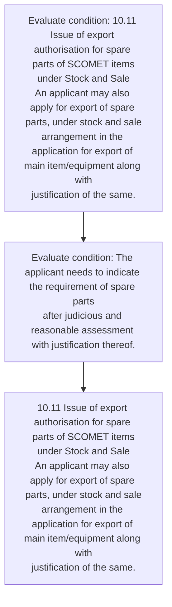
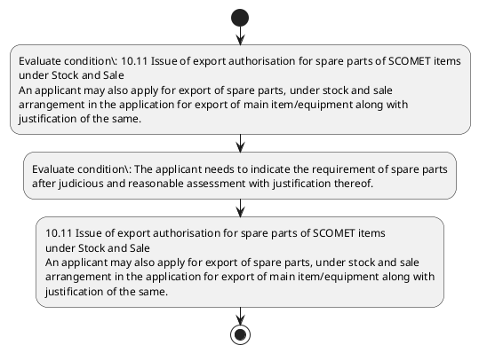

# Chapter 10 / Section 10.11: Issue of export authorisation for spare parts of SCOMET items

**Chapter Title:** SCOMET: Special Chemicals, Organisms, Materials, Equipment and Technologies

**Pages:** 11

**Purpose:** 10.11 Issue of export authorisation for spare parts of SCOMET items
under Stock and Sale
An applicant may also apply for export of spare parts, under stock and sale
arrangement in the application for export of main item/equipment along with
justification of the same.

**Purpose Thanglish:** Indha Issue of export authorisation for spare parts of SCOMET items section-la, 10.11 Issue of export authorisation for spare parts of SCOMET items
under Stock and Sale
An applicant may also apply for export of spare parts, under stock and sale
arrangement in the application for export of main item/equipment along with
justification of the same.

**Summary:** 10.11 Issue of export authorisation for spare parts of SCOMET items
under Stock and Sale
An applicant may also apply for export of spare parts, under stock and sale
arrangement in the application for export of main item/equipment along with
justification of the same. The request for export of spare parts covered under
SCOMET may be considered by IMWG along with the application for the main
item/equipment, on the same conditions, as applicable for the main
item/component. The applicant needs to indicate the requirement of spare parts
after judicious and reasonable assessment with justification thereof.

**Business Meaning:** 10.11 Issue of export authorisation for spare parts of SCOMET items
under Stock and Sale
An applicant may also apply for export of spare parts, under stock and sale
arrangement in the application for export of main item/equipment along with
justification of the same.

**Business Explanation:** 10.11 Issue of export authorisation for spare parts of SCOMET items
under Stock and Sale
An applicant may also apply for export of spare parts, under stock and sale
arrangement in the application for export of main item/equipment along with
justification of the same. The request for export of spare parts covered under
SCOMET may be considered by IMWG along with the application for the main
item/equipment, on the same conditions, as applicable for the main
item/component. The applicant needs to indicate the requirement of spare parts
after judicious and reasonable assessment with justification thereof.

**Business Explanation Thanglish:** Indha Issue of export authorisation for spare parts of SCOMET items section-la, 10.11 Issue of export authorisation for spare parts of SCOMET items
under Stock and Sale
An applicant may also apply for export of spare parts, under stock and sale
arrangement in the application for export of main item/equipment along with
justification of the same. The request for export of spare parts covered under
SCOMET may be considered by IMWG along with the application for the main
item/equipment, on the same conditions, as applicable for the main
item/component. The applicant needs to indicate the requirement of spare parts
after judicious and reasonable assessment with justification thereof.

## Business Logic
- None identified

## Business Rules
- rule_id=CH10-SEC10_11-R001, rule_description=IF validations pass THEN recommend action: 10.11 Issue of export authorisation for spare parts of SCOMET items
under Stock and Sale
An applicant may also apply for export of spare parts, under stock and sale
arrangement in the application for export of main item/equipment along with
justification of the same., trigger=Issue of export authorisation for spare parts of SCOMET items, condition=10.11 Issue of export authorisation for spare parts of SCOMET items
under Stock and Sale
An applicant may also apply for export of spare parts, under stock and sale
arrangement in the application for export of main item/equipment along with
justification of the same., validation=Not explicitly covered in uploaded documents., action=10.11 Issue of export authorisation for spare parts of SCOMET items
under Stock and Sale
An applicant may also apply for export of spare parts, under stock and sale
arrangement in the application for export of main item/equipment along with
justification of the same., exception=No explicit exception found in uploaded documents., output=DEKAI should produce a compliance decision for 10.11 - Issue of export authorisation for spare parts of SCOMET items.

## Conditions
- 10.11 Issue of export authorisation for spare parts of SCOMET items
under Stock and Sale
An applicant may also apply for export of spare parts, under stock and sale
arrangement in the application for export of main item/equipment along with
justification of the same.
- The applicant needs to indicate the requirement of spare parts
after judicious and reasonable assessment with justification thereof.

## Condition Logic
- id=10.10.11.1, if=10.11 Issue of export authorisation for spare parts of SCOMET items
under Stock and Sale
An applicant may also apply for export of spare parts, under stock and sale
arrangement in the application for export of main item/equipment along with
justification of the same., then=10.11 Issue of export authorisation for spare parts of SCOMET items
under Stock and Sale
An applicant may also apply for export of spare parts, under stock and sale
arrangement in the application for export of main item/equipment along with
justification of the same., source=10.11 Issue of export authorisation for spare parts of SCOMET items
under Stock and Sale
An applicant may also apply for export of spare parts, under stock and sale
arrangement in the application for export of main item/equipment along with
justification of the same.
- id=10.10.11.2, if=The applicant needs to indicate the requirement of spare parts
after judicious and reasonable assessment with justification thereof., then=10.11 Issue of export authorisation for spare parts of SCOMET items
under Stock and Sale
An applicant may also apply for export of spare parts, under stock and sale
arrangement in the application for export of main item/equipment along with
justification of the same., source=The applicant needs to indicate the requirement of spare parts
after judicious and reasonable assessment with justification thereof.

## Validations
- None identified

## Exceptions
- None identified

## Dependencies
- None identified

## Authorities
- None identified

## Required Documents
- 10.11 Issue of export authorisation for spare parts of SCOMET items
under Stock and Sale
An applicant may also apply for export of spare parts, under stock and sale
arrangement in the application for export of main item/equipment along with
justification of the same.
- The request for export of spare parts covered under
SCOMET may be considered by IMWG along with the application for the main
item/equipment, on the same conditions, as applicable for the main
item/component.

## Timelines
- The applicant needs to indicate the requirement of spare parts
after judicious and reasonable assessment with justification thereof.

## Actions
- 10.11 Issue of export authorisation for spare parts of SCOMET items
under Stock and Sale
An applicant may also apply for export of spare parts, under stock and sale
arrangement in the application for export of main item/equipment along with
justification of the same.

## Workflow
- Evaluate condition: 10.11 Issue of export authorisation for spare parts of SCOMET items
under Stock and Sale
An applicant may also apply for export of spare parts, under stock and sale
arrangement in the application for export of main item/equipment along with
justification of the same.
- Evaluate condition: The applicant needs to indicate the requirement of spare parts
after judicious and reasonable assessment with justification thereof.
- 10.11 Issue of export authorisation for spare parts of SCOMET items
under Stock and Sale
An applicant may also apply for export of spare parts, under stock and sale
arrangement in the application for export of main item/equipment along with
justification of the same.

## Workflow ASCII
```text
Issue of export authorisation for spare parts of SCOMET items
Evaluate condition: 10.11 Issue of export authorisation for spare parts of SCOMET items
under Stock and Sale
An applicant may also apply for export of spare parts, under stock and sale
arrangement in the application for export of main item/equipment along with
justification of the same.
   |
   v
Evaluate condition: The applicant needs to indicate the requirement of spare parts
after judicious and reasonable assessment with justification thereof.
   |
   v
10.11 Issue of export authorisation for spare parts of SCOMET items
under Stock and Sale
An applicant may also apply for export of spare parts, under stock and sale
arrangement in the application for export of main item/equipment along with
justification of the same.
```

## Decision Tree
- IF 10.11 Issue of export authorisation for spare parts of SCOMET items
under Stock and Sale
An applicant may also apply for export of spare parts, under stock and sale
arrangement in the application for export of main item/equipment along with
justification of the same. THEN 10.11 Issue of export authorisation for spare parts of SCOMET items
under Stock and Sale
An applicant may also apply for export of spare parts, under stock and sale
arrangement in the application for export of main item/equipment along with
justification of the same.
- IF The applicant needs to indicate the requirement of spare parts
after judicious and reasonable assessment with justification thereof. THEN 10.11 Issue of export authorisation for spare parts of SCOMET items
under Stock and Sale
An applicant may also apply for export of spare parts, under stock and sale
arrangement in the application for export of main item/equipment along with
justification of the same.

## Decision Tree ASCII
```text
Issue of export authorisation for spare parts of SCOMET items Decision
IF 10.11 Issue of export authorisation for spare parts of SCOMET items
under Stock and Sale
An applicant may also apply for export of spare parts, under stock and sale
arrangement in the application for export of main item/equipment along with
justification of the same. THEN 10.11 Issue of export authorisation for spare parts of SCOMET items
under Stock and Sale
An applicant may also apply for export of spare parts, under stock and sale
arrangement in the application for export of main item/equipment along with
justification of the same.
   |
   v
IF The applicant needs to indicate the requirement of spare parts
after judicious and reasonable assessment with justification thereof. THEN 10.11 Issue of export authorisation for spare parts of SCOMET items
under Stock and Sale
An applicant may also apply for export of spare parts, under stock and sale
arrangement in the application for export of main item/equipment along with
justification of the same.
```

## Examples
- User asks to process Issue of export authorisation for spare parts of SCOMET items; the platform checks conditions, validations, and documents before action.

**Real-world Example:** Example: an importer or exporter invokes Issue of export authorisation for spare parts of SCOMET items, submits 10.11 Issue of export authorisation for spare parts of SCOMET items
under Stock and Sale
An applicant may also apply for export of spare parts, under stock and sale
arrangement in the application for export of main item/equipment along with
justification of the same., The request for export of spare parts covered under
SCOMET may be considered by IMWG along with the application for the main
item/equipment, on the same conditions, as applicable for the main
item/component., and DEKAI uses the extracted rules to 10.11 issue of export authorisation for spare parts of scomet items
under stock and sale
an applicant may also apply for export of spare parts, under stock and sale
arrangement in the application for export of main item/equipment along with
justification of the same..

**Real-world Example Thanglish:** Indha Issue of export authorisation for spare parts of SCOMET items section-la, Example: an importer or exporter invokes Issue of export authorisation for spare parts of SCOMET items, submits 10.11 Issue of export authorisation for spare parts of SCOMET items
under Stock and Sale
An applicant may also apply for export of spare parts, under stock and sale
arrangement in the application for export of main item/equipment along with
justification of the same., The request for export of spare parts covered under
SCOMET may be considered by IMWG along with the application for the main
item/equipment, on the same conditions, as applicable for the main
item/component., and DEKAI uses the extracted rules to 10.11 issue of export authorisation for spare parts of scomet items
under stock and sale
an applicant may also apply for export of spare parts, under stock and sale
arrangement in the application for export of main item/equipment along with
justification of the same..

## AI Rules
- IF validations pass THEN recommend action: 10.11 Issue of export authorisation for spare parts of SCOMET items
under Stock and Sale
An applicant may also apply for export of spare parts, under stock and sale
arrangement in the application for export of main item/equipment along with
justification of the same.

## Database Fields
- name=section_code, type=string, required=True, source=parsed_section_heading
- name=section_title, type=string, required=True, source=parsed_section_heading
- name=for_flag, type=boolean, required=False, source=keyword:for
- name=and_flag, type=boolean, required=False, source=keyword:and
- name=may_flag, type=boolean, required=False, source=keyword:may
- name=the_flag, type=boolean, required=False, source=keyword:the
- name=sale_flag, type=boolean, required=False, source=keyword:Sale
- name=also_flag, type=boolean, required=False, source=keyword:also
- name=main_flag, type=boolean, required=False, source=keyword:main
- name=with_flag, type=boolean, required=False, source=keyword:with
- name=document_1_submitted, type=boolean, required=True, source=10.11 Issue of export authorisation for spare parts of SCOMET items
under Stock and Sale
An applicant may also apply for export of spare parts, under stock and sale
arrangement in the application for export of main item/equipment along with
justification of the same.
- name=document_2_submitted, type=boolean, required=True, source=The request for export of spare parts covered under
SCOMET may be considered by IMWG along with the application for the main
item/equipment, on the same conditions, as applicable for the main
item/component.

## API Requirements
- method=GET, path=/api/dgft/sections/10.11, purpose=Retrieve knowledge payload for section 10.11, query_params=['include=workflow,decision_tree,validations'], response_fields=['section', 'title', 'summary', 'conditions', 'validations', 'exceptions', 'workflow', 'decision_tree']
- method=POST, path=/api/dgft/Issue-of-export-authorisation-for-spare-parts-of-SCOMET-items/validate, purpose=Validate inputs and documents for Issue of export authorisation for spare parts of SCOMET items, request_fields=['section_code', 'section_title', 'document_1_submitted', 'document_2_submitted'], response_fields=['status', 'errors', 'warnings', 'next_actions']
- method=POST, path=/api/dgft/Issue-of-export-authorisation-for-spare-parts-of-SCOMET-items/execute, purpose=Trigger business action for 10.11 Issue of export authorisation for spare parts of SCOMET items
under Stock and Sale
An applicant may also apply for export of spare parts, under stock and sale
arrangement in the application for export of main item/equipment along with
justification of the same., request_fields=['section_code', 'section_title', 'document_1_submitted', 'document_2_submitted'], response_fields=['reference_id', 'status', 'authority', 'timeline']

## UI Screens
- screen_id=Issue_of_export_authorisation_for_spare_parts_of_SCOMET_items_overview, name=Issue of export authorisation for spare parts of SCOMET items Overview, purpose=Show section summary, authority, timeline, and eligibility cues., widgets=['summary_card', 'conditions_table', 'authority_badges', 'timeline_panel']
- screen_id=Issue_of_export_authorisation_for_spare_parts_of_SCOMET_items_submission, name=Issue of export authorisation for spare parts of SCOMET items Submission, purpose=Capture applicant data and supporting documents., widgets=['dynamic_form', 'document_uploader', 'validation_panel', 'next_action_footer'], fields=['section_code', 'section_title', 'for_flag', 'and_flag', 'may_flag', 'the_flag', 'sale_flag', 'also_flag']

## Error Messages
- Validation failed because the section requirements were not fully met.

## FAQ
- question_en=What is the purpose of section 10.11?, answer_en=10.11 Issue of export authorisation for spare parts of SCOMET items
under Stock and Sale
An applicant may also apply for export of spare parts, under stock and sale
arrangement in the application for export of main item/equipment along with
justification of the same. The request for export of spare parts covered under
SCOMET may be considered by IMWG along with the application for the main
item/equipment, on the same conditions, as applicable for the main
item/component. The applicant needs to indicate the requirement of spare parts
after judicious and reasonable assessment with justification thereof., question_thanglish=Indha Issue of export authorisation for spare parts of SCOMET items section-la, What is the purpose of section 10.11?, answer_thanglish=Indha Issue of export authorisation for spare parts of SCOMET items section-la, 10.11 Issue of export authorisation for spare parts of SCOMET items
under Stock and Sale
An applicant may also apply for export of spare parts, under stock and sale
arrangement in the application for export of main item/equipment along with
justification of the same. The request for export of spare parts covered under
SCOMET may be considered by IMWG along with the application for the main
item/equipment, on the same conditions, as applicable for the main
item/component. The applicant needs to indicate the requirement of spare parts
after judicious and reasonable assessment with justification thereof.
- question_en=What documents are required under Issue of export authorisation for spare parts of SCOMET items?, answer_en=10.11 Issue of export authorisation for spare parts of SCOMET items
under Stock and Sale
An applicant may also apply for export of spare parts, under stock and sale
arrangement in the application for export of main item/equipment along with
justification of the same., The request for export of spare parts covered under
SCOMET may be considered by IMWG along with the application for the main
item/equipment, on the same conditions, as applicable for the main
item/component., question_thanglish=Indha Issue of export authorisation for spare parts of SCOMET items section-la, What documents are required under Issue of export authorisation for spare parts of SCOMET items?, answer_thanglish=Indha Issue of export authorisation for spare parts of SCOMET items section-la, 10.11 Issue of export authorisation for spare parts of SCOMET items
under Stock and Sale
An applicant may also apply for export of spare parts, under stock and sale
arrangement in the application for export of main item/equipment along with
justification of the same., The request for export of spare parts covered under
SCOMET may be considered by IMWG along with the application for the main
item/equipment, on the same conditions, as applicable for the main
item/component.
- question_en=Which authority handles Issue of export authorisation for spare parts of SCOMET items?, answer_en=Not explicitly covered in uploaded documents., question_thanglish=Indha Issue of export authorisation for spare parts of SCOMET items section-la, Which authority handles Issue of export authorisation for spare parts of SCOMET items?, answer_thanglish=Indha Issue of export authorisation for spare parts of SCOMET items section-la, Not explicitly covered in uploaded documents.

## Questions Users May Ask
- What does Issue of export authorisation for spare parts of SCOMET items require?
- Which documents are needed for Issue of export authorisation for spare parts of SCOMET items?
- How does DEKAI validate Issue of export authorisation for spare parts of SCOMET items requests?
- What action should be taken for Issue of export authorisation for spare parts of SCOMET items?

## Expected AI Answers
- Issue of export authorisation for spare parts of SCOMET items requires the platform to interpret the section text, apply the extracted business rules, and present the correct next action.
- Required documents are inferred from the section text: 10.11 Issue of export authorisation for spare parts of SCOMET items
under Stock and Sale
An applicant may also apply for export of spare parts, under stock and sale
arrangement in the application for export of main item/equipment along with
justification of the same., The request for export of spare parts covered under
SCOMET may be considered by IMWG along with the application for the main
item/equipment, on the same conditions, as applicable for the main
item/component.
- DEKAI validates Issue of export authorisation for spare parts of SCOMET items by checking conditions, required documents, authority references, and exception clauses before recommending an outcome.
- The primary extracted action is: 10.11 Issue of export authorisation for spare parts of SCOMET items
under Stock and Sale
An applicant may also apply for export of spare parts, under stock and sale
arrangement in the application for export of main item/equipment along with
justification of the same.

## AI Q&A Examples
- question_en=User asks: How do I comply with Issue of export authorisation for spare parts of SCOMET items?, answer_en=AI answers: DEKAI should evaluate section 10.11, apply the extracted rules, and guide the user through Evaluate condition: 10.11 Issue of export authorisation for spare parts of SCOMET items
under Stock and Sale
An applicant may also apply for export of spare parts, under stock and sale
arrangement in the application for export of main item/equipment along with
justification of the same.., question_thanglish=Indha Issue of export authorisation for spare parts of SCOMET items section-la, User asks: How do I comply with Issue of export authorisation for spare parts of SCOMET items?, answer_thanglish=Indha Issue of export authorisation for spare parts of SCOMET items section-la, AI answers: DEKAI should evaluate section 10.11, apply the extracted rules, and guide the user through Evaluate condition: 10.11 Issue of export authorisation for spare parts of SCOMET items
under Stock and Sale
An applicant may also apply for export of spare parts, under stock and sale
arrangement in the application for export of main item/equipment along with
justification of the same..
- question_en=User asks: Which validations apply to Issue of export authorisation for spare parts of SCOMET items?, answer_en=AI answers: Applicable validations are not explicitly covered in the uploaded documents., question_thanglish=Indha Issue of export authorisation for spare parts of SCOMET items section-la, User asks: Which validations apply to Issue of export authorisation for spare parts of SCOMET items?, answer_thanglish=Indha Issue of export authorisation for spare parts of SCOMET items section-la, AI answers: Applicable validations are not explicitly covered in the uploaded documents.

## DEKAI AI Implementation Notes
- Capture chapter 10, section 10.11, title, and page references as immutable knowledge metadata.
- Bind validations for Issue of export authorisation for spare parts of SCOMET items into a rule engine keyed by the rule IDs extracted for this section.
- Expose document upload controls for: 10.11 Issue of export authorisation for spare parts of SCOMET items
under Stock and Sale
An applicant may also apply for export of spare parts, under stock and sale
arrangement in the application for export of main item/equipment along with
justification of the same., The request for export of spare parts covered under
SCOMET may be considered by IMWG along with the application for the main
item/equipment, on the same conditions, as applicable for the main
item/component..

## DEKAI AI Implementation Notes Thanglish
- Indha Issue of export authorisation for spare parts of SCOMET items section-la, Capture chapter 10, section 10.11, title, and page references as immutable knowledge metadata.
- Indha Issue of export authorisation for spare parts of SCOMET items section-la, Bind validations for Issue of export authorisation for spare parts of SCOMET items into a rule engine keyed by the rule IDs extracted for this section.
- Indha Issue of export authorisation for spare parts of SCOMET items section-la, Expose document upload controls for: 10.11 Issue of export authorisation for spare parts of SCOMET items
under Stock and Sale
An applicant may also apply for export of spare parts, under stock and sale
arrangement in the application for export of main item/equipment along with
justification of the same., The request for export of spare parts covered under
SCOMET may be considered by IMWG along with the application for the main
item/equipment, on the same conditions, as applicable for the main
item/component..

## AI Metadata
- Keywords: for, and, may, the, Sale, also, main, with, same, IMWG, Issue, spare, parts, items, under, Stock, apply, along, needs, after
- Search Keywords: for, and, may, the, Sale, also, main, with, same, IMWG, Issue, spare, parts, items, under, Stock, apply, along, needs, after
- Intent: Support Issue of export authorisation for spare parts of SCOMET items processing and compliance validation.
- Tags: 10.11, Issue of export authorisation for spare parts of SCOMET items, document-driven, dgft
- Related Sections: 
- Related Chapters: 
- Related Rules: 

## Mermaid


## PlantUML

