# Chapter 10 / Section 10.12: Issue of authorisations for repair/replacement of defective

**Chapter Title:** SCOMET: Special Chemicals, Organisms, Materials, Equipment and Technologies

**Pages:** 11, 12, 13, 14, 15, 16

**Purpose:** 10.12 Issue of authorisations for repair/replacement of defective
SCOMET items
An application for grant of an Authorisation for export/re-export of SCOMET
items, as the case may be for (i) repair/replacement of imported item(s) abroad
and return (ii) repair/replacement of indigenous SCOMET items (iii) return of
items imported for repair at a repair facility in India and (iv) Authorisation for
export of SCOMET items after repair in india (GAER) shall be made in prescribed
proforma [ANF 10A] through online SCOMET portal along with other supporting
documents, as prescribed in Appendix 10D, 10E, 10F and 10F(i), as applicable.

**Purpose Thanglish:** Indha Issue of authorisations for repair/replacement of defective section-la, 10.12 Issue of authorisations for repair/replacement of defective
SCOMET items
An application for grant of an Authorisation for export/re-export of SCOMET
items, as the case may be for (i) repair/replacement of imported item(s) abroad
and return (ii) repair/replacement of indigenous SCOMET items (iii) return of
items imported for repair at a repair facility in India and (iv) Authorisation for
export of SCOMET items after repair in india (GAER) kandippa be made in prescribed
proforma [ANF 10A] through online SCOMET portal along with other supporting
documents, as prescribed in Appendix 10D, 10E, 10F and 10F(i), as applicable.

**Summary:** 10.12 Issue of authorisations for repair/replacement of defective
SCOMET items
An application for grant of an Authorisation for export/re-export of SCOMET
items, as the case may be for (i) repair/replacement of imported item(s) abroad
and return (ii) repair/replacement of indigenous SCOMET items (iii) return of
items imported for repair at a repair facility in India and (iv) Authorisation for
export of SCOMET items after repair in india (GAER) shall be made in prescribed
proforma [ANF 10A] through online SCOMET portal along with other supporting
documents, as prescribed in Appendix 10D, 10E, 10F and 10F(i), as applicable. The
application shall be considered by Chairman IMWG, on fulfilment of the following
conditions:
A. Authorisation for export of imported SCOMET items for
repair/replacement:
i.

**Business Meaning:** Issue of authorisations for repair/replacement of defective governs how DGFT business controls should be applied, validated, and enforced.

**Business Explanation:** Issue of authorisations for repair/replacement of defective explains the operating rule set that DEKAI should enforce. Key control points include 10.12 Issue of authorisations for repair/replacement of defective
SCOMET items
An application for grant of an Authorisation for export/re-export of SCOMET
items, as the case may be for (i) repair/replacement of imported item(s) abroad
and return (ii) repair/replacement of indigenous SCOMET items (iii) return of
items imported for repair at a repair facility in India and (iv) Authorisation for
export of SCOMET items after repair in india (GAER) shall be made in prescribed
proforma [ANF 10A] through online SCOMET portal along with other supporting
documents, as prescribed in Appendix 10D, 10E, 10F and 10F(i), as applicable. The section also drives actions such as 10.12 Issue of authorisations for repair/replacement of defective
SCOMET items
An application for grant of an Authorisation for export/re-export of SCOMET
items, as the case may be for (i) repair/replacement of imported item(s) abroad
and return (ii) repair/replacement of indigenous SCOMET items (iii) return of
items imported for repair at a repair facility in India and (iv) Authorisation for
export of SCOMET items after repair in india (GAER) shall be made in prescribed
proforma [ANF 10A] through online SCOMET portal along with other supporting
documents, as prescribed in Appendix 10D, 10E, 10F and 10F(i), as applicable..

**Business Explanation Thanglish:** Indha Issue of authorisations for repair/replacement of defective section-la, Issue of authorisations for repair/replacement of defective explains the operating rule set that DEKAI should enforce. Key control points include 10.12 Issue of authorisations for repair/replacement of defective
SCOMET items
An application for grant of an Authorisation for export/re-export of SCOMET
items, as the case may be for (i) repair/replacement of imported item(s) abroad
and return (ii) repair/replacement of indigenous SCOMET items (iii) return of
items imported for repair at a repair facility in India and (iv) Authorisation for
export of SCOMET items after repair in india (GAER) kandippa be made in prescribed
proforma [ANF 10A] through online SCOMET portal along with other supporting
documents, as prescribed in Appendix 10D, 10E, 10F and 10F(i), as applicable. The section also drives actions such as 10.12 Issue of authorisations for repair/replacement of defective
SCOMET items
An application for grant of an Authorisation for export/re-export of SCOMET
items, as the case may be for (i) repair/replacement of imported item(s) abroad
and return (ii) repair/replacement of indigenous SCOMET items (iii) return of
items imported for repair at a repair facility in India and (iv) Authorisation for
export of SCOMET items after repair in india (GAER) kandippa be made in prescribed
proforma [ANF 10A] through online SCOMET portal along with other supporting
documents, as prescribed in Appendix 10D, 10E, 10F and 10F(i), as applicable..

## Business Logic
- 10.12 Issue of authorisations for repair/replacement of defective
SCOMET items
An application for grant of an Authorisation for export/re-export of SCOMET
items, as the case may be for (i) repair/replacement of imported item(s) abroad
and return (ii) repair/replacement of indigenous SCOMET items (iii) return of
items imported for repair at a repair facility in India and (iv) Authorisation for
export of SCOMET items after repair in india (GAER) shall be made in prescribed
proforma [ANF 10A] through online SCOMET portal along with other supporting
documents, as prescribed in Appendix 10D, 10E, 10F and 10F(i), as applicable.
- The
application shall be considered by Chairman IMWG, on fulfilment of the following
conditions:
A.
- 179
10.12 Issue of authorisations for repair/replacement of defective
SCOMET items
An application for grant of an Authorisation for export/re-export of SCOMET
items, as the case may be for (i) repair/replacement of imported item(s) abroad
and return (ii) repair/replacement of indigenous SCOMET items (iii) return of
items imported for repair at a repair facility in India and (iv) Authorisation for
export of SCOMET items after repair in india (GAER) shall be made in prescribed
proforma [ANF 10A] through online SCOMET portal along with other supporting
documents, as prescribed in Appendix 10D, 10E, 10F and 10F(i), as applicable.
- Applications for grant of authorisations for export to the entity from
which it was imported or to the OEM (including agency authorized by
OEM) shall be approved by Chairman IMWG, without any consultation
with IMWG members.
- Return of item(s) after repair/replacement and post-reporting
compliance:
(a) Exported items shall be brought back to India within 90 days
repair is completed or item is replaced or within the extended
time, as allowed by the DGFT;
(b) In case the defective/damaged item(s) cannot be imported due to
any reason (beyond repair, testing failure analysis etc.), evidence
of destruction in the importing country shall be submitted to
DGFT within 90 days of export.
- (c) In case time beyond 90 days is required for repair of imported
defective/damaged item(s) before re-import, permission from
DGFT shall have to be obtained in advance indicating detailed
justification for seeking extension of time.
- Return of item(s) after repair/replacement and post-reporting
compliance:
(a)
Exported items shall be brought back to India within 90 days
repair is completed or item is replaced or within the extended
time, as allowed by the DGFT;
(b)
In case the defective/damaged item(s) cannot be imported due to
any reason (beyond repair, testing failure analysis etc.), evidence
of destruction in the importing country shall be submitted to
DGFT within 90 days of export.
- (c)
In case time beyond 90 days is required for repair of imported
defective/damaged item(s) before re-import, permission from
DGFT shall have to be obtained in advance indicating detailed
justification for seeking extension of time.
- (d) Bill of Entry confirming the return back of such SCOMET item(s)
to India shall be intimated by the licensee to the DGFT(Hqrs) in
the prescribed proforma (Annexure-I of Appendix 10K), duly
signed in ink and stamped by the authorised signatory.
- Applications for grant of authorisations to export the replaced/repaired
item(s) to/through the same entity(ies), as specified in the original
SCOMET license, shall be approved by Chairman IMWG, without any
consultation with IMWG members.
- 181
(d)
Bill of Entry confirming the return back of such SCOMET item(s)
to India shall be intimated by the licensee to the DGFT(Hqrs) in
the prescribed proforma (Annexure-I of Appendix 10K), duly
signed in ink and stamped by the authorised signatory.
- Return
of
item(s)after
repair/replacement
and
post-reporting
compliance:
(a) That the defective/damaged item(s)has/have already been
brought back or would be brought back to India within 90 days of
its replacement (in case of replacement);;
(b) In case the defective/damaged item(s)cannot be imported due to
any reason (beyond repair, testing failure analysis etc.), evidence
of destruction in the importing country shall be submitted to
DGFT within 90 days of export of replacement;
(c) Bill of Entry confirming the return back of such SCOMET item(s)
to India shall be intimated by the licensee to the DGFT(Hqrs) in
the prescribed proforma (Annexure-I of Appendix 10K), duly
signed in ink and stamped by the authorised signatory.
- 182
(a)
That the defective/damaged item(s)has/have already been
brought back or would be brought back to India within 90 days of
its replacement (in case of replacement);;
(b)
In case the defective/damaged item(s)cannot be imported due to
any reason (beyond repair, testing failure analysis etc.), evidence
of destruction in the importing country shall be submitted to
DGFT within 90 days of export of replacement;
(c)
Bill of Entry confirming the return back of such SCOMET item(s)
to India shall be intimated by the licensee to the DGFT(Hqrs) in
the prescribed proforma (Annexure-I of Appendix 10K), duly
signed in ink and stamped by the authorised signatory.
- All such authorisations shall be brought before IMWG in its subsequent
meeting for confirmation of approval, on ex-post facto basis.
- Export of imported SCOMET items to the related entities0 and repair supply chain1 in
the foreign country after repair in India will be allowed on the basis of a one-time
General authorization for Export after Repair in India (GAER) subject to post reporting
on quarterly basis issued by DGFT, subject to the following conditions:
a.
- The exporter is required to register and obtain General authorization for export
after repair only once during the validity period.
- Subsequent export/re-export is
subject to post reporting;
d.
- The exporter is required to provide Bill of Entry for the imported item while
applying for GAER for the first shipment.
- General authorization for export after repair shall be valid for a period of one year
from the date of issue of General authorization subject to subsequent post
reporting(s) within 30 days from the date of such export;
f.
- GAER issued for specific item and specific entity (buyer/end user) shall not be
applicable in case the re-export is of a different imported item or to a different
entity or Authorised OEM.
- Certified / approved Internal Compliance Programme or demonstrating
compliance to the ICP of the foreign company or ICP certified by the compliance
manager of that company shall be mandatory[only for intra-company transfers].
- Authorized Economic Operator (AEO) Certification along with ICP compliance shall
be mandatory.

## Business Rules
- rule_id=CH10-SEC10_12-R001, rule_description=10.12 Issue of authorisations for repair/replacement of defective
SCOMET items
An application for grant of an Authorisation for export/re-export of SCOMET
items, as the case may be for (i) repair/replacement of imported item(s) abroad
and return (ii) repair/replacement of indigenous SCOMET items (iii) return of
items imported for repair at a repair facility in India and (iv) Authorisation for
export of SCOMET items after repair in india (GAER) shall be made in prescribed
proforma [ANF 10A] through online SCOMET portal along with other supporting
documents, as prescribed in Appendix 10D, 10E, 10F and 10F(i), as applicable., trigger=Issue of authorisations for repair/replacement of defective, condition=10.12 Issue of authorisations for repair/replacement of defective
SCOMET items
An application for grant of an Authorisation for export/re-export of SCOMET
items, as the case may be for (i) repair/replacement of imported item(s) abroad
and return (ii) repair/replacement of indigenous SCOMET items (iii) return of
items imported for repair at a repair facility in India and (iv) Authorisation for
export of SCOMET items after repair in india (GAER) shall be made in prescribed
proforma [ANF 10A] through online SCOMET portal along with other supporting
documents, as prescribed in Appendix 10D, 10E, 10F and 10F(i), as applicable., validation=10.12 Issue of authorisations for repair/replacement of defective
SCOMET items
An application for grant of an Authorisation for export/re-export of SCOMET
items, as the case may be for (i) repair/replacement of imported item(s) abroad
and return (ii) repair/replacement of indigenous SCOMET items (iii) return of
items imported for repair at a repair facility in India and (iv) Authorisation for
export of SCOMET items after repair in india (GAER) shall be made in prescribed
proforma [ANF 10A] through online SCOMET portal along with other supporting
documents, as prescribed in Appendix 10D, 10E, 10F and 10F(i), as applicable., action=10.12 Issue of authorisations for repair/replacement of defective
SCOMET items
An application for grant of an Authorisation for export/re-export of SCOMET
items, as the case may be for (i) repair/replacement of imported item(s) abroad
and return (ii) repair/replacement of indigenous SCOMET items (iii) return of
items imported for repair at a repair facility in India and (iv) Authorisation for
export of SCOMET items after repair in india (GAER) shall be made in prescribed
proforma [ANF 10A] through online SCOMET portal along with other supporting
documents, as prescribed in Appendix 10D, 10E, 10F and 10F(i), as applicable., exception=However, in cases of export to any other entity,
approval will be granted by Chairman, IMWG after verification of the
credentials of the foreign entity to which the item(s) are to be exported., output=DEKAI should produce a compliance decision for 10.12 - Issue of authorisations for repair/replacement of defective.
- rule_id=CH10-SEC10_12-R002, rule_description=The
application shall be considered by Chairman IMWG, on fulfilment of the following
conditions:
A., trigger=Issue of authorisations for repair/replacement of defective, condition=Conditions to be fulfilled:
(a) The SCOMET items were imported to India and are to be exported
for the purpose of repair and replacement, on being defective;
(b) There has been no change to the original
characteristics/specifications of the SCOMET item(s);
(c) The SCOMET items are to be exported to the same entity from
which they have been imported or to the OEM (including,
agency1authorized by OEM);
1Agency can include’ Approved Repair Centre’ (facility approved by the original equipment
manufacturer to repair the goods being exported under license)., validation=The
application shall be considered by Chairman IMWG, on fulfilment of the following
conditions:
A., action=Conditions to be fulfilled:
(a) The SCOMET items were imported to India and are to be exported
for the purpose of repair and replacement, on being defective;
(b) There has been no change to the original
characteristics/specifications of the SCOMET item(s);
(c) The SCOMET items are to be exported to the same entity from
which they have been imported or to the OEM (including,
agency1authorized by OEM);
1Agency can include’ Approved Repair Centre’ (facility approved by the original equipment
manufacturer to repair the goods being exported under license)., exception=However, in cases of export
to/through a new entity (consignee), approval will be granted by
Chairman, IMWG after verification of the credentials of the new foreign
entity(ies) through which the item(s) are to be exported., output=DEKAI should produce a compliance decision for 10.12 - Issue of authorisations for repair/replacement of defective.
- rule_id=CH10-SEC10_12-R003, rule_description=179
10.12 Issue of authorisations for repair/replacement of defective
SCOMET items
An application for grant of an Authorisation for export/re-export of SCOMET
items, as the case may be for (i) repair/replacement of imported item(s) abroad
and return (ii) repair/replacement of indigenous SCOMET items (iii) return of
items imported for repair at a repair facility in India and (iv) Authorisation for
export of SCOMET items after repair in india (GAER) shall be made in prescribed
proforma [ANF 10A] through online SCOMET portal along with other supporting
documents, as prescribed in Appendix 10D, 10E, 10F and 10F(i), as applicable., trigger=Issue of authorisations for repair/replacement of defective, condition=179
10.12 Issue of authorisations for repair/replacement of defective
SCOMET items
An application for grant of an Authorisation for export/re-export of SCOMET
items, as the case may be for (i) repair/replacement of imported item(s) abroad
and return (ii) repair/replacement of indigenous SCOMET items (iii) return of
items imported for repair at a repair facility in India and (iv) Authorisation for
export of SCOMET items after repair in india (GAER) shall be made in prescribed
proforma [ANF 10A] through online SCOMET portal along with other supporting
documents, as prescribed in Appendix 10D, 10E, 10F and 10F(i), as applicable., validation=Conditions to be fulfilled:
(a) The SCOMET items were imported to India and are to be exported
for the purpose of repair and replacement, on being defective;
(b) There has been no change to the original
characteristics/specifications of the SCOMET item(s);
(c) The SCOMET items are to be exported to the same entity from
which they have been imported or to the OEM (including,
agency1authorized by OEM);
1Agency can include’ Approved Repair Centre’ (facility approved by the original equipment
manufacturer to repair the goods being exported under license)., action=179
10.12 Issue of authorisations for repair/replacement of defective
SCOMET items
An application for grant of an Authorisation for export/re-export of SCOMET
items, as the case may be for (i) repair/replacement of imported item(s) abroad
and return (ii) repair/replacement of indigenous SCOMET items (iii) return of
items imported for repair at a repair facility in India and (iv) Authorisation for
export of SCOMET items after repair in india (GAER) shall be made in prescribed
proforma [ANF 10A] through online SCOMET portal along with other supporting
documents, as prescribed in Appendix 10D, 10E, 10F and 10F(i), as applicable., exception=However, in cases of export
to/through a new entity (consignee), approval will be granted by
Chairman, IMWG after verification of the credentials of the new foreign
entity(ies) through which the item(s) are to be exported., output=DEKAI should produce a compliance decision for 10.12 - Issue of authorisations for repair/replacement of defective.
- rule_id=CH10-SEC10_12-R004, rule_description=Applications for grant of authorisations for export to the entity from
which it was imported or to the OEM (including agency authorized by
OEM) shall be approved by Chairman IMWG, without any consultation
with IMWG members., trigger=Issue of authorisations for repair/replacement of defective, condition=Conditions to be fulfilled:
(a)
The SCOMET items were imported to India and are to be exported
for the purpose of repair and replacement, on being defective;
(b)
There
has
been
no
change
to
the
original
characteristics/specifications of the SCOMET item(s);
(c)
The SCOMET items are to be exported to the same entity from
which they have been imported or to the OEM (including,
agency1authorized by OEM);
1Agency can include’ Approved Repair Centre’ (facility approved by the original equipment
manufacturer to repair the goods being exported under license)., validation=179
10.12 Issue of authorisations for repair/replacement of defective
SCOMET items
An application for grant of an Authorisation for export/re-export of SCOMET
items, as the case may be for (i) repair/replacement of imported item(s) abroad
and return (ii) repair/replacement of indigenous SCOMET items (iii) return of
items imported for repair at a repair facility in India and (iv) Authorisation for
export of SCOMET items after repair in india (GAER) shall be made in prescribed
proforma [ANF 10A] through online SCOMET portal along with other supporting
documents, as prescribed in Appendix 10D, 10E, 10F and 10F(i), as applicable., action=Conditions to be fulfilled:
(a)
The SCOMET items were imported to India and are to be exported
for the purpose of repair and replacement, on being defective;
(b)
There
has
been
no
change
to
the
original
characteristics/specifications of the SCOMET item(s);
(c)
The SCOMET items are to be exported to the same entity from
which they have been imported or to the OEM (including,
agency1authorized by OEM);
1Agency can include’ Approved Repair Centre’ (facility approved by the original equipment
manufacturer to repair the goods being exported under license)., exception=However, in cases of export
to/through a new entity (consignee), approval will be granted by
Chairman, IMWG after verification of the credentials of the new foreign
entity(ies) through which the item(s) are to be exported., output=DEKAI should produce a compliance decision for 10.12 - Issue of authorisations for repair/replacement of defective.
- rule_id=CH10-SEC10_12-R005, rule_description=Return of item(s) after repair/replacement and post-reporting
compliance:
(a) Exported items shall be brought back to India within 90 days
repair is completed or item is replaced or within the extended
time, as allowed by the DGFT;
(b) In case the defective/damaged item(s) cannot be imported due to
any reason (beyond repair, testing failure analysis etc.), evidence
of destruction in the importing country shall be submitted to
DGFT within 90 days of export., trigger=Issue of authorisations for repair/replacement of defective, condition=(d) That the replacement or repair of defective/damaged items
(whichever is applicable) is allowed under the conditions of import
or contractual agreement;
(e) No Export Authorisation would be granted if the initial export
authorisation has been suspended, modified or revoked by the
exporting country;
(f) No Export authorisation would be granted for UNSC sanctioned
destinations or countries/entities of high risk, as assessed by the
IMWG, from time to time; and
(g) No ‘End Use’ and ‘End Use Certificate’ would be required;
(h) The application is accompanied with relevant documents as
prescribed in Appendix 10D;
(i) Legal Undertaking on the stamp paper of Rs., validation=Conditions to be fulfilled:
(a)
The SCOMET items were imported to India and are to be exported
for the purpose of repair and replacement, on being defective;
(b)
There
has
been
no
change
to
the
original
characteristics/specifications of the SCOMET item(s);
(c)
The SCOMET items are to be exported to the same entity from
which they have been imported or to the OEM (including,
agency1authorized by OEM);
1Agency can include’ Approved Repair Centre’ (facility approved by the original equipment
manufacturer to repair the goods being exported under license)., action=Applications for grant of authorisations for export to the entity from
which it was imported or to the OEM (including agency authorized by
OEM) shall be approved by Chairman IMWG, without any consultation
with IMWG members., exception=However, in cases of export
to/through a new entity (consignee), approval will be granted by
Chairman, IMWG after verification of the credentials of the new foreign
entity(ies) through which the item(s) are to be exported., output=DEKAI should produce a compliance decision for 10.12 - Issue of authorisations for repair/replacement of defective.
- rule_id=CH10-SEC10_12-R006, rule_description=(c) In case time beyond 90 days is required for repair of imported
defective/damaged item(s) before re-import, permission from
DGFT shall have to be obtained in advance indicating detailed
justification for seeking extension of time., trigger=Issue of authorisations for repair/replacement of defective, condition=However, in cases of export to any other entity,
approval will be granted by Chairman, IMWG after verification of the
credentials of the foreign entity to which the item(s) are to be exported., validation=(d) That the replacement or repair of defective/damaged items
(whichever is applicable) is allowed under the conditions of import
or contractual agreement;
(e) No Export Authorisation would be granted if the initial export
authorisation has been suspended, modified or revoked by the
exporting country;
(f) No Export authorisation would be granted for UNSC sanctioned
destinations or countries/entities of high risk, as assessed by the
IMWG, from time to time; and
(g) No ‘End Use’ and ‘End Use Certificate’ would be required;
(h) The application is accompanied with relevant documents as
prescribed in Appendix 10D;
(i) Legal Undertaking on the stamp paper of Rs., action=Return of item(s) after repair/replacement and post-reporting
compliance:
(a) Exported items shall be brought back to India within 90 days
repair is completed or item is replaced or within the extended
time, as allowed by the DGFT;
(b) In case the defective/damaged item(s) cannot be imported due to
any reason (beyond repair, testing failure analysis etc.), evidence
of destruction in the importing country shall be submitted to
DGFT within 90 days of export., exception=However, in cases of export
to/through a new entity (consignee), approval will be granted by
Chairman, IMWG after verification of the credentials of the new foreign
entity(ies) through which the item(s) are to be exported., output=DEKAI should produce a compliance decision for 10.12 - Issue of authorisations for repair/replacement of defective.
- rule_id=CH10-SEC10_12-R007, rule_description=Return of item(s) after repair/replacement and post-reporting
compliance:
(a)
Exported items shall be brought back to India within 90 days
repair is completed or item is replaced or within the extended
time, as allowed by the DGFT;
(b)
In case the defective/damaged item(s) cannot be imported due to
any reason (beyond repair, testing failure analysis etc.), evidence
of destruction in the importing country shall be submitted to
DGFT within 90 days of export., trigger=Issue of authorisations for repair/replacement of defective, condition=Return of item(s) after repair/replacement and post-reporting
compliance:
(a) Exported items shall be brought back to India within 90 days
repair is completed or item is replaced or within the extended
time, as allowed by the DGFT;
(b) In case the defective/damaged item(s) cannot be imported due to
any reason (beyond repair, testing failure analysis etc.), evidence
of destruction in the importing country shall be submitted to
DGFT within 90 days of export., validation=Applications for grant of authorisations for export to the entity from
which it was imported or to the OEM (including agency authorized by
OEM) shall be approved by Chairman IMWG, without any consultation
with IMWG members., action=(c) In case time beyond 90 days is required for repair of imported
defective/damaged item(s) before re-import, permission from
DGFT shall have to be obtained in advance indicating detailed
justification for seeking extension of time., exception=However, in cases of export
to/through a new entity (consignee), approval will be granted by
Chairman, IMWG after verification of the credentials of the new foreign
entity(ies) through which the item(s) are to be exported., output=DEKAI should produce a compliance decision for 10.12 - Issue of authorisations for repair/replacement of defective.
- rule_id=CH10-SEC10_12-R008, rule_description=(c)
In case time beyond 90 days is required for repair of imported
defective/damaged item(s) before re-import, permission from
DGFT shall have to be obtained in advance indicating detailed
justification for seeking extension of time., trigger=Issue of authorisations for repair/replacement of defective, condition=(c) In case time beyond 90 days is required for repair of imported
defective/damaged item(s) before re-import, permission from
DGFT shall have to be obtained in advance indicating detailed
justification for seeking extension of time., validation=Return of item(s) after repair/replacement and post-reporting
compliance:
(a) Exported items shall be brought back to India within 90 days
repair is completed or item is replaced or within the extended
time, as allowed by the DGFT;
(b) In case the defective/damaged item(s) cannot be imported due to
any reason (beyond repair, testing failure analysis etc.), evidence
of destruction in the importing country shall be submitted to
DGFT within 90 days of export., action=Return of item(s) after repair/replacement and post-reporting
compliance:
(a)
Exported items shall be brought back to India within 90 days
repair is completed or item is replaced or within the extended
time, as allowed by the DGFT;
(b)
In case the defective/damaged item(s) cannot be imported due to
any reason (beyond repair, testing failure analysis etc.), evidence
of destruction in the importing country shall be submitted to
DGFT within 90 days of export., exception=However, in cases of export
to/through a new entity (consignee), approval will be granted by
Chairman, IMWG after verification of the credentials of the new foreign
entity(ies) through which the item(s) are to be exported., output=DEKAI should produce a compliance decision for 10.12 - Issue of authorisations for repair/replacement of defective.
- rule_id=CH10-SEC10_12-R009, rule_description=(d) Bill of Entry confirming the return back of such SCOMET item(s)
to India shall be intimated by the licensee to the DGFT(Hqrs) in
the prescribed proforma (Annexure-I of Appendix 10K), duly
signed in ink and stamped by the authorised signatory., trigger=Issue of authorisations for repair/replacement of defective, condition=180
(d)
That the replacement or repair of defective/damaged items
(whichever is applicable) is allowed under the conditions of import
or contractual agreement;
(e)
No Export Authorisation would be granted if the initial export
authorisation has been suspended, modified or revoked by the
exporting country;
(f)
No Export authorisation would be granted for UNSC sanctioned
destinations or countries/entities of high risk, as assessed by the
IMWG, from time to time; and
(g)
No ‘End Use’ and ‘End Use Certificate’ would be required;
(h)
The application is accompanied with relevant documents as
prescribed in Appendix 10D;
(i)
Legal Undertaking on the stamp paper of Rs., validation=(c) In case time beyond 90 days is required for repair of imported
defective/damaged item(s) before re-import, permission from
DGFT shall have to be obtained in advance indicating detailed
justification for seeking extension of time., action=(c)
In case time beyond 90 days is required for repair of imported
defective/damaged item(s) before re-import, permission from
DGFT shall have to be obtained in advance indicating detailed
justification for seeking extension of time., exception=However, in cases of export
to/through a new entity (consignee), approval will be granted by
Chairman, IMWG after verification of the credentials of the new foreign
entity(ies) through which the item(s) are to be exported., output=DEKAI should produce a compliance decision for 10.12 - Issue of authorisations for repair/replacement of defective.
- rule_id=CH10-SEC10_12-R010, rule_description=Applications for grant of authorisations to export the replaced/repaired
item(s) to/through the same entity(ies), as specified in the original
SCOMET license, shall be approved by Chairman IMWG, without any
consultation with IMWG members., trigger=Issue of authorisations for repair/replacement of defective, condition=Return of item(s) after repair/replacement and post-reporting
compliance:
(a)
Exported items shall be brought back to India within 90 days
repair is completed or item is replaced or within the extended
time, as allowed by the DGFT;
(b)
In case the defective/damaged item(s) cannot be imported due to
any reason (beyond repair, testing failure analysis etc.), evidence
of destruction in the importing country shall be submitted to
DGFT within 90 days of export., validation=180
(d)
That the replacement or repair of defective/damaged items
(whichever is applicable) is allowed under the conditions of import
or contractual agreement;
(e)
No Export Authorisation would be granted if the initial export
authorisation has been suspended, modified or revoked by the
exporting country;
(f)
No Export authorisation would be granted for UNSC sanctioned
destinations or countries/entities of high risk, as assessed by the
IMWG, from time to time; and
(g)
No ‘End Use’ and ‘End Use Certificate’ would be required;
(h)
The application is accompanied with relevant documents as
prescribed in Appendix 10D;
(i)
Legal Undertaking on the stamp paper of Rs., action=Applications for grant of authorisations to export the replaced/repaired
item(s) to/through the same entity(ies), as specified in the original
SCOMET license, shall be approved by Chairman IMWG, without any
consultation with IMWG members., exception=However, in cases of export
to/through a new entity (consignee), approval will be granted by
Chairman, IMWG after verification of the credentials of the new foreign
entity(ies) through which the item(s) are to be exported., output=DEKAI should produce a compliance decision for 10.12 - Issue of authorisations for repair/replacement of defective.
- rule_id=CH10-SEC10_12-R011, rule_description=181
(d)
Bill of Entry confirming the return back of such SCOMET item(s)
to India shall be intimated by the licensee to the DGFT(Hqrs) in
the prescribed proforma (Annexure-I of Appendix 10K), duly
signed in ink and stamped by the authorised signatory., trigger=Issue of authorisations for repair/replacement of defective, condition=(c)
In case time beyond 90 days is required for repair of imported
defective/damaged item(s) before re-import, permission from
DGFT shall have to be obtained in advance indicating detailed
justification for seeking extension of time., validation=Return of item(s) after repair/replacement and post-reporting
compliance:
(a)
Exported items shall be brought back to India within 90 days
repair is completed or item is replaced or within the extended
time, as allowed by the DGFT;
(b)
In case the defective/damaged item(s) cannot be imported due to
any reason (beyond repair, testing failure analysis etc.), evidence
of destruction in the importing country shall be submitted to
DGFT within 90 days of export., action=Return of item(s)after repair/replacement and post-reporting
compliance:
pg., exception=However, in cases of export
to/through a new entity (consignee), approval will be granted by
Chairman, IMWG after verification of the credentials of the new foreign
entity(ies) through which the item(s) are to be exported., output=DEKAI should produce a compliance decision for 10.12 - Issue of authorisations for repair/replacement of defective.
- rule_id=CH10-SEC10_12-R012, rule_description=Return
of
item(s)after
repair/replacement
and
post-reporting
compliance:
(a) That the defective/damaged item(s)has/have already been
brought back or would be brought back to India within 90 days of
its replacement (in case of replacement);;
(b) In case the defective/damaged item(s)cannot be imported due to
any reason (beyond repair, testing failure analysis etc.), evidence
of destruction in the importing country shall be submitted to
DGFT within 90 days of export of replacement;
(c) Bill of Entry confirming the return back of such SCOMET item(s)
to India shall be intimated by the licensee to the DGFT(Hqrs) in
the prescribed proforma (Annexure-I of Appendix 10K), duly
signed in ink and stamped by the authorised signatory., trigger=Issue of authorisations for repair/replacement of defective, condition=Authorisation for re-export of indigenous SCOMET items after
repair/replacement:
i., validation=(c)
In case time beyond 90 days is required for repair of imported
defective/damaged item(s) before re-import, permission from
DGFT shall have to be obtained in advance indicating detailed
justification for seeking extension of time., action=Return
of
item(s)after
repair/replacement
and
post-reporting
compliance:
(a) That the defective/damaged item(s)has/have already been
brought back or would be brought back to India within 90 days of
its replacement (in case of replacement);;
(b) In case the defective/damaged item(s)cannot be imported due to
any reason (beyond repair, testing failure analysis etc.), evidence
of destruction in the importing country shall be submitted to
DGFT within 90 days of export of replacement;
(c) Bill of Entry confirming the return back of such SCOMET item(s)
to India shall be intimated by the licensee to the DGFT(Hqrs) in
the prescribed proforma (Annexure-I of Appendix 10K), duly
signed in ink and stamped by the authorised signatory., exception=However, in cases of export
to/through a new entity (consignee), approval will be granted by
Chairman, IMWG after verification of the credentials of the new foreign
entity(ies) through which the item(s) are to be exported., output=DEKAI should produce a compliance decision for 10.12 - Issue of authorisations for repair/replacement of defective.
- rule_id=CH10-SEC10_12-R013, rule_description=182
(a)
That the defective/damaged item(s)has/have already been
brought back or would be brought back to India within 90 days of
its replacement (in case of replacement);;
(b)
In case the defective/damaged item(s)cannot be imported due to
any reason (beyond repair, testing failure analysis etc.), evidence
of destruction in the importing country shall be submitted to
DGFT within 90 days of export of replacement;
(c)
Bill of Entry confirming the return back of such SCOMET item(s)
to India shall be intimated by the licensee to the DGFT(Hqrs) in
the prescribed proforma (Annexure-I of Appendix 10K), duly
signed in ink and stamped by the authorised signatory., trigger=Issue of authorisations for repair/replacement of defective, condition=Conditions to be fulfilled:
(a) The SCOMET items manufactured in India, were exported and
brought back to India for repair or being replaced, on being found
defective/damaged;
(b) The items are to be re-exported after repair/replacement to the
same entity to which the item(s) were originally exported by the
applicant exporter;
(c) There has been no change to the original
characteristics/specifications of SCOMET item(s);
(d) That the defective/damaged item(s)has/have already been
brought back or would be brought back to India within 90 days of
its replacement(if applicable);
(e) That replacement/repair(whichever is applicable) is allowed
under the conditions of export or purchase order or contractual
agreement;
(f) No authorisation for re-export would be granted if the original
licence has been suspended, modified or revoked., validation=(d) Bill of Entry confirming the return back of such SCOMET item(s)
to India shall be intimated by the licensee to the DGFT(Hqrs) in
the prescribed proforma (Annexure-I of Appendix 10K), duly
signed in ink and stamped by the authorised signatory., action=Conditions to be fulfilled:
(a) The SCOMET items were imported to a designated/authorized
repair facility in India for the purpose of repair under a contract
agreement/Master Service agreement (MSA); or
Imported under a contract agreement between Indian exporter,
entities of repair facility (if different from exporter)and entity
abroad defining ‘Statement of Work (SOW)’/ ‘Scope of Work’
including conditions for undertaking repair in India;
(b) The items are to be exported to the same entity abroad from which
the item(s) has/have been imported or to the OEM (including
agency2 authorised by OEM);
(c) The repair of defective/damaged items is allowed under the
conditions of import or contractual agreement between Indian
exporter, entities of repair facility (if different from exporter) and
the entity abroad/OEM (including agency authorized by
OEM)(name and address);
2Agency can include’ Approved Repair Centre’ (facility approved by the original equipment manufacturer to repair
the goods being exported under license)., exception=However, in cases of export
to/through a new entity (consignee), approval will be granted by
Chairman, IMWG after verification of the credentials of the new foreign
entity(ies) through which the item(s) are to be exported., output=DEKAI should produce a compliance decision for 10.12 - Issue of authorisations for repair/replacement of defective.
- rule_id=CH10-SEC10_12-R014, rule_description=All such authorisations shall be brought before IMWG in its subsequent
meeting for confirmation of approval, on ex-post facto basis., trigger=Issue of authorisations for repair/replacement of defective, condition=(g) No Export authorisation would be granted for UNSC sanctioned
destinations or countries/entities of high risk, as assessed by the
IMWG, from time to time; and
(h) No ‘End Use’ and ‘End Use Certificate’ would be required;
(i) The application is accompanied with relevant documents as
prescribed in Appendix 10E;
(j) Legal Undertaking on the stamp paper of Rs., validation=(g) No Export authorisation would be granted for UNSC sanctioned
destinations or countries/entities of high risk, as assessed by the
IMWG, from time to time; and
(h) No ‘End Use’ and ‘End Use Certificate’ would be required;
(i) The application is accompanied with relevant documents as
prescribed in Appendix 10E;
(j) Legal Undertaking on the stamp paper of Rs., action=182
(a)
That the defective/damaged item(s)has/have already been
brought back or would be brought back to India within 90 days of
its replacement (in case of replacement);;
(b)
In case the defective/damaged item(s)cannot be imported due to
any reason (beyond repair, testing failure analysis etc.), evidence
of destruction in the importing country shall be submitted to
DGFT within 90 days of export of replacement;
(c)
Bill of Entry confirming the return back of such SCOMET item(s)
to India shall be intimated by the licensee to the DGFT(Hqrs) in
the prescribed proforma (Annexure-I of Appendix 10K), duly
signed in ink and stamped by the authorised signatory., exception=However, in cases of export
to/through a new entity (consignee), approval will be granted by
Chairman, IMWG after verification of the credentials of the new foreign
entity(ies) through which the item(s) are to be exported., output=DEKAI should produce a compliance decision for 10.12 - Issue of authorisations for repair/replacement of defective.
- rule_id=CH10-SEC10_12-R015, rule_description=Export of imported SCOMET items to the related entities0 and repair supply chain1 in
the foreign country after repair in India will be allowed on the basis of a one-time
General authorization for Export after Repair in India (GAER) subject to post reporting
on quarterly basis issued by DGFT, subject to the following conditions:
a., trigger=Issue of authorisations for repair/replacement of defective, condition=Applications for grant of authorisations to export the replaced/repaired
item(s) to/through the same entity(ies), as specified in the original
SCOMET license, shall be approved by Chairman IMWG, without any
consultation with IMWG members., validation=Applications for grant of authorisations to export the replaced/repaired
item(s) to/through the same entity(ies), as specified in the original
SCOMET license, shall be approved by Chairman IMWG, without any
consultation with IMWG members., action=Conditions to be fulfilled:
(a)
The SCOMET items were imported to a designated/authorized
repair facility in India for the purpose of repair under a contract
agreement/Master Service agreement (MSA); or
Imported under a contract agreement between Indian exporter,
entities of repair facility (if different from exporter)and entity
abroad defining ‘Statement of Work (SOW)’/ ‘Scope of Work’
including conditions for undertaking repair in India;
(b)
The items are to be exported to the same entity abroad from which
the item(s) has/have been imported or to the OEM (including
agency2 authorised by OEM);
(c)
The repair of defective/damaged items is allowed under the
conditions of import or contractual agreement between Indian
exporter, entities of repair facility (if different from exporter) and
the entity abroad/OEM (including agency authorized by
OEM)(name and address);
2Agency can include’ Approved Repair Centre’ (facility approved by the original equipment manufacturer to repair
the goods being exported under license)., exception=However, in cases of export
to/through a new entity (consignee), approval will be granted by
Chairman, IMWG after verification of the credentials of the new foreign
entity(ies) through which the item(s) are to be exported., output=DEKAI should produce a compliance decision for 10.12 - Issue of authorisations for repair/replacement of defective.
- rule_id=CH10-SEC10_12-R016, rule_description=The exporter is required to register and obtain General authorization for export
after repair only once during the validity period., trigger=Issue of authorisations for repair/replacement of defective, condition=However, in cases of export
to/through a new entity (consignee), approval will be granted by
Chairman, IMWG after verification of the credentials of the new foreign
entity(ies) through which the item(s) are to be exported., validation=181
(d)
Bill of Entry confirming the return back of such SCOMET item(s)
to India shall be intimated by the licensee to the DGFT(Hqrs) in
the prescribed proforma (Annexure-I of Appendix 10K), duly
signed in ink and stamped by the authorised signatory., action=Export of imported SCOMET items to the related entities0 and repair supply chain1 in
the foreign country after repair in India will be allowed on the basis of a one-time
General authorization for Export after Repair in India (GAER) subject to post reporting
on quarterly basis issued by DGFT, subject to the following conditions:
a., exception=However, in cases of export
to/through a new entity (consignee), approval will be granted by
Chairman, IMWG after verification of the credentials of the new foreign
entity(ies) through which the item(s) are to be exported., output=DEKAI should produce a compliance decision for 10.12 - Issue of authorisations for repair/replacement of defective.
- rule_id=CH10-SEC10_12-R017, rule_description=Subsequent export/re-export is
subject to post reporting;
d., trigger=Issue of authorisations for repair/replacement of defective, condition=Return of item(s)after repair/replacement and post-reporting
compliance:
pg., validation=(g)
No Export authorisation would be granted for UNSC sanctioned
destinations or countries/entities of high risk, as assessed by the
IMWG, from time to time; and
(h)
No ‘End Use’ and ‘End Use Certificate’ would be required;
(i)
The application is accompanied with relevant documents as
prescribed in Appendix 10E;
(j)
Legal Undertaking on the stamp paper of Rs., action=The exporter is required to register and obtain General authorization for export
after repair only once during the validity period., exception=However, in cases of export
to/through a new entity (consignee), approval will be granted by
Chairman, IMWG after verification of the credentials of the new foreign
entity(ies) through which the item(s) are to be exported., output=DEKAI should produce a compliance decision for 10.12 - Issue of authorisations for repair/replacement of defective.
- rule_id=CH10-SEC10_12-R018, rule_description=The exporter is required to provide Bill of Entry for the imported item while
applying for GAER for the first shipment., trigger=Issue of authorisations for repair/replacement of defective, condition=Conditions to be fulfilled:
(a)
The SCOMET items manufactured in India, were exported and
brought back to India for repair or being replaced, on being found
defective/damaged;
(b)
The items are to be re-exported after repair/replacement to the
same entity to which the item(s) were originally exported by the
applicant exporter;
(c)
There
has
been
no
change
to
the
original
characteristics/specifications of SCOMET item(s);
(d)
That the defective/damaged item(s)has/have already been
brought back or would be brought back to India within 90 days of
its replacement(if applicable);
(e)
That replacement/repair(whichever is applicable) is allowed
under the conditions of export or purchase order or contractual
agreement;
(f)
No authorisation for re-export would be granted if the original
licence has been suspended, modified or revoked., validation=Return
of
item(s)after
repair/replacement
and
post-reporting
compliance:
(a) That the defective/damaged item(s)has/have already been
brought back or would be brought back to India within 90 days of
its replacement (in case of replacement);;
(b) In case the defective/damaged item(s)cannot be imported due to
any reason (beyond repair, testing failure analysis etc.), evidence
of destruction in the importing country shall be submitted to
DGFT within 90 days of export of replacement;
(c) Bill of Entry confirming the return back of such SCOMET item(s)
to India shall be intimated by the licensee to the DGFT(Hqrs) in
the prescribed proforma (Annexure-I of Appendix 10K), duly
signed in ink and stamped by the authorised signatory., action=Subsequent export/re-export is
subject to post reporting;
d., exception=However, in cases of export
to/through a new entity (consignee), approval will be granted by
Chairman, IMWG after verification of the credentials of the new foreign
entity(ies) through which the item(s) are to be exported., output=DEKAI should produce a compliance decision for 10.12 - Issue of authorisations for repair/replacement of defective.
- rule_id=CH10-SEC10_12-R019, rule_description=General authorization for export after repair shall be valid for a period of one year
from the date of issue of General authorization subject to subsequent post
reporting(s) within 30 days from the date of such export;
f., trigger=Issue of authorisations for repair/replacement of defective, condition=(g)
No Export authorisation would be granted for UNSC sanctioned
destinations or countries/entities of high risk, as assessed by the
IMWG, from time to time; and
(h)
No ‘End Use’ and ‘End Use Certificate’ would be required;
(i)
The application is accompanied with relevant documents as
prescribed in Appendix 10E;
(j)
Legal Undertaking on the stamp paper of Rs., validation=Conditions to be fulfilled:
(a) The SCOMET items were imported to a designated/authorized
repair facility in India for the purpose of repair under a contract
agreement/Master Service agreement (MSA); or
Imported under a contract agreement between Indian exporter,
entities of repair facility (if different from exporter)and entity
abroad defining ‘Statement of Work (SOW)’/ ‘Scope of Work’
including conditions for undertaking repair in India;
(b) The items are to be exported to the same entity abroad from which
the item(s) has/have been imported or to the OEM (including
agency2 authorised by OEM);
(c) The repair of defective/damaged items is allowed under the
conditions of import or contractual agreement between Indian
exporter, entities of repair facility (if different from exporter) and
the entity abroad/OEM (including agency authorized by
OEM)(name and address);
2Agency can include’ Approved Repair Centre’ (facility approved by the original equipment manufacturer to repair
the goods being exported under license)., action=The exporter is required to provide Bill of Entry for the imported item while
applying for GAER for the first shipment., exception=However, in cases of export
to/through a new entity (consignee), approval will be granted by
Chairman, IMWG after verification of the credentials of the new foreign
entity(ies) through which the item(s) are to be exported., output=DEKAI should produce a compliance decision for 10.12 - Issue of authorisations for repair/replacement of defective.
- rule_id=CH10-SEC10_12-R020, rule_description=GAER issued for specific item and specific entity (buyer/end user) shall not be
applicable in case the re-export is of a different imported item or to a different
entity or Authorised OEM., trigger=Issue of authorisations for repair/replacement of defective, condition=Return
of
item(s)after
repair/replacement
and
post-reporting
compliance:
(a) That the defective/damaged item(s)has/have already been
brought back or would be brought back to India within 90 days of
its replacement (in case of replacement);;
(b) In case the defective/damaged item(s)cannot be imported due to
any reason (beyond repair, testing failure analysis etc.), evidence
of destruction in the importing country shall be submitted to
DGFT within 90 days of export of replacement;
(c) Bill of Entry confirming the return back of such SCOMET item(s)
to India shall be intimated by the licensee to the DGFT(Hqrs) in
the prescribed proforma (Annexure-I of Appendix 10K), duly
signed in ink and stamped by the authorised signatory., validation=182
(a)
That the defective/damaged item(s)has/have already been
brought back or would be brought back to India within 90 days of
its replacement (in case of replacement);;
(b)
In case the defective/damaged item(s)cannot be imported due to
any reason (beyond repair, testing failure analysis etc.), evidence
of destruction in the importing country shall be submitted to
DGFT within 90 days of export of replacement;
(c)
Bill of Entry confirming the return back of such SCOMET item(s)
to India shall be intimated by the licensee to the DGFT(Hqrs) in
the prescribed proforma (Annexure-I of Appendix 10K), duly
signed in ink and stamped by the authorised signatory., action=General authorization for export after repair shall be valid for a period of one year
from the date of issue of General authorization subject to subsequent post
reporting(s) within 30 days from the date of such export;
f., exception=However, in cases of export
to/through a new entity (consignee), approval will be granted by
Chairman, IMWG after verification of the credentials of the new foreign
entity(ies) through which the item(s) are to be exported., output=DEKAI should produce a compliance decision for 10.12 - Issue of authorisations for repair/replacement of defective.
- rule_id=CH10-SEC10_12-R021, rule_description=Certified / approved Internal Compliance Programme or demonstrating
compliance to the ICP of the foreign company or ICP certified by the compliance
manager of that company shall be mandatory[only for intra-company transfers]., trigger=Issue of authorisations for repair/replacement of defective, condition=Authorisation for export of imported SCOMET items to same entity
abroad, or any authorised entity after repair in India:
i., validation=Conditions to be fulfilled:
(a)
The SCOMET items were imported to a designated/authorized
repair facility in India for the purpose of repair under a contract
agreement/Master Service agreement (MSA); or
Imported under a contract agreement between Indian exporter,
entities of repair facility (if different from exporter)and entity
abroad defining ‘Statement of Work (SOW)’/ ‘Scope of Work’
including conditions for undertaking repair in India;
(b)
The items are to be exported to the same entity abroad from which
the item(s) has/have been imported or to the OEM (including
agency2 authorised by OEM);
(c)
The repair of defective/damaged items is allowed under the
conditions of import or contractual agreement between Indian
exporter, entities of repair facility (if different from exporter) and
the entity abroad/OEM (including agency authorized by
OEM)(name and address);
2Agency can include’ Approved Repair Centre’ (facility approved by the original equipment manufacturer to repair
the goods being exported under license)., action=Subsequent export would be allowed to the same entity and location to which the
license has originally been issued., exception=However, in cases of export
to/through a new entity (consignee), approval will be granted by
Chairman, IMWG after verification of the credentials of the new foreign
entity(ies) through which the item(s) are to be exported., output=DEKAI should produce a compliance decision for 10.12 - Issue of authorisations for repair/replacement of defective.
- rule_id=CH10-SEC10_12-R022, rule_description=Authorized Economic Operator (AEO) Certification along with ICP compliance shall
be mandatory., trigger=Issue of authorisations for repair/replacement of defective, condition=Conditions to be fulfilled:
(a) The SCOMET items were imported to a designated/authorized
repair facility in India for the purpose of repair under a contract
agreement/Master Service agreement (MSA); or
Imported under a contract agreement between Indian exporter,
entities of repair facility (if different from exporter)and entity
abroad defining ‘Statement of Work (SOW)’/ ‘Scope of Work’
including conditions for undertaking repair in India;
(b) The items are to be exported to the same entity abroad from which
the item(s) has/have been imported or to the OEM (including
agency2 authorised by OEM);
(c) The repair of defective/damaged items is allowed under the
conditions of import or contractual agreement between Indian
exporter, entities of repair facility (if different from exporter) and
the entity abroad/OEM (including agency authorized by
OEM)(name and address);
2Agency can include’ Approved Repair Centre’ (facility approved by the original equipment manufacturer to repair
the goods being exported under license)., validation=(d) There has been no change to the original
characteristics/specifications of the SCOMET item(s) after repair;
(e) No Export Authorisation would be granted when the initial export
authorisation has been suspended, modified or revoked by
country of import;
(f) No Export authorisation would be granted for UNSC sanctioned
destinations or countries/entities of high risk, as assessed by the
IMWG, from time to time;
(g) No details of ‘End Use’ and ‘End Use Certificate’ would be required;
(h) The application is accompanied with relevant documents as
prescribed in Appendix 10F;
ii., action=Note: Same entity would imply that (a) foreign
buyer (b) consignee or intermediaries, if any (c) the end user are exactly the same
for which authorisation has been issued to the applicant exporter., exception=However, in cases of export
to/through a new entity (consignee), approval will be granted by
Chairman, IMWG after verification of the credentials of the new foreign
entity(ies) through which the item(s) are to be exported., output=DEKAI should produce a compliance decision for 10.12 - Issue of authorisations for repair/replacement of defective.

## Conditions
- 10.12 Issue of authorisations for repair/replacement of defective
SCOMET items
An application for grant of an Authorisation for export/re-export of SCOMET
items, as the case may be for (i) repair/replacement of imported item(s) abroad
and return (ii) repair/replacement of indigenous SCOMET items (iii) return of
items imported for repair at a repair facility in India and (iv) Authorisation for
export of SCOMET items after repair in india (GAER) shall be made in prescribed
proforma [ANF 10A] through online SCOMET portal along with other supporting
documents, as prescribed in Appendix 10D, 10E, 10F and 10F(i), as applicable.
- Conditions to be fulfilled:
(a) The SCOMET items were imported to India and are to be exported
for the purpose of repair and replacement, on being defective;
(b) There has been no change to the original
characteristics/specifications of the SCOMET item(s);
(c) The SCOMET items are to be exported to the same entity from
which they have been imported or to the OEM (including,
agency1authorized by OEM);
1Agency can include’ Approved Repair Centre’ (facility approved by the original equipment
manufacturer to repair the goods being exported under license).
- 179
10.12 Issue of authorisations for repair/replacement of defective
SCOMET items
An application for grant of an Authorisation for export/re-export of SCOMET
items, as the case may be for (i) repair/replacement of imported item(s) abroad
and return (ii) repair/replacement of indigenous SCOMET items (iii) return of
items imported for repair at a repair facility in India and (iv) Authorisation for
export of SCOMET items after repair in india (GAER) shall be made in prescribed
proforma [ANF 10A] through online SCOMET portal along with other supporting
documents, as prescribed in Appendix 10D, 10E, 10F and 10F(i), as applicable.
- Conditions to be fulfilled:
(a)
The SCOMET items were imported to India and are to be exported
for the purpose of repair and replacement, on being defective;
(b)
There
has
been
no
change
to
the
original
characteristics/specifications of the SCOMET item(s);
(c)
The SCOMET items are to be exported to the same entity from
which they have been imported or to the OEM (including,
agency1authorized by OEM);
1Agency can include’ Approved Repair Centre’ (facility approved by the original equipment
manufacturer to repair the goods being exported under license).
- (d) That the replacement or repair of defective/damaged items
(whichever is applicable) is allowed under the conditions of import
or contractual agreement;
(e) No Export Authorisation would be granted if the initial export
authorisation has been suspended, modified or revoked by the
exporting country;
(f) No Export authorisation would be granted for UNSC sanctioned
destinations or countries/entities of high risk, as assessed by the
IMWG, from time to time; and
(g) No ‘End Use’ and ‘End Use Certificate’ would be required;
(h) The application is accompanied with relevant documents as
prescribed in Appendix 10D;
(i) Legal Undertaking on the stamp paper of Rs.
- However, in cases of export to any other entity,
approval will be granted by Chairman, IMWG after verification of the
credentials of the foreign entity to which the item(s) are to be exported.
- Return of item(s) after repair/replacement and post-reporting
compliance:
(a) Exported items shall be brought back to India within 90 days
repair is completed or item is replaced or within the extended
time, as allowed by the DGFT;
(b) In case the defective/damaged item(s) cannot be imported due to
any reason (beyond repair, testing failure analysis etc.), evidence
of destruction in the importing country shall be submitted to
DGFT within 90 days of export.
- (c) In case time beyond 90 days is required for repair of imported
defective/damaged item(s) before re-import, permission from
DGFT shall have to be obtained in advance indicating detailed
justification for seeking extension of time.
- 180
(d)
That the replacement or repair of defective/damaged items
(whichever is applicable) is allowed under the conditions of import
or contractual agreement;
(e)
No Export Authorisation would be granted if the initial export
authorisation has been suspended, modified or revoked by the
exporting country;
(f)
No Export authorisation would be granted for UNSC sanctioned
destinations or countries/entities of high risk, as assessed by the
IMWG, from time to time; and
(g)
No ‘End Use’ and ‘End Use Certificate’ would be required;
(h)
The application is accompanied with relevant documents as
prescribed in Appendix 10D;
(i)
Legal Undertaking on the stamp paper of Rs.
- Return of item(s) after repair/replacement and post-reporting
compliance:
(a)
Exported items shall be brought back to India within 90 days
repair is completed or item is replaced or within the extended
time, as allowed by the DGFT;
(b)
In case the defective/damaged item(s) cannot be imported due to
any reason (beyond repair, testing failure analysis etc.), evidence
of destruction in the importing country shall be submitted to
DGFT within 90 days of export.
- (c)
In case time beyond 90 days is required for repair of imported
defective/damaged item(s) before re-import, permission from
DGFT shall have to be obtained in advance indicating detailed
justification for seeking extension of time.
- Authorisation for re-export of indigenous SCOMET items after
repair/replacement:
i.
- Conditions to be fulfilled:
(a) The SCOMET items manufactured in India, were exported and
brought back to India for repair or being replaced, on being found
defective/damaged;
(b) The items are to be re-exported after repair/replacement to the
same entity to which the item(s) were originally exported by the
applicant exporter;
(c) There has been no change to the original
characteristics/specifications of SCOMET item(s);
(d) That the defective/damaged item(s)has/have already been
brought back or would be brought back to India within 90 days of
its replacement(if applicable);
(e) That replacement/repair(whichever is applicable) is allowed
under the conditions of export or purchase order or contractual
agreement;
(f) No authorisation for re-export would be granted if the original
licence has been suspended, modified or revoked.
- (g) No Export authorisation would be granted for UNSC sanctioned
destinations or countries/entities of high risk, as assessed by the
IMWG, from time to time; and
(h) No ‘End Use’ and ‘End Use Certificate’ would be required;
(i) The application is accompanied with relevant documents as
prescribed in Appendix 10E;
(j) Legal Undertaking on the stamp paper of Rs.
- Applications for grant of authorisations to export the replaced/repaired
item(s) to/through the same entity(ies), as specified in the original
SCOMET license, shall be approved by Chairman IMWG, without any
consultation with IMWG members.
- However, in cases of export
to/through a new entity (consignee), approval will be granted by
Chairman, IMWG after verification of the credentials of the new foreign
entity(ies) through which the item(s) are to be exported.
- Return of item(s)after repair/replacement and post-reporting
compliance:
pg.
- Conditions to be fulfilled:
(a)
The SCOMET items manufactured in India, were exported and
brought back to India for repair or being replaced, on being found
defective/damaged;
(b)
The items are to be re-exported after repair/replacement to the
same entity to which the item(s) were originally exported by the
applicant exporter;
(c)
There
has
been
no
change
to
the
original
characteristics/specifications of SCOMET item(s);
(d)
That the defective/damaged item(s)has/have already been
brought back or would be brought back to India within 90 days of
its replacement(if applicable);
(e)
That replacement/repair(whichever is applicable) is allowed
under the conditions of export or purchase order or contractual
agreement;
(f)
No authorisation for re-export would be granted if the original
licence has been suspended, modified or revoked.
- (g)
No Export authorisation would be granted for UNSC sanctioned
destinations or countries/entities of high risk, as assessed by the
IMWG, from time to time; and
(h)
No ‘End Use’ and ‘End Use Certificate’ would be required;
(i)
The application is accompanied with relevant documents as
prescribed in Appendix 10E;
(j)
Legal Undertaking on the stamp paper of Rs.
- Return
of
item(s)after
repair/replacement
and
post-reporting
compliance:
(a) That the defective/damaged item(s)has/have already been
brought back or would be brought back to India within 90 days of
its replacement (in case of replacement);;
(b) In case the defective/damaged item(s)cannot be imported due to
any reason (beyond repair, testing failure analysis etc.), evidence
of destruction in the importing country shall be submitted to
DGFT within 90 days of export of replacement;
(c) Bill of Entry confirming the return back of such SCOMET item(s)
to India shall be intimated by the licensee to the DGFT(Hqrs) in
the prescribed proforma (Annexure-I of Appendix 10K), duly
signed in ink and stamped by the authorised signatory.
- Authorisation for export of imported SCOMET items to same entity
abroad, or any authorised entity after repair in India:
i.
- Conditions to be fulfilled:
(a) The SCOMET items were imported to a designated/authorized
repair facility in India for the purpose of repair under a contract
agreement/Master Service agreement (MSA); or
Imported under a contract agreement between Indian exporter,
entities of repair facility (if different from exporter)and entity
abroad defining ‘Statement of Work (SOW)’/ ‘Scope of Work’
including conditions for undertaking repair in India;
(b) The items are to be exported to the same entity abroad from which
the item(s) has/have been imported or to the OEM (including
agency2 authorised by OEM);
(c) The repair of defective/damaged items is allowed under the
conditions of import or contractual agreement between Indian
exporter, entities of repair facility (if different from exporter) and
the entity abroad/OEM (including agency authorized by
OEM)(name and address);
2Agency can include’ Approved Repair Centre’ (facility approved by the original equipment manufacturer to repair
the goods being exported under license).
- 182
(a)
That the defective/damaged item(s)has/have already been
brought back or would be brought back to India within 90 days of
its replacement (in case of replacement);;
(b)
In case the defective/damaged item(s)cannot be imported due to
any reason (beyond repair, testing failure analysis etc.), evidence
of destruction in the importing country shall be submitted to
DGFT within 90 days of export of replacement;
(c)
Bill of Entry confirming the return back of such SCOMET item(s)
to India shall be intimated by the licensee to the DGFT(Hqrs) in
the prescribed proforma (Annexure-I of Appendix 10K), duly
signed in ink and stamped by the authorised signatory.
- Conditions to be fulfilled:
(a)
The SCOMET items were imported to a designated/authorized
repair facility in India for the purpose of repair under a contract
agreement/Master Service agreement (MSA); or
Imported under a contract agreement between Indian exporter,
entities of repair facility (if different from exporter)and entity
abroad defining ‘Statement of Work (SOW)’/ ‘Scope of Work’
including conditions for undertaking repair in India;
(b)
The items are to be exported to the same entity abroad from which
the item(s) has/have been imported or to the OEM (including
agency2 authorised by OEM);
(c)
The repair of defective/damaged items is allowed under the
conditions of import or contractual agreement between Indian
exporter, entities of repair facility (if different from exporter) and
the entity abroad/OEM (including agency authorized by
OEM)(name and address);
2Agency can include’ Approved Repair Centre’ (facility approved by the original equipment manufacturer to repair
the goods being exported under license).
- (d) There has been no change to the original
characteristics/specifications of the SCOMET item(s) after repair;
(e) No Export Authorisation would be granted when the initial export
authorisation has been suspended, modified or revoked by
country of import;
(f) No Export authorisation would be granted for UNSC sanctioned
destinations or countries/entities of high risk, as assessed by the
IMWG, from time to time;
(g) No details of ‘End Use’ and ‘End Use Certificate’ would be required;
(h) The application is accompanied with relevant documents as
prescribed in Appendix 10F;
ii.
- All such authorisations shall be brought before IMWG in its subsequent
meeting for confirmation of approval, on ex-post facto basis.
- Authorization for export of same imported SCOMET items to Related entities0
and Repair supply chain1 in the foreign country under General Authorization
for Export after Repair(GAER)
0Related entities mean Direct subsidiary / Foreign Parent of the Indian Company or
another Subsidiary of the foreign parent of the Indian Company.
- Export of imported SCOMET items to the related entities0 and repair supply chain1 in
the foreign country after repair in India will be allowed on the basis of a one-time
General authorization for Export after Repair in India (GAER) subject to post reporting
on quarterly basis issued by DGFT, subject to the following conditions:
a.
- The SCOMET items were imported to a designated/authorized repair facility in
India for the purpose of repair under a contract agreement/Master Service
agreement (MSA)/Electronic Manufacturer Agreement (EMS); or Imported under
a contract agreement between Indian exporter, entities of repair facility (if
pg.
- 183
(d)
There
has
been
no
change
to
the
original
characteristics/specifications of the SCOMET item(s) after repair;
(e)
No Export Authorisation would be granted when the initial export
authorisation has been suspended, modified or revoked by
country of import;
(f)
No Export authorisation would be granted for UNSC sanctioned
destinations or countries/entities of high risk, as assessed by the
IMWG, from time to time;
(g)
No details of ‘End Use’ and ‘End Use Certificate’ would be required;
(h)
The application is accompanied with relevant documents as
prescribed in Appendix 10F;
ii.
- The SCOMET items were imported to a designated/authorized repair facility in
India for the purpose of repair under a contract agreement/Master Service
agreement (MSA)/Electronic Manufacturer Agreement (EMS); or Imported under
a contract agreement between Indian exporter, entities of repair facility (if
different from exporter) and entity abroad defining ‘Statement of Work (SOW)’/
‘Scope of Work’ including conditions for undertaking repair in India;
b.
- The exporter is required to register and obtain General authorization for export
after repair only once during the validity period.
- Subsequent export/re-export is
subject to post reporting;
d.
- General authorization for export after repair shall be valid for a period of one year
from the date of issue of General authorization subject to subsequent post
reporting(s) within 30 days from the date of such export;
f.
- Note: Same entity would imply that (a) foreign
buyer (b) consignee or intermediaries, if any (c) the end user are exactly the same
for which authorisation has been issued to the applicant exporter.
- There has been no change to the original characteristics/specifications of the
SCOMET item(s) after repair and no value addition has been done during the repair
work;
h.
- No Export Authorisation would be granted when the initial export authorisation
has been suspended, modified or revoked by country of import;
i.
- No details of ‘End Use’ and ‘End Use Certificate’ would be required;
k.
- GAER issued for specific item and specific entity (buyer/end user) shall not be
applicable in case the re-export is of a different imported item or to a different
entity or Authorised OEM.
- Certified / approved Internal Compliance Programme or demonstrating
compliance to the ICP of the foreign company or ICP certified by the compliance
manager of that company shall be mandatory[only for intra-company transfers].
- Authorized Economic Operator (AEO) Certification along with ICP compliance shall
be mandatory.

## Condition Logic
- id=10.10.12.1, if=10.12 Issue of authorisations for repair/replacement of defective
SCOMET items
An application for grant of an Authorisation for export/re-export of SCOMET
items, as the case may be for (i) repair/replacement of imported item(s) abroad
and return (ii) repair/replacement of indigenous SCOMET items (iii) return of
items imported for repair at a repair facility in India and (iv) Authorisation for
export of SCOMET items after repair in india (GAER) shall be made in prescribed
proforma [ANF 10A] through online SCOMET portal along with other supporting
documents, as prescribed in Appendix 10D, 10E, 10F and 10F(i), as applicable., then=10.12 Issue of authorisations for repair/replacement of defective
SCOMET items
An application for grant of an Authorisation for export/re-export of SCOMET
items, as the case may be for (i) repair/replacement of imported item(s) abroad
and return (ii) repair/replacement of indigenous SCOMET items (iii) return of
items imported for repair at a repair facility in India and (iv) Authorisation for
export of SCOMET items after repair in india (GAER) shall be made in prescribed
proforma [ANF 10A] through online SCOMET portal along with other supporting
documents, as prescribed in Appendix 10D, 10E, 10F and 10F(i), as applicable., source=10.12 Issue of authorisations for repair/replacement of defective
SCOMET items
An application for grant of an Authorisation for export/re-export of SCOMET
items, as the case may be for (i) repair/replacement of imported item(s) abroad
and return (ii) repair/replacement of indigenous SCOMET items (iii) return of
items imported for repair at a repair facility in India and (iv) Authorisation for
export of SCOMET items after repair in india (GAER) shall be made in prescribed
proforma [ANF 10A] through online SCOMET portal along with other supporting
documents, as prescribed in Appendix 10D, 10E, 10F and 10F(i), as applicable.
- id=10.10.12.2, if=Conditions to be fulfilled:
(a) The SCOMET items were imported to India and are to be exported
for the purpose of repair and replacement, on being defective;
(b) There has been no change to the original
characteristics/specifications of the SCOMET item(s);
(c) The SCOMET items are to be exported to the same entity from
which they have been imported or to the OEM (including,
agency1authorized by OEM);
1Agency can include’ Approved Repair Centre’ (facility approved by the original equipment
manufacturer to repair the goods being exported under license)., then=10.12 Issue of authorisations for repair/replacement of defective
SCOMET items
An application for grant of an Authorisation for export/re-export of SCOMET
items, as the case may be for (i) repair/replacement of imported item(s) abroad
and return (ii) repair/replacement of indigenous SCOMET items (iii) return of
items imported for repair at a repair facility in India and (iv) Authorisation for
export of SCOMET items after repair in india (GAER) shall be made in prescribed
proforma [ANF 10A] through online SCOMET portal along with other supporting
documents, as prescribed in Appendix 10D, 10E, 10F and 10F(i), as applicable., source=Conditions to be fulfilled:
(a) The SCOMET items were imported to India and are to be exported
for the purpose of repair and replacement, on being defective;
(b) There has been no change to the original
characteristics/specifications of the SCOMET item(s);
(c) The SCOMET items are to be exported to the same entity from
which they have been imported or to the OEM (including,
agency1authorized by OEM);
1Agency can include’ Approved Repair Centre’ (facility approved by the original equipment
manufacturer to repair the goods being exported under license).
- id=10.10.12.3, if=179
10.12 Issue of authorisations for repair/replacement of defective
SCOMET items
An application for grant of an Authorisation for export/re-export of SCOMET
items, as the case may be for (i) repair/replacement of imported item(s) abroad
and return (ii) repair/replacement of indigenous SCOMET items (iii) return of
items imported for repair at a repair facility in India and (iv) Authorisation for
export of SCOMET items after repair in india (GAER) shall be made in prescribed
proforma [ANF 10A] through online SCOMET portal along with other supporting
documents, as prescribed in Appendix 10D, 10E, 10F and 10F(i), as applicable., then=10.12 Issue of authorisations for repair/replacement of defective
SCOMET items
An application for grant of an Authorisation for export/re-export of SCOMET
items, as the case may be for (i) repair/replacement of imported item(s) abroad
and return (ii) repair/replacement of indigenous SCOMET items (iii) return of
items imported for repair at a repair facility in India and (iv) Authorisation for
export of SCOMET items after repair in india (GAER) shall be made in prescribed
proforma [ANF 10A] through online SCOMET portal along with other supporting
documents, as prescribed in Appendix 10D, 10E, 10F and 10F(i), as applicable., source=179
10.12 Issue of authorisations for repair/replacement of defective
SCOMET items
An application for grant of an Authorisation for export/re-export of SCOMET
items, as the case may be for (i) repair/replacement of imported item(s) abroad
and return (ii) repair/replacement of indigenous SCOMET items (iii) return of
items imported for repair at a repair facility in India and (iv) Authorisation for
export of SCOMET items after repair in india (GAER) shall be made in prescribed
proforma [ANF 10A] through online SCOMET portal along with other supporting
documents, as prescribed in Appendix 10D, 10E, 10F and 10F(i), as applicable.
- id=10.10.12.4, if=Conditions to be fulfilled:
(a)
The SCOMET items were imported to India and are to be exported
for the purpose of repair and replacement, on being defective;
(b)
There
has
been
no
change
to
the
original
characteristics/specifications of the SCOMET item(s);
(c)
The SCOMET items are to be exported to the same entity from
which they have been imported or to the OEM (including,
agency1authorized by OEM);
1Agency can include’ Approved Repair Centre’ (facility approved by the original equipment
manufacturer to repair the goods being exported under license)., then=10.12 Issue of authorisations for repair/replacement of defective
SCOMET items
An application for grant of an Authorisation for export/re-export of SCOMET
items, as the case may be for (i) repair/replacement of imported item(s) abroad
and return (ii) repair/replacement of indigenous SCOMET items (iii) return of
items imported for repair at a repair facility in India and (iv) Authorisation for
export of SCOMET items after repair in india (GAER) shall be made in prescribed
proforma [ANF 10A] through online SCOMET portal along with other supporting
documents, as prescribed in Appendix 10D, 10E, 10F and 10F(i), as applicable., source=Conditions to be fulfilled:
(a)
The SCOMET items were imported to India and are to be exported
for the purpose of repair and replacement, on being defective;
(b)
There
has
been
no
change
to
the
original
characteristics/specifications of the SCOMET item(s);
(c)
The SCOMET items are to be exported to the same entity from
which they have been imported or to the OEM (including,
agency1authorized by OEM);
1Agency can include’ Approved Repair Centre’ (facility approved by the original equipment
manufacturer to repair the goods being exported under license).
- id=10.10.12.5, if=(d) That the replacement or repair of defective/damaged items
(whichever is applicable) is allowed under the conditions of import
or contractual agreement;
(e) No Export Authorisation would be granted if the initial export
authorisation has been suspended, modified or revoked by the
exporting country;
(f) No Export authorisation would be granted for UNSC sanctioned
destinations or countries/entities of high risk, as assessed by the
IMWG, from time to time; and
(g) No ‘End Use’ and ‘End Use Certificate’ would be required;
(h) The application is accompanied with relevant documents as
prescribed in Appendix 10D;
(i) Legal Undertaking on the stamp paper of Rs., then=10.12 Issue of authorisations for repair/replacement of defective
SCOMET items
An application for grant of an Authorisation for export/re-export of SCOMET
items, as the case may be for (i) repair/replacement of imported item(s) abroad
and return (ii) repair/replacement of indigenous SCOMET items (iii) return of
items imported for repair at a repair facility in India and (iv) Authorisation for
export of SCOMET items after repair in india (GAER) shall be made in prescribed
proforma [ANF 10A] through online SCOMET portal along with other supporting
documents, as prescribed in Appendix 10D, 10E, 10F and 10F(i), as applicable., source=(d) That the replacement or repair of defective/damaged items
(whichever is applicable) is allowed under the conditions of import
or contractual agreement;
(e) No Export Authorisation would be granted if the initial export
authorisation has been suspended, modified or revoked by the
exporting country;
(f) No Export authorisation would be granted for UNSC sanctioned
destinations or countries/entities of high risk, as assessed by the
IMWG, from time to time; and
(g) No ‘End Use’ and ‘End Use Certificate’ would be required;
(h) The application is accompanied with relevant documents as
prescribed in Appendix 10D;
(i) Legal Undertaking on the stamp paper of Rs.
- id=10.10.12.6, if=However, in cases of export to any other entity,
approval will be granted by Chairman, IMWG after verification of the
credentials of the foreign entity to which the item(s) are to be exported., then=10.12 Issue of authorisations for repair/replacement of defective
SCOMET items
An application for grant of an Authorisation for export/re-export of SCOMET
items, as the case may be for (i) repair/replacement of imported item(s) abroad
and return (ii) repair/replacement of indigenous SCOMET items (iii) return of
items imported for repair at a repair facility in India and (iv) Authorisation for
export of SCOMET items after repair in india (GAER) shall be made in prescribed
proforma [ANF 10A] through online SCOMET portal along with other supporting
documents, as prescribed in Appendix 10D, 10E, 10F and 10F(i), as applicable., source=However, in cases of export to any other entity,
approval will be granted by Chairman, IMWG after verification of the
credentials of the foreign entity to which the item(s) are to be exported.
- id=10.10.12.7, if=Return of item(s) after repair/replacement and post-reporting
compliance:
(a) Exported items shall be brought back to India within 90 days
repair is completed or item is replaced or within the extended
time, as allowed by the DGFT;
(b) In case the defective/damaged item(s) cannot be imported due to
any reason (beyond repair, testing failure analysis etc.), evidence
of destruction in the importing country shall be submitted to
DGFT within 90 days of export., then=10.12 Issue of authorisations for repair/replacement of defective
SCOMET items
An application for grant of an Authorisation for export/re-export of SCOMET
items, as the case may be for (i) repair/replacement of imported item(s) abroad
and return (ii) repair/replacement of indigenous SCOMET items (iii) return of
items imported for repair at a repair facility in India and (iv) Authorisation for
export of SCOMET items after repair in india (GAER) shall be made in prescribed
proforma [ANF 10A] through online SCOMET portal along with other supporting
documents, as prescribed in Appendix 10D, 10E, 10F and 10F(i), as applicable., source=Return of item(s) after repair/replacement and post-reporting
compliance:
(a) Exported items shall be brought back to India within 90 days
repair is completed or item is replaced or within the extended
time, as allowed by the DGFT;
(b) In case the defective/damaged item(s) cannot be imported due to
any reason (beyond repair, testing failure analysis etc.), evidence
of destruction in the importing country shall be submitted to
DGFT within 90 days of export.
- id=10.10.12.8, if=(c) In case time beyond 90 days is required for repair of imported
defective/damaged item(s) before re-import, permission from
DGFT shall have to be obtained in advance indicating detailed
justification for seeking extension of time., then=10.12 Issue of authorisations for repair/replacement of defective
SCOMET items
An application for grant of an Authorisation for export/re-export of SCOMET
items, as the case may be for (i) repair/replacement of imported item(s) abroad
and return (ii) repair/replacement of indigenous SCOMET items (iii) return of
items imported for repair at a repair facility in India and (iv) Authorisation for
export of SCOMET items after repair in india (GAER) shall be made in prescribed
proforma [ANF 10A] through online SCOMET portal along with other supporting
documents, as prescribed in Appendix 10D, 10E, 10F and 10F(i), as applicable., source=(c) In case time beyond 90 days is required for repair of imported
defective/damaged item(s) before re-import, permission from
DGFT shall have to be obtained in advance indicating detailed
justification for seeking extension of time.
- id=10.10.12.9, if=180
(d)
That the replacement or repair of defective/damaged items
(whichever is applicable) is allowed under the conditions of import
or contractual agreement;
(e)
No Export Authorisation would be granted if the initial export
authorisation has been suspended, modified or revoked by the
exporting country;
(f)
No Export authorisation would be granted for UNSC sanctioned
destinations or countries/entities of high risk, as assessed by the
IMWG, from time to time; and
(g)
No ‘End Use’ and ‘End Use Certificate’ would be required;
(h)
The application is accompanied with relevant documents as
prescribed in Appendix 10D;
(i)
Legal Undertaking on the stamp paper of Rs., then=10.12 Issue of authorisations for repair/replacement of defective
SCOMET items
An application for grant of an Authorisation for export/re-export of SCOMET
items, as the case may be for (i) repair/replacement of imported item(s) abroad
and return (ii) repair/replacement of indigenous SCOMET items (iii) return of
items imported for repair at a repair facility in India and (iv) Authorisation for
export of SCOMET items after repair in india (GAER) shall be made in prescribed
proforma [ANF 10A] through online SCOMET portal along with other supporting
documents, as prescribed in Appendix 10D, 10E, 10F and 10F(i), as applicable., source=180
(d)
That the replacement or repair of defective/damaged items
(whichever is applicable) is allowed under the conditions of import
or contractual agreement;
(e)
No Export Authorisation would be granted if the initial export
authorisation has been suspended, modified or revoked by the
exporting country;
(f)
No Export authorisation would be granted for UNSC sanctioned
destinations or countries/entities of high risk, as assessed by the
IMWG, from time to time; and
(g)
No ‘End Use’ and ‘End Use Certificate’ would be required;
(h)
The application is accompanied with relevant documents as
prescribed in Appendix 10D;
(i)
Legal Undertaking on the stamp paper of Rs.
- id=10.10.12.10, if=Return of item(s) after repair/replacement and post-reporting
compliance:
(a)
Exported items shall be brought back to India within 90 days
repair is completed or item is replaced or within the extended
time, as allowed by the DGFT;
(b)
In case the defective/damaged item(s) cannot be imported due to
any reason (beyond repair, testing failure analysis etc.), evidence
of destruction in the importing country shall be submitted to
DGFT within 90 days of export., then=10.12 Issue of authorisations for repair/replacement of defective
SCOMET items
An application for grant of an Authorisation for export/re-export of SCOMET
items, as the case may be for (i) repair/replacement of imported item(s) abroad
and return (ii) repair/replacement of indigenous SCOMET items (iii) return of
items imported for repair at a repair facility in India and (iv) Authorisation for
export of SCOMET items after repair in india (GAER) shall be made in prescribed
proforma [ANF 10A] through online SCOMET portal along with other supporting
documents, as prescribed in Appendix 10D, 10E, 10F and 10F(i), as applicable., source=Return of item(s) after repair/replacement and post-reporting
compliance:
(a)
Exported items shall be brought back to India within 90 days
repair is completed or item is replaced or within the extended
time, as allowed by the DGFT;
(b)
In case the defective/damaged item(s) cannot be imported due to
any reason (beyond repair, testing failure analysis etc.), evidence
of destruction in the importing country shall be submitted to
DGFT within 90 days of export.
- id=10.10.12.11, if=(c)
In case time beyond 90 days is required for repair of imported
defective/damaged item(s) before re-import, permission from
DGFT shall have to be obtained in advance indicating detailed
justification for seeking extension of time., then=10.12 Issue of authorisations for repair/replacement of defective
SCOMET items
An application for grant of an Authorisation for export/re-export of SCOMET
items, as the case may be for (i) repair/replacement of imported item(s) abroad
and return (ii) repair/replacement of indigenous SCOMET items (iii) return of
items imported for repair at a repair facility in India and (iv) Authorisation for
export of SCOMET items after repair in india (GAER) shall be made in prescribed
proforma [ANF 10A] through online SCOMET portal along with other supporting
documents, as prescribed in Appendix 10D, 10E, 10F and 10F(i), as applicable., source=(c)
In case time beyond 90 days is required for repair of imported
defective/damaged item(s) before re-import, permission from
DGFT shall have to be obtained in advance indicating detailed
justification for seeking extension of time.
- id=10.10.12.12, if=Authorisation for re-export of indigenous SCOMET items after
repair/replacement:
i., then=10.12 Issue of authorisations for repair/replacement of defective
SCOMET items
An application for grant of an Authorisation for export/re-export of SCOMET
items, as the case may be for (i) repair/replacement of imported item(s) abroad
and return (ii) repair/replacement of indigenous SCOMET items (iii) return of
items imported for repair at a repair facility in India and (iv) Authorisation for
export of SCOMET items after repair in india (GAER) shall be made in prescribed
proforma [ANF 10A] through online SCOMET portal along with other supporting
documents, as prescribed in Appendix 10D, 10E, 10F and 10F(i), as applicable., source=Authorisation for re-export of indigenous SCOMET items after
repair/replacement:
i.
- id=10.10.12.13, if=Conditions to be fulfilled:
(a) The SCOMET items manufactured in India, were exported and
brought back to India for repair or being replaced, on being found
defective/damaged;
(b) The items are to be re-exported after repair/replacement to the
same entity to which the item(s) were originally exported by the
applicant exporter;
(c) There has been no change to the original
characteristics/specifications of SCOMET item(s);
(d) That the defective/damaged item(s)has/have already been
brought back or would be brought back to India within 90 days of
its replacement(if applicable);
(e) That replacement/repair(whichever is applicable) is allowed
under the conditions of export or purchase order or contractual
agreement;
(f) No authorisation for re-export would be granted if the original
licence has been suspended, modified or revoked., then=10.12 Issue of authorisations for repair/replacement of defective
SCOMET items
An application for grant of an Authorisation for export/re-export of SCOMET
items, as the case may be for (i) repair/replacement of imported item(s) abroad
and return (ii) repair/replacement of indigenous SCOMET items (iii) return of
items imported for repair at a repair facility in India and (iv) Authorisation for
export of SCOMET items after repair in india (GAER) shall be made in prescribed
proforma [ANF 10A] through online SCOMET portal along with other supporting
documents, as prescribed in Appendix 10D, 10E, 10F and 10F(i), as applicable., source=Conditions to be fulfilled:
(a) The SCOMET items manufactured in India, were exported and
brought back to India for repair or being replaced, on being found
defective/damaged;
(b) The items are to be re-exported after repair/replacement to the
same entity to which the item(s) were originally exported by the
applicant exporter;
(c) There has been no change to the original
characteristics/specifications of SCOMET item(s);
(d) That the defective/damaged item(s)has/have already been
brought back or would be brought back to India within 90 days of
its replacement(if applicable);
(e) That replacement/repair(whichever is applicable) is allowed
under the conditions of export or purchase order or contractual
agreement;
(f) No authorisation for re-export would be granted if the original
licence has been suspended, modified or revoked.
- id=10.10.12.14, if=(g) No Export authorisation would be granted for UNSC sanctioned
destinations or countries/entities of high risk, as assessed by the
IMWG, from time to time; and
(h) No ‘End Use’ and ‘End Use Certificate’ would be required;
(i) The application is accompanied with relevant documents as
prescribed in Appendix 10E;
(j) Legal Undertaking on the stamp paper of Rs., then=10.12 Issue of authorisations for repair/replacement of defective
SCOMET items
An application for grant of an Authorisation for export/re-export of SCOMET
items, as the case may be for (i) repair/replacement of imported item(s) abroad
and return (ii) repair/replacement of indigenous SCOMET items (iii) return of
items imported for repair at a repair facility in India and (iv) Authorisation for
export of SCOMET items after repair in india (GAER) shall be made in prescribed
proforma [ANF 10A] through online SCOMET portal along with other supporting
documents, as prescribed in Appendix 10D, 10E, 10F and 10F(i), as applicable., source=(g) No Export authorisation would be granted for UNSC sanctioned
destinations or countries/entities of high risk, as assessed by the
IMWG, from time to time; and
(h) No ‘End Use’ and ‘End Use Certificate’ would be required;
(i) The application is accompanied with relevant documents as
prescribed in Appendix 10E;
(j) Legal Undertaking on the stamp paper of Rs.
- id=10.10.12.15, if=Applications for grant of authorisations to export the replaced/repaired
item(s) to/through the same entity(ies), as specified in the original
SCOMET license, shall be approved by Chairman IMWG, without any
consultation with IMWG members., then=10.12 Issue of authorisations for repair/replacement of defective
SCOMET items
An application for grant of an Authorisation for export/re-export of SCOMET
items, as the case may be for (i) repair/replacement of imported item(s) abroad
and return (ii) repair/replacement of indigenous SCOMET items (iii) return of
items imported for repair at a repair facility in India and (iv) Authorisation for
export of SCOMET items after repair in india (GAER) shall be made in prescribed
proforma [ANF 10A] through online SCOMET portal along with other supporting
documents, as prescribed in Appendix 10D, 10E, 10F and 10F(i), as applicable., source=Applications for grant of authorisations to export the replaced/repaired
item(s) to/through the same entity(ies), as specified in the original
SCOMET license, shall be approved by Chairman IMWG, without any
consultation with IMWG members.
- id=10.10.12.16, if=However, in cases of export
to/through a new entity (consignee), approval will be granted by
Chairman, IMWG after verification of the credentials of the new foreign
entity(ies) through which the item(s) are to be exported., then=10.12 Issue of authorisations for repair/replacement of defective
SCOMET items
An application for grant of an Authorisation for export/re-export of SCOMET
items, as the case may be for (i) repair/replacement of imported item(s) abroad
and return (ii) repair/replacement of indigenous SCOMET items (iii) return of
items imported for repair at a repair facility in India and (iv) Authorisation for
export of SCOMET items after repair in india (GAER) shall be made in prescribed
proforma [ANF 10A] through online SCOMET portal along with other supporting
documents, as prescribed in Appendix 10D, 10E, 10F and 10F(i), as applicable., source=However, in cases of export
to/through a new entity (consignee), approval will be granted by
Chairman, IMWG after verification of the credentials of the new foreign
entity(ies) through which the item(s) are to be exported.
- id=10.10.12.17, if=Return of item(s)after repair/replacement and post-reporting
compliance:
pg., then=10.12 Issue of authorisations for repair/replacement of defective
SCOMET items
An application for grant of an Authorisation for export/re-export of SCOMET
items, as the case may be for (i) repair/replacement of imported item(s) abroad
and return (ii) repair/replacement of indigenous SCOMET items (iii) return of
items imported for repair at a repair facility in India and (iv) Authorisation for
export of SCOMET items after repair in india (GAER) shall be made in prescribed
proforma [ANF 10A] through online SCOMET portal along with other supporting
documents, as prescribed in Appendix 10D, 10E, 10F and 10F(i), as applicable., source=Return of item(s)after repair/replacement and post-reporting
compliance:
pg.
- id=10.10.12.18, if=Conditions to be fulfilled:
(a)
The SCOMET items manufactured in India, were exported and
brought back to India for repair or being replaced, on being found
defective/damaged;
(b)
The items are to be re-exported after repair/replacement to the
same entity to which the item(s) were originally exported by the
applicant exporter;
(c)
There
has
been
no
change
to
the
original
characteristics/specifications of SCOMET item(s);
(d)
That the defective/damaged item(s)has/have already been
brought back or would be brought back to India within 90 days of
its replacement(if applicable);
(e)
That replacement/repair(whichever is applicable) is allowed
under the conditions of export or purchase order or contractual
agreement;
(f)
No authorisation for re-export would be granted if the original
licence has been suspended, modified or revoked., then=10.12 Issue of authorisations for repair/replacement of defective
SCOMET items
An application for grant of an Authorisation for export/re-export of SCOMET
items, as the case may be for (i) repair/replacement of imported item(s) abroad
and return (ii) repair/replacement of indigenous SCOMET items (iii) return of
items imported for repair at a repair facility in India and (iv) Authorisation for
export of SCOMET items after repair in india (GAER) shall be made in prescribed
proforma [ANF 10A] through online SCOMET portal along with other supporting
documents, as prescribed in Appendix 10D, 10E, 10F and 10F(i), as applicable., source=Conditions to be fulfilled:
(a)
The SCOMET items manufactured in India, were exported and
brought back to India for repair or being replaced, on being found
defective/damaged;
(b)
The items are to be re-exported after repair/replacement to the
same entity to which the item(s) were originally exported by the
applicant exporter;
(c)
There
has
been
no
change
to
the
original
characteristics/specifications of SCOMET item(s);
(d)
That the defective/damaged item(s)has/have already been
brought back or would be brought back to India within 90 days of
its replacement(if applicable);
(e)
That replacement/repair(whichever is applicable) is allowed
under the conditions of export or purchase order or contractual
agreement;
(f)
No authorisation for re-export would be granted if the original
licence has been suspended, modified or revoked.
- id=10.10.12.19, if=(g)
No Export authorisation would be granted for UNSC sanctioned
destinations or countries/entities of high risk, as assessed by the
IMWG, from time to time; and
(h)
No ‘End Use’ and ‘End Use Certificate’ would be required;
(i)
The application is accompanied with relevant documents as
prescribed in Appendix 10E;
(j)
Legal Undertaking on the stamp paper of Rs., then=10.12 Issue of authorisations for repair/replacement of defective
SCOMET items
An application for grant of an Authorisation for export/re-export of SCOMET
items, as the case may be for (i) repair/replacement of imported item(s) abroad
and return (ii) repair/replacement of indigenous SCOMET items (iii) return of
items imported for repair at a repair facility in India and (iv) Authorisation for
export of SCOMET items after repair in india (GAER) shall be made in prescribed
proforma [ANF 10A] through online SCOMET portal along with other supporting
documents, as prescribed in Appendix 10D, 10E, 10F and 10F(i), as applicable., source=(g)
No Export authorisation would be granted for UNSC sanctioned
destinations or countries/entities of high risk, as assessed by the
IMWG, from time to time; and
(h)
No ‘End Use’ and ‘End Use Certificate’ would be required;
(i)
The application is accompanied with relevant documents as
prescribed in Appendix 10E;
(j)
Legal Undertaking on the stamp paper of Rs.
- id=10.10.12.20, if=Return
of
item(s)after
repair/replacement
and
post-reporting
compliance:
(a) That the defective/damaged item(s)has/have already been
brought back or would be brought back to India within 90 days of
its replacement (in case of replacement);;
(b) In case the defective/damaged item(s)cannot be imported due to
any reason (beyond repair, testing failure analysis etc.), evidence
of destruction in the importing country shall be submitted to
DGFT within 90 days of export of replacement;
(c) Bill of Entry confirming the return back of such SCOMET item(s)
to India shall be intimated by the licensee to the DGFT(Hqrs) in
the prescribed proforma (Annexure-I of Appendix 10K), duly
signed in ink and stamped by the authorised signatory., then=10.12 Issue of authorisations for repair/replacement of defective
SCOMET items
An application for grant of an Authorisation for export/re-export of SCOMET
items, as the case may be for (i) repair/replacement of imported item(s) abroad
and return (ii) repair/replacement of indigenous SCOMET items (iii) return of
items imported for repair at a repair facility in India and (iv) Authorisation for
export of SCOMET items after repair in india (GAER) shall be made in prescribed
proforma [ANF 10A] through online SCOMET portal along with other supporting
documents, as prescribed in Appendix 10D, 10E, 10F and 10F(i), as applicable., source=Return
of
item(s)after
repair/replacement
and
post-reporting
compliance:
(a) That the defective/damaged item(s)has/have already been
brought back or would be brought back to India within 90 days of
its replacement (in case of replacement);;
(b) In case the defective/damaged item(s)cannot be imported due to
any reason (beyond repair, testing failure analysis etc.), evidence
of destruction in the importing country shall be submitted to
DGFT within 90 days of export of replacement;
(c) Bill of Entry confirming the return back of such SCOMET item(s)
to India shall be intimated by the licensee to the DGFT(Hqrs) in
the prescribed proforma (Annexure-I of Appendix 10K), duly
signed in ink and stamped by the authorised signatory.
- id=10.10.12.21, if=Authorisation for export of imported SCOMET items to same entity
abroad, or any authorised entity after repair in India:
i., then=10.12 Issue of authorisations for repair/replacement of defective
SCOMET items
An application for grant of an Authorisation for export/re-export of SCOMET
items, as the case may be for (i) repair/replacement of imported item(s) abroad
and return (ii) repair/replacement of indigenous SCOMET items (iii) return of
items imported for repair at a repair facility in India and (iv) Authorisation for
export of SCOMET items after repair in india (GAER) shall be made in prescribed
proforma [ANF 10A] through online SCOMET portal along with other supporting
documents, as prescribed in Appendix 10D, 10E, 10F and 10F(i), as applicable., source=Authorisation for export of imported SCOMET items to same entity
abroad, or any authorised entity after repair in India:
i.
- id=10.10.12.22, if=Conditions to be fulfilled:
(a) The SCOMET items were imported to a designated/authorized
repair facility in India for the purpose of repair under a contract
agreement/Master Service agreement (MSA); or
Imported under a contract agreement between Indian exporter,
entities of repair facility (if different from exporter)and entity
abroad defining ‘Statement of Work (SOW)’/ ‘Scope of Work’
including conditions for undertaking repair in India;
(b) The items are to be exported to the same entity abroad from which
the item(s) has/have been imported or to the OEM (including
agency2 authorised by OEM);
(c) The repair of defective/damaged items is allowed under the
conditions of import or contractual agreement between Indian
exporter, entities of repair facility (if different from exporter) and
the entity abroad/OEM (including agency authorized by
OEM)(name and address);
2Agency can include’ Approved Repair Centre’ (facility approved by the original equipment manufacturer to repair
the goods being exported under license)., then=10.12 Issue of authorisations for repair/replacement of defective
SCOMET items
An application for grant of an Authorisation for export/re-export of SCOMET
items, as the case may be for (i) repair/replacement of imported item(s) abroad
and return (ii) repair/replacement of indigenous SCOMET items (iii) return of
items imported for repair at a repair facility in India and (iv) Authorisation for
export of SCOMET items after repair in india (GAER) shall be made in prescribed
proforma [ANF 10A] through online SCOMET portal along with other supporting
documents, as prescribed in Appendix 10D, 10E, 10F and 10F(i), as applicable., source=Conditions to be fulfilled:
(a) The SCOMET items were imported to a designated/authorized
repair facility in India for the purpose of repair under a contract
agreement/Master Service agreement (MSA); or
Imported under a contract agreement between Indian exporter,
entities of repair facility (if different from exporter)and entity
abroad defining ‘Statement of Work (SOW)’/ ‘Scope of Work’
including conditions for undertaking repair in India;
(b) The items are to be exported to the same entity abroad from which
the item(s) has/have been imported or to the OEM (including
agency2 authorised by OEM);
(c) The repair of defective/damaged items is allowed under the
conditions of import or contractual agreement between Indian
exporter, entities of repair facility (if different from exporter) and
the entity abroad/OEM (including agency authorized by
OEM)(name and address);
2Agency can include’ Approved Repair Centre’ (facility approved by the original equipment manufacturer to repair
the goods being exported under license).
- id=10.10.12.23, if=182
(a)
That the defective/damaged item(s)has/have already been
brought back or would be brought back to India within 90 days of
its replacement (in case of replacement);;
(b)
In case the defective/damaged item(s)cannot be imported due to
any reason (beyond repair, testing failure analysis etc.), evidence
of destruction in the importing country shall be submitted to
DGFT within 90 days of export of replacement;
(c)
Bill of Entry confirming the return back of such SCOMET item(s)
to India shall be intimated by the licensee to the DGFT(Hqrs) in
the prescribed proforma (Annexure-I of Appendix 10K), duly
signed in ink and stamped by the authorised signatory., then=10.12 Issue of authorisations for repair/replacement of defective
SCOMET items
An application for grant of an Authorisation for export/re-export of SCOMET
items, as the case may be for (i) repair/replacement of imported item(s) abroad
and return (ii) repair/replacement of indigenous SCOMET items (iii) return of
items imported for repair at a repair facility in India and (iv) Authorisation for
export of SCOMET items after repair in india (GAER) shall be made in prescribed
proforma [ANF 10A] through online SCOMET portal along with other supporting
documents, as prescribed in Appendix 10D, 10E, 10F and 10F(i), as applicable., source=182
(a)
That the defective/damaged item(s)has/have already been
brought back or would be brought back to India within 90 days of
its replacement (in case of replacement);;
(b)
In case the defective/damaged item(s)cannot be imported due to
any reason (beyond repair, testing failure analysis etc.), evidence
of destruction in the importing country shall be submitted to
DGFT within 90 days of export of replacement;
(c)
Bill of Entry confirming the return back of such SCOMET item(s)
to India shall be intimated by the licensee to the DGFT(Hqrs) in
the prescribed proforma (Annexure-I of Appendix 10K), duly
signed in ink and stamped by the authorised signatory.
- id=10.10.12.24, if=Conditions to be fulfilled:
(a)
The SCOMET items were imported to a designated/authorized
repair facility in India for the purpose of repair under a contract
agreement/Master Service agreement (MSA); or
Imported under a contract agreement between Indian exporter,
entities of repair facility (if different from exporter)and entity
abroad defining ‘Statement of Work (SOW)’/ ‘Scope of Work’
including conditions for undertaking repair in India;
(b)
The items are to be exported to the same entity abroad from which
the item(s) has/have been imported or to the OEM (including
agency2 authorised by OEM);
(c)
The repair of defective/damaged items is allowed under the
conditions of import or contractual agreement between Indian
exporter, entities of repair facility (if different from exporter) and
the entity abroad/OEM (including agency authorized by
OEM)(name and address);
2Agency can include’ Approved Repair Centre’ (facility approved by the original equipment manufacturer to repair
the goods being exported under license)., then=10.12 Issue of authorisations for repair/replacement of defective
SCOMET items
An application for grant of an Authorisation for export/re-export of SCOMET
items, as the case may be for (i) repair/replacement of imported item(s) abroad
and return (ii) repair/replacement of indigenous SCOMET items (iii) return of
items imported for repair at a repair facility in India and (iv) Authorisation for
export of SCOMET items after repair in india (GAER) shall be made in prescribed
proforma [ANF 10A] through online SCOMET portal along with other supporting
documents, as prescribed in Appendix 10D, 10E, 10F and 10F(i), as applicable., source=Conditions to be fulfilled:
(a)
The SCOMET items were imported to a designated/authorized
repair facility in India for the purpose of repair under a contract
agreement/Master Service agreement (MSA); or
Imported under a contract agreement between Indian exporter,
entities of repair facility (if different from exporter)and entity
abroad defining ‘Statement of Work (SOW)’/ ‘Scope of Work’
including conditions for undertaking repair in India;
(b)
The items are to be exported to the same entity abroad from which
the item(s) has/have been imported or to the OEM (including
agency2 authorised by OEM);
(c)
The repair of defective/damaged items is allowed under the
conditions of import or contractual agreement between Indian
exporter, entities of repair facility (if different from exporter) and
the entity abroad/OEM (including agency authorized by
OEM)(name and address);
2Agency can include’ Approved Repair Centre’ (facility approved by the original equipment manufacturer to repair
the goods being exported under license).
- id=10.10.12.25, if=(d) There has been no change to the original
characteristics/specifications of the SCOMET item(s) after repair;
(e) No Export Authorisation would be granted when the initial export
authorisation has been suspended, modified or revoked by
country of import;
(f) No Export authorisation would be granted for UNSC sanctioned
destinations or countries/entities of high risk, as assessed by the
IMWG, from time to time;
(g) No details of ‘End Use’ and ‘End Use Certificate’ would be required;
(h) The application is accompanied with relevant documents as
prescribed in Appendix 10F;
ii., then=10.12 Issue of authorisations for repair/replacement of defective
SCOMET items
An application for grant of an Authorisation for export/re-export of SCOMET
items, as the case may be for (i) repair/replacement of imported item(s) abroad
and return (ii) repair/replacement of indigenous SCOMET items (iii) return of
items imported for repair at a repair facility in India and (iv) Authorisation for
export of SCOMET items after repair in india (GAER) shall be made in prescribed
proforma [ANF 10A] through online SCOMET portal along with other supporting
documents, as prescribed in Appendix 10D, 10E, 10F and 10F(i), as applicable., source=(d) There has been no change to the original
characteristics/specifications of the SCOMET item(s) after repair;
(e) No Export Authorisation would be granted when the initial export
authorisation has been suspended, modified or revoked by
country of import;
(f) No Export authorisation would be granted for UNSC sanctioned
destinations or countries/entities of high risk, as assessed by the
IMWG, from time to time;
(g) No details of ‘End Use’ and ‘End Use Certificate’ would be required;
(h) The application is accompanied with relevant documents as
prescribed in Appendix 10F;
ii.
- id=10.10.12.26, if=All such authorisations shall be brought before IMWG in its subsequent
meeting for confirmation of approval, on ex-post facto basis., then=10.12 Issue of authorisations for repair/replacement of defective
SCOMET items
An application for grant of an Authorisation for export/re-export of SCOMET
items, as the case may be for (i) repair/replacement of imported item(s) abroad
and return (ii) repair/replacement of indigenous SCOMET items (iii) return of
items imported for repair at a repair facility in India and (iv) Authorisation for
export of SCOMET items after repair in india (GAER) shall be made in prescribed
proforma [ANF 10A] through online SCOMET portal along with other supporting
documents, as prescribed in Appendix 10D, 10E, 10F and 10F(i), as applicable., source=All such authorisations shall be brought before IMWG in its subsequent
meeting for confirmation of approval, on ex-post facto basis.
- id=10.10.12.27, if=Authorization for export of same imported SCOMET items to Related entities0
and Repair supply chain1 in the foreign country under General Authorization
for Export after Repair(GAER)
0Related entities mean Direct subsidiary / Foreign Parent of the Indian Company or
another Subsidiary of the foreign parent of the Indian Company., then=10.12 Issue of authorisations for repair/replacement of defective
SCOMET items
An application for grant of an Authorisation for export/re-export of SCOMET
items, as the case may be for (i) repair/replacement of imported item(s) abroad
and return (ii) repair/replacement of indigenous SCOMET items (iii) return of
items imported for repair at a repair facility in India and (iv) Authorisation for
export of SCOMET items after repair in india (GAER) shall be made in prescribed
proforma [ANF 10A] through online SCOMET portal along with other supporting
documents, as prescribed in Appendix 10D, 10E, 10F and 10F(i), as applicable., source=Authorization for export of same imported SCOMET items to Related entities0
and Repair supply chain1 in the foreign country under General Authorization
for Export after Repair(GAER)
0Related entities mean Direct subsidiary / Foreign Parent of the Indian Company or
another Subsidiary of the foreign parent of the Indian Company.
- id=10.10.12.28, if=Export of imported SCOMET items to the related entities0 and repair supply chain1 in
the foreign country after repair in India will be allowed on the basis of a one-time
General authorization for Export after Repair in India (GAER) subject to post reporting
on quarterly basis issued by DGFT, subject to the following conditions:
a., then=10.12 Issue of authorisations for repair/replacement of defective
SCOMET items
An application for grant of an Authorisation for export/re-export of SCOMET
items, as the case may be for (i) repair/replacement of imported item(s) abroad
and return (ii) repair/replacement of indigenous SCOMET items (iii) return of
items imported for repair at a repair facility in India and (iv) Authorisation for
export of SCOMET items after repair in india (GAER) shall be made in prescribed
proforma [ANF 10A] through online SCOMET portal along with other supporting
documents, as prescribed in Appendix 10D, 10E, 10F and 10F(i), as applicable., source=Export of imported SCOMET items to the related entities0 and repair supply chain1 in
the foreign country after repair in India will be allowed on the basis of a one-time
General authorization for Export after Repair in India (GAER) subject to post reporting
on quarterly basis issued by DGFT, subject to the following conditions:
a.
- id=10.10.12.29, if=The SCOMET items were imported to a designated/authorized repair facility in
India for the purpose of repair under a contract agreement/Master Service
agreement (MSA)/Electronic Manufacturer Agreement (EMS); or Imported under
a contract agreement between Indian exporter, entities of repair facility (if
pg., then=10.12 Issue of authorisations for repair/replacement of defective
SCOMET items
An application for grant of an Authorisation for export/re-export of SCOMET
items, as the case may be for (i) repair/replacement of imported item(s) abroad
and return (ii) repair/replacement of indigenous SCOMET items (iii) return of
items imported for repair at a repair facility in India and (iv) Authorisation for
export of SCOMET items after repair in india (GAER) shall be made in prescribed
proforma [ANF 10A] through online SCOMET portal along with other supporting
documents, as prescribed in Appendix 10D, 10E, 10F and 10F(i), as applicable., source=The SCOMET items were imported to a designated/authorized repair facility in
India for the purpose of repair under a contract agreement/Master Service
agreement (MSA)/Electronic Manufacturer Agreement (EMS); or Imported under
a contract agreement between Indian exporter, entities of repair facility (if
pg.
- id=10.10.12.30, if=183
(d)
There
has
been
no
change
to
the
original
characteristics/specifications of the SCOMET item(s) after repair;
(e)
No Export Authorisation would be granted when the initial export
authorisation has been suspended, modified or revoked by
country of import;
(f)
No Export authorisation would be granted for UNSC sanctioned
destinations or countries/entities of high risk, as assessed by the
IMWG, from time to time;
(g)
No details of ‘End Use’ and ‘End Use Certificate’ would be required;
(h)
The application is accompanied with relevant documents as
prescribed in Appendix 10F;
ii., then=10.12 Issue of authorisations for repair/replacement of defective
SCOMET items
An application for grant of an Authorisation for export/re-export of SCOMET
items, as the case may be for (i) repair/replacement of imported item(s) abroad
and return (ii) repair/replacement of indigenous SCOMET items (iii) return of
items imported for repair at a repair facility in India and (iv) Authorisation for
export of SCOMET items after repair in india (GAER) shall be made in prescribed
proforma [ANF 10A] through online SCOMET portal along with other supporting
documents, as prescribed in Appendix 10D, 10E, 10F and 10F(i), as applicable., source=183
(d)
There
has
been
no
change
to
the
original
characteristics/specifications of the SCOMET item(s) after repair;
(e)
No Export Authorisation would be granted when the initial export
authorisation has been suspended, modified or revoked by
country of import;
(f)
No Export authorisation would be granted for UNSC sanctioned
destinations or countries/entities of high risk, as assessed by the
IMWG, from time to time;
(g)
No details of ‘End Use’ and ‘End Use Certificate’ would be required;
(h)
The application is accompanied with relevant documents as
prescribed in Appendix 10F;
ii.
- id=10.10.12.31, if=The SCOMET items were imported to a designated/authorized repair facility in
India for the purpose of repair under a contract agreement/Master Service
agreement (MSA)/Electronic Manufacturer Agreement (EMS); or Imported under
a contract agreement between Indian exporter, entities of repair facility (if
different from exporter) and entity abroad defining ‘Statement of Work (SOW)’/
‘Scope of Work’ including conditions for undertaking repair in India;
b., then=10.12 Issue of authorisations for repair/replacement of defective
SCOMET items
An application for grant of an Authorisation for export/re-export of SCOMET
items, as the case may be for (i) repair/replacement of imported item(s) abroad
and return (ii) repair/replacement of indigenous SCOMET items (iii) return of
items imported for repair at a repair facility in India and (iv) Authorisation for
export of SCOMET items after repair in india (GAER) shall be made in prescribed
proforma [ANF 10A] through online SCOMET portal along with other supporting
documents, as prescribed in Appendix 10D, 10E, 10F and 10F(i), as applicable., source=The SCOMET items were imported to a designated/authorized repair facility in
India for the purpose of repair under a contract agreement/Master Service
agreement (MSA)/Electronic Manufacturer Agreement (EMS); or Imported under
a contract agreement between Indian exporter, entities of repair facility (if
different from exporter) and entity abroad defining ‘Statement of Work (SOW)’/
‘Scope of Work’ including conditions for undertaking repair in India;
b.
- id=10.10.12.32, if=The exporter is required to register and obtain General authorization for export
after repair only once during the validity period., then=10.12 Issue of authorisations for repair/replacement of defective
SCOMET items
An application for grant of an Authorisation for export/re-export of SCOMET
items, as the case may be for (i) repair/replacement of imported item(s) abroad
and return (ii) repair/replacement of indigenous SCOMET items (iii) return of
items imported for repair at a repair facility in India and (iv) Authorisation for
export of SCOMET items after repair in india (GAER) shall be made in prescribed
proforma [ANF 10A] through online SCOMET portal along with other supporting
documents, as prescribed in Appendix 10D, 10E, 10F and 10F(i), as applicable., source=The exporter is required to register and obtain General authorization for export
after repair only once during the validity period.
- id=10.10.12.33, if=Subsequent export/re-export is
subject to post reporting;
d., then=10.12 Issue of authorisations for repair/replacement of defective
SCOMET items
An application for grant of an Authorisation for export/re-export of SCOMET
items, as the case may be for (i) repair/replacement of imported item(s) abroad
and return (ii) repair/replacement of indigenous SCOMET items (iii) return of
items imported for repair at a repair facility in India and (iv) Authorisation for
export of SCOMET items after repair in india (GAER) shall be made in prescribed
proforma [ANF 10A] through online SCOMET portal along with other supporting
documents, as prescribed in Appendix 10D, 10E, 10F and 10F(i), as applicable., source=Subsequent export/re-export is
subject to post reporting;
d.
- id=10.10.12.34, if=General authorization for export after repair shall be valid for a period of one year
from the date of issue of General authorization subject to subsequent post
reporting(s) within 30 days from the date of such export;
f., then=10.12 Issue of authorisations for repair/replacement of defective
SCOMET items
An application for grant of an Authorisation for export/re-export of SCOMET
items, as the case may be for (i) repair/replacement of imported item(s) abroad
and return (ii) repair/replacement of indigenous SCOMET items (iii) return of
items imported for repair at a repair facility in India and (iv) Authorisation for
export of SCOMET items after repair in india (GAER) shall be made in prescribed
proforma [ANF 10A] through online SCOMET portal along with other supporting
documents, as prescribed in Appendix 10D, 10E, 10F and 10F(i), as applicable., source=General authorization for export after repair shall be valid for a period of one year
from the date of issue of General authorization subject to subsequent post
reporting(s) within 30 days from the date of such export;
f.
- id=10.10.12.35, if=Note: Same entity would imply that (a) foreign
buyer (b) consignee or intermediaries, if any (c) the end user are exactly the same
for which authorisation has been issued to the applicant exporter., then=10.12 Issue of authorisations for repair/replacement of defective
SCOMET items
An application for grant of an Authorisation for export/re-export of SCOMET
items, as the case may be for (i) repair/replacement of imported item(s) abroad
and return (ii) repair/replacement of indigenous SCOMET items (iii) return of
items imported for repair at a repair facility in India and (iv) Authorisation for
export of SCOMET items after repair in india (GAER) shall be made in prescribed
proforma [ANF 10A] through online SCOMET portal along with other supporting
documents, as prescribed in Appendix 10D, 10E, 10F and 10F(i), as applicable., source=Note: Same entity would imply that (a) foreign
buyer (b) consignee or intermediaries, if any (c) the end user are exactly the same
for which authorisation has been issued to the applicant exporter.
- id=10.10.12.36, if=There has been no change to the original characteristics/specifications of the
SCOMET item(s) after repair and no value addition has been done during the repair
work;
h., then=10.12 Issue of authorisations for repair/replacement of defective
SCOMET items
An application for grant of an Authorisation for export/re-export of SCOMET
items, as the case may be for (i) repair/replacement of imported item(s) abroad
and return (ii) repair/replacement of indigenous SCOMET items (iii) return of
items imported for repair at a repair facility in India and (iv) Authorisation for
export of SCOMET items after repair in india (GAER) shall be made in prescribed
proforma [ANF 10A] through online SCOMET portal along with other supporting
documents, as prescribed in Appendix 10D, 10E, 10F and 10F(i), as applicable., source=There has been no change to the original characteristics/specifications of the
SCOMET item(s) after repair and no value addition has been done during the repair
work;
h.
- id=10.10.12.37, if=No Export Authorisation would be granted when the initial export authorisation
has been suspended, modified or revoked by country of import;
i., then=10.12 Issue of authorisations for repair/replacement of defective
SCOMET items
An application for grant of an Authorisation for export/re-export of SCOMET
items, as the case may be for (i) repair/replacement of imported item(s) abroad
and return (ii) repair/replacement of indigenous SCOMET items (iii) return of
items imported for repair at a repair facility in India and (iv) Authorisation for
export of SCOMET items after repair in india (GAER) shall be made in prescribed
proforma [ANF 10A] through online SCOMET portal along with other supporting
documents, as prescribed in Appendix 10D, 10E, 10F and 10F(i), as applicable., source=No Export Authorisation would be granted when the initial export authorisation
has been suspended, modified or revoked by country of import;
i.
- id=10.10.12.38, if=No details of ‘End Use’ and ‘End Use Certificate’ would be required;
k., then=10.12 Issue of authorisations for repair/replacement of defective
SCOMET items
An application for grant of an Authorisation for export/re-export of SCOMET
items, as the case may be for (i) repair/replacement of imported item(s) abroad
and return (ii) repair/replacement of indigenous SCOMET items (iii) return of
items imported for repair at a repair facility in India and (iv) Authorisation for
export of SCOMET items after repair in india (GAER) shall be made in prescribed
proforma [ANF 10A] through online SCOMET portal along with other supporting
documents, as prescribed in Appendix 10D, 10E, 10F and 10F(i), as applicable., source=No details of ‘End Use’ and ‘End Use Certificate’ would be required;
k.
- id=10.10.12.39, if=GAER issued for specific item and specific entity (buyer/end user) shall not be
applicable in case the re-export is of a different imported item or to a different
entity or Authorised OEM., then=10.12 Issue of authorisations for repair/replacement of defective
SCOMET items
An application for grant of an Authorisation for export/re-export of SCOMET
items, as the case may be for (i) repair/replacement of imported item(s) abroad
and return (ii) repair/replacement of indigenous SCOMET items (iii) return of
items imported for repair at a repair facility in India and (iv) Authorisation for
export of SCOMET items after repair in india (GAER) shall be made in prescribed
proforma [ANF 10A] through online SCOMET portal along with other supporting
documents, as prescribed in Appendix 10D, 10E, 10F and 10F(i), as applicable., source=GAER issued for specific item and specific entity (buyer/end user) shall not be
applicable in case the re-export is of a different imported item or to a different
entity or Authorised OEM.
- id=10.10.12.40, if=Certified / approved Internal Compliance Programme or demonstrating
compliance to the ICP of the foreign company or ICP certified by the compliance
manager of that company shall be mandatory[only for intra-company transfers]., then=10.12 Issue of authorisations for repair/replacement of defective
SCOMET items
An application for grant of an Authorisation for export/re-export of SCOMET
items, as the case may be for (i) repair/replacement of imported item(s) abroad
and return (ii) repair/replacement of indigenous SCOMET items (iii) return of
items imported for repair at a repair facility in India and (iv) Authorisation for
export of SCOMET items after repair in india (GAER) shall be made in prescribed
proforma [ANF 10A] through online SCOMET portal along with other supporting
documents, as prescribed in Appendix 10D, 10E, 10F and 10F(i), as applicable., source=Certified / approved Internal Compliance Programme or demonstrating
compliance to the ICP of the foreign company or ICP certified by the compliance
manager of that company shall be mandatory[only for intra-company transfers].
- id=10.10.12.41, if=Authorized Economic Operator (AEO) Certification along with ICP compliance shall
be mandatory., then=10.12 Issue of authorisations for repair/replacement of defective
SCOMET items
An application for grant of an Authorisation for export/re-export of SCOMET
items, as the case may be for (i) repair/replacement of imported item(s) abroad
and return (ii) repair/replacement of indigenous SCOMET items (iii) return of
items imported for repair at a repair facility in India and (iv) Authorisation for
export of SCOMET items after repair in india (GAER) shall be made in prescribed
proforma [ANF 10A] through online SCOMET portal along with other supporting
documents, as prescribed in Appendix 10D, 10E, 10F and 10F(i), as applicable., source=Authorized Economic Operator (AEO) Certification along with ICP compliance shall
be mandatory.

## Validations
- 10.12 Issue of authorisations for repair/replacement of defective
SCOMET items
An application for grant of an Authorisation for export/re-export of SCOMET
items, as the case may be for (i) repair/replacement of imported item(s) abroad
and return (ii) repair/replacement of indigenous SCOMET items (iii) return of
items imported for repair at a repair facility in India and (iv) Authorisation for
export of SCOMET items after repair in india (GAER) shall be made in prescribed
proforma [ANF 10A] through online SCOMET portal along with other supporting
documents, as prescribed in Appendix 10D, 10E, 10F and 10F(i), as applicable.
- The
application shall be considered by Chairman IMWG, on fulfilment of the following
conditions:
A.
- Conditions to be fulfilled:
(a) The SCOMET items were imported to India and are to be exported
for the purpose of repair and replacement, on being defective;
(b) There has been no change to the original
characteristics/specifications of the SCOMET item(s);
(c) The SCOMET items are to be exported to the same entity from
which they have been imported or to the OEM (including,
agency1authorized by OEM);
1Agency can include’ Approved Repair Centre’ (facility approved by the original equipment
manufacturer to repair the goods being exported under license).
- 179
10.12 Issue of authorisations for repair/replacement of defective
SCOMET items
An application for grant of an Authorisation for export/re-export of SCOMET
items, as the case may be for (i) repair/replacement of imported item(s) abroad
and return (ii) repair/replacement of indigenous SCOMET items (iii) return of
items imported for repair at a repair facility in India and (iv) Authorisation for
export of SCOMET items after repair in india (GAER) shall be made in prescribed
proforma [ANF 10A] through online SCOMET portal along with other supporting
documents, as prescribed in Appendix 10D, 10E, 10F and 10F(i), as applicable.
- Conditions to be fulfilled:
(a)
The SCOMET items were imported to India and are to be exported
for the purpose of repair and replacement, on being defective;
(b)
There
has
been
no
change
to
the
original
characteristics/specifications of the SCOMET item(s);
(c)
The SCOMET items are to be exported to the same entity from
which they have been imported or to the OEM (including,
agency1authorized by OEM);
1Agency can include’ Approved Repair Centre’ (facility approved by the original equipment
manufacturer to repair the goods being exported under license).
- (d) That the replacement or repair of defective/damaged items
(whichever is applicable) is allowed under the conditions of import
or contractual agreement;
(e) No Export Authorisation would be granted if the initial export
authorisation has been suspended, modified or revoked by the
exporting country;
(f) No Export authorisation would be granted for UNSC sanctioned
destinations or countries/entities of high risk, as assessed by the
IMWG, from time to time; and
(g) No ‘End Use’ and ‘End Use Certificate’ would be required;
(h) The application is accompanied with relevant documents as
prescribed in Appendix 10D;
(i) Legal Undertaking on the stamp paper of Rs.
- Applications for grant of authorisations for export to the entity from
which it was imported or to the OEM (including agency authorized by
OEM) shall be approved by Chairman IMWG, without any consultation
with IMWG members.
- Return of item(s) after repair/replacement and post-reporting
compliance:
(a) Exported items shall be brought back to India within 90 days
repair is completed or item is replaced or within the extended
time, as allowed by the DGFT;
(b) In case the defective/damaged item(s) cannot be imported due to
any reason (beyond repair, testing failure analysis etc.), evidence
of destruction in the importing country shall be submitted to
DGFT within 90 days of export.
- (c) In case time beyond 90 days is required for repair of imported
defective/damaged item(s) before re-import, permission from
DGFT shall have to be obtained in advance indicating detailed
justification for seeking extension of time.
- 180
(d)
That the replacement or repair of defective/damaged items
(whichever is applicable) is allowed under the conditions of import
or contractual agreement;
(e)
No Export Authorisation would be granted if the initial export
authorisation has been suspended, modified or revoked by the
exporting country;
(f)
No Export authorisation would be granted for UNSC sanctioned
destinations or countries/entities of high risk, as assessed by the
IMWG, from time to time; and
(g)
No ‘End Use’ and ‘End Use Certificate’ would be required;
(h)
The application is accompanied with relevant documents as
prescribed in Appendix 10D;
(i)
Legal Undertaking on the stamp paper of Rs.
- Return of item(s) after repair/replacement and post-reporting
compliance:
(a)
Exported items shall be brought back to India within 90 days
repair is completed or item is replaced or within the extended
time, as allowed by the DGFT;
(b)
In case the defective/damaged item(s) cannot be imported due to
any reason (beyond repair, testing failure analysis etc.), evidence
of destruction in the importing country shall be submitted to
DGFT within 90 days of export.
- (c)
In case time beyond 90 days is required for repair of imported
defective/damaged item(s) before re-import, permission from
DGFT shall have to be obtained in advance indicating detailed
justification for seeking extension of time.
- (d) Bill of Entry confirming the return back of such SCOMET item(s)
to India shall be intimated by the licensee to the DGFT(Hqrs) in
the prescribed proforma (Annexure-I of Appendix 10K), duly
signed in ink and stamped by the authorised signatory.
- (g) No Export authorisation would be granted for UNSC sanctioned
destinations or countries/entities of high risk, as assessed by the
IMWG, from time to time; and
(h) No ‘End Use’ and ‘End Use Certificate’ would be required;
(i) The application is accompanied with relevant documents as
prescribed in Appendix 10E;
(j) Legal Undertaking on the stamp paper of Rs.
- Applications for grant of authorisations to export the replaced/repaired
item(s) to/through the same entity(ies), as specified in the original
SCOMET license, shall be approved by Chairman IMWG, without any
consultation with IMWG members.
- 181
(d)
Bill of Entry confirming the return back of such SCOMET item(s)
to India shall be intimated by the licensee to the DGFT(Hqrs) in
the prescribed proforma (Annexure-I of Appendix 10K), duly
signed in ink and stamped by the authorised signatory.
- (g)
No Export authorisation would be granted for UNSC sanctioned
destinations or countries/entities of high risk, as assessed by the
IMWG, from time to time; and
(h)
No ‘End Use’ and ‘End Use Certificate’ would be required;
(i)
The application is accompanied with relevant documents as
prescribed in Appendix 10E;
(j)
Legal Undertaking on the stamp paper of Rs.
- Return
of
item(s)after
repair/replacement
and
post-reporting
compliance:
(a) That the defective/damaged item(s)has/have already been
brought back or would be brought back to India within 90 days of
its replacement (in case of replacement);;
(b) In case the defective/damaged item(s)cannot be imported due to
any reason (beyond repair, testing failure analysis etc.), evidence
of destruction in the importing country shall be submitted to
DGFT within 90 days of export of replacement;
(c) Bill of Entry confirming the return back of such SCOMET item(s)
to India shall be intimated by the licensee to the DGFT(Hqrs) in
the prescribed proforma (Annexure-I of Appendix 10K), duly
signed in ink and stamped by the authorised signatory.
- Conditions to be fulfilled:
(a) The SCOMET items were imported to a designated/authorized
repair facility in India for the purpose of repair under a contract
agreement/Master Service agreement (MSA); or
Imported under a contract agreement between Indian exporter,
entities of repair facility (if different from exporter)and entity
abroad defining ‘Statement of Work (SOW)’/ ‘Scope of Work’
including conditions for undertaking repair in India;
(b) The items are to be exported to the same entity abroad from which
the item(s) has/have been imported or to the OEM (including
agency2 authorised by OEM);
(c) The repair of defective/damaged items is allowed under the
conditions of import or contractual agreement between Indian
exporter, entities of repair facility (if different from exporter) and
the entity abroad/OEM (including agency authorized by
OEM)(name and address);
2Agency can include’ Approved Repair Centre’ (facility approved by the original equipment manufacturer to repair
the goods being exported under license).
- 182
(a)
That the defective/damaged item(s)has/have already been
brought back or would be brought back to India within 90 days of
its replacement (in case of replacement);;
(b)
In case the defective/damaged item(s)cannot be imported due to
any reason (beyond repair, testing failure analysis etc.), evidence
of destruction in the importing country shall be submitted to
DGFT within 90 days of export of replacement;
(c)
Bill of Entry confirming the return back of such SCOMET item(s)
to India shall be intimated by the licensee to the DGFT(Hqrs) in
the prescribed proforma (Annexure-I of Appendix 10K), duly
signed in ink and stamped by the authorised signatory.
- Conditions to be fulfilled:
(a)
The SCOMET items were imported to a designated/authorized
repair facility in India for the purpose of repair under a contract
agreement/Master Service agreement (MSA); or
Imported under a contract agreement between Indian exporter,
entities of repair facility (if different from exporter)and entity
abroad defining ‘Statement of Work (SOW)’/ ‘Scope of Work’
including conditions for undertaking repair in India;
(b)
The items are to be exported to the same entity abroad from which
the item(s) has/have been imported or to the OEM (including
agency2 authorised by OEM);
(c)
The repair of defective/damaged items is allowed under the
conditions of import or contractual agreement between Indian
exporter, entities of repair facility (if different from exporter) and
the entity abroad/OEM (including agency authorized by
OEM)(name and address);
2Agency can include’ Approved Repair Centre’ (facility approved by the original equipment manufacturer to repair
the goods being exported under license).
- (d) There has been no change to the original
characteristics/specifications of the SCOMET item(s) after repair;
(e) No Export Authorisation would be granted when the initial export
authorisation has been suspended, modified or revoked by
country of import;
(f) No Export authorisation would be granted for UNSC sanctioned
destinations or countries/entities of high risk, as assessed by the
IMWG, from time to time;
(g) No details of ‘End Use’ and ‘End Use Certificate’ would be required;
(h) The application is accompanied with relevant documents as
prescribed in Appendix 10F;
ii.
- All such authorisations shall be brought before IMWG in its subsequent
meeting for confirmation of approval, on ex-post facto basis.
- 183
(d)
There
has
been
no
change
to
the
original
characteristics/specifications of the SCOMET item(s) after repair;
(e)
No Export Authorisation would be granted when the initial export
authorisation has been suspended, modified or revoked by
country of import;
(f)
No Export authorisation would be granted for UNSC sanctioned
destinations or countries/entities of high risk, as assessed by the
IMWG, from time to time;
(g)
No details of ‘End Use’ and ‘End Use Certificate’ would be required;
(h)
The application is accompanied with relevant documents as
prescribed in Appendix 10F;
ii.
- The exporter is required to register and obtain General authorization for export
after repair only once during the validity period.
- The exporter is required to provide Bill of Entry for the imported item while
applying for GAER for the first shipment.
- General authorization for export after repair shall be valid for a period of one year
from the date of issue of General authorization subject to subsequent post
reporting(s) within 30 days from the date of such export;
f.
- No details of ‘End Use’ and ‘End Use Certificate’ would be required;
k.
- GAER issued for specific item and specific entity (buyer/end user) shall not be
applicable in case the re-export is of a different imported item or to a different
entity or Authorised OEM.
- Certified / approved Internal Compliance Programme or demonstrating
compliance to the ICP of the foreign company or ICP certified by the compliance
manager of that company shall be mandatory[only for intra-company transfers].
- Authorized Economic Operator (AEO) Certification along with ICP compliance shall
be mandatory.
- Documents Required for GAER

## Exceptions
- However, in cases of export to any other entity,
approval will be granted by Chairman, IMWG after verification of the
credentials of the foreign entity to which the item(s) are to be exported.
- However, in cases of export
to/through a new entity (consignee), approval will be granted by
Chairman, IMWG after verification of the credentials of the new foreign
entity(ies) through which the item(s) are to be exported.

## Dependencies
- 1
- 2
- 3
- 7

## Authorities
- DGFT
- India shall be intimated by the licensee to the DGFT

## Required Documents
- 10.12 Issue of authorisations for repair/replacement of defective
SCOMET items
An application for grant of an Authorisation for export/re-export of SCOMET
items, as the case may be for (i) repair/replacement of imported item(s) abroad
and return (ii) repair/replacement of indigenous SCOMET items (iii) return of
items imported for repair at a repair facility in India and (iv) Authorisation for
export of SCOMET items after repair in india (GAER) shall be made in prescribed
proforma [ANF 10A] through online SCOMET portal along with other supporting
documents, as prescribed in Appendix 10D, 10E, 10F and 10F(i), as applicable.
- The
application shall be considered by Chairman IMWG, on fulfilment of the following
conditions:
A.
- Conditions to be fulfilled:
(a) The SCOMET items were imported to India and are to be exported
for the purpose of repair and replacement, on being defective;
(b) There has been no change to the original
characteristics/specifications of the SCOMET item(s);
(c) The SCOMET items are to be exported to the same entity from
which they have been imported or to the OEM (including,
agency1authorized by OEM);
1Agency can include’ Approved Repair Centre’ (facility approved by the original equipment
manufacturer to repair the goods being exported under license).
- 179
10.12 Issue of authorisations for repair/replacement of defective
SCOMET items
An application for grant of an Authorisation for export/re-export of SCOMET
items, as the case may be for (i) repair/replacement of imported item(s) abroad
and return (ii) repair/replacement of indigenous SCOMET items (iii) return of
items imported for repair at a repair facility in India and (iv) Authorisation for
export of SCOMET items after repair in india (GAER) shall be made in prescribed
proforma [ANF 10A] through online SCOMET portal along with other supporting
documents, as prescribed in Appendix 10D, 10E, 10F and 10F(i), as applicable.
- Conditions to be fulfilled:
(a)
The SCOMET items were imported to India and are to be exported
for the purpose of repair and replacement, on being defective;
(b)
There
has
been
no
change
to
the
original
characteristics/specifications of the SCOMET item(s);
(c)
The SCOMET items are to be exported to the same entity from
which they have been imported or to the OEM (including,
agency1authorized by OEM);
1Agency can include’ Approved Repair Centre’ (facility approved by the original equipment
manufacturer to repair the goods being exported under license).
- End Use Certificate
- Applications for grant of authorisations for export to the entity from
which it was imported or to the OEM (including agency authorized by
OEM) shall be approved by Chairman IMWG, without any consultation
with IMWG members.
- (d) Bill of Entry confirming the return back of such SCOMET item(s)
to India shall be intimated by the licensee to the DGFT(Hqrs) in
the prescribed proforma (Annexure-I of Appendix 10K), duly
signed in ink and stamped by the authorised signatory.
- Conditions to be fulfilled:
(a) The SCOMET items manufactured in India, were exported and
brought back to India for repair or being replaced, on being found
defective/damaged;
(b) The items are to be re-exported after repair/replacement to the
same entity to which the item(s) were originally exported by the
applicant exporter;
(c) There has been no change to the original
characteristics/specifications of SCOMET item(s);
(d) That the defective/damaged item(s)has/have already been
brought back or would be brought back to India within 90 days of
its replacement(if applicable);
(e) That replacement/repair(whichever is applicable) is allowed
under the conditions of export or purchase order or contractual
agreement;
(f) No authorisation for re-export would be granted if the original
licence has been suspended, modified or revoked.
- Applications for grant of authorisations to export the replaced/repaired
item(s) to/through the same entity(ies), as specified in the original
SCOMET license, shall be approved by Chairman IMWG, without any
consultation with IMWG members.
- 181
(d)
Bill of Entry confirming the return back of such SCOMET item(s)
to India shall be intimated by the licensee to the DGFT(Hqrs) in
the prescribed proforma (Annexure-I of Appendix 10K), duly
signed in ink and stamped by the authorised signatory.
- Conditions to be fulfilled:
(a)
The SCOMET items manufactured in India, were exported and
brought back to India for repair or being replaced, on being found
defective/damaged;
(b)
The items are to be re-exported after repair/replacement to the
same entity to which the item(s) were originally exported by the
applicant exporter;
(c)
There
has
been
no
change
to
the
original
characteristics/specifications of SCOMET item(s);
(d)
That the defective/damaged item(s)has/have already been
brought back or would be brought back to India within 90 days of
its replacement(if applicable);
(e)
That replacement/repair(whichever is applicable) is allowed
under the conditions of export or purchase order or contractual
agreement;
(f)
No authorisation for re-export would be granted if the original
licence has been suspended, modified or revoked.
- Return
of
item(s)after
repair/replacement
and
post-reporting
compliance:
(a) That the defective/damaged item(s)has/have already been
brought back or would be brought back to India within 90 days of
its replacement (in case of replacement);;
(b) In case the defective/damaged item(s)cannot be imported due to
any reason (beyond repair, testing failure analysis etc.), evidence
of destruction in the importing country shall be submitted to
DGFT within 90 days of export of replacement;
(c) Bill of Entry confirming the return back of such SCOMET item(s)
to India shall be intimated by the licensee to the DGFT(Hqrs) in
the prescribed proforma (Annexure-I of Appendix 10K), duly
signed in ink and stamped by the authorised signatory.
- Conditions to be fulfilled:
(a) The SCOMET items were imported to a designated/authorized
repair facility in India for the purpose of repair under a contract
agreement/Master Service agreement (MSA); or
Imported under a contract agreement between Indian exporter,
entities of repair facility (if different from exporter)and entity
abroad defining ‘Statement of Work (SOW)’/ ‘Scope of Work’
including conditions for undertaking repair in India;
(b) The items are to be exported to the same entity abroad from which
the item(s) has/have been imported or to the OEM (including
agency2 authorised by OEM);
(c) The repair of defective/damaged items is allowed under the
conditions of import or contractual agreement between Indian
exporter, entities of repair facility (if different from exporter) and
the entity abroad/OEM (including agency authorized by
OEM)(name and address);
2Agency can include’ Approved Repair Centre’ (facility approved by the original equipment manufacturer to repair
the goods being exported under license).
- 182
(a)
That the defective/damaged item(s)has/have already been
brought back or would be brought back to India within 90 days of
its replacement (in case of replacement);;
(b)
In case the defective/damaged item(s)cannot be imported due to
any reason (beyond repair, testing failure analysis etc.), evidence
of destruction in the importing country shall be submitted to
DGFT within 90 days of export of replacement;
(c)
Bill of Entry confirming the return back of such SCOMET item(s)
to India shall be intimated by the licensee to the DGFT(Hqrs) in
the prescribed proforma (Annexure-I of Appendix 10K), duly
signed in ink and stamped by the authorised signatory.
- Conditions to be fulfilled:
(a)
The SCOMET items were imported to a designated/authorized
repair facility in India for the purpose of repair under a contract
agreement/Master Service agreement (MSA); or
Imported under a contract agreement between Indian exporter,
entities of repair facility (if different from exporter)and entity
abroad defining ‘Statement of Work (SOW)’/ ‘Scope of Work’
including conditions for undertaking repair in India;
(b)
The items are to be exported to the same entity abroad from which
the item(s) has/have been imported or to the OEM (including
agency2 authorised by OEM);
(c)
The repair of defective/damaged items is allowed under the
conditions of import or contractual agreement between Indian
exporter, entities of repair facility (if different from exporter) and
the entity abroad/OEM (including agency authorized by
OEM)(name and address);
2Agency can include’ Approved Repair Centre’ (facility approved by the original equipment manufacturer to repair
the goods being exported under license).
- 1Repair supply chain means (i) Authorized Vendor (ii) Original Equipment
Manufacturer(OEM) with whom Indian company has a Master Service
Agreement/Electronic Manufacturer Service agreement/Contract Agreement defining
conditions of undertaking repair in India.
- 1Repair supply chain means (i) Authorized Vendor (ii) Original Equipment
Manufacturer(OEM)
with
whom
Indian
company
has
a
Master
Service
Agreement/Electronic Manufacturer Service agreement/Contract Agreement defining
conditions of undertaking repair in India.
- The SCOMET items were imported to a designated/authorized repair facility in
India for the purpose of repair under a contract agreement/Master Service
agreement (MSA)/Electronic Manufacturer Agreement (EMS); or Imported under
a contract agreement between Indian exporter, entities of repair facility (if
different from exporter) and entity abroad defining ‘Statement of Work (SOW)’/
‘Scope of Work’ including conditions for undertaking repair in India;
b.
- The exporter is required to provide Bill
- Subsequent export would be allowed to the same entity and location to which the
license has originally been issued.
- In such cases, either a new GAER authorization may be
applied or application may be filed under Para 10.12(D) of HBP.
- Documents Required for GAER

## Timelines
- 10.12 Issue of authorisations for repair/replacement of defective
SCOMET items
An application for grant of an Authorisation for export/re-export of SCOMET
items, as the case may be for (i) repair/replacement of imported item(s) abroad
and return (ii) repair/replacement of indigenous SCOMET items (iii) return of
items imported for repair at a repair facility in India and (iv) Authorisation for
export of SCOMET items after repair in india (GAER) shall be made in prescribed
proforma [ANF 10A] through online SCOMET portal along with other supporting
documents, as prescribed in Appendix 10D, 10E, 10F and 10F(i), as applicable.
- 179
10.12 Issue of authorisations for repair/replacement of defective
SCOMET items
An application for grant of an Authorisation for export/re-export of SCOMET
items, as the case may be for (i) repair/replacement of imported item(s) abroad
and return (ii) repair/replacement of indigenous SCOMET items (iii) return of
items imported for repair at a repair facility in India and (iv) Authorisation for
export of SCOMET items after repair in india (GAER) shall be made in prescribed
proforma [ANF 10A] through online SCOMET portal along with other supporting
documents, as prescribed in Appendix 10D, 10E, 10F and 10F(i), as applicable.
- However, in cases of export to any other entity,
approval will be granted by Chairman, IMWG after verification of the
credentials of the foreign entity to which the item(s) are to be exported.
- Return of item(s) after repair/replacement and post-reporting
compliance:
(a) Exported items shall be brought back to India within 90 days
repair is completed or item is replaced or within the extended
time, as allowed by the DGFT;
(b) In case the defective/damaged item(s) cannot be imported due to
any reason (beyond repair, testing failure analysis etc.), evidence
of destruction in the importing country shall be submitted to
DGFT within 90 days of export.
- (c) In case time beyond 90 days is required for repair of imported
defective/damaged item(s) before re-import, permission from
DGFT shall have to be obtained in advance indicating detailed
justification for seeking extension of time.
- Return of item(s) after repair/replacement and post-reporting
compliance:
(a)
Exported items shall be brought back to India within 90 days
repair is completed or item is replaced or within the extended
time, as allowed by the DGFT;
(b)
In case the defective/damaged item(s) cannot be imported due to
any reason (beyond repair, testing failure analysis etc.), evidence
of destruction in the importing country shall be submitted to
DGFT within 90 days of export.
- (c)
In case time beyond 90 days is required for repair of imported
defective/damaged item(s) before re-import, permission from
DGFT shall have to be obtained in advance indicating detailed
justification for seeking extension of time.
- Authorisation for re-export of indigenous SCOMET items after
repair/replacement:
i.
- Conditions to be fulfilled:
(a) The SCOMET items manufactured in India, were exported and
brought back to India for repair or being replaced, on being found
defective/damaged;
(b) The items are to be re-exported after repair/replacement to the
same entity to which the item(s) were originally exported by the
applicant exporter;
(c) There has been no change to the original
characteristics/specifications of SCOMET item(s);
(d) That the defective/damaged item(s)has/have already been
brought back or would be brought back to India within 90 days of
its replacement(if applicable);
(e) That replacement/repair(whichever is applicable) is allowed
under the conditions of export or purchase order or contractual
agreement;
(f) No authorisation for re-export would be granted if the original
licence has been suspended, modified or revoked.
- However, in cases of export
to/through a new entity (consignee), approval will be granted by
Chairman, IMWG after verification of the credentials of the new foreign
entity(ies) through which the item(s) are to be exported.
- Return of item(s)after repair/replacement and post-reporting
compliance:
pg.
- Conditions to be fulfilled:
(a)
The SCOMET items manufactured in India, were exported and
brought back to India for repair or being replaced, on being found
defective/damaged;
(b)
The items are to be re-exported after repair/replacement to the
same entity to which the item(s) were originally exported by the
applicant exporter;
(c)
There
has
been
no
change
to
the
original
characteristics/specifications of SCOMET item(s);
(d)
That the defective/damaged item(s)has/have already been
brought back or would be brought back to India within 90 days of
its replacement(if applicable);
(e)
That replacement/repair(whichever is applicable) is allowed
under the conditions of export or purchase order or contractual
agreement;
(f)
No authorisation for re-export would be granted if the original
licence has been suspended, modified or revoked.
- Return
of
item(s)after
repair/replacement
and
post-reporting
compliance:
(a) That the defective/damaged item(s)has/have already been
brought back or would be brought back to India within 90 days of
its replacement (in case of replacement);;
(b) In case the defective/damaged item(s)cannot be imported due to
any reason (beyond repair, testing failure analysis etc.), evidence
of destruction in the importing country shall be submitted to
DGFT within 90 days of export of replacement;
(c) Bill of Entry confirming the return back of such SCOMET item(s)
to India shall be intimated by the licensee to the DGFT(Hqrs) in
the prescribed proforma (Annexure-I of Appendix 10K), duly
signed in ink and stamped by the authorised signatory.
- Authorisation for export of imported SCOMET items to same entity
abroad, or any authorised entity after repair in India:
i.
- 182
(a)
That the defective/damaged item(s)has/have already been
brought back or would be brought back to India within 90 days of
its replacement (in case of replacement);;
(b)
In case the defective/damaged item(s)cannot be imported due to
any reason (beyond repair, testing failure analysis etc.), evidence
of destruction in the importing country shall be submitted to
DGFT within 90 days of export of replacement;
(c)
Bill of Entry confirming the return back of such SCOMET item(s)
to India shall be intimated by the licensee to the DGFT(Hqrs) in
the prescribed proforma (Annexure-I of Appendix 10K), duly
signed in ink and stamped by the authorised signatory.
- (d) There has been no change to the original
characteristics/specifications of the SCOMET item(s) after repair;
(e) No Export Authorisation would be granted when the initial export
authorisation has been suspended, modified or revoked by
country of import;
(f) No Export authorisation would be granted for UNSC sanctioned
destinations or countries/entities of high risk, as assessed by the
IMWG, from time to time;
(g) No details of ‘End Use’ and ‘End Use Certificate’ would be required;
(h) The application is accompanied with relevant documents as
prescribed in Appendix 10F;
ii.
- All such authorisations shall be brought before IMWG in its subsequent
meeting for confirmation of approval, on ex-post facto basis.
- Authorization for export of same imported SCOMET items to Related entities0
and Repair supply chain1 in the foreign country under General Authorization
for Export after Repair(GAER)
0Related entities mean Direct subsidiary / Foreign Parent of the Indian Company or
another Subsidiary of the foreign parent of the Indian Company.
- Export of imported SCOMET items to the related entities0 and repair supply chain1 in
the foreign country after repair in India will be allowed on the basis of a one-time
General authorization for Export after Repair in India (GAER) subject to post reporting
on quarterly basis issued by DGFT, subject to the following conditions:
a.
- 183
(d)
There
has
been
no
change
to
the
original
characteristics/specifications of the SCOMET item(s) after repair;
(e)
No Export Authorisation would be granted when the initial export
authorisation has been suspended, modified or revoked by
country of import;
(f)
No Export authorisation would be granted for UNSC sanctioned
destinations or countries/entities of high risk, as assessed by the
IMWG, from time to time;
(g)
No details of ‘End Use’ and ‘End Use Certificate’ would be required;
(h)
The application is accompanied with relevant documents as
prescribed in Appendix 10F;
ii.
- The exporter is required to register and obtain General authorization for export
after repair only once during the validity period.
- General authorization for export after repair shall be valid for a period of one year
from the date of issue of General authorization subject to subsequent post
reporting(s) within 30 days from the date of such export;
f.
- There has been no change to the original characteristics/specifications of the
SCOMET item(s) after repair and no value addition has been done during the repair
work;
h.

## Actions
- 10.12 Issue of authorisations for repair/replacement of defective
SCOMET items
An application for grant of an Authorisation for export/re-export of SCOMET
items, as the case may be for (i) repair/replacement of imported item(s) abroad
and return (ii) repair/replacement of indigenous SCOMET items (iii) return of
items imported for repair at a repair facility in India and (iv) Authorisation for
export of SCOMET items after repair in india (GAER) shall be made in prescribed
proforma [ANF 10A] through online SCOMET portal along with other supporting
documents, as prescribed in Appendix 10D, 10E, 10F and 10F(i), as applicable.
- Conditions to be fulfilled:
(a) The SCOMET items were imported to India and are to be exported
for the purpose of repair and replacement, on being defective;
(b) There has been no change to the original
characteristics/specifications of the SCOMET item(s);
(c) The SCOMET items are to be exported to the same entity from
which they have been imported or to the OEM (including,
agency1authorized by OEM);
1Agency can include’ Approved Repair Centre’ (facility approved by the original equipment
manufacturer to repair the goods being exported under license).
- 179
10.12 Issue of authorisations for repair/replacement of defective
SCOMET items
An application for grant of an Authorisation for export/re-export of SCOMET
items, as the case may be for (i) repair/replacement of imported item(s) abroad
and return (ii) repair/replacement of indigenous SCOMET items (iii) return of
items imported for repair at a repair facility in India and (iv) Authorisation for
export of SCOMET items after repair in india (GAER) shall be made in prescribed
proforma [ANF 10A] through online SCOMET portal along with other supporting
documents, as prescribed in Appendix 10D, 10E, 10F and 10F(i), as applicable.
- Conditions to be fulfilled:
(a)
The SCOMET items were imported to India and are to be exported
for the purpose of repair and replacement, on being defective;
(b)
There
has
been
no
change
to
the
original
characteristics/specifications of the SCOMET item(s);
(c)
The SCOMET items are to be exported to the same entity from
which they have been imported or to the OEM (including,
agency1authorized by OEM);
1Agency can include’ Approved Repair Centre’ (facility approved by the original equipment
manufacturer to repair the goods being exported under license).
- Applications for grant of authorisations for export to the entity from
which it was imported or to the OEM (including agency authorized by
OEM) shall be approved by Chairman IMWG, without any consultation
with IMWG members.
- Return of item(s) after repair/replacement and post-reporting
compliance:
(a) Exported items shall be brought back to India within 90 days
repair is completed or item is replaced or within the extended
time, as allowed by the DGFT;
(b) In case the defective/damaged item(s) cannot be imported due to
any reason (beyond repair, testing failure analysis etc.), evidence
of destruction in the importing country shall be submitted to
DGFT within 90 days of export.
- (c) In case time beyond 90 days is required for repair of imported
defective/damaged item(s) before re-import, permission from
DGFT shall have to be obtained in advance indicating detailed
justification for seeking extension of time.
- Return of item(s) after repair/replacement and post-reporting
compliance:
(a)
Exported items shall be brought back to India within 90 days
repair is completed or item is replaced or within the extended
time, as allowed by the DGFT;
(b)
In case the defective/damaged item(s) cannot be imported due to
any reason (beyond repair, testing failure analysis etc.), evidence
of destruction in the importing country shall be submitted to
DGFT within 90 days of export.
- (c)
In case time beyond 90 days is required for repair of imported
defective/damaged item(s) before re-import, permission from
DGFT shall have to be obtained in advance indicating detailed
justification for seeking extension of time.
- Applications for grant of authorisations to export the replaced/repaired
item(s) to/through the same entity(ies), as specified in the original
SCOMET license, shall be approved by Chairman IMWG, without any
consultation with IMWG members.
- Return of item(s)after repair/replacement and post-reporting
compliance:
pg.
- Return
of
item(s)after
repair/replacement
and
post-reporting
compliance:
(a) That the defective/damaged item(s)has/have already been
brought back or would be brought back to India within 90 days of
its replacement (in case of replacement);;
(b) In case the defective/damaged item(s)cannot be imported due to
any reason (beyond repair, testing failure analysis etc.), evidence
of destruction in the importing country shall be submitted to
DGFT within 90 days of export of replacement;
(c) Bill of Entry confirming the return back of such SCOMET item(s)
to India shall be intimated by the licensee to the DGFT(Hqrs) in
the prescribed proforma (Annexure-I of Appendix 10K), duly
signed in ink and stamped by the authorised signatory.
- Conditions to be fulfilled:
(a) The SCOMET items were imported to a designated/authorized
repair facility in India for the purpose of repair under a contract
agreement/Master Service agreement (MSA); or
Imported under a contract agreement between Indian exporter,
entities of repair facility (if different from exporter)and entity
abroad defining ‘Statement of Work (SOW)’/ ‘Scope of Work’
including conditions for undertaking repair in India;
(b) The items are to be exported to the same entity abroad from which
the item(s) has/have been imported or to the OEM (including
agency2 authorised by OEM);
(c) The repair of defective/damaged items is allowed under the
conditions of import or contractual agreement between Indian
exporter, entities of repair facility (if different from exporter) and
the entity abroad/OEM (including agency authorized by
OEM)(name and address);
2Agency can include’ Approved Repair Centre’ (facility approved by the original equipment manufacturer to repair
the goods being exported under license).
- 182
(a)
That the defective/damaged item(s)has/have already been
brought back or would be brought back to India within 90 days of
its replacement (in case of replacement);;
(b)
In case the defective/damaged item(s)cannot be imported due to
any reason (beyond repair, testing failure analysis etc.), evidence
of destruction in the importing country shall be submitted to
DGFT within 90 days of export of replacement;
(c)
Bill of Entry confirming the return back of such SCOMET item(s)
to India shall be intimated by the licensee to the DGFT(Hqrs) in
the prescribed proforma (Annexure-I of Appendix 10K), duly
signed in ink and stamped by the authorised signatory.
- Conditions to be fulfilled:
(a)
The SCOMET items were imported to a designated/authorized
repair facility in India for the purpose of repair under a contract
agreement/Master Service agreement (MSA); or
Imported under a contract agreement between Indian exporter,
entities of repair facility (if different from exporter)and entity
abroad defining ‘Statement of Work (SOW)’/ ‘Scope of Work’
including conditions for undertaking repair in India;
(b)
The items are to be exported to the same entity abroad from which
the item(s) has/have been imported or to the OEM (including
agency2 authorised by OEM);
(c)
The repair of defective/damaged items is allowed under the
conditions of import or contractual agreement between Indian
exporter, entities of repair facility (if different from exporter) and
the entity abroad/OEM (including agency authorized by
OEM)(name and address);
2Agency can include’ Approved Repair Centre’ (facility approved by the original equipment manufacturer to repair
the goods being exported under license).
- Export of imported SCOMET items to the related entities0 and repair supply chain1 in
the foreign country after repair in India will be allowed on the basis of a one-time
General authorization for Export after Repair in India (GAER) subject to post reporting
on quarterly basis issued by DGFT, subject to the following conditions:
a.
- The exporter is required to register and obtain General authorization for export
after repair only once during the validity period.
- Subsequent export/re-export is
subject to post reporting;
d.
- The exporter is required to provide Bill of Entry for the imported item while
applying for GAER for the first shipment.
- General authorization for export after repair shall be valid for a period of one year
from the date of issue of General authorization subject to subsequent post
reporting(s) within 30 days from the date of such export;
f.
- Subsequent export would be allowed to the same entity and location to which the
license has originally been issued.
- Note: Same entity would imply that (a) foreign
buyer (b) consignee or intermediaries, if any (c) the end user are exactly the same
for which authorisation has been issued to the applicant exporter.
- GAER issued for specific item and specific entity (buyer/end user) shall not be
applicable in case the re-export is of a different imported item or to a different
entity or Authorised OEM.
- Certified / approved Internal Compliance Programme or demonstrating
compliance to the ICP of the foreign company or ICP certified by the compliance
manager of that company shall be mandatory[only for intra-company transfers].

## Workflow
- Evaluate condition: 10.12 Issue of authorisations for repair/replacement of defective
SCOMET items
An application for grant of an Authorisation for export/re-export of SCOMET
items, as the case may be for (i) repair/replacement of imported item(s) abroad
and return (ii) repair/replacement of indigenous SCOMET items (iii) return of
items imported for repair at a repair facility in India and (iv) Authorisation for
export of SCOMET items after repair in india (GAER) shall be made in prescribed
proforma [ANF 10A] through online SCOMET portal along with other supporting
documents, as prescribed in Appendix 10D, 10E, 10F and 10F(i), as applicable.
- Evaluate condition: Conditions to be fulfilled:
(a) The SCOMET items were imported to India and are to be exported
for the purpose of repair and replacement, on being defective;
(b) There has been no change to the original
characteristics/specifications of the SCOMET item(s);
(c) The SCOMET items are to be exported to the same entity from
which they have been imported or to the OEM (including,
agency1authorized by OEM);
1Agency can include’ Approved Repair Centre’ (facility approved by the original equipment
manufacturer to repair the goods being exported under license).
- Evaluate condition: 179
10.12 Issue of authorisations for repair/replacement of defective
SCOMET items
An application for grant of an Authorisation for export/re-export of SCOMET
items, as the case may be for (i) repair/replacement of imported item(s) abroad
and return (ii) repair/replacement of indigenous SCOMET items (iii) return of
items imported for repair at a repair facility in India and (iv) Authorisation for
export of SCOMET items after repair in india (GAER) shall be made in prescribed
proforma [ANF 10A] through online SCOMET portal along with other supporting
documents, as prescribed in Appendix 10D, 10E, 10F and 10F(i), as applicable.
- 10.12 Issue of authorisations for repair/replacement of defective
SCOMET items
An application for grant of an Authorisation for export/re-export of SCOMET
items, as the case may be for (i) repair/replacement of imported item(s) abroad
and return (ii) repair/replacement of indigenous SCOMET items (iii) return of
items imported for repair at a repair facility in India and (iv) Authorisation for
export of SCOMET items after repair in india (GAER) shall be made in prescribed
proforma [ANF 10A] through online SCOMET portal along with other supporting
documents, as prescribed in Appendix 10D, 10E, 10F and 10F(i), as applicable.
- Conditions to be fulfilled:
(a) The SCOMET items were imported to India and are to be exported
for the purpose of repair and replacement, on being defective;
(b) There has been no change to the original
characteristics/specifications of the SCOMET item(s);
(c) The SCOMET items are to be exported to the same entity from
which they have been imported or to the OEM (including,
agency1authorized by OEM);
1Agency can include’ Approved Repair Centre’ (facility approved by the original equipment
manufacturer to repair the goods being exported under license).
- 179
10.12 Issue of authorisations for repair/replacement of defective
SCOMET items
An application for grant of an Authorisation for export/re-export of SCOMET
items, as the case may be for (i) repair/replacement of imported item(s) abroad
and return (ii) repair/replacement of indigenous SCOMET items (iii) return of
items imported for repair at a repair facility in India and (iv) Authorisation for
export of SCOMET items after repair in india (GAER) shall be made in prescribed
proforma [ANF 10A] through online SCOMET portal along with other supporting
documents, as prescribed in Appendix 10D, 10E, 10F and 10F(i), as applicable.
- Conditions to be fulfilled:
(a)
The SCOMET items were imported to India and are to be exported
for the purpose of repair and replacement, on being defective;
(b)
There
has
been
no
change
to
the
original
characteristics/specifications of the SCOMET item(s);
(c)
The SCOMET items are to be exported to the same entity from
which they have been imported or to the OEM (including,
agency1authorized by OEM);
1Agency can include’ Approved Repair Centre’ (facility approved by the original equipment
manufacturer to repair the goods being exported under license).
- Applications for grant of authorisations for export to the entity from
which it was imported or to the OEM (including agency authorized by
OEM) shall be approved by Chairman IMWG, without any consultation
with IMWG members.
- Return of item(s) after repair/replacement and post-reporting
compliance:
(a) Exported items shall be brought back to India within 90 days
repair is completed or item is replaced or within the extended
time, as allowed by the DGFT;
(b) In case the defective/damaged item(s) cannot be imported due to
any reason (beyond repair, testing failure analysis etc.), evidence
of destruction in the importing country shall be submitted to
DGFT within 90 days of export.
- Run validation: 10.12 Issue of authorisations for repair/replacement of defective
SCOMET items
An application for grant of an Authorisation for export/re-export of SCOMET
items, as the case may be for (i) repair/replacement of imported item(s) abroad
and return (ii) repair/replacement of indigenous SCOMET items (iii) return of
items imported for repair at a repair facility in India and (iv) Authorisation for
export of SCOMET items after repair in india (GAER) shall be made in prescribed
proforma [ANF 10A] through online SCOMET portal along with other supporting
documents, as prescribed in Appendix 10D, 10E, 10F and 10F(i), as applicable.
- Run validation: The
application shall be considered by Chairman IMWG, on fulfilment of the following
conditions:
A.
- Run validation: Conditions to be fulfilled:
(a) The SCOMET items were imported to India and are to be exported
for the purpose of repair and replacement, on being defective;
(b) There has been no change to the original
characteristics/specifications of the SCOMET item(s);
(c) The SCOMET items are to be exported to the same entity from
which they have been imported or to the OEM (including,
agency1authorized by OEM);
1Agency can include’ Approved Repair Centre’ (facility approved by the original equipment
manufacturer to repair the goods being exported under license).
- Handle exception: However, in cases of export to any other entity,
approval will be granted by Chairman, IMWG after verification of the
credentials of the foreign entity to which the item(s) are to be exported.

## Workflow ASCII
```text
Issue of authorisations for repair/replacement of defective
Evaluate condition: 10.12 Issue of authorisations for repair/replacement of defective
SCOMET items
An application for grant of an Authorisation for export/re-export of SCOMET
items, as the case may be for (i) repair/replacement of imported item(s) abroad
and return (ii) repair/replacement of indigenous SCOMET items (iii) return of
items imported for repair at a repair facility in India and (iv) Authorisation for
export of SCOMET items after repair in india (GAER) shall be made in prescribed
proforma [ANF 10A] through online SCOMET portal along with other supporting
documents, as prescribed in Appendix 10D, 10E, 10F and 10F(i), as applicable.
   |
   v
Evaluate condition: Conditions to be fulfilled:
(a) The SCOMET items were imported to India and are to be exported
for the purpose of repair and replacement, on being defective;
(b) There has been no change to the original
characteristics/specifications of the SCOMET item(s);
(c) The SCOMET items are to be exported to the same entity from
which they have been imported or to the OEM (including,
agency1authorized by OEM);
1Agency can include’ Approved Repair Centre’ (facility approved by the original equipment
manufacturer to repair the goods being exported under license).
   |
   v
Evaluate condition: 179
10.12 Issue of authorisations for repair/replacement of defective
SCOMET items
An application for grant of an Authorisation for export/re-export of SCOMET
items, as the case may be for (i) repair/replacement of imported item(s) abroad
and return (ii) repair/replacement of indigenous SCOMET items (iii) return of
items imported for repair at a repair facility in India and (iv) Authorisation for
export of SCOMET items after repair in india (GAER) shall be made in prescribed
proforma [ANF 10A] through online SCOMET portal along with other supporting
documents, as prescribed in Appendix 10D, 10E, 10F and 10F(i), as applicable.
   |
   v
10.12 Issue of authorisations for repair/replacement of defective
SCOMET items
An application for grant of an Authorisation for export/re-export of SCOMET
items, as the case may be for (i) repair/replacement of imported item(s) abroad
and return (ii) repair/replacement of indigenous SCOMET items (iii) return of
items imported for repair at a repair facility in India and (iv) Authorisation for
export of SCOMET items after repair in india (GAER) shall be made in prescribed
proforma [ANF 10A] through online SCOMET portal along with other supporting
documents, as prescribed in Appendix 10D, 10E, 10F and 10F(i), as applicable.
   |
   v
Conditions to be fulfilled:
(a) The SCOMET items were imported to India and are to be exported
for the purpose of repair and replacement, on being defective;
(b) There has been no change to the original
characteristics/specifications of the SCOMET item(s);
(c) The SCOMET items are to be exported to the same entity from
which they have been imported or to the OEM (including,
agency1authorized by OEM);
1Agency can include’ Approved Repair Centre’ (facility approved by the original equipment
manufacturer to repair the goods being exported under license).
   |
   v
179
10.12 Issue of authorisations for repair/replacement of defective
SCOMET items
An application for grant of an Authorisation for export/re-export of SCOMET
items, as the case may be for (i) repair/replacement of imported item(s) abroad
and return (ii) repair/replacement of indigenous SCOMET items (iii) return of
items imported for repair at a repair facility in India and (iv) Authorisation for
export of SCOMET items after repair in india (GAER) shall be made in prescribed
proforma [ANF 10A] through online SCOMET portal along with other supporting
documents, as prescribed in Appendix 10D, 10E, 10F and 10F(i), as applicable.
   |
   v
Conditions to be fulfilled:
(a)
The SCOMET items were imported to India and are to be exported
for the purpose of repair and replacement, on being defective;
(b)
There
has
been
no
change
to
the
original
characteristics/specifications of the SCOMET item(s);
(c)
The SCOMET items are to be exported to the same entity from
which they have been imported or to the OEM (including,
agency1authorized by OEM);
1Agency can include’ Approved Repair Centre’ (facility approved by the original equipment
manufacturer to repair the goods being exported under license).
   |
   v
Applications for grant of authorisations for export to the entity from
which it was imported or to the OEM (including agency authorized by
OEM) shall be approved by Chairman IMWG, without any consultation
with IMWG members.
   |
   v
Return of item(s) after repair/replacement and post-reporting
compliance:
(a) Exported items shall be brought back to India within 90 days
repair is completed or item is replaced or within the extended
time, as allowed by the DGFT;
(b) In case the defective/damaged item(s) cannot be imported due to
any reason (beyond repair, testing failure analysis etc.), evidence
of destruction in the importing country shall be submitted to
DGFT within 90 days of export.
   |
   v
Run validation: 10.12 Issue of authorisations for repair/replacement of defective
SCOMET items
An application for grant of an Authorisation for export/re-export of SCOMET
items, as the case may be for (i) repair/replacement of imported item(s) abroad
and return (ii) repair/replacement of indigenous SCOMET items (iii) return of
items imported for repair at a repair facility in India and (iv) Authorisation for
export of SCOMET items after repair in india (GAER) shall be made in prescribed
proforma [ANF 10A] through online SCOMET portal along with other supporting
documents, as prescribed in Appendix 10D, 10E, 10F and 10F(i), as applicable.
   |
   v
Run validation: The
application shall be considered by Chairman IMWG, on fulfilment of the following
conditions:
A.
   |
   v
Run validation: Conditions to be fulfilled:
(a) The SCOMET items were imported to India and are to be exported
for the purpose of repair and replacement, on being defective;
(b) There has been no change to the original
characteristics/specifications of the SCOMET item(s);
(c) The SCOMET items are to be exported to the same entity from
which they have been imported or to the OEM (including,
agency1authorized by OEM);
1Agency can include’ Approved Repair Centre’ (facility approved by the original equipment
manufacturer to repair the goods being exported under license).
   |
   v
Handle exception: However, in cases of export to any other entity,
approval will be granted by Chairman, IMWG after verification of the
credentials of the foreign entity to which the item(s) are to be exported.
```

## Decision Tree
- IF 10.12 Issue of authorisations for repair/replacement of defective
SCOMET items
An application for grant of an Authorisation for export/re-export of SCOMET
items, as the case may be for (i) repair/replacement of imported item(s) abroad
and return (ii) repair/replacement of indigenous SCOMET items (iii) return of
items imported for repair at a repair facility in India and (iv) Authorisation for
export of SCOMET items after repair in india (GAER) shall be made in prescribed
proforma [ANF 10A] through online SCOMET portal along with other supporting
documents, as prescribed in Appendix 10D, 10E, 10F and 10F(i), as applicable. THEN 10.12 Issue of authorisations for repair/replacement of defective
SCOMET items
An application for grant of an Authorisation for export/re-export of SCOMET
items, as the case may be for (i) repair/replacement of imported item(s) abroad
and return (ii) repair/replacement of indigenous SCOMET items (iii) return of
items imported for repair at a repair facility in India and (iv) Authorisation for
export of SCOMET items after repair in india (GAER) shall be made in prescribed
proforma [ANF 10A] through online SCOMET portal along with other supporting
documents, as prescribed in Appendix 10D, 10E, 10F and 10F(i), as applicable.
- IF Conditions to be fulfilled:
(a) The SCOMET items were imported to India and are to be exported
for the purpose of repair and replacement, on being defective;
(b) There has been no change to the original
characteristics/specifications of the SCOMET item(s);
(c) The SCOMET items are to be exported to the same entity from
which they have been imported or to the OEM (including,
agency1authorized by OEM);
1Agency can include’ Approved Repair Centre’ (facility approved by the original equipment
manufacturer to repair the goods being exported under license). THEN 10.12 Issue of authorisations for repair/replacement of defective
SCOMET items
An application for grant of an Authorisation for export/re-export of SCOMET
items, as the case may be for (i) repair/replacement of imported item(s) abroad
and return (ii) repair/replacement of indigenous SCOMET items (iii) return of
items imported for repair at a repair facility in India and (iv) Authorisation for
export of SCOMET items after repair in india (GAER) shall be made in prescribed
proforma [ANF 10A] through online SCOMET portal along with other supporting
documents, as prescribed in Appendix 10D, 10E, 10F and 10F(i), as applicable.
- IF 179
10.12 Issue of authorisations for repair/replacement of defective
SCOMET items
An application for grant of an Authorisation for export/re-export of SCOMET
items, as the case may be for (i) repair/replacement of imported item(s) abroad
and return (ii) repair/replacement of indigenous SCOMET items (iii) return of
items imported for repair at a repair facility in India and (iv) Authorisation for
export of SCOMET items after repair in india (GAER) shall be made in prescribed
proforma [ANF 10A] through online SCOMET portal along with other supporting
documents, as prescribed in Appendix 10D, 10E, 10F and 10F(i), as applicable. THEN 10.12 Issue of authorisations for repair/replacement of defective
SCOMET items
An application for grant of an Authorisation for export/re-export of SCOMET
items, as the case may be for (i) repair/replacement of imported item(s) abroad
and return (ii) repair/replacement of indigenous SCOMET items (iii) return of
items imported for repair at a repair facility in India and (iv) Authorisation for
export of SCOMET items after repair in india (GAER) shall be made in prescribed
proforma [ANF 10A] through online SCOMET portal along with other supporting
documents, as prescribed in Appendix 10D, 10E, 10F and 10F(i), as applicable.
- IF Conditions to be fulfilled:
(a)
The SCOMET items were imported to India and are to be exported
for the purpose of repair and replacement, on being defective;
(b)
There
has
been
no
change
to
the
original
characteristics/specifications of the SCOMET item(s);
(c)
The SCOMET items are to be exported to the same entity from
which they have been imported or to the OEM (including,
agency1authorized by OEM);
1Agency can include’ Approved Repair Centre’ (facility approved by the original equipment
manufacturer to repair the goods being exported under license). THEN 10.12 Issue of authorisations for repair/replacement of defective
SCOMET items
An application for grant of an Authorisation for export/re-export of SCOMET
items, as the case may be for (i) repair/replacement of imported item(s) abroad
and return (ii) repair/replacement of indigenous SCOMET items (iii) return of
items imported for repair at a repair facility in India and (iv) Authorisation for
export of SCOMET items after repair in india (GAER) shall be made in prescribed
proforma [ANF 10A] through online SCOMET portal along with other supporting
documents, as prescribed in Appendix 10D, 10E, 10F and 10F(i), as applicable.
- IF (d) That the replacement or repair of defective/damaged items
(whichever is applicable) is allowed under the conditions of import
or contractual agreement;
(e) No Export Authorisation would be granted if the initial export
authorisation has been suspended, modified or revoked by the
exporting country;
(f) No Export authorisation would be granted for UNSC sanctioned
destinations or countries/entities of high risk, as assessed by the
IMWG, from time to time; and
(g) No ‘End Use’ and ‘End Use Certificate’ would be required;
(h) The application is accompanied with relevant documents as
prescribed in Appendix 10D;
(i) Legal Undertaking on the stamp paper of Rs. THEN 10.12 Issue of authorisations for repair/replacement of defective
SCOMET items
An application for grant of an Authorisation for export/re-export of SCOMET
items, as the case may be for (i) repair/replacement of imported item(s) abroad
and return (ii) repair/replacement of indigenous SCOMET items (iii) return of
items imported for repair at a repair facility in India and (iv) Authorisation for
export of SCOMET items after repair in india (GAER) shall be made in prescribed
proforma [ANF 10A] through online SCOMET portal along with other supporting
documents, as prescribed in Appendix 10D, 10E, 10F and 10F(i), as applicable.
- IF exception applies (However, in cases of export to any other entity,
approval will be granted by Chairman, IMWG after verification of the
credentials of the foreign entity to which the item(s) are to be exported.) THEN route to manual review
- IF exception applies (However, in cases of export
to/through a new entity (consignee), approval will be granted by
Chairman, IMWG after verification of the credentials of the new foreign
entity(ies) through which the item(s) are to be exported.) THEN route to manual review

## Decision Tree ASCII
```text
Issue of authorisations for repair/replacement of defective Decision
IF 10.12 Issue of authorisations for repair/replacement of defective
SCOMET items
An application for grant of an Authorisation for export/re-export of SCOMET
items, as the case may be for (i) repair/replacement of imported item(s) abroad
and return (ii) repair/replacement of indigenous SCOMET items (iii) return of
items imported for repair at a repair facility in India and (iv) Authorisation for
export of SCOMET items after repair in india (GAER) shall be made in prescribed
proforma [ANF 10A] through online SCOMET portal along with other supporting
documents, as prescribed in Appendix 10D, 10E, 10F and 10F(i), as applicable. THEN 10.12 Issue of authorisations for repair/replacement of defective
SCOMET items
An application for grant of an Authorisation for export/re-export of SCOMET
items, as the case may be for (i) repair/replacement of imported item(s) abroad
and return (ii) repair/replacement of indigenous SCOMET items (iii) return of
items imported for repair at a repair facility in India and (iv) Authorisation for
export of SCOMET items after repair in india (GAER) shall be made in prescribed
proforma [ANF 10A] through online SCOMET portal along with other supporting
documents, as prescribed in Appendix 10D, 10E, 10F and 10F(i), as applicable.
   |
   v
IF Conditions to be fulfilled:
(a) The SCOMET items were imported to India and are to be exported
for the purpose of repair and replacement, on being defective;
(b) There has been no change to the original
characteristics/specifications of the SCOMET item(s);
(c) The SCOMET items are to be exported to the same entity from
which they have been imported or to the OEM (including,
agency1authorized by OEM);
1Agency can include’ Approved Repair Centre’ (facility approved by the original equipment
manufacturer to repair the goods being exported under license). THEN 10.12 Issue of authorisations for repair/replacement of defective
SCOMET items
An application for grant of an Authorisation for export/re-export of SCOMET
items, as the case may be for (i) repair/replacement of imported item(s) abroad
and return (ii) repair/replacement of indigenous SCOMET items (iii) return of
items imported for repair at a repair facility in India and (iv) Authorisation for
export of SCOMET items after repair in india (GAER) shall be made in prescribed
proforma [ANF 10A] through online SCOMET portal along with other supporting
documents, as prescribed in Appendix 10D, 10E, 10F and 10F(i), as applicable.
   |
   v
IF 179
10.12 Issue of authorisations for repair/replacement of defective
SCOMET items
An application for grant of an Authorisation for export/re-export of SCOMET
items, as the case may be for (i) repair/replacement of imported item(s) abroad
and return (ii) repair/replacement of indigenous SCOMET items (iii) return of
items imported for repair at a repair facility in India and (iv) Authorisation for
export of SCOMET items after repair in india (GAER) shall be made in prescribed
proforma [ANF 10A] through online SCOMET portal along with other supporting
documents, as prescribed in Appendix 10D, 10E, 10F and 10F(i), as applicable. THEN 10.12 Issue of authorisations for repair/replacement of defective
SCOMET items
An application for grant of an Authorisation for export/re-export of SCOMET
items, as the case may be for (i) repair/replacement of imported item(s) abroad
and return (ii) repair/replacement of indigenous SCOMET items (iii) return of
items imported for repair at a repair facility in India and (iv) Authorisation for
export of SCOMET items after repair in india (GAER) shall be made in prescribed
proforma [ANF 10A] through online SCOMET portal along with other supporting
documents, as prescribed in Appendix 10D, 10E, 10F and 10F(i), as applicable.
   |
   v
IF Conditions to be fulfilled:
(a)
The SCOMET items were imported to India and are to be exported
for the purpose of repair and replacement, on being defective;
(b)
There
has
been
no
change
to
the
original
characteristics/specifications of the SCOMET item(s);
(c)
The SCOMET items are to be exported to the same entity from
which they have been imported or to the OEM (including,
agency1authorized by OEM);
1Agency can include’ Approved Repair Centre’ (facility approved by the original equipment
manufacturer to repair the goods being exported under license). THEN 10.12 Issue of authorisations for repair/replacement of defective
SCOMET items
An application for grant of an Authorisation for export/re-export of SCOMET
items, as the case may be for (i) repair/replacement of imported item(s) abroad
and return (ii) repair/replacement of indigenous SCOMET items (iii) return of
items imported for repair at a repair facility in India and (iv) Authorisation for
export of SCOMET items after repair in india (GAER) shall be made in prescribed
proforma [ANF 10A] through online SCOMET portal along with other supporting
documents, as prescribed in Appendix 10D, 10E, 10F and 10F(i), as applicable.
   |
   v
IF (d) That the replacement or repair of defective/damaged items
(whichever is applicable) is allowed under the conditions of import
or contractual agreement;
(e) No Export Authorisation would be granted if the initial export
authorisation has been suspended, modified or revoked by the
exporting country;
(f) No Export authorisation would be granted for UNSC sanctioned
destinations or countries/entities of high risk, as assessed by the
IMWG, from time to time; and
(g) No ‘End Use’ and ‘End Use Certificate’ would be required;
(h) The application is accompanied with relevant documents as
prescribed in Appendix 10D;
(i) Legal Undertaking on the stamp paper of Rs. THEN 10.12 Issue of authorisations for repair/replacement of defective
SCOMET items
An application for grant of an Authorisation for export/re-export of SCOMET
items, as the case may be for (i) repair/replacement of imported item(s) abroad
and return (ii) repair/replacement of indigenous SCOMET items (iii) return of
items imported for repair at a repair facility in India and (iv) Authorisation for
export of SCOMET items after repair in india (GAER) shall be made in prescribed
proforma [ANF 10A] through online SCOMET portal along with other supporting
documents, as prescribed in Appendix 10D, 10E, 10F and 10F(i), as applicable.
   |
   v
IF exception applies (However, in cases of export to any other entity,
approval will be granted by Chairman, IMWG after verification of the
credentials of the foreign entity to which the item(s) are to be exported.) THEN route to manual review
   |
   v
IF exception applies (However, in cases of export
to/through a new entity (consignee), approval will be granted by
Chairman, IMWG after verification of the credentials of the new foreign
entity(ies) through which the item(s) are to be exported.) THEN route to manual review
```

## Examples
- User asks to process Issue of authorisations for repair/replacement of defective; the platform checks conditions, validations, and documents before action.

**Real-world Example:** Example: an importer or exporter invokes Issue of authorisations for repair/replacement of defective, submits 10.12 Issue of authorisations for repair/replacement of defective
SCOMET items
An application for grant of an Authorisation for export/re-export of SCOMET
items, as the case may be for (i) repair/replacement of imported item(s) abroad
and return (ii) repair/replacement of indigenous SCOMET items (iii) return of
items imported for repair at a repair facility in India and (iv) Authorisation for
export of SCOMET items after repair in india (GAER) shall be made in prescribed
proforma [ANF 10A] through online SCOMET portal along with other supporting
documents, as prescribed in Appendix 10D, 10E, 10F and 10F(i), as applicable., The
application shall be considered by Chairman IMWG, on fulfilment of the following
conditions:
A., Conditions to be fulfilled:
(a) The SCOMET items were imported to India and are to be exported
for the purpose of repair and replacement, on being defective;
(b) There has been no change to the original
characteristics/specifications of the SCOMET item(s);
(c) The SCOMET items are to be exported to the same entity from
which they have been imported or to the OEM (including,
agency1authorized by OEM);
1Agency can include’ Approved Repair Centre’ (facility approved by the original equipment
manufacturer to repair the goods being exported under license)., and DEKAI uses the extracted rules to 10.12 issue of authorisations for repair/replacement of defective
scomet items
an application for grant of an authorisation for export/re-export of scomet
items, as the case may be for (i) repair/replacement of imported item(s) abroad
and return (ii) repair/replacement of indigenous scomet items (iii) return of
items imported for repair at a repair facility in india and (iv) authorisation for
export of scomet items after repair in india (gaer) shall be made in prescribed
proforma [anf 10a] through online scomet portal along with other supporting
documents, as prescribed in appendix 10d, 10e, 10f and 10f(i), as applicable..

**Real-world Example Thanglish:** Indha Issue of authorisations for repair/replacement of defective section-la, Example: an importer or exporter invokes Issue of authorisations for repair/replacement of defective, submits 10.12 Issue of authorisations for repair/replacement of defective
SCOMET items
An application for grant of an Authorisation for export/re-export of SCOMET
items, as the case may be for (i) repair/replacement of imported item(s) abroad
and return (ii) repair/replacement of indigenous SCOMET items (iii) return of
items imported for repair at a repair facility in India and (iv) Authorisation for
export of SCOMET items after repair in india (GAER) kandippa be made in prescribed
proforma [ANF 10A] through online SCOMET portal along with other supporting
documents, as prescribed in Appendix 10D, 10E, 10F and 10F(i), as applicable., The
application kandippa be considered by Chairman IMWG, on fulfilment of the following
conditions:
A., Conditions to be fulfilled:
(a) The SCOMET items were imported to India and are to be exported
for the purpose of repair and replacement, on being defective;
(b) There has been no change to the original
characteristics/specifications of the SCOMET item(s);
(c) The SCOMET items are to be exported to the same entity from
which they have been imported or to the OEM (including,
agency1authorized by OEM);
1Agency can include’ Approved Repair Centre’ (facility approved by the original equipment
manufacturer to repair the goods being exported under license)., and DEKAI uses the extracted rules to 10.12 issue of authorisations for repair/replacement of defective
scomet items
an application for grant of an authorisation for export/re-export of scomet
items, as the case may be for (i) repair/replacement of imported item(s) abroad
and return (ii) repair/replacement of indigenous scomet items (iii) return of
items imported for repair at a repair facility in india and (iv) authorisation for
export of scomet items after repair in india (gaer) kandippa be made in prescribed
proforma [anf 10a] through online scomet portal along with other supporting
documents, as prescribed in appendix 10d, 10e, 10f and 10f(i), as applicable..

## AI Rules
- IF detected context matches section rule THEN enforce: 10.12 Issue of authorisations for repair/replacement of defective
SCOMET items
An application for grant of an Authorisation for export/re-export of SCOMET
items, as the case may be for (i) repair/replacement of imported item(s) abroad
and return (ii) repair/replacement of indigenous SCOMET items (iii) return of
items imported for repair at a repair facility in India and (iv) Authorisation for
export of SCOMET items after repair in india (GAER) shall be made in prescribed
proforma [ANF 10A] through online SCOMET portal along with other supporting
documents, as prescribed in Appendix 10D, 10E, 10F and 10F(i), as applicable.
- IF detected context matches section rule THEN enforce: The
application shall be considered by Chairman IMWG, on fulfilment of the following
conditions:
A.
- IF detected context matches section rule THEN enforce: 179
10.12 Issue of authorisations for repair/replacement of defective
SCOMET items
An application for grant of an Authorisation for export/re-export of SCOMET
items, as the case may be for (i) repair/replacement of imported item(s) abroad
and return (ii) repair/replacement of indigenous SCOMET items (iii) return of
items imported for repair at a repair facility in India and (iv) Authorisation for
export of SCOMET items after repair in india (GAER) shall be made in prescribed
proforma [ANF 10A] through online SCOMET portal along with other supporting
documents, as prescribed in Appendix 10D, 10E, 10F and 10F(i), as applicable.
- IF detected context matches section rule THEN enforce: Applications for grant of authorisations for export to the entity from
which it was imported or to the OEM (including agency authorized by
OEM) shall be approved by Chairman IMWG, without any consultation
with IMWG members.
- IF detected context matches section rule THEN enforce: Return of item(s) after repair/replacement and post-reporting
compliance:
(a) Exported items shall be brought back to India within 90 days
repair is completed or item is replaced or within the extended
time, as allowed by the DGFT;
(b) In case the defective/damaged item(s) cannot be imported due to
any reason (beyond repair, testing failure analysis etc.), evidence
of destruction in the importing country shall be submitted to
DGFT within 90 days of export.
- IF detected context matches section rule THEN enforce: (c) In case time beyond 90 days is required for repair of imported
defective/damaged item(s) before re-import, permission from
DGFT shall have to be obtained in advance indicating detailed
justification for seeking extension of time.
- IF validations pass THEN recommend action: 10.12 Issue of authorisations for repair/replacement of defective
SCOMET items
An application for grant of an Authorisation for export/re-export of SCOMET
items, as the case may be for (i) repair/replacement of imported item(s) abroad
and return (ii) repair/replacement of indigenous SCOMET items (iii) return of
items imported for repair at a repair facility in India and (iv) Authorisation for
export of SCOMET items after repair in india (GAER) shall be made in prescribed
proforma [ANF 10A] through online SCOMET portal along with other supporting
documents, as prescribed in Appendix 10D, 10E, 10F and 10F(i), as applicable.

## Database Fields
- name=section_code, type=string, required=True, source=parsed_section_heading
- name=section_title, type=string, required=True, source=parsed_section_heading
- name=for_flag, type=boolean, required=False, source=keyword:for
- name=the_flag, type=boolean, required=False, source=keyword:the
- name=may_flag, type=boolean, required=False, source=keyword:may
- name=and_flag, type=boolean, required=False, source=keyword:and
- name=iii_flag, type=boolean, required=False, source=keyword:iii
- name=anf_flag, type=boolean, required=False, source=keyword:ANF
- name=are_flag, type=boolean, required=False, source=keyword:are
- name=has_flag, type=boolean, required=False, source=keyword:has
- name=document_1_submitted, type=boolean, required=True, source=10.12 Issue of authorisations for repair/replacement of defective
SCOMET items
An application for grant of an Authorisation for export/re-export of SCOMET
items, as the case may be for (i) repair/replacement of imported item(s) abroad
and return (ii) repair/replacement of indigenous SCOMET items (iii) return of
items imported for repair at a repair facility in India and (iv) Authorisation for
export of SCOMET items after repair in india (GAER) shall be made in prescribed
proforma [ANF 10A] through online SCOMET portal along with other supporting
documents, as prescribed in Appendix 10D, 10E, 10F and 10F(i), as applicable.
- name=document_2_submitted, type=boolean, required=True, source=The
application shall be considered by Chairman IMWG, on fulfilment of the following
conditions:
A.
- name=document_3_submitted, type=boolean, required=True, source=Conditions to be fulfilled:
(a) The SCOMET items were imported to India and are to be exported
for the purpose of repair and replacement, on being defective;
(b) There has been no change to the original
characteristics/specifications of the SCOMET item(s);
(c) The SCOMET items are to be exported to the same entity from
which they have been imported or to the OEM (including,
agency1authorized by OEM);
1Agency can include’ Approved Repair Centre’ (facility approved by the original equipment
manufacturer to repair the goods being exported under license).
- name=document_4_submitted, type=boolean, required=True, source=179
10.12 Issue of authorisations for repair/replacement of defective
SCOMET items
An application for grant of an Authorisation for export/re-export of SCOMET
items, as the case may be for (i) repair/replacement of imported item(s) abroad
and return (ii) repair/replacement of indigenous SCOMET items (iii) return of
items imported for repair at a repair facility in India and (iv) Authorisation for
export of SCOMET items after repair in india (GAER) shall be made in prescribed
proforma [ANF 10A] through online SCOMET portal along with other supporting
documents, as prescribed in Appendix 10D, 10E, 10F and 10F(i), as applicable.
- name=document_5_submitted, type=boolean, required=True, source=Conditions to be fulfilled:
(a)
The SCOMET items were imported to India and are to be exported
for the purpose of repair and replacement, on being defective;
(b)
There
has
been
no
change
to
the
original
characteristics/specifications of the SCOMET item(s);
(c)
The SCOMET items are to be exported to the same entity from
which they have been imported or to the OEM (including,
agency1authorized by OEM);
1Agency can include’ Approved Repair Centre’ (facility approved by the original equipment
manufacturer to repair the goods being exported under license).
- name=document_6_submitted, type=boolean, required=True, source=End Use Certificate

## API Requirements
- method=GET, path=/api/dgft/sections/10.12, purpose=Retrieve knowledge payload for section 10.12, query_params=['include=workflow,decision_tree,validations'], response_fields=['section', 'title', 'summary', 'conditions', 'validations', 'exceptions', 'workflow', 'decision_tree']
- method=POST, path=/api/dgft/Issue-of-authorisations-for-repair-replacement-of-defective/validate, purpose=Validate inputs and documents for Issue of authorisations for repair/replacement of defective, request_fields=['section_code', 'section_title', 'document_1_submitted', 'document_2_submitted', 'document_3_submitted', 'document_4_submitted', 'document_5_submitted', 'document_6_submitted'], response_fields=['status', 'errors', 'warnings', 'next_actions']
- method=POST, path=/api/dgft/Issue-of-authorisations-for-repair-replacement-of-defective/execute, purpose=Trigger business action for 10.12 Issue of authorisations for repair/replacement of defective
SCOMET items
An application for grant of an Authorisation for export/re-export of SCOMET
items, as the case may be for (i) repair/replacement of imported item(s) abroad
and return (ii) repair/replacement of indigenous SCOMET items (iii) return of
items imported for repair at a repair facility in India and (iv) Authorisation for
export of SCOMET items after repair in india (GAER) shall be made in prescribed
proforma [ANF 10A] through online SCOMET portal along with other supporting
documents, as prescribed in Appendix 10D, 10E, 10F and 10F(i), as applicable., request_fields=['section_code', 'section_title', 'document_1_submitted', 'document_2_submitted', 'document_3_submitted', 'document_4_submitted', 'document_5_submitted', 'document_6_submitted'], response_fields=['reference_id', 'status', 'authority', 'timeline']

## UI Screens
- screen_id=Issue_of_authorisations_for_repair_replacement_of_defective_overview, name=Issue of authorisations for repair/replacement of defective Overview, purpose=Show section summary, authority, timeline, and eligibility cues., widgets=['summary_card', 'conditions_table', 'authority_badges', 'timeline_panel']
- screen_id=Issue_of_authorisations_for_repair_replacement_of_defective_submission, name=Issue of authorisations for repair/replacement of defective Submission, purpose=Capture applicant data and supporting documents., widgets=['dynamic_form', 'document_uploader', 'validation_panel', 'next_action_footer'], fields=['section_code', 'section_title', 'for_flag', 'the_flag', 'may_flag', 'and_flag', 'iii_flag', 'anf_flag']
- screen_id=Issue_of_authorisations_for_repair_replacement_of_defective_exceptions, name=Issue of authorisations for repair/replacement of defective Exception Review, purpose=Explain exception handling and manual review triggers., widgets=['exception_banner', 'decision_tree', 'case_notes']

## Error Messages
- Validation failed because the section requirements were not fully met.

## FAQ
- question_en=What is the purpose of section 10.12?, answer_en=Issue of authorisations for repair/replacement of defective explains the operating rule set that DEKAI should enforce. Key control points include 10.12 Issue of authorisations for repair/replacement of defective
SCOMET items
An application for grant of an Authorisation for export/re-export of SCOMET
items, as the case may be for (i) repair/replacement of imported item(s) abroad
and return (ii) repair/replacement of indigenous SCOMET items (iii) return of
items imported for repair at a repair facility in India and (iv) Authorisation for
export of SCOMET items after repair in india (GAER) shall be made in prescribed
proforma [ANF 10A] through online SCOMET portal along with other supporting
documents, as prescribed in Appendix 10D, 10E, 10F and 10F(i), as applicable. The section also drives actions such as 10.12 Issue of authorisations for repair/replacement of defective
SCOMET items
An application for grant of an Authorisation for export/re-export of SCOMET
items, as the case may be for (i) repair/replacement of imported item(s) abroad
and return (ii) repair/replacement of indigenous SCOMET items (iii) return of
items imported for repair at a repair facility in India and (iv) Authorisation for
export of SCOMET items after repair in india (GAER) shall be made in prescribed
proforma [ANF 10A] through online SCOMET portal along with other supporting
documents, as prescribed in Appendix 10D, 10E, 10F and 10F(i), as applicable.., question_thanglish=Indha Issue of authorisations for repair/replacement of defective section-la, What is the purpose of section 10.12?, answer_thanglish=Indha Issue of authorisations for repair/replacement of defective section-la, Issue of authorisations for repair/replacement of defective explains the operating rule set that DEKAI should enforce. Key control points include 10.12 Issue of authorisations for repair/replacement of defective
SCOMET items
An application for grant of an Authorisation for export/re-export of SCOMET
items, as the case may be for (i) repair/replacement of imported item(s) abroad
and return (ii) repair/replacement of indigenous SCOMET items (iii) return of
items imported for repair at a repair facility in India and (iv) Authorisation for
export of SCOMET items after repair in india (GAER) kandippa be made in prescribed
proforma [ANF 10A] through online SCOMET portal along with other supporting
documents, as prescribed in Appendix 10D, 10E, 10F and 10F(i), as applicable. The section also drives actions such as 10.12 Issue of authorisations for repair/replacement of defective
SCOMET items
An application for grant of an Authorisation for export/re-export of SCOMET
items, as the case may be for (i) repair/replacement of imported item(s) abroad
and return (ii) repair/replacement of indigenous SCOMET items (iii) return of
items imported for repair at a repair facility in India and (iv) Authorisation for
export of SCOMET items after repair in india (GAER) kandippa be made in prescribed
proforma [ANF 10A] through online SCOMET portal along with other supporting
documents, as prescribed in Appendix 10D, 10E, 10F and 10F(i), as applicable..
- question_en=What documents are required under Issue of authorisations for repair/replacement of defective?, answer_en=10.12 Issue of authorisations for repair/replacement of defective
SCOMET items
An application for grant of an Authorisation for export/re-export of SCOMET
items, as the case may be for (i) repair/replacement of imported item(s) abroad
and return (ii) repair/replacement of indigenous SCOMET items (iii) return of
items imported for repair at a repair facility in India and (iv) Authorisation for
export of SCOMET items after repair in india (GAER) shall be made in prescribed
proforma [ANF 10A] through online SCOMET portal along with other supporting
documents, as prescribed in Appendix 10D, 10E, 10F and 10F(i), as applicable., The
application shall be considered by Chairman IMWG, on fulfilment of the following
conditions:
A., Conditions to be fulfilled:
(a) The SCOMET items were imported to India and are to be exported
for the purpose of repair and replacement, on being defective;
(b) There has been no change to the original
characteristics/specifications of the SCOMET item(s);
(c) The SCOMET items are to be exported to the same entity from
which they have been imported or to the OEM (including,
agency1authorized by OEM);
1Agency can include’ Approved Repair Centre’ (facility approved by the original equipment
manufacturer to repair the goods being exported under license)., 179
10.12 Issue of authorisations for repair/replacement of defective
SCOMET items
An application for grant of an Authorisation for export/re-export of SCOMET
items, as the case may be for (i) repair/replacement of imported item(s) abroad
and return (ii) repair/replacement of indigenous SCOMET items (iii) return of
items imported for repair at a repair facility in India and (iv) Authorisation for
export of SCOMET items after repair in india (GAER) shall be made in prescribed
proforma [ANF 10A] through online SCOMET portal along with other supporting
documents, as prescribed in Appendix 10D, 10E, 10F and 10F(i), as applicable., Conditions to be fulfilled:
(a)
The SCOMET items were imported to India and are to be exported
for the purpose of repair and replacement, on being defective;
(b)
There
has
been
no
change
to
the
original
characteristics/specifications of the SCOMET item(s);
(c)
The SCOMET items are to be exported to the same entity from
which they have been imported or to the OEM (including,
agency1authorized by OEM);
1Agency can include’ Approved Repair Centre’ (facility approved by the original equipment
manufacturer to repair the goods being exported under license)., End Use Certificate, Applications for grant of authorisations for export to the entity from
which it was imported or to the OEM (including agency authorized by
OEM) shall be approved by Chairman IMWG, without any consultation
with IMWG members., (d) Bill of Entry confirming the return back of such SCOMET item(s)
to India shall be intimated by the licensee to the DGFT(Hqrs) in
the prescribed proforma (Annexure-I of Appendix 10K), duly
signed in ink and stamped by the authorised signatory., Conditions to be fulfilled:
(a) The SCOMET items manufactured in India, were exported and
brought back to India for repair or being replaced, on being found
defective/damaged;
(b) The items are to be re-exported after repair/replacement to the
same entity to which the item(s) were originally exported by the
applicant exporter;
(c) There has been no change to the original
characteristics/specifications of SCOMET item(s);
(d) That the defective/damaged item(s)has/have already been
brought back or would be brought back to India within 90 days of
its replacement(if applicable);
(e) That replacement/repair(whichever is applicable) is allowed
under the conditions of export or purchase order or contractual
agreement;
(f) No authorisation for re-export would be granted if the original
licence has been suspended, modified or revoked., Applications for grant of authorisations to export the replaced/repaired
item(s) to/through the same entity(ies), as specified in the original
SCOMET license, shall be approved by Chairman IMWG, without any
consultation with IMWG members., 181
(d)
Bill of Entry confirming the return back of such SCOMET item(s)
to India shall be intimated by the licensee to the DGFT(Hqrs) in
the prescribed proforma (Annexure-I of Appendix 10K), duly
signed in ink and stamped by the authorised signatory., Conditions to be fulfilled:
(a)
The SCOMET items manufactured in India, were exported and
brought back to India for repair or being replaced, on being found
defective/damaged;
(b)
The items are to be re-exported after repair/replacement to the
same entity to which the item(s) were originally exported by the
applicant exporter;
(c)
There
has
been
no
change
to
the
original
characteristics/specifications of SCOMET item(s);
(d)
That the defective/damaged item(s)has/have already been
brought back or would be brought back to India within 90 days of
its replacement(if applicable);
(e)
That replacement/repair(whichever is applicable) is allowed
under the conditions of export or purchase order or contractual
agreement;
(f)
No authorisation for re-export would be granted if the original
licence has been suspended, modified or revoked., Return
of
item(s)after
repair/replacement
and
post-reporting
compliance:
(a) That the defective/damaged item(s)has/have already been
brought back or would be brought back to India within 90 days of
its replacement (in case of replacement);;
(b) In case the defective/damaged item(s)cannot be imported due to
any reason (beyond repair, testing failure analysis etc.), evidence
of destruction in the importing country shall be submitted to
DGFT within 90 days of export of replacement;
(c) Bill of Entry confirming the return back of such SCOMET item(s)
to India shall be intimated by the licensee to the DGFT(Hqrs) in
the prescribed proforma (Annexure-I of Appendix 10K), duly
signed in ink and stamped by the authorised signatory., Conditions to be fulfilled:
(a) The SCOMET items were imported to a designated/authorized
repair facility in India for the purpose of repair under a contract
agreement/Master Service agreement (MSA); or
Imported under a contract agreement between Indian exporter,
entities of repair facility (if different from exporter)and entity
abroad defining ‘Statement of Work (SOW)’/ ‘Scope of Work’
including conditions for undertaking repair in India;
(b) The items are to be exported to the same entity abroad from which
the item(s) has/have been imported or to the OEM (including
agency2 authorised by OEM);
(c) The repair of defective/damaged items is allowed under the
conditions of import or contractual agreement between Indian
exporter, entities of repair facility (if different from exporter) and
the entity abroad/OEM (including agency authorized by
OEM)(name and address);
2Agency can include’ Approved Repair Centre’ (facility approved by the original equipment manufacturer to repair
the goods being exported under license)., 182
(a)
That the defective/damaged item(s)has/have already been
brought back or would be brought back to India within 90 days of
its replacement (in case of replacement);;
(b)
In case the defective/damaged item(s)cannot be imported due to
any reason (beyond repair, testing failure analysis etc.), evidence
of destruction in the importing country shall be submitted to
DGFT within 90 days of export of replacement;
(c)
Bill of Entry confirming the return back of such SCOMET item(s)
to India shall be intimated by the licensee to the DGFT(Hqrs) in
the prescribed proforma (Annexure-I of Appendix 10K), duly
signed in ink and stamped by the authorised signatory., Conditions to be fulfilled:
(a)
The SCOMET items were imported to a designated/authorized
repair facility in India for the purpose of repair under a contract
agreement/Master Service agreement (MSA); or
Imported under a contract agreement between Indian exporter,
entities of repair facility (if different from exporter)and entity
abroad defining ‘Statement of Work (SOW)’/ ‘Scope of Work’
including conditions for undertaking repair in India;
(b)
The items are to be exported to the same entity abroad from which
the item(s) has/have been imported or to the OEM (including
agency2 authorised by OEM);
(c)
The repair of defective/damaged items is allowed under the
conditions of import or contractual agreement between Indian
exporter, entities of repair facility (if different from exporter) and
the entity abroad/OEM (including agency authorized by
OEM)(name and address);
2Agency can include’ Approved Repair Centre’ (facility approved by the original equipment manufacturer to repair
the goods being exported under license)., 1Repair supply chain means (i) Authorized Vendor (ii) Original Equipment
Manufacturer(OEM) with whom Indian company has a Master Service
Agreement/Electronic Manufacturer Service agreement/Contract Agreement defining
conditions of undertaking repair in India., 1Repair supply chain means (i) Authorized Vendor (ii) Original Equipment
Manufacturer(OEM)
with
whom
Indian
company
has
a
Master
Service
Agreement/Electronic Manufacturer Service agreement/Contract Agreement defining
conditions of undertaking repair in India., The SCOMET items were imported to a designated/authorized repair facility in
India for the purpose of repair under a contract agreement/Master Service
agreement (MSA)/Electronic Manufacturer Agreement (EMS); or Imported under
a contract agreement between Indian exporter, entities of repair facility (if
different from exporter) and entity abroad defining ‘Statement of Work (SOW)’/
‘Scope of Work’ including conditions for undertaking repair in India;
b., The exporter is required to provide Bill, Subsequent export would be allowed to the same entity and location to which the
license has originally been issued., In such cases, either a new GAER authorization may be
applied or application may be filed under Para 10.12(D) of HBP., Documents Required for GAER, question_thanglish=Indha Issue of authorisations for repair/replacement of defective section-la, What documents are required under Issue of authorisations for repair/replacement of defective?, answer_thanglish=Indha Issue of authorisations for repair/replacement of defective section-la, 10.12 Issue of authorisations for repair/replacement of defective
SCOMET items
An application for grant of an Authorisation for export/re-export of SCOMET
items, as the case may be for (i) repair/replacement of imported item(s) abroad
and return (ii) repair/replacement of indigenous SCOMET items (iii) return of
items imported for repair at a repair facility in India and (iv) Authorisation for
export of SCOMET items after repair in india (GAER) kandippa be made in prescribed
proforma [ANF 10A] through online SCOMET portal along with other supporting
documents, as prescribed in Appendix 10D, 10E, 10F and 10F(i), as applicable., The
application kandippa be considered by Chairman IMWG, on fulfilment of the following
conditions:
A., Conditions to be fulfilled:
(a) The SCOMET items were imported to India and are to be exported
for the purpose of repair and replacement, on being defective;
(b) There has been no change to the original
characteristics/specifications of the SCOMET item(s);
(c) The SCOMET items are to be exported to the same entity from
which they have been imported or to the OEM (including,
agency1authorized by OEM);
1Agency can include’ Approved Repair Centre’ (facility approved by the original equipment
manufacturer to repair the goods being exported under license)., 179
10.12 Issue of authorisations for repair/replacement of defective
SCOMET items
An application for grant of an Authorisation for export/re-export of SCOMET
items, as the case may be for (i) repair/replacement of imported item(s) abroad
and return (ii) repair/replacement of indigenous SCOMET items (iii) return of
items imported for repair at a repair facility in India and (iv) Authorisation for
export of SCOMET items after repair in india (GAER) kandippa be made in prescribed
proforma [ANF 10A] through online SCOMET portal along with other supporting
documents, as prescribed in Appendix 10D, 10E, 10F and 10F(i), as applicable., Conditions to be fulfilled:
(a)
The SCOMET items were imported to India and are to be exported
for the purpose of repair and replacement, on being defective;
(b)
There
has
been
no
change
to
the
original
characteristics/specifications of the SCOMET item(s);
(c)
The SCOMET items are to be exported to the same entity from
which they have been imported or to the OEM (including,
agency1authorized by OEM);
1Agency can include’ Approved Repair Centre’ (facility approved by the original equipment
manufacturer to repair the goods being exported under license)., End Use Certificate, Applications for grant of authorisations for export to the entity from
which it was imported or to the OEM (including agency authorized by
OEM) kandippa be approved by Chairman IMWG, without any consultation
with IMWG members., (d) Bill of Entry confirming the return back of such SCOMET item(s)
to India kandippa be intimated by the licensee to the DGFT(Hqrs) in
the prescribed proforma (Annexure-I of Appendix 10K), duly
signed in ink and stamped by the authorised signatory., Conditions to be fulfilled:
(a) The SCOMET items manufactured in India, were exported and
brought back to India for repair or being replaced, on being found
defective/damaged;
(b) The items are to be re-exported after repair/replacement to the
same entity to which the item(s) were originally exported by the
applicant exporter;
(c) There has been no change to the original
characteristics/specifications of SCOMET item(s);
(d) That the defective/damaged item(s)has/have already been
brought back or would be brought back to India within 90 days of
its replacement(if applicable);
(e) That replacement/repair(whichever is applicable) is allowed
under the conditions of export or purchase order or contractual
agreement;
(f) No authorisation for re-export would be granted if the original
licence has been suspended, modified or revoked., Applications for grant of authorisations to export the replaced/repaired
item(s) to/through the same entity(ies), as specified in the original
SCOMET license, kandippa be approved by Chairman IMWG, without any
consultation with IMWG members., 181
(d)
Bill of Entry confirming the return back of such SCOMET item(s)
to India kandippa be intimated by the licensee to the DGFT(Hqrs) in
the prescribed proforma (Annexure-I of Appendix 10K), duly
signed in ink and stamped by the authorised signatory., Conditions to be fulfilled:
(a)
The SCOMET items manufactured in India, were exported and
brought back to India for repair or being replaced, on being found
defective/damaged;
(b)
The items are to be re-exported after repair/replacement to the
same entity to which the item(s) were originally exported by the
applicant exporter;
(c)
There
has
been
no
change
to
the
original
characteristics/specifications of SCOMET item(s);
(d)
That the defective/damaged item(s)has/have already been
brought back or would be brought back to India within 90 days of
its replacement(if applicable);
(e)
That replacement/repair(whichever is applicable) is allowed
under the conditions of export or purchase order or contractual
agreement;
(f)
No authorisation for re-export would be granted if the original
licence has been suspended, modified or revoked., Return
of
item(s)after
repair/replacement
and
post-reporting
compliance:
(a) That the defective/damaged item(s)has/have already been
brought back or would be brought back to India within 90 days of
its replacement (in case of replacement);;
(b) In case the defective/damaged item(s)cannot be imported due to
any reason (beyond repair, testing failure analysis etc.), evidence
of destruction in the importing country kandippa be submitted to
DGFT within 90 days of export of replacement;
(c) Bill of Entry confirming the return back of such SCOMET item(s)
to India kandippa be intimated by the licensee to the DGFT(Hqrs) in
the prescribed proforma (Annexure-I of Appendix 10K), duly
signed in ink and stamped by the authorised signatory., Conditions to be fulfilled:
(a) The SCOMET items were imported to a designated/authorized
repair facility in India for the purpose of repair under a contract
agreement/Master Service agreement (MSA); or
Imported under a contract agreement between Indian exporter,
entities of repair facility (if different from exporter)and entity
abroad defining ‘Statement of Work (SOW)’/ ‘Scope of Work’
including conditions for undertaking repair in India;
(b) The items are to be exported to the same entity abroad from which
the item(s) has/have been imported or to the OEM (including
agency2 authorised by OEM);
(c) The repair of defective/damaged items is allowed under the
conditions of import or contractual agreement between Indian
exporter, entities of repair facility (if different from exporter) and
the entity abroad/OEM (including agency authorized by
OEM)(name and address);
2Agency can include’ Approved Repair Centre’ (facility approved by the original equipment manufacturer to repair
the goods being exported under license)., 182
(a)
That the defective/damaged item(s)has/have already been
brought back or would be brought back to India within 90 days of
its replacement (in case of replacement);;
(b)
In case the defective/damaged item(s)cannot be imported due to
any reason (beyond repair, testing failure analysis etc.), evidence
of destruction in the importing country kandippa be submitted to
DGFT within 90 days of export of replacement;
(c)
Bill of Entry confirming the return back of such SCOMET item(s)
to India kandippa be intimated by the licensee to the DGFT(Hqrs) in
the prescribed proforma (Annexure-I of Appendix 10K), duly
signed in ink and stamped by the authorised signatory., Conditions to be fulfilled:
(a)
The SCOMET items were imported to a designated/authorized
repair facility in India for the purpose of repair under a contract
agreement/Master Service agreement (MSA); or
Imported under a contract agreement between Indian exporter,
entities of repair facility (if different from exporter)and entity
abroad defining ‘Statement of Work (SOW)’/ ‘Scope of Work’
including conditions for undertaking repair in India;
(b)
The items are to be exported to the same entity abroad from which
the item(s) has/have been imported or to the OEM (including
agency2 authorised by OEM);
(c)
The repair of defective/damaged items is allowed under the
conditions of import or contractual agreement between Indian
exporter, entities of repair facility (if different from exporter) and
the entity abroad/OEM (including agency authorized by
OEM)(name and address);
2Agency can include’ Approved Repair Centre’ (facility approved by the original equipment manufacturer to repair
the goods being exported under license)., 1Repair supply chain means (i) Authorized Vendor (ii) Original Equipment
Manufacturer(OEM) with whom Indian company has a Master Service
Agreement/Electronic Manufacturer Service agreement/Contract Agreement defining
conditions of undertaking repair in India., 1Repair supply chain means (i) Authorized Vendor (ii) Original Equipment
Manufacturer(OEM)
with
whom
Indian
company
has
a
Master
Service
Agreement/Electronic Manufacturer Service agreement/Contract Agreement defining
conditions of undertaking repair in India., The SCOMET items were imported to a designated/authorized repair facility in
India for the purpose of repair under a contract agreement/Master Service
agreement (MSA)/Electronic Manufacturer Agreement (EMS); or Imported under
a contract agreement between Indian exporter, entities of repair facility (if
different from exporter) and entity abroad defining ‘Statement of Work (SOW)’/
‘Scope of Work’ including conditions for undertaking repair in India;
b., The exporter is required to provide Bill, Subsequent export would be allowed to the same entity and location to which the
license has originally been issued., In such cases, either a new GAER authorization may be
applied or application may be filed under Para 10.12(D) of HBP., documents required for GAER
- question_en=Which authority handles Issue of authorisations for repair/replacement of defective?, answer_en=DGFT, India shall be intimated by the licensee to the DGFT, question_thanglish=Indha Issue of authorisations for repair/replacement of defective section-la, Which authority handles Issue of authorisations for repair/replacement of defective?, answer_thanglish=Indha Issue of authorisations for repair/replacement of defective section-la, DGFT, India kandippa be intimated by the licensee to the DGFT

## Questions Users May Ask
- What does Issue of authorisations for repair/replacement of defective require?
- Which documents are needed for Issue of authorisations for repair/replacement of defective?
- How does DEKAI validate Issue of authorisations for repair/replacement of defective requests?
- What action should be taken for Issue of authorisations for repair/replacement of defective?

## Expected AI Answers
- Issue of authorisations for repair/replacement of defective requires the platform to interpret the section text, apply the extracted business rules, and present the correct next action.
- Required documents are inferred from the section text: 10.12 Issue of authorisations for repair/replacement of defective
SCOMET items
An application for grant of an Authorisation for export/re-export of SCOMET
items, as the case may be for (i) repair/replacement of imported item(s) abroad
and return (ii) repair/replacement of indigenous SCOMET items (iii) return of
items imported for repair at a repair facility in India and (iv) Authorisation for
export of SCOMET items after repair in india (GAER) shall be made in prescribed
proforma [ANF 10A] through online SCOMET portal along with other supporting
documents, as prescribed in Appendix 10D, 10E, 10F and 10F(i), as applicable., The
application shall be considered by Chairman IMWG, on fulfilment of the following
conditions:
A., Conditions to be fulfilled:
(a) The SCOMET items were imported to India and are to be exported
for the purpose of repair and replacement, on being defective;
(b) There has been no change to the original
characteristics/specifications of the SCOMET item(s);
(c) The SCOMET items are to be exported to the same entity from
which they have been imported or to the OEM (including,
agency1authorized by OEM);
1Agency can include’ Approved Repair Centre’ (facility approved by the original equipment
manufacturer to repair the goods being exported under license)., 179
10.12 Issue of authorisations for repair/replacement of defective
SCOMET items
An application for grant of an Authorisation for export/re-export of SCOMET
items, as the case may be for (i) repair/replacement of imported item(s) abroad
and return (ii) repair/replacement of indigenous SCOMET items (iii) return of
items imported for repair at a repair facility in India and (iv) Authorisation for
export of SCOMET items after repair in india (GAER) shall be made in prescribed
proforma [ANF 10A] through online SCOMET portal along with other supporting
documents, as prescribed in Appendix 10D, 10E, 10F and 10F(i), as applicable., Conditions to be fulfilled:
(a)
The SCOMET items were imported to India and are to be exported
for the purpose of repair and replacement, on being defective;
(b)
There
has
been
no
change
to
the
original
characteristics/specifications of the SCOMET item(s);
(c)
The SCOMET items are to be exported to the same entity from
which they have been imported or to the OEM (including,
agency1authorized by OEM);
1Agency can include’ Approved Repair Centre’ (facility approved by the original equipment
manufacturer to repair the goods being exported under license).
- DEKAI validates Issue of authorisations for repair/replacement of defective by checking conditions, required documents, authority references, and exception clauses before recommending an outcome.
- The primary extracted action is: 10.12 Issue of authorisations for repair/replacement of defective
SCOMET items
An application for grant of an Authorisation for export/re-export of SCOMET
items, as the case may be for (i) repair/replacement of imported item(s) abroad
and return (ii) repair/replacement of indigenous SCOMET items (iii) return of
items imported for repair at a repair facility in India and (iv) Authorisation for
export of SCOMET items after repair in india (GAER) shall be made in prescribed
proforma [ANF 10A] through online SCOMET portal along with other supporting
documents, as prescribed in Appendix 10D, 10E, 10F and 10F(i), as applicable.

## AI Q&A Examples
- question_en=User asks: How do I comply with Issue of authorisations for repair/replacement of defective?, answer_en=AI answers: DEKAI should evaluate section 10.12, apply the extracted rules, and guide the user through Evaluate condition: 10.12 Issue of authorisations for repair/replacement of defective
SCOMET items
An application for grant of an Authorisation for export/re-export of SCOMET
items, as the case may be for (i) repair/replacement of imported item(s) abroad
and return (ii) repair/replacement of indigenous SCOMET items (iii) return of
items imported for repair at a repair facility in India and (iv) Authorisation for
export of SCOMET items after repair in india (GAER) shall be made in prescribed
proforma [ANF 10A] through online SCOMET portal along with other supporting
documents, as prescribed in Appendix 10D, 10E, 10F and 10F(i), as applicable.., question_thanglish=Indha Issue of authorisations for repair/replacement of defective section-la, User asks: How do I comply with Issue of authorisations for repair/replacement of defective?, answer_thanglish=Indha Issue of authorisations for repair/replacement of defective section-la, AI answers: DEKAI should evaluate section 10.12, apply the extracted rules, and guide the user through Evaluate condition: 10.12 Issue of authorisations for repair/replacement of defective
SCOMET items
An application for grant of an Authorisation for export/re-export of SCOMET
items, as the case may be for (i) repair/replacement of imported item(s) abroad
and return (ii) repair/replacement of indigenous SCOMET items (iii) return of
items imported for repair at a repair facility in India and (iv) Authorisation for
export of SCOMET items after repair in india (GAER) kandippa be made in prescribed
proforma [ANF 10A] through online SCOMET portal along with other supporting
documents, as prescribed in Appendix 10D, 10E, 10F and 10F(i), as applicable..
- question_en=User asks: Which validations apply to Issue of authorisations for repair/replacement of defective?, answer_en=AI answers: Applicable validations are 10.12 Issue of authorisations for repair/replacement of defective
SCOMET items
An application for grant of an Authorisation for export/re-export of SCOMET
items, as the case may be for (i) repair/replacement of imported item(s) abroad
and return (ii) repair/replacement of indigenous SCOMET items (iii) return of
items imported for repair at a repair facility in India and (iv) Authorisation for
export of SCOMET items after repair in india (GAER) shall be made in prescribed
proforma [ANF 10A] through online SCOMET portal along with other supporting
documents, as prescribed in Appendix 10D, 10E, 10F and 10F(i), as applicable., The
application shall be considered by Chairman IMWG, on fulfilment of the following
conditions:
A., Conditions to be fulfilled:
(a) The SCOMET items were imported to India and are to be exported
for the purpose of repair and replacement, on being defective;
(b) There has been no change to the original
characteristics/specifications of the SCOMET item(s);
(c) The SCOMET items are to be exported to the same entity from
which they have been imported or to the OEM (including,
agency1authorized by OEM);
1Agency can include’ Approved Repair Centre’ (facility approved by the original equipment
manufacturer to repair the goods being exported under license)., question_thanglish=Indha Issue of authorisations for repair/replacement of defective section-la, User asks: Which validations apply to Issue of authorisations for repair/replacement of defective?, answer_thanglish=Indha Issue of authorisations for repair/replacement of defective section-la, AI answers: Applicable validations are 10.12 Issue of authorisations for repair/replacement of defective
SCOMET items
An application for grant of an Authorisation for export/re-export of SCOMET
items, as the case may be for (i) repair/replacement of imported item(s) abroad
and return (ii) repair/replacement of indigenous SCOMET items (iii) return of
items imported for repair at a repair facility in India and (iv) Authorisation for
export of SCOMET items after repair in india (GAER) kandippa be made in prescribed
proforma [ANF 10A] through online SCOMET portal along with other supporting
documents, as prescribed in Appendix 10D, 10E, 10F and 10F(i), as applicable., The
application kandippa be considered by Chairman IMWG, on fulfilment of the following
conditions:
A., Conditions to be fulfilled:
(a) The SCOMET items were imported to India and are to be exported
for the purpose of repair and replacement, on being defective;
(b) There has been no change to the original
characteristics/specifications of the SCOMET item(s);
(c) The SCOMET items are to be exported to the same entity from
which they have been imported or to the OEM (including,
agency1authorized by OEM);
1Agency can include’ Approved Repair Centre’ (facility approved by the original equipment
manufacturer to repair the goods being exported under license).

## DEKAI AI Implementation Notes
- Capture chapter 10, section 10.12, title, and page references as immutable knowledge metadata.
- Bind validations for Issue of authorisations for repair/replacement of defective into a rule engine keyed by the rule IDs extracted for this section.
- Expose document upload controls for: 10.12 Issue of authorisations for repair/replacement of defective
SCOMET items
An application for grant of an Authorisation for export/re-export of SCOMET
items, as the case may be for (i) repair/replacement of imported item(s) abroad
and return (ii) repair/replacement of indigenous SCOMET items (iii) return of
items imported for repair at a repair facility in India and (iv) Authorisation for
export of SCOMET items after repair in india (GAER) shall be made in prescribed
proforma [ANF 10A] through online SCOMET portal along with other supporting
documents, as prescribed in Appendix 10D, 10E, 10F and 10F(i), as applicable., The
application shall be considered by Chairman IMWG, on fulfilment of the following
conditions:
A., Conditions to be fulfilled:
(a) The SCOMET items were imported to India and are to be exported
for the purpose of repair and replacement, on being defective;
(b) There has been no change to the original
characteristics/specifications of the SCOMET item(s);
(c) The SCOMET items are to be exported to the same entity from
which they have been imported or to the OEM (including,
agency1authorized by OEM);
1Agency can include’ Approved Repair Centre’ (facility approved by the original equipment
manufacturer to repair the goods being exported under license)., 179
10.12 Issue of authorisations for repair/replacement of defective
SCOMET items
An application for grant of an Authorisation for export/re-export of SCOMET
items, as the case may be for (i) repair/replacement of imported item(s) abroad
and return (ii) repair/replacement of indigenous SCOMET items (iii) return of
items imported for repair at a repair facility in India and (iv) Authorisation for
export of SCOMET items after repair in india (GAER) shall be made in prescribed
proforma [ANF 10A] through online SCOMET portal along with other supporting
documents, as prescribed in Appendix 10D, 10E, 10F and 10F(i), as applicable., Conditions to be fulfilled:
(a)
The SCOMET items were imported to India and are to be exported
for the purpose of repair and replacement, on being defective;
(b)
There
has
been
no
change
to
the
original
characteristics/specifications of the SCOMET item(s);
(c)
The SCOMET items are to be exported to the same entity from
which they have been imported or to the OEM (including,
agency1authorized by OEM);
1Agency can include’ Approved Repair Centre’ (facility approved by the original equipment
manufacturer to repair the goods being exported under license)., End Use Certificate.
- Route escalations or approvals to: DGFT, India shall be intimated by the licensee to the DGFT.
- Trigger manual review when exception clauses are detected.
- Show contextual links to related sections: 1, 2, 3, 7.

## DEKAI AI Implementation Notes Thanglish
- Indha Issue of authorisations for repair/replacement of defective section-la, Capture chapter 10, section 10.12, title, and page references as immutable knowledge metadata.
- Indha Issue of authorisations for repair/replacement of defective section-la, Bind validations for Issue of authorisations for repair/replacement of defective into a rule engine keyed by the rule IDs extracted for this section.
- Indha Issue of authorisations for repair/replacement of defective section-la, Expose document upload controls for: 10.12 Issue of authorisations for repair/replacement of defective
SCOMET items
An application for grant of an Authorisation for export/re-export of SCOMET
items, as the case may be for (i) repair/replacement of imported item(s) abroad
and return (ii) repair/replacement of indigenous SCOMET items (iii) return of
items imported for repair at a repair facility in India and (iv) Authorisation for
export of SCOMET items after repair in india (GAER) kandippa be made in prescribed
proforma [ANF 10A] through online SCOMET portal along with other supporting
documents, as prescribed in Appendix 10D, 10E, 10F and 10F(i), as applicable., The
application kandippa be considered by Chairman IMWG, on fulfilment of the following
conditions:
A., Conditions to be fulfilled:
(a) The SCOMET items were imported to India and are to be exported
for the purpose of repair and replacement, on being defective;
(b) There has been no change to the original
characteristics/specifications of the SCOMET item(s);
(c) The SCOMET items are to be exported to the same entity from
which they have been imported or to the OEM (including,
agency1authorized by OEM);
1Agency can include’ Approved Repair Centre’ (facility approved by the original equipment
manufacturer to repair the goods being exported under license)., 179
10.12 Issue of authorisations for repair/replacement of defective
SCOMET items
An application for grant of an Authorisation for export/re-export of SCOMET
items, as the case may be for (i) repair/replacement of imported item(s) abroad
and return (ii) repair/replacement of indigenous SCOMET items (iii) return of
items imported for repair at a repair facility in India and (iv) Authorisation for
export of SCOMET items after repair in india (GAER) kandippa be made in prescribed
proforma [ANF 10A] through online SCOMET portal along with other supporting
documents, as prescribed in Appendix 10D, 10E, 10F and 10F(i), as applicable., Conditions to be fulfilled:
(a)
The SCOMET items were imported to India and are to be exported
for the purpose of repair and replacement, on being defective;
(b)
There
has
been
no
change
to
the
original
characteristics/specifications of the SCOMET item(s);
(c)
The SCOMET items are to be exported to the same entity from
which they have been imported or to the OEM (including,
agency1authorized by OEM);
1Agency can include’ Approved Repair Centre’ (facility approved by the original equipment
manufacturer to repair the goods being exported under license)., End Use Certificate.
- Indha Issue of authorisations for repair/replacement of defective section-la, Route escalations or approvals to: DGFT, India kandippa be intimated by the licensee to the DGFT.
- Indha Issue of authorisations for repair/replacement of defective section-la, Trigger manual review when exception clauses are detected.
- Indha Issue of authorisations for repair/replacement of defective section-la, Show contextual links to related sections: 1, 2, 3, 7.

## AI Metadata
- Keywords: for, the, may, and, iii, ANF, are, has, OEM, can, End, Use, was, any, due, etc, ink, its, ies, new
- Search Keywords: for, the, may, and, iii, ANF, are, has, OEM, can, End, Use, was, any, due, etc, ink, its, ies, new
- Intent: Support Issue of authorisations for repair/replacement of defective processing and compliance validation.
- Tags: 10.12, Issue of authorisations for repair/replacement of defective, business-rule, document-driven, dgft
- Related Sections: 1, 2, 3, 7
- Related Chapters: 
- Related Rules: 10.12 Issue of authorisations for repair/replacement of defective
SCOMET items
An application for grant of an Authorisation for export/re-export of SCOMET
items, as the case may be for (i) repair/replacement of imported item(s) abroad
and return (ii) repair/replacement of indigenous SCOMET items (iii) return of
items imported for repair at a repair facility in India and (iv) Authorisation for
export of SCOMET items after repair in india (GAER) shall be made in prescribed
proforma [ANF 10A] through online SCOMET portal along with other supporting
documents, as prescribed in Appendix 10D, 10E, 10F and 10F(i), as applicable., The
application shall be considered by Chairman IMWG, on fulfilment of the following
conditions:
A., 179
10.12 Issue of authorisations for repair/replacement of defective
SCOMET items
An application for grant of an Authorisation for export/re-export of SCOMET
items, as the case may be for (i) repair/replacement of imported item(s) abroad
and return (ii) repair/replacement of indigenous SCOMET items (iii) return of
items imported for repair at a repair facility in India and (iv) Authorisation for
export of SCOMET items after repair in india (GAER) shall be made in prescribed
proforma [ANF 10A] through online SCOMET portal along with other supporting
documents, as prescribed in Appendix 10D, 10E, 10F and 10F(i), as applicable., Applications for grant of authorisations for export to the entity from
which it was imported or to the OEM (including agency authorized by
OEM) shall be approved by Chairman IMWG, without any consultation
with IMWG members., Return of item(s) after repair/replacement and post-reporting
compliance:
(a) Exported items shall be brought back to India within 90 days
repair is completed or item is replaced or within the extended
time, as allowed by the DGFT;
(b) In case the defective/damaged item(s) cannot be imported due to
any reason (beyond repair, testing failure analysis etc.), evidence
of destruction in the importing country shall be submitted to
DGFT within 90 days of export.

## Mermaid

```mermaid
flowchart TD
    S1["Evaluate condition: 10.12 Issue of authorisations for repair/replacement of defective
SCOMET items
An application for grant of an Authorisation for export/re-export of SCOMET
items, as the case may be for (i) repair/replacement of imported item(s) abroad
and return (ii) repair/replacement of indigenous SCOMET items (iii) return of
items imported for repair at a repair facility in India and (iv) Authorisation for
export of SCOMET items after repair in india (GAER) shall be made in prescribed
proforma [ANF 10A] through online SCOMET portal along with other supporting
documents, as prescribed in Appendix 10D, 10E, 10F and 10F(i), as applicable."]
    S2["Evaluate condition: Conditions to be fulfilled:
(a) The SCOMET items were imported to India and are to be exported
for the purpose of repair and replacement, on being defective;
(b) There has been no change to the original
characteristics/specifications of the SCOMET item(s);
(c) The SCOMET items are to be exported to the same entity from
which they have been imported or to the OEM (including,
agency1authorized by OEM);
1Agency can include’ Approved Repair Centre’ (facility approved by the original equipment
manufacturer to repair the goods being exported under license)."]
    S1 --> S2
    S3["Evaluate condition: 179
10.12 Issue of authorisations for repair/replacement of defective
SCOMET items
An application for grant of an Authorisation for export/re-export of SCOMET
items, as the case may be for (i) repair/replacement of imported item(s) abroad
and return (ii) repair/replacement of indigenous SCOMET items (iii) return of
items imported for repair at a repair facility in India and (iv) Authorisation for
export of SCOMET items after repair in india (GAER) shall be made in prescribed
proforma [ANF 10A] through online SCOMET portal along with other supporting
documents, as prescribed in Appendix 10D, 10E, 10F and 10F(i), as applicable."]
    S2 --> S3
    S4["10.12 Issue of authorisations for repair/replacement of defective
SCOMET items
An application for grant of an Authorisation for export/re-export of SCOMET
items, as the case may be for (i) repair/replacement of imported item(s) abroad
and return (ii) repair/replacement of indigenous SCOMET items (iii) return of
items imported for repair at a repair facility in India and (iv) Authorisation for
export of SCOMET items after repair in india (GAER) shall be made in prescribed
proforma [ANF 10A] through online SCOMET portal along with other supporting
documents, as prescribed in Appendix 10D, 10E, 10F and 10F(i), as applicable."]
    S3 --> S4
    S5["Conditions to be fulfilled:
(a) The SCOMET items were imported to India and are to be exported
for the purpose of repair and replacement, on being defective;
(b) There has been no change to the original
characteristics/specifications of the SCOMET item(s);
(c) The SCOMET items are to be exported to the same entity from
which they have been imported or to the OEM (including,
agency1authorized by OEM);
1Agency can include’ Approved Repair Centre’ (facility approved by the original equipment
manufacturer to repair the goods being exported under license)."]
    S4 --> S5
    S6["179
10.12 Issue of authorisations for repair/replacement of defective
SCOMET items
An application for grant of an Authorisation for export/re-export of SCOMET
items, as the case may be for (i) repair/replacement of imported item(s) abroad
and return (ii) repair/replacement of indigenous SCOMET items (iii) return of
items imported for repair at a repair facility in India and (iv) Authorisation for
export of SCOMET items after repair in india (GAER) shall be made in prescribed
proforma [ANF 10A] through online SCOMET portal along with other supporting
documents, as prescribed in Appendix 10D, 10E, 10F and 10F(i), as applicable."]
    S5 --> S6
    S7["Conditions to be fulfilled:
(a)
The SCOMET items were imported to India and are to be exported
for the purpose of repair and replacement, on being defective;
(b)
There
has
been
no
change
to
the
original
characteristics/specifications of the SCOMET item(s);
(c)
The SCOMET items are to be exported to the same entity from
which they have been imported or to the OEM (including,
agency1authorized by OEM);
1Agency can include’ Approved Repair Centre’ (facility approved by the original equipment
manufacturer to repair the goods being exported under license)."]
    S6 --> S7
    S8["Applications for grant of authorisations for export to the entity from
which it was imported or to the OEM (including agency authorized by
OEM) shall be approved by Chairman IMWG, without any consultation
with IMWG members."]
    S7 --> S8
    S9["Return of item(s) after repair/replacement and post-reporting
compliance:
(a) Exported items shall be brought back to India within 90 days
repair is completed or item is replaced or within the extended
time, as allowed by the DGFT;
(b) In case the defective/damaged item(s) cannot be imported due to
any reason (beyond repair, testing failure analysis etc.), evidence
of destruction in the importing country shall be submitted to
DGFT within 90 days of export."]
    S8 --> S9
    S10["Run validation: 10.12 Issue of authorisations for repair/replacement of defective
SCOMET items
An application for grant of an Authorisation for export/re-export of SCOMET
items, as the case may be for (i) repair/replacement of imported item(s) abroad
and return (ii) repair/replacement of indigenous SCOMET items (iii) return of
items imported for repair at a repair facility in India and (iv) Authorisation for
export of SCOMET items after repair in india (GAER) shall be made in prescribed
proforma [ANF 10A] through online SCOMET portal along with other supporting
documents, as prescribed in Appendix 10D, 10E, 10F and 10F(i), as applicable."]
    S9 --> S10
    S11["Run validation: The
application shall be considered by Chairman IMWG, on fulfilment of the following
conditions:
A."]
    S10 --> S11
    S12["Run validation: Conditions to be fulfilled:
(a) The SCOMET items were imported to India and are to be exported
for the purpose of repair and replacement, on being defective;
(b) There has been no change to the original
characteristics/specifications of the SCOMET item(s);
(c) The SCOMET items are to be exported to the same entity from
which they have been imported or to the OEM (including,
agency1authorized by OEM);
1Agency can include’ Approved Repair Centre’ (facility approved by the original equipment
manufacturer to repair the goods being exported under license)."]
    S11 --> S12
    S13["Handle exception: However, in cases of export to any other entity,
approval will be granted by Chairman, IMWG after verification of the
credentials of the foreign entity to which the item(s) are to be exported."]
    S12 --> S13
```


## PlantUML
```plantuml
@startuml
start
:Evaluate condition\: 10.12 Issue of authorisations for repair/replacement of defective
SCOMET items
An application for grant of an Authorisation for export/re-export of SCOMET
items, as the case may be for (i) repair/replacement of imported item(s) abroad
and return (ii) repair/replacement of indigenous SCOMET items (iii) return of
items imported for repair at a repair facility in India and (iv) Authorisation for
export of SCOMET items after repair in india (GAER) shall be made in prescribed
proforma [ANF 10A] through online SCOMET portal along with other supporting
documents, as prescribed in Appendix 10D, 10E, 10F and 10F(i), as applicable.;
:Evaluate condition\: Conditions to be fulfilled\:
(a) The SCOMET items were imported to India and are to be exported
for the purpose of repair and replacement, on being defective;
(b) There has been no change to the original
characteristics/specifications of the SCOMET item(s);
(c) The SCOMET items are to be exported to the same entity from
which they have been imported or to the OEM (including,
agency1authorized by OEM);
1Agency can include’ Approved Repair Centre’ (facility approved by the original equipment
manufacturer to repair the goods being exported under license).;
:Evaluate condition\: 179
10.12 Issue of authorisations for repair/replacement of defective
SCOMET items
An application for grant of an Authorisation for export/re-export of SCOMET
items, as the case may be for (i) repair/replacement of imported item(s) abroad
and return (ii) repair/replacement of indigenous SCOMET items (iii) return of
items imported for repair at a repair facility in India and (iv) Authorisation for
export of SCOMET items after repair in india (GAER) shall be made in prescribed
proforma [ANF 10A] through online SCOMET portal along with other supporting
documents, as prescribed in Appendix 10D, 10E, 10F and 10F(i), as applicable.;
:10.12 Issue of authorisations for repair/replacement of defective
SCOMET items
An application for grant of an Authorisation for export/re-export of SCOMET
items, as the case may be for (i) repair/replacement of imported item(s) abroad
and return (ii) repair/replacement of indigenous SCOMET items (iii) return of
items imported for repair at a repair facility in India and (iv) Authorisation for
export of SCOMET items after repair in india (GAER) shall be made in prescribed
proforma [ANF 10A] through online SCOMET portal along with other supporting
documents, as prescribed in Appendix 10D, 10E, 10F and 10F(i), as applicable.;
:Conditions to be fulfilled\:
(a) The SCOMET items were imported to India and are to be exported
for the purpose of repair and replacement, on being defective;
(b) There has been no change to the original
characteristics/specifications of the SCOMET item(s);
(c) The SCOMET items are to be exported to the same entity from
which they have been imported or to the OEM (including,
agency1authorized by OEM);
1Agency can include’ Approved Repair Centre’ (facility approved by the original equipment
manufacturer to repair the goods being exported under license).;
:179
10.12 Issue of authorisations for repair/replacement of defective
SCOMET items
An application for grant of an Authorisation for export/re-export of SCOMET
items, as the case may be for (i) repair/replacement of imported item(s) abroad
and return (ii) repair/replacement of indigenous SCOMET items (iii) return of
items imported for repair at a repair facility in India and (iv) Authorisation for
export of SCOMET items after repair in india (GAER) shall be made in prescribed
proforma [ANF 10A] through online SCOMET portal along with other supporting
documents, as prescribed in Appendix 10D, 10E, 10F and 10F(i), as applicable.;
:Conditions to be fulfilled\:
(a)
The SCOMET items were imported to India and are to be exported
for the purpose of repair and replacement, on being defective;
(b)
There
has
been
no
change
to
the
original
characteristics/specifications of the SCOMET item(s);
(c)
The SCOMET items are to be exported to the same entity from
which they have been imported or to the OEM (including,
agency1authorized by OEM);
1Agency can include’ Approved Repair Centre’ (facility approved by the original equipment
manufacturer to repair the goods being exported under license).;
:Applications for grant of authorisations for export to the entity from
which it was imported or to the OEM (including agency authorized by
OEM) shall be approved by Chairman IMWG, without any consultation
with IMWG members.;
:Return of item(s) after repair/replacement and post-reporting
compliance\:
(a) Exported items shall be brought back to India within 90 days
repair is completed or item is replaced or within the extended
time, as allowed by the DGFT;
(b) In case the defective/damaged item(s) cannot be imported due to
any reason (beyond repair, testing failure analysis etc.), evidence
of destruction in the importing country shall be submitted to
DGFT within 90 days of export.;
:Run validation\: 10.12 Issue of authorisations for repair/replacement of defective
SCOMET items
An application for grant of an Authorisation for export/re-export of SCOMET
items, as the case may be for (i) repair/replacement of imported item(s) abroad
and return (ii) repair/replacement of indigenous SCOMET items (iii) return of
items imported for repair at a repair facility in India and (iv) Authorisation for
export of SCOMET items after repair in india (GAER) shall be made in prescribed
proforma [ANF 10A] through online SCOMET portal along with other supporting
documents, as prescribed in Appendix 10D, 10E, 10F and 10F(i), as applicable.;
:Run validation\: The
application shall be considered by Chairman IMWG, on fulfilment of the following
conditions\:
A.;
:Run validation\: Conditions to be fulfilled\:
(a) The SCOMET items were imported to India and are to be exported
for the purpose of repair and replacement, on being defective;
(b) There has been no change to the original
characteristics/specifications of the SCOMET item(s);
(c) The SCOMET items are to be exported to the same entity from
which they have been imported or to the OEM (including,
agency1authorized by OEM);
1Agency can include’ Approved Repair Centre’ (facility approved by the original equipment
manufacturer to repair the goods being exported under license).;
:Handle exception\: However, in cases of export to any other entity,
approval will be granted by Chairman, IMWG after verification of the
credentials of the foreign entity to which the item(s) are to be exported.;
stop
@enduml
```
