# Chapter 10 / Section 10.13: Issue of export authorisations for

**Chapter Title:** SCOMET: Special Chemicals, Organisms, Materials, Equipment and Technologies

**Pages:** 18, 19, 20, 21

**Purpose:** 10.13 Issue of export authorisations for
demo/display/exhibition/tenders/ RFP/RFQ/NIT of SCOMET items An
pg.

**Purpose Thanglish:** Indha Issue of export authorisations for section-la, 10.13 Issue of export authorisations for
demo/display/exhibition/tenders/ RFP/RFQ/NIT of SCOMET items An
pg.

**Summary:** 10.13 Issue of export authorisations for
demo/display/exhibition/tenders/ RFP/RFQ/NIT of SCOMET items An
pg. 186
pg. 186
C.

**Business Meaning:** Issue of export authorisations for governs how DGFT business controls should be applied, validated, and enforced.

**Business Explanation:** Issue of export authorisations for explains the operating rule set that DEKAI should enforce. Key control points include The Indian exporter shall submit post-shipment details of each
transfer/consignment of exports of SCOMET items/software/technology
under GAER to the SCOMET Division of DGFT (HQ), New Delhi, via e-mail
(scomet-dgft@nic.in) or a procedure as prescribed by DGFT, on quarterly
basis (March/June/September/December), by the end of subsequent
month of each quarter, in respect of the exports made in the previous
quarter. The section also drives actions such as 10.13 Issue of export authorisations for
demo/display/exhibition/tenders/ RFP/RFQ/NIT of SCOMET items An
pg..

**Business Explanation Thanglish:** Indha Issue of export authorisations for section-la, Issue of export authorisations for explains the operating rule set that DEKAI should enforce. Key control points include The Indian exporter kandippa submit post-shipment details of each
transfer/consignment of exports of SCOMET items/software/technology
under GAER to the SCOMET Division of DGFT (HQ), New Delhi, via e-mail
(scomet-dgft@nic.in) or a procedure as prescribed by DGFT, on quarterly
basis (March/June/September/December), by the end of subsequent
month of each quarter, in respect of the exports made in the previous
quarter. The section also drives actions such as 10.13 Issue of export authorisations for
demo/display/exhibition/tenders/ RFP/RFQ/NIT of SCOMET items An
pg..

## Business Logic
- The Indian exporter shall submit post-shipment details of each
transfer/consignment of exports of SCOMET items/software/technology
under GAER to the SCOMET Division of DGFT (HQ), New Delhi, via e-mail
(scomet-dgft@nic.in) or a procedure as prescribed by DGFT, on quarterly
basis (March/June/September/December), by the end of subsequent
month of each quarter, in respect of the exports made in the previous
quarter.
- The post-shipment details shall include submission of Bill of Entry
(wherever available), shipping bill details, valid export license copy within
the timelines mentioned above.
- Suspension / Revocation
GAER issued shall be liable to be suspended / revoked by the DGFT on receipt
of an adverse report on proliferation concern or for non-submission of
mandatory reports /documents within the prescribed timelines, or for non-
compliance with the conditions of this Public Notice.
- DGFT shall reserve the right to deny issuance of GAER or recall GAER.
- Applications for grant of General authorizations for export to the same
entity from goods were imported shall be approved by Chairman IMWG,
without
any
consultation
with
IMWG
members
after
the
first
export/shipment.
- All such authorizations shall be brought before IMWG in its subsequent
meeting for confirmation of approval, on ex-post facto basis.
- 10.13
Issue
of
export
authorisations
for
demo/display/exhibition/tenders/ RFP/RFQ/NIT of SCOMET items An
application for grant of an Authorisation for (i) export of
indigenous/imported SCOMET item(s) for demo/display/exhibition/
tenders/RFP/RFQ/NIT purposes abroad; and (ii) export of SCOMET item(s)
imported for participation in demo/display/exhibition /tenders/RFP/RFQ/NIT
in India, shall be made in prescribed proforma [ANF 10A] through online
SCOMET portal along with other supporting documents, as required in the
prescribed proforma.
- The application shall be considered by Chairman IMWG, on
fulfilment of the following conditions:
(A) Authorisation for export of indigenous/imported SCOMET item(s) for
demo/display/exhibition /tender/RFP/RFQ/NIT abroad
i.
- Conditions to be fulfilled:
Authorisations for export of items in SCOMET List (other than those
under Category 0, 1, 2 and 6 or ‘Technology’ or ‘Software’ in any
category) solely for purposes of (a) Demo (b) Display (c) Exhibition (d)
Tenders/RFP/RFQ/NIT shall be considered by Chairman IMWG, on the
following conditions:
(a) Such cases would be considered purely on temporary export basis
for a specified time period;
(b) No end user certificate would be insisted upon in such cases;
(c) There shall not be any commercial transaction in the form of
selling/buying/renting/leasing;
(d) The number of item(s) should be commensurate with the nature of
export items and the purpose for which the application is being
made;
(e) There shall not be any exchange/disclosure of information which
could lead to transfer of technology;
(f) No export authorisation would be granted for UNSC sanctioned
destinations or countries/entities of high risk, as assessed by the
IMWG, from time to time;
pg.
- 187
application
for
grant
of
an
Authorisation
for
(i)
export
of
indigenous/imported
SCOMET
item(s)
for
demo/display/exhibition/
tenders/RFP/RFQ/NIT purposes abroad; and (ii) export of SCOMET item(s)
imported for participation in demo/display/exhibition /tenders/RFP/RFQ/NIT
in India, shall be made in prescribed proforma [ANF 10A] through online
SCOMET portal along with other supporting documents, as required in the
prescribed proforma.
- The application shall be considered by Chairman IMWG, on
fulfilment of the following conditions:
(A)
Authorisation for export of indigenous/imported SCOMET item(s) for
demo/display/exhibition /tender/RFP/RFQ/NIT abroad
i.
- Conditions to be fulfilled:
Authorisations for export of items in SCOMET List (other than those
under Category 0, 1, 2 and 6 or ‘Technology’ or ‘Software’ in any
category) solely for purposes of (a) Demo (b) Display (c) Exhibition (d)
Tenders/RFP/RFQ/NIT shall be considered by Chairman IMWG, on the
following conditions:
(a)
Such cases would be considered purely on temporary export basis
for a specified time period;
(b)
No end user certificate would be insisted upon in such cases;
(c)
There shall not be any commercial transaction in the form of
selling/buying/renting/leasing;
(d)
The number of item(s) should be commensurate with the nature of
export items and the purpose for which the application is being
made;
(e)
There shall not be any exchange/disclosure of information which
could lead to transfer of technology;
(f)
No export authorisation would be granted for UNSC sanctioned
destinations or countries/entities of high risk, as assessed by the
IMWG, from time to time;
(g) The application is accompanied with relevant documents as
prescribed in Appendix 10G;
(h) Legal Undertaking on the stamp paper of Rs.
- 200/-, in prescribed
proforma (Appendix 10K);
(i) Applications for grant of authorisations shall be approved after
verifying the credentials of the event/organizer;
ii.
- Return of item(s) and post-reporting compliance:
(a) Exported items shall be brought back to India within 90 days after
the event gets over or within the extended time, as allowed by the
DGFT;
(b) Bill of Entry confirming the return back of such SCOMET item(s) to
India shall be intimated by the licensee to the DGFT(Hqrs) in the
prescribed proforma (Annexure-I of Appendix 10K) duly signed in
ink and stamped by the authorised signatory.
- 200/-, in prescribed
proforma (Appendix 10K);
(i)
Applications for grant of authorisations shall be approved after
verifying the credentials of the event/organizer;
ii.
- Return of item(s) and post-reporting compliance:
(a)
Exported items shall be brought back to India within 90 days after
the event gets over or within the extended time, as allowed by the
DGFT;
(b)
Bill of Entry confirming the return back of such SCOMET item(s) to
India shall be intimated by the licensee to the DGFT(Hqrs) in the
prescribed proforma (Annexure-I of Appendix 10K) duly signed in
ink and stamped by the authorised signatory.
- (B) Authorisation for export of imported SCOMET items after
participation in demo/display/ exhibition/tenders/RFP/RFQ/NIT in India
Application for grant of authorisation for export of imported SCOMET items (other
than those under Category 0, 1, 2 and 6 or ‘Technology’ or ‘Software’ in any
category) to the entity from which it has been originally imported or to its OEM
(including agency authorized by OEM), after Demo/Display/
Exhibition/tender/RFP/RFQ/NIT, shall be considered by Chairman IMWG, on the
following conditions:
a) The SCOMET item(s) were imported in India for the purpose of
demo/display/exhibition/tender/RFP/RFQ/NIT under a contract
agreement between Indian exporter and supplier/OEM(including agency
authorized by OEM);
b) The export should only be to the entity from which the item(s) has/have
been imported or to the OEM (including agency authorized by OEM);
c) No details on ‘End Use’ and ‘End Use Certificate’ would be required;
d) No export authorisation would be granted for UNSC sanctioned destinations
or countries/entities of high risk, as assessed by the IMWG, from time to
time;
e) The application is accompanied with relevant documents as prescribed in
Appendix 10H;
f) Applications for grant of authorisations for export to the entity from which
it was originally imported or to the OEM (including agency authorized by
OEM) shall be approved by Chairman IMWG, without any consultation with
IMWG members.
- h) All such authorisations shall be brought before IMWG in its subsequent
meeting for confirmation of approval, on ex-post facto basis.
- 189
(B)
Authorisation
for
export
of
imported
SCOMET
items
after
participation in demo/display/ exhibition/tenders/RFP/RFQ/NIT in India
Application for grant of authorisation for export of imported SCOMET items (other
than those under Category 0, 1, 2 and 6 or ‘Technology’ or ‘Software’ in any
category) to the entity from which it has been originally imported or to its OEM
(including
agency
authorized
by
OEM),
after
Demo/Display/
Exhibition/tender/RFP/RFQ/NIT, shall be considered by Chairman IMWG, on the
following conditions:
a)
The SCOMET item(s) were imported in India for the purpose of
demo/display/exhibition/tender/RFP/RFQ/NIT
under
a
contract
agreement between Indian exporter and supplier/OEM(including agency
authorized by OEM);
b)
The export should only be to the entity from which the item(s) has/have
been imported or to the OEM (including agency authorized by OEM);
c)
No details on ‘End Use’ and ‘End Use Certificate’ would be required;
d)
No export authorisation would be granted for UNSC sanctioned destinations
or countries/entities of high risk, as assessed by the IMWG, from time to
time;
e)
The application is accompanied with relevant documents as prescribed in
Appendix 10H;
f)
Applications for grant of authorisations for export to the entity from which
it was originally imported or to the OEM (including agency authorized by
OEM) shall be approved by Chairman IMWG, without any consultation with
IMWG members.
- h)
All such authorisations shall be brought before IMWG in its subsequent
meeting for confirmation of approval, on ex-post facto basis.

## Business Rules
- rule_id=CH10-SEC10_13-R001, rule_description=The Indian exporter shall submit post-shipment details of each
transfer/consignment of exports of SCOMET items/software/technology
under GAER to the SCOMET Division of DGFT (HQ), New Delhi, via e-mail
(scomet-dgft@nic.in) or a procedure as prescribed by DGFT, on quarterly
basis (March/June/September/December), by the end of subsequent
month of each quarter, in respect of the exports made in the previous
quarter., trigger=Issue of export authorisations for, condition=The post-shipment details shall include submission of Bill of Entry
(wherever available), shipping bill details, valid export license copy within
the timelines mentioned above., validation=The Indian exporter shall submit post-shipment details of each
transfer/consignment of exports of SCOMET items/software/technology
under GAER to the SCOMET Division of DGFT (HQ), New Delhi, via e-mail
(scomet-dgft@nic.in) or a procedure as prescribed by DGFT, on quarterly
basis (March/June/September/December), by the end of subsequent
month of each quarter, in respect of the exports made in the previous
quarter., action=10.13 Issue of export authorisations for
demo/display/exhibition/tenders/ RFP/RFQ/NIT of SCOMET items An
pg., exception=In exceptional cases, consultation with IMWG may be done
prior to issuance of GAER, in case required., output=DEKAI should produce a compliance decision for 10.13 - Issue of export authorisations for.
- rule_id=CH10-SEC10_13-R002, rule_description=The post-shipment details shall include submission of Bill of Entry
(wherever available), shipping bill details, valid export license copy within
the timelines mentioned above., trigger=Issue of export authorisations for, condition=Suspension / Revocation
GAER issued shall be liable to be suspended / revoked by the DGFT on receipt
of an adverse report on proliferation concern or for non-submission of
mandatory reports /documents within the prescribed timelines, or for non-
compliance with the conditions of this Public Notice., validation=The post-shipment details shall include submission of Bill of Entry
(wherever available), shipping bill details, valid export license copy within
the timelines mentioned above., action=Post reporting for re-export of items/software/technology
under GAER
i., exception=g) However, in cases of export to an entity other than the original supplier or
OEM (including agency authorized by OEM), approval will be granted by
Chairman, IMWG after verification of the credentials of the foreign entity to
which the item(s) are to be exported., output=DEKAI should produce a compliance decision for 10.13 - Issue of export authorisations for.
- rule_id=CH10-SEC10_13-R003, rule_description=Suspension / Revocation
GAER issued shall be liable to be suspended / revoked by the DGFT on receipt
of an adverse report on proliferation concern or for non-submission of
mandatory reports /documents within the prescribed timelines, or for non-
compliance with the conditions of this Public Notice., trigger=Issue of export authorisations for, condition=GAER would not be issued in case of items to be used to design, develop,
acquire, manufacture, possess, transport, transfer and/or used for
chemical, biological, nuclear weapons or for missiles capable of delivering
weapons of mass destruction and their delivery system;
ii., validation=Suspension / Revocation
GAER issued shall be liable to be suspended / revoked by the DGFT on receipt
of an adverse report on proliferation concern or for non-submission of
mandatory reports /documents within the prescribed timelines, or for non-
compliance with the conditions of this Public Notice., action=The Indian exporter shall submit post-shipment details of each
transfer/consignment of exports of SCOMET items/software/technology
under GAER to the SCOMET Division of DGFT (HQ), New Delhi, via e-mail
(scomet-dgft@nic.in) or a procedure as prescribed by DGFT, on quarterly
basis (March/June/September/December), by the end of subsequent
month of each quarter, in respect of the exports made in the previous
quarter., exception=g)
However, in cases of export to an entity other than the original supplier or
OEM (including agency authorized by OEM), approval will be granted by
Chairman, IMWG after verification of the credentials of the foreign entity to
which the item(s) are to be exported., output=DEKAI should produce a compliance decision for 10.13 - Issue of export authorisations for.
- rule_id=CH10-SEC10_13-R004, rule_description=DGFT shall reserve the right to deny issuance of GAER or recall GAER., trigger=Issue of export authorisations for, condition=GAER would not be issued for countries or entities covered under UNSC
embargo/sanctions or on assessment of proliferation concerns, or
national security and foreign policy considerations, etc.;
iii., validation=DGFT shall reserve the right to deny issuance of GAER or recall GAER., action=Suspension / Revocation
GAER issued shall be liable to be suspended / revoked by the DGFT on receipt
of an adverse report on proliferation concern or for non-submission of
mandatory reports /documents within the prescribed timelines, or for non-
compliance with the conditions of this Public Notice., exception=g)
However, in cases of export to an entity other than the original supplier or
OEM (including agency authorized by OEM), approval will be granted by
Chairman, IMWG after verification of the credentials of the foreign entity to
which the item(s) are to be exported., output=DEKAI should produce a compliance decision for 10.13 - Issue of export authorisations for.
- rule_id=CH10-SEC10_13-R005, rule_description=Applications for grant of General authorizations for export to the same
entity from goods were imported shall be approved by Chairman IMWG,
without
any
consultation
with
IMWG
members
after
the
first
export/shipment., trigger=Issue of export authorisations for, condition=Applications for grant of General authorizations for export to the same
entity from goods were imported shall be approved by Chairman IMWG,
without
any
consultation
with
IMWG
members
after
the
first
export/shipment., validation=Applications for grant of General authorizations for export to the same
entity from goods were imported shall be approved by Chairman IMWG,
without
any
consultation
with
IMWG
members
after
the
first
export/shipment., action=GAER would not be issued in case of items to be used to design, develop,
acquire, manufacture, possess, transport, transfer and/or used for
chemical, biological, nuclear weapons or for missiles capable of delivering
weapons of mass destruction and their delivery system;
ii., exception=g)
However, in cases of export to an entity other than the original supplier or
OEM (including agency authorized by OEM), approval will be granted by
Chairman, IMWG after verification of the credentials of the foreign entity to
which the item(s) are to be exported., output=DEKAI should produce a compliance decision for 10.13 - Issue of export authorisations for.
- rule_id=CH10-SEC10_13-R006, rule_description=All such authorizations shall be brought before IMWG in its subsequent
meeting for confirmation of approval, on ex-post facto basis., trigger=Issue of export authorisations for, condition=In exceptional cases, consultation with IMWG may be done
prior to issuance of GAER, in case required., validation=In exceptional cases, consultation with IMWG may be done
prior to issuance of GAER, in case required., action=GAER would not be issued for countries or entities covered under UNSC
embargo/sanctions or on assessment of proliferation concerns, or
national security and foreign policy considerations, etc.;
iii., exception=g)
However, in cases of export to an entity other than the original supplier or
OEM (including agency authorized by OEM), approval will be granted by
Chairman, IMWG after verification of the credentials of the foreign entity to
which the item(s) are to be exported., output=DEKAI should produce a compliance decision for 10.13 - Issue of export authorisations for.
- rule_id=CH10-SEC10_13-R007, rule_description=10.13
Issue
of
export
authorisations
for
demo/display/exhibition/tenders/ RFP/RFQ/NIT of SCOMET items An
application for grant of an Authorisation for (i) export of
indigenous/imported SCOMET item(s) for demo/display/exhibition/
tenders/RFP/RFQ/NIT purposes abroad; and (ii) export of SCOMET item(s)
imported for participation in demo/display/exhibition /tenders/RFP/RFQ/NIT
in India, shall be made in prescribed proforma [ANF 10A] through online
SCOMET portal along with other supporting documents, as required in the
prescribed proforma., trigger=Issue of export authorisations for, condition=All such authorizations shall be brought before IMWG in its subsequent
meeting for confirmation of approval, on ex-post facto basis., validation=All such authorizations shall be brought before IMWG in its subsequent
meeting for confirmation of approval, on ex-post facto basis., action=Applications for grant of General authorizations for export to the same
entity from goods were imported shall be approved by Chairman IMWG,
without
any
consultation
with
IMWG
members
after
the
first
export/shipment., exception=g)
However, in cases of export to an entity other than the original supplier or
OEM (including agency authorized by OEM), approval will be granted by
Chairman, IMWG after verification of the credentials of the foreign entity to
which the item(s) are to be exported., output=DEKAI should produce a compliance decision for 10.13 - Issue of export authorisations for.
- rule_id=CH10-SEC10_13-R008, rule_description=The application shall be considered by Chairman IMWG, on
fulfilment of the following conditions:
(A) Authorisation for export of indigenous/imported SCOMET item(s) for
demo/display/exhibition /tender/RFP/RFQ/NIT abroad
i., trigger=Issue of export authorisations for, condition=Conditions to be fulfilled:
Authorisations for export of items in SCOMET List (other than those
under Category 0, 1, 2 and 6 or ‘Technology’ or ‘Software’ in any
category) solely for purposes of (a) Demo (b) Display (c) Exhibition (d)
Tenders/RFP/RFQ/NIT shall be considered by Chairman IMWG, on the
following conditions:
(a) Such cases would be considered purely on temporary export basis
for a specified time period;
(b) No end user certificate would be insisted upon in such cases;
(c) There shall not be any commercial transaction in the form of
selling/buying/renting/leasing;
(d) The number of item(s) should be commensurate with the nature of
export items and the purpose for which the application is being
made;
(e) There shall not be any exchange/disclosure of information which
could lead to transfer of technology;
(f) No export authorisation would be granted for UNSC sanctioned
destinations or countries/entities of high risk, as assessed by the
IMWG, from time to time;
pg., validation=10.13
Issue
of
export
authorisations
for
demo/display/exhibition/tenders/ RFP/RFQ/NIT of SCOMET items An
application for grant of an Authorisation for (i) export of
indigenous/imported SCOMET item(s) for demo/display/exhibition/
tenders/RFP/RFQ/NIT purposes abroad; and (ii) export of SCOMET item(s)
imported for participation in demo/display/exhibition /tenders/RFP/RFQ/NIT
in India, shall be made in prescribed proforma [ANF 10A] through online
SCOMET portal along with other supporting documents, as required in the
prescribed proforma., action=10.13
Issue
of
export
authorisations
for
demo/display/exhibition/tenders/ RFP/RFQ/NIT of SCOMET items An
application for grant of an Authorisation for (i) export of
indigenous/imported SCOMET item(s) for demo/display/exhibition/
tenders/RFP/RFQ/NIT purposes abroad; and (ii) export of SCOMET item(s)
imported for participation in demo/display/exhibition /tenders/RFP/RFQ/NIT
in India, shall be made in prescribed proforma [ANF 10A] through online
SCOMET portal along with other supporting documents, as required in the
prescribed proforma., exception=g)
However, in cases of export to an entity other than the original supplier or
OEM (including agency authorized by OEM), approval will be granted by
Chairman, IMWG after verification of the credentials of the foreign entity to
which the item(s) are to be exported., output=DEKAI should produce a compliance decision for 10.13 - Issue of export authorisations for.
- rule_id=CH10-SEC10_13-R009, rule_description=Conditions to be fulfilled:
Authorisations for export of items in SCOMET List (other than those
under Category 0, 1, 2 and 6 or ‘Technology’ or ‘Software’ in any
category) solely for purposes of (a) Demo (b) Display (c) Exhibition (d)
Tenders/RFP/RFQ/NIT shall be considered by Chairman IMWG, on the
following conditions:
(a) Such cases would be considered purely on temporary export basis
for a specified time period;
(b) No end user certificate would be insisted upon in such cases;
(c) There shall not be any commercial transaction in the form of
selling/buying/renting/leasing;
(d) The number of item(s) should be commensurate with the nature of
export items and the purpose for which the application is being
made;
(e) There shall not be any exchange/disclosure of information which
could lead to transfer of technology;
(f) No export authorisation would be granted for UNSC sanctioned
destinations or countries/entities of high risk, as assessed by the
IMWG, from time to time;
pg., trigger=Issue of export authorisations for, condition=Conditions to be fulfilled:
Authorisations for export of items in SCOMET List (other than those
under Category 0, 1, 2 and 6 or ‘Technology’ or ‘Software’ in any
category) solely for purposes of (a) Demo (b) Display (c) Exhibition (d)
Tenders/RFP/RFQ/NIT shall be considered by Chairman IMWG, on the
following conditions:
(a)
Such cases would be considered purely on temporary export basis
for a specified time period;
(b)
No end user certificate would be insisted upon in such cases;
(c)
There shall not be any commercial transaction in the form of
selling/buying/renting/leasing;
(d)
The number of item(s) should be commensurate with the nature of
export items and the purpose for which the application is being
made;
(e)
There shall not be any exchange/disclosure of information which
could lead to transfer of technology;
(f)
No export authorisation would be granted for UNSC sanctioned
destinations or countries/entities of high risk, as assessed by the
IMWG, from time to time;
(g) The application is accompanied with relevant documents as
prescribed in Appendix 10G;
(h) Legal Undertaking on the stamp paper of Rs., validation=The application shall be considered by Chairman IMWG, on
fulfilment of the following conditions:
(A) Authorisation for export of indigenous/imported SCOMET item(s) for
demo/display/exhibition /tender/RFP/RFQ/NIT abroad
i., action=200/-, in prescribed
proforma (Appendix 10K);
(i) Applications for grant of authorisations shall be approved after
verifying the credentials of the event/organizer;
ii., exception=g)
However, in cases of export to an entity other than the original supplier or
OEM (including agency authorized by OEM), approval will be granted by
Chairman, IMWG after verification of the credentials of the foreign entity to
which the item(s) are to be exported., output=DEKAI should produce a compliance decision for 10.13 - Issue of export authorisations for.
- rule_id=CH10-SEC10_13-R010, rule_description=187
application
for
grant
of
an
Authorisation
for
(i)
export
of
indigenous/imported
SCOMET
item(s)
for
demo/display/exhibition/
tenders/RFP/RFQ/NIT purposes abroad; and (ii) export of SCOMET item(s)
imported for participation in demo/display/exhibition /tenders/RFP/RFQ/NIT
in India, shall be made in prescribed proforma [ANF 10A] through online
SCOMET portal along with other supporting documents, as required in the
prescribed proforma., trigger=Issue of export authorisations for, condition=200/-, in prescribed
proforma (Appendix 10K);
(i) Applications for grant of authorisations shall be approved after
verifying the credentials of the event/organizer;
ii., validation=Conditions to be fulfilled:
Authorisations for export of items in SCOMET List (other than those
under Category 0, 1, 2 and 6 or ‘Technology’ or ‘Software’ in any
category) solely for purposes of (a) Demo (b) Display (c) Exhibition (d)
Tenders/RFP/RFQ/NIT shall be considered by Chairman IMWG, on the
following conditions:
(a) Such cases would be considered purely on temporary export basis
for a specified time period;
(b) No end user certificate would be insisted upon in such cases;
(c) There shall not be any commercial transaction in the form of
selling/buying/renting/leasing;
(d) The number of item(s) should be commensurate with the nature of
export items and the purpose for which the application is being
made;
(e) There shall not be any exchange/disclosure of information which
could lead to transfer of technology;
(f) No export authorisation would be granted for UNSC sanctioned
destinations or countries/entities of high risk, as assessed by the
IMWG, from time to time;
pg., action=Return of item(s) and post-reporting compliance:
(a) Exported items shall be brought back to India within 90 days after
the event gets over or within the extended time, as allowed by the
DGFT;
(b) Bill of Entry confirming the return back of such SCOMET item(s) to
India shall be intimated by the licensee to the DGFT(Hqrs) in the
prescribed proforma (Annexure-I of Appendix 10K) duly signed in
ink and stamped by the authorised signatory., exception=g)
However, in cases of export to an entity other than the original supplier or
OEM (including agency authorized by OEM), approval will be granted by
Chairman, IMWG after verification of the credentials of the foreign entity to
which the item(s) are to be exported., output=DEKAI should produce a compliance decision for 10.13 - Issue of export authorisations for.
- rule_id=CH10-SEC10_13-R011, rule_description=The application shall be considered by Chairman IMWG, on
fulfilment of the following conditions:
(A)
Authorisation for export of indigenous/imported SCOMET item(s) for
demo/display/exhibition /tender/RFP/RFQ/NIT abroad
i., trigger=Issue of export authorisations for, condition=Return of item(s) and post-reporting compliance:
(a) Exported items shall be brought back to India within 90 days after
the event gets over or within the extended time, as allowed by the
DGFT;
(b) Bill of Entry confirming the return back of such SCOMET item(s) to
India shall be intimated by the licensee to the DGFT(Hqrs) in the
prescribed proforma (Annexure-I of Appendix 10K) duly signed in
ink and stamped by the authorised signatory., validation=187
application
for
grant
of
an
Authorisation
for
(i)
export
of
indigenous/imported
SCOMET
item(s)
for
demo/display/exhibition/
tenders/RFP/RFQ/NIT purposes abroad; and (ii) export of SCOMET item(s)
imported for participation in demo/display/exhibition /tenders/RFP/RFQ/NIT
in India, shall be made in prescribed proforma [ANF 10A] through online
SCOMET portal along with other supporting documents, as required in the
prescribed proforma., action=200/-, in prescribed
proforma (Appendix 10K);
(i)
Applications for grant of authorisations shall be approved after
verifying the credentials of the event/organizer;
ii., exception=g)
However, in cases of export to an entity other than the original supplier or
OEM (including agency authorized by OEM), approval will be granted by
Chairman, IMWG after verification of the credentials of the foreign entity to
which the item(s) are to be exported., output=DEKAI should produce a compliance decision for 10.13 - Issue of export authorisations for.
- rule_id=CH10-SEC10_13-R012, rule_description=Conditions to be fulfilled:
Authorisations for export of items in SCOMET List (other than those
under Category 0, 1, 2 and 6 or ‘Technology’ or ‘Software’ in any
category) solely for purposes of (a) Demo (b) Display (c) Exhibition (d)
Tenders/RFP/RFQ/NIT shall be considered by Chairman IMWG, on the
following conditions:
(a)
Such cases would be considered purely on temporary export basis
for a specified time period;
(b)
No end user certificate would be insisted upon in such cases;
(c)
There shall not be any commercial transaction in the form of
selling/buying/renting/leasing;
(d)
The number of item(s) should be commensurate with the nature of
export items and the purpose for which the application is being
made;
(e)
There shall not be any exchange/disclosure of information which
could lead to transfer of technology;
(f)
No export authorisation would be granted for UNSC sanctioned
destinations or countries/entities of high risk, as assessed by the
IMWG, from time to time;
(g) The application is accompanied with relevant documents as
prescribed in Appendix 10G;
(h) Legal Undertaking on the stamp paper of Rs., trigger=Issue of export authorisations for, condition=200/-, in prescribed
proforma (Appendix 10K);
(i)
Applications for grant of authorisations shall be approved after
verifying the credentials of the event/organizer;
ii., validation=The application shall be considered by Chairman IMWG, on
fulfilment of the following conditions:
(A)
Authorisation for export of indigenous/imported SCOMET item(s) for
demo/display/exhibition /tender/RFP/RFQ/NIT abroad
i., action=Return of item(s) and post-reporting compliance:
(a)
Exported items shall be brought back to India within 90 days after
the event gets over or within the extended time, as allowed by the
DGFT;
(b)
Bill of Entry confirming the return back of such SCOMET item(s) to
India shall be intimated by the licensee to the DGFT(Hqrs) in the
prescribed proforma (Annexure-I of Appendix 10K) duly signed in
ink and stamped by the authorised signatory., exception=g)
However, in cases of export to an entity other than the original supplier or
OEM (including agency authorized by OEM), approval will be granted by
Chairman, IMWG after verification of the credentials of the foreign entity to
which the item(s) are to be exported., output=DEKAI should produce a compliance decision for 10.13 - Issue of export authorisations for.
- rule_id=CH10-SEC10_13-R013, rule_description=200/-, in prescribed
proforma (Appendix 10K);
(i) Applications for grant of authorisations shall be approved after
verifying the credentials of the event/organizer;
ii., trigger=Issue of export authorisations for, condition=Return of item(s) and post-reporting compliance:
(a)
Exported items shall be brought back to India within 90 days after
the event gets over or within the extended time, as allowed by the
DGFT;
(b)
Bill of Entry confirming the return back of such SCOMET item(s) to
India shall be intimated by the licensee to the DGFT(Hqrs) in the
prescribed proforma (Annexure-I of Appendix 10K) duly signed in
ink and stamped by the authorised signatory., validation=Conditions to be fulfilled:
Authorisations for export of items in SCOMET List (other than those
under Category 0, 1, 2 and 6 or ‘Technology’ or ‘Software’ in any
category) solely for purposes of (a) Demo (b) Display (c) Exhibition (d)
Tenders/RFP/RFQ/NIT shall be considered by Chairman IMWG, on the
following conditions:
(a)
Such cases would be considered purely on temporary export basis
for a specified time period;
(b)
No end user certificate would be insisted upon in such cases;
(c)
There shall not be any commercial transaction in the form of
selling/buying/renting/leasing;
(d)
The number of item(s) should be commensurate with the nature of
export items and the purpose for which the application is being
made;
(e)
There shall not be any exchange/disclosure of information which
could lead to transfer of technology;
(f)
No export authorisation would be granted for UNSC sanctioned
destinations or countries/entities of high risk, as assessed by the
IMWG, from time to time;
(g) The application is accompanied with relevant documents as
prescribed in Appendix 10G;
(h) Legal Undertaking on the stamp paper of Rs., action=(B) Authorisation for export of imported SCOMET items after
participation in demo/display/ exhibition/tenders/RFP/RFQ/NIT in India
Application for grant of authorisation for export of imported SCOMET items (other
than those under Category 0, 1, 2 and 6 or ‘Technology’ or ‘Software’ in any
category) to the entity from which it has been originally imported or to its OEM
(including agency authorized by OEM), after Demo/Display/
Exhibition/tender/RFP/RFQ/NIT, shall be considered by Chairman IMWG, on the
following conditions:
a) The SCOMET item(s) were imported in India for the purpose of
demo/display/exhibition/tender/RFP/RFQ/NIT under a contract
agreement between Indian exporter and supplier/OEM(including agency
authorized by OEM);
b) The export should only be to the entity from which the item(s) has/have
been imported or to the OEM (including agency authorized by OEM);
c) No details on ‘End Use’ and ‘End Use Certificate’ would be required;
d) No export authorisation would be granted for UNSC sanctioned destinations
or countries/entities of high risk, as assessed by the IMWG, from time to
time;
e) The application is accompanied with relevant documents as prescribed in
Appendix 10H;
f) Applications for grant of authorisations for export to the entity from which
it was originally imported or to the OEM (including agency authorized by
OEM) shall be approved by Chairman IMWG, without any consultation with
IMWG members., exception=g)
However, in cases of export to an entity other than the original supplier or
OEM (including agency authorized by OEM), approval will be granted by
Chairman, IMWG after verification of the credentials of the foreign entity to
which the item(s) are to be exported., output=DEKAI should produce a compliance decision for 10.13 - Issue of export authorisations for.
- rule_id=CH10-SEC10_13-R014, rule_description=Return of item(s) and post-reporting compliance:
(a) Exported items shall be brought back to India within 90 days after
the event gets over or within the extended time, as allowed by the
DGFT;
(b) Bill of Entry confirming the return back of such SCOMET item(s) to
India shall be intimated by the licensee to the DGFT(Hqrs) in the
prescribed proforma (Annexure-I of Appendix 10K) duly signed in
ink and stamped by the authorised signatory., trigger=Issue of export authorisations for, condition=(B) Authorisation for export of imported SCOMET items after
participation in demo/display/ exhibition/tenders/RFP/RFQ/NIT in India
Application for grant of authorisation for export of imported SCOMET items (other
than those under Category 0, 1, 2 and 6 or ‘Technology’ or ‘Software’ in any
category) to the entity from which it has been originally imported or to its OEM
(including agency authorized by OEM), after Demo/Display/
Exhibition/tender/RFP/RFQ/NIT, shall be considered by Chairman IMWG, on the
following conditions:
a) The SCOMET item(s) were imported in India for the purpose of
demo/display/exhibition/tender/RFP/RFQ/NIT under a contract
agreement between Indian exporter and supplier/OEM(including agency
authorized by OEM);
b) The export should only be to the entity from which the item(s) has/have
been imported or to the OEM (including agency authorized by OEM);
c) No details on ‘End Use’ and ‘End Use Certificate’ would be required;
d) No export authorisation would be granted for UNSC sanctioned destinations
or countries/entities of high risk, as assessed by the IMWG, from time to
time;
e) The application is accompanied with relevant documents as prescribed in
Appendix 10H;
f) Applications for grant of authorisations for export to the entity from which
it was originally imported or to the OEM (including agency authorized by
OEM) shall be approved by Chairman IMWG, without any consultation with
IMWG members., validation=200/-, in prescribed
proforma (Appendix 10K);
(i) Applications for grant of authorisations shall be approved after
verifying the credentials of the event/organizer;
ii., action=189
(B)
Authorisation
for
export
of
imported
SCOMET
items
after
participation in demo/display/ exhibition/tenders/RFP/RFQ/NIT in India
Application for grant of authorisation for export of imported SCOMET items (other
than those under Category 0, 1, 2 and 6 or ‘Technology’ or ‘Software’ in any
category) to the entity from which it has been originally imported or to its OEM
(including
agency
authorized
by
OEM),
after
Demo/Display/
Exhibition/tender/RFP/RFQ/NIT, shall be considered by Chairman IMWG, on the
following conditions:
a)
The SCOMET item(s) were imported in India for the purpose of
demo/display/exhibition/tender/RFP/RFQ/NIT
under
a
contract
agreement between Indian exporter and supplier/OEM(including agency
authorized by OEM);
b)
The export should only be to the entity from which the item(s) has/have
been imported or to the OEM (including agency authorized by OEM);
c)
No details on ‘End Use’ and ‘End Use Certificate’ would be required;
d)
No export authorisation would be granted for UNSC sanctioned destinations
or countries/entities of high risk, as assessed by the IMWG, from time to
time;
e)
The application is accompanied with relevant documents as prescribed in
Appendix 10H;
f)
Applications for grant of authorisations for export to the entity from which
it was originally imported or to the OEM (including agency authorized by
OEM) shall be approved by Chairman IMWG, without any consultation with
IMWG members., exception=g)
However, in cases of export to an entity other than the original supplier or
OEM (including agency authorized by OEM), approval will be granted by
Chairman, IMWG after verification of the credentials of the foreign entity to
which the item(s) are to be exported., output=DEKAI should produce a compliance decision for 10.13 - Issue of export authorisations for.
- rule_id=CH10-SEC10_13-R015, rule_description=200/-, in prescribed
proforma (Appendix 10K);
(i)
Applications for grant of authorisations shall be approved after
verifying the credentials of the event/organizer;
ii., trigger=Issue of export authorisations for, condition=g) However, in cases of export to an entity other than the original supplier or
OEM (including agency authorized by OEM), approval will be granted by
Chairman, IMWG after verification of the credentials of the foreign entity to
which the item(s) are to be exported., validation=Return of item(s) and post-reporting compliance:
(a) Exported items shall be brought back to India within 90 days after
the event gets over or within the extended time, as allowed by the
DGFT;
(b) Bill of Entry confirming the return back of such SCOMET item(s) to
India shall be intimated by the licensee to the DGFT(Hqrs) in the
prescribed proforma (Annexure-I of Appendix 10K) duly signed in
ink and stamped by the authorised signatory., action=189
(B)
Authorisation
for
export
of
imported
SCOMET
items
after
participation in demo/display/ exhibition/tenders/RFP/RFQ/NIT in India
Application for grant of authorisation for export of imported SCOMET items (other
than those under Category 0, 1, 2 and 6 or ‘Technology’ or ‘Software’ in any
category) to the entity from which it has been originally imported or to its OEM
(including
agency
authorized
by
OEM),
after
Demo/Display/
Exhibition/tender/RFP/RFQ/NIT, shall be considered by Chairman IMWG, on the
following conditions:
a)
The SCOMET item(s) were imported in India for the purpose of
demo/display/exhibition/tender/RFP/RFQ/NIT
under
a
contract
agreement between Indian exporter and supplier/OEM(including agency
authorized by OEM);
b)
The export should only be to the entity from which the item(s) has/have
been imported or to the OEM (including agency authorized by OEM);
c)
No details on ‘End Use’ and ‘End Use Certificate’ would be required;
d)
No export authorisation would be granted for UNSC sanctioned destinations
or countries/entities of high risk, as assessed by the IMWG, from time to
time;
e)
The application is accompanied with relevant documents as prescribed in
Appendix 10H;
f)
Applications for grant of authorisations for export to the entity from which
it was originally imported or to the OEM (including agency authorized by
OEM) shall be approved by Chairman IMWG, without any consultation with
IMWG members., exception=g)
However, in cases of export to an entity other than the original supplier or
OEM (including agency authorized by OEM), approval will be granted by
Chairman, IMWG after verification of the credentials of the foreign entity to
which the item(s) are to be exported., output=DEKAI should produce a compliance decision for 10.13 - Issue of export authorisations for.
- rule_id=CH10-SEC10_13-R016, rule_description=Return of item(s) and post-reporting compliance:
(a)
Exported items shall be brought back to India within 90 days after
the event gets over or within the extended time, as allowed by the
DGFT;
(b)
Bill of Entry confirming the return back of such SCOMET item(s) to
India shall be intimated by the licensee to the DGFT(Hqrs) in the
prescribed proforma (Annexure-I of Appendix 10K) duly signed in
ink and stamped by the authorised signatory., trigger=Issue of export authorisations for, condition=h) All such authorisations shall be brought before IMWG in its subsequent
meeting for confirmation of approval, on ex-post facto basis., validation=200/-, in prescribed
proforma (Appendix 10K);
(i)
Applications for grant of authorisations shall be approved after
verifying the credentials of the event/organizer;
ii., action=189
(B)
Authorisation
for
export
of
imported
SCOMET
items
after
participation in demo/display/ exhibition/tenders/RFP/RFQ/NIT in India
Application for grant of authorisation for export of imported SCOMET items (other
than those under Category 0, 1, 2 and 6 or ‘Technology’ or ‘Software’ in any
category) to the entity from which it has been originally imported or to its OEM
(including
agency
authorized
by
OEM),
after
Demo/Display/
Exhibition/tender/RFP/RFQ/NIT, shall be considered by Chairman IMWG, on the
following conditions:
a)
The SCOMET item(s) were imported in India for the purpose of
demo/display/exhibition/tender/RFP/RFQ/NIT
under
a
contract
agreement between Indian exporter and supplier/OEM(including agency
authorized by OEM);
b)
The export should only be to the entity from which the item(s) has/have
been imported or to the OEM (including agency authorized by OEM);
c)
No details on ‘End Use’ and ‘End Use Certificate’ would be required;
d)
No export authorisation would be granted for UNSC sanctioned destinations
or countries/entities of high risk, as assessed by the IMWG, from time to
time;
e)
The application is accompanied with relevant documents as prescribed in
Appendix 10H;
f)
Applications for grant of authorisations for export to the entity from which
it was originally imported or to the OEM (including agency authorized by
OEM) shall be approved by Chairman IMWG, without any consultation with
IMWG members., exception=g)
However, in cases of export to an entity other than the original supplier or
OEM (including agency authorized by OEM), approval will be granted by
Chairman, IMWG after verification of the credentials of the foreign entity to
which the item(s) are to be exported., output=DEKAI should produce a compliance decision for 10.13 - Issue of export authorisations for.
- rule_id=CH10-SEC10_13-R017, rule_description=(B) Authorisation for export of imported SCOMET items after
participation in demo/display/ exhibition/tenders/RFP/RFQ/NIT in India
Application for grant of authorisation for export of imported SCOMET items (other
than those under Category 0, 1, 2 and 6 or ‘Technology’ or ‘Software’ in any
category) to the entity from which it has been originally imported or to its OEM
(including agency authorized by OEM), after Demo/Display/
Exhibition/tender/RFP/RFQ/NIT, shall be considered by Chairman IMWG, on the
following conditions:
a) The SCOMET item(s) were imported in India for the purpose of
demo/display/exhibition/tender/RFP/RFQ/NIT under a contract
agreement between Indian exporter and supplier/OEM(including agency
authorized by OEM);
b) The export should only be to the entity from which the item(s) has/have
been imported or to the OEM (including agency authorized by OEM);
c) No details on ‘End Use’ and ‘End Use Certificate’ would be required;
d) No export authorisation would be granted for UNSC sanctioned destinations
or countries/entities of high risk, as assessed by the IMWG, from time to
time;
e) The application is accompanied with relevant documents as prescribed in
Appendix 10H;
f) Applications for grant of authorisations for export to the entity from which
it was originally imported or to the OEM (including agency authorized by
OEM) shall be approved by Chairman IMWG, without any consultation with
IMWG members., trigger=Issue of export authorisations for, condition=189
(B)
Authorisation
for
export
of
imported
SCOMET
items
after
participation in demo/display/ exhibition/tenders/RFP/RFQ/NIT in India
Application for grant of authorisation for export of imported SCOMET items (other
than those under Category 0, 1, 2 and 6 or ‘Technology’ or ‘Software’ in any
category) to the entity from which it has been originally imported or to its OEM
(including
agency
authorized
by
OEM),
after
Demo/Display/
Exhibition/tender/RFP/RFQ/NIT, shall be considered by Chairman IMWG, on the
following conditions:
a)
The SCOMET item(s) were imported in India for the purpose of
demo/display/exhibition/tender/RFP/RFQ/NIT
under
a
contract
agreement between Indian exporter and supplier/OEM(including agency
authorized by OEM);
b)
The export should only be to the entity from which the item(s) has/have
been imported or to the OEM (including agency authorized by OEM);
c)
No details on ‘End Use’ and ‘End Use Certificate’ would be required;
d)
No export authorisation would be granted for UNSC sanctioned destinations
or countries/entities of high risk, as assessed by the IMWG, from time to
time;
e)
The application is accompanied with relevant documents as prescribed in
Appendix 10H;
f)
Applications for grant of authorisations for export to the entity from which
it was originally imported or to the OEM (including agency authorized by
OEM) shall be approved by Chairman IMWG, without any consultation with
IMWG members., validation=Return of item(s) and post-reporting compliance:
(a)
Exported items shall be brought back to India within 90 days after
the event gets over or within the extended time, as allowed by the
DGFT;
(b)
Bill of Entry confirming the return back of such SCOMET item(s) to
India shall be intimated by the licensee to the DGFT(Hqrs) in the
prescribed proforma (Annexure-I of Appendix 10K) duly signed in
ink and stamped by the authorised signatory., action=189
(B)
Authorisation
for
export
of
imported
SCOMET
items
after
participation in demo/display/ exhibition/tenders/RFP/RFQ/NIT in India
Application for grant of authorisation for export of imported SCOMET items (other
than those under Category 0, 1, 2 and 6 or ‘Technology’ or ‘Software’ in any
category) to the entity from which it has been originally imported or to its OEM
(including
agency
authorized
by
OEM),
after
Demo/Display/
Exhibition/tender/RFP/RFQ/NIT, shall be considered by Chairman IMWG, on the
following conditions:
a)
The SCOMET item(s) were imported in India for the purpose of
demo/display/exhibition/tender/RFP/RFQ/NIT
under
a
contract
agreement between Indian exporter and supplier/OEM(including agency
authorized by OEM);
b)
The export should only be to the entity from which the item(s) has/have
been imported or to the OEM (including agency authorized by OEM);
c)
No details on ‘End Use’ and ‘End Use Certificate’ would be required;
d)
No export authorisation would be granted for UNSC sanctioned destinations
or countries/entities of high risk, as assessed by the IMWG, from time to
time;
e)
The application is accompanied with relevant documents as prescribed in
Appendix 10H;
f)
Applications for grant of authorisations for export to the entity from which
it was originally imported or to the OEM (including agency authorized by
OEM) shall be approved by Chairman IMWG, without any consultation with
IMWG members., exception=g)
However, in cases of export to an entity other than the original supplier or
OEM (including agency authorized by OEM), approval will be granted by
Chairman, IMWG after verification of the credentials of the foreign entity to
which the item(s) are to be exported., output=DEKAI should produce a compliance decision for 10.13 - Issue of export authorisations for.
- rule_id=CH10-SEC10_13-R018, rule_description=h) All such authorisations shall be brought before IMWG in its subsequent
meeting for confirmation of approval, on ex-post facto basis., trigger=Issue of export authorisations for, condition=g)
However, in cases of export to an entity other than the original supplier or
OEM (including agency authorized by OEM), approval will be granted by
Chairman, IMWG after verification of the credentials of the foreign entity to
which the item(s) are to be exported., validation=(B) Authorisation for export of imported SCOMET items after
participation in demo/display/ exhibition/tenders/RFP/RFQ/NIT in India
Application for grant of authorisation for export of imported SCOMET items (other
than those under Category 0, 1, 2 and 6 or ‘Technology’ or ‘Software’ in any
category) to the entity from which it has been originally imported or to its OEM
(including agency authorized by OEM), after Demo/Display/
Exhibition/tender/RFP/RFQ/NIT, shall be considered by Chairman IMWG, on the
following conditions:
a) The SCOMET item(s) were imported in India for the purpose of
demo/display/exhibition/tender/RFP/RFQ/NIT under a contract
agreement between Indian exporter and supplier/OEM(including agency
authorized by OEM);
b) The export should only be to the entity from which the item(s) has/have
been imported or to the OEM (including agency authorized by OEM);
c) No details on ‘End Use’ and ‘End Use Certificate’ would be required;
d) No export authorisation would be granted for UNSC sanctioned destinations
or countries/entities of high risk, as assessed by the IMWG, from time to
time;
e) The application is accompanied with relevant documents as prescribed in
Appendix 10H;
f) Applications for grant of authorisations for export to the entity from which
it was originally imported or to the OEM (including agency authorized by
OEM) shall be approved by Chairman IMWG, without any consultation with
IMWG members., action=189
(B)
Authorisation
for
export
of
imported
SCOMET
items
after
participation in demo/display/ exhibition/tenders/RFP/RFQ/NIT in India
Application for grant of authorisation for export of imported SCOMET items (other
than those under Category 0, 1, 2 and 6 or ‘Technology’ or ‘Software’ in any
category) to the entity from which it has been originally imported or to its OEM
(including
agency
authorized
by
OEM),
after
Demo/Display/
Exhibition/tender/RFP/RFQ/NIT, shall be considered by Chairman IMWG, on the
following conditions:
a)
The SCOMET item(s) were imported in India for the purpose of
demo/display/exhibition/tender/RFP/RFQ/NIT
under
a
contract
agreement between Indian exporter and supplier/OEM(including agency
authorized by OEM);
b)
The export should only be to the entity from which the item(s) has/have
been imported or to the OEM (including agency authorized by OEM);
c)
No details on ‘End Use’ and ‘End Use Certificate’ would be required;
d)
No export authorisation would be granted for UNSC sanctioned destinations
or countries/entities of high risk, as assessed by the IMWG, from time to
time;
e)
The application is accompanied with relevant documents as prescribed in
Appendix 10H;
f)
Applications for grant of authorisations for export to the entity from which
it was originally imported or to the OEM (including agency authorized by
OEM) shall be approved by Chairman IMWG, without any consultation with
IMWG members., exception=g)
However, in cases of export to an entity other than the original supplier or
OEM (including agency authorized by OEM), approval will be granted by
Chairman, IMWG after verification of the credentials of the foreign entity to
which the item(s) are to be exported., output=DEKAI should produce a compliance decision for 10.13 - Issue of export authorisations for.
- rule_id=CH10-SEC10_13-R019, rule_description=189
(B)
Authorisation
for
export
of
imported
SCOMET
items
after
participation in demo/display/ exhibition/tenders/RFP/RFQ/NIT in India
Application for grant of authorisation for export of imported SCOMET items (other
than those under Category 0, 1, 2 and 6 or ‘Technology’ or ‘Software’ in any
category) to the entity from which it has been originally imported or to its OEM
(including
agency
authorized
by
OEM),
after
Demo/Display/
Exhibition/tender/RFP/RFQ/NIT, shall be considered by Chairman IMWG, on the
following conditions:
a)
The SCOMET item(s) were imported in India for the purpose of
demo/display/exhibition/tender/RFP/RFQ/NIT
under
a
contract
agreement between Indian exporter and supplier/OEM(including agency
authorized by OEM);
b)
The export should only be to the entity from which the item(s) has/have
been imported or to the OEM (including agency authorized by OEM);
c)
No details on ‘End Use’ and ‘End Use Certificate’ would be required;
d)
No export authorisation would be granted for UNSC sanctioned destinations
or countries/entities of high risk, as assessed by the IMWG, from time to
time;
e)
The application is accompanied with relevant documents as prescribed in
Appendix 10H;
f)
Applications for grant of authorisations for export to the entity from which
it was originally imported or to the OEM (including agency authorized by
OEM) shall be approved by Chairman IMWG, without any consultation with
IMWG members., trigger=Issue of export authorisations for, condition=h)
All such authorisations shall be brought before IMWG in its subsequent
meeting for confirmation of approval, on ex-post facto basis., validation=h) All such authorisations shall be brought before IMWG in its subsequent
meeting for confirmation of approval, on ex-post facto basis., action=189
(B)
Authorisation
for
export
of
imported
SCOMET
items
after
participation in demo/display/ exhibition/tenders/RFP/RFQ/NIT in India
Application for grant of authorisation for export of imported SCOMET items (other
than those under Category 0, 1, 2 and 6 or ‘Technology’ or ‘Software’ in any
category) to the entity from which it has been originally imported or to its OEM
(including
agency
authorized
by
OEM),
after
Demo/Display/
Exhibition/tender/RFP/RFQ/NIT, shall be considered by Chairman IMWG, on the
following conditions:
a)
The SCOMET item(s) were imported in India for the purpose of
demo/display/exhibition/tender/RFP/RFQ/NIT
under
a
contract
agreement between Indian exporter and supplier/OEM(including agency
authorized by OEM);
b)
The export should only be to the entity from which the item(s) has/have
been imported or to the OEM (including agency authorized by OEM);
c)
No details on ‘End Use’ and ‘End Use Certificate’ would be required;
d)
No export authorisation would be granted for UNSC sanctioned destinations
or countries/entities of high risk, as assessed by the IMWG, from time to
time;
e)
The application is accompanied with relevant documents as prescribed in
Appendix 10H;
f)
Applications for grant of authorisations for export to the entity from which
it was originally imported or to the OEM (including agency authorized by
OEM) shall be approved by Chairman IMWG, without any consultation with
IMWG members., exception=g)
However, in cases of export to an entity other than the original supplier or
OEM (including agency authorized by OEM), approval will be granted by
Chairman, IMWG after verification of the credentials of the foreign entity to
which the item(s) are to be exported., output=DEKAI should produce a compliance decision for 10.13 - Issue of export authorisations for.
- rule_id=CH10-SEC10_13-R020, rule_description=h)
All such authorisations shall be brought before IMWG in its subsequent
meeting for confirmation of approval, on ex-post facto basis., trigger=Issue of export authorisations for, condition=h)
All such authorisations shall be brought before IMWG in its subsequent
meeting for confirmation of approval, on ex-post facto basis., validation=189
(B)
Authorisation
for
export
of
imported
SCOMET
items
after
participation in demo/display/ exhibition/tenders/RFP/RFQ/NIT in India
Application for grant of authorisation for export of imported SCOMET items (other
than those under Category 0, 1, 2 and 6 or ‘Technology’ or ‘Software’ in any
category) to the entity from which it has been originally imported or to its OEM
(including
agency
authorized
by
OEM),
after
Demo/Display/
Exhibition/tender/RFP/RFQ/NIT, shall be considered by Chairman IMWG, on the
following conditions:
a)
The SCOMET item(s) were imported in India for the purpose of
demo/display/exhibition/tender/RFP/RFQ/NIT
under
a
contract
agreement between Indian exporter and supplier/OEM(including agency
authorized by OEM);
b)
The export should only be to the entity from which the item(s) has/have
been imported or to the OEM (including agency authorized by OEM);
c)
No details on ‘End Use’ and ‘End Use Certificate’ would be required;
d)
No export authorisation would be granted for UNSC sanctioned destinations
or countries/entities of high risk, as assessed by the IMWG, from time to
time;
e)
The application is accompanied with relevant documents as prescribed in
Appendix 10H;
f)
Applications for grant of authorisations for export to the entity from which
it was originally imported or to the OEM (including agency authorized by
OEM) shall be approved by Chairman IMWG, without any consultation with
IMWG members., action=189
(B)
Authorisation
for
export
of
imported
SCOMET
items
after
participation in demo/display/ exhibition/tenders/RFP/RFQ/NIT in India
Application for grant of authorisation for export of imported SCOMET items (other
than those under Category 0, 1, 2 and 6 or ‘Technology’ or ‘Software’ in any
category) to the entity from which it has been originally imported or to its OEM
(including
agency
authorized
by
OEM),
after
Demo/Display/
Exhibition/tender/RFP/RFQ/NIT, shall be considered by Chairman IMWG, on the
following conditions:
a)
The SCOMET item(s) were imported in India for the purpose of
demo/display/exhibition/tender/RFP/RFQ/NIT
under
a
contract
agreement between Indian exporter and supplier/OEM(including agency
authorized by OEM);
b)
The export should only be to the entity from which the item(s) has/have
been imported or to the OEM (including agency authorized by OEM);
c)
No details on ‘End Use’ and ‘End Use Certificate’ would be required;
d)
No export authorisation would be granted for UNSC sanctioned destinations
or countries/entities of high risk, as assessed by the IMWG, from time to
time;
e)
The application is accompanied with relevant documents as prescribed in
Appendix 10H;
f)
Applications for grant of authorisations for export to the entity from which
it was originally imported or to the OEM (including agency authorized by
OEM) shall be approved by Chairman IMWG, without any consultation with
IMWG members., exception=g)
However, in cases of export to an entity other than the original supplier or
OEM (including agency authorized by OEM), approval will be granted by
Chairman, IMWG after verification of the credentials of the foreign entity to
which the item(s) are to be exported., output=DEKAI should produce a compliance decision for 10.13 - Issue of export authorisations for.

## Conditions
- The post-shipment details shall include submission of Bill of Entry
(wherever available), shipping bill details, valid export license copy within
the timelines mentioned above.
- Suspension / Revocation
GAER issued shall be liable to be suspended / revoked by the DGFT on receipt
of an adverse report on proliferation concern or for non-submission of
mandatory reports /documents within the prescribed timelines, or for non-
compliance with the conditions of this Public Notice.
- GAER would not be issued in case of items to be used to design, develop,
acquire, manufacture, possess, transport, transfer and/or used for
chemical, biological, nuclear weapons or for missiles capable of delivering
weapons of mass destruction and their delivery system;
ii.
- GAER would not be issued for countries or entities covered under UNSC
embargo/sanctions or on assessment of proliferation concerns, or
national security and foreign policy considerations, etc.;
iii.
- Applications for grant of General authorizations for export to the same
entity from goods were imported shall be approved by Chairman IMWG,
without
any
consultation
with
IMWG
members
after
the
first
export/shipment.
- In exceptional cases, consultation with IMWG may be done
prior to issuance of GAER, in case required.
- All such authorizations shall be brought before IMWG in its subsequent
meeting for confirmation of approval, on ex-post facto basis.
- Conditions to be fulfilled:
Authorisations for export of items in SCOMET List (other than those
under Category 0, 1, 2 and 6 or ‘Technology’ or ‘Software’ in any
category) solely for purposes of (a) Demo (b) Display (c) Exhibition (d)
Tenders/RFP/RFQ/NIT shall be considered by Chairman IMWG, on the
following conditions:
(a) Such cases would be considered purely on temporary export basis
for a specified time period;
(b) No end user certificate would be insisted upon in such cases;
(c) There shall not be any commercial transaction in the form of
selling/buying/renting/leasing;
(d) The number of item(s) should be commensurate with the nature of
export items and the purpose for which the application is being
made;
(e) There shall not be any exchange/disclosure of information which
could lead to transfer of technology;
(f) No export authorisation would be granted for UNSC sanctioned
destinations or countries/entities of high risk, as assessed by the
IMWG, from time to time;
pg.
- Conditions to be fulfilled:
Authorisations for export of items in SCOMET List (other than those
under Category 0, 1, 2 and 6 or ‘Technology’ or ‘Software’ in any
category) solely for purposes of (a) Demo (b) Display (c) Exhibition (d)
Tenders/RFP/RFQ/NIT shall be considered by Chairman IMWG, on the
following conditions:
(a)
Such cases would be considered purely on temporary export basis
for a specified time period;
(b)
No end user certificate would be insisted upon in such cases;
(c)
There shall not be any commercial transaction in the form of
selling/buying/renting/leasing;
(d)
The number of item(s) should be commensurate with the nature of
export items and the purpose for which the application is being
made;
(e)
There shall not be any exchange/disclosure of information which
could lead to transfer of technology;
(f)
No export authorisation would be granted for UNSC sanctioned
destinations or countries/entities of high risk, as assessed by the
IMWG, from time to time;
(g) The application is accompanied with relevant documents as
prescribed in Appendix 10G;
(h) Legal Undertaking on the stamp paper of Rs.
- 200/-, in prescribed
proforma (Appendix 10K);
(i) Applications for grant of authorisations shall be approved after
verifying the credentials of the event/organizer;
ii.
- Return of item(s) and post-reporting compliance:
(a) Exported items shall be brought back to India within 90 days after
the event gets over or within the extended time, as allowed by the
DGFT;
(b) Bill of Entry confirming the return back of such SCOMET item(s) to
India shall be intimated by the licensee to the DGFT(Hqrs) in the
prescribed proforma (Annexure-I of Appendix 10K) duly signed in
ink and stamped by the authorised signatory.
- 200/-, in prescribed
proforma (Appendix 10K);
(i)
Applications for grant of authorisations shall be approved after
verifying the credentials of the event/organizer;
ii.
- Return of item(s) and post-reporting compliance:
(a)
Exported items shall be brought back to India within 90 days after
the event gets over or within the extended time, as allowed by the
DGFT;
(b)
Bill of Entry confirming the return back of such SCOMET item(s) to
India shall be intimated by the licensee to the DGFT(Hqrs) in the
prescribed proforma (Annexure-I of Appendix 10K) duly signed in
ink and stamped by the authorised signatory.
- (B) Authorisation for export of imported SCOMET items after
participation in demo/display/ exhibition/tenders/RFP/RFQ/NIT in India
Application for grant of authorisation for export of imported SCOMET items (other
than those under Category 0, 1, 2 and 6 or ‘Technology’ or ‘Software’ in any
category) to the entity from which it has been originally imported or to its OEM
(including agency authorized by OEM), after Demo/Display/
Exhibition/tender/RFP/RFQ/NIT, shall be considered by Chairman IMWG, on the
following conditions:
a) The SCOMET item(s) were imported in India for the purpose of
demo/display/exhibition/tender/RFP/RFQ/NIT under a contract
agreement between Indian exporter and supplier/OEM(including agency
authorized by OEM);
b) The export should only be to the entity from which the item(s) has/have
been imported or to the OEM (including agency authorized by OEM);
c) No details on ‘End Use’ and ‘End Use Certificate’ would be required;
d) No export authorisation would be granted for UNSC sanctioned destinations
or countries/entities of high risk, as assessed by the IMWG, from time to
time;
e) The application is accompanied with relevant documents as prescribed in
Appendix 10H;
f) Applications for grant of authorisations for export to the entity from which
it was originally imported or to the OEM (including agency authorized by
OEM) shall be approved by Chairman IMWG, without any consultation with
IMWG members.
- g) However, in cases of export to an entity other than the original supplier or
OEM (including agency authorized by OEM), approval will be granted by
Chairman, IMWG after verification of the credentials of the foreign entity to
which the item(s) are to be exported.
- h) All such authorisations shall be brought before IMWG in its subsequent
meeting for confirmation of approval, on ex-post facto basis.
- 189
(B)
Authorisation
for
export
of
imported
SCOMET
items
after
participation in demo/display/ exhibition/tenders/RFP/RFQ/NIT in India
Application for grant of authorisation for export of imported SCOMET items (other
than those under Category 0, 1, 2 and 6 or ‘Technology’ or ‘Software’ in any
category) to the entity from which it has been originally imported or to its OEM
(including
agency
authorized
by
OEM),
after
Demo/Display/
Exhibition/tender/RFP/RFQ/NIT, shall be considered by Chairman IMWG, on the
following conditions:
a)
The SCOMET item(s) were imported in India for the purpose of
demo/display/exhibition/tender/RFP/RFQ/NIT
under
a
contract
agreement between Indian exporter and supplier/OEM(including agency
authorized by OEM);
b)
The export should only be to the entity from which the item(s) has/have
been imported or to the OEM (including agency authorized by OEM);
c)
No details on ‘End Use’ and ‘End Use Certificate’ would be required;
d)
No export authorisation would be granted for UNSC sanctioned destinations
or countries/entities of high risk, as assessed by the IMWG, from time to
time;
e)
The application is accompanied with relevant documents as prescribed in
Appendix 10H;
f)
Applications for grant of authorisations for export to the entity from which
it was originally imported or to the OEM (including agency authorized by
OEM) shall be approved by Chairman IMWG, without any consultation with
IMWG members.
- g)
However, in cases of export to an entity other than the original supplier or
OEM (including agency authorized by OEM), approval will be granted by
Chairman, IMWG after verification of the credentials of the foreign entity to
which the item(s) are to be exported.
- h)
All such authorisations shall be brought before IMWG in its subsequent
meeting for confirmation of approval, on ex-post facto basis.

## Condition Logic
- id=10.10.13.1, if=The post-shipment details shall include submission of Bill of Entry
(wherever available), shipping bill details, valid export license copy within
the timelines mentioned above., then=10.13 Issue of export authorisations for
demo/display/exhibition/tenders/ RFP/RFQ/NIT of SCOMET items An
pg., source=The post-shipment details shall include submission of Bill of Entry
(wherever available), shipping bill details, valid export license copy within
the timelines mentioned above.
- id=10.10.13.2, if=Suspension / Revocation
GAER issued shall be liable to be suspended / revoked by the DGFT on receipt
of an adverse report on proliferation concern or for non-submission of
mandatory reports /documents within the prescribed timelines, or for non-
compliance with the conditions of this Public Notice., then=10.13 Issue of export authorisations for
demo/display/exhibition/tenders/ RFP/RFQ/NIT of SCOMET items An
pg., source=Suspension / Revocation
GAER issued shall be liable to be suspended / revoked by the DGFT on receipt
of an adverse report on proliferation concern or for non-submission of
mandatory reports /documents within the prescribed timelines, or for non-
compliance with the conditions of this Public Notice.
- id=10.10.13.3, if=GAER would not be issued in case of items to be used to design, develop,
acquire, manufacture, possess, transport, transfer and/or used for
chemical, biological, nuclear weapons or for missiles capable of delivering
weapons of mass destruction and their delivery system;
ii., then=10.13 Issue of export authorisations for
demo/display/exhibition/tenders/ RFP/RFQ/NIT of SCOMET items An
pg., source=GAER would not be issued in case of items to be used to design, develop,
acquire, manufacture, possess, transport, transfer and/or used for
chemical, biological, nuclear weapons or for missiles capable of delivering
weapons of mass destruction and their delivery system;
ii.
- id=10.10.13.4, if=GAER would not be issued for countries or entities covered under UNSC
embargo/sanctions or on assessment of proliferation concerns, or
national security and foreign policy considerations, etc.;
iii., then=10.13 Issue of export authorisations for
demo/display/exhibition/tenders/ RFP/RFQ/NIT of SCOMET items An
pg., source=GAER would not be issued for countries or entities covered under UNSC
embargo/sanctions or on assessment of proliferation concerns, or
national security and foreign policy considerations, etc.;
iii.
- id=10.10.13.5, if=Applications for grant of General authorizations for export to the same
entity from goods were imported shall be approved by Chairman IMWG,
without
any
consultation
with
IMWG
members
after
the
first
export/shipment., then=10.13 Issue of export authorisations for
demo/display/exhibition/tenders/ RFP/RFQ/NIT of SCOMET items An
pg., source=Applications for grant of General authorizations for export to the same
entity from goods were imported shall be approved by Chairman IMWG,
without
any
consultation
with
IMWG
members
after
the
first
export/shipment.
- id=10.10.13.6, if=In exceptional cases, consultation with IMWG may be done
prior to issuance of GAER, in case required., then=10.13 Issue of export authorisations for
demo/display/exhibition/tenders/ RFP/RFQ/NIT of SCOMET items An
pg., source=In exceptional cases, consultation with IMWG may be done
prior to issuance of GAER, in case required.
- id=10.10.13.7, if=All such authorizations shall be brought before IMWG in its subsequent
meeting for confirmation of approval, on ex-post facto basis., then=10.13 Issue of export authorisations for
demo/display/exhibition/tenders/ RFP/RFQ/NIT of SCOMET items An
pg., source=All such authorizations shall be brought before IMWG in its subsequent
meeting for confirmation of approval, on ex-post facto basis.
- id=10.10.13.8, if=Conditions to be fulfilled:
Authorisations for export of items in SCOMET List (other than those
under Category 0, 1, 2 and 6 or ‘Technology’ or ‘Software’ in any
category) solely for purposes of (a) Demo (b) Display (c) Exhibition (d)
Tenders/RFP/RFQ/NIT shall be considered by Chairman IMWG, on the
following conditions:
(a) Such cases would be considered purely on temporary export basis
for a specified time period;
(b) No end user certificate would be insisted upon in such cases;
(c) There shall not be any commercial transaction in the form of
selling/buying/renting/leasing;
(d) The number of item(s) should be commensurate with the nature of
export items and the purpose for which the application is being
made;
(e) There shall not be any exchange/disclosure of information which
could lead to transfer of technology;
(f) No export authorisation would be granted for UNSC sanctioned
destinations or countries/entities of high risk, as assessed by the
IMWG, from time to time;
pg., then=10.13 Issue of export authorisations for
demo/display/exhibition/tenders/ RFP/RFQ/NIT of SCOMET items An
pg., source=Conditions to be fulfilled:
Authorisations for export of items in SCOMET List (other than those
under Category 0, 1, 2 and 6 or ‘Technology’ or ‘Software’ in any
category) solely for purposes of (a) Demo (b) Display (c) Exhibition (d)
Tenders/RFP/RFQ/NIT shall be considered by Chairman IMWG, on the
following conditions:
(a) Such cases would be considered purely on temporary export basis
for a specified time period;
(b) No end user certificate would be insisted upon in such cases;
(c) There shall not be any commercial transaction in the form of
selling/buying/renting/leasing;
(d) The number of item(s) should be commensurate with the nature of
export items and the purpose for which the application is being
made;
(e) There shall not be any exchange/disclosure of information which
could lead to transfer of technology;
(f) No export authorisation would be granted for UNSC sanctioned
destinations or countries/entities of high risk, as assessed by the
IMWG, from time to time;
pg.
- id=10.10.13.9, if=Conditions to be fulfilled:
Authorisations for export of items in SCOMET List (other than those
under Category 0, 1, 2 and 6 or ‘Technology’ or ‘Software’ in any
category) solely for purposes of (a) Demo (b) Display (c) Exhibition (d)
Tenders/RFP/RFQ/NIT shall be considered by Chairman IMWG, on the
following conditions:
(a)
Such cases would be considered purely on temporary export basis
for a specified time period;
(b)
No end user certificate would be insisted upon in such cases;
(c)
There shall not be any commercial transaction in the form of
selling/buying/renting/leasing;
(d)
The number of item(s) should be commensurate with the nature of
export items and the purpose for which the application is being
made;
(e)
There shall not be any exchange/disclosure of information which
could lead to transfer of technology;
(f)
No export authorisation would be granted for UNSC sanctioned
destinations or countries/entities of high risk, as assessed by the
IMWG, from time to time;
(g) The application is accompanied with relevant documents as
prescribed in Appendix 10G;
(h) Legal Undertaking on the stamp paper of Rs., then=10.13 Issue of export authorisations for
demo/display/exhibition/tenders/ RFP/RFQ/NIT of SCOMET items An
pg., source=Conditions to be fulfilled:
Authorisations for export of items in SCOMET List (other than those
under Category 0, 1, 2 and 6 or ‘Technology’ or ‘Software’ in any
category) solely for purposes of (a) Demo (b) Display (c) Exhibition (d)
Tenders/RFP/RFQ/NIT shall be considered by Chairman IMWG, on the
following conditions:
(a)
Such cases would be considered purely on temporary export basis
for a specified time period;
(b)
No end user certificate would be insisted upon in such cases;
(c)
There shall not be any commercial transaction in the form of
selling/buying/renting/leasing;
(d)
The number of item(s) should be commensurate with the nature of
export items and the purpose for which the application is being
made;
(e)
There shall not be any exchange/disclosure of information which
could lead to transfer of technology;
(f)
No export authorisation would be granted for UNSC sanctioned
destinations or countries/entities of high risk, as assessed by the
IMWG, from time to time;
(g) The application is accompanied with relevant documents as
prescribed in Appendix 10G;
(h) Legal Undertaking on the stamp paper of Rs.
- id=10.10.13.10, if=200/-, in prescribed
proforma (Appendix 10K);
(i) Applications for grant of authorisations shall be approved after
verifying the credentials of the event/organizer;
ii., then=10.13 Issue of export authorisations for
demo/display/exhibition/tenders/ RFP/RFQ/NIT of SCOMET items An
pg., source=200/-, in prescribed
proforma (Appendix 10K);
(i) Applications for grant of authorisations shall be approved after
verifying the credentials of the event/organizer;
ii.
- id=10.10.13.11, if=Return of item(s) and post-reporting compliance:
(a) Exported items shall be brought back to India within 90 days after
the event gets over or within the extended time, as allowed by the
DGFT;
(b) Bill of Entry confirming the return back of such SCOMET item(s) to
India shall be intimated by the licensee to the DGFT(Hqrs) in the
prescribed proforma (Annexure-I of Appendix 10K) duly signed in
ink and stamped by the authorised signatory., then=10.13 Issue of export authorisations for
demo/display/exhibition/tenders/ RFP/RFQ/NIT of SCOMET items An
pg., source=Return of item(s) and post-reporting compliance:
(a) Exported items shall be brought back to India within 90 days after
the event gets over or within the extended time, as allowed by the
DGFT;
(b) Bill of Entry confirming the return back of such SCOMET item(s) to
India shall be intimated by the licensee to the DGFT(Hqrs) in the
prescribed proforma (Annexure-I of Appendix 10K) duly signed in
ink and stamped by the authorised signatory.
- id=10.10.13.12, if=200/-, in prescribed
proforma (Appendix 10K);
(i)
Applications for grant of authorisations shall be approved after
verifying the credentials of the event/organizer;
ii., then=10.13 Issue of export authorisations for
demo/display/exhibition/tenders/ RFP/RFQ/NIT of SCOMET items An
pg., source=200/-, in prescribed
proforma (Appendix 10K);
(i)
Applications for grant of authorisations shall be approved after
verifying the credentials of the event/organizer;
ii.
- id=10.10.13.13, if=Return of item(s) and post-reporting compliance:
(a)
Exported items shall be brought back to India within 90 days after
the event gets over or within the extended time, as allowed by the
DGFT;
(b)
Bill of Entry confirming the return back of such SCOMET item(s) to
India shall be intimated by the licensee to the DGFT(Hqrs) in the
prescribed proforma (Annexure-I of Appendix 10K) duly signed in
ink and stamped by the authorised signatory., then=10.13 Issue of export authorisations for
demo/display/exhibition/tenders/ RFP/RFQ/NIT of SCOMET items An
pg., source=Return of item(s) and post-reporting compliance:
(a)
Exported items shall be brought back to India within 90 days after
the event gets over or within the extended time, as allowed by the
DGFT;
(b)
Bill of Entry confirming the return back of such SCOMET item(s) to
India shall be intimated by the licensee to the DGFT(Hqrs) in the
prescribed proforma (Annexure-I of Appendix 10K) duly signed in
ink and stamped by the authorised signatory.
- id=10.10.13.14, if=(B) Authorisation for export of imported SCOMET items after
participation in demo/display/ exhibition/tenders/RFP/RFQ/NIT in India
Application for grant of authorisation for export of imported SCOMET items (other
than those under Category 0, 1, 2 and 6 or ‘Technology’ or ‘Software’ in any
category) to the entity from which it has been originally imported or to its OEM
(including agency authorized by OEM), after Demo/Display/
Exhibition/tender/RFP/RFQ/NIT, shall be considered by Chairman IMWG, on the
following conditions:
a) The SCOMET item(s) were imported in India for the purpose of
demo/display/exhibition/tender/RFP/RFQ/NIT under a contract
agreement between Indian exporter and supplier/OEM(including agency
authorized by OEM);
b) The export should only be to the entity from which the item(s) has/have
been imported or to the OEM (including agency authorized by OEM);
c) No details on ‘End Use’ and ‘End Use Certificate’ would be required;
d) No export authorisation would be granted for UNSC sanctioned destinations
or countries/entities of high risk, as assessed by the IMWG, from time to
time;
e) The application is accompanied with relevant documents as prescribed in
Appendix 10H;
f) Applications for grant of authorisations for export to the entity from which
it was originally imported or to the OEM (including agency authorized by
OEM) shall be approved by Chairman IMWG, without any consultation with
IMWG members., then=10.13 Issue of export authorisations for
demo/display/exhibition/tenders/ RFP/RFQ/NIT of SCOMET items An
pg., source=(B) Authorisation for export of imported SCOMET items after
participation in demo/display/ exhibition/tenders/RFP/RFQ/NIT in India
Application for grant of authorisation for export of imported SCOMET items (other
than those under Category 0, 1, 2 and 6 or ‘Technology’ or ‘Software’ in any
category) to the entity from which it has been originally imported or to its OEM
(including agency authorized by OEM), after Demo/Display/
Exhibition/tender/RFP/RFQ/NIT, shall be considered by Chairman IMWG, on the
following conditions:
a) The SCOMET item(s) were imported in India for the purpose of
demo/display/exhibition/tender/RFP/RFQ/NIT under a contract
agreement between Indian exporter and supplier/OEM(including agency
authorized by OEM);
b) The export should only be to the entity from which the item(s) has/have
been imported or to the OEM (including agency authorized by OEM);
c) No details on ‘End Use’ and ‘End Use Certificate’ would be required;
d) No export authorisation would be granted for UNSC sanctioned destinations
or countries/entities of high risk, as assessed by the IMWG, from time to
time;
e) The application is accompanied with relevant documents as prescribed in
Appendix 10H;
f) Applications for grant of authorisations for export to the entity from which
it was originally imported or to the OEM (including agency authorized by
OEM) shall be approved by Chairman IMWG, without any consultation with
IMWG members.
- id=10.10.13.15, if=g) However, in cases of export to an entity other than the original supplier or
OEM (including agency authorized by OEM), approval will be granted by
Chairman, IMWG after verification of the credentials of the foreign entity to
which the item(s) are to be exported., then=10.13 Issue of export authorisations for
demo/display/exhibition/tenders/ RFP/RFQ/NIT of SCOMET items An
pg., source=g) However, in cases of export to an entity other than the original supplier or
OEM (including agency authorized by OEM), approval will be granted by
Chairman, IMWG after verification of the credentials of the foreign entity to
which the item(s) are to be exported.
- id=10.10.13.16, if=h) All such authorisations shall be brought before IMWG in its subsequent
meeting for confirmation of approval, on ex-post facto basis., then=10.13 Issue of export authorisations for
demo/display/exhibition/tenders/ RFP/RFQ/NIT of SCOMET items An
pg., source=h) All such authorisations shall be brought before IMWG in its subsequent
meeting for confirmation of approval, on ex-post facto basis.
- id=10.10.13.17, if=189
(B)
Authorisation
for
export
of
imported
SCOMET
items
after
participation in demo/display/ exhibition/tenders/RFP/RFQ/NIT in India
Application for grant of authorisation for export of imported SCOMET items (other
than those under Category 0, 1, 2 and 6 or ‘Technology’ or ‘Software’ in any
category) to the entity from which it has been originally imported or to its OEM
(including
agency
authorized
by
OEM),
after
Demo/Display/
Exhibition/tender/RFP/RFQ/NIT, shall be considered by Chairman IMWG, on the
following conditions:
a)
The SCOMET item(s) were imported in India for the purpose of
demo/display/exhibition/tender/RFP/RFQ/NIT
under
a
contract
agreement between Indian exporter and supplier/OEM(including agency
authorized by OEM);
b)
The export should only be to the entity from which the item(s) has/have
been imported or to the OEM (including agency authorized by OEM);
c)
No details on ‘End Use’ and ‘End Use Certificate’ would be required;
d)
No export authorisation would be granted for UNSC sanctioned destinations
or countries/entities of high risk, as assessed by the IMWG, from time to
time;
e)
The application is accompanied with relevant documents as prescribed in
Appendix 10H;
f)
Applications for grant of authorisations for export to the entity from which
it was originally imported or to the OEM (including agency authorized by
OEM) shall be approved by Chairman IMWG, without any consultation with
IMWG members., then=10.13 Issue of export authorisations for
demo/display/exhibition/tenders/ RFP/RFQ/NIT of SCOMET items An
pg., source=189
(B)
Authorisation
for
export
of
imported
SCOMET
items
after
participation in demo/display/ exhibition/tenders/RFP/RFQ/NIT in India
Application for grant of authorisation for export of imported SCOMET items (other
than those under Category 0, 1, 2 and 6 or ‘Technology’ or ‘Software’ in any
category) to the entity from which it has been originally imported or to its OEM
(including
agency
authorized
by
OEM),
after
Demo/Display/
Exhibition/tender/RFP/RFQ/NIT, shall be considered by Chairman IMWG, on the
following conditions:
a)
The SCOMET item(s) were imported in India for the purpose of
demo/display/exhibition/tender/RFP/RFQ/NIT
under
a
contract
agreement between Indian exporter and supplier/OEM(including agency
authorized by OEM);
b)
The export should only be to the entity from which the item(s) has/have
been imported or to the OEM (including agency authorized by OEM);
c)
No details on ‘End Use’ and ‘End Use Certificate’ would be required;
d)
No export authorisation would be granted for UNSC sanctioned destinations
or countries/entities of high risk, as assessed by the IMWG, from time to
time;
e)
The application is accompanied with relevant documents as prescribed in
Appendix 10H;
f)
Applications for grant of authorisations for export to the entity from which
it was originally imported or to the OEM (including agency authorized by
OEM) shall be approved by Chairman IMWG, without any consultation with
IMWG members.
- id=10.10.13.18, if=g)
However, in cases of export to an entity other than the original supplier or
OEM (including agency authorized by OEM), approval will be granted by
Chairman, IMWG after verification of the credentials of the foreign entity to
which the item(s) are to be exported., then=10.13 Issue of export authorisations for
demo/display/exhibition/tenders/ RFP/RFQ/NIT of SCOMET items An
pg., source=g)
However, in cases of export to an entity other than the original supplier or
OEM (including agency authorized by OEM), approval will be granted by
Chairman, IMWG after verification of the credentials of the foreign entity to
which the item(s) are to be exported.
- id=10.10.13.19, if=h)
All such authorisations shall be brought before IMWG in its subsequent
meeting for confirmation of approval, on ex-post facto basis., then=10.13 Issue of export authorisations for
demo/display/exhibition/tenders/ RFP/RFQ/NIT of SCOMET items An
pg., source=h)
All such authorisations shall be brought before IMWG in its subsequent
meeting for confirmation of approval, on ex-post facto basis.

## Validations
- The Indian exporter shall submit post-shipment details of each
transfer/consignment of exports of SCOMET items/software/technology
under GAER to the SCOMET Division of DGFT (HQ), New Delhi, via e-mail
(scomet-dgft@nic.in) or a procedure as prescribed by DGFT, on quarterly
basis (March/June/September/December), by the end of subsequent
month of each quarter, in respect of the exports made in the previous
quarter.
- The post-shipment details shall include submission of Bill of Entry
(wherever available), shipping bill details, valid export license copy within
the timelines mentioned above.
- Suspension / Revocation
GAER issued shall be liable to be suspended / revoked by the DGFT on receipt
of an adverse report on proliferation concern or for non-submission of
mandatory reports /documents within the prescribed timelines, or for non-
compliance with the conditions of this Public Notice.
- DGFT shall reserve the right to deny issuance of GAER or recall GAER.
- Applications for grant of General authorizations for export to the same
entity from goods were imported shall be approved by Chairman IMWG,
without
any
consultation
with
IMWG
members
after
the
first
export/shipment.
- In exceptional cases, consultation with IMWG may be done
prior to issuance of GAER, in case required.
- All such authorizations shall be brought before IMWG in its subsequent
meeting for confirmation of approval, on ex-post facto basis.
- 10.13
Issue
of
export
authorisations
for
demo/display/exhibition/tenders/ RFP/RFQ/NIT of SCOMET items An
application for grant of an Authorisation for (i) export of
indigenous/imported SCOMET item(s) for demo/display/exhibition/
tenders/RFP/RFQ/NIT purposes abroad; and (ii) export of SCOMET item(s)
imported for participation in demo/display/exhibition /tenders/RFP/RFQ/NIT
in India, shall be made in prescribed proforma [ANF 10A] through online
SCOMET portal along with other supporting documents, as required in the
prescribed proforma.
- The application shall be considered by Chairman IMWG, on
fulfilment of the following conditions:
(A) Authorisation for export of indigenous/imported SCOMET item(s) for
demo/display/exhibition /tender/RFP/RFQ/NIT abroad
i.
- Conditions to be fulfilled:
Authorisations for export of items in SCOMET List (other than those
under Category 0, 1, 2 and 6 or ‘Technology’ or ‘Software’ in any
category) solely for purposes of (a) Demo (b) Display (c) Exhibition (d)
Tenders/RFP/RFQ/NIT shall be considered by Chairman IMWG, on the
following conditions:
(a) Such cases would be considered purely on temporary export basis
for a specified time period;
(b) No end user certificate would be insisted upon in such cases;
(c) There shall not be any commercial transaction in the form of
selling/buying/renting/leasing;
(d) The number of item(s) should be commensurate with the nature of
export items and the purpose for which the application is being
made;
(e) There shall not be any exchange/disclosure of information which
could lead to transfer of technology;
(f) No export authorisation would be granted for UNSC sanctioned
destinations or countries/entities of high risk, as assessed by the
IMWG, from time to time;
pg.
- 187
application
for
grant
of
an
Authorisation
for
(i)
export
of
indigenous/imported
SCOMET
item(s)
for
demo/display/exhibition/
tenders/RFP/RFQ/NIT purposes abroad; and (ii) export of SCOMET item(s)
imported for participation in demo/display/exhibition /tenders/RFP/RFQ/NIT
in India, shall be made in prescribed proforma [ANF 10A] through online
SCOMET portal along with other supporting documents, as required in the
prescribed proforma.
- The application shall be considered by Chairman IMWG, on
fulfilment of the following conditions:
(A)
Authorisation for export of indigenous/imported SCOMET item(s) for
demo/display/exhibition /tender/RFP/RFQ/NIT abroad
i.
- Conditions to be fulfilled:
Authorisations for export of items in SCOMET List (other than those
under Category 0, 1, 2 and 6 or ‘Technology’ or ‘Software’ in any
category) solely for purposes of (a) Demo (b) Display (c) Exhibition (d)
Tenders/RFP/RFQ/NIT shall be considered by Chairman IMWG, on the
following conditions:
(a)
Such cases would be considered purely on temporary export basis
for a specified time period;
(b)
No end user certificate would be insisted upon in such cases;
(c)
There shall not be any commercial transaction in the form of
selling/buying/renting/leasing;
(d)
The number of item(s) should be commensurate with the nature of
export items and the purpose for which the application is being
made;
(e)
There shall not be any exchange/disclosure of information which
could lead to transfer of technology;
(f)
No export authorisation would be granted for UNSC sanctioned
destinations or countries/entities of high risk, as assessed by the
IMWG, from time to time;
(g) The application is accompanied with relevant documents as
prescribed in Appendix 10G;
(h) Legal Undertaking on the stamp paper of Rs.
- 200/-, in prescribed
proforma (Appendix 10K);
(i) Applications for grant of authorisations shall be approved after
verifying the credentials of the event/organizer;
ii.
- Return of item(s) and post-reporting compliance:
(a) Exported items shall be brought back to India within 90 days after
the event gets over or within the extended time, as allowed by the
DGFT;
(b) Bill of Entry confirming the return back of such SCOMET item(s) to
India shall be intimated by the licensee to the DGFT(Hqrs) in the
prescribed proforma (Annexure-I of Appendix 10K) duly signed in
ink and stamped by the authorised signatory.
- 200/-, in prescribed
proforma (Appendix 10K);
(i)
Applications for grant of authorisations shall be approved after
verifying the credentials of the event/organizer;
ii.
- Return of item(s) and post-reporting compliance:
(a)
Exported items shall be brought back to India within 90 days after
the event gets over or within the extended time, as allowed by the
DGFT;
(b)
Bill of Entry confirming the return back of such SCOMET item(s) to
India shall be intimated by the licensee to the DGFT(Hqrs) in the
prescribed proforma (Annexure-I of Appendix 10K) duly signed in
ink and stamped by the authorised signatory.
- (B) Authorisation for export of imported SCOMET items after
participation in demo/display/ exhibition/tenders/RFP/RFQ/NIT in India
Application for grant of authorisation for export of imported SCOMET items (other
than those under Category 0, 1, 2 and 6 or ‘Technology’ or ‘Software’ in any
category) to the entity from which it has been originally imported or to its OEM
(including agency authorized by OEM), after Demo/Display/
Exhibition/tender/RFP/RFQ/NIT, shall be considered by Chairman IMWG, on the
following conditions:
a) The SCOMET item(s) were imported in India for the purpose of
demo/display/exhibition/tender/RFP/RFQ/NIT under a contract
agreement between Indian exporter and supplier/OEM(including agency
authorized by OEM);
b) The export should only be to the entity from which the item(s) has/have
been imported or to the OEM (including agency authorized by OEM);
c) No details on ‘End Use’ and ‘End Use Certificate’ would be required;
d) No export authorisation would be granted for UNSC sanctioned destinations
or countries/entities of high risk, as assessed by the IMWG, from time to
time;
e) The application is accompanied with relevant documents as prescribed in
Appendix 10H;
f) Applications for grant of authorisations for export to the entity from which
it was originally imported or to the OEM (including agency authorized by
OEM) shall be approved by Chairman IMWG, without any consultation with
IMWG members.
- h) All such authorisations shall be brought before IMWG in its subsequent
meeting for confirmation of approval, on ex-post facto basis.
- 189
(B)
Authorisation
for
export
of
imported
SCOMET
items
after
participation in demo/display/ exhibition/tenders/RFP/RFQ/NIT in India
Application for grant of authorisation for export of imported SCOMET items (other
than those under Category 0, 1, 2 and 6 or ‘Technology’ or ‘Software’ in any
category) to the entity from which it has been originally imported or to its OEM
(including
agency
authorized
by
OEM),
after
Demo/Display/
Exhibition/tender/RFP/RFQ/NIT, shall be considered by Chairman IMWG, on the
following conditions:
a)
The SCOMET item(s) were imported in India for the purpose of
demo/display/exhibition/tender/RFP/RFQ/NIT
under
a
contract
agreement between Indian exporter and supplier/OEM(including agency
authorized by OEM);
b)
The export should only be to the entity from which the item(s) has/have
been imported or to the OEM (including agency authorized by OEM);
c)
No details on ‘End Use’ and ‘End Use Certificate’ would be required;
d)
No export authorisation would be granted for UNSC sanctioned destinations
or countries/entities of high risk, as assessed by the IMWG, from time to
time;
e)
The application is accompanied with relevant documents as prescribed in
Appendix 10H;
f)
Applications for grant of authorisations for export to the entity from which
it was originally imported or to the OEM (including agency authorized by
OEM) shall be approved by Chairman IMWG, without any consultation with
IMWG members.
- h)
All such authorisations shall be brought before IMWG in its subsequent
meeting for confirmation of approval, on ex-post facto basis.

## Exceptions
- In exceptional cases, consultation with IMWG may be done
prior to issuance of GAER, in case required.
- g) However, in cases of export to an entity other than the original supplier or
OEM (including agency authorized by OEM), approval will be granted by
Chairman, IMWG after verification of the credentials of the foreign entity to
which the item(s) are to be exported.
- g)
However, in cases of export to an entity other than the original supplier or
OEM (including agency authorized by OEM), approval will be granted by
Chairman, IMWG after verification of the credentials of the foreign entity to
which the item(s) are to be exported.

## Dependencies
- None identified

## Authorities
- DGFT
- GAER to the SCOMET Division of DGFT
- GAER issued shall be liable to be suspended / revoked by the DGFT
- India shall be intimated by the licensee to the DGFT

## Required Documents
- The post-shipment details shall include submission of Bill
- Suspension / Revocation
GAER issued shall be liable to be suspended / revoked by the DGFT on receipt
of an adverse report on proliferation concern or for non-submission of
mandatory reports /documents within the prescribed timelines, or for non-
compliance with the conditions of this Public Notice.
- Applications for grant of General authorizations for export to the same
entity from goods were imported shall be approved by Chairman IMWG,
without
any
consultation
with
IMWG
members
after
the
first
export/shipment.
- 10.13
Issue
of
export
authorisations
for
demo/display/exhibition/tenders/ RFP/RFQ/NIT of SCOMET items An
application for grant of an Authorisation for (i) export of
indigenous/imported SCOMET item(s) for demo/display/exhibition/
tenders/RFP/RFQ/NIT purposes abroad; and (ii) export of SCOMET item(s)
imported for participation in demo/display/exhibition /tenders/RFP/RFQ/NIT
in India, shall be made in prescribed proforma [ANF 10A] through online
SCOMET portal along with other supporting documents, as required in the
prescribed proforma.
- The application shall be considered by Chairman IMWG, on
fulfilment of the following conditions:
(A) Authorisation for export of indigenous/imported SCOMET item(s) for
demo/display/exhibition /tender/RFP/RFQ/NIT abroad
i.
- Conditions to be fulfilled:
Authorisations for export of items in SCOMET List (other than those
under Category 0, 1, 2 and 6 or ‘Technology’ or ‘Software’ in any
category) solely for purposes of (a) Demo (b) Display (c) Exhibition (d)
Tenders/RFP/RFQ/NIT shall be considered by Chairman IMWG, on the
following conditions:
(a) Such cases would be considered purely on temporary export basis
for a specified time period;
(b) No end user certificate would be insisted upon in such cases;
(c) There shall not be any commercial transaction in the form of
selling/buying/renting/leasing;
(d) The number of item(s) should be commensurate with the nature of
export items and the purpose for which the application is being
made;
(e) There shall not be any exchange/disclosure of information which
could lead to transfer of technology;
(f) No export authorisation would be granted for UNSC sanctioned
destinations or countries/entities of high risk, as assessed by the
IMWG, from time to time;
pg.
- 187
application
for
grant
of
an
Authorisation
for
(i)
export
of
indigenous/imported
SCOMET
item(s)
for
demo/display/exhibition/
tenders/RFP/RFQ/NIT purposes abroad; and (ii) export of SCOMET item(s)
imported for participation in demo/display/exhibition /tenders/RFP/RFQ/NIT
in India, shall be made in prescribed proforma [ANF 10A] through online
SCOMET portal along with other supporting documents, as required in the
prescribed proforma.
- The application shall be considered by Chairman IMWG, on
fulfilment of the following conditions:
(A)
Authorisation for export of indigenous/imported SCOMET item(s) for
demo/display/exhibition /tender/RFP/RFQ/NIT abroad
i.
- Conditions to be fulfilled:
Authorisations for export of items in SCOMET List (other than those
under Category 0, 1, 2 and 6 or ‘Technology’ or ‘Software’ in any
category) solely for purposes of (a) Demo (b) Display (c) Exhibition (d)
Tenders/RFP/RFQ/NIT shall be considered by Chairman IMWG, on the
following conditions:
(a)
Such cases would be considered purely on temporary export basis
for a specified time period;
(b)
No end user certificate would be insisted upon in such cases;
(c)
There shall not be any commercial transaction in the form of
selling/buying/renting/leasing;
(d)
The number of item(s) should be commensurate with the nature of
export items and the purpose for which the application is being
made;
(e)
There shall not be any exchange/disclosure of information which
could lead to transfer of technology;
(f)
No export authorisation would be granted for UNSC sanctioned
destinations or countries/entities of high risk, as assessed by the
IMWG, from time to time;
(g) The application is accompanied with relevant documents as
prescribed in Appendix 10G;
(h) Legal Undertaking on the stamp paper of Rs.
- 200/-, in prescribed
proforma (Appendix 10K);
(i) Applications for grant of authorisations shall be approved after
verifying the credentials of the event/organizer;
ii.
- Return of item(s) and post-reporting compliance:
(a) Exported items shall be brought back to India within 90 days after
the event gets over or within the extended time, as allowed by the
DGFT;
(b) Bill of Entry confirming the return back of such SCOMET item(s) to
India shall be intimated by the licensee to the DGFT(Hqrs) in the
prescribed proforma (Annexure-I of Appendix 10K) duly signed in
ink and stamped by the authorised signatory.
- 188
(g)
The application is accompanied with relevant documents as
prescribed in Appendix 10G;
(h)
Legal Undertaking on the stamp paper of Rs.
- 200/-, in prescribed
proforma (Appendix 10K);
(i)
Applications for grant of authorisations shall be approved after
verifying the credentials of the event/organizer;
ii.
- Return of item(s) and post-reporting compliance:
(a)
Exported items shall be brought back to India within 90 days after
the event gets over or within the extended time, as allowed by the
DGFT;
(b)
Bill of Entry confirming the return back of such SCOMET item(s) to
India shall be intimated by the licensee to the DGFT(Hqrs) in the
prescribed proforma (Annexure-I of Appendix 10K) duly signed in
ink and stamped by the authorised signatory.
- End Use Certificate

## Timelines
- The post-shipment details shall include submission of Bill of Entry
(wherever available), shipping bill details, valid export license copy within
the timelines mentioned above.
- Suspension / Revocation
GAER issued shall be liable to be suspended / revoked by the DGFT on receipt
of an adverse report on proliferation concern or for non-submission of
mandatory reports /documents within the prescribed timelines, or for non-
compliance with the conditions of this Public Notice.
- Applications for grant of General authorizations for export to the same
entity from goods were imported shall be approved by Chairman IMWG,
without
any
consultation
with
IMWG
members
after
the
first
export/shipment.
- All such authorizations shall be brought before IMWG in its subsequent
meeting for confirmation of approval, on ex-post facto basis.
- 200/-, in prescribed
proforma (Appendix 10K);
(i) Applications for grant of authorisations shall be approved after
verifying the credentials of the event/organizer;
ii.
- Return of item(s) and post-reporting compliance:
(a) Exported items shall be brought back to India within 90 days after
the event gets over or within the extended time, as allowed by the
DGFT;
(b) Bill of Entry confirming the return back of such SCOMET item(s) to
India shall be intimated by the licensee to the DGFT(Hqrs) in the
prescribed proforma (Annexure-I of Appendix 10K) duly signed in
ink and stamped by the authorised signatory.
- 200/-, in prescribed
proforma (Appendix 10K);
(i)
Applications for grant of authorisations shall be approved after
verifying the credentials of the event/organizer;
ii.
- Return of item(s) and post-reporting compliance:
(a)
Exported items shall be brought back to India within 90 days after
the event gets over or within the extended time, as allowed by the
DGFT;
(b)
Bill of Entry confirming the return back of such SCOMET item(s) to
India shall be intimated by the licensee to the DGFT(Hqrs) in the
prescribed proforma (Annexure-I of Appendix 10K) duly signed in
ink and stamped by the authorised signatory.
- (B) Authorisation for export of imported SCOMET items after
participation in demo/display/ exhibition/tenders/RFP/RFQ/NIT in India
Application for grant of authorisation for export of imported SCOMET items (other
than those under Category 0, 1, 2 and 6 or ‘Technology’ or ‘Software’ in any
category) to the entity from which it has been originally imported or to its OEM
(including agency authorized by OEM), after Demo/Display/
Exhibition/tender/RFP/RFQ/NIT, shall be considered by Chairman IMWG, on the
following conditions:
a) The SCOMET item(s) were imported in India for the purpose of
demo/display/exhibition/tender/RFP/RFQ/NIT under a contract
agreement between Indian exporter and supplier/OEM(including agency
authorized by OEM);
b) The export should only be to the entity from which the item(s) has/have
been imported or to the OEM (including agency authorized by OEM);
c) No details on ‘End Use’ and ‘End Use Certificate’ would be required;
d) No export authorisation would be granted for UNSC sanctioned destinations
or countries/entities of high risk, as assessed by the IMWG, from time to
time;
e) The application is accompanied with relevant documents as prescribed in
Appendix 10H;
f) Applications for grant of authorisations for export to the entity from which
it was originally imported or to the OEM (including agency authorized by
OEM) shall be approved by Chairman IMWG, without any consultation with
IMWG members.
- g) However, in cases of export to an entity other than the original supplier or
OEM (including agency authorized by OEM), approval will be granted by
Chairman, IMWG after verification of the credentials of the foreign entity to
which the item(s) are to be exported.
- h) All such authorisations shall be brought before IMWG in its subsequent
meeting for confirmation of approval, on ex-post facto basis.
- 189
(B)
Authorisation
for
export
of
imported
SCOMET
items
after
participation in demo/display/ exhibition/tenders/RFP/RFQ/NIT in India
Application for grant of authorisation for export of imported SCOMET items (other
than those under Category 0, 1, 2 and 6 or ‘Technology’ or ‘Software’ in any
category) to the entity from which it has been originally imported or to its OEM
(including
agency
authorized
by
OEM),
after
Demo/Display/
Exhibition/tender/RFP/RFQ/NIT, shall be considered by Chairman IMWG, on the
following conditions:
a)
The SCOMET item(s) were imported in India for the purpose of
demo/display/exhibition/tender/RFP/RFQ/NIT
under
a
contract
agreement between Indian exporter and supplier/OEM(including agency
authorized by OEM);
b)
The export should only be to the entity from which the item(s) has/have
been imported or to the OEM (including agency authorized by OEM);
c)
No details on ‘End Use’ and ‘End Use Certificate’ would be required;
d)
No export authorisation would be granted for UNSC sanctioned destinations
or countries/entities of high risk, as assessed by the IMWG, from time to
time;
e)
The application is accompanied with relevant documents as prescribed in
Appendix 10H;
f)
Applications for grant of authorisations for export to the entity from which
it was originally imported or to the OEM (including agency authorized by
OEM) shall be approved by Chairman IMWG, without any consultation with
IMWG members.
- g)
However, in cases of export to an entity other than the original supplier or
OEM (including agency authorized by OEM), approval will be granted by
Chairman, IMWG after verification of the credentials of the foreign entity to
which the item(s) are to be exported.
- h)
All such authorisations shall be brought before IMWG in its subsequent
meeting for confirmation of approval, on ex-post facto basis.

## Actions
- 10.13 Issue of export authorisations for
demo/display/exhibition/tenders/ RFP/RFQ/NIT of SCOMET items An
pg.
- Post reporting for re-export of items/software/technology
under GAER
i.
- The Indian exporter shall submit post-shipment details of each
transfer/consignment of exports of SCOMET items/software/technology
under GAER to the SCOMET Division of DGFT (HQ), New Delhi, via e-mail
(scomet-dgft@nic.in) or a procedure as prescribed by DGFT, on quarterly
basis (March/June/September/December), by the end of subsequent
month of each quarter, in respect of the exports made in the previous
quarter.
- Suspension / Revocation
GAER issued shall be liable to be suspended / revoked by the DGFT on receipt
of an adverse report on proliferation concern or for non-submission of
mandatory reports /documents within the prescribed timelines, or for non-
compliance with the conditions of this Public Notice.
- GAER would not be issued in case of items to be used to design, develop,
acquire, manufacture, possess, transport, transfer and/or used for
chemical, biological, nuclear weapons or for missiles capable of delivering
weapons of mass destruction and their delivery system;
ii.
- GAER would not be issued for countries or entities covered under UNSC
embargo/sanctions or on assessment of proliferation concerns, or
national security and foreign policy considerations, etc.;
iii.
- Applications for grant of General authorizations for export to the same
entity from goods were imported shall be approved by Chairman IMWG,
without
any
consultation
with
IMWG
members
after
the
first
export/shipment.
- 10.13
Issue
of
export
authorisations
for
demo/display/exhibition/tenders/ RFP/RFQ/NIT of SCOMET items An
application for grant of an Authorisation for (i) export of
indigenous/imported SCOMET item(s) for demo/display/exhibition/
tenders/RFP/RFQ/NIT purposes abroad; and (ii) export of SCOMET item(s)
imported for participation in demo/display/exhibition /tenders/RFP/RFQ/NIT
in India, shall be made in prescribed proforma [ANF 10A] through online
SCOMET portal along with other supporting documents, as required in the
prescribed proforma.
- 200/-, in prescribed
proforma (Appendix 10K);
(i) Applications for grant of authorisations shall be approved after
verifying the credentials of the event/organizer;
ii.
- Return of item(s) and post-reporting compliance:
(a) Exported items shall be brought back to India within 90 days after
the event gets over or within the extended time, as allowed by the
DGFT;
(b) Bill of Entry confirming the return back of such SCOMET item(s) to
India shall be intimated by the licensee to the DGFT(Hqrs) in the
prescribed proforma (Annexure-I of Appendix 10K) duly signed in
ink and stamped by the authorised signatory.
- 200/-, in prescribed
proforma (Appendix 10K);
(i)
Applications for grant of authorisations shall be approved after
verifying the credentials of the event/organizer;
ii.
- Return of item(s) and post-reporting compliance:
(a)
Exported items shall be brought back to India within 90 days after
the event gets over or within the extended time, as allowed by the
DGFT;
(b)
Bill of Entry confirming the return back of such SCOMET item(s) to
India shall be intimated by the licensee to the DGFT(Hqrs) in the
prescribed proforma (Annexure-I of Appendix 10K) duly signed in
ink and stamped by the authorised signatory.
- (B) Authorisation for export of imported SCOMET items after
participation in demo/display/ exhibition/tenders/RFP/RFQ/NIT in India
Application for grant of authorisation for export of imported SCOMET items (other
than those under Category 0, 1, 2 and 6 or ‘Technology’ or ‘Software’ in any
category) to the entity from which it has been originally imported or to its OEM
(including agency authorized by OEM), after Demo/Display/
Exhibition/tender/RFP/RFQ/NIT, shall be considered by Chairman IMWG, on the
following conditions:
a) The SCOMET item(s) were imported in India for the purpose of
demo/display/exhibition/tender/RFP/RFQ/NIT under a contract
agreement between Indian exporter and supplier/OEM(including agency
authorized by OEM);
b) The export should only be to the entity from which the item(s) has/have
been imported or to the OEM (including agency authorized by OEM);
c) No details on ‘End Use’ and ‘End Use Certificate’ would be required;
d) No export authorisation would be granted for UNSC sanctioned destinations
or countries/entities of high risk, as assessed by the IMWG, from time to
time;
e) The application is accompanied with relevant documents as prescribed in
Appendix 10H;
f) Applications for grant of authorisations for export to the entity from which
it was originally imported or to the OEM (including agency authorized by
OEM) shall be approved by Chairman IMWG, without any consultation with
IMWG members.
- 189
(B)
Authorisation
for
export
of
imported
SCOMET
items
after
participation in demo/display/ exhibition/tenders/RFP/RFQ/NIT in India
Application for grant of authorisation for export of imported SCOMET items (other
than those under Category 0, 1, 2 and 6 or ‘Technology’ or ‘Software’ in any
category) to the entity from which it has been originally imported or to its OEM
(including
agency
authorized
by
OEM),
after
Demo/Display/
Exhibition/tender/RFP/RFQ/NIT, shall be considered by Chairman IMWG, on the
following conditions:
a)
The SCOMET item(s) were imported in India for the purpose of
demo/display/exhibition/tender/RFP/RFQ/NIT
under
a
contract
agreement between Indian exporter and supplier/OEM(including agency
authorized by OEM);
b)
The export should only be to the entity from which the item(s) has/have
been imported or to the OEM (including agency authorized by OEM);
c)
No details on ‘End Use’ and ‘End Use Certificate’ would be required;
d)
No export authorisation would be granted for UNSC sanctioned destinations
or countries/entities of high risk, as assessed by the IMWG, from time to
time;
e)
The application is accompanied with relevant documents as prescribed in
Appendix 10H;
f)
Applications for grant of authorisations for export to the entity from which
it was originally imported or to the OEM (including agency authorized by
OEM) shall be approved by Chairman IMWG, without any consultation with
IMWG members.

## Workflow
- Evaluate condition: The post-shipment details shall include submission of Bill of Entry
(wherever available), shipping bill details, valid export license copy within
the timelines mentioned above.
- Evaluate condition: Suspension / Revocation
GAER issued shall be liable to be suspended / revoked by the DGFT on receipt
of an adverse report on proliferation concern or for non-submission of
mandatory reports /documents within the prescribed timelines, or for non-
compliance with the conditions of this Public Notice.
- Evaluate condition: GAER would not be issued in case of items to be used to design, develop,
acquire, manufacture, possess, transport, transfer and/or used for
chemical, biological, nuclear weapons or for missiles capable of delivering
weapons of mass destruction and their delivery system;
ii.
- 10.13 Issue of export authorisations for
demo/display/exhibition/tenders/ RFP/RFQ/NIT of SCOMET items An
pg.
- Post reporting for re-export of items/software/technology
under GAER
i.
- The Indian exporter shall submit post-shipment details of each
transfer/consignment of exports of SCOMET items/software/technology
under GAER to the SCOMET Division of DGFT (HQ), New Delhi, via e-mail
(scomet-dgft@nic.in) or a procedure as prescribed by DGFT, on quarterly
basis (March/June/September/December), by the end of subsequent
month of each quarter, in respect of the exports made in the previous
quarter.
- Suspension / Revocation
GAER issued shall be liable to be suspended / revoked by the DGFT on receipt
of an adverse report on proliferation concern or for non-submission of
mandatory reports /documents within the prescribed timelines, or for non-
compliance with the conditions of this Public Notice.
- GAER would not be issued in case of items to be used to design, develop,
acquire, manufacture, possess, transport, transfer and/or used for
chemical, biological, nuclear weapons or for missiles capable of delivering
weapons of mass destruction and their delivery system;
ii.
- GAER would not be issued for countries or entities covered under UNSC
embargo/sanctions or on assessment of proliferation concerns, or
national security and foreign policy considerations, etc.;
iii.
- Run validation: The Indian exporter shall submit post-shipment details of each
transfer/consignment of exports of SCOMET items/software/technology
under GAER to the SCOMET Division of DGFT (HQ), New Delhi, via e-mail
(scomet-dgft@nic.in) or a procedure as prescribed by DGFT, on quarterly
basis (March/June/September/December), by the end of subsequent
month of each quarter, in respect of the exports made in the previous
quarter.
- Run validation: The post-shipment details shall include submission of Bill of Entry
(wherever available), shipping bill details, valid export license copy within
the timelines mentioned above.
- Run validation: Suspension / Revocation
GAER issued shall be liable to be suspended / revoked by the DGFT on receipt
of an adverse report on proliferation concern or for non-submission of
mandatory reports /documents within the prescribed timelines, or for non-
compliance with the conditions of this Public Notice.
- Handle exception: In exceptional cases, consultation with IMWG may be done
prior to issuance of GAER, in case required.

## Workflow ASCII
```text
Issue of export authorisations for
Evaluate condition: The post-shipment details shall include submission of Bill of Entry
(wherever available), shipping bill details, valid export license copy within
the timelines mentioned above.
   |
   v
Evaluate condition: Suspension / Revocation
GAER issued shall be liable to be suspended / revoked by the DGFT on receipt
of an adverse report on proliferation concern or for non-submission of
mandatory reports /documents within the prescribed timelines, or for non-
compliance with the conditions of this Public Notice.
   |
   v
Evaluate condition: GAER would not be issued in case of items to be used to design, develop,
acquire, manufacture, possess, transport, transfer and/or used for
chemical, biological, nuclear weapons or for missiles capable of delivering
weapons of mass destruction and their delivery system;
ii.
   |
   v
10.13 Issue of export authorisations for
demo/display/exhibition/tenders/ RFP/RFQ/NIT of SCOMET items An
pg.
   |
   v
Post reporting for re-export of items/software/technology
under GAER
i.
   |
   v
The Indian exporter shall submit post-shipment details of each
transfer/consignment of exports of SCOMET items/software/technology
under GAER to the SCOMET Division of DGFT (HQ), New Delhi, via e-mail
(scomet-dgft@nic.in) or a procedure as prescribed by DGFT, on quarterly
basis (March/June/September/December), by the end of subsequent
month of each quarter, in respect of the exports made in the previous
quarter.
   |
   v
Suspension / Revocation
GAER issued shall be liable to be suspended / revoked by the DGFT on receipt
of an adverse report on proliferation concern or for non-submission of
mandatory reports /documents within the prescribed timelines, or for non-
compliance with the conditions of this Public Notice.
   |
   v
GAER would not be issued in case of items to be used to design, develop,
acquire, manufacture, possess, transport, transfer and/or used for
chemical, biological, nuclear weapons or for missiles capable of delivering
weapons of mass destruction and their delivery system;
ii.
   |
   v
GAER would not be issued for countries or entities covered under UNSC
embargo/sanctions or on assessment of proliferation concerns, or
national security and foreign policy considerations, etc.;
iii.
   |
   v
Run validation: The Indian exporter shall submit post-shipment details of each
transfer/consignment of exports of SCOMET items/software/technology
under GAER to the SCOMET Division of DGFT (HQ), New Delhi, via e-mail
(scomet-dgft@nic.in) or a procedure as prescribed by DGFT, on quarterly
basis (March/June/September/December), by the end of subsequent
month of each quarter, in respect of the exports made in the previous
quarter.
   |
   v
Run validation: The post-shipment details shall include submission of Bill of Entry
(wherever available), shipping bill details, valid export license copy within
the timelines mentioned above.
   |
   v
Run validation: Suspension / Revocation
GAER issued shall be liable to be suspended / revoked by the DGFT on receipt
of an adverse report on proliferation concern or for non-submission of
mandatory reports /documents within the prescribed timelines, or for non-
compliance with the conditions of this Public Notice.
   |
   v
Handle exception: In exceptional cases, consultation with IMWG may be done
prior to issuance of GAER, in case required.
```

## Decision Tree
- IF The post-shipment details shall include submission of Bill of Entry
(wherever available), shipping bill details, valid export license copy within
the timelines mentioned above. THEN 10.13 Issue of export authorisations for
demo/display/exhibition/tenders/ RFP/RFQ/NIT of SCOMET items An
pg.
- IF Suspension / Revocation
GAER issued shall be liable to be suspended / revoked by the DGFT on receipt
of an adverse report on proliferation concern or for non-submission of
mandatory reports /documents within the prescribed timelines, or for non-
compliance with the conditions of this Public Notice. THEN 10.13 Issue of export authorisations for
demo/display/exhibition/tenders/ RFP/RFQ/NIT of SCOMET items An
pg.
- IF GAER would not be issued in case of items to be used to design, develop,
acquire, manufacture, possess, transport, transfer and/or used for
chemical, biological, nuclear weapons or for missiles capable of delivering
weapons of mass destruction and their delivery system;
ii. THEN 10.13 Issue of export authorisations for
demo/display/exhibition/tenders/ RFP/RFQ/NIT of SCOMET items An
pg.
- IF GAER would not be issued for countries or entities covered under UNSC
embargo/sanctions or on assessment of proliferation concerns, or
national security and foreign policy considerations, etc.;
iii. THEN 10.13 Issue of export authorisations for
demo/display/exhibition/tenders/ RFP/RFQ/NIT of SCOMET items An
pg.
- IF Applications for grant of General authorizations for export to the same
entity from goods were imported shall be approved by Chairman IMWG,
without
any
consultation
with
IMWG
members
after
the
first
export/shipment. THEN 10.13 Issue of export authorisations for
demo/display/exhibition/tenders/ RFP/RFQ/NIT of SCOMET items An
pg.
- IF exception applies (In exceptional cases, consultation with IMWG may be done
prior to issuance of GAER, in case required.) THEN route to manual review
- IF exception applies (g) However, in cases of export to an entity other than the original supplier or
OEM (including agency authorized by OEM), approval will be granted by
Chairman, IMWG after verification of the credentials of the foreign entity to
which the item(s) are to be exported.) THEN route to manual review
- IF exception applies (g)
However, in cases of export to an entity other than the original supplier or
OEM (including agency authorized by OEM), approval will be granted by
Chairman, IMWG after verification of the credentials of the foreign entity to
which the item(s) are to be exported.) THEN route to manual review

## Decision Tree ASCII
```text
Issue of export authorisations for Decision
IF The post-shipment details shall include submission of Bill of Entry
(wherever available), shipping bill details, valid export license copy within
the timelines mentioned above. THEN 10.13 Issue of export authorisations for
demo/display/exhibition/tenders/ RFP/RFQ/NIT of SCOMET items An
pg.
   |
   v
IF Suspension / Revocation
GAER issued shall be liable to be suspended / revoked by the DGFT on receipt
of an adverse report on proliferation concern or for non-submission of
mandatory reports /documents within the prescribed timelines, or for non-
compliance with the conditions of this Public Notice. THEN 10.13 Issue of export authorisations for
demo/display/exhibition/tenders/ RFP/RFQ/NIT of SCOMET items An
pg.
   |
   v
IF GAER would not be issued in case of items to be used to design, develop,
acquire, manufacture, possess, transport, transfer and/or used for
chemical, biological, nuclear weapons or for missiles capable of delivering
weapons of mass destruction and their delivery system;
ii. THEN 10.13 Issue of export authorisations for
demo/display/exhibition/tenders/ RFP/RFQ/NIT of SCOMET items An
pg.
   |
   v
IF GAER would not be issued for countries or entities covered under UNSC
embargo/sanctions or on assessment of proliferation concerns, or
national security and foreign policy considerations, etc.;
iii. THEN 10.13 Issue of export authorisations for
demo/display/exhibition/tenders/ RFP/RFQ/NIT of SCOMET items An
pg.
   |
   v
IF Applications for grant of General authorizations for export to the same
entity from goods were imported shall be approved by Chairman IMWG,
without
any
consultation
with
IMWG
members
after
the
first
export/shipment. THEN 10.13 Issue of export authorisations for
demo/display/exhibition/tenders/ RFP/RFQ/NIT of SCOMET items An
pg.
   |
   v
IF exception applies (In exceptional cases, consultation with IMWG may be done
prior to issuance of GAER, in case required.) THEN route to manual review
   |
   v
IF exception applies (g) However, in cases of export to an entity other than the original supplier or
OEM (including agency authorized by OEM), approval will be granted by
Chairman, IMWG after verification of the credentials of the foreign entity to
which the item(s) are to be exported.) THEN route to manual review
   |
   v
IF exception applies (g)
However, in cases of export to an entity other than the original supplier or
OEM (including agency authorized by OEM), approval will be granted by
Chairman, IMWG after verification of the credentials of the foreign entity to
which the item(s) are to be exported.) THEN route to manual review
```

## Examples
- User asks to process Issue of export authorisations for; the platform checks conditions, validations, and documents before action.

**Real-world Example:** Example: an importer or exporter invokes Issue of export authorisations for, submits The post-shipment details shall include submission of Bill, Suspension / Revocation
GAER issued shall be liable to be suspended / revoked by the DGFT on receipt
of an adverse report on proliferation concern or for non-submission of
mandatory reports /documents within the prescribed timelines, or for non-
compliance with the conditions of this Public Notice., Applications for grant of General authorizations for export to the same
entity from goods were imported shall be approved by Chairman IMWG,
without
any
consultation
with
IMWG
members
after
the
first
export/shipment., and DEKAI uses the extracted rules to 10.13 issue of export authorisations for
demo/display/exhibition/tenders/ rfp/rfq/nit of scomet items an
pg..

**Real-world Example Thanglish:** Indha Issue of export authorisations for section-la, Example: an importer or exporter invokes Issue of export authorisations for, submits The post-shipment details kandippa include submission of Bill, Suspension / Revocation
GAER issued kandippa be liable to be suspended / revoked by the DGFT on receipt
of an adverse report on proliferation concern or for non-submission of
mandatory reports /documents within the prescribed timelines, or for non-
compliance with the conditions of this Public Notice., Applications for grant of General authorizations for export to the same
entity from goods were imported kandippa be approved by Chairman IMWG,
without
any
consultation
with
IMWG
members
after
the
first
export/shipment., and DEKAI uses the extracted rules to 10.13 issue of export authorisations for
demo/display/exhibition/tenders/ rfp/rfq/nit of scomet items an
pg..

## AI Rules
- IF detected context matches section rule THEN enforce: The Indian exporter shall submit post-shipment details of each
transfer/consignment of exports of SCOMET items/software/technology
under GAER to the SCOMET Division of DGFT (HQ), New Delhi, via e-mail
(scomet-dgft@nic.in) or a procedure as prescribed by DGFT, on quarterly
basis (March/June/September/December), by the end of subsequent
month of each quarter, in respect of the exports made in the previous
quarter.
- IF detected context matches section rule THEN enforce: The post-shipment details shall include submission of Bill of Entry
(wherever available), shipping bill details, valid export license copy within
the timelines mentioned above.
- IF detected context matches section rule THEN enforce: Suspension / Revocation
GAER issued shall be liable to be suspended / revoked by the DGFT on receipt
of an adverse report on proliferation concern or for non-submission of
mandatory reports /documents within the prescribed timelines, or for non-
compliance with the conditions of this Public Notice.
- IF detected context matches section rule THEN enforce: DGFT shall reserve the right to deny issuance of GAER or recall GAER.
- IF detected context matches section rule THEN enforce: Applications for grant of General authorizations for export to the same
entity from goods were imported shall be approved by Chairman IMWG,
without
any
consultation
with
IMWG
members
after
the
first
export/shipment.
- IF detected context matches section rule THEN enforce: All such authorizations shall be brought before IMWG in its subsequent
meeting for confirmation of approval, on ex-post facto basis.
- IF validations pass THEN recommend action: 10.13 Issue of export authorisations for
demo/display/exhibition/tenders/ RFP/RFQ/NIT of SCOMET items An
pg.

## Database Fields
- name=section_code, type=string, required=True, source=parsed_section_heading
- name=section_title, type=string, required=True, source=parsed_section_heading
- name=for_flag, type=boolean, required=False, source=keyword:for
- name=the_flag, type=boolean, required=False, source=keyword:The
- name=new_flag, type=boolean, required=False, source=keyword:New
- name=via_flag, type=boolean, required=False, source=keyword:via
- name=nic_flag, type=boolean, required=False, source=keyword:nic
- name=end_flag, type=boolean, required=False, source=keyword:end
- name=iii_flag, type=boolean, required=False, source=keyword:iii
- name=may_flag, type=boolean, required=False, source=keyword:may
- name=document_1_submitted, type=boolean, required=True, source=The post-shipment details shall include submission of Bill
- name=document_2_submitted, type=boolean, required=True, source=Suspension / Revocation
GAER issued shall be liable to be suspended / revoked by the DGFT on receipt
of an adverse report on proliferation concern or for non-submission of
mandatory reports /documents within the prescribed timelines, or for non-
compliance with the conditions of this Public Notice.
- name=document_3_submitted, type=boolean, required=True, source=Applications for grant of General authorizations for export to the same
entity from goods were imported shall be approved by Chairman IMWG,
without
any
consultation
with
IMWG
members
after
the
first
export/shipment.
- name=document_4_submitted, type=boolean, required=True, source=10.13
Issue
of
export
authorisations
for
demo/display/exhibition/tenders/ RFP/RFQ/NIT of SCOMET items An
application for grant of an Authorisation for (i) export of
indigenous/imported SCOMET item(s) for demo/display/exhibition/
tenders/RFP/RFQ/NIT purposes abroad; and (ii) export of SCOMET item(s)
imported for participation in demo/display/exhibition /tenders/RFP/RFQ/NIT
in India, shall be made in prescribed proforma [ANF 10A] through online
SCOMET portal along with other supporting documents, as required in the
prescribed proforma.
- name=document_5_submitted, type=boolean, required=True, source=The application shall be considered by Chairman IMWG, on
fulfilment of the following conditions:
(A) Authorisation for export of indigenous/imported SCOMET item(s) for
demo/display/exhibition /tender/RFP/RFQ/NIT abroad
i.
- name=document_6_submitted, type=boolean, required=True, source=Conditions to be fulfilled:
Authorisations for export of items in SCOMET List (other than those
under Category 0, 1, 2 and 6 or ‘Technology’ or ‘Software’ in any
category) solely for purposes of (a) Demo (b) Display (c) Exhibition (d)
Tenders/RFP/RFQ/NIT shall be considered by Chairman IMWG, on the
following conditions:
(a) Such cases would be considered purely on temporary export basis
for a specified time period;
(b) No end user certificate would be insisted upon in such cases;
(c) There shall not be any commercial transaction in the form of
selling/buying/renting/leasing;
(d) The number of item(s) should be commensurate with the nature of
export items and the purpose for which the application is being
made;
(e) There shall not be any exchange/disclosure of information which
could lead to transfer of technology;
(f) No export authorisation would be granted for UNSC sanctioned
destinations or countries/entities of high risk, as assessed by the
IMWG, from time to time;
pg.

## API Requirements
- method=GET, path=/api/dgft/sections/10.13, purpose=Retrieve knowledge payload for section 10.13, query_params=['include=workflow,decision_tree,validations'], response_fields=['section', 'title', 'summary', 'conditions', 'validations', 'exceptions', 'workflow', 'decision_tree']
- method=POST, path=/api/dgft/Issue-of-export-authorisations-for/validate, purpose=Validate inputs and documents for Issue of export authorisations for, request_fields=['section_code', 'section_title', 'document_1_submitted', 'document_2_submitted', 'document_3_submitted', 'document_4_submitted', 'document_5_submitted', 'document_6_submitted'], response_fields=['status', 'errors', 'warnings', 'next_actions']
- method=POST, path=/api/dgft/Issue-of-export-authorisations-for/execute, purpose=Trigger business action for 10.13 Issue of export authorisations for
demo/display/exhibition/tenders/ RFP/RFQ/NIT of SCOMET items An
pg., request_fields=['section_code', 'section_title', 'document_1_submitted', 'document_2_submitted', 'document_3_submitted', 'document_4_submitted', 'document_5_submitted', 'document_6_submitted'], response_fields=['reference_id', 'status', 'authority', 'timeline']

## UI Screens
- screen_id=Issue_of_export_authorisations_for_overview, name=Issue of export authorisations for Overview, purpose=Show section summary, authority, timeline, and eligibility cues., widgets=['summary_card', 'conditions_table', 'authority_badges', 'timeline_panel']
- screen_id=Issue_of_export_authorisations_for_submission, name=Issue of export authorisations for Submission, purpose=Capture applicant data and supporting documents., widgets=['dynamic_form', 'document_uploader', 'validation_panel', 'next_action_footer'], fields=['section_code', 'section_title', 'for_flag', 'the_flag', 'new_flag', 'via_flag', 'nic_flag', 'end_flag']
- screen_id=Issue_of_export_authorisations_for_exceptions, name=Issue of export authorisations for Exception Review, purpose=Explain exception handling and manual review triggers., widgets=['exception_banner', 'decision_tree', 'case_notes']

## Error Messages
- Validation failed because the section requirements were not fully met.

## FAQ
- question_en=What is the purpose of section 10.13?, answer_en=Issue of export authorisations for explains the operating rule set that DEKAI should enforce. Key control points include The Indian exporter shall submit post-shipment details of each
transfer/consignment of exports of SCOMET items/software/technology
under GAER to the SCOMET Division of DGFT (HQ), New Delhi, via e-mail
(scomet-dgft@nic.in) or a procedure as prescribed by DGFT, on quarterly
basis (March/June/September/December), by the end of subsequent
month of each quarter, in respect of the exports made in the previous
quarter. The section also drives actions such as 10.13 Issue of export authorisations for
demo/display/exhibition/tenders/ RFP/RFQ/NIT of SCOMET items An
pg.., question_thanglish=Indha Issue of export authorisations for section-la, What is the purpose of section 10.13?, answer_thanglish=Indha Issue of export authorisations for section-la, Issue of export authorisations for explains the operating rule set that DEKAI should enforce. Key control points include The Indian exporter kandippa submit post-shipment details of each
transfer/consignment of exports of SCOMET items/software/technology
under GAER to the SCOMET Division of DGFT (HQ), New Delhi, via e-mail
(scomet-dgft@nic.in) or a procedure as prescribed by DGFT, on quarterly
basis (March/June/September/December), by the end of subsequent
month of each quarter, in respect of the exports made in the previous
quarter. The section also drives actions such as 10.13 Issue of export authorisations for
demo/display/exhibition/tenders/ RFP/RFQ/NIT of SCOMET items An
pg..
- question_en=What documents are required under Issue of export authorisations for?, answer_en=The post-shipment details shall include submission of Bill, Suspension / Revocation
GAER issued shall be liable to be suspended / revoked by the DGFT on receipt
of an adverse report on proliferation concern or for non-submission of
mandatory reports /documents within the prescribed timelines, or for non-
compliance with the conditions of this Public Notice., Applications for grant of General authorizations for export to the same
entity from goods were imported shall be approved by Chairman IMWG,
without
any
consultation
with
IMWG
members
after
the
first
export/shipment., 10.13
Issue
of
export
authorisations
for
demo/display/exhibition/tenders/ RFP/RFQ/NIT of SCOMET items An
application for grant of an Authorisation for (i) export of
indigenous/imported SCOMET item(s) for demo/display/exhibition/
tenders/RFP/RFQ/NIT purposes abroad; and (ii) export of SCOMET item(s)
imported for participation in demo/display/exhibition /tenders/RFP/RFQ/NIT
in India, shall be made in prescribed proforma [ANF 10A] through online
SCOMET portal along with other supporting documents, as required in the
prescribed proforma., The application shall be considered by Chairman IMWG, on
fulfilment of the following conditions:
(A) Authorisation for export of indigenous/imported SCOMET item(s) for
demo/display/exhibition /tender/RFP/RFQ/NIT abroad
i., Conditions to be fulfilled:
Authorisations for export of items in SCOMET List (other than those
under Category 0, 1, 2 and 6 or ‘Technology’ or ‘Software’ in any
category) solely for purposes of (a) Demo (b) Display (c) Exhibition (d)
Tenders/RFP/RFQ/NIT shall be considered by Chairman IMWG, on the
following conditions:
(a) Such cases would be considered purely on temporary export basis
for a specified time period;
(b) No end user certificate would be insisted upon in such cases;
(c) There shall not be any commercial transaction in the form of
selling/buying/renting/leasing;
(d) The number of item(s) should be commensurate with the nature of
export items and the purpose for which the application is being
made;
(e) There shall not be any exchange/disclosure of information which
could lead to transfer of technology;
(f) No export authorisation would be granted for UNSC sanctioned
destinations or countries/entities of high risk, as assessed by the
IMWG, from time to time;
pg., 187
application
for
grant
of
an
Authorisation
for
(i)
export
of
indigenous/imported
SCOMET
item(s)
for
demo/display/exhibition/
tenders/RFP/RFQ/NIT purposes abroad; and (ii) export of SCOMET item(s)
imported for participation in demo/display/exhibition /tenders/RFP/RFQ/NIT
in India, shall be made in prescribed proforma [ANF 10A] through online
SCOMET portal along with other supporting documents, as required in the
prescribed proforma., The application shall be considered by Chairman IMWG, on
fulfilment of the following conditions:
(A)
Authorisation for export of indigenous/imported SCOMET item(s) for
demo/display/exhibition /tender/RFP/RFQ/NIT abroad
i., Conditions to be fulfilled:
Authorisations for export of items in SCOMET List (other than those
under Category 0, 1, 2 and 6 or ‘Technology’ or ‘Software’ in any
category) solely for purposes of (a) Demo (b) Display (c) Exhibition (d)
Tenders/RFP/RFQ/NIT shall be considered by Chairman IMWG, on the
following conditions:
(a)
Such cases would be considered purely on temporary export basis
for a specified time period;
(b)
No end user certificate would be insisted upon in such cases;
(c)
There shall not be any commercial transaction in the form of
selling/buying/renting/leasing;
(d)
The number of item(s) should be commensurate with the nature of
export items and the purpose for which the application is being
made;
(e)
There shall not be any exchange/disclosure of information which
could lead to transfer of technology;
(f)
No export authorisation would be granted for UNSC sanctioned
destinations or countries/entities of high risk, as assessed by the
IMWG, from time to time;
(g) The application is accompanied with relevant documents as
prescribed in Appendix 10G;
(h) Legal Undertaking on the stamp paper of Rs., 200/-, in prescribed
proforma (Appendix 10K);
(i) Applications for grant of authorisations shall be approved after
verifying the credentials of the event/organizer;
ii., Return of item(s) and post-reporting compliance:
(a) Exported items shall be brought back to India within 90 days after
the event gets over or within the extended time, as allowed by the
DGFT;
(b) Bill of Entry confirming the return back of such SCOMET item(s) to
India shall be intimated by the licensee to the DGFT(Hqrs) in the
prescribed proforma (Annexure-I of Appendix 10K) duly signed in
ink and stamped by the authorised signatory., 188
(g)
The application is accompanied with relevant documents as
prescribed in Appendix 10G;
(h)
Legal Undertaking on the stamp paper of Rs., 200/-, in prescribed
proforma (Appendix 10K);
(i)
Applications for grant of authorisations shall be approved after
verifying the credentials of the event/organizer;
ii., Return of item(s) and post-reporting compliance:
(a)
Exported items shall be brought back to India within 90 days after
the event gets over or within the extended time, as allowed by the
DGFT;
(b)
Bill of Entry confirming the return back of such SCOMET item(s) to
India shall be intimated by the licensee to the DGFT(Hqrs) in the
prescribed proforma (Annexure-I of Appendix 10K) duly signed in
ink and stamped by the authorised signatory., End Use Certificate, question_thanglish=Indha Issue of export authorisations for section-la, What documents are required under Issue of export authorisations for?, answer_thanglish=Indha Issue of export authorisations for section-la, The post-shipment details kandippa include submission of Bill, Suspension / Revocation
GAER issued kandippa be liable to be suspended / revoked by the DGFT on receipt
of an adverse report on proliferation concern or for non-submission of
mandatory reports /documents within the prescribed timelines, or for non-
compliance with the conditions of this Public Notice., Applications for grant of General authorizations for export to the same
entity from goods were imported kandippa be approved by Chairman IMWG,
without
any
consultation
with
IMWG
members
after
the
first
export/shipment., 10.13
Issue
of
export
authorisations
for
demo/display/exhibition/tenders/ RFP/RFQ/NIT of SCOMET items An
application for grant of an Authorisation for (i) export of
indigenous/imported SCOMET item(s) for demo/display/exhibition/
tenders/RFP/RFQ/NIT purposes abroad; and (ii) export of SCOMET item(s)
imported for participation in demo/display/exhibition /tenders/RFP/RFQ/NIT
in India, kandippa be made in prescribed proforma [ANF 10A] through online
SCOMET portal along with other supporting documents, as required in the
prescribed proforma., The application kandippa be considered by Chairman IMWG, on
fulfilment of the following conditions:
(A) Authorisation for export of indigenous/imported SCOMET item(s) for
demo/display/exhibition /tender/RFP/RFQ/NIT abroad
i., Conditions to be fulfilled:
Authorisations for export of items in SCOMET List (other than those
under Category 0, 1, 2 and 6 or ‘Technology’ or ‘Software’ in any
category) solely for purposes of (a) Demo (b) Display (c) Exhibition (d)
Tenders/RFP/RFQ/NIT kandippa be considered by Chairman IMWG, on the
following conditions:
(a) Such cases would be considered purely on temporary export basis
for a specified time period;
(b) No end user certificate would be insisted upon in such cases;
(c) There kandippa not be any commercial transaction in the form of
selling/buying/renting/leasing;
(d) The number of item(s) should be commensurate with the nature of
export items and the purpose for which the application is being
made;
(e) There kandippa not be any exchange/disclosure of information which
could lead to transfer of technology;
(f) No export authorisation would be granted for UNSC sanctioned
destinations or countries/entities of high risk, as assessed by the
IMWG, from time to time;
pg., 187
application
for
grant
of
an
Authorisation
for
(i)
export
of
indigenous/imported
SCOMET
item(s)
for
demo/display/exhibition/
tenders/RFP/RFQ/NIT purposes abroad; and (ii) export of SCOMET item(s)
imported for participation in demo/display/exhibition /tenders/RFP/RFQ/NIT
in India, kandippa be made in prescribed proforma [ANF 10A] through online
SCOMET portal along with other supporting documents, as required in the
prescribed proforma., The application kandippa be considered by Chairman IMWG, on
fulfilment of the following conditions:
(A)
Authorisation for export of indigenous/imported SCOMET item(s) for
demo/display/exhibition /tender/RFP/RFQ/NIT abroad
i., Conditions to be fulfilled:
Authorisations for export of items in SCOMET List (other than those
under Category 0, 1, 2 and 6 or ‘Technology’ or ‘Software’ in any
category) solely for purposes of (a) Demo (b) Display (c) Exhibition (d)
Tenders/RFP/RFQ/NIT kandippa be considered by Chairman IMWG, on the
following conditions:
(a)
Such cases would be considered purely on temporary export basis
for a specified time period;
(b)
No end user certificate would be insisted upon in such cases;
(c)
There kandippa not be any commercial transaction in the form of
selling/buying/renting/leasing;
(d)
The number of item(s) should be commensurate with the nature of
export items and the purpose for which the application is being
made;
(e)
There kandippa not be any exchange/disclosure of information which
could lead to transfer of technology;
(f)
No export authorisation would be granted for UNSC sanctioned
destinations or countries/entities of high risk, as assessed by the
IMWG, from time to time;
(g) The application is accompanied with relevant documents as
prescribed in Appendix 10G;
(h) Legal Undertaking on the stamp paper of Rs., 200/-, in prescribed
proforma (Appendix 10K);
(i) Applications for grant of authorisations kandippa be approved after
verifying the credentials of the event/organizer;
ii., Return of item(s) and post-reporting compliance:
(a) Exported items kandippa be brought back to India within 90 days after
the event gets over or within the extended time, as allowed by the
DGFT;
(b) Bill of Entry confirming the return back of such SCOMET item(s) to
India kandippa be intimated by the licensee to the DGFT(Hqrs) in the
prescribed proforma (Annexure-I of Appendix 10K) duly signed in
ink and stamped by the authorised signatory., 188
(g)
The application is accompanied with relevant documents as
prescribed in Appendix 10G;
(h)
Legal Undertaking on the stamp paper of Rs., 200/-, in prescribed
proforma (Appendix 10K);
(i)
Applications for grant of authorisations kandippa be approved after
verifying the credentials of the event/organizer;
ii., Return of item(s) and post-reporting compliance:
(a)
Exported items kandippa be brought back to India within 90 days after
the event gets over or within the extended time, as allowed by the
DGFT;
(b)
Bill of Entry confirming the return back of such SCOMET item(s) to
India kandippa be intimated by the licensee to the DGFT(Hqrs) in the
prescribed proforma (Annexure-I of Appendix 10K) duly signed in
ink and stamped by the authorised signatory., End Use Certificate
- question_en=Which authority handles Issue of export authorisations for?, answer_en=DGFT, GAER to the SCOMET Division of DGFT, GAER issued shall be liable to be suspended / revoked by the DGFT, India shall be intimated by the licensee to the DGFT, question_thanglish=Indha Issue of export authorisations for section-la, Which authority handles Issue of export authorisations for?, answer_thanglish=Indha Issue of export authorisations for section-la, DGFT, GAER to the SCOMET Division of DGFT, GAER issued kandippa be liable to be suspended / revoked by the DGFT, India kandippa be intimated by the licensee to the DGFT

## Questions Users May Ask
- What does Issue of export authorisations for require?
- Which documents are needed for Issue of export authorisations for?
- How does DEKAI validate Issue of export authorisations for requests?
- What action should be taken for Issue of export authorisations for?

## Expected AI Answers
- Issue of export authorisations for requires the platform to interpret the section text, apply the extracted business rules, and present the correct next action.
- Required documents are inferred from the section text: The post-shipment details shall include submission of Bill, Suspension / Revocation
GAER issued shall be liable to be suspended / revoked by the DGFT on receipt
of an adverse report on proliferation concern or for non-submission of
mandatory reports /documents within the prescribed timelines, or for non-
compliance with the conditions of this Public Notice., Applications for grant of General authorizations for export to the same
entity from goods were imported shall be approved by Chairman IMWG,
without
any
consultation
with
IMWG
members
after
the
first
export/shipment., 10.13
Issue
of
export
authorisations
for
demo/display/exhibition/tenders/ RFP/RFQ/NIT of SCOMET items An
application for grant of an Authorisation for (i) export of
indigenous/imported SCOMET item(s) for demo/display/exhibition/
tenders/RFP/RFQ/NIT purposes abroad; and (ii) export of SCOMET item(s)
imported for participation in demo/display/exhibition /tenders/RFP/RFQ/NIT
in India, shall be made in prescribed proforma [ANF 10A] through online
SCOMET portal along with other supporting documents, as required in the
prescribed proforma., The application shall be considered by Chairman IMWG, on
fulfilment of the following conditions:
(A) Authorisation for export of indigenous/imported SCOMET item(s) for
demo/display/exhibition /tender/RFP/RFQ/NIT abroad
i.
- DEKAI validates Issue of export authorisations for by checking conditions, required documents, authority references, and exception clauses before recommending an outcome.
- The primary extracted action is: 10.13 Issue of export authorisations for
demo/display/exhibition/tenders/ RFP/RFQ/NIT of SCOMET items An
pg.

## AI Q&A Examples
- question_en=User asks: How do I comply with Issue of export authorisations for?, answer_en=AI answers: DEKAI should evaluate section 10.13, apply the extracted rules, and guide the user through Evaluate condition: The post-shipment details shall include submission of Bill of Entry
(wherever available), shipping bill details, valid export license copy within
the timelines mentioned above.., question_thanglish=Indha Issue of export authorisations for section-la, User asks: How do I comply with Issue of export authorisations for?, answer_thanglish=Indha Issue of export authorisations for section-la, AI answers: DEKAI should evaluate section 10.13, apply the extracted rules, and guide the user through Evaluate condition: The post-shipment details kandippa include submission of Bill of Entry
(wherever available), shipping bill details, valid export license copy within
the timelines mentioned above..
- question_en=User asks: Which validations apply to Issue of export authorisations for?, answer_en=AI answers: Applicable validations are The Indian exporter shall submit post-shipment details of each
transfer/consignment of exports of SCOMET items/software/technology
under GAER to the SCOMET Division of DGFT (HQ), New Delhi, via e-mail
(scomet-dgft@nic.in) or a procedure as prescribed by DGFT, on quarterly
basis (March/June/September/December), by the end of subsequent
month of each quarter, in respect of the exports made in the previous
quarter., The post-shipment details shall include submission of Bill of Entry
(wherever available), shipping bill details, valid export license copy within
the timelines mentioned above., Suspension / Revocation
GAER issued shall be liable to be suspended / revoked by the DGFT on receipt
of an adverse report on proliferation concern or for non-submission of
mandatory reports /documents within the prescribed timelines, or for non-
compliance with the conditions of this Public Notice., question_thanglish=Indha Issue of export authorisations for section-la, User asks: Which validations apply to Issue of export authorisations for?, answer_thanglish=Indha Issue of export authorisations for section-la, AI answers: Applicable validations are The Indian exporter kandippa submit post-shipment details of each
transfer/consignment of exports of SCOMET items/software/technology
under GAER to the SCOMET Division of DGFT (HQ), New Delhi, via e-mail
(scomet-dgft@nic.in) or a procedure as prescribed by DGFT, on quarterly
basis (March/June/September/December), by the end of subsequent
month of each quarter, in respect of the exports made in the previous
quarter., The post-shipment details kandippa include submission of Bill of Entry
(wherever available), shipping bill details, valid export license copy within
the timelines mentioned above., Suspension / Revocation
GAER issued kandippa be liable to be suspended / revoked by the DGFT on receipt
of an adverse report on proliferation concern or for non-submission of
mandatory reports /documents within the prescribed timelines, or for non-
compliance with the conditions of this Public Notice.

## DEKAI AI Implementation Notes
- Capture chapter 10, section 10.13, title, and page references as immutable knowledge metadata.
- Bind validations for Issue of export authorisations for into a rule engine keyed by the rule IDs extracted for this section.
- Expose document upload controls for: The post-shipment details shall include submission of Bill, Suspension / Revocation
GAER issued shall be liable to be suspended / revoked by the DGFT on receipt
of an adverse report on proliferation concern or for non-submission of
mandatory reports /documents within the prescribed timelines, or for non-
compliance with the conditions of this Public Notice., Applications for grant of General authorizations for export to the same
entity from goods were imported shall be approved by Chairman IMWG,
without
any
consultation
with
IMWG
members
after
the
first
export/shipment., 10.13
Issue
of
export
authorisations
for
demo/display/exhibition/tenders/ RFP/RFQ/NIT of SCOMET items An
application for grant of an Authorisation for (i) export of
indigenous/imported SCOMET item(s) for demo/display/exhibition/
tenders/RFP/RFQ/NIT purposes abroad; and (ii) export of SCOMET item(s)
imported for participation in demo/display/exhibition /tenders/RFP/RFQ/NIT
in India, shall be made in prescribed proforma [ANF 10A] through online
SCOMET portal along with other supporting documents, as required in the
prescribed proforma., The application shall be considered by Chairman IMWG, on
fulfilment of the following conditions:
(A) Authorisation for export of indigenous/imported SCOMET item(s) for
demo/display/exhibition /tender/RFP/RFQ/NIT abroad
i., Conditions to be fulfilled:
Authorisations for export of items in SCOMET List (other than those
under Category 0, 1, 2 and 6 or ‘Technology’ or ‘Software’ in any
category) solely for purposes of (a) Demo (b) Display (c) Exhibition (d)
Tenders/RFP/RFQ/NIT shall be considered by Chairman IMWG, on the
following conditions:
(a) Such cases would be considered purely on temporary export basis
for a specified time period;
(b) No end user certificate would be insisted upon in such cases;
(c) There shall not be any commercial transaction in the form of
selling/buying/renting/leasing;
(d) The number of item(s) should be commensurate with the nature of
export items and the purpose for which the application is being
made;
(e) There shall not be any exchange/disclosure of information which
could lead to transfer of technology;
(f) No export authorisation would be granted for UNSC sanctioned
destinations or countries/entities of high risk, as assessed by the
IMWG, from time to time;
pg..
- Route escalations or approvals to: DGFT, GAER to the SCOMET Division of DGFT, GAER issued shall be liable to be suspended / revoked by the DGFT, India shall be intimated by the licensee to the DGFT.
- Trigger manual review when exception clauses are detected.

## DEKAI AI Implementation Notes Thanglish
- Indha Issue of export authorisations for section-la, Capture chapter 10, section 10.13, title, and page references as immutable knowledge metadata.
- Indha Issue of export authorisations for section-la, Bind validations for Issue of export authorisations for into a rule engine keyed by the rule IDs extracted for this section.
- Indha Issue of export authorisations for section-la, Expose document upload controls for: The post-shipment details kandippa include submission of Bill, Suspension / Revocation
GAER issued kandippa be liable to be suspended / revoked by the DGFT on receipt
of an adverse report on proliferation concern or for non-submission of
mandatory reports /documents within the prescribed timelines, or for non-
compliance with the conditions of this Public Notice., Applications for grant of General authorizations for export to the same
entity from goods were imported kandippa be approved by Chairman IMWG,
without
any
consultation
with
IMWG
members
after
the
first
export/shipment., 10.13
Issue
of
export
authorisations
for
demo/display/exhibition/tenders/ RFP/RFQ/NIT of SCOMET items An
application for grant of an Authorisation for (i) export of
indigenous/imported SCOMET item(s) for demo/display/exhibition/
tenders/RFP/RFQ/NIT purposes abroad; and (ii) export of SCOMET item(s)
imported for participation in demo/display/exhibition /tenders/RFP/RFQ/NIT
in India, kandippa be made in prescribed proforma [ANF 10A] through online
SCOMET portal along with other supporting documents, as required in the
prescribed proforma., The application kandippa be considered by Chairman IMWG, on
fulfilment of the following conditions:
(A) Authorisation for export of indigenous/imported SCOMET item(s) for
demo/display/exhibition /tender/RFP/RFQ/NIT abroad
i., Conditions to be fulfilled:
Authorisations for export of items in SCOMET List (other than those
under Category 0, 1, 2 and 6 or ‘Technology’ or ‘Software’ in any
category) solely for purposes of (a) Demo (b) Display (c) Exhibition (d)
Tenders/RFP/RFQ/NIT kandippa be considered by Chairman IMWG, on the
following conditions:
(a) Such cases would be considered purely on temporary export basis
for a specified time period;
(b) No end user certificate would be insisted upon in such cases;
(c) There kandippa not be any commercial transaction in the form of
selling/buying/renting/leasing;
(d) The number of item(s) should be commensurate with the nature of
export items and the purpose for which the application is being
made;
(e) There kandippa not be any exchange/disclosure of information which
could lead to transfer of technology;
(f) No export authorisation would be granted for UNSC sanctioned
destinations or countries/entities of high risk, as assessed by the
IMWG, from time to time;
pg..
- Indha Issue of export authorisations for section-la, Route escalations or approvals to: DGFT, GAER to the SCOMET Division of DGFT, GAER issued kandippa be liable to be suspended / revoked by the DGFT, India kandippa be intimated by the licensee to the DGFT.
- Indha Issue of export authorisations for section-la, Trigger manual review when exception clauses are detected.

## AI Metadata
- Keywords: for, The, New, via, nic, end, iii, may, and, per, D&R, Act, non, not, etc, any, All, its, ANF, ink
- Search Keywords: for, The, New, via, nic, end, iii, may, and, per, D&R, Act, non, not, etc, any, All, its, ANF, ink
- Intent: Support Issue of export authorisations for processing and compliance validation.
- Tags: 10.13, Issue of export authorisations for, business-rule, document-driven, dgft
- Related Sections: 
- Related Chapters: 
- Related Rules: The Indian exporter shall submit post-shipment details of each
transfer/consignment of exports of SCOMET items/software/technology
under GAER to the SCOMET Division of DGFT (HQ), New Delhi, via e-mail
(scomet-dgft@nic.in) or a procedure as prescribed by DGFT, on quarterly
basis (March/June/September/December), by the end of subsequent
month of each quarter, in respect of the exports made in the previous
quarter., The post-shipment details shall include submission of Bill of Entry
(wherever available), shipping bill details, valid export license copy within
the timelines mentioned above., Suspension / Revocation
GAER issued shall be liable to be suspended / revoked by the DGFT on receipt
of an adverse report on proliferation concern or for non-submission of
mandatory reports /documents within the prescribed timelines, or for non-
compliance with the conditions of this Public Notice., DGFT shall reserve the right to deny issuance of GAER or recall GAER., Applications for grant of General authorizations for export to the same
entity from goods were imported shall be approved by Chairman IMWG,
without
any
consultation
with
IMWG
members
after
the
first
export/shipment.

## Mermaid

```mermaid
flowchart TD
    S1["Evaluate condition: The post-shipment details shall include submission of Bill of Entry
(wherever available), shipping bill details, valid export license copy within
the timelines mentioned above."]
    S2["Evaluate condition: Suspension / Revocation
GAER issued shall be liable to be suspended / revoked by the DGFT on receipt
of an adverse report on proliferation concern or for non-submission of
mandatory reports /documents within the prescribed timelines, or for non-
compliance with the conditions of this Public Notice."]
    S1 --> S2
    S3["Evaluate condition: GAER would not be issued in case of items to be used to design, develop,
acquire, manufacture, possess, transport, transfer and/or used for
chemical, biological, nuclear weapons or for missiles capable of delivering
weapons of mass destruction and their delivery system;
ii."]
    S2 --> S3
    S4["10.13 Issue of export authorisations for
demo/display/exhibition/tenders/ RFP/RFQ/NIT of SCOMET items An
pg."]
    S3 --> S4
    S5["Post reporting for re-export of items/software/technology
under GAER
i."]
    S4 --> S5
    S6["The Indian exporter shall submit post-shipment details of each
transfer/consignment of exports of SCOMET items/software/technology
under GAER to the SCOMET Division of DGFT (HQ), New Delhi, via e-mail
(scomet-dgft@nic.in) or a procedure as prescribed by DGFT, on quarterly
basis (March/June/September/December), by the end of subsequent
month of each quarter, in respect of the exports made in the previous
quarter."]
    S5 --> S6
    S7["Suspension / Revocation
GAER issued shall be liable to be suspended / revoked by the DGFT on receipt
of an adverse report on proliferation concern or for non-submission of
mandatory reports /documents within the prescribed timelines, or for non-
compliance with the conditions of this Public Notice."]
    S6 --> S7
    S8["GAER would not be issued in case of items to be used to design, develop,
acquire, manufacture, possess, transport, transfer and/or used for
chemical, biological, nuclear weapons or for missiles capable of delivering
weapons of mass destruction and their delivery system;
ii."]
    S7 --> S8
    S9["GAER would not be issued for countries or entities covered under UNSC
embargo/sanctions or on assessment of proliferation concerns, or
national security and foreign policy considerations, etc.;
iii."]
    S8 --> S9
    S10["Run validation: The Indian exporter shall submit post-shipment details of each
transfer/consignment of exports of SCOMET items/software/technology
under GAER to the SCOMET Division of DGFT (HQ), New Delhi, via e-mail
(scomet-dgft@nic.in) or a procedure as prescribed by DGFT, on quarterly
basis (March/June/September/December), by the end of subsequent
month of each quarter, in respect of the exports made in the previous
quarter."]
    S9 --> S10
    S11["Run validation: The post-shipment details shall include submission of Bill of Entry
(wherever available), shipping bill details, valid export license copy within
the timelines mentioned above."]
    S10 --> S11
    S12["Run validation: Suspension / Revocation
GAER issued shall be liable to be suspended / revoked by the DGFT on receipt
of an adverse report on proliferation concern or for non-submission of
mandatory reports /documents within the prescribed timelines, or for non-
compliance with the conditions of this Public Notice."]
    S11 --> S12
    S13["Handle exception: In exceptional cases, consultation with IMWG may be done
prior to issuance of GAER, in case required."]
    S12 --> S13
```


## PlantUML
```plantuml
@startuml
start
:Evaluate condition\: The post-shipment details shall include submission of Bill of Entry
(wherever available), shipping bill details, valid export license copy within
the timelines mentioned above.;
:Evaluate condition\: Suspension / Revocation
GAER issued shall be liable to be suspended / revoked by the DGFT on receipt
of an adverse report on proliferation concern or for non-submission of
mandatory reports /documents within the prescribed timelines, or for non-
compliance with the conditions of this Public Notice.;
:Evaluate condition\: GAER would not be issued in case of items to be used to design, develop,
acquire, manufacture, possess, transport, transfer and/or used for
chemical, biological, nuclear weapons or for missiles capable of delivering
weapons of mass destruction and their delivery system;
ii.;
:10.13 Issue of export authorisations for
demo/display/exhibition/tenders/ RFP/RFQ/NIT of SCOMET items An
pg.;
:Post reporting for re-export of items/software/technology
under GAER
i.;
:The Indian exporter shall submit post-shipment details of each
transfer/consignment of exports of SCOMET items/software/technology
under GAER to the SCOMET Division of DGFT (HQ), New Delhi, via e-mail
(scomet-dgft@nic.in) or a procedure as prescribed by DGFT, on quarterly
basis (March/June/September/December), by the end of subsequent
month of each quarter, in respect of the exports made in the previous
quarter.;
:Suspension / Revocation
GAER issued shall be liable to be suspended / revoked by the DGFT on receipt
of an adverse report on proliferation concern or for non-submission of
mandatory reports /documents within the prescribed timelines, or for non-
compliance with the conditions of this Public Notice.;
:GAER would not be issued in case of items to be used to design, develop,
acquire, manufacture, possess, transport, transfer and/or used for
chemical, biological, nuclear weapons or for missiles capable of delivering
weapons of mass destruction and their delivery system;
ii.;
:GAER would not be issued for countries or entities covered under UNSC
embargo/sanctions or on assessment of proliferation concerns, or
national security and foreign policy considerations, etc.;
iii.;
:Run validation\: The Indian exporter shall submit post-shipment details of each
transfer/consignment of exports of SCOMET items/software/technology
under GAER to the SCOMET Division of DGFT (HQ), New Delhi, via e-mail
(scomet-dgft@nic.in) or a procedure as prescribed by DGFT, on quarterly
basis (March/June/September/December), by the end of subsequent
month of each quarter, in respect of the exports made in the previous
quarter.;
:Run validation\: The post-shipment details shall include submission of Bill of Entry
(wherever available), shipping bill details, valid export license copy within
the timelines mentioned above.;
:Run validation\: Suspension / Revocation
GAER issued shall be liable to be suspended / revoked by the DGFT on receipt
of an adverse report on proliferation concern or for non-submission of
mandatory reports /documents within the prescribed timelines, or for non-
compliance with the conditions of this Public Notice.;
:Handle exception\: In exceptional cases, consultation with IMWG may be done
prior to issuance of GAER, in case required.;
stop
@enduml
```
