# Chapter 10 / Section 10.14: Issue of export authorisations for re-export/return of

**Chapter Title:** SCOMET: Special Chemicals, Organisms, Materials, Equipment and Technologies

**Pages:** 22

**Purpose:** 10.14 Issue of export authorisations for re-export/return of
imported SCOMET items to the same foreign entity or to its OEM
(including agencies authorized by OEM)
i.

**Purpose Thanglish:** Indha Issue of export authorisations for re-export/return of section-la, 10.14 Issue of export authorisations for re-export/return of
imported SCOMET items to the same foreign entity or to its OEM
(including agencies authorized by OEM)
i.

**Summary:** 10.14 Issue of export authorisations for re-export/return of
imported SCOMET items to the same foreign entity or to its OEM
(including agencies authorized by OEM)
i. Conditions to be fulfilled:
An application for grant of an Authorisation for re-export/return of imported
SCOMET items to the foreign entity from which it has been originally
imported or to its OEM(including agency authorized by OEM),for reasons
such as obsolescence of technology of imported items; cancellation of order
by the Indian buyer /end user; dead on arrival etc., shall be considered by
Chairman IMWG, on fulfilment of the following conditions:
(a) The export should only be to the entity from which the item(s)
has/have been imported or to the OEM (including agency/ies
authorized by OEM);
(b) No details on ‘End Use’ and ‘End Use Certificate’ would be required;
(c) No export authorisation would be granted for UNSC sanctioned
destinations or countries/entities of high risk, as assessed by the
IMWG, from time to time;
(d) The application is accompanied with relevant documents as prescribed
in Appendix 10I, including proof of obsolescence/cancellation of order
for intended items and undertaking from the applicant firm;
(e) Re-export/return of items due to reasons such as obsolescence of
technology of imported items; cancellation of order by Indian
buyer/end user; dead on arrival etc. (whichever is applicable) is
allowed under the conditions of import or contractual agreement.

**Business Meaning:** Issue of export authorisations for re-export/return of governs how DGFT business controls should be applied, validated, and enforced.

**Business Explanation:** Issue of export authorisations for re-export/return of explains the operating rule set that DEKAI should enforce. Key control points include Conditions to be fulfilled:
An application for grant of an Authorisation for re-export/return of imported
SCOMET items to the foreign entity from which it has been originally
imported or to its OEM(including agency authorized by OEM),for reasons
such as obsolescence of technology of imported items; cancellation of order
by the Indian buyer /end user; dead on arrival etc., shall be considered by
Chairman IMWG, on fulfilment of the following conditions:
(a) The export should only be to the entity from which the item(s)
has/have been imported or to the OEM (including agency/ies
authorized by OEM);
(b) No details on ‘End Use’ and ‘End Use Certificate’ would be required;
(c) No export authorisation would be granted for UNSC sanctioned
destinations or countries/entities of high risk, as assessed by the
IMWG, from time to time;
(d) The application is accompanied with relevant documents as prescribed
in Appendix 10I, including proof of obsolescence/cancellation of order
for intended items and undertaking from the applicant firm;
(e) Re-export/return of items due to reasons such as obsolescence of
technology of imported items; cancellation of order by Indian
buyer/end user; dead on arrival etc. The section also drives actions such as 10.14 Issue of export authorisations for re-export/return of
imported SCOMET items to the same foreign entity or to its OEM
(including agencies authorized by OEM)
i..

**Business Explanation Thanglish:** Indha Issue of export authorisations for re-export/return of section-la, Issue of export authorisations for re-export/return of explains the operating rule set that DEKAI should enforce. Key control points include Conditions to be fulfilled:
An application for grant of an Authorisation for re-export/return of imported
SCOMET items to the foreign entity from which it has been originally
imported or to its OEM(including agency authorized by OEM),for reasons
such as obsolescence of technology of imported items; cancellation of order
by the Indian buyer /end user; dead on arrival etc., kandippa be considered by
Chairman IMWG, on fulfilment of the following conditions:
(a) The export should only be to the entity from which the item(s)
has/have been imported or to the OEM (including agency/ies
authorized by OEM);
(b) No details on ‘End Use’ and ‘End Use Certificate’ would be required;
(c) No export authorisation would be granted for UNSC sanctioned
destinations or countries/entities of high risk, as assessed by the
IMWG, from time to time;
(d) The application is accompanied with relevant documents as prescribed
in Appendix 10I, including proof of obsolescence/cancellation of order
for intended items and undertaking from the applicant firm;
(e) Re-export/return of items due to reasons such as obsolescence of
technology of imported items; cancellation of order by Indian
buyer/end user; dead on arrival etc. The section also drives actions such as 10.14 Issue of export authorisations for re-export/return of
imported SCOMET items to the same foreign entity or to its OEM
(including agencies authorized by OEM)
i..

## Business Logic
- Conditions to be fulfilled:
An application for grant of an Authorisation for re-export/return of imported
SCOMET items to the foreign entity from which it has been originally
imported or to its OEM(including agency authorized by OEM),for reasons
such as obsolescence of technology of imported items; cancellation of order
by the Indian buyer /end user; dead on arrival etc., shall be considered by
Chairman IMWG, on fulfilment of the following conditions:
(a) The export should only be to the entity from which the item(s)
has/have been imported or to the OEM (including agency/ies
authorized by OEM);
(b) No details on ‘End Use’ and ‘End Use Certificate’ would be required;
(c) No export authorisation would be granted for UNSC sanctioned
destinations or countries/entities of high risk, as assessed by the
IMWG, from time to time;
(d) The application is accompanied with relevant documents as prescribed
in Appendix 10I, including proof of obsolescence/cancellation of order
for intended items and undertaking from the applicant firm;
(e) Re-export/return of items due to reasons such as obsolescence of
technology of imported items; cancellation of order by Indian
buyer/end user; dead on arrival etc.
- Applications for grant of authorisations for export to the entity from which it
was originally imported or to the OEM (including agency authorized by OEM)
shall be approved by Chairman IMWG, without any consultation with IMWG
members.
- All such authorisations shall be brought before IMWG in its subsequent
meeting for confirmation of approval, on ex-post facto basis.
- Conditions to be fulfilled:
An application for grant of an Authorisation for re-export/return of imported
SCOMET items to the foreign entity from which it has been originally
imported or to its OEM(including agency authorized by OEM),for reasons
such as obsolescence of technology of imported items; cancellation of order
by the Indian buyer /end user; dead on arrival etc., shall be considered by
Chairman IMWG, on fulfilment of the following conditions:
(a)
The export should only be to the entity from which the item(s)
has/have been imported or to the OEM (including agency/ies
authorized by OEM);
(b)
No details on ‘End Use’ and ‘End Use Certificate’ would be required;
(c)
No export authorisation would be granted for UNSC sanctioned
destinations or countries/entities of high risk, as assessed by the
IMWG, from time to time;
(d)
The application is accompanied with relevant documents as prescribed
in Appendix 10I, including proof of obsolescence/cancellation of order
for intended items and undertaking from the applicant firm;
(e)
Re-export/return of items due to reasons such as obsolescence of
technology of imported items; cancellation of order by Indian
buyer/end user; dead on arrival etc.

## Business Rules
- rule_id=CH10-SEC10_14-R001, rule_description=Conditions to be fulfilled:
An application for grant of an Authorisation for re-export/return of imported
SCOMET items to the foreign entity from which it has been originally
imported or to its OEM(including agency authorized by OEM),for reasons
such as obsolescence of technology of imported items; cancellation of order
by the Indian buyer /end user; dead on arrival etc., shall be considered by
Chairman IMWG, on fulfilment of the following conditions:
(a) The export should only be to the entity from which the item(s)
has/have been imported or to the OEM (including agency/ies
authorized by OEM);
(b) No details on ‘End Use’ and ‘End Use Certificate’ would be required;
(c) No export authorisation would be granted for UNSC sanctioned
destinations or countries/entities of high risk, as assessed by the
IMWG, from time to time;
(d) The application is accompanied with relevant documents as prescribed
in Appendix 10I, including proof of obsolescence/cancellation of order
for intended items and undertaking from the applicant firm;
(e) Re-export/return of items due to reasons such as obsolescence of
technology of imported items; cancellation of order by Indian
buyer/end user; dead on arrival etc., trigger=Issue of export authorisations for re-export/return of, condition=Conditions to be fulfilled:
An application for grant of an Authorisation for re-export/return of imported
SCOMET items to the foreign entity from which it has been originally
imported or to its OEM(including agency authorized by OEM),for reasons
such as obsolescence of technology of imported items; cancellation of order
by the Indian buyer /end user; dead on arrival etc., shall be considered by
Chairman IMWG, on fulfilment of the following conditions:
(a) The export should only be to the entity from which the item(s)
has/have been imported or to the OEM (including agency/ies
authorized by OEM);
(b) No details on ‘End Use’ and ‘End Use Certificate’ would be required;
(c) No export authorisation would be granted for UNSC sanctioned
destinations or countries/entities of high risk, as assessed by the
IMWG, from time to time;
(d) The application is accompanied with relevant documents as prescribed
in Appendix 10I, including proof of obsolescence/cancellation of order
for intended items and undertaking from the applicant firm;
(e) Re-export/return of items due to reasons such as obsolescence of
technology of imported items; cancellation of order by Indian
buyer/end user; dead on arrival etc., validation=Conditions to be fulfilled:
An application for grant of an Authorisation for re-export/return of imported
SCOMET items to the foreign entity from which it has been originally
imported or to its OEM(including agency authorized by OEM),for reasons
such as obsolescence of technology of imported items; cancellation of order
by the Indian buyer /end user; dead on arrival etc., shall be considered by
Chairman IMWG, on fulfilment of the following conditions:
(a) The export should only be to the entity from which the item(s)
has/have been imported or to the OEM (including agency/ies
authorized by OEM);
(b) No details on ‘End Use’ and ‘End Use Certificate’ would be required;
(c) No export authorisation would be granted for UNSC sanctioned
destinations or countries/entities of high risk, as assessed by the
IMWG, from time to time;
(d) The application is accompanied with relevant documents as prescribed
in Appendix 10I, including proof of obsolescence/cancellation of order
for intended items and undertaking from the applicant firm;
(e) Re-export/return of items due to reasons such as obsolescence of
technology of imported items; cancellation of order by Indian
buyer/end user; dead on arrival etc., action=10.14 Issue of export authorisations for re-export/return of
imported SCOMET items to the same foreign entity or to its OEM
(including agencies authorized by OEM)
i., exception=However, in cases of re-export/return to an entity other than the
OEM (including agencies authorized by OEM), approval will be granted by
Chairman, IMWG after verification of the credentials of the foreign entity to
which the item(s) are to be exported., output=DEKAI should produce a compliance decision for 10.14 - Issue of export authorisations for re-export/return of.
- rule_id=CH10-SEC10_14-R002, rule_description=Applications for grant of authorisations for export to the entity from which it
was originally imported or to the OEM (including agency authorized by OEM)
shall be approved by Chairman IMWG, without any consultation with IMWG
members., trigger=Issue of export authorisations for re-export/return of, condition=However, in cases of re-export/return to an entity other than the
OEM (including agencies authorized by OEM), approval will be granted by
Chairman, IMWG after verification of the credentials of the foreign entity to
which the item(s) are to be exported., validation=Applications for grant of authorisations for export to the entity from which it
was originally imported or to the OEM (including agency authorized by OEM)
shall be approved by Chairman IMWG, without any consultation with IMWG
members., action=Applications for grant of authorisations for export to the entity from which it
was originally imported or to the OEM (including agency authorized by OEM)
shall be approved by Chairman IMWG, without any consultation with IMWG
members., exception=However, in cases of re-export/return to an entity other than the
OEM (including agencies authorized by OEM), approval will be granted by
Chairman, IMWG after verification of the credentials of the foreign entity to
which the item(s) are to be exported., output=DEKAI should produce a compliance decision for 10.14 - Issue of export authorisations for re-export/return of.
- rule_id=CH10-SEC10_14-R003, rule_description=All such authorisations shall be brought before IMWG in its subsequent
meeting for confirmation of approval, on ex-post facto basis., trigger=Issue of export authorisations for re-export/return of, condition=All such authorisations shall be brought before IMWG in its subsequent
meeting for confirmation of approval, on ex-post facto basis., validation=All such authorisations shall be brought before IMWG in its subsequent
meeting for confirmation of approval, on ex-post facto basis., action=190
10.14
Issue of export authorisations for re-export/return of
imported SCOMET items to the
same foreign entity or to its OEM
(including agencies authorized by OEM)
i., exception=However, in cases of re-export/return to an entity other than the
OEM (including agencies authorized by OEM), approval will be granted by
Chairman, IMWG after verification of the credentials of the foreign entity to
which the item(s) are to be exported., output=DEKAI should produce a compliance decision for 10.14 - Issue of export authorisations for re-export/return of.
- rule_id=CH10-SEC10_14-R004, rule_description=Conditions to be fulfilled:
An application for grant of an Authorisation for re-export/return of imported
SCOMET items to the foreign entity from which it has been originally
imported or to its OEM(including agency authorized by OEM),for reasons
such as obsolescence of technology of imported items; cancellation of order
by the Indian buyer /end user; dead on arrival etc., shall be considered by
Chairman IMWG, on fulfilment of the following conditions:
(a)
The export should only be to the entity from which the item(s)
has/have been imported or to the OEM (including agency/ies
authorized by OEM);
(b)
No details on ‘End Use’ and ‘End Use Certificate’ would be required;
(c)
No export authorisation would be granted for UNSC sanctioned
destinations or countries/entities of high risk, as assessed by the
IMWG, from time to time;
(d)
The application is accompanied with relevant documents as prescribed
in Appendix 10I, including proof of obsolescence/cancellation of order
for intended items and undertaking from the applicant firm;
(e)
Re-export/return of items due to reasons such as obsolescence of
technology of imported items; cancellation of order by Indian
buyer/end user; dead on arrival etc., trigger=Issue of export authorisations for re-export/return of, condition=Conditions to be fulfilled:
An application for grant of an Authorisation for re-export/return of imported
SCOMET items to the foreign entity from which it has been originally
imported or to its OEM(including agency authorized by OEM),for reasons
such as obsolescence of technology of imported items; cancellation of order
by the Indian buyer /end user; dead on arrival etc., shall be considered by
Chairman IMWG, on fulfilment of the following conditions:
(a)
The export should only be to the entity from which the item(s)
has/have been imported or to the OEM (including agency/ies
authorized by OEM);
(b)
No details on ‘End Use’ and ‘End Use Certificate’ would be required;
(c)
No export authorisation would be granted for UNSC sanctioned
destinations or countries/entities of high risk, as assessed by the
IMWG, from time to time;
(d)
The application is accompanied with relevant documents as prescribed
in Appendix 10I, including proof of obsolescence/cancellation of order
for intended items and undertaking from the applicant firm;
(e)
Re-export/return of items due to reasons such as obsolescence of
technology of imported items; cancellation of order by Indian
buyer/end user; dead on arrival etc., validation=Conditions to be fulfilled:
An application for grant of an Authorisation for re-export/return of imported
SCOMET items to the foreign entity from which it has been originally
imported or to its OEM(including agency authorized by OEM),for reasons
such as obsolescence of technology of imported items; cancellation of order
by the Indian buyer /end user; dead on arrival etc., shall be considered by
Chairman IMWG, on fulfilment of the following conditions:
(a)
The export should only be to the entity from which the item(s)
has/have been imported or to the OEM (including agency/ies
authorized by OEM);
(b)
No details on ‘End Use’ and ‘End Use Certificate’ would be required;
(c)
No export authorisation would be granted for UNSC sanctioned
destinations or countries/entities of high risk, as assessed by the
IMWG, from time to time;
(d)
The application is accompanied with relevant documents as prescribed
in Appendix 10I, including proof of obsolescence/cancellation of order
for intended items and undertaking from the applicant firm;
(e)
Re-export/return of items due to reasons such as obsolescence of
technology of imported items; cancellation of order by Indian
buyer/end user; dead on arrival etc., action=190
10.14
Issue of export authorisations for re-export/return of
imported SCOMET items to the
same foreign entity or to its OEM
(including agencies authorized by OEM)
i., exception=However, in cases of re-export/return to an entity other than the
OEM (including agencies authorized by OEM), approval will be granted by
Chairman, IMWG after verification of the credentials of the foreign entity to
which the item(s) are to be exported., output=DEKAI should produce a compliance decision for 10.14 - Issue of export authorisations for re-export/return of.

## Conditions
- Conditions to be fulfilled:
An application for grant of an Authorisation for re-export/return of imported
SCOMET items to the foreign entity from which it has been originally
imported or to its OEM(including agency authorized by OEM),for reasons
such as obsolescence of technology of imported items; cancellation of order
by the Indian buyer /end user; dead on arrival etc., shall be considered by
Chairman IMWG, on fulfilment of the following conditions:
(a) The export should only be to the entity from which the item(s)
has/have been imported or to the OEM (including agency/ies
authorized by OEM);
(b) No details on ‘End Use’ and ‘End Use Certificate’ would be required;
(c) No export authorisation would be granted for UNSC sanctioned
destinations or countries/entities of high risk, as assessed by the
IMWG, from time to time;
(d) The application is accompanied with relevant documents as prescribed
in Appendix 10I, including proof of obsolescence/cancellation of order
for intended items and undertaking from the applicant firm;
(e) Re-export/return of items due to reasons such as obsolescence of
technology of imported items; cancellation of order by Indian
buyer/end user; dead on arrival etc.
- However, in cases of re-export/return to an entity other than the
OEM (including agencies authorized by OEM), approval will be granted by
Chairman, IMWG after verification of the credentials of the foreign entity to
which the item(s) are to be exported.
- All such authorisations shall be brought before IMWG in its subsequent
meeting for confirmation of approval, on ex-post facto basis.
- Conditions to be fulfilled:
An application for grant of an Authorisation for re-export/return of imported
SCOMET items to the foreign entity from which it has been originally
imported or to its OEM(including agency authorized by OEM),for reasons
such as obsolescence of technology of imported items; cancellation of order
by the Indian buyer /end user; dead on arrival etc., shall be considered by
Chairman IMWG, on fulfilment of the following conditions:
(a)
The export should only be to the entity from which the item(s)
has/have been imported or to the OEM (including agency/ies
authorized by OEM);
(b)
No details on ‘End Use’ and ‘End Use Certificate’ would be required;
(c)
No export authorisation would be granted for UNSC sanctioned
destinations or countries/entities of high risk, as assessed by the
IMWG, from time to time;
(d)
The application is accompanied with relevant documents as prescribed
in Appendix 10I, including proof of obsolescence/cancellation of order
for intended items and undertaking from the applicant firm;
(e)
Re-export/return of items due to reasons such as obsolescence of
technology of imported items; cancellation of order by Indian
buyer/end user; dead on arrival etc.

## Condition Logic
- id=10.10.14.1, if=Conditions to be fulfilled:
An application for grant of an Authorisation for re-export/return of imported
SCOMET items to the foreign entity from which it has been originally
imported or to its OEM(including agency authorized by OEM),for reasons
such as obsolescence of technology of imported items; cancellation of order
by the Indian buyer /end user; dead on arrival etc., shall be considered by
Chairman IMWG, on fulfilment of the following conditions:
(a) The export should only be to the entity from which the item(s)
has/have been imported or to the OEM (including agency/ies
authorized by OEM);
(b) No details on ‘End Use’ and ‘End Use Certificate’ would be required;
(c) No export authorisation would be granted for UNSC sanctioned
destinations or countries/entities of high risk, as assessed by the
IMWG, from time to time;
(d) The application is accompanied with relevant documents as prescribed
in Appendix 10I, including proof of obsolescence/cancellation of order
for intended items and undertaking from the applicant firm;
(e) Re-export/return of items due to reasons such as obsolescence of
technology of imported items; cancellation of order by Indian
buyer/end user; dead on arrival etc., then=10.14 Issue of export authorisations for re-export/return of
imported SCOMET items to the same foreign entity or to its OEM
(including agencies authorized by OEM)
i., source=Conditions to be fulfilled:
An application for grant of an Authorisation for re-export/return of imported
SCOMET items to the foreign entity from which it has been originally
imported or to its OEM(including agency authorized by OEM),for reasons
such as obsolescence of technology of imported items; cancellation of order
by the Indian buyer /end user; dead on arrival etc., shall be considered by
Chairman IMWG, on fulfilment of the following conditions:
(a) The export should only be to the entity from which the item(s)
has/have been imported or to the OEM (including agency/ies
authorized by OEM);
(b) No details on ‘End Use’ and ‘End Use Certificate’ would be required;
(c) No export authorisation would be granted for UNSC sanctioned
destinations or countries/entities of high risk, as assessed by the
IMWG, from time to time;
(d) The application is accompanied with relevant documents as prescribed
in Appendix 10I, including proof of obsolescence/cancellation of order
for intended items and undertaking from the applicant firm;
(e) Re-export/return of items due to reasons such as obsolescence of
technology of imported items; cancellation of order by Indian
buyer/end user; dead on arrival etc.
- id=10.10.14.2, if=However, in cases of re-export/return to an entity other than the
OEM (including agencies authorized by OEM), approval will be granted by
Chairman, IMWG after verification of the credentials of the foreign entity to
which the item(s) are to be exported., then=10.14 Issue of export authorisations for re-export/return of
imported SCOMET items to the same foreign entity or to its OEM
(including agencies authorized by OEM)
i., source=However, in cases of re-export/return to an entity other than the
OEM (including agencies authorized by OEM), approval will be granted by
Chairman, IMWG after verification of the credentials of the foreign entity to
which the item(s) are to be exported.
- id=10.10.14.3, if=All such authorisations shall be brought before IMWG in its subsequent
meeting for confirmation of approval, on ex-post facto basis., then=10.14 Issue of export authorisations for re-export/return of
imported SCOMET items to the same foreign entity or to its OEM
(including agencies authorized by OEM)
i., source=All such authorisations shall be brought before IMWG in its subsequent
meeting for confirmation of approval, on ex-post facto basis.
- id=10.10.14.4, if=Conditions to be fulfilled:
An application for grant of an Authorisation for re-export/return of imported
SCOMET items to the foreign entity from which it has been originally
imported or to its OEM(including agency authorized by OEM),for reasons
such as obsolescence of technology of imported items; cancellation of order
by the Indian buyer /end user; dead on arrival etc., shall be considered by
Chairman IMWG, on fulfilment of the following conditions:
(a)
The export should only be to the entity from which the item(s)
has/have been imported or to the OEM (including agency/ies
authorized by OEM);
(b)
No details on ‘End Use’ and ‘End Use Certificate’ would be required;
(c)
No export authorisation would be granted for UNSC sanctioned
destinations or countries/entities of high risk, as assessed by the
IMWG, from time to time;
(d)
The application is accompanied with relevant documents as prescribed
in Appendix 10I, including proof of obsolescence/cancellation of order
for intended items and undertaking from the applicant firm;
(e)
Re-export/return of items due to reasons such as obsolescence of
technology of imported items; cancellation of order by Indian
buyer/end user; dead on arrival etc., then=10.14 Issue of export authorisations for re-export/return of
imported SCOMET items to the same foreign entity or to its OEM
(including agencies authorized by OEM)
i., source=Conditions to be fulfilled:
An application for grant of an Authorisation for re-export/return of imported
SCOMET items to the foreign entity from which it has been originally
imported or to its OEM(including agency authorized by OEM),for reasons
such as obsolescence of technology of imported items; cancellation of order
by the Indian buyer /end user; dead on arrival etc., shall be considered by
Chairman IMWG, on fulfilment of the following conditions:
(a)
The export should only be to the entity from which the item(s)
has/have been imported or to the OEM (including agency/ies
authorized by OEM);
(b)
No details on ‘End Use’ and ‘End Use Certificate’ would be required;
(c)
No export authorisation would be granted for UNSC sanctioned
destinations or countries/entities of high risk, as assessed by the
IMWG, from time to time;
(d)
The application is accompanied with relevant documents as prescribed
in Appendix 10I, including proof of obsolescence/cancellation of order
for intended items and undertaking from the applicant firm;
(e)
Re-export/return of items due to reasons such as obsolescence of
technology of imported items; cancellation of order by Indian
buyer/end user; dead on arrival etc.

## Validations
- Conditions to be fulfilled:
An application for grant of an Authorisation for re-export/return of imported
SCOMET items to the foreign entity from which it has been originally
imported or to its OEM(including agency authorized by OEM),for reasons
such as obsolescence of technology of imported items; cancellation of order
by the Indian buyer /end user; dead on arrival etc., shall be considered by
Chairman IMWG, on fulfilment of the following conditions:
(a) The export should only be to the entity from which the item(s)
has/have been imported or to the OEM (including agency/ies
authorized by OEM);
(b) No details on ‘End Use’ and ‘End Use Certificate’ would be required;
(c) No export authorisation would be granted for UNSC sanctioned
destinations or countries/entities of high risk, as assessed by the
IMWG, from time to time;
(d) The application is accompanied with relevant documents as prescribed
in Appendix 10I, including proof of obsolescence/cancellation of order
for intended items and undertaking from the applicant firm;
(e) Re-export/return of items due to reasons such as obsolescence of
technology of imported items; cancellation of order by Indian
buyer/end user; dead on arrival etc.
- Applications for grant of authorisations for export to the entity from which it
was originally imported or to the OEM (including agency authorized by OEM)
shall be approved by Chairman IMWG, without any consultation with IMWG
members.
- All such authorisations shall be brought before IMWG in its subsequent
meeting for confirmation of approval, on ex-post facto basis.
- Conditions to be fulfilled:
An application for grant of an Authorisation for re-export/return of imported
SCOMET items to the foreign entity from which it has been originally
imported or to its OEM(including agency authorized by OEM),for reasons
such as obsolescence of technology of imported items; cancellation of order
by the Indian buyer /end user; dead on arrival etc., shall be considered by
Chairman IMWG, on fulfilment of the following conditions:
(a)
The export should only be to the entity from which the item(s)
has/have been imported or to the OEM (including agency/ies
authorized by OEM);
(b)
No details on ‘End Use’ and ‘End Use Certificate’ would be required;
(c)
No export authorisation would be granted for UNSC sanctioned
destinations or countries/entities of high risk, as assessed by the
IMWG, from time to time;
(d)
The application is accompanied with relevant documents as prescribed
in Appendix 10I, including proof of obsolescence/cancellation of order
for intended items and undertaking from the applicant firm;
(e)
Re-export/return of items due to reasons such as obsolescence of
technology of imported items; cancellation of order by Indian
buyer/end user; dead on arrival etc.

## Exceptions
- However, in cases of re-export/return to an entity other than the
OEM (including agencies authorized by OEM), approval will be granted by
Chairman, IMWG after verification of the credentials of the foreign entity to
which the item(s) are to be exported.

## Dependencies
- None identified

## Authorities
- None identified

## Required Documents
- End Use Certificate
- Applications for grant of authorisations for export to the entity from which it
was originally imported or to the OEM (including agency authorized by OEM)
shall be approved by Chairman IMWG, without any consultation with IMWG
members.

## Timelines
- However, in cases of re-export/return to an entity other than the
OEM (including agencies authorized by OEM), approval will be granted by
Chairman, IMWG after verification of the credentials of the foreign entity to
which the item(s) are to be exported.
- All such authorisations shall be brought before IMWG in its subsequent
meeting for confirmation of approval, on ex-post facto basis.

## Actions
- 10.14 Issue of export authorisations for re-export/return of
imported SCOMET items to the same foreign entity or to its OEM
(including agencies authorized by OEM)
i.
- Applications for grant of authorisations for export to the entity from which it
was originally imported or to the OEM (including agency authorized by OEM)
shall be approved by Chairman IMWG, without any consultation with IMWG
members.
- 190
10.14
Issue of export authorisations for re-export/return of
imported SCOMET items to the
same foreign entity or to its OEM
(including agencies authorized by OEM)
i.

## Workflow
- Evaluate condition: Conditions to be fulfilled:
An application for grant of an Authorisation for re-export/return of imported
SCOMET items to the foreign entity from which it has been originally
imported or to its OEM(including agency authorized by OEM),for reasons
such as obsolescence of technology of imported items; cancellation of order
by the Indian buyer /end user; dead on arrival etc., shall be considered by
Chairman IMWG, on fulfilment of the following conditions:
(a) The export should only be to the entity from which the item(s)
has/have been imported or to the OEM (including agency/ies
authorized by OEM);
(b) No details on ‘End Use’ and ‘End Use Certificate’ would be required;
(c) No export authorisation would be granted for UNSC sanctioned
destinations or countries/entities of high risk, as assessed by the
IMWG, from time to time;
(d) The application is accompanied with relevant documents as prescribed
in Appendix 10I, including proof of obsolescence/cancellation of order
for intended items and undertaking from the applicant firm;
(e) Re-export/return of items due to reasons such as obsolescence of
technology of imported items; cancellation of order by Indian
buyer/end user; dead on arrival etc.
- Evaluate condition: However, in cases of re-export/return to an entity other than the
OEM (including agencies authorized by OEM), approval will be granted by
Chairman, IMWG after verification of the credentials of the foreign entity to
which the item(s) are to be exported.
- Evaluate condition: All such authorisations shall be brought before IMWG in its subsequent
meeting for confirmation of approval, on ex-post facto basis.
- 10.14 Issue of export authorisations for re-export/return of
imported SCOMET items to the same foreign entity or to its OEM
(including agencies authorized by OEM)
i.
- Applications for grant of authorisations for export to the entity from which it
was originally imported or to the OEM (including agency authorized by OEM)
shall be approved by Chairman IMWG, without any consultation with IMWG
members.
- 190
10.14
Issue of export authorisations for re-export/return of
imported SCOMET items to the
same foreign entity or to its OEM
(including agencies authorized by OEM)
i.
- Run validation: Conditions to be fulfilled:
An application for grant of an Authorisation for re-export/return of imported
SCOMET items to the foreign entity from which it has been originally
imported or to its OEM(including agency authorized by OEM),for reasons
such as obsolescence of technology of imported items; cancellation of order
by the Indian buyer /end user; dead on arrival etc., shall be considered by
Chairman IMWG, on fulfilment of the following conditions:
(a) The export should only be to the entity from which the item(s)
has/have been imported or to the OEM (including agency/ies
authorized by OEM);
(b) No details on ‘End Use’ and ‘End Use Certificate’ would be required;
(c) No export authorisation would be granted for UNSC sanctioned
destinations or countries/entities of high risk, as assessed by the
IMWG, from time to time;
(d) The application is accompanied with relevant documents as prescribed
in Appendix 10I, including proof of obsolescence/cancellation of order
for intended items and undertaking from the applicant firm;
(e) Re-export/return of items due to reasons such as obsolescence of
technology of imported items; cancellation of order by Indian
buyer/end user; dead on arrival etc.
- Run validation: Applications for grant of authorisations for export to the entity from which it
was originally imported or to the OEM (including agency authorized by OEM)
shall be approved by Chairman IMWG, without any consultation with IMWG
members.
- Run validation: All such authorisations shall be brought before IMWG in its subsequent
meeting for confirmation of approval, on ex-post facto basis.
- Handle exception: However, in cases of re-export/return to an entity other than the
OEM (including agencies authorized by OEM), approval will be granted by
Chairman, IMWG after verification of the credentials of the foreign entity to
which the item(s) are to be exported.

## Workflow ASCII
```text
Issue of export authorisations for re-export/return of
Evaluate condition: Conditions to be fulfilled:
An application for grant of an Authorisation for re-export/return of imported
SCOMET items to the foreign entity from which it has been originally
imported or to its OEM(including agency authorized by OEM),for reasons
such as obsolescence of technology of imported items; cancellation of order
by the Indian buyer /end user; dead on arrival etc., shall be considered by
Chairman IMWG, on fulfilment of the following conditions:
(a) The export should only be to the entity from which the item(s)
has/have been imported or to the OEM (including agency/ies
authorized by OEM);
(b) No details on ‘End Use’ and ‘End Use Certificate’ would be required;
(c) No export authorisation would be granted for UNSC sanctioned
destinations or countries/entities of high risk, as assessed by the
IMWG, from time to time;
(d) The application is accompanied with relevant documents as prescribed
in Appendix 10I, including proof of obsolescence/cancellation of order
for intended items and undertaking from the applicant firm;
(e) Re-export/return of items due to reasons such as obsolescence of
technology of imported items; cancellation of order by Indian
buyer/end user; dead on arrival etc.
   |
   v
Evaluate condition: However, in cases of re-export/return to an entity other than the
OEM (including agencies authorized by OEM), approval will be granted by
Chairman, IMWG after verification of the credentials of the foreign entity to
which the item(s) are to be exported.
   |
   v
Evaluate condition: All such authorisations shall be brought before IMWG in its subsequent
meeting for confirmation of approval, on ex-post facto basis.
   |
   v
10.14 Issue of export authorisations for re-export/return of
imported SCOMET items to the same foreign entity or to its OEM
(including agencies authorized by OEM)
i.
   |
   v
Applications for grant of authorisations for export to the entity from which it
was originally imported or to the OEM (including agency authorized by OEM)
shall be approved by Chairman IMWG, without any consultation with IMWG
members.
   |
   v
190
10.14
Issue of export authorisations for re-export/return of
imported SCOMET items to the
same foreign entity or to its OEM
(including agencies authorized by OEM)
i.
   |
   v
Run validation: Conditions to be fulfilled:
An application for grant of an Authorisation for re-export/return of imported
SCOMET items to the foreign entity from which it has been originally
imported or to its OEM(including agency authorized by OEM),for reasons
such as obsolescence of technology of imported items; cancellation of order
by the Indian buyer /end user; dead on arrival etc., shall be considered by
Chairman IMWG, on fulfilment of the following conditions:
(a) The export should only be to the entity from which the item(s)
has/have been imported or to the OEM (including agency/ies
authorized by OEM);
(b) No details on ‘End Use’ and ‘End Use Certificate’ would be required;
(c) No export authorisation would be granted for UNSC sanctioned
destinations or countries/entities of high risk, as assessed by the
IMWG, from time to time;
(d) The application is accompanied with relevant documents as prescribed
in Appendix 10I, including proof of obsolescence/cancellation of order
for intended items and undertaking from the applicant firm;
(e) Re-export/return of items due to reasons such as obsolescence of
technology of imported items; cancellation of order by Indian
buyer/end user; dead on arrival etc.
   |
   v
Run validation: Applications for grant of authorisations for export to the entity from which it
was originally imported or to the OEM (including agency authorized by OEM)
shall be approved by Chairman IMWG, without any consultation with IMWG
members.
   |
   v
Run validation: All such authorisations shall be brought before IMWG in its subsequent
meeting for confirmation of approval, on ex-post facto basis.
   |
   v
Handle exception: However, in cases of re-export/return to an entity other than the
OEM (including agencies authorized by OEM), approval will be granted by
Chairman, IMWG after verification of the credentials of the foreign entity to
which the item(s) are to be exported.
```

## Decision Tree
- IF Conditions to be fulfilled:
An application for grant of an Authorisation for re-export/return of imported
SCOMET items to the foreign entity from which it has been originally
imported or to its OEM(including agency authorized by OEM),for reasons
such as obsolescence of technology of imported items; cancellation of order
by the Indian buyer /end user; dead on arrival etc., shall be considered by
Chairman IMWG, on fulfilment of the following conditions:
(a) The export should only be to the entity from which the item(s)
has/have been imported or to the OEM (including agency/ies
authorized by OEM);
(b) No details on ‘End Use’ and ‘End Use Certificate’ would be required;
(c) No export authorisation would be granted for UNSC sanctioned
destinations or countries/entities of high risk, as assessed by the
IMWG, from time to time;
(d) The application is accompanied with relevant documents as prescribed
in Appendix 10I, including proof of obsolescence/cancellation of order
for intended items and undertaking from the applicant firm;
(e) Re-export/return of items due to reasons such as obsolescence of
technology of imported items; cancellation of order by Indian
buyer/end user; dead on arrival etc. THEN 10.14 Issue of export authorisations for re-export/return of
imported SCOMET items to the same foreign entity or to its OEM
(including agencies authorized by OEM)
i.
- IF However, in cases of re-export/return to an entity other than the
OEM (including agencies authorized by OEM), approval will be granted by
Chairman, IMWG after verification of the credentials of the foreign entity to
which the item(s) are to be exported. THEN 10.14 Issue of export authorisations for re-export/return of
imported SCOMET items to the same foreign entity or to its OEM
(including agencies authorized by OEM)
i.
- IF All such authorisations shall be brought before IMWG in its subsequent
meeting for confirmation of approval, on ex-post facto basis. THEN 10.14 Issue of export authorisations for re-export/return of
imported SCOMET items to the same foreign entity or to its OEM
(including agencies authorized by OEM)
i.
- IF Conditions to be fulfilled:
An application for grant of an Authorisation for re-export/return of imported
SCOMET items to the foreign entity from which it has been originally
imported or to its OEM(including agency authorized by OEM),for reasons
such as obsolescence of technology of imported items; cancellation of order
by the Indian buyer /end user; dead on arrival etc., shall be considered by
Chairman IMWG, on fulfilment of the following conditions:
(a)
The export should only be to the entity from which the item(s)
has/have been imported or to the OEM (including agency/ies
authorized by OEM);
(b)
No details on ‘End Use’ and ‘End Use Certificate’ would be required;
(c)
No export authorisation would be granted for UNSC sanctioned
destinations or countries/entities of high risk, as assessed by the
IMWG, from time to time;
(d)
The application is accompanied with relevant documents as prescribed
in Appendix 10I, including proof of obsolescence/cancellation of order
for intended items and undertaking from the applicant firm;
(e)
Re-export/return of items due to reasons such as obsolescence of
technology of imported items; cancellation of order by Indian
buyer/end user; dead on arrival etc. THEN 10.14 Issue of export authorisations for re-export/return of
imported SCOMET items to the same foreign entity or to its OEM
(including agencies authorized by OEM)
i.
- IF exception applies (However, in cases of re-export/return to an entity other than the
OEM (including agencies authorized by OEM), approval will be granted by
Chairman, IMWG after verification of the credentials of the foreign entity to
which the item(s) are to be exported.) THEN route to manual review

## Decision Tree ASCII
```text
Issue of export authorisations for re-export/return of Decision
IF Conditions to be fulfilled:
An application for grant of an Authorisation for re-export/return of imported
SCOMET items to the foreign entity from which it has been originally
imported or to its OEM(including agency authorized by OEM),for reasons
such as obsolescence of technology of imported items; cancellation of order
by the Indian buyer /end user; dead on arrival etc., shall be considered by
Chairman IMWG, on fulfilment of the following conditions:
(a) The export should only be to the entity from which the item(s)
has/have been imported or to the OEM (including agency/ies
authorized by OEM);
(b) No details on ‘End Use’ and ‘End Use Certificate’ would be required;
(c) No export authorisation would be granted for UNSC sanctioned
destinations or countries/entities of high risk, as assessed by the
IMWG, from time to time;
(d) The application is accompanied with relevant documents as prescribed
in Appendix 10I, including proof of obsolescence/cancellation of order
for intended items and undertaking from the applicant firm;
(e) Re-export/return of items due to reasons such as obsolescence of
technology of imported items; cancellation of order by Indian
buyer/end user; dead on arrival etc. THEN 10.14 Issue of export authorisations for re-export/return of
imported SCOMET items to the same foreign entity or to its OEM
(including agencies authorized by OEM)
i.
   |
   v
IF However, in cases of re-export/return to an entity other than the
OEM (including agencies authorized by OEM), approval will be granted by
Chairman, IMWG after verification of the credentials of the foreign entity to
which the item(s) are to be exported. THEN 10.14 Issue of export authorisations for re-export/return of
imported SCOMET items to the same foreign entity or to its OEM
(including agencies authorized by OEM)
i.
   |
   v
IF All such authorisations shall be brought before IMWG in its subsequent
meeting for confirmation of approval, on ex-post facto basis. THEN 10.14 Issue of export authorisations for re-export/return of
imported SCOMET items to the same foreign entity or to its OEM
(including agencies authorized by OEM)
i.
   |
   v
IF Conditions to be fulfilled:
An application for grant of an Authorisation for re-export/return of imported
SCOMET items to the foreign entity from which it has been originally
imported or to its OEM(including agency authorized by OEM),for reasons
such as obsolescence of technology of imported items; cancellation of order
by the Indian buyer /end user; dead on arrival etc., shall be considered by
Chairman IMWG, on fulfilment of the following conditions:
(a)
The export should only be to the entity from which the item(s)
has/have been imported or to the OEM (including agency/ies
authorized by OEM);
(b)
No details on ‘End Use’ and ‘End Use Certificate’ would be required;
(c)
No export authorisation would be granted for UNSC sanctioned
destinations or countries/entities of high risk, as assessed by the
IMWG, from time to time;
(d)
The application is accompanied with relevant documents as prescribed
in Appendix 10I, including proof of obsolescence/cancellation of order
for intended items and undertaking from the applicant firm;
(e)
Re-export/return of items due to reasons such as obsolescence of
technology of imported items; cancellation of order by Indian
buyer/end user; dead on arrival etc. THEN 10.14 Issue of export authorisations for re-export/return of
imported SCOMET items to the same foreign entity or to its OEM
(including agencies authorized by OEM)
i.
   |
   v
IF exception applies (However, in cases of re-export/return to an entity other than the
OEM (including agencies authorized by OEM), approval will be granted by
Chairman, IMWG after verification of the credentials of the foreign entity to
which the item(s) are to be exported.) THEN route to manual review
```

## Examples
- Conditions to be fulfilled:
An application for grant of an Authorisation for re-export/return of imported
SCOMET items to the foreign entity from which it has been originally
imported or to its OEM(including agency authorized by OEM),for reasons
such as obsolescence of technology of imported items; cancellation of order
by the Indian buyer /end user; dead on arrival etc., shall be considered by
Chairman IMWG, on fulfilment of the following conditions:
(a) The export should only be to the entity from which the item(s)
has/have been imported or to the OEM (including agency/ies
authorized by OEM);
(b) No details on ‘End Use’ and ‘End Use Certificate’ would be required;
(c) No export authorisation would be granted for UNSC sanctioned
destinations or countries/entities of high risk, as assessed by the
IMWG, from time to time;
(d) The application is accompanied with relevant documents as prescribed
in Appendix 10I, including proof of obsolescence/cancellation of order
for intended items and undertaking from the applicant firm;
(e) Re-export/return of items due to reasons such as obsolescence of
technology of imported items; cancellation of order by Indian
buyer/end user; dead on arrival etc.
- Conditions to be fulfilled:
An application for grant of an Authorisation for re-export/return of imported
SCOMET items to the foreign entity from which it has been originally
imported or to its OEM(including agency authorized by OEM),for reasons
such as obsolescence of technology of imported items; cancellation of order
by the Indian buyer /end user; dead on arrival etc., shall be considered by
Chairman IMWG, on fulfilment of the following conditions:
(a)
The export should only be to the entity from which the item(s)
has/have been imported or to the OEM (including agency/ies
authorized by OEM);
(b)
No details on ‘End Use’ and ‘End Use Certificate’ would be required;
(c)
No export authorisation would be granted for UNSC sanctioned
destinations or countries/entities of high risk, as assessed by the
IMWG, from time to time;
(d)
The application is accompanied with relevant documents as prescribed
in Appendix 10I, including proof of obsolescence/cancellation of order
for intended items and undertaking from the applicant firm;
(e)
Re-export/return of items due to reasons such as obsolescence of
technology of imported items; cancellation of order by Indian
buyer/end user; dead on arrival etc.

**Real-world Example:** Example: an importer or exporter invokes Issue of export authorisations for re-export/return of, submits End Use Certificate, Applications for grant of authorisations for export to the entity from which it
was originally imported or to the OEM (including agency authorized by OEM)
shall be approved by Chairman IMWG, without any consultation with IMWG
members., and DEKAI uses the extracted rules to 10.14 issue of export authorisations for re-export/return of
imported scomet items to the same foreign entity or to its oem
(including agencies authorized by oem)
i..

**Real-world Example Thanglish:** Indha Issue of export authorisations for re-export/return of section-la, Example: an importer or exporter invokes Issue of export authorisations for re-export/return of, submits End Use Certificate, Applications for grant of authorisations for export to the entity from which it
was originally imported or to the OEM (including agency authorized by OEM)
kandippa be approved by Chairman IMWG, without any consultation with IMWG
members., and DEKAI uses the extracted rules to 10.14 issue of export authorisations for re-export/return of
imported scomet items to the same foreign entity or to its oem
(including agencies authorized by oem)
i..

## AI Rules
- IF detected context matches section rule THEN enforce: Conditions to be fulfilled:
An application for grant of an Authorisation for re-export/return of imported
SCOMET items to the foreign entity from which it has been originally
imported or to its OEM(including agency authorized by OEM),for reasons
such as obsolescence of technology of imported items; cancellation of order
by the Indian buyer /end user; dead on arrival etc., shall be considered by
Chairman IMWG, on fulfilment of the following conditions:
(a) The export should only be to the entity from which the item(s)
has/have been imported or to the OEM (including agency/ies
authorized by OEM);
(b) No details on ‘End Use’ and ‘End Use Certificate’ would be required;
(c) No export authorisation would be granted for UNSC sanctioned
destinations or countries/entities of high risk, as assessed by the
IMWG, from time to time;
(d) The application is accompanied with relevant documents as prescribed
in Appendix 10I, including proof of obsolescence/cancellation of order
for intended items and undertaking from the applicant firm;
(e) Re-export/return of items due to reasons such as obsolescence of
technology of imported items; cancellation of order by Indian
buyer/end user; dead on arrival etc.
- IF detected context matches section rule THEN enforce: Applications for grant of authorisations for export to the entity from which it
was originally imported or to the OEM (including agency authorized by OEM)
shall be approved by Chairman IMWG, without any consultation with IMWG
members.
- IF detected context matches section rule THEN enforce: All such authorisations shall be brought before IMWG in its subsequent
meeting for confirmation of approval, on ex-post facto basis.
- IF detected context matches section rule THEN enforce: Conditions to be fulfilled:
An application for grant of an Authorisation for re-export/return of imported
SCOMET items to the foreign entity from which it has been originally
imported or to its OEM(including agency authorized by OEM),for reasons
such as obsolescence of technology of imported items; cancellation of order
by the Indian buyer /end user; dead on arrival etc., shall be considered by
Chairman IMWG, on fulfilment of the following conditions:
(a)
The export should only be to the entity from which the item(s)
has/have been imported or to the OEM (including agency/ies
authorized by OEM);
(b)
No details on ‘End Use’ and ‘End Use Certificate’ would be required;
(c)
No export authorisation would be granted for UNSC sanctioned
destinations or countries/entities of high risk, as assessed by the
IMWG, from time to time;
(d)
The application is accompanied with relevant documents as prescribed
in Appendix 10I, including proof of obsolescence/cancellation of order
for intended items and undertaking from the applicant firm;
(e)
Re-export/return of items due to reasons such as obsolescence of
technology of imported items; cancellation of order by Indian
buyer/end user; dead on arrival etc.
- IF validations pass THEN recommend action: 10.14 Issue of export authorisations for re-export/return of
imported SCOMET items to the same foreign entity or to its OEM
(including agencies authorized by OEM)
i.

## Database Fields
- name=section_code, type=string, required=True, source=parsed_section_heading
- name=section_title, type=string, required=True, source=parsed_section_heading
- name=for_flag, type=boolean, required=False, source=keyword:for
- name=the_flag, type=boolean, required=False, source=keyword:the
- name=its_flag, type=boolean, required=False, source=keyword:its
- name=oem_flag, type=boolean, required=False, source=keyword:OEM
- name=has_flag, type=boolean, required=False, source=keyword:has
- name=end_flag, type=boolean, required=False, source=keyword:end
- name=etc_flag, type=boolean, required=False, source=keyword:etc
- name=use_flag, type=boolean, required=False, source=keyword:Use
- name=document_1_submitted, type=boolean, required=True, source=End Use Certificate
- name=document_2_submitted, type=boolean, required=True, source=Applications for grant of authorisations for export to the entity from which it
was originally imported or to the OEM (including agency authorized by OEM)
shall be approved by Chairman IMWG, without any consultation with IMWG
members.

## API Requirements
- method=GET, path=/api/dgft/sections/10.14, purpose=Retrieve knowledge payload for section 10.14, query_params=['include=workflow,decision_tree,validations'], response_fields=['section', 'title', 'summary', 'conditions', 'validations', 'exceptions', 'workflow', 'decision_tree']
- method=POST, path=/api/dgft/Issue-of-export-authorisations-for-re-export-return-of/validate, purpose=Validate inputs and documents for Issue of export authorisations for re-export/return of, request_fields=['section_code', 'section_title', 'document_1_submitted', 'document_2_submitted'], response_fields=['status', 'errors', 'warnings', 'next_actions']
- method=POST, path=/api/dgft/Issue-of-export-authorisations-for-re-export-return-of/execute, purpose=Trigger business action for 10.14 Issue of export authorisations for re-export/return of
imported SCOMET items to the same foreign entity or to its OEM
(including agencies authorized by OEM)
i., request_fields=['section_code', 'section_title', 'document_1_submitted', 'document_2_submitted'], response_fields=['reference_id', 'status', 'authority', 'timeline']

## UI Screens
- screen_id=Issue_of_export_authorisations_for_re_export_return_of_overview, name=Issue of export authorisations for re-export/return of Overview, purpose=Show section summary, authority, timeline, and eligibility cues., widgets=['summary_card', 'conditions_table', 'authority_badges', 'timeline_panel']
- screen_id=Issue_of_export_authorisations_for_re_export_return_of_submission, name=Issue of export authorisations for re-export/return of Submission, purpose=Capture applicant data and supporting documents., widgets=['dynamic_form', 'document_uploader', 'validation_panel', 'next_action_footer'], fields=['section_code', 'section_title', 'for_flag', 'the_flag', 'its_flag', 'oem_flag', 'has_flag', 'end_flag']
- screen_id=Issue_of_export_authorisations_for_re_export_return_of_exceptions, name=Issue of export authorisations for re-export/return of Exception Review, purpose=Explain exception handling and manual review triggers., widgets=['exception_banner', 'decision_tree', 'case_notes']

## Error Messages
- Validation failed because the section requirements were not fully met.

## FAQ
- question_en=What is the purpose of section 10.14?, answer_en=Issue of export authorisations for re-export/return of explains the operating rule set that DEKAI should enforce. Key control points include Conditions to be fulfilled:
An application for grant of an Authorisation for re-export/return of imported
SCOMET items to the foreign entity from which it has been originally
imported or to its OEM(including agency authorized by OEM),for reasons
such as obsolescence of technology of imported items; cancellation of order
by the Indian buyer /end user; dead on arrival etc., shall be considered by
Chairman IMWG, on fulfilment of the following conditions:
(a) The export should only be to the entity from which the item(s)
has/have been imported or to the OEM (including agency/ies
authorized by OEM);
(b) No details on ‘End Use’ and ‘End Use Certificate’ would be required;
(c) No export authorisation would be granted for UNSC sanctioned
destinations or countries/entities of high risk, as assessed by the
IMWG, from time to time;
(d) The application is accompanied with relevant documents as prescribed
in Appendix 10I, including proof of obsolescence/cancellation of order
for intended items and undertaking from the applicant firm;
(e) Re-export/return of items due to reasons such as obsolescence of
technology of imported items; cancellation of order by Indian
buyer/end user; dead on arrival etc. The section also drives actions such as 10.14 Issue of export authorisations for re-export/return of
imported SCOMET items to the same foreign entity or to its OEM
(including agencies authorized by OEM)
i.., question_thanglish=Indha Issue of export authorisations for re-export/return of section-la, What is the purpose of section 10.14?, answer_thanglish=Indha Issue of export authorisations for re-export/return of section-la, Issue of export authorisations for re-export/return of explains the operating rule set that DEKAI should enforce. Key control points include Conditions to be fulfilled:
An application for grant of an Authorisation for re-export/return of imported
SCOMET items to the foreign entity from which it has been originally
imported or to its OEM(including agency authorized by OEM),for reasons
such as obsolescence of technology of imported items; cancellation of order
by the Indian buyer /end user; dead on arrival etc., kandippa be considered by
Chairman IMWG, on fulfilment of the following conditions:
(a) The export should only be to the entity from which the item(s)
has/have been imported or to the OEM (including agency/ies
authorized by OEM);
(b) No details on ‘End Use’ and ‘End Use Certificate’ would be required;
(c) No export authorisation would be granted for UNSC sanctioned
destinations or countries/entities of high risk, as assessed by the
IMWG, from time to time;
(d) The application is accompanied with relevant documents as prescribed
in Appendix 10I, including proof of obsolescence/cancellation of order
for intended items and undertaking from the applicant firm;
(e) Re-export/return of items due to reasons such as obsolescence of
technology of imported items; cancellation of order by Indian
buyer/end user; dead on arrival etc. The section also drives actions such as 10.14 Issue of export authorisations for re-export/return of
imported SCOMET items to the same foreign entity or to its OEM
(including agencies authorized by OEM)
i..
- question_en=What documents are required under Issue of export authorisations for re-export/return of?, answer_en=End Use Certificate, Applications for grant of authorisations for export to the entity from which it
was originally imported or to the OEM (including agency authorized by OEM)
shall be approved by Chairman IMWG, without any consultation with IMWG
members., question_thanglish=Indha Issue of export authorisations for re-export/return of section-la, What documents are required under Issue of export authorisations for re-export/return of?, answer_thanglish=Indha Issue of export authorisations for re-export/return of section-la, End Use Certificate, Applications for grant of authorisations for export to the entity from which it
was originally imported or to the OEM (including agency authorized by OEM)
kandippa be approved by Chairman IMWG, without any consultation with IMWG
members.
- question_en=Which authority handles Issue of export authorisations for re-export/return of?, answer_en=Not explicitly covered in uploaded documents., question_thanglish=Indha Issue of export authorisations for re-export/return of section-la, Which authority handles Issue of export authorisations for re-export/return of?, answer_thanglish=Indha Issue of export authorisations for re-export/return of section-la, Not explicitly covered in uploaded documents.

## Questions Users May Ask
- What does Issue of export authorisations for re-export/return of require?
- Which documents are needed for Issue of export authorisations for re-export/return of?
- How does DEKAI validate Issue of export authorisations for re-export/return of requests?
- What action should be taken for Issue of export authorisations for re-export/return of?

## Expected AI Answers
- Issue of export authorisations for re-export/return of requires the platform to interpret the section text, apply the extracted business rules, and present the correct next action.
- Required documents are inferred from the section text: End Use Certificate, Applications for grant of authorisations for export to the entity from which it
was originally imported or to the OEM (including agency authorized by OEM)
shall be approved by Chairman IMWG, without any consultation with IMWG
members.
- DEKAI validates Issue of export authorisations for re-export/return of by checking conditions, required documents, authority references, and exception clauses before recommending an outcome.
- The primary extracted action is: 10.14 Issue of export authorisations for re-export/return of
imported SCOMET items to the same foreign entity or to its OEM
(including agencies authorized by OEM)
i.

## AI Q&A Examples
- question_en=User asks: How do I comply with Issue of export authorisations for re-export/return of?, answer_en=AI answers: DEKAI should evaluate section 10.14, apply the extracted rules, and guide the user through Evaluate condition: Conditions to be fulfilled:
An application for grant of an Authorisation for re-export/return of imported
SCOMET items to the foreign entity from which it has been originally
imported or to its OEM(including agency authorized by OEM),for reasons
such as obsolescence of technology of imported items; cancellation of order
by the Indian buyer /end user; dead on arrival etc., shall be considered by
Chairman IMWG, on fulfilment of the following conditions:
(a) The export should only be to the entity from which the item(s)
has/have been imported or to the OEM (including agency/ies
authorized by OEM);
(b) No details on ‘End Use’ and ‘End Use Certificate’ would be required;
(c) No export authorisation would be granted for UNSC sanctioned
destinations or countries/entities of high risk, as assessed by the
IMWG, from time to time;
(d) The application is accompanied with relevant documents as prescribed
in Appendix 10I, including proof of obsolescence/cancellation of order
for intended items and undertaking from the applicant firm;
(e) Re-export/return of items due to reasons such as obsolescence of
technology of imported items; cancellation of order by Indian
buyer/end user; dead on arrival etc.., question_thanglish=Indha Issue of export authorisations for re-export/return of section-la, User asks: How do I comply with Issue of export authorisations for re-export/return of?, answer_thanglish=Indha Issue of export authorisations for re-export/return of section-la, AI answers: DEKAI should evaluate section 10.14, apply the extracted rules, and guide the user through Evaluate condition: Conditions to be fulfilled:
An application for grant of an Authorisation for re-export/return of imported
SCOMET items to the foreign entity from which it has been originally
imported or to its OEM(including agency authorized by OEM),for reasons
such as obsolescence of technology of imported items; cancellation of order
by the Indian buyer /end user; dead on arrival etc., kandippa be considered by
Chairman IMWG, on fulfilment of the following conditions:
(a) The export should only be to the entity from which the item(s)
has/have been imported or to the OEM (including agency/ies
authorized by OEM);
(b) No details on ‘End Use’ and ‘End Use Certificate’ would be required;
(c) No export authorisation would be granted for UNSC sanctioned
destinations or countries/entities of high risk, as assessed by the
IMWG, from time to time;
(d) The application is accompanied with relevant documents as prescribed
in Appendix 10I, including proof of obsolescence/cancellation of order
for intended items and undertaking from the applicant firm;
(e) Re-export/return of items due to reasons such as obsolescence of
technology of imported items; cancellation of order by Indian
buyer/end user; dead on arrival etc..
- question_en=User asks: Which validations apply to Issue of export authorisations for re-export/return of?, answer_en=AI answers: Applicable validations are Conditions to be fulfilled:
An application for grant of an Authorisation for re-export/return of imported
SCOMET items to the foreign entity from which it has been originally
imported or to its OEM(including agency authorized by OEM),for reasons
such as obsolescence of technology of imported items; cancellation of order
by the Indian buyer /end user; dead on arrival etc., shall be considered by
Chairman IMWG, on fulfilment of the following conditions:
(a) The export should only be to the entity from which the item(s)
has/have been imported or to the OEM (including agency/ies
authorized by OEM);
(b) No details on ‘End Use’ and ‘End Use Certificate’ would be required;
(c) No export authorisation would be granted for UNSC sanctioned
destinations or countries/entities of high risk, as assessed by the
IMWG, from time to time;
(d) The application is accompanied with relevant documents as prescribed
in Appendix 10I, including proof of obsolescence/cancellation of order
for intended items and undertaking from the applicant firm;
(e) Re-export/return of items due to reasons such as obsolescence of
technology of imported items; cancellation of order by Indian
buyer/end user; dead on arrival etc., Applications for grant of authorisations for export to the entity from which it
was originally imported or to the OEM (including agency authorized by OEM)
shall be approved by Chairman IMWG, without any consultation with IMWG
members., All such authorisations shall be brought before IMWG in its subsequent
meeting for confirmation of approval, on ex-post facto basis., question_thanglish=Indha Issue of export authorisations for re-export/return of section-la, User asks: Which validations apply to Issue of export authorisations for re-export/return of?, answer_thanglish=Indha Issue of export authorisations for re-export/return of section-la, AI answers: Applicable validations are Conditions to be fulfilled:
An application for grant of an Authorisation for re-export/return of imported
SCOMET items to the foreign entity from which it has been originally
imported or to its OEM(including agency authorized by OEM),for reasons
such as obsolescence of technology of imported items; cancellation of order
by the Indian buyer /end user; dead on arrival etc., kandippa be considered by
Chairman IMWG, on fulfilment of the following conditions:
(a) The export should only be to the entity from which the item(s)
has/have been imported or to the OEM (including agency/ies
authorized by OEM);
(b) No details on ‘End Use’ and ‘End Use Certificate’ would be required;
(c) No export authorisation would be granted for UNSC sanctioned
destinations or countries/entities of high risk, as assessed by the
IMWG, from time to time;
(d) The application is accompanied with relevant documents as prescribed
in Appendix 10I, including proof of obsolescence/cancellation of order
for intended items and undertaking from the applicant firm;
(e) Re-export/return of items due to reasons such as obsolescence of
technology of imported items; cancellation of order by Indian
buyer/end user; dead on arrival etc., Applications for grant of authorisations for export to the entity from which it
was originally imported or to the OEM (including agency authorized by OEM)
kandippa be approved by Chairman IMWG, without any consultation with IMWG
members., All such authorisations kandippa be brought before IMWG in its subsequent
meeting for confirmation of approval, on ex-post facto basis.

## DEKAI AI Implementation Notes
- Capture chapter 10, section 10.14, title, and page references as immutable knowledge metadata.
- Bind validations for Issue of export authorisations for re-export/return of into a rule engine keyed by the rule IDs extracted for this section.
- Expose document upload controls for: End Use Certificate, Applications for grant of authorisations for export to the entity from which it
was originally imported or to the OEM (including agency authorized by OEM)
shall be approved by Chairman IMWG, without any consultation with IMWG
members..
- Trigger manual review when exception clauses are detected.

## DEKAI AI Implementation Notes Thanglish
- Indha Issue of export authorisations for re-export/return of section-la, Capture chapter 10, section 10.14, title, and page references as immutable knowledge metadata.
- Indha Issue of export authorisations for re-export/return of section-la, Bind validations for Issue of export authorisations for re-export/return of into a rule engine keyed by the rule IDs extracted for this section.
- Indha Issue of export authorisations for re-export/return of section-la, Expose document upload controls for: End Use Certificate, Applications for grant of authorisations for export to the entity from which it
was originally imported or to the OEM (including agency authorized by OEM)
kandippa be approved by Chairman IMWG, without any consultation with IMWG
members..
- Indha Issue of export authorisations for re-export/return of section-la, Trigger manual review when exception clauses are detected.

## AI Metadata
- Keywords: for, the, its, OEM, has, end, etc, Use, and, due, was, any, are, iii, All, same, from, been, such, user
- Search Keywords: for, the, its, OEM, has, end, etc, Use, and, due, was, any, are, iii, All, same, from, been, such, user
- Intent: Support Issue of export authorisations for re-export/return of processing and compliance validation.
- Tags: 10.14, Issue of export authorisations for re-export/return of, business-rule, document-driven, dgft
- Related Sections: 
- Related Chapters: 
- Related Rules: Conditions to be fulfilled:
An application for grant of an Authorisation for re-export/return of imported
SCOMET items to the foreign entity from which it has been originally
imported or to its OEM(including agency authorized by OEM),for reasons
such as obsolescence of technology of imported items; cancellation of order
by the Indian buyer /end user; dead on arrival etc., shall be considered by
Chairman IMWG, on fulfilment of the following conditions:
(a) The export should only be to the entity from which the item(s)
has/have been imported or to the OEM (including agency/ies
authorized by OEM);
(b) No details on ‘End Use’ and ‘End Use Certificate’ would be required;
(c) No export authorisation would be granted for UNSC sanctioned
destinations or countries/entities of high risk, as assessed by the
IMWG, from time to time;
(d) The application is accompanied with relevant documents as prescribed
in Appendix 10I, including proof of obsolescence/cancellation of order
for intended items and undertaking from the applicant firm;
(e) Re-export/return of items due to reasons such as obsolescence of
technology of imported items; cancellation of order by Indian
buyer/end user; dead on arrival etc., Applications for grant of authorisations for export to the entity from which it
was originally imported or to the OEM (including agency authorized by OEM)
shall be approved by Chairman IMWG, without any consultation with IMWG
members., All such authorisations shall be brought before IMWG in its subsequent
meeting for confirmation of approval, on ex-post facto basis., Conditions to be fulfilled:
An application for grant of an Authorisation for re-export/return of imported
SCOMET items to the foreign entity from which it has been originally
imported or to its OEM(including agency authorized by OEM),for reasons
such as obsolescence of technology of imported items; cancellation of order
by the Indian buyer /end user; dead on arrival etc., shall be considered by
Chairman IMWG, on fulfilment of the following conditions:
(a)
The export should only be to the entity from which the item(s)
has/have been imported or to the OEM (including agency/ies
authorized by OEM);
(b)
No details on ‘End Use’ and ‘End Use Certificate’ would be required;
(c)
No export authorisation would be granted for UNSC sanctioned
destinations or countries/entities of high risk, as assessed by the
IMWG, from time to time;
(d)
The application is accompanied with relevant documents as prescribed
in Appendix 10I, including proof of obsolescence/cancellation of order
for intended items and undertaking from the applicant firm;
(e)
Re-export/return of items due to reasons such as obsolescence of
technology of imported items; cancellation of order by Indian
buyer/end user; dead on arrival etc.

## Mermaid

```mermaid
flowchart TD
    S1["Evaluate condition: Conditions to be fulfilled:
An application for grant of an Authorisation for re-export/return of imported
SCOMET items to the foreign entity from which it has been originally
imported or to its OEM(including agency authorized by OEM),for reasons
such as obsolescence of technology of imported items; cancellation of order
by the Indian buyer /end user; dead on arrival etc., shall be considered by
Chairman IMWG, on fulfilment of the following conditions:
(a) The export should only be to the entity from which the item(s)
has/have been imported or to the OEM (including agency/ies
authorized by OEM);
(b) No details on ‘End Use’ and ‘End Use Certificate’ would be required;
(c) No export authorisation would be granted for UNSC sanctioned
destinations or countries/entities of high risk, as assessed by the
IMWG, from time to time;
(d) The application is accompanied with relevant documents as prescribed
in Appendix 10I, including proof of obsolescence/cancellation of order
for intended items and undertaking from the applicant firm;
(e) Re-export/return of items due to reasons such as obsolescence of
technology of imported items; cancellation of order by Indian
buyer/end user; dead on arrival etc."]
    S2["Evaluate condition: However, in cases of re-export/return to an entity other than the
OEM (including agencies authorized by OEM), approval will be granted by
Chairman, IMWG after verification of the credentials of the foreign entity to
which the item(s) are to be exported."]
    S1 --> S2
    S3["Evaluate condition: All such authorisations shall be brought before IMWG in its subsequent
meeting for confirmation of approval, on ex-post facto basis."]
    S2 --> S3
    S4["10.14 Issue of export authorisations for re-export/return of
imported SCOMET items to the same foreign entity or to its OEM
(including agencies authorized by OEM)
i."]
    S3 --> S4
    S5["Applications for grant of authorisations for export to the entity from which it
was originally imported or to the OEM (including agency authorized by OEM)
shall be approved by Chairman IMWG, without any consultation with IMWG
members."]
    S4 --> S5
    S6["190
10.14
Issue of export authorisations for re-export/return of
imported SCOMET items to the
same foreign entity or to its OEM
(including agencies authorized by OEM)
i."]
    S5 --> S6
    S7["Run validation: Conditions to be fulfilled:
An application for grant of an Authorisation for re-export/return of imported
SCOMET items to the foreign entity from which it has been originally
imported or to its OEM(including agency authorized by OEM),for reasons
such as obsolescence of technology of imported items; cancellation of order
by the Indian buyer /end user; dead on arrival etc., shall be considered by
Chairman IMWG, on fulfilment of the following conditions:
(a) The export should only be to the entity from which the item(s)
has/have been imported or to the OEM (including agency/ies
authorized by OEM);
(b) No details on ‘End Use’ and ‘End Use Certificate’ would be required;
(c) No export authorisation would be granted for UNSC sanctioned
destinations or countries/entities of high risk, as assessed by the
IMWG, from time to time;
(d) The application is accompanied with relevant documents as prescribed
in Appendix 10I, including proof of obsolescence/cancellation of order
for intended items and undertaking from the applicant firm;
(e) Re-export/return of items due to reasons such as obsolescence of
technology of imported items; cancellation of order by Indian
buyer/end user; dead on arrival etc."]
    S6 --> S7
    S8["Run validation: Applications for grant of authorisations for export to the entity from which it
was originally imported or to the OEM (including agency authorized by OEM)
shall be approved by Chairman IMWG, without any consultation with IMWG
members."]
    S7 --> S8
    S9["Run validation: All such authorisations shall be brought before IMWG in its subsequent
meeting for confirmation of approval, on ex-post facto basis."]
    S8 --> S9
    S10["Handle exception: However, in cases of re-export/return to an entity other than the
OEM (including agencies authorized by OEM), approval will be granted by
Chairman, IMWG after verification of the credentials of the foreign entity to
which the item(s) are to be exported."]
    S9 --> S10
```


## PlantUML
```plantuml
@startuml
start
:Evaluate condition\: Conditions to be fulfilled\:
An application for grant of an Authorisation for re-export/return of imported
SCOMET items to the foreign entity from which it has been originally
imported or to its OEM(including agency authorized by OEM),for reasons
such as obsolescence of technology of imported items; cancellation of order
by the Indian buyer /end user; dead on arrival etc., shall be considered by
Chairman IMWG, on fulfilment of the following conditions\:
(a) The export should only be to the entity from which the item(s)
has/have been imported or to the OEM (including agency/ies
authorized by OEM);
(b) No details on ‘End Use’ and ‘End Use Certificate’ would be required;
(c) No export authorisation would be granted for UNSC sanctioned
destinations or countries/entities of high risk, as assessed by the
IMWG, from time to time;
(d) The application is accompanied with relevant documents as prescribed
in Appendix 10I, including proof of obsolescence/cancellation of order
for intended items and undertaking from the applicant firm;
(e) Re-export/return of items due to reasons such as obsolescence of
technology of imported items; cancellation of order by Indian
buyer/end user; dead on arrival etc.;
:Evaluate condition\: However, in cases of re-export/return to an entity other than the
OEM (including agencies authorized by OEM), approval will be granted by
Chairman, IMWG after verification of the credentials of the foreign entity to
which the item(s) are to be exported.;
:Evaluate condition\: All such authorisations shall be brought before IMWG in its subsequent
meeting for confirmation of approval, on ex-post facto basis.;
:10.14 Issue of export authorisations for re-export/return of
imported SCOMET items to the same foreign entity or to its OEM
(including agencies authorized by OEM)
i.;
:Applications for grant of authorisations for export to the entity from which it
was originally imported or to the OEM (including agency authorized by OEM)
shall be approved by Chairman IMWG, without any consultation with IMWG
members.;
:190
10.14
Issue of export authorisations for re-export/return of
imported SCOMET items to the
same foreign entity or to its OEM
(including agencies authorized by OEM)
i.;
:Run validation\: Conditions to be fulfilled\:
An application for grant of an Authorisation for re-export/return of imported
SCOMET items to the foreign entity from which it has been originally
imported or to its OEM(including agency authorized by OEM),for reasons
such as obsolescence of technology of imported items; cancellation of order
by the Indian buyer /end user; dead on arrival etc., shall be considered by
Chairman IMWG, on fulfilment of the following conditions\:
(a) The export should only be to the entity from which the item(s)
has/have been imported or to the OEM (including agency/ies
authorized by OEM);
(b) No details on ‘End Use’ and ‘End Use Certificate’ would be required;
(c) No export authorisation would be granted for UNSC sanctioned
destinations or countries/entities of high risk, as assessed by the
IMWG, from time to time;
(d) The application is accompanied with relevant documents as prescribed
in Appendix 10I, including proof of obsolescence/cancellation of order
for intended items and undertaking from the applicant firm;
(e) Re-export/return of items due to reasons such as obsolescence of
technology of imported items; cancellation of order by Indian
buyer/end user; dead on arrival etc.;
:Run validation\: Applications for grant of authorisations for export to the entity from which it
was originally imported or to the OEM (including agency authorized by OEM)
shall be approved by Chairman IMWG, without any consultation with IMWG
members.;
:Run validation\: All such authorisations shall be brought before IMWG in its subsequent
meeting for confirmation of approval, on ex-post facto basis.;
:Handle exception\: However, in cases of re-export/return to an entity other than the
OEM (including agencies authorized by OEM), approval will be granted by
Chairman, IMWG after verification of the credentials of the foreign entity to
which the item(s) are to be exported.;
stop
@enduml
```
