# Chapter 10 / Section 10.15: B below.

**Chapter Title:** SCOMET: Special Chemicals, Organisms, Materials, Equipment and Technologies

**Pages:** 24, 25, 26, 27, 28

**Purpose:** Procedure for grant of Global Authorisation for Intra-Company
Transfers (GAICT)
Filing and Assessment of Application
a.

**Purpose Thanglish:** Indha B below. section-la, Procedure for grant of Global Authorisation for Intra-Company
Transfers (GAICT)
Filing and Assessment of application
a.

**Summary:** 10.15 B below. B. Procedure for grant of Global Authorisation for Intra-Company
Transfers (GAICT)
Filing and Assessment of Application
a.

**Business Meaning:** B below. governs how DGFT business controls should be applied, validated, and enforced.

**Business Explanation:** B below. explains the operating rule set that DEKAI should enforce. Key control points include In respect of export/re-export of SCOMET items including software and
technology,the applicant exporter shall submit an application for GAICT
pg. The section also drives actions such as In respect of export/re-export of SCOMET items including software and
technology,the applicant exporter shall submit an application for GAICT
pg..

**Business Explanation Thanglish:** Indha B below. section-la, B below. explains the operating rule set that DEKAI should enforce. Key control points include In respect of export/re-export of SCOMET items including software and
technology,the applicant exporter kandippa submit an application for GAICT
pg. The section also drives actions such as In respect of export/re-export of SCOMET items including software and
technology,the applicant exporter kandippa submit an application for GAICT
pg..

## Business Logic
- In respect of export/re-export of SCOMET items including software and
technology,the applicant exporter shall submit an application for GAICT
pg.
- No export authorisation shall be granted to an exporter specified
at (i) above if they have come to adverse notice previously;
h.
- In respect of export/re-export of SCOMET items including software and
technology,the applicant exporter shall submit an application for GAICT
Germany, Greece, Hungary, Ireland, Italy, Japan, Latvia,
Lithuania, Luxembourg, Malta, Mexico, Netherlands, New
Zealand, Norway, Poland, Portugal, Republic of Korea, Romania,
Russian Federation, Slovakia, Slovenia, South Africa, Spain,
Sweden, Switzerland, Turkey, Ukraine, United Kingdom, United
States.
- The applicant exporter declares that subsequent to issue of export
authorisation, if the licensee has been notified in writing by DGFT
or if they know or has reason to believe that an item may be
intended for military end use, the exporter would not be eligible
for GAICT for export of that/those item(s) and would apply
separately to DGFT for a fresh authorisation in terms of regular
policy.
- The Company must ensure that:
a.
- They shall submit original End User Certificate in the prescribed
format within 30 days of filing application and in case of
subsequent exports, within 30 days of delivery at destination
point, after issue of export authorisation;
b.
- The Indian exporter shall submit post-shipment details of each
transfer/consignment of exports of SCOMET items/software/technology
under GAICT to the SCOMET Division of DGFT (Hqrs), New Delhi, through
online system on DGFT website, on quarterly basis (March / June /
September / December), by the end of subsequent month of each quarter, in
respect of the exports made in the previous quarter;
b.
- The post-shipment details shall be submitted in proforma ANF 10D along
with a copy of EUC in Appendix 10J(iv) within the timelines mentioned
pg.
- The post-shipment details shall be submitted in proforma ANF 10D along
with a copy of EUC in Appendix 10J(iv) within the timelines mentioned
above, from the foreign subsidiary company or foreign parent company /
another subsidiary of foreign parent company;
c.
- Record Keeping
The exporter will be required to keep records of all the export documents, in
manual or electronic form, in terms of Para 10.18 of HBP, for a period of 5 years
from the date of GAICT issued by DGFT.
- IMWG shall reserve the right to deny issuance of authorisation GAICT
for any reason and also relax any provision of the policy, if so required
in exceptional cases.
- Re-exports / re-transfer of the items including software and
technology (processed or incorporated)
Further re-exports / re-transfers of the items including software and technology
(processed or incorporated) from the foreign subsidiary company or foreign
parent company / another subsidiary of foreign parent company to end users in
other countries would be subject to the export control regulations of the country
pg.
- Re-exports / re-transfer of the items including software and
technology (processed or incorporated)
Further re-exports / re-transfers of the items including software and technology
(processed or incorporated) from the foreign subsidiary company or foreign
parent company / another subsidiary of foreign parent company to end users in
other countries would be subject to the export control regulations of the country
of the foreign subsidiary of Indian company or foreign parent company / another
subsidiary of foreign parent company.
- Validity
a) GAICT issued for intra-company transfers of SCOMET items including
software and technology shall be valid for a period of three years
from the date of issue of GAICT;
b) GAICT cannot be revalidated in terms of Paragraph 10.20 of HBP of
FTP.
- Suspension / Revocation
GAICT issued shall be liable to be suspended by the DGFT on receipt of intimation
about initiation of any inquiry from the country concerned or from any domestic
agency.
- GAICT shall be revoked on receipt of an adverse report on proliferation
concern or for non-submission of mandatory reports/documents within the
prescribed timelines or for non-compliance of any of the condition of this policy.
- Para 10.15(I): General Authorization for Export of
Telecommunication-related items under SCOMET Category 8A5 Part 1
(GAET)
Export of indigenous/imported SCOMET items (Telecommunication items under
SCOMET Category 8A5 Part 1) will be allowed based on a one-time General
Authorization (GAET) subject to the following conditions:

## Business Rules
- rule_id=CH10-SEC10_15-R001, rule_description=In respect of export/re-export of SCOMET items including software and
technology,the applicant exporter shall submit an application for GAICT
pg., trigger=B below., condition=The applicant exporter furnishes either a certified/approved
Internal Compliance Programme (ICP) or demonstrates
compliance to the ICP of the foreign parent company or ICP
certified by the Compliance Manager of the company or certified
by any Government agency such as Authorized Economic
Operator (AEO) scheme etc., validation=In respect of export/re-export of SCOMET items including software and
technology,the applicant exporter shall submit an application for GAICT
pg., action=In respect of export/re-export of SCOMET items including software and
technology,the applicant exporter shall submit an application for GAICT
pg., exception=192
Note: However, IMWG on a case to case basis may allow countries other than those
listed in Table 1 considering description/end use/end user of the item., output=DEKAI should produce a compliance decision for 10.15 - B below..
- rule_id=CH10-SEC10_15-R002, rule_description=No export authorisation shall be granted to an exporter specified
at (i) above if they have come to adverse notice previously;
h., trigger=B below., condition=The exporter agrees to allow on-site inspection, if required by the
DGFT or authorized representatives of Government of India;
f., validation=The applicant exporter furnishes either a certified/approved
Internal Compliance Programme (ICP) or demonstrates
compliance to the ICP of the foreign parent company or ICP
certified by the Compliance Manager of the company or certified
by any Government agency such as Authorized Economic
Operator (AEO) scheme etc., action=The applicant exporter furnishes either a certified/approved
Internal Compliance Programme (ICP) or demonstrates
compliance to the ICP of the foreign parent company or ICP
certified by the Compliance Manager of the company or certified
by any Government agency such as Authorized Economic
Operator (AEO) scheme etc., exception=Documentary proof of License Exception /Temporary license from the
country of the parent company abroad or from subsidiaries of the
parent company abroad, if available (optional)
iv., output=DEKAI should produce a compliance decision for 10.15 - B below..
- rule_id=CH10-SEC10_15-R003, rule_description=In respect of export/re-export of SCOMET items including software and
technology,the applicant exporter shall submit an application for GAICT
Germany, Greece, Hungary, Ireland, Italy, Japan, Latvia,
Lithuania, Luxembourg, Malta, Mexico, Netherlands, New
Zealand, Norway, Poland, Portugal, Republic of Korea, Romania,
Russian Federation, Slovakia, Slovenia, South Africa, Spain,
Sweden, Switzerland, Turkey, Ukraine, United Kingdom, United
States., trigger=B below., condition=No export authorisation shall be granted to an exporter specified
at (i) above if they have come to adverse notice previously;
h., validation=The exporter agrees to allow on-site inspection, if required by the
DGFT or authorized representatives of Government of India;
f., action=In respect of export/re-export of SCOMET items including software and
technology,the applicant exporter shall submit an application for GAICT
Germany, Greece, Hungary, Ireland, Italy, Japan, Latvia,
Lithuania, Luxembourg, Malta, Mexico, Netherlands, New
Zealand, Norway, Poland, Portugal, Republic of Korea, Romania,
Russian Federation, Slovakia, Slovenia, South Africa, Spain,
Sweden, Switzerland, Turkey, Ukraine, United Kingdom, United
States., exception=IMWG shall reserve the right to deny issuance of authorisation GAICT
for any reason and also relax any provision of the policy, if so required
in exceptional cases., output=DEKAI should produce a compliance decision for 10.15 - B below..
- rule_id=CH10-SEC10_15-R004, rule_description=The applicant exporter declares that subsequent to issue of export
authorisation, if the licensee has been notified in writing by DGFT
or if they know or has reason to believe that an item may be
intended for military end use, the exporter would not be eligible
for GAICT for export of that/those item(s) and would apply
separately to DGFT for a fresh authorisation in terms of regular
policy., trigger=B below., condition=Classification of item including software and technology in SCOMET
(indicating SCOMET category and sub-category);
iii., validation=No export authorisation shall be granted to an exporter specified
at (i) above if they have come to adverse notice previously;
h., action=The application would be assessed for the issue of GAICT by Inter- Ministerial
Working Group (IMWG) based on the submission of the application and other
supporting documents by the applicant exporter in the prescribed proforma;
i., exception=IMWG shall reserve the right to deny issuance of authorisation GAICT
for any reason and also relax any provision of the policy, if so required
in exceptional cases., output=DEKAI should produce a compliance decision for 10.15 - B below..
- rule_id=CH10-SEC10_15-R005, rule_description=The Company must ensure that:
a., trigger=B below., condition=Documentary proof of License Exception /Temporary license from the
country of the parent company abroad or from subsidiaries of the
parent company abroad, if available (optional)
iv., validation=In respect of export/re-export of SCOMET items including software and
technology,the applicant exporter shall submit an application for GAICT
Germany, Greece, Hungary, Ireland, Italy, Japan, Latvia,
Lithuania, Luxembourg, Malta, Mexico, Netherlands, New
Zealand, Norway, Poland, Portugal, Republic of Korea, Romania,
Russian Federation, Slovakia, Slovenia, South Africa, Spain,
Sweden, Switzerland, Turkey, Ukraine, United Kingdom, United
States., action=In case of third party involvement in the supply chain, a clear contract
/service agreement/ Purchase order has to be furnished specifying
SCOMET item description., exception=IMWG shall reserve the right to deny issuance of authorisation GAICT
for any reason and also relax any provision of the policy, if so required
in exceptional cases., output=DEKAI should produce a compliance decision for 10.15 - B below..
- rule_id=CH10-SEC10_15-R006, rule_description=They shall submit original End User Certificate in the prescribed
format within 30 days of filing application and in case of
subsequent exports, within 30 days of delivery at destination
point, after issue of export authorisation;
b., trigger=B below., condition=Detailed description of the item intended to be exported with relevant
technical details with specifications, such as model, part number, etc., validation=Certified/approved ICP of the Indian parent company or self-certified
copy of the ICP of the foreign parent company being adopted by Indian
subsidiary of foreign company along with an undertaking thereon;
vii., action=Certified/approved ICP of the Indian parent company or self-certified
copy of the ICP of the foreign parent company being adopted by Indian
subsidiary of foreign company along with an undertaking thereon;
vii., exception=IMWG shall reserve the right to deny issuance of authorisation GAICT
for any reason and also relax any provision of the policy, if so required
in exceptional cases., output=DEKAI should produce a compliance decision for 10.15 - B below..
- rule_id=CH10-SEC10_15-R007, rule_description=The Indian exporter shall submit post-shipment details of each
transfer/consignment of exports of SCOMET items/software/technology
under GAICT to the SCOMET Division of DGFT (Hqrs), New Delhi, through
online system on DGFT website, on quarterly basis (March / June /
September / December), by the end of subsequent month of each quarter, in
respect of the exports made in the previous quarter;
b., trigger=B below., condition=and in case of software/technology, relevant details like encryption
algorithm, key length, encryption functionality, eligibility under
cryptography note etc., validation=To allow on-site inspection, if required by the DGFT or authorized
representatives of Government of India;
b., action=The applicant exporter declares that subsequent to issue of export
authorisation, if the licensee has been notified in writing by DGFT
or if they know or has reason to believe that an item may be
intended for military end use, the exporter would not be eligible
for GAICT for export of that/those item(s) and would apply
separately to DGFT for a fresh authorisation in terms of regular
policy., exception=IMWG shall reserve the right to deny issuance of authorisation GAICT
for any reason and also relax any provision of the policy, if so required
in exceptional cases., output=DEKAI should produce a compliance decision for 10.15 - B below..
- rule_id=CH10-SEC10_15-R008, rule_description=The post-shipment details shall be submitted in proforma ANF 10D along
with a copy of EUC in Appendix 10J(iv) within the timelines mentioned
pg., trigger=B below., condition=to be provided (if applicable);
v., validation=The applicant exporter declares that subsequent to issue of export
authorisation, if the licensee has been notified in writing by DGFT
or if they know or has reason to believe that an item may be
intended for military end use, the exporter would not be eligible
for GAICT for export of that/those item(s) and would apply
separately to DGFT for a fresh authorisation in terms of regular
policy., action=They shall submit original End User Certificate in the prescribed
format within 30 days of filing application and in case of
subsequent exports, within 30 days of delivery at destination
point, after issue of export authorisation;
b., exception=IMWG shall reserve the right to deny issuance of authorisation GAICT
for any reason and also relax any provision of the policy, if so required
in exceptional cases., output=DEKAI should produce a compliance decision for 10.15 - B below..
- rule_id=CH10-SEC10_15-R009, rule_description=The post-shipment details shall be submitted in proforma ANF 10D along
with a copy of EUC in Appendix 10J(iv) within the timelines mentioned
above, from the foreign subsidiary company or foreign parent company /
another subsidiary of foreign parent company;
c., trigger=B below., condition=In case of third party involvement in the supply chain, a clear contract
/service agreement/ Purchase order has to be furnished specifying
SCOMET item description., validation=The Company must ensure that:
a., action=A precise and clear contract /service agreement/ Purchase order has
to be furnished indicating item description in case of third party
involvement in the supply chain (if applicable)
x., exception=IMWG shall reserve the right to deny issuance of authorisation GAICT
for any reason and also relax any provision of the policy, if so required
in exceptional cases., output=DEKAI should produce a compliance decision for 10.15 - B below..
- rule_id=CH10-SEC10_15-R010, rule_description=Record Keeping
The exporter will be required to keep records of all the export documents, in
manual or electronic form, in terms of Para 10.18 of HBP, for a period of 5 years
from the date of GAICT issued by DGFT., trigger=B below., condition=Certified/approved ICP of the Indian parent company or self-certified
copy of the ICP of the foreign parent company being adopted by Indian
subsidiary of foreign company along with an undertaking thereon;
vii., validation=They shall submit original End User Certificate in the prescribed
format within 30 days of filing application and in case of
subsequent exports, within 30 days of delivery at destination
point, after issue of export authorisation;
b., action=Post reporting for re-export of items/software/technology under
GAICT
a., exception=IMWG shall reserve the right to deny issuance of authorisation GAICT
for any reason and also relax any provision of the policy, if so required
in exceptional cases., output=DEKAI should produce a compliance decision for 10.15 - B below..
- rule_id=CH10-SEC10_15-R011, rule_description=IMWG shall reserve the right to deny issuance of authorisation GAICT
for any reason and also relax any provision of the policy, if so required
in exceptional cases., trigger=B below., condition=To allow on-site inspection, if required by the DGFT or authorized
representatives of Government of India;
b., validation=The Indian exporter shall submit post-shipment details of each
transfer/consignment of exports of SCOMET items/software/technology
under GAICT to the SCOMET Division of DGFT (Hqrs), New Delhi, through
online system on DGFT website, on quarterly basis (March / June /
September / December), by the end of subsequent month of each quarter, in
respect of the exports made in the previous quarter;
b., action=The Indian exporter shall submit post-shipment details of each
transfer/consignment of exports of SCOMET items/software/technology
under GAICT to the SCOMET Division of DGFT (Hqrs), New Delhi, through
online system on DGFT website, on quarterly basis (March / June /
September / December), by the end of subsequent month of each quarter, in
respect of the exports made in the previous quarter;
b., exception=IMWG shall reserve the right to deny issuance of authorisation GAICT
for any reason and also relax any provision of the policy, if so required
in exceptional cases., output=DEKAI should produce a compliance decision for 10.15 - B below..
- rule_id=CH10-SEC10_15-R012, rule_description=Re-exports / re-transfer of the items including software and
technology (processed or incorporated)
Further re-exports / re-transfers of the items including software and technology
(processed or incorporated) from the foreign subsidiary company or foreign
parent company / another subsidiary of foreign parent company to end users in
other countries would be subject to the export control regulations of the country
pg., trigger=B below., condition=The applicant exporter declares that subsequent to issue of export
authorisation, if the licensee has been notified in writing by DGFT
or if they know or has reason to believe that an item may be
intended for military end use, the exporter would not be eligible
for GAICT for export of that/those item(s) and would apply
separately to DGFT for a fresh authorisation in terms of regular
policy., validation=The post-shipment details shall be submitted in proforma ANF 10D along
with a copy of EUC in Appendix 10J(iv) within the timelines mentioned
pg., action=The post-shipment details shall be submitted in proforma ANF 10D along
with a copy of EUC in Appendix 10J(iv) within the timelines mentioned
pg., exception=IMWG shall reserve the right to deny issuance of authorisation GAICT
for any reason and also relax any provision of the policy, if so required
in exceptional cases., output=DEKAI should produce a compliance decision for 10.15 - B below..
- rule_id=CH10-SEC10_15-R013, rule_description=Re-exports / re-transfer of the items including software and
technology (processed or incorporated)
Further re-exports / re-transfers of the items including software and technology
(processed or incorporated) from the foreign subsidiary company or foreign
parent company / another subsidiary of foreign parent company to end users in
other countries would be subject to the export control regulations of the country
of the foreign subsidiary of Indian company or foreign parent company / another
subsidiary of foreign parent company., trigger=B below., condition=They shall submit original End User Certificate in the prescribed
format within 30 days of filing application and in case of
subsequent exports, within 30 days of delivery at destination
point, after issue of export authorisation;
b., validation=The post-shipment details shall be submitted in proforma ANF 10D along
with a copy of EUC in Appendix 10J(iv) within the timelines mentioned
above, from the foreign subsidiary company or foreign parent company /
another subsidiary of foreign parent company;
c., action=The post-shipment details shall be submitted in proforma ANF 10D along
with a copy of EUC in Appendix 10J(iv) within the timelines mentioned
above, from the foreign subsidiary company or foreign parent company /
another subsidiary of foreign parent company;
c., exception=IMWG shall reserve the right to deny issuance of authorisation GAICT
for any reason and also relax any provision of the policy, if so required
in exceptional cases., output=DEKAI should produce a compliance decision for 10.15 - B below..
- rule_id=CH10-SEC10_15-R014, rule_description=Validity
a) GAICT issued for intra-company transfers of SCOMET items including
software and technology shall be valid for a period of three years
from the date of issue of GAICT;
b) GAICT cannot be revalidated in terms of Paragraph 10.20 of HBP of
FTP., trigger=B below., condition=A precise and clear contract /service agreement/ Purchase order has
to be furnished indicating item description in case of third party
involvement in the supply chain (if applicable)
x., validation=Record Keeping
The exporter will be required to keep records of all the export documents, in
manual or electronic form, in terms of Para 10.18 of HBP, for a period of 5 years
from the date of GAICT issued by DGFT., action=Record Keeping
The exporter will be required to keep records of all the export documents, in
manual or electronic form, in terms of Para 10.18 of HBP, for a period of 5 years
from the date of GAICT issued by DGFT., exception=IMWG shall reserve the right to deny issuance of authorisation GAICT
for any reason and also relax any provision of the policy, if so required
in exceptional cases., output=DEKAI should produce a compliance decision for 10.15 - B below..
- rule_id=CH10-SEC10_15-R015, rule_description=Suspension / Revocation
GAICT issued shall be liable to be suspended by the DGFT on receipt of intimation
about initiation of any inquiry from the country concerned or from any domestic
agency., trigger=B below., condition=any, validation=IMWG shall reserve the right to deny issuance of authorisation GAICT
for any reason and also relax any provision of the policy, if so required
in exceptional cases., action=GAICT would not be issued in case of items including software and
technology to be used to design, develop, acquire, manufacture,
possess, transport, transfer and / or used for chemical, biological,
nuclear weapons or for missiles capable of delivering weapons of
mass destruction and their delivery system;
b., exception=IMWG shall reserve the right to deny issuance of authorisation GAICT
for any reason and also relax any provision of the policy, if so required
in exceptional cases., output=DEKAI should produce a compliance decision for 10.15 - B below..
- rule_id=CH10-SEC10_15-R016, rule_description=GAICT shall be revoked on receipt of an adverse report on proliferation
concern or for non-submission of mandatory reports/documents within the
prescribed timelines or for non-compliance of any of the condition of this policy., trigger=B below., condition=GAICT would not be issued in case of items including software and
technology to be used to design, develop, acquire, manufacture,
possess, transport, transfer and / or used for chemical, biological,
nuclear weapons or for missiles capable of delivering weapons of
mass destruction and their delivery system;
b., validation=Validity
a) GAICT issued for intra-company transfers of SCOMET items including
software and technology shall be valid for a period of three years
from the date of issue of GAICT;
b) GAICT cannot be revalidated in terms of Paragraph 10.20 of HBP of
FTP., action=GAICT would not be issued for countries or entities covered under
UNSC embargo or sanctions list or to the countries or entities
assessed for risk of proliferation concern, based on national security
and foreign policy considerations;
c., exception=IMWG shall reserve the right to deny issuance of authorisation GAICT
for any reason and also relax any provision of the policy, if so required
in exceptional cases., output=DEKAI should produce a compliance decision for 10.15 - B below..
- rule_id=CH10-SEC10_15-R017, rule_description=Para 10.15(I): General Authorization for Export of
Telecommunication-related items under SCOMET Category 8A5 Part 1
(GAET)
Export of indigenous/imported SCOMET items (Telecommunication items under
SCOMET Category 8A5 Part 1) will be allowed based on a one-time General
Authorization (GAET) subject to the following conditions:, trigger=B below., condition=GAICT would not be issued for countries or entities covered under
UNSC embargo or sanctions list or to the countries or entities
assessed for risk of proliferation concern, based on national security
and foreign policy considerations;
c., validation=Suspension / Revocation
GAICT issued shall be liable to be suspended by the DGFT on receipt of intimation
about initiation of any inquiry from the country concerned or from any domestic
agency., action=In case of inclusion or amendment of items (including software and
technology) or inclusion of new companies or amendment in existing
companies in the supply chain, the applicant exporter will obtain
prior permission of DGFT with relevant details;
d., exception=IMWG shall reserve the right to deny issuance of authorisation GAICT
for any reason and also relax any provision of the policy, if so required
in exceptional cases., output=DEKAI should produce a compliance decision for 10.15 - B below..

## Conditions
- The applicant exporter furnishes either a certified/approved
Internal Compliance Programme (ICP) or demonstrates
compliance to the ICP of the foreign parent company or ICP
certified by the Compliance Manager of the company or certified
by any Government agency such as Authorized Economic
Operator (AEO) scheme etc.
- The exporter agrees to allow on-site inspection, if required by the
DGFT or authorized representatives of Government of India;
f.
- No export authorisation shall be granted to an exporter specified
at (i) above if they have come to adverse notice previously;
h.
- Classification of item including software and technology in SCOMET
(indicating SCOMET category and sub-category);
iii.
- Documentary proof of License Exception /Temporary license from the
country of the parent company abroad or from subsidiaries of the
parent company abroad, if available (optional)
iv.
- Detailed description of the item intended to be exported with relevant
technical details with specifications, such as model, part number, etc.
- and in case of software/technology, relevant details like encryption
algorithm, key length, encryption functionality, eligibility under
cryptography note etc.
- to be provided (if applicable);
v.
- In case of third party involvement in the supply chain, a clear contract
/service agreement/ Purchase order has to be furnished specifying
SCOMET item description.
- Certified/approved ICP of the Indian parent company or self-certified
copy of the ICP of the foreign parent company being adopted by Indian
subsidiary of foreign company along with an undertaking thereon;
vii.
- To allow on-site inspection, if required by the DGFT or authorized
representatives of Government of India;
b.
- The applicant exporter declares that subsequent to issue of export
authorisation, if the licensee has been notified in writing by DGFT
or if they know or has reason to believe that an item may be
intended for military end use, the exporter would not be eligible
for GAICT for export of that/those item(s) and would apply
separately to DGFT for a fresh authorisation in terms of regular
policy.
- They shall submit original End User Certificate in the prescribed
format within 30 days of filing application and in case of
subsequent exports, within 30 days of delivery at destination
point, after issue of export authorisation;
b.
- A precise and clear contract /service agreement/ Purchase order has
to be furnished indicating item description in case of third party
involvement in the supply chain (if applicable)
x.
- Additional details, if any, sought by DGFT
C.
- GAICT would not be issued in case of items including software and
technology to be used to design, develop, acquire, manufacture,
possess, transport, transfer and / or used for chemical, biological,
nuclear weapons or for missiles capable of delivering weapons of
mass destruction and their delivery system;
b.
- GAICT would not be issued for countries or entities covered under
UNSC embargo or sanctions list or to the countries or entities
assessed for risk of proliferation concern, based on national security
and foreign policy considerations;
c.
- In case of inclusion or amendment of items (including software and
technology) or inclusion of new companies or amendment in existing
companies in the supply chain, the applicant exporter will obtain
prior permission of DGFT with relevant details;
d.
- IMWG shall reserve the right to deny issuance of authorisation GAICT
for any reason and also relax any provision of the policy, if so required
in exceptional cases.
- Re-exports / re-transfer of the items including software and
technology (processed or incorporated)
Further re-exports / re-transfers of the items including software and technology
(processed or incorporated) from the foreign subsidiary company or foreign
parent company / another subsidiary of foreign parent company to end users in
other countries would be subject to the export control regulations of the country
pg.
- Re-exports / re-transfer of the items including software and
technology (processed or incorporated)
Further re-exports / re-transfers of the items including software and technology
(processed or incorporated) from the foreign subsidiary company or foreign
parent company / another subsidiary of foreign parent company to end users in
other countries would be subject to the export control regulations of the country
of the foreign subsidiary of Indian company or foreign parent company / another
subsidiary of foreign parent company.
- GAICT shall be revoked on receipt of an adverse report on proliferation
concern or for non-submission of mandatory reports/documents within the
prescribed timelines or for non-compliance of any of the condition of this policy.
- Para 10.15(I): General Authorization for Export of
Telecommunication-related items under SCOMET Category 8A5 Part 1
(GAET)
Export of indigenous/imported SCOMET items (Telecommunication items under
SCOMET Category 8A5 Part 1) will be allowed based on a one-time General
Authorization (GAET) subject to the following conditions:

## Condition Logic
- id=10.10.15.1, if=The applicant exporter furnishes either a certified/approved
Internal Compliance Programme (ICP) or demonstrates
compliance to the ICP of the foreign parent company or ICP
certified by the Compliance Manager of the company or certified
by any Government agency such as Authorized Economic
Operator (AEO) scheme etc., then=In respect of export/re-export of SCOMET items including software and
technology,the applicant exporter shall submit an application for GAICT
pg., source=The applicant exporter furnishes either a certified/approved
Internal Compliance Programme (ICP) or demonstrates
compliance to the ICP of the foreign parent company or ICP
certified by the Compliance Manager of the company or certified
by any Government agency such as Authorized Economic
Operator (AEO) scheme etc.
- id=10.10.15.2, if=The exporter agrees to allow on-site inspection, if required by the
DGFT or authorized representatives of Government of India;
f., then=In respect of export/re-export of SCOMET items including software and
technology,the applicant exporter shall submit an application for GAICT
pg., source=The exporter agrees to allow on-site inspection, if required by the
DGFT or authorized representatives of Government of India;
f.
- id=10.10.15.3, if=No export authorisation shall be granted to an exporter specified
at (i) above if they have come to adverse notice previously;
h., then=In respect of export/re-export of SCOMET items including software and
technology,the applicant exporter shall submit an application for GAICT
pg., source=No export authorisation shall be granted to an exporter specified
at (i) above if they have come to adverse notice previously;
h.
- id=10.10.15.4, if=Classification of item including software and technology in SCOMET
(indicating SCOMET category and sub-category);
iii., then=In respect of export/re-export of SCOMET items including software and
technology,the applicant exporter shall submit an application for GAICT
pg., source=Classification of item including software and technology in SCOMET
(indicating SCOMET category and sub-category);
iii.
- id=10.10.15.5, if=Documentary proof of License Exception /Temporary license from the
country of the parent company abroad or from subsidiaries of the
parent company abroad, if available (optional)
iv., then=In respect of export/re-export of SCOMET items including software and
technology,the applicant exporter shall submit an application for GAICT
pg., source=Documentary proof of License Exception /Temporary license from the
country of the parent company abroad or from subsidiaries of the
parent company abroad, if available (optional)
iv.
- id=10.10.15.6, if=Detailed description of the item intended to be exported with relevant
technical details with specifications, such as model, part number, etc., then=In respect of export/re-export of SCOMET items including software and
technology,the applicant exporter shall submit an application for GAICT
pg., source=Detailed description of the item intended to be exported with relevant
technical details with specifications, such as model, part number, etc.
- id=10.10.15.7, if=and in case of software/technology, relevant details like encryption
algorithm, key length, encryption functionality, eligibility under
cryptography note etc., then=In respect of export/re-export of SCOMET items including software and
technology,the applicant exporter shall submit an application for GAICT
pg., source=and in case of software/technology, relevant details like encryption
algorithm, key length, encryption functionality, eligibility under
cryptography note etc.
- id=10.10.15.8, if=to be provided (if applicable);
v., then=In respect of export/re-export of SCOMET items including software and
technology,the applicant exporter shall submit an application for GAICT
pg., source=to be provided (if applicable);
v.
- id=10.10.15.9, if=In case of third party involvement in the supply chain, a clear contract
/service agreement/ Purchase order has to be furnished specifying
SCOMET item description., then=In respect of export/re-export of SCOMET items including software and
technology,the applicant exporter shall submit an application for GAICT
pg., source=In case of third party involvement in the supply chain, a clear contract
/service agreement/ Purchase order has to be furnished specifying
SCOMET item description.
- id=10.10.15.10, if=Certified/approved ICP of the Indian parent company or self-certified
copy of the ICP of the foreign parent company being adopted by Indian
subsidiary of foreign company along with an undertaking thereon;
vii., then=In respect of export/re-export of SCOMET items including software and
technology,the applicant exporter shall submit an application for GAICT
pg., source=Certified/approved ICP of the Indian parent company or self-certified
copy of the ICP of the foreign parent company being adopted by Indian
subsidiary of foreign company along with an undertaking thereon;
vii.
- id=10.10.15.11, if=To allow on-site inspection, if required by the DGFT or authorized
representatives of Government of India;
b., then=In respect of export/re-export of SCOMET items including software and
technology,the applicant exporter shall submit an application for GAICT
pg., source=To allow on-site inspection, if required by the DGFT or authorized
representatives of Government of India;
b.
- id=10.10.15.12, if=The applicant exporter declares that subsequent to issue of export
authorisation, if the licensee has been notified in writing by DGFT
or if they know or has reason to believe that an item may be
intended for military end use, the exporter would not be eligible
for GAICT for export of that/those item(s) and would apply
separately to DGFT for a fresh authorisation in terms of regular
policy., then=In respect of export/re-export of SCOMET items including software and
technology,the applicant exporter shall submit an application for GAICT
pg., source=The applicant exporter declares that subsequent to issue of export
authorisation, if the licensee has been notified in writing by DGFT
or if they know or has reason to believe that an item may be
intended for military end use, the exporter would not be eligible
for GAICT for export of that/those item(s) and would apply
separately to DGFT for a fresh authorisation in terms of regular
policy.
- id=10.10.15.13, if=They shall submit original End User Certificate in the prescribed
format within 30 days of filing application and in case of
subsequent exports, within 30 days of delivery at destination
point, after issue of export authorisation;
b., then=In respect of export/re-export of SCOMET items including software and
technology,the applicant exporter shall submit an application for GAICT
pg., source=They shall submit original End User Certificate in the prescribed
format within 30 days of filing application and in case of
subsequent exports, within 30 days of delivery at destination
point, after issue of export authorisation;
b.
- id=10.10.15.14, if=A precise and clear contract /service agreement/ Purchase order has
to be furnished indicating item description in case of third party
involvement in the supply chain (if applicable)
x., then=In respect of export/re-export of SCOMET items including software and
technology,the applicant exporter shall submit an application for GAICT
pg., source=A precise and clear contract /service agreement/ Purchase order has
to be furnished indicating item description in case of third party
involvement in the supply chain (if applicable)
x.
- id=10.10.15.15, if=any, then=In respect of export/re-export of SCOMET items including software and
technology,the applicant exporter shall submit an application for GAICT
pg., source=Additional details, if any, sought by DGFT
C.
- id=10.10.15.16, if=GAICT would not be issued in case of items including software and
technology to be used to design, develop, acquire, manufacture,
possess, transport, transfer and / or used for chemical, biological,
nuclear weapons or for missiles capable of delivering weapons of
mass destruction and their delivery system;
b., then=In respect of export/re-export of SCOMET items including software and
technology,the applicant exporter shall submit an application for GAICT
pg., source=GAICT would not be issued in case of items including software and
technology to be used to design, develop, acquire, manufacture,
possess, transport, transfer and / or used for chemical, biological,
nuclear weapons or for missiles capable of delivering weapons of
mass destruction and their delivery system;
b.
- id=10.10.15.17, if=GAICT would not be issued for countries or entities covered under
UNSC embargo or sanctions list or to the countries or entities
assessed for risk of proliferation concern, based on national security
and foreign policy considerations;
c., then=In respect of export/re-export of SCOMET items including software and
technology,the applicant exporter shall submit an application for GAICT
pg., source=GAICT would not be issued for countries or entities covered under
UNSC embargo or sanctions list or to the countries or entities
assessed for risk of proliferation concern, based on national security
and foreign policy considerations;
c.
- id=10.10.15.18, if=In case of inclusion or amendment of items (including software and
technology) or inclusion of new companies or amendment in existing
companies in the supply chain, the applicant exporter will obtain
prior permission of DGFT with relevant details;
d., then=In respect of export/re-export of SCOMET items including software and
technology,the applicant exporter shall submit an application for GAICT
pg., source=In case of inclusion or amendment of items (including software and
technology) or inclusion of new companies or amendment in existing
companies in the supply chain, the applicant exporter will obtain
prior permission of DGFT with relevant details;
d.
- id=10.10.15.19, if=IMWG shall reserve the right to deny issuance of authorisation GAICT
for any reason and also relax any provision of the policy, if so required
in exceptional cases., then=In respect of export/re-export of SCOMET items including software and
technology,the applicant exporter shall submit an application for GAICT
pg., source=IMWG shall reserve the right to deny issuance of authorisation GAICT
for any reason and also relax any provision of the policy, if so required
in exceptional cases.
- id=10.10.15.20, if=Re-exports / re-transfer of the items including software and
technology (processed or incorporated)
Further re-exports / re-transfers of the items including software and technology
(processed or incorporated) from the foreign subsidiary company or foreign
parent company / another subsidiary of foreign parent company to end users in
other countries would be subject to the export control regulations of the country
pg., then=In respect of export/re-export of SCOMET items including software and
technology,the applicant exporter shall submit an application for GAICT
pg., source=Re-exports / re-transfer of the items including software and
technology (processed or incorporated)
Further re-exports / re-transfers of the items including software and technology
(processed or incorporated) from the foreign subsidiary company or foreign
parent company / another subsidiary of foreign parent company to end users in
other countries would be subject to the export control regulations of the country
pg.
- id=10.10.15.21, if=Re-exports / re-transfer of the items including software and
technology (processed or incorporated)
Further re-exports / re-transfers of the items including software and technology
(processed or incorporated) from the foreign subsidiary company or foreign
parent company / another subsidiary of foreign parent company to end users in
other countries would be subject to the export control regulations of the country
of the foreign subsidiary of Indian company or foreign parent company / another
subsidiary of foreign parent company., then=In respect of export/re-export of SCOMET items including software and
technology,the applicant exporter shall submit an application for GAICT
pg., source=Re-exports / re-transfer of the items including software and
technology (processed or incorporated)
Further re-exports / re-transfers of the items including software and technology
(processed or incorporated) from the foreign subsidiary company or foreign
parent company / another subsidiary of foreign parent company to end users in
other countries would be subject to the export control regulations of the country
of the foreign subsidiary of Indian company or foreign parent company / another
subsidiary of foreign parent company.
- id=10.10.15.22, if=GAICT shall be revoked on receipt of an adverse report on proliferation
concern or for non-submission of mandatory reports/documents within the
prescribed timelines or for non-compliance of any of the condition of this policy., then=In respect of export/re-export of SCOMET items including software and
technology,the applicant exporter shall submit an application for GAICT
pg., source=GAICT shall be revoked on receipt of an adverse report on proliferation
concern or for non-submission of mandatory reports/documents within the
prescribed timelines or for non-compliance of any of the condition of this policy.
- id=10.10.15.23, if=Para 10.15(I): General Authorization for Export of
Telecommunication-related items under SCOMET Category 8A5 Part 1
(GAET)
Export of indigenous/imported SCOMET items (Telecommunication items under
SCOMET Category 8A5 Part 1) will be allowed based on a one-time General
Authorization (GAET) subject to the following conditions:, then=In respect of export/re-export of SCOMET items including software and
technology,the applicant exporter shall submit an application for GAICT
pg., source=Para 10.15(I): General Authorization for Export of
Telecommunication-related items under SCOMET Category 8A5 Part 1
(GAET)
Export of indigenous/imported SCOMET items (Telecommunication items under
SCOMET Category 8A5 Part 1) will be allowed based on a one-time General
Authorization (GAET) subject to the following conditions:

## Validations
- In respect of export/re-export of SCOMET items including software and
technology,the applicant exporter shall submit an application for GAICT
pg.
- The applicant exporter furnishes either a certified/approved
Internal Compliance Programme (ICP) or demonstrates
compliance to the ICP of the foreign parent company or ICP
certified by the Compliance Manager of the company or certified
by any Government agency such as Authorized Economic
Operator (AEO) scheme etc.
- The exporter agrees to allow on-site inspection, if required by the
DGFT or authorized representatives of Government of India;
f.
- No export authorisation shall be granted to an exporter specified
at (i) above if they have come to adverse notice previously;
h.
- In respect of export/re-export of SCOMET items including software and
technology,the applicant exporter shall submit an application for GAICT
Germany, Greece, Hungary, Ireland, Italy, Japan, Latvia,
Lithuania, Luxembourg, Malta, Mexico, Netherlands, New
Zealand, Norway, Poland, Portugal, Republic of Korea, Romania,
Russian Federation, Slovakia, Slovenia, South Africa, Spain,
Sweden, Switzerland, Turkey, Ukraine, United Kingdom, United
States.
- Certified/approved ICP of the Indian parent company or self-certified
copy of the ICP of the foreign parent company being adopted by Indian
subsidiary of foreign company along with an undertaking thereon;
vii.
- To allow on-site inspection, if required by the DGFT or authorized
representatives of Government of India;
b.
- The applicant exporter declares that subsequent to issue of export
authorisation, if the licensee has been notified in writing by DGFT
or if they know or has reason to believe that an item may be
intended for military end use, the exporter would not be eligible
for GAICT for export of that/those item(s) and would apply
separately to DGFT for a fresh authorisation in terms of regular
policy.
- The Company must ensure that:
a.
- They shall submit original End User Certificate in the prescribed
format within 30 days of filing application and in case of
subsequent exports, within 30 days of delivery at destination
point, after issue of export authorisation;
b.
- The Indian exporter shall submit post-shipment details of each
transfer/consignment of exports of SCOMET items/software/technology
under GAICT to the SCOMET Division of DGFT (Hqrs), New Delhi, through
online system on DGFT website, on quarterly basis (March / June /
September / December), by the end of subsequent month of each quarter, in
respect of the exports made in the previous quarter;
b.
- The post-shipment details shall be submitted in proforma ANF 10D along
with a copy of EUC in Appendix 10J(iv) within the timelines mentioned
pg.
- The post-shipment details shall be submitted in proforma ANF 10D along
with a copy of EUC in Appendix 10J(iv) within the timelines mentioned
above, from the foreign subsidiary company or foreign parent company /
another subsidiary of foreign parent company;
c.
- Record Keeping
The exporter will be required to keep records of all the export documents, in
manual or electronic form, in terms of Para 10.18 of HBP, for a period of 5 years
from the date of GAICT issued by DGFT.
- IMWG shall reserve the right to deny issuance of authorisation GAICT
for any reason and also relax any provision of the policy, if so required
in exceptional cases.
- Validity
a) GAICT issued for intra-company transfers of SCOMET items including
software and technology shall be valid for a period of three years
from the date of issue of GAICT;
b) GAICT cannot be revalidated in terms of Paragraph 10.20 of HBP of
FTP.
- Suspension / Revocation
GAICT issued shall be liable to be suspended by the DGFT on receipt of intimation
about initiation of any inquiry from the country concerned or from any domestic
agency.
- GAICT shall be revoked on receipt of an adverse report on proliferation
concern or for non-submission of mandatory reports/documents within the
prescribed timelines or for non-compliance of any of the condition of this policy.

## Exceptions
- 192
Note: However, IMWG on a case to case basis may allow countries other than those
listed in Table 1 considering description/end use/end user of the item.
- Documentary proof of License Exception /Temporary license from the
country of the parent company abroad or from subsidiaries of the
parent company abroad, if available (optional)
iv.
- IMWG shall reserve the right to deny issuance of authorisation GAICT
for any reason and also relax any provision of the policy, if so required
in exceptional cases.

## Dependencies
- 10.05
- 10.18
- 10.20
- 1
- 2
- 3
- 4
- 5

## Authorities
- DGFT
- DGFT or authorized representatives of Government
- GAICT to the SCOMET Division of DGFT
- GAICT issued by DGFT
- GAICT issued shall be liable to be suspended by the DGFT

## Required Documents
- Filing and Assessment of Application
- In respect of export/re-export of SCOMET items including software and
technology,the applicant exporter shall submit an application for GAICT
pg.
- In respect of export/re-export of SCOMET items including software and
technology,the applicant exporter shall submit an application for GAICT
Germany, Greece, Hungary, Ireland, Italy, Japan, Latvia,
Lithuania, Luxembourg, Malta, Mexico, Netherlands, New
Zealand, Norway, Poland, Portugal, Republic of Korea, Romania,
Russian Federation, Slovakia, Slovenia, South Africa, Spain,
Sweden, Switzerland, Turkey, Ukraine, United Kingdom, United
States.
- The application would be assessed for the issue of GAICT by Inter- Ministerial
Working Group (IMWG) based on the submission of the application and other
supporting documents by the applicant exporter in the prescribed proforma;
i.
- Documentary proof of the corporate relationship between the Indian
parent company (applicant exporter) and its foreign subsidiary
company or between the Indian subsidiary of foreign company
(applicant exporter) and its foreign parent / another subsidiary of
foreign parent company;
ii.
- Documentary proof of License
- Certified/approved ICP of the Indian parent company or self-certified
copy of the ICP of the foreign parent company being adopted by Indian
subsidiary of foreign company along with an undertaking thereon;
vii.
- Undertaking on the letterhead of the firm duly signed and stamped by
the authorised signatory:
a.
- The applicant exporter declares that subsequent to issue of export
authorisation, if the licensee has been notified in writing by DGFT
or if they know or has reason to believe that an item may be
intended for military end use, the exporter would not be eligible
for GAICT for export of that/those item(s) and would apply
separately to DGFT for a fresh authorisation in terms of regular
policy.
- They shall submit original End User Certificate
- The documents include the name & contact number and email id
of the authority signing the EUC.
- The post-shipment details shall be submitted in proforma ANF 10D along
with a copy of EUC in Appendix 10J(iv) within the timelines mentioned
pg.
- The post-shipment details shall be submitted in proforma ANF 10D along
with a copy of EUC in Appendix 10J(iv) within the timelines mentioned
above, from the foreign subsidiary company or foreign parent company /
another subsidiary of foreign parent company;
c.
- Record Keeping
The exporter will be required to keep records of all the export documents, in
manual or electronic form, in terms of Para 10.18 of HBP, for a period of 5 years
from the date of GAICT issued by DGFT.
- GAICT shall be revoked on receipt of an adverse report on proliferation
concern or for non-submission of mandatory reports/documents within the
prescribed timelines or for non-compliance of any of the condition of this policy.

## Timelines
- They shall submit original End User Certificate in the prescribed
format within 30 days of filing application and in case of
subsequent exports, within 30 days of delivery at destination
point, after issue of export authorisation;
b.
- The post-shipment details shall be submitted in proforma ANF 10D along
with a copy of EUC in Appendix 10J(iv) within the timelines mentioned
pg.
- The post-shipment details shall be submitted in proforma ANF 10D along
with a copy of EUC in Appendix 10J(iv) within the timelines mentioned
above, from the foreign subsidiary company or foreign parent company /
another subsidiary of foreign parent company;
c.
- Record Keeping
The exporter will be required to keep records of all the export documents, in
manual or electronic form, in terms of Para 10.18 of HBP, for a period of 5 years
from the date of GAICT issued by DGFT.
- Validity
a) GAICT issued for intra-company transfers of SCOMET items including
software and technology shall be valid for a period of three years
from the date of issue of GAICT;
b) GAICT cannot be revalidated in terms of Paragraph 10.20 of HBP of
FTP.
- GAICT shall be revoked on receipt of an adverse report on proliferation
concern or for non-submission of mandatory reports/documents within the
prescribed timelines or for non-compliance of any of the condition of this policy.

## Actions
- In respect of export/re-export of SCOMET items including software and
technology,the applicant exporter shall submit an application for GAICT
pg.
- The applicant exporter furnishes either a certified/approved
Internal Compliance Programme (ICP) or demonstrates
compliance to the ICP of the foreign parent company or ICP
certified by the Compliance Manager of the company or certified
by any Government agency such as Authorized Economic
Operator (AEO) scheme etc.
- In respect of export/re-export of SCOMET items including software and
technology,the applicant exporter shall submit an application for GAICT
Germany, Greece, Hungary, Ireland, Italy, Japan, Latvia,
Lithuania, Luxembourg, Malta, Mexico, Netherlands, New
Zealand, Norway, Poland, Portugal, Republic of Korea, Romania,
Russian Federation, Slovakia, Slovenia, South Africa, Spain,
Sweden, Switzerland, Turkey, Ukraine, United Kingdom, United
States.
- The application would be assessed for the issue of GAICT by Inter- Ministerial
Working Group (IMWG) based on the submission of the application and other
supporting documents by the applicant exporter in the prescribed proforma;
i.
- In case of third party involvement in the supply chain, a clear contract
/service agreement/ Purchase order has to be furnished specifying
SCOMET item description.
- Certified/approved ICP of the Indian parent company or self-certified
copy of the ICP of the foreign parent company being adopted by Indian
subsidiary of foreign company along with an undertaking thereon;
vii.
- The applicant exporter declares that subsequent to issue of export
authorisation, if the licensee has been notified in writing by DGFT
or if they know or has reason to believe that an item may be
intended for military end use, the exporter would not be eligible
for GAICT for export of that/those item(s) and would apply
separately to DGFT for a fresh authorisation in terms of regular
policy.
- They shall submit original End User Certificate in the prescribed
format within 30 days of filing application and in case of
subsequent exports, within 30 days of delivery at destination
point, after issue of export authorisation;
b.
- A precise and clear contract /service agreement/ Purchase order has
to be furnished indicating item description in case of third party
involvement in the supply chain (if applicable)
x.
- Post reporting for re-export of items/software/technology under
GAICT
a.
- The Indian exporter shall submit post-shipment details of each
transfer/consignment of exports of SCOMET items/software/technology
under GAICT to the SCOMET Division of DGFT (Hqrs), New Delhi, through
online system on DGFT website, on quarterly basis (March / June /
September / December), by the end of subsequent month of each quarter, in
respect of the exports made in the previous quarter;
b.
- The post-shipment details shall be submitted in proforma ANF 10D along
with a copy of EUC in Appendix 10J(iv) within the timelines mentioned
pg.
- The post-shipment details shall be submitted in proforma ANF 10D along
with a copy of EUC in Appendix 10J(iv) within the timelines mentioned
above, from the foreign subsidiary company or foreign parent company /
another subsidiary of foreign parent company;
c.
- Record Keeping
The exporter will be required to keep records of all the export documents, in
manual or electronic form, in terms of Para 10.18 of HBP, for a period of 5 years
from the date of GAICT issued by DGFT.
- GAICT would not be issued in case of items including software and
technology to be used to design, develop, acquire, manufacture,
possess, transport, transfer and / or used for chemical, biological,
nuclear weapons or for missiles capable of delivering weapons of
mass destruction and their delivery system;
b.
- GAICT would not be issued for countries or entities covered under
UNSC embargo or sanctions list or to the countries or entities
assessed for risk of proliferation concern, based on national security
and foreign policy considerations;
c.
- In case of inclusion or amendment of items (including software and
technology) or inclusion of new companies or amendment in existing
companies in the supply chain, the applicant exporter will obtain
prior permission of DGFT with relevant details;
d.
- Validity
a) GAICT issued for intra-company transfers of SCOMET items including
software and technology shall be valid for a period of three years
from the date of issue of GAICT;
b) GAICT cannot be revalidated in terms of Paragraph 10.20 of HBP of
FTP.
- Suspension / Revocation
GAICT issued shall be liable to be suspended by the DGFT on receipt of intimation
about initiation of any inquiry from the country concerned or from any domestic
agency.
- GAICT shall be revoked on receipt of an adverse report on proliferation
concern or for non-submission of mandatory reports/documents within the
prescribed timelines or for non-compliance of any of the condition of this policy.

## Workflow
- Evaluate condition: The applicant exporter furnishes either a certified/approved
Internal Compliance Programme (ICP) or demonstrates
compliance to the ICP of the foreign parent company or ICP
certified by the Compliance Manager of the company or certified
by any Government agency such as Authorized Economic
Operator (AEO) scheme etc.
- Evaluate condition: The exporter agrees to allow on-site inspection, if required by the
DGFT or authorized representatives of Government of India;
f.
- Evaluate condition: No export authorisation shall be granted to an exporter specified
at (i) above if they have come to adverse notice previously;
h.
- In respect of export/re-export of SCOMET items including software and
technology,the applicant exporter shall submit an application for GAICT
pg.
- The applicant exporter furnishes either a certified/approved
Internal Compliance Programme (ICP) or demonstrates
compliance to the ICP of the foreign parent company or ICP
certified by the Compliance Manager of the company or certified
by any Government agency such as Authorized Economic
Operator (AEO) scheme etc.
- In respect of export/re-export of SCOMET items including software and
technology,the applicant exporter shall submit an application for GAICT
Germany, Greece, Hungary, Ireland, Italy, Japan, Latvia,
Lithuania, Luxembourg, Malta, Mexico, Netherlands, New
Zealand, Norway, Poland, Portugal, Republic of Korea, Romania,
Russian Federation, Slovakia, Slovenia, South Africa, Spain,
Sweden, Switzerland, Turkey, Ukraine, United Kingdom, United
States.
- The application would be assessed for the issue of GAICT by Inter- Ministerial
Working Group (IMWG) based on the submission of the application and other
supporting documents by the applicant exporter in the prescribed proforma;
i.
- In case of third party involvement in the supply chain, a clear contract
/service agreement/ Purchase order has to be furnished specifying
SCOMET item description.
- Certified/approved ICP of the Indian parent company or self-certified
copy of the ICP of the foreign parent company being adopted by Indian
subsidiary of foreign company along with an undertaking thereon;
vii.
- Run validation: In respect of export/re-export of SCOMET items including software and
technology,the applicant exporter shall submit an application for GAICT
pg.
- Run validation: The applicant exporter furnishes either a certified/approved
Internal Compliance Programme (ICP) or demonstrates
compliance to the ICP of the foreign parent company or ICP
certified by the Compliance Manager of the company or certified
by any Government agency such as Authorized Economic
Operator (AEO) scheme etc.
- Run validation: The exporter agrees to allow on-site inspection, if required by the
DGFT or authorized representatives of Government of India;
f.
- Handle exception: 192
Note: However, IMWG on a case to case basis may allow countries other than those
listed in Table 1 considering description/end use/end user of the item.

## Workflow ASCII
```text
B below.
Evaluate condition: The applicant exporter furnishes either a certified/approved
Internal Compliance Programme (ICP) or demonstrates
compliance to the ICP of the foreign parent company or ICP
certified by the Compliance Manager of the company or certified
by any Government agency such as Authorized Economic
Operator (AEO) scheme etc.
   |
   v
Evaluate condition: The exporter agrees to allow on-site inspection, if required by the
DGFT or authorized representatives of Government of India;
f.
   |
   v
Evaluate condition: No export authorisation shall be granted to an exporter specified
at (i) above if they have come to adverse notice previously;
h.
   |
   v
In respect of export/re-export of SCOMET items including software and
technology,the applicant exporter shall submit an application for GAICT
pg.
   |
   v
The applicant exporter furnishes either a certified/approved
Internal Compliance Programme (ICP) or demonstrates
compliance to the ICP of the foreign parent company or ICP
certified by the Compliance Manager of the company or certified
by any Government agency such as Authorized Economic
Operator (AEO) scheme etc.
   |
   v
In respect of export/re-export of SCOMET items including software and
technology,the applicant exporter shall submit an application for GAICT
Germany, Greece, Hungary, Ireland, Italy, Japan, Latvia,
Lithuania, Luxembourg, Malta, Mexico, Netherlands, New
Zealand, Norway, Poland, Portugal, Republic of Korea, Romania,
Russian Federation, Slovakia, Slovenia, South Africa, Spain,
Sweden, Switzerland, Turkey, Ukraine, United Kingdom, United
States.
   |
   v
The application would be assessed for the issue of GAICT by Inter- Ministerial
Working Group (IMWG) based on the submission of the application and other
supporting documents by the applicant exporter in the prescribed proforma;
i.
   |
   v
In case of third party involvement in the supply chain, a clear contract
/service agreement/ Purchase order has to be furnished specifying
SCOMET item description.
   |
   v
Certified/approved ICP of the Indian parent company or self-certified
copy of the ICP of the foreign parent company being adopted by Indian
subsidiary of foreign company along with an undertaking thereon;
vii.
   |
   v
Run validation: In respect of export/re-export of SCOMET items including software and
technology,the applicant exporter shall submit an application for GAICT
pg.
   |
   v
Run validation: The applicant exporter furnishes either a certified/approved
Internal Compliance Programme (ICP) or demonstrates
compliance to the ICP of the foreign parent company or ICP
certified by the Compliance Manager of the company or certified
by any Government agency such as Authorized Economic
Operator (AEO) scheme etc.
   |
   v
Run validation: The exporter agrees to allow on-site inspection, if required by the
DGFT or authorized representatives of Government of India;
f.
   |
   v
Handle exception: 192
Note: However, IMWG on a case to case basis may allow countries other than those
listed in Table 1 considering description/end use/end user of the item.
```

## Decision Tree
- IF The applicant exporter furnishes either a certified/approved
Internal Compliance Programme (ICP) or demonstrates
compliance to the ICP of the foreign parent company or ICP
certified by the Compliance Manager of the company or certified
by any Government agency such as Authorized Economic
Operator (AEO) scheme etc. THEN In respect of export/re-export of SCOMET items including software and
technology,the applicant exporter shall submit an application for GAICT
pg.
- IF The exporter agrees to allow on-site inspection, if required by the
DGFT or authorized representatives of Government of India;
f. THEN In respect of export/re-export of SCOMET items including software and
technology,the applicant exporter shall submit an application for GAICT
pg.
- IF No export authorisation shall be granted to an exporter specified
at (i) above if they have come to adverse notice previously;
h. THEN In respect of export/re-export of SCOMET items including software and
technology,the applicant exporter shall submit an application for GAICT
pg.
- IF Classification of item including software and technology in SCOMET
(indicating SCOMET category and sub-category);
iii. THEN In respect of export/re-export of SCOMET items including software and
technology,the applicant exporter shall submit an application for GAICT
pg.
- IF Documentary proof of License Exception /Temporary license from the
country of the parent company abroad or from subsidiaries of the
parent company abroad, if available (optional)
iv. THEN In respect of export/re-export of SCOMET items including software and
technology,the applicant exporter shall submit an application for GAICT
pg.
- IF exception applies (192
Note: However, IMWG on a case to case basis may allow countries other than those
listed in Table 1 considering description/end use/end user of the item.) THEN route to manual review
- IF exception applies (Documentary proof of License Exception /Temporary license from the
country of the parent company abroad or from subsidiaries of the
parent company abroad, if available (optional)
iv.) THEN route to manual review
- IF exception applies (IMWG shall reserve the right to deny issuance of authorisation GAICT
for any reason and also relax any provision of the policy, if so required
in exceptional cases.) THEN route to manual review

## Decision Tree ASCII
```text
B below. Decision
IF The applicant exporter furnishes either a certified/approved
Internal Compliance Programme (ICP) or demonstrates
compliance to the ICP of the foreign parent company or ICP
certified by the Compliance Manager of the company or certified
by any Government agency such as Authorized Economic
Operator (AEO) scheme etc. THEN In respect of export/re-export of SCOMET items including software and
technology,the applicant exporter shall submit an application for GAICT
pg.
   |
   v
IF The exporter agrees to allow on-site inspection, if required by the
DGFT or authorized representatives of Government of India;
f. THEN In respect of export/re-export of SCOMET items including software and
technology,the applicant exporter shall submit an application for GAICT
pg.
   |
   v
IF No export authorisation shall be granted to an exporter specified
at (i) above if they have come to adverse notice previously;
h. THEN In respect of export/re-export of SCOMET items including software and
technology,the applicant exporter shall submit an application for GAICT
pg.
   |
   v
IF Classification of item including software and technology in SCOMET
(indicating SCOMET category and sub-category);
iii. THEN In respect of export/re-export of SCOMET items including software and
technology,the applicant exporter shall submit an application for GAICT
pg.
   |
   v
IF Documentary proof of License Exception /Temporary license from the
country of the parent company abroad or from subsidiaries of the
parent company abroad, if available (optional)
iv. THEN In respect of export/re-export of SCOMET items including software and
technology,the applicant exporter shall submit an application for GAICT
pg.
   |
   v
IF exception applies (192
Note: However, IMWG on a case to case basis may allow countries other than those
listed in Table 1 considering description/end use/end user of the item.) THEN route to manual review
   |
   v
IF exception applies (Documentary proof of License Exception /Temporary license from the
country of the parent company abroad or from subsidiaries of the
parent company abroad, if available (optional)
iv.) THEN route to manual review
   |
   v
IF exception applies (IMWG shall reserve the right to deny issuance of authorisation GAICT
for any reason and also relax any provision of the policy, if so required
in exceptional cases.) THEN route to manual review
```

## Examples
- The applicant exporter furnishes either a certified/approved
Internal Compliance Programme (ICP) or demonstrates
compliance to the ICP of the foreign parent company or ICP
certified by the Compliance Manager of the company or certified
by any Government agency such as Authorized Economic
Operator (AEO) scheme etc.
- Detailed description of the item intended to be exported with relevant
technical details with specifications, such as model, part number, etc.

**Real-world Example:** Example: an importer or exporter invokes B below., submits Filing and Assessment of Application, In respect of export/re-export of SCOMET items including software and
technology,the applicant exporter shall submit an application for GAICT
pg., In respect of export/re-export of SCOMET items including software and
technology,the applicant exporter shall submit an application for GAICT
Germany, Greece, Hungary, Ireland, Italy, Japan, Latvia,
Lithuania, Luxembourg, Malta, Mexico, Netherlands, New
Zealand, Norway, Poland, Portugal, Republic of Korea, Romania,
Russian Federation, Slovakia, Slovenia, South Africa, Spain,
Sweden, Switzerland, Turkey, Ukraine, United Kingdom, United
States., and DEKAI uses the extracted rules to in respect of export/re-export of scomet items including software and
technology,the applicant exporter shall submit an application for gaict
pg..

**Real-world Example Thanglish:** Indha B below. section-la, Example: an importer or exporter invokes B below., submits Filing and Assessment of application, In respect of export/re-export of SCOMET items including software and
technology,the applicant exporter kandippa submit an application for GAICT
pg., In respect of export/re-export of SCOMET items including software and
technology,the applicant exporter kandippa submit an application for GAICT
Germany, Greece, Hungary, Ireland, Italy, Japan, Latvia,
Lithuania, Luxembourg, Malta, Mexico, Netherlands, New
Zealand, Norway, Poland, Portugal, Republic of Korea, Romania,
Russian Federation, Slovakia, Slovenia, South Africa, Spain,
Sweden, Switzerland, Turkey, Ukraine, United Kingdom, United
States., and DEKAI uses the extracted rules to in respect of export/re-export of scomet items including software and
technology,the applicant exporter kandippa submit an application for gaict
pg..

## AI Rules
- IF detected context matches section rule THEN enforce: In respect of export/re-export of SCOMET items including software and
technology,the applicant exporter shall submit an application for GAICT
pg.
- IF detected context matches section rule THEN enforce: No export authorisation shall be granted to an exporter specified
at (i) above if they have come to adverse notice previously;
h.
- IF detected context matches section rule THEN enforce: In respect of export/re-export of SCOMET items including software and
technology,the applicant exporter shall submit an application for GAICT
Germany, Greece, Hungary, Ireland, Italy, Japan, Latvia,
Lithuania, Luxembourg, Malta, Mexico, Netherlands, New
Zealand, Norway, Poland, Portugal, Republic of Korea, Romania,
Russian Federation, Slovakia, Slovenia, South Africa, Spain,
Sweden, Switzerland, Turkey, Ukraine, United Kingdom, United
States.
- IF detected context matches section rule THEN enforce: The applicant exporter declares that subsequent to issue of export
authorisation, if the licensee has been notified in writing by DGFT
or if they know or has reason to believe that an item may be
intended for military end use, the exporter would not be eligible
for GAICT for export of that/those item(s) and would apply
separately to DGFT for a fresh authorisation in terms of regular
policy.
- IF detected context matches section rule THEN enforce: The Company must ensure that:
a.
- IF detected context matches section rule THEN enforce: They shall submit original End User Certificate in the prescribed
format within 30 days of filing application and in case of
subsequent exports, within 30 days of delivery at destination
point, after issue of export authorisation;
b.
- IF validations pass THEN recommend action: In respect of export/re-export of SCOMET items including software and
technology,the applicant exporter shall submit an application for GAICT
pg.

## Database Fields
- name=section_code, type=string, required=True, source=parsed_section_heading
- name=section_title, type=string, required=True, source=parsed_section_heading
- name=for_flag, type=boolean, required=False, source=keyword:for
- name=and_flag, type=boolean, required=False, source=keyword:and
- name=the_flag, type=boolean, required=False, source=keyword:the
- name=may_flag, type=boolean, required=False, source=keyword:may
- name=icp_flag, type=boolean, required=False, source=keyword:ICP
- name=any_flag, type=boolean, required=False, source=keyword:any
- name=aeo_flag, type=boolean, required=False, source=keyword:AEO
- name=etc_flag, type=boolean, required=False, source=keyword:etc
- name=document_1_submitted, type=boolean, required=True, source=Filing and Assessment of Application
- name=document_2_submitted, type=boolean, required=True, source=In respect of export/re-export of SCOMET items including software and
technology,the applicant exporter shall submit an application for GAICT
pg.
- name=document_3_submitted, type=boolean, required=True, source=In respect of export/re-export of SCOMET items including software and
technology,the applicant exporter shall submit an application for GAICT
Germany, Greece, Hungary, Ireland, Italy, Japan, Latvia,
Lithuania, Luxembourg, Malta, Mexico, Netherlands, New
Zealand, Norway, Poland, Portugal, Republic of Korea, Romania,
Russian Federation, Slovakia, Slovenia, South Africa, Spain,
Sweden, Switzerland, Turkey, Ukraine, United Kingdom, United
States.
- name=document_4_submitted, type=boolean, required=True, source=The application would be assessed for the issue of GAICT by Inter- Ministerial
Working Group (IMWG) based on the submission of the application and other
supporting documents by the applicant exporter in the prescribed proforma;
i.
- name=document_5_submitted, type=boolean, required=True, source=Documentary proof of the corporate relationship between the Indian
parent company (applicant exporter) and its foreign subsidiary
company or between the Indian subsidiary of foreign company
(applicant exporter) and its foreign parent / another subsidiary of
foreign parent company;
ii.
- name=document_6_submitted, type=boolean, required=True, source=Documentary proof of License

## API Requirements
- method=GET, path=/api/dgft/sections/10.15, purpose=Retrieve knowledge payload for section 10.15, query_params=['include=workflow,decision_tree,validations'], response_fields=['section', 'title', 'summary', 'conditions', 'validations', 'exceptions', 'workflow', 'decision_tree']
- method=POST, path=/api/dgft/B-below/validate, purpose=Validate inputs and documents for B below., request_fields=['section_code', 'section_title', 'document_1_submitted', 'document_2_submitted', 'document_3_submitted', 'document_4_submitted', 'document_5_submitted', 'document_6_submitted'], response_fields=['status', 'errors', 'warnings', 'next_actions']
- method=POST, path=/api/dgft/B-below/execute, purpose=Trigger business action for In respect of export/re-export of SCOMET items including software and
technology,the applicant exporter shall submit an application for GAICT
pg., request_fields=['section_code', 'section_title', 'document_1_submitted', 'document_2_submitted', 'document_3_submitted', 'document_4_submitted', 'document_5_submitted', 'document_6_submitted'], response_fields=['reference_id', 'status', 'authority', 'timeline']

## UI Screens
- screen_id=B_below_overview, name=B below. Overview, purpose=Show section summary, authority, timeline, and eligibility cues., widgets=['summary_card', 'conditions_table', 'authority_badges', 'timeline_panel']
- screen_id=B_below_submission, name=B below. Submission, purpose=Capture applicant data and supporting documents., widgets=['dynamic_form', 'document_uploader', 'validation_panel', 'next_action_footer'], fields=['section_code', 'section_title', 'for_flag', 'and_flag', 'the_flag', 'may_flag', 'icp_flag', 'any_flag']
- screen_id=B_below_exceptions, name=B below. Exception Review, purpose=Explain exception handling and manual review triggers., widgets=['exception_banner', 'decision_tree', 'case_notes']

## Error Messages
- Validation failed because the section requirements were not fully met.

## FAQ
- question_en=What is the purpose of section 10.15?, answer_en=B below. explains the operating rule set that DEKAI should enforce. Key control points include In respect of export/re-export of SCOMET items including software and
technology,the applicant exporter shall submit an application for GAICT
pg. The section also drives actions such as In respect of export/re-export of SCOMET items including software and
technology,the applicant exporter shall submit an application for GAICT
pg.., question_thanglish=Indha B below. section-la, What is the purpose of section 10.15?, answer_thanglish=Indha B below. section-la, B below. explains the operating rule set that DEKAI should enforce. Key control points include In respect of export/re-export of SCOMET items including software and
technology,the applicant exporter kandippa submit an application for GAICT
pg. The section also drives actions such as In respect of export/re-export of SCOMET items including software and
technology,the applicant exporter kandippa submit an application for GAICT
pg..
- question_en=What documents are required under B below.?, answer_en=Filing and Assessment of Application, In respect of export/re-export of SCOMET items including software and
technology,the applicant exporter shall submit an application for GAICT
pg., In respect of export/re-export of SCOMET items including software and
technology,the applicant exporter shall submit an application for GAICT
Germany, Greece, Hungary, Ireland, Italy, Japan, Latvia,
Lithuania, Luxembourg, Malta, Mexico, Netherlands, New
Zealand, Norway, Poland, Portugal, Republic of Korea, Romania,
Russian Federation, Slovakia, Slovenia, South Africa, Spain,
Sweden, Switzerland, Turkey, Ukraine, United Kingdom, United
States., The application would be assessed for the issue of GAICT by Inter- Ministerial
Working Group (IMWG) based on the submission of the application and other
supporting documents by the applicant exporter in the prescribed proforma;
i., Documentary proof of the corporate relationship between the Indian
parent company (applicant exporter) and its foreign subsidiary
company or between the Indian subsidiary of foreign company
(applicant exporter) and its foreign parent / another subsidiary of
foreign parent company;
ii., Documentary proof of License, Certified/approved ICP of the Indian parent company or self-certified
copy of the ICP of the foreign parent company being adopted by Indian
subsidiary of foreign company along with an undertaking thereon;
vii., Undertaking on the letterhead of the firm duly signed and stamped by
the authorised signatory:
a., The applicant exporter declares that subsequent to issue of export
authorisation, if the licensee has been notified in writing by DGFT
or if they know or has reason to believe that an item may be
intended for military end use, the exporter would not be eligible
for GAICT for export of that/those item(s) and would apply
separately to DGFT for a fresh authorisation in terms of regular
policy., They shall submit original End User Certificate, The documents include the name & contact number and email id
of the authority signing the EUC., The post-shipment details shall be submitted in proforma ANF 10D along
with a copy of EUC in Appendix 10J(iv) within the timelines mentioned
pg., The post-shipment details shall be submitted in proforma ANF 10D along
with a copy of EUC in Appendix 10J(iv) within the timelines mentioned
above, from the foreign subsidiary company or foreign parent company /
another subsidiary of foreign parent company;
c., Record Keeping
The exporter will be required to keep records of all the export documents, in
manual or electronic form, in terms of Para 10.18 of HBP, for a period of 5 years
from the date of GAICT issued by DGFT., GAICT shall be revoked on receipt of an adverse report on proliferation
concern or for non-submission of mandatory reports/documents within the
prescribed timelines or for non-compliance of any of the condition of this policy., question_thanglish=Indha B below. section-la, What documents are required under B below.?, answer_thanglish=Indha B below. section-la, Filing and Assessment of application, In respect of export/re-export of SCOMET items including software and
technology,the applicant exporter kandippa submit an application for GAICT
pg., In respect of export/re-export of SCOMET items including software and
technology,the applicant exporter kandippa submit an application for GAICT
Germany, Greece, Hungary, Ireland, Italy, Japan, Latvia,
Lithuania, Luxembourg, Malta, Mexico, Netherlands, New
Zealand, Norway, Poland, Portugal, Republic of Korea, Romania,
Russian Federation, Slovakia, Slovenia, South Africa, Spain,
Sweden, Switzerland, Turkey, Ukraine, United Kingdom, United
States., The application would be assessed for the issue of GAICT by Inter- Ministerial
Working Group (IMWG) based on the submission of the application and other
supporting documents by the applicant exporter in the prescribed proforma;
i., Documentary proof of the corporate relationship between the Indian
parent company (applicant exporter) and its foreign subsidiary
company or between the Indian subsidiary of foreign company
(applicant exporter) and its foreign parent / another subsidiary of
foreign parent company;
ii., Documentary proof of license, Certified/approved ICP of the Indian parent company or self-certified
copy of the ICP of the foreign parent company being adopted by Indian
subsidiary of foreign company along with an undertaking thereon;
vii., Undertaking on the letterhead of the firm duly signed and stamped by
the authorised signatory:
a., The applicant exporter declares that subsequent to issue of export
authorisation, if the licensee has been notified in writing by DGFT
or if they know or has reason to believe that an item may be
intended for military end use, the exporter would not be eligible
for GAICT for export of that/those item(s) and would apply
separately to DGFT for a fresh authorisation in terms of regular
policy., They kandippa submit original End User Certificate, The documents include the name & contact number and email id
of the authority signing the EUC., The post-shipment details kandippa be submitted in proforma ANF 10D along
with a copy of EUC in Appendix 10J(iv) within the timelines mentioned
pg., The post-shipment details kandippa be submitted in proforma ANF 10D along
with a copy of EUC in Appendix 10J(iv) within the timelines mentioned
above, from the foreign subsidiary company or foreign parent company /
another subsidiary of foreign parent company;
c., Record Keeping
The exporter will be required to keep records of all the export documents, in
manual or electronic form, in terms of Para 10.18 of HBP, for a period of 5 years
from the date of GAICT issued by DGFT., GAICT kandippa be revoked on receipt of an adverse report on proliferation
concern or for non-submission of mandatory reports/documents within the
prescribed timelines or for non-compliance of any of the condition of this policy.
- question_en=Which authority handles B below.?, answer_en=DGFT, DGFT or authorized representatives of Government, GAICT to the SCOMET Division of DGFT, GAICT issued by DGFT, GAICT issued shall be liable to be suspended by the DGFT, question_thanglish=Indha B below. section-la, Which authority handles B below.?, answer_thanglish=Indha B below. section-la, DGFT, DGFT or authorized representatives of Government, GAICT to the SCOMET Division of DGFT, GAICT issued by DGFT, GAICT issued kandippa be liable to be suspended by the DGFT

## Questions Users May Ask
- What does B below. require?
- Which documents are needed for B below.?
- How does DEKAI validate B below. requests?
- What action should be taken for B below.?

## Expected AI Answers
- B below. requires the platform to interpret the section text, apply the extracted business rules, and present the correct next action.
- Required documents are inferred from the section text: Filing and Assessment of Application, In respect of export/re-export of SCOMET items including software and
technology,the applicant exporter shall submit an application for GAICT
pg., In respect of export/re-export of SCOMET items including software and
technology,the applicant exporter shall submit an application for GAICT
Germany, Greece, Hungary, Ireland, Italy, Japan, Latvia,
Lithuania, Luxembourg, Malta, Mexico, Netherlands, New
Zealand, Norway, Poland, Portugal, Republic of Korea, Romania,
Russian Federation, Slovakia, Slovenia, South Africa, Spain,
Sweden, Switzerland, Turkey, Ukraine, United Kingdom, United
States., The application would be assessed for the issue of GAICT by Inter- Ministerial
Working Group (IMWG) based on the submission of the application and other
supporting documents by the applicant exporter in the prescribed proforma;
i., Documentary proof of the corporate relationship between the Indian
parent company (applicant exporter) and its foreign subsidiary
company or between the Indian subsidiary of foreign company
(applicant exporter) and its foreign parent / another subsidiary of
foreign parent company;
ii.
- DEKAI validates B below. by checking conditions, required documents, authority references, and exception clauses before recommending an outcome.
- The primary extracted action is: In respect of export/re-export of SCOMET items including software and
technology,the applicant exporter shall submit an application for GAICT
pg.

## AI Q&A Examples
- question_en=User asks: How do I comply with B below.?, answer_en=AI answers: DEKAI should evaluate section 10.15, apply the extracted rules, and guide the user through Evaluate condition: The applicant exporter furnishes either a certified/approved
Internal Compliance Programme (ICP) or demonstrates
compliance to the ICP of the foreign parent company or ICP
certified by the Compliance Manager of the company or certified
by any Government agency such as Authorized Economic
Operator (AEO) scheme etc.., question_thanglish=Indha B below. section-la, User asks: How do I comply with B below.?, answer_thanglish=Indha B below. section-la, AI answers: DEKAI should evaluate section 10.15, apply the extracted rules, and guide the user through Evaluate condition: The applicant exporter furnishes either a certified/approved
Internal Compliance Programme (ICP) or demonstrates
compliance to the ICP of the foreign parent company or ICP
certified by the Compliance Manager of the company or certified
by any Government agency such as Authorized Economic
Operator (AEO) scheme etc..
- question_en=User asks: Which validations apply to B below.?, answer_en=AI answers: Applicable validations are In respect of export/re-export of SCOMET items including software and
technology,the applicant exporter shall submit an application for GAICT
pg., The applicant exporter furnishes either a certified/approved
Internal Compliance Programme (ICP) or demonstrates
compliance to the ICP of the foreign parent company or ICP
certified by the Compliance Manager of the company or certified
by any Government agency such as Authorized Economic
Operator (AEO) scheme etc., The exporter agrees to allow on-site inspection, if required by the
DGFT or authorized representatives of Government of India;
f., question_thanglish=Indha B below. section-la, User asks: Which validations apply to B below.?, answer_thanglish=Indha B below. section-la, AI answers: Applicable validations are In respect of export/re-export of SCOMET items including software and
technology,the applicant exporter kandippa submit an application for GAICT
pg., The applicant exporter furnishes either a certified/approved
Internal Compliance Programme (ICP) or demonstrates
compliance to the ICP of the foreign parent company or ICP
certified by the Compliance Manager of the company or certified
by any Government agency such as Authorized Economic
Operator (AEO) scheme etc., The exporter agrees to allow on-site inspection, if required by the
DGFT or authorized representatives of Government of India;
f.

## DEKAI AI Implementation Notes
- Capture chapter 10, section 10.15, title, and page references as immutable knowledge metadata.
- Bind validations for B below. into a rule engine keyed by the rule IDs extracted for this section.
- Expose document upload controls for: Filing and Assessment of Application, In respect of export/re-export of SCOMET items including software and
technology,the applicant exporter shall submit an application for GAICT
pg., In respect of export/re-export of SCOMET items including software and
technology,the applicant exporter shall submit an application for GAICT
Germany, Greece, Hungary, Ireland, Italy, Japan, Latvia,
Lithuania, Luxembourg, Malta, Mexico, Netherlands, New
Zealand, Norway, Poland, Portugal, Republic of Korea, Romania,
Russian Federation, Slovakia, Slovenia, South Africa, Spain,
Sweden, Switzerland, Turkey, Ukraine, United Kingdom, United
States., The application would be assessed for the issue of GAICT by Inter- Ministerial
Working Group (IMWG) based on the submission of the application and other
supporting documents by the applicant exporter in the prescribed proforma;
i., Documentary proof of the corporate relationship between the Indian
parent company (applicant exporter) and its foreign subsidiary
company or between the Indian subsidiary of foreign company
(applicant exporter) and its foreign parent / another subsidiary of
foreign parent company;
ii., Documentary proof of License.
- Route escalations or approvals to: DGFT, DGFT or authorized representatives of Government, GAICT to the SCOMET Division of DGFT, GAICT issued by DGFT.
- Trigger manual review when exception clauses are detected.
- Show contextual links to related sections: 10.05, 1, 2, 3, 4, 5, 10.18, 10.20.

## DEKAI AI Implementation Notes Thanglish
- Indha B below. section-la, Capture chapter 10, section 10.15, title, and page references as immutable knowledge metadata.
- Indha B below. section-la, Bind validations for B below. into a rule engine keyed by the rule IDs extracted for this section.
- Indha B below. section-la, Expose document upload controls for: Filing and Assessment of application, In respect of export/re-export of SCOMET items including software and
technology,the applicant exporter kandippa submit an application for GAICT
pg., In respect of export/re-export of SCOMET items including software and
technology,the applicant exporter kandippa submit an application for GAICT
Germany, Greece, Hungary, Ireland, Italy, Japan, Latvia,
Lithuania, Luxembourg, Malta, Mexico, Netherlands, New
Zealand, Norway, Poland, Portugal, Republic of Korea, Romania,
Russian Federation, Slovakia, Slovenia, South Africa, Spain,
Sweden, Switzerland, Turkey, Ukraine, United Kingdom, United
States., The application would be assessed for the issue of GAICT by Inter- Ministerial
Working Group (IMWG) based on the submission of the application and other
supporting documents by the applicant exporter in the prescribed proforma;
i., Documentary proof of the corporate relationship between the Indian
parent company (applicant exporter) and its foreign subsidiary
company or between the Indian subsidiary of foreign company
(applicant exporter) and its foreign parent / another subsidiary of
foreign parent company;
ii., Documentary proof of license.
- Indha B below. section-la, Route escalations or approvals to: DGFT, DGFT or authorized representatives of Government, GAICT to the SCOMET Division of DGFT, GAICT issued by DGFT.
- Indha B below. section-la, Trigger manual review when exception clauses are detected.
- Indha B below. section-la, Show contextual links to related sections: 10.05, 1, 2, 3, 4, 5, 10.18, 10.20.

## AI Metadata
- Keywords: for, and, the, may, ICP, any, AEO, etc, per, New, its, iii, key, has, vii, end, use, not, HBP, EUC
- Search Keywords: for, and, the, may, ICP, any, AEO, etc, per, New, its, iii, key, has, vii, end, use, not, HBP, EUC
- Intent: Support B below. processing and compliance validation.
- Tags: 10.15, B below., business-rule, document-driven, dgft
- Related Sections: 10.05, 1, 2, 3, 4, 5, 10.18, 10.20
- Related Chapters: 
- Related Rules: In respect of export/re-export of SCOMET items including software and
technology,the applicant exporter shall submit an application for GAICT
pg., No export authorisation shall be granted to an exporter specified
at (i) above if they have come to adverse notice previously;
h., In respect of export/re-export of SCOMET items including software and
technology,the applicant exporter shall submit an application for GAICT
Germany, Greece, Hungary, Ireland, Italy, Japan, Latvia,
Lithuania, Luxembourg, Malta, Mexico, Netherlands, New
Zealand, Norway, Poland, Portugal, Republic of Korea, Romania,
Russian Federation, Slovakia, Slovenia, South Africa, Spain,
Sweden, Switzerland, Turkey, Ukraine, United Kingdom, United
States., The applicant exporter declares that subsequent to issue of export
authorisation, if the licensee has been notified in writing by DGFT
or if they know or has reason to believe that an item may be
intended for military end use, the exporter would not be eligible
for GAICT for export of that/those item(s) and would apply
separately to DGFT for a fresh authorisation in terms of regular
policy., The Company must ensure that:
a.

## Mermaid

```mermaid
flowchart TD
    S1["Evaluate condition: The applicant exporter furnishes either a certified/approved
Internal Compliance Programme (ICP) or demonstrates
compliance to the ICP of the foreign parent company or ICP
certified by the Compliance Manager of the company or certified
by any Government agency such as Authorized Economic
Operator (AEO) scheme etc."]
    S2["Evaluate condition: The exporter agrees to allow on-site inspection, if required by the
DGFT or authorized representatives of Government of India;
f."]
    S1 --> S2
    S3["Evaluate condition: No export authorisation shall be granted to an exporter specified
at (i) above if they have come to adverse notice previously;
h."]
    S2 --> S3
    S4["In respect of export/re-export of SCOMET items including software and
technology,the applicant exporter shall submit an application for GAICT
pg."]
    S3 --> S4
    S5["The applicant exporter furnishes either a certified/approved
Internal Compliance Programme (ICP) or demonstrates
compliance to the ICP of the foreign parent company or ICP
certified by the Compliance Manager of the company or certified
by any Government agency such as Authorized Economic
Operator (AEO) scheme etc."]
    S4 --> S5
    S6["In respect of export/re-export of SCOMET items including software and
technology,the applicant exporter shall submit an application for GAICT
Germany, Greece, Hungary, Ireland, Italy, Japan, Latvia,
Lithuania, Luxembourg, Malta, Mexico, Netherlands, New
Zealand, Norway, Poland, Portugal, Republic of Korea, Romania,
Russian Federation, Slovakia, Slovenia, South Africa, Spain,
Sweden, Switzerland, Turkey, Ukraine, United Kingdom, United
States."]
    S5 --> S6
    S7["The application would be assessed for the issue of GAICT by Inter- Ministerial
Working Group (IMWG) based on the submission of the application and other
supporting documents by the applicant exporter in the prescribed proforma;
i."]
    S6 --> S7
    S8["In case of third party involvement in the supply chain, a clear contract
/service agreement/ Purchase order has to be furnished specifying
SCOMET item description."]
    S7 --> S8
    S9["Certified/approved ICP of the Indian parent company or self-certified
copy of the ICP of the foreign parent company being adopted by Indian
subsidiary of foreign company along with an undertaking thereon;
vii."]
    S8 --> S9
    S10["Run validation: In respect of export/re-export of SCOMET items including software and
technology,the applicant exporter shall submit an application for GAICT
pg."]
    S9 --> S10
    S11["Run validation: The applicant exporter furnishes either a certified/approved
Internal Compliance Programme (ICP) or demonstrates
compliance to the ICP of the foreign parent company or ICP
certified by the Compliance Manager of the company or certified
by any Government agency such as Authorized Economic
Operator (AEO) scheme etc."]
    S10 --> S11
    S12["Run validation: The exporter agrees to allow on-site inspection, if required by the
DGFT or authorized representatives of Government of India;
f."]
    S11 --> S12
    S13["Handle exception: 192
Note: However, IMWG on a case to case basis may allow countries other than those
listed in Table 1 considering description/end use/end user of the item."]
    S12 --> S13
```


## PlantUML
```plantuml
@startuml
start
:Evaluate condition\: The applicant exporter furnishes either a certified/approved
Internal Compliance Programme (ICP) or demonstrates
compliance to the ICP of the foreign parent company or ICP
certified by the Compliance Manager of the company or certified
by any Government agency such as Authorized Economic
Operator (AEO) scheme etc.;
:Evaluate condition\: The exporter agrees to allow on-site inspection, if required by the
DGFT or authorized representatives of Government of India;
f.;
:Evaluate condition\: No export authorisation shall be granted to an exporter specified
at (i) above if they have come to adverse notice previously;
h.;
:In respect of export/re-export of SCOMET items including software and
technology,the applicant exporter shall submit an application for GAICT
pg.;
:The applicant exporter furnishes either a certified/approved
Internal Compliance Programme (ICP) or demonstrates
compliance to the ICP of the foreign parent company or ICP
certified by the Compliance Manager of the company or certified
by any Government agency such as Authorized Economic
Operator (AEO) scheme etc.;
:In respect of export/re-export of SCOMET items including software and
technology,the applicant exporter shall submit an application for GAICT
Germany, Greece, Hungary, Ireland, Italy, Japan, Latvia,
Lithuania, Luxembourg, Malta, Mexico, Netherlands, New
Zealand, Norway, Poland, Portugal, Republic of Korea, Romania,
Russian Federation, Slovakia, Slovenia, South Africa, Spain,
Sweden, Switzerland, Turkey, Ukraine, United Kingdom, United
States.;
:The application would be assessed for the issue of GAICT by Inter- Ministerial
Working Group (IMWG) based on the submission of the application and other
supporting documents by the applicant exporter in the prescribed proforma;
i.;
:In case of third party involvement in the supply chain, a clear contract
/service agreement/ Purchase order has to be furnished specifying
SCOMET item description.;
:Certified/approved ICP of the Indian parent company or self-certified
copy of the ICP of the foreign parent company being adopted by Indian
subsidiary of foreign company along with an undertaking thereon;
vii.;
:Run validation\: In respect of export/re-export of SCOMET items including software and
technology,the applicant exporter shall submit an application for GAICT
pg.;
:Run validation\: The applicant exporter furnishes either a certified/approved
Internal Compliance Programme (ICP) or demonstrates
compliance to the ICP of the foreign parent company or ICP
certified by the Compliance Manager of the company or certified
by any Government agency such as Authorized Economic
Operator (AEO) scheme etc.;
:Run validation\: The exporter agrees to allow on-site inspection, if required by the
DGFT or authorized representatives of Government of India;
f.;
:Handle exception\: 192
Note\: However, IMWG on a case to case basis may allow countries other than those
listed in Table 1 considering description/end use/end user of the item.;
stop
@enduml
```
