# Chapter 10 / Section 10.15: Global Authorisation for Intra-Company Transfers (GAICT)

**Chapter Title:** SCOMET: Special Chemicals, Organisms, Materials, Equipment and Technologies

**Pages:** 23, 24

**Purpose:** 10.15 Global Authorisation for Intra-Company Transfers (GAICT)
of SCOMET Items including /Software/Technology
A.

**Purpose Thanglish:** Indha Global Authorisation for Intra-Company Transfers (GAICT) section-la, 10.15 Global Authorisation for Intra-Company Transfers (GAICT)
of SCOMET Items including /Software/Technology
A.

**Summary:** 10.15 Global Authorisation for Intra-Company Transfers (GAICT)
of SCOMET Items including /Software/Technology
A. Scope and Eligibility: Pre-export authorisation will not be required,
for export and/or re-export of SCOMET items including software and
technology under SCOMET Category 8 (except items listed in Appendix 10M),
subject to the following conditions:
i. where the export is an Intra-company transfer from the Indian parent
company (applicant exporter) to its foreign subsidiary company or
from the Indian subsidiary of foreign company (applicant exporter) to
its foreign parent/another subsidiary of foreign parent company and;
Note: In case of third party involvement in the supply chain, the end user
has to be a foreign parent / another subsidiary of foreign parent
company or a subsidiary company of Indian company.

**Business Meaning:** Global Authorisation for Intra-Company Transfers (GAICT) governs how DGFT business controls should be applied, validated, and enforced.

**Business Explanation:** Global Authorisation for Intra-Company Transfers (GAICT) explains the operating rule set that DEKAI should enforce. Key control points include Scope and Eligibility: Pre-export authorisation will not be required,
for export and/or re-export of SCOMET items including software and
technology under SCOMET Category 8 (except items listed in Appendix 10M),
subject to the following conditions:
i. The section also drives actions such as However, the final decision to approve a GAICT
authorisation lies with the relevant authority..

**Business Explanation Thanglish:** Indha Global Authorisation for Intra-Company Transfers (GAICT) section-la, Global Authorisation for Intra-Company Transfers (GAICT) explains the operating rule set that DEKAI should enforce. Key control points include Scope and Eligibility: Pre-export authorisation will not be required,
for export and/or re-export of SCOMET items including software and
technology under SCOMET Category 8 (except items listed in Appendix 10M),
subject to the following conditions:
i. The section also drives actions such as However, the final decision to approve a GAICT
authorisation lies with the relevant authority..

## Business Logic
- Scope and Eligibility: Pre-export authorisation will not be required,
for export and/or re-export of SCOMET items including software and
technology under SCOMET Category 8 (except items listed in Appendix 10M),
subject to the following conditions:
i.
- The items/software/technology to be exported/re-exported is
based on a Master Service Agreement / Contract between the
Indian parent company/Indian subsidiary of foreign company
and foreign subsidiary of Indian company/foreign parent
company of Indian subsidiary for carrying out certain services
but not limited to design, encryption, research, development,
delivery, validation, calibration, testing, related services, etc.;
Note 1: As a result of the service carried out by the Indian exporter in
case of re-export, the items/software/technology should not undergo
change in classification.
- These items including software and technology are to be
exported/re-exported to the countries listed in Table 1 below
(entire supply chain including any third party should be in the
countries listed in Table 1below);
Table 1
Argentina, Australia, Austria, Belgium, Bulgaria, Canada,
Croatia, Czech Republic, Denmark, Estonia, Finland, France,
pg.
- These items including software and technology are to be
exported/re-exported to the countries listed in Table 1 below
(entire supply chain including any third party should be in the
countries listed in Table 1below);
Table 1
Argentina, Australia, Austria, Belgium, Bulgaria, Canada,
Croatia, Czech Republic, Denmark, Estonia, Finland, France,
Germany, Greece, Hungary, Ireland, Italy, Japan, Latvia,
Lithuania, Luxembourg, Malta, Mexico, Netherlands, New
Zealand, Norway, Poland, Portugal, Republic of Korea, Romania,
Russian Federation, Slovakia, Slovenia, South Africa, Spain,
Sweden, Switzerland, Turkey, Ukraine, United Kingdom, United
States.
- No export authorisation shall be granted to an exporter specified
at (i) above if they have come to adverse notice previously;
h.

## Business Rules
- rule_id=CH10-SEC10_15-R001, rule_description=Scope and Eligibility: Pre-export authorisation will not be required,
for export and/or re-export of SCOMET items including software and
technology under SCOMET Category 8 (except items listed in Appendix 10M),
subject to the following conditions:
i., trigger=Global Authorisation for Intra-Company Transfers (GAICT), condition=Scope and Eligibility: Pre-export authorisation will not be required,
for export and/or re-export of SCOMET items including software and
technology under SCOMET Category 8 (except items listed in Appendix 10M),
subject to the following conditions:
i., validation=Scope and Eligibility: Pre-export authorisation will not be required,
for export and/or re-export of SCOMET items including software and
technology under SCOMET Category 8 (except items listed in Appendix 10M),
subject to the following conditions:
i., action=However, the final decision to approve a GAICT
authorisation lies with the relevant authority., exception=Scope and Eligibility: Pre-export authorisation will not be required,
for export and/or re-export of SCOMET items including software and
technology under SCOMET Category 8 (except items listed in Appendix 10M),
subject to the following conditions:
i., output=DEKAI should produce a compliance decision for 10.15 - Global Authorisation for Intra-Company Transfers (GAICT).
- rule_id=CH10-SEC10_15-R002, rule_description=The items/software/technology to be exported/re-exported is
based on a Master Service Agreement / Contract between the
Indian parent company/Indian subsidiary of foreign company
and foreign subsidiary of Indian company/foreign parent
company of Indian subsidiary for carrying out certain services
but not limited to design, encryption, research, development,
delivery, validation, calibration, testing, related services, etc.;
Note 1: As a result of the service carried out by the Indian exporter in
case of re-export, the items/software/technology should not undergo
change in classification., trigger=Global Authorisation for Intra-Company Transfers (GAICT), condition=where the export is an Intra-company transfer from the Indian parent
company (applicant exporter) to its foreign subsidiary company or
from the Indian subsidiary of foreign company (applicant exporter) to
its foreign parent/another subsidiary of foreign parent company and;
Note: In case of third party involvement in the supply chain, the end user
has to be a foreign parent / another subsidiary of foreign parent
company or a subsidiary company of Indian company., validation=The applicant exporter furnishes either a certified/approved
Internal Compliance Programme (ICP) or demonstrates
compliance to the ICP of the foreign parent company or ICP
certified by the Compliance Manager of the company or certified
by any Government agency such as Authorized Economic
Operator (AEO) scheme etc., action=The applicant exporter furnishes either a certified/approved
Internal Compliance Programme (ICP) or demonstrates
compliance to the ICP of the foreign parent company or ICP
certified by the Compliance Manager of the company or certified
by any Government agency such as Authorized Economic
Operator (AEO) scheme etc., exception=The items/software/technology to be exported/re-exported is
based on a Master Service Agreement / Contract between the
Indian parent company/Indian subsidiary of foreign company
and foreign subsidiary of Indian company/foreign parent
company of Indian subsidiary for carrying out certain services
but not limited to design, encryption, research, development,
delivery, validation, calibration, testing, related services, etc.;
Note 1: As a result of the service carried out by the Indian exporter in
case of re-export, the items/software/technology should not undergo
change in classification., output=DEKAI should produce a compliance decision for 10.15 - Global Authorisation for Intra-Company Transfers (GAICT).
- rule_id=CH10-SEC10_15-R003, rule_description=These items including software and technology are to be
exported/re-exported to the countries listed in Table 1 below
(entire supply chain including any third party should be in the
countries listed in Table 1below);
Table 1
Argentina, Australia, Austria, Belgium, Bulgaria, Canada,
Croatia, Czech Republic, Denmark, Estonia, Finland, France,
pg., trigger=Global Authorisation for Intra-Company Transfers (GAICT), condition=where the transfer fulfils the conditions mentioned at (a) to (h) below:
a., validation=The exporter agrees to allow on-site inspection, if required by the
DGFT or authorized representatives of Government of India;
f., action=The applicant exporter furnishes either a certified/approved
Internal Compliance Programme (ICP) or demonstrates
compliance to the ICP of the foreign parent company or ICP
certified by the Compliance Manager of the company or certified
by any Government agency such as Authorized Economic
Operator (AEO) scheme etc., exception=However, the final decision to approve a GAICT
authorisation lies with the relevant authority., output=DEKAI should produce a compliance decision for 10.15 - Global Authorisation for Intra-Company Transfers (GAICT).
- rule_id=CH10-SEC10_15-R004, rule_description=These items including software and technology are to be
exported/re-exported to the countries listed in Table 1 below
(entire supply chain including any third party should be in the
countries listed in Table 1below);
Table 1
Argentina, Australia, Austria, Belgium, Bulgaria, Canada,
Croatia, Czech Republic, Denmark, Estonia, Finland, France,
Germany, Greece, Hungary, Ireland, Italy, Japan, Latvia,
Lithuania, Luxembourg, Malta, Mexico, Netherlands, New
Zealand, Norway, Poland, Portugal, Republic of Korea, Romania,
Russian Federation, Slovakia, Slovenia, South Africa, Spain,
Sweden, Switzerland, Turkey, Ukraine, United Kingdom, United
States., trigger=Global Authorisation for Intra-Company Transfers (GAICT), condition=The items/software/technology to be exported/re-exported is
based on a Master Service Agreement / Contract between the
Indian parent company/Indian subsidiary of foreign company
and foreign subsidiary of Indian company/foreign parent
company of Indian subsidiary for carrying out certain services
but not limited to design, encryption, research, development,
delivery, validation, calibration, testing, related services, etc.;
Note 1: As a result of the service carried out by the Indian exporter in
case of re-export, the items/software/technology should not undergo
change in classification., validation=No export authorisation shall be granted to an exporter specified
at (i) above if they have come to adverse notice previously;
h., action=The applicant exporter furnishes either a certified/approved
Internal Compliance Programme (ICP) or demonstrates
compliance to the ICP of the foreign parent company or ICP
certified by the Compliance Manager of the company or certified
by any Government agency such as Authorized Economic
Operator (AEO) scheme etc., exception=Note: However, IMWG on a case to case basis may allow countries other than those
listed in Table 1 considering description/end use/end user of the item., output=DEKAI should produce a compliance decision for 10.15 - Global Authorisation for Intra-Company Transfers (GAICT).
- rule_id=CH10-SEC10_15-R005, rule_description=No export authorisation shall be granted to an exporter specified
at (i) above if they have come to adverse notice previously;
h., trigger=Global Authorisation for Intra-Company Transfers (GAICT), condition=The applicant exporter furnishes either a certified/approved
Internal Compliance Programme (ICP) or demonstrates
compliance to the ICP of the foreign parent company or ICP
certified by the Compliance Manager of the company or certified
by any Government agency such as Authorized Economic
Operator (AEO) scheme etc., validation=No export authorisation shall be granted to an exporter specified
at (i) above if they have come to adverse notice previously;
h., action=The applicant exporter furnishes either a certified/approved
Internal Compliance Programme (ICP) or demonstrates
compliance to the ICP of the foreign parent company or ICP
certified by the Compliance Manager of the company or certified
by any Government agency such as Authorized Economic
Operator (AEO) scheme etc., exception=Note: However, IMWG on a case to case basis may allow countries other than those
listed in Table 1 considering description/end use/end user of the item., output=DEKAI should produce a compliance decision for 10.15 - Global Authorisation for Intra-Company Transfers (GAICT).

## Conditions
- Scope and Eligibility: Pre-export authorisation will not be required,
for export and/or re-export of SCOMET items including software and
technology under SCOMET Category 8 (except items listed in Appendix 10M),
subject to the following conditions:
i.
- where the export is an Intra-company transfer from the Indian parent
company (applicant exporter) to its foreign subsidiary company or
from the Indian subsidiary of foreign company (applicant exporter) to
its foreign parent/another subsidiary of foreign parent company and;
Note: In case of third party involvement in the supply chain, the end user
has to be a foreign parent / another subsidiary of foreign parent
company or a subsidiary company of Indian company.
- where the transfer fulfils the conditions mentioned at (a) to (h) below:
a.
- The items/software/technology to be exported/re-exported is
based on a Master Service Agreement / Contract between the
Indian parent company/Indian subsidiary of foreign company
and foreign subsidiary of Indian company/foreign parent
company of Indian subsidiary for carrying out certain services
but not limited to design, encryption, research, development,
delivery, validation, calibration, testing, related services, etc.;
Note 1: As a result of the service carried out by the Indian exporter in
case of re-export, the items/software/technology should not undergo
change in classification.
- The applicant exporter furnishes either a certified/approved
Internal Compliance Programme (ICP) or demonstrates
compliance to the ICP of the foreign parent company or ICP
certified by the Compliance Manager of the company or certified
by any Government agency such as Authorized Economic
Operator (AEO) scheme etc.
- The exporter agrees to allow on-site inspection, if required by the
DGFT or authorized representatives of Government of India;
f.
- No export authorisation shall be granted to an exporter specified
at (i) above if they have come to adverse notice previously;
h.

## Condition Logic
- id=10.10.15.1, if=Scope and Eligibility: Pre-export authorisation will not be required,
for export and/or re-export of SCOMET items including software and
technology under SCOMET Category 8 (except items listed in Appendix 10M),
subject to the following conditions:
i., then=However, the final decision to approve a GAICT
authorisation lies with the relevant authority., source=Scope and Eligibility: Pre-export authorisation will not be required,
for export and/or re-export of SCOMET items including software and
technology under SCOMET Category 8 (except items listed in Appendix 10M),
subject to the following conditions:
i.
- id=10.10.15.2, if=where the export is an Intra-company transfer from the Indian parent
company (applicant exporter) to its foreign subsidiary company or
from the Indian subsidiary of foreign company (applicant exporter) to
its foreign parent/another subsidiary of foreign parent company and;
Note: In case of third party involvement in the supply chain, the end user
has to be a foreign parent / another subsidiary of foreign parent
company or a subsidiary company of Indian company., then=However, the final decision to approve a GAICT
authorisation lies with the relevant authority., source=where the export is an Intra-company transfer from the Indian parent
company (applicant exporter) to its foreign subsidiary company or
from the Indian subsidiary of foreign company (applicant exporter) to
its foreign parent/another subsidiary of foreign parent company and;
Note: In case of third party involvement in the supply chain, the end user
has to be a foreign parent / another subsidiary of foreign parent
company or a subsidiary company of Indian company.
- id=10.10.15.3, if=where the transfer fulfils the conditions mentioned at (a) to (h) below:
a., then=However, the final decision to approve a GAICT
authorisation lies with the relevant authority., source=where the transfer fulfils the conditions mentioned at (a) to (h) below:
a.
- id=10.10.15.4, if=The items/software/technology to be exported/re-exported is
based on a Master Service Agreement / Contract between the
Indian parent company/Indian subsidiary of foreign company
and foreign subsidiary of Indian company/foreign parent
company of Indian subsidiary for carrying out certain services
but not limited to design, encryption, research, development,
delivery, validation, calibration, testing, related services, etc.;
Note 1: As a result of the service carried out by the Indian exporter in
case of re-export, the items/software/technology should not undergo
change in classification., then=However, the final decision to approve a GAICT
authorisation lies with the relevant authority., source=The items/software/technology to be exported/re-exported is
based on a Master Service Agreement / Contract between the
Indian parent company/Indian subsidiary of foreign company
and foreign subsidiary of Indian company/foreign parent
company of Indian subsidiary for carrying out certain services
but not limited to design, encryption, research, development,
delivery, validation, calibration, testing, related services, etc.;
Note 1: As a result of the service carried out by the Indian exporter in
case of re-export, the items/software/technology should not undergo
change in classification.
- id=10.10.15.5, if=The applicant exporter furnishes either a certified/approved
Internal Compliance Programme (ICP) or demonstrates
compliance to the ICP of the foreign parent company or ICP
certified by the Compliance Manager of the company or certified
by any Government agency such as Authorized Economic
Operator (AEO) scheme etc., then=However, the final decision to approve a GAICT
authorisation lies with the relevant authority., source=The applicant exporter furnishes either a certified/approved
Internal Compliance Programme (ICP) or demonstrates
compliance to the ICP of the foreign parent company or ICP
certified by the Compliance Manager of the company or certified
by any Government agency such as Authorized Economic
Operator (AEO) scheme etc.
- id=10.10.15.6, if=The exporter agrees to allow on-site inspection, if required by the
DGFT or authorized representatives of Government of India;
f., then=However, the final decision to approve a GAICT
authorisation lies with the relevant authority., source=The exporter agrees to allow on-site inspection, if required by the
DGFT or authorized representatives of Government of India;
f.
- id=10.10.15.7, if=No export authorisation shall be granted to an exporter specified
at (i) above if they have come to adverse notice previously;
h., then=However, the final decision to approve a GAICT
authorisation lies with the relevant authority., source=No export authorisation shall be granted to an exporter specified
at (i) above if they have come to adverse notice previously;
h.

## Validations
- Scope and Eligibility: Pre-export authorisation will not be required,
for export and/or re-export of SCOMET items including software and
technology under SCOMET Category 8 (except items listed in Appendix 10M),
subject to the following conditions:
i.
- The applicant exporter furnishes either a certified/approved
Internal Compliance Programme (ICP) or demonstrates
compliance to the ICP of the foreign parent company or ICP
certified by the Compliance Manager of the company or certified
by any Government agency such as Authorized Economic
Operator (AEO) scheme etc.
- The exporter agrees to allow on-site inspection, if required by the
DGFT or authorized representatives of Government of India;
f.
- No export authorisation shall be granted to an exporter specified
at (i) above if they have come to adverse notice previously;
h.

## Exceptions
- Scope and Eligibility: Pre-export authorisation will not be required,
for export and/or re-export of SCOMET items including software and
technology under SCOMET Category 8 (except items listed in Appendix 10M),
subject to the following conditions:
i.
- The items/software/technology to be exported/re-exported is
based on a Master Service Agreement / Contract between the
Indian parent company/Indian subsidiary of foreign company
and foreign subsidiary of Indian company/foreign parent
company of Indian subsidiary for carrying out certain services
but not limited to design, encryption, research, development,
delivery, validation, calibration, testing, related services, etc.;
Note 1: As a result of the service carried out by the Indian exporter in
case of re-export, the items/software/technology should not undergo
change in classification.
- However, the final decision to approve a GAICT
authorisation lies with the relevant authority.
- Note: However, IMWG on a case to case basis may allow countries other than those
listed in Table 1 considering description/end use/end user of the item.

## Dependencies
- 1
- 2
- 5

## Authorities
- DGFT
- DGFT or authorized representatives of Government

## Required Documents
- None identified

## Timelines
- None identified

## Actions
- However, the final decision to approve a GAICT
authorisation lies with the relevant authority.
- The applicant exporter furnishes either a certified/approved
Internal Compliance Programme (ICP) or demonstrates
compliance to the ICP of the foreign parent company or ICP
certified by the Compliance Manager of the company or certified
by any Government agency such as Authorized Economic
Operator (AEO) scheme etc.

## Workflow
- Evaluate condition: Scope and Eligibility: Pre-export authorisation will not be required,
for export and/or re-export of SCOMET items including software and
technology under SCOMET Category 8 (except items listed in Appendix 10M),
subject to the following conditions:
i.
- Evaluate condition: where the export is an Intra-company transfer from the Indian parent
company (applicant exporter) to its foreign subsidiary company or
from the Indian subsidiary of foreign company (applicant exporter) to
its foreign parent/another subsidiary of foreign parent company and;
Note: In case of third party involvement in the supply chain, the end user
has to be a foreign parent / another subsidiary of foreign parent
company or a subsidiary company of Indian company.
- Evaluate condition: where the transfer fulfils the conditions mentioned at (a) to (h) below:
a.
- However, the final decision to approve a GAICT
authorisation lies with the relevant authority.
- The applicant exporter furnishes either a certified/approved
Internal Compliance Programme (ICP) or demonstrates
compliance to the ICP of the foreign parent company or ICP
certified by the Compliance Manager of the company or certified
by any Government agency such as Authorized Economic
Operator (AEO) scheme etc.
- Run validation: Scope and Eligibility: Pre-export authorisation will not be required,
for export and/or re-export of SCOMET items including software and
technology under SCOMET Category 8 (except items listed in Appendix 10M),
subject to the following conditions:
i.
- Run validation: The applicant exporter furnishes either a certified/approved
Internal Compliance Programme (ICP) or demonstrates
compliance to the ICP of the foreign parent company or ICP
certified by the Compliance Manager of the company or certified
by any Government agency such as Authorized Economic
Operator (AEO) scheme etc.
- Run validation: The exporter agrees to allow on-site inspection, if required by the
DGFT or authorized representatives of Government of India;
f.
- Handle exception: Scope and Eligibility: Pre-export authorisation will not be required,
for export and/or re-export of SCOMET items including software and
technology under SCOMET Category 8 (except items listed in Appendix 10M),
subject to the following conditions:
i.

## Workflow ASCII
```text
Global Authorisation for Intra-Company Transfers (GAICT)
Evaluate condition: Scope and Eligibility: Pre-export authorisation will not be required,
for export and/or re-export of SCOMET items including software and
technology under SCOMET Category 8 (except items listed in Appendix 10M),
subject to the following conditions:
i.
   |
   v
Evaluate condition: where the export is an Intra-company transfer from the Indian parent
company (applicant exporter) to its foreign subsidiary company or
from the Indian subsidiary of foreign company (applicant exporter) to
its foreign parent/another subsidiary of foreign parent company and;
Note: In case of third party involvement in the supply chain, the end user
has to be a foreign parent / another subsidiary of foreign parent
company or a subsidiary company of Indian company.
   |
   v
Evaluate condition: where the transfer fulfils the conditions mentioned at (a) to (h) below:
a.
   |
   v
However, the final decision to approve a GAICT
authorisation lies with the relevant authority.
   |
   v
The applicant exporter furnishes either a certified/approved
Internal Compliance Programme (ICP) or demonstrates
compliance to the ICP of the foreign parent company or ICP
certified by the Compliance Manager of the company or certified
by any Government agency such as Authorized Economic
Operator (AEO) scheme etc.
   |
   v
Run validation: Scope and Eligibility: Pre-export authorisation will not be required,
for export and/or re-export of SCOMET items including software and
technology under SCOMET Category 8 (except items listed in Appendix 10M),
subject to the following conditions:
i.
   |
   v
Run validation: The applicant exporter furnishes either a certified/approved
Internal Compliance Programme (ICP) or demonstrates
compliance to the ICP of the foreign parent company or ICP
certified by the Compliance Manager of the company or certified
by any Government agency such as Authorized Economic
Operator (AEO) scheme etc.
   |
   v
Run validation: The exporter agrees to allow on-site inspection, if required by the
DGFT or authorized representatives of Government of India;
f.
   |
   v
Handle exception: Scope and Eligibility: Pre-export authorisation will not be required,
for export and/or re-export of SCOMET items including software and
technology under SCOMET Category 8 (except items listed in Appendix 10M),
subject to the following conditions:
i.
```

## Decision Tree
- IF Scope and Eligibility: Pre-export authorisation will not be required,
for export and/or re-export of SCOMET items including software and
technology under SCOMET Category 8 (except items listed in Appendix 10M),
subject to the following conditions:
i. THEN However, the final decision to approve a GAICT
authorisation lies with the relevant authority.
- IF where the export is an Intra-company transfer from the Indian parent
company (applicant exporter) to its foreign subsidiary company or
from the Indian subsidiary of foreign company (applicant exporter) to
its foreign parent/another subsidiary of foreign parent company and;
Note: In case of third party involvement in the supply chain, the end user
has to be a foreign parent / another subsidiary of foreign parent
company or a subsidiary company of Indian company. THEN However, the final decision to approve a GAICT
authorisation lies with the relevant authority.
- IF where the transfer fulfils the conditions mentioned at (a) to (h) below:
a. THEN However, the final decision to approve a GAICT
authorisation lies with the relevant authority.
- IF The items/software/technology to be exported/re-exported is
based on a Master Service Agreement / Contract between the
Indian parent company/Indian subsidiary of foreign company
and foreign subsidiary of Indian company/foreign parent
company of Indian subsidiary for carrying out certain services
but not limited to design, encryption, research, development,
delivery, validation, calibration, testing, related services, etc.;
Note 1: As a result of the service carried out by the Indian exporter in
case of re-export, the items/software/technology should not undergo
change in classification. THEN However, the final decision to approve a GAICT
authorisation lies with the relevant authority.
- IF The applicant exporter furnishes either a certified/approved
Internal Compliance Programme (ICP) or demonstrates
compliance to the ICP of the foreign parent company or ICP
certified by the Compliance Manager of the company or certified
by any Government agency such as Authorized Economic
Operator (AEO) scheme etc. THEN However, the final decision to approve a GAICT
authorisation lies with the relevant authority.
- IF exception applies (Scope and Eligibility: Pre-export authorisation will not be required,
for export and/or re-export of SCOMET items including software and
technology under SCOMET Category 8 (except items listed in Appendix 10M),
subject to the following conditions:
i.) THEN route to manual review
- IF exception applies (The items/software/technology to be exported/re-exported is
based on a Master Service Agreement / Contract between the
Indian parent company/Indian subsidiary of foreign company
and foreign subsidiary of Indian company/foreign parent
company of Indian subsidiary for carrying out certain services
but not limited to design, encryption, research, development,
delivery, validation, calibration, testing, related services, etc.;
Note 1: As a result of the service carried out by the Indian exporter in
case of re-export, the items/software/technology should not undergo
change in classification.) THEN route to manual review
- IF exception applies (However, the final decision to approve a GAICT
authorisation lies with the relevant authority.) THEN route to manual review

## Decision Tree ASCII
```text
Global Authorisation for Intra-Company Transfers (GAICT) Decision
IF Scope and Eligibility: Pre-export authorisation will not be required,
for export and/or re-export of SCOMET items including software and
technology under SCOMET Category 8 (except items listed in Appendix 10M),
subject to the following conditions:
i. THEN However, the final decision to approve a GAICT
authorisation lies with the relevant authority.
   |
   v
IF where the export is an Intra-company transfer from the Indian parent
company (applicant exporter) to its foreign subsidiary company or
from the Indian subsidiary of foreign company (applicant exporter) to
its foreign parent/another subsidiary of foreign parent company and;
Note: In case of third party involvement in the supply chain, the end user
has to be a foreign parent / another subsidiary of foreign parent
company or a subsidiary company of Indian company. THEN However, the final decision to approve a GAICT
authorisation lies with the relevant authority.
   |
   v
IF where the transfer fulfils the conditions mentioned at (a) to (h) below:
a. THEN However, the final decision to approve a GAICT
authorisation lies with the relevant authority.
   |
   v
IF The items/software/technology to be exported/re-exported is
based on a Master Service Agreement / Contract between the
Indian parent company/Indian subsidiary of foreign company
and foreign subsidiary of Indian company/foreign parent
company of Indian subsidiary for carrying out certain services
but not limited to design, encryption, research, development,
delivery, validation, calibration, testing, related services, etc.;
Note 1: As a result of the service carried out by the Indian exporter in
case of re-export, the items/software/technology should not undergo
change in classification. THEN However, the final decision to approve a GAICT
authorisation lies with the relevant authority.
   |
   v
IF The applicant exporter furnishes either a certified/approved
Internal Compliance Programme (ICP) or demonstrates
compliance to the ICP of the foreign parent company or ICP
certified by the Compliance Manager of the company or certified
by any Government agency such as Authorized Economic
Operator (AEO) scheme etc. THEN However, the final decision to approve a GAICT
authorisation lies with the relevant authority.
   |
   v
IF exception applies (Scope and Eligibility: Pre-export authorisation will not be required,
for export and/or re-export of SCOMET items including software and
technology under SCOMET Category 8 (except items listed in Appendix 10M),
subject to the following conditions:
i.) THEN route to manual review
   |
   v
IF exception applies (The items/software/technology to be exported/re-exported is
based on a Master Service Agreement / Contract between the
Indian parent company/Indian subsidiary of foreign company
and foreign subsidiary of Indian company/foreign parent
company of Indian subsidiary for carrying out certain services
but not limited to design, encryption, research, development,
delivery, validation, calibration, testing, related services, etc.;
Note 1: As a result of the service carried out by the Indian exporter in
case of re-export, the items/software/technology should not undergo
change in classification.) THEN route to manual review
   |
   v
IF exception applies (However, the final decision to approve a GAICT
authorisation lies with the relevant authority.) THEN route to manual review
```

## Examples
- The applicant exporter furnishes either a certified/approved
Internal Compliance Programme (ICP) or demonstrates
compliance to the ICP of the foreign parent company or ICP
certified by the Compliance Manager of the company or certified
by any Government agency such as Authorized Economic
Operator (AEO) scheme etc.

**Real-world Example:** Example: an importer or exporter invokes Global Authorisation for Intra-Company Transfers (GAICT), submits the prescribed DGFT records, and DEKAI uses the extracted rules to however, the final decision to approve a gaict
authorisation lies with the relevant authority..

**Real-world Example Thanglish:** Indha Global Authorisation for Intra-Company Transfers (GAICT) section-la, Example: an importer or exporter invokes Global Authorisation for Intra-Company Transfers (GAICT), submits the prescribed DGFT records, and DEKAI uses the extracted rules to however, the final decision to approve a gaict
authorisation lies with the relevant authority..

## AI Rules
- IF detected context matches section rule THEN enforce: Scope and Eligibility: Pre-export authorisation will not be required,
for export and/or re-export of SCOMET items including software and
technology under SCOMET Category 8 (except items listed in Appendix 10M),
subject to the following conditions:
i.
- IF detected context matches section rule THEN enforce: The items/software/technology to be exported/re-exported is
based on a Master Service Agreement / Contract between the
Indian parent company/Indian subsidiary of foreign company
and foreign subsidiary of Indian company/foreign parent
company of Indian subsidiary for carrying out certain services
but not limited to design, encryption, research, development,
delivery, validation, calibration, testing, related services, etc.;
Note 1: As a result of the service carried out by the Indian exporter in
case of re-export, the items/software/technology should not undergo
change in classification.
- IF detected context matches section rule THEN enforce: These items including software and technology are to be
exported/re-exported to the countries listed in Table 1 below
(entire supply chain including any third party should be in the
countries listed in Table 1below);
Table 1
Argentina, Australia, Austria, Belgium, Bulgaria, Canada,
Croatia, Czech Republic, Denmark, Estonia, Finland, France,
pg.
- IF detected context matches section rule THEN enforce: These items including software and technology are to be
exported/re-exported to the countries listed in Table 1 below
(entire supply chain including any third party should be in the
countries listed in Table 1below);
Table 1
Argentina, Australia, Austria, Belgium, Bulgaria, Canada,
Croatia, Czech Republic, Denmark, Estonia, Finland, France,
Germany, Greece, Hungary, Ireland, Italy, Japan, Latvia,
Lithuania, Luxembourg, Malta, Mexico, Netherlands, New
Zealand, Norway, Poland, Portugal, Republic of Korea, Romania,
Russian Federation, Slovakia, Slovenia, South Africa, Spain,
Sweden, Switzerland, Turkey, Ukraine, United Kingdom, United
States.
- IF detected context matches section rule THEN enforce: No export authorisation shall be granted to an exporter specified
at (i) above if they have come to adverse notice previously;
h.
- IF validations pass THEN recommend action: However, the final decision to approve a GAICT
authorisation lies with the relevant authority.

## Database Fields
- name=section_code, type=string, required=True, source=parsed_section_heading
- name=section_title, type=string, required=True, source=parsed_section_heading
- name=for_flag, type=boolean, required=False, source=keyword:for
- name=and_flag, type=boolean, required=False, source=keyword:and
- name=not_flag, type=boolean, required=False, source=keyword:not
- name=the_flag, type=boolean, required=False, source=keyword:the
- name=its_flag, type=boolean, required=False, source=keyword:its
- name=end_flag, type=boolean, required=False, source=keyword:end
- name=has_flag, type=boolean, required=False, source=keyword:has
- name=out_flag, type=boolean, required=False, source=keyword:out

## API Requirements
- method=GET, path=/api/dgft/sections/10.15, purpose=Retrieve knowledge payload for section 10.15, query_params=['include=workflow,decision_tree,validations'], response_fields=['section', 'title', 'summary', 'conditions', 'validations', 'exceptions', 'workflow', 'decision_tree']
- method=POST, path=/api/dgft/Global-Authorisation-for-Intra-Company-Transfers-GAICT/validate, purpose=Validate inputs and documents for Global Authorisation for Intra-Company Transfers (GAICT), request_fields=['section_code', 'section_title'], response_fields=['status', 'errors', 'warnings', 'next_actions']
- method=POST, path=/api/dgft/Global-Authorisation-for-Intra-Company-Transfers-GAICT/execute, purpose=Trigger business action for However, the final decision to approve a GAICT
authorisation lies with the relevant authority., request_fields=['section_code', 'section_title'], response_fields=['reference_id', 'status', 'authority', 'timeline']

## UI Screens
- screen_id=Global_Authorisation_for_Intra_Company_Transfers_GAICT_overview, name=Global Authorisation for Intra-Company Transfers (GAICT) Overview, purpose=Show section summary, authority, timeline, and eligibility cues., widgets=['summary_card', 'conditions_table', 'authority_badges', 'timeline_panel']
- screen_id=Global_Authorisation_for_Intra_Company_Transfers_GAICT_submission, name=Global Authorisation for Intra-Company Transfers (GAICT) Submission, purpose=Capture applicant data and supporting documents., widgets=['dynamic_form', 'document_uploader', 'validation_panel', 'next_action_footer'], fields=['section_code', 'section_title', 'for_flag', 'and_flag', 'not_flag', 'the_flag', 'its_flag', 'end_flag']
- screen_id=Global_Authorisation_for_Intra_Company_Transfers_GAICT_exceptions, name=Global Authorisation for Intra-Company Transfers (GAICT) Exception Review, purpose=Explain exception handling and manual review triggers., widgets=['exception_banner', 'decision_tree', 'case_notes']

## Error Messages
- Validation failed because the section requirements were not fully met.

## FAQ
- question_en=What is the purpose of section 10.15?, answer_en=Global Authorisation for Intra-Company Transfers (GAICT) explains the operating rule set that DEKAI should enforce. Key control points include Scope and Eligibility: Pre-export authorisation will not be required,
for export and/or re-export of SCOMET items including software and
technology under SCOMET Category 8 (except items listed in Appendix 10M),
subject to the following conditions:
i. The section also drives actions such as However, the final decision to approve a GAICT
authorisation lies with the relevant authority.., question_thanglish=Indha Global Authorisation for Intra-Company Transfers (GAICT) section-la, What is the purpose of section 10.15?, answer_thanglish=Indha Global Authorisation for Intra-Company Transfers (GAICT) section-la, Global Authorisation for Intra-Company Transfers (GAICT) explains the operating rule set that DEKAI should enforce. Key control points include Scope and Eligibility: Pre-export authorisation will not be required,
for export and/or re-export of SCOMET items including software and
technology under SCOMET Category 8 (except items listed in Appendix 10M),
subject to the following conditions:
i. The section also drives actions such as However, the final decision to approve a GAICT
authorisation lies with the relevant authority..
- question_en=What documents are required under Global Authorisation for Intra-Company Transfers (GAICT)?, answer_en=Not explicitly covered in uploaded documents., question_thanglish=Indha Global Authorisation for Intra-Company Transfers (GAICT) section-la, What documents are required under Global Authorisation for Intra-Company Transfers (GAICT)?, answer_thanglish=Indha Global Authorisation for Intra-Company Transfers (GAICT) section-la, Not explicitly covered in uploaded documents.
- question_en=Which authority handles Global Authorisation for Intra-Company Transfers (GAICT)?, answer_en=DGFT, DGFT or authorized representatives of Government, question_thanglish=Indha Global Authorisation for Intra-Company Transfers (GAICT) section-la, Which authority handles Global Authorisation for Intra-Company Transfers (GAICT)?, answer_thanglish=Indha Global Authorisation for Intra-Company Transfers (GAICT) section-la, DGFT, DGFT or authorized representatives of Government

## Questions Users May Ask
- What does Global Authorisation for Intra-Company Transfers (GAICT) require?
- Which documents are needed for Global Authorisation for Intra-Company Transfers (GAICT)?
- How does DEKAI validate Global Authorisation for Intra-Company Transfers (GAICT) requests?
- What action should be taken for Global Authorisation for Intra-Company Transfers (GAICT)?

## Expected AI Answers
- Global Authorisation for Intra-Company Transfers (GAICT) requires the platform to interpret the section text, apply the extracted business rules, and present the correct next action.
- Required documents are inferred from the section text: no explicit documents were detected.
- DEKAI validates Global Authorisation for Intra-Company Transfers (GAICT) by checking conditions, required documents, authority references, and exception clauses before recommending an outcome.
- The primary extracted action is: However, the final decision to approve a GAICT
authorisation lies with the relevant authority.

## AI Q&A Examples
- question_en=User asks: How do I comply with Global Authorisation for Intra-Company Transfers (GAICT)?, answer_en=AI answers: DEKAI should evaluate section 10.15, apply the extracted rules, and guide the user through Evaluate condition: Scope and Eligibility: Pre-export authorisation will not be required,
for export and/or re-export of SCOMET items including software and
technology under SCOMET Category 8 (except items listed in Appendix 10M),
subject to the following conditions:
i.., question_thanglish=Indha Global Authorisation for Intra-Company Transfers (GAICT) section-la, User asks: How do I comply with Global Authorisation for Intra-Company Transfers (GAICT)?, answer_thanglish=Indha Global Authorisation for Intra-Company Transfers (GAICT) section-la, AI answers: DEKAI should evaluate section 10.15, apply the extracted rules, and guide the user through Evaluate condition: Scope and Eligibility: Pre-export authorisation will not be required,
for export and/or re-export of SCOMET items including software and
technology under SCOMET Category 8 (except items listed in Appendix 10M),
subject to the following conditions:
i..
- question_en=User asks: Which validations apply to Global Authorisation for Intra-Company Transfers (GAICT)?, answer_en=AI answers: Applicable validations are Scope and Eligibility: Pre-export authorisation will not be required,
for export and/or re-export of SCOMET items including software and
technology under SCOMET Category 8 (except items listed in Appendix 10M),
subject to the following conditions:
i., The applicant exporter furnishes either a certified/approved
Internal Compliance Programme (ICP) or demonstrates
compliance to the ICP of the foreign parent company or ICP
certified by the Compliance Manager of the company or certified
by any Government agency such as Authorized Economic
Operator (AEO) scheme etc., The exporter agrees to allow on-site inspection, if required by the
DGFT or authorized representatives of Government of India;
f., question_thanglish=Indha Global Authorisation for Intra-Company Transfers (GAICT) section-la, User asks: Which validations apply to Global Authorisation for Intra-Company Transfers (GAICT)?, answer_thanglish=Indha Global Authorisation for Intra-Company Transfers (GAICT) section-la, AI answers: Applicable validations are Scope and Eligibility: Pre-export authorisation will not be required,
for export and/or re-export of SCOMET items including software and
technology under SCOMET Category 8 (except items listed in Appendix 10M),
subject to the following conditions:
i., The applicant exporter furnishes either a certified/approved
Internal Compliance Programme (ICP) or demonstrates
compliance to the ICP of the foreign parent company or ICP
certified by the Compliance Manager of the company or certified
by any Government agency such as Authorized Economic
Operator (AEO) scheme etc., The exporter agrees to allow on-site inspection, if required by the
DGFT or authorized representatives of Government of India;
f.

## DEKAI AI Implementation Notes
- Capture chapter 10, section 10.15, title, and page references as immutable knowledge metadata.
- Bind validations for Global Authorisation for Intra-Company Transfers (GAICT) into a rule engine keyed by the rule IDs extracted for this section.
- Route escalations or approvals to: DGFT, DGFT or authorized representatives of Government.
- Trigger manual review when exception clauses are detected.
- Show contextual links to related sections: 1, 2, 5.

## DEKAI AI Implementation Notes Thanglish
- Indha Global Authorisation for Intra-Company Transfers (GAICT) section-la, Capture chapter 10, section 10.15, title, and page references as immutable knowledge metadata.
- Indha Global Authorisation for Intra-Company Transfers (GAICT) section-la, Bind validations for Global Authorisation for Intra-Company Transfers (GAICT) into a rule engine keyed by the rule IDs extracted for this section.
- Indha Global Authorisation for Intra-Company Transfers (GAICT) section-la, Route escalations or approvals to: DGFT, DGFT or authorized representatives of Government.
- Indha Global Authorisation for Intra-Company Transfers (GAICT) section-la, Trigger manual review when exception clauses are detected.
- Indha Global Authorisation for Intra-Company Transfers (GAICT) section-la, Show contextual links to related sections: 1, 2, 5.

## AI Metadata
- Keywords: for, and, not, the, its, end, has, out, but, etc, are, any, New, may, ICP, AEO, per, will, from, Note
- Search Keywords: for, and, not, the, its, end, has, out, but, etc, are, any, New, may, ICP, AEO, per, will, from, Note
- Intent: Support Global Authorisation for Intra-Company Transfers (GAICT) processing and compliance validation.
- Tags: 10.15, Global Authorisation for Intra-Company Transfers (GAICT), business-rule, dgft
- Related Sections: 1, 2, 5
- Related Chapters: 
- Related Rules: Scope and Eligibility: Pre-export authorisation will not be required,
for export and/or re-export of SCOMET items including software and
technology under SCOMET Category 8 (except items listed in Appendix 10M),
subject to the following conditions:
i., The items/software/technology to be exported/re-exported is
based on a Master Service Agreement / Contract between the
Indian parent company/Indian subsidiary of foreign company
and foreign subsidiary of Indian company/foreign parent
company of Indian subsidiary for carrying out certain services
but not limited to design, encryption, research, development,
delivery, validation, calibration, testing, related services, etc.;
Note 1: As a result of the service carried out by the Indian exporter in
case of re-export, the items/software/technology should not undergo
change in classification., These items including software and technology are to be
exported/re-exported to the countries listed in Table 1 below
(entire supply chain including any third party should be in the
countries listed in Table 1below);
Table 1
Argentina, Australia, Austria, Belgium, Bulgaria, Canada,
Croatia, Czech Republic, Denmark, Estonia, Finland, France,
pg., These items including software and technology are to be
exported/re-exported to the countries listed in Table 1 below
(entire supply chain including any third party should be in the
countries listed in Table 1below);
Table 1
Argentina, Australia, Austria, Belgium, Bulgaria, Canada,
Croatia, Czech Republic, Denmark, Estonia, Finland, France,
Germany, Greece, Hungary, Ireland, Italy, Japan, Latvia,
Lithuania, Luxembourg, Malta, Mexico, Netherlands, New
Zealand, Norway, Poland, Portugal, Republic of Korea, Romania,
Russian Federation, Slovakia, Slovenia, South Africa, Spain,
Sweden, Switzerland, Turkey, Ukraine, United Kingdom, United
States., No export authorisation shall be granted to an exporter specified
at (i) above if they have come to adverse notice previously;
h.

## Mermaid

```mermaid
flowchart TD
    S1["Evaluate condition: Scope and Eligibility: Pre-export authorisation will not be required,
for export and/or re-export of SCOMET items including software and
technology under SCOMET Category 8 (except items listed in Appendix 10M),
subject to the following conditions:
i."]
    S2["Evaluate condition: where the export is an Intra-company transfer from the Indian parent
company (applicant exporter) to its foreign subsidiary company or
from the Indian subsidiary of foreign company (applicant exporter) to
its foreign parent/another subsidiary of foreign parent company and;
Note: In case of third party involvement in the supply chain, the end user
has to be a foreign parent / another subsidiary of foreign parent
company or a subsidiary company of Indian company."]
    S1 --> S2
    S3["Evaluate condition: where the transfer fulfils the conditions mentioned at (a) to (h) below:
a."]
    S2 --> S3
    S4["However, the final decision to approve a GAICT
authorisation lies with the relevant authority."]
    S3 --> S4
    S5["The applicant exporter furnishes either a certified/approved
Internal Compliance Programme (ICP) or demonstrates
compliance to the ICP of the foreign parent company or ICP
certified by the Compliance Manager of the company or certified
by any Government agency such as Authorized Economic
Operator (AEO) scheme etc."]
    S4 --> S5
    S6["Run validation: Scope and Eligibility: Pre-export authorisation will not be required,
for export and/or re-export of SCOMET items including software and
technology under SCOMET Category 8 (except items listed in Appendix 10M),
subject to the following conditions:
i."]
    S5 --> S6
    S7["Run validation: The applicant exporter furnishes either a certified/approved
Internal Compliance Programme (ICP) or demonstrates
compliance to the ICP of the foreign parent company or ICP
certified by the Compliance Manager of the company or certified
by any Government agency such as Authorized Economic
Operator (AEO) scheme etc."]
    S6 --> S7
    S8["Run validation: The exporter agrees to allow on-site inspection, if required by the
DGFT or authorized representatives of Government of India;
f."]
    S7 --> S8
    S9["Handle exception: Scope and Eligibility: Pre-export authorisation will not be required,
for export and/or re-export of SCOMET items including software and
technology under SCOMET Category 8 (except items listed in Appendix 10M),
subject to the following conditions:
i."]
    S8 --> S9
```


## PlantUML
```plantuml
@startuml
start
:Evaluate condition\: Scope and Eligibility\: Pre-export authorisation will not be required,
for export and/or re-export of SCOMET items including software and
technology under SCOMET Category 8 (except items listed in Appendix 10M),
subject to the following conditions\:
i.;
:Evaluate condition\: where the export is an Intra-company transfer from the Indian parent
company (applicant exporter) to its foreign subsidiary company or
from the Indian subsidiary of foreign company (applicant exporter) to
its foreign parent/another subsidiary of foreign parent company and;
Note\: In case of third party involvement in the supply chain, the end user
has to be a foreign parent / another subsidiary of foreign parent
company or a subsidiary company of Indian company.;
:Evaluate condition\: where the transfer fulfils the conditions mentioned at (a) to (h) below\:
a.;
:However, the final decision to approve a GAICT
authorisation lies with the relevant authority.;
:The applicant exporter furnishes either a certified/approved
Internal Compliance Programme (ICP) or demonstrates
compliance to the ICP of the foreign parent company or ICP
certified by the Compliance Manager of the company or certified
by any Government agency such as Authorized Economic
Operator (AEO) scheme etc.;
:Run validation\: Scope and Eligibility\: Pre-export authorisation will not be required,
for export and/or re-export of SCOMET items including software and
technology under SCOMET Category 8 (except items listed in Appendix 10M),
subject to the following conditions\:
i.;
:Run validation\: The applicant exporter furnishes either a certified/approved
Internal Compliance Programme (ICP) or demonstrates
compliance to the ICP of the foreign parent company or ICP
certified by the Compliance Manager of the company or certified
by any Government agency such as Authorized Economic
Operator (AEO) scheme etc.;
:Run validation\: The exporter agrees to allow on-site inspection, if required by the
DGFT or authorized representatives of Government of India;
f.;
:Handle exception\: Scope and Eligibility\: Pre-export authorisation will not be required,
for export and/or re-export of SCOMET items including software and
technology under SCOMET Category 8 (except items listed in Appendix 10M),
subject to the following conditions\:
i.;
stop
@enduml
```
