# Chapter 10 / Section 10.16: General Authorisation for Export of Chemicals and related

**Chapter Title:** SCOMET: Special Chemicals, Organisms, Materials, Equipment and Technologies

**Pages:** 35, 36, 37, 38, 39, 40, 41

**Purpose:** 10.16 General Authorisation for Export of Chemicals and related
Equipment (GAEC) of SCOMET items
A.

**Purpose Thanglish:** Indha General Authorisation for Export of Chemicals and related section-la, 10.16 General Authorisation for export of Chemicals and related
Equipment (GAEC) of SCOMET items
A.

**Summary:** 10.16 General Authorisation for Export of Chemicals and related
Equipment (GAEC) of SCOMET items
A. Procedure for grant of General Authorisation for Export of Chemicals
and related equipment (GAEC)
I. In respect of export/re-export of SCOMET items under the Categories / Sub
Categories of 1C, 1D,1E, 3D001 and 3D004 (excluding software and
technology), as well as chemicals listed in the Appendix 10(N), to the
specified countries mentioned in the Appendix 10(N), the applicant
exporter shall submit an application for GAEC through online SCOMET
portal and attach information in proforma –ANF-10A;
a.

**Business Meaning:** General Authorisation for Export of Chemicals and related governs how DGFT business controls should be applied, validated, and enforced.

**Business Explanation:** General Authorisation for Export of Chemicals and related explains the operating rule set that DEKAI should enforce. Key control points include In respect of export/re-export of SCOMET items under the Categories / Sub
Categories of 1C, 1D,1E, 3D001 and 3D004 (excluding software and
technology), as well as chemicals listed in the Appendix 10(N), to the
specified countries mentioned in the Appendix 10(N), the applicant
exporter shall submit an application for GAEC through online SCOMET
portal and attach information in proforma –ANF-10A;
a. The section also drives actions such as In respect of export/re-export of SCOMET items under the Categories / Sub
Categories of 1C, 1D,1E, 3D001 and 3D004 (excluding software and
technology), as well as chemicals listed in the Appendix 10(N), to the
specified countries mentioned in the Appendix 10(N), the applicant
exporter shall submit an application for GAEC through online SCOMET
portal and attach information in proforma –ANF-10A;
a..

**Business Explanation Thanglish:** Indha General Authorisation for Export of Chemicals and related section-la, General Authorisation for export of Chemicals and related explains the operating rule set that DEKAI should enforce. Key control points include In respect of export/re-export of SCOMET items under the Categories / Sub
Categories of 1C, 1D,1E, 3D001 and 3D004 (excluding software and
technology), as well as chemicals listed in the Appendix 10(N), to the
specified countries mentioned in the Appendix 10(N), the applicant
exporter kandippa submit an application for GAEC through online SCOMET
portal and attach information in proforma –ANF-10A;
a. The section also drives actions such as In respect of export/re-export of SCOMET items under the Categories / Sub
Categories of 1C, 1D,1E, 3D001 and 3D004 (excluding software and
technology), as well as chemicals listed in the Appendix 10(N), to the
specified countries mentioned in the Appendix 10(N), the applicant
exporter kandippa submit an application for GAEC through online SCOMET
portal and attach information in proforma –ANF-10A;
a..

## Business Logic
- In respect of export/re-export of SCOMET items under the Categories / Sub
Categories of 1C, 1D,1E, 3D001 and 3D004 (excluding software and
technology), as well as chemicals listed in the Appendix 10(N), to the
specified countries mentioned in the Appendix 10(N), the applicant
exporter shall submit an application for GAEC through online SCOMET
portal and attach information in proforma –ANF-10A;
a.
- For exports/re-exports of these items to countries not listed in Appendix
10(N), the applicant shall provide the list of other destination countries
where such exports/re-exports are intended under GAEC, for suitable
consideration.
- GAEIS subject to subsequent post reporting(s) on a quarterly basis to be reported
within 30 days from the last quarter;
2.
- Suspension / Revocation
GAEIS issued shall be liable to be suspended/revoked by the DGFT on receipt of an
adverse report on proliferation concern or for non-submission of mandatory post-
shipment details/reports/documents within the prescribed timelines or non-
compliance with the conditions of the proposed policy.
- The applicant exporter declares that the items that are intended to
be exported shall not be used for any purpose other than the
purpose(s) stated in the EUC and that such use shall not be changed
nor the items modified or replicated without the prior consent of
the Government of India.
- The applicant exporter declares that subsequent to issue of export
authorisation, if the licensee has been notified in writing by DGFT
or if they know or has reason to believe that an item may be
intended for military end use or has a potential risk of use in or
diversion to weapons of mass destruction (WMD) or in their
missile system, the exporter would not be eligible for GAEC for
export of that/those item(s) and would apply separately to DGFT
for a fresh authorisation in terms of regular policy.
- After issuance of GAEC authorisation and before actual export, the
applicant exporter must ensure the following:
i.
- They shall notify the relevant government authorities in the online
portal of DGFT, within 30 days of such export in the prescribed
format [Aayat Niryat Form ANF 10A along with the End-Use
Certificate (EUC) in the prescribed proforma [Appendix 10J (i) or
(ii), as per applicability] and a copy of the bill of entry into the
destination country within 30 days of delivery at destination point.
- A declaration is to be submitted by the exporter on Letter Head duly signed and
stamped stating that export shall only be done for civilian end use.
- A declaration from the Indian exporter stating that that the
transfers/exports/re-exports in the entire supply chain would be only for
eligible list of countries as provided in Appendix 10(N).
- The Indian exporter shall submit post-shipment details of each export/
re-export of SCOMET items under the above Categories/ sub-
categories under GAEC, as mentioned above at II.c.
- IMWG shall reserve the right to deny issue of GAEC without assigning
any reason(s).
- The Indian exporter shall submit post-shipment details of each export/
re-export of SCOMET items under the above Categories/ sub- categories
under GAEC, as mentioned above at II.c.
- IMWG shall reserve the right to deny issue of GAEC without assigning any
reason(s).
- Suspension / Revocation
GAEC issued shall be liable to be suspended / revoked by the DGFT on receipt of
an adverse report on proliferation concern or for non-submission of mandatory
post-shipment details / reports / documents within the prescribed timelines or for
non-compliance with the conditions of the proposed policy.
- Policy & Eligibility: SCOMET authorization will not be required, for export and/or
re-export of Unmanned Aerial Vehicles including drones, remotely piloted air vehicles
and autonomous programmable vehicles specified at 5B(a)(ii), and not covered under
SCOMET Categories/sub-categories 5B(a)(i) & 5B(b), 6A010, 8A912, and capable of
range equal to or less than 25 km and delivering a payload of not more than 25 kgs
(excluding the software and technology of these items), subject to the following
conditions:
I.
- The applicant exporter shall submit an application for getting a onetime license
under GAED through online SCOMET portal and attach information
in proforma-ANF 10G;
II.
- In
case of any additional sheet used along with the EUC, the same must be on
pg.
- In
case of any additional sheet used along with the EUC, the same must be on
the letterhead of the company and signed by the same person who signs the
EUC.
- The applicant exporter declares that the items that are intended to be
exported shall not be used for any purpose other than the purpose(s)
stated in the EUC and that such use shall not be changed nor the items
modified or replicated without the prior consent of the Government of
India.;
iii.
- The applicant exporter declares that subsequent to issue of export
authorisation, if the licensee has been notified in writing by DGFT or if
they know or has reason to believe that an item may be intended for
military end use or has a potential risk of use in or diversion to weapons
of mass destruction (WMD) or in delivery of their missile system, the
exporter would not be eligible for GAED for export of that/those item(s)
and would apply separately to DGFT for a fresh authorization in terms of
regular policy.
- After issuance of GAED authorization and before actual export, the applicant
exporter must ensure the following:
i.
- They shall notify the relevant government authorities in the online portal
of DGFT, on quarterly basis of such export in the prescribed
format [Aayat Niryat Form (ANF) – 10G], along with the End-Use
Certificate (EUC) in the prescribed proforma [Appendix 10 J (i)] and a
copy of the bill of entry into the destination country.
- The submitting documents by exporter must include the name, contact
number and email id of the authority signing the EUC before actual
export.
- The Indian exporter shall submit post-shipment details of each export/ re-
export of SCOMET items under the above Categories/ sub-categories under
pg.
- The Indian exporter shall submit post-shipment details of each export/ re-
export of SCOMET items under the above Categories/ sub-categories under
GAED for 3 years, as mentioned above at II.c.
- Record Keeping
The exporter will be required to keep records of all the export documents, in
manual or electronic form, in terms of Para 10.18 of HBP, for a period of 5 years
from the date of GAED issued by DGFT.
- IMWG shall reserve the right to deny issue of GAED without assigning any
reason(s).
- GAED issued for export / re-export of SCOMET items under the above
Categories / Sub Categories shall be valid for a period of Three years from the
date of issue of GAED subject to subsequent post reporting(s) on quarterly basis
to be reported within 30 days from the last quarter;
b.
- Suspension / Revocation
GAED issued shall be liable to be suspended / revoked by the DGFT on receipt of an
adverse report on proliferation concern or for non-submission of mandatory post-
shipment details / reports / documents within the prescribed timelines or for non-
compliance with the conditions of the proposed policy.

## Business Rules
- rule_id=CH10-SEC10_16-R001, rule_description=In respect of export/re-export of SCOMET items under the Categories / Sub
Categories of 1C, 1D,1E, 3D001 and 3D004 (excluding software and
technology), as well as chemicals listed in the Appendix 10(N), to the
specified countries mentioned in the Appendix 10(N), the applicant
exporter shall submit an application for GAEC through online SCOMET
portal and attach information in proforma –ANF-10A;
a., trigger=General Authorisation for Export of Chemicals and related, condition=In respect of export/re-export of SCOMET items under the Categories / Sub
Categories of 1C, 1D,1E, 3D001 and 3D004 (excluding software and
technology), as well as chemicals listed in the Appendix 10(N), to the
specified countries mentioned in the Appendix 10(N), the applicant
exporter shall submit an application for GAEC through online SCOMET
portal and attach information in proforma –ANF-10A;
a., validation=In respect of export/re-export of SCOMET items under the Categories / Sub
Categories of 1C, 1D,1E, 3D001 and 3D004 (excluding software and
technology), as well as chemicals listed in the Appendix 10(N), to the
specified countries mentioned in the Appendix 10(N), the applicant
exporter shall submit an application for GAEC through online SCOMET
portal and attach information in proforma –ANF-10A;
a., action=In respect of export/re-export of SCOMET items under the Categories / Sub
Categories of 1C, 1D,1E, 3D001 and 3D004 (excluding software and
technology), as well as chemicals listed in the Appendix 10(N), to the
specified countries mentioned in the Appendix 10(N), the applicant
exporter shall submit an application for GAEC through online SCOMET
portal and attach information in proforma –ANF-10A;
a., exception=No explicit exception found in uploaded documents., output=DEKAI should produce a compliance decision for 10.16 - General Authorisation for Export of Chemicals and related.
- rule_id=CH10-SEC10_16-R002, rule_description=For exports/re-exports of these items to countries not listed in Appendix
10(N), the applicant shall provide the list of other destination countries
where such exports/re-exports are intended under GAEC, for suitable
consideration., trigger=General Authorisation for Export of Chemicals and related, condition=For exports/re-exports of these items to countries not listed in Appendix
10(N), the applicant shall provide the list of other destination countries
where such exports/re-exports are intended under GAEC, for suitable
consideration., validation=For exports/re-exports of these items to countries not listed in Appendix
10(N), the applicant shall provide the list of other destination countries
where such exports/re-exports are intended under GAEC, for suitable
consideration., action=The Indian Exporter may submit a copy of the Authorised Economic
Operator(AEO) Certification or Status Holder Certificate, if available., exception=No explicit exception found in uploaded documents., output=DEKAI should produce a compliance decision for 10.16 - General Authorisation for Export of Chemicals and related.
- rule_id=CH10-SEC10_16-R003, rule_description=GAEIS subject to subsequent post reporting(s) on a quarterly basis to be reported
within 30 days from the last quarter;
2., trigger=General Authorisation for Export of Chemicals and related, condition=The Indian Exporter may submit a copy of the Authorised Economic
Operator(AEO) Certification or Status Holder Certificate, if available., validation=GAEIS cannot be revalidated in terms of Paragraph 10.20 of HBP 2023., action=The application would be reviewed/examined for the issuance of GAEC by
Inter-Ministerial Working Group (IMWG) based on the submitted
application and other supporting documents submitted by the applicant
exporter in the prescribed proforma including;
a., exception=No explicit exception found in uploaded documents., output=DEKAI should produce a compliance decision for 10.16 - General Authorisation for Export of Chemicals and related.
- rule_id=CH10-SEC10_16-R004, rule_description=Suspension / Revocation
GAEIS issued shall be liable to be suspended/revoked by the DGFT on receipt of an
adverse report on proliferation concern or for non-submission of mandatory post-
shipment details/reports/documents within the prescribed timelines or non-
compliance with the conditions of the proposed policy., trigger=General Authorisation for Export of Chemicals and related, condition=Detailed description of the items that are intended to be exported
under this authorisation with relevant technical details /
specifications, such as model, part number, etc., validation=Suspension / Revocation
GAEIS issued shall be liable to be suspended/revoked by the DGFT on receipt of an
adverse report on proliferation concern or for non-submission of mandatory post-
shipment details/reports/documents within the prescribed timelines or non-
compliance with the conditions of the proposed policy., action=GAEIS subject to subsequent post reporting(s) on a quarterly basis to be reported
within 30 days from the last quarter;
2., exception=No explicit exception found in uploaded documents., output=DEKAI should produce a compliance decision for 10.16 - General Authorisation for Export of Chemicals and related.
- rule_id=CH10-SEC10_16-R005, rule_description=The applicant exporter declares that the items that are intended to
be exported shall not be used for any purpose other than the
purpose(s) stated in the EUC and that such use shall not be changed
nor the items modified or replicated without the prior consent of
the Government of India., trigger=General Authorisation for Export of Chemicals and related, condition=to be provided (as
applicable); In case of first intended export of items under the above
Categories / Sub Categories, details of the entire supply chain (buyer,
consignee, end user, etc.) of an intended export is to be provided., validation=Any on-site inspection will be allowed by the applicant exporter, if
required by the DGFT or authorized representatives of
Government of India;
ii., action=Suspension / Revocation
GAEIS issued shall be liable to be suspended/revoked by the DGFT on receipt of an
adverse report on proliferation concern or for non-submission of mandatory post-
shipment details/reports/documents within the prescribed timelines or non-
compliance with the conditions of the proposed policy., exception=No explicit exception found in uploaded documents., output=DEKAI should produce a compliance decision for 10.16 - General Authorisation for Export of Chemicals and related.
- rule_id=CH10-SEC10_16-R006, rule_description=The applicant exporter declares that subsequent to issue of export
authorisation, if the licensee has been notified in writing by DGFT
or if they know or has reason to believe that an item may be
intended for military end use or has a potential risk of use in or
diversion to weapons of mass destruction (WMD) or in their
missile system, the exporter would not be eligible for GAEC for
export of that/those item(s) and would apply separately to DGFT
for a fresh authorisation in terms of regular policy., trigger=General Authorisation for Export of Chemicals and related, condition=GAEIS subject to subsequent post reporting(s) on a quarterly basis to be reported
within 30 days from the last quarter;
2., validation=The applicant exporter declares that the items that are intended to
be exported shall not be used for any purpose other than the
purpose(s) stated in the EUC and that such use shall not be changed
nor the items modified or replicated without the prior consent of
the Government of India., action=The applicant exporter declares that subsequent to issue of export
authorisation, if the licensee has been notified in writing by DGFT
or if they know or has reason to believe that an item may be
intended for military end use or has a potential risk of use in or
diversion to weapons of mass destruction (WMD) or in their
missile system, the exporter would not be eligible for GAEC for
export of that/those item(s) and would apply separately to DGFT
for a fresh authorisation in terms of regular policy., exception=No explicit exception found in uploaded documents., output=DEKAI should produce a compliance decision for 10.16 - General Authorisation for Export of Chemicals and related.
- rule_id=CH10-SEC10_16-R007, rule_description=After issuance of GAEC authorisation and before actual export, the
applicant exporter must ensure the following:
i., trigger=General Authorisation for Export of Chemicals and related, condition=Suspension / Revocation
GAEIS issued shall be liable to be suspended/revoked by the DGFT on receipt of an
adverse report on proliferation concern or for non-submission of mandatory post-
shipment details/reports/documents within the prescribed timelines or non-
compliance with the conditions of the proposed policy., validation=The applicant exporter declares that subsequent to issue of export
authorisation, if the licensee has been notified in writing by DGFT
or if they know or has reason to believe that an item may be
intended for military end use or has a potential risk of use in or
diversion to weapons of mass destruction (WMD) or in their
missile system, the exporter would not be eligible for GAEC for
export of that/those item(s) and would apply separately to DGFT
for a fresh authorisation in terms of regular policy., action=A declaration is to be submitted by the exporter on Letter Head duly signed and
stamped stating that export shall only be done for civilian end use., exception=No explicit exception found in uploaded documents., output=DEKAI should produce a compliance decision for 10.16 - General Authorisation for Export of Chemicals and related.
- rule_id=CH10-SEC10_16-R008, rule_description=They shall notify the relevant government authorities in the online
portal of DGFT, within 30 days of such export in the prescribed
format [Aayat Niryat Form ANF 10A along with the End-Use
Certificate (EUC) in the prescribed proforma [Appendix 10J (i) or
(ii), as per applicability] and a copy of the bill of entry into the
destination country within 30 days of delivery at destination point., trigger=General Authorisation for Export of Chemicals and related, condition=Detailed description of the items that are intended to be exported
under
this
authorisation
with
relevant
technical
details
/
specifications, such as model, part number, etc., validation=After issuance of GAEC authorisation and before actual export, the
applicant exporter must ensure the following:
i., action=Post reporting for export / re-export of items under GAEC
a., exception=No explicit exception found in uploaded documents., output=DEKAI should produce a compliance decision for 10.16 - General Authorisation for Export of Chemicals and related.
- rule_id=CH10-SEC10_16-R009, rule_description=A declaration is to be submitted by the exporter on Letter Head duly signed and
stamped stating that export shall only be done for civilian end use., trigger=General Authorisation for Export of Chemicals and related, condition=Any on-site inspection will be allowed by the applicant exporter, if
required by the DGFT or authorized representatives of
Government of India;
ii., validation=They shall notify the relevant government authorities in the online
portal of DGFT, within 30 days of such export in the prescribed
format [Aayat Niryat Form ANF 10A along with the End-Use
Certificate (EUC) in the prescribed proforma [Appendix 10J (i) or
(ii), as per applicability] and a copy of the bill of entry into the
destination country within 30 days of delivery at destination point., action=The Indian exporter shall submit post-shipment details of each export/
re-export of SCOMET items under the above Categories/ sub-
categories under GAEC, as mentioned above at II.c., exception=No explicit exception found in uploaded documents., output=DEKAI should produce a compliance decision for 10.16 - General Authorisation for Export of Chemicals and related.
- rule_id=CH10-SEC10_16-R010, rule_description=A declaration from the Indian exporter stating that that the
transfers/exports/re-exports in the entire supply chain would be only for
eligible list of countries as provided in Appendix 10(N)., trigger=General Authorisation for Export of Chemicals and related, condition=The applicant exporter declares that the items that are intended to
be exported shall not be used for any purpose other than the
purpose(s) stated in the EUC and that such use shall not be changed
nor the items modified or replicated without the prior consent of
the Government of India., validation=A declaration is to be submitted by the exporter on Letter Head duly signed and
stamped stating that export shall only be done for civilian end use., action=GAEC would not be issued in case of items to be used to design, develop,
acquire, manufacture, possess, transport, transfer and / or used for
chemical, biological, nuclear weapons or for missiles capable of
delivering weapons of mass destruction and their delivery system;
b., exception=No explicit exception found in uploaded documents., output=DEKAI should produce a compliance decision for 10.16 - General Authorisation for Export of Chemicals and related.
- rule_id=CH10-SEC10_16-R011, rule_description=The Indian exporter shall submit post-shipment details of each export/
re-export of SCOMET items under the above Categories/ sub-
categories under GAEC, as mentioned above at II.c., trigger=General Authorisation for Export of Chemicals and related, condition=Further transfer/export/re-export under
GAEC to the list of applicable countries specified in the Appendix
10(N) will be for civilian end use only;
iii., validation=A declaration from the Indian exporter stating that that the
transfers/exports/re-exports in the entire supply chain would be only for
eligible list of countries as provided in Appendix 10(N)., action=GAEC would not be issued for countries or entities covered under UNSC
embargo or sanctions list or on assessment of proliferation concerns,
or national security and foreign policy considerations, etc.;
c., exception=No explicit exception found in uploaded documents., output=DEKAI should produce a compliance decision for 10.16 - General Authorisation for Export of Chemicals and related.
- rule_id=CH10-SEC10_16-R012, rule_description=IMWG shall reserve the right to deny issue of GAEC without assigning
any reason(s)., trigger=General Authorisation for Export of Chemicals and related, condition=The applicant exporter declares that subsequent to issue of export
authorisation, if the licensee has been notified in writing by DGFT
or if they know or has reason to believe that an item may be
intended for military end use or has a potential risk of use in or
diversion to weapons of mass destruction (WMD) or in their
missile system, the exporter would not be eligible for GAEC for
export of that/those item(s) and would apply separately to DGFT
for a fresh authorisation in terms of regular policy., validation=The Indian exporter shall submit post-shipment details of each export/
re-export of SCOMET items under the above Categories/ sub-
categories under GAEC, as mentioned above at II.c., action=IMWG shall reserve the right to deny issue of GAEC without assigning
any reason(s)., exception=No explicit exception found in uploaded documents., output=DEKAI should produce a compliance decision for 10.16 - General Authorisation for Export of Chemicals and related.
- rule_id=CH10-SEC10_16-R013, rule_description=The Indian exporter shall submit post-shipment details of each export/
re-export of SCOMET items under the above Categories/ sub- categories
under GAEC, as mentioned above at II.c., trigger=General Authorisation for Export of Chemicals and related, condition=After issuance of GAEC authorisation and before actual export, the
applicant exporter must ensure the following:
i., validation=IMWG shall reserve the right to deny issue of GAEC without assigning
any reason(s)., action=The Indian exporter shall submit post-shipment details of each export/
re-export of SCOMET items under the above Categories/ sub- categories
under GAEC, as mentioned above at II.c., exception=No explicit exception found in uploaded documents., output=DEKAI should produce a compliance decision for 10.16 - General Authorisation for Export of Chemicals and related.
- rule_id=CH10-SEC10_16-R014, rule_description=IMWG shall reserve the right to deny issue of GAEC without assigning any
reason(s)., trigger=General Authorisation for Export of Chemicals and related, condition=They shall notify the relevant government authorities in the online
portal of DGFT, within 30 days of such export in the prescribed
format [Aayat Niryat Form ANF 10A along with the End-Use
Certificate (EUC) in the prescribed proforma [Appendix 10J (i) or
(ii), as per applicability] and a copy of the bill of entry into the
destination country within 30 days of delivery at destination point., validation=The Indian exporter shall submit post-shipment details of each export/
re-export of SCOMET items under the above Categories/ sub- categories
under GAEC, as mentioned above at II.c., action=GAEC would not be issued in case of items to be used to design, develop,
pg., exception=No explicit exception found in uploaded documents., output=DEKAI should produce a compliance decision for 10.16 - General Authorisation for Export of Chemicals and related.
- rule_id=CH10-SEC10_16-R015, rule_description=Suspension / Revocation
GAEC issued shall be liable to be suspended / revoked by the DGFT on receipt of
an adverse report on proliferation concern or for non-submission of mandatory
post-shipment details / reports / documents within the prescribed timelines or for
non-compliance with the conditions of the proposed policy., trigger=General Authorisation for Export of Chemicals and related, condition=They have an agreement or a purchase order, excerpt of contract
from entity (consignee / end user) receiving the items which states
that the export is for a permitted use / an end use as declared in
the EUC before actual export;
iii., validation=IMWG shall reserve the right to deny issue of GAEC without assigning any
reason(s)., action=GAEC would not be issued in case of items to be used to design, develop,
acquire, manufacture, possess, transport, transfer and / or used for
chemical, biological, nuclear weapons or for missiles capable of delivering
weapons of mass destruction and their delivery system;
b., exception=No explicit exception found in uploaded documents., output=DEKAI should produce a compliance decision for 10.16 - General Authorisation for Export of Chemicals and related.
- rule_id=CH10-SEC10_16-R016, rule_description=Policy & Eligibility: SCOMET authorization will not be required, for export and/or
re-export of Unmanned Aerial Vehicles including drones, remotely piloted air vehicles
and autonomous programmable vehicles specified at 5B(a)(ii), and not covered under
SCOMET Categories/sub-categories 5B(a)(i) & 5B(b), 6A010, 8A912, and capable of
range equal to or less than 25 km and delivering a payload of not more than 25 kgs
(excluding the software and technology of these items), subject to the following
conditions:
I., trigger=General Authorisation for Export of Chemicals and related, condition=They possess documents include the name, contact number and
email id of the authority signing the EUC before actual export., validation=Suspension / Revocation
GAEC issued shall be liable to be suspended / revoked by the DGFT on receipt of
an adverse report on proliferation concern or for non-submission of mandatory
post-shipment details / reports / documents within the prescribed timelines or for
non-compliance with the conditions of the proposed policy., action=GAEC would not be issued for countries or entities covered under UNSC
embargo or sanctions list or on assessment of proliferation concerns, or
national security and foreign policy considerations, etc.;
c., exception=No explicit exception found in uploaded documents., output=DEKAI should produce a compliance decision for 10.16 - General Authorisation for Export of Chemicals and related.
- rule_id=CH10-SEC10_16-R017, rule_description=The applicant exporter shall submit an application for getting a onetime license
under GAED through online SCOMET portal and attach information
in proforma-ANF 10G;
II., trigger=General Authorisation for Export of Chemicals and related, condition=Any subsequent transfer/export/re-export under GAEC to the list
of applicable countries specified in the Appendix 10(N) is only for
civilian end use
v., validation=Policy & Eligibility: SCOMET authorization will not be required, for export and/or
re-export of Unmanned Aerial Vehicles including drones, remotely piloted air vehicles
and autonomous programmable vehicles specified at 5B(a)(ii), and not covered under
SCOMET Categories/sub-categories 5B(a)(i) & 5B(b), 6A010, 8A912, and capable of
range equal to or less than 25 km and delivering a payload of not more than 25 kgs
(excluding the software and technology of these items), subject to the following
conditions:
I., action=IMWG shall reserve the right to deny issue of GAEC without assigning any
reason(s)., exception=No explicit exception found in uploaded documents., output=DEKAI should produce a compliance decision for 10.16 - General Authorisation for Export of Chemicals and related.
- rule_id=CH10-SEC10_16-R018, rule_description=In
case of any additional sheet used along with the EUC, the same must be on
pg., trigger=General Authorisation for Export of Chemicals and related, condition=Additional details, if any sought by DGFT
d., validation=The applicant exporter shall submit an application for getting a onetime license
under GAED through online SCOMET portal and attach information
in proforma-ANF 10G;
II., action=Suspension / Revocation
GAEC issued shall be liable to be suspended / revoked by the DGFT on receipt of
an adverse report on proliferation concern or for non-submission of mandatory
post-shipment details / reports / documents within the prescribed timelines or for
non-compliance with the conditions of the proposed policy., exception=No explicit exception found in uploaded documents., output=DEKAI should produce a compliance decision for 10.16 - General Authorisation for Export of Chemicals and related.
- rule_id=CH10-SEC10_16-R019, rule_description=In
case of any additional sheet used along with the EUC, the same must be on
the letterhead of the company and signed by the same person who signs the
EUC., trigger=General Authorisation for Export of Chemicals and related, condition=(i) and within the
timelines specified therein;
b., validation=In
case of any additional sheet used along with the EUC, the same must be on
pg., action=Policy & Eligibility: SCOMET authorization will not be required, for export and/or
re-export of Unmanned Aerial Vehicles including drones, remotely piloted air vehicles
and autonomous programmable vehicles specified at 5B(a)(ii), and not covered under
SCOMET Categories/sub-categories 5B(a)(i) & 5B(b), 6A010, 8A912, and capable of
range equal to or less than 25 km and delivering a payload of not more than 25 kgs
(excluding the software and technology of these items), subject to the following
conditions:
I., exception=No explicit exception found in uploaded documents., output=DEKAI should produce a compliance decision for 10.16 - General Authorisation for Export of Chemicals and related.
- rule_id=CH10-SEC10_16-R020, rule_description=The applicant exporter declares that the items that are intended to be
exported shall not be used for any purpose other than the purpose(s)
stated in the EUC and that such use shall not be changed nor the items
modified or replicated without the prior consent of the Government of
India.;
iii., trigger=General Authorisation for Export of Chemicals and related, condition=GAEC would not be issued in case of items to be used to design, develop,
acquire, manufacture, possess, transport, transfer and / or used for
chemical, biological, nuclear weapons or for missiles capable of
delivering weapons of mass destruction and their delivery system;
b., validation=In
case of any additional sheet used along with the EUC, the same must be on
the letterhead of the company and signed by the same person who signs the
EUC., action=The applicant exporter shall submit an application for getting a onetime license
under GAED through online SCOMET portal and attach information
in proforma-ANF 10G;
II., exception=No explicit exception found in uploaded documents., output=DEKAI should produce a compliance decision for 10.16 - General Authorisation for Export of Chemicals and related.
- rule_id=CH10-SEC10_16-R021, rule_description=The applicant exporter declares that subsequent to issue of export
authorisation, if the licensee has been notified in writing by DGFT or if
they know or has reason to believe that an item may be intended for
military end use or has a potential risk of use in or diversion to weapons
of mass destruction (WMD) or in delivery of their missile system, the
exporter would not be eligible for GAED for export of that/those item(s)
and would apply separately to DGFT for a fresh authorization in terms of
regular policy., trigger=General Authorisation for Export of Chemicals and related, condition=GAEC would not be issued for countries or entities covered under UNSC
embargo or sanctions list or on assessment of proliferation concerns,
or national security and foreign policy considerations, etc.;
c., validation=Any on-site inspection will be allowed by the applicant exporter, if
required by the DGFT or authorized representatives of Government of
India;
ii., action=The application would be reviewed/examined for the issuance of GAED by
Inter-Ministerial Working Group (IMWG) based on the submitted application
and other supporting documents submitted by the applicant exporter in the
prescribed Performa including;
a., exception=No explicit exception found in uploaded documents., output=DEKAI should produce a compliance decision for 10.16 - General Authorisation for Export of Chemicals and related.
- rule_id=CH10-SEC10_16-R022, rule_description=After issuance of GAED authorization and before actual export, the applicant
exporter must ensure the following:
i., trigger=General Authorisation for Export of Chemicals and related, condition=(i) and within the timelines
specified therein;
b., validation=The applicant exporter declares that the items that are intended to be
exported shall not be used for any purpose other than the purpose(s)
stated in the EUC and that such use shall not be changed nor the items
modified or replicated without the prior consent of the Government of
India.;
iii., action=Detailed description of the items that are intended to be exported under this
authorization with relevant technical details / specifications, including
payloads such as model, part number, other parameters of the drones such
as Payload capacity, Altitude, Range, Endurance, Speed, Communication type
(Encrypted or Unencrypted, GPRS or satellite based), Accuracy, etc.to be
provided (as applicable);
b., exception=No explicit exception found in uploaded documents., output=DEKAI should produce a compliance decision for 10.16 - General Authorisation for Export of Chemicals and related.
- rule_id=CH10-SEC10_16-R023, rule_description=They shall notify the relevant government authorities in the online portal
of DGFT, on quarterly basis of such export in the prescribed
format [Aayat Niryat Form (ANF) – 10G], along with the End-Use
Certificate (EUC) in the prescribed proforma [Appendix 10 J (i)] and a
copy of the bill of entry into the destination country., trigger=General Authorisation for Export of Chemicals and related, condition=GAEC would not be issued in case of items to be used to design, develop,
pg., validation=The applicant exporter declares that subsequent to issue of export
authorisation, if the licensee has been notified in writing by DGFT or if
they know or has reason to believe that an item may be intended for
military end use or has a potential risk of use in or diversion to weapons
of mass destruction (WMD) or in delivery of their missile system, the
exporter would not be eligible for GAED for export of that/those item(s)
and would apply separately to DGFT for a fresh authorization in terms of
regular policy., action=The applicant exporter declares that subsequent to issue of export
authorisation, if the licensee has been notified in writing by DGFT or if
they know or has reason to believe that an item may be intended for
military end use or has a potential risk of use in or diversion to weapons
of mass destruction (WMD) or in delivery of their missile system, the
exporter would not be eligible for GAED for export of that/those item(s)
and would apply separately to DGFT for a fresh authorization in terms of
regular policy., exception=No explicit exception found in uploaded documents., output=DEKAI should produce a compliance decision for 10.16 - General Authorisation for Export of Chemicals and related.
- rule_id=CH10-SEC10_16-R024, rule_description=The submitting documents by exporter must include the name, contact
number and email id of the authority signing the EUC before actual
export., trigger=General Authorisation for Export of Chemicals and related, condition=email id of the authority signing the EUC before actual export., validation=Certified / Approved Internal Compliance Programme (ICP) or
demonstrating compliance to the ICP of the foreign parent company or ICP
certified by the Compliance Manager of the company or certified by any
Government agency such as Authorized Economic Operator (AEO) scheme
etc., action=Certified / Approved Internal Compliance Programme (ICP) or
demonstrating compliance to the ICP of the foreign parent company or ICP
certified by the Compliance Manager of the company or certified by any
Government agency such as Authorized Economic Operator (AEO) scheme
etc., exception=No explicit exception found in uploaded documents., output=DEKAI should produce a compliance decision for 10.16 - General Authorisation for Export of Chemicals and related.
- rule_id=CH10-SEC10_16-R025, rule_description=The Indian exporter shall submit post-shipment details of each export/ re-
export of SCOMET items under the above Categories/ sub-categories under
pg., trigger=General Authorisation for Export of Chemicals and related, condition=GAEC would not be issued in case of items to be used to design, develop,
acquire, manufacture, possess, transport, transfer and / or used for
chemical, biological, nuclear weapons or for missiles capable of delivering
weapons of mass destruction and their delivery system;
b., validation=After issuance of GAED authorization and before actual export, the applicant
exporter must ensure the following:
i., action=The submitting documents by exporter must include the name, contact
number and email id of the authority signing the EUC before actual
export., exception=No explicit exception found in uploaded documents., output=DEKAI should produce a compliance decision for 10.16 - General Authorisation for Export of Chemicals and related.
- rule_id=CH10-SEC10_16-R026, rule_description=The Indian exporter shall submit post-shipment details of each export/ re-
export of SCOMET items under the above Categories/ sub-categories under
GAED for 3 years, as mentioned above at II.c., trigger=General Authorisation for Export of Chemicals and related, condition=GAEC would not be issued for countries or entities covered under UNSC
embargo or sanctions list or on assessment of proliferation concerns, or
national security and foreign policy considerations, etc.;
c., validation=They shall notify the relevant government authorities in the online portal
of DGFT, on quarterly basis of such export in the prescribed
format [Aayat Niryat Form (ANF) – 10G], along with the End-Use
Certificate (EUC) in the prescribed proforma [Appendix 10 J (i)] and a
copy of the bill of entry into the destination country., action=Post reporting for export / re-export of items under GAED
a., exception=No explicit exception found in uploaded documents., output=DEKAI should produce a compliance decision for 10.16 - General Authorisation for Export of Chemicals and related.
- rule_id=CH10-SEC10_16-R027, rule_description=Record Keeping
The exporter will be required to keep records of all the export documents, in
manual or electronic form, in terms of Para 10.18 of HBP, for a period of 5 years
from the date of GAED issued by DGFT., trigger=General Authorisation for Export of Chemicals and related, condition=Suspension / Revocation
GAEC issued shall be liable to be suspended / revoked by the DGFT on receipt of
an adverse report on proliferation concern or for non-submission of mandatory
post-shipment details / reports / documents within the prescribed timelines or for
non-compliance with the conditions of the proposed policy., validation=The submitting documents by exporter must include the name, contact
number and email id of the authority signing the EUC before actual
export., action=The Indian exporter shall submit post-shipment details of each export/ re-
export of SCOMET items under the above Categories/ sub-categories under
pg., exception=No explicit exception found in uploaded documents., output=DEKAI should produce a compliance decision for 10.16 - General Authorisation for Export of Chemicals and related.
- rule_id=CH10-SEC10_16-R028, rule_description=IMWG shall reserve the right to deny issue of GAED without assigning any
reason(s)., trigger=General Authorisation for Export of Chemicals and related, condition=Policy & Eligibility: SCOMET authorization will not be required, for export and/or
re-export of Unmanned Aerial Vehicles including drones, remotely piloted air vehicles
and autonomous programmable vehicles specified at 5B(a)(ii), and not covered under
SCOMET Categories/sub-categories 5B(a)(i) & 5B(b), 6A010, 8A912, and capable of
range equal to or less than 25 km and delivering a payload of not more than 25 kgs
(excluding the software and technology of these items), subject to the following
conditions:
I., validation=The Indian exporter shall submit post-shipment details of each export/ re-
export of SCOMET items under the above Categories/ sub-categories under
pg., action=Certified / Approved Internal Compliance
Programme
(ICP)
or
demonstrating compliance to the ICP of the foreign parent company or ICP
certified by the Compliance Manager of the company or certified by any
Government agency such as Authorized Economic Operator (AEO) scheme
etc., exception=No explicit exception found in uploaded documents., output=DEKAI should produce a compliance decision for 10.16 - General Authorisation for Export of Chemicals and related.
- rule_id=CH10-SEC10_16-R029, rule_description=GAED issued for export / re-export of SCOMET items under the above
Categories / Sub Categories shall be valid for a period of Three years from the
date of issue of GAED subject to subsequent post reporting(s) on quarterly basis
to be reported within 30 days from the last quarter;
b., trigger=General Authorisation for Export of Chemicals and related, condition=Detailed description of the items that are intended to be exported under this
authorization with relevant technical details / specifications, including
payloads such as model, part number, other parameters of the drones such
as Payload capacity, Altitude, Range, Endurance, Speed, Communication type
(Encrypted or Unencrypted, GPRS or satellite based), Accuracy, etc.to be
provided (as applicable);
b., validation=Certified / Approved Internal Compliance
Programme
(ICP)
or
demonstrating compliance to the ICP of the foreign parent company or ICP
certified by the Compliance Manager of the company or certified by any
Government agency such as Authorized Economic Operator (AEO) scheme
etc., action=The Indian exporter shall submit post-shipment details of each export/ re-
export of SCOMET items under the above Categories/ sub-categories under
GAED for 3 years, as mentioned above at II.c., exception=No explicit exception found in uploaded documents., output=DEKAI should produce a compliance decision for 10.16 - General Authorisation for Export of Chemicals and related.
- rule_id=CH10-SEC10_16-R030, rule_description=Suspension / Revocation
GAED issued shall be liable to be suspended / revoked by the DGFT on receipt of an
adverse report on proliferation concern or for non-submission of mandatory post-
shipment details / reports / documents within the prescribed timelines or for non-
compliance with the conditions of the proposed policy., trigger=General Authorisation for Export of Chemicals and related, condition=The list of countries where the export is expected to be done under GAED is
to be provided by the applicant at the time of submission of application., validation=The Indian exporter shall submit post-shipment details of each export/ re-
export of SCOMET items under the above Categories/ sub-categories under
GAED for 3 years, as mentioned above at II.c., action=Record Keeping
The exporter will be required to keep records of all the export documents, in
manual or electronic form, in terms of Para 10.18 of HBP, for a period of 5 years
from the date of GAED issued by DGFT., exception=No explicit exception found in uploaded documents., output=DEKAI should produce a compliance decision for 10.16 - General Authorisation for Export of Chemicals and related.

## Conditions
- In respect of export/re-export of SCOMET items under the Categories / Sub
Categories of 1C, 1D,1E, 3D001 and 3D004 (excluding software and
technology), as well as chemicals listed in the Appendix 10(N), to the
specified countries mentioned in the Appendix 10(N), the applicant
exporter shall submit an application for GAEC through online SCOMET
portal and attach information in proforma –ANF-10A;
a.
- For exports/re-exports of these items to countries not listed in Appendix
10(N), the applicant shall provide the list of other destination countries
where such exports/re-exports are intended under GAEC, for suitable
consideration.
- The Indian Exporter may submit a copy of the Authorised Economic
Operator(AEO) Certification or Status Holder Certificate, if available.
- Detailed description of the items that are intended to be exported
under this authorisation with relevant technical details /
specifications, such as model, part number, etc.
- to be provided (as
applicable); In case of first intended export of items under the above
Categories / Sub Categories, details of the entire supply chain (buyer,
consignee, end user, etc.) of an intended export is to be provided.
- GAEIS subject to subsequent post reporting(s) on a quarterly basis to be reported
within 30 days from the last quarter;
2.
- Suspension / Revocation
GAEIS issued shall be liable to be suspended/revoked by the DGFT on receipt of an
adverse report on proliferation concern or for non-submission of mandatory post-
shipment details/reports/documents within the prescribed timelines or non-
compliance with the conditions of the proposed policy.
- Detailed description of the items that are intended to be exported
under
this
authorisation
with
relevant
technical
details
/
specifications, such as model, part number, etc.
- Any on-site inspection will be allowed by the applicant exporter, if
required by the DGFT or authorized representatives of
Government of India;
ii.
- The applicant exporter declares that the items that are intended to
be exported shall not be used for any purpose other than the
purpose(s) stated in the EUC and that such use shall not be changed
nor the items modified or replicated without the prior consent of
the Government of India.
- Further transfer/export/re-export under
GAEC to the list of applicable countries specified in the Appendix
10(N) will be for civilian end use only;
iii.
- The applicant exporter declares that subsequent to issue of export
authorisation, if the licensee has been notified in writing by DGFT
or if they know or has reason to believe that an item may be
intended for military end use or has a potential risk of use in or
diversion to weapons of mass destruction (WMD) or in their
missile system, the exporter would not be eligible for GAEC for
export of that/those item(s) and would apply separately to DGFT
for a fresh authorisation in terms of regular policy.
- After issuance of GAEC authorisation and before actual export, the
applicant exporter must ensure the following:
i.
- They shall notify the relevant government authorities in the online
portal of DGFT, within 30 days of such export in the prescribed
format [Aayat Niryat Form ANF 10A along with the End-Use
Certificate (EUC) in the prescribed proforma [Appendix 10J (i) or
(ii), as per applicability] and a copy of the bill of entry into the
destination country within 30 days of delivery at destination point.
- They have an agreement or a purchase order, excerpt of contract
from entity (consignee / end user) receiving the items which states
that the export is for a permitted use / an end use as declared in
the EUC before actual export;
iii.
- They possess documents include the name, contact number and
email id of the authority signing the EUC before actual export.
- Any subsequent transfer/export/re-export under GAEC to the list
of applicable countries specified in the Appendix 10(N) is only for
civilian end use
v.
- Additional details, if any sought by DGFT
d.
- (i) and within the
timelines specified therein;
b.
- GAEC would not be issued in case of items to be used to design, develop,
acquire, manufacture, possess, transport, transfer and / or used for
chemical, biological, nuclear weapons or for missiles capable of
delivering weapons of mass destruction and their delivery system;
b.
- GAEC would not be issued for countries or entities covered under UNSC
embargo or sanctions list or on assessment of proliferation concerns,
or national security and foreign policy considerations, etc.;
c.
- (i) and within the timelines
specified therein;
b.
- GAEC would not be issued in case of items to be used to design, develop,
pg.
- email id of the authority signing the EUC before actual export.
- GAEC would not be issued in case of items to be used to design, develop,
acquire, manufacture, possess, transport, transfer and / or used for
chemical, biological, nuclear weapons or for missiles capable of delivering
weapons of mass destruction and their delivery system;
b.
- GAEC would not be issued for countries or entities covered under UNSC
embargo or sanctions list or on assessment of proliferation concerns, or
national security and foreign policy considerations, etc.;
c.
- Suspension / Revocation
GAEC issued shall be liable to be suspended / revoked by the DGFT on receipt of
an adverse report on proliferation concern or for non-submission of mandatory
post-shipment details / reports / documents within the prescribed timelines or for
non-compliance with the conditions of the proposed policy.
- Policy & Eligibility: SCOMET authorization will not be required, for export and/or
re-export of Unmanned Aerial Vehicles including drones, remotely piloted air vehicles
and autonomous programmable vehicles specified at 5B(a)(ii), and not covered under
SCOMET Categories/sub-categories 5B(a)(i) & 5B(b), 6A010, 8A912, and capable of
range equal to or less than 25 km and delivering a payload of not more than 25 kgs
(excluding the software and technology of these items), subject to the following
conditions:
I.
- Detailed description of the items that are intended to be exported under this
authorization with relevant technical details / specifications, including
payloads such as model, part number, other parameters of the drones such
as Payload capacity, Altitude, Range, Endurance, Speed, Communication type
(Encrypted or Unencrypted, GPRS or satellite based), Accuracy, etc.to be
provided (as applicable);
b.
- The list of countries where the export is expected to be done under GAED is
to be provided by the applicant at the time of submission of application.
- Any on-site inspection will be allowed by the applicant exporter, if
required by the DGFT or authorized representatives of Government of
India;
ii.
- The applicant exporter declares that the items that are intended to be
exported shall not be used for any purpose other than the purpose(s)
stated in the EUC and that such use shall not be changed nor the items
modified or replicated without the prior consent of the Government of
India.;
iii.
- The applicant exporter declares that subsequent to issue of export
authorisation, if the licensee has been notified in writing by DGFT or if
they know or has reason to believe that an item may be intended for
military end use or has a potential risk of use in or diversion to weapons
of mass destruction (WMD) or in delivery of their missile system, the
exporter would not be eligible for GAED for export of that/those item(s)
and would apply separately to DGFT for a fresh authorization in terms of
regular policy.
- Certified / Approved Internal Compliance Programme (ICP) or
demonstrating compliance to the ICP of the foreign parent company or ICP
certified by the Compliance Manager of the company or certified by any
Government agency such as Authorized Economic Operator (AEO) scheme
etc.
- After issuance of GAED authorization and before actual export, the applicant
exporter must ensure the following:
i.
- They shall notify the relevant government authorities in the online portal
of DGFT, on quarterly basis of such export in the prescribed
format [Aayat Niryat Form (ANF) – 10G], along with the End-Use
Certificate (EUC) in the prescribed proforma [Appendix 10 J (i)] and a
copy of the bill of entry into the destination country.
- They have an agreement or a purchase order, excerpt of contract from
entity (consignee / end user) receiving the items which states that the
export is for a permitted use / an end use as declared in the EUC before
actual export;
iii.
- The submitting documents by exporter must include the name, contact
number and email id of the authority signing the EUC before actual
export.
- Additional details, if any sought by DGFT
B.
- Certified / Approved Internal Compliance
Programme
(ICP)
or
demonstrating compliance to the ICP of the foreign parent company or ICP
certified by the Compliance Manager of the company or certified by any
Government agency such as Authorized Economic Operator (AEO) scheme
etc.
- GAED would not be issued in case of items to be used to design, develop, acquire,
manufacture, possess, transport, transfer and / or used for military
applications, explosives, chemical, biological, nuclear weapons or for missiles
capable of delivering weapons of mass destruction and their delivery system;
b.
- GAED would not be issued for countries or entities covered under UNSC
embargo or sanctions list or on assessment of proliferation concerns, or
national security and foreign policy considerations, etc.;
c.
- In case of inclusion of new countries or amendment to the existing list of
countries where the export is expected to be done under GAED, the applicant
exporter will obtain prior permission of DGFT with relevant details;
d.
- GAED issued for export / re-export of SCOMET items under the above
Categories / Sub Categories shall be valid for a period of Three years from the
date of issue of GAED subject to subsequent post reporting(s) on quarterly basis
to be reported within 30 days from the last quarter;
b.
- Suspension / Revocation
GAED issued shall be liable to be suspended / revoked by the DGFT on receipt of an
adverse report on proliferation concern or for non-submission of mandatory post-
shipment details / reports / documents within the prescribed timelines or for non-
compliance with the conditions of the proposed policy.

## Condition Logic
- id=10.10.16.1, if=In respect of export/re-export of SCOMET items under the Categories / Sub
Categories of 1C, 1D,1E, 3D001 and 3D004 (excluding software and
technology), as well as chemicals listed in the Appendix 10(N), to the
specified countries mentioned in the Appendix 10(N), the applicant
exporter shall submit an application for GAEC through online SCOMET
portal and attach information in proforma –ANF-10A;
a., then=In respect of export/re-export of SCOMET items under the Categories / Sub
Categories of 1C, 1D,1E, 3D001 and 3D004 (excluding software and
technology), as well as chemicals listed in the Appendix 10(N), to the
specified countries mentioned in the Appendix 10(N), the applicant
exporter shall submit an application for GAEC through online SCOMET
portal and attach information in proforma –ANF-10A;
a., source=In respect of export/re-export of SCOMET items under the Categories / Sub
Categories of 1C, 1D,1E, 3D001 and 3D004 (excluding software and
technology), as well as chemicals listed in the Appendix 10(N), to the
specified countries mentioned in the Appendix 10(N), the applicant
exporter shall submit an application for GAEC through online SCOMET
portal and attach information in proforma –ANF-10A;
a.
- id=10.10.16.2, if=For exports/re-exports of these items to countries not listed in Appendix
10(N), the applicant shall provide the list of other destination countries
where such exports/re-exports are intended under GAEC, for suitable
consideration., then=In respect of export/re-export of SCOMET items under the Categories / Sub
Categories of 1C, 1D,1E, 3D001 and 3D004 (excluding software and
technology), as well as chemicals listed in the Appendix 10(N), to the
specified countries mentioned in the Appendix 10(N), the applicant
exporter shall submit an application for GAEC through online SCOMET
portal and attach information in proforma –ANF-10A;
a., source=For exports/re-exports of these items to countries not listed in Appendix
10(N), the applicant shall provide the list of other destination countries
where such exports/re-exports are intended under GAEC, for suitable
consideration.
- id=10.10.16.3, if=The Indian Exporter may submit a copy of the Authorised Economic
Operator(AEO) Certification or Status Holder Certificate, if available., then=In respect of export/re-export of SCOMET items under the Categories / Sub
Categories of 1C, 1D,1E, 3D001 and 3D004 (excluding software and
technology), as well as chemicals listed in the Appendix 10(N), to the
specified countries mentioned in the Appendix 10(N), the applicant
exporter shall submit an application for GAEC through online SCOMET
portal and attach information in proforma –ANF-10A;
a., source=The Indian Exporter may submit a copy of the Authorised Economic
Operator(AEO) Certification or Status Holder Certificate, if available.
- id=10.10.16.4, if=Detailed description of the items that are intended to be exported
under this authorisation with relevant technical details /
specifications, such as model, part number, etc., then=In respect of export/re-export of SCOMET items under the Categories / Sub
Categories of 1C, 1D,1E, 3D001 and 3D004 (excluding software and
technology), as well as chemicals listed in the Appendix 10(N), to the
specified countries mentioned in the Appendix 10(N), the applicant
exporter shall submit an application for GAEC through online SCOMET
portal and attach information in proforma –ANF-10A;
a., source=Detailed description of the items that are intended to be exported
under this authorisation with relevant technical details /
specifications, such as model, part number, etc.
- id=10.10.16.5, if=to be provided (as
applicable); In case of first intended export of items under the above
Categories / Sub Categories, details of the entire supply chain (buyer,
consignee, end user, etc.) of an intended export is to be provided., then=In respect of export/re-export of SCOMET items under the Categories / Sub
Categories of 1C, 1D,1E, 3D001 and 3D004 (excluding software and
technology), as well as chemicals listed in the Appendix 10(N), to the
specified countries mentioned in the Appendix 10(N), the applicant
exporter shall submit an application for GAEC through online SCOMET
portal and attach information in proforma –ANF-10A;
a., source=to be provided (as
applicable); In case of first intended export of items under the above
Categories / Sub Categories, details of the entire supply chain (buyer,
consignee, end user, etc.) of an intended export is to be provided.
- id=10.10.16.6, if=GAEIS subject to subsequent post reporting(s) on a quarterly basis to be reported
within 30 days from the last quarter;
2., then=In respect of export/re-export of SCOMET items under the Categories / Sub
Categories of 1C, 1D,1E, 3D001 and 3D004 (excluding software and
technology), as well as chemicals listed in the Appendix 10(N), to the
specified countries mentioned in the Appendix 10(N), the applicant
exporter shall submit an application for GAEC through online SCOMET
portal and attach information in proforma –ANF-10A;
a., source=GAEIS subject to subsequent post reporting(s) on a quarterly basis to be reported
within 30 days from the last quarter;
2.
- id=10.10.16.7, if=Suspension / Revocation
GAEIS issued shall be liable to be suspended/revoked by the DGFT on receipt of an
adverse report on proliferation concern or for non-submission of mandatory post-
shipment details/reports/documents within the prescribed timelines or non-
compliance with the conditions of the proposed policy., then=In respect of export/re-export of SCOMET items under the Categories / Sub
Categories of 1C, 1D,1E, 3D001 and 3D004 (excluding software and
technology), as well as chemicals listed in the Appendix 10(N), to the
specified countries mentioned in the Appendix 10(N), the applicant
exporter shall submit an application for GAEC through online SCOMET
portal and attach information in proforma –ANF-10A;
a., source=Suspension / Revocation
GAEIS issued shall be liable to be suspended/revoked by the DGFT on receipt of an
adverse report on proliferation concern or for non-submission of mandatory post-
shipment details/reports/documents within the prescribed timelines or non-
compliance with the conditions of the proposed policy.
- id=10.10.16.8, if=Detailed description of the items that are intended to be exported
under
this
authorisation
with
relevant
technical
details
/
specifications, such as model, part number, etc., then=In respect of export/re-export of SCOMET items under the Categories / Sub
Categories of 1C, 1D,1E, 3D001 and 3D004 (excluding software and
technology), as well as chemicals listed in the Appendix 10(N), to the
specified countries mentioned in the Appendix 10(N), the applicant
exporter shall submit an application for GAEC through online SCOMET
portal and attach information in proforma –ANF-10A;
a., source=Detailed description of the items that are intended to be exported
under
this
authorisation
with
relevant
technical
details
/
specifications, such as model, part number, etc.
- id=10.10.16.9, if=Any on-site inspection will be allowed by the applicant exporter, if
required by the DGFT or authorized representatives of
Government of India;
ii., then=In respect of export/re-export of SCOMET items under the Categories / Sub
Categories of 1C, 1D,1E, 3D001 and 3D004 (excluding software and
technology), as well as chemicals listed in the Appendix 10(N), to the
specified countries mentioned in the Appendix 10(N), the applicant
exporter shall submit an application for GAEC through online SCOMET
portal and attach information in proforma –ANF-10A;
a., source=Any on-site inspection will be allowed by the applicant exporter, if
required by the DGFT or authorized representatives of
Government of India;
ii.
- id=10.10.16.10, if=The applicant exporter declares that the items that are intended to
be exported shall not be used for any purpose other than the
purpose(s) stated in the EUC and that such use shall not be changed
nor the items modified or replicated without the prior consent of
the Government of India., then=In respect of export/re-export of SCOMET items under the Categories / Sub
Categories of 1C, 1D,1E, 3D001 and 3D004 (excluding software and
technology), as well as chemicals listed in the Appendix 10(N), to the
specified countries mentioned in the Appendix 10(N), the applicant
exporter shall submit an application for GAEC through online SCOMET
portal and attach information in proforma –ANF-10A;
a., source=The applicant exporter declares that the items that are intended to
be exported shall not be used for any purpose other than the
purpose(s) stated in the EUC and that such use shall not be changed
nor the items modified or replicated without the prior consent of
the Government of India.
- id=10.10.16.11, if=Further transfer/export/re-export under
GAEC to the list of applicable countries specified in the Appendix
10(N) will be for civilian end use only;
iii., then=In respect of export/re-export of SCOMET items under the Categories / Sub
Categories of 1C, 1D,1E, 3D001 and 3D004 (excluding software and
technology), as well as chemicals listed in the Appendix 10(N), to the
specified countries mentioned in the Appendix 10(N), the applicant
exporter shall submit an application for GAEC through online SCOMET
portal and attach information in proforma –ANF-10A;
a., source=Further transfer/export/re-export under
GAEC to the list of applicable countries specified in the Appendix
10(N) will be for civilian end use only;
iii.
- id=10.10.16.12, if=The applicant exporter declares that subsequent to issue of export
authorisation, if the licensee has been notified in writing by DGFT
or if they know or has reason to believe that an item may be
intended for military end use or has a potential risk of use in or
diversion to weapons of mass destruction (WMD) or in their
missile system, the exporter would not be eligible for GAEC for
export of that/those item(s) and would apply separately to DGFT
for a fresh authorisation in terms of regular policy., then=In respect of export/re-export of SCOMET items under the Categories / Sub
Categories of 1C, 1D,1E, 3D001 and 3D004 (excluding software and
technology), as well as chemicals listed in the Appendix 10(N), to the
specified countries mentioned in the Appendix 10(N), the applicant
exporter shall submit an application for GAEC through online SCOMET
portal and attach information in proforma –ANF-10A;
a., source=The applicant exporter declares that subsequent to issue of export
authorisation, if the licensee has been notified in writing by DGFT
or if they know or has reason to believe that an item may be
intended for military end use or has a potential risk of use in or
diversion to weapons of mass destruction (WMD) or in their
missile system, the exporter would not be eligible for GAEC for
export of that/those item(s) and would apply separately to DGFT
for a fresh authorisation in terms of regular policy.
- id=10.10.16.13, if=After issuance of GAEC authorisation and before actual export, the
applicant exporter must ensure the following:
i., then=In respect of export/re-export of SCOMET items under the Categories / Sub
Categories of 1C, 1D,1E, 3D001 and 3D004 (excluding software and
technology), as well as chemicals listed in the Appendix 10(N), to the
specified countries mentioned in the Appendix 10(N), the applicant
exporter shall submit an application for GAEC through online SCOMET
portal and attach information in proforma –ANF-10A;
a., source=After issuance of GAEC authorisation and before actual export, the
applicant exporter must ensure the following:
i.
- id=10.10.16.14, if=They shall notify the relevant government authorities in the online
portal of DGFT, within 30 days of such export in the prescribed
format [Aayat Niryat Form ANF 10A along with the End-Use
Certificate (EUC) in the prescribed proforma [Appendix 10J (i) or
(ii), as per applicability] and a copy of the bill of entry into the
destination country within 30 days of delivery at destination point., then=In respect of export/re-export of SCOMET items under the Categories / Sub
Categories of 1C, 1D,1E, 3D001 and 3D004 (excluding software and
technology), as well as chemicals listed in the Appendix 10(N), to the
specified countries mentioned in the Appendix 10(N), the applicant
exporter shall submit an application for GAEC through online SCOMET
portal and attach information in proforma –ANF-10A;
a., source=They shall notify the relevant government authorities in the online
portal of DGFT, within 30 days of such export in the prescribed
format [Aayat Niryat Form ANF 10A along with the End-Use
Certificate (EUC) in the prescribed proforma [Appendix 10J (i) or
(ii), as per applicability] and a copy of the bill of entry into the
destination country within 30 days of delivery at destination point.
- id=10.10.16.15, if=They have an agreement or a purchase order, excerpt of contract
from entity (consignee / end user) receiving the items which states
that the export is for a permitted use / an end use as declared in
the EUC before actual export;
iii., then=In respect of export/re-export of SCOMET items under the Categories / Sub
Categories of 1C, 1D,1E, 3D001 and 3D004 (excluding software and
technology), as well as chemicals listed in the Appendix 10(N), to the
specified countries mentioned in the Appendix 10(N), the applicant
exporter shall submit an application for GAEC through online SCOMET
portal and attach information in proforma –ANF-10A;
a., source=They have an agreement or a purchase order, excerpt of contract
from entity (consignee / end user) receiving the items which states
that the export is for a permitted use / an end use as declared in
the EUC before actual export;
iii.
- id=10.10.16.16, if=They possess documents include the name, contact number and
email id of the authority signing the EUC before actual export., then=In respect of export/re-export of SCOMET items under the Categories / Sub
Categories of 1C, 1D,1E, 3D001 and 3D004 (excluding software and
technology), as well as chemicals listed in the Appendix 10(N), to the
specified countries mentioned in the Appendix 10(N), the applicant
exporter shall submit an application for GAEC through online SCOMET
portal and attach information in proforma –ANF-10A;
a., source=They possess documents include the name, contact number and
email id of the authority signing the EUC before actual export.
- id=10.10.16.17, if=Any subsequent transfer/export/re-export under GAEC to the list
of applicable countries specified in the Appendix 10(N) is only for
civilian end use
v., then=In respect of export/re-export of SCOMET items under the Categories / Sub
Categories of 1C, 1D,1E, 3D001 and 3D004 (excluding software and
technology), as well as chemicals listed in the Appendix 10(N), to the
specified countries mentioned in the Appendix 10(N), the applicant
exporter shall submit an application for GAEC through online SCOMET
portal and attach information in proforma –ANF-10A;
a., source=Any subsequent transfer/export/re-export under GAEC to the list
of applicable countries specified in the Appendix 10(N) is only for
civilian end use
v.
- id=10.10.16.18, if=Additional details, if any sought by DGFT
d., then=In respect of export/re-export of SCOMET items under the Categories / Sub
Categories of 1C, 1D,1E, 3D001 and 3D004 (excluding software and
technology), as well as chemicals listed in the Appendix 10(N), to the
specified countries mentioned in the Appendix 10(N), the applicant
exporter shall submit an application for GAEC through online SCOMET
portal and attach information in proforma –ANF-10A;
a., source=Additional details, if any sought by DGFT
d.
- id=10.10.16.19, if=(i) and within the
timelines specified therein;
b., then=In respect of export/re-export of SCOMET items under the Categories / Sub
Categories of 1C, 1D,1E, 3D001 and 3D004 (excluding software and
technology), as well as chemicals listed in the Appendix 10(N), to the
specified countries mentioned in the Appendix 10(N), the applicant
exporter shall submit an application for GAEC through online SCOMET
portal and attach information in proforma –ANF-10A;
a., source=(i) and within the
timelines specified therein;
b.
- id=10.10.16.20, if=GAEC would not be issued in case of items to be used to design, develop,
acquire, manufacture, possess, transport, transfer and / or used for
chemical, biological, nuclear weapons or for missiles capable of
delivering weapons of mass destruction and their delivery system;
b., then=In respect of export/re-export of SCOMET items under the Categories / Sub
Categories of 1C, 1D,1E, 3D001 and 3D004 (excluding software and
technology), as well as chemicals listed in the Appendix 10(N), to the
specified countries mentioned in the Appendix 10(N), the applicant
exporter shall submit an application for GAEC through online SCOMET
portal and attach information in proforma –ANF-10A;
a., source=GAEC would not be issued in case of items to be used to design, develop,
acquire, manufacture, possess, transport, transfer and / or used for
chemical, biological, nuclear weapons or for missiles capable of
delivering weapons of mass destruction and their delivery system;
b.
- id=10.10.16.21, if=GAEC would not be issued for countries or entities covered under UNSC
embargo or sanctions list or on assessment of proliferation concerns,
or national security and foreign policy considerations, etc.;
c., then=In respect of export/re-export of SCOMET items under the Categories / Sub
Categories of 1C, 1D,1E, 3D001 and 3D004 (excluding software and
technology), as well as chemicals listed in the Appendix 10(N), to the
specified countries mentioned in the Appendix 10(N), the applicant
exporter shall submit an application for GAEC through online SCOMET
portal and attach information in proforma –ANF-10A;
a., source=GAEC would not be issued for countries or entities covered under UNSC
embargo or sanctions list or on assessment of proliferation concerns,
or national security and foreign policy considerations, etc.;
c.
- id=10.10.16.22, if=(i) and within the timelines
specified therein;
b., then=In respect of export/re-export of SCOMET items under the Categories / Sub
Categories of 1C, 1D,1E, 3D001 and 3D004 (excluding software and
technology), as well as chemicals listed in the Appendix 10(N), to the
specified countries mentioned in the Appendix 10(N), the applicant
exporter shall submit an application for GAEC through online SCOMET
portal and attach information in proforma –ANF-10A;
a., source=(i) and within the timelines
specified therein;
b.
- id=10.10.16.23, if=GAEC would not be issued in case of items to be used to design, develop,
pg., then=In respect of export/re-export of SCOMET items under the Categories / Sub
Categories of 1C, 1D,1E, 3D001 and 3D004 (excluding software and
technology), as well as chemicals listed in the Appendix 10(N), to the
specified countries mentioned in the Appendix 10(N), the applicant
exporter shall submit an application for GAEC through online SCOMET
portal and attach information in proforma –ANF-10A;
a., source=GAEC would not be issued in case of items to be used to design, develop,
pg.
- id=10.10.16.24, if=email id of the authority signing the EUC before actual export., then=In respect of export/re-export of SCOMET items under the Categories / Sub
Categories of 1C, 1D,1E, 3D001 and 3D004 (excluding software and
technology), as well as chemicals listed in the Appendix 10(N), to the
specified countries mentioned in the Appendix 10(N), the applicant
exporter shall submit an application for GAEC through online SCOMET
portal and attach information in proforma –ANF-10A;
a., source=email id of the authority signing the EUC before actual export.
- id=10.10.16.25, if=GAEC would not be issued in case of items to be used to design, develop,
acquire, manufacture, possess, transport, transfer and / or used for
chemical, biological, nuclear weapons or for missiles capable of delivering
weapons of mass destruction and their delivery system;
b., then=In respect of export/re-export of SCOMET items under the Categories / Sub
Categories of 1C, 1D,1E, 3D001 and 3D004 (excluding software and
technology), as well as chemicals listed in the Appendix 10(N), to the
specified countries mentioned in the Appendix 10(N), the applicant
exporter shall submit an application for GAEC through online SCOMET
portal and attach information in proforma –ANF-10A;
a., source=GAEC would not be issued in case of items to be used to design, develop,
acquire, manufacture, possess, transport, transfer and / or used for
chemical, biological, nuclear weapons or for missiles capable of delivering
weapons of mass destruction and their delivery system;
b.
- id=10.10.16.26, if=GAEC would not be issued for countries or entities covered under UNSC
embargo or sanctions list or on assessment of proliferation concerns, or
national security and foreign policy considerations, etc.;
c., then=In respect of export/re-export of SCOMET items under the Categories / Sub
Categories of 1C, 1D,1E, 3D001 and 3D004 (excluding software and
technology), as well as chemicals listed in the Appendix 10(N), to the
specified countries mentioned in the Appendix 10(N), the applicant
exporter shall submit an application for GAEC through online SCOMET
portal and attach information in proforma –ANF-10A;
a., source=GAEC would not be issued for countries or entities covered under UNSC
embargo or sanctions list or on assessment of proliferation concerns, or
national security and foreign policy considerations, etc.;
c.
- id=10.10.16.27, if=Suspension / Revocation
GAEC issued shall be liable to be suspended / revoked by the DGFT on receipt of
an adverse report on proliferation concern or for non-submission of mandatory
post-shipment details / reports / documents within the prescribed timelines or for
non-compliance with the conditions of the proposed policy., then=In respect of export/re-export of SCOMET items under the Categories / Sub
Categories of 1C, 1D,1E, 3D001 and 3D004 (excluding software and
technology), as well as chemicals listed in the Appendix 10(N), to the
specified countries mentioned in the Appendix 10(N), the applicant
exporter shall submit an application for GAEC through online SCOMET
portal and attach information in proforma –ANF-10A;
a., source=Suspension / Revocation
GAEC issued shall be liable to be suspended / revoked by the DGFT on receipt of
an adverse report on proliferation concern or for non-submission of mandatory
post-shipment details / reports / documents within the prescribed timelines or for
non-compliance with the conditions of the proposed policy.
- id=10.10.16.28, if=Policy & Eligibility: SCOMET authorization will not be required, for export and/or
re-export of Unmanned Aerial Vehicles including drones, remotely piloted air vehicles
and autonomous programmable vehicles specified at 5B(a)(ii), and not covered under
SCOMET Categories/sub-categories 5B(a)(i) & 5B(b), 6A010, 8A912, and capable of
range equal to or less than 25 km and delivering a payload of not more than 25 kgs
(excluding the software and technology of these items), subject to the following
conditions:
I., then=In respect of export/re-export of SCOMET items under the Categories / Sub
Categories of 1C, 1D,1E, 3D001 and 3D004 (excluding software and
technology), as well as chemicals listed in the Appendix 10(N), to the
specified countries mentioned in the Appendix 10(N), the applicant
exporter shall submit an application for GAEC through online SCOMET
portal and attach information in proforma –ANF-10A;
a., source=Policy & Eligibility: SCOMET authorization will not be required, for export and/or
re-export of Unmanned Aerial Vehicles including drones, remotely piloted air vehicles
and autonomous programmable vehicles specified at 5B(a)(ii), and not covered under
SCOMET Categories/sub-categories 5B(a)(i) & 5B(b), 6A010, 8A912, and capable of
range equal to or less than 25 km and delivering a payload of not more than 25 kgs
(excluding the software and technology of these items), subject to the following
conditions:
I.
- id=10.10.16.29, if=Detailed description of the items that are intended to be exported under this
authorization with relevant technical details / specifications, including
payloads such as model, part number, other parameters of the drones such
as Payload capacity, Altitude, Range, Endurance, Speed, Communication type
(Encrypted or Unencrypted, GPRS or satellite based), Accuracy, etc.to be
provided (as applicable);
b., then=In respect of export/re-export of SCOMET items under the Categories / Sub
Categories of 1C, 1D,1E, 3D001 and 3D004 (excluding software and
technology), as well as chemicals listed in the Appendix 10(N), to the
specified countries mentioned in the Appendix 10(N), the applicant
exporter shall submit an application for GAEC through online SCOMET
portal and attach information in proforma –ANF-10A;
a., source=Detailed description of the items that are intended to be exported under this
authorization with relevant technical details / specifications, including
payloads such as model, part number, other parameters of the drones such
as Payload capacity, Altitude, Range, Endurance, Speed, Communication type
(Encrypted or Unencrypted, GPRS or satellite based), Accuracy, etc.to be
provided (as applicable);
b.
- id=10.10.16.30, if=The list of countries where the export is expected to be done under GAED is
to be provided by the applicant at the time of submission of application., then=In respect of export/re-export of SCOMET items under the Categories / Sub
Categories of 1C, 1D,1E, 3D001 and 3D004 (excluding software and
technology), as well as chemicals listed in the Appendix 10(N), to the
specified countries mentioned in the Appendix 10(N), the applicant
exporter shall submit an application for GAEC through online SCOMET
portal and attach information in proforma –ANF-10A;
a., source=The list of countries where the export is expected to be done under GAED is
to be provided by the applicant at the time of submission of application.
- id=10.10.16.31, if=Any on-site inspection will be allowed by the applicant exporter, if
required by the DGFT or authorized representatives of Government of
India;
ii., then=In respect of export/re-export of SCOMET items under the Categories / Sub
Categories of 1C, 1D,1E, 3D001 and 3D004 (excluding software and
technology), as well as chemicals listed in the Appendix 10(N), to the
specified countries mentioned in the Appendix 10(N), the applicant
exporter shall submit an application for GAEC through online SCOMET
portal and attach information in proforma –ANF-10A;
a., source=Any on-site inspection will be allowed by the applicant exporter, if
required by the DGFT or authorized representatives of Government of
India;
ii.
- id=10.10.16.32, if=The applicant exporter declares that the items that are intended to be
exported shall not be used for any purpose other than the purpose(s)
stated in the EUC and that such use shall not be changed nor the items
modified or replicated without the prior consent of the Government of
India.;
iii., then=In respect of export/re-export of SCOMET items under the Categories / Sub
Categories of 1C, 1D,1E, 3D001 and 3D004 (excluding software and
technology), as well as chemicals listed in the Appendix 10(N), to the
specified countries mentioned in the Appendix 10(N), the applicant
exporter shall submit an application for GAEC through online SCOMET
portal and attach information in proforma –ANF-10A;
a., source=The applicant exporter declares that the items that are intended to be
exported shall not be used for any purpose other than the purpose(s)
stated in the EUC and that such use shall not be changed nor the items
modified or replicated without the prior consent of the Government of
India.;
iii.
- id=10.10.16.33, if=The applicant exporter declares that subsequent to issue of export
authorisation, if the licensee has been notified in writing by DGFT or if
they know or has reason to believe that an item may be intended for
military end use or has a potential risk of use in or diversion to weapons
of mass destruction (WMD) or in delivery of their missile system, the
exporter would not be eligible for GAED for export of that/those item(s)
and would apply separately to DGFT for a fresh authorization in terms of
regular policy., then=In respect of export/re-export of SCOMET items under the Categories / Sub
Categories of 1C, 1D,1E, 3D001 and 3D004 (excluding software and
technology), as well as chemicals listed in the Appendix 10(N), to the
specified countries mentioned in the Appendix 10(N), the applicant
exporter shall submit an application for GAEC through online SCOMET
portal and attach information in proforma –ANF-10A;
a., source=The applicant exporter declares that subsequent to issue of export
authorisation, if the licensee has been notified in writing by DGFT or if
they know or has reason to believe that an item may be intended for
military end use or has a potential risk of use in or diversion to weapons
of mass destruction (WMD) or in delivery of their missile system, the
exporter would not be eligible for GAED for export of that/those item(s)
and would apply separately to DGFT for a fresh authorization in terms of
regular policy.
- id=10.10.16.34, if=Certified / Approved Internal Compliance Programme (ICP) or
demonstrating compliance to the ICP of the foreign parent company or ICP
certified by the Compliance Manager of the company or certified by any
Government agency such as Authorized Economic Operator (AEO) scheme
etc., then=In respect of export/re-export of SCOMET items under the Categories / Sub
Categories of 1C, 1D,1E, 3D001 and 3D004 (excluding software and
technology), as well as chemicals listed in the Appendix 10(N), to the
specified countries mentioned in the Appendix 10(N), the applicant
exporter shall submit an application for GAEC through online SCOMET
portal and attach information in proforma –ANF-10A;
a., source=Certified / Approved Internal Compliance Programme (ICP) or
demonstrating compliance to the ICP of the foreign parent company or ICP
certified by the Compliance Manager of the company or certified by any
Government agency such as Authorized Economic Operator (AEO) scheme
etc.
- id=10.10.16.35, if=After issuance of GAED authorization and before actual export, the applicant
exporter must ensure the following:
i., then=In respect of export/re-export of SCOMET items under the Categories / Sub
Categories of 1C, 1D,1E, 3D001 and 3D004 (excluding software and
technology), as well as chemicals listed in the Appendix 10(N), to the
specified countries mentioned in the Appendix 10(N), the applicant
exporter shall submit an application for GAEC through online SCOMET
portal and attach information in proforma –ANF-10A;
a., source=After issuance of GAED authorization and before actual export, the applicant
exporter must ensure the following:
i.
- id=10.10.16.36, if=They shall notify the relevant government authorities in the online portal
of DGFT, on quarterly basis of such export in the prescribed
format [Aayat Niryat Form (ANF) – 10G], along with the End-Use
Certificate (EUC) in the prescribed proforma [Appendix 10 J (i)] and a
copy of the bill of entry into the destination country., then=In respect of export/re-export of SCOMET items under the Categories / Sub
Categories of 1C, 1D,1E, 3D001 and 3D004 (excluding software and
technology), as well as chemicals listed in the Appendix 10(N), to the
specified countries mentioned in the Appendix 10(N), the applicant
exporter shall submit an application for GAEC through online SCOMET
portal and attach information in proforma –ANF-10A;
a., source=They shall notify the relevant government authorities in the online portal
of DGFT, on quarterly basis of such export in the prescribed
format [Aayat Niryat Form (ANF) – 10G], along with the End-Use
Certificate (EUC) in the prescribed proforma [Appendix 10 J (i)] and a
copy of the bill of entry into the destination country.
- id=10.10.16.37, if=They have an agreement or a purchase order, excerpt of contract from
entity (consignee / end user) receiving the items which states that the
export is for a permitted use / an end use as declared in the EUC before
actual export;
iii., then=In respect of export/re-export of SCOMET items under the Categories / Sub
Categories of 1C, 1D,1E, 3D001 and 3D004 (excluding software and
technology), as well as chemicals listed in the Appendix 10(N), to the
specified countries mentioned in the Appendix 10(N), the applicant
exporter shall submit an application for GAEC through online SCOMET
portal and attach information in proforma –ANF-10A;
a., source=They have an agreement or a purchase order, excerpt of contract from
entity (consignee / end user) receiving the items which states that the
export is for a permitted use / an end use as declared in the EUC before
actual export;
iii.
- id=10.10.16.38, if=The submitting documents by exporter must include the name, contact
number and email id of the authority signing the EUC before actual
export., then=In respect of export/re-export of SCOMET items under the Categories / Sub
Categories of 1C, 1D,1E, 3D001 and 3D004 (excluding software and
technology), as well as chemicals listed in the Appendix 10(N), to the
specified countries mentioned in the Appendix 10(N), the applicant
exporter shall submit an application for GAEC through online SCOMET
portal and attach information in proforma –ANF-10A;
a., source=The submitting documents by exporter must include the name, contact
number and email id of the authority signing the EUC before actual
export.
- id=10.10.16.39, if=Additional details, if any sought by DGFT
B., then=In respect of export/re-export of SCOMET items under the Categories / Sub
Categories of 1C, 1D,1E, 3D001 and 3D004 (excluding software and
technology), as well as chemicals listed in the Appendix 10(N), to the
specified countries mentioned in the Appendix 10(N), the applicant
exporter shall submit an application for GAEC through online SCOMET
portal and attach information in proforma –ANF-10A;
a., source=Additional details, if any sought by DGFT
B.
- id=10.10.16.40, if=Certified / Approved Internal Compliance
Programme
(ICP)
or
demonstrating compliance to the ICP of the foreign parent company or ICP
certified by the Compliance Manager of the company or certified by any
Government agency such as Authorized Economic Operator (AEO) scheme
etc., then=In respect of export/re-export of SCOMET items under the Categories / Sub
Categories of 1C, 1D,1E, 3D001 and 3D004 (excluding software and
technology), as well as chemicals listed in the Appendix 10(N), to the
specified countries mentioned in the Appendix 10(N), the applicant
exporter shall submit an application for GAEC through online SCOMET
portal and attach information in proforma –ANF-10A;
a., source=Certified / Approved Internal Compliance
Programme
(ICP)
or
demonstrating compliance to the ICP of the foreign parent company or ICP
certified by the Compliance Manager of the company or certified by any
Government agency such as Authorized Economic Operator (AEO) scheme
etc.
- id=10.10.16.41, if=GAED would not be issued in case of items to be used to design, develop, acquire,
manufacture, possess, transport, transfer and / or used for military
applications, explosives, chemical, biological, nuclear weapons or for missiles
capable of delivering weapons of mass destruction and their delivery system;
b., then=In respect of export/re-export of SCOMET items under the Categories / Sub
Categories of 1C, 1D,1E, 3D001 and 3D004 (excluding software and
technology), as well as chemicals listed in the Appendix 10(N), to the
specified countries mentioned in the Appendix 10(N), the applicant
exporter shall submit an application for GAEC through online SCOMET
portal and attach information in proforma –ANF-10A;
a., source=GAED would not be issued in case of items to be used to design, develop, acquire,
manufacture, possess, transport, transfer and / or used for military
applications, explosives, chemical, biological, nuclear weapons or for missiles
capable of delivering weapons of mass destruction and their delivery system;
b.
- id=10.10.16.42, if=GAED would not be issued for countries or entities covered under UNSC
embargo or sanctions list or on assessment of proliferation concerns, or
national security and foreign policy considerations, etc.;
c., then=In respect of export/re-export of SCOMET items under the Categories / Sub
Categories of 1C, 1D,1E, 3D001 and 3D004 (excluding software and
technology), as well as chemicals listed in the Appendix 10(N), to the
specified countries mentioned in the Appendix 10(N), the applicant
exporter shall submit an application for GAEC through online SCOMET
portal and attach information in proforma –ANF-10A;
a., source=GAED would not be issued for countries or entities covered under UNSC
embargo or sanctions list or on assessment of proliferation concerns, or
national security and foreign policy considerations, etc.;
c.
- id=10.10.16.43, if=In case of inclusion of new countries or amendment to the existing list of
countries where the export is expected to be done under GAED, the applicant
exporter will obtain prior permission of DGFT with relevant details;
d., then=In respect of export/re-export of SCOMET items under the Categories / Sub
Categories of 1C, 1D,1E, 3D001 and 3D004 (excluding software and
technology), as well as chemicals listed in the Appendix 10(N), to the
specified countries mentioned in the Appendix 10(N), the applicant
exporter shall submit an application for GAEC through online SCOMET
portal and attach information in proforma –ANF-10A;
a., source=In case of inclusion of new countries or amendment to the existing list of
countries where the export is expected to be done under GAED, the applicant
exporter will obtain prior permission of DGFT with relevant details;
d.
- id=10.10.16.44, if=GAED issued for export / re-export of SCOMET items under the above
Categories / Sub Categories shall be valid for a period of Three years from the
date of issue of GAED subject to subsequent post reporting(s) on quarterly basis
to be reported within 30 days from the last quarter;
b., then=In respect of export/re-export of SCOMET items under the Categories / Sub
Categories of 1C, 1D,1E, 3D001 and 3D004 (excluding software and
technology), as well as chemicals listed in the Appendix 10(N), to the
specified countries mentioned in the Appendix 10(N), the applicant
exporter shall submit an application for GAEC through online SCOMET
portal and attach information in proforma –ANF-10A;
a., source=GAED issued for export / re-export of SCOMET items under the above
Categories / Sub Categories shall be valid for a period of Three years from the
date of issue of GAED subject to subsequent post reporting(s) on quarterly basis
to be reported within 30 days from the last quarter;
b.
- id=10.10.16.45, if=Suspension / Revocation
GAED issued shall be liable to be suspended / revoked by the DGFT on receipt of an
adverse report on proliferation concern or for non-submission of mandatory post-
shipment details / reports / documents within the prescribed timelines or for non-
compliance with the conditions of the proposed policy., then=In respect of export/re-export of SCOMET items under the Categories / Sub
Categories of 1C, 1D,1E, 3D001 and 3D004 (excluding software and
technology), as well as chemicals listed in the Appendix 10(N), to the
specified countries mentioned in the Appendix 10(N), the applicant
exporter shall submit an application for GAEC through online SCOMET
portal and attach information in proforma –ANF-10A;
a., source=Suspension / Revocation
GAED issued shall be liable to be suspended / revoked by the DGFT on receipt of an
adverse report on proliferation concern or for non-submission of mandatory post-
shipment details / reports / documents within the prescribed timelines or for non-
compliance with the conditions of the proposed policy.

## Validations
- In respect of export/re-export of SCOMET items under the Categories / Sub
Categories of 1C, 1D,1E, 3D001 and 3D004 (excluding software and
technology), as well as chemicals listed in the Appendix 10(N), to the
specified countries mentioned in the Appendix 10(N), the applicant
exporter shall submit an application for GAEC through online SCOMET
portal and attach information in proforma –ANF-10A;
a.
- For exports/re-exports of these items to countries not listed in Appendix
10(N), the applicant shall provide the list of other destination countries
where such exports/re-exports are intended under GAEC, for suitable
consideration.
- GAEIS cannot be revalidated in terms of Paragraph 10.20 of HBP 2023.
- Suspension / Revocation
GAEIS issued shall be liable to be suspended/revoked by the DGFT on receipt of an
adverse report on proliferation concern or for non-submission of mandatory post-
shipment details/reports/documents within the prescribed timelines or non-
compliance with the conditions of the proposed policy.
- Any on-site inspection will be allowed by the applicant exporter, if
required by the DGFT or authorized representatives of
Government of India;
ii.
- The applicant exporter declares that the items that are intended to
be exported shall not be used for any purpose other than the
purpose(s) stated in the EUC and that such use shall not be changed
nor the items modified or replicated without the prior consent of
the Government of India.
- The applicant exporter declares that subsequent to issue of export
authorisation, if the licensee has been notified in writing by DGFT
or if they know or has reason to believe that an item may be
intended for military end use or has a potential risk of use in or
diversion to weapons of mass destruction (WMD) or in their
missile system, the exporter would not be eligible for GAEC for
export of that/those item(s) and would apply separately to DGFT
for a fresh authorisation in terms of regular policy.
- After issuance of GAEC authorisation and before actual export, the
applicant exporter must ensure the following:
i.
- They shall notify the relevant government authorities in the online
portal of DGFT, within 30 days of such export in the prescribed
format [Aayat Niryat Form ANF 10A along with the End-Use
Certificate (EUC) in the prescribed proforma [Appendix 10J (i) or
(ii), as per applicability] and a copy of the bill of entry into the
destination country within 30 days of delivery at destination point.
- A declaration is to be submitted by the exporter on Letter Head duly signed and
stamped stating that export shall only be done for civilian end use.
- A declaration from the Indian exporter stating that that the
transfers/exports/re-exports in the entire supply chain would be only for
eligible list of countries as provided in Appendix 10(N).
- The Indian exporter shall submit post-shipment details of each export/
re-export of SCOMET items under the above Categories/ sub-
categories under GAEC, as mentioned above at II.c.
- IMWG shall reserve the right to deny issue of GAEC without assigning
any reason(s).
- The Indian exporter shall submit post-shipment details of each export/
re-export of SCOMET items under the above Categories/ sub- categories
under GAEC, as mentioned above at II.c.
- IMWG shall reserve the right to deny issue of GAEC without assigning any
reason(s).
- Suspension / Revocation
GAEC issued shall be liable to be suspended / revoked by the DGFT on receipt of
an adverse report on proliferation concern or for non-submission of mandatory
post-shipment details / reports / documents within the prescribed timelines or for
non-compliance with the conditions of the proposed policy.
- Policy & Eligibility: SCOMET authorization will not be required, for export and/or
re-export of Unmanned Aerial Vehicles including drones, remotely piloted air vehicles
and autonomous programmable vehicles specified at 5B(a)(ii), and not covered under
SCOMET Categories/sub-categories 5B(a)(i) & 5B(b), 6A010, 8A912, and capable of
range equal to or less than 25 km and delivering a payload of not more than 25 kgs
(excluding the software and technology of these items), subject to the following
conditions:
I.
- The applicant exporter shall submit an application for getting a onetime license
under GAED through online SCOMET portal and attach information
in proforma-ANF 10G;
II.
- In
case of any additional sheet used along with the EUC, the same must be on
pg.
- In
case of any additional sheet used along with the EUC, the same must be on
the letterhead of the company and signed by the same person who signs the
EUC.
- Any on-site inspection will be allowed by the applicant exporter, if
required by the DGFT or authorized representatives of Government of
India;
ii.
- The applicant exporter declares that the items that are intended to be
exported shall not be used for any purpose other than the purpose(s)
stated in the EUC and that such use shall not be changed nor the items
modified or replicated without the prior consent of the Government of
India.;
iii.
- The applicant exporter declares that subsequent to issue of export
authorisation, if the licensee has been notified in writing by DGFT or if
they know or has reason to believe that an item may be intended for
military end use or has a potential risk of use in or diversion to weapons
of mass destruction (WMD) or in delivery of their missile system, the
exporter would not be eligible for GAED for export of that/those item(s)
and would apply separately to DGFT for a fresh authorization in terms of
regular policy.
- Certified / Approved Internal Compliance Programme (ICP) or
demonstrating compliance to the ICP of the foreign parent company or ICP
certified by the Compliance Manager of the company or certified by any
Government agency such as Authorized Economic Operator (AEO) scheme
etc.
- After issuance of GAED authorization and before actual export, the applicant
exporter must ensure the following:
i.
- They shall notify the relevant government authorities in the online portal
of DGFT, on quarterly basis of such export in the prescribed
format [Aayat Niryat Form (ANF) – 10G], along with the End-Use
Certificate (EUC) in the prescribed proforma [Appendix 10 J (i)] and a
copy of the bill of entry into the destination country.
- The submitting documents by exporter must include the name, contact
number and email id of the authority signing the EUC before actual
export.
- The Indian exporter shall submit post-shipment details of each export/ re-
export of SCOMET items under the above Categories/ sub-categories under
pg.
- Certified / Approved Internal Compliance
Programme
(ICP)
or
demonstrating compliance to the ICP of the foreign parent company or ICP
certified by the Compliance Manager of the company or certified by any
Government agency such as Authorized Economic Operator (AEO) scheme
etc.
- The Indian exporter shall submit post-shipment details of each export/ re-
export of SCOMET items under the above Categories/ sub-categories under
GAED for 3 years, as mentioned above at II.c.
- Record Keeping
The exporter will be required to keep records of all the export documents, in
manual or electronic form, in terms of Para 10.18 of HBP, for a period of 5 years
from the date of GAED issued by DGFT.
- IMWG shall reserve the right to deny issue of GAED without assigning any
reason(s).
- GAED issued for export / re-export of SCOMET items under the above
Categories / Sub Categories shall be valid for a period of Three years from the
date of issue of GAED subject to subsequent post reporting(s) on quarterly basis
to be reported within 30 days from the last quarter;
b.
- GAED cannot be revalidated in terms of Paragraph 10.20 of HBP 2023.
- Suspension / Revocation
GAED issued shall be liable to be suspended / revoked by the DGFT on receipt of an
adverse report on proliferation concern or for non-submission of mandatory post-
shipment details / reports / documents within the prescribed timelines or for non-
compliance with the conditions of the proposed policy.

## Exceptions
- None identified

## Dependencies
- 10.20
- 10.18

## Authorities
- DGFT
- GAEIS issued shall be liable to be suspended/revoked by the DGFT
- GAEC issued shall be liable to be suspended / revoked by the DGFT
- DGFT or authorized representatives of Government
- GAED issued by DGFT
- GAED issued shall be liable to be suspended / revoked by the DGFT

## Required Documents
- In respect of export/re-export of SCOMET items under the Categories / Sub
Categories of 1C, 1D,1E, 3D001 and 3D004 (excluding software and
technology), as well as chemicals listed in the Appendix 10(N), to the
specified countries mentioned in the Appendix 10(N), the applicant
exporter shall submit an application for GAEC through online SCOMET
portal and attach information in proforma –ANF-10A;
a.
- Operator(AEO) Certification or Status Holder Certificate
- The application would be reviewed/examined for the issuance of GAEC by
Inter-Ministerial Working Group (IMWG) based on the submitted
application and other supporting documents submitted by the applicant
exporter in the prescribed proforma including;
a.
- Suspension / Revocation
GAEIS issued shall be liable to be suspended/revoked by the DGFT on receipt of an
adverse report on proliferation concern or for non-submission of mandatory post-
shipment details/reports/documents within the prescribed timelines or non-
compliance with the conditions of the proposed policy.
- Undertaking on the letterhead of the firm duly signed and stamped by
the authorized signatory stating the following:
i.
- The applicant exporter declares that subsequent to issue of export
authorisation, if the licensee has been notified in writing by DGFT
or if they know or has reason to believe that an item may be
intended for military end use or has a potential risk of use in or
diversion to weapons of mass destruction (WMD) or in their
missile system, the exporter would not be eligible for GAEC for
export of that/those item(s) and would apply separately to DGFT
for a fresh authorisation in terms of regular policy.
- Action will be taken against the exporter under FT (D & R) Act,
1992 for any mis-declaration.
- They shall notify the relevant government authorities in the online
portal of DGFT, within 30 days of such export in the prescribed
format [Aayat Niryat Form ANF 10A along with the End-Use
Certificate (EUC) in the prescribed proforma [Appendix 10J (i) or
(ii), as per applicability] and a copy of the bill of entry into the
destination country within 30 days of delivery at destination point.
- They possess documents include the name, contact number and
pg.
- They possess documents include the name, contact number and
email id of the authority signing the EUC before actual export.
- A declaration is to be submitted by the exporter on Letter Head duly signed and
stamped stating that export shall only be done for civilian end use.
- A declaration from the Indian exporter stating that that the
transfers/exports/re-exports in the entire supply chain would be only for
eligible list of countries as provided in Appendix 10(N).
- Suspension / Revocation
GAEC issued shall be liable to be suspended / revoked by the DGFT on receipt of
an adverse report on proliferation concern or for non-submission of mandatory
post-shipment details / reports / documents within the prescribed timelines or for
non-compliance with the conditions of the proposed policy.
- The applicant exporter shall submit an application for getting a onetime license
under GAED through online SCOMET portal and attach information
in proforma-ANF 10G;
II.
- The application would be reviewed/examined for the issuance of GAED by
Inter-Ministerial Working Group (IMWG) based on the submitted application
and other supporting documents submitted by the applicant exporter in the
prescribed Performa including;
a.
- The list of countries where the export is expected to be done under GAED is
to be provided by the applicant at the time of submission of application.
- Undertaking on the letterhead of the firm duly signed and stamped by the
authorized signatory stating the following:
i.
- The applicant exporter declares that subsequent to issue of export
authorisation, if the licensee has been notified in writing by DGFT or if
they know or has reason to believe that an item may be intended for
military end use or has a potential risk of use in or diversion to weapons
of mass destruction (WMD) or in delivery of their missile system, the
exporter would not be eligible for GAED for export of that/those item(s)
and would apply separately to DGFT for a fresh authorization in terms of
regular policy.
- Action will be taken against the exporter under FT (D & R) Act, 1992 for
any mis-declaration.
- They shall notify the relevant government authorities in the online portal
of DGFT, on quarterly basis of such export in the prescribed
format [Aayat Niryat Form (ANF) – 10G], along with the End-Use
Certificate (EUC) in the prescribed proforma [Appendix 10 J (i)] and a
copy of the bill of entry into the destination country.
- The submitting documents by exporter must include the name, contact
number and email id of the authority signing the EUC before actual
export.
- Record Keeping
The exporter will be required to keep records of all the export documents, in
manual or electronic form, in terms of Para 10.18 of HBP, for a period of 5 years
from the date of GAED issued by DGFT.
- GAED would not be issued in case of items to be used to design, develop, acquire,
manufacture, possess, transport, transfer and / or used for military
applications, explosives, chemical, biological, nuclear weapons or for missiles
capable of delivering weapons of mass destruction and their delivery system;
b.
- Suspension / Revocation
GAED issued shall be liable to be suspended / revoked by the DGFT on receipt of an
adverse report on proliferation concern or for non-submission of mandatory post-
shipment details / reports / documents within the prescribed timelines or for non-
compliance with the conditions of the proposed policy.

## Timelines
- GAEIS subject to subsequent post reporting(s) on a quarterly basis to be reported
within 30 days from the last quarter;
2.
- Suspension / Revocation
GAEIS issued shall be liable to be suspended/revoked by the DGFT on receipt of an
adverse report on proliferation concern or for non-submission of mandatory post-
shipment details/reports/documents within the prescribed timelines or non-
compliance with the conditions of the proposed policy.
- After issuance of GAEC authorisation and before actual export, the
applicant exporter must ensure the following:
i.
- They shall notify the relevant government authorities in the online
portal of DGFT, within 30 days of such export in the prescribed
format [Aayat Niryat Form ANF 10A along with the End-Use
Certificate (EUC) in the prescribed proforma [Appendix 10J (i) or
(ii), as per applicability] and a copy of the bill of entry into the
destination country within 30 days of delivery at destination point.
- They have an agreement or a purchase order, excerpt of contract
from entity (consignee / end user) receiving the items which states
that the export is for a permitted use / an end use as declared in
the EUC before actual export;
iii.
- They possess documents include the name, contact number and
email id of the authority signing the EUC before actual export.
- (i) and within the
timelines specified therein;
b.
- (i) and within the timelines
specified therein;
b.
- email id of the authority signing the EUC before actual export.
- Suspension / Revocation
GAEC issued shall be liable to be suspended / revoked by the DGFT on receipt of
an adverse report on proliferation concern or for non-submission of mandatory
post-shipment details / reports / documents within the prescribed timelines or for
non-compliance with the conditions of the proposed policy.
- After issuance of GAED authorization and before actual export, the applicant
exporter must ensure the following:
i.
- They have an agreement or a purchase order, excerpt of contract from
entity (consignee / end user) receiving the items which states that the
export is for a permitted use / an end use as declared in the EUC before
actual export;
iii.
- The submitting documents by exporter must include the name, contact
number and email id of the authority signing the EUC before actual
export.
- The Indian exporter shall submit post-shipment details of each export/ re-
export of SCOMET items under the above Categories/ sub-categories under
GAED for 3 years, as mentioned above at II.c.
- Record Keeping
The exporter will be required to keep records of all the export documents, in
manual or electronic form, in terms of Para 10.18 of HBP, for a period of 5 years
from the date of GAED issued by DGFT.
- GAED issued for export / re-export of SCOMET items under the above
Categories / Sub Categories shall be valid for a period of Three years from the
date of issue of GAED subject to subsequent post reporting(s) on quarterly basis
to be reported within 30 days from the last quarter;
b.
- Suspension / Revocation
GAED issued shall be liable to be suspended / revoked by the DGFT on receipt of an
adverse report on proliferation concern or for non-submission of mandatory post-
shipment details / reports / documents within the prescribed timelines or for non-
compliance with the conditions of the proposed policy.
- GAED for 3 years, as mentioned above at II.c.

## Actions
- In respect of export/re-export of SCOMET items under the Categories / Sub
Categories of 1C, 1D,1E, 3D001 and 3D004 (excluding software and
technology), as well as chemicals listed in the Appendix 10(N), to the
specified countries mentioned in the Appendix 10(N), the applicant
exporter shall submit an application for GAEC through online SCOMET
portal and attach information in proforma –ANF-10A;
a.
- The Indian Exporter may submit a copy of the Authorised Economic
Operator(AEO) Certification or Status Holder Certificate, if available.
- The application would be reviewed/examined for the issuance of GAEC by
Inter-Ministerial Working Group (IMWG) based on the submitted
application and other supporting documents submitted by the applicant
exporter in the prescribed proforma including;
a.
- GAEIS subject to subsequent post reporting(s) on a quarterly basis to be reported
within 30 days from the last quarter;
2.
- Suspension / Revocation
GAEIS issued shall be liable to be suspended/revoked by the DGFT on receipt of an
adverse report on proliferation concern or for non-submission of mandatory post-
shipment details/reports/documents within the prescribed timelines or non-
compliance with the conditions of the proposed policy.
- The applicant exporter declares that subsequent to issue of export
authorisation, if the licensee has been notified in writing by DGFT
or if they know or has reason to believe that an item may be
intended for military end use or has a potential risk of use in or
diversion to weapons of mass destruction (WMD) or in their
missile system, the exporter would not be eligible for GAEC for
export of that/those item(s) and would apply separately to DGFT
for a fresh authorisation in terms of regular policy.
- A declaration is to be submitted by the exporter on Letter Head duly signed and
stamped stating that export shall only be done for civilian end use.
- Post reporting for export / re-export of items under GAEC
a.
- The Indian exporter shall submit post-shipment details of each export/
re-export of SCOMET items under the above Categories/ sub-
categories under GAEC, as mentioned above at II.c.
- GAEC would not be issued in case of items to be used to design, develop,
acquire, manufacture, possess, transport, transfer and / or used for
chemical, biological, nuclear weapons or for missiles capable of
delivering weapons of mass destruction and their delivery system;
b.
- GAEC would not be issued for countries or entities covered under UNSC
embargo or sanctions list or on assessment of proliferation concerns,
or national security and foreign policy considerations, etc.;
c.
- IMWG shall reserve the right to deny issue of GAEC without assigning
any reason(s).
- The Indian exporter shall submit post-shipment details of each export/
re-export of SCOMET items under the above Categories/ sub- categories
under GAEC, as mentioned above at II.c.
- GAEC would not be issued in case of items to be used to design, develop,
pg.
- GAEC would not be issued in case of items to be used to design, develop,
acquire, manufacture, possess, transport, transfer and / or used for
chemical, biological, nuclear weapons or for missiles capable of delivering
weapons of mass destruction and their delivery system;
b.
- GAEC would not be issued for countries or entities covered under UNSC
embargo or sanctions list or on assessment of proliferation concerns, or
national security and foreign policy considerations, etc.;
c.
- IMWG shall reserve the right to deny issue of GAEC without assigning any
reason(s).
- Suspension / Revocation
GAEC issued shall be liable to be suspended / revoked by the DGFT on receipt of
an adverse report on proliferation concern or for non-submission of mandatory
post-shipment details / reports / documents within the prescribed timelines or for
non-compliance with the conditions of the proposed policy.
- Policy & Eligibility: SCOMET authorization will not be required, for export and/or
re-export of Unmanned Aerial Vehicles including drones, remotely piloted air vehicles
and autonomous programmable vehicles specified at 5B(a)(ii), and not covered under
SCOMET Categories/sub-categories 5B(a)(i) & 5B(b), 6A010, 8A912, and capable of
range equal to or less than 25 km and delivering a payload of not more than 25 kgs
(excluding the software and technology of these items), subject to the following
conditions:
I.
- The applicant exporter shall submit an application for getting a onetime license
under GAED through online SCOMET portal and attach information
in proforma-ANF 10G;
II.
- The application would be reviewed/examined for the issuance of GAED by
Inter-Ministerial Working Group (IMWG) based on the submitted application
and other supporting documents submitted by the applicant exporter in the
prescribed Performa including;
a.
- Detailed description of the items that are intended to be exported under this
authorization with relevant technical details / specifications, including
payloads such as model, part number, other parameters of the drones such
as Payload capacity, Altitude, Range, Endurance, Speed, Communication type
(Encrypted or Unencrypted, GPRS or satellite based), Accuracy, etc.to be
provided (as applicable);
b.
- The applicant exporter declares that subsequent to issue of export
authorisation, if the licensee has been notified in writing by DGFT or if
they know or has reason to believe that an item may be intended for
military end use or has a potential risk of use in or diversion to weapons
of mass destruction (WMD) or in delivery of their missile system, the
exporter would not be eligible for GAED for export of that/those item(s)
and would apply separately to DGFT for a fresh authorization in terms of
regular policy.
- Certified / Approved Internal Compliance Programme (ICP) or
demonstrating compliance to the ICP of the foreign parent company or ICP
certified by the Compliance Manager of the company or certified by any
Government agency such as Authorized Economic Operator (AEO) scheme
etc.
- The submitting documents by exporter must include the name, contact
number and email id of the authority signing the EUC before actual
export.
- Post reporting for export / re-export of items under GAED
a.
- The Indian exporter shall submit post-shipment details of each export/ re-
export of SCOMET items under the above Categories/ sub-categories under
pg.
- Certified / Approved Internal Compliance
Programme
(ICP)
or
demonstrating compliance to the ICP of the foreign parent company or ICP
certified by the Compliance Manager of the company or certified by any
Government agency such as Authorized Economic Operator (AEO) scheme
etc.
- The Indian exporter shall submit post-shipment details of each export/ re-
export of SCOMET items under the above Categories/ sub-categories under
GAED for 3 years, as mentioned above at II.c.
- Record Keeping
The exporter will be required to keep records of all the export documents, in
manual or electronic form, in terms of Para 10.18 of HBP, for a period of 5 years
from the date of GAED issued by DGFT.
- GAED would not be issued in case of items to be used to design, develop, acquire,
manufacture, possess, transport, transfer and / or used for military
applications, explosives, chemical, biological, nuclear weapons or for missiles
capable of delivering weapons of mass destruction and their delivery system;
b.
- GAED would not be issued for countries or entities covered under UNSC
embargo or sanctions list or on assessment of proliferation concerns, or
national security and foreign policy considerations, etc.;
c.
- In case of inclusion of new countries or amendment to the existing list of
countries where the export is expected to be done under GAED, the applicant
exporter will obtain prior permission of DGFT with relevant details;
d.
- IMWG shall reserve the right to deny issue of GAED without assigning any
reason(s).
- GAED issued for export / re-export of SCOMET items under the above
Categories / Sub Categories shall be valid for a period of Three years from the
date of issue of GAED subject to subsequent post reporting(s) on quarterly basis
to be reported within 30 days from the last quarter;
b.
- Suspension / Revocation
GAED issued shall be liable to be suspended / revoked by the DGFT on receipt of an
adverse report on proliferation concern or for non-submission of mandatory post-
shipment details / reports / documents within the prescribed timelines or for non-
compliance with the conditions of the proposed policy.

## Workflow
- Evaluate condition: In respect of export/re-export of SCOMET items under the Categories / Sub
Categories of 1C, 1D,1E, 3D001 and 3D004 (excluding software and
technology), as well as chemicals listed in the Appendix 10(N), to the
specified countries mentioned in the Appendix 10(N), the applicant
exporter shall submit an application for GAEC through online SCOMET
portal and attach information in proforma –ANF-10A;
a.
- Evaluate condition: For exports/re-exports of these items to countries not listed in Appendix
10(N), the applicant shall provide the list of other destination countries
where such exports/re-exports are intended under GAEC, for suitable
consideration.
- Evaluate condition: The Indian Exporter may submit a copy of the Authorised Economic
Operator(AEO) Certification or Status Holder Certificate, if available.
- In respect of export/re-export of SCOMET items under the Categories / Sub
Categories of 1C, 1D,1E, 3D001 and 3D004 (excluding software and
technology), as well as chemicals listed in the Appendix 10(N), to the
specified countries mentioned in the Appendix 10(N), the applicant
exporter shall submit an application for GAEC through online SCOMET
portal and attach information in proforma –ANF-10A;
a.
- The Indian Exporter may submit a copy of the Authorised Economic
Operator(AEO) Certification or Status Holder Certificate, if available.
- The application would be reviewed/examined for the issuance of GAEC by
Inter-Ministerial Working Group (IMWG) based on the submitted
application and other supporting documents submitted by the applicant
exporter in the prescribed proforma including;
a.
- GAEIS subject to subsequent post reporting(s) on a quarterly basis to be reported
within 30 days from the last quarter;
2.
- Suspension / Revocation
GAEIS issued shall be liable to be suspended/revoked by the DGFT on receipt of an
adverse report on proliferation concern or for non-submission of mandatory post-
shipment details/reports/documents within the prescribed timelines or non-
compliance with the conditions of the proposed policy.
- The applicant exporter declares that subsequent to issue of export
authorisation, if the licensee has been notified in writing by DGFT
or if they know or has reason to believe that an item may be
intended for military end use or has a potential risk of use in or
diversion to weapons of mass destruction (WMD) or in their
missile system, the exporter would not be eligible for GAEC for
export of that/those item(s) and would apply separately to DGFT
for a fresh authorisation in terms of regular policy.
- Run validation: In respect of export/re-export of SCOMET items under the Categories / Sub
Categories of 1C, 1D,1E, 3D001 and 3D004 (excluding software and
technology), as well as chemicals listed in the Appendix 10(N), to the
specified countries mentioned in the Appendix 10(N), the applicant
exporter shall submit an application for GAEC through online SCOMET
portal and attach information in proforma –ANF-10A;
a.
- Run validation: For exports/re-exports of these items to countries not listed in Appendix
10(N), the applicant shall provide the list of other destination countries
where such exports/re-exports are intended under GAEC, for suitable
consideration.
- Run validation: GAEIS cannot be revalidated in terms of Paragraph 10.20 of HBP 2023.

## Workflow ASCII
```text
General Authorisation for Export of Chemicals and related
Evaluate condition: In respect of export/re-export of SCOMET items under the Categories / Sub
Categories of 1C, 1D,1E, 3D001 and 3D004 (excluding software and
technology), as well as chemicals listed in the Appendix 10(N), to the
specified countries mentioned in the Appendix 10(N), the applicant
exporter shall submit an application for GAEC through online SCOMET
portal and attach information in proforma –ANF-10A;
a.
   |
   v
Evaluate condition: For exports/re-exports of these items to countries not listed in Appendix
10(N), the applicant shall provide the list of other destination countries
where such exports/re-exports are intended under GAEC, for suitable
consideration.
   |
   v
Evaluate condition: The Indian Exporter may submit a copy of the Authorised Economic
Operator(AEO) Certification or Status Holder Certificate, if available.
   |
   v
In respect of export/re-export of SCOMET items under the Categories / Sub
Categories of 1C, 1D,1E, 3D001 and 3D004 (excluding software and
technology), as well as chemicals listed in the Appendix 10(N), to the
specified countries mentioned in the Appendix 10(N), the applicant
exporter shall submit an application for GAEC through online SCOMET
portal and attach information in proforma –ANF-10A;
a.
   |
   v
The Indian Exporter may submit a copy of the Authorised Economic
Operator(AEO) Certification or Status Holder Certificate, if available.
   |
   v
The application would be reviewed/examined for the issuance of GAEC by
Inter-Ministerial Working Group (IMWG) based on the submitted
application and other supporting documents submitted by the applicant
exporter in the prescribed proforma including;
a.
   |
   v
GAEIS subject to subsequent post reporting(s) on a quarterly basis to be reported
within 30 days from the last quarter;
2.
   |
   v
Suspension / Revocation
GAEIS issued shall be liable to be suspended/revoked by the DGFT on receipt of an
adverse report on proliferation concern or for non-submission of mandatory post-
shipment details/reports/documents within the prescribed timelines or non-
compliance with the conditions of the proposed policy.
   |
   v
The applicant exporter declares that subsequent to issue of export
authorisation, if the licensee has been notified in writing by DGFT
or if they know or has reason to believe that an item may be
intended for military end use or has a potential risk of use in or
diversion to weapons of mass destruction (WMD) or in their
missile system, the exporter would not be eligible for GAEC for
export of that/those item(s) and would apply separately to DGFT
for a fresh authorisation in terms of regular policy.
   |
   v
Run validation: In respect of export/re-export of SCOMET items under the Categories / Sub
Categories of 1C, 1D,1E, 3D001 and 3D004 (excluding software and
technology), as well as chemicals listed in the Appendix 10(N), to the
specified countries mentioned in the Appendix 10(N), the applicant
exporter shall submit an application for GAEC through online SCOMET
portal and attach information in proforma –ANF-10A;
a.
   |
   v
Run validation: For exports/re-exports of these items to countries not listed in Appendix
10(N), the applicant shall provide the list of other destination countries
where such exports/re-exports are intended under GAEC, for suitable
consideration.
   |
   v
Run validation: GAEIS cannot be revalidated in terms of Paragraph 10.20 of HBP 2023.
```

## Decision Tree
- IF In respect of export/re-export of SCOMET items under the Categories / Sub
Categories of 1C, 1D,1E, 3D001 and 3D004 (excluding software and
technology), as well as chemicals listed in the Appendix 10(N), to the
specified countries mentioned in the Appendix 10(N), the applicant
exporter shall submit an application for GAEC through online SCOMET
portal and attach information in proforma –ANF-10A;
a. THEN In respect of export/re-export of SCOMET items under the Categories / Sub
Categories of 1C, 1D,1E, 3D001 and 3D004 (excluding software and
technology), as well as chemicals listed in the Appendix 10(N), to the
specified countries mentioned in the Appendix 10(N), the applicant
exporter shall submit an application for GAEC through online SCOMET
portal and attach information in proforma –ANF-10A;
a.
- IF For exports/re-exports of these items to countries not listed in Appendix
10(N), the applicant shall provide the list of other destination countries
where such exports/re-exports are intended under GAEC, for suitable
consideration. THEN In respect of export/re-export of SCOMET items under the Categories / Sub
Categories of 1C, 1D,1E, 3D001 and 3D004 (excluding software and
technology), as well as chemicals listed in the Appendix 10(N), to the
specified countries mentioned in the Appendix 10(N), the applicant
exporter shall submit an application for GAEC through online SCOMET
portal and attach information in proforma –ANF-10A;
a.
- IF The Indian Exporter may submit a copy of the Authorised Economic
Operator(AEO) Certification or Status Holder Certificate, if available. THEN In respect of export/re-export of SCOMET items under the Categories / Sub
Categories of 1C, 1D,1E, 3D001 and 3D004 (excluding software and
technology), as well as chemicals listed in the Appendix 10(N), to the
specified countries mentioned in the Appendix 10(N), the applicant
exporter shall submit an application for GAEC through online SCOMET
portal and attach information in proforma –ANF-10A;
a.
- IF Detailed description of the items that are intended to be exported
under this authorisation with relevant technical details /
specifications, such as model, part number, etc. THEN In respect of export/re-export of SCOMET items under the Categories / Sub
Categories of 1C, 1D,1E, 3D001 and 3D004 (excluding software and
technology), as well as chemicals listed in the Appendix 10(N), to the
specified countries mentioned in the Appendix 10(N), the applicant
exporter shall submit an application for GAEC through online SCOMET
portal and attach information in proforma –ANF-10A;
a.
- IF to be provided (as
applicable); In case of first intended export of items under the above
Categories / Sub Categories, details of the entire supply chain (buyer,
consignee, end user, etc.) of an intended export is to be provided. THEN In respect of export/re-export of SCOMET items under the Categories / Sub
Categories of 1C, 1D,1E, 3D001 and 3D004 (excluding software and
technology), as well as chemicals listed in the Appendix 10(N), to the
specified countries mentioned in the Appendix 10(N), the applicant
exporter shall submit an application for GAEC through online SCOMET
portal and attach information in proforma –ANF-10A;
a.

## Decision Tree ASCII
```text
General Authorisation for Export of Chemicals and related Decision
IF In respect of export/re-export of SCOMET items under the Categories / Sub
Categories of 1C, 1D,1E, 3D001 and 3D004 (excluding software and
technology), as well as chemicals listed in the Appendix 10(N), to the
specified countries mentioned in the Appendix 10(N), the applicant
exporter shall submit an application for GAEC through online SCOMET
portal and attach information in proforma –ANF-10A;
a. THEN In respect of export/re-export of SCOMET items under the Categories / Sub
Categories of 1C, 1D,1E, 3D001 and 3D004 (excluding software and
technology), as well as chemicals listed in the Appendix 10(N), to the
specified countries mentioned in the Appendix 10(N), the applicant
exporter shall submit an application for GAEC through online SCOMET
portal and attach information in proforma –ANF-10A;
a.
   |
   v
IF For exports/re-exports of these items to countries not listed in Appendix
10(N), the applicant shall provide the list of other destination countries
where such exports/re-exports are intended under GAEC, for suitable
consideration. THEN In respect of export/re-export of SCOMET items under the Categories / Sub
Categories of 1C, 1D,1E, 3D001 and 3D004 (excluding software and
technology), as well as chemicals listed in the Appendix 10(N), to the
specified countries mentioned in the Appendix 10(N), the applicant
exporter shall submit an application for GAEC through online SCOMET
portal and attach information in proforma –ANF-10A;
a.
   |
   v
IF The Indian Exporter may submit a copy of the Authorised Economic
Operator(AEO) Certification or Status Holder Certificate, if available. THEN In respect of export/re-export of SCOMET items under the Categories / Sub
Categories of 1C, 1D,1E, 3D001 and 3D004 (excluding software and
technology), as well as chemicals listed in the Appendix 10(N), to the
specified countries mentioned in the Appendix 10(N), the applicant
exporter shall submit an application for GAEC through online SCOMET
portal and attach information in proforma –ANF-10A;
a.
   |
   v
IF Detailed description of the items that are intended to be exported
under this authorisation with relevant technical details /
specifications, such as model, part number, etc. THEN In respect of export/re-export of SCOMET items under the Categories / Sub
Categories of 1C, 1D,1E, 3D001 and 3D004 (excluding software and
technology), as well as chemicals listed in the Appendix 10(N), to the
specified countries mentioned in the Appendix 10(N), the applicant
exporter shall submit an application for GAEC through online SCOMET
portal and attach information in proforma –ANF-10A;
a.
   |
   v
IF to be provided (as
applicable); In case of first intended export of items under the above
Categories / Sub Categories, details of the entire supply chain (buyer,
consignee, end user, etc.) of an intended export is to be provided. THEN In respect of export/re-export of SCOMET items under the Categories / Sub
Categories of 1C, 1D,1E, 3D001 and 3D004 (excluding software and
technology), as well as chemicals listed in the Appendix 10(N), to the
specified countries mentioned in the Appendix 10(N), the applicant
exporter shall submit an application for GAEC through online SCOMET
portal and attach information in proforma –ANF-10A;
a.
```

## Examples
- Detailed description of the items that are intended to be exported
under this authorisation with relevant technical details /
specifications, such as model, part number, etc.
- Detailed description of the items that are intended to be exported
under
this
authorisation
with
relevant
technical
details
/
specifications, such as model, part number, etc.
- Detailed description of the items that are intended to be exported under this
authorization with relevant technical details / specifications, including
payloads such as model, part number, other parameters of the drones such
as Payload capacity, Altitude, Range, Endurance, Speed, Communication type
(Encrypted or Unencrypted, GPRS or satellite based), Accuracy, etc.to be
provided (as applicable);
b.
- Certified / Approved Internal Compliance Programme (ICP) or
demonstrating compliance to the ICP of the foreign parent company or ICP
certified by the Compliance Manager of the company or certified by any
Government agency such as Authorized Economic Operator (AEO) scheme
etc.
- Certified / Approved Internal Compliance
Programme
(ICP)
or
demonstrating compliance to the ICP of the foreign parent company or ICP
certified by the Compliance Manager of the company or certified by any
Government agency such as Authorized Economic Operator (AEO) scheme
etc.

**Real-world Example:** Example: an importer or exporter invokes General Authorisation for Export of Chemicals and related, submits In respect of export/re-export of SCOMET items under the Categories / Sub
Categories of 1C, 1D,1E, 3D001 and 3D004 (excluding software and
technology), as well as chemicals listed in the Appendix 10(N), to the
specified countries mentioned in the Appendix 10(N), the applicant
exporter shall submit an application for GAEC through online SCOMET
portal and attach information in proforma –ANF-10A;
a., Operator(AEO) Certification or Status Holder Certificate, The application would be reviewed/examined for the issuance of GAEC by
Inter-Ministerial Working Group (IMWG) based on the submitted
application and other supporting documents submitted by the applicant
exporter in the prescribed proforma including;
a., and DEKAI uses the extracted rules to in respect of export/re-export of scomet items under the categories / sub
categories of 1c, 1d,1e, 3d001 and 3d004 (excluding software and
technology), as well as chemicals listed in the appendix 10(n), to the
specified countries mentioned in the appendix 10(n), the applicant
exporter shall submit an application for gaec through online scomet
portal and attach information in proforma –anf-10a;
a..

**Real-world Example Thanglish:** Indha General Authorisation for Export of Chemicals and related section-la, Example: an importer or exporter invokes General Authorisation for export of Chemicals and related, submits In respect of export/re-export of SCOMET items under the Categories / Sub
Categories of 1C, 1D,1E, 3D001 and 3D004 (excluding software and
technology), as well as chemicals listed in the Appendix 10(N), to the
specified countries mentioned in the Appendix 10(N), the applicant
exporter kandippa submit an application for GAEC through online SCOMET
portal and attach information in proforma –ANF-10A;
a., Operator(AEO) Certification or Status Holder Certificate, The application would be reviewed/examined for the issuance of GAEC by
Inter-Ministerial Working Group (IMWG) based on the submitted
application and other supporting documents submitted by the applicant
exporter in the prescribed proforma including;
a., and DEKAI uses the extracted rules to in respect of export/re-export of scomet items under the categories / sub
categories of 1c, 1d,1e, 3d001 and 3d004 (excluding software and
technology), as well as chemicals listed in the appendix 10(n), to the
specified countries mentioned in the appendix 10(n), the applicant
exporter kandippa submit an application for gaec through online scomet
portal and attach information in proforma –anf-10a;
a..

## AI Rules
- IF detected context matches section rule THEN enforce: In respect of export/re-export of SCOMET items under the Categories / Sub
Categories of 1C, 1D,1E, 3D001 and 3D004 (excluding software and
technology), as well as chemicals listed in the Appendix 10(N), to the
specified countries mentioned in the Appendix 10(N), the applicant
exporter shall submit an application for GAEC through online SCOMET
portal and attach information in proforma –ANF-10A;
a.
- IF detected context matches section rule THEN enforce: For exports/re-exports of these items to countries not listed in Appendix
10(N), the applicant shall provide the list of other destination countries
where such exports/re-exports are intended under GAEC, for suitable
consideration.
- IF detected context matches section rule THEN enforce: GAEIS subject to subsequent post reporting(s) on a quarterly basis to be reported
within 30 days from the last quarter;
2.
- IF detected context matches section rule THEN enforce: Suspension / Revocation
GAEIS issued shall be liable to be suspended/revoked by the DGFT on receipt of an
adverse report on proliferation concern or for non-submission of mandatory post-
shipment details/reports/documents within the prescribed timelines or non-
compliance with the conditions of the proposed policy.
- IF detected context matches section rule THEN enforce: The applicant exporter declares that the items that are intended to
be exported shall not be used for any purpose other than the
purpose(s) stated in the EUC and that such use shall not be changed
nor the items modified or replicated without the prior consent of
the Government of India.
- IF detected context matches section rule THEN enforce: The applicant exporter declares that subsequent to issue of export
authorisation, if the licensee has been notified in writing by DGFT
or if they know or has reason to believe that an item may be
intended for military end use or has a potential risk of use in or
diversion to weapons of mass destruction (WMD) or in their
missile system, the exporter would not be eligible for GAEC for
export of that/those item(s) and would apply separately to DGFT
for a fresh authorisation in terms of regular policy.
- IF validations pass THEN recommend action: In respect of export/re-export of SCOMET items under the Categories / Sub
Categories of 1C, 1D,1E, 3D001 and 3D004 (excluding software and
technology), as well as chemicals listed in the Appendix 10(N), to the
specified countries mentioned in the Appendix 10(N), the applicant
exporter shall submit an application for GAEC through online SCOMET
portal and attach information in proforma –ANF-10A;
a.

## Database Fields
- name=section_code, type=string, required=True, source=parsed_section_heading
- name=section_title, type=string, required=True, source=parsed_section_heading
- name=for_flag, type=boolean, required=False, source=keyword:for
- name=and_flag, type=boolean, required=False, source=keyword:and
- name=the_flag, type=boolean, required=False, source=keyword:the
- name=sub_flag, type=boolean, required=False, source=keyword:Sub
- name=not_flag, type=boolean, required=False, source=keyword:not
- name=are_flag, type=boolean, required=False, source=keyword:are
- name=may_flag, type=boolean, required=False, source=keyword:may
- name=aeo_flag, type=boolean, required=False, source=keyword:AEO
- name=document_1_submitted, type=boolean, required=True, source=In respect of export/re-export of SCOMET items under the Categories / Sub
Categories of 1C, 1D,1E, 3D001 and 3D004 (excluding software and
technology), as well as chemicals listed in the Appendix 10(N), to the
specified countries mentioned in the Appendix 10(N), the applicant
exporter shall submit an application for GAEC through online SCOMET
portal and attach information in proforma –ANF-10A;
a.
- name=document_2_submitted, type=boolean, required=True, source=Operator(AEO) Certification or Status Holder Certificate
- name=document_3_submitted, type=boolean, required=True, source=The application would be reviewed/examined for the issuance of GAEC by
Inter-Ministerial Working Group (IMWG) based on the submitted
application and other supporting documents submitted by the applicant
exporter in the prescribed proforma including;
a.
- name=document_4_submitted, type=boolean, required=True, source=Suspension / Revocation
GAEIS issued shall be liable to be suspended/revoked by the DGFT on receipt of an
adverse report on proliferation concern or for non-submission of mandatory post-
shipment details/reports/documents within the prescribed timelines or non-
compliance with the conditions of the proposed policy.
- name=document_5_submitted, type=boolean, required=True, source=Undertaking on the letterhead of the firm duly signed and stamped by
the authorized signatory stating the following:
i.
- name=document_6_submitted, type=boolean, required=True, source=The applicant exporter declares that subsequent to issue of export
authorisation, if the licensee has been notified in writing by DGFT
or if they know or has reason to believe that an item may be
intended for military end use or has a potential risk of use in or
diversion to weapons of mass destruction (WMD) or in their
missile system, the exporter would not be eligible for GAEC for
export of that/those item(s) and would apply separately to DGFT
for a fresh authorisation in terms of regular policy.

## API Requirements
- method=GET, path=/api/dgft/sections/10.16, purpose=Retrieve knowledge payload for section 10.16, query_params=['include=workflow,decision_tree,validations'], response_fields=['section', 'title', 'summary', 'conditions', 'validations', 'exceptions', 'workflow', 'decision_tree']
- method=POST, path=/api/dgft/General-Authorisation-for-Export-of-Chemicals-and-related/validate, purpose=Validate inputs and documents for General Authorisation for Export of Chemicals and related, request_fields=['section_code', 'section_title', 'document_1_submitted', 'document_2_submitted', 'document_3_submitted', 'document_4_submitted', 'document_5_submitted', 'document_6_submitted'], response_fields=['status', 'errors', 'warnings', 'next_actions']
- method=POST, path=/api/dgft/General-Authorisation-for-Export-of-Chemicals-and-related/execute, purpose=Trigger business action for In respect of export/re-export of SCOMET items under the Categories / Sub
Categories of 1C, 1D,1E, 3D001 and 3D004 (excluding software and
technology), as well as chemicals listed in the Appendix 10(N), to the
specified countries mentioned in the Appendix 10(N), the applicant
exporter shall submit an application for GAEC through online SCOMET
portal and attach information in proforma –ANF-10A;
a., request_fields=['section_code', 'section_title', 'document_1_submitted', 'document_2_submitted', 'document_3_submitted', 'document_4_submitted', 'document_5_submitted', 'document_6_submitted'], response_fields=['reference_id', 'status', 'authority', 'timeline']

## UI Screens
- screen_id=General_Authorisation_for_Export_of_Chemicals_and_related_overview, name=General Authorisation for Export of Chemicals and related Overview, purpose=Show section summary, authority, timeline, and eligibility cues., widgets=['summary_card', 'conditions_table', 'authority_badges', 'timeline_panel']
- screen_id=General_Authorisation_for_Export_of_Chemicals_and_related_submission, name=General Authorisation for Export of Chemicals and related Submission, purpose=Capture applicant data and supporting documents., widgets=['dynamic_form', 'document_uploader', 'validation_panel', 'next_action_footer'], fields=['section_code', 'section_title', 'for_flag', 'and_flag', 'the_flag', 'sub_flag', 'not_flag', 'are_flag']

## Error Messages
- Validation failed because the section requirements were not fully met.

## FAQ
- question_en=What is the purpose of section 10.16?, answer_en=General Authorisation for Export of Chemicals and related explains the operating rule set that DEKAI should enforce. Key control points include In respect of export/re-export of SCOMET items under the Categories / Sub
Categories of 1C, 1D,1E, 3D001 and 3D004 (excluding software and
technology), as well as chemicals listed in the Appendix 10(N), to the
specified countries mentioned in the Appendix 10(N), the applicant
exporter shall submit an application for GAEC through online SCOMET
portal and attach information in proforma –ANF-10A;
a. The section also drives actions such as In respect of export/re-export of SCOMET items under the Categories / Sub
Categories of 1C, 1D,1E, 3D001 and 3D004 (excluding software and
technology), as well as chemicals listed in the Appendix 10(N), to the
specified countries mentioned in the Appendix 10(N), the applicant
exporter shall submit an application for GAEC through online SCOMET
portal and attach information in proforma –ANF-10A;
a.., question_thanglish=Indha General Authorisation for Export of Chemicals and related section-la, What is the purpose of section 10.16?, answer_thanglish=Indha General Authorisation for Export of Chemicals and related section-la, General Authorisation for export of Chemicals and related explains the operating rule set that DEKAI should enforce. Key control points include In respect of export/re-export of SCOMET items under the Categories / Sub
Categories of 1C, 1D,1E, 3D001 and 3D004 (excluding software and
technology), as well as chemicals listed in the Appendix 10(N), to the
specified countries mentioned in the Appendix 10(N), the applicant
exporter kandippa submit an application for GAEC through online SCOMET
portal and attach information in proforma –ANF-10A;
a. The section also drives actions such as In respect of export/re-export of SCOMET items under the Categories / Sub
Categories of 1C, 1D,1E, 3D001 and 3D004 (excluding software and
technology), as well as chemicals listed in the Appendix 10(N), to the
specified countries mentioned in the Appendix 10(N), the applicant
exporter kandippa submit an application for GAEC through online SCOMET
portal and attach information in proforma –ANF-10A;
a..
- question_en=What documents are required under General Authorisation for Export of Chemicals and related?, answer_en=In respect of export/re-export of SCOMET items under the Categories / Sub
Categories of 1C, 1D,1E, 3D001 and 3D004 (excluding software and
technology), as well as chemicals listed in the Appendix 10(N), to the
specified countries mentioned in the Appendix 10(N), the applicant
exporter shall submit an application for GAEC through online SCOMET
portal and attach information in proforma –ANF-10A;
a., Operator(AEO) Certification or Status Holder Certificate, The application would be reviewed/examined for the issuance of GAEC by
Inter-Ministerial Working Group (IMWG) based on the submitted
application and other supporting documents submitted by the applicant
exporter in the prescribed proforma including;
a., Suspension / Revocation
GAEIS issued shall be liable to be suspended/revoked by the DGFT on receipt of an
adverse report on proliferation concern or for non-submission of mandatory post-
shipment details/reports/documents within the prescribed timelines or non-
compliance with the conditions of the proposed policy., Undertaking on the letterhead of the firm duly signed and stamped by
the authorized signatory stating the following:
i., The applicant exporter declares that subsequent to issue of export
authorisation, if the licensee has been notified in writing by DGFT
or if they know or has reason to believe that an item may be
intended for military end use or has a potential risk of use in or
diversion to weapons of mass destruction (WMD) or in their
missile system, the exporter would not be eligible for GAEC for
export of that/those item(s) and would apply separately to DGFT
for a fresh authorisation in terms of regular policy., Action will be taken against the exporter under FT (D & R) Act,
1992 for any mis-declaration., They shall notify the relevant government authorities in the online
portal of DGFT, within 30 days of such export in the prescribed
format [Aayat Niryat Form ANF 10A along with the End-Use
Certificate (EUC) in the prescribed proforma [Appendix 10J (i) or
(ii), as per applicability] and a copy of the bill of entry into the
destination country within 30 days of delivery at destination point., They possess documents include the name, contact number and
pg., They possess documents include the name, contact number and
email id of the authority signing the EUC before actual export., A declaration is to be submitted by the exporter on Letter Head duly signed and
stamped stating that export shall only be done for civilian end use., A declaration from the Indian exporter stating that that the
transfers/exports/re-exports in the entire supply chain would be only for
eligible list of countries as provided in Appendix 10(N)., Suspension / Revocation
GAEC issued shall be liable to be suspended / revoked by the DGFT on receipt of
an adverse report on proliferation concern or for non-submission of mandatory
post-shipment details / reports / documents within the prescribed timelines or for
non-compliance with the conditions of the proposed policy., The applicant exporter shall submit an application for getting a onetime license
under GAED through online SCOMET portal and attach information
in proforma-ANF 10G;
II., The application would be reviewed/examined for the issuance of GAED by
Inter-Ministerial Working Group (IMWG) based on the submitted application
and other supporting documents submitted by the applicant exporter in the
prescribed Performa including;
a., The list of countries where the export is expected to be done under GAED is
to be provided by the applicant at the time of submission of application., Undertaking on the letterhead of the firm duly signed and stamped by the
authorized signatory stating the following:
i., The applicant exporter declares that subsequent to issue of export
authorisation, if the licensee has been notified in writing by DGFT or if
they know or has reason to believe that an item may be intended for
military end use or has a potential risk of use in or diversion to weapons
of mass destruction (WMD) or in delivery of their missile system, the
exporter would not be eligible for GAED for export of that/those item(s)
and would apply separately to DGFT for a fresh authorization in terms of
regular policy., Action will be taken against the exporter under FT (D & R) Act, 1992 for
any mis-declaration., They shall notify the relevant government authorities in the online portal
of DGFT, on quarterly basis of such export in the prescribed
format [Aayat Niryat Form (ANF) – 10G], along with the End-Use
Certificate (EUC) in the prescribed proforma [Appendix 10 J (i)] and a
copy of the bill of entry into the destination country., The submitting documents by exporter must include the name, contact
number and email id of the authority signing the EUC before actual
export., Record Keeping
The exporter will be required to keep records of all the export documents, in
manual or electronic form, in terms of Para 10.18 of HBP, for a period of 5 years
from the date of GAED issued by DGFT., GAED would not be issued in case of items to be used to design, develop, acquire,
manufacture, possess, transport, transfer and / or used for military
applications, explosives, chemical, biological, nuclear weapons or for missiles
capable of delivering weapons of mass destruction and their delivery system;
b., Suspension / Revocation
GAED issued shall be liable to be suspended / revoked by the DGFT on receipt of an
adverse report on proliferation concern or for non-submission of mandatory post-
shipment details / reports / documents within the prescribed timelines or for non-
compliance with the conditions of the proposed policy., question_thanglish=Indha General Authorisation for Export of Chemicals and related section-la, What documents are required under General Authorisation for export of Chemicals and related?, answer_thanglish=Indha General Authorisation for Export of Chemicals and related section-la, In respect of export/re-export of SCOMET items under the Categories / Sub
Categories of 1C, 1D,1E, 3D001 and 3D004 (excluding software and
technology), as well as chemicals listed in the Appendix 10(N), to the
specified countries mentioned in the Appendix 10(N), the applicant
exporter kandippa submit an application for GAEC through online SCOMET
portal and attach information in proforma –ANF-10A;
a., Operator(AEO) Certification or Status Holder Certificate, The application would be reviewed/examined for the issuance of GAEC by
Inter-Ministerial Working Group (IMWG) based on the submitted
application and other supporting documents submitted by the applicant
exporter in the prescribed proforma including;
a., Suspension / Revocation
GAEIS issued kandippa be liable to be suspended/revoked by the DGFT on receipt of an
adverse report on proliferation concern or for non-submission of mandatory post-
shipment details/reports/documents within the prescribed timelines or non-
compliance with the conditions of the proposed policy., Undertaking on the letterhead of the firm duly signed and stamped by
the authorized signatory stating the following:
i., The applicant exporter declares that subsequent to issue of export
authorisation, if the licensee has been notified in writing by DGFT
or if they know or has reason to believe that an item may be
intended for military end use or has a potential risk of use in or
diversion to weapons of mass destruction (WMD) or in their
missile system, the exporter would not be eligible for GAEC for
export of that/those item(s) and would apply separately to DGFT
for a fresh authorisation in terms of regular policy., Action will be taken against the exporter under FT (D & R) Act,
1992 for any mis-declaration., They kandippa notify the relevant government authorities in the online
portal of DGFT, within 30 days of such export in the prescribed
format [Aayat Niryat Form ANF 10A along with the End-Use
Certificate (EUC) in the prescribed proforma [Appendix 10J (i) or
(ii), as per applicability] and a copy of the bill of entry into the
destination country within 30 days of delivery at destination point., They possess documents include the name, contact number and
pg., They possess documents include the name, contact number and
email id of the authority signing the EUC before actual export., A declaration is to be submitted by the exporter on Letter Head duly signed and
stamped stating that export kandippa only be done for civilian end use., A declaration from the Indian exporter stating that that the
transfers/exports/re-exports in the entire supply chain would be only for
eligible list of countries as provided in Appendix 10(N)., Suspension / Revocation
GAEC issued kandippa be liable to be suspended / revoked by the DGFT on receipt of
an adverse report on proliferation concern or for non-submission of mandatory
post-shipment details / reports / documents within the prescribed timelines or for
non-compliance with the conditions of the proposed policy., The applicant exporter kandippa submit an application for getting a onetime license
under GAED through online SCOMET portal and attach information
in proforma-ANF 10G;
II., The application would be reviewed/examined for the issuance of GAED by
Inter-Ministerial Working Group (IMWG) based on the submitted application
and other supporting documents submitted by the applicant exporter in the
prescribed Performa including;
a., The list of countries where the export is expected to be done under GAED is
to be provided by the applicant at the time of submission of application., Undertaking on the letterhead of the firm duly signed and stamped by the
authorized signatory stating the following:
i., The applicant exporter declares that subsequent to issue of export
authorisation, if the licensee has been notified in writing by DGFT or if
they know or has reason to believe that an item may be intended for
military end use or has a potential risk of use in or diversion to weapons
of mass destruction (WMD) or in delivery of their missile system, the
exporter would not be eligible for GAED for export of that/those item(s)
and would apply separately to DGFT for a fresh authorization in terms of
regular policy., Action will be taken against the exporter under FT (D & R) Act, 1992 for
any mis-declaration., They kandippa notify the relevant government authorities in the online portal
of DGFT, on quarterly basis of such export in the prescribed
format [Aayat Niryat Form (ANF) – 10G], along with the End-Use
Certificate (EUC) in the prescribed proforma [Appendix 10 J (i)] and a
copy of the bill of entry into the destination country., The submitting documents by exporter must include the name, contact
number and email id of the authority signing the EUC before actual
export., Record Keeping
The exporter will be required to keep records of all the export documents, in
manual or electronic form, in terms of Para 10.18 of HBP, for a period of 5 years
from the date of GAED issued by DGFT., GAED would not be issued in case of items to be used to design, develop, acquire,
manufacture, possess, transport, transfer and / or used for military
applications, explosives, chemical, biological, nuclear weapons or for missiles
capable of delivering weapons of mass destruction and their delivery system;
b., Suspension / Revocation
GAED issued kandippa be liable to be suspended / revoked by the DGFT on receipt of an
adverse report on proliferation concern or for non-submission of mandatory post-
shipment details / reports / documents within the prescribed timelines or for non-
compliance with the conditions of the proposed policy.
- question_en=Which authority handles General Authorisation for Export of Chemicals and related?, answer_en=DGFT, GAEIS issued shall be liable to be suspended/revoked by the DGFT, GAEC issued shall be liable to be suspended / revoked by the DGFT, DGFT or authorized representatives of Government, GAED issued by DGFT, GAED issued shall be liable to be suspended / revoked by the DGFT, question_thanglish=Indha General Authorisation for Export of Chemicals and related section-la, Which authority handles General Authorisation for export of Chemicals and related?, answer_thanglish=Indha General Authorisation for Export of Chemicals and related section-la, DGFT, GAEIS issued kandippa be liable to be suspended/revoked by the DGFT, GAEC issued kandippa be liable to be suspended / revoked by the DGFT, DGFT or authorized representatives of Government, GAED issued by DGFT, GAED issued kandippa be liable to be suspended / revoked by the DGFT

## Questions Users May Ask
- What does General Authorisation for Export of Chemicals and related require?
- Which documents are needed for General Authorisation for Export of Chemicals and related?
- How does DEKAI validate General Authorisation for Export of Chemicals and related requests?
- What action should be taken for General Authorisation for Export of Chemicals and related?

## Expected AI Answers
- General Authorisation for Export of Chemicals and related requires the platform to interpret the section text, apply the extracted business rules, and present the correct next action.
- Required documents are inferred from the section text: In respect of export/re-export of SCOMET items under the Categories / Sub
Categories of 1C, 1D,1E, 3D001 and 3D004 (excluding software and
technology), as well as chemicals listed in the Appendix 10(N), to the
specified countries mentioned in the Appendix 10(N), the applicant
exporter shall submit an application for GAEC through online SCOMET
portal and attach information in proforma –ANF-10A;
a., Operator(AEO) Certification or Status Holder Certificate, The application would be reviewed/examined for the issuance of GAEC by
Inter-Ministerial Working Group (IMWG) based on the submitted
application and other supporting documents submitted by the applicant
exporter in the prescribed proforma including;
a., Suspension / Revocation
GAEIS issued shall be liable to be suspended/revoked by the DGFT on receipt of an
adverse report on proliferation concern or for non-submission of mandatory post-
shipment details/reports/documents within the prescribed timelines or non-
compliance with the conditions of the proposed policy., Undertaking on the letterhead of the firm duly signed and stamped by
the authorized signatory stating the following:
i.
- DEKAI validates General Authorisation for Export of Chemicals and related by checking conditions, required documents, authority references, and exception clauses before recommending an outcome.
- The primary extracted action is: In respect of export/re-export of SCOMET items under the Categories / Sub
Categories of 1C, 1D,1E, 3D001 and 3D004 (excluding software and
technology), as well as chemicals listed in the Appendix 10(N), to the
specified countries mentioned in the Appendix 10(N), the applicant
exporter shall submit an application for GAEC through online SCOMET
portal and attach information in proforma –ANF-10A;
a.

## AI Q&A Examples
- question_en=User asks: How do I comply with General Authorisation for Export of Chemicals and related?, answer_en=AI answers: DEKAI should evaluate section 10.16, apply the extracted rules, and guide the user through Evaluate condition: In respect of export/re-export of SCOMET items under the Categories / Sub
Categories of 1C, 1D,1E, 3D001 and 3D004 (excluding software and
technology), as well as chemicals listed in the Appendix 10(N), to the
specified countries mentioned in the Appendix 10(N), the applicant
exporter shall submit an application for GAEC through online SCOMET
portal and attach information in proforma –ANF-10A;
a.., question_thanglish=Indha General Authorisation for Export of Chemicals and related section-la, User asks: How do I comply with General Authorisation for export of Chemicals and related?, answer_thanglish=Indha General Authorisation for Export of Chemicals and related section-la, AI answers: DEKAI should evaluate section 10.16, apply the extracted rules, and guide the user through Evaluate condition: In respect of export/re-export of SCOMET items under the Categories / Sub
Categories of 1C, 1D,1E, 3D001 and 3D004 (excluding software and
technology), as well as chemicals listed in the Appendix 10(N), to the
specified countries mentioned in the Appendix 10(N), the applicant
exporter kandippa submit an application for GAEC through online SCOMET
portal and attach information in proforma –ANF-10A;
a..
- question_en=User asks: Which validations apply to General Authorisation for Export of Chemicals and related?, answer_en=AI answers: Applicable validations are In respect of export/re-export of SCOMET items under the Categories / Sub
Categories of 1C, 1D,1E, 3D001 and 3D004 (excluding software and
technology), as well as chemicals listed in the Appendix 10(N), to the
specified countries mentioned in the Appendix 10(N), the applicant
exporter shall submit an application for GAEC through online SCOMET
portal and attach information in proforma –ANF-10A;
a., For exports/re-exports of these items to countries not listed in Appendix
10(N), the applicant shall provide the list of other destination countries
where such exports/re-exports are intended under GAEC, for suitable
consideration., GAEIS cannot be revalidated in terms of Paragraph 10.20 of HBP 2023., question_thanglish=Indha General Authorisation for Export of Chemicals and related section-la, User asks: Which validations apply to General Authorisation for export of Chemicals and related?, answer_thanglish=Indha General Authorisation for Export of Chemicals and related section-la, AI answers: Applicable validations are In respect of export/re-export of SCOMET items under the Categories / Sub
Categories of 1C, 1D,1E, 3D001 and 3D004 (excluding software and
technology), as well as chemicals listed in the Appendix 10(N), to the
specified countries mentioned in the Appendix 10(N), the applicant
exporter kandippa submit an application for GAEC through online SCOMET
portal and attach information in proforma –ANF-10A;
a., For exports/re-exports of these items to countries not listed in Appendix
10(N), the applicant kandippa provide the list of other destination countries
where such exports/re-exports are intended under GAEC, for suitable
consideration., GAEIS cannot be revalidated in terms of Paragraph 10.20 of HBP 2023.

## DEKAI AI Implementation Notes
- Capture chapter 10, section 10.16, title, and page references as immutable knowledge metadata.
- Bind validations for General Authorisation for Export of Chemicals and related into a rule engine keyed by the rule IDs extracted for this section.
- Expose document upload controls for: In respect of export/re-export of SCOMET items under the Categories / Sub
Categories of 1C, 1D,1E, 3D001 and 3D004 (excluding software and
technology), as well as chemicals listed in the Appendix 10(N), to the
specified countries mentioned in the Appendix 10(N), the applicant
exporter shall submit an application for GAEC through online SCOMET
portal and attach information in proforma –ANF-10A;
a., Operator(AEO) Certification or Status Holder Certificate, The application would be reviewed/examined for the issuance of GAEC by
Inter-Ministerial Working Group (IMWG) based on the submitted
application and other supporting documents submitted by the applicant
exporter in the prescribed proforma including;
a., Suspension / Revocation
GAEIS issued shall be liable to be suspended/revoked by the DGFT on receipt of an
adverse report on proliferation concern or for non-submission of mandatory post-
shipment details/reports/documents within the prescribed timelines or non-
compliance with the conditions of the proposed policy., Undertaking on the letterhead of the firm duly signed and stamped by
the authorized signatory stating the following:
i., The applicant exporter declares that subsequent to issue of export
authorisation, if the licensee has been notified in writing by DGFT
or if they know or has reason to believe that an item may be
intended for military end use or has a potential risk of use in or
diversion to weapons of mass destruction (WMD) or in their
missile system, the exporter would not be eligible for GAEC for
export of that/those item(s) and would apply separately to DGFT
for a fresh authorisation in terms of regular policy..
- Route escalations or approvals to: DGFT, GAEIS issued shall be liable to be suspended/revoked by the DGFT, GAEC issued shall be liable to be suspended / revoked by the DGFT, DGFT or authorized representatives of Government.
- Show contextual links to related sections: 10.18, 10.20.

## DEKAI AI Implementation Notes Thanglish
- Indha General Authorisation for Export of Chemicals and related section-la, Capture chapter 10, section 10.16, title, and page references as immutable knowledge metadata.
- Indha General Authorisation for Export of Chemicals and related section-la, Bind validations for General Authorisation for export of Chemicals and related into a rule engine keyed by the rule IDs extracted for this section.
- Indha General Authorisation for Export of Chemicals and related section-la, Expose document upload controls for: In respect of export/re-export of SCOMET items under the Categories / Sub
Categories of 1C, 1D,1E, 3D001 and 3D004 (excluding software and
technology), as well as chemicals listed in the Appendix 10(N), to the
specified countries mentioned in the Appendix 10(N), the applicant
exporter kandippa submit an application for GAEC through online SCOMET
portal and attach information in proforma –ANF-10A;
a., Operator(AEO) Certification or Status Holder Certificate, The application would be reviewed/examined for the issuance of GAEC by
Inter-Ministerial Working Group (IMWG) based on the submitted
application and other supporting documents submitted by the applicant
exporter in the prescribed proforma including;
a., Suspension / Revocation
GAEIS issued kandippa be liable to be suspended/revoked by the DGFT on receipt of an
adverse report on proliferation concern or for non-submission of mandatory post-
shipment details/reports/documents within the prescribed timelines or non-
compliance with the conditions of the proposed policy., Undertaking on the letterhead of the firm duly signed and stamped by
the authorized signatory stating the following:
i., The applicant exporter declares that subsequent to issue of export
authorisation, if the licensee has been notified in writing by DGFT
or if they know or has reason to believe that an item may be
intended for military end use or has a potential risk of use in or
diversion to weapons of mass destruction (WMD) or in their
missile system, the exporter would not be eligible for GAEC for
export of that/those item(s) and would apply separately to DGFT
for a fresh authorisation in terms of regular policy..
- Indha General Authorisation for Export of Chemicals and related section-la, Route escalations or approvals to: DGFT, GAEIS issued kandippa be liable to be suspended/revoked by the DGFT, GAEC issued kandippa be liable to be suspended / revoked by the DGFT, DGFT or authorized representatives of Government.
- Indha General Authorisation for Export of Chemicals and related section-la, Show contextual links to related sections: 10.18, 10.20.

## AI Metadata
- Keywords: for, and, the, Sub, not, are, may, AEO, etc, end, out, HBP, non, EUC, Any, use, nor, iii, has, WMD
- Search Keywords: for, and, the, Sub, not, are, may, AEO, etc, end, out, HBP, non, EUC, Any, use, nor, iii, has, WMD
- Intent: Support General Authorisation for Export of Chemicals and related processing and compliance validation.
- Tags: 10.16, General Authorisation for Export of Chemicals and related, business-rule, document-driven, dgft
- Related Sections: 10.18, 10.20
- Related Chapters: 
- Related Rules: In respect of export/re-export of SCOMET items under the Categories / Sub
Categories of 1C, 1D,1E, 3D001 and 3D004 (excluding software and
technology), as well as chemicals listed in the Appendix 10(N), to the
specified countries mentioned in the Appendix 10(N), the applicant
exporter shall submit an application for GAEC through online SCOMET
portal and attach information in proforma –ANF-10A;
a., For exports/re-exports of these items to countries not listed in Appendix
10(N), the applicant shall provide the list of other destination countries
where such exports/re-exports are intended under GAEC, for suitable
consideration., GAEIS subject to subsequent post reporting(s) on a quarterly basis to be reported
within 30 days from the last quarter;
2., Suspension / Revocation
GAEIS issued shall be liable to be suspended/revoked by the DGFT on receipt of an
adverse report on proliferation concern or for non-submission of mandatory post-
shipment details/reports/documents within the prescribed timelines or non-
compliance with the conditions of the proposed policy., The applicant exporter declares that the items that are intended to
be exported shall not be used for any purpose other than the
purpose(s) stated in the EUC and that such use shall not be changed
nor the items modified or replicated without the prior consent of
the Government of India.

## Mermaid

```mermaid
flowchart TD
    S1["Evaluate condition: In respect of export/re-export of SCOMET items under the Categories / Sub
Categories of 1C, 1D,1E, 3D001 and 3D004 (excluding software and
technology), as well as chemicals listed in the Appendix 10(N), to the
specified countries mentioned in the Appendix 10(N), the applicant
exporter shall submit an application for GAEC through online SCOMET
portal and attach information in proforma –ANF-10A;
a."]
    S2["Evaluate condition: For exports/re-exports of these items to countries not listed in Appendix
10(N), the applicant shall provide the list of other destination countries
where such exports/re-exports are intended under GAEC, for suitable
consideration."]
    S1 --> S2
    S3["Evaluate condition: The Indian Exporter may submit a copy of the Authorised Economic
Operator(AEO) Certification or Status Holder Certificate, if available."]
    S2 --> S3
    S4["In respect of export/re-export of SCOMET items under the Categories / Sub
Categories of 1C, 1D,1E, 3D001 and 3D004 (excluding software and
technology), as well as chemicals listed in the Appendix 10(N), to the
specified countries mentioned in the Appendix 10(N), the applicant
exporter shall submit an application for GAEC through online SCOMET
portal and attach information in proforma –ANF-10A;
a."]
    S3 --> S4
    S5["The Indian Exporter may submit a copy of the Authorised Economic
Operator(AEO) Certification or Status Holder Certificate, if available."]
    S4 --> S5
    S6["The application would be reviewed/examined for the issuance of GAEC by
Inter-Ministerial Working Group (IMWG) based on the submitted
application and other supporting documents submitted by the applicant
exporter in the prescribed proforma including;
a."]
    S5 --> S6
    S7["GAEIS subject to subsequent post reporting(s) on a quarterly basis to be reported
within 30 days from the last quarter;
2."]
    S6 --> S7
    S8["Suspension / Revocation
GAEIS issued shall be liable to be suspended/revoked by the DGFT on receipt of an
adverse report on proliferation concern or for non-submission of mandatory post-
shipment details/reports/documents within the prescribed timelines or non-
compliance with the conditions of the proposed policy."]
    S7 --> S8
    S9["The applicant exporter declares that subsequent to issue of export
authorisation, if the licensee has been notified in writing by DGFT
or if they know or has reason to believe that an item may be
intended for military end use or has a potential risk of use in or
diversion to weapons of mass destruction (WMD) or in their
missile system, the exporter would not be eligible for GAEC for
export of that/those item(s) and would apply separately to DGFT
for a fresh authorisation in terms of regular policy."]
    S8 --> S9
    S10["Run validation: In respect of export/re-export of SCOMET items under the Categories / Sub
Categories of 1C, 1D,1E, 3D001 and 3D004 (excluding software and
technology), as well as chemicals listed in the Appendix 10(N), to the
specified countries mentioned in the Appendix 10(N), the applicant
exporter shall submit an application for GAEC through online SCOMET
portal and attach information in proforma –ANF-10A;
a."]
    S9 --> S10
    S11["Run validation: For exports/re-exports of these items to countries not listed in Appendix
10(N), the applicant shall provide the list of other destination countries
where such exports/re-exports are intended under GAEC, for suitable
consideration."]
    S10 --> S11
    S12["Run validation: GAEIS cannot be revalidated in terms of Paragraph 10.20 of HBP 2023."]
    S11 --> S12
```


## PlantUML
```plantuml
@startuml
start
:Evaluate condition\: In respect of export/re-export of SCOMET items under the Categories / Sub
Categories of 1C, 1D,1E, 3D001 and 3D004 (excluding software and
technology), as well as chemicals listed in the Appendix 10(N), to the
specified countries mentioned in the Appendix 10(N), the applicant
exporter shall submit an application for GAEC through online SCOMET
portal and attach information in proforma –ANF-10A;
a.;
:Evaluate condition\: For exports/re-exports of these items to countries not listed in Appendix
10(N), the applicant shall provide the list of other destination countries
where such exports/re-exports are intended under GAEC, for suitable
consideration.;
:Evaluate condition\: The Indian Exporter may submit a copy of the Authorised Economic
Operator(AEO) Certification or Status Holder Certificate, if available.;
:In respect of export/re-export of SCOMET items under the Categories / Sub
Categories of 1C, 1D,1E, 3D001 and 3D004 (excluding software and
technology), as well as chemicals listed in the Appendix 10(N), to the
specified countries mentioned in the Appendix 10(N), the applicant
exporter shall submit an application for GAEC through online SCOMET
portal and attach information in proforma –ANF-10A;
a.;
:The Indian Exporter may submit a copy of the Authorised Economic
Operator(AEO) Certification or Status Holder Certificate, if available.;
:The application would be reviewed/examined for the issuance of GAEC by
Inter-Ministerial Working Group (IMWG) based on the submitted
application and other supporting documents submitted by the applicant
exporter in the prescribed proforma including;
a.;
:GAEIS subject to subsequent post reporting(s) on a quarterly basis to be reported
within 30 days from the last quarter;
2.;
:Suspension / Revocation
GAEIS issued shall be liable to be suspended/revoked by the DGFT on receipt of an
adverse report on proliferation concern or for non-submission of mandatory post-
shipment details/reports/documents within the prescribed timelines or non-
compliance with the conditions of the proposed policy.;
:The applicant exporter declares that subsequent to issue of export
authorisation, if the licensee has been notified in writing by DGFT
or if they know or has reason to believe that an item may be
intended for military end use or has a potential risk of use in or
diversion to weapons of mass destruction (WMD) or in their
missile system, the exporter would not be eligible for GAEC for
export of that/those item(s) and would apply separately to DGFT
for a fresh authorisation in terms of regular policy.;
:Run validation\: In respect of export/re-export of SCOMET items under the Categories / Sub
Categories of 1C, 1D,1E, 3D001 and 3D004 (excluding software and
technology), as well as chemicals listed in the Appendix 10(N), to the
specified countries mentioned in the Appendix 10(N), the applicant
exporter shall submit an application for GAEC through online SCOMET
portal and attach information in proforma –ANF-10A;
a.;
:Run validation\: For exports/re-exports of these items to countries not listed in Appendix
10(N), the applicant shall provide the list of other destination countries
where such exports/re-exports are intended under GAEC, for suitable
consideration.;
:Run validation\: GAEIS cannot be revalidated in terms of Paragraph 10.20 of HBP 2023.;
stop
@enduml
```
