# Chapter 10 / Section 10.17: Validity Period of SCOMET Authorisations

**Chapter Title:** SCOMET: Special Chemicals, Organisms, Materials, Equipment and Technologies

**Pages:** 42

**Purpose:** 10.17 Validity Period of SCOMET Authorisations
The validity period of SCOMET authorisations from the date of issue shall be as
follows, unless specified otherwise
S.No.

**Purpose Thanglish:** Indha Validity Period of SCOMET Authorisations section-la, 10.17 Validity Period of SCOMET Authorisations
The validity period of SCOMET authorisations from the date of issue kandippa be as
follows, unless specified otherwise
S.No.

**Summary:** 10.17 Validity Period of SCOMET Authorisations
The validity period of SCOMET authorisations from the date of issue shall be as
follows, unless specified otherwise
S.No. Type of SCOMET Validity Period
Authorisation
1 SCOMET The validity period of the SCOMET authorisation shall be
Authorisation for a period of 24 months, unless otherwise specified. 2 SCOMET GAICT authorisation issued for intra-company transfers
Authorisation of SCOMET items/software/technology shall be valid for
Issued under a period of 3(three years) from the date of issue of
GAICT Policy authorisation and shall be further subject to the
following validity timelines, whichever is earlier:
i.

**Business Meaning:** Validity Period of SCOMET Authorisations governs how DGFT business controls should be applied, validated, and enforced.

**Business Explanation:** Validity Period of SCOMET Authorisations explains the operating rule set that DEKAI should enforce. Key control points include 10.17 Validity Period of SCOMET Authorisations
The validity period of SCOMET authorisations from the date of issue shall be as
follows, unless specified otherwise
S.No. The section also drives actions such as 10.17 Validity Period of SCOMET Authorisations
The validity period of SCOMET authorisations from the date of issue shall be as
follows, unless specified otherwise
S.No..

**Business Explanation Thanglish:** Indha Validity Period of SCOMET Authorisations section-la, Validity Period of SCOMET Authorisations explains the operating rule set that DEKAI should enforce. Key control points include 10.17 Validity Period of SCOMET Authorisations
The validity period of SCOMET authorisations from the date of issue kandippa be as
follows, unless specified otherwise
S.No. The section also drives actions such as 10.17 Validity Period of SCOMET Authorisations
The validity period of SCOMET authorisations from the date of issue kandippa be as
follows, unless specified otherwise
S.No..

## Business Logic
- 10.17 Validity Period of SCOMET Authorisations
The validity period of SCOMET authorisations from the date of issue shall be as
follows, unless specified otherwise
S.No.
- Type of SCOMET Validity Period
Authorisation
1 SCOMET The validity period of the SCOMET authorisation shall be
Authorisation for a period of 24 months, unless otherwise specified.
- 2 SCOMET GAICT authorisation issued for intra-company transfers
Authorisation of SCOMET items/software/technology shall be valid for
Issued under a period of 3(three years) from the date of issue of
GAICT Policy authorisation and shall be further subject to the
following validity timelines, whichever is earlier:
i.
- 3 SCOMET GAEC issued for export / re-export of SCOMET items
Authorisation under the above Categories / Sub Categories (excluding
issued under software and technology) shall be valid for a period of
GAEC Policy 5(five) years from the date of issue of GAEC subject to
subsequent post reporting(s) on quarterly basis to be
reported within 30 days from the last quarter;
4 SCOMET GAER issued for export of imported SCOMET items after
Authorisation repair shall be valid for a period of 1 year from the date
Issued under of issue of GAER subject to subsequent post reporting(s)
GAER Policy within 30 days from such export.
- Type of SCOMET
Authorisation
Validity Period
1
SCOMET
Authorisation
The validity period of the SCOMET authorisation shall be
for a period of 24 months, unless otherwise specified.
- 2
SCOMET
Authorisation
Issued under
GAICT Policy
GAICT authorisation issued for intra-company transfers
of SCOMET items/software/technology shall be valid for
a period of 3(three years) from the date of issue of
authorisation and shall be further subject to the
following validity timelines, whichever is earlier:
i.
- 3
SCOMET
Authorisation
issued under
GAEC Policy
GAEC issued for export / re-export of SCOMET items
under the above Categories / Sub Categories (excluding
software and technology) shall be valid for a period of
5(five) years from the date of issue of GAEC subject to
subsequent post reporting(s) on quarterly basis to be
reported within 30 days from the last quarter;
4
SCOMET
Authorisation
Issued under
GAER Policy
GAER issued for export of imported SCOMET items after
repair shall be valid for a period of 1 year from the date
of issue of GAER subject to subsequent post reporting(s)
within 30 days from such export.
- SCOMET
Authorisation
Issued under
GAED Policy
GAED issued for export / re-export of SCOMET items under
the above Categories / Sub Categories shall be valid for a
period of Three years from the date of issue of
GAED subject to subsequent post reporting(s) on quarterly
basis to be reported within 30 days from the last quarter;
6.
- SCOMET
Authorisation
Issued under
GAET Policy
GAET issued for export / re-export of SCOMET items under
the above Categories / Sub Categories shall be valid for
Three years from the date of issue of GAET subject to
subsequent post reporting(s) on quarterly basis to be
reported within 30 days from the last quarter

## Business Rules
- rule_id=CH10-SEC10_17-R001, rule_description=10.17 Validity Period of SCOMET Authorisations
The validity period of SCOMET authorisations from the date of issue shall be as
follows, unless specified otherwise
S.No., trigger=Validity Period of SCOMET Authorisations, condition=10.17 Validity Period of SCOMET Authorisations
The validity period of SCOMET authorisations from the date of issue shall be as
follows, unless specified otherwise
S.No., validation=10.17 Validity Period of SCOMET Authorisations
The validity period of SCOMET authorisations from the date of issue shall be as
follows, unless specified otherwise
S.No., action=10.17 Validity Period of SCOMET Authorisations
The validity period of SCOMET authorisations from the date of issue shall be as
follows, unless specified otherwise
S.No., exception=10.17 Validity Period of SCOMET Authorisations
The validity period of SCOMET authorisations from the date of issue shall be as
follows, unless specified otherwise
S.No., output=DEKAI should produce a compliance decision for 10.17 - Validity Period of SCOMET Authorisations.
- rule_id=CH10-SEC10_17-R002, rule_description=Type of SCOMET Validity Period
Authorisation
1 SCOMET The validity period of the SCOMET authorisation shall be
Authorisation for a period of 24 months, unless otherwise specified., trigger=Validity Period of SCOMET Authorisations, condition=Type of SCOMET Validity Period
Authorisation
1 SCOMET The validity period of the SCOMET authorisation shall be
Authorisation for a period of 24 months, unless otherwise specified., validation=Type of SCOMET Validity Period
Authorisation
1 SCOMET The validity period of the SCOMET authorisation shall be
Authorisation for a period of 24 months, unless otherwise specified., action=2 SCOMET GAICT authorisation issued for intra-company transfers
Authorisation of SCOMET items/software/technology shall be valid for
Issued under a period of 3(three years) from the date of issue of
GAICT Policy authorisation and shall be further subject to the
following validity timelines, whichever is earlier:
i., exception=Type of SCOMET Validity Period
Authorisation
1 SCOMET The validity period of the SCOMET authorisation shall be
Authorisation for a period of 24 months, unless otherwise specified., output=DEKAI should produce a compliance decision for 10.17 - Validity Period of SCOMET Authorisations.
- rule_id=CH10-SEC10_17-R003, rule_description=2 SCOMET GAICT authorisation issued for intra-company transfers
Authorisation of SCOMET items/software/technology shall be valid for
Issued under a period of 3(three years) from the date of issue of
GAICT Policy authorisation and shall be further subject to the
following validity timelines, whichever is earlier:
i., trigger=Validity Period of SCOMET Authorisations, condition=2 SCOMET GAICT authorisation issued for intra-company transfers
Authorisation of SCOMET items/software/technology shall be valid for
Issued under a period of 3(three years) from the date of issue of
GAICT Policy authorisation and shall be further subject to the
following validity timelines, whichever is earlier:
i., validation=2 SCOMET GAICT authorisation issued for intra-company transfers
Authorisation of SCOMET items/software/technology shall be valid for
Issued under a period of 3(three years) from the date of issue of
GAICT Policy authorisation and shall be further subject to the
following validity timelines, whichever is earlier:
i., action=3 SCOMET GAEC issued for export / re-export of SCOMET items
Authorisation under the above Categories / Sub Categories (excluding
issued under software and technology) shall be valid for a period of
GAEC Policy 5(five) years from the date of issue of GAEC subject to
subsequent post reporting(s) on quarterly basis to be
reported within 30 days from the last quarter;
4 SCOMET GAER issued for export of imported SCOMET items after
Authorisation repair shall be valid for a period of 1 year from the date
Issued under of issue of GAER subject to subsequent post reporting(s)
GAER Policy within 30 days from such export., exception=Till the validity of license exception of foreign parent
company; or
ii., output=DEKAI should produce a compliance decision for 10.17 - Validity Period of SCOMET Authorisations.
- rule_id=CH10-SEC10_17-R004, rule_description=3 SCOMET GAEC issued for export / re-export of SCOMET items
Authorisation under the above Categories / Sub Categories (excluding
issued under software and technology) shall be valid for a period of
GAEC Policy 5(five) years from the date of issue of GAEC subject to
subsequent post reporting(s) on quarterly basis to be
reported within 30 days from the last quarter;
4 SCOMET GAER issued for export of imported SCOMET items after
Authorisation repair shall be valid for a period of 1 year from the date
Issued under of issue of GAER subject to subsequent post reporting(s)
GAER Policy within 30 days from such export., trigger=Validity Period of SCOMET Authorisations, condition=3 SCOMET GAEC issued for export / re-export of SCOMET items
Authorisation under the above Categories / Sub Categories (excluding
issued under software and technology) shall be valid for a period of
GAEC Policy 5(five) years from the date of issue of GAEC subject to
subsequent post reporting(s) on quarterly basis to be
reported within 30 days from the last quarter;
4 SCOMET GAER issued for export of imported SCOMET items after
Authorisation repair shall be valid for a period of 1 year from the date
Issued under of issue of GAER subject to subsequent post reporting(s)
GAER Policy within 30 days from such export., validation=3 SCOMET GAEC issued for export / re-export of SCOMET items
Authorisation under the above Categories / Sub Categories (excluding
issued under software and technology) shall be valid for a period of
GAEC Policy 5(five) years from the date of issue of GAEC subject to
subsequent post reporting(s) on quarterly basis to be
reported within 30 days from the last quarter;
4 SCOMET GAER issued for export of imported SCOMET items after
Authorisation repair shall be valid for a period of 1 year from the date
Issued under of issue of GAER subject to subsequent post reporting(s)
GAER Policy within 30 days from such export., action=2
SCOMET
Authorisation
Issued under
GAICT Policy
GAICT authorisation issued for intra-company transfers
of SCOMET items/software/technology shall be valid for
a period of 3(three years) from the date of issue of
authorisation and shall be further subject to the
following validity timelines, whichever is earlier:
i., exception=Till the validity of license exception of foreign parent
company for subsidiary(ies) of the parent company
abroad; or
iii., output=DEKAI should produce a compliance decision for 10.17 - Validity Period of SCOMET Authorisations.
- rule_id=CH10-SEC10_17-R005, rule_description=Type of SCOMET
Authorisation
Validity Period
1
SCOMET
Authorisation
The validity period of the SCOMET authorisation shall be
for a period of 24 months, unless otherwise specified., trigger=Validity Period of SCOMET Authorisations, condition=Type of SCOMET
Authorisation
Validity Period
1
SCOMET
Authorisation
The validity period of the SCOMET authorisation shall be
for a period of 24 months, unless otherwise specified., validation=Type of SCOMET
Authorisation
Validity Period
1
SCOMET
Authorisation
The validity period of the SCOMET authorisation shall be
for a period of 24 months, unless otherwise specified., action=3
SCOMET
Authorisation
issued under
GAEC Policy
GAEC issued for export / re-export of SCOMET items
under the above Categories / Sub Categories (excluding
software and technology) shall be valid for a period of
5(five) years from the date of issue of GAEC subject to
subsequent post reporting(s) on quarterly basis to be
reported within 30 days from the last quarter;
4
SCOMET
Authorisation
Issued under
GAER Policy
GAER issued for export of imported SCOMET items after
repair shall be valid for a period of 1 year from the date
of issue of GAER subject to subsequent post reporting(s)
within 30 days from such export., exception=Type of SCOMET
Authorisation
Validity Period
1
SCOMET
Authorisation
The validity period of the SCOMET authorisation shall be
for a period of 24 months, unless otherwise specified., output=DEKAI should produce a compliance decision for 10.17 - Validity Period of SCOMET Authorisations.
- rule_id=CH10-SEC10_17-R006, rule_description=2
SCOMET
Authorisation
Issued under
GAICT Policy
GAICT authorisation issued for intra-company transfers
of SCOMET items/software/technology shall be valid for
a period of 3(three years) from the date of issue of
authorisation and shall be further subject to the
following validity timelines, whichever is earlier:
i., trigger=Validity Period of SCOMET Authorisations, condition=2
SCOMET
Authorisation
Issued under
GAICT Policy
GAICT authorisation issued for intra-company transfers
of SCOMET items/software/technology shall be valid for
a period of 3(three years) from the date of issue of
authorisation and shall be further subject to the
following validity timelines, whichever is earlier:
i., validation=2
SCOMET
Authorisation
Issued under
GAICT Policy
GAICT authorisation issued for intra-company transfers
of SCOMET items/software/technology shall be valid for
a period of 3(three years) from the date of issue of
authorisation and shall be further subject to the
following validity timelines, whichever is earlier:
i., action=SCOMET
Authorisation
Issued under
GAED Policy
GAED issued for export / re-export of SCOMET items under
the above Categories / Sub Categories shall be valid for a
period of Three years from the date of issue of
GAED subject to subsequent post reporting(s) on quarterly
basis to be reported within 30 days from the last quarter;
6., exception=Type of SCOMET
Authorisation
Validity Period
1
SCOMET
Authorisation
The validity period of the SCOMET authorisation shall be
for a period of 24 months, unless otherwise specified., output=DEKAI should produce a compliance decision for 10.17 - Validity Period of SCOMET Authorisations.
- rule_id=CH10-SEC10_17-R007, rule_description=3
SCOMET
Authorisation
issued under
GAEC Policy
GAEC issued for export / re-export of SCOMET items
under the above Categories / Sub Categories (excluding
software and technology) shall be valid for a period of
5(five) years from the date of issue of GAEC subject to
subsequent post reporting(s) on quarterly basis to be
reported within 30 days from the last quarter;
4
SCOMET
Authorisation
Issued under
GAER Policy
GAER issued for export of imported SCOMET items after
repair shall be valid for a period of 1 year from the date
of issue of GAER subject to subsequent post reporting(s)
within 30 days from such export., trigger=Validity Period of SCOMET Authorisations, condition=3
SCOMET
Authorisation
issued under
GAEC Policy
GAEC issued for export / re-export of SCOMET items
under the above Categories / Sub Categories (excluding
software and technology) shall be valid for a period of
5(five) years from the date of issue of GAEC subject to
subsequent post reporting(s) on quarterly basis to be
reported within 30 days from the last quarter;
4
SCOMET
Authorisation
Issued under
GAER Policy
GAER issued for export of imported SCOMET items after
repair shall be valid for a period of 1 year from the date
of issue of GAER subject to subsequent post reporting(s)
within 30 days from such export., validation=3
SCOMET
Authorisation
issued under
GAEC Policy
GAEC issued for export / re-export of SCOMET items
under the above Categories / Sub Categories (excluding
software and technology) shall be valid for a period of
5(five) years from the date of issue of GAEC subject to
subsequent post reporting(s) on quarterly basis to be
reported within 30 days from the last quarter;
4
SCOMET
Authorisation
Issued under
GAER Policy
GAER issued for export of imported SCOMET items after
repair shall be valid for a period of 1 year from the date
of issue of GAER subject to subsequent post reporting(s)
within 30 days from such export., action=SCOMET
Authorisation
Issued under
GAET Policy
GAET issued for export / re-export of SCOMET items under
the above Categories / Sub Categories shall be valid for
Three years from the date of issue of GAET subject to
subsequent post reporting(s) on quarterly basis to be
reported within 30 days from the last quarter, exception=Type of SCOMET
Authorisation
Validity Period
1
SCOMET
Authorisation
The validity period of the SCOMET authorisation shall be
for a period of 24 months, unless otherwise specified., output=DEKAI should produce a compliance decision for 10.17 - Validity Period of SCOMET Authorisations.
- rule_id=CH10-SEC10_17-R008, rule_description=SCOMET
Authorisation
Issued under
GAED Policy
GAED issued for export / re-export of SCOMET items under
the above Categories / Sub Categories shall be valid for a
period of Three years from the date of issue of
GAED subject to subsequent post reporting(s) on quarterly
basis to be reported within 30 days from the last quarter;
6., trigger=Validity Period of SCOMET Authorisations, condition=SCOMET
Authorisation
Issued under
GAED Policy
GAED issued for export / re-export of SCOMET items under
the above Categories / Sub Categories shall be valid for a
period of Three years from the date of issue of
GAED subject to subsequent post reporting(s) on quarterly
basis to be reported within 30 days from the last quarter;
6., validation=SCOMET
Authorisation
Issued under
GAED Policy
GAED issued for export / re-export of SCOMET items under
the above Categories / Sub Categories shall be valid for a
period of Three years from the date of issue of
GAED subject to subsequent post reporting(s) on quarterly
basis to be reported within 30 days from the last quarter;
6., action=SCOMET
Authorisation
Issued under
GAET Policy
GAET issued for export / re-export of SCOMET items under
the above Categories / Sub Categories shall be valid for
Three years from the date of issue of GAET subject to
subsequent post reporting(s) on quarterly basis to be
reported within 30 days from the last quarter, exception=Type of SCOMET
Authorisation
Validity Period
1
SCOMET
Authorisation
The validity period of the SCOMET authorisation shall be
for a period of 24 months, unless otherwise specified., output=DEKAI should produce a compliance decision for 10.17 - Validity Period of SCOMET Authorisations.
- rule_id=CH10-SEC10_17-R009, rule_description=SCOMET
Authorisation
Issued under
GAET Policy
GAET issued for export / re-export of SCOMET items under
the above Categories / Sub Categories shall be valid for
Three years from the date of issue of GAET subject to
subsequent post reporting(s) on quarterly basis to be
reported within 30 days from the last quarter, trigger=Validity Period of SCOMET Authorisations, condition=SCOMET
Authorisation
Issued under
GAET Policy
GAET issued for export / re-export of SCOMET items under
the above Categories / Sub Categories shall be valid for
Three years from the date of issue of GAET subject to
subsequent post reporting(s) on quarterly basis to be
reported within 30 days from the last quarter, validation=SCOMET
Authorisation
Issued under
GAET Policy
GAET issued for export / re-export of SCOMET items under
the above Categories / Sub Categories shall be valid for
Three years from the date of issue of GAET subject to
subsequent post reporting(s) on quarterly basis to be
reported within 30 days from the last quarter, action=SCOMET
Authorisation
Issued under
GAET Policy
GAET issued for export / re-export of SCOMET items under
the above Categories / Sub Categories shall be valid for
Three years from the date of issue of GAET subject to
subsequent post reporting(s) on quarterly basis to be
reported within 30 days from the last quarter, exception=Type of SCOMET
Authorisation
Validity Period
1
SCOMET
Authorisation
The validity period of the SCOMET authorisation shall be
for a period of 24 months, unless otherwise specified., output=DEKAI should produce a compliance decision for 10.17 - Validity Period of SCOMET Authorisations.

## Conditions
- 10.17 Validity Period of SCOMET Authorisations
The validity period of SCOMET authorisations from the date of issue shall be as
follows, unless specified otherwise
S.No.
- Type of SCOMET Validity Period
Authorisation
1 SCOMET The validity period of the SCOMET authorisation shall be
Authorisation for a period of 24 months, unless otherwise specified.
- 2 SCOMET GAICT authorisation issued for intra-company transfers
Authorisation of SCOMET items/software/technology shall be valid for
Issued under a period of 3(three years) from the date of issue of
GAICT Policy authorisation and shall be further subject to the
following validity timelines, whichever is earlier:
i.
- 3 SCOMET GAEC issued for export / re-export of SCOMET items
Authorisation under the above Categories / Sub Categories (excluding
issued under software and technology) shall be valid for a period of
GAEC Policy 5(five) years from the date of issue of GAEC subject to
subsequent post reporting(s) on quarterly basis to be
reported within 30 days from the last quarter;
4 SCOMET GAER issued for export of imported SCOMET items after
Authorisation repair shall be valid for a period of 1 year from the date
Issued under of issue of GAER subject to subsequent post reporting(s)
GAER Policy within 30 days from such export.
- Type of SCOMET
Authorisation
Validity Period
1
SCOMET
Authorisation
The validity period of the SCOMET authorisation shall be
for a period of 24 months, unless otherwise specified.
- 2
SCOMET
Authorisation
Issued under
GAICT Policy
GAICT authorisation issued for intra-company transfers
of SCOMET items/software/technology shall be valid for
a period of 3(three years) from the date of issue of
authorisation and shall be further subject to the
following validity timelines, whichever is earlier:
i.
- 3
SCOMET
Authorisation
issued under
GAEC Policy
GAEC issued for export / re-export of SCOMET items
under the above Categories / Sub Categories (excluding
software and technology) shall be valid for a period of
5(five) years from the date of issue of GAEC subject to
subsequent post reporting(s) on quarterly basis to be
reported within 30 days from the last quarter;
4
SCOMET
Authorisation
Issued under
GAER Policy
GAER issued for export of imported SCOMET items after
repair shall be valid for a period of 1 year from the date
of issue of GAER subject to subsequent post reporting(s)
within 30 days from such export.
- SCOMET
Authorisation
Issued under
GAED Policy
GAED issued for export / re-export of SCOMET items under
the above Categories / Sub Categories shall be valid for a
period of Three years from the date of issue of
GAED subject to subsequent post reporting(s) on quarterly
basis to be reported within 30 days from the last quarter;
6.
- SCOMET
Authorisation
Issued under
GAET Policy
GAET issued for export / re-export of SCOMET items under
the above Categories / Sub Categories shall be valid for
Three years from the date of issue of GAET subject to
subsequent post reporting(s) on quarterly basis to be
reported within 30 days from the last quarter

## Condition Logic
- id=10.10.17.1, if=10.17 Validity Period of SCOMET Authorisations
The validity period of SCOMET authorisations from the date of issue shall be as
follows, unless specified otherwise
S.No., then=10.17 Validity Period of SCOMET Authorisations
The validity period of SCOMET authorisations from the date of issue shall be as
follows, unless specified otherwise
S.No., source=10.17 Validity Period of SCOMET Authorisations
The validity period of SCOMET authorisations from the date of issue shall be as
follows, unless specified otherwise
S.No.
- id=10.10.17.2, if=Type of SCOMET Validity Period
Authorisation
1 SCOMET The validity period of the SCOMET authorisation shall be
Authorisation for a period of 24 months, unless otherwise specified., then=10.17 Validity Period of SCOMET Authorisations
The validity period of SCOMET authorisations from the date of issue shall be as
follows, unless specified otherwise
S.No., source=Type of SCOMET Validity Period
Authorisation
1 SCOMET The validity period of the SCOMET authorisation shall be
Authorisation for a period of 24 months, unless otherwise specified.
- id=10.10.17.3, if=2 SCOMET GAICT authorisation issued for intra-company transfers
Authorisation of SCOMET items/software/technology shall be valid for
Issued under a period of 3(three years) from the date of issue of
GAICT Policy authorisation and shall be further subject to the
following validity timelines, whichever is earlier:
i., then=10.17 Validity Period of SCOMET Authorisations
The validity period of SCOMET authorisations from the date of issue shall be as
follows, unless specified otherwise
S.No., source=2 SCOMET GAICT authorisation issued for intra-company transfers
Authorisation of SCOMET items/software/technology shall be valid for
Issued under a period of 3(three years) from the date of issue of
GAICT Policy authorisation and shall be further subject to the
following validity timelines, whichever is earlier:
i.
- id=10.10.17.4, if=3 SCOMET GAEC issued for export / re-export of SCOMET items
Authorisation under the above Categories / Sub Categories (excluding
issued under software and technology) shall be valid for a period of
GAEC Policy 5(five) years from the date of issue of GAEC subject to
subsequent post reporting(s) on quarterly basis to be
reported within 30 days from the last quarter;
4 SCOMET GAER issued for export of imported SCOMET items after
Authorisation repair shall be valid for a period of 1 year from the date
Issued under of issue of GAER subject to subsequent post reporting(s)
GAER Policy within 30 days from such export., then=10.17 Validity Period of SCOMET Authorisations
The validity period of SCOMET authorisations from the date of issue shall be as
follows, unless specified otherwise
S.No., source=3 SCOMET GAEC issued for export / re-export of SCOMET items
Authorisation under the above Categories / Sub Categories (excluding
issued under software and technology) shall be valid for a period of
GAEC Policy 5(five) years from the date of issue of GAEC subject to
subsequent post reporting(s) on quarterly basis to be
reported within 30 days from the last quarter;
4 SCOMET GAER issued for export of imported SCOMET items after
Authorisation repair shall be valid for a period of 1 year from the date
Issued under of issue of GAER subject to subsequent post reporting(s)
GAER Policy within 30 days from such export.
- id=10.10.17.5, if=Type of SCOMET
Authorisation
Validity Period
1
SCOMET
Authorisation
The validity period of the SCOMET authorisation shall be
for a period of 24 months, unless otherwise specified., then=10.17 Validity Period of SCOMET Authorisations
The validity period of SCOMET authorisations from the date of issue shall be as
follows, unless specified otherwise
S.No., source=Type of SCOMET
Authorisation
Validity Period
1
SCOMET
Authorisation
The validity period of the SCOMET authorisation shall be
for a period of 24 months, unless otherwise specified.
- id=10.10.17.6, if=2
SCOMET
Authorisation
Issued under
GAICT Policy
GAICT authorisation issued for intra-company transfers
of SCOMET items/software/technology shall be valid for
a period of 3(three years) from the date of issue of
authorisation and shall be further subject to the
following validity timelines, whichever is earlier:
i., then=10.17 Validity Period of SCOMET Authorisations
The validity period of SCOMET authorisations from the date of issue shall be as
follows, unless specified otherwise
S.No., source=2
SCOMET
Authorisation
Issued under
GAICT Policy
GAICT authorisation issued for intra-company transfers
of SCOMET items/software/technology shall be valid for
a period of 3(three years) from the date of issue of
authorisation and shall be further subject to the
following validity timelines, whichever is earlier:
i.
- id=10.10.17.7, if=3
SCOMET
Authorisation
issued under
GAEC Policy
GAEC issued for export / re-export of SCOMET items
under the above Categories / Sub Categories (excluding
software and technology) shall be valid for a period of
5(five) years from the date of issue of GAEC subject to
subsequent post reporting(s) on quarterly basis to be
reported within 30 days from the last quarter;
4
SCOMET
Authorisation
Issued under
GAER Policy
GAER issued for export of imported SCOMET items after
repair shall be valid for a period of 1 year from the date
of issue of GAER subject to subsequent post reporting(s)
within 30 days from such export., then=10.17 Validity Period of SCOMET Authorisations
The validity period of SCOMET authorisations from the date of issue shall be as
follows, unless specified otherwise
S.No., source=3
SCOMET
Authorisation
issued under
GAEC Policy
GAEC issued for export / re-export of SCOMET items
under the above Categories / Sub Categories (excluding
software and technology) shall be valid for a period of
5(five) years from the date of issue of GAEC subject to
subsequent post reporting(s) on quarterly basis to be
reported within 30 days from the last quarter;
4
SCOMET
Authorisation
Issued under
GAER Policy
GAER issued for export of imported SCOMET items after
repair shall be valid for a period of 1 year from the date
of issue of GAER subject to subsequent post reporting(s)
within 30 days from such export.
- id=10.10.17.8, if=SCOMET
Authorisation
Issued under
GAED Policy
GAED issued for export / re-export of SCOMET items under
the above Categories / Sub Categories shall be valid for a
period of Three years from the date of issue of
GAED subject to subsequent post reporting(s) on quarterly
basis to be reported within 30 days from the last quarter;
6., then=10.17 Validity Period of SCOMET Authorisations
The validity period of SCOMET authorisations from the date of issue shall be as
follows, unless specified otherwise
S.No., source=SCOMET
Authorisation
Issued under
GAED Policy
GAED issued for export / re-export of SCOMET items under
the above Categories / Sub Categories shall be valid for a
period of Three years from the date of issue of
GAED subject to subsequent post reporting(s) on quarterly
basis to be reported within 30 days from the last quarter;
6.
- id=10.10.17.9, if=SCOMET
Authorisation
Issued under
GAET Policy
GAET issued for export / re-export of SCOMET items under
the above Categories / Sub Categories shall be valid for
Three years from the date of issue of GAET subject to
subsequent post reporting(s) on quarterly basis to be
reported within 30 days from the last quarter, then=10.17 Validity Period of SCOMET Authorisations
The validity period of SCOMET authorisations from the date of issue shall be as
follows, unless specified otherwise
S.No., source=SCOMET
Authorisation
Issued under
GAET Policy
GAET issued for export / re-export of SCOMET items under
the above Categories / Sub Categories shall be valid for
Three years from the date of issue of GAET subject to
subsequent post reporting(s) on quarterly basis to be
reported within 30 days from the last quarter

## Validations
- 10.17 Validity Period of SCOMET Authorisations
The validity period of SCOMET authorisations from the date of issue shall be as
follows, unless specified otherwise
S.No.
- Type of SCOMET Validity Period
Authorisation
1 SCOMET The validity period of the SCOMET authorisation shall be
Authorisation for a period of 24 months, unless otherwise specified.
- 2 SCOMET GAICT authorisation issued for intra-company transfers
Authorisation of SCOMET items/software/technology shall be valid for
Issued under a period of 3(three years) from the date of issue of
GAICT Policy authorisation and shall be further subject to the
following validity timelines, whichever is earlier:
i.
- 3 SCOMET GAEC issued for export / re-export of SCOMET items
Authorisation under the above Categories / Sub Categories (excluding
issued under software and technology) shall be valid for a period of
GAEC Policy 5(five) years from the date of issue of GAEC subject to
subsequent post reporting(s) on quarterly basis to be
reported within 30 days from the last quarter;
4 SCOMET GAER issued for export of imported SCOMET items after
Authorisation repair shall be valid for a period of 1 year from the date
Issued under of issue of GAER subject to subsequent post reporting(s)
GAER Policy within 30 days from such export.
- Type of SCOMET
Authorisation
Validity Period
1
SCOMET
Authorisation
The validity period of the SCOMET authorisation shall be
for a period of 24 months, unless otherwise specified.
- 2
SCOMET
Authorisation
Issued under
GAICT Policy
GAICT authorisation issued for intra-company transfers
of SCOMET items/software/technology shall be valid for
a period of 3(three years) from the date of issue of
authorisation and shall be further subject to the
following validity timelines, whichever is earlier:
i.
- 3
SCOMET
Authorisation
issued under
GAEC Policy
GAEC issued for export / re-export of SCOMET items
under the above Categories / Sub Categories (excluding
software and technology) shall be valid for a period of
5(five) years from the date of issue of GAEC subject to
subsequent post reporting(s) on quarterly basis to be
reported within 30 days from the last quarter;
4
SCOMET
Authorisation
Issued under
GAER Policy
GAER issued for export of imported SCOMET items after
repair shall be valid for a period of 1 year from the date
of issue of GAER subject to subsequent post reporting(s)
within 30 days from such export.
- SCOMET
Authorisation
Issued under
GAED Policy
GAED issued for export / re-export of SCOMET items under
the above Categories / Sub Categories shall be valid for a
period of Three years from the date of issue of
GAED subject to subsequent post reporting(s) on quarterly
basis to be reported within 30 days from the last quarter;
6.
- SCOMET
Authorisation
Issued under
GAET Policy
GAET issued for export / re-export of SCOMET items under
the above Categories / Sub Categories shall be valid for
Three years from the date of issue of GAET subject to
subsequent post reporting(s) on quarterly basis to be
reported within 30 days from the last quarter

## Exceptions
- 10.17 Validity Period of SCOMET Authorisations
The validity period of SCOMET authorisations from the date of issue shall be as
follows, unless specified otherwise
S.No.
- Type of SCOMET Validity Period
Authorisation
1 SCOMET The validity period of the SCOMET authorisation shall be
Authorisation for a period of 24 months, unless otherwise specified.
- Till the validity of license exception of foreign parent
company; or
ii.
- Till the validity of license exception of foreign parent
company for subsidiary(ies) of the parent company
abroad; or
iii.
- Type of SCOMET
Authorisation
Validity Period
1
SCOMET
Authorisation
The validity period of the SCOMET authorisation shall be
for a period of 24 months, unless otherwise specified.

## Dependencies
- 1
- 2
- 3
- 4
- 5
- 6
- 7

## Authorities
- None identified

## Required Documents
- Till the validity of license exception of foreign parent
company; or
ii.
- Till the validity of license exception of foreign parent
company for subsidiary(ies) of the parent company
abroad; or
iii.

## Timelines
- Type of SCOMET Validity Period
Authorisation
1 SCOMET The validity period of the SCOMET authorisation shall be
Authorisation for a period of 24 months, unless otherwise specified.
- 2 SCOMET GAICT authorisation issued for intra-company transfers
Authorisation of SCOMET items/software/technology shall be valid for
Issued under a period of 3(three years) from the date of issue of
GAICT Policy authorisation and shall be further subject to the
following validity timelines, whichever is earlier:
i.
- 3 SCOMET GAEC issued for export / re-export of SCOMET items
Authorisation under the above Categories / Sub Categories (excluding
issued under software and technology) shall be valid for a period of
GAEC Policy 5(five) years from the date of issue of GAEC subject to
subsequent post reporting(s) on quarterly basis to be
reported within 30 days from the last quarter;
4 SCOMET GAER issued for export of imported SCOMET items after
Authorisation repair shall be valid for a period of 1 year from the date
Issued under of issue of GAER subject to subsequent post reporting(s)
GAER Policy within 30 days from such export.
- Type of SCOMET
Authorisation
Validity Period
1
SCOMET
Authorisation
The validity period of the SCOMET authorisation shall be
for a period of 24 months, unless otherwise specified.
- 2
SCOMET
Authorisation
Issued under
GAICT Policy
GAICT authorisation issued for intra-company transfers
of SCOMET items/software/technology shall be valid for
a period of 3(three years) from the date of issue of
authorisation and shall be further subject to the
following validity timelines, whichever is earlier:
i.
- 3
SCOMET
Authorisation
issued under
GAEC Policy
GAEC issued for export / re-export of SCOMET items
under the above Categories / Sub Categories (excluding
software and technology) shall be valid for a period of
5(five) years from the date of issue of GAEC subject to
subsequent post reporting(s) on quarterly basis to be
reported within 30 days from the last quarter;
4
SCOMET
Authorisation
Issued under
GAER Policy
GAER issued for export of imported SCOMET items after
repair shall be valid for a period of 1 year from the date
of issue of GAER subject to subsequent post reporting(s)
within 30 days from such export.
- SCOMET
Authorisation
Issued under
GAED Policy
GAED issued for export / re-export of SCOMET items under
the above Categories / Sub Categories shall be valid for a
period of Three years from the date of issue of
GAED subject to subsequent post reporting(s) on quarterly
basis to be reported within 30 days from the last quarter;
6.
- SCOMET
Authorisation
Issued under
GAET Policy
GAET issued for export / re-export of SCOMET items under
the above Categories / Sub Categories shall be valid for
Three years from the date of issue of GAET subject to
subsequent post reporting(s) on quarterly basis to be
reported within 30 days from the last quarter

## Actions
- 10.17 Validity Period of SCOMET Authorisations
The validity period of SCOMET authorisations from the date of issue shall be as
follows, unless specified otherwise
S.No.
- 2 SCOMET GAICT authorisation issued for intra-company transfers
Authorisation of SCOMET items/software/technology shall be valid for
Issued under a period of 3(three years) from the date of issue of
GAICT Policy authorisation and shall be further subject to the
following validity timelines, whichever is earlier:
i.
- 3 SCOMET GAEC issued for export / re-export of SCOMET items
Authorisation under the above Categories / Sub Categories (excluding
issued under software and technology) shall be valid for a period of
GAEC Policy 5(five) years from the date of issue of GAEC subject to
subsequent post reporting(s) on quarterly basis to be
reported within 30 days from the last quarter;
4 SCOMET GAER issued for export of imported SCOMET items after
Authorisation repair shall be valid for a period of 1 year from the date
Issued under of issue of GAER subject to subsequent post reporting(s)
GAER Policy within 30 days from such export.
- 2
SCOMET
Authorisation
Issued under
GAICT Policy
GAICT authorisation issued for intra-company transfers
of SCOMET items/software/technology shall be valid for
a period of 3(three years) from the date of issue of
authorisation and shall be further subject to the
following validity timelines, whichever is earlier:
i.
- 3
SCOMET
Authorisation
issued under
GAEC Policy
GAEC issued for export / re-export of SCOMET items
under the above Categories / Sub Categories (excluding
software and technology) shall be valid for a period of
5(five) years from the date of issue of GAEC subject to
subsequent post reporting(s) on quarterly basis to be
reported within 30 days from the last quarter;
4
SCOMET
Authorisation
Issued under
GAER Policy
GAER issued for export of imported SCOMET items after
repair shall be valid for a period of 1 year from the date
of issue of GAER subject to subsequent post reporting(s)
within 30 days from such export.
- SCOMET
Authorisation
Issued under
GAED Policy
GAED issued for export / re-export of SCOMET items under
the above Categories / Sub Categories shall be valid for a
period of Three years from the date of issue of
GAED subject to subsequent post reporting(s) on quarterly
basis to be reported within 30 days from the last quarter;
6.
- SCOMET
Authorisation
Issued under
GAET Policy
GAET issued for export / re-export of SCOMET items under
the above Categories / Sub Categories shall be valid for
Three years from the date of issue of GAET subject to
subsequent post reporting(s) on quarterly basis to be
reported within 30 days from the last quarter

## Workflow
- Evaluate condition: 10.17 Validity Period of SCOMET Authorisations
The validity period of SCOMET authorisations from the date of issue shall be as
follows, unless specified otherwise
S.No.
- Evaluate condition: Type of SCOMET Validity Period
Authorisation
1 SCOMET The validity period of the SCOMET authorisation shall be
Authorisation for a period of 24 months, unless otherwise specified.
- Evaluate condition: 2 SCOMET GAICT authorisation issued for intra-company transfers
Authorisation of SCOMET items/software/technology shall be valid for
Issued under a period of 3(three years) from the date of issue of
GAICT Policy authorisation and shall be further subject to the
following validity timelines, whichever is earlier:
i.
- 10.17 Validity Period of SCOMET Authorisations
The validity period of SCOMET authorisations from the date of issue shall be as
follows, unless specified otherwise
S.No.
- 2 SCOMET GAICT authorisation issued for intra-company transfers
Authorisation of SCOMET items/software/technology shall be valid for
Issued under a period of 3(three years) from the date of issue of
GAICT Policy authorisation and shall be further subject to the
following validity timelines, whichever is earlier:
i.
- 3 SCOMET GAEC issued for export / re-export of SCOMET items
Authorisation under the above Categories / Sub Categories (excluding
issued under software and technology) shall be valid for a period of
GAEC Policy 5(five) years from the date of issue of GAEC subject to
subsequent post reporting(s) on quarterly basis to be
reported within 30 days from the last quarter;
4 SCOMET GAER issued for export of imported SCOMET items after
Authorisation repair shall be valid for a period of 1 year from the date
Issued under of issue of GAER subject to subsequent post reporting(s)
GAER Policy within 30 days from such export.
- 2
SCOMET
Authorisation
Issued under
GAICT Policy
GAICT authorisation issued for intra-company transfers
of SCOMET items/software/technology shall be valid for
a period of 3(three years) from the date of issue of
authorisation and shall be further subject to the
following validity timelines, whichever is earlier:
i.
- 3
SCOMET
Authorisation
issued under
GAEC Policy
GAEC issued for export / re-export of SCOMET items
under the above Categories / Sub Categories (excluding
software and technology) shall be valid for a period of
5(five) years from the date of issue of GAEC subject to
subsequent post reporting(s) on quarterly basis to be
reported within 30 days from the last quarter;
4
SCOMET
Authorisation
Issued under
GAER Policy
GAER issued for export of imported SCOMET items after
repair shall be valid for a period of 1 year from the date
of issue of GAER subject to subsequent post reporting(s)
within 30 days from such export.
- SCOMET
Authorisation
Issued under
GAED Policy
GAED issued for export / re-export of SCOMET items under
the above Categories / Sub Categories shall be valid for a
period of Three years from the date of issue of
GAED subject to subsequent post reporting(s) on quarterly
basis to be reported within 30 days from the last quarter;
6.
- Run validation: 10.17 Validity Period of SCOMET Authorisations
The validity period of SCOMET authorisations from the date of issue shall be as
follows, unless specified otherwise
S.No.
- Run validation: Type of SCOMET Validity Period
Authorisation
1 SCOMET The validity period of the SCOMET authorisation shall be
Authorisation for a period of 24 months, unless otherwise specified.
- Run validation: 2 SCOMET GAICT authorisation issued for intra-company transfers
Authorisation of SCOMET items/software/technology shall be valid for
Issued under a period of 3(three years) from the date of issue of
GAICT Policy authorisation and shall be further subject to the
following validity timelines, whichever is earlier:
i.
- Handle exception: 10.17 Validity Period of SCOMET Authorisations
The validity period of SCOMET authorisations from the date of issue shall be as
follows, unless specified otherwise
S.No.

## Workflow ASCII
```text
Validity Period of SCOMET Authorisations
Evaluate condition: 10.17 Validity Period of SCOMET Authorisations
The validity period of SCOMET authorisations from the date of issue shall be as
follows, unless specified otherwise
S.No.
   |
   v
Evaluate condition: Type of SCOMET Validity Period
Authorisation
1 SCOMET The validity period of the SCOMET authorisation shall be
Authorisation for a period of 24 months, unless otherwise specified.
   |
   v
Evaluate condition: 2 SCOMET GAICT authorisation issued for intra-company transfers
Authorisation of SCOMET items/software/technology shall be valid for
Issued under a period of 3(three years) from the date of issue of
GAICT Policy authorisation and shall be further subject to the
following validity timelines, whichever is earlier:
i.
   |
   v
10.17 Validity Period of SCOMET Authorisations
The validity period of SCOMET authorisations from the date of issue shall be as
follows, unless specified otherwise
S.No.
   |
   v
2 SCOMET GAICT authorisation issued for intra-company transfers
Authorisation of SCOMET items/software/technology shall be valid for
Issued under a period of 3(three years) from the date of issue of
GAICT Policy authorisation and shall be further subject to the
following validity timelines, whichever is earlier:
i.
   |
   v
3 SCOMET GAEC issued for export / re-export of SCOMET items
Authorisation under the above Categories / Sub Categories (excluding
issued under software and technology) shall be valid for a period of
GAEC Policy 5(five) years from the date of issue of GAEC subject to
subsequent post reporting(s) on quarterly basis to be
reported within 30 days from the last quarter;
4 SCOMET GAER issued for export of imported SCOMET items after
Authorisation repair shall be valid for a period of 1 year from the date
Issued under of issue of GAER subject to subsequent post reporting(s)
GAER Policy within 30 days from such export.
   |
   v
2
SCOMET
Authorisation
Issued under
GAICT Policy
GAICT authorisation issued for intra-company transfers
of SCOMET items/software/technology shall be valid for
a period of 3(three years) from the date of issue of
authorisation and shall be further subject to the
following validity timelines, whichever is earlier:
i.
   |
   v
3
SCOMET
Authorisation
issued under
GAEC Policy
GAEC issued for export / re-export of SCOMET items
under the above Categories / Sub Categories (excluding
software and technology) shall be valid for a period of
5(five) years from the date of issue of GAEC subject to
subsequent post reporting(s) on quarterly basis to be
reported within 30 days from the last quarter;
4
SCOMET
Authorisation
Issued under
GAER Policy
GAER issued for export of imported SCOMET items after
repair shall be valid for a period of 1 year from the date
of issue of GAER subject to subsequent post reporting(s)
within 30 days from such export.
   |
   v
SCOMET
Authorisation
Issued under
GAED Policy
GAED issued for export / re-export of SCOMET items under
the above Categories / Sub Categories shall be valid for a
period of Three years from the date of issue of
GAED subject to subsequent post reporting(s) on quarterly
basis to be reported within 30 days from the last quarter;
6.
   |
   v
Run validation: 10.17 Validity Period of SCOMET Authorisations
The validity period of SCOMET authorisations from the date of issue shall be as
follows, unless specified otherwise
S.No.
   |
   v
Run validation: Type of SCOMET Validity Period
Authorisation
1 SCOMET The validity period of the SCOMET authorisation shall be
Authorisation for a period of 24 months, unless otherwise specified.
   |
   v
Run validation: 2 SCOMET GAICT authorisation issued for intra-company transfers
Authorisation of SCOMET items/software/technology shall be valid for
Issued under a period of 3(three years) from the date of issue of
GAICT Policy authorisation and shall be further subject to the
following validity timelines, whichever is earlier:
i.
   |
   v
Handle exception: 10.17 Validity Period of SCOMET Authorisations
The validity period of SCOMET authorisations from the date of issue shall be as
follows, unless specified otherwise
S.No.
```

## Decision Tree
- IF 10.17 Validity Period of SCOMET Authorisations
The validity period of SCOMET authorisations from the date of issue shall be as
follows, unless specified otherwise
S.No. THEN 10.17 Validity Period of SCOMET Authorisations
The validity period of SCOMET authorisations from the date of issue shall be as
follows, unless specified otherwise
S.No.
- IF Type of SCOMET Validity Period
Authorisation
1 SCOMET The validity period of the SCOMET authorisation shall be
Authorisation for a period of 24 months, unless otherwise specified. THEN 10.17 Validity Period of SCOMET Authorisations
The validity period of SCOMET authorisations from the date of issue shall be as
follows, unless specified otherwise
S.No.
- IF 2 SCOMET GAICT authorisation issued for intra-company transfers
Authorisation of SCOMET items/software/technology shall be valid for
Issued under a period of 3(three years) from the date of issue of
GAICT Policy authorisation and shall be further subject to the
following validity timelines, whichever is earlier:
i. THEN 10.17 Validity Period of SCOMET Authorisations
The validity period of SCOMET authorisations from the date of issue shall be as
follows, unless specified otherwise
S.No.
- IF 3 SCOMET GAEC issued for export / re-export of SCOMET items
Authorisation under the above Categories / Sub Categories (excluding
issued under software and technology) shall be valid for a period of
GAEC Policy 5(five) years from the date of issue of GAEC subject to
subsequent post reporting(s) on quarterly basis to be
reported within 30 days from the last quarter;
4 SCOMET GAER issued for export of imported SCOMET items after
Authorisation repair shall be valid for a period of 1 year from the date
Issued under of issue of GAER subject to subsequent post reporting(s)
GAER Policy within 30 days from such export. THEN 10.17 Validity Period of SCOMET Authorisations
The validity period of SCOMET authorisations from the date of issue shall be as
follows, unless specified otherwise
S.No.
- IF Type of SCOMET
Authorisation
Validity Period
1
SCOMET
Authorisation
The validity period of the SCOMET authorisation shall be
for a period of 24 months, unless otherwise specified. THEN 10.17 Validity Period of SCOMET Authorisations
The validity period of SCOMET authorisations from the date of issue shall be as
follows, unless specified otherwise
S.No.
- IF exception applies (10.17 Validity Period of SCOMET Authorisations
The validity period of SCOMET authorisations from the date of issue shall be as
follows, unless specified otherwise
S.No.) THEN route to manual review
- IF exception applies (Type of SCOMET Validity Period
Authorisation
1 SCOMET The validity period of the SCOMET authorisation shall be
Authorisation for a period of 24 months, unless otherwise specified.) THEN route to manual review
- IF exception applies (Till the validity of license exception of foreign parent
company; or
ii.) THEN route to manual review

## Decision Tree ASCII
```text
Validity Period of SCOMET Authorisations Decision
IF 10.17 Validity Period of SCOMET Authorisations
The validity period of SCOMET authorisations from the date of issue shall be as
follows, unless specified otherwise
S.No. THEN 10.17 Validity Period of SCOMET Authorisations
The validity period of SCOMET authorisations from the date of issue shall be as
follows, unless specified otherwise
S.No.
   |
   v
IF Type of SCOMET Validity Period
Authorisation
1 SCOMET The validity period of the SCOMET authorisation shall be
Authorisation for a period of 24 months, unless otherwise specified. THEN 10.17 Validity Period of SCOMET Authorisations
The validity period of SCOMET authorisations from the date of issue shall be as
follows, unless specified otherwise
S.No.
   |
   v
IF 2 SCOMET GAICT authorisation issued for intra-company transfers
Authorisation of SCOMET items/software/technology shall be valid for
Issued under a period of 3(three years) from the date of issue of
GAICT Policy authorisation and shall be further subject to the
following validity timelines, whichever is earlier:
i. THEN 10.17 Validity Period of SCOMET Authorisations
The validity period of SCOMET authorisations from the date of issue shall be as
follows, unless specified otherwise
S.No.
   |
   v
IF 3 SCOMET GAEC issued for export / re-export of SCOMET items
Authorisation under the above Categories / Sub Categories (excluding
issued under software and technology) shall be valid for a period of
GAEC Policy 5(five) years from the date of issue of GAEC subject to
subsequent post reporting(s) on quarterly basis to be
reported within 30 days from the last quarter;
4 SCOMET GAER issued for export of imported SCOMET items after
Authorisation repair shall be valid for a period of 1 year from the date
Issued under of issue of GAER subject to subsequent post reporting(s)
GAER Policy within 30 days from such export. THEN 10.17 Validity Period of SCOMET Authorisations
The validity period of SCOMET authorisations from the date of issue shall be as
follows, unless specified otherwise
S.No.
   |
   v
IF Type of SCOMET
Authorisation
Validity Period
1
SCOMET
Authorisation
The validity period of the SCOMET authorisation shall be
for a period of 24 months, unless otherwise specified. THEN 10.17 Validity Period of SCOMET Authorisations
The validity period of SCOMET authorisations from the date of issue shall be as
follows, unless specified otherwise
S.No.
   |
   v
IF exception applies (10.17 Validity Period of SCOMET Authorisations
The validity period of SCOMET authorisations from the date of issue shall be as
follows, unless specified otherwise
S.No.) THEN route to manual review
   |
   v
IF exception applies (Type of SCOMET Validity Period
Authorisation
1 SCOMET The validity period of the SCOMET authorisation shall be
Authorisation for a period of 24 months, unless otherwise specified.) THEN route to manual review
   |
   v
IF exception applies (Till the validity of license exception of foreign parent
company; or
ii.) THEN route to manual review
```

## Examples
- User asks to process Validity Period of SCOMET Authorisations; the platform checks conditions, validations, and documents before action.

**Real-world Example:** Example: an importer or exporter invokes Validity Period of SCOMET Authorisations, submits Till the validity of license exception of foreign parent
company; or
ii., Till the validity of license exception of foreign parent
company for subsidiary(ies) of the parent company
abroad; or
iii., and DEKAI uses the extracted rules to 10.17 validity period of scomet authorisations
the validity period of scomet authorisations from the date of issue shall be as
follows, unless specified otherwise
s.no..

**Real-world Example Thanglish:** Indha Validity Period of SCOMET Authorisations section-la, Example: an importer or exporter invokes Validity Period of SCOMET Authorisations, submits Till the validity of license exception of foreign parent
company; or
ii., Till the validity of license exception of foreign parent
company for subsidiary(ies) of the parent company
abroad; or
iii., and DEKAI uses the extracted rules to 10.17 validity period of scomet authorisations
the validity period of scomet authorisations from the date of issue kandippa be as
follows, unless specified otherwise
s.no..

## AI Rules
- IF detected context matches section rule THEN enforce: 10.17 Validity Period of SCOMET Authorisations
The validity period of SCOMET authorisations from the date of issue shall be as
follows, unless specified otherwise
S.No.
- IF detected context matches section rule THEN enforce: Type of SCOMET Validity Period
Authorisation
1 SCOMET The validity period of the SCOMET authorisation shall be
Authorisation for a period of 24 months, unless otherwise specified.
- IF detected context matches section rule THEN enforce: 2 SCOMET GAICT authorisation issued for intra-company transfers
Authorisation of SCOMET items/software/technology shall be valid for
Issued under a period of 3(three years) from the date of issue of
GAICT Policy authorisation and shall be further subject to the
following validity timelines, whichever is earlier:
i.
- IF detected context matches section rule THEN enforce: 3 SCOMET GAEC issued for export / re-export of SCOMET items
Authorisation under the above Categories / Sub Categories (excluding
issued under software and technology) shall be valid for a period of
GAEC Policy 5(five) years from the date of issue of GAEC subject to
subsequent post reporting(s) on quarterly basis to be
reported within 30 days from the last quarter;
4 SCOMET GAER issued for export of imported SCOMET items after
Authorisation repair shall be valid for a period of 1 year from the date
Issued under of issue of GAER subject to subsequent post reporting(s)
GAER Policy within 30 days from such export.
- IF detected context matches section rule THEN enforce: Type of SCOMET
Authorisation
Validity Period
1
SCOMET
Authorisation
The validity period of the SCOMET authorisation shall be
for a period of 24 months, unless otherwise specified.
- IF detected context matches section rule THEN enforce: 2
SCOMET
Authorisation
Issued under
GAICT Policy
GAICT authorisation issued for intra-company transfers
of SCOMET items/software/technology shall be valid for
a period of 3(three years) from the date of issue of
authorisation and shall be further subject to the
following validity timelines, whichever is earlier:
i.
- IF validations pass THEN recommend action: 10.17 Validity Period of SCOMET Authorisations
The validity period of SCOMET authorisations from the date of issue shall be as
follows, unless specified otherwise
S.No.

## Database Fields
- name=section_code, type=string, required=True, source=parsed_section_heading
- name=section_title, type=string, required=True, source=parsed_section_heading
- name=the_flag, type=boolean, required=False, source=keyword:The
- name=for_flag, type=boolean, required=False, source=keyword:for
- name=and_flag, type=boolean, required=False, source=keyword:and
- name=ies_flag, type=boolean, required=False, source=keyword:ies
- name=iii_flag, type=boolean, required=False, source=keyword:iii
- name=msa_flag, type=boolean, required=False, source=keyword:MSA
- name=sub_flag, type=boolean, required=False, source=keyword:Sub
- name=from_flag, type=boolean, required=False, source=keyword:from
- name=document_1_submitted, type=boolean, required=True, source=Till the validity of license exception of foreign parent
company; or
ii.
- name=document_2_submitted, type=boolean, required=True, source=Till the validity of license exception of foreign parent
company for subsidiary(ies) of the parent company
abroad; or
iii.

## API Requirements
- method=GET, path=/api/dgft/sections/10.17, purpose=Retrieve knowledge payload for section 10.17, query_params=['include=workflow,decision_tree,validations'], response_fields=['section', 'title', 'summary', 'conditions', 'validations', 'exceptions', 'workflow', 'decision_tree']
- method=POST, path=/api/dgft/Validity-Period-of-SCOMET-Authorisations/validate, purpose=Validate inputs and documents for Validity Period of SCOMET Authorisations, request_fields=['section_code', 'section_title', 'document_1_submitted', 'document_2_submitted'], response_fields=['status', 'errors', 'warnings', 'next_actions']
- method=POST, path=/api/dgft/Validity-Period-of-SCOMET-Authorisations/execute, purpose=Trigger business action for 10.17 Validity Period of SCOMET Authorisations
The validity period of SCOMET authorisations from the date of issue shall be as
follows, unless specified otherwise
S.No., request_fields=['section_code', 'section_title', 'document_1_submitted', 'document_2_submitted'], response_fields=['reference_id', 'status', 'authority', 'timeline']

## UI Screens
- screen_id=Validity_Period_of_SCOMET_Authorisations_overview, name=Validity Period of SCOMET Authorisations Overview, purpose=Show section summary, authority, timeline, and eligibility cues., widgets=['summary_card', 'conditions_table', 'authority_badges', 'timeline_panel']
- screen_id=Validity_Period_of_SCOMET_Authorisations_submission, name=Validity Period of SCOMET Authorisations Submission, purpose=Capture applicant data and supporting documents., widgets=['dynamic_form', 'document_uploader', 'validation_panel', 'next_action_footer'], fields=['section_code', 'section_title', 'the_flag', 'for_flag', 'and_flag', 'ies_flag', 'iii_flag', 'msa_flag']
- screen_id=Validity_Period_of_SCOMET_Authorisations_exceptions, name=Validity Period of SCOMET Authorisations Exception Review, purpose=Explain exception handling and manual review triggers., widgets=['exception_banner', 'decision_tree', 'case_notes']

## Error Messages
- Validation failed because the section requirements were not fully met.

## FAQ
- question_en=What is the purpose of section 10.17?, answer_en=Validity Period of SCOMET Authorisations explains the operating rule set that DEKAI should enforce. Key control points include 10.17 Validity Period of SCOMET Authorisations
The validity period of SCOMET authorisations from the date of issue shall be as
follows, unless specified otherwise
S.No. The section also drives actions such as 10.17 Validity Period of SCOMET Authorisations
The validity period of SCOMET authorisations from the date of issue shall be as
follows, unless specified otherwise
S.No.., question_thanglish=Indha Validity Period of SCOMET Authorisations section-la, What is the purpose of section 10.17?, answer_thanglish=Indha Validity Period of SCOMET Authorisations section-la, Validity Period of SCOMET Authorisations explains the operating rule set that DEKAI should enforce. Key control points include 10.17 Validity Period of SCOMET Authorisations
The validity period of SCOMET authorisations from the date of issue kandippa be as
follows, unless specified otherwise
S.No. The section also drives actions such as 10.17 Validity Period of SCOMET Authorisations
The validity period of SCOMET authorisations from the date of issue kandippa be as
follows, unless specified otherwise
S.No..
- question_en=What documents are required under Validity Period of SCOMET Authorisations?, answer_en=Till the validity of license exception of foreign parent
company; or
ii., Till the validity of license exception of foreign parent
company for subsidiary(ies) of the parent company
abroad; or
iii., question_thanglish=Indha Validity Period of SCOMET Authorisations section-la, What documents are required under Validity Period of SCOMET Authorisations?, answer_thanglish=Indha Validity Period of SCOMET Authorisations section-la, Till the validity of license exception of foreign parent
company; or
ii., Till the validity of license exception of foreign parent
company for subsidiary(ies) of the parent company
abroad; or
iii.
- question_en=Which authority handles Validity Period of SCOMET Authorisations?, answer_en=Not explicitly covered in uploaded documents., question_thanglish=Indha Validity Period of SCOMET Authorisations section-la, Which authority handles Validity Period of SCOMET Authorisations?, answer_thanglish=Indha Validity Period of SCOMET Authorisations section-la, Not explicitly covered in uploaded documents.

## Questions Users May Ask
- What does Validity Period of SCOMET Authorisations require?
- Which documents are needed for Validity Period of SCOMET Authorisations?
- How does DEKAI validate Validity Period of SCOMET Authorisations requests?
- What action should be taken for Validity Period of SCOMET Authorisations?

## Expected AI Answers
- Validity Period of SCOMET Authorisations requires the platform to interpret the section text, apply the extracted business rules, and present the correct next action.
- Required documents are inferred from the section text: Till the validity of license exception of foreign parent
company; or
ii., Till the validity of license exception of foreign parent
company for subsidiary(ies) of the parent company
abroad; or
iii.
- DEKAI validates Validity Period of SCOMET Authorisations by checking conditions, required documents, authority references, and exception clauses before recommending an outcome.
- The primary extracted action is: 10.17 Validity Period of SCOMET Authorisations
The validity period of SCOMET authorisations from the date of issue shall be as
follows, unless specified otherwise
S.No.

## AI Q&A Examples
- question_en=User asks: How do I comply with Validity Period of SCOMET Authorisations?, answer_en=AI answers: DEKAI should evaluate section 10.17, apply the extracted rules, and guide the user through Evaluate condition: 10.17 Validity Period of SCOMET Authorisations
The validity period of SCOMET authorisations from the date of issue shall be as
follows, unless specified otherwise
S.No.., question_thanglish=Indha Validity Period of SCOMET Authorisations section-la, User asks: How do I comply with Validity Period of SCOMET Authorisations?, answer_thanglish=Indha Validity Period of SCOMET Authorisations section-la, AI answers: DEKAI should evaluate section 10.17, apply the extracted rules, and guide the user through Evaluate condition: 10.17 Validity Period of SCOMET Authorisations
The validity period of SCOMET authorisations from the date of issue kandippa be as
follows, unless specified otherwise
S.No..
- question_en=User asks: Which validations apply to Validity Period of SCOMET Authorisations?, answer_en=AI answers: Applicable validations are 10.17 Validity Period of SCOMET Authorisations
The validity period of SCOMET authorisations from the date of issue shall be as
follows, unless specified otherwise
S.No., Type of SCOMET Validity Period
Authorisation
1 SCOMET The validity period of the SCOMET authorisation shall be
Authorisation for a period of 24 months, unless otherwise specified., 2 SCOMET GAICT authorisation issued for intra-company transfers
Authorisation of SCOMET items/software/technology shall be valid for
Issued under a period of 3(three years) from the date of issue of
GAICT Policy authorisation and shall be further subject to the
following validity timelines, whichever is earlier:
i., question_thanglish=Indha Validity Period of SCOMET Authorisations section-la, User asks: Which validations apply to Validity Period of SCOMET Authorisations?, answer_thanglish=Indha Validity Period of SCOMET Authorisations section-la, AI answers: Applicable validations are 10.17 Validity Period of SCOMET Authorisations
The validity period of SCOMET authorisations from the date of issue kandippa be as
follows, unless specified otherwise
S.No., Type of SCOMET Validity Period
Authorisation
1 SCOMET The validity period of the SCOMET authorisation kandippa be
Authorisation for a period of 24 months, unless otherwise specified., 2 SCOMET GAICT authorisation issued for intra-company transfers
Authorisation of SCOMET items/software/technology kandippa be valid for
Issued under a period of 3(three years) from the date of issue of
GAICT Policy authorisation and kandippa be further subject to the
following validity timelines, whichever is earlier:
i.

## DEKAI AI Implementation Notes
- Capture chapter 10, section 10.17, title, and page references as immutable knowledge metadata.
- Bind validations for Validity Period of SCOMET Authorisations into a rule engine keyed by the rule IDs extracted for this section.
- Expose document upload controls for: Till the validity of license exception of foreign parent
company; or
ii., Till the validity of license exception of foreign parent
company for subsidiary(ies) of the parent company
abroad; or
iii..
- Trigger manual review when exception clauses are detected.
- Show contextual links to related sections: 1, 2, 3, 4, 5, 6, 7.

## DEKAI AI Implementation Notes Thanglish
- Indha Validity Period of SCOMET Authorisations section-la, Capture chapter 10, section 10.17, title, and page references as immutable knowledge metadata.
- Indha Validity Period of SCOMET Authorisations section-la, Bind validations for Validity Period of SCOMET Authorisations into a rule engine keyed by the rule IDs extracted for this section.
- Indha Validity Period of SCOMET Authorisations section-la, Expose document upload controls for: Till the validity of license exception of foreign parent
company; or
ii., Till the validity of license exception of foreign parent
company for subsidiary(ies) of the parent company
abroad; or
iii..
- Indha Validity Period of SCOMET Authorisations section-la, Trigger manual review when exception clauses are detected.
- Indha Validity Period of SCOMET Authorisations section-la, Show contextual links to related sections: 1, 2, 3, 4, 5, 6, 7.

## AI Metadata
- Keywords: The, for, and, ies, iii, MSA, Sub, from, date, Type, Till, with, GAEC, five, post, days, last, GAER, year, such
- Search Keywords: The, for, and, ies, iii, MSA, Sub, from, date, Type, Till, with, GAEC, five, post, days, last, GAER, year, such
- Intent: Support Validity Period of SCOMET Authorisations processing and compliance validation.
- Tags: 10.17, Validity Period of SCOMET Authorisations, business-rule, document-driven, dgft
- Related Sections: 1, 2, 3, 4, 5, 6, 7
- Related Chapters: 
- Related Rules: 10.17 Validity Period of SCOMET Authorisations
The validity period of SCOMET authorisations from the date of issue shall be as
follows, unless specified otherwise
S.No., Type of SCOMET Validity Period
Authorisation
1 SCOMET The validity period of the SCOMET authorisation shall be
Authorisation for a period of 24 months, unless otherwise specified., 2 SCOMET GAICT authorisation issued for intra-company transfers
Authorisation of SCOMET items/software/technology shall be valid for
Issued under a period of 3(three years) from the date of issue of
GAICT Policy authorisation and shall be further subject to the
following validity timelines, whichever is earlier:
i., 3 SCOMET GAEC issued for export / re-export of SCOMET items
Authorisation under the above Categories / Sub Categories (excluding
issued under software and technology) shall be valid for a period of
GAEC Policy 5(five) years from the date of issue of GAEC subject to
subsequent post reporting(s) on quarterly basis to be
reported within 30 days from the last quarter;
4 SCOMET GAER issued for export of imported SCOMET items after
Authorisation repair shall be valid for a period of 1 year from the date
Issued under of issue of GAER subject to subsequent post reporting(s)
GAER Policy within 30 days from such export., Type of SCOMET
Authorisation
Validity Period
1
SCOMET
Authorisation
The validity period of the SCOMET authorisation shall be
for a period of 24 months, unless otherwise specified.

## Mermaid

```mermaid
flowchart TD
    S1["Evaluate condition: 10.17 Validity Period of SCOMET Authorisations
The validity period of SCOMET authorisations from the date of issue shall be as
follows, unless specified otherwise
S.No."]
    S2["Evaluate condition: Type of SCOMET Validity Period
Authorisation
1 SCOMET The validity period of the SCOMET authorisation shall be
Authorisation for a period of 24 months, unless otherwise specified."]
    S1 --> S2
    S3["Evaluate condition: 2 SCOMET GAICT authorisation issued for intra-company transfers
Authorisation of SCOMET items/software/technology shall be valid for
Issued under a period of 3(three years) from the date of issue of
GAICT Policy authorisation and shall be further subject to the
following validity timelines, whichever is earlier:
i."]
    S2 --> S3
    S4["10.17 Validity Period of SCOMET Authorisations
The validity period of SCOMET authorisations from the date of issue shall be as
follows, unless specified otherwise
S.No."]
    S3 --> S4
    S5["2 SCOMET GAICT authorisation issued for intra-company transfers
Authorisation of SCOMET items/software/technology shall be valid for
Issued under a period of 3(three years) from the date of issue of
GAICT Policy authorisation and shall be further subject to the
following validity timelines, whichever is earlier:
i."]
    S4 --> S5
    S6["3 SCOMET GAEC issued for export / re-export of SCOMET items
Authorisation under the above Categories / Sub Categories (excluding
issued under software and technology) shall be valid for a period of
GAEC Policy 5(five) years from the date of issue of GAEC subject to
subsequent post reporting(s) on quarterly basis to be
reported within 30 days from the last quarter;
4 SCOMET GAER issued for export of imported SCOMET items after
Authorisation repair shall be valid for a period of 1 year from the date
Issued under of issue of GAER subject to subsequent post reporting(s)
GAER Policy within 30 days from such export."]
    S5 --> S6
    S7["2
SCOMET
Authorisation
Issued under
GAICT Policy
GAICT authorisation issued for intra-company transfers
of SCOMET items/software/technology shall be valid for
a period of 3(three years) from the date of issue of
authorisation and shall be further subject to the
following validity timelines, whichever is earlier:
i."]
    S6 --> S7
    S8["3
SCOMET
Authorisation
issued under
GAEC Policy
GAEC issued for export / re-export of SCOMET items
under the above Categories / Sub Categories (excluding
software and technology) shall be valid for a period of
5(five) years from the date of issue of GAEC subject to
subsequent post reporting(s) on quarterly basis to be
reported within 30 days from the last quarter;
4
SCOMET
Authorisation
Issued under
GAER Policy
GAER issued for export of imported SCOMET items after
repair shall be valid for a period of 1 year from the date
of issue of GAER subject to subsequent post reporting(s)
within 30 days from such export."]
    S7 --> S8
    S9["SCOMET
Authorisation
Issued under
GAED Policy
GAED issued for export / re-export of SCOMET items under
the above Categories / Sub Categories shall be valid for a
period of Three years from the date of issue of
GAED subject to subsequent post reporting(s) on quarterly
basis to be reported within 30 days from the last quarter;
6."]
    S8 --> S9
    S10["Run validation: 10.17 Validity Period of SCOMET Authorisations
The validity period of SCOMET authorisations from the date of issue shall be as
follows, unless specified otherwise
S.No."]
    S9 --> S10
    S11["Run validation: Type of SCOMET Validity Period
Authorisation
1 SCOMET The validity period of the SCOMET authorisation shall be
Authorisation for a period of 24 months, unless otherwise specified."]
    S10 --> S11
    S12["Run validation: 2 SCOMET GAICT authorisation issued for intra-company transfers
Authorisation of SCOMET items/software/technology shall be valid for
Issued under a period of 3(three years) from the date of issue of
GAICT Policy authorisation and shall be further subject to the
following validity timelines, whichever is earlier:
i."]
    S11 --> S12
    S13["Handle exception: 10.17 Validity Period of SCOMET Authorisations
The validity period of SCOMET authorisations from the date of issue shall be as
follows, unless specified otherwise
S.No."]
    S12 --> S13
```


## PlantUML
```plantuml
@startuml
start
:Evaluate condition\: 10.17 Validity Period of SCOMET Authorisations
The validity period of SCOMET authorisations from the date of issue shall be as
follows, unless specified otherwise
S.No.;
:Evaluate condition\: Type of SCOMET Validity Period
Authorisation
1 SCOMET The validity period of the SCOMET authorisation shall be
Authorisation for a period of 24 months, unless otherwise specified.;
:Evaluate condition\: 2 SCOMET GAICT authorisation issued for intra-company transfers
Authorisation of SCOMET items/software/technology shall be valid for
Issued under a period of 3(three years) from the date of issue of
GAICT Policy authorisation and shall be further subject to the
following validity timelines, whichever is earlier\:
i.;
:10.17 Validity Period of SCOMET Authorisations
The validity period of SCOMET authorisations from the date of issue shall be as
follows, unless specified otherwise
S.No.;
:2 SCOMET GAICT authorisation issued for intra-company transfers
Authorisation of SCOMET items/software/technology shall be valid for
Issued under a period of 3(three years) from the date of issue of
GAICT Policy authorisation and shall be further subject to the
following validity timelines, whichever is earlier\:
i.;
:3 SCOMET GAEC issued for export / re-export of SCOMET items
Authorisation under the above Categories / Sub Categories (excluding
issued under software and technology) shall be valid for a period of
GAEC Policy 5(five) years from the date of issue of GAEC subject to
subsequent post reporting(s) on quarterly basis to be
reported within 30 days from the last quarter;
4 SCOMET GAER issued for export of imported SCOMET items after
Authorisation repair shall be valid for a period of 1 year from the date
Issued under of issue of GAER subject to subsequent post reporting(s)
GAER Policy within 30 days from such export.;
:2
SCOMET
Authorisation
Issued under
GAICT Policy
GAICT authorisation issued for intra-company transfers
of SCOMET items/software/technology shall be valid for
a period of 3(three years) from the date of issue of
authorisation and shall be further subject to the
following validity timelines, whichever is earlier\:
i.;
:3
SCOMET
Authorisation
issued under
GAEC Policy
GAEC issued for export / re-export of SCOMET items
under the above Categories / Sub Categories (excluding
software and technology) shall be valid for a period of
5(five) years from the date of issue of GAEC subject to
subsequent post reporting(s) on quarterly basis to be
reported within 30 days from the last quarter;
4
SCOMET
Authorisation
Issued under
GAER Policy
GAER issued for export of imported SCOMET items after
repair shall be valid for a period of 1 year from the date
of issue of GAER subject to subsequent post reporting(s)
within 30 days from such export.;
:SCOMET
Authorisation
Issued under
GAED Policy
GAED issued for export / re-export of SCOMET items under
the above Categories / Sub Categories shall be valid for a
period of Three years from the date of issue of
GAED subject to subsequent post reporting(s) on quarterly
basis to be reported within 30 days from the last quarter;
6.;
:Run validation\: 10.17 Validity Period of SCOMET Authorisations
The validity period of SCOMET authorisations from the date of issue shall be as
follows, unless specified otherwise
S.No.;
:Run validation\: Type of SCOMET Validity Period
Authorisation
1 SCOMET The validity period of the SCOMET authorisation shall be
Authorisation for a period of 24 months, unless otherwise specified.;
:Run validation\: 2 SCOMET GAICT authorisation issued for intra-company transfers
Authorisation of SCOMET items/software/technology shall be valid for
Issued under a period of 3(three years) from the date of issue of
GAICT Policy authorisation and shall be further subject to the
following validity timelines, whichever is earlier\:
i.;
:Handle exception\: 10.17 Validity Period of SCOMET Authorisations
The validity period of SCOMET authorisations from the date of issue shall be as
follows, unless specified otherwise
S.No.;
stop
@enduml
```
