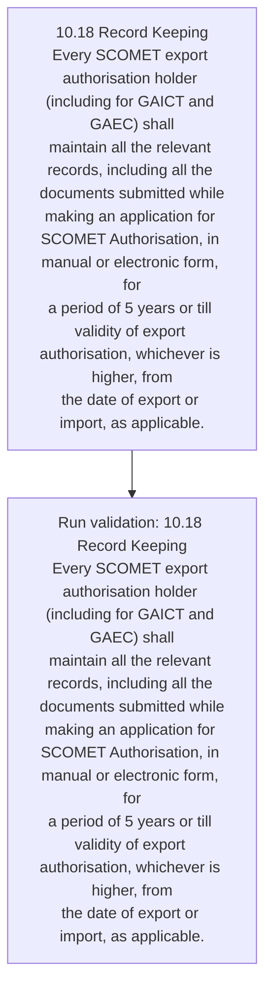
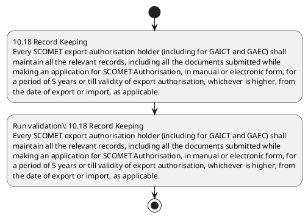

# Chapter 10 / Section 10.18: Record Keeping

**Chapter Title:** SCOMET: Special Chemicals, Organisms, Materials, Equipment and Technologies

**Pages:** 43

**Purpose:** 10.18 Record Keeping
Every SCOMET export authorisation holder (including for GAICT and GAEC) shall
maintain all the relevant records, including all the documents submitted while
making an application for SCOMET Authorisation, in manual or electronic form, for
a period of 5 years or till validity of export authorisation, whichever is higher, from
the date of export or import, as applicable.

**Purpose Thanglish:** Indha Record Keeping section-la, 10.18 Record Keeping
Every SCOMET export authorisation holder (including for GAICT and GAEC) kandippa
maintain all the relevant records, including all the documents submitted while
making an application for SCOMET Authorisation, in manual or electronic form, for
a period of 5 years or till validity of export authorisation, whichever is higher, from
the date of export or import, as applicable.

**Summary:** 10.18 Record Keeping
Every SCOMET export authorisation holder (including for GAICT and GAEC) shall
maintain all the relevant records, including all the documents submitted while
making an application for SCOMET Authorisation, in manual or electronic form, for
a period of 5 years or till validity of export authorisation, whichever is higher, from
the date of export or import, as applicable.

**Business Meaning:** Record Keeping governs how DGFT business controls should be applied, validated, and enforced.

**Business Explanation:** Record Keeping explains the operating rule set that DEKAI should enforce. Key control points include 10.18 Record Keeping
Every SCOMET export authorisation holder (including for GAICT and GAEC) shall
maintain all the relevant records, including all the documents submitted while
making an application for SCOMET Authorisation, in manual or electronic form, for
a period of 5 years or till validity of export authorisation, whichever is higher, from
the date of export or import, as applicable. The section also drives actions such as 10.18 Record Keeping
Every SCOMET export authorisation holder (including for GAICT and GAEC) shall
maintain all the relevant records, including all the documents submitted while
making an application for SCOMET Authorisation, in manual or electronic form, for
a period of 5 years or till validity of export authorisation, whichever is higher, from
the date of export or import, as applicable..

**Business Explanation Thanglish:** Indha Record Keeping section-la, Record Keeping explains the operating rule set that DEKAI should enforce. Key control points include 10.18 Record Keeping
Every SCOMET export authorisation holder (including for GAICT and GAEC) kandippa
maintain all the relevant records, including all the documents submitted while
making an application for SCOMET Authorisation, in manual or electronic form, for
a period of 5 years or till validity of export authorisation, whichever is higher, from
the date of export or import, as applicable. The section also drives actions such as 10.18 Record Keeping
Every SCOMET export authorisation holder (including for GAICT and GAEC) kandippa
maintain all the relevant records, including all the documents submitted while
making an application for SCOMET Authorisation, in manual or electronic form, for
a period of 5 years or till validity of export authorisation, whichever is higher, from
the date of export or import, as applicable..

## Business Logic
- 10.18 Record Keeping
Every SCOMET export authorisation holder (including for GAICT and GAEC) shall
maintain all the relevant records, including all the documents submitted while
making an application for SCOMET Authorisation, in manual or electronic form, for
a period of 5 years or till validity of export authorisation, whichever is higher, from
the date of export or import, as applicable.

## Business Rules
- rule_id=CH10-SEC10_18-R001, rule_description=10.18 Record Keeping
Every SCOMET export authorisation holder (including for GAICT and GAEC) shall
maintain all the relevant records, including all the documents submitted while
making an application for SCOMET Authorisation, in manual or electronic form, for
a period of 5 years or till validity of export authorisation, whichever is higher, from
the date of export or import, as applicable., trigger=Record Keeping, condition=Section 10.18 is applicable, validation=10.18 Record Keeping
Every SCOMET export authorisation holder (including for GAICT and GAEC) shall
maintain all the relevant records, including all the documents submitted while
making an application for SCOMET Authorisation, in manual or electronic form, for
a period of 5 years or till validity of export authorisation, whichever is higher, from
the date of export or import, as applicable., action=10.18 Record Keeping
Every SCOMET export authorisation holder (including for GAICT and GAEC) shall
maintain all the relevant records, including all the documents submitted while
making an application for SCOMET Authorisation, in manual or electronic form, for
a period of 5 years or till validity of export authorisation, whichever is higher, from
the date of export or import, as applicable., exception=No explicit exception found in uploaded documents., output=DEKAI should produce a compliance decision for 10.18 - Record Keeping.

## Conditions
- None identified

## Condition Logic
- id=10.10.18.1, if=Section 10.18 is applicable, then=10.18 Record Keeping
Every SCOMET export authorisation holder (including for GAICT and GAEC) shall
maintain all the relevant records, including all the documents submitted while
making an application for SCOMET Authorisation, in manual or electronic form, for
a period of 5 years or till validity of export authorisation, whichever is higher, from
the date of export or import, as applicable., source=Derived from uploaded documents

## Validations
- 10.18 Record Keeping
Every SCOMET export authorisation holder (including for GAICT and GAEC) shall
maintain all the relevant records, including all the documents submitted while
making an application for SCOMET Authorisation, in manual or electronic form, for
a period of 5 years or till validity of export authorisation, whichever is higher, from
the date of export or import, as applicable.

## Exceptions
- None identified

## Dependencies
- None identified

## Authorities
- None identified

## Required Documents
- 10.18 Record Keeping
Every SCOMET export authorisation holder (including for GAICT and GAEC) shall
maintain all the relevant records, including all the documents submitted while
making an application for SCOMET Authorisation, in manual or electronic form, for
a period of 5 years or till validity of export authorisation, whichever is higher, from
the date of export or import, as applicable.

## Timelines
- 10.18 Record Keeping
Every SCOMET export authorisation holder (including for GAICT and GAEC) shall
maintain all the relevant records, including all the documents submitted while
making an application for SCOMET Authorisation, in manual or electronic form, for
a period of 5 years or till validity of export authorisation, whichever is higher, from
the date of export or import, as applicable.

## Actions
- 10.18 Record Keeping
Every SCOMET export authorisation holder (including for GAICT and GAEC) shall
maintain all the relevant records, including all the documents submitted while
making an application for SCOMET Authorisation, in manual or electronic form, for
a period of 5 years or till validity of export authorisation, whichever is higher, from
the date of export or import, as applicable.

## Workflow
- 10.18 Record Keeping
Every SCOMET export authorisation holder (including for GAICT and GAEC) shall
maintain all the relevant records, including all the documents submitted while
making an application for SCOMET Authorisation, in manual or electronic form, for
a period of 5 years or till validity of export authorisation, whichever is higher, from
the date of export or import, as applicable.
- Run validation: 10.18 Record Keeping
Every SCOMET export authorisation holder (including for GAICT and GAEC) shall
maintain all the relevant records, including all the documents submitted while
making an application for SCOMET Authorisation, in manual or electronic form, for
a period of 5 years or till validity of export authorisation, whichever is higher, from
the date of export or import, as applicable.

## Workflow ASCII
```text
Record Keeping
10.18 Record Keeping
Every SCOMET export authorisation holder (including for GAICT and GAEC) shall
maintain all the relevant records, including all the documents submitted while
making an application for SCOMET Authorisation, in manual or electronic form, for
a period of 5 years or till validity of export authorisation, whichever is higher, from
the date of export or import, as applicable.
   |
   v
Run validation: 10.18 Record Keeping
Every SCOMET export authorisation holder (including for GAICT and GAEC) shall
maintain all the relevant records, including all the documents submitted while
making an application for SCOMET Authorisation, in manual or electronic form, for
a period of 5 years or till validity of export authorisation, whichever is higher, from
the date of export or import, as applicable.
```

## Decision Tree
- IF section 10.18 applies THEN 10.18 Record Keeping
Every SCOMET export authorisation holder (including for GAICT and GAEC) shall
maintain all the relevant records, including all the documents submitted while
making an application for SCOMET Authorisation, in manual or electronic form, for
a period of 5 years or till validity of export authorisation, whichever is higher, from
the date of export or import, as applicable.

## Decision Tree ASCII
```text
Record Keeping Decision
IF section 10.18 applies THEN 10.18 Record Keeping
Every SCOMET export authorisation holder (including for GAICT and GAEC) shall
maintain all the relevant records, including all the documents submitted while
making an application for SCOMET Authorisation, in manual or electronic form, for
a period of 5 years or till validity of export authorisation, whichever is higher, from
the date of export or import, as applicable.
```

## Examples
- User asks to process Record Keeping; the platform checks conditions, validations, and documents before action.

**Real-world Example:** Example: an importer or exporter invokes Record Keeping, submits 10.18 Record Keeping
Every SCOMET export authorisation holder (including for GAICT and GAEC) shall
maintain all the relevant records, including all the documents submitted while
making an application for SCOMET Authorisation, in manual or electronic form, for
a period of 5 years or till validity of export authorisation, whichever is higher, from
the date of export or import, as applicable., and DEKAI uses the extracted rules to 10.18 record keeping
every scomet export authorisation holder (including for gaict and gaec) shall
maintain all the relevant records, including all the documents submitted while
making an application for scomet authorisation, in manual or electronic form, for
a period of 5 years or till validity of export authorisation, whichever is higher, from
the date of export or import, as applicable..

**Real-world Example Thanglish:** Indha Record Keeping section-la, Example: an importer or exporter invokes Record Keeping, submits 10.18 Record Keeping
Every SCOMET export authorisation holder (including for GAICT and GAEC) kandippa
maintain all the relevant records, including all the documents submitted while
making an application for SCOMET Authorisation, in manual or electronic form, for
a period of 5 years or till validity of export authorisation, whichever is higher, from
the date of export or import, as applicable., and DEKAI uses the extracted rules to 10.18 record keeping
every scomet export authorisation holder (including for gaict and gaec) kandippa
maintain all the relevant records, including all the documents submitted while
making an application for scomet authorisation, in manual or electronic form, for
a period of 5 years or till validity of export authorisation, whichever is higher, from
the date of export or import, as applicable..

## AI Rules
- IF detected context matches section rule THEN enforce: 10.18 Record Keeping
Every SCOMET export authorisation holder (including for GAICT and GAEC) shall
maintain all the relevant records, including all the documents submitted while
making an application for SCOMET Authorisation, in manual or electronic form, for
a period of 5 years or till validity of export authorisation, whichever is higher, from
the date of export or import, as applicable.
- IF validations pass THEN recommend action: 10.18 Record Keeping
Every SCOMET export authorisation holder (including for GAICT and GAEC) shall
maintain all the relevant records, including all the documents submitted while
making an application for SCOMET Authorisation, in manual or electronic form, for
a period of 5 years or till validity of export authorisation, whichever is higher, from
the date of export or import, as applicable.

## Database Fields
- name=section_code, type=string, required=True, source=parsed_section_heading
- name=section_title, type=string, required=True, source=parsed_section_heading
- name=for_flag, type=boolean, required=False, source=keyword:for
- name=and_flag, type=boolean, required=False, source=keyword:and
- name=all_flag, type=boolean, required=False, source=keyword:all
- name=the_flag, type=boolean, required=False, source=keyword:the
- name=gaec_flag, type=boolean, required=False, source=keyword:GAEC
- name=form_flag, type=boolean, required=False, source=keyword:form
- name=till_flag, type=boolean, required=False, source=keyword:till
- name=from_flag, type=boolean, required=False, source=keyword:from
- name=document_1_submitted, type=boolean, required=True, source=10.18 Record Keeping
Every SCOMET export authorisation holder (including for GAICT and GAEC) shall
maintain all the relevant records, including all the documents submitted while
making an application for SCOMET Authorisation, in manual or electronic form, for
a period of 5 years or till validity of export authorisation, whichever is higher, from
the date of export or import, as applicable.

## API Requirements
- method=GET, path=/api/dgft/sections/10.18, purpose=Retrieve knowledge payload for section 10.18, query_params=['include=workflow,decision_tree,validations'], response_fields=['section', 'title', 'summary', 'conditions', 'validations', 'exceptions', 'workflow', 'decision_tree']
- method=POST, path=/api/dgft/Record-Keeping/validate, purpose=Validate inputs and documents for Record Keeping, request_fields=['section_code', 'section_title', 'document_1_submitted'], response_fields=['status', 'errors', 'warnings', 'next_actions']
- method=POST, path=/api/dgft/Record-Keeping/execute, purpose=Trigger business action for 10.18 Record Keeping
Every SCOMET export authorisation holder (including for GAICT and GAEC) shall
maintain all the relevant records, including all the documents submitted while
making an application for SCOMET Authorisation, in manual or electronic form, for
a period of 5 years or till validity of export authorisation, whichever is higher, from
the date of export or import, as applicable., request_fields=['section_code', 'section_title', 'document_1_submitted'], response_fields=['reference_id', 'status', 'authority', 'timeline']

## UI Screens
- screen_id=Record_Keeping_overview, name=Record Keeping Overview, purpose=Show section summary, authority, timeline, and eligibility cues., widgets=['summary_card', 'conditions_table', 'authority_badges', 'timeline_panel']
- screen_id=Record_Keeping_submission, name=Record Keeping Submission, purpose=Capture applicant data and supporting documents., widgets=['dynamic_form', 'document_uploader', 'validation_panel', 'next_action_footer'], fields=['section_code', 'section_title', 'for_flag', 'and_flag', 'all_flag', 'the_flag', 'gaec_flag', 'form_flag']

## Error Messages
- Validation failed because the section requirements were not fully met.

## FAQ
- question_en=What is the purpose of section 10.18?, answer_en=Record Keeping explains the operating rule set that DEKAI should enforce. Key control points include 10.18 Record Keeping
Every SCOMET export authorisation holder (including for GAICT and GAEC) shall
maintain all the relevant records, including all the documents submitted while
making an application for SCOMET Authorisation, in manual or electronic form, for
a period of 5 years or till validity of export authorisation, whichever is higher, from
the date of export or import, as applicable. The section also drives actions such as 10.18 Record Keeping
Every SCOMET export authorisation holder (including for GAICT and GAEC) shall
maintain all the relevant records, including all the documents submitted while
making an application for SCOMET Authorisation, in manual or electronic form, for
a period of 5 years or till validity of export authorisation, whichever is higher, from
the date of export or import, as applicable.., question_thanglish=Indha Record Keeping section-la, What is the purpose of section 10.18?, answer_thanglish=Indha Record Keeping section-la, Record Keeping explains the operating rule set that DEKAI should enforce. Key control points include 10.18 Record Keeping
Every SCOMET export authorisation holder (including for GAICT and GAEC) kandippa
maintain all the relevant records, including all the documents submitted while
making an application for SCOMET Authorisation, in manual or electronic form, for
a period of 5 years or till validity of export authorisation, whichever is higher, from
the date of export or import, as applicable. The section also drives actions such as 10.18 Record Keeping
Every SCOMET export authorisation holder (including for GAICT and GAEC) kandippa
maintain all the relevant records, including all the documents submitted while
making an application for SCOMET Authorisation, in manual or electronic form, for
a period of 5 years or till validity of export authorisation, whichever is higher, from
the date of export or import, as applicable..
- question_en=What documents are required under Record Keeping?, answer_en=10.18 Record Keeping
Every SCOMET export authorisation holder (including for GAICT and GAEC) shall
maintain all the relevant records, including all the documents submitted while
making an application for SCOMET Authorisation, in manual or electronic form, for
a period of 5 years or till validity of export authorisation, whichever is higher, from
the date of export or import, as applicable., question_thanglish=Indha Record Keeping section-la, What documents are required under Record Keeping?, answer_thanglish=Indha Record Keeping section-la, 10.18 Record Keeping
Every SCOMET export authorisation holder (including for GAICT and GAEC) kandippa
maintain all the relevant records, including all the documents submitted while
making an application for SCOMET Authorisation, in manual or electronic form, for
a period of 5 years or till validity of export authorisation, whichever is higher, from
the date of export or import, as applicable.
- question_en=Which authority handles Record Keeping?, answer_en=Not explicitly covered in uploaded documents., question_thanglish=Indha Record Keeping section-la, Which authority handles Record Keeping?, answer_thanglish=Indha Record Keeping section-la, Not explicitly covered in uploaded documents.

## Questions Users May Ask
- What does Record Keeping require?
- Which documents are needed for Record Keeping?
- How does DEKAI validate Record Keeping requests?
- What action should be taken for Record Keeping?

## Expected AI Answers
- Record Keeping requires the platform to interpret the section text, apply the extracted business rules, and present the correct next action.
- Required documents are inferred from the section text: 10.18 Record Keeping
Every SCOMET export authorisation holder (including for GAICT and GAEC) shall
maintain all the relevant records, including all the documents submitted while
making an application for SCOMET Authorisation, in manual or electronic form, for
a period of 5 years or till validity of export authorisation, whichever is higher, from
the date of export or import, as applicable.
- DEKAI validates Record Keeping by checking conditions, required documents, authority references, and exception clauses before recommending an outcome.
- The primary extracted action is: 10.18 Record Keeping
Every SCOMET export authorisation holder (including for GAICT and GAEC) shall
maintain all the relevant records, including all the documents submitted while
making an application for SCOMET Authorisation, in manual or electronic form, for
a period of 5 years or till validity of export authorisation, whichever is higher, from
the date of export or import, as applicable.

## AI Q&A Examples
- question_en=User asks: How do I comply with Record Keeping?, answer_en=AI answers: DEKAI should evaluate section 10.18, apply the extracted rules, and guide the user through 10.18 Record Keeping
Every SCOMET export authorisation holder (including for GAICT and GAEC) shall
maintain all the relevant records, including all the documents submitted while
making an application for SCOMET Authorisation, in manual or electronic form, for
a period of 5 years or till validity of export authorisation, whichever is higher, from
the date of export or import, as applicable.., question_thanglish=Indha Record Keeping section-la, User asks: How do I comply with Record Keeping?, answer_thanglish=Indha Record Keeping section-la, AI answers: DEKAI should evaluate section 10.18, apply the extracted rules, and guide the user through 10.18 Record Keeping
Every SCOMET export authorisation holder (including for GAICT and GAEC) kandippa
maintain all the relevant records, including all the documents submitted while
making an application for SCOMET Authorisation, in manual or electronic form, for
a period of 5 years or till validity of export authorisation, whichever is higher, from
the date of export or import, as applicable..
- question_en=User asks: Which validations apply to Record Keeping?, answer_en=AI answers: Applicable validations are 10.18 Record Keeping
Every SCOMET export authorisation holder (including for GAICT and GAEC) shall
maintain all the relevant records, including all the documents submitted while
making an application for SCOMET Authorisation, in manual or electronic form, for
a period of 5 years or till validity of export authorisation, whichever is higher, from
the date of export or import, as applicable., question_thanglish=Indha Record Keeping section-la, User asks: Which validations apply to Record Keeping?, answer_thanglish=Indha Record Keeping section-la, AI answers: Applicable validations are 10.18 Record Keeping
Every SCOMET export authorisation holder (including for GAICT and GAEC) kandippa
maintain all the relevant records, including all the documents submitted while
making an application for SCOMET Authorisation, in manual or electronic form, for
a period of 5 years or till validity of export authorisation, whichever is higher, from
the date of export or import, as applicable.

## DEKAI AI Implementation Notes
- Capture chapter 10, section 10.18, title, and page references as immutable knowledge metadata.
- Bind validations for Record Keeping into a rule engine keyed by the rule IDs extracted for this section.
- Expose document upload controls for: 10.18 Record Keeping
Every SCOMET export authorisation holder (including for GAICT and GAEC) shall
maintain all the relevant records, including all the documents submitted while
making an application for SCOMET Authorisation, in manual or electronic form, for
a period of 5 years or till validity of export authorisation, whichever is higher, from
the date of export or import, as applicable..

## DEKAI AI Implementation Notes Thanglish
- Indha Record Keeping section-la, Capture chapter 10, section 10.18, title, and page references as immutable knowledge metadata.
- Indha Record Keeping section-la, Bind validations for Record Keeping into a rule engine keyed by the rule IDs extracted for this section.
- Indha Record Keeping section-la, Expose document upload controls for: 10.18 Record Keeping
Every SCOMET export authorisation holder (including for GAICT and GAEC) kandippa
maintain all the relevant records, including all the documents submitted while
making an application for SCOMET Authorisation, in manual or electronic form, for
a period of 5 years or till validity of export authorisation, whichever is higher, from
the date of export or import, as applicable..

## AI Metadata
- Keywords: for, and, all, the, GAEC, form, till, from, date, Every, GAICT, shall, while, years, Record, SCOMET, export, holder, making, manual
- Search Keywords: for, and, all, the, GAEC, form, till, from, date, Every, GAICT, shall, while, years, Record, SCOMET, export, holder, making, manual
- Intent: Support Record Keeping processing and compliance validation.
- Tags: 10.18, Record Keeping, business-rule, document-driven, dgft
- Related Sections: 
- Related Chapters: 
- Related Rules: 10.18 Record Keeping
Every SCOMET export authorisation holder (including for GAICT and GAEC) shall
maintain all the relevant records, including all the documents submitted while
making an application for SCOMET Authorisation, in manual or electronic form, for
a period of 5 years or till validity of export authorisation, whichever is higher, from
the date of export or import, as applicable.

## Mermaid


## PlantUML

