# Chapter 10 / Section 10.19: Voluntary Self Disclosure of export of dual use items

**Chapter Title:** SCOMET: Special Chemicals, Organisms, Materials, Equipment and Technologies

**Pages:** 43, 44, 45, 46

**Purpose:** 10.19 Voluntary Self Disclosure of export of dual use items
DGFT encourages voluntary self disclosures of failure to comply with the export
control provisions, and supports raising awareness among exporters to avoid any
incidents of non-compliance.

**Purpose Thanglish:** Indha Voluntary Self Disclosure of export of dual use items section-la, 10.19 Voluntary Self Disclosure of export of dual use items
DGFT encourages voluntary self disclosures of failure to comply with the export
control provisions, and supports raising awareness among exporters to avoid any
incidents of non-compliance.

**Summary:** 10.19 Voluntary Self Disclosure of export of dual use items
DGFT encourages voluntary self disclosures of failure to comply with the export
control provisions, and supports raising awareness among exporters to avoid any
incidents of non-compliance. In case, any exporter fails to comply with the export
control provisions of the FTDR Act, WMD Act, Customs Act, or any regulation
related to SCOMET, or SCOMET authorisation on export controls issued by DGFT,
a voluntary self disclosure request along with the supporting documents shall
be sent to the SCOMET Division of DGFT (Hqrs), New Delhi, through e-mail
(scomet-dgft@nic.in) immediately after an export violation is discovered. The IMWG may consider each case on merit in accordance with the provisions of
the Export and Import Policy determined by the Central Government from time to
time under the Foreign Trade (Development and Regulation) Act 1992 and the
orders issued thereunder, and may make recommendations on further action to
be taken by DGFT in the specific case(s).

**Business Meaning:** Voluntary Self Disclosure of export of dual use items governs how DGFT business controls should be applied, validated, and enforced.

**Business Explanation:** Voluntary Self Disclosure of export of dual use items explains the operating rule set that DEKAI should enforce. Key control points include In case, any exporter fails to comply with the export
control provisions of the FTDR Act, WMD Act, Customs Act, or any regulation
related to SCOMET, or SCOMET authorisation on export controls issued by DGFT,
a voluntary self disclosure request along with the supporting documents shall
be sent to the SCOMET Division of DGFT (Hqrs), New Delhi, through e-mail
(scomet-dgft@nic.in) immediately after an export violation is discovered. The section also drives actions such as In case, any exporter fails to comply with the export
control provisions of the FTDR Act, WMD Act, Customs Act, or any regulation
related to SCOMET, or SCOMET authorisation on export controls issued by DGFT,
a voluntary self disclosure request along with the supporting documents shall
be sent to the SCOMET Division of DGFT (Hqrs), New Delhi, through e-mail
(scomet-dgft@nic.in) immediately after an export violation is discovered..

**Business Explanation Thanglish:** Indha Voluntary Self Disclosure of export of dual use items section-la, Voluntary Self Disclosure of export of dual use items explains the operating rule set that DEKAI should enforce. Key control points include In case, any exporter fails to comply with the export
control provisions of the FTDR Act, WMD Act, Customs Act, or any regulation
related to SCOMET, or SCOMET authorisation on export controls issued by DGFT,
a voluntary self disclosure request along with the supporting documents kandippa
be sent to the SCOMET Division of DGFT (Hqrs), New Delhi, through e-mail
(scomet-dgft@nic.in) immediately after an export violation is discovered. The section also drives actions such as In case, any exporter fails to comply with the export
control provisions of the FTDR Act, WMD Act, Customs Act, or any regulation
related to SCOMET, or SCOMET authorisation on export controls issued by DGFT,
a voluntary self disclosure request along with the supporting documents kandippa
be sent to the SCOMET Division of DGFT (Hqrs), New Delhi, through e-mail
(scomet-dgft@nic.in) immediately after an export violation is discovered..

## Business Logic
- In case, any exporter fails to comply with the export
control provisions of the FTDR Act, WMD Act, Customs Act, or any regulation
related to SCOMET, or SCOMET authorisation on export controls issued by DGFT,
a voluntary self disclosure request along with the supporting documents shall
be sent to the SCOMET Division of DGFT (Hqrs), New Delhi, through e-mail
(scomet-dgft@nic.in) immediately after an export violation is discovered.
- | SCOMET
Authorisation
Issued under
GAEIS Policy | GAEIS issued for export / re-export of SCOMET items
under the above Categories / Sub Categories shall be valid
for Three years from the date of issue of GAEIS subject to
subsequent post reporting(s) on quarterly basis to be
reported within 30 days from the last quarter
pg.
- SCOMET
Authorisation
Issued under
GAEIS Policy
GAEIS issued for export / re-export of SCOMET items
under the above Categories / Sub Categories shall be valid
for Three years from the date of issue of GAEIS subject to
subsequent post reporting(s) on quarterly basis to be
reported within 30 days from the last quarter
10.18
Record Keeping
Every SCOMET export authorisation holder (including for GAICT and GAEC) shall
maintain all the relevant records, including all the documents submitted while
making an application for SCOMET Authorisation, in manual or electronic form, for
a period of 5 years or till validity of export authorisation, whichever is higher, from
the date of export or import, as applicable.
- The Inter-Ministerial Working Group (IMWG) in DGFT constituted for considering
the applications for export of SCOMET items may consider a voluntary disclosure
as a mitigating factor in determining the administrative penalties, if any, that
should be imposed.
- Voluntary Disclosure for non-compliance shall not cover the cases for non-
compliance or violations for items falling under SCOMET Category 0 and under
CWC Schedules (SCOMET Categories 1A, 1B, & 1C).
- The IMWG will consider whether ‘voluntary disclosure,’ in the
context of other relevant information in a particular case, should be a mitigating
factor in determining, if any, administrative action will be imposed.
- Any individual/firm should initially notify the Directorate General of Foreign
Trade (DGFT) immediately after an export violation is discovered and
confirmed internally, and then conduct a thorough review of all such trade
activities where a violation is suspected.
- The Indian exporter must submit all
the relevant details of such violation (in Appendix 10O) to SCOMET Division,
DGFT (Hqrs), Vanjiya Bhawan, New Delhi, via E-mail at scomet-dgft@nic.in
ii.
- If there is confirmation from the relevant enforcement agencies such as
Customs or through other sources regarding such violation by the exporting
entity or individual, a show cause notice shall be issued by SCOMET Cell, DGFT
to the applicant firm.
- A full disclosure along with all the necessary documents
must be submitted within 30 days or the extended time as may be specified.
- The written disclosure by the firm should be
accompanied by a covering letter (on the letterhead) signed by a senior officer(
not below the rank of export compliance manager or equivalent designation) with
the following documents:
a.
- Action by the DGFT:
All voluntary disclosure cases shall be placed by DGFT before the IMWG, in its
subsequent meeting for discussion after submission of all complete and
supporting documentation by the exporter.
- The firm shall be liable for action in accordance with the
FT(D&R) Act, the Rules and Orders made there under, the Foreign Trade
Policy (FTP), and any other applicable laws and regulations.

## Business Rules
- rule_id=CH10-SEC10_19-R001, rule_description=In case, any exporter fails to comply with the export
control provisions of the FTDR Act, WMD Act, Customs Act, or any regulation
related to SCOMET, or SCOMET authorisation on export controls issued by DGFT,
a voluntary self disclosure request along with the supporting documents shall
be sent to the SCOMET Division of DGFT (Hqrs), New Delhi, through e-mail
(scomet-dgft@nic.in) immediately after an export violation is discovered., trigger=Voluntary Self Disclosure of export of dual use items, condition=In case, any exporter fails to comply with the export
control provisions of the FTDR Act, WMD Act, Customs Act, or any regulation
related to SCOMET, or SCOMET authorisation on export controls issued by DGFT,
a voluntary self disclosure request along with the supporting documents shall
be sent to the SCOMET Division of DGFT (Hqrs), New Delhi, through e-mail
(scomet-dgft@nic.in) immediately after an export violation is discovered., validation=In case, any exporter fails to comply with the export
control provisions of the FTDR Act, WMD Act, Customs Act, or any regulation
related to SCOMET, or SCOMET authorisation on export controls issued by DGFT,
a voluntary self disclosure request along with the supporting documents shall
be sent to the SCOMET Division of DGFT (Hqrs), New Delhi, through e-mail
(scomet-dgft@nic.in) immediately after an export violation is discovered., action=In case, any exporter fails to comply with the export
control provisions of the FTDR Act, WMD Act, Customs Act, or any regulation
related to SCOMET, or SCOMET authorisation on export controls issued by DGFT,
a voluntary self disclosure request along with the supporting documents shall
be sent to the SCOMET Division of DGFT (Hqrs), New Delhi, through e-mail
(scomet-dgft@nic.in) immediately after an export violation is discovered., exception=No explicit exception found in uploaded documents., output=DEKAI should produce a compliance decision for 10.19 - Voluntary Self Disclosure of export of dual use items.
- rule_id=CH10-SEC10_19-R002, rule_description=| SCOMET
Authorisation
Issued under
GAEIS Policy | GAEIS issued for export / re-export of SCOMET items
under the above Categories / Sub Categories shall be valid
for Three years from the date of issue of GAEIS subject to
subsequent post reporting(s) on quarterly basis to be
reported within 30 days from the last quarter
pg., trigger=Voluntary Self Disclosure of export of dual use items, condition=The IMWG may consider each case on merit in accordance with the provisions of
the Export and Import Policy determined by the Central Government from time to
time under the Foreign Trade (Development and Regulation) Act 1992 and the
orders issued thereunder, and may make recommendations on further action to
be taken by DGFT in the specific case(s)., validation=| SCOMET
Authorisation
Issued under
GAEIS Policy | GAEIS issued for export / re-export of SCOMET items
under the above Categories / Sub Categories shall be valid
for Three years from the date of issue of GAEIS subject to
subsequent post reporting(s) on quarterly basis to be
reported within 30 days from the last quarter
pg., action=The IMWG may consider each case on merit in accordance with the provisions of
the Export and Import Policy determined by the Central Government from time to
time under the Foreign Trade (Development and Regulation) Act 1992 and the
orders issued thereunder, and may make recommendations on further action to
be taken by DGFT in the specific case(s)., exception=No explicit exception found in uploaded documents., output=DEKAI should produce a compliance decision for 10.19 - Voluntary Self Disclosure of export of dual use items.
- rule_id=CH10-SEC10_19-R003, rule_description=SCOMET
Authorisation
Issued under
GAEIS Policy
GAEIS issued for export / re-export of SCOMET items
under the above Categories / Sub Categories shall be valid
for Three years from the date of issue of GAEIS subject to
subsequent post reporting(s) on quarterly basis to be
reported within 30 days from the last quarter
10.18
Record Keeping
Every SCOMET export authorisation holder (including for GAICT and GAEC) shall
maintain all the relevant records, including all the documents submitted while
making an application for SCOMET Authorisation, in manual or electronic form, for
a period of 5 years or till validity of export authorisation, whichever is higher, from
the date of export or import, as applicable., trigger=Voluntary Self Disclosure of export of dual use items, condition=Exporter is liable for strict action under the provisions of the FTDR Act for any
violation of SCOMET policy brought to the notice of DGFT in cases other than
voluntary self disclosure., validation=SCOMET
Authorisation
Issued under
GAEIS Policy
GAEIS issued for export / re-export of SCOMET items
under the above Categories / Sub Categories shall be valid
for Three years from the date of issue of GAEIS subject to
subsequent post reporting(s) on quarterly basis to be
reported within 30 days from the last quarter
10.18
Record Keeping
Every SCOMET export authorisation holder (including for GAICT and GAEC) shall
maintain all the relevant records, including all the documents submitted while
making an application for SCOMET Authorisation, in manual or electronic form, for
a period of 5 years or till validity of export authorisation, whichever is higher, from
the date of export or import, as applicable., action=or license/authorization on export controls issued by DGFT., exception=No explicit exception found in uploaded documents., output=DEKAI should produce a compliance decision for 10.19 - Voluntary Self Disclosure of export of dual use items.
- rule_id=CH10-SEC10_19-R004, rule_description=The Inter-Ministerial Working Group (IMWG) in DGFT constituted for considering
the applications for export of SCOMET items may consider a voluntary disclosure
as a mitigating factor in determining the administrative penalties, if any, that
should be imposed., trigger=Voluntary Self Disclosure of export of dual use items, condition=Standard Operating Procedure/ Guidelines for Voluntary Disclosure of Non-
Compliance/ Violations related to Export of SCOMET Items and SCOMET
Regulations
Scope:
The Directorate General of Foreign Trade (DGFT) recognizes that there may be
occasions where responsible exporters, did not comply with the export control
provisions of the Foreign Trade (Development and Regulation) Act, the Weapons
of Mass Destruction and their Delivery Systems (Prohibition of Unlawful
Activities) Act, the Customs Act, or any other relevant law, regulation, order, etc., validation=Voluntary Disclosure for non-compliance shall not cover the cases for non-
compliance or violations for items falling under SCOMET Category 0 and under
CWC Schedules (SCOMET Categories 1A, 1B, & 1C)., action=| SCOMET
Authorisation
Issued under
GAEIS Policy | GAEIS issued for export / re-export of SCOMET items
under the above Categories / Sub Categories shall be valid
for Three years from the date of issue of GAEIS subject to
subsequent post reporting(s) on quarterly basis to be
reported within 30 days from the last quarter
pg., exception=No explicit exception found in uploaded documents., output=DEKAI should produce a compliance decision for 10.19 - Voluntary Self Disclosure of export of dual use items.
- rule_id=CH10-SEC10_19-R005, rule_description=Voluntary Disclosure for non-compliance shall not cover the cases for non-
compliance or violations for items falling under SCOMET Category 0 and under
CWC Schedules (SCOMET Categories 1A, 1B, & 1C)., trigger=Voluntary Self Disclosure of export of dual use items, condition=| SCOMET
Authorisation
Issued under
GAEIS Policy | GAEIS issued for export / re-export of SCOMET items
under the above Categories / Sub Categories shall be valid
for Three years from the date of issue of GAEIS subject to
subsequent post reporting(s) on quarterly basis to be
reported within 30 days from the last quarter
pg., validation=The Indian exporter must submit all
the relevant details of such violation (in Appendix 10O) to SCOMET Division,
DGFT (Hqrs), Vanjiya Bhawan, New Delhi, via E-mail at scomet-dgft@nic.in
ii., action=SCOMET
Authorisation
Issued under
GAEIS Policy
GAEIS issued for export / re-export of SCOMET items
under the above Categories / Sub Categories shall be valid
for Three years from the date of issue of GAEIS subject to
subsequent post reporting(s) on quarterly basis to be
reported within 30 days from the last quarter
10.18
Record Keeping
Every SCOMET export authorisation holder (including for GAICT and GAEC) shall
maintain all the relevant records, including all the documents submitted while
making an application for SCOMET Authorisation, in manual or electronic form, for
a period of 5 years or till validity of export authorisation, whichever is higher, from
the date of export or import, as applicable., exception=No explicit exception found in uploaded documents., output=DEKAI should produce a compliance decision for 10.19 - Voluntary Self Disclosure of export of dual use items.
- rule_id=CH10-SEC10_19-R006, rule_description=The IMWG will consider whether ‘voluntary disclosure,’ in the
context of other relevant information in a particular case, should be a mitigating
factor in determining, if any, administrative action will be imposed., trigger=Voluntary Self Disclosure of export of dual use items, condition=SCOMET
Authorisation
Issued under
GAEIS Policy
GAEIS issued for export / re-export of SCOMET items
under the above Categories / Sub Categories shall be valid
for Three years from the date of issue of GAEIS subject to
subsequent post reporting(s) on quarterly basis to be
reported within 30 days from the last quarter
10.18
Record Keeping
Every SCOMET export authorisation holder (including for GAICT and GAEC) shall
maintain all the relevant records, including all the documents submitted while
making an application for SCOMET Authorisation, in manual or electronic form, for
a period of 5 years or till validity of export authorisation, whichever is higher, from
the date of export or import, as applicable., validation=If there is confirmation from the relevant enforcement agencies such as
Customs or through other sources regarding such violation by the exporting
entity or individual, a show cause notice shall be issued by SCOMET Cell, DGFT
to the applicant firm., action=The IMWG would consider each case on its merit in accordance with the provisions
of the Export and Import Policy determined by the Central Government from time
to time, under the Foreign Trade (Development and Regulation) Act, and the
Orders issued there under., exception=No explicit exception found in uploaded documents., output=DEKAI should produce a compliance decision for 10.19 - Voluntary Self Disclosure of export of dual use items.
- rule_id=CH10-SEC10_19-R007, rule_description=Any individual/firm should initially notify the Directorate General of Foreign
Trade (DGFT) immediately after an export violation is discovered and
confirmed internally, and then conduct a thorough review of all such trade
activities where a violation is suspected., trigger=Voluntary Self Disclosure of export of dual use items, condition=Voluntary disclosures do not involve cases where the exporter applies
for regularization of authorization / post-facto export authorization, on the basis
of communication from the relevant Government of India agencies such as DGFT,
and Customs., validation=A full disclosure along with all the necessary documents
must be submitted within 30 days or the extended time as may be specified., action=Use of an Export authorization issued in the name of an entity, by a new
entity(s) after name change, merger, de-merger etc., exception=No explicit exception found in uploaded documents., output=DEKAI should produce a compliance decision for 10.19 - Voluntary Self Disclosure of export of dual use items.
- rule_id=CH10-SEC10_19-R008, rule_description=The Indian exporter must submit all
the relevant details of such violation (in Appendix 10O) to SCOMET Division,
DGFT (Hqrs), Vanjiya Bhawan, New Delhi, via E-mail at scomet-dgft@nic.in
ii., trigger=Voluntary Self Disclosure of export of dual use items, condition=any, validation=Documents required while filing for Voluntary Disclosure:
The IMWG may consider the following documents for the regularization of exports
made under Voluntary Disclosure., action=without prior
approval/amendment from the licensing authority
v., exception=No explicit exception found in uploaded documents., output=DEKAI should produce a compliance decision for 10.19 - Voluntary Self Disclosure of export of dual use items.
- rule_id=CH10-SEC10_19-R009, rule_description=If there is confirmation from the relevant enforcement agencies such as
Customs or through other sources regarding such violation by the exporting
entity or individual, a show cause notice shall be issued by SCOMET Cell, DGFT
to the applicant firm., trigger=Voluntary Self Disclosure of export of dual use items, condition=Use of an Export authorization issued in the name of an entity, by a new
entity(s) after name change, merger, de-merger etc., validation=Any other relevant documents as may be required
D., action=Failure to obtain permission from the licensing authority by the
company/entity registered or operating in India, which is involved in the
manufacture, processing and use of SCOMET items, for facilitating or
undertaking site visits, on-site verification or access to
records/documentation by foreign organizations either directly or
through an Indian party
vi., exception=No explicit exception found in uploaded documents., output=DEKAI should produce a compliance decision for 10.19 - Voluntary Self Disclosure of export of dual use items.
- rule_id=CH10-SEC10_19-R010, rule_description=A full disclosure along with all the necessary documents
must be submitted within 30 days or the extended time as may be specified., trigger=Voluntary Self Disclosure of export of dual use items, condition=Failure to obtain permission from the licensing authority by the
company/entity registered or operating in India, which is involved in the
manufacture, processing and use of SCOMET items, for facilitating or
undertaking site visits, on-site verification or access to
records/documentation by foreign organizations either directly or
through an Indian party
vi., validation=Action by the DGFT:
All voluntary disclosure cases shall be placed by DGFT before the IMWG, in its
subsequent meeting for discussion after submission of all complete and
supporting documentation by the exporter., action=Failure to comply with reporting, record-keeping requirements, etc., exception=No explicit exception found in uploaded documents., output=DEKAI should produce a compliance decision for 10.19 - Voluntary Self Disclosure of export of dual use items.
- rule_id=CH10-SEC10_19-R011, rule_description=The written disclosure by the firm should be
accompanied by a covering letter (on the letterhead) signed by a senior officer(
not below the rank of export compliance manager or equivalent designation) with
the following documents:
a., trigger=Voluntary Self Disclosure of export of dual use items, condition=Failure to obtain permission from the licensing authority by the
company/entity registered or operating in India, which is involved in the
manufacture, processing and use of SCOMET items, for facilitating or
undertaking
site
visits,
on-site
verification
or
access
to
records/documentation by foreign organizations either directly or
through an Indian party
vi., validation=The firm shall be liable for action in accordance with the
FT(D&R) Act, the Rules and Orders made there under, the Foreign Trade
Policy (FTP), and any other applicable laws and regulations., action=Failure to obtain permission from the licensing authority by the
company/entity registered or operating in India, which is involved in the
manufacture, processing and use of SCOMET items, for facilitating or
undertaking
site
visits,
on-site
verification
or
access
to
records/documentation by foreign organizations either directly or
through an Indian party
vi., exception=No explicit exception found in uploaded documents., output=DEKAI should produce a compliance decision for 10.19 - Voluntary Self Disclosure of export of dual use items.
- rule_id=CH10-SEC10_19-R012, rule_description=Action by the DGFT:
All voluntary disclosure cases shall be placed by DGFT before the IMWG, in its
subsequent meeting for discussion after submission of all complete and
supporting documentation by the exporter., trigger=Voluntary Self Disclosure of export of dual use items, condition=any, validation=The firm shall be liable for action in accordance with the
FT(D&R) Act, the Rules and Orders made there under, the Foreign Trade
Policy (FTP), and any other applicable laws and regulations., action=The Indian exporter must submit all
the relevant details of such violation (in Appendix 10O) to SCOMET Division,
DGFT (Hqrs), Vanjiya Bhawan, New Delhi, via E-mail at scomet-dgft@nic.in
ii., exception=No explicit exception found in uploaded documents., output=DEKAI should produce a compliance decision for 10.19 - Voluntary Self Disclosure of export of dual use items.
- rule_id=CH10-SEC10_19-R013, rule_description=The firm shall be liable for action in accordance with the
FT(D&R) Act, the Rules and Orders made there under, the Foreign Trade
Policy (FTP), and any other applicable laws and regulations., trigger=Voluntary Self Disclosure of export of dual use items, condition=Some of the
other factors the IMWG may consider in case of voluntary disclosure include:
i., validation=The firm shall be liable for action in accordance with the
FT(D&R) Act, the Rules and Orders made there under, the Foreign Trade
Policy (FTP), and any other applicable laws and regulations., action=If there is confirmation from the relevant enforcement agencies such as
Customs or through other sources regarding such violation by the exporting
entity or individual, a show cause notice shall be issued by SCOMET Cell, DGFT
to the applicant firm., exception=No explicit exception found in uploaded documents., output=DEKAI should produce a compliance decision for 10.19 - Voluntary Self Disclosure of export of dual use items.

## Conditions
- In case, any exporter fails to comply with the export
control provisions of the FTDR Act, WMD Act, Customs Act, or any regulation
related to SCOMET, or SCOMET authorisation on export controls issued by DGFT,
a voluntary self disclosure request along with the supporting documents shall
be sent to the SCOMET Division of DGFT (Hqrs), New Delhi, through e-mail
(scomet-dgft@nic.in) immediately after an export violation is discovered.
- The IMWG may consider each case on merit in accordance with the provisions of
the Export and Import Policy determined by the Central Government from time to
time under the Foreign Trade (Development and Regulation) Act 1992 and the
orders issued thereunder, and may make recommendations on further action to
be taken by DGFT in the specific case(s).
- Exporter is liable for strict action under the provisions of the FTDR Act for any
violation of SCOMET policy brought to the notice of DGFT in cases other than
voluntary self disclosure.
- Standard Operating Procedure/ Guidelines for Voluntary Disclosure of Non-
Compliance/ Violations related to Export of SCOMET Items and SCOMET
Regulations
Scope:
The Directorate General of Foreign Trade (DGFT) recognizes that there may be
occasions where responsible exporters, did not comply with the export control
provisions of the Foreign Trade (Development and Regulation) Act, the Weapons
of Mass Destruction and their Delivery Systems (Prohibition of Unlawful
Activities) Act, the Customs Act, or any other relevant law, regulation, order, etc.
- | SCOMET
Authorisation
Issued under
GAEIS Policy | GAEIS issued for export / re-export of SCOMET items
under the above Categories / Sub Categories shall be valid
for Three years from the date of issue of GAEIS subject to
subsequent post reporting(s) on quarterly basis to be
reported within 30 days from the last quarter
pg.
- SCOMET
Authorisation
Issued under
GAEIS Policy
GAEIS issued for export / re-export of SCOMET items
under the above Categories / Sub Categories shall be valid
for Three years from the date of issue of GAEIS subject to
subsequent post reporting(s) on quarterly basis to be
reported within 30 days from the last quarter
10.18
Record Keeping
Every SCOMET export authorisation holder (including for GAICT and GAEC) shall
maintain all the relevant records, including all the documents submitted while
making an application for SCOMET Authorisation, in manual or electronic form, for
a period of 5 years or till validity of export authorisation, whichever is higher, from
the date of export or import, as applicable.
- Voluntary disclosures do not involve cases where the exporter applies
for regularization of authorization / post-facto export authorization, on the basis
of communication from the relevant Government of India agencies such as DGFT,
and Customs.
- The Inter-Ministerial Working Group (IMWG) in DGFT constituted for considering
the applications for export of SCOMET items may consider a voluntary disclosure
as a mitigating factor in determining the administrative penalties, if any, that
should be imposed.
- Use of an Export authorization issued in the name of an entity, by a new
entity(s) after name change, merger, de-merger etc.
- Failure to obtain permission from the licensing authority by the
company/entity registered or operating in India, which is involved in the
manufacture, processing and use of SCOMET items, for facilitating or
undertaking site visits, on-site verification or access to
records/documentation by foreign organizations either directly or
through an Indian party
vi.
- Failure to obtain permission from the licensing authority by the
company/entity registered or operating in India, which is involved in the
manufacture, processing and use of SCOMET items, for facilitating or
undertaking
site
visits,
on-site
verification
or
access
to
records/documentation by foreign organizations either directly or
through an Indian party
vi.
- The IMWG will consider whether ‘voluntary disclosure,’ in the
context of other relevant information in a particular case, should be a mitigating
factor in determining, if any, administrative action will be imposed.
- Some of the
other factors the IMWG may consider in case of voluntary disclosure include:
i.
- Whether the export would have been authorized in the normal course, and
under what conditions (voluntary / forced disclosure) the request for export
authorization has been made by the exporter before DGFT;
ii.
- The degree of cooperation with the ensuing verification/investigation;
v.
- Any individual/firm should initially notify the Directorate General of Foreign
Trade (DGFT) immediately after an export violation is discovered and
confirmed internally, and then conduct a thorough review of all such trade
activities where a violation is suspected.
- If there is confirmation from the relevant enforcement agencies such as
Customs or through other sources regarding such violation by the exporting
entity or individual, a show cause notice shall be issued by SCOMET Cell, DGFT
to the applicant firm.
- A full disclosure along with all the necessary documents
must be submitted within 30 days or the extended time as may be specified.
- Licensing documents (e.g., license applications, export licenses, end-user
certificates/statements, Purchase Order, Contract Agreement, etc.)
d.
- Action by the DGFT:
All voluntary disclosure cases shall be placed by DGFT before the IMWG, in its
subsequent meeting for discussion after submission of all complete and
supporting documentation by the exporter.
- To inform the exporter that no further action is warranted, based on the facts
disclosed, supporting documentation and upon satisfactory review;
ii.
- To issue an Adjudication Order on submission of an adverse report on
proliferation concerns/information, violation of relevant export control laws
and regulations, etc.

## Condition Logic
- id=10.10.19.1, if=In case, any exporter fails to comply with the export
control provisions of the FTDR Act, WMD Act, Customs Act, or any regulation
related to SCOMET, or SCOMET authorisation on export controls issued by DGFT,
a voluntary self disclosure request along with the supporting documents shall
be sent to the SCOMET Division of DGFT (Hqrs), New Delhi, through e-mail
(scomet-dgft@nic.in) immediately after an export violation is discovered., then=In case, any exporter fails to comply with the export
control provisions of the FTDR Act, WMD Act, Customs Act, or any regulation
related to SCOMET, or SCOMET authorisation on export controls issued by DGFT,
a voluntary self disclosure request along with the supporting documents shall
be sent to the SCOMET Division of DGFT (Hqrs), New Delhi, through e-mail
(scomet-dgft@nic.in) immediately after an export violation is discovered., source=In case, any exporter fails to comply with the export
control provisions of the FTDR Act, WMD Act, Customs Act, or any regulation
related to SCOMET, or SCOMET authorisation on export controls issued by DGFT,
a voluntary self disclosure request along with the supporting documents shall
be sent to the SCOMET Division of DGFT (Hqrs), New Delhi, through e-mail
(scomet-dgft@nic.in) immediately after an export violation is discovered.
- id=10.10.19.2, if=The IMWG may consider each case on merit in accordance with the provisions of
the Export and Import Policy determined by the Central Government from time to
time under the Foreign Trade (Development and Regulation) Act 1992 and the
orders issued thereunder, and may make recommendations on further action to
be taken by DGFT in the specific case(s)., then=In case, any exporter fails to comply with the export
control provisions of the FTDR Act, WMD Act, Customs Act, or any regulation
related to SCOMET, or SCOMET authorisation on export controls issued by DGFT,
a voluntary self disclosure request along with the supporting documents shall
be sent to the SCOMET Division of DGFT (Hqrs), New Delhi, through e-mail
(scomet-dgft@nic.in) immediately after an export violation is discovered., source=The IMWG may consider each case on merit in accordance with the provisions of
the Export and Import Policy determined by the Central Government from time to
time under the Foreign Trade (Development and Regulation) Act 1992 and the
orders issued thereunder, and may make recommendations on further action to
be taken by DGFT in the specific case(s).
- id=10.10.19.3, if=Exporter is liable for strict action under the provisions of the FTDR Act for any
violation of SCOMET policy brought to the notice of DGFT in cases other than
voluntary self disclosure., then=In case, any exporter fails to comply with the export
control provisions of the FTDR Act, WMD Act, Customs Act, or any regulation
related to SCOMET, or SCOMET authorisation on export controls issued by DGFT,
a voluntary self disclosure request along with the supporting documents shall
be sent to the SCOMET Division of DGFT (Hqrs), New Delhi, through e-mail
(scomet-dgft@nic.in) immediately after an export violation is discovered., source=Exporter is liable for strict action under the provisions of the FTDR Act for any
violation of SCOMET policy brought to the notice of DGFT in cases other than
voluntary self disclosure.
- id=10.10.19.4, if=Standard Operating Procedure/ Guidelines for Voluntary Disclosure of Non-
Compliance/ Violations related to Export of SCOMET Items and SCOMET
Regulations
Scope:
The Directorate General of Foreign Trade (DGFT) recognizes that there may be
occasions where responsible exporters, did not comply with the export control
provisions of the Foreign Trade (Development and Regulation) Act, the Weapons
of Mass Destruction and their Delivery Systems (Prohibition of Unlawful
Activities) Act, the Customs Act, or any other relevant law, regulation, order, etc., then=In case, any exporter fails to comply with the export
control provisions of the FTDR Act, WMD Act, Customs Act, or any regulation
related to SCOMET, or SCOMET authorisation on export controls issued by DGFT,
a voluntary self disclosure request along with the supporting documents shall
be sent to the SCOMET Division of DGFT (Hqrs), New Delhi, through e-mail
(scomet-dgft@nic.in) immediately after an export violation is discovered., source=Standard Operating Procedure/ Guidelines for Voluntary Disclosure of Non-
Compliance/ Violations related to Export of SCOMET Items and SCOMET
Regulations
Scope:
The Directorate General of Foreign Trade (DGFT) recognizes that there may be
occasions where responsible exporters, did not comply with the export control
provisions of the Foreign Trade (Development and Regulation) Act, the Weapons
of Mass Destruction and their Delivery Systems (Prohibition of Unlawful
Activities) Act, the Customs Act, or any other relevant law, regulation, order, etc.
- id=10.10.19.5, if=| SCOMET
Authorisation
Issued under
GAEIS Policy | GAEIS issued for export / re-export of SCOMET items
under the above Categories / Sub Categories shall be valid
for Three years from the date of issue of GAEIS subject to
subsequent post reporting(s) on quarterly basis to be
reported within 30 days from the last quarter
pg., then=In case, any exporter fails to comply with the export
control provisions of the FTDR Act, WMD Act, Customs Act, or any regulation
related to SCOMET, or SCOMET authorisation on export controls issued by DGFT,
a voluntary self disclosure request along with the supporting documents shall
be sent to the SCOMET Division of DGFT (Hqrs), New Delhi, through e-mail
(scomet-dgft@nic.in) immediately after an export violation is discovered., source=| SCOMET
Authorisation
Issued under
GAEIS Policy | GAEIS issued for export / re-export of SCOMET items
under the above Categories / Sub Categories shall be valid
for Three years from the date of issue of GAEIS subject to
subsequent post reporting(s) on quarterly basis to be
reported within 30 days from the last quarter
pg.
- id=10.10.19.6, if=SCOMET
Authorisation
Issued under
GAEIS Policy
GAEIS issued for export / re-export of SCOMET items
under the above Categories / Sub Categories shall be valid
for Three years from the date of issue of GAEIS subject to
subsequent post reporting(s) on quarterly basis to be
reported within 30 days from the last quarter
10.18
Record Keeping
Every SCOMET export authorisation holder (including for GAICT and GAEC) shall
maintain all the relevant records, including all the documents submitted while
making an application for SCOMET Authorisation, in manual or electronic form, for
a period of 5 years or till validity of export authorisation, whichever is higher, from
the date of export or import, as applicable., then=In case, any exporter fails to comply with the export
control provisions of the FTDR Act, WMD Act, Customs Act, or any regulation
related to SCOMET, or SCOMET authorisation on export controls issued by DGFT,
a voluntary self disclosure request along with the supporting documents shall
be sent to the SCOMET Division of DGFT (Hqrs), New Delhi, through e-mail
(scomet-dgft@nic.in) immediately after an export violation is discovered., source=SCOMET
Authorisation
Issued under
GAEIS Policy
GAEIS issued for export / re-export of SCOMET items
under the above Categories / Sub Categories shall be valid
for Three years from the date of issue of GAEIS subject to
subsequent post reporting(s) on quarterly basis to be
reported within 30 days from the last quarter
10.18
Record Keeping
Every SCOMET export authorisation holder (including for GAICT and GAEC) shall
maintain all the relevant records, including all the documents submitted while
making an application for SCOMET Authorisation, in manual or electronic form, for
a period of 5 years or till validity of export authorisation, whichever is higher, from
the date of export or import, as applicable.
- id=10.10.19.7, if=Voluntary disclosures do not involve cases where the exporter applies
for regularization of authorization / post-facto export authorization, on the basis
of communication from the relevant Government of India agencies such as DGFT,
and Customs., then=In case, any exporter fails to comply with the export
control provisions of the FTDR Act, WMD Act, Customs Act, or any regulation
related to SCOMET, or SCOMET authorisation on export controls issued by DGFT,
a voluntary self disclosure request along with the supporting documents shall
be sent to the SCOMET Division of DGFT (Hqrs), New Delhi, through e-mail
(scomet-dgft@nic.in) immediately after an export violation is discovered., source=Voluntary disclosures do not involve cases where the exporter applies
for regularization of authorization / post-facto export authorization, on the basis
of communication from the relevant Government of India agencies such as DGFT,
and Customs.
- id=10.10.19.8, if=any, then=In case, any exporter fails to comply with the export
control provisions of the FTDR Act, WMD Act, Customs Act, or any regulation
related to SCOMET, or SCOMET authorisation on export controls issued by DGFT,
a voluntary self disclosure request along with the supporting documents shall
be sent to the SCOMET Division of DGFT (Hqrs), New Delhi, through e-mail
(scomet-dgft@nic.in) immediately after an export violation is discovered., source=The Inter-Ministerial Working Group (IMWG) in DGFT constituted for considering
the applications for export of SCOMET items may consider a voluntary disclosure
as a mitigating factor in determining the administrative penalties, if any, that
should be imposed.
- id=10.10.19.9, if=Use of an Export authorization issued in the name of an entity, by a new
entity(s) after name change, merger, de-merger etc., then=In case, any exporter fails to comply with the export
control provisions of the FTDR Act, WMD Act, Customs Act, or any regulation
related to SCOMET, or SCOMET authorisation on export controls issued by DGFT,
a voluntary self disclosure request along with the supporting documents shall
be sent to the SCOMET Division of DGFT (Hqrs), New Delhi, through e-mail
(scomet-dgft@nic.in) immediately after an export violation is discovered., source=Use of an Export authorization issued in the name of an entity, by a new
entity(s) after name change, merger, de-merger etc.
- id=10.10.19.10, if=Failure to obtain permission from the licensing authority by the
company/entity registered or operating in India, which is involved in the
manufacture, processing and use of SCOMET items, for facilitating or
undertaking site visits, on-site verification or access to
records/documentation by foreign organizations either directly or
through an Indian party
vi., then=In case, any exporter fails to comply with the export
control provisions of the FTDR Act, WMD Act, Customs Act, or any regulation
related to SCOMET, or SCOMET authorisation on export controls issued by DGFT,
a voluntary self disclosure request along with the supporting documents shall
be sent to the SCOMET Division of DGFT (Hqrs), New Delhi, through e-mail
(scomet-dgft@nic.in) immediately after an export violation is discovered., source=Failure to obtain permission from the licensing authority by the
company/entity registered or operating in India, which is involved in the
manufacture, processing and use of SCOMET items, for facilitating or
undertaking site visits, on-site verification or access to
records/documentation by foreign organizations either directly or
through an Indian party
vi.
- id=10.10.19.11, if=Failure to obtain permission from the licensing authority by the
company/entity registered or operating in India, which is involved in the
manufacture, processing and use of SCOMET items, for facilitating or
undertaking
site
visits,
on-site
verification
or
access
to
records/documentation by foreign organizations either directly or
through an Indian party
vi., then=In case, any exporter fails to comply with the export
control provisions of the FTDR Act, WMD Act, Customs Act, or any regulation
related to SCOMET, or SCOMET authorisation on export controls issued by DGFT,
a voluntary self disclosure request along with the supporting documents shall
be sent to the SCOMET Division of DGFT (Hqrs), New Delhi, through e-mail
(scomet-dgft@nic.in) immediately after an export violation is discovered., source=Failure to obtain permission from the licensing authority by the
company/entity registered or operating in India, which is involved in the
manufacture, processing and use of SCOMET items, for facilitating or
undertaking
site
visits,
on-site
verification
or
access
to
records/documentation by foreign organizations either directly or
through an Indian party
vi.
- id=10.10.19.12, if=any, then=In case, any exporter fails to comply with the export
control provisions of the FTDR Act, WMD Act, Customs Act, or any regulation
related to SCOMET, or SCOMET authorisation on export controls issued by DGFT,
a voluntary self disclosure request along with the supporting documents shall
be sent to the SCOMET Division of DGFT (Hqrs), New Delhi, through e-mail
(scomet-dgft@nic.in) immediately after an export violation is discovered., source=The IMWG will consider whether ‘voluntary disclosure,’ in the
context of other relevant information in a particular case, should be a mitigating
factor in determining, if any, administrative action will be imposed.
- id=10.10.19.13, if=Some of the
other factors the IMWG may consider in case of voluntary disclosure include:
i., then=In case, any exporter fails to comply with the export
control provisions of the FTDR Act, WMD Act, Customs Act, or any regulation
related to SCOMET, or SCOMET authorisation on export controls issued by DGFT,
a voluntary self disclosure request along with the supporting documents shall
be sent to the SCOMET Division of DGFT (Hqrs), New Delhi, through e-mail
(scomet-dgft@nic.in) immediately after an export violation is discovered., source=Some of the
other factors the IMWG may consider in case of voluntary disclosure include:
i.
- id=10.10.19.14, if=Whether the export would have been authorized in the normal course, and
under what conditions (voluntary / forced disclosure) the request for export
authorization has been made by the exporter before DGFT;
ii., then=In case, any exporter fails to comply with the export
control provisions of the FTDR Act, WMD Act, Customs Act, or any regulation
related to SCOMET, or SCOMET authorisation on export controls issued by DGFT,
a voluntary self disclosure request along with the supporting documents shall
be sent to the SCOMET Division of DGFT (Hqrs), New Delhi, through e-mail
(scomet-dgft@nic.in) immediately after an export violation is discovered., source=Whether the export would have been authorized in the normal course, and
under what conditions (voluntary / forced disclosure) the request for export
authorization has been made by the exporter before DGFT;
ii.
- id=10.10.19.15, if=The degree of cooperation with the ensuing verification/investigation;
v., then=In case, any exporter fails to comply with the export
control provisions of the FTDR Act, WMD Act, Customs Act, or any regulation
related to SCOMET, or SCOMET authorisation on export controls issued by DGFT,
a voluntary self disclosure request along with the supporting documents shall
be sent to the SCOMET Division of DGFT (Hqrs), New Delhi, through e-mail
(scomet-dgft@nic.in) immediately after an export violation is discovered., source=The degree of cooperation with the ensuing verification/investigation;
v.
- id=10.10.19.16, if=Any individual/firm should initially notify the Directorate General of Foreign
Trade (DGFT) immediately after an export violation is discovered and
confirmed internally, and then conduct a thorough review of all such trade
activities where a violation is suspected., then=In case, any exporter fails to comply with the export
control provisions of the FTDR Act, WMD Act, Customs Act, or any regulation
related to SCOMET, or SCOMET authorisation on export controls issued by DGFT,
a voluntary self disclosure request along with the supporting documents shall
be sent to the SCOMET Division of DGFT (Hqrs), New Delhi, through e-mail
(scomet-dgft@nic.in) immediately after an export violation is discovered., source=Any individual/firm should initially notify the Directorate General of Foreign
Trade (DGFT) immediately after an export violation is discovered and
confirmed internally, and then conduct a thorough review of all such trade
activities where a violation is suspected.
- id=10.10.19.17, if=If there is confirmation from the relevant enforcement agencies such as
Customs or through other sources regarding such violation by the exporting
entity or individual, a show cause notice shall be issued by SCOMET Cell, DGFT
to the applicant firm., then=In case, any exporter fails to comply with the export
control provisions of the FTDR Act, WMD Act, Customs Act, or any regulation
related to SCOMET, or SCOMET authorisation on export controls issued by DGFT,
a voluntary self disclosure request along with the supporting documents shall
be sent to the SCOMET Division of DGFT (Hqrs), New Delhi, through e-mail
(scomet-dgft@nic.in) immediately after an export violation is discovered., source=If there is confirmation from the relevant enforcement agencies such as
Customs or through other sources regarding such violation by the exporting
entity or individual, a show cause notice shall be issued by SCOMET Cell, DGFT
to the applicant firm.
- id=10.10.19.18, if=A full disclosure along with all the necessary documents
must be submitted within 30 days or the extended time as may be specified., then=In case, any exporter fails to comply with the export
control provisions of the FTDR Act, WMD Act, Customs Act, or any regulation
related to SCOMET, or SCOMET authorisation on export controls issued by DGFT,
a voluntary self disclosure request along with the supporting documents shall
be sent to the SCOMET Division of DGFT (Hqrs), New Delhi, through e-mail
(scomet-dgft@nic.in) immediately after an export violation is discovered., source=A full disclosure along with all the necessary documents
must be submitted within 30 days or the extended time as may be specified.
- id=10.10.19.19, if=Licensing documents (e.g., license applications, export licenses, end-user
certificates/statements, Purchase Order, Contract Agreement, etc.)
d., then=In case, any exporter fails to comply with the export
control provisions of the FTDR Act, WMD Act, Customs Act, or any regulation
related to SCOMET, or SCOMET authorisation on export controls issued by DGFT,
a voluntary self disclosure request along with the supporting documents shall
be sent to the SCOMET Division of DGFT (Hqrs), New Delhi, through e-mail
(scomet-dgft@nic.in) immediately after an export violation is discovered., source=Licensing documents (e.g., license applications, export licenses, end-user
certificates/statements, Purchase Order, Contract Agreement, etc.)
d.
- id=10.10.19.20, if=Action by the DGFT:
All voluntary disclosure cases shall be placed by DGFT before the IMWG, in its
subsequent meeting for discussion after submission of all complete and
supporting documentation by the exporter., then=In case, any exporter fails to comply with the export
control provisions of the FTDR Act, WMD Act, Customs Act, or any regulation
related to SCOMET, or SCOMET authorisation on export controls issued by DGFT,
a voluntary self disclosure request along with the supporting documents shall
be sent to the SCOMET Division of DGFT (Hqrs), New Delhi, through e-mail
(scomet-dgft@nic.in) immediately after an export violation is discovered., source=Action by the DGFT:
All voluntary disclosure cases shall be placed by DGFT before the IMWG, in its
subsequent meeting for discussion after submission of all complete and
supporting documentation by the exporter.
- id=10.10.19.21, if=To inform the exporter that no further action is warranted, based on the facts
disclosed, supporting documentation and upon satisfactory review;
ii., then=In case, any exporter fails to comply with the export
control provisions of the FTDR Act, WMD Act, Customs Act, or any regulation
related to SCOMET, or SCOMET authorisation on export controls issued by DGFT,
a voluntary self disclosure request along with the supporting documents shall
be sent to the SCOMET Division of DGFT (Hqrs), New Delhi, through e-mail
(scomet-dgft@nic.in) immediately after an export violation is discovered., source=To inform the exporter that no further action is warranted, based on the facts
disclosed, supporting documentation and upon satisfactory review;
ii.
- id=10.10.19.22, if=To issue an Adjudication Order on submission of an adverse report on
proliferation concerns/information, violation of relevant export control laws
and regulations, etc., then=In case, any exporter fails to comply with the export
control provisions of the FTDR Act, WMD Act, Customs Act, or any regulation
related to SCOMET, or SCOMET authorisation on export controls issued by DGFT,
a voluntary self disclosure request along with the supporting documents shall
be sent to the SCOMET Division of DGFT (Hqrs), New Delhi, through e-mail
(scomet-dgft@nic.in) immediately after an export violation is discovered., source=To issue an Adjudication Order on submission of an adverse report on
proliferation concerns/information, violation of relevant export control laws
and regulations, etc.

## Validations
- In case, any exporter fails to comply with the export
control provisions of the FTDR Act, WMD Act, Customs Act, or any regulation
related to SCOMET, or SCOMET authorisation on export controls issued by DGFT,
a voluntary self disclosure request along with the supporting documents shall
be sent to the SCOMET Division of DGFT (Hqrs), New Delhi, through e-mail
(scomet-dgft@nic.in) immediately after an export violation is discovered.
- | SCOMET
Authorisation
Issued under
GAEIS Policy | GAEIS issued for export / re-export of SCOMET items
under the above Categories / Sub Categories shall be valid
for Three years from the date of issue of GAEIS subject to
subsequent post reporting(s) on quarterly basis to be
reported within 30 days from the last quarter
pg.
- SCOMET
Authorisation
Issued under
GAEIS Policy
GAEIS issued for export / re-export of SCOMET items
under the above Categories / Sub Categories shall be valid
for Three years from the date of issue of GAEIS subject to
subsequent post reporting(s) on quarterly basis to be
reported within 30 days from the last quarter
10.18
Record Keeping
Every SCOMET export authorisation holder (including for GAICT and GAEC) shall
maintain all the relevant records, including all the documents submitted while
making an application for SCOMET Authorisation, in manual or electronic form, for
a period of 5 years or till validity of export authorisation, whichever is higher, from
the date of export or import, as applicable.
- Voluntary Disclosure for non-compliance shall not cover the cases for non-
compliance or violations for items falling under SCOMET Category 0 and under
CWC Schedules (SCOMET Categories 1A, 1B, & 1C).
- The Indian exporter must submit all
the relevant details of such violation (in Appendix 10O) to SCOMET Division,
DGFT (Hqrs), Vanjiya Bhawan, New Delhi, via E-mail at scomet-dgft@nic.in
ii.
- If there is confirmation from the relevant enforcement agencies such as
Customs or through other sources regarding such violation by the exporting
entity or individual, a show cause notice shall be issued by SCOMET Cell, DGFT
to the applicant firm.
- A full disclosure along with all the necessary documents
must be submitted within 30 days or the extended time as may be specified.
- Documents required while filing for Voluntary Disclosure:
The IMWG may consider the following documents for the regularization of exports
made under Voluntary Disclosure.
- Any other relevant documents as may be required
D.
- Action by the DGFT:
All voluntary disclosure cases shall be placed by DGFT before the IMWG, in its
subsequent meeting for discussion after submission of all complete and
supporting documentation by the exporter.
- The firm shall be liable for action in accordance with the
FT(D&R) Act, the Rules and Orders made there under, the Foreign Trade
Policy (FTP), and any other applicable laws and regulations.

## Exceptions
- None identified

## Dependencies
- 1
- 2
- 3
- 5
- 7
- 10.18

## Authorities
- DGFT
- Customs
- SCOMET authorisation on export controls issued by DGFT
- SCOMET Division of DGFT
- Central Government
- Export and Import Policy determined by the Central Government
- SCOMET policy brought to the notice of DGFT
- Directorate General of Foreign Trade
- The Directorate General of Foreign Trade (DGFT
- The DGFT
- Government of India agencies such as DGFT
- The Inter-Ministerial Working Group (IMWG) in DGFT
- licensing authority
- Trade (DGFT
- Action by the DGFT
- All voluntary disclosure cases shall be placed by DGFT

## Required Documents
- In case, any exporter fails to comply with the export
control provisions of the FTDR Act, WMD Act, Customs Act, or any regulation
related to SCOMET, or SCOMET authorisation on export controls issued by DGFT,
a voluntary self disclosure request along with the supporting documents shall
be sent to the SCOMET Division of DGFT (Hqrs), New Delhi, through e-mail
(scomet-dgft@nic.in) immediately after an export violation is discovered.
- or license/authorization on export controls issued by DGFT.
- SCOMET
Authorisation
Issued under
GAEIS Policy
GAEIS issued for export / re-export of SCOMET items
under the above Categories / Sub Categories shall be valid
for Three years from the date of issue of GAEIS subject to
subsequent post reporting(s) on quarterly basis to be
reported within 30 days from the last quarter
10.18
Record Keeping
Every SCOMET export authorisation holder (including for GAICT and GAEC) shall
maintain all the relevant records, including all the documents submitted while
making an application for SCOMET Authorisation, in manual or electronic form, for
a period of 5 years or till validity of export authorisation, whichever is higher, from
the date of export or import, as applicable.
- The Inter-Ministerial Working Group (IMWG) in DGFT constituted for considering
the applications for export of SCOMET items may consider a voluntary disclosure
as a mitigating factor in determining the administrative penalties, if any, that
should be imposed.
- Failure to obtain permission from the licensing authority by the
company/entity registered or operating in India, which is involved in the
manufacture, processing and use of SCOMET items, for facilitating or
undertaking site visits, on-site verification or access to
records/documentation by foreign organizations either directly or
through an Indian party
vi.
- Failure to obtain permission from the licensing authority by the
company/entity registered or operating in India, which is involved in the
manufacture, processing and use of SCOMET items, for facilitating or
undertaking
site
visits,
on-site
verification
or
access
to
records/documentation by foreign organizations either directly or
through an Indian party
vi.
- A full disclosure along with all the necessary documents
must be submitted within 30 days or the extended time as may be specified.
- The IMWG would consider each such application on merit within the scope of
applicable laws and regulations.
- Documents required while filing for Voluntary Disclosure:
The IMWG may consider the following documents for the regularization of exports
made under Voluntary Disclosure.
- The written disclosure by the firm should be
accompanied by a covering letter (on the letterhead) signed by a senior officer(
not below the rank of export compliance manager or equivalent designation) with
the following documents:
a.
- Application in ANF 10A proforma
c.
- Licensing documents (e.g., license applications, export licenses, end-user
certificates/statements, Purchase Order, Contract Agreement, etc.)
d.
- Shipping documents (e.g., Shipping Bills, Commercial Invoices, Airway
Bills and Bills of Lading and any other related Trade documents)
e.
- Any other relevant documents as may be required
D.
- Action by the DGFT:
All voluntary disclosure cases shall be placed by DGFT before the IMWG, in its
subsequent meeting for discussion after submission of all complete and
supporting documentation by the exporter.
- To inform the exporter that no further action is warranted, based on the facts
disclosed, supporting documentation and upon satisfactory review;
ii.
- or for non-submission of mandatory documents within
the prescribed timelines or for non-compliance with the conditions of
SCOMET policy.

## Timelines
- In case, any exporter fails to comply with the export
control provisions of the FTDR Act, WMD Act, Customs Act, or any regulation
related to SCOMET, or SCOMET authorisation on export controls issued by DGFT,
a voluntary self disclosure request along with the supporting documents shall
be sent to the SCOMET Division of DGFT (Hqrs), New Delhi, through e-mail
(scomet-dgft@nic.in) immediately after an export violation is discovered.
- | SCOMET
Authorisation
Issued under
GAEIS Policy | GAEIS issued for export / re-export of SCOMET items
under the above Categories / Sub Categories shall be valid
for Three years from the date of issue of GAEIS subject to
subsequent post reporting(s) on quarterly basis to be
reported within 30 days from the last quarter
pg.
- SCOMET
Authorisation
Issued under
GAEIS Policy
GAEIS issued for export / re-export of SCOMET items
under the above Categories / Sub Categories shall be valid
for Three years from the date of issue of GAEIS subject to
subsequent post reporting(s) on quarterly basis to be
reported within 30 days from the last quarter
10.18
Record Keeping
Every SCOMET export authorisation holder (including for GAICT and GAEC) shall
maintain all the relevant records, including all the documents submitted while
making an application for SCOMET Authorisation, in manual or electronic form, for
a period of 5 years or till validity of export authorisation, whichever is higher, from
the date of export or import, as applicable.
- Use of an Export authorization issued in the name of an entity, by a new
entity(s) after name change, merger, de-merger etc.
- Whether the export would have been authorized in the normal course, and
under what conditions (voluntary / forced disclosure) the request for export
authorization has been made by the exporter before DGFT;
ii.
- Any individual/firm should initially notify the Directorate General of Foreign
Trade (DGFT) immediately after an export violation is discovered and
confirmed internally, and then conduct a thorough review of all such trade
activities where a violation is suspected.
- A full disclosure along with all the necessary documents
must be submitted within 30 days or the extended time as may be specified.
- Failure to provide a full disclosure within a reasonable time may result in a
recommendation by the IMWG, not to consider the Voluntary Disclosure as a
mitigating factor in determining the appropriate disposition of the violation.
- The IMWG would consider each such application on merit within the scope of
applicable laws and regulations.
- Action by the DGFT:
All voluntary disclosure cases shall be placed by DGFT before the IMWG, in its
subsequent meeting for discussion after submission of all complete and
supporting documentation by the exporter.
- or for non-submission of mandatory documents within
the prescribed timelines or for non-compliance with the conditions of
SCOMET policy.

## Actions
- In case, any exporter fails to comply with the export
control provisions of the FTDR Act, WMD Act, Customs Act, or any regulation
related to SCOMET, or SCOMET authorisation on export controls issued by DGFT,
a voluntary self disclosure request along with the supporting documents shall
be sent to the SCOMET Division of DGFT (Hqrs), New Delhi, through e-mail
(scomet-dgft@nic.in) immediately after an export violation is discovered.
- The IMWG may consider each case on merit in accordance with the provisions of
the Export and Import Policy determined by the Central Government from time to
time under the Foreign Trade (Development and Regulation) Act 1992 and the
orders issued thereunder, and may make recommendations on further action to
be taken by DGFT in the specific case(s).
- or license/authorization on export controls issued by DGFT.
- | SCOMET
Authorisation
Issued under
GAEIS Policy | GAEIS issued for export / re-export of SCOMET items
under the above Categories / Sub Categories shall be valid
for Three years from the date of issue of GAEIS subject to
subsequent post reporting(s) on quarterly basis to be
reported within 30 days from the last quarter
pg.
- SCOMET
Authorisation
Issued under
GAEIS Policy
GAEIS issued for export / re-export of SCOMET items
under the above Categories / Sub Categories shall be valid
for Three years from the date of issue of GAEIS subject to
subsequent post reporting(s) on quarterly basis to be
reported within 30 days from the last quarter
10.18
Record Keeping
Every SCOMET export authorisation holder (including for GAICT and GAEC) shall
maintain all the relevant records, including all the documents submitted while
making an application for SCOMET Authorisation, in manual or electronic form, for
a period of 5 years or till validity of export authorisation, whichever is higher, from
the date of export or import, as applicable.
- The IMWG would consider each case on its merit in accordance with the provisions
of the Export and Import Policy determined by the Central Government from time
to time, under the Foreign Trade (Development and Regulation) Act, and the
Orders issued there under.
- Use of an Export authorization issued in the name of an entity, by a new
entity(s) after name change, merger, de-merger etc.
- without prior
approval/amendment from the licensing authority
v.
- Failure to obtain permission from the licensing authority by the
company/entity registered or operating in India, which is involved in the
manufacture, processing and use of SCOMET items, for facilitating or
undertaking site visits, on-site verification or access to
records/documentation by foreign organizations either directly or
through an Indian party
vi.
- Failure to comply with reporting, record-keeping requirements, etc.
- Failure to obtain permission from the licensing authority by the
company/entity registered or operating in India, which is involved in the
manufacture, processing and use of SCOMET items, for facilitating or
undertaking
site
visits,
on-site
verification
or
access
to
records/documentation by foreign organizations either directly or
through an Indian party
vi.
- The Indian exporter must submit all
the relevant details of such violation (in Appendix 10O) to SCOMET Division,
DGFT (Hqrs), Vanjiya Bhawan, New Delhi, via E-mail at scomet-dgft@nic.in
ii.
- If there is confirmation from the relevant enforcement agencies such as
Customs or through other sources regarding such violation by the exporting
entity or individual, a show cause notice shall be issued by SCOMET Cell, DGFT
to the applicant firm.
- A full disclosure along with all the necessary documents
must be submitted within 30 days or the extended time as may be specified.
- In
addition, DGFT may direct the firm to furnish all the relevant information
surrounding the violation in terms of the relevant Indian laws and regulations.
- To issue a Show Cause Notice;
iii.
- To issue an Adjudication Order on submission of an adverse report on
proliferation concerns/information, violation of relevant export control laws
and regulations, etc.

## Workflow
- Evaluate condition: In case, any exporter fails to comply with the export
control provisions of the FTDR Act, WMD Act, Customs Act, or any regulation
related to SCOMET, or SCOMET authorisation on export controls issued by DGFT,
a voluntary self disclosure request along with the supporting documents shall
be sent to the SCOMET Division of DGFT (Hqrs), New Delhi, through e-mail
(scomet-dgft@nic.in) immediately after an export violation is discovered.
- Evaluate condition: The IMWG may consider each case on merit in accordance with the provisions of
the Export and Import Policy determined by the Central Government from time to
time under the Foreign Trade (Development and Regulation) Act 1992 and the
orders issued thereunder, and may make recommendations on further action to
be taken by DGFT in the specific case(s).
- Evaluate condition: Exporter is liable for strict action under the provisions of the FTDR Act for any
violation of SCOMET policy brought to the notice of DGFT in cases other than
voluntary self disclosure.
- In case, any exporter fails to comply with the export
control provisions of the FTDR Act, WMD Act, Customs Act, or any regulation
related to SCOMET, or SCOMET authorisation on export controls issued by DGFT,
a voluntary self disclosure request along with the supporting documents shall
be sent to the SCOMET Division of DGFT (Hqrs), New Delhi, through e-mail
(scomet-dgft@nic.in) immediately after an export violation is discovered.
- The IMWG may consider each case on merit in accordance with the provisions of
the Export and Import Policy determined by the Central Government from time to
time under the Foreign Trade (Development and Regulation) Act 1992 and the
orders issued thereunder, and may make recommendations on further action to
be taken by DGFT in the specific case(s).
- or license/authorization on export controls issued by DGFT.
- | SCOMET
Authorisation
Issued under
GAEIS Policy | GAEIS issued for export / re-export of SCOMET items
under the above Categories / Sub Categories shall be valid
for Three years from the date of issue of GAEIS subject to
subsequent post reporting(s) on quarterly basis to be
reported within 30 days from the last quarter
pg.
- SCOMET
Authorisation
Issued under
GAEIS Policy
GAEIS issued for export / re-export of SCOMET items
under the above Categories / Sub Categories shall be valid
for Three years from the date of issue of GAEIS subject to
subsequent post reporting(s) on quarterly basis to be
reported within 30 days from the last quarter
10.18
Record Keeping
Every SCOMET export authorisation holder (including for GAICT and GAEC) shall
maintain all the relevant records, including all the documents submitted while
making an application for SCOMET Authorisation, in manual or electronic form, for
a period of 5 years or till validity of export authorisation, whichever is higher, from
the date of export or import, as applicable.
- The IMWG would consider each case on its merit in accordance with the provisions
of the Export and Import Policy determined by the Central Government from time
to time, under the Foreign Trade (Development and Regulation) Act, and the
Orders issued there under.
- Run validation: In case, any exporter fails to comply with the export
control provisions of the FTDR Act, WMD Act, Customs Act, or any regulation
related to SCOMET, or SCOMET authorisation on export controls issued by DGFT,
a voluntary self disclosure request along with the supporting documents shall
be sent to the SCOMET Division of DGFT (Hqrs), New Delhi, through e-mail
(scomet-dgft@nic.in) immediately after an export violation is discovered.
- Run validation: | SCOMET
Authorisation
Issued under
GAEIS Policy | GAEIS issued for export / re-export of SCOMET items
under the above Categories / Sub Categories shall be valid
for Three years from the date of issue of GAEIS subject to
subsequent post reporting(s) on quarterly basis to be
reported within 30 days from the last quarter
pg.
- Run validation: SCOMET
Authorisation
Issued under
GAEIS Policy
GAEIS issued for export / re-export of SCOMET items
under the above Categories / Sub Categories shall be valid
for Three years from the date of issue of GAEIS subject to
subsequent post reporting(s) on quarterly basis to be
reported within 30 days from the last quarter
10.18
Record Keeping
Every SCOMET export authorisation holder (including for GAICT and GAEC) shall
maintain all the relevant records, including all the documents submitted while
making an application for SCOMET Authorisation, in manual or electronic form, for
a period of 5 years or till validity of export authorisation, whichever is higher, from
the date of export or import, as applicable.

## Workflow ASCII
```text
Voluntary Self Disclosure of export of dual use items
Evaluate condition: In case, any exporter fails to comply with the export
control provisions of the FTDR Act, WMD Act, Customs Act, or any regulation
related to SCOMET, or SCOMET authorisation on export controls issued by DGFT,
a voluntary self disclosure request along with the supporting documents shall
be sent to the SCOMET Division of DGFT (Hqrs), New Delhi, through e-mail
(scomet-dgft@nic.in) immediately after an export violation is discovered.
   |
   v
Evaluate condition: The IMWG may consider each case on merit in accordance with the provisions of
the Export and Import Policy determined by the Central Government from time to
time under the Foreign Trade (Development and Regulation) Act 1992 and the
orders issued thereunder, and may make recommendations on further action to
be taken by DGFT in the specific case(s).
   |
   v
Evaluate condition: Exporter is liable for strict action under the provisions of the FTDR Act for any
violation of SCOMET policy brought to the notice of DGFT in cases other than
voluntary self disclosure.
   |
   v
In case, any exporter fails to comply with the export
control provisions of the FTDR Act, WMD Act, Customs Act, or any regulation
related to SCOMET, or SCOMET authorisation on export controls issued by DGFT,
a voluntary self disclosure request along with the supporting documents shall
be sent to the SCOMET Division of DGFT (Hqrs), New Delhi, through e-mail
(scomet-dgft@nic.in) immediately after an export violation is discovered.
   |
   v
The IMWG may consider each case on merit in accordance with the provisions of
the Export and Import Policy determined by the Central Government from time to
time under the Foreign Trade (Development and Regulation) Act 1992 and the
orders issued thereunder, and may make recommendations on further action to
be taken by DGFT in the specific case(s).
   |
   v
or license/authorization on export controls issued by DGFT.
   |
   v
| SCOMET
Authorisation
Issued under
GAEIS Policy | GAEIS issued for export / re-export of SCOMET items
under the above Categories / Sub Categories shall be valid
for Three years from the date of issue of GAEIS subject to
subsequent post reporting(s) on quarterly basis to be
reported within 30 days from the last quarter
pg.
   |
   v
SCOMET
Authorisation
Issued under
GAEIS Policy
GAEIS issued for export / re-export of SCOMET items
under the above Categories / Sub Categories shall be valid
for Three years from the date of issue of GAEIS subject to
subsequent post reporting(s) on quarterly basis to be
reported within 30 days from the last quarter
10.18
Record Keeping
Every SCOMET export authorisation holder (including for GAICT and GAEC) shall
maintain all the relevant records, including all the documents submitted while
making an application for SCOMET Authorisation, in manual or electronic form, for
a period of 5 years or till validity of export authorisation, whichever is higher, from
the date of export or import, as applicable.
   |
   v
The IMWG would consider each case on its merit in accordance with the provisions
of the Export and Import Policy determined by the Central Government from time
to time, under the Foreign Trade (Development and Regulation) Act, and the
Orders issued there under.
   |
   v
Run validation: In case, any exporter fails to comply with the export
control provisions of the FTDR Act, WMD Act, Customs Act, or any regulation
related to SCOMET, or SCOMET authorisation on export controls issued by DGFT,
a voluntary self disclosure request along with the supporting documents shall
be sent to the SCOMET Division of DGFT (Hqrs), New Delhi, through e-mail
(scomet-dgft@nic.in) immediately after an export violation is discovered.
   |
   v
Run validation: | SCOMET
Authorisation
Issued under
GAEIS Policy | GAEIS issued for export / re-export of SCOMET items
under the above Categories / Sub Categories shall be valid
for Three years from the date of issue of GAEIS subject to
subsequent post reporting(s) on quarterly basis to be
reported within 30 days from the last quarter
pg.
   |
   v
Run validation: SCOMET
Authorisation
Issued under
GAEIS Policy
GAEIS issued for export / re-export of SCOMET items
under the above Categories / Sub Categories shall be valid
for Three years from the date of issue of GAEIS subject to
subsequent post reporting(s) on quarterly basis to be
reported within 30 days from the last quarter
10.18
Record Keeping
Every SCOMET export authorisation holder (including for GAICT and GAEC) shall
maintain all the relevant records, including all the documents submitted while
making an application for SCOMET Authorisation, in manual or electronic form, for
a period of 5 years or till validity of export authorisation, whichever is higher, from
the date of export or import, as applicable.
```

## Decision Tree
- IF In case, any exporter fails to comply with the export
control provisions of the FTDR Act, WMD Act, Customs Act, or any regulation
related to SCOMET, or SCOMET authorisation on export controls issued by DGFT,
a voluntary self disclosure request along with the supporting documents shall
be sent to the SCOMET Division of DGFT (Hqrs), New Delhi, through e-mail
(scomet-dgft@nic.in) immediately after an export violation is discovered. THEN In case, any exporter fails to comply with the export
control provisions of the FTDR Act, WMD Act, Customs Act, or any regulation
related to SCOMET, or SCOMET authorisation on export controls issued by DGFT,
a voluntary self disclosure request along with the supporting documents shall
be sent to the SCOMET Division of DGFT (Hqrs), New Delhi, through e-mail
(scomet-dgft@nic.in) immediately after an export violation is discovered.
- IF The IMWG may consider each case on merit in accordance with the provisions of
the Export and Import Policy determined by the Central Government from time to
time under the Foreign Trade (Development and Regulation) Act 1992 and the
orders issued thereunder, and may make recommendations on further action to
be taken by DGFT in the specific case(s). THEN In case, any exporter fails to comply with the export
control provisions of the FTDR Act, WMD Act, Customs Act, or any regulation
related to SCOMET, or SCOMET authorisation on export controls issued by DGFT,
a voluntary self disclosure request along with the supporting documents shall
be sent to the SCOMET Division of DGFT (Hqrs), New Delhi, through e-mail
(scomet-dgft@nic.in) immediately after an export violation is discovered.
- IF Exporter is liable for strict action under the provisions of the FTDR Act for any
violation of SCOMET policy brought to the notice of DGFT in cases other than
voluntary self disclosure. THEN In case, any exporter fails to comply with the export
control provisions of the FTDR Act, WMD Act, Customs Act, or any regulation
related to SCOMET, or SCOMET authorisation on export controls issued by DGFT,
a voluntary self disclosure request along with the supporting documents shall
be sent to the SCOMET Division of DGFT (Hqrs), New Delhi, through e-mail
(scomet-dgft@nic.in) immediately after an export violation is discovered.
- IF Standard Operating Procedure/ Guidelines for Voluntary Disclosure of Non-
Compliance/ Violations related to Export of SCOMET Items and SCOMET
Regulations
Scope:
The Directorate General of Foreign Trade (DGFT) recognizes that there may be
occasions where responsible exporters, did not comply with the export control
provisions of the Foreign Trade (Development and Regulation) Act, the Weapons
of Mass Destruction and their Delivery Systems (Prohibition of Unlawful
Activities) Act, the Customs Act, or any other relevant law, regulation, order, etc. THEN In case, any exporter fails to comply with the export
control provisions of the FTDR Act, WMD Act, Customs Act, or any regulation
related to SCOMET, or SCOMET authorisation on export controls issued by DGFT,
a voluntary self disclosure request along with the supporting documents shall
be sent to the SCOMET Division of DGFT (Hqrs), New Delhi, through e-mail
(scomet-dgft@nic.in) immediately after an export violation is discovered.
- IF | SCOMET
Authorisation
Issued under
GAEIS Policy | GAEIS issued for export / re-export of SCOMET items
under the above Categories / Sub Categories shall be valid
for Three years from the date of issue of GAEIS subject to
subsequent post reporting(s) on quarterly basis to be
reported within 30 days from the last quarter
pg. THEN In case, any exporter fails to comply with the export
control provisions of the FTDR Act, WMD Act, Customs Act, or any regulation
related to SCOMET, or SCOMET authorisation on export controls issued by DGFT,
a voluntary self disclosure request along with the supporting documents shall
be sent to the SCOMET Division of DGFT (Hqrs), New Delhi, through e-mail
(scomet-dgft@nic.in) immediately after an export violation is discovered.

## Decision Tree ASCII
```text
Voluntary Self Disclosure of export of dual use items Decision
IF In case, any exporter fails to comply with the export
control provisions of the FTDR Act, WMD Act, Customs Act, or any regulation
related to SCOMET, or SCOMET authorisation on export controls issued by DGFT,
a voluntary self disclosure request along with the supporting documents shall
be sent to the SCOMET Division of DGFT (Hqrs), New Delhi, through e-mail
(scomet-dgft@nic.in) immediately after an export violation is discovered. THEN In case, any exporter fails to comply with the export
control provisions of the FTDR Act, WMD Act, Customs Act, or any regulation
related to SCOMET, or SCOMET authorisation on export controls issued by DGFT,
a voluntary self disclosure request along with the supporting documents shall
be sent to the SCOMET Division of DGFT (Hqrs), New Delhi, through e-mail
(scomet-dgft@nic.in) immediately after an export violation is discovered.
   |
   v
IF The IMWG may consider each case on merit in accordance with the provisions of
the Export and Import Policy determined by the Central Government from time to
time under the Foreign Trade (Development and Regulation) Act 1992 and the
orders issued thereunder, and may make recommendations on further action to
be taken by DGFT in the specific case(s). THEN In case, any exporter fails to comply with the export
control provisions of the FTDR Act, WMD Act, Customs Act, or any regulation
related to SCOMET, or SCOMET authorisation on export controls issued by DGFT,
a voluntary self disclosure request along with the supporting documents shall
be sent to the SCOMET Division of DGFT (Hqrs), New Delhi, through e-mail
(scomet-dgft@nic.in) immediately after an export violation is discovered.
   |
   v
IF Exporter is liable for strict action under the provisions of the FTDR Act for any
violation of SCOMET policy brought to the notice of DGFT in cases other than
voluntary self disclosure. THEN In case, any exporter fails to comply with the export
control provisions of the FTDR Act, WMD Act, Customs Act, or any regulation
related to SCOMET, or SCOMET authorisation on export controls issued by DGFT,
a voluntary self disclosure request along with the supporting documents shall
be sent to the SCOMET Division of DGFT (Hqrs), New Delhi, through e-mail
(scomet-dgft@nic.in) immediately after an export violation is discovered.
   |
   v
IF Standard Operating Procedure/ Guidelines for Voluntary Disclosure of Non-
Compliance/ Violations related to Export of SCOMET Items and SCOMET
Regulations
Scope:
The Directorate General of Foreign Trade (DGFT) recognizes that there may be
occasions where responsible exporters, did not comply with the export control
provisions of the Foreign Trade (Development and Regulation) Act, the Weapons
of Mass Destruction and their Delivery Systems (Prohibition of Unlawful
Activities) Act, the Customs Act, or any other relevant law, regulation, order, etc. THEN In case, any exporter fails to comply with the export
control provisions of the FTDR Act, WMD Act, Customs Act, or any regulation
related to SCOMET, or SCOMET authorisation on export controls issued by DGFT,
a voluntary self disclosure request along with the supporting documents shall
be sent to the SCOMET Division of DGFT (Hqrs), New Delhi, through e-mail
(scomet-dgft@nic.in) immediately after an export violation is discovered.
   |
   v
IF | SCOMET
Authorisation
Issued under
GAEIS Policy | GAEIS issued for export / re-export of SCOMET items
under the above Categories / Sub Categories shall be valid
for Three years from the date of issue of GAEIS subject to
subsequent post reporting(s) on quarterly basis to be
reported within 30 days from the last quarter
pg. THEN In case, any exporter fails to comply with the export
control provisions of the FTDR Act, WMD Act, Customs Act, or any regulation
related to SCOMET, or SCOMET authorisation on export controls issued by DGFT,
a voluntary self disclosure request along with the supporting documents shall
be sent to the SCOMET Division of DGFT (Hqrs), New Delhi, through e-mail
(scomet-dgft@nic.in) immediately after an export violation is discovered.
```

## Examples
- Voluntary disclosures do not involve cases where the exporter applies
for regularization of authorization / post-facto export authorization, on the basis
of communication from the relevant Government of India agencies such as DGFT,
and Customs.
- If there is confirmation from the relevant enforcement agencies such as
Customs or through other sources regarding such violation by the exporting
entity or individual, a show cause notice shall be issued by SCOMET Cell, DGFT
to the applicant firm.

**Real-world Example:** Example: an importer or exporter invokes Voluntary Self Disclosure of export of dual use items, submits In case, any exporter fails to comply with the export
control provisions of the FTDR Act, WMD Act, Customs Act, or any regulation
related to SCOMET, or SCOMET authorisation on export controls issued by DGFT,
a voluntary self disclosure request along with the supporting documents shall
be sent to the SCOMET Division of DGFT (Hqrs), New Delhi, through e-mail
(scomet-dgft@nic.in) immediately after an export violation is discovered., or license/authorization on export controls issued by DGFT., SCOMET
Authorisation
Issued under
GAEIS Policy
GAEIS issued for export / re-export of SCOMET items
under the above Categories / Sub Categories shall be valid
for Three years from the date of issue of GAEIS subject to
subsequent post reporting(s) on quarterly basis to be
reported within 30 days from the last quarter
10.18
Record Keeping
Every SCOMET export authorisation holder (including for GAICT and GAEC) shall
maintain all the relevant records, including all the documents submitted while
making an application for SCOMET Authorisation, in manual or electronic form, for
a period of 5 years or till validity of export authorisation, whichever is higher, from
the date of export or import, as applicable., and DEKAI uses the extracted rules to in case, any exporter fails to comply with the export
control provisions of the ftdr act, wmd act, customs act, or any regulation
related to scomet, or scomet authorisation on export controls issued by dgft,
a voluntary self disclosure request along with the supporting documents shall
be sent to the scomet division of dgft (hqrs), new delhi, through e-mail
(scomet-dgft@nic.in) immediately after an export violation is discovered..

**Real-world Example Thanglish:** Indha Voluntary Self Disclosure of export of dual use items section-la, Example: an importer or exporter invokes Voluntary Self Disclosure of export of dual use items, submits In case, any exporter fails to comply with the export
control provisions of the FTDR Act, WMD Act, Customs Act, or any regulation
related to SCOMET, or SCOMET authorisation on export controls issued by DGFT,
a voluntary self disclosure request along with the supporting documents kandippa
be sent to the SCOMET Division of DGFT (Hqrs), New Delhi, through e-mail
(scomet-dgft@nic.in) immediately after an export violation is discovered., or license/authorization on export controls issued by DGFT., SCOMET
Authorisation
Issued under
GAEIS Policy
GAEIS issued for export / re-export of SCOMET items
under the above Categories / Sub Categories kandippa be valid
for Three years from the date of issue of GAEIS subject to
subsequent post reporting(s) on quarterly basis to be
reported within 30 days from the last quarter
10.18
Record Keeping
Every SCOMET export authorisation holder (including for GAICT and GAEC) kandippa
maintain all the relevant records, including all the documents submitted while
making an application for SCOMET Authorisation, in manual or electronic form, for
a period of 5 years or till validity of export authorisation, whichever is higher, from
the date of export or import, as applicable., and DEKAI uses the extracted rules to in case, any exporter fails to comply with the export
control provisions of the ftdr act, wmd act, customs act, or any regulation
related to scomet, or scomet authorisation on export controls issued by dgft,
a voluntary self disclosure request along with the supporting documents kandippa
be sent to the scomet division of dgft (hqrs), new delhi, through e-mail
(scomet-dgft@nic.in) immediately after an export violation is discovered..

## AI Rules
- IF detected context matches section rule THEN enforce: In case, any exporter fails to comply with the export
control provisions of the FTDR Act, WMD Act, Customs Act, or any regulation
related to SCOMET, or SCOMET authorisation on export controls issued by DGFT,
a voluntary self disclosure request along with the supporting documents shall
be sent to the SCOMET Division of DGFT (Hqrs), New Delhi, through e-mail
(scomet-dgft@nic.in) immediately after an export violation is discovered.
- IF detected context matches section rule THEN enforce: | SCOMET
Authorisation
Issued under
GAEIS Policy | GAEIS issued for export / re-export of SCOMET items
under the above Categories / Sub Categories shall be valid
for Three years from the date of issue of GAEIS subject to
subsequent post reporting(s) on quarterly basis to be
reported within 30 days from the last quarter
pg.
- IF detected context matches section rule THEN enforce: SCOMET
Authorisation
Issued under
GAEIS Policy
GAEIS issued for export / re-export of SCOMET items
under the above Categories / Sub Categories shall be valid
for Three years from the date of issue of GAEIS subject to
subsequent post reporting(s) on quarterly basis to be
reported within 30 days from the last quarter
10.18
Record Keeping
Every SCOMET export authorisation holder (including for GAICT and GAEC) shall
maintain all the relevant records, including all the documents submitted while
making an application for SCOMET Authorisation, in manual or electronic form, for
a period of 5 years or till validity of export authorisation, whichever is higher, from
the date of export or import, as applicable.
- IF detected context matches section rule THEN enforce: The Inter-Ministerial Working Group (IMWG) in DGFT constituted for considering
the applications for export of SCOMET items may consider a voluntary disclosure
as a mitigating factor in determining the administrative penalties, if any, that
should be imposed.
- IF detected context matches section rule THEN enforce: Voluntary Disclosure for non-compliance shall not cover the cases for non-
compliance or violations for items falling under SCOMET Category 0 and under
CWC Schedules (SCOMET Categories 1A, 1B, & 1C).
- IF detected context matches section rule THEN enforce: The IMWG will consider whether ‘voluntary disclosure,’ in the
context of other relevant information in a particular case, should be a mitigating
factor in determining, if any, administrative action will be imposed.
- IF validations pass THEN recommend action: In case, any exporter fails to comply with the export
control provisions of the FTDR Act, WMD Act, Customs Act, or any regulation
related to SCOMET, or SCOMET authorisation on export controls issued by DGFT,
a voluntary self disclosure request along with the supporting documents shall
be sent to the SCOMET Division of DGFT (Hqrs), New Delhi, through e-mail
(scomet-dgft@nic.in) immediately after an export violation is discovered.

## Database Fields
- name=section_code, type=string, required=True, source=parsed_section_heading
- name=section_title, type=string, required=True, source=parsed_section_heading
- name=use_flag, type=boolean, required=False, source=keyword:use
- name=the_flag, type=boolean, required=False, source=keyword:the
- name=and_flag, type=boolean, required=False, source=keyword:and
- name=any_flag, type=boolean, required=False, source=keyword:any
- name=act_flag, type=boolean, required=False, source=keyword:Act
- name=wmd_flag, type=boolean, required=False, source=keyword:WMD
- name=new_flag, type=boolean, required=False, source=keyword:New
- name=nic_flag, type=boolean, required=False, source=keyword:nic
- name=document_1_submitted, type=boolean, required=True, source=In case, any exporter fails to comply with the export
control provisions of the FTDR Act, WMD Act, Customs Act, or any regulation
related to SCOMET, or SCOMET authorisation on export controls issued by DGFT,
a voluntary self disclosure request along with the supporting documents shall
be sent to the SCOMET Division of DGFT (Hqrs), New Delhi, through e-mail
(scomet-dgft@nic.in) immediately after an export violation is discovered.
- name=document_2_submitted, type=boolean, required=True, source=or license/authorization on export controls issued by DGFT.
- name=document_3_submitted, type=boolean, required=True, source=SCOMET
Authorisation
Issued under
GAEIS Policy
GAEIS issued for export / re-export of SCOMET items
under the above Categories / Sub Categories shall be valid
for Three years from the date of issue of GAEIS subject to
subsequent post reporting(s) on quarterly basis to be
reported within 30 days from the last quarter
10.18
Record Keeping
Every SCOMET export authorisation holder (including for GAICT and GAEC) shall
maintain all the relevant records, including all the documents submitted while
making an application for SCOMET Authorisation, in manual or electronic form, for
a period of 5 years or till validity of export authorisation, whichever is higher, from
the date of export or import, as applicable.
- name=document_4_submitted, type=boolean, required=True, source=The Inter-Ministerial Working Group (IMWG) in DGFT constituted for considering
the applications for export of SCOMET items may consider a voluntary disclosure
as a mitigating factor in determining the administrative penalties, if any, that
should be imposed.
- name=document_5_submitted, type=boolean, required=True, source=Failure to obtain permission from the licensing authority by the
company/entity registered or operating in India, which is involved in the
manufacture, processing and use of SCOMET items, for facilitating or
undertaking site visits, on-site verification or access to
records/documentation by foreign organizations either directly or
through an Indian party
vi.
- name=document_6_submitted, type=boolean, required=True, source=Failure to obtain permission from the licensing authority by the
company/entity registered or operating in India, which is involved in the
manufacture, processing and use of SCOMET items, for facilitating or
undertaking
site
visits,
on-site
verification
or
access
to
records/documentation by foreign organizations either directly or
through an Indian party
vi.

## API Requirements
- method=GET, path=/api/dgft/sections/10.19, purpose=Retrieve knowledge payload for section 10.19, query_params=['include=workflow,decision_tree,validations'], response_fields=['section', 'title', 'summary', 'conditions', 'validations', 'exceptions', 'workflow', 'decision_tree']
- method=POST, path=/api/dgft/Voluntary-Self-Disclosure-of-export-of-dual-use-items/validate, purpose=Validate inputs and documents for Voluntary Self Disclosure of export of dual use items, request_fields=['section_code', 'section_title', 'document_1_submitted', 'document_2_submitted', 'document_3_submitted', 'document_4_submitted', 'document_5_submitted', 'document_6_submitted'], response_fields=['status', 'errors', 'warnings', 'next_actions']
- method=POST, path=/api/dgft/Voluntary-Self-Disclosure-of-export-of-dual-use-items/execute, purpose=Trigger business action for In case, any exporter fails to comply with the export
control provisions of the FTDR Act, WMD Act, Customs Act, or any regulation
related to SCOMET, or SCOMET authorisation on export controls issued by DGFT,
a voluntary self disclosure request along with the supporting documents shall
be sent to the SCOMET Division of DGFT (Hqrs), New Delhi, through e-mail
(scomet-dgft@nic.in) immediately after an export violation is discovered., request_fields=['section_code', 'section_title', 'document_1_submitted', 'document_2_submitted', 'document_3_submitted', 'document_4_submitted', 'document_5_submitted', 'document_6_submitted'], response_fields=['reference_id', 'status', 'authority', 'timeline']

## UI Screens
- screen_id=Voluntary_Self_Disclosure_of_export_of_dual_use_items_overview, name=Voluntary Self Disclosure of export of dual use items Overview, purpose=Show section summary, authority, timeline, and eligibility cues., widgets=['summary_card', 'conditions_table', 'authority_badges', 'timeline_panel']
- screen_id=Voluntary_Self_Disclosure_of_export_of_dual_use_items_submission, name=Voluntary Self Disclosure of export of dual use items Submission, purpose=Capture applicant data and supporting documents., widgets=['dynamic_form', 'document_uploader', 'validation_panel', 'next_action_footer'], fields=['section_code', 'section_title', 'use_flag', 'the_flag', 'and_flag', 'any_flag', 'act_flag', 'wmd_flag']

## Error Messages
- Validation failed because the section requirements were not fully met.

## FAQ
- question_en=What is the purpose of section 10.19?, answer_en=Voluntary Self Disclosure of export of dual use items explains the operating rule set that DEKAI should enforce. Key control points include In case, any exporter fails to comply with the export
control provisions of the FTDR Act, WMD Act, Customs Act, or any regulation
related to SCOMET, or SCOMET authorisation on export controls issued by DGFT,
a voluntary self disclosure request along with the supporting documents shall
be sent to the SCOMET Division of DGFT (Hqrs), New Delhi, through e-mail
(scomet-dgft@nic.in) immediately after an export violation is discovered. The section also drives actions such as In case, any exporter fails to comply with the export
control provisions of the FTDR Act, WMD Act, Customs Act, or any regulation
related to SCOMET, or SCOMET authorisation on export controls issued by DGFT,
a voluntary self disclosure request along with the supporting documents shall
be sent to the SCOMET Division of DGFT (Hqrs), New Delhi, through e-mail
(scomet-dgft@nic.in) immediately after an export violation is discovered.., question_thanglish=Indha Voluntary Self Disclosure of export of dual use items section-la, What is the purpose of section 10.19?, answer_thanglish=Indha Voluntary Self Disclosure of export of dual use items section-la, Voluntary Self Disclosure of export of dual use items explains the operating rule set that DEKAI should enforce. Key control points include In case, any exporter fails to comply with the export
control provisions of the FTDR Act, WMD Act, Customs Act, or any regulation
related to SCOMET, or SCOMET authorisation on export controls issued by DGFT,
a voluntary self disclosure request along with the supporting documents kandippa
be sent to the SCOMET Division of DGFT (Hqrs), New Delhi, through e-mail
(scomet-dgft@nic.in) immediately after an export violation is discovered. The section also drives actions such as In case, any exporter fails to comply with the export
control provisions of the FTDR Act, WMD Act, Customs Act, or any regulation
related to SCOMET, or SCOMET authorisation on export controls issued by DGFT,
a voluntary self disclosure request along with the supporting documents kandippa
be sent to the SCOMET Division of DGFT (Hqrs), New Delhi, through e-mail
(scomet-dgft@nic.in) immediately after an export violation is discovered..
- question_en=What documents are required under Voluntary Self Disclosure of export of dual use items?, answer_en=In case, any exporter fails to comply with the export
control provisions of the FTDR Act, WMD Act, Customs Act, or any regulation
related to SCOMET, or SCOMET authorisation on export controls issued by DGFT,
a voluntary self disclosure request along with the supporting documents shall
be sent to the SCOMET Division of DGFT (Hqrs), New Delhi, through e-mail
(scomet-dgft@nic.in) immediately after an export violation is discovered., or license/authorization on export controls issued by DGFT., SCOMET
Authorisation
Issued under
GAEIS Policy
GAEIS issued for export / re-export of SCOMET items
under the above Categories / Sub Categories shall be valid
for Three years from the date of issue of GAEIS subject to
subsequent post reporting(s) on quarterly basis to be
reported within 30 days from the last quarter
10.18
Record Keeping
Every SCOMET export authorisation holder (including for GAICT and GAEC) shall
maintain all the relevant records, including all the documents submitted while
making an application for SCOMET Authorisation, in manual or electronic form, for
a period of 5 years or till validity of export authorisation, whichever is higher, from
the date of export or import, as applicable., The Inter-Ministerial Working Group (IMWG) in DGFT constituted for considering
the applications for export of SCOMET items may consider a voluntary disclosure
as a mitigating factor in determining the administrative penalties, if any, that
should be imposed., Failure to obtain permission from the licensing authority by the
company/entity registered or operating in India, which is involved in the
manufacture, processing and use of SCOMET items, for facilitating or
undertaking site visits, on-site verification or access to
records/documentation by foreign organizations either directly or
through an Indian party
vi., Failure to obtain permission from the licensing authority by the
company/entity registered or operating in India, which is involved in the
manufacture, processing and use of SCOMET items, for facilitating or
undertaking
site
visits,
on-site
verification
or
access
to
records/documentation by foreign organizations either directly or
through an Indian party
vi., A full disclosure along with all the necessary documents
must be submitted within 30 days or the extended time as may be specified., The IMWG would consider each such application on merit within the scope of
applicable laws and regulations., Documents required while filing for Voluntary Disclosure:
The IMWG may consider the following documents for the regularization of exports
made under Voluntary Disclosure., The written disclosure by the firm should be
accompanied by a covering letter (on the letterhead) signed by a senior officer(
not below the rank of export compliance manager or equivalent designation) with
the following documents:
a., Application in ANF 10A proforma
c., Licensing documents (e.g., license applications, export licenses, end-user
certificates/statements, Purchase Order, Contract Agreement, etc.)
d., Shipping documents (e.g., Shipping Bills, Commercial Invoices, Airway
Bills and Bills of Lading and any other related Trade documents)
e., Any other relevant documents as may be required
D., Action by the DGFT:
All voluntary disclosure cases shall be placed by DGFT before the IMWG, in its
subsequent meeting for discussion after submission of all complete and
supporting documentation by the exporter., To inform the exporter that no further action is warranted, based on the facts
disclosed, supporting documentation and upon satisfactory review;
ii., or for non-submission of mandatory documents within
the prescribed timelines or for non-compliance with the conditions of
SCOMET policy., question_thanglish=Indha Voluntary Self Disclosure of export of dual use items section-la, What documents are required under Voluntary Self Disclosure of export of dual use items?, answer_thanglish=Indha Voluntary Self Disclosure of export of dual use items section-la, In case, any exporter fails to comply with the export
control provisions of the FTDR Act, WMD Act, Customs Act, or any regulation
related to SCOMET, or SCOMET authorisation on export controls issued by DGFT,
a voluntary self disclosure request along with the supporting documents kandippa
be sent to the SCOMET Division of DGFT (Hqrs), New Delhi, through e-mail
(scomet-dgft@nic.in) immediately after an export violation is discovered., or license/authorization on export controls issued by DGFT., SCOMET
Authorisation
Issued under
GAEIS Policy
GAEIS issued for export / re-export of SCOMET items
under the above Categories / Sub Categories kandippa be valid
for Three years from the date of issue of GAEIS subject to
subsequent post reporting(s) on quarterly basis to be
reported within 30 days from the last quarter
10.18
Record Keeping
Every SCOMET export authorisation holder (including for GAICT and GAEC) kandippa
maintain all the relevant records, including all the documents submitted while
making an application for SCOMET Authorisation, in manual or electronic form, for
a period of 5 years or till validity of export authorisation, whichever is higher, from
the date of export or import, as applicable., The Inter-Ministerial Working Group (IMWG) in DGFT constituted for considering
the applications for export of SCOMET items may consider a voluntary disclosure
as a mitigating factor in determining the administrative penalties, if any, that
should be imposed., Failure to obtain permission from the licensing authority by the
company/entity registered or operating in India, which is involved in the
manufacture, processing and use of SCOMET items, for facilitating or
undertaking site visits, on-site verification or access to
records/documentation by foreign organizations either directly or
through an Indian party
vi., Failure to obtain permission from the licensing authority by the
company/entity registered or operating in India, which is involved in the
manufacture, processing and use of SCOMET items, for facilitating or
undertaking
site
visits,
on-site
verification
or
access
to
records/documentation by foreign organizations either directly or
through an Indian party
vi., A full disclosure along with all the necessary documents
must be submitted within 30 days or the extended time as may be specified., The IMWG would consider each such application on merit within the scope of
applicable laws and regulations., documents required while filing for Voluntary Disclosure:
The IMWG may consider the following documents for the regularization of exports
made under Voluntary Disclosure., The written disclosure by the firm should be
accompanied by a covering letter (on the letterhead) signed by a senior officer(
not below the rank of export compliance manager or equivalent designation) with
the following documents:
a., application in ANF 10A proforma
c., Licensing documents (e.g., license applications, export licenses, end-user
certificates/statements, Purchase Order, Contract Agreement, etc.)
d., Shipping documents (e.g., Shipping Bills, Commercial Invoices, Airway
Bills and Bills of Lading and any other related Trade documents)
e., Any other relevant documents as may be required
D., Action by the DGFT:
All voluntary disclosure cases kandippa be placed by DGFT before the IMWG, in its
subsequent meeting for discussion after submission of all complete and
supporting documentation by the exporter., To inform the exporter that no further action is warranted, based on the facts
disclosed, supporting documentation and upon satisfactory review;
ii., or for non-submission of mandatory documents within
the prescribed timelines or for non-compliance with the conditions of
SCOMET policy.
- question_en=Which authority handles Voluntary Self Disclosure of export of dual use items?, answer_en=DGFT, Customs, SCOMET authorisation on export controls issued by DGFT, SCOMET Division of DGFT, Central Government, Export and Import Policy determined by the Central Government, SCOMET policy brought to the notice of DGFT, Directorate General of Foreign Trade, The Directorate General of Foreign Trade (DGFT, The DGFT, Government of India agencies such as DGFT, The Inter-Ministerial Working Group (IMWG) in DGFT, licensing authority, Trade (DGFT, Action by the DGFT, All voluntary disclosure cases shall be placed by DGFT, question_thanglish=Indha Voluntary Self Disclosure of export of dual use items section-la, Which authority handles Voluntary Self Disclosure of export of dual use items?, answer_thanglish=Indha Voluntary Self Disclosure of export of dual use items section-la, DGFT, Customs, SCOMET authorisation on export controls issued by DGFT, SCOMET Division of DGFT, Central Government, export and import Policy determined by the Central Government, SCOMET policy brought to the notice of DGFT, Directorate General of Foreign Trade, The Directorate General of Foreign Trade (DGFT, The DGFT, Government of India agencies such as DGFT, The Inter-Ministerial Working Group (IMWG) in DGFT, licensing authority, Trade (DGFT, Action by the DGFT, All voluntary disclosure cases kandippa be placed by DGFT

## Questions Users May Ask
- What does Voluntary Self Disclosure of export of dual use items require?
- Which documents are needed for Voluntary Self Disclosure of export of dual use items?
- How does DEKAI validate Voluntary Self Disclosure of export of dual use items requests?
- What action should be taken for Voluntary Self Disclosure of export of dual use items?

## Expected AI Answers
- Voluntary Self Disclosure of export of dual use items requires the platform to interpret the section text, apply the extracted business rules, and present the correct next action.
- Required documents are inferred from the section text: In case, any exporter fails to comply with the export
control provisions of the FTDR Act, WMD Act, Customs Act, or any regulation
related to SCOMET, or SCOMET authorisation on export controls issued by DGFT,
a voluntary self disclosure request along with the supporting documents shall
be sent to the SCOMET Division of DGFT (Hqrs), New Delhi, through e-mail
(scomet-dgft@nic.in) immediately after an export violation is discovered., or license/authorization on export controls issued by DGFT., SCOMET
Authorisation
Issued under
GAEIS Policy
GAEIS issued for export / re-export of SCOMET items
under the above Categories / Sub Categories shall be valid
for Three years from the date of issue of GAEIS subject to
subsequent post reporting(s) on quarterly basis to be
reported within 30 days from the last quarter
10.18
Record Keeping
Every SCOMET export authorisation holder (including for GAICT and GAEC) shall
maintain all the relevant records, including all the documents submitted while
making an application for SCOMET Authorisation, in manual or electronic form, for
a period of 5 years or till validity of export authorisation, whichever is higher, from
the date of export or import, as applicable., The Inter-Ministerial Working Group (IMWG) in DGFT constituted for considering
the applications for export of SCOMET items may consider a voluntary disclosure
as a mitigating factor in determining the administrative penalties, if any, that
should be imposed., Failure to obtain permission from the licensing authority by the
company/entity registered or operating in India, which is involved in the
manufacture, processing and use of SCOMET items, for facilitating or
undertaking site visits, on-site verification or access to
records/documentation by foreign organizations either directly or
through an Indian party
vi.
- DEKAI validates Voluntary Self Disclosure of export of dual use items by checking conditions, required documents, authority references, and exception clauses before recommending an outcome.
- The primary extracted action is: In case, any exporter fails to comply with the export
control provisions of the FTDR Act, WMD Act, Customs Act, or any regulation
related to SCOMET, or SCOMET authorisation on export controls issued by DGFT,
a voluntary self disclosure request along with the supporting documents shall
be sent to the SCOMET Division of DGFT (Hqrs), New Delhi, through e-mail
(scomet-dgft@nic.in) immediately after an export violation is discovered.

## AI Q&A Examples
- question_en=User asks: How do I comply with Voluntary Self Disclosure of export of dual use items?, answer_en=AI answers: DEKAI should evaluate section 10.19, apply the extracted rules, and guide the user through Evaluate condition: In case, any exporter fails to comply with the export
control provisions of the FTDR Act, WMD Act, Customs Act, or any regulation
related to SCOMET, or SCOMET authorisation on export controls issued by DGFT,
a voluntary self disclosure request along with the supporting documents shall
be sent to the SCOMET Division of DGFT (Hqrs), New Delhi, through e-mail
(scomet-dgft@nic.in) immediately after an export violation is discovered.., question_thanglish=Indha Voluntary Self Disclosure of export of dual use items section-la, User asks: How do I comply with Voluntary Self Disclosure of export of dual use items?, answer_thanglish=Indha Voluntary Self Disclosure of export of dual use items section-la, AI answers: DEKAI should evaluate section 10.19, apply the extracted rules, and guide the user through Evaluate condition: In case, any exporter fails to comply with the export
control provisions of the FTDR Act, WMD Act, Customs Act, or any regulation
related to SCOMET, or SCOMET authorisation on export controls issued by DGFT,
a voluntary self disclosure request along with the supporting documents kandippa
be sent to the SCOMET Division of DGFT (Hqrs), New Delhi, through e-mail
(scomet-dgft@nic.in) immediately after an export violation is discovered..
- question_en=User asks: Which validations apply to Voluntary Self Disclosure of export of dual use items?, answer_en=AI answers: Applicable validations are In case, any exporter fails to comply with the export
control provisions of the FTDR Act, WMD Act, Customs Act, or any regulation
related to SCOMET, or SCOMET authorisation on export controls issued by DGFT,
a voluntary self disclosure request along with the supporting documents shall
be sent to the SCOMET Division of DGFT (Hqrs), New Delhi, through e-mail
(scomet-dgft@nic.in) immediately after an export violation is discovered., | SCOMET
Authorisation
Issued under
GAEIS Policy | GAEIS issued for export / re-export of SCOMET items
under the above Categories / Sub Categories shall be valid
for Three years from the date of issue of GAEIS subject to
subsequent post reporting(s) on quarterly basis to be
reported within 30 days from the last quarter
pg., SCOMET
Authorisation
Issued under
GAEIS Policy
GAEIS issued for export / re-export of SCOMET items
under the above Categories / Sub Categories shall be valid
for Three years from the date of issue of GAEIS subject to
subsequent post reporting(s) on quarterly basis to be
reported within 30 days from the last quarter
10.18
Record Keeping
Every SCOMET export authorisation holder (including for GAICT and GAEC) shall
maintain all the relevant records, including all the documents submitted while
making an application for SCOMET Authorisation, in manual or electronic form, for
a period of 5 years or till validity of export authorisation, whichever is higher, from
the date of export or import, as applicable., question_thanglish=Indha Voluntary Self Disclosure of export of dual use items section-la, User asks: Which validations apply to Voluntary Self Disclosure of export of dual use items?, answer_thanglish=Indha Voluntary Self Disclosure of export of dual use items section-la, AI answers: Applicable validations are In case, any exporter fails to comply with the export
control provisions of the FTDR Act, WMD Act, Customs Act, or any regulation
related to SCOMET, or SCOMET authorisation on export controls issued by DGFT,
a voluntary self disclosure request along with the supporting documents kandippa
be sent to the SCOMET Division of DGFT (Hqrs), New Delhi, through e-mail
(scomet-dgft@nic.in) immediately after an export violation is discovered., | SCOMET
Authorisation
Issued under
GAEIS Policy | GAEIS issued for export / re-export of SCOMET items
under the above Categories / Sub Categories kandippa be valid
for Three years from the date of issue of GAEIS subject to
subsequent post reporting(s) on quarterly basis to be
reported within 30 days from the last quarter
pg., SCOMET
Authorisation
Issued under
GAEIS Policy
GAEIS issued for export / re-export of SCOMET items
under the above Categories / Sub Categories kandippa be valid
for Three years from the date of issue of GAEIS subject to
subsequent post reporting(s) on quarterly basis to be
reported within 30 days from the last quarter
10.18
Record Keeping
Every SCOMET export authorisation holder (including for GAICT and GAEC) kandippa
maintain all the relevant records, including all the documents submitted while
making an application for SCOMET Authorisation, in manual or electronic form, for
a period of 5 years or till validity of export authorisation, whichever is higher, from
the date of export or import, as applicable.

## DEKAI AI Implementation Notes
- Capture chapter 10, section 10.19, title, and page references as immutable knowledge metadata.
- Bind validations for Voluntary Self Disclosure of export of dual use items into a rule engine keyed by the rule IDs extracted for this section.
- Expose document upload controls for: In case, any exporter fails to comply with the export
control provisions of the FTDR Act, WMD Act, Customs Act, or any regulation
related to SCOMET, or SCOMET authorisation on export controls issued by DGFT,
a voluntary self disclosure request along with the supporting documents shall
be sent to the SCOMET Division of DGFT (Hqrs), New Delhi, through e-mail
(scomet-dgft@nic.in) immediately after an export violation is discovered., or license/authorization on export controls issued by DGFT., SCOMET
Authorisation
Issued under
GAEIS Policy
GAEIS issued for export / re-export of SCOMET items
under the above Categories / Sub Categories shall be valid
for Three years from the date of issue of GAEIS subject to
subsequent post reporting(s) on quarterly basis to be
reported within 30 days from the last quarter
10.18
Record Keeping
Every SCOMET export authorisation holder (including for GAICT and GAEC) shall
maintain all the relevant records, including all the documents submitted while
making an application for SCOMET Authorisation, in manual or electronic form, for
a period of 5 years or till validity of export authorisation, whichever is higher, from
the date of export or import, as applicable., The Inter-Ministerial Working Group (IMWG) in DGFT constituted for considering
the applications for export of SCOMET items may consider a voluntary disclosure
as a mitigating factor in determining the administrative penalties, if any, that
should be imposed., Failure to obtain permission from the licensing authority by the
company/entity registered or operating in India, which is involved in the
manufacture, processing and use of SCOMET items, for facilitating or
undertaking site visits, on-site verification or access to
records/documentation by foreign organizations either directly or
through an Indian party
vi., Failure to obtain permission from the licensing authority by the
company/entity registered or operating in India, which is involved in the
manufacture, processing and use of SCOMET items, for facilitating or
undertaking
site
visits,
on-site
verification
or
access
to
records/documentation by foreign organizations either directly or
through an Indian party
vi..
- Route escalations or approvals to: DGFT, Customs, SCOMET authorisation on export controls issued by DGFT, SCOMET Division of DGFT.
- Show contextual links to related sections: 1, 2, 3, 5, 7, 10.18.

## DEKAI AI Implementation Notes Thanglish
- Indha Voluntary Self Disclosure of export of dual use items section-la, Capture chapter 10, section 10.19, title, and page references as immutable knowledge metadata.
- Indha Voluntary Self Disclosure of export of dual use items section-la, Bind validations for Voluntary Self Disclosure of export of dual use items into a rule engine keyed by the rule IDs extracted for this section.
- Indha Voluntary Self Disclosure of export of dual use items section-la, Expose document upload controls for: In case, any exporter fails to comply with the export
control provisions of the FTDR Act, WMD Act, Customs Act, or any regulation
related to SCOMET, or SCOMET authorisation on export controls issued by DGFT,
a voluntary self disclosure request along with the supporting documents kandippa
be sent to the SCOMET Division of DGFT (Hqrs), New Delhi, through e-mail
(scomet-dgft@nic.in) immediately after an export violation is discovered., or license/authorization on export controls issued by DGFT., SCOMET
Authorisation
Issued under
GAEIS Policy
GAEIS issued for export / re-export of SCOMET items
under the above Categories / Sub Categories kandippa be valid
for Three years from the date of issue of GAEIS subject to
subsequent post reporting(s) on quarterly basis to be
reported within 30 days from the last quarter
10.18
Record Keeping
Every SCOMET export authorisation holder (including for GAICT and GAEC) kandippa
maintain all the relevant records, including all the documents submitted while
making an application for SCOMET Authorisation, in manual or electronic form, for
a period of 5 years or till validity of export authorisation, whichever is higher, from
the date of export or import, as applicable., The Inter-Ministerial Working Group (IMWG) in DGFT constituted for considering
the applications for export of SCOMET items may consider a voluntary disclosure
as a mitigating factor in determining the administrative penalties, if any, that
should be imposed., Failure to obtain permission from the licensing authority by the
company/entity registered or operating in India, which is involved in the
manufacture, processing and use of SCOMET items, for facilitating or
undertaking site visits, on-site verification or access to
records/documentation by foreign organizations either directly or
through an Indian party
vi., Failure to obtain permission from the licensing authority by the
company/entity registered or operating in India, which is involved in the
manufacture, processing and use of SCOMET items, for facilitating or
undertaking
site
visits,
on-site
verification
or
access
to
records/documentation by foreign organizations either directly or
through an Indian party
vi..
- Indha Voluntary Self Disclosure of export of dual use items section-la, Route escalations or approvals to: DGFT, Customs, SCOMET authorisation on export controls issued by DGFT, SCOMET Division of DGFT.
- Indha Voluntary Self Disclosure of export of dual use items section-la, Show contextual links to related sections: 1, 2, 3, 5, 7, 10.18.

## AI Metadata
- Keywords: use, the, and, any, Act, WMD, New, nic, may, for, Non, did, not, law, etc, Sub, all, its, CWC, iii
- Search Keywords: use, the, and, any, Act, WMD, New, nic, may, for, Non, did, not, law, etc, Sub, all, its, CWC, iii
- Intent: Support Voluntary Self Disclosure of export of dual use items processing and compliance validation.
- Tags: 10.19, Voluntary Self Disclosure of export of dual use items, business-rule, document-driven, dgft
- Related Sections: 1, 2, 3, 5, 7, 10.18
- Related Chapters: 
- Related Rules: In case, any exporter fails to comply with the export
control provisions of the FTDR Act, WMD Act, Customs Act, or any regulation
related to SCOMET, or SCOMET authorisation on export controls issued by DGFT,
a voluntary self disclosure request along with the supporting documents shall
be sent to the SCOMET Division of DGFT (Hqrs), New Delhi, through e-mail
(scomet-dgft@nic.in) immediately after an export violation is discovered., | SCOMET
Authorisation
Issued under
GAEIS Policy | GAEIS issued for export / re-export of SCOMET items
under the above Categories / Sub Categories shall be valid
for Three years from the date of issue of GAEIS subject to
subsequent post reporting(s) on quarterly basis to be
reported within 30 days from the last quarter
pg., SCOMET
Authorisation
Issued under
GAEIS Policy
GAEIS issued for export / re-export of SCOMET items
under the above Categories / Sub Categories shall be valid
for Three years from the date of issue of GAEIS subject to
subsequent post reporting(s) on quarterly basis to be
reported within 30 days from the last quarter
10.18
Record Keeping
Every SCOMET export authorisation holder (including for GAICT and GAEC) shall
maintain all the relevant records, including all the documents submitted while
making an application for SCOMET Authorisation, in manual or electronic form, for
a period of 5 years or till validity of export authorisation, whichever is higher, from
the date of export or import, as applicable., The Inter-Ministerial Working Group (IMWG) in DGFT constituted for considering
the applications for export of SCOMET items may consider a voluntary disclosure
as a mitigating factor in determining the administrative penalties, if any, that
should be imposed., Voluntary Disclosure for non-compliance shall not cover the cases for non-
compliance or violations for items falling under SCOMET Category 0 and under
CWC Schedules (SCOMET Categories 1A, 1B, & 1C).

## Mermaid

```mermaid
flowchart TD
    S1["Evaluate condition: In case, any exporter fails to comply with the export
control provisions of the FTDR Act, WMD Act, Customs Act, or any regulation
related to SCOMET, or SCOMET authorisation on export controls issued by DGFT,
a voluntary self disclosure request along with the supporting documents shall
be sent to the SCOMET Division of DGFT (Hqrs), New Delhi, through e-mail
(scomet-dgft@nic.in) immediately after an export violation is discovered."]
    S2["Evaluate condition: The IMWG may consider each case on merit in accordance with the provisions of
the Export and Import Policy determined by the Central Government from time to
time under the Foreign Trade (Development and Regulation) Act 1992 and the
orders issued thereunder, and may make recommendations on further action to
be taken by DGFT in the specific case(s)."]
    S1 --> S2
    S3["Evaluate condition: Exporter is liable for strict action under the provisions of the FTDR Act for any
violation of SCOMET policy brought to the notice of DGFT in cases other than
voluntary self disclosure."]
    S2 --> S3
    S4["In case, any exporter fails to comply with the export
control provisions of the FTDR Act, WMD Act, Customs Act, or any regulation
related to SCOMET, or SCOMET authorisation on export controls issued by DGFT,
a voluntary self disclosure request along with the supporting documents shall
be sent to the SCOMET Division of DGFT (Hqrs), New Delhi, through e-mail
(scomet-dgft@nic.in) immediately after an export violation is discovered."]
    S3 --> S4
    S5["The IMWG may consider each case on merit in accordance with the provisions of
the Export and Import Policy determined by the Central Government from time to
time under the Foreign Trade (Development and Regulation) Act 1992 and the
orders issued thereunder, and may make recommendations on further action to
be taken by DGFT in the specific case(s)."]
    S4 --> S5
    S6["or license/authorization on export controls issued by DGFT."]
    S5 --> S6
    S7["| SCOMET
Authorisation
Issued under
GAEIS Policy | GAEIS issued for export / re-export of SCOMET items
under the above Categories / Sub Categories shall be valid
for Three years from the date of issue of GAEIS subject to
subsequent post reporting(s) on quarterly basis to be
reported within 30 days from the last quarter
pg."]
    S6 --> S7
    S8["SCOMET
Authorisation
Issued under
GAEIS Policy
GAEIS issued for export / re-export of SCOMET items
under the above Categories / Sub Categories shall be valid
for Three years from the date of issue of GAEIS subject to
subsequent post reporting(s) on quarterly basis to be
reported within 30 days from the last quarter
10.18
Record Keeping
Every SCOMET export authorisation holder (including for GAICT and GAEC) shall
maintain all the relevant records, including all the documents submitted while
making an application for SCOMET Authorisation, in manual or electronic form, for
a period of 5 years or till validity of export authorisation, whichever is higher, from
the date of export or import, as applicable."]
    S7 --> S8
    S9["The IMWG would consider each case on its merit in accordance with the provisions
of the Export and Import Policy determined by the Central Government from time
to time, under the Foreign Trade (Development and Regulation) Act, and the
Orders issued there under."]
    S8 --> S9
    S10["Run validation: In case, any exporter fails to comply with the export
control provisions of the FTDR Act, WMD Act, Customs Act, or any regulation
related to SCOMET, or SCOMET authorisation on export controls issued by DGFT,
a voluntary self disclosure request along with the supporting documents shall
be sent to the SCOMET Division of DGFT (Hqrs), New Delhi, through e-mail
(scomet-dgft@nic.in) immediately after an export violation is discovered."]
    S9 --> S10
    S11["Run validation: | SCOMET
Authorisation
Issued under
GAEIS Policy | GAEIS issued for export / re-export of SCOMET items
under the above Categories / Sub Categories shall be valid
for Three years from the date of issue of GAEIS subject to
subsequent post reporting(s) on quarterly basis to be
reported within 30 days from the last quarter
pg."]
    S10 --> S11
    S12["Run validation: SCOMET
Authorisation
Issued under
GAEIS Policy
GAEIS issued for export / re-export of SCOMET items
under the above Categories / Sub Categories shall be valid
for Three years from the date of issue of GAEIS subject to
subsequent post reporting(s) on quarterly basis to be
reported within 30 days from the last quarter
10.18
Record Keeping
Every SCOMET export authorisation holder (including for GAICT and GAEC) shall
maintain all the relevant records, including all the documents submitted while
making an application for SCOMET Authorisation, in manual or electronic form, for
a period of 5 years or till validity of export authorisation, whichever is higher, from
the date of export or import, as applicable."]
    S11 --> S12
```


## PlantUML

```plantuml
@startuml
start
:Evaluate condition\: In case, any exporter fails to comply with the export
control provisions of the FTDR Act, WMD Act, Customs Act, or any regulation
related to SCOMET, or SCOMET authorisation on export controls issued by DGFT,
a voluntary self disclosure request along with the supporting documents shall
be sent to the SCOMET Division of DGFT (Hqrs), New Delhi, through e-mail
(scomet-dgft@nic.in) immediately after an export violation is discovered.;
:Evaluate condition\: The IMWG may consider each case on merit in accordance with the provisions of
the Export and Import Policy determined by the Central Government from time to
time under the Foreign Trade (Development and Regulation) Act 1992 and the
orders issued thereunder, and may make recommendations on further action to
be taken by DGFT in the specific case(s).;
:Evaluate condition\: Exporter is liable for strict action under the provisions of the FTDR Act for any
violation of SCOMET policy brought to the notice of DGFT in cases other than
voluntary self disclosure.;
:In case, any exporter fails to comply with the export
control provisions of the FTDR Act, WMD Act, Customs Act, or any regulation
related to SCOMET, or SCOMET authorisation on export controls issued by DGFT,
a voluntary self disclosure request along with the supporting documents shall
be sent to the SCOMET Division of DGFT (Hqrs), New Delhi, through e-mail
(scomet-dgft@nic.in) immediately after an export violation is discovered.;
:The IMWG may consider each case on merit in accordance with the provisions of
the Export and Import Policy determined by the Central Government from time to
time under the Foreign Trade (Development and Regulation) Act 1992 and the
orders issued thereunder, and may make recommendations on further action to
be taken by DGFT in the specific case(s).;
:or license/authorization on export controls issued by DGFT.;
:| SCOMET
Authorisation
Issued under
GAEIS Policy | GAEIS issued for export / re-export of SCOMET items
under the above Categories / Sub Categories shall be valid
for Three years from the date of issue of GAEIS subject to
subsequent post reporting(s) on quarterly basis to be
reported within 30 days from the last quarter
pg.;
:SCOMET
Authorisation
Issued under
GAEIS Policy
GAEIS issued for export / re-export of SCOMET items
under the above Categories / Sub Categories shall be valid
for Three years from the date of issue of GAEIS subject to
subsequent post reporting(s) on quarterly basis to be
reported within 30 days from the last quarter
10.18
Record Keeping
Every SCOMET export authorisation holder (including for GAICT and GAEC) shall
maintain all the relevant records, including all the documents submitted while
making an application for SCOMET Authorisation, in manual or electronic form, for
a period of 5 years or till validity of export authorisation, whichever is higher, from
the date of export or import, as applicable.;
:The IMWG would consider each case on its merit in accordance with the provisions
of the Export and Import Policy determined by the Central Government from time
to time, under the Foreign Trade (Development and Regulation) Act, and the
Orders issued there under.;
:Run validation\: In case, any exporter fails to comply with the export
control provisions of the FTDR Act, WMD Act, Customs Act, or any regulation
related to SCOMET, or SCOMET authorisation on export controls issued by DGFT,
a voluntary self disclosure request along with the supporting documents shall
be sent to the SCOMET Division of DGFT (Hqrs), New Delhi, through e-mail
(scomet-dgft@nic.in) immediately after an export violation is discovered.;
:Run validation\: | SCOMET
Authorisation
Issued under
GAEIS Policy | GAEIS issued for export / re-export of SCOMET items
under the above Categories / Sub Categories shall be valid
for Three years from the date of issue of GAEIS subject to
subsequent post reporting(s) on quarterly basis to be
reported within 30 days from the last quarter
pg.;
:Run validation\: SCOMET
Authorisation
Issued under
GAEIS Policy
GAEIS issued for export / re-export of SCOMET items
under the above Categories / Sub Categories shall be valid
for Three years from the date of issue of GAEIS subject to
subsequent post reporting(s) on quarterly basis to be
reported within 30 days from the last quarter
10.18
Record Keeping
Every SCOMET export authorisation holder (including for GAICT and GAEC) shall
maintain all the relevant records, including all the documents submitted while
making an application for SCOMET Authorisation, in manual or electronic form, for
a period of 5 years or till validity of export authorisation, whichever is higher, from
the date of export or import, as applicable.;
stop
@enduml
```

