# Chapter 10 / Section 10.20: Revalidation of SCOMET Authorisation

**Chapter Title:** SCOMET: Special Chemicals, Organisms, Materials, Equipment and Technologies

**Pages:** 46, 47, 48

**Purpose:** Documents required while filing for Voluntary Disclosure:
The IMWG may consider the following documents for the regularization of exports
made under Voluntary Disclosure.

**Purpose Thanglish:** Indha Revalidation of SCOMET Authorisation section-la, documents required while filing for Voluntary Disclosure:
The IMWG may consider the following documents for the regularization of exports
made under Voluntary Disclosure.

**Summary:** 10.20 Revalidation of SCOMET Authorisation
pg. 1114
pg. C.

**Business Meaning:** Revalidation of SCOMET Authorisation governs how DGFT business controls should be applied, validated, and enforced.

**Business Explanation:** Revalidation of SCOMET Authorisation explains the operating rule set that DEKAI should enforce. Key control points include The written disclosure by the firm should be
accompanied by a covering letter (on the letterhead) signed by a senior officer(
not below the rank of export compliance manager or equivalent designation) with
the following documents:
a. The section also drives actions such as To issue a Show Cause Notice;
iii..

**Business Explanation Thanglish:** Indha Revalidation of SCOMET Authorisation section-la, Revalidation of SCOMET Authorisation explains the operating rule set that DEKAI should enforce. Key control points include The written disclosure by the firm should be
accompanied by a covering letter (on the letterhead) signed by a senior officer(
not below the rank of export compliance manager or equivalent designation) with
the following documents:
a. The section also drives actions such as To issue a Show Cause Notice;
iii..

## Business Logic
- The written disclosure by the firm should be
accompanied by a covering letter (on the letterhead) signed by a senior officer(
not below the rank of export compliance manager or equivalent designation) with
the following documents:
a.
- Action by the DGFT:
All voluntary disclosure cases shall be placed by DGFT before the IMWG, in its
subsequent meeting for discussion after submission of all complete and
supporting documentation by the exporter.
- The firm shall be liable for action in accordance with the
FT(D&R) Act, the Rules and Orders made there under, the Foreign Trade
Policy (FTP), and any other applicable laws and regulations.
- The period of renewal of
authorisation shall be counted from the date of actual expiry of authorisation.

## Business Rules
- rule_id=CH10-SEC10_20-R001, rule_description=The written disclosure by the firm should be
accompanied by a covering letter (on the letterhead) signed by a senior officer(
not below the rank of export compliance manager or equivalent designation) with
the following documents:
a., trigger=Revalidation of SCOMET Authorisation, condition=Licensing documents (e.g., license applications, export licenses, end-user
certificates/statements, Purchase Order, Contract Agreement, etc.)
d., validation=Documents required while filing for Voluntary Disclosure:
The IMWG may consider the following documents for the regularization of exports
made under Voluntary Disclosure., action=To issue a Show Cause Notice;
iii., exception=No explicit exception found in uploaded documents., output=DEKAI should produce a compliance decision for 10.20 - Revalidation of SCOMET Authorisation.
- rule_id=CH10-SEC10_20-R002, rule_description=Action by the DGFT:
All voluntary disclosure cases shall be placed by DGFT before the IMWG, in its
subsequent meeting for discussion after submission of all complete and
supporting documentation by the exporter., trigger=Revalidation of SCOMET Authorisation, condition=Action by the DGFT:
All voluntary disclosure cases shall be placed by DGFT before the IMWG, in its
subsequent meeting for discussion after submission of all complete and
supporting documentation by the exporter., validation=Any other relevant documents as may be required
D., action=To issue an Adjudication Order on submission of an adverse report on
proliferation concerns/information, violation of relevant export control laws
and regulations, etc., exception=No explicit exception found in uploaded documents., output=DEKAI should produce a compliance decision for 10.20 - Revalidation of SCOMET Authorisation.
- rule_id=CH10-SEC10_20-R003, rule_description=The firm shall be liable for action in accordance with the
FT(D&R) Act, the Rules and Orders made there under, the Foreign Trade
Policy (FTP), and any other applicable laws and regulations., trigger=Revalidation of SCOMET Authorisation, condition=To inform the exporter that no further action is warranted, based on the facts
disclosed, supporting documentation and upon satisfactory review;
ii., validation=Action by the DGFT:
All voluntary disclosure cases shall be placed by DGFT before the IMWG, in its
subsequent meeting for discussion after submission of all complete and
supporting documentation by the exporter., action=Revalidation to export
authorisations issued for Technology/Software transfer under any category is not
permitted., exception=No explicit exception found in uploaded documents., output=DEKAI should produce a compliance decision for 10.20 - Revalidation of SCOMET Authorisation.
- rule_id=CH10-SEC10_20-R004, rule_description=The period of renewal of
authorisation shall be counted from the date of actual expiry of authorisation., trigger=Revalidation of SCOMET Authorisation, condition=To issue an Adjudication Order on submission of an adverse report on
proliferation concerns/information, violation of relevant export control laws
and regulations, etc., validation=The firm shall be liable for action in accordance with the
FT(D&R) Act, the Rules and Orders made there under, the Foreign Trade
Policy (FTP), and any other applicable laws and regulations., action=SCOMET Authorisations issued under GAEC, GAICT, GAER, GAEIS,
GAET, GAED policy cannot be revalidate., exception=No explicit exception found in uploaded documents., output=DEKAI should produce a compliance decision for 10.20 - Revalidation of SCOMET Authorisation.

## Conditions
- Licensing documents (e.g., license applications, export licenses, end-user
certificates/statements, Purchase Order, Contract Agreement, etc.)
d.
- Action by the DGFT:
All voluntary disclosure cases shall be placed by DGFT before the IMWG, in its
subsequent meeting for discussion after submission of all complete and
supporting documentation by the exporter.
- To inform the exporter that no further action is warranted, based on the facts
disclosed, supporting documentation and upon satisfactory review;
ii.
- To issue an Adjudication Order on submission of an adverse report on
proliferation concerns/information, violation of relevant export control laws
and regulations, etc.

## Condition Logic
- id=10.10.20.1, if=Licensing documents (e.g., license applications, export licenses, end-user
certificates/statements, Purchase Order, Contract Agreement, etc.)
d., then=To issue a Show Cause Notice;
iii., source=Licensing documents (e.g., license applications, export licenses, end-user
certificates/statements, Purchase Order, Contract Agreement, etc.)
d.
- id=10.10.20.2, if=Action by the DGFT:
All voluntary disclosure cases shall be placed by DGFT before the IMWG, in its
subsequent meeting for discussion after submission of all complete and
supporting documentation by the exporter., then=To issue a Show Cause Notice;
iii., source=Action by the DGFT:
All voluntary disclosure cases shall be placed by DGFT before the IMWG, in its
subsequent meeting for discussion after submission of all complete and
supporting documentation by the exporter.
- id=10.10.20.3, if=To inform the exporter that no further action is warranted, based on the facts
disclosed, supporting documentation and upon satisfactory review;
ii., then=To issue a Show Cause Notice;
iii., source=To inform the exporter that no further action is warranted, based on the facts
disclosed, supporting documentation and upon satisfactory review;
ii.
- id=10.10.20.4, if=To issue an Adjudication Order on submission of an adverse report on
proliferation concerns/information, violation of relevant export control laws
and regulations, etc., then=To issue a Show Cause Notice;
iii., source=To issue an Adjudication Order on submission of an adverse report on
proliferation concerns/information, violation of relevant export control laws
and regulations, etc.

## Validations
- Documents required while filing for Voluntary Disclosure:
The IMWG may consider the following documents for the regularization of exports
made under Voluntary Disclosure.
- Any other relevant documents as may be required
D.
- Action by the DGFT:
All voluntary disclosure cases shall be placed by DGFT before the IMWG, in its
subsequent meeting for discussion after submission of all complete and
supporting documentation by the exporter.
- The firm shall be liable for action in accordance with the
FT(D&R) Act, the Rules and Orders made there under, the Foreign Trade
Policy (FTP), and any other applicable laws and regulations.
- 10.20
Revalidation of SCOMET Authorisation
Export Authorisation for SCOMET items may be revalidated, on merits for a period
of six months at a time and maximum upto 12 months by the DGFT (Hqrs).
- The period of renewal of
authorisation shall be counted from the date of actual expiry of authorisation.
- Export Authorisation for SCOMET items may be revalidated, on merits for a period
of six months at a time and maximum upto 12 months by the DGFT (Hqrs).

## Exceptions
- None identified

## Dependencies
- None identified

## Authorities
- DGFT
- Action by the DGFT
- All voluntary disclosure cases shall be placed by DGFT
- Central Government

## Required Documents
- Documents required while filing for Voluntary Disclosure:
The IMWG may consider the following documents for the regularization of exports
made under Voluntary Disclosure.
- The written disclosure by the firm should be
accompanied by a covering letter (on the letterhead) signed by a senior officer(
not below the rank of export compliance manager or equivalent designation) with
the following documents:
a.
- Application in ANF 10A proforma
c.
- Licensing documents (e.g., license applications, export licenses, end-user
certificates/statements, Purchase Order, Contract Agreement, etc.)
d.
- Shipping documents (e.g., Shipping Bills, Commercial Invoices, Airway
Bills and Bills of Lading and any other related Trade documents)
e.
- Any other relevant documents as may be required
D.
- Action by the DGFT:
All voluntary disclosure cases shall be placed by DGFT before the IMWG, in its
subsequent meeting for discussion after submission of all complete and
supporting documentation by the exporter.
- To inform the exporter that no further action is warranted, based on the facts
disclosed, supporting documentation and upon satisfactory review;
ii.
- or for non-submission of mandatory documents within
the prescribed timelines or for non-compliance with the conditions of
SCOMET policy.
- An
application for grant of revalidation may be made in prescribed proforma [ANF
10F] 30 days prior to the expiry of authorisation.

## Timelines
- Action by the DGFT:
All voluntary disclosure cases shall be placed by DGFT before the IMWG, in its
subsequent meeting for discussion after submission of all complete and
supporting documentation by the exporter.
- or for non-submission of mandatory documents within
the prescribed timelines or for non-compliance with the conditions of
SCOMET policy.
- 10.20
Revalidation of SCOMET Authorisation
Export Authorisation for SCOMET items may be revalidated, on merits for a period
of six months at a time and maximum upto 12 months by the DGFT (Hqrs).
- An
application for grant of revalidation may be made in prescribed proforma [ANF
10F] 30 days prior to the expiry of authorisation.
- The
total period of extension will not exceed 12 months.
- Export Authorisation for SCOMET items may be revalidated, on merits for a period
of six months at a time and maximum upto 12 months by the DGFT (Hqrs).

## Actions
- To issue a Show Cause Notice;
iii.
- To issue an Adjudication Order on submission of an adverse report on
proliferation concerns/information, violation of relevant export control laws
and regulations, etc.
- Revalidation to export
authorisations issued for Technology/Software transfer under any category is not
permitted.
- SCOMET Authorisations issued under GAEC, GAICT, GAER, GAEIS,
GAET, GAED policy cannot be revalidate.

## Workflow
- Evaluate condition: Licensing documents (e.g., license applications, export licenses, end-user
certificates/statements, Purchase Order, Contract Agreement, etc.)
d.
- Evaluate condition: Action by the DGFT:
All voluntary disclosure cases shall be placed by DGFT before the IMWG, in its
subsequent meeting for discussion after submission of all complete and
supporting documentation by the exporter.
- Evaluate condition: To inform the exporter that no further action is warranted, based on the facts
disclosed, supporting documentation and upon satisfactory review;
ii.
- To issue a Show Cause Notice;
iii.
- To issue an Adjudication Order on submission of an adverse report on
proliferation concerns/information, violation of relevant export control laws
and regulations, etc.
- Revalidation to export
authorisations issued for Technology/Software transfer under any category is not
permitted.
- SCOMET Authorisations issued under GAEC, GAICT, GAER, GAEIS,
GAET, GAED policy cannot be revalidate.
- Run validation: Documents required while filing for Voluntary Disclosure:
The IMWG may consider the following documents for the regularization of exports
made under Voluntary Disclosure.
- Run validation: Any other relevant documents as may be required
D.
- Run validation: Action by the DGFT:
All voluntary disclosure cases shall be placed by DGFT before the IMWG, in its
subsequent meeting for discussion after submission of all complete and
supporting documentation by the exporter.

## Workflow ASCII
```text
Revalidation of SCOMET Authorisation
Evaluate condition: Licensing documents (e.g., license applications, export licenses, end-user
certificates/statements, Purchase Order, Contract Agreement, etc.)
d.
   |
   v
Evaluate condition: Action by the DGFT:
All voluntary disclosure cases shall be placed by DGFT before the IMWG, in its
subsequent meeting for discussion after submission of all complete and
supporting documentation by the exporter.
   |
   v
Evaluate condition: To inform the exporter that no further action is warranted, based on the facts
disclosed, supporting documentation and upon satisfactory review;
ii.
   |
   v
To issue a Show Cause Notice;
iii.
   |
   v
To issue an Adjudication Order on submission of an adverse report on
proliferation concerns/information, violation of relevant export control laws
and regulations, etc.
   |
   v
Revalidation to export
authorisations issued for Technology/Software transfer under any category is not
permitted.
   |
   v
SCOMET Authorisations issued under GAEC, GAICT, GAER, GAEIS,
GAET, GAED policy cannot be revalidate.
   |
   v
Run validation: Documents required while filing for Voluntary Disclosure:
The IMWG may consider the following documents for the regularization of exports
made under Voluntary Disclosure.
   |
   v
Run validation: Any other relevant documents as may be required
D.
   |
   v
Run validation: Action by the DGFT:
All voluntary disclosure cases shall be placed by DGFT before the IMWG, in its
subsequent meeting for discussion after submission of all complete and
supporting documentation by the exporter.
```

## Decision Tree
- IF Licensing documents (e.g., license applications, export licenses, end-user
certificates/statements, Purchase Order, Contract Agreement, etc.)
d. THEN To issue a Show Cause Notice;
iii.
- IF Action by the DGFT:
All voluntary disclosure cases shall be placed by DGFT before the IMWG, in its
subsequent meeting for discussion after submission of all complete and
supporting documentation by the exporter. THEN To issue a Show Cause Notice;
iii.
- IF To inform the exporter that no further action is warranted, based on the facts
disclosed, supporting documentation and upon satisfactory review;
ii. THEN To issue a Show Cause Notice;
iii.
- IF To issue an Adjudication Order on submission of an adverse report on
proliferation concerns/information, violation of relevant export control laws
and regulations, etc. THEN To issue a Show Cause Notice;
iii.

## Decision Tree ASCII
```text
Revalidation of SCOMET Authorisation Decision
IF Licensing documents (e.g., license applications, export licenses, end-user
certificates/statements, Purchase Order, Contract Agreement, etc.)
d. THEN To issue a Show Cause Notice;
iii.
   |
   v
IF Action by the DGFT:
All voluntary disclosure cases shall be placed by DGFT before the IMWG, in its
subsequent meeting for discussion after submission of all complete and
supporting documentation by the exporter. THEN To issue a Show Cause Notice;
iii.
   |
   v
IF To inform the exporter that no further action is warranted, based on the facts
disclosed, supporting documentation and upon satisfactory review;
ii. THEN To issue a Show Cause Notice;
iii.
   |
   v
IF To issue an Adjudication Order on submission of an adverse report on
proliferation concerns/information, violation of relevant export control laws
and regulations, etc. THEN To issue a Show Cause Notice;
iii.
```

## Examples
- User asks to process Revalidation of SCOMET Authorisation; the platform checks conditions, validations, and documents before action.

**Real-world Example:** Example: an importer or exporter invokes Revalidation of SCOMET Authorisation, submits Documents required while filing for Voluntary Disclosure:
The IMWG may consider the following documents for the regularization of exports
made under Voluntary Disclosure., The written disclosure by the firm should be
accompanied by a covering letter (on the letterhead) signed by a senior officer(
not below the rank of export compliance manager or equivalent designation) with
the following documents:
a., Application in ANF 10A proforma
c., and DEKAI uses the extracted rules to to issue a show cause notice;
iii..

**Real-world Example Thanglish:** Indha Revalidation of SCOMET Authorisation section-la, Example: an importer or exporter invokes Revalidation of SCOMET Authorisation, submits documents required while filing for Voluntary Disclosure:
The IMWG may consider the following documents for the regularization of exports
made under Voluntary Disclosure., The written disclosure by the firm should be
accompanied by a covering letter (on the letterhead) signed by a senior officer(
not below the rank of export compliance manager or equivalent designation) with
the following documents:
a., application in ANF 10A proforma
c., and DEKAI uses the extracted rules to to issue a show cause notice;
iii..

## AI Rules
- IF detected context matches section rule THEN enforce: The written disclosure by the firm should be
accompanied by a covering letter (on the letterhead) signed by a senior officer(
not below the rank of export compliance manager or equivalent designation) with
the following documents:
a.
- IF detected context matches section rule THEN enforce: Action by the DGFT:
All voluntary disclosure cases shall be placed by DGFT before the IMWG, in its
subsequent meeting for discussion after submission of all complete and
supporting documentation by the exporter.
- IF detected context matches section rule THEN enforce: The firm shall be liable for action in accordance with the
FT(D&R) Act, the Rules and Orders made there under, the Foreign Trade
Policy (FTP), and any other applicable laws and regulations.
- IF detected context matches section rule THEN enforce: The period of renewal of
authorisation shall be counted from the date of actual expiry of authorisation.
- IF validations pass THEN recommend action: To issue a Show Cause Notice;
iii.

## Database Fields
- name=section_code, type=string, required=True, source=parsed_section_heading
- name=section_title, type=string, required=True, source=parsed_section_heading
- name=for_flag, type=boolean, required=False, source=keyword:for
- name=the_flag, type=boolean, required=False, source=keyword:The
- name=may_flag, type=boolean, required=False, source=keyword:may
- name=not_flag, type=boolean, required=False, source=keyword:not
- name=anf_flag, type=boolean, required=False, source=keyword:ANF
- name=etc_flag, type=boolean, required=False, source=keyword:etc
- name=and_flag, type=boolean, required=False, source=keyword:and
- name=any_flag, type=boolean, required=False, source=keyword:any
- name=document_1_submitted, type=boolean, required=True, source=Documents required while filing for Voluntary Disclosure:
The IMWG may consider the following documents for the regularization of exports
made under Voluntary Disclosure.
- name=document_2_submitted, type=boolean, required=True, source=The written disclosure by the firm should be
accompanied by a covering letter (on the letterhead) signed by a senior officer(
not below the rank of export compliance manager or equivalent designation) with
the following documents:
a.
- name=document_3_submitted, type=boolean, required=True, source=Application in ANF 10A proforma
c.
- name=document_4_submitted, type=boolean, required=True, source=Licensing documents (e.g., license applications, export licenses, end-user
certificates/statements, Purchase Order, Contract Agreement, etc.)
d.
- name=document_5_submitted, type=boolean, required=True, source=Shipping documents (e.g., Shipping Bills, Commercial Invoices, Airway
Bills and Bills of Lading and any other related Trade documents)
e.
- name=document_6_submitted, type=boolean, required=True, source=Any other relevant documents as may be required
D.

## API Requirements
- method=GET, path=/api/dgft/sections/10.20, purpose=Retrieve knowledge payload for section 10.20, query_params=['include=workflow,decision_tree,validations'], response_fields=['section', 'title', 'summary', 'conditions', 'validations', 'exceptions', 'workflow', 'decision_tree']
- method=POST, path=/api/dgft/Revalidation-of-SCOMET-Authorisation/validate, purpose=Validate inputs and documents for Revalidation of SCOMET Authorisation, request_fields=['section_code', 'section_title', 'document_1_submitted', 'document_2_submitted', 'document_3_submitted', 'document_4_submitted', 'document_5_submitted', 'document_6_submitted'], response_fields=['status', 'errors', 'warnings', 'next_actions']
- method=POST, path=/api/dgft/Revalidation-of-SCOMET-Authorisation/execute, purpose=Trigger business action for To issue a Show Cause Notice;
iii., request_fields=['section_code', 'section_title', 'document_1_submitted', 'document_2_submitted', 'document_3_submitted', 'document_4_submitted', 'document_5_submitted', 'document_6_submitted'], response_fields=['reference_id', 'status', 'authority', 'timeline']

## UI Screens
- screen_id=Revalidation_of_SCOMET_Authorisation_overview, name=Revalidation of SCOMET Authorisation Overview, purpose=Show section summary, authority, timeline, and eligibility cues., widgets=['summary_card', 'conditions_table', 'authority_badges', 'timeline_panel']
- screen_id=Revalidation_of_SCOMET_Authorisation_submission, name=Revalidation of SCOMET Authorisation Submission, purpose=Capture applicant data and supporting documents., widgets=['dynamic_form', 'document_uploader', 'validation_panel', 'next_action_footer'], fields=['section_code', 'section_title', 'for_flag', 'the_flag', 'may_flag', 'not_flag', 'anf_flag', 'etc_flag']

## Error Messages
- Validation failed because the section requirements were not fully met.

## FAQ
- question_en=What is the purpose of section 10.20?, answer_en=Revalidation of SCOMET Authorisation explains the operating rule set that DEKAI should enforce. Key control points include The written disclosure by the firm should be
accompanied by a covering letter (on the letterhead) signed by a senior officer(
not below the rank of export compliance manager or equivalent designation) with
the following documents:
a. The section also drives actions such as To issue a Show Cause Notice;
iii.., question_thanglish=Indha Revalidation of SCOMET Authorisation section-la, What is the purpose of section 10.20?, answer_thanglish=Indha Revalidation of SCOMET Authorisation section-la, Revalidation of SCOMET Authorisation explains the operating rule set that DEKAI should enforce. Key control points include The written disclosure by the firm should be
accompanied by a covering letter (on the letterhead) signed by a senior officer(
not below the rank of export compliance manager or equivalent designation) with
the following documents:
a. The section also drives actions such as To issue a Show Cause Notice;
iii..
- question_en=What documents are required under Revalidation of SCOMET Authorisation?, answer_en=Documents required while filing for Voluntary Disclosure:
The IMWG may consider the following documents for the regularization of exports
made under Voluntary Disclosure., The written disclosure by the firm should be
accompanied by a covering letter (on the letterhead) signed by a senior officer(
not below the rank of export compliance manager or equivalent designation) with
the following documents:
a., Application in ANF 10A proforma
c., Licensing documents (e.g., license applications, export licenses, end-user
certificates/statements, Purchase Order, Contract Agreement, etc.)
d., Shipping documents (e.g., Shipping Bills, Commercial Invoices, Airway
Bills and Bills of Lading and any other related Trade documents)
e., Any other relevant documents as may be required
D., Action by the DGFT:
All voluntary disclosure cases shall be placed by DGFT before the IMWG, in its
subsequent meeting for discussion after submission of all complete and
supporting documentation by the exporter., To inform the exporter that no further action is warranted, based on the facts
disclosed, supporting documentation and upon satisfactory review;
ii., or for non-submission of mandatory documents within
the prescribed timelines or for non-compliance with the conditions of
SCOMET policy., An
application for grant of revalidation may be made in prescribed proforma [ANF
10F] 30 days prior to the expiry of authorisation., question_thanglish=Indha Revalidation of SCOMET Authorisation section-la, What documents are required under Revalidation of SCOMET Authorisation?, answer_thanglish=Indha Revalidation of SCOMET Authorisation section-la, documents required while filing for Voluntary Disclosure:
The IMWG may consider the following documents for the regularization of exports
made under Voluntary Disclosure., The written disclosure by the firm should be
accompanied by a covering letter (on the letterhead) signed by a senior officer(
not below the rank of export compliance manager or equivalent designation) with
the following documents:
a., application in ANF 10A proforma
c., Licensing documents (e.g., license applications, export licenses, end-user
certificates/statements, Purchase Order, Contract Agreement, etc.)
d., Shipping documents (e.g., Shipping Bills, Commercial Invoices, Airway
Bills and Bills of Lading and any other related Trade documents)
e., Any other relevant documents as may be required
D., Action by the DGFT:
All voluntary disclosure cases kandippa be placed by DGFT before the IMWG, in its
subsequent meeting for discussion after submission of all complete and
supporting documentation by the exporter., To inform the exporter that no further action is warranted, based on the facts
disclosed, supporting documentation and upon satisfactory review;
ii., or for non-submission of mandatory documents within
the prescribed timelines or for non-compliance with the conditions of
SCOMET policy., An
application for grant of revalidation may be made in prescribed proforma [ANF
10F] 30 days prior to the expiry of authorisation.
- question_en=Which authority handles Revalidation of SCOMET Authorisation?, answer_en=DGFT, Action by the DGFT, All voluntary disclosure cases shall be placed by DGFT, Central Government, question_thanglish=Indha Revalidation of SCOMET Authorisation section-la, Which authority handles Revalidation of SCOMET Authorisation?, answer_thanglish=Indha Revalidation of SCOMET Authorisation section-la, DGFT, Action by the DGFT, All voluntary disclosure cases kandippa be placed by DGFT, Central Government

## Questions Users May Ask
- What does Revalidation of SCOMET Authorisation require?
- Which documents are needed for Revalidation of SCOMET Authorisation?
- How does DEKAI validate Revalidation of SCOMET Authorisation requests?
- What action should be taken for Revalidation of SCOMET Authorisation?

## Expected AI Answers
- Revalidation of SCOMET Authorisation requires the platform to interpret the section text, apply the extracted business rules, and present the correct next action.
- Required documents are inferred from the section text: Documents required while filing for Voluntary Disclosure:
The IMWG may consider the following documents for the regularization of exports
made under Voluntary Disclosure., The written disclosure by the firm should be
accompanied by a covering letter (on the letterhead) signed by a senior officer(
not below the rank of export compliance manager or equivalent designation) with
the following documents:
a., Application in ANF 10A proforma
c., Licensing documents (e.g., license applications, export licenses, end-user
certificates/statements, Purchase Order, Contract Agreement, etc.)
d., Shipping documents (e.g., Shipping Bills, Commercial Invoices, Airway
Bills and Bills of Lading and any other related Trade documents)
e.
- DEKAI validates Revalidation of SCOMET Authorisation by checking conditions, required documents, authority references, and exception clauses before recommending an outcome.
- The primary extracted action is: To issue a Show Cause Notice;
iii.

## AI Q&A Examples
- question_en=User asks: How do I comply with Revalidation of SCOMET Authorisation?, answer_en=AI answers: DEKAI should evaluate section 10.20, apply the extracted rules, and guide the user through Evaluate condition: Licensing documents (e.g., license applications, export licenses, end-user
certificates/statements, Purchase Order, Contract Agreement, etc.)
d.., question_thanglish=Indha Revalidation of SCOMET Authorisation section-la, User asks: How do I comply with Revalidation of SCOMET Authorisation?, answer_thanglish=Indha Revalidation of SCOMET Authorisation section-la, AI answers: DEKAI should evaluate section 10.20, apply the extracted rules, and guide the user through Evaluate condition: Licensing documents (e.g., license applications, export licenses, end-user
certificates/statements, Purchase Order, Contract Agreement, etc.)
d..
- question_en=User asks: Which validations apply to Revalidation of SCOMET Authorisation?, answer_en=AI answers: Applicable validations are Documents required while filing for Voluntary Disclosure:
The IMWG may consider the following documents for the regularization of exports
made under Voluntary Disclosure., Any other relevant documents as may be required
D., Action by the DGFT:
All voluntary disclosure cases shall be placed by DGFT before the IMWG, in its
subsequent meeting for discussion after submission of all complete and
supporting documentation by the exporter., question_thanglish=Indha Revalidation of SCOMET Authorisation section-la, User asks: Which validations apply to Revalidation of SCOMET Authorisation?, answer_thanglish=Indha Revalidation of SCOMET Authorisation section-la, AI answers: Applicable validations are documents required while filing for Voluntary Disclosure:
The IMWG may consider the following documents for the regularization of exports
made under Voluntary Disclosure., Any other relevant documents as may be required
D., Action by the DGFT:
All voluntary disclosure cases kandippa be placed by DGFT before the IMWG, in its
subsequent meeting for discussion after submission of all complete and
supporting documentation by the exporter.

## DEKAI AI Implementation Notes
- Capture chapter 10, section 10.20, title, and page references as immutable knowledge metadata.
- Bind validations for Revalidation of SCOMET Authorisation into a rule engine keyed by the rule IDs extracted for this section.
- Expose document upload controls for: Documents required while filing for Voluntary Disclosure:
The IMWG may consider the following documents for the regularization of exports
made under Voluntary Disclosure., The written disclosure by the firm should be
accompanied by a covering letter (on the letterhead) signed by a senior officer(
not below the rank of export compliance manager or equivalent designation) with
the following documents:
a., Application in ANF 10A proforma
c., Licensing documents (e.g., license applications, export licenses, end-user
certificates/statements, Purchase Order, Contract Agreement, etc.)
d., Shipping documents (e.g., Shipping Bills, Commercial Invoices, Airway
Bills and Bills of Lading and any other related Trade documents)
e., Any other relevant documents as may be required
D..
- Route escalations or approvals to: DGFT, Action by the DGFT, All voluntary disclosure cases shall be placed by DGFT, Central Government.

## DEKAI AI Implementation Notes Thanglish
- Indha Revalidation of SCOMET Authorisation section-la, Capture chapter 10, section 10.20, title, and page references as immutable knowledge metadata.
- Indha Revalidation of SCOMET Authorisation section-la, Bind validations for Revalidation of SCOMET Authorisation into a rule engine keyed by the rule IDs extracted for this section.
- Indha Revalidation of SCOMET Authorisation section-la, Expose document upload controls for: documents required while filing for Voluntary Disclosure:
The IMWG may consider the following documents for the regularization of exports
made under Voluntary Disclosure., The written disclosure by the firm should be
accompanied by a covering letter (on the letterhead) signed by a senior officer(
not below the rank of export compliance manager or equivalent designation) with
the following documents:
a., application in ANF 10A proforma
c., Licensing documents (e.g., license applications, export licenses, end-user
certificates/statements, Purchase Order, Contract Agreement, etc.)
d., Shipping documents (e.g., Shipping Bills, Commercial Invoices, Airway
Bills and Bills of Lading and any other related Trade documents)
e., Any other relevant documents as may be required
D..
- Indha Revalidation of SCOMET Authorisation section-la, Route escalations or approvals to: DGFT, Action by the DGFT, All voluntary disclosure cases kandippa be placed by DGFT, Central Government.

## AI Metadata
- Keywords: for, The, may, not, ANF, etc, and, any, All, its, iii, D&R, Act, FTP, six, IMWG, made, firm, rank, with
- Search Keywords: for, The, may, not, ANF, etc, and, any, All, its, iii, D&R, Act, FTP, six, IMWG, made, firm, rank, with
- Intent: Support Revalidation of SCOMET Authorisation processing and compliance validation.
- Tags: 10.20, Revalidation of SCOMET Authorisation, business-rule, document-driven, dgft
- Related Sections: 
- Related Chapters: 
- Related Rules: The written disclosure by the firm should be
accompanied by a covering letter (on the letterhead) signed by a senior officer(
not below the rank of export compliance manager or equivalent designation) with
the following documents:
a., Action by the DGFT:
All voluntary disclosure cases shall be placed by DGFT before the IMWG, in its
subsequent meeting for discussion after submission of all complete and
supporting documentation by the exporter., The firm shall be liable for action in accordance with the
FT(D&R) Act, the Rules and Orders made there under, the Foreign Trade
Policy (FTP), and any other applicable laws and regulations., The period of renewal of
authorisation shall be counted from the date of actual expiry of authorisation.

## Mermaid

```mermaid
flowchart TD
    S1["Evaluate condition: Licensing documents (e.g., license applications, export licenses, end-user
certificates/statements, Purchase Order, Contract Agreement, etc.)
d."]
    S2["Evaluate condition: Action by the DGFT:
All voluntary disclosure cases shall be placed by DGFT before the IMWG, in its
subsequent meeting for discussion after submission of all complete and
supporting documentation by the exporter."]
    S1 --> S2
    S3["Evaluate condition: To inform the exporter that no further action is warranted, based on the facts
disclosed, supporting documentation and upon satisfactory review;
ii."]
    S2 --> S3
    S4["To issue a Show Cause Notice;
iii."]
    S3 --> S4
    S5["To issue an Adjudication Order on submission of an adverse report on
proliferation concerns/information, violation of relevant export control laws
and regulations, etc."]
    S4 --> S5
    S6["Revalidation to export
authorisations issued for Technology/Software transfer under any category is not
permitted."]
    S5 --> S6
    S7["SCOMET Authorisations issued under GAEC, GAICT, GAER, GAEIS,
GAET, GAED policy cannot be revalidate."]
    S6 --> S7
    S8["Run validation: Documents required while filing for Voluntary Disclosure:
The IMWG may consider the following documents for the regularization of exports
made under Voluntary Disclosure."]
    S7 --> S8
    S9["Run validation: Any other relevant documents as may be required
D."]
    S8 --> S9
    S10["Run validation: Action by the DGFT:
All voluntary disclosure cases shall be placed by DGFT before the IMWG, in its
subsequent meeting for discussion after submission of all complete and
supporting documentation by the exporter."]
    S9 --> S10
```


## PlantUML
```plantuml
@startuml
start
:Evaluate condition\: Licensing documents (e.g., license applications, export licenses, end-user
certificates/statements, Purchase Order, Contract Agreement, etc.)
d.;
:Evaluate condition\: Action by the DGFT\:
All voluntary disclosure cases shall be placed by DGFT before the IMWG, in its
subsequent meeting for discussion after submission of all complete and
supporting documentation by the exporter.;
:Evaluate condition\: To inform the exporter that no further action is warranted, based on the facts
disclosed, supporting documentation and upon satisfactory review;
ii.;
:To issue a Show Cause Notice;
iii.;
:To issue an Adjudication Order on submission of an adverse report on
proliferation concerns/information, violation of relevant export control laws
and regulations, etc.;
:Revalidation to export
authorisations issued for Technology/Software transfer under any category is not
permitted.;
:SCOMET Authorisations issued under GAEC, GAICT, GAER, GAEIS,
GAET, GAED policy cannot be revalidate.;
:Run validation\: Documents required while filing for Voluntary Disclosure\:
The IMWG may consider the following documents for the regularization of exports
made under Voluntary Disclosure.;
:Run validation\: Any other relevant documents as may be required
D.;
:Run validation\: Action by the DGFT\:
All voluntary disclosure cases shall be placed by DGFT before the IMWG, in its
subsequent meeting for discussion after submission of all complete and
supporting documentation by the exporter.;
stop
@enduml
```
