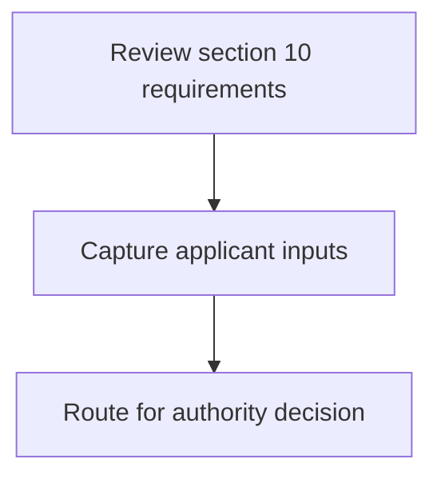
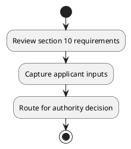

# Chapter 3 / Section 10: Analysis of the export data of the District and ways and means to

**Chapter Title:** Developing Districts as Export Hubs

**Pages:** 6

**Purpose:** Analysis of the export data of the District and ways and means to
effectively capture it.

**Purpose Thanglish:** Indha Analysis of the export data of the District and ways and means to section-la, Analysis of the export data of the District and ways and means to
effectively capture it.

**Summary:** 10. Analysis of the export data of the District and ways and means to
effectively capture it.

**Business Meaning:** 10.

**Business Explanation:** 10. Analysis of the export data of the District and ways and means to
effectively capture it.

**Business Explanation Thanglish:** Indha Analysis of the export data of the District and ways and means to section-la, 10. Analysis of the export data of the District and ways and means to
effectively capture it.

## Business Logic
- None identified

## Business Rules
- rule_id=CH3-SEC10-R001, rule_description=10. Analysis of the export data of the District and ways and means to
effectively capture it., trigger=Analysis of the export data of the District and ways and means to, condition=Not explicitly covered in uploaded documents., validation=Not explicitly covered in uploaded documents., action=Manual review required., exception=No explicit exception found in uploaded documents., output=DEKAI should produce a compliance decision for 10 - Analysis of the export data of the District and ways and means to.

## Conditions
- None identified

## Condition Logic
- None identified

## Validations
- None identified

## Exceptions
- None identified

## Dependencies
- 1

## Authorities
- None identified

## Required Documents
- None identified

## Timelines
- None identified

## Actions
- None identified

## Workflow
- Review section 10 requirements
- Capture applicant inputs
- Route for authority decision

## Workflow ASCII
```text
Analysis of the export data of the District and ways and means to
Review section 10 requirements
   |
   v
Capture applicant inputs
   |
   v
Route for authority decision
```

## Decision Tree
- IF section 10 applies THEN proceed with standard DGFT workflow

## Decision Tree ASCII
```text
Analysis of the export data of the District and ways and means to Decision
IF section 10 applies THEN proceed with standard DGFT workflow
```

## Examples
- User asks to process Analysis of the export data of the District and ways and means to; the platform checks conditions, validations, and documents before action.

**Real-world Example:** Example: an importer or exporter invokes Analysis of the export data of the District and ways and means to, submits the prescribed DGFT records, and DEKAI uses the extracted rules to follow the analysis of the export data of the district and ways and means to process.

**Real-world Example Thanglish:** Indha Analysis of the export data of the District and ways and means to section-la, Example: an importer or exporter invokes Analysis of the export data of the District and ways and means to, submits the prescribed DGFT records, and DEKAI uses the extracted rules to follow the analysis of the export data of the district and ways and means to process.

## AI Rules
- None identified

## Database Fields
- name=section_code, type=string, required=True, source=parsed_section_heading
- name=section_title, type=string, required=True, source=parsed_section_heading
- name=the_flag, type=boolean, required=False, source=keyword:the
- name=and_flag, type=boolean, required=False, source=keyword:and
- name=data_flag, type=boolean, required=False, source=keyword:data
- name=ways_flag, type=boolean, required=False, source=keyword:ways
- name=means_flag, type=boolean, required=False, source=keyword:means
- name=export_flag, type=boolean, required=False, source=keyword:export
- name=capture_flag, type=boolean, required=False, source=keyword:capture
- name=analysis_flag, type=boolean, required=False, source=keyword:Analysis

## API Requirements
- method=GET, path=/api/dgft/sections/10, purpose=Retrieve knowledge payload for section 10, query_params=['include=workflow,decision_tree,validations'], response_fields=['section', 'title', 'summary', 'conditions', 'validations', 'exceptions', 'workflow', 'decision_tree']
- method=POST, path=/api/dgft/Analysis-of-the-export-data-of-the-District-and-ways-and-means-to/validate, purpose=Validate inputs and documents for Analysis of the export data of the District and ways and means to, request_fields=['section_code', 'section_title'], response_fields=['status', 'errors', 'warnings', 'next_actions']

## UI Screens
- screen_id=Analysis_of_the_export_data_of_the_District_and_ways_and_means_to_overview, name=Analysis of the export data of the District and ways and means to Overview, purpose=Show section summary, authority, timeline, and eligibility cues., widgets=['summary_card', 'conditions_table', 'authority_badges', 'timeline_panel']
- screen_id=Analysis_of_the_export_data_of_the_District_and_ways_and_means_to_submission, name=Analysis of the export data of the District and ways and means to Submission, purpose=Capture applicant data and supporting documents., widgets=['dynamic_form', 'document_uploader', 'validation_panel', 'next_action_footer'], fields=['section_code', 'section_title', 'the_flag', 'and_flag', 'data_flag', 'ways_flag', 'means_flag', 'export_flag']

## Error Messages
- Validation failed because the section requirements were not fully met.

## FAQ
- question_en=What is the purpose of section 10?, answer_en=10. Analysis of the export data of the District and ways and means to
effectively capture it., question_thanglish=Indha Analysis of the export data of the District and ways and means to section-la, What is the purpose of section 10?, answer_thanglish=Indha Analysis of the export data of the District and ways and means to section-la, 10. Analysis of the export data of the District and ways and means to
effectively capture it.
- question_en=What documents are required under Analysis of the export data of the District and ways and means to?, answer_en=Not explicitly covered in uploaded documents., question_thanglish=Indha Analysis of the export data of the District and ways and means to section-la, What documents are required under Analysis of the export data of the District and ways and means to?, answer_thanglish=Indha Analysis of the export data of the District and ways and means to section-la, Not explicitly covered in uploaded documents.
- question_en=Which authority handles Analysis of the export data of the District and ways and means to?, answer_en=Not explicitly covered in uploaded documents., question_thanglish=Indha Analysis of the export data of the District and ways and means to section-la, Which authority handles Analysis of the export data of the District and ways and means to?, answer_thanglish=Indha Analysis of the export data of the District and ways and means to section-la, Not explicitly covered in uploaded documents.

## Questions Users May Ask
- What does Analysis of the export data of the District and ways and means to require?
- Which documents are needed for Analysis of the export data of the District and ways and means to?
- How does DEKAI validate Analysis of the export data of the District and ways and means to requests?

## Expected AI Answers
- Analysis of the export data of the District and ways and means to requires the platform to interpret the section text, apply the extracted business rules, and present the correct next action.
- Required documents are inferred from the section text: no explicit documents were detected.
- DEKAI validates Analysis of the export data of the District and ways and means to by checking conditions, required documents, authority references, and exception clauses before recommending an outcome.

## AI Q&A Examples
- question_en=User asks: How do I comply with Analysis of the export data of the District and ways and means to?, answer_en=AI answers: DEKAI should evaluate section 10, apply the extracted rules, and guide the user through Review section 10 requirements., question_thanglish=Indha Analysis of the export data of the District and ways and means to section-la, User asks: How do I comply with Analysis of the export data of the District and ways and means to?, answer_thanglish=Indha Analysis of the export data of the District and ways and means to section-la, AI answers: DEKAI should evaluate section 10, apply the extracted rules, and guide the user through Review section 10 requirements.
- question_en=User asks: Which validations apply to Analysis of the export data of the District and ways and means to?, answer_en=AI answers: Applicable validations are not explicitly covered in the uploaded documents., question_thanglish=Indha Analysis of the export data of the District and ways and means to section-la, User asks: Which validations apply to Analysis of the export data of the District and ways and means to?, answer_thanglish=Indha Analysis of the export data of the District and ways and means to section-la, AI answers: Applicable validations are not explicitly covered in the uploaded documents.

## DEKAI AI Implementation Notes
- Capture chapter 3, section 10, title, and page references as immutable knowledge metadata.
- Bind validations for Analysis of the export data of the District and ways and means to into a rule engine keyed by the rule IDs extracted for this section.
- Show contextual links to related sections: 1.

## DEKAI AI Implementation Notes Thanglish
- Indha Analysis of the export data of the District and ways and means to section-la, Capture chapter 3, section 10, title, and page references as immutable knowledge metadata.
- Indha Analysis of the export data of the District and ways and means to section-la, Bind validations for Analysis of the export data of the District and ways and means to into a rule engine keyed by the rule IDs extracted for this section.
- Indha Analysis of the export data of the District and ways and means to section-la, Show contextual links to related sections: 1.

## AI Metadata
- Keywords: the, and, data, ways, means, export, capture, Analysis, District, effectively
- Search Keywords: the, and, data, ways, means, export, capture, Analysis, District, effectively
- Intent: Provide knowledge guidance for Analysis of the export data of the District and ways and means to.
- Tags: 10, Analysis of the export data of the District and ways and means to, dgft
- Related Sections: 1
- Related Chapters: 
- Related Rules: 

## Mermaid


## PlantUML

