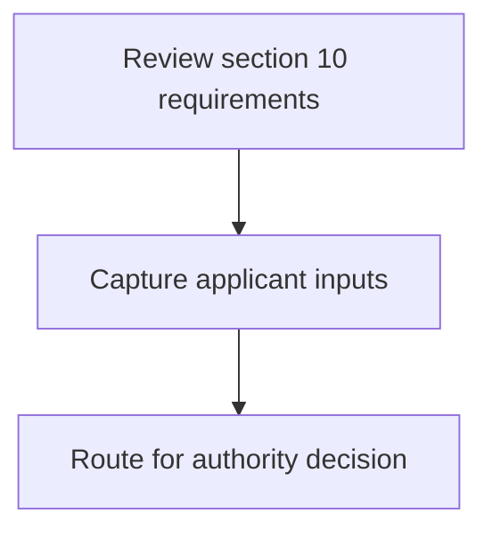
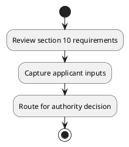

# Chapter 3 / Section 10: Entry of all district level data/ information/progress into the portal

**Chapter Title:** Developing Districts as Export Hubs

**Pages:** 4

**Purpose:** Entry of all district level data/ information/progress into the portal
being developed by DGFT and through the portal activate a virtual
engagement/interaction forum for involving and reaching out to all
stakeholders in the district, by enabling/facilitating them to come on
board.

**Purpose Thanglish:** Indha Entry of all district level data/ information/progress into the portal section-la, Entry of all district level data/ information/progress into the portal
being developed by DGFT and through the portal activate a virtual
engagement/interaction forum for involving and reaching out to all
stakeholders in the district, by enabling/facilitating them to come on
board.

**Summary:** 10. Entry of all district level data/ information/progress into the portal
being developed by DGFT and through the portal activate a virtual
engagement/interaction forum for involving and reaching out to all
stakeholders in the district, by enabling/facilitating them to come on
board.

**Business Meaning:** 10.

**Business Explanation:** 10. Entry of all district level data/ information/progress into the portal
being developed by DGFT and through the portal activate a virtual
engagement/interaction forum for involving and reaching out to all
stakeholders in the district, by enabling/facilitating them to come on
board.

**Business Explanation Thanglish:** Indha Entry of all district level data/ information/progress into the portal section-la, 10. Entry of all district level data/ information/progress into the portal
being developed by DGFT and through the portal activate a virtual
engagement/interaction forum for involving and reaching out to all
stakeholders in the district, by enabling/facilitating them to come on
board.

## Business Logic
- None identified

## Business Rules
- rule_id=CH3-SEC10-R001, rule_description=10. Entry of all district level data/ information/progress into the portal
being developed by DGFT and through the portal activate a virtual
engagement/interaction forum for involving and reaching out to all
stakeholders in the district, by enabling/facilitating them to come on
board., trigger=Entry of all district level data/ information/progress into the portal, condition=Not explicitly covered in uploaded documents., validation=Not explicitly covered in uploaded documents., action=Manual review required., exception=No explicit exception found in uploaded documents., output=DEKAI should produce a compliance decision for 10 - Entry of all district level data/ information/progress into the portal.

## Conditions
- None identified

## Condition Logic
- None identified

## Validations
- None identified

## Exceptions
- None identified

## Dependencies
- 1

## Authorities
- DGFT

## Required Documents
- None identified

## Timelines
- None identified

## Actions
- None identified

## Workflow
- Review section 10 requirements
- Capture applicant inputs
- Route for authority decision

## Workflow ASCII
```text
Entry of all district level data/ information/progress into the portal
Review section 10 requirements
   |
   v
Capture applicant inputs
   |
   v
Route for authority decision
```

## Decision Tree
- IF section 10 applies THEN proceed with standard DGFT workflow

## Decision Tree ASCII
```text
Entry of all district level data/ information/progress into the portal Decision
IF section 10 applies THEN proceed with standard DGFT workflow
```

## Examples
- User asks to process Entry of all district level data/ information/progress into the portal; the platform checks conditions, validations, and documents before action.

**Real-world Example:** Example: an importer or exporter invokes Entry of all district level data/ information/progress into the portal, submits the prescribed DGFT records, and DEKAI uses the extracted rules to follow the entry of all district level data/ information/progress into the portal process.

**Real-world Example Thanglish:** Indha Entry of all district level data/ information/progress into the portal section-la, Example: an importer or exporter invokes Entry of all district level data/ information/progress into the portal, submits the prescribed DGFT records, and DEKAI uses the extracted rules to follow the entry of all district level data/ information/progress into the portal process.

## AI Rules
- None identified

## Database Fields
- name=section_code, type=string, required=True, source=parsed_section_heading
- name=section_title, type=string, required=True, source=parsed_section_heading
- name=all_flag, type=boolean, required=False, source=keyword:all
- name=the_flag, type=boolean, required=False, source=keyword:the
- name=and_flag, type=boolean, required=False, source=keyword:and
- name=for_flag, type=boolean, required=False, source=keyword:for
- name=out_flag, type=boolean, required=False, source=keyword:out
- name=data_flag, type=boolean, required=False, source=keyword:data
- name=into_flag, type=boolean, required=False, source=keyword:into
- name=dgft_flag, type=boolean, required=False, source=keyword:DGFT

## API Requirements
- method=GET, path=/api/dgft/sections/10, purpose=Retrieve knowledge payload for section 10, query_params=['include=workflow,decision_tree,validations'], response_fields=['section', 'title', 'summary', 'conditions', 'validations', 'exceptions', 'workflow', 'decision_tree']
- method=POST, path=/api/dgft/Entry-of-all-district-level-data-information-progress-into-the-portal/validate, purpose=Validate inputs and documents for Entry of all district level data/ information/progress into the portal, request_fields=['section_code', 'section_title'], response_fields=['status', 'errors', 'warnings', 'next_actions']

## UI Screens
- screen_id=Entry_of_all_district_level_data_information_progress_into_the_portal_overview, name=Entry of all district level data/ information/progress into the portal Overview, purpose=Show section summary, authority, timeline, and eligibility cues., widgets=['summary_card', 'conditions_table', 'authority_badges', 'timeline_panel']
- screen_id=Entry_of_all_district_level_data_information_progress_into_the_portal_submission, name=Entry of all district level data/ information/progress into the portal Submission, purpose=Capture applicant data and supporting documents., widgets=['dynamic_form', 'document_uploader', 'validation_panel', 'next_action_footer'], fields=['section_code', 'section_title', 'all_flag', 'the_flag', 'and_flag', 'for_flag', 'out_flag', 'data_flag']

## Error Messages
- Validation failed because the section requirements were not fully met.

## FAQ
- question_en=What is the purpose of section 10?, answer_en=10. Entry of all district level data/ information/progress into the portal
being developed by DGFT and through the portal activate a virtual
engagement/interaction forum for involving and reaching out to all
stakeholders in the district, by enabling/facilitating them to come on
board., question_thanglish=Indha Entry of all district level data/ information/progress into the portal section-la, What is the purpose of section 10?, answer_thanglish=Indha Entry of all district level data/ information/progress into the portal section-la, 10. Entry of all district level data/ information/progress into the portal
being developed by DGFT and through the portal activate a virtual
engagement/interaction forum for involving and reaching out to all
stakeholders in the district, by enabling/facilitating them to come on
board.
- question_en=What documents are required under Entry of all district level data/ information/progress into the portal?, answer_en=Not explicitly covered in uploaded documents., question_thanglish=Indha Entry of all district level data/ information/progress into the portal section-la, What documents are required under Entry of all district level data/ information/progress into the portal?, answer_thanglish=Indha Entry of all district level data/ information/progress into the portal section-la, Not explicitly covered in uploaded documents.
- question_en=Which authority handles Entry of all district level data/ information/progress into the portal?, answer_en=DGFT, question_thanglish=Indha Entry of all district level data/ information/progress into the portal section-la, Which authority handles Entry of all district level data/ information/progress into the portal?, answer_thanglish=Indha Entry of all district level data/ information/progress into the portal section-la, DGFT

## Questions Users May Ask
- What does Entry of all district level data/ information/progress into the portal require?
- Which documents are needed for Entry of all district level data/ information/progress into the portal?
- How does DEKAI validate Entry of all district level data/ information/progress into the portal requests?

## Expected AI Answers
- Entry of all district level data/ information/progress into the portal requires the platform to interpret the section text, apply the extracted business rules, and present the correct next action.
- Required documents are inferred from the section text: no explicit documents were detected.
- DEKAI validates Entry of all district level data/ information/progress into the portal by checking conditions, required documents, authority references, and exception clauses before recommending an outcome.

## AI Q&A Examples
- question_en=User asks: How do I comply with Entry of all district level data/ information/progress into the portal?, answer_en=AI answers: DEKAI should evaluate section 10, apply the extracted rules, and guide the user through Review section 10 requirements., question_thanglish=Indha Entry of all district level data/ information/progress into the portal section-la, User asks: How do I comply with Entry of all district level data/ information/progress into the portal?, answer_thanglish=Indha Entry of all district level data/ information/progress into the portal section-la, AI answers: DEKAI should evaluate section 10, apply the extracted rules, and guide the user through Review section 10 requirements.
- question_en=User asks: Which validations apply to Entry of all district level data/ information/progress into the portal?, answer_en=AI answers: Applicable validations are not explicitly covered in the uploaded documents., question_thanglish=Indha Entry of all district level data/ information/progress into the portal section-la, User asks: Which validations apply to Entry of all district level data/ information/progress into the portal?, answer_thanglish=Indha Entry of all district level data/ information/progress into the portal section-la, AI answers: Applicable validations are not explicitly covered in the uploaded documents.

## DEKAI AI Implementation Notes
- Capture chapter 3, section 10, title, and page references as immutable knowledge metadata.
- Bind validations for Entry of all district level data/ information/progress into the portal into a rule engine keyed by the rule IDs extracted for this section.
- Route escalations or approvals to: DGFT.
- Show contextual links to related sections: 1.

## DEKAI AI Implementation Notes Thanglish
- Indha Entry of all district level data/ information/progress into the portal section-la, Capture chapter 3, section 10, title, and page references as immutable knowledge metadata.
- Indha Entry of all district level data/ information/progress into the portal section-la, Bind validations for Entry of all district level data/ information/progress into the portal into a rule engine keyed by the rule IDs extracted for this section.
- Indha Entry of all district level data/ information/progress into the portal section-la, Route escalations or approvals to: DGFT.
- Indha Entry of all district level data/ information/progress into the portal section-la, Show contextual links to related sections: 1.

## AI Metadata
- Keywords: all, the, and, for, out, data, into, DGFT, them, come, Entry, level, being, forum, board, portal, through, virtual, district, activate
- Search Keywords: all, the, and, for, out, data, into, DGFT, them, come, Entry, level, being, forum, board, portal, through, virtual, district, activate
- Intent: Provide knowledge guidance for Entry of all district level data/ information/progress into the portal.
- Tags: 10, Entry of all district level data/ information/progress into the portal, dgft
- Related Sections: 1
- Related Chapters: 
- Related Rules: 

## Mermaid


## PlantUML

