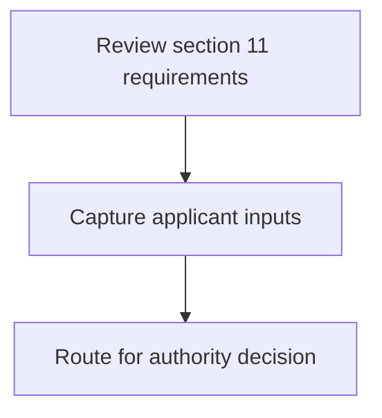
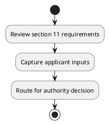

# Chapter 3 / Section 11: Act as a grievance redressal forum for exporters and follow up with the

**Chapter Title:** Developing Districts as Export Hubs

**Pages:** 4

**Purpose:** Act as a grievance redressal forum for exporters and follow up with the
concerned Central and State agency.

**Purpose Thanglish:** Indha Act as a grievance redressal forum for exporters and follow up with the section-la, Act as a grievance redressal forum for exporters and follow up with the
concerned Central and State agency.

**Summary:** 11. Act as a grievance redressal forum for exporters and follow up with the
concerned Central and State agency.

**Business Meaning:** 11.

**Business Explanation:** 11. Act as a grievance redressal forum for exporters and follow up with the
concerned Central and State agency.

**Business Explanation Thanglish:** Indha Act as a grievance redressal forum for exporters and follow up with the section-la, 11. Act as a grievance redressal forum for exporters and follow up with the
concerned Central and State agency.

## Business Logic
- None identified

## Business Rules
- rule_id=CH3-SEC11-R001, rule_description=11. Act as a grievance redressal forum for exporters and follow up with the
concerned Central and State agency., trigger=Act as a grievance redressal forum for exporters and follow up with the, condition=Not explicitly covered in uploaded documents., validation=Not explicitly covered in uploaded documents., action=Manual review required., exception=No explicit exception found in uploaded documents., output=DEKAI should produce a compliance decision for 11 - Act as a grievance redressal forum for exporters and follow up with the.

## Conditions
- None identified

## Condition Logic
- None identified

## Validations
- None identified

## Exceptions
- None identified

## Dependencies
- 1

## Authorities
- None identified

## Required Documents
- None identified

## Timelines
- None identified

## Actions
- None identified

## Workflow
- Review section 11 requirements
- Capture applicant inputs
- Route for authority decision

## Workflow ASCII
```text
Act as a grievance redressal forum for exporters and follow up with the
Review section 11 requirements
   |
   v
Capture applicant inputs
   |
   v
Route for authority decision
```

## Decision Tree
- IF section 11 applies THEN proceed with standard DGFT workflow

## Decision Tree ASCII
```text
Act as a grievance redressal forum for exporters and follow up with the Decision
IF section 11 applies THEN proceed with standard DGFT workflow
```

## Examples
- User asks to process Act as a grievance redressal forum for exporters and follow up with the; the platform checks conditions, validations, and documents before action.

**Real-world Example:** Example: an importer or exporter invokes Act as a grievance redressal forum for exporters and follow up with the, submits the prescribed DGFT records, and DEKAI uses the extracted rules to follow the act as a grievance redressal forum for exporters and follow up with the process.

**Real-world Example Thanglish:** Indha Act as a grievance redressal forum for exporters and follow up with the section-la, Example: an importer or exporter invokes Act as a grievance redressal forum for exporters and follow up with the, submits the prescribed DGFT records, and DEKAI uses the extracted rules to follow the act as a grievance redressal forum for exporters and follow up with the process.

## AI Rules
- None identified

## Database Fields
- name=section_code, type=string, required=True, source=parsed_section_heading
- name=section_title, type=string, required=True, source=parsed_section_heading
- name=act_flag, type=boolean, required=False, source=keyword:Act
- name=for_flag, type=boolean, required=False, source=keyword:for
- name=and_flag, type=boolean, required=False, source=keyword:and
- name=the_flag, type=boolean, required=False, source=keyword:the
- name=with_flag, type=boolean, required=False, source=keyword:with
- name=forum_flag, type=boolean, required=False, source=keyword:forum
- name=state_flag, type=boolean, required=False, source=keyword:State
- name=follow_flag, type=boolean, required=False, source=keyword:follow

## API Requirements
- method=GET, path=/api/dgft/sections/11, purpose=Retrieve knowledge payload for section 11, query_params=['include=workflow,decision_tree,validations'], response_fields=['section', 'title', 'summary', 'conditions', 'validations', 'exceptions', 'workflow', 'decision_tree']
- method=POST, path=/api/dgft/Act-as-a-grievance-redressal-forum-for-exporters-and-follow-up-with-the/validate, purpose=Validate inputs and documents for Act as a grievance redressal forum for exporters and follow up with the, request_fields=['section_code', 'section_title'], response_fields=['status', 'errors', 'warnings', 'next_actions']

## UI Screens
- screen_id=Act_as_a_grievance_redressal_forum_for_exporters_and_follow_up_with_the_overview, name=Act as a grievance redressal forum for exporters and follow up with the Overview, purpose=Show section summary, authority, timeline, and eligibility cues., widgets=['summary_card', 'conditions_table', 'authority_badges', 'timeline_panel']
- screen_id=Act_as_a_grievance_redressal_forum_for_exporters_and_follow_up_with_the_submission, name=Act as a grievance redressal forum for exporters and follow up with the Submission, purpose=Capture applicant data and supporting documents., widgets=['dynamic_form', 'document_uploader', 'validation_panel', 'next_action_footer'], fields=['section_code', 'section_title', 'act_flag', 'for_flag', 'and_flag', 'the_flag', 'with_flag', 'forum_flag']

## Error Messages
- Validation failed because the section requirements were not fully met.

## FAQ
- question_en=What is the purpose of section 11?, answer_en=11. Act as a grievance redressal forum for exporters and follow up with the
concerned Central and State agency., question_thanglish=Indha Act as a grievance redressal forum for exporters and follow up with the section-la, What is the purpose of section 11?, answer_thanglish=Indha Act as a grievance redressal forum for exporters and follow up with the section-la, 11. Act as a grievance redressal forum for exporters and follow up with the
concerned Central and State agency.
- question_en=What documents are required under Act as a grievance redressal forum for exporters and follow up with the?, answer_en=Not explicitly covered in uploaded documents., question_thanglish=Indha Act as a grievance redressal forum for exporters and follow up with the section-la, What documents are required under Act as a grievance redressal forum for exporters and follow up with the?, answer_thanglish=Indha Act as a grievance redressal forum for exporters and follow up with the section-la, Not explicitly covered in uploaded documents.
- question_en=Which authority handles Act as a grievance redressal forum for exporters and follow up with the?, answer_en=Not explicitly covered in uploaded documents., question_thanglish=Indha Act as a grievance redressal forum for exporters and follow up with the section-la, Which authority handles Act as a grievance redressal forum for exporters and follow up with the?, answer_thanglish=Indha Act as a grievance redressal forum for exporters and follow up with the section-la, Not explicitly covered in uploaded documents.

## Questions Users May Ask
- What does Act as a grievance redressal forum for exporters and follow up with the require?
- Which documents are needed for Act as a grievance redressal forum for exporters and follow up with the?
- How does DEKAI validate Act as a grievance redressal forum for exporters and follow up with the requests?

## Expected AI Answers
- Act as a grievance redressal forum for exporters and follow up with the requires the platform to interpret the section text, apply the extracted business rules, and present the correct next action.
- Required documents are inferred from the section text: no explicit documents were detected.
- DEKAI validates Act as a grievance redressal forum for exporters and follow up with the by checking conditions, required documents, authority references, and exception clauses before recommending an outcome.

## AI Q&A Examples
- question_en=User asks: How do I comply with Act as a grievance redressal forum for exporters and follow up with the?, answer_en=AI answers: DEKAI should evaluate section 11, apply the extracted rules, and guide the user through Review section 11 requirements., question_thanglish=Indha Act as a grievance redressal forum for exporters and follow up with the section-la, User asks: How do I comply with Act as a grievance redressal forum for exporters and follow up with the?, answer_thanglish=Indha Act as a grievance redressal forum for exporters and follow up with the section-la, AI answers: DEKAI should evaluate section 11, apply the extracted rules, and guide the user through Review section 11 requirements.
- question_en=User asks: Which validations apply to Act as a grievance redressal forum for exporters and follow up with the?, answer_en=AI answers: Applicable validations are not explicitly covered in the uploaded documents., question_thanglish=Indha Act as a grievance redressal forum for exporters and follow up with the section-la, User asks: Which validations apply to Act as a grievance redressal forum for exporters and follow up with the?, answer_thanglish=Indha Act as a grievance redressal forum for exporters and follow up with the section-la, AI answers: Applicable validations are not explicitly covered in the uploaded documents.

## DEKAI AI Implementation Notes
- Capture chapter 3, section 11, title, and page references as immutable knowledge metadata.
- Bind validations for Act as a grievance redressal forum for exporters and follow up with the into a rule engine keyed by the rule IDs extracted for this section.
- Show contextual links to related sections: 1.

## DEKAI AI Implementation Notes Thanglish
- Indha Act as a grievance redressal forum for exporters and follow up with the section-la, Capture chapter 3, section 11, title, and page references as immutable knowledge metadata.
- Indha Act as a grievance redressal forum for exporters and follow up with the section-la, Bind validations for Act as a grievance redressal forum for exporters and follow up with the into a rule engine keyed by the rule IDs extracted for this section.
- Indha Act as a grievance redressal forum for exporters and follow up with the section-la, Show contextual links to related sections: 1.

## AI Metadata
- Keywords: Act, for, and, the, with, forum, State, follow, agency, Central, grievance, redressal, exporters, concerned
- Search Keywords: Act, for, and, the, with, forum, State, follow, agency, Central, grievance, redressal, exporters, concerned
- Intent: Provide knowledge guidance for Act as a grievance redressal forum for exporters and follow up with the.
- Tags: 11, Act as a grievance redressal forum for exporters and follow up with the, dgft
- Related Sections: 1
- Related Chapters: 
- Related Rules: 

## Mermaid


## PlantUML

