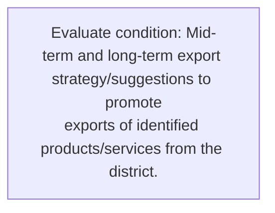
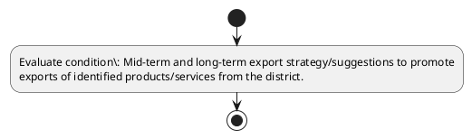

# Chapter 3 / Section 11: Mid-term and long-term export strategy/suggestions to promote

**Chapter Title:** Developing Districts as Export Hubs

**Pages:** 6

**Purpose:** Mid-term and long-term export strategy/suggestions to promote
exports of identified products/services from the district.

**Purpose Thanglish:** Indha Mid-term and long-term export strategy/suggestions to promote section-la, Mid-term and long-term export strategy/suggestions to promote
exports of identified products/services from the district.

**Summary:** 11. Mid-term and long-term export strategy/suggestions to promote
exports of identified products/services from the district.

**Business Meaning:** 11.

**Business Explanation:** 11. Mid-term and long-term export strategy/suggestions to promote
exports of identified products/services from the district.

**Business Explanation Thanglish:** Indha Mid-term and long-term export strategy/suggestions to promote section-la, 11. Mid-term and long-term export strategy/suggestions to promote
exports of identified products/services from the district.

## Business Logic
- None identified

## Business Rules
- rule_id=CH3-SEC11-R001, rule_description=11. Mid-term and long-term export strategy/suggestions to promote
exports of identified products/services from the district., trigger=Mid-term and long-term export strategy/suggestions to promote, condition=Mid-term and long-term export strategy/suggestions to promote
exports of identified products/services from the district., validation=Not explicitly covered in uploaded documents., action=Manual review required., exception=No explicit exception found in uploaded documents., output=DEKAI should produce a compliance decision for 11 - Mid-term and long-term export strategy/suggestions to promote.

## Conditions
- Mid-term and long-term export strategy/suggestions to promote
exports of identified products/services from the district.

## Condition Logic
- id=3.11.1, if=Mid-term and long-term export strategy/suggestions to promote
exports of identified products/services from the district., then=Route for review, source=Mid-term and long-term export strategy/suggestions to promote
exports of identified products/services from the district.

## Validations
- None identified

## Exceptions
- None identified

## Dependencies
- 1

## Authorities
- None identified

## Required Documents
- None identified

## Timelines
- None identified

## Actions
- None identified

## Workflow
- Evaluate condition: Mid-term and long-term export strategy/suggestions to promote
exports of identified products/services from the district.

## Workflow ASCII
```text
Mid-term and long-term export strategy/suggestions to promote
Evaluate condition: Mid-term and long-term export strategy/suggestions to promote
exports of identified products/services from the district.
```

## Decision Tree
- IF section 11 applies THEN proceed with standard DGFT workflow

## Decision Tree ASCII
```text
Mid-term and long-term export strategy/suggestions to promote Decision
IF section 11 applies THEN proceed with standard DGFT workflow
```

## Examples
- User asks to process Mid-term and long-term export strategy/suggestions to promote; the platform checks conditions, validations, and documents before action.

**Real-world Example:** Example: an importer or exporter invokes Mid-term and long-term export strategy/suggestions to promote, submits the prescribed DGFT records, and DEKAI uses the extracted rules to follow the mid-term and long-term export strategy/suggestions to promote process.

**Real-world Example Thanglish:** Indha Mid-term and long-term export strategy/suggestions to promote section-la, Example: an importer or exporter invokes Mid-term and long-term export strategy/suggestions to promote, submits the prescribed DGFT records, and DEKAI uses the extracted rules to follow the mid-term and long-term export strategy/suggestions to promote process.

## AI Rules
- None identified

## Database Fields
- name=section_code, type=string, required=True, source=parsed_section_heading
- name=section_title, type=string, required=True, source=parsed_section_heading
- name=and_flag, type=boolean, required=False, source=keyword:and
- name=the_flag, type=boolean, required=False, source=keyword:the
- name=from_flag, type=boolean, required=False, source=keyword:from
- name=export_flag, type=boolean, required=False, source=keyword:export
- name=promote_flag, type=boolean, required=False, source=keyword:promote
- name=exports_flag, type=boolean, required=False, source=keyword:exports
- name=mid_term_flag, type=boolean, required=False, source=keyword:Mid-term
- name=district_flag, type=boolean, required=False, source=keyword:district

## API Requirements
- method=GET, path=/api/dgft/sections/11, purpose=Retrieve knowledge payload for section 11, query_params=['include=workflow,decision_tree,validations'], response_fields=['section', 'title', 'summary', 'conditions', 'validations', 'exceptions', 'workflow', 'decision_tree']
- method=POST, path=/api/dgft/Mid-term-and-long-term-export-strategy-suggestions-to-promote/validate, purpose=Validate inputs and documents for Mid-term and long-term export strategy/suggestions to promote, request_fields=['section_code', 'section_title'], response_fields=['status', 'errors', 'warnings', 'next_actions']

## UI Screens
- screen_id=Mid_term_and_long_term_export_strategy_suggestions_to_promote_overview, name=Mid-term and long-term export strategy/suggestions to promote Overview, purpose=Show section summary, authority, timeline, and eligibility cues., widgets=['summary_card', 'conditions_table', 'authority_badges', 'timeline_panel']
- screen_id=Mid_term_and_long_term_export_strategy_suggestions_to_promote_submission, name=Mid-term and long-term export strategy/suggestions to promote Submission, purpose=Capture applicant data and supporting documents., widgets=['dynamic_form', 'document_uploader', 'validation_panel', 'next_action_footer'], fields=['section_code', 'section_title', 'and_flag', 'the_flag', 'from_flag', 'export_flag', 'promote_flag', 'exports_flag']

## Error Messages
- Validation failed because the section requirements were not fully met.

## FAQ
- question_en=What is the purpose of section 11?, answer_en=11. Mid-term and long-term export strategy/suggestions to promote
exports of identified products/services from the district., question_thanglish=Indha Mid-term and long-term export strategy/suggestions to promote section-la, What is the purpose of section 11?, answer_thanglish=Indha Mid-term and long-term export strategy/suggestions to promote section-la, 11. Mid-term and long-term export strategy/suggestions to promote
exports of identified products/services from the district.
- question_en=What documents are required under Mid-term and long-term export strategy/suggestions to promote?, answer_en=Not explicitly covered in uploaded documents., question_thanglish=Indha Mid-term and long-term export strategy/suggestions to promote section-la, What documents are required under Mid-term and long-term export strategy/suggestions to promote?, answer_thanglish=Indha Mid-term and long-term export strategy/suggestions to promote section-la, Not explicitly covered in uploaded documents.
- question_en=Which authority handles Mid-term and long-term export strategy/suggestions to promote?, answer_en=Not explicitly covered in uploaded documents., question_thanglish=Indha Mid-term and long-term export strategy/suggestions to promote section-la, Which authority handles Mid-term and long-term export strategy/suggestions to promote?, answer_thanglish=Indha Mid-term and long-term export strategy/suggestions to promote section-la, Not explicitly covered in uploaded documents.

## Questions Users May Ask
- What does Mid-term and long-term export strategy/suggestions to promote require?
- Which documents are needed for Mid-term and long-term export strategy/suggestions to promote?
- How does DEKAI validate Mid-term and long-term export strategy/suggestions to promote requests?

## Expected AI Answers
- Mid-term and long-term export strategy/suggestions to promote requires the platform to interpret the section text, apply the extracted business rules, and present the correct next action.
- Required documents are inferred from the section text: no explicit documents were detected.
- DEKAI validates Mid-term and long-term export strategy/suggestions to promote by checking conditions, required documents, authority references, and exception clauses before recommending an outcome.

## AI Q&A Examples
- question_en=User asks: How do I comply with Mid-term and long-term export strategy/suggestions to promote?, answer_en=AI answers: DEKAI should evaluate section 11, apply the extracted rules, and guide the user through Evaluate condition: Mid-term and long-term export strategy/suggestions to promote
exports of identified products/services from the district.., question_thanglish=Indha Mid-term and long-term export strategy/suggestions to promote section-la, User asks: How do I comply with Mid-term and long-term export strategy/suggestions to promote?, answer_thanglish=Indha Mid-term and long-term export strategy/suggestions to promote section-la, AI answers: DEKAI should evaluate section 11, apply the extracted rules, and guide the user through Evaluate condition: Mid-term and long-term export strategy/suggestions to promote
exports of identified products/services from the district..
- question_en=User asks: Which validations apply to Mid-term and long-term export strategy/suggestions to promote?, answer_en=AI answers: Applicable validations are not explicitly covered in the uploaded documents., question_thanglish=Indha Mid-term and long-term export strategy/suggestions to promote section-la, User asks: Which validations apply to Mid-term and long-term export strategy/suggestions to promote?, answer_thanglish=Indha Mid-term and long-term export strategy/suggestions to promote section-la, AI answers: Applicable validations are not explicitly covered in the uploaded documents.

## DEKAI AI Implementation Notes
- Capture chapter 3, section 11, title, and page references as immutable knowledge metadata.
- Bind validations for Mid-term and long-term export strategy/suggestions to promote into a rule engine keyed by the rule IDs extracted for this section.
- Show contextual links to related sections: 1.

## DEKAI AI Implementation Notes Thanglish
- Indha Mid-term and long-term export strategy/suggestions to promote section-la, Capture chapter 3, section 11, title, and page references as immutable knowledge metadata.
- Indha Mid-term and long-term export strategy/suggestions to promote section-la, Bind validations for Mid-term and long-term export strategy/suggestions to promote into a rule engine keyed by the rule IDs extracted for this section.
- Indha Mid-term and long-term export strategy/suggestions to promote section-la, Show contextual links to related sections: 1.

## AI Metadata
- Keywords: and, the, from, export, promote, exports, Mid-term, district, long-term, identified, products/services, strategy/suggestions
- Search Keywords: and, the, from, export, promote, exports, Mid-term, district, long-term, identified, products/services, strategy/suggestions
- Intent: Provide knowledge guidance for Mid-term and long-term export strategy/suggestions to promote.
- Tags: 11, Mid-term and long-term export strategy/suggestions to promote, dgft
- Related Sections: 1
- Related Chapters: 
- Related Rules: 

## Mermaid


## PlantUML

