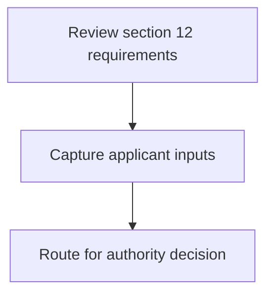
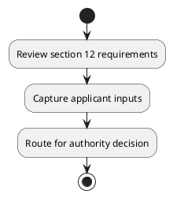

# Chapter 3 / Section 12: Facilitate in organising buyer-seller meets, exhibitions, trade fairs etc. in

**Chapter Title:** Developing Districts as Export Hubs

**Pages:** 4

**Purpose:** in
the District to encourage the industries to showcase their products to the
world.

**Purpose Thanglish:** Indha Facilitate in organising buyer-seller meets, exhibitions, trade fairs etc. in section-la, in
the District to encourage the industries to showcase their products to the
world.

**Summary:** 12. Facilitate in organising buyer-seller meets, exhibitions, trade fairs etc. in
the District to encourage the industries to showcase their products to the
world.

**Business Meaning:** 12.

**Business Explanation:** 12. Facilitate in organising buyer-seller meets, exhibitions, trade fairs etc. in
the District to encourage the industries to showcase their products to the
world.

**Business Explanation Thanglish:** Indha Facilitate in organising buyer-seller meets, exhibitions, trade fairs etc. in section-la, 12. Facilitate in organising buyer-seller meets, exhibitions, trade fairs etc. in
the District to encourage the industries to showcase their products to the
world.

## Business Logic
- None identified

## Business Rules
- rule_id=CH3-SEC12-R001, rule_description=12. Facilitate in organising buyer-seller meets, exhibitions, trade fairs etc. in
the District to encourage the industries to showcase their products to the
world., trigger=Facilitate in organising buyer-seller meets, exhibitions, trade fairs etc. in, condition=Not explicitly covered in uploaded documents., validation=Not explicitly covered in uploaded documents., action=Manual review required., exception=No explicit exception found in uploaded documents., output=DEKAI should produce a compliance decision for 12 - Facilitate in organising buyer-seller meets, exhibitions, trade fairs etc. in.

## Conditions
- None identified

## Condition Logic
- None identified

## Validations
- None identified

## Exceptions
- None identified

## Dependencies
- 1
- 2

## Authorities
- None identified

## Required Documents
- None identified

## Timelines
- None identified

## Actions
- None identified

## Workflow
- Review section 12 requirements
- Capture applicant inputs
- Route for authority decision

## Workflow ASCII
```text
Facilitate in organising buyer-seller meets, exhibitions, trade fairs etc. in
Review section 12 requirements
   |
   v
Capture applicant inputs
   |
   v
Route for authority decision
```

## Decision Tree
- IF section 12 applies THEN proceed with standard DGFT workflow

## Decision Tree ASCII
```text
Facilitate in organising buyer-seller meets, exhibitions, trade fairs etc. in Decision
IF section 12 applies THEN proceed with standard DGFT workflow
```

## Examples
- User asks to process Facilitate in organising buyer-seller meets, exhibitions, trade fairs etc. in; the platform checks conditions, validations, and documents before action.

**Real-world Example:** Example: an importer or exporter invokes Facilitate in organising buyer-seller meets, exhibitions, trade fairs etc. in, submits the prescribed DGFT records, and DEKAI uses the extracted rules to follow the facilitate in organising buyer-seller meets, exhibitions, trade fairs etc. in process.

**Real-world Example Thanglish:** Indha Facilitate in organising buyer-seller meets, exhibitions, trade fairs etc. in section-la, Example: an importer or exporter invokes Facilitate in organising buyer-seller meets, exhibitions, trade fairs etc. in, submits the prescribed DGFT records, and DEKAI uses the extracted rules to follow the facilitate in organising buyer-seller meets, exhibitions, trade fairs etc. in process.

## AI Rules
- None identified

## Database Fields
- name=section_code, type=string, required=True, source=parsed_section_heading
- name=section_title, type=string, required=True, source=parsed_section_heading
- name=etc_flag, type=boolean, required=False, source=keyword:etc
- name=the_flag, type=boolean, required=False, source=keyword:the
- name=meets_flag, type=boolean, required=False, source=keyword:meets
- name=trade_flag, type=boolean, required=False, source=keyword:trade
- name=fairs_flag, type=boolean, required=False, source=keyword:fairs
- name=their_flag, type=boolean, required=False, source=keyword:their
- name=world_flag, type=boolean, required=False, source=keyword:world
- name=district_flag, type=boolean, required=False, source=keyword:District

## API Requirements
- method=GET, path=/api/dgft/sections/12, purpose=Retrieve knowledge payload for section 12, query_params=['include=workflow,decision_tree,validations'], response_fields=['section', 'title', 'summary', 'conditions', 'validations', 'exceptions', 'workflow', 'decision_tree']
- method=POST, path=/api/dgft/Facilitate-in-organising-buyer-seller-meets-exhibitions-trade-fairs-etc-in/validate, purpose=Validate inputs and documents for Facilitate in organising buyer-seller meets, exhibitions, trade fairs etc. in, request_fields=['section_code', 'section_title'], response_fields=['status', 'errors', 'warnings', 'next_actions']

## UI Screens
- screen_id=Facilitate_in_organising_buyer_seller_meets_exhibitions_trade_fairs_etc_in_overview, name=Facilitate in organising buyer-seller meets, exhibitions, trade fairs etc. in Overview, purpose=Show section summary, authority, timeline, and eligibility cues., widgets=['summary_card', 'conditions_table', 'authority_badges', 'timeline_panel']
- screen_id=Facilitate_in_organising_buyer_seller_meets_exhibitions_trade_fairs_etc_in_submission, name=Facilitate in organising buyer-seller meets, exhibitions, trade fairs etc. in Submission, purpose=Capture applicant data and supporting documents., widgets=['dynamic_form', 'document_uploader', 'validation_panel', 'next_action_footer'], fields=['section_code', 'section_title', 'etc_flag', 'the_flag', 'meets_flag', 'trade_flag', 'fairs_flag', 'their_flag']

## Error Messages
- Validation failed because the section requirements were not fully met.

## FAQ
- question_en=What is the purpose of section 12?, answer_en=12. Facilitate in organising buyer-seller meets, exhibitions, trade fairs etc. in
the District to encourage the industries to showcase their products to the
world., question_thanglish=Indha Facilitate in organising buyer-seller meets, exhibitions, trade fairs etc. in section-la, What is the purpose of section 12?, answer_thanglish=Indha Facilitate in organising buyer-seller meets, exhibitions, trade fairs etc. in section-la, 12. Facilitate in organising buyer-seller meets, exhibitions, trade fairs etc. in
the District to encourage the industries to showcase their products to the
world.
- question_en=What documents are required under Facilitate in organising buyer-seller meets, exhibitions, trade fairs etc. in?, answer_en=Not explicitly covered in uploaded documents., question_thanglish=Indha Facilitate in organising buyer-seller meets, exhibitions, trade fairs etc. in section-la, What documents are required under Facilitate in organising buyer-seller meets, exhibitions, trade fairs etc. in?, answer_thanglish=Indha Facilitate in organising buyer-seller meets, exhibitions, trade fairs etc. in section-la, Not explicitly covered in uploaded documents.
- question_en=Which authority handles Facilitate in organising buyer-seller meets, exhibitions, trade fairs etc. in?, answer_en=Not explicitly covered in uploaded documents., question_thanglish=Indha Facilitate in organising buyer-seller meets, exhibitions, trade fairs etc. in section-la, Which authority handles Facilitate in organising buyer-seller meets, exhibitions, trade fairs etc. in?, answer_thanglish=Indha Facilitate in organising buyer-seller meets, exhibitions, trade fairs etc. in section-la, Not explicitly covered in uploaded documents.

## Questions Users May Ask
- What does Facilitate in organising buyer-seller meets, exhibitions, trade fairs etc. in require?
- Which documents are needed for Facilitate in organising buyer-seller meets, exhibitions, trade fairs etc. in?
- How does DEKAI validate Facilitate in organising buyer-seller meets, exhibitions, trade fairs etc. in requests?

## Expected AI Answers
- Facilitate in organising buyer-seller meets, exhibitions, trade fairs etc. in requires the platform to interpret the section text, apply the extracted business rules, and present the correct next action.
- Required documents are inferred from the section text: no explicit documents were detected.
- DEKAI validates Facilitate in organising buyer-seller meets, exhibitions, trade fairs etc. in by checking conditions, required documents, authority references, and exception clauses before recommending an outcome.

## AI Q&A Examples
- question_en=User asks: How do I comply with Facilitate in organising buyer-seller meets, exhibitions, trade fairs etc. in?, answer_en=AI answers: DEKAI should evaluate section 12, apply the extracted rules, and guide the user through Review section 12 requirements., question_thanglish=Indha Facilitate in organising buyer-seller meets, exhibitions, trade fairs etc. in section-la, User asks: How do I comply with Facilitate in organising buyer-seller meets, exhibitions, trade fairs etc. in?, answer_thanglish=Indha Facilitate in organising buyer-seller meets, exhibitions, trade fairs etc. in section-la, AI answers: DEKAI should evaluate section 12, apply the extracted rules, and guide the user through Review section 12 requirements.
- question_en=User asks: Which validations apply to Facilitate in organising buyer-seller meets, exhibitions, trade fairs etc. in?, answer_en=AI answers: Applicable validations are not explicitly covered in the uploaded documents., question_thanglish=Indha Facilitate in organising buyer-seller meets, exhibitions, trade fairs etc. in section-la, User asks: Which validations apply to Facilitate in organising buyer-seller meets, exhibitions, trade fairs etc. in?, answer_thanglish=Indha Facilitate in organising buyer-seller meets, exhibitions, trade fairs etc. in section-la, AI answers: Applicable validations are not explicitly covered in the uploaded documents.

## DEKAI AI Implementation Notes
- Capture chapter 3, section 12, title, and page references as immutable knowledge metadata.
- Bind validations for Facilitate in organising buyer-seller meets, exhibitions, trade fairs etc. in into a rule engine keyed by the rule IDs extracted for this section.
- Show contextual links to related sections: 1, 2.

## DEKAI AI Implementation Notes Thanglish
- Indha Facilitate in organising buyer-seller meets, exhibitions, trade fairs etc. in section-la, Capture chapter 3, section 12, title, and page references as immutable knowledge metadata.
- Indha Facilitate in organising buyer-seller meets, exhibitions, trade fairs etc. in section-la, Bind validations for Facilitate in organising buyer-seller meets, exhibitions, trade fairs etc. in into a rule engine keyed by the rule IDs extracted for this section.
- Indha Facilitate in organising buyer-seller meets, exhibitions, trade fairs etc. in section-la, Show contextual links to related sections: 1, 2.

## AI Metadata
- Keywords: etc, the, meets, trade, fairs, their, world, District, showcase, products, encourage, Facilitate, organising, industries, exhibitions, buyer-seller
- Search Keywords: etc, the, meets, trade, fairs, their, world, District, showcase, products, encourage, Facilitate, organising, industries, exhibitions, buyer-seller
- Intent: Provide knowledge guidance for Facilitate in organising buyer-seller meets, exhibitions, trade fairs etc. in.
- Tags: 12, Facilitate in organising buyer-seller meets, exhibitions, trade fairs etc. in, dgft
- Related Sections: 1, 2
- Related Chapters: 
- Related Rules: 

## Mermaid


## PlantUML

