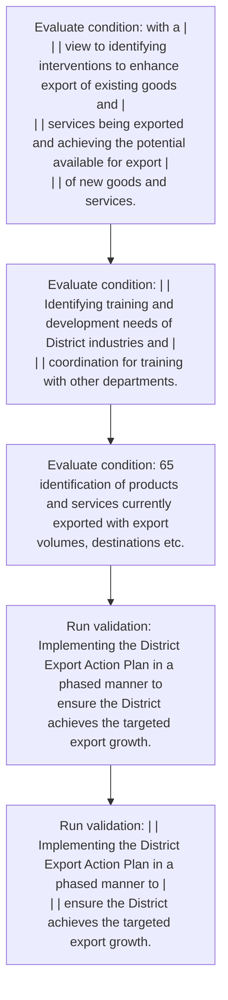

# Chapter 3 / Section 13: Implementing the District Export Action Plan in a phased manner to

**Chapter Title:** Developing Districts as Export Hubs

**Pages:** 4, 5

**Purpose:** Implementing the District Export Action Plan in a phased manner to
ensure the District achieves the targeted export growth.

**Purpose Thanglish:** Indha Implementing the District Export Action Plan in a phased manner to section-la, Implementing the District export Action Plan in a phased manner to
ensure the District achieves the targeted export growth.

**Summary:** 13. Implementing the District Export Action Plan in a phased manner to
ensure the District achieves the targeted export growth. pg.

**Business Meaning:** 13.

**Business Explanation:** 13. Implementing the District Export Action Plan in a phased manner to
ensure the District achieves the targeted export growth. pg.

**Business Explanation Thanglish:** Indha Implementing the District Export Action Plan in a phased manner to section-la, 13. Implementing the District export Action Plan in a phased manner to
ensure the District achieves the targeted export growth. pg.

## Business Logic
- None identified

## Business Rules
- rule_id=CH3-SEC13-R001, rule_description=13. Implementing the District Export Action Plan in a phased manner to
ensure the District achieves the targeted export growth. pg., trigger=Implementing the District Export Action Plan in a phased manner to, condition=with a |
| | view to identifying interventions to enhance export of existing goods and |
| | services being exported and achieving the potential available for export |
| | of new goods and services., validation=Implementing the District Export Action Plan in a phased manner to
ensure the District achieves the targeted export growth., action=Manual review required., exception=No explicit exception found in uploaded documents., output=DEKAI should produce a compliance decision for 13 - Implementing the District Export Action Plan in a phased manner to.

## Conditions
- with a |
| | view to identifying interventions to enhance export of existing goods and |
| | services being exported and achieving the potential available for export |
| | of new goods and services.
- | | Identifying training and development needs of District industries and |
| | coordination for training with other departments.
- 65
identification of products and services currently exported with export
volumes, destinations etc.
- with a
view to identifying interventions to enhance export of existing goods and
services being exported and achieving the potential available for export
of new goods and services.
- Goods and services being manufactured/produced in the district,
identify the export potential of items available in such districts
(including GI products).
- Identify major bottlenecks and challenges hindering export of thrust
sector in the districts.
- Identify thrust Items/GI Products/Agricultural
items from export perspective for further in-depth analysis.
- Identifying training and development needs of District industries and
coordination for training with other departments.

## Condition Logic
- id=3.13.1, if=with a |
| | view to identifying interventions to enhance export of existing goods and |
| | services being exported and achieving the potential available for export |
| | of new goods and services., then=Route for review, source=with a |
| | view to identifying interventions to enhance export of existing goods and |
| | services being exported and achieving the potential available for export |
| | of new goods and services.
- id=3.13.2, if=| | Identifying training and development needs of District industries and |
| | coordination for training with other departments., then=Route for review, source=| | Identifying training and development needs of District industries and |
| | coordination for training with other departments.
- id=3.13.3, if=65
identification of products and services currently exported with export
volumes, destinations etc., then=Route for review, source=65
identification of products and services currently exported with export
volumes, destinations etc.
- id=3.13.4, if=with a
view to identifying interventions to enhance export of existing goods and
services being exported and achieving the potential available for export
of new goods and services., then=Route for review, source=with a
view to identifying interventions to enhance export of existing goods and
services being exported and achieving the potential available for export
of new goods and services.
- id=3.13.5, if=Goods and services being manufactured/produced in the district,
identify the export potential of items available in such districts
(including GI products)., then=Route for review, source=Goods and services being manufactured/produced in the district,
identify the export potential of items available in such districts
(including GI products).
- id=3.13.6, if=Identify major bottlenecks and challenges hindering export of thrust
sector in the districts., then=Route for review, source=Identify major bottlenecks and challenges hindering export of thrust
sector in the districts.
- id=3.13.7, if=Identify thrust Items/GI Products/Agricultural
items from export perspective for further in-depth analysis., then=Route for review, source=Identify thrust Items/GI Products/Agricultural
items from export perspective for further in-depth analysis.
- id=3.13.8, if=Identifying training and development needs of District industries and
coordination for training with other departments., then=Route for review, source=Identifying training and development needs of District industries and
coordination for training with other departments.

## Validations
- Implementing the District Export Action Plan in a phased manner to
ensure the District achieves the targeted export growth.
- | | Implementing the District Export Action Plan in a phased manner to |
| | ensure the District achieves the targeted export growth.

## Exceptions
- None identified

## Dependencies
- 1
- 2
- 3
- 4
- 5
- 6
- 7
- 8
- 9
- 10
- 11
- 12

## Authorities
- DGFT
- Central government
- DGFT Regional Authorities

## Required Documents
- None identified

## Timelines
- None identified

## Actions
- None identified

## Workflow
- Evaluate condition: with a |
| | view to identifying interventions to enhance export of existing goods and |
| | services being exported and achieving the potential available for export |
| | of new goods and services.
- Evaluate condition: | | Identifying training and development needs of District industries and |
| | coordination for training with other departments.
- Evaluate condition: 65
identification of products and services currently exported with export
volumes, destinations etc.
- Run validation: Implementing the District Export Action Plan in a phased manner to
ensure the District achieves the targeted export growth.
- Run validation: | | Implementing the District Export Action Plan in a phased manner to |
| | ensure the District achieves the targeted export growth.

## Workflow ASCII
```text
Implementing the District Export Action Plan in a phased manner to
Evaluate condition: with a |
| | view to identifying interventions to enhance export of existing goods and |
| | services being exported and achieving the potential available for export |
| | of new goods and services.
   |
   v
Evaluate condition: | | Identifying training and development needs of District industries and |
| | coordination for training with other departments.
   |
   v
Evaluate condition: 65
identification of products and services currently exported with export
volumes, destinations etc.
   |
   v
Run validation: Implementing the District Export Action Plan in a phased manner to
ensure the District achieves the targeted export growth.
   |
   v
Run validation: | | Implementing the District Export Action Plan in a phased manner to |
| | ensure the District achieves the targeted export growth.
```

## Decision Tree
- IF section 13 applies THEN proceed with standard DGFT workflow

## Decision Tree ASCII
```text
Implementing the District Export Action Plan in a phased manner to Decision
IF section 13 applies THEN proceed with standard DGFT workflow
```

## Examples
- User asks to process Implementing the District Export Action Plan in a phased manner to; the platform checks conditions, validations, and documents before action.

**Real-world Example:** Example: an importer or exporter invokes Implementing the District Export Action Plan in a phased manner to, submits the prescribed DGFT records, and DEKAI uses the extracted rules to follow the implementing the district export action plan in a phased manner to process.

**Real-world Example Thanglish:** Indha Implementing the District Export Action Plan in a phased manner to section-la, Example: an importer or exporter invokes Implementing the District export Action Plan in a phased manner to, submits the prescribed DGFT records, and DEKAI uses the extracted rules to follow the implementing the district export action plan in a phased manner to process.

## AI Rules
- None identified

## Database Fields
- name=section_code, type=string, required=True, source=parsed_section_heading
- name=section_title, type=string, required=True, source=parsed_section_heading
- name=the_flag, type=boolean, required=False, source=keyword:the
- name=and_flag, type=boolean, required=False, source=keyword:and
- name=etc_flag, type=boolean, required=False, source=keyword:etc
- name=for_flag, type=boolean, required=False, source=keyword:for
- name=new_flag, type=boolean, required=False, source=keyword:new
- name=map_flag, type=boolean, required=False, source=keyword:Map
- name=act_flag, type=boolean, required=False, source=keyword:Act
- name=one_flag, type=boolean, required=False, source=keyword:one

## API Requirements
- method=GET, path=/api/dgft/sections/13, purpose=Retrieve knowledge payload for section 13, query_params=['include=workflow,decision_tree,validations'], response_fields=['section', 'title', 'summary', 'conditions', 'validations', 'exceptions', 'workflow', 'decision_tree']
- method=POST, path=/api/dgft/Implementing-the-District-Export-Action-Plan-in-a-phased-manner-to/validate, purpose=Validate inputs and documents for Implementing the District Export Action Plan in a phased manner to, request_fields=['section_code', 'section_title'], response_fields=['status', 'errors', 'warnings', 'next_actions']

## UI Screens
- screen_id=Implementing_the_District_Export_Action_Plan_in_a_phased_manner_to_overview, name=Implementing the District Export Action Plan in a phased manner to Overview, purpose=Show section summary, authority, timeline, and eligibility cues., widgets=['summary_card', 'conditions_table', 'authority_badges', 'timeline_panel']
- screen_id=Implementing_the_District_Export_Action_Plan_in_a_phased_manner_to_submission, name=Implementing the District Export Action Plan in a phased manner to Submission, purpose=Capture applicant data and supporting documents., widgets=['dynamic_form', 'document_uploader', 'validation_panel', 'next_action_footer'], fields=['section_code', 'section_title', 'the_flag', 'and_flag', 'etc_flag', 'for_flag', 'new_flag', 'map_flag']

## Error Messages
- Validation failed because the section requirements were not fully met.

## FAQ
- question_en=What is the purpose of section 13?, answer_en=13. Implementing the District Export Action Plan in a phased manner to
ensure the District achieves the targeted export growth. pg., question_thanglish=Indha Implementing the District Export Action Plan in a phased manner to section-la, What is the purpose of section 13?, answer_thanglish=Indha Implementing the District Export Action Plan in a phased manner to section-la, 13. Implementing the District export Action Plan in a phased manner to
ensure the District achieves the targeted export growth. pg.
- question_en=What documents are required under Implementing the District Export Action Plan in a phased manner to?, answer_en=Not explicitly covered in uploaded documents., question_thanglish=Indha Implementing the District Export Action Plan in a phased manner to section-la, What documents are required under Implementing the District export Action Plan in a phased manner to?, answer_thanglish=Indha Implementing the District Export Action Plan in a phased manner to section-la, Not explicitly covered in uploaded documents.
- question_en=Which authority handles Implementing the District Export Action Plan in a phased manner to?, answer_en=DGFT, Central government, DGFT Regional Authorities, question_thanglish=Indha Implementing the District Export Action Plan in a phased manner to section-la, Which authority handles Implementing the District export Action Plan in a phased manner to?, answer_thanglish=Indha Implementing the District Export Action Plan in a phased manner to section-la, DGFT, Central government, DGFT Regional Authorities

## Questions Users May Ask
- What does Implementing the District Export Action Plan in a phased manner to require?
- Which documents are needed for Implementing the District Export Action Plan in a phased manner to?
- How does DEKAI validate Implementing the District Export Action Plan in a phased manner to requests?

## Expected AI Answers
- Implementing the District Export Action Plan in a phased manner to requires the platform to interpret the section text, apply the extracted business rules, and present the correct next action.
- Required documents are inferred from the section text: no explicit documents were detected.
- DEKAI validates Implementing the District Export Action Plan in a phased manner to by checking conditions, required documents, authority references, and exception clauses before recommending an outcome.

## AI Q&A Examples
- question_en=User asks: How do I comply with Implementing the District Export Action Plan in a phased manner to?, answer_en=AI answers: DEKAI should evaluate section 13, apply the extracted rules, and guide the user through Evaluate condition: with a |
| | view to identifying interventions to enhance export of existing goods and |
| | services being exported and achieving the potential available for export |
| | of new goods and services.., question_thanglish=Indha Implementing the District Export Action Plan in a phased manner to section-la, User asks: How do I comply with Implementing the District export Action Plan in a phased manner to?, answer_thanglish=Indha Implementing the District Export Action Plan in a phased manner to section-la, AI answers: DEKAI should evaluate section 13, apply the extracted rules, and guide the user through Evaluate condition: with a |
| | view to identifying interventions to enhance export of existing goods and |
| | services being exported and achieving the potential available for export |
| | of new goods and services..
- question_en=User asks: Which validations apply to Implementing the District Export Action Plan in a phased manner to?, answer_en=AI answers: Applicable validations are Implementing the District Export Action Plan in a phased manner to
ensure the District achieves the targeted export growth., | | Implementing the District Export Action Plan in a phased manner to |
| | ensure the District achieves the targeted export growth., question_thanglish=Indha Implementing the District Export Action Plan in a phased manner to section-la, User asks: Which validations apply to Implementing the District export Action Plan in a phased manner to?, answer_thanglish=Indha Implementing the District Export Action Plan in a phased manner to section-la, AI answers: Applicable validations are Implementing the District export Action Plan in a phased manner to
ensure the District achieves the targeted export growth., | | Implementing the District export Action Plan in a phased manner to |
| | ensure the District achieves the targeted export growth.

## DEKAI AI Implementation Notes
- Capture chapter 3, section 13, title, and page references as immutable knowledge metadata.
- Bind validations for Implementing the District Export Action Plan in a phased manner to into a rule engine keyed by the rule IDs extracted for this section.
- Route escalations or approvals to: DGFT, Central government, DGFT Regional Authorities.
- Show contextual links to related sections: 1, 2, 3, 4, 5, 6, 7, 8, 9, 10, 11, 12.

## DEKAI AI Implementation Notes Thanglish
- Indha Implementing the District Export Action Plan in a phased manner to section-la, Capture chapter 3, section 13, title, and page references as immutable knowledge metadata.
- Indha Implementing the District Export Action Plan in a phased manner to section-la, Bind validations for Implementing the District export Action Plan in a phased manner to into a rule engine keyed by the rule IDs extracted for this section.
- Indha Implementing the District Export Action Plan in a phased manner to section-la, Route escalations or approvals to: DGFT, Central government, DGFT Regional Authorities.
- Indha Implementing the District Export Action Plan in a phased manner to section-la, Show contextual links to related sections: 1, 2, 3, 4, 5, 6, 7, 8, 9, 10, 11, 12.

## AI Metadata
- Keywords: the, and, etc, for, new, Map, Act, one, all, out, Plan, each, gaps, with, view, good, such, from, data, into
- Search Keywords: the, and, etc, for, new, Map, Act, one, all, out, Plan, each, gaps, with, view, good, such, from, data, into
- Intent: Provide knowledge guidance for Implementing the District Export Action Plan in a phased manner to.
- Tags: 13, Implementing the District Export Action Plan in a phased manner to, dgft
- Related Sections: 1, 2, 3, 4, 5, 6, 7, 8, 9, 10, 11, 12
- Related Chapters: 
- Related Rules: 

## Mermaid


## PlantUML
```plantuml
@startuml
start
:Evaluate condition\: with a |
| | view to identifying interventions to enhance export of existing goods and |
| | services being exported and achieving the potential available for export |
| | of new goods and services.;
:Evaluate condition\: | | Identifying training and development needs of District industries and |
| | coordination for training with other departments.;
:Evaluate condition\: 65
identification of products and services currently exported with export
volumes, destinations etc.;
:Run validation\: Implementing the District Export Action Plan in a phased manner to
ensure the District achieves the targeted export growth.;
:Run validation\: | | Implementing the District Export Action Plan in a phased manner to |
| | ensure the District achieves the targeted export growth.;
stop
@enduml
```
