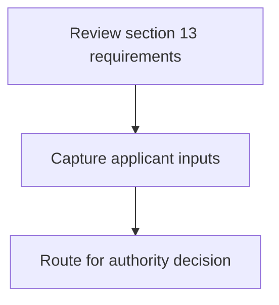
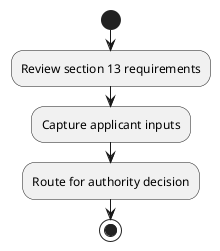

# Chapter 8 / Section 13: Jt. DGFT, Rajkot Jt. DGFT RA, Rajkot

**Chapter Title:** Quality Complaints and Trade Disputes

**Pages:** 2

**Purpose:** Defines the operational requirements for Jt. DGFT, Rajkot Jt. DGFT RA, Rajkot.

**Purpose Thanglish:** Indha Jt. DGFT, Rajkot Jt. DGFT RA, Rajkot section-la, Defines the operational requirements for Jt. DGFT, Rajkot Jt. DGFT RA, Rajkot.

**Summary:** 13. Jt. DGFT, Rajkot Jt.

**Business Meaning:** 13.

**Business Explanation:** 13. Jt. DGFT, Rajkot Jt.

**Business Explanation Thanglish:** Indha Jt. DGFT, Rajkot Jt. DGFT RA, Rajkot section-la, 13. Jt. DGFT, Rajkot Jt.

## Business Logic
- None identified

## Business Rules
- rule_id=CH8-SEC13-R001, rule_description=13. Jt. DGFT, Rajkot Jt., trigger=Jt. DGFT, Rajkot Jt. DGFT RA, Rajkot, condition=Not explicitly covered in uploaded documents., validation=Not explicitly covered in uploaded documents., action=Manual review required., exception=No explicit exception found in uploaded documents., output=DEKAI should produce a compliance decision for 13 - Jt. DGFT, Rajkot Jt. DGFT RA, Rajkot.

## Conditions
- None identified

## Condition Logic
- None identified

## Validations
- None identified

## Exceptions
- None identified

## Dependencies
- 1
- 3
- 4
- 5
- 6

## Authorities
- DGFT
- RA
- DGFT RA
- Kolkata and RA

## Required Documents
- None identified

## Timelines
- None identified

## Actions
- None identified

## Workflow
- Review section 13 requirements
- Capture applicant inputs
- Route for authority decision

## Workflow ASCII
```text
Jt. DGFT, Rajkot Jt. DGFT RA, Rajkot
Review section 13 requirements
   |
   v
Capture applicant inputs
   |
   v
Route for authority decision
```

## Decision Tree
- IF section 13 applies THEN proceed with standard DGFT workflow

## Decision Tree ASCII
```text
Jt. DGFT, Rajkot Jt. DGFT RA, Rajkot Decision
IF section 13 applies THEN proceed with standard DGFT workflow
```

## Examples
- User asks to process Jt. DGFT, Rajkot Jt. DGFT RA, Rajkot; the platform checks conditions, validations, and documents before action.

**Real-world Example:** Example: an importer or exporter invokes Jt. DGFT, Rajkot Jt. DGFT RA, Rajkot, submits the prescribed DGFT records, and DEKAI uses the extracted rules to follow the jt. dgft, rajkot jt. dgft ra, rajkot process.

**Real-world Example Thanglish:** Indha Jt. DGFT, Rajkot Jt. DGFT RA, Rajkot section-la, Example: an importer or exporter invokes Jt. DGFT, Rajkot Jt. DGFT RA, Rajkot, submits the prescribed DGFT records, and DEKAI uses the extracted rules to follow the jt. dgft, rajkot jt. dgft ra, rajkot process.

## AI Rules
- None identified

## Database Fields
- name=section_code, type=string, required=True, source=parsed_section_heading
- name=section_title, type=string, required=True, source=parsed_section_heading
- name=and_flag, type=boolean, required=False, source=keyword:and
- name=dgft_flag, type=boolean, required=False, source=keyword:DGFT
- name=zone_flag, type=boolean, required=False, source=keyword:Zone
- name=addl_flag, type=boolean, required=False, source=keyword:Addl
- name=rajkot_flag, type=boolean, required=False, source=keyword:Rajkot
- name=eastern_flag, type=boolean, required=False, source=keyword:Eastern
- name=kolkata_flag, type=boolean, required=False, source=keyword:Kolkata
- name=chennai_flag, type=boolean, required=False, source=keyword:Chennai

## API Requirements
- method=GET, path=/api/dgft/sections/13, purpose=Retrieve knowledge payload for section 13, query_params=['include=workflow,decision_tree,validations'], response_fields=['section', 'title', 'summary', 'conditions', 'validations', 'exceptions', 'workflow', 'decision_tree']
- method=POST, path=/api/dgft/Jt-DGFT-Rajkot-Jt-DGFT-RA-Rajkot/validate, purpose=Validate inputs and documents for Jt. DGFT, Rajkot Jt. DGFT RA, Rajkot, request_fields=['section_code', 'section_title'], response_fields=['status', 'errors', 'warnings', 'next_actions']

## UI Screens
- screen_id=Jt_DGFT_Rajkot_Jt_DGFT_RA_Rajkot_overview, name=Jt. DGFT, Rajkot Jt. DGFT RA, Rajkot Overview, purpose=Show section summary, authority, timeline, and eligibility cues., widgets=['summary_card', 'conditions_table', 'authority_badges', 'timeline_panel']
- screen_id=Jt_DGFT_Rajkot_Jt_DGFT_RA_Rajkot_submission, name=Jt. DGFT, Rajkot Jt. DGFT RA, Rajkot Submission, purpose=Capture applicant data and supporting documents., widgets=['dynamic_form', 'document_uploader', 'validation_panel', 'next_action_footer'], fields=['section_code', 'section_title', 'and_flag', 'dgft_flag', 'zone_flag', 'addl_flag', 'rajkot_flag', 'eastern_flag']

## Error Messages
- Validation failed because the section requirements were not fully met.

## FAQ
- question_en=What is the purpose of section 13?, answer_en=13. Jt. DGFT, Rajkot Jt., question_thanglish=Indha Jt. DGFT, Rajkot Jt. DGFT RA, Rajkot section-la, What is the purpose of section 13?, answer_thanglish=Indha Jt. DGFT, Rajkot Jt. DGFT RA, Rajkot section-la, 13. Jt. DGFT, Rajkot Jt.
- question_en=What documents are required under Jt. DGFT, Rajkot Jt. DGFT RA, Rajkot?, answer_en=Not explicitly covered in uploaded documents., question_thanglish=Indha Jt. DGFT, Rajkot Jt. DGFT RA, Rajkot section-la, What documents are required under Jt. DGFT, Rajkot Jt. DGFT RA, Rajkot?, answer_thanglish=Indha Jt. DGFT, Rajkot Jt. DGFT RA, Rajkot section-la, Not explicitly covered in uploaded documents.
- question_en=Which authority handles Jt. DGFT, Rajkot Jt. DGFT RA, Rajkot?, answer_en=DGFT, RA, DGFT RA, Kolkata and RA, question_thanglish=Indha Jt. DGFT, Rajkot Jt. DGFT RA, Rajkot section-la, Which authority handles Jt. DGFT, Rajkot Jt. DGFT RA, Rajkot?, answer_thanglish=Indha Jt. DGFT, Rajkot Jt. DGFT RA, Rajkot section-la, DGFT, RA, DGFT RA, Kolkata and RA

## Questions Users May Ask
- What does Jt. DGFT, Rajkot Jt. DGFT RA, Rajkot require?
- Which documents are needed for Jt. DGFT, Rajkot Jt. DGFT RA, Rajkot?
- How does DEKAI validate Jt. DGFT, Rajkot Jt. DGFT RA, Rajkot requests?

## Expected AI Answers
- Jt. DGFT, Rajkot Jt. DGFT RA, Rajkot requires the platform to interpret the section text, apply the extracted business rules, and present the correct next action.
- Required documents are inferred from the section text: no explicit documents were detected.
- DEKAI validates Jt. DGFT, Rajkot Jt. DGFT RA, Rajkot by checking conditions, required documents, authority references, and exception clauses before recommending an outcome.

## AI Q&A Examples
- question_en=User asks: How do I comply with Jt. DGFT, Rajkot Jt. DGFT RA, Rajkot?, answer_en=AI answers: DEKAI should evaluate section 13, apply the extracted rules, and guide the user through Review section 13 requirements., question_thanglish=Indha Jt. DGFT, Rajkot Jt. DGFT RA, Rajkot section-la, User asks: How do I comply with Jt. DGFT, Rajkot Jt. DGFT RA, Rajkot?, answer_thanglish=Indha Jt. DGFT, Rajkot Jt. DGFT RA, Rajkot section-la, AI answers: DEKAI should evaluate section 13, apply the extracted rules, and guide the user through Review section 13 requirements.
- question_en=User asks: Which validations apply to Jt. DGFT, Rajkot Jt. DGFT RA, Rajkot?, answer_en=AI answers: Applicable validations are not explicitly covered in the uploaded documents., question_thanglish=Indha Jt. DGFT, Rajkot Jt. DGFT RA, Rajkot section-la, User asks: Which validations apply to Jt. DGFT, Rajkot Jt. DGFT RA, Rajkot?, answer_thanglish=Indha Jt. DGFT, Rajkot Jt. DGFT RA, Rajkot section-la, AI answers: Applicable validations are not explicitly covered in the uploaded documents.

## DEKAI AI Implementation Notes
- Capture chapter 8, section 13, title, and page references as immutable knowledge metadata.
- Bind validations for Jt. DGFT, Rajkot Jt. DGFT RA, Rajkot into a rule engine keyed by the rule IDs extracted for this section.
- Route escalations or approvals to: DGFT, RA, DGFT RA, Kolkata and RA.
- Show contextual links to related sections: 1, 3, 4, 5, 6.

## DEKAI AI Implementation Notes Thanglish
- Indha Jt. DGFT, Rajkot Jt. DGFT RA, Rajkot section-la, Capture chapter 8, section 13, title, and page references as immutable knowledge metadata.
- Indha Jt. DGFT, Rajkot Jt. DGFT RA, Rajkot section-la, Bind validations for Jt. DGFT, Rajkot Jt. DGFT RA, Rajkot into a rule engine keyed by the rule IDs extracted for this section.
- Indha Jt. DGFT, Rajkot Jt. DGFT RA, Rajkot section-la, Route escalations or approvals to: DGFT, RA, DGFT RA, Kolkata and RA.
- Indha Jt. DGFT, Rajkot Jt. DGFT RA, Rajkot section-la, Show contextual links to related sections: 1, 3, 4, 5, 6.

## AI Metadata
- Keywords: and, DGFT, Zone, Addl, Rajkot, Eastern, Kolkata, Chennai, Guwahati, Southern, Bangalore
- Search Keywords: and, DGFT, Zone, Addl, Rajkot, Eastern, Kolkata, Chennai, Guwahati, Southern, Bangalore
- Intent: Provide knowledge guidance for Jt. DGFT, Rajkot Jt. DGFT RA, Rajkot.
- Tags: 13, Jt. DGFT, Rajkot Jt. DGFT RA, Rajkot, dgft
- Related Sections: 1, 3, 4, 5, 6
- Related Chapters: 
- Related Rules: 

## Mermaid


## PlantUML

