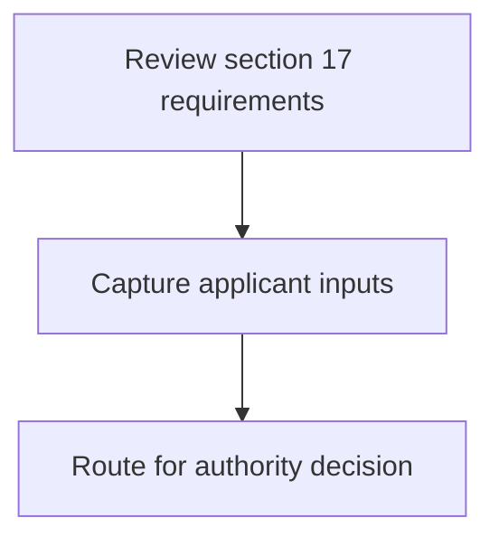
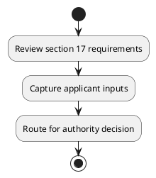

# Chapter 8 / Section 17: Addl. DGFT, Addl. DGFT RA, Hyderabad

**Chapter Title:** Quality Complaints and Trade Disputes

**Pages:** 2

**Purpose:** Defines the operational requirements for Addl. DGFT, Addl. DGFT RA, Hyderabad.

**Purpose Thanglish:** Indha Addl. DGFT, Addl. DGFT RA, Hyderabad section-la, Defines the operational requirements for Addl. DGFT, Addl. DGFT RA, Hyderabad.

**Summary:** 17. Addl. DGFT, Addl.

**Business Meaning:** 17.

**Business Explanation:** 17. Addl. DGFT, Addl.

**Business Explanation Thanglish:** Indha Addl. DGFT, Addl. DGFT RA, Hyderabad section-la, 17. Addl. DGFT, Addl.

## Business Logic
- None identified

## Business Rules
- rule_id=CH8-SEC17-R001, rule_description=17. Addl. DGFT, Addl., trigger=Addl. DGFT, Addl. DGFT RA, Hyderabad, condition=Not explicitly covered in uploaded documents., validation=Not explicitly covered in uploaded documents., action=Manual review required., exception=No explicit exception found in uploaded documents., output=DEKAI should produce a compliance decision for 17 - Addl. DGFT, Addl. DGFT RA, Hyderabad.

## Conditions
- None identified

## Condition Logic
- None identified

## Validations
- None identified

## Exceptions
- None identified

## Dependencies
- 13
- 1
- 2
- 3
- 4
- 5
- 6
- 7
- 8
- 9

## Authorities
- DGFT
- RA
- DGFT RA
- Mumbai and RA
- Kolkata and RA

## Required Documents
- None identified

## Timelines
- None identified

## Actions
- None identified

## Workflow
- Review section 17 requirements
- Capture applicant inputs
- Route for authority decision

## Workflow ASCII
```text
Addl. DGFT, Addl. DGFT RA, Hyderabad
Review section 17 requirements
   |
   v
Capture applicant inputs
   |
   v
Route for authority decision
```

## Decision Tree
- IF section 17 applies THEN proceed with standard DGFT workflow

## Decision Tree ASCII
```text
Addl. DGFT, Addl. DGFT RA, Hyderabad Decision
IF section 17 applies THEN proceed with standard DGFT workflow
```

## Examples
- User asks to process Addl. DGFT, Addl. DGFT RA, Hyderabad; the platform checks conditions, validations, and documents before action.

**Real-world Example:** Example: an importer or exporter invokes Addl. DGFT, Addl. DGFT RA, Hyderabad, submits the prescribed DGFT records, and DEKAI uses the extracted rules to follow the addl. dgft, addl. dgft ra, hyderabad process.

**Real-world Example Thanglish:** Indha Addl. DGFT, Addl. DGFT RA, Hyderabad section-la, Example: an importer or exporter invokes Addl. DGFT, Addl. DGFT RA, Hyderabad, submits the prescribed DGFT records, and DEKAI uses the extracted rules to follow the addl. dgft, addl. dgft ra, hyderabad process.

## AI Rules
- None identified

## Database Fields
- name=section_code, type=string, required=True, source=parsed_section_heading
- name=section_title, type=string, required=True, source=parsed_section_heading
- name=and_flag, type=boolean, required=False, source=keyword:and
- name=addl_flag, type=boolean, required=False, source=keyword:Addl
- name=dgft_flag, type=boolean, required=False, source=keyword:DGFT
- name=surat_flag, type=boolean, required=False, source=keyword:Surat
- name=trade_flag, type=boolean, required=False, source=keyword:Trade
- name=kanpur_flag, type=boolean, required=False, source=keyword:Kanpur
- name=mumbai_flag, type=boolean, required=False, source=keyword:Mumbai
- name=nagpur_flag, type=boolean, required=False, source=keyword:Nagpur

## API Requirements
- method=GET, path=/api/dgft/sections/17, purpose=Retrieve knowledge payload for section 17, query_params=['include=workflow,decision_tree,validations'], response_fields=['section', 'title', 'summary', 'conditions', 'validations', 'exceptions', 'workflow', 'decision_tree']
- method=POST, path=/api/dgft/Addl-DGFT-Addl-DGFT-RA-Hyderabad/validate, purpose=Validate inputs and documents for Addl. DGFT, Addl. DGFT RA, Hyderabad, request_fields=['section_code', 'section_title'], response_fields=['status', 'errors', 'warnings', 'next_actions']

## UI Screens
- screen_id=Addl_DGFT_Addl_DGFT_RA_Hyderabad_overview, name=Addl. DGFT, Addl. DGFT RA, Hyderabad Overview, purpose=Show section summary, authority, timeline, and eligibility cues., widgets=['summary_card', 'conditions_table', 'authority_badges', 'timeline_panel']
- screen_id=Addl_DGFT_Addl_DGFT_RA_Hyderabad_submission, name=Addl. DGFT, Addl. DGFT RA, Hyderabad Submission, purpose=Capture applicant data and supporting documents., widgets=['dynamic_form', 'document_uploader', 'validation_panel', 'next_action_footer'], fields=['section_code', 'section_title', 'and_flag', 'addl_flag', 'dgft_flag', 'surat_flag', 'trade_flag', 'kanpur_flag']

## Error Messages
- Validation failed because the section requirements were not fully met.

## FAQ
- question_en=What is the purpose of section 17?, answer_en=17. Addl. DGFT, Addl., question_thanglish=Indha Addl. DGFT, Addl. DGFT RA, Hyderabad section-la, What is the purpose of section 17?, answer_thanglish=Indha Addl. DGFT, Addl. DGFT RA, Hyderabad section-la, 17. Addl. DGFT, Addl.
- question_en=What documents are required under Addl. DGFT, Addl. DGFT RA, Hyderabad?, answer_en=Not explicitly covered in uploaded documents., question_thanglish=Indha Addl. DGFT, Addl. DGFT RA, Hyderabad section-la, What documents are required under Addl. DGFT, Addl. DGFT RA, Hyderabad?, answer_thanglish=Indha Addl. DGFT, Addl. DGFT RA, Hyderabad section-la, Not explicitly covered in uploaded documents.
- question_en=Which authority handles Addl. DGFT, Addl. DGFT RA, Hyderabad?, answer_en=DGFT, RA, DGFT RA, Mumbai and RA, Kolkata and RA, question_thanglish=Indha Addl. DGFT, Addl. DGFT RA, Hyderabad section-la, Which authority handles Addl. DGFT, Addl. DGFT RA, Hyderabad?, answer_thanglish=Indha Addl. DGFT, Addl. DGFT RA, Hyderabad section-la, DGFT, RA, DGFT RA, Mumbai and RA, Kolkata and RA

## Questions Users May Ask
- What does Addl. DGFT, Addl. DGFT RA, Hyderabad require?
- Which documents are needed for Addl. DGFT, Addl. DGFT RA, Hyderabad?
- How does DEKAI validate Addl. DGFT, Addl. DGFT RA, Hyderabad requests?

## Expected AI Answers
- Addl. DGFT, Addl. DGFT RA, Hyderabad requires the platform to interpret the section text, apply the extracted business rules, and present the correct next action.
- Required documents are inferred from the section text: no explicit documents were detected.
- DEKAI validates Addl. DGFT, Addl. DGFT RA, Hyderabad by checking conditions, required documents, authority references, and exception clauses before recommending an outcome.

## AI Q&A Examples
- question_en=User asks: How do I comply with Addl. DGFT, Addl. DGFT RA, Hyderabad?, answer_en=AI answers: DEKAI should evaluate section 17, apply the extracted rules, and guide the user through Review section 17 requirements., question_thanglish=Indha Addl. DGFT, Addl. DGFT RA, Hyderabad section-la, User asks: How do I comply with Addl. DGFT, Addl. DGFT RA, Hyderabad?, answer_thanglish=Indha Addl. DGFT, Addl. DGFT RA, Hyderabad section-la, AI answers: DEKAI should evaluate section 17, apply the extracted rules, and guide the user through Review section 17 requirements.
- question_en=User asks: Which validations apply to Addl. DGFT, Addl. DGFT RA, Hyderabad?, answer_en=AI answers: Applicable validations are not explicitly covered in the uploaded documents., question_thanglish=Indha Addl. DGFT, Addl. DGFT RA, Hyderabad section-la, User asks: Which validations apply to Addl. DGFT, Addl. DGFT RA, Hyderabad?, answer_thanglish=Indha Addl. DGFT, Addl. DGFT RA, Hyderabad section-la, AI answers: Applicable validations are not explicitly covered in the uploaded documents.

## DEKAI AI Implementation Notes
- Capture chapter 8, section 17, title, and page references as immutable knowledge metadata.
- Bind validations for Addl. DGFT, Addl. DGFT RA, Hyderabad into a rule engine keyed by the rule IDs extracted for this section.
- Route escalations or approvals to: DGFT, RA, DGFT RA, Mumbai and RA.
- Show contextual links to related sections: 13, 1, 2, 3, 4, 5, 6, 7, 8, 9.

## DEKAI AI Implementation Notes Thanglish
- Indha Addl. DGFT, Addl. DGFT RA, Hyderabad section-la, Capture chapter 8, section 17, title, and page references as immutable knowledge metadata.
- Indha Addl. DGFT, Addl. DGFT RA, Hyderabad section-la, Bind validations for Addl. DGFT, Addl. DGFT RA, Hyderabad into a rule engine keyed by the rule IDs extracted for this section.
- Indha Addl. DGFT, Addl. DGFT RA, Hyderabad section-la, Route escalations or approvals to: DGFT, RA, DGFT RA, Mumbai and RA.
- Indha Addl. DGFT, Addl. DGFT RA, Hyderabad section-la, Show contextual links to related sections: 13, 1, 2, 3, 4, 5, 6, 7, 8, 9.

## AI Metadata
- Keywords: and, Addl, DGFT, Surat, Trade, Kanpur, Mumbai, Nagpur, Rajkot, Panipat, Kolkata, Chennai, Quality, Varanasi, Vadodara, Guwahati, Chapter-, Disputes, Hyderabad, Complaints
- Search Keywords: and, Addl, DGFT, Surat, Trade, Kanpur, Mumbai, Nagpur, Rajkot, Panipat, Kolkata, Chennai, Quality, Varanasi, Vadodara, Guwahati, Chapter-, Disputes, Hyderabad, Complaints
- Intent: Provide knowledge guidance for Addl. DGFT, Addl. DGFT RA, Hyderabad.
- Tags: 17, Addl. DGFT, Addl. DGFT RA, Hyderabad, dgft
- Related Sections: 13, 1, 2, 3, 4, 5, 6, 7, 8, 9
- Related Chapters: 
- Related Rules: 

## Mermaid


## PlantUML

