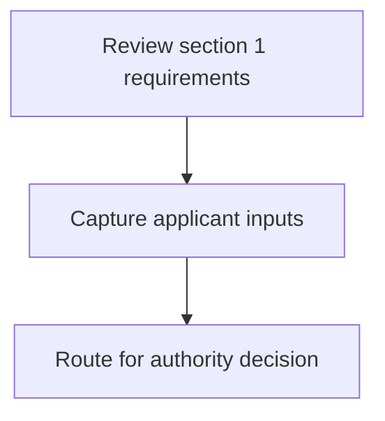
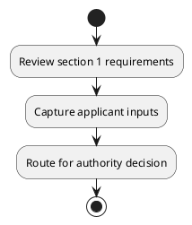

# Chapter 8 / Section 1: Additional DGFT/Joint DGFT/ (H.O.O):Chairperson

**Chapter Title:** Quality Complaints and Trade Disputes

**Pages:** 3

**Purpose:** Defines the operational requirements for Additional DGFT/Joint DGFT/ (H.O.O):Chairperson.

**Purpose Thanglish:** Indha Additional DGFT/Joint DGFT/ (H.O.O):Chairperson section-la, Defines the operational requirements for Additional DGFT/Joint DGFT/ (H.O.O):Chairperson.

**Summary:** 1. Additional DGFT/Joint DGFT/ (H.O.O):Chairperson

**Business Meaning:** 1.

**Business Explanation:** 1. Additional DGFT/Joint DGFT/ (H.O.O):Chairperson

**Business Explanation Thanglish:** Indha Additional DGFT/Joint DGFT/ (H.O.O):Chairperson section-la, 1. Additional DGFT/Joint DGFT/ (H.O.O):Chairperson

## Business Logic
- None identified

## Business Rules
- rule_id=CH8-SEC1-R001, rule_description=1. Additional DGFT/Joint DGFT/ (H.O.O):Chairperson, trigger=Additional DGFT/Joint DGFT/ (H.O.O):Chairperson, condition=Not explicitly covered in uploaded documents., validation=Not explicitly covered in uploaded documents., action=Manual review required., exception=No explicit exception found in uploaded documents., output=DEKAI should produce a compliance decision for 1 - Additional DGFT/Joint DGFT/ (H.O.O):Chairperson.

## Conditions
- None identified

## Condition Logic
- None identified

## Validations
- None identified

## Exceptions
- None identified

## Dependencies
- None identified

## Authorities
- DGFT
- Additional DGFT/Joint DGFT

## Required Documents
- None identified

## Timelines
- None identified

## Actions
- None identified

## Workflow
- Review section 1 requirements
- Capture applicant inputs
- Route for authority decision

## Workflow ASCII
```text
Additional DGFT/Joint DGFT/ (H.O.O):Chairperson
Review section 1 requirements
   |
   v
Capture applicant inputs
   |
   v
Route for authority decision
```

## Decision Tree
- IF section 1 applies THEN proceed with standard DGFT workflow

## Decision Tree ASCII
```text
Additional DGFT/Joint DGFT/ (H.O.O):Chairperson Decision
IF section 1 applies THEN proceed with standard DGFT workflow
```

## Examples
- User asks to process Additional DGFT/Joint DGFT/ (H.O.O):Chairperson; the platform checks conditions, validations, and documents before action.

**Real-world Example:** Example: an importer or exporter invokes Additional DGFT/Joint DGFT/ (H.O.O):Chairperson, submits the prescribed DGFT records, and DEKAI uses the extracted rules to follow the additional dgft/joint dgft/ (h.o.o):chairperson process.

**Real-world Example Thanglish:** Indha Additional DGFT/Joint DGFT/ (H.O.O):Chairperson section-la, Example: an importer or exporter invokes Additional DGFT/Joint DGFT/ (H.O.O):Chairperson, submits the prescribed DGFT records, and DEKAI uses the extracted rules to follow the additional dgft/joint dgft/ (h.o.o):chairperson process.

## AI Rules
- None identified

## Database Fields
- name=section_code, type=string, required=True, source=parsed_section_heading
- name=section_title, type=string, required=True, source=parsed_section_heading
- name=dgft_flag, type=boolean, required=False, source=keyword:DGFT
- name=additional_flag, type=boolean, required=False, source=keyword:Additional
- name=dgft_joint_flag, type=boolean, required=False, source=keyword:DGFT/Joint
- name=chairperson_flag, type=boolean, required=False, source=keyword:Chairperson

## API Requirements
- method=GET, path=/api/dgft/sections/1, purpose=Retrieve knowledge payload for section 1, query_params=['include=workflow,decision_tree,validations'], response_fields=['section', 'title', 'summary', 'conditions', 'validations', 'exceptions', 'workflow', 'decision_tree']
- method=POST, path=/api/dgft/Additional-DGFT-Joint-DGFT-H-O-O-Chairperson/validate, purpose=Validate inputs and documents for Additional DGFT/Joint DGFT/ (H.O.O):Chairperson, request_fields=['section_code', 'section_title'], response_fields=['status', 'errors', 'warnings', 'next_actions']

## UI Screens
- screen_id=Additional_DGFT_Joint_DGFT_H_O_O_Chairperson_overview, name=Additional DGFT/Joint DGFT/ (H.O.O):Chairperson Overview, purpose=Show section summary, authority, timeline, and eligibility cues., widgets=['summary_card', 'conditions_table', 'authority_badges', 'timeline_panel']
- screen_id=Additional_DGFT_Joint_DGFT_H_O_O_Chairperson_submission, name=Additional DGFT/Joint DGFT/ (H.O.O):Chairperson Submission, purpose=Capture applicant data and supporting documents., widgets=['dynamic_form', 'document_uploader', 'validation_panel', 'next_action_footer'], fields=['section_code', 'section_title', 'dgft_flag', 'additional_flag', 'dgft_joint_flag', 'chairperson_flag']

## Error Messages
- Validation failed because the section requirements were not fully met.

## FAQ
- question_en=What is the purpose of section 1?, answer_en=1. Additional DGFT/Joint DGFT/ (H.O.O):Chairperson, question_thanglish=Indha Additional DGFT/Joint DGFT/ (H.O.O):Chairperson section-la, What is the purpose of section 1?, answer_thanglish=Indha Additional DGFT/Joint DGFT/ (H.O.O):Chairperson section-la, 1. Additional DGFT/Joint DGFT/ (H.O.O):Chairperson
- question_en=What documents are required under Additional DGFT/Joint DGFT/ (H.O.O):Chairperson?, answer_en=Not explicitly covered in uploaded documents., question_thanglish=Indha Additional DGFT/Joint DGFT/ (H.O.O):Chairperson section-la, What documents are required under Additional DGFT/Joint DGFT/ (H.O.O):Chairperson?, answer_thanglish=Indha Additional DGFT/Joint DGFT/ (H.O.O):Chairperson section-la, Not explicitly covered in uploaded documents.
- question_en=Which authority handles Additional DGFT/Joint DGFT/ (H.O.O):Chairperson?, answer_en=DGFT, Additional DGFT/Joint DGFT, question_thanglish=Indha Additional DGFT/Joint DGFT/ (H.O.O):Chairperson section-la, Which authority handles Additional DGFT/Joint DGFT/ (H.O.O):Chairperson?, answer_thanglish=Indha Additional DGFT/Joint DGFT/ (H.O.O):Chairperson section-la, DGFT, Additional DGFT/Joint DGFT

## Questions Users May Ask
- What does Additional DGFT/Joint DGFT/ (H.O.O):Chairperson require?
- Which documents are needed for Additional DGFT/Joint DGFT/ (H.O.O):Chairperson?
- How does DEKAI validate Additional DGFT/Joint DGFT/ (H.O.O):Chairperson requests?

## Expected AI Answers
- Additional DGFT/Joint DGFT/ (H.O.O):Chairperson requires the platform to interpret the section text, apply the extracted business rules, and present the correct next action.
- Required documents are inferred from the section text: no explicit documents were detected.
- DEKAI validates Additional DGFT/Joint DGFT/ (H.O.O):Chairperson by checking conditions, required documents, authority references, and exception clauses before recommending an outcome.

## AI Q&A Examples
- question_en=User asks: How do I comply with Additional DGFT/Joint DGFT/ (H.O.O):Chairperson?, answer_en=AI answers: DEKAI should evaluate section 1, apply the extracted rules, and guide the user through Review section 1 requirements., question_thanglish=Indha Additional DGFT/Joint DGFT/ (H.O.O):Chairperson section-la, User asks: How do I comply with Additional DGFT/Joint DGFT/ (H.O.O):Chairperson?, answer_thanglish=Indha Additional DGFT/Joint DGFT/ (H.O.O):Chairperson section-la, AI answers: DEKAI should evaluate section 1, apply the extracted rules, and guide the user through Review section 1 requirements.
- question_en=User asks: Which validations apply to Additional DGFT/Joint DGFT/ (H.O.O):Chairperson?, answer_en=AI answers: Applicable validations are not explicitly covered in the uploaded documents., question_thanglish=Indha Additional DGFT/Joint DGFT/ (H.O.O):Chairperson section-la, User asks: Which validations apply to Additional DGFT/Joint DGFT/ (H.O.O):Chairperson?, answer_thanglish=Indha Additional DGFT/Joint DGFT/ (H.O.O):Chairperson section-la, AI answers: Applicable validations are not explicitly covered in the uploaded documents.

## DEKAI AI Implementation Notes
- Capture chapter 8, section 1, title, and page references as immutable knowledge metadata.
- Bind validations for Additional DGFT/Joint DGFT/ (H.O.O):Chairperson into a rule engine keyed by the rule IDs extracted for this section.
- Route escalations or approvals to: DGFT, Additional DGFT/Joint DGFT.

## DEKAI AI Implementation Notes Thanglish
- Indha Additional DGFT/Joint DGFT/ (H.O.O):Chairperson section-la, Capture chapter 8, section 1, title, and page references as immutable knowledge metadata.
- Indha Additional DGFT/Joint DGFT/ (H.O.O):Chairperson section-la, Bind validations for Additional DGFT/Joint DGFT/ (H.O.O):Chairperson into a rule engine keyed by the rule IDs extracted for this section.
- Indha Additional DGFT/Joint DGFT/ (H.O.O):Chairperson section-la, Route escalations or approvals to: DGFT, Additional DGFT/Joint DGFT.

## AI Metadata
- Keywords: DGFT, Additional, DGFT/Joint, Chairperson
- Search Keywords: DGFT, Additional, DGFT/Joint, Chairperson
- Intent: Provide knowledge guidance for Additional DGFT/Joint DGFT/ (H.O.O):Chairperson.
- Tags: 1, Additional DGFT/Joint DGFT/ (H.O.O):Chairperson, dgft
- Related Sections: 
- Related Chapters: 
- Related Rules: 

## Mermaid


## PlantUML

