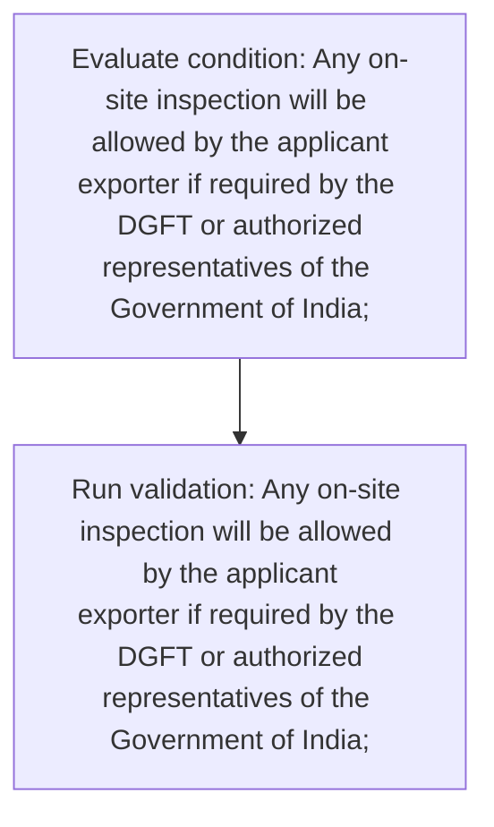
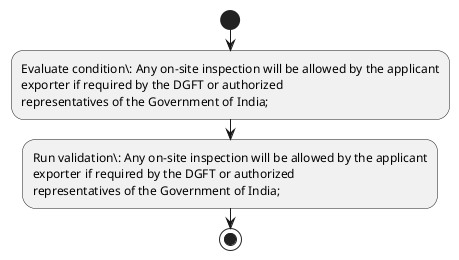

# Chapter 10 / Section 1: Any on-site inspection will be allowed by the applicant

**Chapter Title:** SCOMET: Special Chemicals, Organisms, Materials, Equipment and Technologies

**Pages:** 29

**Purpose:** Defines the operational requirements for Any on-site inspection will be allowed by the applicant.

**Purpose Thanglish:** Indha Any on-site inspection will be allowed by the applicant section-la, Defines the operational requirements for Any on-site inspection will be allowed by the applicant.

**Summary:** 1. Any on-site inspection will be allowed by the applicant
exporter if required by the DGFT or authorized
representatives of the Government of India;

**Business Meaning:** 1.

**Business Explanation:** 1. Any on-site inspection will be allowed by the applicant
exporter if required by the DGFT or authorized
representatives of the Government of India;

**Business Explanation Thanglish:** Indha Any on-site inspection will be allowed by the applicant section-la, 1. Any on-site inspection will be allowed by the applicant
exporter if required by the DGFT or authorized
representatives of the Government of India;

## Business Logic
- None identified

## Business Rules
- rule_id=CH10-SEC1-R001, rule_description=1. Any on-site inspection will be allowed by the applicant
exporter if required by the DGFT or authorized
representatives of the Government of India;, trigger=Any on-site inspection will be allowed by the applicant, condition=Any on-site inspection will be allowed by the applicant
exporter if required by the DGFT or authorized
representatives of the Government of India;, validation=Any on-site inspection will be allowed by the applicant
exporter if required by the DGFT or authorized
representatives of the Government of India;, action=Manual review required., exception=No explicit exception found in uploaded documents., output=DEKAI should produce a compliance decision for 1 - Any on-site inspection will be allowed by the applicant.

## Conditions
- Any on-site inspection will be allowed by the applicant
exporter if required by the DGFT or authorized
representatives of the Government of India;

## Condition Logic
- id=10.1.1, if=Any on-site inspection will be allowed by the applicant
exporter if required by the DGFT or authorized
representatives of the Government of India;, then=Route for review, source=Any on-site inspection will be allowed by the applicant
exporter if required by the DGFT or authorized
representatives of the Government of India;

## Validations
- Any on-site inspection will be allowed by the applicant
exporter if required by the DGFT or authorized
representatives of the Government of India;

## Exceptions
- None identified

## Dependencies
- None identified

## Authorities
- DGFT

## Required Documents
- None identified

## Timelines
- None identified

## Actions
- None identified

## Workflow
- Evaluate condition: Any on-site inspection will be allowed by the applicant
exporter if required by the DGFT or authorized
representatives of the Government of India;
- Run validation: Any on-site inspection will be allowed by the applicant
exporter if required by the DGFT or authorized
representatives of the Government of India;

## Workflow ASCII
```text
Any on-site inspection will be allowed by the applicant
Evaluate condition: Any on-site inspection will be allowed by the applicant
exporter if required by the DGFT or authorized
representatives of the Government of India;
   |
   v
Run validation: Any on-site inspection will be allowed by the applicant
exporter if required by the DGFT or authorized
representatives of the Government of India;
```

## Decision Tree
- IF section 1 applies THEN proceed with standard DGFT workflow

## Decision Tree ASCII
```text
Any on-site inspection will be allowed by the applicant Decision
IF section 1 applies THEN proceed with standard DGFT workflow
```

## Examples
- User asks to process Any on-site inspection will be allowed by the applicant; the platform checks conditions, validations, and documents before action.

**Real-world Example:** Example: an importer or exporter invokes Any on-site inspection will be allowed by the applicant, submits the prescribed DGFT records, and DEKAI uses the extracted rules to follow the any on-site inspection will be allowed by the applicant process.

**Real-world Example Thanglish:** Indha Any on-site inspection will be allowed by the applicant section-la, Example: an importer or exporter invokes Any on-site inspection will be allowed by the applicant, submits the prescribed DGFT records, and DEKAI uses the extracted rules to follow the any on-site inspection will be allowed by the applicant process.

## AI Rules
- None identified

## Database Fields
- name=section_code, type=string, required=True, source=parsed_section_heading
- name=section_title, type=string, required=True, source=parsed_section_heading
- name=any_flag, type=boolean, required=False, source=keyword:Any
- name=the_flag, type=boolean, required=False, source=keyword:the
- name=will_flag, type=boolean, required=False, source=keyword:will
- name=dgft_flag, type=boolean, required=False, source=keyword:DGFT
- name=india_flag, type=boolean, required=False, source=keyword:India
- name=on_site_flag, type=boolean, required=False, source=keyword:on-site
- name=allowed_flag, type=boolean, required=False, source=keyword:allowed
- name=exporter_flag, type=boolean, required=False, source=keyword:exporter

## API Requirements
- method=GET, path=/api/dgft/sections/1, purpose=Retrieve knowledge payload for section 1, query_params=['include=workflow,decision_tree,validations'], response_fields=['section', 'title', 'summary', 'conditions', 'validations', 'exceptions', 'workflow', 'decision_tree']
- method=POST, path=/api/dgft/Any-on-site-inspection-will-be-allowed-by-the-applicant/validate, purpose=Validate inputs and documents for Any on-site inspection will be allowed by the applicant, request_fields=['section_code', 'section_title'], response_fields=['status', 'errors', 'warnings', 'next_actions']

## UI Screens
- screen_id=Any_on_site_inspection_will_be_allowed_by_the_applicant_overview, name=Any on-site inspection will be allowed by the applicant Overview, purpose=Show section summary, authority, timeline, and eligibility cues., widgets=['summary_card', 'conditions_table', 'authority_badges', 'timeline_panel']
- screen_id=Any_on_site_inspection_will_be_allowed_by_the_applicant_submission, name=Any on-site inspection will be allowed by the applicant Submission, purpose=Capture applicant data and supporting documents., widgets=['dynamic_form', 'document_uploader', 'validation_panel', 'next_action_footer'], fields=['section_code', 'section_title', 'any_flag', 'the_flag', 'will_flag', 'dgft_flag', 'india_flag', 'on_site_flag']

## Error Messages
- Validation failed because the section requirements were not fully met.

## FAQ
- question_en=What is the purpose of section 1?, answer_en=1. Any on-site inspection will be allowed by the applicant
exporter if required by the DGFT or authorized
representatives of the Government of India;, question_thanglish=Indha Any on-site inspection will be allowed by the applicant section-la, What is the purpose of section 1?, answer_thanglish=Indha Any on-site inspection will be allowed by the applicant section-la, 1. Any on-site inspection will be allowed by the applicant
exporter if required by the DGFT or authorized
representatives of the Government of India;
- question_en=What documents are required under Any on-site inspection will be allowed by the applicant?, answer_en=Not explicitly covered in uploaded documents., question_thanglish=Indha Any on-site inspection will be allowed by the applicant section-la, What documents are required under Any on-site inspection will be allowed by the applicant?, answer_thanglish=Indha Any on-site inspection will be allowed by the applicant section-la, Not explicitly covered in uploaded documents.
- question_en=Which authority handles Any on-site inspection will be allowed by the applicant?, answer_en=DGFT, question_thanglish=Indha Any on-site inspection will be allowed by the applicant section-la, Which authority handles Any on-site inspection will be allowed by the applicant?, answer_thanglish=Indha Any on-site inspection will be allowed by the applicant section-la, DGFT

## Questions Users May Ask
- What does Any on-site inspection will be allowed by the applicant require?
- Which documents are needed for Any on-site inspection will be allowed by the applicant?
- How does DEKAI validate Any on-site inspection will be allowed by the applicant requests?

## Expected AI Answers
- Any on-site inspection will be allowed by the applicant requires the platform to interpret the section text, apply the extracted business rules, and present the correct next action.
- Required documents are inferred from the section text: no explicit documents were detected.
- DEKAI validates Any on-site inspection will be allowed by the applicant by checking conditions, required documents, authority references, and exception clauses before recommending an outcome.

## AI Q&A Examples
- question_en=User asks: How do I comply with Any on-site inspection will be allowed by the applicant?, answer_en=AI answers: DEKAI should evaluate section 1, apply the extracted rules, and guide the user through Evaluate condition: Any on-site inspection will be allowed by the applicant
exporter if required by the DGFT or authorized
representatives of the Government of India;., question_thanglish=Indha Any on-site inspection will be allowed by the applicant section-la, User asks: How do I comply with Any on-site inspection will be allowed by the applicant?, answer_thanglish=Indha Any on-site inspection will be allowed by the applicant section-la, AI answers: DEKAI should evaluate section 1, apply the extracted rules, and guide the user through Evaluate condition: Any on-site inspection will be allowed by the applicant
exporter if required by the DGFT or authorized
representatives of the Government of India;.
- question_en=User asks: Which validations apply to Any on-site inspection will be allowed by the applicant?, answer_en=AI answers: Applicable validations are Any on-site inspection will be allowed by the applicant
exporter if required by the DGFT or authorized
representatives of the Government of India;, question_thanglish=Indha Any on-site inspection will be allowed by the applicant section-la, User asks: Which validations apply to Any on-site inspection will be allowed by the applicant?, answer_thanglish=Indha Any on-site inspection will be allowed by the applicant section-la, AI answers: Applicable validations are Any on-site inspection will be allowed by the applicant
exporter if required by the DGFT or authorized
representatives of the Government of India;

## DEKAI AI Implementation Notes
- Capture chapter 10, section 1, title, and page references as immutable knowledge metadata.
- Bind validations for Any on-site inspection will be allowed by the applicant into a rule engine keyed by the rule IDs extracted for this section.
- Route escalations or approvals to: DGFT.

## DEKAI AI Implementation Notes Thanglish
- Indha Any on-site inspection will be allowed by the applicant section-la, Capture chapter 10, section 1, title, and page references as immutable knowledge metadata.
- Indha Any on-site inspection will be allowed by the applicant section-la, Bind validations for Any on-site inspection will be allowed by the applicant into a rule engine keyed by the rule IDs extracted for this section.
- Indha Any on-site inspection will be allowed by the applicant section-la, Route escalations or approvals to: DGFT.

## AI Metadata
- Keywords: Any, the, will, DGFT, India, on-site, allowed, exporter, required, applicant, inspection, authorized, Government, representatives
- Search Keywords: Any, the, will, DGFT, India, on-site, allowed, exporter, required, applicant, inspection, authorized, Government, representatives
- Intent: Provide knowledge guidance for Any on-site inspection will be allowed by the applicant.
- Tags: 1, Any on-site inspection will be allowed by the applicant, dgft
- Related Sections: 
- Related Chapters: 
- Related Rules: 

## Mermaid


## PlantUML

