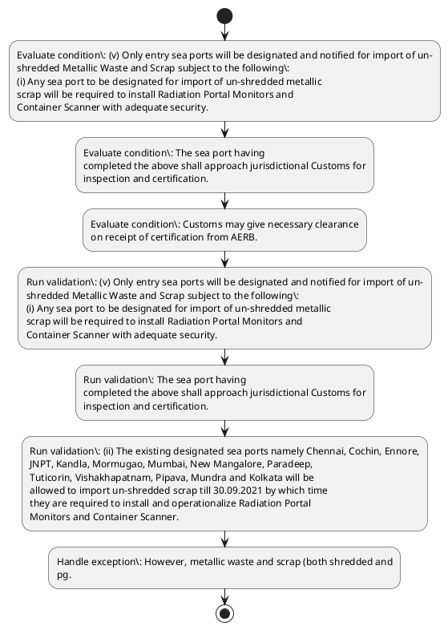

# Chapter 2 / Section 1: Chennai, 2. Cochin, 3. Ennore, 4. JNPT, 5. Kandla, 6. Mormugao, 7.

**Chapter Title:** General Provisions Regarding Imports and Exports

**Pages:** 22, 23

**Purpose:** Defines the operational requirements for Chennai, 2. Cochin, 3. Ennore, 4. JNPT, 5. Kandla, 6. Mormugao, 7..

**Purpose Thanglish:** Indha Chennai, 2. Cochin, 3. Ennore, 4. JNPT, 5. Kandla, 6. Mormugao, 7. section-la, Defines the operational requirements for Chennai, 2. Cochin, 3. Ennore, 4. JNPT, 5. Kandla, 6. Mormugao, 7..

**Summary:** 1. Chennai, 2. Cochin, 3.

**Business Meaning:** Chennai, 2. Cochin, 3. Ennore, 4. JNPT, 5. Kandla, 6. Mormugao, 7. governs how DGFT business controls should be applied, validated, and enforced.

**Business Explanation:** Chennai, 2. Cochin, 3. Ennore, 4. JNPT, 5. Kandla, 6. Mormugao, 7. explains the operating rule set that DEKAI should enforce. Key control points include (v) Only entry sea ports will be designated and notified for import of un-
shredded Metallic Waste and Scrap subject to the following:
(i) Any sea port to be designated for import of un–shredded metallic
scrap will be required to install Radiation Portal Monitors and
Container Scanner with adequate security.

**Business Explanation Thanglish:** Indha Chennai, 2. Cochin, 3. Ennore, 4. JNPT, 5. Kandla, 6. Mormugao, 7. section-la, Chennai, 2. Cochin, 3. Ennore, 4. JNPT, 5. Kandla, 6. Mormugao, 7. explains the operating rule set that DEKAI should enforce. Key control points include (v) Only entry sea ports will be designated and notified for import of un-
shredded Metallic Waste and Scrap subject to the following:
(i) Any sea port to be designated for import of un–shredded metallic
scrap will be required to install Radiation Portal Monitors and
Container Scanner with adequate security.

## Business Logic
- (v) Only entry sea ports will be designated and notified for import of un-
shredded Metallic Waste and Scrap subject to the following:
(i) Any sea port to be designated for import of un–shredded metallic
scrap will be required to install Radiation Portal Monitors and
Container Scanner with adequate security.
- The sea port having
completed the above shall approach jurisdictional Customs for
inspection and certification.
- (ii) The existing designated sea ports namely Chennai, Cochin, Ennore,
JNPT, Kandla, Mormugao, Mumbai, New Mangalore, Paradeep,
Tuticorin, Vishakhapatnam, Pipava, Mundra and Kolkata will be
allowed to import un-shredded scrap till 30.09.2021 by which time
they are required to install and operationalize Radiation Portal
Monitors and Container Scanner.
- (iv) Import consignments of metallic waste and scrap shall be subject to
pre-shipment inspection certificate (PSIC) from the country of
origin.
- (v) Only entry sea ports will be designated and notified for import of un-
shredded Metallic Waste and Scrap subject to the following:
(i)
Any sea port to be designated for import of un–shredded metallic
scrap will be required to install Radiation Portal Monitors and
Container Scanner with adequate security.
- (ii)
The existing designated sea ports namely Chennai, Cochin, Ennore,
JNPT, Kandla, Mormugao, Mumbai, New Mangalore, Paradeep,
Tuticorin, Vishakhapatnam, Pipava, Mundra and Kolkata will be
allowed to import un-shredded scrap till 30.09.2021 by which time
they are required to install and operationalize Radiation Portal
Monitors and Container Scanner.
- (iv)
Import consignments of metallic waste and scrap shall be subject to
pre-shipment inspection certificate (PSIC) from the country of
origin.
- These will however be subject to radiation
and explosive checks through portal monitors and container
scanner at these ports.
- Import through remaining
eight (8) other ports (for both shredded and unshredded scrap /
waste), irrespective of country of origin, will be subject to PSIC.

## Business Rules
- rule_id=CH2-SEC1-R001, rule_description=(v) Only entry sea ports will be designated and notified for import of un-
shredded Metallic Waste and Scrap subject to the following:
(i) Any sea port to be designated for import of un–shredded metallic
scrap will be required to install Radiation Portal Monitors and
Container Scanner with adequate security., trigger=Chennai, 2. Cochin, 3. Ennore, 4. JNPT, 5. Kandla, 6. Mormugao, 7., condition=(v) Only entry sea ports will be designated and notified for import of un-
shredded Metallic Waste and Scrap subject to the following:
(i) Any sea port to be designated for import of un–shredded metallic
scrap will be required to install Radiation Portal Monitors and
Container Scanner with adequate security., validation=(v) Only entry sea ports will be designated and notified for import of un-
shredded Metallic Waste and Scrap subject to the following:
(i) Any sea port to be designated for import of un–shredded metallic
scrap will be required to install Radiation Portal Monitors and
Container Scanner with adequate security., action=Manual review required., exception=However, metallic waste and scrap (both shredded and
pg., output=DEKAI should produce a compliance decision for 1 - Chennai, 2. Cochin, 3. Ennore, 4. JNPT, 5. Kandla, 6. Mormugao, 7..
- rule_id=CH2-SEC1-R002, rule_description=The sea port having
completed the above shall approach jurisdictional Customs for
inspection and certification., trigger=Chennai, 2. Cochin, 3. Ennore, 4. JNPT, 5. Kandla, 6. Mormugao, 7., condition=The sea port having
completed the above shall approach jurisdictional Customs for
inspection and certification., validation=The sea port having
completed the above shall approach jurisdictional Customs for
inspection and certification., action=Manual review required., exception=(iv)
Import of scrap would take place only through following designated
ports and no exceptions would be allowed even in case of EOUs, SEZs: -
1., output=DEKAI should produce a compliance decision for 1 - Chennai, 2. Cochin, 3. Ennore, 4. JNPT, 5. Kandla, 6. Mormugao, 7..
- rule_id=CH2-SEC1-R003, rule_description=(ii) The existing designated sea ports namely Chennai, Cochin, Ennore,
JNPT, Kandla, Mormugao, Mumbai, New Mangalore, Paradeep,
Tuticorin, Vishakhapatnam, Pipava, Mundra and Kolkata will be
allowed to import un-shredded scrap till 30.09.2021 by which time
they are required to install and operationalize Radiation Portal
Monitors and Container Scanner., trigger=Chennai, 2. Cochin, 3. Ennore, 4. JNPT, 5. Kandla, 6. Mormugao, 7., condition=Customs may give necessary clearance
on receipt of certification from AERB., validation=(ii) The existing designated sea ports namely Chennai, Cochin, Ennore,
JNPT, Kandla, Mormugao, Mumbai, New Mangalore, Paradeep,
Tuticorin, Vishakhapatnam, Pipava, Mundra and Kolkata will be
allowed to import un-shredded scrap till 30.09.2021 by which time
they are required to install and operationalize Radiation Portal
Monitors and Container Scanner., action=Manual review required., exception=These will however be subject to radiation
and explosive checks through portal monitors and container
scanner at these ports., output=DEKAI should produce a compliance decision for 1 - Chennai, 2. Cochin, 3. Ennore, 4. JNPT, 5. Kandla, 6. Mormugao, 7..
- rule_id=CH2-SEC1-R004, rule_description=(iv) Import consignments of metallic waste and scrap shall be subject to
pre-shipment inspection certificate (PSIC) from the country of
origin., trigger=Chennai, 2. Cochin, 3. Ennore, 4. JNPT, 5. Kandla, 6. Mormugao, 7., condition=On getting clearance from
Customs, DGFT will notify such a port as designated port for import
of un–shredded scrap., validation=(iv) Import consignments of metallic waste and scrap shall be subject to
pre-shipment inspection certificate (PSIC) from the country of
origin., action=Manual review required., exception=These will however be subject to radiation
and explosive checks through portal monitors and container
scanner at these ports., output=DEKAI should produce a compliance decision for 1 - Chennai, 2. Cochin, 3. Ennore, 4. JNPT, 5. Kandla, 6. Mormugao, 7..
- rule_id=CH2-SEC1-R005, rule_description=(v) Only entry sea ports will be designated and notified for import of un-
shredded Metallic Waste and Scrap subject to the following:
(i)
Any sea port to be designated for import of un–shredded metallic
scrap will be required to install Radiation Portal Monitors and
Container Scanner with adequate security., trigger=Chennai, 2. Cochin, 3. Ennore, 4. JNPT, 5. Kandla, 6. Mormugao, 7., condition=01.10.2021
(iii) Further, any ICD can handle clearance of un–shredded metallic
scrap provided the same passes through any of the designated sea
ports as mentioned above or any new ports to be
notified/designated from time to time, where Radiation Portal
Monitors and Container Scanner are in operation and the
consignment is subjected to risk-based scanning/ monitoring as per
the protocol laid down by Customs., validation=(v) Only entry sea ports will be designated and notified for import of un-
shredded Metallic Waste and Scrap subject to the following:
(i)
Any sea port to be designated for import of un–shredded metallic
scrap will be required to install Radiation Portal Monitors and
Container Scanner with adequate security., action=Manual review required., exception=These will however be subject to radiation
and explosive checks through portal monitors and container
scanner at these ports., output=DEKAI should produce a compliance decision for 1 - Chennai, 2. Cochin, 3. Ennore, 4. JNPT, 5. Kandla, 6. Mormugao, 7..
- rule_id=CH2-SEC1-R006, rule_description=(ii)
The existing designated sea ports namely Chennai, Cochin, Ennore,
JNPT, Kandla, Mormugao, Mumbai, New Mangalore, Paradeep,
Tuticorin, Vishakhapatnam, Pipava, Mundra and Kolkata will be
allowed to import un-shredded scrap till 30.09.2021 by which time
they are required to install and operationalize Radiation Portal
Monitors and Container Scanner., trigger=Chennai, 2. Cochin, 3. Ennore, 4. JNPT, 5. Kandla, 6. Mormugao, 7., condition=(iv) Import consignments of metallic waste and scrap shall be subject to
pre-shipment inspection certificate (PSIC) from the country of
origin., validation=(ii)
The existing designated sea ports namely Chennai, Cochin, Ennore,
JNPT, Kandla, Mormugao, Mumbai, New Mangalore, Paradeep,
Tuticorin, Vishakhapatnam, Pipava, Mundra and Kolkata will be
allowed to import un-shredded scrap till 30.09.2021 by which time
they are required to install and operationalize Radiation Portal
Monitors and Container Scanner., action=Manual review required., exception=These will however be subject to radiation
and explosive checks through portal monitors and container
scanner at these ports., output=DEKAI should produce a compliance decision for 1 - Chennai, 2. Cochin, 3. Ennore, 4. JNPT, 5. Kandla, 6. Mormugao, 7..
- rule_id=CH2-SEC1-R007, rule_description=(iv)
Import consignments of metallic waste and scrap shall be subject to
pre-shipment inspection certificate (PSIC) from the country of
origin., trigger=Chennai, 2. Cochin, 3. Ennore, 4. JNPT, 5. Kandla, 6. Mormugao, 7., condition=(iv)
Import of scrap would take place only through following designated
ports and no exceptions would be allowed even in case of EOUs, SEZs: -
1., validation=(iv)
Import consignments of metallic waste and scrap shall be subject to
pre-shipment inspection certificate (PSIC) from the country of
origin., action=Manual review required., exception=These will however be subject to radiation
and explosive checks through portal monitors and container
scanner at these ports., output=DEKAI should produce a compliance decision for 1 - Chennai, 2. Cochin, 3. Ennore, 4. JNPT, 5. Kandla, 6. Mormugao, 7..
- rule_id=CH2-SEC1-R008, rule_description=These will however be subject to radiation
and explosive checks through portal monitors and container
scanner at these ports., trigger=Chennai, 2. Cochin, 3. Ennore, 4. JNPT, 5. Kandla, 6. Mormugao, 7., condition=(v) Only entry sea ports will be designated and notified for import of un-
shredded Metallic Waste and Scrap subject to the following:
(i)
Any sea port to be designated for import of un–shredded metallic
scrap will be required to install Radiation Portal Monitors and
Container Scanner with adequate security., validation=(iv)
Import consignments of metallic waste and scrap shall be subject to
pre-shipment inspection certificate (PSIC) from the country of
origin., action=Manual review required., exception=These will however be subject to radiation
and explosive checks through portal monitors and container
scanner at these ports., output=DEKAI should produce a compliance decision for 1 - Chennai, 2. Cochin, 3. Ennore, 4. JNPT, 5. Kandla, 6. Mormugao, 7..
- rule_id=CH2-SEC1-R009, rule_description=Import through remaining
eight (8) other ports (for both shredded and unshredded scrap /
waste), irrespective of country of origin, will be subject to PSIC., trigger=Chennai, 2. Cochin, 3. Ennore, 4. JNPT, 5. Kandla, 6. Mormugao, 7., condition=01.10.2021
(iii)
Further, any ICD can handle clearance of un–shredded metallic
scrap provided the same passes through any of the designated sea
ports
as
mentioned
above
or
any
new
ports
to
be
notified/designated from time to time, where Radiation Portal
Monitors and Container Scanner are in operation and the
consignment is subjected to risk-based scanning/ monitoring as per
the protocol laid down by Customs., validation=(iv)
Import consignments of metallic waste and scrap shall be subject to
pre-shipment inspection certificate (PSIC) from the country of
origin., action=Manual review required., exception=These will however be subject to radiation
and explosive checks through portal monitors and container
scanner at these ports., output=DEKAI should produce a compliance decision for 1 - Chennai, 2. Cochin, 3. Ennore, 4. JNPT, 5. Kandla, 6. Mormugao, 7..

## Conditions
- (v) Only entry sea ports will be designated and notified for import of un-
shredded Metallic Waste and Scrap subject to the following:
(i) Any sea port to be designated for import of un–shredded metallic
scrap will be required to install Radiation Portal Monitors and
Container Scanner with adequate security.
- The sea port having
completed the above shall approach jurisdictional Customs for
inspection and certification.
- Customs may give necessary clearance
on receipt of certification from AERB.
- On getting clearance from
Customs, DGFT will notify such a port as designated port for import
of un–shredded scrap.
- 01.10.2021
(iii) Further, any ICD can handle clearance of un–shredded metallic
scrap provided the same passes through any of the designated sea
ports as mentioned above or any new ports to be
notified/designated from time to time, where Radiation Portal
Monitors and Container Scanner are in operation and the
consignment is subjected to risk-based scanning/ monitoring as per
the protocol laid down by Customs.
- (iv) Import consignments of metallic waste and scrap shall be subject to
pre-shipment inspection certificate (PSIC) from the country of
origin.
- (iv)
Import of scrap would take place only through following designated
ports and no exceptions would be allowed even in case of EOUs, SEZs: -
1.
- (v) Only entry sea ports will be designated and notified for import of un-
shredded Metallic Waste and Scrap subject to the following:
(i)
Any sea port to be designated for import of un–shredded metallic
scrap will be required to install Radiation Portal Monitors and
Container Scanner with adequate security.
- 01.10.2021
(iii)
Further, any ICD can handle clearance of un–shredded metallic
scrap provided the same passes through any of the designated sea
ports
as
mentioned
above
or
any
new
ports
to
be
notified/designated from time to time, where Radiation Portal
Monitors and Container Scanner are in operation and the
consignment is subjected to risk-based scanning/ monitoring as per
the protocol laid down by Customs.
- (iv)
Import consignments of metallic waste and scrap shall be subject to
pre-shipment inspection certificate (PSIC) from the country of
origin.
- 31
unshredded) imported from safe countries / region i.e., the USA, the
UK, Canada, New Zealand, Australia and the EU will not require
PSIC if consignments are cleared through eight (8) ports namely,
Chennai, Tuticorin, Kandla, JNPT, Mumbai Krishnapatnam, Mundra
and Kattupalli.
- Consignments from these six countries / regions
will be accompanied by certificate from the supplier / scrap yard
authority to the effect that it does not contain any radioactive
materials / explosives.
- These will however be subject to radiation
and explosive checks through portal monitors and container
scanner at these ports.
- Import through remaining
eight (8) other ports (for both shredded and unshredded scrap /
waste), irrespective of country of origin, will be subject to PSIC.

## Condition Logic
- id=2.1.1, if=(v) Only entry sea ports will be designated and notified for import of un-
shredded Metallic Waste and Scrap subject to the following:
(i) Any sea port to be designated for import of un–shredded metallic
scrap will be required to install Radiation Portal Monitors and
Container Scanner with adequate security., then=Route for review, source=(v) Only entry sea ports will be designated and notified for import of un-
shredded Metallic Waste and Scrap subject to the following:
(i) Any sea port to be designated for import of un–shredded metallic
scrap will be required to install Radiation Portal Monitors and
Container Scanner with adequate security.
- id=2.1.2, if=The sea port having
completed the above shall approach jurisdictional Customs for
inspection and certification., then=Route for review, source=The sea port having
completed the above shall approach jurisdictional Customs for
inspection and certification.
- id=2.1.3, if=Customs may give necessary clearance
on receipt of certification from AERB., then=Route for review, source=Customs may give necessary clearance
on receipt of certification from AERB.
- id=2.1.4, if=On getting clearance from
Customs, DGFT will notify such a port as designated port for import
of un–shredded scrap., then=Route for review, source=On getting clearance from
Customs, DGFT will notify such a port as designated port for import
of un–shredded scrap.
- id=2.1.5, if=01.10.2021
(iii) Further, any ICD can handle clearance of un–shredded metallic
scrap provided the same passes through any of the designated sea
ports as mentioned above or any new ports to be
notified/designated from time to time, where Radiation Portal
Monitors and Container Scanner are in operation and the
consignment is subjected to risk-based scanning/ monitoring as per
the protocol laid down by Customs., then=Route for review, source=01.10.2021
(iii) Further, any ICD can handle clearance of un–shredded metallic
scrap provided the same passes through any of the designated sea
ports as mentioned above or any new ports to be
notified/designated from time to time, where Radiation Portal
Monitors and Container Scanner are in operation and the
consignment is subjected to risk-based scanning/ monitoring as per
the protocol laid down by Customs.
- id=2.1.6, if=(iv) Import consignments of metallic waste and scrap shall be subject to
pre-shipment inspection certificate (PSIC) from the country of
origin., then=Route for review, source=(iv) Import consignments of metallic waste and scrap shall be subject to
pre-shipment inspection certificate (PSIC) from the country of
origin.
- id=2.1.7, if=(iv)
Import of scrap would take place only through following designated
ports and no exceptions would be allowed even in case of EOUs, SEZs: -
1., then=Route for review, source=(iv)
Import of scrap would take place only through following designated
ports and no exceptions would be allowed even in case of EOUs, SEZs: -
1.
- id=2.1.8, if=(v) Only entry sea ports will be designated and notified for import of un-
shredded Metallic Waste and Scrap subject to the following:
(i)
Any sea port to be designated for import of un–shredded metallic
scrap will be required to install Radiation Portal Monitors and
Container Scanner with adequate security., then=Route for review, source=(v) Only entry sea ports will be designated and notified for import of un-
shredded Metallic Waste and Scrap subject to the following:
(i)
Any sea port to be designated for import of un–shredded metallic
scrap will be required to install Radiation Portal Monitors and
Container Scanner with adequate security.
- id=2.1.9, if=01.10.2021
(iii)
Further, any ICD can handle clearance of un–shredded metallic
scrap provided the same passes through any of the designated sea
ports
as
mentioned
above
or
any
new
ports
to
be
notified/designated from time to time, where Radiation Portal
Monitors and Container Scanner are in operation and the
consignment is subjected to risk-based scanning/ monitoring as per
the protocol laid down by Customs., then=Route for review, source=01.10.2021
(iii)
Further, any ICD can handle clearance of un–shredded metallic
scrap provided the same passes through any of the designated sea
ports
as
mentioned
above
or
any
new
ports
to
be
notified/designated from time to time, where Radiation Portal
Monitors and Container Scanner are in operation and the
consignment is subjected to risk-based scanning/ monitoring as per
the protocol laid down by Customs.
- id=2.1.10, if=(iv)
Import consignments of metallic waste and scrap shall be subject to
pre-shipment inspection certificate (PSIC) from the country of
origin., then=Route for review, source=(iv)
Import consignments of metallic waste and scrap shall be subject to
pre-shipment inspection certificate (PSIC) from the country of
origin.
- id=2.1.11, if=consignments are cleared through eight (8) ports namely, then=Route for review, source=31
unshredded) imported from safe countries / region i.e., the USA, the
UK, Canada, New Zealand, Australia and the EU will not require
PSIC if consignments are cleared through eight (8) ports namely,
Chennai, Tuticorin, Kandla, JNPT, Mumbai Krishnapatnam, Mundra
and Kattupalli.
- id=2.1.12, if=Consignments from these six countries / regions
will be accompanied by certificate from the supplier / scrap yard
authority to the effect that it does not contain any radioactive
materials / explosives., then=Route for review, source=Consignments from these six countries / regions
will be accompanied by certificate from the supplier / scrap yard
authority to the effect that it does not contain any radioactive
materials / explosives.
- id=2.1.13, if=These will however be subject to radiation
and explosive checks through portal monitors and container
scanner at these ports., then=Route for review, source=These will however be subject to radiation
and explosive checks through portal monitors and container
scanner at these ports.
- id=2.1.14, if=Import through remaining
eight (8) other ports (for both shredded and unshredded scrap /
waste), irrespective of country of origin, will be subject to PSIC., then=Route for review, source=Import through remaining
eight (8) other ports (for both shredded and unshredded scrap /
waste), irrespective of country of origin, will be subject to PSIC.

## Validations
- (v) Only entry sea ports will be designated and notified for import of un-
shredded Metallic Waste and Scrap subject to the following:
(i) Any sea port to be designated for import of un–shredded metallic
scrap will be required to install Radiation Portal Monitors and
Container Scanner with adequate security.
- The sea port having
completed the above shall approach jurisdictional Customs for
inspection and certification.
- (ii) The existing designated sea ports namely Chennai, Cochin, Ennore,
JNPT, Kandla, Mormugao, Mumbai, New Mangalore, Paradeep,
Tuticorin, Vishakhapatnam, Pipava, Mundra and Kolkata will be
allowed to import un-shredded scrap till 30.09.2021 by which time
they are required to install and operationalize Radiation Portal
Monitors and Container Scanner.
- (iv) Import consignments of metallic waste and scrap shall be subject to
pre-shipment inspection certificate (PSIC) from the country of
origin.
- (v) Only entry sea ports will be designated and notified for import of un-
shredded Metallic Waste and Scrap subject to the following:
(i)
Any sea port to be designated for import of un–shredded metallic
scrap will be required to install Radiation Portal Monitors and
Container Scanner with adequate security.
- (ii)
The existing designated sea ports namely Chennai, Cochin, Ennore,
JNPT, Kandla, Mormugao, Mumbai, New Mangalore, Paradeep,
Tuticorin, Vishakhapatnam, Pipava, Mundra and Kolkata will be
allowed to import un-shredded scrap till 30.09.2021 by which time
they are required to install and operationalize Radiation Portal
Monitors and Container Scanner.
- (iv)
Import consignments of metallic waste and scrap shall be subject to
pre-shipment inspection certificate (PSIC) from the country of
origin.

## Exceptions
- However, metallic waste and scrap (both shredded and
pg.
- (iv)
Import of scrap would take place only through following designated
ports and no exceptions would be allowed even in case of EOUs, SEZs: -
1.
- These will however be subject to radiation
and explosive checks through portal monitors and container
scanner at these ports.

## Dependencies
- None identified

## Authorities
- Customs
- DGFT

## Required Documents
- (iv) Import consignments of metallic waste and scrap shall be subject to
pre-shipment inspection certificate (PSIC) from the country of
origin.
- (iv)
Import consignments of metallic waste and scrap shall be subject to
pre-shipment inspection certificate (PSIC) from the country of
origin.
- Consignments from these six countries / regions
will be accompanied by certificate from the supplier / scrap yard
authority to the effect that it does not contain any radioactive
materials / explosives.

## Timelines
- Such sea ports which fail to meet
the deadline will be derecognised for the purpose of import of un-
shredded metallic scrap w.e.f.

## Actions
- None identified

## Workflow
- Evaluate condition: (v) Only entry sea ports will be designated and notified for import of un-
shredded Metallic Waste and Scrap subject to the following:
(i) Any sea port to be designated for import of un–shredded metallic
scrap will be required to install Radiation Portal Monitors and
Container Scanner with adequate security.
- Evaluate condition: The sea port having
completed the above shall approach jurisdictional Customs for
inspection and certification.
- Evaluate condition: Customs may give necessary clearance
on receipt of certification from AERB.
- Run validation: (v) Only entry sea ports will be designated and notified for import of un-
shredded Metallic Waste and Scrap subject to the following:
(i) Any sea port to be designated for import of un–shredded metallic
scrap will be required to install Radiation Portal Monitors and
Container Scanner with adequate security.
- Run validation: The sea port having
completed the above shall approach jurisdictional Customs for
inspection and certification.
- Run validation: (ii) The existing designated sea ports namely Chennai, Cochin, Ennore,
JNPT, Kandla, Mormugao, Mumbai, New Mangalore, Paradeep,
Tuticorin, Vishakhapatnam, Pipava, Mundra and Kolkata will be
allowed to import un-shredded scrap till 30.09.2021 by which time
they are required to install and operationalize Radiation Portal
Monitors and Container Scanner.
- Handle exception: However, metallic waste and scrap (both shredded and
pg.

## Workflow ASCII
```text
Chennai, 2. Cochin, 3. Ennore, 4. JNPT, 5. Kandla, 6. Mormugao, 7.
Evaluate condition: (v) Only entry sea ports will be designated and notified for import of un-
shredded Metallic Waste and Scrap subject to the following:
(i) Any sea port to be designated for import of un–shredded metallic
scrap will be required to install Radiation Portal Monitors and
Container Scanner with adequate security.
   |
   v
Evaluate condition: The sea port having
completed the above shall approach jurisdictional Customs for
inspection and certification.
   |
   v
Evaluate condition: Customs may give necessary clearance
on receipt of certification from AERB.
   |
   v
Run validation: (v) Only entry sea ports will be designated and notified for import of un-
shredded Metallic Waste and Scrap subject to the following:
(i) Any sea port to be designated for import of un–shredded metallic
scrap will be required to install Radiation Portal Monitors and
Container Scanner with adequate security.
   |
   v
Run validation: The sea port having
completed the above shall approach jurisdictional Customs for
inspection and certification.
   |
   v
Run validation: (ii) The existing designated sea ports namely Chennai, Cochin, Ennore,
JNPT, Kandla, Mormugao, Mumbai, New Mangalore, Paradeep,
Tuticorin, Vishakhapatnam, Pipava, Mundra and Kolkata will be
allowed to import un-shredded scrap till 30.09.2021 by which time
they are required to install and operationalize Radiation Portal
Monitors and Container Scanner.
   |
   v
Handle exception: However, metallic waste and scrap (both shredded and
pg.
```

## Decision Tree
- IF exception applies (However, metallic waste and scrap (both shredded and
pg.) THEN route to manual review
- IF exception applies ((iv)
Import of scrap would take place only through following designated
ports and no exceptions would be allowed even in case of EOUs, SEZs: -
1.) THEN route to manual review
- IF exception applies (These will however be subject to radiation
and explosive checks through portal monitors and container
scanner at these ports.) THEN route to manual review

## Decision Tree ASCII
```text
Chennai, 2. Cochin, 3. Ennore, 4. JNPT, 5. Kandla, 6. Mormugao, 7. Decision
IF exception applies (However, metallic waste and scrap (both shredded and
pg.) THEN route to manual review
   |
   v
IF exception applies ((iv)
Import of scrap would take place only through following designated
ports and no exceptions would be allowed even in case of EOUs, SEZs: -
1.) THEN route to manual review
   |
   v
IF exception applies (These will however be subject to radiation
and explosive checks through portal monitors and container
scanner at these ports.) THEN route to manual review
```

## Examples
- User asks to process Chennai, 2. Cochin, 3. Ennore, 4. JNPT, 5. Kandla, 6. Mormugao, 7.; the platform checks conditions, validations, and documents before action.

**Real-world Example:** Example: an importer or exporter invokes Chennai, 2. Cochin, 3. Ennore, 4. JNPT, 5. Kandla, 6. Mormugao, 7., submits (iv) Import consignments of metallic waste and scrap shall be subject to
pre-shipment inspection certificate (PSIC) from the country of
origin., (iv)
Import consignments of metallic waste and scrap shall be subject to
pre-shipment inspection certificate (PSIC) from the country of
origin., Consignments from these six countries / regions
will be accompanied by certificate from the supplier / scrap yard
authority to the effect that it does not contain any radioactive
materials / explosives., and DEKAI uses the extracted rules to follow the chennai, 2. cochin, 3. ennore, 4. jnpt, 5. kandla, 6. mormugao, 7. process.

**Real-world Example Thanglish:** Indha Chennai, 2. Cochin, 3. Ennore, 4. JNPT, 5. Kandla, 6. Mormugao, 7. section-la, Example: an importer or exporter invokes Chennai, 2. Cochin, 3. Ennore, 4. JNPT, 5. Kandla, 6. Mormugao, 7., submits (iv) import consignments of metallic waste and scrap kandippa be subject to
pre-shipment inspection certificate (PSIC) from the country of
origin., (iv)
import consignments of metallic waste and scrap kandippa be subject to
pre-shipment inspection certificate (PSIC) from the country of
origin., Consignments from these six countries / regions
will be accompanied by certificate from the supplier / scrap yard
authority to the effect that it does not contain any radioactive
materials / explosives., and DEKAI uses the extracted rules to follow the chennai, 2. cochin, 3. ennore, 4. jnpt, 5. kandla, 6. mormugao, 7. process.

## AI Rules
- IF detected context matches section rule THEN enforce: (v) Only entry sea ports will be designated and notified for import of un-
shredded Metallic Waste and Scrap subject to the following:
(i) Any sea port to be designated for import of un–shredded metallic
scrap will be required to install Radiation Portal Monitors and
Container Scanner with adequate security.
- IF detected context matches section rule THEN enforce: The sea port having
completed the above shall approach jurisdictional Customs for
inspection and certification.
- IF detected context matches section rule THEN enforce: (ii) The existing designated sea ports namely Chennai, Cochin, Ennore,
JNPT, Kandla, Mormugao, Mumbai, New Mangalore, Paradeep,
Tuticorin, Vishakhapatnam, Pipava, Mundra and Kolkata will be
allowed to import un-shredded scrap till 30.09.2021 by which time
they are required to install and operationalize Radiation Portal
Monitors and Container Scanner.
- IF detected context matches section rule THEN enforce: (iv) Import consignments of metallic waste and scrap shall be subject to
pre-shipment inspection certificate (PSIC) from the country of
origin.
- IF detected context matches section rule THEN enforce: (v) Only entry sea ports will be designated and notified for import of un-
shredded Metallic Waste and Scrap subject to the following:
(i)
Any sea port to be designated for import of un–shredded metallic
scrap will be required to install Radiation Portal Monitors and
Container Scanner with adequate security.
- IF detected context matches section rule THEN enforce: (ii)
The existing designated sea ports namely Chennai, Cochin, Ennore,
JNPT, Kandla, Mormugao, Mumbai, New Mangalore, Paradeep,
Tuticorin, Vishakhapatnam, Pipava, Mundra and Kolkata will be
allowed to import un-shredded scrap till 30.09.2021 by which time
they are required to install and operationalize Radiation Portal
Monitors and Container Scanner.

## Database Fields
- name=section_code, type=string, required=True, source=parsed_section_heading
- name=section_title, type=string, required=True, source=parsed_section_heading
- name=new_flag, type=boolean, required=False, source=keyword:New
- name=and_flag, type=boolean, required=False, source=keyword:and
- name=sea_flag, type=boolean, required=False, source=keyword:sea
- name=for_flag, type=boolean, required=False, source=keyword:for
- name=the_flag, type=boolean, required=False, source=keyword:the
- name=any_flag, type=boolean, required=False, source=keyword:Any
- name=may_flag, type=boolean, required=False, source=keyword:may
- name=are_flag, type=boolean, required=False, source=keyword:are
- name=document_1_submitted, type=boolean, required=True, source=(iv) Import consignments of metallic waste and scrap shall be subject to
pre-shipment inspection certificate (PSIC) from the country of
origin.
- name=document_2_submitted, type=boolean, required=True, source=(iv)
Import consignments of metallic waste and scrap shall be subject to
pre-shipment inspection certificate (PSIC) from the country of
origin.
- name=document_3_submitted, type=boolean, required=True, source=Consignments from these six countries / regions
will be accompanied by certificate from the supplier / scrap yard
authority to the effect that it does not contain any radioactive
materials / explosives.

## API Requirements
- method=GET, path=/api/dgft/sections/1, purpose=Retrieve knowledge payload for section 1, query_params=['include=workflow,decision_tree,validations'], response_fields=['section', 'title', 'summary', 'conditions', 'validations', 'exceptions', 'workflow', 'decision_tree']
- method=POST, path=/api/dgft/Chennai-2-Cochin-3-Ennore-4-JNPT-5-Kandla-6-Mormugao-7/validate, purpose=Validate inputs and documents for Chennai, 2. Cochin, 3. Ennore, 4. JNPT, 5. Kandla, 6. Mormugao, 7., request_fields=['section_code', 'section_title', 'document_1_submitted', 'document_2_submitted', 'document_3_submitted'], response_fields=['status', 'errors', 'warnings', 'next_actions']

## UI Screens
- screen_id=Chennai_2_Cochin_3_Ennore_4_JNPT_5_Kandla_6_Mormugao_7_overview, name=Chennai, 2. Cochin, 3. Ennore, 4. JNPT, 5. Kandla, 6. Mormugao, 7. Overview, purpose=Show section summary, authority, timeline, and eligibility cues., widgets=['summary_card', 'conditions_table', 'authority_badges', 'timeline_panel']
- screen_id=Chennai_2_Cochin_3_Ennore_4_JNPT_5_Kandla_6_Mormugao_7_submission, name=Chennai, 2. Cochin, 3. Ennore, 4. JNPT, 5. Kandla, 6. Mormugao, 7. Submission, purpose=Capture applicant data and supporting documents., widgets=['dynamic_form', 'document_uploader', 'validation_panel', 'next_action_footer'], fields=['section_code', 'section_title', 'new_flag', 'and_flag', 'sea_flag', 'for_flag', 'the_flag', 'any_flag']
- screen_id=Chennai_2_Cochin_3_Ennore_4_JNPT_5_Kandla_6_Mormugao_7_exceptions, name=Chennai, 2. Cochin, 3. Ennore, 4. JNPT, 5. Kandla, 6. Mormugao, 7. Exception Review, purpose=Explain exception handling and manual review triggers., widgets=['exception_banner', 'decision_tree', 'case_notes']

## Error Messages
- Validation failed because the section requirements were not fully met.

## FAQ
- question_en=What is the purpose of section 1?, answer_en=Chennai, 2. Cochin, 3. Ennore, 4. JNPT, 5. Kandla, 6. Mormugao, 7. explains the operating rule set that DEKAI should enforce. Key control points include (v) Only entry sea ports will be designated and notified for import of un-
shredded Metallic Waste and Scrap subject to the following:
(i) Any sea port to be designated for import of un–shredded metallic
scrap will be required to install Radiation Portal Monitors and
Container Scanner with adequate security., question_thanglish=Indha Chennai, 2. Cochin, 3. Ennore, 4. JNPT, 5. Kandla, 6. Mormugao, 7. section-la, What is the purpose of section 1?, answer_thanglish=Indha Chennai, 2. Cochin, 3. Ennore, 4. JNPT, 5. Kandla, 6. Mormugao, 7. section-la, Chennai, 2. Cochin, 3. Ennore, 4. JNPT, 5. Kandla, 6. Mormugao, 7. explains the operating rule set that DEKAI should enforce. Key control points include (v) Only entry sea ports will be designated and notified for import of un-
shredded Metallic Waste and Scrap subject to the following:
(i) Any sea port to be designated for import of un–shredded metallic
scrap will be required to install Radiation Portal Monitors and
Container Scanner with adequate security.
- question_en=What documents are required under Chennai, 2. Cochin, 3. Ennore, 4. JNPT, 5. Kandla, 6. Mormugao, 7.?, answer_en=(iv) Import consignments of metallic waste and scrap shall be subject to
pre-shipment inspection certificate (PSIC) from the country of
origin., (iv)
Import consignments of metallic waste and scrap shall be subject to
pre-shipment inspection certificate (PSIC) from the country of
origin., Consignments from these six countries / regions
will be accompanied by certificate from the supplier / scrap yard
authority to the effect that it does not contain any radioactive
materials / explosives., question_thanglish=Indha Chennai, 2. Cochin, 3. Ennore, 4. JNPT, 5. Kandla, 6. Mormugao, 7. section-la, What documents are required under Chennai, 2. Cochin, 3. Ennore, 4. JNPT, 5. Kandla, 6. Mormugao, 7.?, answer_thanglish=Indha Chennai, 2. Cochin, 3. Ennore, 4. JNPT, 5. Kandla, 6. Mormugao, 7. section-la, (iv) import consignments of metallic waste and scrap kandippa be subject to
pre-shipment inspection certificate (PSIC) from the country of
origin., (iv)
import consignments of metallic waste and scrap kandippa be subject to
pre-shipment inspection certificate (PSIC) from the country of
origin., Consignments from these six countries / regions
will be accompanied by certificate from the supplier / scrap yard
authority to the effect that it does not contain any radioactive
materials / explosives.
- question_en=Which authority handles Chennai, 2. Cochin, 3. Ennore, 4. JNPT, 5. Kandla, 6. Mormugao, 7.?, answer_en=Customs, DGFT, question_thanglish=Indha Chennai, 2. Cochin, 3. Ennore, 4. JNPT, 5. Kandla, 6. Mormugao, 7. section-la, Which authority handles Chennai, 2. Cochin, 3. Ennore, 4. JNPT, 5. Kandla, 6. Mormugao, 7.?, answer_thanglish=Indha Chennai, 2. Cochin, 3. Ennore, 4. JNPT, 5. Kandla, 6. Mormugao, 7. section-la, Customs, DGFT

## Questions Users May Ask
- What does Chennai, 2. Cochin, 3. Ennore, 4. JNPT, 5. Kandla, 6. Mormugao, 7. require?
- Which documents are needed for Chennai, 2. Cochin, 3. Ennore, 4. JNPT, 5. Kandla, 6. Mormugao, 7.?
- How does DEKAI validate Chennai, 2. Cochin, 3. Ennore, 4. JNPT, 5. Kandla, 6. Mormugao, 7. requests?

## Expected AI Answers
- Chennai, 2. Cochin, 3. Ennore, 4. JNPT, 5. Kandla, 6. Mormugao, 7. requires the platform to interpret the section text, apply the extracted business rules, and present the correct next action.
- Required documents are inferred from the section text: (iv) Import consignments of metallic waste and scrap shall be subject to
pre-shipment inspection certificate (PSIC) from the country of
origin., (iv)
Import consignments of metallic waste and scrap shall be subject to
pre-shipment inspection certificate (PSIC) from the country of
origin., Consignments from these six countries / regions
will be accompanied by certificate from the supplier / scrap yard
authority to the effect that it does not contain any radioactive
materials / explosives.
- DEKAI validates Chennai, 2. Cochin, 3. Ennore, 4. JNPT, 5. Kandla, 6. Mormugao, 7. by checking conditions, required documents, authority references, and exception clauses before recommending an outcome.

## AI Q&A Examples
- question_en=User asks: How do I comply with Chennai, 2. Cochin, 3. Ennore, 4. JNPT, 5. Kandla, 6. Mormugao, 7.?, answer_en=AI answers: DEKAI should evaluate section 1, apply the extracted rules, and guide the user through Evaluate condition: (v) Only entry sea ports will be designated and notified for import of un-
shredded Metallic Waste and Scrap subject to the following:
(i) Any sea port to be designated for import of un–shredded metallic
scrap will be required to install Radiation Portal Monitors and
Container Scanner with adequate security.., question_thanglish=Indha Chennai, 2. Cochin, 3. Ennore, 4. JNPT, 5. Kandla, 6. Mormugao, 7. section-la, User asks: How do I comply with Chennai, 2. Cochin, 3. Ennore, 4. JNPT, 5. Kandla, 6. Mormugao, 7.?, answer_thanglish=Indha Chennai, 2. Cochin, 3. Ennore, 4. JNPT, 5. Kandla, 6. Mormugao, 7. section-la, AI answers: DEKAI should evaluate section 1, apply the extracted rules, and guide the user through Evaluate condition: (v) Only entry sea ports will be designated and notified for import of un-
shredded Metallic Waste and Scrap subject to the following:
(i) Any sea port to be designated for import of un–shredded metallic
scrap will be required to install Radiation Portal Monitors and
Container Scanner with adequate security..
- question_en=User asks: Which validations apply to Chennai, 2. Cochin, 3. Ennore, 4. JNPT, 5. Kandla, 6. Mormugao, 7.?, answer_en=AI answers: Applicable validations are (v) Only entry sea ports will be designated and notified for import of un-
shredded Metallic Waste and Scrap subject to the following:
(i) Any sea port to be designated for import of un–shredded metallic
scrap will be required to install Radiation Portal Monitors and
Container Scanner with adequate security., The sea port having
completed the above shall approach jurisdictional Customs for
inspection and certification., (ii) The existing designated sea ports namely Chennai, Cochin, Ennore,
JNPT, Kandla, Mormugao, Mumbai, New Mangalore, Paradeep,
Tuticorin, Vishakhapatnam, Pipava, Mundra and Kolkata will be
allowed to import un-shredded scrap till 30.09.2021 by which time
they are required to install and operationalize Radiation Portal
Monitors and Container Scanner., question_thanglish=Indha Chennai, 2. Cochin, 3. Ennore, 4. JNPT, 5. Kandla, 6. Mormugao, 7. section-la, User asks: Which validations apply to Chennai, 2. Cochin, 3. Ennore, 4. JNPT, 5. Kandla, 6. Mormugao, 7.?, answer_thanglish=Indha Chennai, 2. Cochin, 3. Ennore, 4. JNPT, 5. Kandla, 6. Mormugao, 7. section-la, AI answers: Applicable validations are (v) Only entry sea ports will be designated and notified for import of un-
shredded Metallic Waste and Scrap subject to the following:
(i) Any sea port to be designated for import of un–shredded metallic
scrap will be required to install Radiation Portal Monitors and
Container Scanner with adequate security., The sea port having
completed the above kandippa approach jurisdictional Customs for
inspection and certification., (ii) The existing designated sea ports namely Chennai, Cochin, Ennore,
JNPT, Kandla, Mormugao, Mumbai, New Mangalore, Paradeep,
Tuticorin, Vishakhapatnam, Pipava, Mundra and Kolkata will be
allowed to import un-shredded scrap till 30.09.2021 by which time
they are required to install and operationalize Radiation Portal
Monitors and Container Scanner.

## DEKAI AI Implementation Notes
- Capture chapter 2, section 1, title, and page references as immutable knowledge metadata.
- Bind validations for Chennai, 2. Cochin, 3. Ennore, 4. JNPT, 5. Kandla, 6. Mormugao, 7. into a rule engine keyed by the rule IDs extracted for this section.
- Expose document upload controls for: (iv) Import consignments of metallic waste and scrap shall be subject to
pre-shipment inspection certificate (PSIC) from the country of
origin., (iv)
Import consignments of metallic waste and scrap shall be subject to
pre-shipment inspection certificate (PSIC) from the country of
origin., Consignments from these six countries / regions
will be accompanied by certificate from the supplier / scrap yard
authority to the effect that it does not contain any radioactive
materials / explosives..
- Route escalations or approvals to: Customs, DGFT.
- Trigger manual review when exception clauses are detected.

## DEKAI AI Implementation Notes Thanglish
- Indha Chennai, 2. Cochin, 3. Ennore, 4. JNPT, 5. Kandla, 6. Mormugao, 7. section-la, Capture chapter 2, section 1, title, and page references as immutable knowledge metadata.
- Indha Chennai, 2. Cochin, 3. Ennore, 4. JNPT, 5. Kandla, 6. Mormugao, 7. section-la, Bind validations for Chennai, 2. Cochin, 3. Ennore, 4. JNPT, 5. Kandla, 6. Mormugao, 7. into a rule engine keyed by the rule IDs extracted for this section.
- Indha Chennai, 2. Cochin, 3. Ennore, 4. JNPT, 5. Kandla, 6. Mormugao, 7. section-la, Expose document upload controls for: (iv) import consignments of metallic waste and scrap kandippa be subject to
pre-shipment inspection certificate (PSIC) from the country of
origin., (iv)
import consignments of metallic waste and scrap kandippa be subject to
pre-shipment inspection certificate (PSIC) from the country of
origin., Consignments from these six countries / regions
will be accompanied by certificate from the supplier / scrap yard
authority to the effect that it does not contain any radioactive
materials / explosives..
- Indha Chennai, 2. Cochin, 3. Ennore, 4. JNPT, 5. Kandla, 6. Mormugao, 7. section-la, Route escalations or approvals to: Customs, DGFT.
- Indha Chennai, 2. Cochin, 3. Ennore, 4. JNPT, 5. Kandla, 6. Mormugao, 7. section-la, Trigger manual review when exception clauses are detected.

## AI Metadata
- Keywords: New, and, sea, for, the, Any, may, are, iii, ICD, can, per, USA, not, six, JNPT, Only, will, port, with
- Search Keywords: New, and, sea, for, the, Any, may, are, iii, ICD, can, per, USA, not, six, JNPT, Only, will, port, with
- Intent: Provide knowledge guidance for Chennai, 2. Cochin, 3. Ennore, 4. JNPT, 5. Kandla, 6. Mormugao, 7..
- Tags: 1, Chennai, 2. Cochin, 3. Ennore, 4. JNPT, 5. Kandla, 6. Mormugao, 7., business-rule, document-driven, dgft
- Related Sections: 
- Related Chapters: 
- Related Rules: (v) Only entry sea ports will be designated and notified for import of un-
shredded Metallic Waste and Scrap subject to the following:
(i) Any sea port to be designated for import of un–shredded metallic
scrap will be required to install Radiation Portal Monitors and
Container Scanner with adequate security., The sea port having
completed the above shall approach jurisdictional Customs for
inspection and certification., (ii) The existing designated sea ports namely Chennai, Cochin, Ennore,
JNPT, Kandla, Mormugao, Mumbai, New Mangalore, Paradeep,
Tuticorin, Vishakhapatnam, Pipava, Mundra and Kolkata will be
allowed to import un-shredded scrap till 30.09.2021 by which time
they are required to install and operationalize Radiation Portal
Monitors and Container Scanner., (iv) Import consignments of metallic waste and scrap shall be subject to
pre-shipment inspection certificate (PSIC) from the country of
origin., (v) Only entry sea ports will be designated and notified for import of un-
shredded Metallic Waste and Scrap subject to the following:
(i)
Any sea port to be designated for import of un–shredded metallic
scrap will be required to install Radiation Portal Monitors and
Container Scanner with adequate security.

## Mermaid

```mermaid
flowchart TD
    S1["Evaluate condition: (v) Only entry sea ports will be designated and notified for import of un-
shredded Metallic Waste and Scrap subject to the following:
(i) Any sea port to be designated for import of un–shredded metallic
scrap will be required to install Radiation Portal Monitors and
Container Scanner with adequate security."]
    S2["Evaluate condition: The sea port having
completed the above shall approach jurisdictional Customs for
inspection and certification."]
    S1 --> S2
    S3["Evaluate condition: Customs may give necessary clearance
on receipt of certification from AERB."]
    S2 --> S3
    S4["Run validation: (v) Only entry sea ports will be designated and notified for import of un-
shredded Metallic Waste and Scrap subject to the following:
(i) Any sea port to be designated for import of un–shredded metallic
scrap will be required to install Radiation Portal Monitors and
Container Scanner with adequate security."]
    S3 --> S4
    S5["Run validation: The sea port having
completed the above shall approach jurisdictional Customs for
inspection and certification."]
    S4 --> S5
    S6["Run validation: (ii) The existing designated sea ports namely Chennai, Cochin, Ennore,
JNPT, Kandla, Mormugao, Mumbai, New Mangalore, Paradeep,
Tuticorin, Vishakhapatnam, Pipava, Mundra and Kolkata will be
allowed to import un-shredded scrap till 30.09.2021 by which time
they are required to install and operationalize Radiation Portal
Monitors and Container Scanner."]
    S5 --> S6
    S7["Handle exception: However, metallic waste and scrap (both shredded and
pg."]
    S6 --> S7
```


## PlantUML

