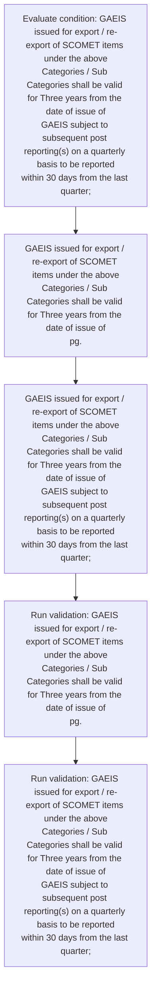
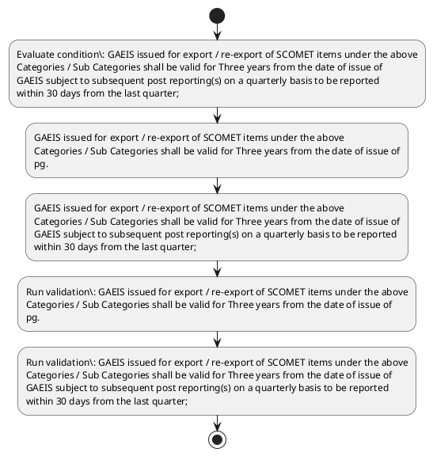

# Chapter 10 / Section 1: GAEIS issued for export / re-export of SCOMET items under the above

**Chapter Title:** SCOMET: Special Chemicals, Organisms, Materials, Equipment and Technologies

**Pages:** 34, 35

**Purpose:** GAEIS issued for export / re-export of SCOMET items under the above
Categories / Sub Categories shall be valid for Three years from the date of issue of
pg.

**Purpose Thanglish:** Indha GAEIS issued for export / re-export of SCOMET items under the above section-la, GAEIS issued for export / re-export of SCOMET items under the above
Categories / Sub Categories kandippa be valid for Three years from the date of issue of
pg.

**Summary:** 1. GAEIS issued for export / re-export of SCOMET items under the above
Categories / Sub Categories shall be valid for Three years from the date of issue of
pg. 1102
pg.

**Business Meaning:** GAEIS issued for export / re-export of SCOMET items under the above governs how DGFT business controls should be applied, validated, and enforced.

**Business Explanation:** GAEIS issued for export / re-export of SCOMET items under the above explains the operating rule set that DEKAI should enforce. Key control points include GAEIS issued for export / re-export of SCOMET items under the above
Categories / Sub Categories shall be valid for Three years from the date of issue of
pg. The section also drives actions such as GAEIS issued for export / re-export of SCOMET items under the above
Categories / Sub Categories shall be valid for Three years from the date of issue of
pg..

**Business Explanation Thanglish:** Indha GAEIS issued for export / re-export of SCOMET items under the above section-la, GAEIS issued for export / re-export of SCOMET items under the above explains the operating rule set that DEKAI should enforce. Key control points include GAEIS issued for export / re-export of SCOMET items under the above
Categories / Sub Categories kandippa be valid for Three years from the date of issue of
pg. The section also drives actions such as GAEIS issued for export / re-export of SCOMET items under the above
Categories / Sub Categories kandippa be valid for Three years from the date of issue of
pg..

## Business Logic
- GAEIS issued for export / re-export of SCOMET items under the above
Categories / Sub Categories shall be valid for Three years from the date of issue of
pg.
- GAEIS issued for export / re-export of SCOMET items under the above
Categories / Sub Categories shall be valid for Three years from the date of issue of
GAEIS subject to subsequent post reporting(s) on a quarterly basis to be reported
within 30 days from the last quarter;

## Business Rules
- rule_id=CH10-SEC1-R001, rule_description=GAEIS issued for export / re-export of SCOMET items under the above
Categories / Sub Categories shall be valid for Three years from the date of issue of
pg., trigger=GAEIS issued for export / re-export of SCOMET items under the above, condition=GAEIS issued for export / re-export of SCOMET items under the above
Categories / Sub Categories shall be valid for Three years from the date of issue of
GAEIS subject to subsequent post reporting(s) on a quarterly basis to be reported
within 30 days from the last quarter;, validation=GAEIS issued for export / re-export of SCOMET items under the above
Categories / Sub Categories shall be valid for Three years from the date of issue of
pg., action=GAEIS issued for export / re-export of SCOMET items under the above
Categories / Sub Categories shall be valid for Three years from the date of issue of
pg., exception=No explicit exception found in uploaded documents., output=DEKAI should produce a compliance decision for 1 - GAEIS issued for export / re-export of SCOMET items under the above.
- rule_id=CH10-SEC1-R002, rule_description=GAEIS issued for export / re-export of SCOMET items under the above
Categories / Sub Categories shall be valid for Three years from the date of issue of
GAEIS subject to subsequent post reporting(s) on a quarterly basis to be reported
within 30 days from the last quarter;, trigger=GAEIS issued for export / re-export of SCOMET items under the above, condition=GAEIS issued for export / re-export of SCOMET items under the above
Categories / Sub Categories shall be valid for Three years from the date of issue of
GAEIS subject to subsequent post reporting(s) on a quarterly basis to be reported
within 30 days from the last quarter;, validation=GAEIS issued for export / re-export of SCOMET items under the above
Categories / Sub Categories shall be valid for Three years from the date of issue of
GAEIS subject to subsequent post reporting(s) on a quarterly basis to be reported
within 30 days from the last quarter;, action=GAEIS issued for export / re-export of SCOMET items under the above
Categories / Sub Categories shall be valid for Three years from the date of issue of
GAEIS subject to subsequent post reporting(s) on a quarterly basis to be reported
within 30 days from the last quarter;, exception=No explicit exception found in uploaded documents., output=DEKAI should produce a compliance decision for 1 - GAEIS issued for export / re-export of SCOMET items under the above.

## Conditions
- GAEIS issued for export / re-export of SCOMET items under the above
Categories / Sub Categories shall be valid for Three years from the date of issue of
GAEIS subject to subsequent post reporting(s) on a quarterly basis to be reported
within 30 days from the last quarter;

## Condition Logic
- id=10.1.1, if=GAEIS issued for export / re-export of SCOMET items under the above
Categories / Sub Categories shall be valid for Three years from the date of issue of
GAEIS subject to subsequent post reporting(s) on a quarterly basis to be reported
within 30 days from the last quarter;, then=GAEIS issued for export / re-export of SCOMET items under the above
Categories / Sub Categories shall be valid for Three years from the date of issue of
pg., source=GAEIS issued for export / re-export of SCOMET items under the above
Categories / Sub Categories shall be valid for Three years from the date of issue of
GAEIS subject to subsequent post reporting(s) on a quarterly basis to be reported
within 30 days from the last quarter;

## Validations
- GAEIS issued for export / re-export of SCOMET items under the above
Categories / Sub Categories shall be valid for Three years from the date of issue of
pg.
- GAEIS issued for export / re-export of SCOMET items under the above
Categories / Sub Categories shall be valid for Three years from the date of issue of
GAEIS subject to subsequent post reporting(s) on a quarterly basis to be reported
within 30 days from the last quarter;

## Exceptions
- None identified

## Dependencies
- 2
- 3

## Authorities
- None identified

## Required Documents
- None identified

## Timelines
- GAEIS issued for export / re-export of SCOMET items under the above
Categories / Sub Categories shall be valid for Three years from the date of issue of
pg.
- GAEIS issued for export / re-export of SCOMET items under the above
Categories / Sub Categories shall be valid for Three years from the date of issue of
GAEIS subject to subsequent post reporting(s) on a quarterly basis to be reported
within 30 days from the last quarter;

## Actions
- GAEIS issued for export / re-export of SCOMET items under the above
Categories / Sub Categories shall be valid for Three years from the date of issue of
pg.
- GAEIS issued for export / re-export of SCOMET items under the above
Categories / Sub Categories shall be valid for Three years from the date of issue of
GAEIS subject to subsequent post reporting(s) on a quarterly basis to be reported
within 30 days from the last quarter;

## Workflow
- Evaluate condition: GAEIS issued for export / re-export of SCOMET items under the above
Categories / Sub Categories shall be valid for Three years from the date of issue of
GAEIS subject to subsequent post reporting(s) on a quarterly basis to be reported
within 30 days from the last quarter;
- GAEIS issued for export / re-export of SCOMET items under the above
Categories / Sub Categories shall be valid for Three years from the date of issue of
pg.
- GAEIS issued for export / re-export of SCOMET items under the above
Categories / Sub Categories shall be valid for Three years from the date of issue of
GAEIS subject to subsequent post reporting(s) on a quarterly basis to be reported
within 30 days from the last quarter;
- Run validation: GAEIS issued for export / re-export of SCOMET items under the above
Categories / Sub Categories shall be valid for Three years from the date of issue of
pg.
- Run validation: GAEIS issued for export / re-export of SCOMET items under the above
Categories / Sub Categories shall be valid for Three years from the date of issue of
GAEIS subject to subsequent post reporting(s) on a quarterly basis to be reported
within 30 days from the last quarter;

## Workflow ASCII
```text
GAEIS issued for export / re-export of SCOMET items under the above
Evaluate condition: GAEIS issued for export / re-export of SCOMET items under the above
Categories / Sub Categories shall be valid for Three years from the date of issue of
GAEIS subject to subsequent post reporting(s) on a quarterly basis to be reported
within 30 days from the last quarter;
   |
   v
GAEIS issued for export / re-export of SCOMET items under the above
Categories / Sub Categories shall be valid for Three years from the date of issue of
pg.
   |
   v
GAEIS issued for export / re-export of SCOMET items under the above
Categories / Sub Categories shall be valid for Three years from the date of issue of
GAEIS subject to subsequent post reporting(s) on a quarterly basis to be reported
within 30 days from the last quarter;
   |
   v
Run validation: GAEIS issued for export / re-export of SCOMET items under the above
Categories / Sub Categories shall be valid for Three years from the date of issue of
pg.
   |
   v
Run validation: GAEIS issued for export / re-export of SCOMET items under the above
Categories / Sub Categories shall be valid for Three years from the date of issue of
GAEIS subject to subsequent post reporting(s) on a quarterly basis to be reported
within 30 days from the last quarter;
```

## Decision Tree
- IF GAEIS issued for export / re-export of SCOMET items under the above
Categories / Sub Categories shall be valid for Three years from the date of issue of
GAEIS subject to subsequent post reporting(s) on a quarterly basis to be reported
within 30 days from the last quarter; THEN GAEIS issued for export / re-export of SCOMET items under the above
Categories / Sub Categories shall be valid for Three years from the date of issue of
pg.

## Decision Tree ASCII
```text
GAEIS issued for export / re-export of SCOMET items under the above Decision
IF GAEIS issued for export / re-export of SCOMET items under the above
Categories / Sub Categories shall be valid for Three years from the date of issue of
GAEIS subject to subsequent post reporting(s) on a quarterly basis to be reported
within 30 days from the last quarter; THEN GAEIS issued for export / re-export of SCOMET items under the above
Categories / Sub Categories shall be valid for Three years from the date of issue of
pg.
```

## Examples
- User asks to process GAEIS issued for export / re-export of SCOMET items under the above; the platform checks conditions, validations, and documents before action.

**Real-world Example:** Example: an importer or exporter invokes GAEIS issued for export / re-export of SCOMET items under the above, submits the prescribed DGFT records, and DEKAI uses the extracted rules to gaeis issued for export / re-export of scomet items under the above
categories / sub categories shall be valid for three years from the date of issue of
pg..

**Real-world Example Thanglish:** Indha GAEIS issued for export / re-export of SCOMET items under the above section-la, Example: an importer or exporter invokes GAEIS issued for export / re-export of SCOMET items under the above, submits the prescribed DGFT records, and DEKAI uses the extracted rules to gaeis issued for export / re-export of scomet items under the above
categories / sub categories kandippa be valid for three years from the date of issue of
pg..

## AI Rules
- IF detected context matches section rule THEN enforce: GAEIS issued for export / re-export of SCOMET items under the above
Categories / Sub Categories shall be valid for Three years from the date of issue of
pg.
- IF detected context matches section rule THEN enforce: GAEIS issued for export / re-export of SCOMET items under the above
Categories / Sub Categories shall be valid for Three years from the date of issue of
GAEIS subject to subsequent post reporting(s) on a quarterly basis to be reported
within 30 days from the last quarter;
- IF validations pass THEN recommend action: GAEIS issued for export / re-export of SCOMET items under the above
Categories / Sub Categories shall be valid for Three years from the date of issue of
pg.

## Database Fields
- name=section_code, type=string, required=True, source=parsed_section_heading
- name=section_title, type=string, required=True, source=parsed_section_heading
- name=for_flag, type=boolean, required=False, source=keyword:for
- name=the_flag, type=boolean, required=False, source=keyword:the
- name=sub_flag, type=boolean, required=False, source=keyword:Sub
- name=from_flag, type=boolean, required=False, source=keyword:from
- name=date_flag, type=boolean, required=False, source=keyword:date
- name=post_flag, type=boolean, required=False, source=keyword:post
- name=days_flag, type=boolean, required=False, source=keyword:days
- name=last_flag, type=boolean, required=False, source=keyword:last

## API Requirements
- method=GET, path=/api/dgft/sections/1, purpose=Retrieve knowledge payload for section 1, query_params=['include=workflow,decision_tree,validations'], response_fields=['section', 'title', 'summary', 'conditions', 'validations', 'exceptions', 'workflow', 'decision_tree']
- method=POST, path=/api/dgft/GAEIS-issued-for-export-re-export-of-SCOMET-items-under-the-above/validate, purpose=Validate inputs and documents for GAEIS issued for export / re-export of SCOMET items under the above, request_fields=['section_code', 'section_title'], response_fields=['status', 'errors', 'warnings', 'next_actions']
- method=POST, path=/api/dgft/GAEIS-issued-for-export-re-export-of-SCOMET-items-under-the-above/execute, purpose=Trigger business action for GAEIS issued for export / re-export of SCOMET items under the above
Categories / Sub Categories shall be valid for Three years from the date of issue of
pg., request_fields=['section_code', 'section_title'], response_fields=['reference_id', 'status', 'authority', 'timeline']

## UI Screens
- screen_id=GAEIS_issued_for_export_re_export_of_SCOMET_items_under_the_above_overview, name=GAEIS issued for export / re-export of SCOMET items under the above Overview, purpose=Show section summary, authority, timeline, and eligibility cues., widgets=['summary_card', 'conditions_table', 'authority_badges', 'timeline_panel']
- screen_id=GAEIS_issued_for_export_re_export_of_SCOMET_items_under_the_above_submission, name=GAEIS issued for export / re-export of SCOMET items under the above Submission, purpose=Capture applicant data and supporting documents., widgets=['dynamic_form', 'document_uploader', 'validation_panel', 'next_action_footer'], fields=['section_code', 'section_title', 'for_flag', 'the_flag', 'sub_flag', 'from_flag', 'date_flag', 'post_flag']

## Error Messages
- Validation failed because the section requirements were not fully met.

## FAQ
- question_en=What is the purpose of section 1?, answer_en=GAEIS issued for export / re-export of SCOMET items under the above explains the operating rule set that DEKAI should enforce. Key control points include GAEIS issued for export / re-export of SCOMET items under the above
Categories / Sub Categories shall be valid for Three years from the date of issue of
pg. The section also drives actions such as GAEIS issued for export / re-export of SCOMET items under the above
Categories / Sub Categories shall be valid for Three years from the date of issue of
pg.., question_thanglish=Indha GAEIS issued for export / re-export of SCOMET items under the above section-la, What is the purpose of section 1?, answer_thanglish=Indha GAEIS issued for export / re-export of SCOMET items under the above section-la, GAEIS issued for export / re-export of SCOMET items under the above explains the operating rule set that DEKAI should enforce. Key control points include GAEIS issued for export / re-export of SCOMET items under the above
Categories / Sub Categories kandippa be valid for Three years from the date of issue of
pg. The section also drives actions such as GAEIS issued for export / re-export of SCOMET items under the above
Categories / Sub Categories kandippa be valid for Three years from the date of issue of
pg..
- question_en=What documents are required under GAEIS issued for export / re-export of SCOMET items under the above?, answer_en=Not explicitly covered in uploaded documents., question_thanglish=Indha GAEIS issued for export / re-export of SCOMET items under the above section-la, What documents are required under GAEIS issued for export / re-export of SCOMET items under the above?, answer_thanglish=Indha GAEIS issued for export / re-export of SCOMET items under the above section-la, Not explicitly covered in uploaded documents.
- question_en=Which authority handles GAEIS issued for export / re-export of SCOMET items under the above?, answer_en=Not explicitly covered in uploaded documents., question_thanglish=Indha GAEIS issued for export / re-export of SCOMET items under the above section-la, Which authority handles GAEIS issued for export / re-export of SCOMET items under the above?, answer_thanglish=Indha GAEIS issued for export / re-export of SCOMET items under the above section-la, Not explicitly covered in uploaded documents.

## Questions Users May Ask
- What does GAEIS issued for export / re-export of SCOMET items under the above require?
- Which documents are needed for GAEIS issued for export / re-export of SCOMET items under the above?
- How does DEKAI validate GAEIS issued for export / re-export of SCOMET items under the above requests?
- What action should be taken for GAEIS issued for export / re-export of SCOMET items under the above?

## Expected AI Answers
- GAEIS issued for export / re-export of SCOMET items under the above requires the platform to interpret the section text, apply the extracted business rules, and present the correct next action.
- Required documents are inferred from the section text: no explicit documents were detected.
- DEKAI validates GAEIS issued for export / re-export of SCOMET items under the above by checking conditions, required documents, authority references, and exception clauses before recommending an outcome.
- The primary extracted action is: GAEIS issued for export / re-export of SCOMET items under the above
Categories / Sub Categories shall be valid for Three years from the date of issue of
pg.

## AI Q&A Examples
- question_en=User asks: How do I comply with GAEIS issued for export / re-export of SCOMET items under the above?, answer_en=AI answers: DEKAI should evaluate section 1, apply the extracted rules, and guide the user through Evaluate condition: GAEIS issued for export / re-export of SCOMET items under the above
Categories / Sub Categories shall be valid for Three years from the date of issue of
GAEIS subject to subsequent post reporting(s) on a quarterly basis to be reported
within 30 days from the last quarter;., question_thanglish=Indha GAEIS issued for export / re-export of SCOMET items under the above section-la, User asks: How do I comply with GAEIS issued for export / re-export of SCOMET items under the above?, answer_thanglish=Indha GAEIS issued for export / re-export of SCOMET items under the above section-la, AI answers: DEKAI should evaluate section 1, apply the extracted rules, and guide the user through Evaluate condition: GAEIS issued for export / re-export of SCOMET items under the above
Categories / Sub Categories kandippa be valid for Three years from the date of issue of
GAEIS subject to subsequent post reporting(s) on a quarterly basis to be reported
within 30 days from the last quarter;.
- question_en=User asks: Which validations apply to GAEIS issued for export / re-export of SCOMET items under the above?, answer_en=AI answers: Applicable validations are GAEIS issued for export / re-export of SCOMET items under the above
Categories / Sub Categories shall be valid for Three years from the date of issue of
pg., GAEIS issued for export / re-export of SCOMET items under the above
Categories / Sub Categories shall be valid for Three years from the date of issue of
GAEIS subject to subsequent post reporting(s) on a quarterly basis to be reported
within 30 days from the last quarter;, question_thanglish=Indha GAEIS issued for export / re-export of SCOMET items under the above section-la, User asks: Which validations apply to GAEIS issued for export / re-export of SCOMET items under the above?, answer_thanglish=Indha GAEIS issued for export / re-export of SCOMET items under the above section-la, AI answers: Applicable validations are GAEIS issued for export / re-export of SCOMET items under the above
Categories / Sub Categories kandippa be valid for Three years from the date of issue of
pg., GAEIS issued for export / re-export of SCOMET items under the above
Categories / Sub Categories kandippa be valid for Three years from the date of issue of
GAEIS subject to subsequent post reporting(s) on a quarterly basis to be reported
within 30 days from the last quarter;

## DEKAI AI Implementation Notes
- Capture chapter 10, section 1, title, and page references as immutable knowledge metadata.
- Bind validations for GAEIS issued for export / re-export of SCOMET items under the above into a rule engine keyed by the rule IDs extracted for this section.
- Show contextual links to related sections: 2, 3.

## DEKAI AI Implementation Notes Thanglish
- Indha GAEIS issued for export / re-export of SCOMET items under the above section-la, Capture chapter 10, section 1, title, and page references as immutable knowledge metadata.
- Indha GAEIS issued for export / re-export of SCOMET items under the above section-la, Bind validations for GAEIS issued for export / re-export of SCOMET items under the above into a rule engine keyed by the rule IDs extracted for this section.
- Indha GAEIS issued for export / re-export of SCOMET items under the above section-la, Show contextual links to related sections: 2, 3.

## AI Metadata
- Keywords: for, the, Sub, from, date, post, days, last, GAEIS, items, under, above, shall, valid, Three, years, issue, basis, issued, export
- Search Keywords: for, the, Sub, from, date, post, days, last, GAEIS, items, under, above, shall, valid, Three, years, issue, basis, issued, export
- Intent: Support GAEIS issued for export / re-export of SCOMET items under the above processing and compliance validation.
- Tags: 1, GAEIS issued for export / re-export of SCOMET items under the above, business-rule, dgft
- Related Sections: 2, 3
- Related Chapters: 
- Related Rules: GAEIS issued for export / re-export of SCOMET items under the above
Categories / Sub Categories shall be valid for Three years from the date of issue of
pg., GAEIS issued for export / re-export of SCOMET items under the above
Categories / Sub Categories shall be valid for Three years from the date of issue of
GAEIS subject to subsequent post reporting(s) on a quarterly basis to be reported
within 30 days from the last quarter;

## Mermaid


## PlantUML

