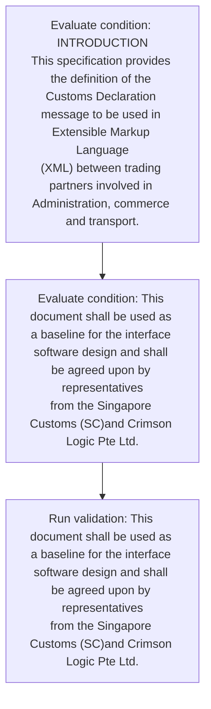
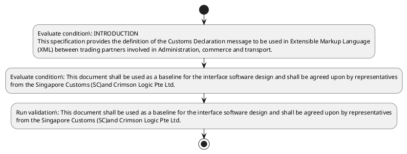

# Chapter  / Section 1: INTRODUCTION

**Chapter Title:** TradeNetDeclaration.IPTDEC Ver2.1 (2)

**Pages:** 2

**Purpose:** INTRODUCTION
This specification provides the definition of the Customs Declaration message to be used in Extensible Markup Language
(XML) between trading partners involved in Administration, commerce and transport.

**Purpose Thanglish:** Indha INTRODUCTION section-la, INTRODUCTION
This specification provides the definition of the Customs Declaration message to be used in Extensible Markup Language
(XML) between trading partners involved in Administration, commerce and transport.

**Summary:** 1. INTRODUCTION
This specification provides the definition of the Customs Declaration message to be used in Extensible Markup Language
(XML) between trading partners involved in Administration, commerce and transport. This document shall be used as a baseline for the interface software design and shall be agreed upon by representatives
from the Singapore Customs (SC)and Crimson Logic Pte Ltd.

**Business Meaning:** INTRODUCTION governs how DGFT business controls should be applied, validated, and enforced.

**Business Explanation:** INTRODUCTION explains the operating rule set that DEKAI should enforce. Key control points include This document shall be used as a baseline for the interface software design and shall be agreed upon by representatives
from the Singapore Customs (SC)and Crimson Logic Pte Ltd.

**Business Explanation Thanglish:** Indha INTRODUCTION section-la, INTRODUCTION explains the operating rule set that DEKAI should enforce. Key control points include This document kandippa be used as a baseline for the interface software design and kandippa be agreed upon by representatives
from the Singapore Customs (SC)and Crimson Logic Pte Ltd.

## Business Logic
- This document shall be used as a baseline for the interface software design and shall be agreed upon by representatives
from the Singapore Customs (SC)and Crimson Logic Pte Ltd.

## Business Rules
- rule_id=CH-SEC1-R001, rule_description=This document shall be used as a baseline for the interface software design and shall be agreed upon by representatives
from the Singapore Customs (SC)and Crimson Logic Pte Ltd., trigger=INTRODUCTION, condition=INTRODUCTION
This specification provides the definition of the Customs Declaration message to be used in Extensible Markup Language
(XML) between trading partners involved in Administration, commerce and transport., validation=This document shall be used as a baseline for the interface software design and shall be agreed upon by representatives
from the Singapore Customs (SC)and Crimson Logic Pte Ltd., action=Manual review required., exception=No explicit exception found in uploaded documents., output=DEKAI should produce a compliance decision for 1 - INTRODUCTION.

## Conditions
- INTRODUCTION
This specification provides the definition of the Customs Declaration message to be used in Extensible Markup Language
(XML) between trading partners involved in Administration, commerce and transport.
- This document shall be used as a baseline for the interface software design and shall be agreed upon by representatives
from the Singapore Customs (SC)and Crimson Logic Pte Ltd.

## Condition Logic
- id=.1.1, if=INTRODUCTION
This specification provides the definition of the Customs Declaration message to be used in Extensible Markup Language
(XML) between trading partners involved in Administration, commerce and transport., then=Route for review, source=INTRODUCTION
This specification provides the definition of the Customs Declaration message to be used in Extensible Markup Language
(XML) between trading partners involved in Administration, commerce and transport.
- id=.1.2, if=This document shall be used as a baseline for the interface software design and shall be agreed upon by representatives
from the Singapore Customs (SC)and Crimson Logic Pte Ltd., then=Route for review, source=This document shall be used as a baseline for the interface software design and shall be agreed upon by representatives
from the Singapore Customs (SC)and Crimson Logic Pte Ltd.

## Validations
- This document shall be used as a baseline for the interface software design and shall be agreed upon by representatives
from the Singapore Customs (SC)and Crimson Logic Pte Ltd.

## Exceptions
- None identified

## Dependencies
- None identified

## Authorities
- Customs
- This specification provides the definition of the Customs
- Singapore Customs

## Required Documents
- This specification provides the definition of the Customs Declaration
- This document shall be used as a baseline for the interface software design and shall be agreed upon by representatives
from the Singapore Customs (SC)and Crimson Logic Pte Ltd.

## Timelines
- None identified

## Actions
- None identified

## Workflow
- Evaluate condition: INTRODUCTION
This specification provides the definition of the Customs Declaration message to be used in Extensible Markup Language
(XML) between trading partners involved in Administration, commerce and transport.
- Evaluate condition: This document shall be used as a baseline for the interface software design and shall be agreed upon by representatives
from the Singapore Customs (SC)and Crimson Logic Pte Ltd.
- Run validation: This document shall be used as a baseline for the interface software design and shall be agreed upon by representatives
from the Singapore Customs (SC)and Crimson Logic Pte Ltd.

## Workflow ASCII
```text
INTRODUCTION
Evaluate condition: INTRODUCTION
This specification provides the definition of the Customs Declaration message to be used in Extensible Markup Language
(XML) between trading partners involved in Administration, commerce and transport.
   |
   v
Evaluate condition: This document shall be used as a baseline for the interface software design and shall be agreed upon by representatives
from the Singapore Customs (SC)and Crimson Logic Pte Ltd.
   |
   v
Run validation: This document shall be used as a baseline for the interface software design and shall be agreed upon by representatives
from the Singapore Customs (SC)and Crimson Logic Pte Ltd.
```

## Decision Tree
- IF section 1 applies THEN proceed with standard DGFT workflow

## Decision Tree ASCII
```text
INTRODUCTION Decision
IF section 1 applies THEN proceed with standard DGFT workflow
```

## Examples
- User asks to process INTRODUCTION; the platform checks conditions, validations, and documents before action.

**Real-world Example:** Example: an importer or exporter invokes INTRODUCTION, submits This specification provides the definition of the Customs Declaration, This document shall be used as a baseline for the interface software design and shall be agreed upon by representatives
from the Singapore Customs (SC)and Crimson Logic Pte Ltd., and DEKAI uses the extracted rules to follow the introduction process.

**Real-world Example Thanglish:** Indha INTRODUCTION section-la, Example: an importer or exporter invokes INTRODUCTION, submits This specification provides the definition of the Customs Declaration, This document kandippa be used as a baseline for the interface software design and kandippa be agreed upon by representatives
from the Singapore Customs (SC)and Crimson Logic Pte Ltd., and DEKAI uses the extracted rules to follow the introduction process.

## AI Rules
- IF detected context matches section rule THEN enforce: This document shall be used as a baseline for the interface software design and shall be agreed upon by representatives
from the Singapore Customs (SC)and Crimson Logic Pte Ltd.

## Database Fields
- name=section_code, type=string, required=True, source=parsed_section_heading
- name=section_title, type=string, required=True, source=parsed_section_heading
- name=the_flag, type=boolean, required=False, source=keyword:the
- name=xml_flag, type=boolean, required=False, source=keyword:XML
- name=and_flag, type=boolean, required=False, source=keyword:and
- name=for_flag, type=boolean, required=False, source=keyword:for
- name=pte_flag, type=boolean, required=False, source=keyword:Pte
- name=ltd_flag, type=boolean, required=False, source=keyword:Ltd
- name=this_flag, type=boolean, required=False, source=keyword:This
- name=used_flag, type=boolean, required=False, source=keyword:used
- name=document_1_submitted, type=boolean, required=True, source=This specification provides the definition of the Customs Declaration
- name=document_2_submitted, type=boolean, required=True, source=This document shall be used as a baseline for the interface software design and shall be agreed upon by representatives
from the Singapore Customs (SC)and Crimson Logic Pte Ltd.

## API Requirements
- method=GET, path=/api/dgft/sections/1, purpose=Retrieve knowledge payload for section 1, query_params=['include=workflow,decision_tree,validations'], response_fields=['section', 'title', 'summary', 'conditions', 'validations', 'exceptions', 'workflow', 'decision_tree']
- method=POST, path=/api/dgft/INTRODUCTION/validate, purpose=Validate inputs and documents for INTRODUCTION, request_fields=['section_code', 'section_title', 'document_1_submitted', 'document_2_submitted'], response_fields=['status', 'errors', 'warnings', 'next_actions']

## UI Screens
- screen_id=INTRODUCTION_overview, name=INTRODUCTION Overview, purpose=Show section summary, authority, timeline, and eligibility cues., widgets=['summary_card', 'conditions_table', 'authority_badges', 'timeline_panel']
- screen_id=INTRODUCTION_submission, name=INTRODUCTION Submission, purpose=Capture applicant data and supporting documents., widgets=['dynamic_form', 'document_uploader', 'validation_panel', 'next_action_footer'], fields=['section_code', 'section_title', 'the_flag', 'xml_flag', 'and_flag', 'for_flag', 'pte_flag', 'ltd_flag']

## Error Messages
- Validation failed because the section requirements were not fully met.

## FAQ
- question_en=What is the purpose of section 1?, answer_en=INTRODUCTION explains the operating rule set that DEKAI should enforce. Key control points include This document shall be used as a baseline for the interface software design and shall be agreed upon by representatives
from the Singapore Customs (SC)and Crimson Logic Pte Ltd., question_thanglish=Indha INTRODUCTION section-la, What is the purpose of section 1?, answer_thanglish=Indha INTRODUCTION section-la, INTRODUCTION explains the operating rule set that DEKAI should enforce. Key control points include This document kandippa be used as a baseline for the interface software design and kandippa be agreed upon by representatives
from the Singapore Customs (SC)and Crimson Logic Pte Ltd.
- question_en=What documents are required under INTRODUCTION?, answer_en=This specification provides the definition of the Customs Declaration, This document shall be used as a baseline for the interface software design and shall be agreed upon by representatives
from the Singapore Customs (SC)and Crimson Logic Pte Ltd., question_thanglish=Indha INTRODUCTION section-la, What documents are required under INTRODUCTION?, answer_thanglish=Indha INTRODUCTION section-la, This specification provides the definition of the Customs Declaration, This document kandippa be used as a baseline for the interface software design and kandippa be agreed upon by representatives
from the Singapore Customs (SC)and Crimson Logic Pte Ltd.
- question_en=Which authority handles INTRODUCTION?, answer_en=Customs, This specification provides the definition of the Customs, Singapore Customs, question_thanglish=Indha INTRODUCTION section-la, Which authority handles INTRODUCTION?, answer_thanglish=Indha INTRODUCTION section-la, Customs, This specification provides the definition of the Customs, Singapore Customs

## Questions Users May Ask
- What does INTRODUCTION require?
- Which documents are needed for INTRODUCTION?
- How does DEKAI validate INTRODUCTION requests?

## Expected AI Answers
- INTRODUCTION requires the platform to interpret the section text, apply the extracted business rules, and present the correct next action.
- Required documents are inferred from the section text: This specification provides the definition of the Customs Declaration, This document shall be used as a baseline for the interface software design and shall be agreed upon by representatives
from the Singapore Customs (SC)and Crimson Logic Pte Ltd.
- DEKAI validates INTRODUCTION by checking conditions, required documents, authority references, and exception clauses before recommending an outcome.

## AI Q&A Examples
- question_en=User asks: How do I comply with INTRODUCTION?, answer_en=AI answers: DEKAI should evaluate section 1, apply the extracted rules, and guide the user through Evaluate condition: INTRODUCTION
This specification provides the definition of the Customs Declaration message to be used in Extensible Markup Language
(XML) between trading partners involved in Administration, commerce and transport.., question_thanglish=Indha INTRODUCTION section-la, User asks: How do I comply with INTRODUCTION?, answer_thanglish=Indha INTRODUCTION section-la, AI answers: DEKAI should evaluate section 1, apply the extracted rules, and guide the user through Evaluate condition: INTRODUCTION
This specification provides the definition of the Customs Declaration message to be used in Extensible Markup Language
(XML) between trading partners involved in Administration, commerce and transport..
- question_en=User asks: Which validations apply to INTRODUCTION?, answer_en=AI answers: Applicable validations are This document shall be used as a baseline for the interface software design and shall be agreed upon by representatives
from the Singapore Customs (SC)and Crimson Logic Pte Ltd., question_thanglish=Indha INTRODUCTION section-la, User asks: Which validations apply to INTRODUCTION?, answer_thanglish=Indha INTRODUCTION section-la, AI answers: Applicable validations are This document kandippa be used as a baseline for the interface software design and kandippa be agreed upon by representatives
from the Singapore Customs (SC)and Crimson Logic Pte Ltd.

## DEKAI AI Implementation Notes
- Capture chapter , section 1, title, and page references as immutable knowledge metadata.
- Bind validations for INTRODUCTION into a rule engine keyed by the rule IDs extracted for this section.
- Expose document upload controls for: This specification provides the definition of the Customs Declaration, This document shall be used as a baseline for the interface software design and shall be agreed upon by representatives
from the Singapore Customs (SC)and Crimson Logic Pte Ltd..
- Route escalations or approvals to: Customs, This specification provides the definition of the Customs, Singapore Customs.

## DEKAI AI Implementation Notes Thanglish
- Indha INTRODUCTION section-la, Capture chapter , section 1, title, and page references as immutable knowledge metadata.
- Indha INTRODUCTION section-la, Bind validations for INTRODUCTION into a rule engine keyed by the rule IDs extracted for this section.
- Indha INTRODUCTION section-la, Expose document upload controls for: This specification provides the definition of the Customs Declaration, This document kandippa be used as a baseline for the interface software design and kandippa be agreed upon by representatives
from the Singapore Customs (SC)and Crimson Logic Pte Ltd..
- Indha INTRODUCTION section-la, Route escalations or approvals to: Customs, This specification provides the definition of the Customs, Singapore Customs.

## AI Metadata
- Keywords: the, XML, and, for, Pte, Ltd, This, used, upon, from, shall, Logic, Markup, design, agreed, Customs, message, between, trading, Crimson
- Search Keywords: the, XML, and, for, Pte, Ltd, This, used, upon, from, shall, Logic, Markup, design, agreed, Customs, message, between, trading, Crimson
- Intent: Provide knowledge guidance for INTRODUCTION.
- Tags: 1, INTRODUCTION, business-rule, document-driven, dgft
- Related Sections: 
- Related Chapters: 
- Related Rules: This document shall be used as a baseline for the interface software design and shall be agreed upon by representatives
from the Singapore Customs (SC)and Crimson Logic Pte Ltd.

## Mermaid


## PlantUML

