# Chapter 10 / Section 1: Policy & Eligibility: SCOMET authorization will not be required, for the export

**Chapter Title:** SCOMET: Special Chemicals, Organisms, Materials, Equipment and Technologies

**Pages:** 28, 29, 32

**Purpose:** Policy & Eligibility: SCOMET authorization will not be required, for the export
and/or re-export of Telecommunication items (excluding technology and
software) under SCOMET Category 8A5 Part 1(except items listed in Annexure-
I) subject to the following conditions:
a.

**Purpose Thanglish:** Indha Policy & Eligibility: SCOMET authorization will not be required, for the export section-la, Policy & Eligibility: SCOMET authorization will not be required, for the export
and/or re-export of Telecommunication items (excluding technology and
software) under SCOMET Category 8A5 Part 1(except items listed in Annexure-
I) subject to the following conditions:
a.

**Summary:** 1. Policy & Eligibility: SCOMET authorization will not be required, for the export
and/or re-export of Telecommunication items (excluding technology and
software) under SCOMET Category 8A5 Part 1(except items listed in Annexure-
I) subject to the following conditions:
a. The applicant exporter shall submit an application for getting a one-time
license under GAET through the online SCOMET portal and attach the
information in the prescribed proforma;
b.

**Business Meaning:** Policy & Eligibility: SCOMET authorization will not be required, for the export governs how DGFT business controls should be applied, validated, and enforced.

**Business Explanation:** Policy & Eligibility: SCOMET authorization will not be required, for the export explains the operating rule set that DEKAI should enforce. Key control points include Policy & Eligibility: SCOMET authorization will not be required, for the export
and/or re-export of Telecommunication items (excluding technology and
software) under SCOMET Category 8A5 Part 1(except items listed in Annexure-
I) subject to the following conditions:
a. The section also drives actions such as The applicant exporter shall submit an application for getting a one-time
license under GAET through the online SCOMET portal and attach the
information in the prescribed proforma;
b..

**Business Explanation Thanglish:** Indha Policy & Eligibility: SCOMET authorization will not be required, for the export section-la, Policy & Eligibility: SCOMET authorization will not be required, for the export explains the operating rule set that DEKAI should enforce. Key control points include Policy & Eligibility: SCOMET authorization will not be required, for the export
and/or re-export of Telecommunication items (excluding technology and
software) under SCOMET Category 8A5 Part 1(except items listed in Annexure-
I) subject to the following conditions:
a. The section also drives actions such as The applicant exporter kandippa submit an application for getting a one-time
license under GAET through the online SCOMET portal and attach the
information in the prescribed proforma;
b..

## Business Logic
- Policy & Eligibility: SCOMET authorization will not be required, for the export
and/or re-export of Telecommunication items (excluding technology and
software) under SCOMET Category 8A5 Part 1(except items listed in Annexure-
I) subject to the following conditions:
a.
- The applicant exporter shall submit an application for getting a one-time
license under GAET through the online SCOMET portal and attach the
information in the prescribed proforma;
b.
- Validity
a)
GAICT issued for intra-company transfers of SCOMET items including
software and technology shall be valid for a period of three years
from the date of issue of GAICT;
b)
GAICT cannot be revalidated in terms of Paragraph 10.20 of HBP of
FTP.
- Suspension / Revocation
GAICT issued shall be liable to be suspended by the DGFT on receipt of intimation
about initiation of any inquiry from the country concerned or from any domestic
agency.
- GAICT shall be revoked on receipt of an adverse report on proliferation
concern or for non-submission of mandatory reports/documents within the
prescribed timelines or for non-compliance of any of the condition of this policy.
- Para
10.15(I):
General
Authorization
for
Export
of
Telecommunication-related items under SCOMET Category 8A5 Part 1
(GAET)
Export of indigenous/imported SCOMET items (Telecommunication items under
SCOMET Category 8A5 Part 1) will be allowed based on a one-time General
Authorization (GAET) subject to the following conditions:
1.
- Subsequent EUC
submissions for entities in the list of countries (as approved) will
be subject to post-reporting requirements as mentioned at viii
below.
- Policy & Eligibility: SCOMET authorization will not be required, for the export
and/or re-export of Information Security items (excluding technology) under
SCOMET Category 8A5 Part 2 subject to the following conditions:
a.
- The applicant exporter shall submit an application for getting a one-time license
under GAEIS through the online SCOMET portal and attach the information in the
prescribed performa.
- Subsequent EUC submissions for entities in the list of countries (as approved) will
be subject to post-reporting requirements as mentioned at viii below.

## Business Rules
- rule_id=CH10-SEC1-R001, rule_description=Policy & Eligibility: SCOMET authorization will not be required, for the export
and/or re-export of Telecommunication items (excluding technology and
software) under SCOMET Category 8A5 Part 1(except items listed in Annexure-
I) subject to the following conditions:
a., trigger=Policy & Eligibility: SCOMET authorization will not be required, for the export, condition=Policy & Eligibility: SCOMET authorization will not be required, for the export
and/or re-export of Telecommunication items (excluding technology and
software) under SCOMET Category 8A5 Part 1(except items listed in Annexure-
I) subject to the following conditions:
a., validation=Policy & Eligibility: SCOMET authorization will not be required, for the export
and/or re-export of Telecommunication items (excluding technology and
software) under SCOMET Category 8A5 Part 1(except items listed in Annexure-
I) subject to the following conditions:
a., action=The applicant exporter shall submit an application for getting a one-time
license under GAET through the online SCOMET portal and attach the
information in the prescribed proforma;
b., exception=Policy & Eligibility: SCOMET authorization will not be required, for the export
and/or re-export of Telecommunication items (excluding technology and
software) under SCOMET Category 8A5 Part 1(except items listed in Annexure-
I) subject to the following conditions:
a., output=DEKAI should produce a compliance decision for 1 - Policy & Eligibility: SCOMET authorization will not be required, for the export.
- rule_id=CH10-SEC1-R002, rule_description=The applicant exporter shall submit an application for getting a one-time
license under GAET through the online SCOMET portal and attach the
information in the prescribed proforma;
b., trigger=Policy & Eligibility: SCOMET authorization will not be required, for the export, condition=Detailed description of the items that are intended to be exported
under this authorization with relevant technical
details/specifications., validation=The applicant exporter shall submit an application for getting a one-time
license under GAET through the online SCOMET portal and attach the
information in the prescribed proforma;
b., action=The application would be reviewed/examined for the issuance of GAET
by the Inter-Ministerial Working Group (IMWG) based on the submitted
application and other supporting documents submitted by the applicant
exporter in the prescribed proforma including:
i., exception=Policy & Eligibility: SCOMET authorization will not be required, for the export
and/or re-export of Telecommunication items (excluding technology and
software) under SCOMET Category 8A5 Part 1(except items listed in Annexure-
I) subject to the following conditions:
a., output=DEKAI should produce a compliance decision for 1 - Policy & Eligibility: SCOMET authorization will not be required, for the export.
- rule_id=CH10-SEC1-R003, rule_description=Validity
a)
GAICT issued for intra-company transfers of SCOMET items including
software and technology shall be valid for a period of three years
from the date of issue of GAICT;
b)
GAICT cannot be revalidated in terms of Paragraph 10.20 of HBP of
FTP., trigger=Policy & Eligibility: SCOMET authorization will not be required, for the export, condition=End-user certificate (EUC) from all the entities involved in the
supply chain (buyer, consignee, end user, and any other
pg., validation=Validity
a)
GAICT issued for intra-company transfers of SCOMET items including
software and technology shall be valid for a period of three years
from the date of issue of GAICT;
b)
GAICT cannot be revalidated in terms of Paragraph 10.20 of HBP of
FTP., action=Validity
a)
GAICT issued for intra-company transfers of SCOMET items including
software and technology shall be valid for a period of three years
from the date of issue of GAICT;
b)
GAICT cannot be revalidated in terms of Paragraph 10.20 of HBP of
FTP., exception=Policy & Eligibility: SCOMET authorization will not be required, for the export
and/or re-export of Telecommunication items (excluding technology and
software) under SCOMET Category 8A5 Part 1(except items listed in Annexure-
I) subject to the following conditions:
a., output=DEKAI should produce a compliance decision for 1 - Policy & Eligibility: SCOMET authorization will not be required, for the export.
- rule_id=CH10-SEC1-R004, rule_description=Suspension / Revocation
GAICT issued shall be liable to be suspended by the DGFT on receipt of intimation
about initiation of any inquiry from the country concerned or from any domestic
agency., trigger=Policy & Eligibility: SCOMET authorization will not be required, for the export, condition=GAICT shall be revoked on receipt of an adverse report on proliferation
concern or for non-submission of mandatory reports/documents within the
prescribed timelines or for non-compliance of any of the condition of this policy., validation=Suspension / Revocation
GAICT issued shall be liable to be suspended by the DGFT on receipt of intimation
about initiation of any inquiry from the country concerned or from any domestic
agency., action=Suspension / Revocation
GAICT issued shall be liable to be suspended by the DGFT on receipt of intimation
about initiation of any inquiry from the country concerned or from any domestic
agency., exception=Policy & Eligibility: SCOMET authorization will not be required, for the export
and/or re-export of Telecommunication items (excluding technology and
software) under SCOMET Category 8A5 Part 1(except items listed in Annexure-
I) subject to the following conditions:
a., output=DEKAI should produce a compliance decision for 1 - Policy & Eligibility: SCOMET authorization will not be required, for the export.
- rule_id=CH10-SEC1-R005, rule_description=GAICT shall be revoked on receipt of an adverse report on proliferation
concern or for non-submission of mandatory reports/documents within the
prescribed timelines or for non-compliance of any of the condition of this policy., trigger=Policy & Eligibility: SCOMET authorization will not be required, for the export, condition=Para
10.15(I):
General
Authorization
for
Export
of
Telecommunication-related items under SCOMET Category 8A5 Part 1
(GAET)
Export of indigenous/imported SCOMET items (Telecommunication items under
SCOMET Category 8A5 Part 1) will be allowed based on a one-time General
Authorization (GAET) subject to the following conditions:
1., validation=GAICT shall be revoked on receipt of an adverse report on proliferation
concern or for non-submission of mandatory reports/documents within the
prescribed timelines or for non-compliance of any of the condition of this policy., action=GAICT shall be revoked on receipt of an adverse report on proliferation
concern or for non-submission of mandatory reports/documents within the
prescribed timelines or for non-compliance of any of the condition of this policy., exception=Policy & Eligibility: SCOMET authorization will not be required, for the export
and/or re-export of Telecommunication items (excluding technology and
software) under SCOMET Category 8A5 Part 1(except items listed in Annexure-
I) subject to the following conditions:
a., output=DEKAI should produce a compliance decision for 1 - Policy & Eligibility: SCOMET authorization will not be required, for the export.
- rule_id=CH10-SEC1-R006, rule_description=Para
10.15(I):
General
Authorization
for
Export
of
Telecommunication-related items under SCOMET Category 8A5 Part 1
(GAET)
Export of indigenous/imported SCOMET items (Telecommunication items under
SCOMET Category 8A5 Part 1) will be allowed based on a one-time General
Authorization (GAET) subject to the following conditions:
1., trigger=Policy & Eligibility: SCOMET authorization will not be required, for the export, condition=Detailed description of the items that are intended to be exported
under
this
authorization
with
relevant
technical
details/specifications., validation=Subsequent EUC
submissions for entities in the list of countries (as approved) will
be subject to post-reporting requirements as mentioned at viii
below., action=End-user certificate (EUC) from all the entities involved in the
supply chain (buyer, consignee, end user, and any other
intermediary) on the letterhead (duly signed and stamped) is to
be submitted before issuance of authorization., exception=Policy & Eligibility: SCOMET authorization will not be required, for the export
and/or re-export of Telecommunication items (excluding technology and
software) under SCOMET Category 8A5 Part 1(except items listed in Annexure-
I) subject to the following conditions:
a., output=DEKAI should produce a compliance decision for 1 - Policy & Eligibility: SCOMET authorization will not be required, for the export.
- rule_id=CH10-SEC1-R007, rule_description=Subsequent EUC
submissions for entities in the list of countries (as approved) will
be subject to post-reporting requirements as mentioned at viii
below., trigger=Policy & Eligibility: SCOMET authorization will not be required, for the export, condition=End-user certificate (EUC) from all the entities involved in the
supply chain (buyer, consignee, end user, and any other
intermediary) on the letterhead (duly signed and stamped) is to
be submitted before issuance of authorization., validation=Policy & Eligibility: SCOMET authorization will not be required, for the export
and/or re-export of Information Security items (excluding technology) under
SCOMET Category 8A5 Part 2 subject to the following conditions:
a., action=Subsequent EUC
submissions for entities in the list of countries (as approved) will
be subject to post-reporting requirements as mentioned at viii
below., exception=Policy & Eligibility: SCOMET authorization will not be required, for the export
and/or re-export of Telecommunication items (excluding technology and
software) under SCOMET Category 8A5 Part 1(except items listed in Annexure-
I) subject to the following conditions:
a., output=DEKAI should produce a compliance decision for 1 - Policy & Eligibility: SCOMET authorization will not be required, for the export.
- rule_id=CH10-SEC1-R008, rule_description=Policy & Eligibility: SCOMET authorization will not be required, for the export
and/or re-export of Information Security items (excluding technology) under
SCOMET Category 8A5 Part 2 subject to the following conditions:
a., trigger=Policy & Eligibility: SCOMET authorization will not be required, for the export, condition=Subsequent EUC
submissions for entities in the list of countries (as approved) will
be subject to post-reporting requirements as mentioned at viii
below., validation=The applicant exporter shall submit an application for getting a one-time license
under GAEIS through the online SCOMET portal and attach the information in the
prescribed performa., action=The applicant exporter shall submit an application for getting a one-time license
under GAEIS through the online SCOMET portal and attach the information in the
prescribed performa., exception=Policy & Eligibility: SCOMET authorization will not be required, for the export
and/or re-export of Telecommunication items (excluding technology and
software) under SCOMET Category 8A5 Part 1(except items listed in Annexure-
I) subject to the following conditions:
a., output=DEKAI should produce a compliance decision for 1 - Policy & Eligibility: SCOMET authorization will not be required, for the export.
- rule_id=CH10-SEC1-R009, rule_description=The applicant exporter shall submit an application for getting a one-time license
under GAEIS through the online SCOMET portal and attach the information in the
prescribed performa., trigger=Policy & Eligibility: SCOMET authorization will not be required, for the export, condition=The list of countries where the export is expected to be done
under GAET is to be provided by the applicant at the time of
submission of the application., validation=Subsequent EUC submissions for entities in the list of countries (as approved) will
be subject to post-reporting requirements as mentioned at viii below., action=The application would be reviewed/examined for the issuance of GAEIS by the
Inter-Ministerial Working Group (IMWG) based on the submitted application and
other supporting documents submitted by the applicant exporter in the prescribed
proforma including:
i., exception=Policy & Eligibility: SCOMET authorization will not be required, for the export
and/or re-export of Telecommunication items (excluding technology and
software) under SCOMET Category 8A5 Part 1(except items listed in Annexure-
I) subject to the following conditions:
a., output=DEKAI should produce a compliance decision for 1 - Policy & Eligibility: SCOMET authorization will not be required, for the export.
- rule_id=CH10-SEC1-R010, rule_description=Subsequent EUC submissions for entities in the list of countries (as approved) will
be subject to post-reporting requirements as mentioned at viii below., trigger=Policy & Eligibility: SCOMET authorization will not be required, for the export, condition=Policy & Eligibility: SCOMET authorization will not be required, for the export
and/or re-export of Information Security items (excluding technology) under
SCOMET Category 8A5 Part 2 subject to the following conditions:
a., validation=Subsequent EUC submissions for entities in the list of countries (as approved) will
be subject to post-reporting requirements as mentioned at viii below., action=End-user certificate (EUC) from all the entities involved in the supply chain
(buyer, consignee, end user and any other intermediary) on the letterhead (duly
signed and stamped) is to be submitted before issuance of authorization., exception=Policy & Eligibility: SCOMET authorization will not be required, for the export
and/or re-export of Telecommunication items (excluding technology and
software) under SCOMET Category 8A5 Part 1(except items listed in Annexure-
I) subject to the following conditions:
a., output=DEKAI should produce a compliance decision for 1 - Policy & Eligibility: SCOMET authorization will not be required, for the export.

## Conditions
- Policy & Eligibility: SCOMET authorization will not be required, for the export
and/or re-export of Telecommunication items (excluding technology and
software) under SCOMET Category 8A5 Part 1(except items listed in Annexure-
I) subject to the following conditions:
a.
- Detailed description of the items that are intended to be exported
under this authorization with relevant technical
details/specifications.
- End-user certificate (EUC) from all the entities involved in the
supply chain (buyer, consignee, end user, and any other
pg.
- GAICT shall be revoked on receipt of an adverse report on proliferation
concern or for non-submission of mandatory reports/documents within the
prescribed timelines or for non-compliance of any of the condition of this policy.
- Para
10.15(I):
General
Authorization
for
Export
of
Telecommunication-related items under SCOMET Category 8A5 Part 1
(GAET)
Export of indigenous/imported SCOMET items (Telecommunication items under
SCOMET Category 8A5 Part 1) will be allowed based on a one-time General
Authorization (GAET) subject to the following conditions:
1.
- Detailed description of the items that are intended to be exported
under
this
authorization
with
relevant
technical
details/specifications.
- End-user certificate (EUC) from all the entities involved in the
supply chain (buyer, consignee, end user, and any other
intermediary) on the letterhead (duly signed and stamped) is to
be submitted before issuance of authorization.
- Subsequent EUC
submissions for entities in the list of countries (as approved) will
be subject to post-reporting requirements as mentioned at viii
below.
- The list of countries where the export is expected to be done
under GAET is to be provided by the applicant at the time of
submission of the application.
- Policy & Eligibility: SCOMET authorization will not be required, for the export
and/or re-export of Information Security items (excluding technology) under
SCOMET Category 8A5 Part 2 subject to the following conditions:
a.
- Detailed description of the items that are intended to be exported under this
authorization with relevant technical details/specifications;
ii.
- End-user certificate (EUC) from all the entities involved in the supply chain
(buyer, consignee, end user and any other intermediary) on the letterhead (duly
signed and stamped) is to be submitted before issuance of authorization.
- Subsequent EUC submissions for entities in the list of countries (as approved) will
be subject to post-reporting requirements as mentioned at viii below.
- The list of countries where the export is expected to be done under GAEIS is to
be provided by the applicant at the time of submission of the application.

## Condition Logic
- id=10.1.1, if=Policy & Eligibility: SCOMET authorization will not be required, for the export
and/or re-export of Telecommunication items (excluding technology and
software) under SCOMET Category 8A5 Part 1(except items listed in Annexure-
I) subject to the following conditions:
a., then=The applicant exporter shall submit an application for getting a one-time
license under GAET through the online SCOMET portal and attach the
information in the prescribed proforma;
b., source=Policy & Eligibility: SCOMET authorization will not be required, for the export
and/or re-export of Telecommunication items (excluding technology and
software) under SCOMET Category 8A5 Part 1(except items listed in Annexure-
I) subject to the following conditions:
a.
- id=10.1.2, if=Detailed description of the items that are intended to be exported
under this authorization with relevant technical
details/specifications., then=The applicant exporter shall submit an application for getting a one-time
license under GAET through the online SCOMET portal and attach the
information in the prescribed proforma;
b., source=Detailed description of the items that are intended to be exported
under this authorization with relevant technical
details/specifications.
- id=10.1.3, if=End-user certificate (EUC) from all the entities involved in the
supply chain (buyer, consignee, end user, and any other
pg., then=The applicant exporter shall submit an application for getting a one-time
license under GAET through the online SCOMET portal and attach the
information in the prescribed proforma;
b., source=End-user certificate (EUC) from all the entities involved in the
supply chain (buyer, consignee, end user, and any other
pg.
- id=10.1.4, if=GAICT shall be revoked on receipt of an adverse report on proliferation
concern or for non-submission of mandatory reports/documents within the
prescribed timelines or for non-compliance of any of the condition of this policy., then=The applicant exporter shall submit an application for getting a one-time
license under GAET through the online SCOMET portal and attach the
information in the prescribed proforma;
b., source=GAICT shall be revoked on receipt of an adverse report on proliferation
concern or for non-submission of mandatory reports/documents within the
prescribed timelines or for non-compliance of any of the condition of this policy.
- id=10.1.5, if=Para
10.15(I):
General
Authorization
for
Export
of
Telecommunication-related items under SCOMET Category 8A5 Part 1
(GAET)
Export of indigenous/imported SCOMET items (Telecommunication items under
SCOMET Category 8A5 Part 1) will be allowed based on a one-time General
Authorization (GAET) subject to the following conditions:
1., then=The applicant exporter shall submit an application for getting a one-time
license under GAET through the online SCOMET portal and attach the
information in the prescribed proforma;
b., source=Para
10.15(I):
General
Authorization
for
Export
of
Telecommunication-related items under SCOMET Category 8A5 Part 1
(GAET)
Export of indigenous/imported SCOMET items (Telecommunication items under
SCOMET Category 8A5 Part 1) will be allowed based on a one-time General
Authorization (GAET) subject to the following conditions:
1.
- id=10.1.6, if=Detailed description of the items that are intended to be exported
under
this
authorization
with
relevant
technical
details/specifications., then=The applicant exporter shall submit an application for getting a one-time
license under GAET through the online SCOMET portal and attach the
information in the prescribed proforma;
b., source=Detailed description of the items that are intended to be exported
under
this
authorization
with
relevant
technical
details/specifications.
- id=10.1.7, if=End-user certificate (EUC) from all the entities involved in the
supply chain (buyer, consignee, end user, and any other
intermediary) on the letterhead (duly signed and stamped) is to
be submitted before issuance of authorization., then=The applicant exporter shall submit an application for getting a one-time
license under GAET through the online SCOMET portal and attach the
information in the prescribed proforma;
b., source=End-user certificate (EUC) from all the entities involved in the
supply chain (buyer, consignee, end user, and any other
intermediary) on the letterhead (duly signed and stamped) is to
be submitted before issuance of authorization.
- id=10.1.8, if=Subsequent EUC
submissions for entities in the list of countries (as approved) will
be subject to post-reporting requirements as mentioned at viii
below., then=The applicant exporter shall submit an application for getting a one-time
license under GAET through the online SCOMET portal and attach the
information in the prescribed proforma;
b., source=Subsequent EUC
submissions for entities in the list of countries (as approved) will
be subject to post-reporting requirements as mentioned at viii
below.
- id=10.1.9, if=The list of countries where the export is expected to be done
under GAET is to be provided by the applicant at the time of
submission of the application., then=The applicant exporter shall submit an application for getting a one-time
license under GAET through the online SCOMET portal and attach the
information in the prescribed proforma;
b., source=The list of countries where the export is expected to be done
under GAET is to be provided by the applicant at the time of
submission of the application.
- id=10.1.10, if=Policy & Eligibility: SCOMET authorization will not be required, for the export
and/or re-export of Information Security items (excluding technology) under
SCOMET Category 8A5 Part 2 subject to the following conditions:
a., then=The applicant exporter shall submit an application for getting a one-time
license under GAET through the online SCOMET portal and attach the
information in the prescribed proforma;
b., source=Policy & Eligibility: SCOMET authorization will not be required, for the export
and/or re-export of Information Security items (excluding technology) under
SCOMET Category 8A5 Part 2 subject to the following conditions:
a.
- id=10.1.11, if=Detailed description of the items that are intended to be exported under this
authorization with relevant technical details/specifications;
ii., then=The applicant exporter shall submit an application for getting a one-time
license under GAET through the online SCOMET portal and attach the
information in the prescribed proforma;
b., source=Detailed description of the items that are intended to be exported under this
authorization with relevant technical details/specifications;
ii.
- id=10.1.12, if=End-user certificate (EUC) from all the entities involved in the supply chain
(buyer, consignee, end user and any other intermediary) on the letterhead (duly
signed and stamped) is to be submitted before issuance of authorization., then=The applicant exporter shall submit an application for getting a one-time
license under GAET through the online SCOMET portal and attach the
information in the prescribed proforma;
b., source=End-user certificate (EUC) from all the entities involved in the supply chain
(buyer, consignee, end user and any other intermediary) on the letterhead (duly
signed and stamped) is to be submitted before issuance of authorization.
- id=10.1.13, if=Subsequent EUC submissions for entities in the list of countries (as approved) will
be subject to post-reporting requirements as mentioned at viii below., then=The applicant exporter shall submit an application for getting a one-time
license under GAET through the online SCOMET portal and attach the
information in the prescribed proforma;
b., source=Subsequent EUC submissions for entities in the list of countries (as approved) will
be subject to post-reporting requirements as mentioned at viii below.
- id=10.1.14, if=The list of countries where the export is expected to be done under GAEIS is to
be provided by the applicant at the time of submission of the application., then=The applicant exporter shall submit an application for getting a one-time
license under GAET through the online SCOMET portal and attach the
information in the prescribed proforma;
b., source=The list of countries where the export is expected to be done under GAEIS is to
be provided by the applicant at the time of submission of the application.

## Validations
- Policy & Eligibility: SCOMET authorization will not be required, for the export
and/or re-export of Telecommunication items (excluding technology and
software) under SCOMET Category 8A5 Part 1(except items listed in Annexure-
I) subject to the following conditions:
a.
- The applicant exporter shall submit an application for getting a one-time
license under GAET through the online SCOMET portal and attach the
information in the prescribed proforma;
b.
- Validity
a)
GAICT issued for intra-company transfers of SCOMET items including
software and technology shall be valid for a period of three years
from the date of issue of GAICT;
b)
GAICT cannot be revalidated in terms of Paragraph 10.20 of HBP of
FTP.
- Suspension / Revocation
GAICT issued shall be liable to be suspended by the DGFT on receipt of intimation
about initiation of any inquiry from the country concerned or from any domestic
agency.
- GAICT shall be revoked on receipt of an adverse report on proliferation
concern or for non-submission of mandatory reports/documents within the
prescribed timelines or for non-compliance of any of the condition of this policy.
- Subsequent EUC
submissions for entities in the list of countries (as approved) will
be subject to post-reporting requirements as mentioned at viii
below.
- Policy & Eligibility: SCOMET authorization will not be required, for the export
and/or re-export of Information Security items (excluding technology) under
SCOMET Category 8A5 Part 2 subject to the following conditions:
a.
- The applicant exporter shall submit an application for getting a one-time license
under GAEIS through the online SCOMET portal and attach the information in the
prescribed performa.
- Subsequent EUC submissions for entities in the list of countries (as approved) will
be subject to post-reporting requirements as mentioned at viii below.

## Exceptions
- Policy & Eligibility: SCOMET authorization will not be required, for the export
and/or re-export of Telecommunication items (excluding technology and
software) under SCOMET Category 8A5 Part 1(except items listed in Annexure-
I) subject to the following conditions:
a.

## Dependencies
- 10.20
- 10.15
- 2
- 5
- 6

## Authorities
- DGFT
- GAICT issued shall be liable to be suspended by the DGFT

## Required Documents
- SCOMET Category 8A5 Part 1(except items listed in Annexure
- The applicant exporter shall submit an application for getting a one-time
license under GAET through the online SCOMET portal and attach the
information in the prescribed proforma;
b.
- The application would be reviewed/examined for the issuance of GAET
by the Inter-Ministerial Working Group (IMWG) based on the submitted
application and other supporting documents submitted by the applicant
exporter in the prescribed proforma including:
i.
- End-user certificate (EUC) from all the entities involved in the
supply chain (buyer, consignee, end user, and any other
pg.
- GAICT shall be revoked on receipt of an adverse report on proliferation
concern or for non-submission of mandatory reports/documents within the
prescribed timelines or for non-compliance of any of the condition of this policy.
- End-user certificate (EUC) from all the entities involved in the
supply chain (buyer, consignee, end user, and any other
intermediary) on the letterhead (duly signed and stamped) is to
be submitted before issuance of authorization.
- The list of countries where the export is expected to be done
under GAET is to be provided by the applicant at the time of
submission of the application.
- Undertaking on the letterhead of the firm duly signed and
stamped by the authorized signatory stating the following:
1.
- The applicant exporter shall submit an application for getting a one-time license
under GAEIS through the online SCOMET portal and attach the information in the
prescribed performa.
- The application would be reviewed/examined for the issuance of GAEIS by the
Inter-Ministerial Working Group (IMWG) based on the submitted application and
other supporting documents submitted by the applicant exporter in the prescribed
proforma including:
i.
- End-user certificate (EUC) from all the entities involved in the supply chain
(buyer, consignee, end user and any other intermediary) on the letterhead (duly
signed and stamped) is to be submitted before issuance of authorization.
- The list of countries where the export is expected to be done under GAEIS is to
be provided by the applicant at the time of submission of the application.
- Undertaking on the letterhead of the firm duly signed and stamped by the
authorized signatory stating the following:

## Timelines
- Validity
a)
GAICT issued for intra-company transfers of SCOMET items including
software and technology shall be valid for a period of three years
from the date of issue of GAICT;
b)
GAICT cannot be revalidated in terms of Paragraph 10.20 of HBP of
FTP.
- GAICT shall be revoked on receipt of an adverse report on proliferation
concern or for non-submission of mandatory reports/documents within the
prescribed timelines or for non-compliance of any of the condition of this policy.
- End-user certificate (EUC) from all the entities involved in the
supply chain (buyer, consignee, end user, and any other
intermediary) on the letterhead (duly signed and stamped) is to
be submitted before issuance of authorization.
- End-user certificate (EUC) from all the entities involved in the supply chain
(buyer, consignee, end user and any other intermediary) on the letterhead (duly
signed and stamped) is to be submitted before issuance of authorization.

## Actions
- The applicant exporter shall submit an application for getting a one-time
license under GAET through the online SCOMET portal and attach the
information in the prescribed proforma;
b.
- The application would be reviewed/examined for the issuance of GAET
by the Inter-Ministerial Working Group (IMWG) based on the submitted
application and other supporting documents submitted by the applicant
exporter in the prescribed proforma including:
i.
- Validity
a)
GAICT issued for intra-company transfers of SCOMET items including
software and technology shall be valid for a period of three years
from the date of issue of GAICT;
b)
GAICT cannot be revalidated in terms of Paragraph 10.20 of HBP of
FTP.
- Suspension / Revocation
GAICT issued shall be liable to be suspended by the DGFT on receipt of intimation
about initiation of any inquiry from the country concerned or from any domestic
agency.
- GAICT shall be revoked on receipt of an adverse report on proliferation
concern or for non-submission of mandatory reports/documents within the
prescribed timelines or for non-compliance of any of the condition of this policy.
- End-user certificate (EUC) from all the entities involved in the
supply chain (buyer, consignee, end user, and any other
intermediary) on the letterhead (duly signed and stamped) is to
be submitted before issuance of authorization.
- Subsequent EUC
submissions for entities in the list of countries (as approved) will
be subject to post-reporting requirements as mentioned at viii
below.
- The applicant exporter shall submit an application for getting a one-time license
under GAEIS through the online SCOMET portal and attach the information in the
prescribed performa.
- The application would be reviewed/examined for the issuance of GAEIS by the
Inter-Ministerial Working Group (IMWG) based on the submitted application and
other supporting documents submitted by the applicant exporter in the prescribed
proforma including:
i.
- End-user certificate (EUC) from all the entities involved in the supply chain
(buyer, consignee, end user and any other intermediary) on the letterhead (duly
signed and stamped) is to be submitted before issuance of authorization.
- Subsequent EUC submissions for entities in the list of countries (as approved) will
be subject to post-reporting requirements as mentioned at viii below.

## Workflow
- Evaluate condition: Policy & Eligibility: SCOMET authorization will not be required, for the export
and/or re-export of Telecommunication items (excluding technology and
software) under SCOMET Category 8A5 Part 1(except items listed in Annexure-
I) subject to the following conditions:
a.
- Evaluate condition: Detailed description of the items that are intended to be exported
under this authorization with relevant technical
details/specifications.
- Evaluate condition: End-user certificate (EUC) from all the entities involved in the
supply chain (buyer, consignee, end user, and any other
pg.
- The applicant exporter shall submit an application for getting a one-time
license under GAET through the online SCOMET portal and attach the
information in the prescribed proforma;
b.
- The application would be reviewed/examined for the issuance of GAET
by the Inter-Ministerial Working Group (IMWG) based on the submitted
application and other supporting documents submitted by the applicant
exporter in the prescribed proforma including:
i.
- Validity
a)
GAICT issued for intra-company transfers of SCOMET items including
software and technology shall be valid for a period of three years
from the date of issue of GAICT;
b)
GAICT cannot be revalidated in terms of Paragraph 10.20 of HBP of
FTP.
- Suspension / Revocation
GAICT issued shall be liable to be suspended by the DGFT on receipt of intimation
about initiation of any inquiry from the country concerned or from any domestic
agency.
- GAICT shall be revoked on receipt of an adverse report on proliferation
concern or for non-submission of mandatory reports/documents within the
prescribed timelines or for non-compliance of any of the condition of this policy.
- End-user certificate (EUC) from all the entities involved in the
supply chain (buyer, consignee, end user, and any other
intermediary) on the letterhead (duly signed and stamped) is to
be submitted before issuance of authorization.
- Run validation: Policy & Eligibility: SCOMET authorization will not be required, for the export
and/or re-export of Telecommunication items (excluding technology and
software) under SCOMET Category 8A5 Part 1(except items listed in Annexure-
I) subject to the following conditions:
a.
- Run validation: The applicant exporter shall submit an application for getting a one-time
license under GAET through the online SCOMET portal and attach the
information in the prescribed proforma;
b.
- Run validation: Validity
a)
GAICT issued for intra-company transfers of SCOMET items including
software and technology shall be valid for a period of three years
from the date of issue of GAICT;
b)
GAICT cannot be revalidated in terms of Paragraph 10.20 of HBP of
FTP.
- Handle exception: Policy & Eligibility: SCOMET authorization will not be required, for the export
and/or re-export of Telecommunication items (excluding technology and
software) under SCOMET Category 8A5 Part 1(except items listed in Annexure-
I) subject to the following conditions:
a.

## Workflow ASCII
```text
Policy & Eligibility: SCOMET authorization will not be required, for the export
Evaluate condition: Policy & Eligibility: SCOMET authorization will not be required, for the export
and/or re-export of Telecommunication items (excluding technology and
software) under SCOMET Category 8A5 Part 1(except items listed in Annexure-
I) subject to the following conditions:
a.
   |
   v
Evaluate condition: Detailed description of the items that are intended to be exported
under this authorization with relevant technical
details/specifications.
   |
   v
Evaluate condition: End-user certificate (EUC) from all the entities involved in the
supply chain (buyer, consignee, end user, and any other
pg.
   |
   v
The applicant exporter shall submit an application for getting a one-time
license under GAET through the online SCOMET portal and attach the
information in the prescribed proforma;
b.
   |
   v
The application would be reviewed/examined for the issuance of GAET
by the Inter-Ministerial Working Group (IMWG) based on the submitted
application and other supporting documents submitted by the applicant
exporter in the prescribed proforma including:
i.
   |
   v
Validity
a)
GAICT issued for intra-company transfers of SCOMET items including
software and technology shall be valid for a period of three years
from the date of issue of GAICT;
b)
GAICT cannot be revalidated in terms of Paragraph 10.20 of HBP of
FTP.
   |
   v
Suspension / Revocation
GAICT issued shall be liable to be suspended by the DGFT on receipt of intimation
about initiation of any inquiry from the country concerned or from any domestic
agency.
   |
   v
GAICT shall be revoked on receipt of an adverse report on proliferation
concern or for non-submission of mandatory reports/documents within the
prescribed timelines or for non-compliance of any of the condition of this policy.
   |
   v
End-user certificate (EUC) from all the entities involved in the
supply chain (buyer, consignee, end user, and any other
intermediary) on the letterhead (duly signed and stamped) is to
be submitted before issuance of authorization.
   |
   v
Run validation: Policy & Eligibility: SCOMET authorization will not be required, for the export
and/or re-export of Telecommunication items (excluding technology and
software) under SCOMET Category 8A5 Part 1(except items listed in Annexure-
I) subject to the following conditions:
a.
   |
   v
Run validation: The applicant exporter shall submit an application for getting a one-time
license under GAET through the online SCOMET portal and attach the
information in the prescribed proforma;
b.
   |
   v
Run validation: Validity
a)
GAICT issued for intra-company transfers of SCOMET items including
software and technology shall be valid for a period of three years
from the date of issue of GAICT;
b)
GAICT cannot be revalidated in terms of Paragraph 10.20 of HBP of
FTP.
   |
   v
Handle exception: Policy & Eligibility: SCOMET authorization will not be required, for the export
and/or re-export of Telecommunication items (excluding technology and
software) under SCOMET Category 8A5 Part 1(except items listed in Annexure-
I) subject to the following conditions:
a.
```

## Decision Tree
- IF Policy & Eligibility: SCOMET authorization will not be required, for the export
and/or re-export of Telecommunication items (excluding technology and
software) under SCOMET Category 8A5 Part 1(except items listed in Annexure-
I) subject to the following conditions:
a. THEN The applicant exporter shall submit an application for getting a one-time
license under GAET through the online SCOMET portal and attach the
information in the prescribed proforma;
b.
- IF Detailed description of the items that are intended to be exported
under this authorization with relevant technical
details/specifications. THEN The applicant exporter shall submit an application for getting a one-time
license under GAET through the online SCOMET portal and attach the
information in the prescribed proforma;
b.
- IF End-user certificate (EUC) from all the entities involved in the
supply chain (buyer, consignee, end user, and any other
pg. THEN The applicant exporter shall submit an application for getting a one-time
license under GAET through the online SCOMET portal and attach the
information in the prescribed proforma;
b.
- IF GAICT shall be revoked on receipt of an adverse report on proliferation
concern or for non-submission of mandatory reports/documents within the
prescribed timelines or for non-compliance of any of the condition of this policy. THEN The applicant exporter shall submit an application for getting a one-time
license under GAET through the online SCOMET portal and attach the
information in the prescribed proforma;
b.
- IF Para
10.15(I):
General
Authorization
for
Export
of
Telecommunication-related items under SCOMET Category 8A5 Part 1
(GAET)
Export of indigenous/imported SCOMET items (Telecommunication items under
SCOMET Category 8A5 Part 1) will be allowed based on a one-time General
Authorization (GAET) subject to the following conditions:
1. THEN The applicant exporter shall submit an application for getting a one-time
license under GAET through the online SCOMET portal and attach the
information in the prescribed proforma;
b.
- IF exception applies (Policy & Eligibility: SCOMET authorization will not be required, for the export
and/or re-export of Telecommunication items (excluding technology and
software) under SCOMET Category 8A5 Part 1(except items listed in Annexure-
I) subject to the following conditions:
a.) THEN route to manual review

## Decision Tree ASCII
```text
Policy & Eligibility: SCOMET authorization will not be required, for the export Decision
IF Policy & Eligibility: SCOMET authorization will not be required, for the export
and/or re-export of Telecommunication items (excluding technology and
software) under SCOMET Category 8A5 Part 1(except items listed in Annexure-
I) subject to the following conditions:
a. THEN The applicant exporter shall submit an application for getting a one-time
license under GAET through the online SCOMET portal and attach the
information in the prescribed proforma;
b.
   |
   v
IF Detailed description of the items that are intended to be exported
under this authorization with relevant technical
details/specifications. THEN The applicant exporter shall submit an application for getting a one-time
license under GAET through the online SCOMET portal and attach the
information in the prescribed proforma;
b.
   |
   v
IF End-user certificate (EUC) from all the entities involved in the
supply chain (buyer, consignee, end user, and any other
pg. THEN The applicant exporter shall submit an application for getting a one-time
license under GAET through the online SCOMET portal and attach the
information in the prescribed proforma;
b.
   |
   v
IF GAICT shall be revoked on receipt of an adverse report on proliferation
concern or for non-submission of mandatory reports/documents within the
prescribed timelines or for non-compliance of any of the condition of this policy. THEN The applicant exporter shall submit an application for getting a one-time
license under GAET through the online SCOMET portal and attach the
information in the prescribed proforma;
b.
   |
   v
IF Para
10.15(I):
General
Authorization
for
Export
of
Telecommunication-related items under SCOMET Category 8A5 Part 1
(GAET)
Export of indigenous/imported SCOMET items (Telecommunication items under
SCOMET Category 8A5 Part 1) will be allowed based on a one-time General
Authorization (GAET) subject to the following conditions:
1. THEN The applicant exporter shall submit an application for getting a one-time
license under GAET through the online SCOMET portal and attach the
information in the prescribed proforma;
b.
   |
   v
IF exception applies (Policy & Eligibility: SCOMET authorization will not be required, for the export
and/or re-export of Telecommunication items (excluding technology and
software) under SCOMET Category 8A5 Part 1(except items listed in Annexure-
I) subject to the following conditions:
a.) THEN route to manual review
```

## Examples
- User asks to process Policy & Eligibility: SCOMET authorization will not be required, for the export; the platform checks conditions, validations, and documents before action.

**Real-world Example:** Example: an importer or exporter invokes Policy & Eligibility: SCOMET authorization will not be required, for the export, submits SCOMET Category 8A5 Part 1(except items listed in Annexure, The applicant exporter shall submit an application for getting a one-time
license under GAET through the online SCOMET portal and attach the
information in the prescribed proforma;
b., The application would be reviewed/examined for the issuance of GAET
by the Inter-Ministerial Working Group (IMWG) based on the submitted
application and other supporting documents submitted by the applicant
exporter in the prescribed proforma including:
i., and DEKAI uses the extracted rules to the applicant exporter shall submit an application for getting a one-time
license under gaet through the online scomet portal and attach the
information in the prescribed proforma;
b..

**Real-world Example Thanglish:** Indha Policy & Eligibility: SCOMET authorization will not be required, for the export section-la, Example: an importer or exporter invokes Policy & Eligibility: SCOMET authorization will not be required, for the export, submits SCOMET Category 8A5 Part 1(except items listed in Annexure, The applicant exporter kandippa submit an application for getting a one-time
license under GAET through the online SCOMET portal and attach the
information in the prescribed proforma;
b., The application would be reviewed/examined for the issuance of GAET
by the Inter-Ministerial Working Group (IMWG) based on the submitted
application and other supporting documents submitted by the applicant
exporter in the prescribed proforma including:
i., and DEKAI uses the extracted rules to the applicant exporter kandippa submit an application for getting a one-time
license under gaet through the online scomet portal and attach the
information in the prescribed proforma;
b..

## AI Rules
- IF detected context matches section rule THEN enforce: Policy & Eligibility: SCOMET authorization will not be required, for the export
and/or re-export of Telecommunication items (excluding technology and
software) under SCOMET Category 8A5 Part 1(except items listed in Annexure-
I) subject to the following conditions:
a.
- IF detected context matches section rule THEN enforce: The applicant exporter shall submit an application for getting a one-time
license under GAET through the online SCOMET portal and attach the
information in the prescribed proforma;
b.
- IF detected context matches section rule THEN enforce: Validity
a)
GAICT issued for intra-company transfers of SCOMET items including
software and technology shall be valid for a period of three years
from the date of issue of GAICT;
b)
GAICT cannot be revalidated in terms of Paragraph 10.20 of HBP of
FTP.
- IF detected context matches section rule THEN enforce: Suspension / Revocation
GAICT issued shall be liable to be suspended by the DGFT on receipt of intimation
about initiation of any inquiry from the country concerned or from any domestic
agency.
- IF detected context matches section rule THEN enforce: GAICT shall be revoked on receipt of an adverse report on proliferation
concern or for non-submission of mandatory reports/documents within the
prescribed timelines or for non-compliance of any of the condition of this policy.
- IF detected context matches section rule THEN enforce: Para
10.15(I):
General
Authorization
for
Export
of
Telecommunication-related items under SCOMET Category 8A5 Part 1
(GAET)
Export of indigenous/imported SCOMET items (Telecommunication items under
SCOMET Category 8A5 Part 1) will be allowed based on a one-time General
Authorization (GAET) subject to the following conditions:
1.
- IF validations pass THEN recommend action: The applicant exporter shall submit an application for getting a one-time
license under GAET through the online SCOMET portal and attach the
information in the prescribed proforma;
b.

## Database Fields
- name=section_code, type=string, required=True, source=parsed_section_heading
- name=section_title, type=string, required=True, source=parsed_section_heading
- name=not_flag, type=boolean, required=False, source=keyword:not
- name=for_flag, type=boolean, required=False, source=keyword:for
- name=the_flag, type=boolean, required=False, source=keyword:the
- name=and_flag, type=boolean, required=False, source=keyword:and
- name=are_flag, type=boolean, required=False, source=keyword:are
- name=euc_flag, type=boolean, required=False, source=keyword:EUC
- name=all_flag, type=boolean, required=False, source=keyword:all
- name=end_flag, type=boolean, required=False, source=keyword:end
- name=document_1_submitted, type=boolean, required=True, source=SCOMET Category 8A5 Part 1(except items listed in Annexure
- name=document_2_submitted, type=boolean, required=True, source=The applicant exporter shall submit an application for getting a one-time
license under GAET through the online SCOMET portal and attach the
information in the prescribed proforma;
b.
- name=document_3_submitted, type=boolean, required=True, source=The application would be reviewed/examined for the issuance of GAET
by the Inter-Ministerial Working Group (IMWG) based on the submitted
application and other supporting documents submitted by the applicant
exporter in the prescribed proforma including:
i.
- name=document_4_submitted, type=boolean, required=True, source=End-user certificate (EUC) from all the entities involved in the
supply chain (buyer, consignee, end user, and any other
pg.
- name=document_5_submitted, type=boolean, required=True, source=GAICT shall be revoked on receipt of an adverse report on proliferation
concern or for non-submission of mandatory reports/documents within the
prescribed timelines or for non-compliance of any of the condition of this policy.
- name=document_6_submitted, type=boolean, required=True, source=End-user certificate (EUC) from all the entities involved in the
supply chain (buyer, consignee, end user, and any other
intermediary) on the letterhead (duly signed and stamped) is to
be submitted before issuance of authorization.

## API Requirements
- method=GET, path=/api/dgft/sections/1, purpose=Retrieve knowledge payload for section 1, query_params=['include=workflow,decision_tree,validations'], response_fields=['section', 'title', 'summary', 'conditions', 'validations', 'exceptions', 'workflow', 'decision_tree']
- method=POST, path=/api/dgft/Policy-Eligibility-SCOMET-authorization-will-not-be-required-for-the-export/validate, purpose=Validate inputs and documents for Policy & Eligibility: SCOMET authorization will not be required, for the export, request_fields=['section_code', 'section_title', 'document_1_submitted', 'document_2_submitted', 'document_3_submitted', 'document_4_submitted', 'document_5_submitted', 'document_6_submitted'], response_fields=['status', 'errors', 'warnings', 'next_actions']
- method=POST, path=/api/dgft/Policy-Eligibility-SCOMET-authorization-will-not-be-required-for-the-export/execute, purpose=Trigger business action for The applicant exporter shall submit an application for getting a one-time
license under GAET through the online SCOMET portal and attach the
information in the prescribed proforma;
b., request_fields=['section_code', 'section_title', 'document_1_submitted', 'document_2_submitted', 'document_3_submitted', 'document_4_submitted', 'document_5_submitted', 'document_6_submitted'], response_fields=['reference_id', 'status', 'authority', 'timeline']

## UI Screens
- screen_id=Policy_Eligibility_SCOMET_authorization_will_not_be_required_for_the_export_overview, name=Policy & Eligibility: SCOMET authorization will not be required, for the export Overview, purpose=Show section summary, authority, timeline, and eligibility cues., widgets=['summary_card', 'conditions_table', 'authority_badges', 'timeline_panel']
- screen_id=Policy_Eligibility_SCOMET_authorization_will_not_be_required_for_the_export_submission, name=Policy & Eligibility: SCOMET authorization will not be required, for the export Submission, purpose=Capture applicant data and supporting documents., widgets=['dynamic_form', 'document_uploader', 'validation_panel', 'next_action_footer'], fields=['section_code', 'section_title', 'not_flag', 'for_flag', 'the_flag', 'and_flag', 'are_flag', 'euc_flag']
- screen_id=Policy_Eligibility_SCOMET_authorization_will_not_be_required_for_the_export_exceptions, name=Policy & Eligibility: SCOMET authorization will not be required, for the export Exception Review, purpose=Explain exception handling and manual review triggers., widgets=['exception_banner', 'decision_tree', 'case_notes']

## Error Messages
- Validation failed because the section requirements were not fully met.

## FAQ
- question_en=What is the purpose of section 1?, answer_en=Policy & Eligibility: SCOMET authorization will not be required, for the export explains the operating rule set that DEKAI should enforce. Key control points include Policy & Eligibility: SCOMET authorization will not be required, for the export
and/or re-export of Telecommunication items (excluding technology and
software) under SCOMET Category 8A5 Part 1(except items listed in Annexure-
I) subject to the following conditions:
a. The section also drives actions such as The applicant exporter shall submit an application for getting a one-time
license under GAET through the online SCOMET portal and attach the
information in the prescribed proforma;
b.., question_thanglish=Indha Policy & Eligibility: SCOMET authorization will not be required, for the export section-la, What is the purpose of section 1?, answer_thanglish=Indha Policy & Eligibility: SCOMET authorization will not be required, for the export section-la, Policy & Eligibility: SCOMET authorization will not be required, for the export explains the operating rule set that DEKAI should enforce. Key control points include Policy & Eligibility: SCOMET authorization will not be required, for the export
and/or re-export of Telecommunication items (excluding technology and
software) under SCOMET Category 8A5 Part 1(except items listed in Annexure-
I) subject to the following conditions:
a. The section also drives actions such as The applicant exporter kandippa submit an application for getting a one-time
license under GAET through the online SCOMET portal and attach the
information in the prescribed proforma;
b..
- question_en=What documents are required under Policy & Eligibility: SCOMET authorization will not be required, for the export?, answer_en=SCOMET Category 8A5 Part 1(except items listed in Annexure, The applicant exporter shall submit an application for getting a one-time
license under GAET through the online SCOMET portal and attach the
information in the prescribed proforma;
b., The application would be reviewed/examined for the issuance of GAET
by the Inter-Ministerial Working Group (IMWG) based on the submitted
application and other supporting documents submitted by the applicant
exporter in the prescribed proforma including:
i., End-user certificate (EUC) from all the entities involved in the
supply chain (buyer, consignee, end user, and any other
pg., GAICT shall be revoked on receipt of an adverse report on proliferation
concern or for non-submission of mandatory reports/documents within the
prescribed timelines or for non-compliance of any of the condition of this policy., End-user certificate (EUC) from all the entities involved in the
supply chain (buyer, consignee, end user, and any other
intermediary) on the letterhead (duly signed and stamped) is to
be submitted before issuance of authorization., The list of countries where the export is expected to be done
under GAET is to be provided by the applicant at the time of
submission of the application., Undertaking on the letterhead of the firm duly signed and
stamped by the authorized signatory stating the following:
1., The applicant exporter shall submit an application for getting a one-time license
under GAEIS through the online SCOMET portal and attach the information in the
prescribed performa., The application would be reviewed/examined for the issuance of GAEIS by the
Inter-Ministerial Working Group (IMWG) based on the submitted application and
other supporting documents submitted by the applicant exporter in the prescribed
proforma including:
i., End-user certificate (EUC) from all the entities involved in the supply chain
(buyer, consignee, end user and any other intermediary) on the letterhead (duly
signed and stamped) is to be submitted before issuance of authorization., The list of countries where the export is expected to be done under GAEIS is to
be provided by the applicant at the time of submission of the application., Undertaking on the letterhead of the firm duly signed and stamped by the
authorized signatory stating the following:, question_thanglish=Indha Policy & Eligibility: SCOMET authorization will not be required, for the export section-la, What documents are required under Policy & Eligibility: SCOMET authorization will not be required, for the export?, answer_thanglish=Indha Policy & Eligibility: SCOMET authorization will not be required, for the export section-la, SCOMET Category 8A5 Part 1(except items listed in Annexure, The applicant exporter kandippa submit an application for getting a one-time
license under GAET through the online SCOMET portal and attach the
information in the prescribed proforma;
b., The application would be reviewed/examined for the issuance of GAET
by the Inter-Ministerial Working Group (IMWG) based on the submitted
application and other supporting documents submitted by the applicant
exporter in the prescribed proforma including:
i., End-user certificate (EUC) from all the entities involved in the
supply chain (buyer, consignee, end user, and any other
pg., GAICT kandippa be revoked on receipt of an adverse report on proliferation
concern or for non-submission of mandatory reports/documents within the
prescribed timelines or for non-compliance of any of the condition of this policy., End-user certificate (EUC) from all the entities involved in the
supply chain (buyer, consignee, end user, and any other
intermediary) on the letterhead (duly signed and stamped) is to
be submitted before issuance of authorization., The list of countries where the export is expected to be done
under GAET is to be provided by the applicant at the time of
submission of the application., Undertaking on the letterhead of the firm duly signed and
stamped by the authorized signatory stating the following:
1., The applicant exporter kandippa submit an application for getting a one-time license
under GAEIS through the online SCOMET portal and attach the information in the
prescribed performa., The application would be reviewed/examined for the issuance of GAEIS by the
Inter-Ministerial Working Group (IMWG) based on the submitted application and
other supporting documents submitted by the applicant exporter in the prescribed
proforma including:
i., End-user certificate (EUC) from all the entities involved in the supply chain
(buyer, consignee, end user and any other intermediary) on the letterhead (duly
signed and stamped) is to be submitted before issuance of authorization., The list of countries where the export is expected to be done under GAEIS is to
be provided by the applicant at the time of submission of the application., Undertaking on the letterhead of the firm duly signed and stamped by the
authorized signatory stating the following:
- question_en=Which authority handles Policy & Eligibility: SCOMET authorization will not be required, for the export?, answer_en=DGFT, GAICT issued shall be liable to be suspended by the DGFT, question_thanglish=Indha Policy & Eligibility: SCOMET authorization will not be required, for the export section-la, Which authority handles Policy & Eligibility: SCOMET authorization will not be required, for the export?, answer_thanglish=Indha Policy & Eligibility: SCOMET authorization will not be required, for the export section-la, DGFT, GAICT issued kandippa be liable to be suspended by the DGFT

## Questions Users May Ask
- What does Policy & Eligibility: SCOMET authorization will not be required, for the export require?
- Which documents are needed for Policy & Eligibility: SCOMET authorization will not be required, for the export?
- How does DEKAI validate Policy & Eligibility: SCOMET authorization will not be required, for the export requests?
- What action should be taken for Policy & Eligibility: SCOMET authorization will not be required, for the export?

## Expected AI Answers
- Policy & Eligibility: SCOMET authorization will not be required, for the export requires the platform to interpret the section text, apply the extracted business rules, and present the correct next action.
- Required documents are inferred from the section text: SCOMET Category 8A5 Part 1(except items listed in Annexure, The applicant exporter shall submit an application for getting a one-time
license under GAET through the online SCOMET portal and attach the
information in the prescribed proforma;
b., The application would be reviewed/examined for the issuance of GAET
by the Inter-Ministerial Working Group (IMWG) based on the submitted
application and other supporting documents submitted by the applicant
exporter in the prescribed proforma including:
i., End-user certificate (EUC) from all the entities involved in the
supply chain (buyer, consignee, end user, and any other
pg., GAICT shall be revoked on receipt of an adverse report on proliferation
concern or for non-submission of mandatory reports/documents within the
prescribed timelines or for non-compliance of any of the condition of this policy.
- DEKAI validates Policy & Eligibility: SCOMET authorization will not be required, for the export by checking conditions, required documents, authority references, and exception clauses before recommending an outcome.
- The primary extracted action is: The applicant exporter shall submit an application for getting a one-time
license under GAET through the online SCOMET portal and attach the
information in the prescribed proforma;
b.

## AI Q&A Examples
- question_en=User asks: How do I comply with Policy & Eligibility: SCOMET authorization will not be required, for the export?, answer_en=AI answers: DEKAI should evaluate section 1, apply the extracted rules, and guide the user through Evaluate condition: Policy & Eligibility: SCOMET authorization will not be required, for the export
and/or re-export of Telecommunication items (excluding technology and
software) under SCOMET Category 8A5 Part 1(except items listed in Annexure-
I) subject to the following conditions:
a.., question_thanglish=Indha Policy & Eligibility: SCOMET authorization will not be required, for the export section-la, User asks: How do I comply with Policy & Eligibility: SCOMET authorization will not be required, for the export?, answer_thanglish=Indha Policy & Eligibility: SCOMET authorization will not be required, for the export section-la, AI answers: DEKAI should evaluate section 1, apply the extracted rules, and guide the user through Evaluate condition: Policy & Eligibility: SCOMET authorization will not be required, for the export
and/or re-export of Telecommunication items (excluding technology and
software) under SCOMET Category 8A5 Part 1(except items listed in Annexure-
I) subject to the following conditions:
a..
- question_en=User asks: Which validations apply to Policy & Eligibility: SCOMET authorization will not be required, for the export?, answer_en=AI answers: Applicable validations are Policy & Eligibility: SCOMET authorization will not be required, for the export
and/or re-export of Telecommunication items (excluding technology and
software) under SCOMET Category 8A5 Part 1(except items listed in Annexure-
I) subject to the following conditions:
a., The applicant exporter shall submit an application for getting a one-time
license under GAET through the online SCOMET portal and attach the
information in the prescribed proforma;
b., Validity
a)
GAICT issued for intra-company transfers of SCOMET items including
software and technology shall be valid for a period of three years
from the date of issue of GAICT;
b)
GAICT cannot be revalidated in terms of Paragraph 10.20 of HBP of
FTP., question_thanglish=Indha Policy & Eligibility: SCOMET authorization will not be required, for the export section-la, User asks: Which validations apply to Policy & Eligibility: SCOMET authorization will not be required, for the export?, answer_thanglish=Indha Policy & Eligibility: SCOMET authorization will not be required, for the export section-la, AI answers: Applicable validations are Policy & Eligibility: SCOMET authorization will not be required, for the export
and/or re-export of Telecommunication items (excluding technology and
software) under SCOMET Category 8A5 Part 1(except items listed in Annexure-
I) subject to the following conditions:
a., The applicant exporter kandippa submit an application for getting a one-time
license under GAET through the online SCOMET portal and attach the
information in the prescribed proforma;
b., Validity
a)
GAICT issued for intra-company transfers of SCOMET items including
software and technology kandippa be valid for a period of three years
from the date of issue of GAICT;
b)
GAICT cannot be revalidated in terms of Paragraph 10.20 of HBP of
FTP.

## DEKAI AI Implementation Notes
- Capture chapter 10, section 1, title, and page references as immutable knowledge metadata.
- Bind validations for Policy & Eligibility: SCOMET authorization will not be required, for the export into a rule engine keyed by the rule IDs extracted for this section.
- Expose document upload controls for: SCOMET Category 8A5 Part 1(except items listed in Annexure, The applicant exporter shall submit an application for getting a one-time
license under GAET through the online SCOMET portal and attach the
information in the prescribed proforma;
b., The application would be reviewed/examined for the issuance of GAET
by the Inter-Ministerial Working Group (IMWG) based on the submitted
application and other supporting documents submitted by the applicant
exporter in the prescribed proforma including:
i., End-user certificate (EUC) from all the entities involved in the
supply chain (buyer, consignee, end user, and any other
pg., GAICT shall be revoked on receipt of an adverse report on proliferation
concern or for non-submission of mandatory reports/documents within the
prescribed timelines or for non-compliance of any of the condition of this policy., End-user certificate (EUC) from all the entities involved in the
supply chain (buyer, consignee, end user, and any other
intermediary) on the letterhead (duly signed and stamped) is to
be submitted before issuance of authorization..
- Route escalations or approvals to: DGFT, GAICT issued shall be liable to be suspended by the DGFT.
- Trigger manual review when exception clauses are detected.
- Show contextual links to related sections: 2, 5, 10.15, 6, 10.20.

## DEKAI AI Implementation Notes Thanglish
- Indha Policy & Eligibility: SCOMET authorization will not be required, for the export section-la, Capture chapter 10, section 1, title, and page references as immutable knowledge metadata.
- Indha Policy & Eligibility: SCOMET authorization will not be required, for the export section-la, Bind validations for Policy & Eligibility: SCOMET authorization will not be required, for the export into a rule engine keyed by the rule IDs extracted for this section.
- Indha Policy & Eligibility: SCOMET authorization will not be required, for the export section-la, Expose document upload controls for: SCOMET Category 8A5 Part 1(except items listed in Annexure, The applicant exporter kandippa submit an application for getting a one-time
license under GAET through the online SCOMET portal and attach the
information in the prescribed proforma;
b., The application would be reviewed/examined for the issuance of GAET
by the Inter-Ministerial Working Group (IMWG) based on the submitted
application and other supporting documents submitted by the applicant
exporter in the prescribed proforma including:
i., End-user certificate (EUC) from all the entities involved in the
supply chain (buyer, consignee, end user, and any other
pg., GAICT kandippa be revoked on receipt of an adverse report on proliferation
concern or for non-submission of mandatory reports/documents within the
prescribed timelines or for non-compliance of any of the condition of this policy., End-user certificate (EUC) from all the entities involved in the
supply chain (buyer, consignee, end user, and any other
intermediary) on the letterhead (duly signed and stamped) is to
be submitted before issuance of authorization..
- Indha Policy & Eligibility: SCOMET authorization will not be required, for the export section-la, Route escalations or approvals to: DGFT, GAICT issued kandippa be liable to be suspended by the DGFT.
- Indha Policy & Eligibility: SCOMET authorization will not be required, for the export section-la, Trigger manual review when exception clauses are detected.
- Indha Policy & Eligibility: SCOMET authorization will not be required, for the export section-la, Show contextual links to related sections: 2, 5, 10.15, 6, 10.20.

## AI Metadata
- Keywords: not, for, the, and, are, EUC, all, end, any, HBP, FTP, iii, will, Part, GAET, IMWG, that, this, with, from
- Search Keywords: not, for, the, and, are, EUC, all, end, any, HBP, FTP, iii, will, Part, GAET, IMWG, that, this, with, from
- Intent: Support Policy & Eligibility: SCOMET authorization will not be required, for the export processing and compliance validation.
- Tags: 1, Policy & Eligibility: SCOMET authorization will not be required, for the export, business-rule, document-driven, dgft
- Related Sections: 2, 5, 10.15, 6, 10.20
- Related Chapters: 
- Related Rules: Policy & Eligibility: SCOMET authorization will not be required, for the export
and/or re-export of Telecommunication items (excluding technology and
software) under SCOMET Category 8A5 Part 1(except items listed in Annexure-
I) subject to the following conditions:
a., The applicant exporter shall submit an application for getting a one-time
license under GAET through the online SCOMET portal and attach the
information in the prescribed proforma;
b., Validity
a)
GAICT issued for intra-company transfers of SCOMET items including
software and technology shall be valid for a period of three years
from the date of issue of GAICT;
b)
GAICT cannot be revalidated in terms of Paragraph 10.20 of HBP of
FTP., Suspension / Revocation
GAICT issued shall be liable to be suspended by the DGFT on receipt of intimation
about initiation of any inquiry from the country concerned or from any domestic
agency., GAICT shall be revoked on receipt of an adverse report on proliferation
concern or for non-submission of mandatory reports/documents within the
prescribed timelines or for non-compliance of any of the condition of this policy.

## Mermaid

```mermaid
flowchart TD
    S1["Evaluate condition: Policy & Eligibility: SCOMET authorization will not be required, for the export
and/or re-export of Telecommunication items (excluding technology and
software) under SCOMET Category 8A5 Part 1(except items listed in Annexure-
I) subject to the following conditions:
a."]
    S2["Evaluate condition: Detailed description of the items that are intended to be exported
under this authorization with relevant technical
details/specifications."]
    S1 --> S2
    S3["Evaluate condition: End-user certificate (EUC) from all the entities involved in the
supply chain (buyer, consignee, end user, and any other
pg."]
    S2 --> S3
    S4["The applicant exporter shall submit an application for getting a one-time
license under GAET through the online SCOMET portal and attach the
information in the prescribed proforma;
b."]
    S3 --> S4
    S5["The application would be reviewed/examined for the issuance of GAET
by the Inter-Ministerial Working Group (IMWG) based on the submitted
application and other supporting documents submitted by the applicant
exporter in the prescribed proforma including:
i."]
    S4 --> S5
    S6["Validity
a)
GAICT issued for intra-company transfers of SCOMET items including
software and technology shall be valid for a period of three years
from the date of issue of GAICT;
b)
GAICT cannot be revalidated in terms of Paragraph 10.20 of HBP of
FTP."]
    S5 --> S6
    S7["Suspension / Revocation
GAICT issued shall be liable to be suspended by the DGFT on receipt of intimation
about initiation of any inquiry from the country concerned or from any domestic
agency."]
    S6 --> S7
    S8["GAICT shall be revoked on receipt of an adverse report on proliferation
concern or for non-submission of mandatory reports/documents within the
prescribed timelines or for non-compliance of any of the condition of this policy."]
    S7 --> S8
    S9["End-user certificate (EUC) from all the entities involved in the
supply chain (buyer, consignee, end user, and any other
intermediary) on the letterhead (duly signed and stamped) is to
be submitted before issuance of authorization."]
    S8 --> S9
    S10["Run validation: Policy & Eligibility: SCOMET authorization will not be required, for the export
and/or re-export of Telecommunication items (excluding technology and
software) under SCOMET Category 8A5 Part 1(except items listed in Annexure-
I) subject to the following conditions:
a."]
    S9 --> S10
    S11["Run validation: The applicant exporter shall submit an application for getting a one-time
license under GAET through the online SCOMET portal and attach the
information in the prescribed proforma;
b."]
    S10 --> S11
    S12["Run validation: Validity
a)
GAICT issued for intra-company transfers of SCOMET items including
software and technology shall be valid for a period of three years
from the date of issue of GAICT;
b)
GAICT cannot be revalidated in terms of Paragraph 10.20 of HBP of
FTP."]
    S11 --> S12
    S13["Handle exception: Policy & Eligibility: SCOMET authorization will not be required, for the export
and/or re-export of Telecommunication items (excluding technology and
software) under SCOMET Category 8A5 Part 1(except items listed in Annexure-
I) subject to the following conditions:
a."]
    S12 --> S13
```


## PlantUML
```plantuml
@startuml
start
:Evaluate condition\: Policy & Eligibility\: SCOMET authorization will not be required, for the export
and/or re-export of Telecommunication items (excluding technology and
software) under SCOMET Category 8A5 Part 1(except items listed in Annexure-
I) subject to the following conditions\:
a.;
:Evaluate condition\: Detailed description of the items that are intended to be exported
under this authorization with relevant technical
details/specifications.;
:Evaluate condition\: End-user certificate (EUC) from all the entities involved in the
supply chain (buyer, consignee, end user, and any other
pg.;
:The applicant exporter shall submit an application for getting a one-time
license under GAET through the online SCOMET portal and attach the
information in the prescribed proforma;
b.;
:The application would be reviewed/examined for the issuance of GAET
by the Inter-Ministerial Working Group (IMWG) based on the submitted
application and other supporting documents submitted by the applicant
exporter in the prescribed proforma including\:
i.;
:Validity
a)
GAICT issued for intra-company transfers of SCOMET items including
software and technology shall be valid for a period of three years
from the date of issue of GAICT;
b)
GAICT cannot be revalidated in terms of Paragraph 10.20 of HBP of
FTP.;
:Suspension / Revocation
GAICT issued shall be liable to be suspended by the DGFT on receipt of intimation
about initiation of any inquiry from the country concerned or from any domestic
agency.;
:GAICT shall be revoked on receipt of an adverse report on proliferation
concern or for non-submission of mandatory reports/documents within the
prescribed timelines or for non-compliance of any of the condition of this policy.;
:End-user certificate (EUC) from all the entities involved in the
supply chain (buyer, consignee, end user, and any other
intermediary) on the letterhead (duly signed and stamped) is to
be submitted before issuance of authorization.;
:Run validation\: Policy & Eligibility\: SCOMET authorization will not be required, for the export
and/or re-export of Telecommunication items (excluding technology and
software) under SCOMET Category 8A5 Part 1(except items listed in Annexure-
I) subject to the following conditions\:
a.;
:Run validation\: The applicant exporter shall submit an application for getting a one-time
license under GAET through the online SCOMET portal and attach the
information in the prescribed proforma;
b.;
:Run validation\: Validity
a)
GAICT issued for intra-company transfers of SCOMET items including
software and technology shall be valid for a period of three years
from the date of issue of GAICT;
b)
GAICT cannot be revalidated in terms of Paragraph 10.20 of HBP of
FTP.;
:Handle exception\: Policy & Eligibility\: SCOMET authorization will not be required, for the export
and/or re-export of Telecommunication items (excluding technology and
software) under SCOMET Category 8A5 Part 1(except items listed in Annexure-
I) subject to the following conditions\:
a.;
stop
@enduml
```
