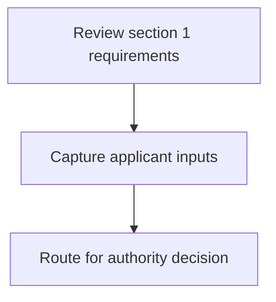
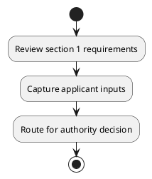

# Chapter 3 / Section 1: Prepare a time-bound, detailed District Export Action strategy / plan for

**Chapter Title:** Developing Districts as Export Hubs

**Pages:** 3

**Purpose:** Prepare a time-bound, detailed District Export Action strategy / plan for
the district to develop as an export hub.

**Purpose Thanglish:** Indha Prepare a time-bound, detailed District Export Action strategy / plan for section-la, Prepare a time-bound, detailed District export Action strategy / plan for
the district to develop as an export hub.

**Summary:** 1. Prepare a time-bound, detailed District Export Action strategy / plan for
the district to develop as an export hub.

**Business Meaning:** 1.

**Business Explanation:** 1. Prepare a time-bound, detailed District Export Action strategy / plan for
the district to develop as an export hub.

**Business Explanation Thanglish:** Indha Prepare a time-bound, detailed District Export Action strategy / plan for section-la, 1. Prepare a time-bound, detailed District export Action strategy / plan for
the district to develop as an export hub.

## Business Logic
- None identified

## Business Rules
- rule_id=CH3-SEC1-R001, rule_description=1. Prepare a time-bound, detailed District Export Action strategy / plan for
the district to develop as an export hub., trigger=Prepare a time-bound, detailed District Export Action strategy / plan for, condition=Not explicitly covered in uploaded documents., validation=Not explicitly covered in uploaded documents., action=Manual review required., exception=No explicit exception found in uploaded documents., output=DEKAI should produce a compliance decision for 1 - Prepare a time-bound, detailed District Export Action strategy / plan for.

## Conditions
- None identified

## Condition Logic
- None identified

## Validations
- None identified

## Exceptions
- None identified

## Dependencies
- None identified

## Authorities
- None identified

## Required Documents
- None identified

## Timelines
- None identified

## Actions
- None identified

## Workflow
- Review section 1 requirements
- Capture applicant inputs
- Route for authority decision

## Workflow ASCII
```text
Prepare a time-bound, detailed District Export Action strategy / plan for
Review section 1 requirements
   |
   v
Capture applicant inputs
   |
   v
Route for authority decision
```

## Decision Tree
- IF section 1 applies THEN proceed with standard DGFT workflow

## Decision Tree ASCII
```text
Prepare a time-bound, detailed District Export Action strategy / plan for Decision
IF section 1 applies THEN proceed with standard DGFT workflow
```

## Examples
- User asks to process Prepare a time-bound, detailed District Export Action strategy / plan for; the platform checks conditions, validations, and documents before action.

**Real-world Example:** Example: an importer or exporter invokes Prepare a time-bound, detailed District Export Action strategy / plan for, submits the prescribed DGFT records, and DEKAI uses the extracted rules to follow the prepare a time-bound, detailed district export action strategy / plan for process.

**Real-world Example Thanglish:** Indha Prepare a time-bound, detailed District Export Action strategy / plan for section-la, Example: an importer or exporter invokes Prepare a time-bound, detailed District export Action strategy / plan for, submits the prescribed DGFT records, and DEKAI uses the extracted rules to follow the prepare a time-bound, detailed district export action strategy / plan for process.

## AI Rules
- None identified

## Database Fields
- name=section_code, type=string, required=True, source=parsed_section_heading
- name=section_title, type=string, required=True, source=parsed_section_heading
- name=for_flag, type=boolean, required=False, source=keyword:for
- name=the_flag, type=boolean, required=False, source=keyword:the
- name=hub_flag, type=boolean, required=False, source=keyword:hub
- name=plan_flag, type=boolean, required=False, source=keyword:plan
- name=export_flag, type=boolean, required=False, source=keyword:Export
- name=action_flag, type=boolean, required=False, source=keyword:Action
- name=prepare_flag, type=boolean, required=False, source=keyword:Prepare
- name=develop_flag, type=boolean, required=False, source=keyword:develop

## API Requirements
- method=GET, path=/api/dgft/sections/1, purpose=Retrieve knowledge payload for section 1, query_params=['include=workflow,decision_tree,validations'], response_fields=['section', 'title', 'summary', 'conditions', 'validations', 'exceptions', 'workflow', 'decision_tree']
- method=POST, path=/api/dgft/Prepare-a-time-bound-detailed-District-Export-Action-strategy-plan-for/validate, purpose=Validate inputs and documents for Prepare a time-bound, detailed District Export Action strategy / plan for, request_fields=['section_code', 'section_title'], response_fields=['status', 'errors', 'warnings', 'next_actions']

## UI Screens
- screen_id=Prepare_a_time_bound_detailed_District_Export_Action_strategy_plan_for_overview, name=Prepare a time-bound, detailed District Export Action strategy / plan for Overview, purpose=Show section summary, authority, timeline, and eligibility cues., widgets=['summary_card', 'conditions_table', 'authority_badges', 'timeline_panel']
- screen_id=Prepare_a_time_bound_detailed_District_Export_Action_strategy_plan_for_submission, name=Prepare a time-bound, detailed District Export Action strategy / plan for Submission, purpose=Capture applicant data and supporting documents., widgets=['dynamic_form', 'document_uploader', 'validation_panel', 'next_action_footer'], fields=['section_code', 'section_title', 'for_flag', 'the_flag', 'hub_flag', 'plan_flag', 'export_flag', 'action_flag']

## Error Messages
- Validation failed because the section requirements were not fully met.

## FAQ
- question_en=What is the purpose of section 1?, answer_en=1. Prepare a time-bound, detailed District Export Action strategy / plan for
the district to develop as an export hub., question_thanglish=Indha Prepare a time-bound, detailed District Export Action strategy / plan for section-la, What is the purpose of section 1?, answer_thanglish=Indha Prepare a time-bound, detailed District Export Action strategy / plan for section-la, 1. Prepare a time-bound, detailed District export Action strategy / plan for
the district to develop as an export hub.
- question_en=What documents are required under Prepare a time-bound, detailed District Export Action strategy / plan for?, answer_en=Not explicitly covered in uploaded documents., question_thanglish=Indha Prepare a time-bound, detailed District Export Action strategy / plan for section-la, What documents are required under Prepare a time-bound, detailed District export Action strategy / plan for?, answer_thanglish=Indha Prepare a time-bound, detailed District Export Action strategy / plan for section-la, Not explicitly covered in uploaded documents.
- question_en=Which authority handles Prepare a time-bound, detailed District Export Action strategy / plan for?, answer_en=Not explicitly covered in uploaded documents., question_thanglish=Indha Prepare a time-bound, detailed District Export Action strategy / plan for section-la, Which authority handles Prepare a time-bound, detailed District export Action strategy / plan for?, answer_thanglish=Indha Prepare a time-bound, detailed District Export Action strategy / plan for section-la, Not explicitly covered in uploaded documents.

## Questions Users May Ask
- What does Prepare a time-bound, detailed District Export Action strategy / plan for require?
- Which documents are needed for Prepare a time-bound, detailed District Export Action strategy / plan for?
- How does DEKAI validate Prepare a time-bound, detailed District Export Action strategy / plan for requests?

## Expected AI Answers
- Prepare a time-bound, detailed District Export Action strategy / plan for requires the platform to interpret the section text, apply the extracted business rules, and present the correct next action.
- Required documents are inferred from the section text: no explicit documents were detected.
- DEKAI validates Prepare a time-bound, detailed District Export Action strategy / plan for by checking conditions, required documents, authority references, and exception clauses before recommending an outcome.

## AI Q&A Examples
- question_en=User asks: How do I comply with Prepare a time-bound, detailed District Export Action strategy / plan for?, answer_en=AI answers: DEKAI should evaluate section 1, apply the extracted rules, and guide the user through Review section 1 requirements., question_thanglish=Indha Prepare a time-bound, detailed District Export Action strategy / plan for section-la, User asks: How do I comply with Prepare a time-bound, detailed District export Action strategy / plan for?, answer_thanglish=Indha Prepare a time-bound, detailed District Export Action strategy / plan for section-la, AI answers: DEKAI should evaluate section 1, apply the extracted rules, and guide the user through Review section 1 requirements.
- question_en=User asks: Which validations apply to Prepare a time-bound, detailed District Export Action strategy / plan for?, answer_en=AI answers: Applicable validations are not explicitly covered in the uploaded documents., question_thanglish=Indha Prepare a time-bound, detailed District Export Action strategy / plan for section-la, User asks: Which validations apply to Prepare a time-bound, detailed District export Action strategy / plan for?, answer_thanglish=Indha Prepare a time-bound, detailed District Export Action strategy / plan for section-la, AI answers: Applicable validations are not explicitly covered in the uploaded documents.

## DEKAI AI Implementation Notes
- Capture chapter 3, section 1, title, and page references as immutable knowledge metadata.
- Bind validations for Prepare a time-bound, detailed District Export Action strategy / plan for into a rule engine keyed by the rule IDs extracted for this section.

## DEKAI AI Implementation Notes Thanglish
- Indha Prepare a time-bound, detailed District Export Action strategy / plan for section-la, Capture chapter 3, section 1, title, and page references as immutable knowledge metadata.
- Indha Prepare a time-bound, detailed District Export Action strategy / plan for section-la, Bind validations for Prepare a time-bound, detailed District export Action strategy / plan for into a rule engine keyed by the rule IDs extracted for this section.

## AI Metadata
- Keywords: for, the, hub, plan, Export, Action, Prepare, develop, detailed, District, strategy, time-bound
- Search Keywords: for, the, hub, plan, Export, Action, Prepare, develop, detailed, District, strategy, time-bound
- Intent: Provide knowledge guidance for Prepare a time-bound, detailed District Export Action strategy / plan for.
- Tags: 1, Prepare a time-bound, detailed District Export Action strategy / plan for, dgft
- Related Sections: 
- Related Chapters: 
- Related Rules: 

## Mermaid


## PlantUML

