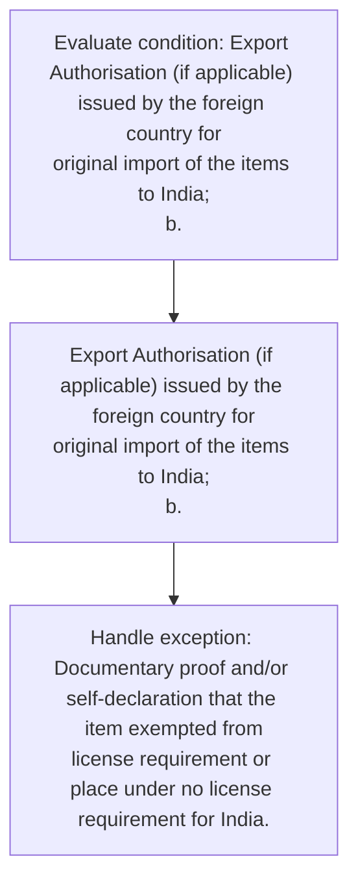

# Chapter 10 / Section 1: Proof of import of the item(s):

**Chapter Title:** SCOMET: Special Chemicals, Organisms, Materials, Equipment and Technologies

**Pages:** 16, 17

**Purpose:** Export Authorisation (if applicable) issued by the foreign country for
original import of the items to India;
b.

**Purpose Thanglish:** Indha Proof of import of the item(s): section-la, export Authorisation (if applicable) issued by the foreign country for
original import of the items to India;
b.

**Summary:** 1. Proof of import of the item(s):
a. Export Authorisation (if applicable) issued by the foreign country for
original import of the items to India;
b.

**Business Meaning:** 1.

**Business Explanation:** 1. Proof of import of the item(s):
a. Export Authorisation (if applicable) issued by the foreign country for
original import of the items to India;
b.

**Business Explanation Thanglish:** Indha Proof of import of the item(s): section-la, 1. Proof of import of the item(s):
a. export Authorisation (if applicable) issued by the foreign country for
original import of the items to India;
b.

## Business Logic
- None identified

## Business Rules
- rule_id=CH10-SEC1-R001, rule_description=IF validations pass THEN recommend action: Export Authorisation (if applicable) issued by the foreign country for
original import of the items to India;
b., trigger=Proof of import of the item(s):, condition=Export Authorisation (if applicable) issued by the foreign country for
original import of the items to India;
b., validation=Not explicitly covered in uploaded documents., action=Export Authorisation (if applicable) issued by the foreign country for
original import of the items to India;
b., exception=Documentary proof and/or self-declaration that the item exempted from
license requirement or place under no license requirement for India., output=DEKAI should produce a compliance decision for 1 - Proof of import of the item(s):.

## Conditions
- Export Authorisation (if applicable) issued by the foreign country for
original import of the items to India;
b.

## Condition Logic
- id=10.1.1, if=Export Authorisation (if applicable) issued by the foreign country for
original import of the items to India;
b., then=Export Authorisation (if applicable) issued by the foreign country for
original import of the items to India;
b., source=Export Authorisation (if applicable) issued by the foreign country for
original import of the items to India;
b.

## Validations
- None identified

## Exceptions
- Documentary proof and/or self-declaration that the item exempted from
license requirement or place under no license requirement for India.

## Dependencies
- 2

## Authorities
- None identified

## Required Documents
- Proof of import of the item(s):
a.
- Documentary proof and/or self-declaration that the item exempted from
license requirement or place under no license requirement for India.
- Bill of Entry (first time)
1.
- Bill of Entry (first time)
2.
- Proof of obligation for repair of defective/damaged items:
Contract agreement and/or ‘Statement of Work (SOW)’/ Master Service
agreement (MSA) between Indian exporter and with the entity abroad/Direct
subsidiary/Parent of the Indian Company or another subsidiary of the foreign
parent of the Indian Company/Authorised Vendor/Original Equipment
manufacturer having EMS agreement/Master service agreement/ contract with
Indian Company from (which the goods were imported initially) defining
conditions for undertaking repair in India

## Timelines
- None identified

## Actions
- Export Authorisation (if applicable) issued by the foreign country for
original import of the items to India;
b.

## Workflow
- Evaluate condition: Export Authorisation (if applicable) issued by the foreign country for
original import of the items to India;
b.
- Export Authorisation (if applicable) issued by the foreign country for
original import of the items to India;
b.
- Handle exception: Documentary proof and/or self-declaration that the item exempted from
license requirement or place under no license requirement for India.

## Workflow ASCII
```text
Proof of import of the item(s):
Evaluate condition: Export Authorisation (if applicable) issued by the foreign country for
original import of the items to India;
b.
   |
   v
Export Authorisation (if applicable) issued by the foreign country for
original import of the items to India;
b.
   |
   v
Handle exception: Documentary proof and/or self-declaration that the item exempted from
license requirement or place under no license requirement for India.
```

## Decision Tree
- IF Export Authorisation (if applicable) issued by the foreign country for
original import of the items to India;
b. THEN Export Authorisation (if applicable) issued by the foreign country for
original import of the items to India;
b.
- IF exception applies (Documentary proof and/or self-declaration that the item exempted from
license requirement or place under no license requirement for India.) THEN route to manual review

## Decision Tree ASCII
```text
Proof of import of the item(s): Decision
IF Export Authorisation (if applicable) issued by the foreign country for
original import of the items to India;
b. THEN Export Authorisation (if applicable) issued by the foreign country for
original import of the items to India;
b.
   |
   v
IF exception applies (Documentary proof and/or self-declaration that the item exempted from
license requirement or place under no license requirement for India.) THEN route to manual review
```

## Examples
- User asks to process Proof of import of the item(s):; the platform checks conditions, validations, and documents before action.

**Real-world Example:** Example: an importer or exporter invokes Proof of import of the item(s):, submits Proof of import of the item(s):
a., Documentary proof and/or self-declaration that the item exempted from
license requirement or place under no license requirement for India., Bill of Entry (first time)
1., and DEKAI uses the extracted rules to export authorisation (if applicable) issued by the foreign country for
original import of the items to india;
b..

**Real-world Example Thanglish:** Indha Proof of import of the item(s): section-la, Example: an importer or exporter invokes Proof of import of the item(s):, submits Proof of import of the item(s):
a., Documentary proof and/or self-declaration that the item exempted from
license requirement or place under no license requirement for India., Bill of Entry (first time)
1., and DEKAI uses the extracted rules to export authorisation (if applicable) issued by the foreign country for
original import of the items to india;
b..

## AI Rules
- IF validations pass THEN recommend action: Export Authorisation (if applicable) issued by the foreign country for
original import of the items to India;
b.

## Database Fields
- name=section_code, type=string, required=True, source=parsed_section_heading
- name=section_title, type=string, required=True, source=parsed_section_heading
- name=the_flag, type=boolean, required=False, source=keyword:the
- name=for_flag, type=boolean, required=False, source=keyword:for
- name=sow_flag, type=boolean, required=False, source=keyword:SOW
- name=msa_flag, type=boolean, required=False, source=keyword:MSA
- name=and_flag, type=boolean, required=False, source=keyword:and
- name=ems_flag, type=boolean, required=False, source=keyword:EMS
- name=item_flag, type=boolean, required=False, source=keyword:item
- name=that_flag, type=boolean, required=False, source=keyword:that
- name=document_1_submitted, type=boolean, required=True, source=Proof of import of the item(s):
a.
- name=document_2_submitted, type=boolean, required=True, source=Documentary proof and/or self-declaration that the item exempted from
license requirement or place under no license requirement for India.
- name=document_3_submitted, type=boolean, required=True, source=Bill of Entry (first time)
1.
- name=document_4_submitted, type=boolean, required=True, source=Bill of Entry (first time)
2.
- name=document_5_submitted, type=boolean, required=True, source=Proof of obligation for repair of defective/damaged items:
Contract agreement and/or ‘Statement of Work (SOW)’/ Master Service
agreement (MSA) between Indian exporter and with the entity abroad/Direct
subsidiary/Parent of the Indian Company or another subsidiary of the foreign
parent of the Indian Company/Authorised Vendor/Original Equipment
manufacturer having EMS agreement/Master service agreement/ contract with
Indian Company from (which the goods were imported initially) defining
conditions for undertaking repair in India

## API Requirements
- method=GET, path=/api/dgft/sections/1, purpose=Retrieve knowledge payload for section 1, query_params=['include=workflow,decision_tree,validations'], response_fields=['section', 'title', 'summary', 'conditions', 'validations', 'exceptions', 'workflow', 'decision_tree']
- method=POST, path=/api/dgft/Proof-of-import-of-the-item-s/validate, purpose=Validate inputs and documents for Proof of import of the item(s):, request_fields=['section_code', 'section_title', 'document_1_submitted', 'document_2_submitted', 'document_3_submitted', 'document_4_submitted', 'document_5_submitted'], response_fields=['status', 'errors', 'warnings', 'next_actions']
- method=POST, path=/api/dgft/Proof-of-import-of-the-item-s/execute, purpose=Trigger business action for Export Authorisation (if applicable) issued by the foreign country for
original import of the items to India;
b., request_fields=['section_code', 'section_title', 'document_1_submitted', 'document_2_submitted', 'document_3_submitted', 'document_4_submitted', 'document_5_submitted'], response_fields=['reference_id', 'status', 'authority', 'timeline']

## UI Screens
- screen_id=Proof_of_import_of_the_item_s_overview, name=Proof of import of the item(s): Overview, purpose=Show section summary, authority, timeline, and eligibility cues., widgets=['summary_card', 'conditions_table', 'authority_badges', 'timeline_panel']
- screen_id=Proof_of_import_of_the_item_s_submission, name=Proof of import of the item(s): Submission, purpose=Capture applicant data and supporting documents., widgets=['dynamic_form', 'document_uploader', 'validation_panel', 'next_action_footer'], fields=['section_code', 'section_title', 'the_flag', 'for_flag', 'sow_flag', 'msa_flag', 'and_flag', 'ems_flag']
- screen_id=Proof_of_import_of_the_item_s_exceptions, name=Proof of import of the item(s): Exception Review, purpose=Explain exception handling and manual review triggers., widgets=['exception_banner', 'decision_tree', 'case_notes']

## Error Messages
- Validation failed because the section requirements were not fully met.

## FAQ
- question_en=What is the purpose of section 1?, answer_en=1. Proof of import of the item(s):
a. Export Authorisation (if applicable) issued by the foreign country for
original import of the items to India;
b., question_thanglish=Indha Proof of import of the item(s): section-la, What is the purpose of section 1?, answer_thanglish=Indha Proof of import of the item(s): section-la, 1. Proof of import of the item(s):
a. export Authorisation (if applicable) issued by the foreign country for
original import of the items to India;
b.
- question_en=What documents are required under Proof of import of the item(s):?, answer_en=Proof of import of the item(s):
a., Documentary proof and/or self-declaration that the item exempted from
license requirement or place under no license requirement for India., Bill of Entry (first time)
1., Bill of Entry (first time)
2., Proof of obligation for repair of defective/damaged items:
Contract agreement and/or ‘Statement of Work (SOW)’/ Master Service
agreement (MSA) between Indian exporter and with the entity abroad/Direct
subsidiary/Parent of the Indian Company or another subsidiary of the foreign
parent of the Indian Company/Authorised Vendor/Original Equipment
manufacturer having EMS agreement/Master service agreement/ contract with
Indian Company from (which the goods were imported initially) defining
conditions for undertaking repair in India, question_thanglish=Indha Proof of import of the item(s): section-la, What documents are required under Proof of import of the item(s):?, answer_thanglish=Indha Proof of import of the item(s): section-la, Proof of import of the item(s):
a., Documentary proof and/or self-declaration that the item exempted from
license requirement or place under no license requirement for India., Bill of Entry (first time)
1., Bill of Entry (first time)
2., Proof of obligation for repair of defective/damaged items:
Contract agreement and/or ‘Statement of Work (SOW)’/ Master Service
agreement (MSA) between Indian exporter and with the entity abroad/Direct
subsidiary/Parent of the Indian Company or another subsidiary of the foreign
parent of the Indian Company/Authorised Vendor/Original Equipment
manufacturer having EMS agreement/Master service agreement/ contract with
Indian Company from (which the goods were imported initially) defining
conditions for undertaking repair in India
- question_en=Which authority handles Proof of import of the item(s):?, answer_en=Not explicitly covered in uploaded documents., question_thanglish=Indha Proof of import of the item(s): section-la, Which authority handles Proof of import of the item(s):?, answer_thanglish=Indha Proof of import of the item(s): section-la, Not explicitly covered in uploaded documents.

## Questions Users May Ask
- What does Proof of import of the item(s): require?
- Which documents are needed for Proof of import of the item(s):?
- How does DEKAI validate Proof of import of the item(s): requests?
- What action should be taken for Proof of import of the item(s):?

## Expected AI Answers
- Proof of import of the item(s): requires the platform to interpret the section text, apply the extracted business rules, and present the correct next action.
- Required documents are inferred from the section text: Proof of import of the item(s):
a., Documentary proof and/or self-declaration that the item exempted from
license requirement or place under no license requirement for India., Bill of Entry (first time)
1., Bill of Entry (first time)
2., Proof of obligation for repair of defective/damaged items:
Contract agreement and/or ‘Statement of Work (SOW)’/ Master Service
agreement (MSA) between Indian exporter and with the entity abroad/Direct
subsidiary/Parent of the Indian Company or another subsidiary of the foreign
parent of the Indian Company/Authorised Vendor/Original Equipment
manufacturer having EMS agreement/Master service agreement/ contract with
Indian Company from (which the goods were imported initially) defining
conditions for undertaking repair in India
- DEKAI validates Proof of import of the item(s): by checking conditions, required documents, authority references, and exception clauses before recommending an outcome.
- The primary extracted action is: Export Authorisation (if applicable) issued by the foreign country for
original import of the items to India;
b.

## AI Q&A Examples
- question_en=User asks: How do I comply with Proof of import of the item(s):?, answer_en=AI answers: DEKAI should evaluate section 1, apply the extracted rules, and guide the user through Evaluate condition: Export Authorisation (if applicable) issued by the foreign country for
original import of the items to India;
b.., question_thanglish=Indha Proof of import of the item(s): section-la, User asks: How do I comply with Proof of import of the item(s):?, answer_thanglish=Indha Proof of import of the item(s): section-la, AI answers: DEKAI should evaluate section 1, apply the extracted rules, and guide the user through Evaluate condition: export Authorisation (if applicable) issued by the foreign country for
original import of the items to India;
b..
- question_en=User asks: Which validations apply to Proof of import of the item(s):?, answer_en=AI answers: Applicable validations are not explicitly covered in the uploaded documents., question_thanglish=Indha Proof of import of the item(s): section-la, User asks: Which validations apply to Proof of import of the item(s):?, answer_thanglish=Indha Proof of import of the item(s): section-la, AI answers: Applicable validations are not explicitly covered in the uploaded documents.

## DEKAI AI Implementation Notes
- Capture chapter 10, section 1, title, and page references as immutable knowledge metadata.
- Bind validations for Proof of import of the item(s): into a rule engine keyed by the rule IDs extracted for this section.
- Expose document upload controls for: Proof of import of the item(s):
a., Documentary proof and/or self-declaration that the item exempted from
license requirement or place under no license requirement for India., Bill of Entry (first time)
1., Bill of Entry (first time)
2., Proof of obligation for repair of defective/damaged items:
Contract agreement and/or ‘Statement of Work (SOW)’/ Master Service
agreement (MSA) between Indian exporter and with the entity abroad/Direct
subsidiary/Parent of the Indian Company or another subsidiary of the foreign
parent of the Indian Company/Authorised Vendor/Original Equipment
manufacturer having EMS agreement/Master service agreement/ contract with
Indian Company from (which the goods were imported initially) defining
conditions for undertaking repair in India.
- Trigger manual review when exception clauses are detected.
- Show contextual links to related sections: 2.

## DEKAI AI Implementation Notes Thanglish
- Indha Proof of import of the item(s): section-la, Capture chapter 10, section 1, title, and page references as immutable knowledge metadata.
- Indha Proof of import of the item(s): section-la, Bind validations for Proof of import of the item(s): into a rule engine keyed by the rule IDs extracted for this section.
- Indha Proof of import of the item(s): section-la, Expose document upload controls for: Proof of import of the item(s):
a., Documentary proof and/or self-declaration that the item exempted from
license requirement or place under no license requirement for India., Bill of Entry (first time)
1., Bill of Entry (first time)
2., Proof of obligation for repair of defective/damaged items:
Contract agreement and/or ‘Statement of Work (SOW)’/ Master Service
agreement (MSA) between Indian exporter and with the entity abroad/Direct
subsidiary/Parent of the Indian Company or another subsidiary of the foreign
parent of the Indian Company/Authorised Vendor/Original Equipment
manufacturer having EMS agreement/Master service agreement/ contract with
Indian Company from (which the goods were imported initially) defining
conditions for undertaking repair in India.
- Indha Proof of import of the item(s): section-la, Trigger manual review when exception clauses are detected.
- Indha Proof of import of the item(s): section-la, Show contextual links to related sections: 2.

## AI Metadata
- Keywords: the, for, SOW, MSA, and, EMS, item, that, from, Bill, time, Work, with, were, Proof, items, India, place, under, Entry
- Search Keywords: the, for, SOW, MSA, and, EMS, item, that, from, Bill, time, Work, with, were, Proof, items, India, place, under, Entry
- Intent: Support Proof of import of the item(s): processing and compliance validation.
- Tags: 1, Proof of import of the item(s):, document-driven, dgft
- Related Sections: 2
- Related Chapters: 
- Related Rules: 

## Mermaid


## PlantUML
```plantuml
@startuml
start
:Evaluate condition\: Export Authorisation (if applicable) issued by the foreign country for
original import of the items to India;
b.;
:Export Authorisation (if applicable) issued by the foreign country for
original import of the items to India;
b.;
:Handle exception\: Documentary proof and/or self-declaration that the item exempted from
license requirement or place under no license requirement for India.;
stop
@enduml
```
