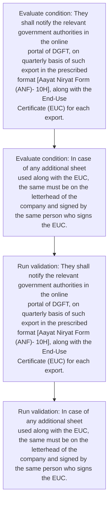
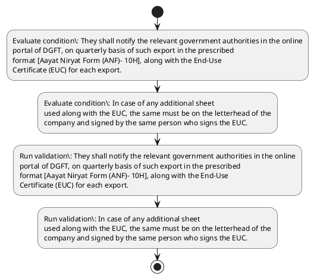

# Chapter 10 / Section 1: They shall notify the relevant government authorities in the online

**Chapter Title:** SCOMET: Special Chemicals, Organisms, Materials, Equipment and Technologies

**Pages:** 30

**Purpose:** They shall notify the relevant government authorities in the online
portal of DGFT, on quarterly basis of such export in the prescribed
format [Aayat Niryat Form (ANF)- 10H], along with the End-Use
Certificate (EUC) for each export.

**Purpose Thanglish:** Indha They shall notify the relevant government authorities in the online section-la, They kandippa notify the relevant government authorities in the online
portal of DGFT, on quarterly basis of such export in the prescribed
format [Aayat Niryat Form (ANF)- 10H], along with the End-Use
Certificate (EUC) for each export.

**Summary:** 1. They shall notify the relevant government authorities in the online
portal of DGFT, on quarterly basis of such export in the prescribed
format [Aayat Niryat Form (ANF)- 10H], along with the End-Use
Certificate (EUC) for each export. 2.

**Business Meaning:** They shall notify the relevant government authorities in the online governs how DGFT business controls should be applied, validated, and enforced.

**Business Explanation:** They shall notify the relevant government authorities in the online explains the operating rule set that DEKAI should enforce. Key control points include They shall notify the relevant government authorities in the online
portal of DGFT, on quarterly basis of such export in the prescribed
format [Aayat Niryat Form (ANF)- 10H], along with the End-Use
Certificate (EUC) for each export.

**Business Explanation Thanglish:** Indha They shall notify the relevant government authorities in the online section-la, They kandippa notify the relevant government authorities in the online explains the operating rule set that DEKAI should enforce. Key control points include They kandippa notify the relevant government authorities in the online
portal of DGFT, on quarterly basis of such export in the prescribed
format [Aayat Niryat Form (ANF)- 10H], along with the End-Use
Certificate (EUC) for each export.

## Business Logic
- They shall notify the relevant government authorities in the online
portal of DGFT, on quarterly basis of such export in the prescribed
format [Aayat Niryat Form (ANF)- 10H], along with the End-Use
Certificate (EUC) for each export.
- In case of any additional sheet
used along with the EUC, the same must be on the letterhead of the
company and signed by the same person who signs the EUC.

## Business Rules
- rule_id=CH10-SEC1-R001, rule_description=They shall notify the relevant government authorities in the online
portal of DGFT, on quarterly basis of such export in the prescribed
format [Aayat Niryat Form (ANF)- 10H], along with the End-Use
Certificate (EUC) for each export., trigger=They shall notify the relevant government authorities in the online, condition=They shall notify the relevant government authorities in the online
portal of DGFT, on quarterly basis of such export in the prescribed
format [Aayat Niryat Form (ANF)- 10H], along with the End-Use
Certificate (EUC) for each export., validation=They shall notify the relevant government authorities in the online
portal of DGFT, on quarterly basis of such export in the prescribed
format [Aayat Niryat Form (ANF)- 10H], along with the End-Use
Certificate (EUC) for each export., action=Manual review required., exception=No explicit exception found in uploaded documents., output=DEKAI should produce a compliance decision for 1 - They shall notify the relevant government authorities in the online.
- rule_id=CH10-SEC1-R002, rule_description=In case of any additional sheet
used along with the EUC, the same must be on the letterhead of the
company and signed by the same person who signs the EUC., trigger=They shall notify the relevant government authorities in the online, condition=In case of any additional sheet
used along with the EUC, the same must be on the letterhead of the
company and signed by the same person who signs the EUC., validation=In case of any additional sheet
used along with the EUC, the same must be on the letterhead of the
company and signed by the same person who signs the EUC., action=Manual review required., exception=No explicit exception found in uploaded documents., output=DEKAI should produce a compliance decision for 1 - They shall notify the relevant government authorities in the online.

## Conditions
- They shall notify the relevant government authorities in the online
portal of DGFT, on quarterly basis of such export in the prescribed
format [Aayat Niryat Form (ANF)- 10H], along with the End-Use
Certificate (EUC) for each export.
- In case of any additional sheet
used along with the EUC, the same must be on the letterhead of the
company and signed by the same person who signs the EUC.

## Condition Logic
- id=10.1.1, if=They shall notify the relevant government authorities in the online
portal of DGFT, on quarterly basis of such export in the prescribed
format [Aayat Niryat Form (ANF)- 10H], along with the End-Use
Certificate (EUC) for each export., then=Route for review, source=They shall notify the relevant government authorities in the online
portal of DGFT, on quarterly basis of such export in the prescribed
format [Aayat Niryat Form (ANF)- 10H], along with the End-Use
Certificate (EUC) for each export.
- id=10.1.2, if=In case of any additional sheet
used along with the EUC, the same must be on the letterhead of the
company and signed by the same person who signs the EUC., then=Route for review, source=In case of any additional sheet
used along with the EUC, the same must be on the letterhead of the
company and signed by the same person who signs the EUC.

## Validations
- They shall notify the relevant government authorities in the online
portal of DGFT, on quarterly basis of such export in the prescribed
format [Aayat Niryat Form (ANF)- 10H], along with the End-Use
Certificate (EUC) for each export.
- In case of any additional sheet
used along with the EUC, the same must be on the letterhead of the
company and signed by the same person who signs the EUC.

## Exceptions
- None identified

## Dependencies
- 2

## Authorities
- DGFT

## Required Documents
- They shall notify the relevant government authorities in the online
portal of DGFT, on quarterly basis of such export in the prescribed
format [Aayat Niryat Form (ANF)- 10H], along with the End-Use
Certificate (EUC) for each export.

## Timelines
- None identified

## Actions
- None identified

## Workflow
- Evaluate condition: They shall notify the relevant government authorities in the online
portal of DGFT, on quarterly basis of such export in the prescribed
format [Aayat Niryat Form (ANF)- 10H], along with the End-Use
Certificate (EUC) for each export.
- Evaluate condition: In case of any additional sheet
used along with the EUC, the same must be on the letterhead of the
company and signed by the same person who signs the EUC.
- Run validation: They shall notify the relevant government authorities in the online
portal of DGFT, on quarterly basis of such export in the prescribed
format [Aayat Niryat Form (ANF)- 10H], along with the End-Use
Certificate (EUC) for each export.
- Run validation: In case of any additional sheet
used along with the EUC, the same must be on the letterhead of the
company and signed by the same person who signs the EUC.

## Workflow ASCII
```text
They shall notify the relevant government authorities in the online
Evaluate condition: They shall notify the relevant government authorities in the online
portal of DGFT, on quarterly basis of such export in the prescribed
format [Aayat Niryat Form (ANF)- 10H], along with the End-Use
Certificate (EUC) for each export.
   |
   v
Evaluate condition: In case of any additional sheet
used along with the EUC, the same must be on the letterhead of the
company and signed by the same person who signs the EUC.
   |
   v
Run validation: They shall notify the relevant government authorities in the online
portal of DGFT, on quarterly basis of such export in the prescribed
format [Aayat Niryat Form (ANF)- 10H], along with the End-Use
Certificate (EUC) for each export.
   |
   v
Run validation: In case of any additional sheet
used along with the EUC, the same must be on the letterhead of the
company and signed by the same person who signs the EUC.
```

## Decision Tree
- IF section 1 applies THEN proceed with standard DGFT workflow

## Decision Tree ASCII
```text
They shall notify the relevant government authorities in the online Decision
IF section 1 applies THEN proceed with standard DGFT workflow
```

## Examples
- User asks to process They shall notify the relevant government authorities in the online; the platform checks conditions, validations, and documents before action.

**Real-world Example:** Example: an importer or exporter invokes They shall notify the relevant government authorities in the online, submits They shall notify the relevant government authorities in the online
portal of DGFT, on quarterly basis of such export in the prescribed
format [Aayat Niryat Form (ANF)- 10H], along with the End-Use
Certificate (EUC) for each export., and DEKAI uses the extracted rules to follow the they shall notify the relevant government authorities in the online process.

**Real-world Example Thanglish:** Indha They shall notify the relevant government authorities in the online section-la, Example: an importer or exporter invokes They kandippa notify the relevant government authorities in the online, submits They kandippa notify the relevant government authorities in the online
portal of DGFT, on quarterly basis of such export in the prescribed
format [Aayat Niryat Form (ANF)- 10H], along with the End-Use
Certificate (EUC) for each export., and DEKAI uses the extracted rules to follow the they kandippa notify the relevant government authorities in the online process.

## AI Rules
- IF detected context matches section rule THEN enforce: They shall notify the relevant government authorities in the online
portal of DGFT, on quarterly basis of such export in the prescribed
format [Aayat Niryat Form (ANF)- 10H], along with the End-Use
Certificate (EUC) for each export.
- IF detected context matches section rule THEN enforce: In case of any additional sheet
used along with the EUC, the same must be on the letterhead of the
company and signed by the same person who signs the EUC.

## Database Fields
- name=section_code, type=string, required=True, source=parsed_section_heading
- name=section_title, type=string, required=True, source=parsed_section_heading
- name=the_flag, type=boolean, required=False, source=keyword:the
- name=anf_flag, type=boolean, required=False, source=keyword:ANF
- name=euc_flag, type=boolean, required=False, source=keyword:EUC
- name=for_flag, type=boolean, required=False, source=keyword:for
- name=are_flag, type=boolean, required=False, source=keyword:are
- name=all_flag, type=boolean, required=False, source=keyword:all
- name=ies_flag, type=boolean, required=False, source=keyword:ies
- name=ink_flag, type=boolean, required=False, source=keyword:ink
- name=document_1_submitted, type=boolean, required=True, source=They shall notify the relevant government authorities in the online
portal of DGFT, on quarterly basis of such export in the prescribed
format [Aayat Niryat Form (ANF)- 10H], along with the End-Use
Certificate (EUC) for each export.

## API Requirements
- method=GET, path=/api/dgft/sections/1, purpose=Retrieve knowledge payload for section 1, query_params=['include=workflow,decision_tree,validations'], response_fields=['section', 'title', 'summary', 'conditions', 'validations', 'exceptions', 'workflow', 'decision_tree']
- method=POST, path=/api/dgft/They-shall-notify-the-relevant-government-authorities-in-the-online/validate, purpose=Validate inputs and documents for They shall notify the relevant government authorities in the online, request_fields=['section_code', 'section_title', 'document_1_submitted'], response_fields=['status', 'errors', 'warnings', 'next_actions']

## UI Screens
- screen_id=They_shall_notify_the_relevant_government_authorities_in_the_online_overview, name=They shall notify the relevant government authorities in the online Overview, purpose=Show section summary, authority, timeline, and eligibility cues., widgets=['summary_card', 'conditions_table', 'authority_badges', 'timeline_panel']
- screen_id=They_shall_notify_the_relevant_government_authorities_in_the_online_submission, name=They shall notify the relevant government authorities in the online Submission, purpose=Capture applicant data and supporting documents., widgets=['dynamic_form', 'document_uploader', 'validation_panel', 'next_action_footer'], fields=['section_code', 'section_title', 'the_flag', 'anf_flag', 'euc_flag', 'for_flag', 'are_flag', 'all_flag']

## Error Messages
- Validation failed because the section requirements were not fully met.

## FAQ
- question_en=What is the purpose of section 1?, answer_en=They shall notify the relevant government authorities in the online explains the operating rule set that DEKAI should enforce. Key control points include They shall notify the relevant government authorities in the online
portal of DGFT, on quarterly basis of such export in the prescribed
format [Aayat Niryat Form (ANF)- 10H], along with the End-Use
Certificate (EUC) for each export., question_thanglish=Indha They shall notify the relevant government authorities in the online section-la, What is the purpose of section 1?, answer_thanglish=Indha They shall notify the relevant government authorities in the online section-la, They kandippa notify the relevant government authorities in the online explains the operating rule set that DEKAI should enforce. Key control points include They kandippa notify the relevant government authorities in the online
portal of DGFT, on quarterly basis of such export in the prescribed
format [Aayat Niryat Form (ANF)- 10H], along with the End-Use
Certificate (EUC) for each export.
- question_en=What documents are required under They shall notify the relevant government authorities in the online?, answer_en=They shall notify the relevant government authorities in the online
portal of DGFT, on quarterly basis of such export in the prescribed
format [Aayat Niryat Form (ANF)- 10H], along with the End-Use
Certificate (EUC) for each export., question_thanglish=Indha They shall notify the relevant government authorities in the online section-la, What documents are required under They kandippa notify the relevant government authorities in the online?, answer_thanglish=Indha They shall notify the relevant government authorities in the online section-la, They kandippa notify the relevant government authorities in the online
portal of DGFT, on quarterly basis of such export in the prescribed
format [Aayat Niryat Form (ANF)- 10H], along with the End-Use
Certificate (EUC) for each export.
- question_en=Which authority handles They shall notify the relevant government authorities in the online?, answer_en=DGFT, question_thanglish=Indha They shall notify the relevant government authorities in the online section-la, Which authority handles They kandippa notify the relevant government authorities in the online?, answer_thanglish=Indha They shall notify the relevant government authorities in the online section-la, DGFT

## Questions Users May Ask
- What does They shall notify the relevant government authorities in the online require?
- Which documents are needed for They shall notify the relevant government authorities in the online?
- How does DEKAI validate They shall notify the relevant government authorities in the online requests?

## Expected AI Answers
- They shall notify the relevant government authorities in the online requires the platform to interpret the section text, apply the extracted business rules, and present the correct next action.
- Required documents are inferred from the section text: They shall notify the relevant government authorities in the online
portal of DGFT, on quarterly basis of such export in the prescribed
format [Aayat Niryat Form (ANF)- 10H], along with the End-Use
Certificate (EUC) for each export.
- DEKAI validates They shall notify the relevant government authorities in the online by checking conditions, required documents, authority references, and exception clauses before recommending an outcome.

## AI Q&A Examples
- question_en=User asks: How do I comply with They shall notify the relevant government authorities in the online?, answer_en=AI answers: DEKAI should evaluate section 1, apply the extracted rules, and guide the user through Evaluate condition: They shall notify the relevant government authorities in the online
portal of DGFT, on quarterly basis of such export in the prescribed
format [Aayat Niryat Form (ANF)- 10H], along with the End-Use
Certificate (EUC) for each export.., question_thanglish=Indha They shall notify the relevant government authorities in the online section-la, User asks: How do I comply with They kandippa notify the relevant government authorities in the online?, answer_thanglish=Indha They shall notify the relevant government authorities in the online section-la, AI answers: DEKAI should evaluate section 1, apply the extracted rules, and guide the user through Evaluate condition: They kandippa notify the relevant government authorities in the online
portal of DGFT, on quarterly basis of such export in the prescribed
format [Aayat Niryat Form (ANF)- 10H], along with the End-Use
Certificate (EUC) for each export..
- question_en=User asks: Which validations apply to They shall notify the relevant government authorities in the online?, answer_en=AI answers: Applicable validations are They shall notify the relevant government authorities in the online
portal of DGFT, on quarterly basis of such export in the prescribed
format [Aayat Niryat Form (ANF)- 10H], along with the End-Use
Certificate (EUC) for each export., In case of any additional sheet
used along with the EUC, the same must be on the letterhead of the
company and signed by the same person who signs the EUC., question_thanglish=Indha They shall notify the relevant government authorities in the online section-la, User asks: Which validations apply to They kandippa notify the relevant government authorities in the online?, answer_thanglish=Indha They shall notify the relevant government authorities in the online section-la, AI answers: Applicable validations are They kandippa notify the relevant government authorities in the online
portal of DGFT, on quarterly basis of such export in the prescribed
format [Aayat Niryat Form (ANF)- 10H], along with the End-Use
Certificate (EUC) for each export., In case of any additional sheet
used along with the EUC, the same must be on the letterhead of the
company and signed by the same person who signs the EUC.

## DEKAI AI Implementation Notes
- Capture chapter 10, section 1, title, and page references as immutable knowledge metadata.
- Bind validations for They shall notify the relevant government authorities in the online into a rule engine keyed by the rule IDs extracted for this section.
- Expose document upload controls for: They shall notify the relevant government authorities in the online
portal of DGFT, on quarterly basis of such export in the prescribed
format [Aayat Niryat Form (ANF)- 10H], along with the End-Use
Certificate (EUC) for each export..
- Route escalations or approvals to: DGFT.
- Show contextual links to related sections: 2.

## DEKAI AI Implementation Notes Thanglish
- Indha They shall notify the relevant government authorities in the online section-la, Capture chapter 10, section 1, title, and page references as immutable knowledge metadata.
- Indha They shall notify the relevant government authorities in the online section-la, Bind validations for They kandippa notify the relevant government authorities in the online into a rule engine keyed by the rule IDs extracted for this section.
- Indha They shall notify the relevant government authorities in the online section-la, Expose document upload controls for: They kandippa notify the relevant government authorities in the online
portal of DGFT, on quarterly basis of such export in the prescribed
format [Aayat Niryat Form (ANF)- 10H], along with the End-Use
Certificate (EUC) for each export..
- Indha They shall notify the relevant government authorities in the online section-la, Route escalations or approvals to: DGFT.
- Indha They shall notify the relevant government authorities in the online section-la, Show contextual links to related sections: 2.

## AI Metadata
- Keywords: the, ANF, EUC, for, are, all, ies, ink, and, any, who, They, DGFT, such, Form, with, each, EUCs, duly, case
- Search Keywords: the, ANF, EUC, for, are, all, ies, ink, and, any, who, They, DGFT, such, Form, with, each, EUCs, duly, case
- Intent: Provide knowledge guidance for They shall notify the relevant government authorities in the online.
- Tags: 1, They shall notify the relevant government authorities in the online, business-rule, document-driven, dgft
- Related Sections: 2
- Related Chapters: 
- Related Rules: They shall notify the relevant government authorities in the online
portal of DGFT, on quarterly basis of such export in the prescribed
format [Aayat Niryat Form (ANF)- 10H], along with the End-Use
Certificate (EUC) for each export., In case of any additional sheet
used along with the EUC, the same must be on the letterhead of the
company and signed by the same person who signs the EUC.

## Mermaid


## PlantUML

