# Chapter 4 / Section 1: To assess the nature of inputs used in export production and the amount of actual

**Chapter Title:** Duty Exemption / Remission Schemes

**Pages:** 54

**Purpose:** To assess the nature of inputs used in export production and the amount of actual
taxes & duties incurred, as permissible under Para 4.54 of FTP, the exporters
pg.

**Purpose Thanglish:** Indha To assess the nature of inputs used in export production and the amount of actual section-la, To assess the nature of inputs used in export production and the amount of actual
taxes & duties incurred, as permissible under Para 4.54 of FTP, the exporters
pg.

**Summary:** 1. To assess the nature of inputs used in export production and the amount of actual
taxes & duties incurred, as permissible under Para 4.54 of FTP, the exporters
pg. 129
pg.

**Business Meaning:** To assess the nature of inputs used in export production and the amount of actual governs how DGFT business controls should be applied, validated, and enforced.

**Business Explanation:** To assess the nature of inputs used in export production and the amount of actual explains the operating rule set that DEKAI should enforce. Key control points include 129
Nominated Agencies
The guidelines on import of precious metal by the nominated agencies and
monitoring are as under:
(a)
Following guidelines for monitoring the import of precious metal and
its distribution and / or own use by the Nominated Agencies will be
followed, (other than the Banks nominated by RBI for this purpose):
(i)
Every Nominated Agency is required to maintain records of
imports of precious metal (both quantity and value) and its
distribution for the purpose of exports of value added product as
well as for the purpose of domestic consumption as per the format
given in Appendix 4-M of Hand Book of Procedures. The section also drives actions such as 129
Nominated Agencies
The guidelines on import of precious metal by the nominated agencies and
monitoring are as under:
(a)
Following guidelines for monitoring the import of precious metal and
its distribution and / or own use by the Nominated Agencies will be
followed, (other than the Banks nominated by RBI for this purpose):
(i)
Every Nominated Agency is required to maintain records of
imports of precious metal (both quantity and value) and its
distribution for the purpose of exports of value added product as
well as for the purpose of domestic consumption as per the format
given in Appendix 4-M of Hand Book of Procedures..

**Business Explanation Thanglish:** Indha To assess the nature of inputs used in export production and the amount of actual section-la, To assess the nature of inputs used in export production and the amount of actual explains the operating rule set that DEKAI should enforce. Key control points include 129
Nominated Agencies
The guidelines on import of precious metal by the nominated agencies and
monitoring are as under:
(a)
Following guidelines for monitoring the import of precious metal and
its distribution and / or own use by the Nominated Agencies will be
followed, (other than the Banks nominated by RBI for this purpose):
(i)
Every Nominated Agency is required to maintain records of
imports of precious metal (both quantity and value) and its
distribution for the purpose of exports of value added product as
well as for the purpose of domestic consumption as per the format
given in Appendix 4-M of Hand Book of Procedures. The section also drives actions such as 129
Nominated Agencies
The guidelines on import of precious metal by the nominated agencies and
monitoring are as under:
(a)
Following guidelines for monitoring the import of precious metal and
its distribution and / or own use by the Nominated Agencies will be
followed, (other than the Banks nominated by RBI for this purpose):
(i)
Every Nominated Agency is required to maintain records of
imports of precious metal (both quantity and value) and its
distribution for the purpose of exports of value added product as
well as for the purpose of domestic consumption as per the format
given in Appendix 4-M of Hand Book of Procedures..

## Business Logic
- 129
Nominated Agencies
The guidelines on import of precious metal by the nominated agencies and
monitoring are as under:
(a)
Following guidelines for monitoring the import of precious metal and
its distribution and / or own use by the Nominated Agencies will be
followed, (other than the Banks nominated by RBI for this purpose):
(i)
Every Nominated Agency is required to maintain records of
imports of precious metal (both quantity and value) and its
distribution for the purpose of exports of value added product as
well as for the purpose of domestic consumption as per the format
given in Appendix 4-M of Hand Book of Procedures.
- Nominated Agencies shall file half yearly return as per
format given in Appendix 4-M of Handbook of Procedures, to the
Gems & Jewellery Export Promotion Council (GJEPC), Mumbai
within 15 days of every completed half year.
- In turn, G&J EPC shall
compile the half yearly return and the figures submitted by the
Nominated Agency and check the performance of the Nominated
Agency.
- Thereafter, GJEPC shall forward the compiled half yearly
returns along with its observation on performance of Nominated
Agency to DGFT headquarters within one month of every
completed half year.
- In case of delay in filing or non-submission of
half yearly return within 15 days of every completed half year,
GJEPC shall seek comments of defaulting Nominated Agencies.

## Business Rules
- rule_id=CH4-SEC1-R001, rule_description=129
Nominated Agencies
The guidelines on import of precious metal by the nominated agencies and
monitoring are as under:
(a)
Following guidelines for monitoring the import of precious metal and
its distribution and / or own use by the Nominated Agencies will be
followed, (other than the Banks nominated by RBI for this purpose):
(i)
Every Nominated Agency is required to maintain records of
imports of precious metal (both quantity and value) and its
distribution for the purpose of exports of value added product as
well as for the purpose of domestic consumption as per the format
given in Appendix 4-M of Hand Book of Procedures., trigger=To assess the nature of inputs used in export production and the amount of actual, condition=Failure to comply will
render Nominated Agency Certificate liable to be cancelled in
addition to action under FT (DR) Act 1992, as amended, after
affording opportunity of personal hearing., validation=129
Nominated Agencies
The guidelines on import of precious metal by the nominated agencies and
monitoring are as under:
(a)
Following guidelines for monitoring the import of precious metal and
its distribution and / or own use by the Nominated Agencies will be
followed, (other than the Banks nominated by RBI for this purpose):
(i)
Every Nominated Agency is required to maintain records of
imports of precious metal (both quantity and value) and its
distribution for the purpose of exports of value added product as
well as for the purpose of domestic consumption as per the format
given in Appendix 4-M of Hand Book of Procedures., action=129
Nominated Agencies
The guidelines on import of precious metal by the nominated agencies and
monitoring are as under:
(a)
Following guidelines for monitoring the import of precious metal and
its distribution and / or own use by the Nominated Agencies will be
followed, (other than the Banks nominated by RBI for this purpose):
(i)
Every Nominated Agency is required to maintain records of
imports of precious metal (both quantity and value) and its
distribution for the purpose of exports of value added product as
well as for the purpose of domestic consumption as per the format
given in Appendix 4-M of Hand Book of Procedures., exception=129
Nominated Agencies
The guidelines on import of precious metal by the nominated agencies and
monitoring are as under:
(a)
Following guidelines for monitoring the import of precious metal and
its distribution and / or own use by the Nominated Agencies will be
followed, (other than the Banks nominated by RBI for this purpose):
(i)
Every Nominated Agency is required to maintain records of
imports of precious metal (both quantity and value) and its
distribution for the purpose of exports of value added product as
well as for the purpose of domestic consumption as per the format
given in Appendix 4-M of Hand Book of Procedures., output=DEKAI should produce a compliance decision for 1 - To assess the nature of inputs used in export production and the amount of actual.
- rule_id=CH4-SEC1-R002, rule_description=Nominated Agencies shall file half yearly return as per
format given in Appendix 4-M of Handbook of Procedures, to the
Gems & Jewellery Export Promotion Council (GJEPC), Mumbai
within 15 days of every completed half year., trigger=To assess the nature of inputs used in export production and the amount of actual, condition=Thereafter, GJEPC shall forward the compiled half yearly
returns along with its observation on performance of Nominated
Agency to DGFT headquarters within one month of every
completed half year., validation=Nominated Agencies shall file half yearly return as per
format given in Appendix 4-M of Handbook of Procedures, to the
Gems & Jewellery Export Promotion Council (GJEPC), Mumbai
within 15 days of every completed half year., action=Failure to comply will
render Nominated Agency Certificate liable to be cancelled in
addition to action under FT (DR) Act 1992, as amended, after
affording opportunity of personal hearing., exception=129
Nominated Agencies
The guidelines on import of precious metal by the nominated agencies and
monitoring are as under:
(a)
Following guidelines for monitoring the import of precious metal and
its distribution and / or own use by the Nominated Agencies will be
followed, (other than the Banks nominated by RBI for this purpose):
(i)
Every Nominated Agency is required to maintain records of
imports of precious metal (both quantity and value) and its
distribution for the purpose of exports of value added product as
well as for the purpose of domestic consumption as per the format
given in Appendix 4-M of Hand Book of Procedures., output=DEKAI should produce a compliance decision for 1 - To assess the nature of inputs used in export production and the amount of actual.
- rule_id=CH4-SEC1-R003, rule_description=In turn, G&J EPC shall
compile the half yearly return and the figures submitted by the
Nominated Agency and check the performance of the Nominated
Agency., trigger=To assess the nature of inputs used in export production and the amount of actual, condition=In case of delay in filing or non-submission of
half yearly return within 15 days of every completed half year,
GJEPC shall seek comments of defaulting Nominated Agencies., validation=In turn, G&J EPC shall
compile the half yearly return and the figures submitted by the
Nominated Agency and check the performance of the Nominated
Agency., action=In turn, G&J EPC shall
compile the half yearly return and the figures submitted by the
Nominated Agency and check the performance of the Nominated
Agency., exception=129
Nominated Agencies
The guidelines on import of precious metal by the nominated agencies and
monitoring are as under:
(a)
Following guidelines for monitoring the import of precious metal and
its distribution and / or own use by the Nominated Agencies will be
followed, (other than the Banks nominated by RBI for this purpose):
(i)
Every Nominated Agency is required to maintain records of
imports of precious metal (both quantity and value) and its
distribution for the purpose of exports of value added product as
well as for the purpose of domestic consumption as per the format
given in Appendix 4-M of Hand Book of Procedures., output=DEKAI should produce a compliance decision for 1 - To assess the nature of inputs used in export production and the amount of actual.
- rule_id=CH4-SEC1-R004, rule_description=Thereafter, GJEPC shall forward the compiled half yearly
returns along with its observation on performance of Nominated
Agency to DGFT headquarters within one month of every
completed half year., trigger=To assess the nature of inputs used in export production and the amount of actual, condition=In case of delay in filing or non-submission of
half yearly return within 15 days of every completed half year,
GJEPC shall seek comments of defaulting Nominated Agencies., validation=Thereafter, GJEPC shall forward the compiled half yearly
returns along with its observation on performance of Nominated
Agency to DGFT headquarters within one month of every
completed half year., action=In turn, G&J EPC shall
compile the half yearly return and the figures submitted by the
Nominated Agency and check the performance of the Nominated
Agency., exception=129
Nominated Agencies
The guidelines on import of precious metal by the nominated agencies and
monitoring are as under:
(a)
Following guidelines for monitoring the import of precious metal and
its distribution and / or own use by the Nominated Agencies will be
followed, (other than the Banks nominated by RBI for this purpose):
(i)
Every Nominated Agency is required to maintain records of
imports of precious metal (both quantity and value) and its
distribution for the purpose of exports of value added product as
well as for the purpose of domestic consumption as per the format
given in Appendix 4-M of Hand Book of Procedures., output=DEKAI should produce a compliance decision for 1 - To assess the nature of inputs used in export production and the amount of actual.
- rule_id=CH4-SEC1-R005, rule_description=In case of delay in filing or non-submission of
half yearly return within 15 days of every completed half year,
GJEPC shall seek comments of defaulting Nominated Agencies., trigger=To assess the nature of inputs used in export production and the amount of actual, condition=In case of delay in filing or non-submission of
half yearly return within 15 days of every completed half year,
GJEPC shall seek comments of defaulting Nominated Agencies., validation=In case of delay in filing or non-submission of
half yearly return within 15 days of every completed half year,
GJEPC shall seek comments of defaulting Nominated Agencies., action=In turn, G&J EPC shall
compile the half yearly return and the figures submitted by the
Nominated Agency and check the performance of the Nominated
Agency., exception=129
Nominated Agencies
The guidelines on import of precious metal by the nominated agencies and
monitoring are as under:
(a)
Following guidelines for monitoring the import of precious metal and
its distribution and / or own use by the Nominated Agencies will be
followed, (other than the Banks nominated by RBI for this purpose):
(i)
Every Nominated Agency is required to maintain records of
imports of precious metal (both quantity and value) and its
distribution for the purpose of exports of value added product as
well as for the purpose of domestic consumption as per the format
given in Appendix 4-M of Hand Book of Procedures., output=DEKAI should produce a compliance decision for 1 - To assess the nature of inputs used in export production and the amount of actual.

## Conditions
- Failure to comply will
render Nominated Agency Certificate liable to be cancelled in
addition to action under FT (DR) Act 1992, as amended, after
affording opportunity of personal hearing.
- Thereafter, GJEPC shall forward the compiled half yearly
returns along with its observation on performance of Nominated
Agency to DGFT headquarters within one month of every
completed half year.
- In case of delay in filing or non-submission of
half yearly return within 15 days of every completed half year,
GJEPC shall seek comments of defaulting Nominated Agencies.

## Condition Logic
- id=4.1.1, if=Failure to comply will
render Nominated Agency Certificate liable to be cancelled in
addition to action under FT (DR) Act 1992, as amended, after
affording opportunity of personal hearing., then=129
Nominated Agencies
The guidelines on import of precious metal by the nominated agencies and
monitoring are as under:
(a)
Following guidelines for monitoring the import of precious metal and
its distribution and / or own use by the Nominated Agencies will be
followed, (other than the Banks nominated by RBI for this purpose):
(i)
Every Nominated Agency is required to maintain records of
imports of precious metal (both quantity and value) and its
distribution for the purpose of exports of value added product as
well as for the purpose of domestic consumption as per the format
given in Appendix 4-M of Hand Book of Procedures., source=Failure to comply will
render Nominated Agency Certificate liable to be cancelled in
addition to action under FT (DR) Act 1992, as amended, after
affording opportunity of personal hearing.
- id=4.1.2, if=Thereafter, GJEPC shall forward the compiled half yearly
returns along with its observation on performance of Nominated
Agency to DGFT headquarters within one month of every
completed half year., then=129
Nominated Agencies
The guidelines on import of precious metal by the nominated agencies and
monitoring are as under:
(a)
Following guidelines for monitoring the import of precious metal and
its distribution and / or own use by the Nominated Agencies will be
followed, (other than the Banks nominated by RBI for this purpose):
(i)
Every Nominated Agency is required to maintain records of
imports of precious metal (both quantity and value) and its
distribution for the purpose of exports of value added product as
well as for the purpose of domestic consumption as per the format
given in Appendix 4-M of Hand Book of Procedures., source=Thereafter, GJEPC shall forward the compiled half yearly
returns along with its observation on performance of Nominated
Agency to DGFT headquarters within one month of every
completed half year.
- id=4.1.3, if=In case of delay in filing or non-submission of
half yearly return within 15 days of every completed half year,
GJEPC shall seek comments of defaulting Nominated Agencies., then=129
Nominated Agencies
The guidelines on import of precious metal by the nominated agencies and
monitoring are as under:
(a)
Following guidelines for monitoring the import of precious metal and
its distribution and / or own use by the Nominated Agencies will be
followed, (other than the Banks nominated by RBI for this purpose):
(i)
Every Nominated Agency is required to maintain records of
imports of precious metal (both quantity and value) and its
distribution for the purpose of exports of value added product as
well as for the purpose of domestic consumption as per the format
given in Appendix 4-M of Hand Book of Procedures., source=In case of delay in filing or non-submission of
half yearly return within 15 days of every completed half year,
GJEPC shall seek comments of defaulting Nominated Agencies.

## Validations
- 129
Nominated Agencies
The guidelines on import of precious metal by the nominated agencies and
monitoring are as under:
(a)
Following guidelines for monitoring the import of precious metal and
its distribution and / or own use by the Nominated Agencies will be
followed, (other than the Banks nominated by RBI for this purpose):
(i)
Every Nominated Agency is required to maintain records of
imports of precious metal (both quantity and value) and its
distribution for the purpose of exports of value added product as
well as for the purpose of domestic consumption as per the format
given in Appendix 4-M of Hand Book of Procedures.
- Nominated Agencies shall file half yearly return as per
format given in Appendix 4-M of Handbook of Procedures, to the
Gems & Jewellery Export Promotion Council (GJEPC), Mumbai
within 15 days of every completed half year.
- In turn, G&J EPC shall
compile the half yearly return and the figures submitted by the
Nominated Agency and check the performance of the Nominated
Agency.
- Thereafter, GJEPC shall forward the compiled half yearly
returns along with its observation on performance of Nominated
Agency to DGFT headquarters within one month of every
completed half year.
- In case of delay in filing or non-submission of
half yearly return within 15 days of every completed half year,
GJEPC shall seek comments of defaulting Nominated Agencies.

## Exceptions
- 129
Nominated Agencies
The guidelines on import of precious metal by the nominated agencies and
monitoring are as under:
(a)
Following guidelines for monitoring the import of precious metal and
its distribution and / or own use by the Nominated Agencies will be
followed, (other than the Banks nominated by RBI for this purpose):
(i)
Every Nominated Agency is required to maintain records of
imports of precious metal (both quantity and value) and its
distribution for the purpose of exports of value added product as
well as for the purpose of domestic consumption as per the format
given in Appendix 4-M of Hand Book of Procedures.

## Dependencies
- 4.54
- 2
- 4
- 5

## Authorities
- DGFT
- RBI and DGFT
- Agency to DGFT

## Required Documents
- Nominated Agency Certificate

## Timelines
- Failure to comply will
render Nominated Agency Certificate liable to be cancelled in
addition to action under FT (DR) Act 1992, as amended, after
affording opportunity of personal hearing.
- Nominated Agencies shall file half yearly return as per
format given in Appendix 4-M of Handbook of Procedures, to the
Gems & Jewellery Export Promotion Council (GJEPC), Mumbai
within 15 days of every completed half year.
- Thereafter, GJEPC shall forward the compiled half yearly
returns along with its observation on performance of Nominated
Agency to DGFT headquarters within one month of every
completed half year.
- In case of delay in filing or non-submission of
half yearly return within 15 days of every completed half year,
GJEPC shall seek comments of defaulting Nominated Agencies.

## Actions
- 129
Nominated Agencies
The guidelines on import of precious metal by the nominated agencies and
monitoring are as under:
(a)
Following guidelines for monitoring the import of precious metal and
its distribution and / or own use by the Nominated Agencies will be
followed, (other than the Banks nominated by RBI for this purpose):
(i)
Every Nominated Agency is required to maintain records of
imports of precious metal (both quantity and value) and its
distribution for the purpose of exports of value added product as
well as for the purpose of domestic consumption as per the format
given in Appendix 4-M of Hand Book of Procedures.
- Failure to comply will
render Nominated Agency Certificate liable to be cancelled in
addition to action under FT (DR) Act 1992, as amended, after
affording opportunity of personal hearing.
- In turn, G&J EPC shall
compile the half yearly return and the figures submitted by the
Nominated Agency and check the performance of the Nominated
Agency.

## Workflow
- Evaluate condition: Failure to comply will
render Nominated Agency Certificate liable to be cancelled in
addition to action under FT (DR) Act 1992, as amended, after
affording opportunity of personal hearing.
- Evaluate condition: Thereafter, GJEPC shall forward the compiled half yearly
returns along with its observation on performance of Nominated
Agency to DGFT headquarters within one month of every
completed half year.
- Evaluate condition: In case of delay in filing or non-submission of
half yearly return within 15 days of every completed half year,
GJEPC shall seek comments of defaulting Nominated Agencies.
- 129
Nominated Agencies
The guidelines on import of precious metal by the nominated agencies and
monitoring are as under:
(a)
Following guidelines for monitoring the import of precious metal and
its distribution and / or own use by the Nominated Agencies will be
followed, (other than the Banks nominated by RBI for this purpose):
(i)
Every Nominated Agency is required to maintain records of
imports of precious metal (both quantity and value) and its
distribution for the purpose of exports of value added product as
well as for the purpose of domestic consumption as per the format
given in Appendix 4-M of Hand Book of Procedures.
- Failure to comply will
render Nominated Agency Certificate liable to be cancelled in
addition to action under FT (DR) Act 1992, as amended, after
affording opportunity of personal hearing.
- In turn, G&J EPC shall
compile the half yearly return and the figures submitted by the
Nominated Agency and check the performance of the Nominated
Agency.
- Run validation: 129
Nominated Agencies
The guidelines on import of precious metal by the nominated agencies and
monitoring are as under:
(a)
Following guidelines for monitoring the import of precious metal and
its distribution and / or own use by the Nominated Agencies will be
followed, (other than the Banks nominated by RBI for this purpose):
(i)
Every Nominated Agency is required to maintain records of
imports of precious metal (both quantity and value) and its
distribution for the purpose of exports of value added product as
well as for the purpose of domestic consumption as per the format
given in Appendix 4-M of Hand Book of Procedures.
- Run validation: Nominated Agencies shall file half yearly return as per
format given in Appendix 4-M of Handbook of Procedures, to the
Gems & Jewellery Export Promotion Council (GJEPC), Mumbai
within 15 days of every completed half year.
- Run validation: In turn, G&J EPC shall
compile the half yearly return and the figures submitted by the
Nominated Agency and check the performance of the Nominated
Agency.
- Handle exception: 129
Nominated Agencies
The guidelines on import of precious metal by the nominated agencies and
monitoring are as under:
(a)
Following guidelines for monitoring the import of precious metal and
its distribution and / or own use by the Nominated Agencies will be
followed, (other than the Banks nominated by RBI for this purpose):
(i)
Every Nominated Agency is required to maintain records of
imports of precious metal (both quantity and value) and its
distribution for the purpose of exports of value added product as
well as for the purpose of domestic consumption as per the format
given in Appendix 4-M of Hand Book of Procedures.

## Workflow ASCII
```text
To assess the nature of inputs used in export production and the amount of actual
Evaluate condition: Failure to comply will
render Nominated Agency Certificate liable to be cancelled in
addition to action under FT (DR) Act 1992, as amended, after
affording opportunity of personal hearing.
   |
   v
Evaluate condition: Thereafter, GJEPC shall forward the compiled half yearly
returns along with its observation on performance of Nominated
Agency to DGFT headquarters within one month of every
completed half year.
   |
   v
Evaluate condition: In case of delay in filing or non-submission of
half yearly return within 15 days of every completed half year,
GJEPC shall seek comments of defaulting Nominated Agencies.
   |
   v
129
Nominated Agencies
The guidelines on import of precious metal by the nominated agencies and
monitoring are as under:
(a)
Following guidelines for monitoring the import of precious metal and
its distribution and / or own use by the Nominated Agencies will be
followed, (other than the Banks nominated by RBI for this purpose):
(i)
Every Nominated Agency is required to maintain records of
imports of precious metal (both quantity and value) and its
distribution for the purpose of exports of value added product as
well as for the purpose of domestic consumption as per the format
given in Appendix 4-M of Hand Book of Procedures.
   |
   v
Failure to comply will
render Nominated Agency Certificate liable to be cancelled in
addition to action under FT (DR) Act 1992, as amended, after
affording opportunity of personal hearing.
   |
   v
In turn, G&J EPC shall
compile the half yearly return and the figures submitted by the
Nominated Agency and check the performance of the Nominated
Agency.
   |
   v
Run validation: 129
Nominated Agencies
The guidelines on import of precious metal by the nominated agencies and
monitoring are as under:
(a)
Following guidelines for monitoring the import of precious metal and
its distribution and / or own use by the Nominated Agencies will be
followed, (other than the Banks nominated by RBI for this purpose):
(i)
Every Nominated Agency is required to maintain records of
imports of precious metal (both quantity and value) and its
distribution for the purpose of exports of value added product as
well as for the purpose of domestic consumption as per the format
given in Appendix 4-M of Hand Book of Procedures.
   |
   v
Run validation: Nominated Agencies shall file half yearly return as per
format given in Appendix 4-M of Handbook of Procedures, to the
Gems & Jewellery Export Promotion Council (GJEPC), Mumbai
within 15 days of every completed half year.
   |
   v
Run validation: In turn, G&J EPC shall
compile the half yearly return and the figures submitted by the
Nominated Agency and check the performance of the Nominated
Agency.
   |
   v
Handle exception: 129
Nominated Agencies
The guidelines on import of precious metal by the nominated agencies and
monitoring are as under:
(a)
Following guidelines for monitoring the import of precious metal and
its distribution and / or own use by the Nominated Agencies will be
followed, (other than the Banks nominated by RBI for this purpose):
(i)
Every Nominated Agency is required to maintain records of
imports of precious metal (both quantity and value) and its
distribution for the purpose of exports of value added product as
well as for the purpose of domestic consumption as per the format
given in Appendix 4-M of Hand Book of Procedures.
```

## Decision Tree
- IF Failure to comply will
render Nominated Agency Certificate liable to be cancelled in
addition to action under FT (DR) Act 1992, as amended, after
affording opportunity of personal hearing. THEN 129
Nominated Agencies
The guidelines on import of precious metal by the nominated agencies and
monitoring are as under:
(a)
Following guidelines for monitoring the import of precious metal and
its distribution and / or own use by the Nominated Agencies will be
followed, (other than the Banks nominated by RBI for this purpose):
(i)
Every Nominated Agency is required to maintain records of
imports of precious metal (both quantity and value) and its
distribution for the purpose of exports of value added product as
well as for the purpose of domestic consumption as per the format
given in Appendix 4-M of Hand Book of Procedures.
- IF Thereafter, GJEPC shall forward the compiled half yearly
returns along with its observation on performance of Nominated
Agency to DGFT headquarters within one month of every
completed half year. THEN 129
Nominated Agencies
The guidelines on import of precious metal by the nominated agencies and
monitoring are as under:
(a)
Following guidelines for monitoring the import of precious metal and
its distribution and / or own use by the Nominated Agencies will be
followed, (other than the Banks nominated by RBI for this purpose):
(i)
Every Nominated Agency is required to maintain records of
imports of precious metal (both quantity and value) and its
distribution for the purpose of exports of value added product as
well as for the purpose of domestic consumption as per the format
given in Appendix 4-M of Hand Book of Procedures.
- IF In case of delay in filing or non-submission of
half yearly return within 15 days of every completed half year,
GJEPC shall seek comments of defaulting Nominated Agencies. THEN 129
Nominated Agencies
The guidelines on import of precious metal by the nominated agencies and
monitoring are as under:
(a)
Following guidelines for monitoring the import of precious metal and
its distribution and / or own use by the Nominated Agencies will be
followed, (other than the Banks nominated by RBI for this purpose):
(i)
Every Nominated Agency is required to maintain records of
imports of precious metal (both quantity and value) and its
distribution for the purpose of exports of value added product as
well as for the purpose of domestic consumption as per the format
given in Appendix 4-M of Hand Book of Procedures.
- IF exception applies (129
Nominated Agencies
The guidelines on import of precious metal by the nominated agencies and
monitoring are as under:
(a)
Following guidelines for monitoring the import of precious metal and
its distribution and / or own use by the Nominated Agencies will be
followed, (other than the Banks nominated by RBI for this purpose):
(i)
Every Nominated Agency is required to maintain records of
imports of precious metal (both quantity and value) and its
distribution for the purpose of exports of value added product as
well as for the purpose of domestic consumption as per the format
given in Appendix 4-M of Hand Book of Procedures.) THEN route to manual review

## Decision Tree ASCII
```text
To assess the nature of inputs used in export production and the amount of actual Decision
IF Failure to comply will
render Nominated Agency Certificate liable to be cancelled in
addition to action under FT (DR) Act 1992, as amended, after
affording opportunity of personal hearing. THEN 129
Nominated Agencies
The guidelines on import of precious metal by the nominated agencies and
monitoring are as under:
(a)
Following guidelines for monitoring the import of precious metal and
its distribution and / or own use by the Nominated Agencies will be
followed, (other than the Banks nominated by RBI for this purpose):
(i)
Every Nominated Agency is required to maintain records of
imports of precious metal (both quantity and value) and its
distribution for the purpose of exports of value added product as
well as for the purpose of domestic consumption as per the format
given in Appendix 4-M of Hand Book of Procedures.
   |
   v
IF Thereafter, GJEPC shall forward the compiled half yearly
returns along with its observation on performance of Nominated
Agency to DGFT headquarters within one month of every
completed half year. THEN 129
Nominated Agencies
The guidelines on import of precious metal by the nominated agencies and
monitoring are as under:
(a)
Following guidelines for monitoring the import of precious metal and
its distribution and / or own use by the Nominated Agencies will be
followed, (other than the Banks nominated by RBI for this purpose):
(i)
Every Nominated Agency is required to maintain records of
imports of precious metal (both quantity and value) and its
distribution for the purpose of exports of value added product as
well as for the purpose of domestic consumption as per the format
given in Appendix 4-M of Hand Book of Procedures.
   |
   v
IF In case of delay in filing or non-submission of
half yearly return within 15 days of every completed half year,
GJEPC shall seek comments of defaulting Nominated Agencies. THEN 129
Nominated Agencies
The guidelines on import of precious metal by the nominated agencies and
monitoring are as under:
(a)
Following guidelines for monitoring the import of precious metal and
its distribution and / or own use by the Nominated Agencies will be
followed, (other than the Banks nominated by RBI for this purpose):
(i)
Every Nominated Agency is required to maintain records of
imports of precious metal (both quantity and value) and its
distribution for the purpose of exports of value added product as
well as for the purpose of domestic consumption as per the format
given in Appendix 4-M of Hand Book of Procedures.
   |
   v
IF exception applies (129
Nominated Agencies
The guidelines on import of precious metal by the nominated agencies and
monitoring are as under:
(a)
Following guidelines for monitoring the import of precious metal and
its distribution and / or own use by the Nominated Agencies will be
followed, (other than the Banks nominated by RBI for this purpose):
(i)
Every Nominated Agency is required to maintain records of
imports of precious metal (both quantity and value) and its
distribution for the purpose of exports of value added product as
well as for the purpose of domestic consumption as per the format
given in Appendix 4-M of Hand Book of Procedures.) THEN route to manual review
```

## Examples
- User asks to process To assess the nature of inputs used in export production and the amount of actual; the platform checks conditions, validations, and documents before action.

**Real-world Example:** Example: an importer or exporter invokes To assess the nature of inputs used in export production and the amount of actual, submits Nominated Agency Certificate, and DEKAI uses the extracted rules to 129
nominated agencies
the guidelines on import of precious metal by the nominated agencies and
monitoring are as under:
(a)
following guidelines for monitoring the import of precious metal and
its distribution and / or own use by the nominated agencies will be
followed, (other than the banks nominated by rbi for this purpose):
(i)
every nominated agency is required to maintain records of
imports of precious metal (both quantity and value) and its
distribution for the purpose of exports of value added product as
well as for the purpose of domestic consumption as per the format
given in appendix 4-m of hand book of procedures..

**Real-world Example Thanglish:** Indha To assess the nature of inputs used in export production and the amount of actual section-la, Example: an importer or exporter invokes To assess the nature of inputs used in export production and the amount of actual, submits Nominated Agency Certificate, and DEKAI uses the extracted rules to 129
nominated agencies
the guidelines on import of precious metal by the nominated agencies and
monitoring are as under:
(a)
following guidelines for monitoring the import of precious metal and
its distribution and / or own use by the nominated agencies will be
followed, (other than the banks nominated by rbi for this purpose):
(i)
every nominated agency is required to maintain records of
imports of precious metal (both quantity and value) and its
distribution for the purpose of exports of value added product as
well as for the purpose of domestic consumption as per the format
given in appendix 4-m of hand book of procedures..

## AI Rules
- IF detected context matches section rule THEN enforce: 129
Nominated Agencies
The guidelines on import of precious metal by the nominated agencies and
monitoring are as under:
(a)
Following guidelines for monitoring the import of precious metal and
its distribution and / or own use by the Nominated Agencies will be
followed, (other than the Banks nominated by RBI for this purpose):
(i)
Every Nominated Agency is required to maintain records of
imports of precious metal (both quantity and value) and its
distribution for the purpose of exports of value added product as
well as for the purpose of domestic consumption as per the format
given in Appendix 4-M of Hand Book of Procedures.
- IF detected context matches section rule THEN enforce: Nominated Agencies shall file half yearly return as per
format given in Appendix 4-M of Handbook of Procedures, to the
Gems & Jewellery Export Promotion Council (GJEPC), Mumbai
within 15 days of every completed half year.
- IF detected context matches section rule THEN enforce: In turn, G&J EPC shall
compile the half yearly return and the figures submitted by the
Nominated Agency and check the performance of the Nominated
Agency.
- IF detected context matches section rule THEN enforce: Thereafter, GJEPC shall forward the compiled half yearly
returns along with its observation on performance of Nominated
Agency to DGFT headquarters within one month of every
completed half year.
- IF detected context matches section rule THEN enforce: In case of delay in filing or non-submission of
half yearly return within 15 days of every completed half year,
GJEPC shall seek comments of defaulting Nominated Agencies.
- IF validations pass THEN recommend action: 129
Nominated Agencies
The guidelines on import of precious metal by the nominated agencies and
monitoring are as under:
(a)
Following guidelines for monitoring the import of precious metal and
its distribution and / or own use by the Nominated Agencies will be
followed, (other than the Banks nominated by RBI for this purpose):
(i)
Every Nominated Agency is required to maintain records of
imports of precious metal (both quantity and value) and its
distribution for the purpose of exports of value added product as
well as for the purpose of domestic consumption as per the format
given in Appendix 4-M of Hand Book of Procedures.

## Database Fields
- name=section_code, type=string, required=True, source=parsed_section_heading
- name=section_title, type=string, required=True, source=parsed_section_heading
- name=the_flag, type=boolean, required=False, source=keyword:the
- name=and_flag, type=boolean, required=False, source=keyword:and
- name=ftp_flag, type=boolean, required=False, source=keyword:FTP
- name=are_flag, type=boolean, required=False, source=keyword:are
- name=for_flag, type=boolean, required=False, source=keyword:for
- name=its_flag, type=boolean, required=False, source=keyword:its
- name=own_flag, type=boolean, required=False, source=keyword:own
- name=use_flag, type=boolean, required=False, source=keyword:use
- name=document_1_submitted, type=boolean, required=True, source=Nominated Agency Certificate

## API Requirements
- method=GET, path=/api/dgft/sections/1, purpose=Retrieve knowledge payload for section 1, query_params=['include=workflow,decision_tree,validations'], response_fields=['section', 'title', 'summary', 'conditions', 'validations', 'exceptions', 'workflow', 'decision_tree']
- method=POST, path=/api/dgft/To-assess-the-nature-of-inputs-used-in-export-production-and-the-amount-of-actual/validate, purpose=Validate inputs and documents for To assess the nature of inputs used in export production and the amount of actual, request_fields=['section_code', 'section_title', 'document_1_submitted'], response_fields=['status', 'errors', 'warnings', 'next_actions']
- method=POST, path=/api/dgft/To-assess-the-nature-of-inputs-used-in-export-production-and-the-amount-of-actual/execute, purpose=Trigger business action for 129
Nominated Agencies
The guidelines on import of precious metal by the nominated agencies and
monitoring are as under:
(a)
Following guidelines for monitoring the import of precious metal and
its distribution and / or own use by the Nominated Agencies will be
followed, (other than the Banks nominated by RBI for this purpose):
(i)
Every Nominated Agency is required to maintain records of
imports of precious metal (both quantity and value) and its
distribution for the purpose of exports of value added product as
well as for the purpose of domestic consumption as per the format
given in Appendix 4-M of Hand Book of Procedures., request_fields=['section_code', 'section_title', 'document_1_submitted'], response_fields=['reference_id', 'status', 'authority', 'timeline']

## UI Screens
- screen_id=To_assess_the_nature_of_inputs_used_in_export_production_and_the_amount_of_actual_overview, name=To assess the nature of inputs used in export production and the amount of actual Overview, purpose=Show section summary, authority, timeline, and eligibility cues., widgets=['summary_card', 'conditions_table', 'authority_badges', 'timeline_panel']
- screen_id=To_assess_the_nature_of_inputs_used_in_export_production_and_the_amount_of_actual_submission, name=To assess the nature of inputs used in export production and the amount of actual Submission, purpose=Capture applicant data and supporting documents., widgets=['dynamic_form', 'document_uploader', 'validation_panel', 'next_action_footer'], fields=['section_code', 'section_title', 'the_flag', 'and_flag', 'ftp_flag', 'are_flag', 'for_flag', 'its_flag']
- screen_id=To_assess_the_nature_of_inputs_used_in_export_production_and_the_amount_of_actual_exceptions, name=To assess the nature of inputs used in export production and the amount of actual Exception Review, purpose=Explain exception handling and manual review triggers., widgets=['exception_banner', 'decision_tree', 'case_notes']

## Error Messages
- Validation failed because the section requirements were not fully met.

## FAQ
- question_en=What is the purpose of section 1?, answer_en=To assess the nature of inputs used in export production and the amount of actual explains the operating rule set that DEKAI should enforce. Key control points include 129
Nominated Agencies
The guidelines on import of precious metal by the nominated agencies and
monitoring are as under:
(a)
Following guidelines for monitoring the import of precious metal and
its distribution and / or own use by the Nominated Agencies will be
followed, (other than the Banks nominated by RBI for this purpose):
(i)
Every Nominated Agency is required to maintain records of
imports of precious metal (both quantity and value) and its
distribution for the purpose of exports of value added product as
well as for the purpose of domestic consumption as per the format
given in Appendix 4-M of Hand Book of Procedures. The section also drives actions such as 129
Nominated Agencies
The guidelines on import of precious metal by the nominated agencies and
monitoring are as under:
(a)
Following guidelines for monitoring the import of precious metal and
its distribution and / or own use by the Nominated Agencies will be
followed, (other than the Banks nominated by RBI for this purpose):
(i)
Every Nominated Agency is required to maintain records of
imports of precious metal (both quantity and value) and its
distribution for the purpose of exports of value added product as
well as for the purpose of domestic consumption as per the format
given in Appendix 4-M of Hand Book of Procedures.., question_thanglish=Indha To assess the nature of inputs used in export production and the amount of actual section-la, What is the purpose of section 1?, answer_thanglish=Indha To assess the nature of inputs used in export production and the amount of actual section-la, To assess the nature of inputs used in export production and the amount of actual explains the operating rule set that DEKAI should enforce. Key control points include 129
Nominated Agencies
The guidelines on import of precious metal by the nominated agencies and
monitoring are as under:
(a)
Following guidelines for monitoring the import of precious metal and
its distribution and / or own use by the Nominated Agencies will be
followed, (other than the Banks nominated by RBI for this purpose):
(i)
Every Nominated Agency is required to maintain records of
imports of precious metal (both quantity and value) and its
distribution for the purpose of exports of value added product as
well as for the purpose of domestic consumption as per the format
given in Appendix 4-M of Hand Book of Procedures. The section also drives actions such as 129
Nominated Agencies
The guidelines on import of precious metal by the nominated agencies and
monitoring are as under:
(a)
Following guidelines for monitoring the import of precious metal and
its distribution and / or own use by the Nominated Agencies will be
followed, (other than the Banks nominated by RBI for this purpose):
(i)
Every Nominated Agency is required to maintain records of
imports of precious metal (both quantity and value) and its
distribution for the purpose of exports of value added product as
well as for the purpose of domestic consumption as per the format
given in Appendix 4-M of Hand Book of Procedures..
- question_en=What documents are required under To assess the nature of inputs used in export production and the amount of actual?, answer_en=Nominated Agency Certificate, question_thanglish=Indha To assess the nature of inputs used in export production and the amount of actual section-la, What documents are required under To assess the nature of inputs used in export production and the amount of actual?, answer_thanglish=Indha To assess the nature of inputs used in export production and the amount of actual section-la, Nominated Agency Certificate
- question_en=Which authority handles To assess the nature of inputs used in export production and the amount of actual?, answer_en=DGFT, RBI and DGFT, Agency to DGFT, question_thanglish=Indha To assess the nature of inputs used in export production and the amount of actual section-la, Which authority handles To assess the nature of inputs used in export production and the amount of actual?, answer_thanglish=Indha To assess the nature of inputs used in export production and the amount of actual section-la, DGFT, RBI and DGFT, Agency to DGFT

## Questions Users May Ask
- What does To assess the nature of inputs used in export production and the amount of actual require?
- Which documents are needed for To assess the nature of inputs used in export production and the amount of actual?
- How does DEKAI validate To assess the nature of inputs used in export production and the amount of actual requests?
- What action should be taken for To assess the nature of inputs used in export production and the amount of actual?

## Expected AI Answers
- To assess the nature of inputs used in export production and the amount of actual requires the platform to interpret the section text, apply the extracted business rules, and present the correct next action.
- Required documents are inferred from the section text: Nominated Agency Certificate
- DEKAI validates To assess the nature of inputs used in export production and the amount of actual by checking conditions, required documents, authority references, and exception clauses before recommending an outcome.
- The primary extracted action is: 129
Nominated Agencies
The guidelines on import of precious metal by the nominated agencies and
monitoring are as under:
(a)
Following guidelines for monitoring the import of precious metal and
its distribution and / or own use by the Nominated Agencies will be
followed, (other than the Banks nominated by RBI for this purpose):
(i)
Every Nominated Agency is required to maintain records of
imports of precious metal (both quantity and value) and its
distribution for the purpose of exports of value added product as
well as for the purpose of domestic consumption as per the format
given in Appendix 4-M of Hand Book of Procedures.

## AI Q&A Examples
- question_en=User asks: How do I comply with To assess the nature of inputs used in export production and the amount of actual?, answer_en=AI answers: DEKAI should evaluate section 1, apply the extracted rules, and guide the user through Evaluate condition: Failure to comply will
render Nominated Agency Certificate liable to be cancelled in
addition to action under FT (DR) Act 1992, as amended, after
affording opportunity of personal hearing.., question_thanglish=Indha To assess the nature of inputs used in export production and the amount of actual section-la, User asks: How do I comply with To assess the nature of inputs used in export production and the amount of actual?, answer_thanglish=Indha To assess the nature of inputs used in export production and the amount of actual section-la, AI answers: DEKAI should evaluate section 1, apply the extracted rules, and guide the user through Evaluate condition: Failure to comply will
render Nominated Agency Certificate liable to be cancelled in
addition to action under FT (DR) Act 1992, as amended, after
affording opportunity of personal hearing..
- question_en=User asks: Which validations apply to To assess the nature of inputs used in export production and the amount of actual?, answer_en=AI answers: Applicable validations are 129
Nominated Agencies
The guidelines on import of precious metal by the nominated agencies and
monitoring are as under:
(a)
Following guidelines for monitoring the import of precious metal and
its distribution and / or own use by the Nominated Agencies will be
followed, (other than the Banks nominated by RBI for this purpose):
(i)
Every Nominated Agency is required to maintain records of
imports of precious metal (both quantity and value) and its
distribution for the purpose of exports of value added product as
well as for the purpose of domestic consumption as per the format
given in Appendix 4-M of Hand Book of Procedures., Nominated Agencies shall file half yearly return as per
format given in Appendix 4-M of Handbook of Procedures, to the
Gems & Jewellery Export Promotion Council (GJEPC), Mumbai
within 15 days of every completed half year., In turn, G&J EPC shall
compile the half yearly return and the figures submitted by the
Nominated Agency and check the performance of the Nominated
Agency., question_thanglish=Indha To assess the nature of inputs used in export production and the amount of actual section-la, User asks: Which validations apply to To assess the nature of inputs used in export production and the amount of actual?, answer_thanglish=Indha To assess the nature of inputs used in export production and the amount of actual section-la, AI answers: Applicable validations are 129
Nominated Agencies
The guidelines on import of precious metal by the nominated agencies and
monitoring are as under:
(a)
Following guidelines for monitoring the import of precious metal and
its distribution and / or own use by the Nominated Agencies will be
followed, (other than the Banks nominated by RBI for this purpose):
(i)
Every Nominated Agency is required to maintain records of
imports of precious metal (both quantity and value) and its
distribution for the purpose of exports of value added product as
well as for the purpose of domestic consumption as per the format
given in Appendix 4-M of Hand Book of Procedures., Nominated Agencies kandippa file half yearly return as per
format given in Appendix 4-M of Handbook of Procedures, to the
Gems & Jewellery export Promotion Council (GJEPC), Mumbai
within 15 days of every completed half year., In turn, G&J EPC kandippa
compile the half yearly return and the figures submitted by the
Nominated Agency and check the performance of the Nominated
Agency.

## DEKAI AI Implementation Notes
- Capture chapter 4, section 1, title, and page references as immutable knowledge metadata.
- Bind validations for To assess the nature of inputs used in export production and the amount of actual into a rule engine keyed by the rule IDs extracted for this section.
- Expose document upload controls for: Nominated Agency Certificate.
- Route escalations or approvals to: DGFT, RBI and DGFT, Agency to DGFT.
- Trigger manual review when exception clauses are detected.
- Show contextual links to related sections: 4.54, 2, 4, 5.

## DEKAI AI Implementation Notes Thanglish
- Indha To assess the nature of inputs used in export production and the amount of actual section-la, Capture chapter 4, section 1, title, and page references as immutable knowledge metadata.
- Indha To assess the nature of inputs used in export production and the amount of actual section-la, Bind validations for To assess the nature of inputs used in export production and the amount of actual into a rule engine keyed by the rule IDs extracted for this section.
- Indha To assess the nature of inputs used in export production and the amount of actual section-la, Expose document upload controls for: Nominated Agency Certificate.
- Indha To assess the nature of inputs used in export production and the amount of actual section-la, Route escalations or approvals to: DGFT, RBI and DGFT, Agency to DGFT.
- Indha To assess the nature of inputs used in export production and the amount of actual section-la, Trigger manual review when exception clauses are detected.
- Indha To assess the nature of inputs used in export production and the amount of actual section-la, Show contextual links to related sections: 4.54, 2, 4, 5.

## AI Metadata
- Keywords: the, and, FTP, are, for, its, own, use, RBI, per, Act, Ltd, G&J, EPC, one, used, Para, will, than, this
- Search Keywords: the, and, FTP, are, for, its, own, use, RBI, per, Act, Ltd, G&J, EPC, one, used, Para, will, than, this
- Intent: Support To assess the nature of inputs used in export production and the amount of actual processing and compliance validation.
- Tags: 1, To assess the nature of inputs used in export production and the amount of actual, business-rule, document-driven, dgft
- Related Sections: 4.54, 2, 4, 5
- Related Chapters: 
- Related Rules: 129
Nominated Agencies
The guidelines on import of precious metal by the nominated agencies and
monitoring are as under:
(a)
Following guidelines for monitoring the import of precious metal and
its distribution and / or own use by the Nominated Agencies will be
followed, (other than the Banks nominated by RBI for this purpose):
(i)
Every Nominated Agency is required to maintain records of
imports of precious metal (both quantity and value) and its
distribution for the purpose of exports of value added product as
well as for the purpose of domestic consumption as per the format
given in Appendix 4-M of Hand Book of Procedures., Nominated Agencies shall file half yearly return as per
format given in Appendix 4-M of Handbook of Procedures, to the
Gems & Jewellery Export Promotion Council (GJEPC), Mumbai
within 15 days of every completed half year., In turn, G&J EPC shall
compile the half yearly return and the figures submitted by the
Nominated Agency and check the performance of the Nominated
Agency., Thereafter, GJEPC shall forward the compiled half yearly
returns along with its observation on performance of Nominated
Agency to DGFT headquarters within one month of every
completed half year., In case of delay in filing or non-submission of
half yearly return within 15 days of every completed half year,
GJEPC shall seek comments of defaulting Nominated Agencies.

## Mermaid


## PlantUML

```plantuml
@startuml
start
:Evaluate condition\: Failure to comply will
render Nominated Agency Certificate liable to be cancelled in
addition to action under FT (DR) Act 1992, as amended, after
affording opportunity of personal hearing.;
:Evaluate condition\: Thereafter, GJEPC shall forward the compiled half yearly
returns along with its observation on performance of Nominated
Agency to DGFT headquarters within one month of every
completed half year.;
:Evaluate condition\: In case of delay in filing or non-submission of
half yearly return within 15 days of every completed half year,
GJEPC shall seek comments of defaulting Nominated Agencies.;
:129
Nominated Agencies
The guidelines on import of precious metal by the nominated agencies and
monitoring are as under\:
(a)
Following guidelines for monitoring the import of precious metal and
its distribution and / or own use by the Nominated Agencies will be
followed, (other than the Banks nominated by RBI for this purpose)\:
(i)
Every Nominated Agency is required to maintain records of
imports of precious metal (both quantity and value) and its
distribution for the purpose of exports of value added product as
well as for the purpose of domestic consumption as per the format
given in Appendix 4-M of Hand Book of Procedures.;
:Failure to comply will
render Nominated Agency Certificate liable to be cancelled in
addition to action under FT (DR) Act 1992, as amended, after
affording opportunity of personal hearing.;
:In turn, G&J EPC shall
compile the half yearly return and the figures submitted by the
Nominated Agency and check the performance of the Nominated
Agency.;
:Run validation\: 129
Nominated Agencies
The guidelines on import of precious metal by the nominated agencies and
monitoring are as under\:
(a)
Following guidelines for monitoring the import of precious metal and
its distribution and / or own use by the Nominated Agencies will be
followed, (other than the Banks nominated by RBI for this purpose)\:
(i)
Every Nominated Agency is required to maintain records of
imports of precious metal (both quantity and value) and its
distribution for the purpose of exports of value added product as
well as for the purpose of domestic consumption as per the format
given in Appendix 4-M of Hand Book of Procedures.;
:Run validation\: Nominated Agencies shall file half yearly return as per
format given in Appendix 4-M of Handbook of Procedures, to the
Gems & Jewellery Export Promotion Council (GJEPC), Mumbai
within 15 days of every completed half year.;
:Run validation\: In turn, G&J EPC shall
compile the half yearly return and the figures submitted by the
Nominated Agency and check the performance of the Nominated
Agency.;
:Handle exception\: 129
Nominated Agencies
The guidelines on import of precious metal by the nominated agencies and
monitoring are as under\:
(a)
Following guidelines for monitoring the import of precious metal and
its distribution and / or own use by the Nominated Agencies will be
followed, (other than the Banks nominated by RBI for this purpose)\:
(i)
Every Nominated Agency is required to maintain records of
imports of precious metal (both quantity and value) and its
distribution for the purpose of exports of value added product as
well as for the purpose of domestic consumption as per the format
given in Appendix 4-M of Hand Book of Procedures.;
stop
@enduml
```

